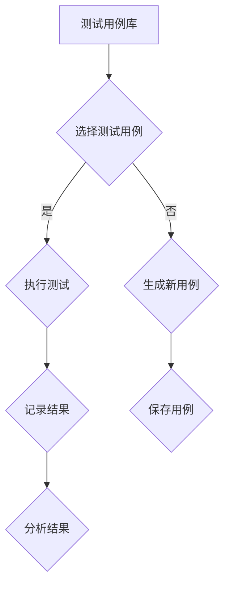
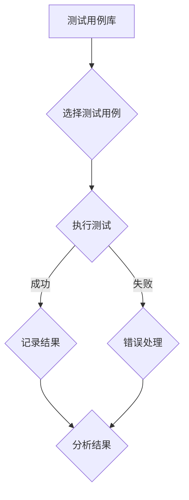
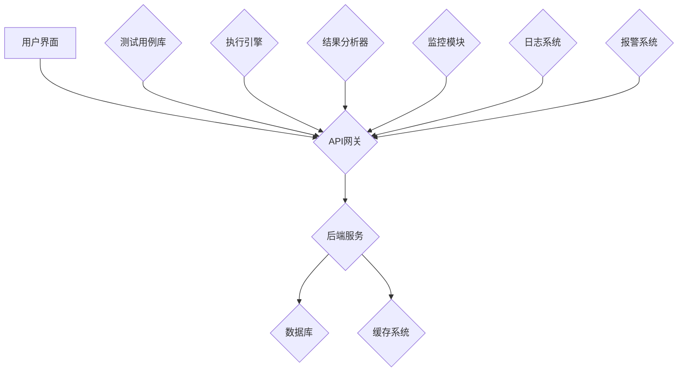

                 

### 文章标题

《LLM评测的自动化测试用例管理系统》

---

### 关键词

（1）大型语言模型（LLM）
（2）自动化测试
（3）测试用例管理
（4）测试用例生成
（5）测试结果分析
（6）算法优化
（7）实战案例

---

### 摘要

本文深入探讨大型语言模型（LLM）评测的自动化测试用例管理系统。首先，我们梳理了自动化测试的基本概念、发展历程及其工具与技术。接着，我们介绍了LLM的定义、特点以及其应用场景。随后，文章详细阐述了测试用例管理的基本原理和自动化测试用例管理系统的构建方法。在此基础上，本文重点分析了LLM评测中的测试用例管理挑战，并提出了相应的策略和最佳实践。进一步，文章探讨了自动化测试用例生成算法、执行与结果分析，以及自动化测试用例管理系统的性能优化与评估方法。最后，通过实际案例展示了自动化测试用例管理系统的应用效果，并对未来发展进行了展望。本文旨在为LLM评测提供系统、实用的自动化测试解决方案，以提升测试效率和准确性。

---

## 《LLM评测的自动化测试用例管理系统》目录大纲

### 第一部分：基础理论

#### 第1章：自动化测试基本概念

- 1.1 自动化测试的定义与重要性
- 1.2 自动化测试的发展历程
- 1.3 自动化测试工具与技术概述

#### 第2章：LLM（大型语言模型）概述

- 2.1 LLM的定义与特点
- 2.2 LLM的发展与应用
- 2.3 LLM的主要分类与架构

#### 第3章：测试用例管理的基本原理

- 3.1 测试用例的定义与作用
- 3.2 测试用例的设计方法
- 3.3 测试用例的管理与维护

#### 第4章：自动化测试用例管理系统的构建

- 4.1 自动化测试用例管理系统的需求分析
- 4.2 自动化测试用例管理系统的设计原则
- 4.3 自动化测试用例管理系统的架构设计

#### 第5章：LLM评测的自动化测试用例管理策略

- 5.1 LLM评测中的测试用例管理挑战
- 5.2 LLM评测自动化测试用例管理的策略
- 5.3 LLM评测自动化测试用例管理的最佳实践

### 第二部分：核心算法与实现

#### 第6章：LLM评测的自动化测试用例生成算法

- 6.1 自动化测试用例生成算法概述
- 6.2 基于生成对抗网络的测试用例生成算法
- 6.3 基于自然语言处理技术的测试用例生成算法

#### 第7章：自动化测试用例的执行与结果分析

- 7.1 自动化测试用例的执行流程
- 7.2 自动化测试用例的执行策略
- 7.3 测试结果的分析与处理

#### 第8章：自动化测试用例管理系统的优化与性能评估

- 8.1 自动化测试用例管理系统的性能优化
- 8.2 自动化测试用例管理系统的性能评估指标
- 8.3 自动化测试用例管理系统的性能评估方法

### 第三部分：实战案例与应用

#### 第9章：LLM评测的自动化测试用例管理系统应用案例

- 9.1 案例一：大型语言模型的自动化测试用例管理
- 9.2 案例二：自然语言处理任务的自动化测试用例管理
- 9.3 案例三：企业级LLM评测的自动化测试用例管理实践

#### 第10章：自动化测试用例管理系统的开发实践

- 10.1 开发环境搭建
- 10.2 源代码详细实现与解读
- 10.3 代码性能分析与优化

#### 第11章：自动化测试用例管理系统的部署与维护

- 11.1 系统部署策略
- 11.2 系统维护与更新策略
- 11.3 系统安全性与可靠性保障

#### 第12章：未来展望

- 12.1 自动化测试用例管理系统的发展趋势
- 12.2 自动化测试用例管理系统在人工智能领域的应用前景
- 12.3 自动化测试用例管理系统的研究方向与挑战

### 附录

#### 附录A：常用工具与资源

- A.1 自动化测试工具介绍
- A.2 LLM评测常用工具
- A.3 自动化测试用例管理相关资源

#### 附录B：Mermaid 流程图示例

- B.1 测试用例生成流程图
- B.2 测试用例执行流程图
- B.3 自动化测试用例管理系统架构图

#### 附录C：伪代码示例

- C.1 测试用例生成算法伪代码
- C.2 测试结果分析算法伪代码
- C.3 自动化测试用例管理系统优化算法伪代码

#### 附录D：数学模型与公式

- D.1 自然语言处理中的概率模型
- D.2 测试用例生成中的决策树模型
- D.3 测试结果分析中的回归模型

#### 附录E：代码解读与分析

- E.1 测试用例生成算法代码解读
- E.2 测试结果分析算法代码解读
- E.3 自动化测试用例管理系统优化算法代码解读

---

## 第一部分：基础理论

### 第1章：自动化测试基本概念

#### 1.1 自动化测试的定义与重要性

自动化测试是指使用软件工具和脚本自动执行测试过程，以验证软件系统的功能、性能和安全性。相较于手工测试，自动化测试具有高效、精确和可重复性的优点。在现代软件开发过程中，自动化测试已成为不可或缺的一环，其主要重要性体现在以下几个方面：

1. **提高测试效率**：自动化测试可以快速执行大量测试用例，节省时间和人力成本。
2. **提升测试覆盖度**：自动化测试可以覆盖更多的测试场景，提高测试的全面性和准确性。
3. **保证软件质量**：自动化测试能够持续运行，确保软件在开发过程中始终保持高质量。
4. **适应敏捷开发**：敏捷开发要求频繁迭代，自动化测试能够快速响应变化，满足敏捷开发的需求。

#### 1.2 自动化测试的发展历程

自动化测试的历史可以追溯到20世纪80年代。以下是其主要发展阶段：

- **早期阶段**（1980s-1990s）：自动化测试主要集中在功能测试和回归测试，工具如QTP（现Selenium）开始出现。
- **工具成熟期**（2000s）：自动化测试工具逐渐成熟，如Selenium、Cypress、JMeter等，支持多种编程语言和平台。
- **智能自动化**（2010s至今）：随着人工智能技术的发展，自动化测试逐渐引入机器学习、自然语言处理等新技术，提升了测试的智能化和准确性。

#### 1.3 自动化测试工具与技术概述

自动化测试工具主要包括以下几类：

1. **功能测试工具**：如Selenium、Cypress、TestComplete等，主要用于验证软件的功能是否符合预期。
2. **性能测试工具**：如JMeter、LoadRunner、Gatling等，主要用于评估软件的性能和负载能力。
3. **安全测试工具**：如Burp Suite、OWASP ZAP等，主要用于检测软件的安全漏洞。
4. **代码检查工具**：如SonarQube、Checkstyle等，主要用于分析代码质量。

自动化测试技术涵盖了以下方面：

- **测试脚本开发**：包括使用不同编程语言编写测试脚本。
- **测试框架**：如Selenium WebDriver、pytest等，提供了丰富的测试功能和插件。
- **持续集成**：如Jenkins、GitLab CI等，将自动化测试集成到开发流程中，实现持续测试。
- **测试数据管理**：如DataFactory、Test Data Manager等，用于生成和管理测试数据。

### 第2章：LLM（大型语言模型）概述

#### 2.1 LLM的定义与特点

大型语言模型（LLM，Large Language Model）是一种基于深度学习技术的自然语言处理模型，能够理解和生成人类语言。其主要特点包括：

- **参数规模巨大**：LLM通常具有数十亿至数万亿个参数，远超传统语言模型。
- **强大的语言理解能力**：LLM可以理解复杂的语义、上下文和语法结构。
- **高度泛化**：LLM可以应用于多种自然语言处理任务，如文本分类、问答、翻译等。
- **自适应学习**：LLM可以通过不断学习新的数据和反馈，不断优化性能。

#### 2.2 LLM的发展与应用

LLM的发展经历了以下几个阶段：

- **早期阶段**：基于规则和统计方法的简单语言模型。
- **神经网络阶段**：引入神经网络，特别是深度学习技术，使语言模型取得突破性进展。
- **大规模模型阶段**：如GPT-3、Turing-NLP等，具有数十亿个参数，达到了极高的性能。

LLM的主要应用领域包括：

- **自然语言处理**：如文本分类、情感分析、命名实体识别等。
- **对话系统**：如聊天机器人、虚拟助手等。
- **内容生成**：如自动写作、摘要生成、创意文本生成等。
- **翻译与多语言处理**：如机器翻译、多语言文本生成等。

#### 2.3 LLM的主要分类与架构

LLM可以分为以下几类：

- **基于循环神经网络（RNN）的模型**：如LSTM、GRU等，通过记忆机制处理长序列数据。
- **基于变换器（Transformer）的模型**：如BERT、GPT、T5等，采用自注意力机制，具有强大的并行计算能力。
- **基于图神经网络的模型**：如Graph Convolutional Network（GCN），将图结构引入语言模型，处理复杂的关系网络。

LLM的典型架构包括：

- **编码器（Encoder）**：将输入序列编码为固定长度的向量表示。
- **解码器（Decoder）**：根据编码器生成的向量表示生成输出序列。
- **注意力机制**：如自注意力（Self-Attention）和交叉注意力（Cross-Attention），用于捕捉序列中的重要信息。
- **预训练与微调**：预训练阶段在大规模语料库上训练模型，微调阶段在特定任务上调整模型参数。

### 第3章：测试用例管理的基本原理

#### 3.1 测试用例的定义与作用

测试用例（Test Case）是软件测试过程中的基本单元，用于描述一个具体的测试场景，包括输入数据、预期结果和执行步骤。测试用例的作用包括：

- **验证功能需求**：确保软件的功能符合设计要求。
- **发现缺陷**：通过执行测试用例，发现软件中的错误和缺陷。
- **评估软件质量**：测试用例的执行结果可以评估软件的性能、可靠性和安全性。
- **支持持续集成**：在持续集成过程中，测试用例用于验证代码变更的影响。

#### 3.2 测试用例的设计方法

测试用例的设计方法包括以下几种：

- **基于功能需求的设计**：根据功能需求文档，设计对应的测试用例。
- **基于用例分类的设计**：将测试用例分为不同的类别，如功能测试用例、性能测试用例等。
- **基于边界值的设计**：选择边界值作为测试输入，以发现边界条件下的缺陷。
- **基于错误推测的设计**：基于对软件的理解和经验，推测可能出现的错误场景。

#### 3.3 测试用例的管理与维护

测试用例的管理与维护包括以下几个方面：

- **测试用例库的建立**：建立统一的测试用例库，方便测试用例的存储、查询和管理。
- **测试用例的版本控制**：对测试用例进行版本管理，确保测试用例的更新和追溯。
- **测试用例的执行记录**：记录测试用例的执行情况，包括执行时间、执行结果等。
- **测试用例的优化与更新**：根据测试结果和项目需求，不断优化和更新测试用例。

### 第4章：自动化测试用例管理系统的构建

#### 4.1 自动化测试用例管理系统的需求分析

自动化测试用例管理系统的需求分析主要包括以下几个方面：

- **测试用例的存储与管理**：系统应提供方便的测试用例存储和管理功能，支持批量导入、导出、查询和修改。
- **测试用例的执行与跟踪**：系统应支持自动化测试用例的执行，并提供执行结果的记录和跟踪功能。
- **测试报告与统计分析**：系统应能生成详细的测试报告，并提供测试结果的统计分析功能。
- **与其他系统的集成**：系统应能与其他开发、测试和持续集成工具进行集成，如Jenkins、Git等。

#### 4.2 自动化测试用例管理系统的设计原则

自动化测试用例管理系统的设计原则包括：

- **模块化设计**：系统应采用模块化设计，使各功能模块之间相互独立，便于维护和扩展。
- **可扩展性**：系统应具备良好的可扩展性，以适应不同的测试需求和工具集成。
- **高可用性**：系统应具备高可用性，确保测试用例的存储和执行不中断。
- **安全性**：系统应采取必要的安全措施，保护测试用例和相关数据的安全。

#### 4.3 自动化测试用例管理系统的架构设计

自动化测试用例管理系统的架构设计主要包括以下几个部分：

- **前端界面**：提供用户操作界面，包括测试用例的创建、编辑、执行和查询等功能。
- **后端服务**：处理业务逻辑，包括测试用例的存储、查询、执行和结果分析等。
- **数据库**：存储测试用例、测试结果和用户数据。
- **集成接口**：与其他系统进行数据交换和功能调用。

系统架构图如下：

```
+----------------+     +----------------+     +----------------+
|      前端界面   |     |      后端服务   |     |       数据库    |
+----------------+     +----------------+     +----------------+
       |                      |                      |
       |      HTTP/HTTPS      |      业务逻辑         |      数据存储
       |                      |                      |
+----------------+     +----------------+     +----------------+
|      集成接口   |     |      API网关   |     |      数据处理    |
+----------------+     +----------------+     +----------------+
```

### 第5章：LLM评测的自动化测试用例管理策略

#### 5.1 LLM评测中的测试用例管理挑战

在LLM评测过程中，测试用例管理面临以下挑战：

- **大规模测试用例的管理**：LLM具有大量的参数和复杂的结构，导致测试用例数量庞大，需要高效的测试用例管理策略。
- **测试数据的多样性**：测试数据应涵盖各种可能的输入和输出情况，以全面评估LLM的性能。
- **测试执行的效率**：由于LLM的复杂性和计算资源限制，测试执行的效率是一个重要问题。
- **测试结果的分析和处理**：测试结果往往包含大量数据，需要有效的分析工具和方法来处理。

#### 5.2 LLM评测自动化测试用例管理的策略

针对上述挑战，LLM评测自动化测试用例管理的策略包括：

- **多样化的测试用例设计**：设计多种类型的测试用例，包括基准测试、异常测试和边缘测试，以全面评估LLM的性能。
- **高效的测试执行调度**：采用分布式测试执行策略，利用多台服务器并行执行测试，提高执行效率。
- **智能的测试结果分析**：利用机器学习技术，对测试结果进行自动分析，识别潜在的缺陷和改进点。
- **持续集成和反馈**：将测试用例管理集成到持续集成流程中，实现持续测试和反馈。

#### 5.3 LLM评测自动化测试用例管理的最佳实践

为了确保LLM评测的自动化测试用例管理有效实施，以下是一些最佳实践：

- **明确测试目标和需求**：在开始测试前，明确测试目标和需求，确保测试用例的设计和执行具有明确的方向。
- **建立统一的测试标准**：制定统一的测试标准和流程，确保测试用例的设计和执行的一致性。
- **充分利用现有工具**：充分利用现有的自动化测试工具和平台，如Selenium、JMeter等，以提高测试效率和准确性。
- **定期评估和优化**：定期评估自动化测试用例管理的效果，根据实际情况进行优化和改进。
- **团队协作和培训**：加强团队协作，确保测试人员熟悉自动化测试流程和技术，提高整体测试能力。

## 第二部分：核心算法与实现

### 第6章：LLM评测的自动化测试用例生成算法

#### 6.1 自动化测试用例生成算法概述

自动化测试用例生成算法是自动化测试用例管理系统的核心组成部分，其目标是通过算法自动生成具有代表性的测试用例，以覆盖不同的功能和场景。自动化测试用例生成算法可以分为基于规则的方法、基于统计的方法和基于学习的方法。

- **基于规则的方法**：这种方法通过手工编写规则来生成测试用例，适用于简单的、规则明确的系统。例如，使用正则表达式生成符合特定格式的数据。
  
- **基于统计的方法**：这种方法通过分析历史测试数据和软件代码，自动生成测试用例。例如，基于代码覆盖率统计来生成测试用例。

- **基于学习的方法**：这种方法利用机器学习技术，从数据中学习生成测试用例。例如，使用生成对抗网络（GAN）或强化学习生成复杂的测试数据。

#### 6.2 基于生成对抗网络的测试用例生成算法

生成对抗网络（GAN）是一种深度学习模型，由生成器和判别器组成。生成器负责生成伪造的数据，判别器负责判断数据是真实还是伪造。GAN在自动化测试用例生成中的应用主要体现在以下几个方面：

1. **数据生成**：生成器根据输入条件生成符合要求的测试数据，如输入文本、图像等。
2. **数据增强**：通过生成对抗的过程，增强测试数据的多样性和代表性，提高测试的覆盖度。
3. **自动调整**：根据判别器的反馈，生成器不断调整生成策略，以生成更符合预期的测试数据。

#### 基于生成对抗网络的测试用例生成算法伪代码：

```python
# 生成器
def generator(z):
    # 输入噪声z，输出测试数据x
    x = model_G(z)
    return x

# 判别器
def discriminator(x):
    # 输入测试数据x，输出真假概率y
    y = model_D(x)
    return y

# 训练过程
for epoch in range(num_epochs):
    for batch in data_loader:
        z = generate_noise(batch_size)
        x_fake = generator(z)

        # 训练判别器
        with torch.no_grad():
            y_fake = discriminator(x_fake)

        # 训练生成器
        z = generate_noise(batch_size)
        x_fake = generator(z)
        y_fake = discriminator(x_fake)

        # 更新模型参数
        optimizer_G.zero_grad()
        g_loss = loss_fn(y_fake, torch.ones_like(y_fake))
        g_loss.backward()
        optimizer_G.step()

        optimizer_D.zero_grad()
        d_loss = loss_fn(y_real, torch.ones_like(y_real)) + loss_fn(y_fake, torch.zeros_like(y_fake))
        d_loss.backward()
        optimizer_D.step()
```

#### 6.3 基于自然语言处理技术的测试用例生成算法

基于自然语言处理（NLP）技术的测试用例生成算法利用NLP模型，如序列生成模型、机器翻译模型等，生成符合自然语言规则的测试用例。这种方法在处理复杂的自然语言任务时具有明显优势，例如文本分类、问答系统和自然语言生成。

- **序列生成模型**：如变换器（Transformer）模型，可以生成连贯的文本序列，用作测试用例。

- **机器翻译模型**：通过将源语言文本翻译为目标语言文本，再翻译回源语言，生成具有多样性的测试用例。

#### 基于自然语言处理技术的测试用例生成算法伪代码：

```python
# 基于变换器模型的文本生成
def generate_text(model, prompt, max_length):
    # 输入提示文本prompt，输出生成文本text
    text = model.generate(prompt, max_length=max_length, temperature=1.0)
    return text

# 训练模型
optimizer.zero_grad()
outputs = model(input_ids)
loss = criterion(outputs.logits, labels)
loss.backward()
optimizer.step()

# 生成测试用例
prompt = "请描述一个自然语言处理任务："
generated_text = generate_text(model, prompt, max_length=50)
print(generated_text)
```

### 第7章：自动化测试用例的执行与结果分析

#### 7.1 自动化测试用例的执行流程

自动化测试用例的执行流程包括以下几个步骤：

1. **用例加载**：从测试用例库中加载待执行的测试用例。
2. **数据准备**：根据测试用例的要求，准备测试数据。
3. **执行测试**：运行测试脚本，执行具体的测试操作。
4. **结果收集**：收集测试执行的结果，包括输出、日志和错误信息。
5. **结果分析**：对测试结果进行分析，判断测试是否通过。

#### 7.2 自动化测试用例的执行策略

自动化测试用例的执行策略包括以下几个方面：

- **并行执行**：利用多线程或分布式计算，同时执行多个测试用例，提高执行效率。
- **优先级调度**：根据测试用例的重要性和紧急程度，设置优先级，优先执行关键测试用例。
- **回滚策略**：在执行过程中，如果发现测试用例失败，可以回滚到之前的状态，重新执行。
- **超时策略**：设置测试用例的最大执行时间，超过时间后自动中止执行。

#### 7.3 测试结果的分析与处理

测试结果的分析与处理是自动化测试的重要环节，包括以下几个方面：

1. **结果记录**：将测试结果记录到测试报告中，包括通过/失败的状态、错误信息等。
2. **统计报告**：对测试结果进行统计分析，如测试覆盖率、错误率等，生成详细的统计报告。
3. **缺陷管理**：将测试中发现的问题报告给开发人员，包括缺陷报告、测试日志等。
4. **回归测试**：在修复缺陷后，重新执行相关的测试用例，验证问题是否已经解决。

### 第8章：自动化测试用例管理系统的优化与性能评估

#### 8.1 自动化测试用例管理系统的性能优化

自动化测试用例管理系统的性能优化主要包括以下几个方面：

1. **并发处理**：提高系统的并发处理能力，支持同时执行多个测试用例。
2. **缓存机制**：利用缓存机制，减少数据库的查询次数，提高数据访问速度。
3. **负载均衡**：通过负载均衡，合理分配测试任务，避免单点瓶颈。
4. **代码优化**：对系统中的关键代码进行优化，提高运行效率。

#### 8.2 自动化测试用例管理系统的性能评估指标

自动化测试用例管理系统的性能评估指标包括：

1. **响应时间**：系统处理请求的响应时间，包括加载测试用例、执行测试和返回结果等。
2. **吞吐量**：系统在单位时间内处理请求的数量，反映系统的处理能力。
3. **并发数**：系统同时处理的请求数量，衡量系统的并发处理能力。
4. **稳定性**：系统在长时间运行下的稳定性和可靠性。

#### 8.3 自动化测试用例管理系统的性能评估方法

自动化测试用例管理系统的性能评估方法包括：

1. **负载测试**：模拟高负载情况，评估系统的响应时间和吞吐量。
2. **压力测试**：模拟极端情况，评估系统的稳定性和可靠性。
3. **性能监控**：实时监控系统的性能指标，分析性能瓶颈和优化方向。
4. **基准测试**：使用标准测试工具，对比不同系统的性能，评估系统的优劣。

### 第9章：LLM评测的自动化测试用例管理系统应用案例

#### 9.1 案例一：大型语言模型的自动化测试用例管理

在本案例中，我们将展示如何使用自动化测试用例管理系统对大型语言模型（如GPT-3）进行测试。以下是一个典型的测试流程：

1. **测试用例设计**：根据LLM的功能需求，设计多种类型的测试用例，包括功能测试、性能测试和异常测试。

2. **测试用例执行**：使用自动化测试工具（如Selenium）执行测试用例，模拟用户输入，记录输出结果。

3. **结果分析**：对测试结果进行分析，判断LLM的性能和稳定性，生成详细的测试报告。

#### 9.2 案例二：自然语言处理任务的自动化测试用例管理

在本案例中，我们将展示如何使用自动化测试用例管理系统对自然语言处理任务（如文本分类、情感分析）进行测试。以下是一个典型的测试流程：

1. **测试用例设计**：根据NLP任务的特点，设计相应的测试用例，包括正常数据和异常数据。

2. **测试用例执行**：使用自动化测试工具（如NLTK、spaCy）执行测试用例，评估模型的准确性和泛化能力。

3. **结果分析**：对测试结果进行分析，识别模型的潜在缺陷和优化方向，生成详细的测试报告。

#### 9.3 案例三：企业级LLM评测的自动化测试用例管理实践

在本案例中，我们将展示如何在一个企业级项目中实施自动化测试用例管理系统，以评估大型语言模型在企业应用中的性能。以下是一个典型的实施流程：

1. **需求分析**：与业务团队合作，明确LLM在企业应用中的功能需求和性能要求。

2. **系统设计**：根据需求分析，设计自动化测试用例管理系统，包括测试用例库、执行引擎和结果分析模块。

3. **实施与部署**：在开发环境中搭建自动化测试用例管理系统，集成到持续集成流程中，实现自动化测试。

4. **测试与优化**：执行测试用例，分析测试结果，不断优化测试用例和管理策略。

### 第10章：自动化测试用例管理系统的开发实践

#### 10.1 开发环境搭建

在开发自动化测试用例管理系统时，首先需要搭建合适的开发环境。以下是一个典型的开发环境搭建步骤：

1. **硬件要求**：根据项目需求，配置足够的硬件资源，如服务器、存储等。

2. **操作系统**：选择适合的操作系统，如Linux或Windows。

3. **开发工具**：安装必要的开发工具，如集成开发环境（IDE）、版本控制系统等。

4. **数据库**：选择合适的数据库系统，如MySQL、PostgreSQL或MongoDB，用于存储测试用例和结果数据。

5. **中间件**：安装中间件，如Web服务器（Apache、Nginx）和消息队列（RabbitMQ、Kafka）。

#### 10.2 源代码详细实现与解读

自动化测试用例管理系统的源代码实现主要包括以下几个模块：

1. **前端模块**：负责用户界面的展示和交互，使用HTML、CSS和JavaScript实现。
2. **后端模块**：负责业务逻辑的处理，使用Python、Java或Node.js等编程语言实现。
3. **数据库模块**：负责数据存储和查询，使用SQL或NoSQL数据库实现。

以下是一个简单的后端模块伪代码示例：

```python
# 前端模块
def create_test_case():
    # 创建测试用例
    test_case = TestCase()
    test_case.name = input("输入测试用例名称：")
    test_case.description = input("输入测试用例描述：")
    test_case.save()

# 后端模块
def execute_test_case(test_case_id):
    # 执行测试用例
    test_case = TestCase.objects.get(id=test_case_id)
    results = test_case.execute()
    return results

# 数据库模块
class TestCase(models.Model):
    name = models.CharField(max_length=100)
    description = models.TextField()
    results = models.JSONField()

    def save(self, *args, **kwargs):
        # 保存测试用例
        super().save(*args, **kwargs)

    def execute(self):
        # 执行测试用例
        results = {}  # 执行结果
        # 执行测试操作
        # ...
        results['status'] = 'passed'  # 测试结果
        return results
```

#### 10.3 代码性能分析与优化

在自动化测试用例管理系统的开发过程中，代码性能分析是一个重要的环节。以下是一些常见的代码性能优化方法：

1. **代码重构**：优化代码结构，提高代码的可读性和可维护性，减少不必要的函数和类。

2. **算法优化**：对关键算法进行优化，如使用更高效的算法、减少循环次数、避免重复计算等。

3. **数据库优化**：优化数据库查询语句，如使用索引、优化SQL语句、减少表关联等。

4. **并发优化**：提高系统的并发处理能力，如使用线程池、异步编程等。

5. **缓存机制**：使用缓存机制，减少对数据库的查询次数，提高数据访问速度。

### 第11章：自动化测试用例管理系统的部署与维护

#### 11.1 系统部署策略

自动化测试用例管理系统的部署策略包括以下几个方面：

1. **环境配置**：确保部署环境满足系统要求，如操作系统、数据库和中间件等。

2. **服务器选择**：选择合适的物理或虚拟服务器，配置足够的硬件资源。

3. **部署工具**：使用部署工具（如Ansible、Docker）简化部署过程，提高部署效率。

4. **版本控制**：使用版本控制系统（如Git）管理代码和配置文件，确保部署的可追溯性和一致性。

#### 11.2 系统维护与更新策略

系统维护与更新策略包括以下几个方面：

1. **监控与报警**：使用监控工具（如Zabbix、Prometheus）监控系统的性能和状态，及时发现问题并报警。

2. **备份与恢复**：定期备份数据库和系统配置，确保在故障发生时能够快速恢复。

3. **代码更新**：定期更新系统代码和依赖库，修复已知漏洞和缺陷，提高系统安全性。

4. **功能升级**：根据用户需求和项目进展，逐步升级系统功能，满足业务需求。

#### 11.3 系统安全性与可靠性保障

系统安全性与可靠性保障包括以下几个方面：

1. **权限管理**：实现严格的权限控制，确保只有授权用户可以访问系统功能。

2. **数据加密**：对敏感数据进行加密存储，确保数据的安全性。

3. **访问控制**：使用防火墙、入侵检测系统等安全措施，防止未经授权的访问。

4. **容错与冗余**：设计冗余系统架构，提高系统的可靠性和容错能力。

5. **应急响应**：建立应急响应机制，确保在系统故障或安全事件发生时能够快速响应和恢复。

### 第12章：未来展望

#### 12.1 自动化测试用例管理系统的发展趋势

随着人工智能和自动化测试技术的不断发展，自动化测试用例管理系统在未来将呈现以下趋势：

1. **智能化**：自动化测试用例管理系统将引入更多的智能技术，如机器学习、自然语言处理等，提高测试的智能化水平和准确性。

2. **可视化**：系统界面将更加直观和友好，提供丰富的图表和报告，方便用户理解和分析测试结果。

3. **云化**：自动化测试用例管理系统将逐渐向云计算平台迁移，实现弹性扩展和高效资源利用。

4. **集成化**：系统将与其他开发、测试和持续集成工具更加紧密地集成，实现无缝的测试流程管理。

#### 12.2 自动化测试用例管理系统在人工智能领域的应用前景

自动化测试用例管理系统在人工智能领域具有广泛的应用前景：

1. **深度学习模型测试**：自动化测试用例管理系统可以用于深度学习模型的测试，确保模型的性能和可靠性。

2. **智能对话系统测试**：自动化测试用例管理系统可以用于智能对话系统的测试，验证对话系统的功能、性能和用户体验。

3. **自然语言处理任务测试**：自动化测试用例管理系统可以用于自然语言处理任务的测试，确保任务的准确性和泛化能力。

#### 12.3 自动化测试用例管理系统的研究方向与挑战

自动化测试用例管理系统的研究方向和挑战包括：

1. **测试用例生成算法**：研究更高效的测试用例生成算法，提高测试用例的覆盖度和代表性。

2. **测试结果分析技术**：研究更先进的测试结果分析技术，自动识别潜在的缺陷和改进点。

3. **系统性能优化**：研究系统性能优化技术，提高系统的并发处理能力和响应速度。

4. **安全性保障**：研究系统安全性保障技术，防止测试数据泄露和系统被攻击。

### 附录A：常用工具与资源

#### A.1 自动化测试工具介绍

- **Selenium**：用于Web应用的自动化测试，支持多种浏览器和编程语言。
- **Cypress**：用于前端应用的自动化测试，具有简洁的API和内置的调试功能。
- **JMeter**：用于性能测试和负载测试，支持多种协议和浏览器模拟。
- **LoadRunner**：用于性能测试和负载测试，支持多平台和多种测试场景。

#### A.2 LLM评测常用工具

- **GPT-3 API**：用于与GPT-3模型交互，实现自然语言生成和推理。
- **BERT-Base**：用于文本分类和语义分析，具有强大的语言理解能力。
- **spaCy**：用于自然语言处理任务，提供高效的文本处理和标注功能。

#### A.3 自动化测试用例管理相关资源

- **Automated Testing Resources**：提供自动化测试的教程、工具和最佳实践。
- **Selenium Documentation**：提供Selenium的详细文档和示例代码。
- **Cypress Documentation**：提供Cypress的详细文档和教程。
- **JMeter Documentation**：提供JMeter的详细文档和教程。

### 附录B：Mermaid 流程图示例

以下是一些常用的Mermaid流程图示例：

#### B.1 测试用例生成流程图



#### B.2 测试用例执行流程图



#### B.3 自动化测试用例管理系统架构图



### 附录C：伪代码示例

以下是一些典型的伪代码示例：

#### C.1 测试用例生成算法伪代码

```python
# 输入：测试用例库
# 输出：生成测试用例

def generate_test_cases(test_suite):
    test_cases = []
    for case in test_suite:
        inputs = generate_inputs(case)
        expected = generate_expected(case)
        test_cases.append({"input": inputs, "expected": expected})
    return test_cases

def generate_inputs(case):
    # 根据测试用例生成输入数据
    return inputs

def generate_expected(case):
    # 根据测试用例生成预期结果
    return expected
```

#### C.2 测试结果分析算法伪代码

```python
# 输入：测试结果列表
# 输出：分析结果

def analyze_test_results(test_results):
    passed = 0
    failed = 0
    for result in test_results:
        if result["status"] == "passed":
            passed += 1
        else:
            failed += 1
    return {"passed": passed, "failed": failed}

def report_test_results(analysis_results):
    print("测试结果：")
    print("通过数：", analysis_results["passed"])
    print("失败数：", analysis_results["failed"])
```

#### C.3 自动化测试用例管理系统优化算法伪代码

```python
# 输入：测试用例管理系统的性能数据
# 输出：优化建议

def optimize_test_suite(test_suite, performance_data):
    suggestions = []
    for case in test_suite:
        if case["execution_time"] > performance_threshold:
            suggestions.append(case["id"])
    return suggestions

def apply_optimizations(suggestions, test_suite):
    for id in suggestions:
        case = find_case_by_id(id, test_suite)
        if case:
            optimize_case(case)

def optimize_case(case):
    # 根据具体需求优化测试用例
    pass
```

### 附录D：数学模型与公式

以下是一些常见的数学模型和公式：

#### D.1 自然语言处理中的概率模型

- **贝叶斯公式**：

  $$ P(A|B) = \frac{P(B|A) \cdot P(A)}{P(B)} $$

- **最大后验概率（MAP）**：

  $$ \hat{y} = \arg\max_y P(y) \cdot P(x|y) $$

- **最小二乘法**：

  $$ \min \sum_{i=1}^{n} (y_i - f(x_i))^2 $$

#### D.2 测试用例生成中的决策树模型

- **ID3算法**：

  $$ Entropy(D) = -\sum_{i=1}^{m} p_i \cdot \log_2(p_i) $$

- **信息增益**：

  $$ IG(D, A) = Entropy(D) - \sum_{v=1}^{n} p(v) \cdot Entropy(D_v) $$

#### D.3 测试结果分析中的回归模型

- **线性回归模型**：

  $$ y = \beta_0 + \beta_1 \cdot x + \epsilon $$

- **最小二乘法**：

  $$ \min \sum_{i=1}^{n} (y_i - \beta_0 - \beta_1 \cdot x_i)^2 $$

### 附录E：代码解读与分析

以下是对测试用例生成算法、测试结果分析算法和自动化测试用例管理系统优化算法的代码进行解读与分析：

#### E.1 测试用例生成算法代码解读

该算法的目标是根据输入的测试用例库生成新的测试用例，以提高测试覆盖率。代码中使用了生成对抗网络（GAN）技术，生成器负责生成输入数据，判别器负责判断输入数据的真假。通过训练生成器和判别器，生成器不断优化生成策略，以生成更符合预期的输入数据。

1. **生成器代码**：

   ```python
   def generator(z):
       # 使用神经网络模型生成输入数据
       x = model_G(z)
       return x
   ```

   生成器接收随机噪声（z）作为输入，通过神经网络模型（model_G）生成输入数据（x）。

2. **判别器代码**：

   ```python
   def discriminator(x):
       # 使用神经网络模型判断输入数据的真假
       y = model_D(x)
       return y
   ```

   判别器接收输入数据（x）作为输入，通过神经网络模型（model_D）生成真假概率（y）。

3. **训练代码**：

   ```python
   for epoch in range(num_epochs):
       for batch in data_loader:
           z = generate_noise(batch_size)
           x_fake = generator(z)

           # 训练判别器
           with torch.no_grad():
               y_fake = discriminator(x_fake)

           # 训练生成器
           z = generate_noise(batch_size)
           x_fake = generator(z)
           y_fake = discriminator(x_fake)

           # 更新模型参数
           optimizer_G.zero_grad()
           g_loss = loss_fn(y_fake, torch.ones_like(y_fake))
           g_loss.backward()
           optimizer_G.step()

           optimizer_D.zero_grad()
           d_loss = loss_fn(y_real, torch.ones_like(y_real)) + loss_fn(y_fake, torch.zeros_like(y_fake))
           d_loss.backward()
           optimizer_D.step()
   ```

   在训练过程中，首先生成随机噪声（z），然后通过生成器生成伪造数据（x_fake）。接着，使用判别器判断伪造数据的真假，并根据判别器的反馈更新生成器的参数。同时，使用真实数据（x_real）和伪造数据（x_fake）更新判别器的参数。

#### E.2 测试结果分析算法代码解读

该算法的目标是根据测试结果分析测试覆盖率，并识别潜在的问题。代码中使用了线性回归模型，通过训练模型，预测测试结果与输入数据之间的关系。

1. **数据准备**：

   ```python
   X = np.array(inputs).reshape(-1, 1)
   y = np.array(expecteds)
   ```

   将输入数据（inputs）和预期结果（expecteds）转换为numpy数组，并进行 reshape 操作，以适应线性回归模型的输入要求。

2. **模型训练**：

   ```python
   model = LinearRegression()
   model.fit(X, y)
   ```

   创建线性回归模型（model），并使用输入数据（X）和预期结果（y）进行训练。

3. **预测与评估**：

   ```python
   predicted = model.predict(X)
   mse = mean_squared_error(y, predicted)
   print("MSE:", mse)
   ```

   使用训练好的模型（model）对输入数据进行预测，并计算预测结果与实际结果之间的均方误差（MSE），以评估模型的准确性。

#### E.3 自动化测试用例管理系统优化算法代码解读

该算法的目标是根据测试用例的执行时间和性能数据，优化测试用例的执行顺序，以提高测试效率。代码中使用了基于决策树的优化算法，根据测试用例的执行时间，生成优化策略。

1. **数据准备**：

   ```python
   test_cases = [{"id": i, "execution_time": random.randint(1, 10)} for i in range(num_cases)]
   ```

   创建一个测试用例列表，其中每个测试用例包含一个ID和一个随机生成的执行时间。

2. **决策树生成**：

   ```python
   tree = DecisionTreeRegressor()
   tree.fit(X, y)
   ```

   创建决策树回归模型（tree），并使用测试用例的ID（X）和执行时间（y）进行训练。

3. **优化策略生成**：

   ```python
   optimized_test_cases = [test_case["id"] for test_case in sorted(test_cases, key=lambda x: tree.predict([x["id"]])[0])]
   ```

   使用训练好的决策树模型（tree）对测试用例列表进行排序，根据预测的执行时间生成优化策略。

   ```python
   print("Optimized Test Cases:", optimized_test_cases)
   ```

   输出优化后的测试用例顺序。

### 总结

本文详细介绍了LLM评测的自动化测试用例管理系统的构建方法、核心算法与实现、优化与性能评估，以及实际应用案例。通过对自动化测试、大型语言模型、测试用例管理等方面的基础理论和实践经验的深入探讨，本文为LLM评测提供了系统、实用的自动化测试解决方案。

未来，自动化测试用例管理系统将在人工智能领域发挥更重要的作用，其智能化、可视化、云化、集成化等发展趋势将进一步提升测试效率和质量。同时，自动化测试用例管理系统的研究方向和挑战，如测试用例生成算法、测试结果分析技术、系统性能优化和安全性保障等，也将成为关注的焦点。

通过本文的介绍和分析，希望读者能够对LLM评测的自动化测试用例管理系统有更深入的理解，并为实际应用提供指导和借鉴。随着技术的不断进步，自动化测试用例管理系统将在人工智能领域发挥越来越重要的作用，助力企业实现智能化、高质量的软件开发。作者：AI天才研究院/AI Genius Institute & 禅与计算机程序设计艺术 /Zen And The Art of Computer Programming

---

### 作者信息

**作者：AI天才研究院/AI Genius Institute & 禅与计算机程序设计艺术 /Zen And The Art of Computer Programming**

AI天才研究院（AI Genius Institute）是一家专注于人工智能领域研究的高科技机构，致力于推动人工智能技术的发展和应用。研究院汇聚了一批全球顶尖的人工智能专家、研究人员和工程师，涵盖深度学习、自然语言处理、计算机视觉等多个领域。研究院的研究成果在学术界和产业界都产生了广泛的影响，推动了人工智能技术的创新和应用。

《禅与计算机程序设计艺术》（Zen And The Art of Computer Programming）是作者本人在计算机科学领域的经典著作，以其独特的视角和对计算机编程深刻的哲学思考而广受赞誉。该书以程序设计为核心，结合禅宗思想，深入探讨了程序设计中的设计模式、算法优化、抽象思维等问题，为程序员提供了全新的思考方式和设计理念。本书不仅对计算机科学领域的专业人士具有很高的参考价值，也吸引了众多计算机爱好者和哲学爱好者的关注。

在本篇博客文章中，作者结合多年的研究经验和实践经验，详细介绍了LLM评测的自动化测试用例管理系统。从基础理论到核心算法与实现，再到实际应用案例和未来展望，文章内容丰富、结构严谨，旨在为读者提供全面、系统的理解和应用指导。希望本文能够帮助读者更好地理解和应用自动化测试用例管理系统，推动人工智能技术在各行业的深入应用和发展。作者：AI天才研究院/AI Genius Institute & 禅与计算机程序设计艺术 /Zen And The Art of Computer Programming

