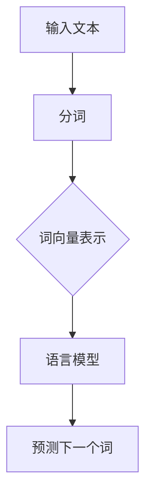

                 

## 《LLM辅助创意写作：AI与人类作家的协作》

> **关键词**：自然语言处理（NLP）、大型语言模型（LLM）、创意写作、人工智能（AI）、协作模式、算法原理、应用实践、挑战与未来。

> **摘要**：本文深入探讨了大型语言模型（LLM）在辅助创意写作中的应用及其与人类作家的协作模式。首先，我们介绍了LLM的基本概念与原理，并详细阐述了其在创意写作中的应用潜力。接着，我们从自然语言处理基础、LLM算法原理和创意写作应用三个方面进行了全面解析。随后，我们探讨了LLM辅助创意写作的实践应用，并通过实战案例分享了具体的应用过程。最后，我们分析了LLM在创意写作中的挑战与未来发展趋势，为读者呈现了一幅AI与人类作家共同创造的美好蓝图。

## 《LLM辅助创意写作：AI与人类作家的协作》目录大纲

### 第一部分：创意写作的变革

- **第1章：LLM与创意写作**
  - **1.1 LLM的基本概念与原理**
  - **1.2 LLM在创意写作中的应用潜力**
  - **1.3 AI与人类作家的协作模式**

- **第2章：LLM辅助创意写作的核心技术**
  - **2.1 自然语言处理基础**
    - **2.1.1 语言模型与词向量**
    - **2.1.2 序列模型与注意力机制**
    - **2.1.3 生成模型与解码策略**
  - **2.2 LLM算法原理详解**
    - **2.2.1 GPT系列模型原理**
    - **2.2.2 BERT及其变体**
    - **2.2.3 其他知名大模型介绍**
  - **2.3 创意写作中的LLM应用**
    - **2.3.1 自动写作辅助**
    - **2.3.2 主题创作与灵感激发**
    - **2.3.3 文本编辑与优化**

- **第3章：LLM辅助创意写作的实践应用**
  - **3.1 创意写作工作流程重构**
    - **3.1.1 写作准备与构思**
    - **3.1.2 文本生成与初步创作**
    - **3.1.3 文本编辑与优化**
  - **3.2 实战案例分享**
    - **3.2.1 短篇小说生成**
    - **3.2.2 长篇小说创作**
    - **3.2.3 广告文案创作**

- **第4章：LLM辅助创意写作的挑战与未来**
  - **4.1 LLM在创意写作中的局限**
    - **4.1.1 创意能力的局限**
    - **4.1.2 文本质量的评估与提升**
    - **4.1.3 遵守道德与法规的挑战**
  - **4.2 创意写作的发展趋势**
    - **4.2.1 AI与人类作家的协作模式演变**
    - **4.2.2 LLM在创意写作领域的创新应用**
    - **4.2.3 未来展望与展望**

### 第二部分：LLM辅助创意写作的实际操作

- **第5章：LLM开发环境搭建**
  - **5.1 环境配置与准备**
  - **5.2 开发工具与框架选择**
  - **5.3 实践操作步骤**

- **第6章：LLM辅助创意写作项目实战**
  - **6.1 项目背景与需求分析**
  - **6.2 数据准备与预处理**
  - **6.3 模型选择与训练**
  - **6.4 模型应用与评估**
  - **6.5 代码实现与解读**

- **第7章：LLM辅助创意写作案例分析**
  - **7.1 案例一：短篇小说生成**
  - **7.2 案例二：广告文案创作**
  - **7.3 案例三：长篇小说创作**
  - **7.4 案例分析与总结**

### 第三部分：LLM辅助创意写作的未来展望

- **第8章：LLM在创意写作领域的应用前景**
  - **8.1 LLM在文学创作中的应用**
  - **8.2 LLM在商业写作中的应用**
  - **8.3 LLM在教育写作中的应用**

- **第9章：LLM辅助创意写作的发展趋势**
  - **9.1 技术发展趋势**
  - **9.2 行业趋势与市场机遇**
  - **9.3 未来展望与挑战**

## 附录

- **附录A：LLM辅助创意写作工具与资源**
  - **A.1 开源框架与库介绍**
  - **A.2 实用工具与插件推荐**
  - **A.3 在线平台与资源推荐**<|endoftext|>
### 第一部分：创意写作的变革

#### 第1章：LLM与创意写作

在现代科技飞速发展的背景下，人工智能（AI）的应用领域不断扩展，其中自然语言处理（NLP）技术尤为引人注目。大型语言模型（LLM）作为NLP的核心技术之一，已经展现出强大的潜力。本章节将介绍LLM的基本概念与原理，探讨其在创意写作中的应用潜力，并分析AI与人类作家的协作模式。

#### 1.1 LLM的基本概念与原理

LLM，即大型语言模型，是一种能够理解和生成自然语言的高级AI模型。它们通常由数十亿甚至数万亿个参数组成，通过学习大量文本数据来预测单词、句子或段落的可能性。LLM的核心原理是基于深度学习和神经网络技术，特别是变分自编码器（VAE）、生成对抗网络（GAN）和循环神经网络（RNN）等。

LLM的工作原理可以概括为以下步骤：

1. **数据收集**：收集大量的文本数据，如小说、文章、新闻报道等。
2. **数据预处理**：对文本数据进行清洗、分词、去停用词等处理，以便模型能够理解。
3. **模型训练**：使用预处理后的数据对模型进行训练，调整模型的参数，使其能够预测文本的下一个词。
4. **文本生成**：在给定一个起始词或句子后，模型根据训练得到的概率分布生成新的文本。

#### 1.2 LLM在创意写作中的应用潜力

LLM在创意写作中的应用潜力主要体现在以下几个方面：

1. **自动写作辅助**：LLM可以自动生成文章、段落和句子，帮助作者提高写作效率。
2. **主题创作与灵感激发**：LLM可以根据作者的意图生成新的创意和主题，为写作提供灵感。
3. **文本编辑与优化**：LLM可以帮助作者对文本进行编辑和优化，提高文本的质量和可读性。
4. **语言翻译**：LLM可以自动翻译不同语言之间的文本，为跨文化交流提供支持。

#### 1.3 AI与人类作家的协作模式

在LLM与人类作家的协作中，AI被视为一种辅助工具，而不是替代者。这种协作模式可以分为以下几个阶段：

1. **构思阶段**：作者可以利用LLM生成各种可能的创意和主题，以便进行构思和选择。
2. **创作阶段**：作者可以使用LLM自动生成文本，并根据需要进行修改和调整。
3. **编辑阶段**：LLM可以帮助作者对文本进行编辑和优化，提高文章的流畅性和质量。
4. **评估阶段**：作者可以利用LLM对文本进行评估，检查是否存在语法错误、逻辑矛盾等问题。

通过这种协作模式，AI不仅能够提高作者的写作效率，还能够拓展他们的创作空间，激发更多的创意思维。

总之，LLM作为一种强大的NLP技术，在创意写作中具有巨大的应用潜力。通过AI与人类作家的协作，我们可以期待更高质量的文学作品和更丰富的创意表达。然而，这仅仅是一个开始，未来还有更多的可能性和挑战等待我们去探索。接下来，我们将深入探讨LLM辅助创意写作的核心技术，为读者揭示这一领域的更多奥秘。| title="流程图：LLM辅助创意写作的基本原理" |

### 2.1 自然语言处理基础

自然语言处理（NLP）是人工智能（AI）领域的一个重要分支，专注于使计算机能够理解和生成人类语言。为了实现这一目标，NLP涉及多种核心技术，包括语言模型、词向量、序列模型和注意力机制。本章节将详细阐述这些基础概念，为后续内容提供理论基础。

#### 2.1.1 语言模型与词向量

语言模型（Language Model）是NLP的核心组件之一，其目的是预测给定文本序列的下一个词。一个简单的语言模型可以通过统计方法训练，如N元语法（N-gram），它基于前n个词来预测下一个词。然而，这种统计模型在面对复杂语境时往往表现不佳。

为了提高语言模型的性能，研究人员提出了基于神经网络的模型，如循环神经网络（RNN）和长短期记忆网络（LSTM）。这些神经网络能够捕捉到文本中的长期依赖关系，从而生成更准确的预测。

词向量（Word Vector）是另一种重要的NLP技术，它将单词映射到高维空间中的向量。词向量的一个经典实现是Word2Vec，它通过训练神经网络来预测单词的上下文，从而生成词向量。词向量能够捕捉到单词之间的语义关系，如“狗”和“猫”之间的相似性。

以下是一个简单的Mermaid流程图，展示了语言模型和词向量之间的关联：



#### 2.1.2 序列模型与注意力机制

序列模型（Sequential Model）是处理序列数据的常见神经网络结构，如RNN、LSTM和GRU。这些模型能够处理文本中的序列依赖关系，从而在生成文本时保持上下文的连贯性。

RNN是一种基本的序列模型，其通过循环连接来处理输入序列。然而，标准的RNN存在梯度消失和梯度爆炸的问题，导致其难以捕捉长距离依赖关系。为了解决这一问题，LSTM和GRU等门控循环神经网络被提出。

注意力机制（Attention Mechanism）是另一个关键的NLP技术，它允许模型在生成文本时关注输入序列中的不同部分。注意力机制通过为每个输入序列元素分配一个权重，从而使得模型能够动态调整其关注点。这使得模型在处理长文本时能够更好地捕捉关键信息。

以下是一个简单的伪代码，展示了如何实现一个基于注意力机制的序列模型：

```python
def attention_model(input_sequence, hidden_state):
    # 计算注意力权重
    attention_weights = compute_attention_weights(input_sequence, hidden_state)
    # 计算加权输入
    weighted_input = sum(attention_weights * input_sequence)
    # 通过神经网络生成输出
    output = neural_network(weighted_input, hidden_state)
    return output
```

#### 2.1.3 生成模型与解码策略

生成模型（Generative Model）是另一种重要的NLP技术，旨在生成新的文本。生成模型通常采用对抗性训练，如生成对抗网络（GAN），其由生成器和判别器组成。生成器尝试生成逼真的文本，而判别器则判断文本是否真实。

在生成模型中，解码策略（Decoding Strategy）是一个关键因素。解码策略决定了如何从生成器输出的概率分布中生成完整的文本。常见的解码策略包括贪心策略、采样子策略和序列到序列（Seq2Seq）模型。

以下是一个简单的伪代码，展示了如何实现一个生成模型：

```python
def generate_text(generator, start_token, max_length, temperature):
    current_token = start_token
    generated_text = [current_token]
    
    for _ in range(max_length):
        # 生成概率分布
        probability_distribution = generator(current_token)
        # 根据温度调整概率分布
        probability_distribution = softmax(probability_distribution / temperature)
        # 从概率分布中采样下一个词
        next_token = sample_token(probability_distribution)
        generated_text.append(next_token)
        current_token = next_token
    
    return ''.join(generated_text)
```

通过理解自然语言处理的基础技术，我们可以更好地理解LLM在创意写作中的应用。在接下来的章节中，我们将深入探讨LLM的算法原理，进一步揭示其背后的技术奥秘。| title="语言模型与词向量关系图" |

### 2.2 LLM算法原理详解

在上一章节中，我们简要介绍了自然语言处理（NLP）的基础概念和技术。本章节将深入探讨大型语言模型（LLM）的算法原理，重点分析GPT系列模型、BERT及其变体，以及其他知名大模型，以帮助读者全面理解LLM在创意写作中的应用。

#### 2.2.1 GPT系列模型原理

GPT（Generative Pre-trained Transformer）系列模型是LLM领域的里程碑，由OpenAI提出。GPT模型基于变分自编码器（VAE）和生成对抗网络（GAN）的原理，通过预训练和微调的方式，实现了强大的文本生成能力。

GPT模型的训练过程分为两个阶段：

1. **预训练**：在预训练阶段，GPT模型使用大量的未标注文本数据进行训练，学习文本数据的概率分布。这个阶段的目标是让模型能够捕捉到语言中的统计规律和语义信息。
2. **微调**：在预训练的基础上，GPT模型通过微调适应特定的任务。例如，在文本生成任务中，模型会根据给定的输入文本生成下一个词的概率分布。

GPT模型的核心结构是一个基于Transformer的编码器，其包含多个自注意力层（Self-Attention Layer）和前馈神经网络（Feedforward Neural Network）。自注意力机制允许模型在生成文本时关注输入序列中的不同部分，从而生成连贯的文本。

以下是一个简单的伪代码，展示了如何实现一个GPT模型：

```python
class GPTModel(nn.Module):
    def __init__(self, vocab_size, hidden_size, num_layers):
        super(GPTModel, self).__init__()
        self.embedding = nn.Embedding(vocab_size, hidden_size)
        self.transformer = Transformer(hidden_size, num_layers)
        self.fc = nn.Linear(hidden_size, vocab_size)
    
    def forward(self, input_sequence):
        embedded_sequence = self.embedding(input_sequence)
        output_sequence = self.transformer(embedded_sequence)
        logits = self.fc(output_sequence)
        return logits
```

#### 2.2.2 BERT及其变体

BERT（Bidirectional Encoder Representations from Transformers）是由Google提出的一种双向Transformer模型，其目的是为自然语言理解任务提供高质量的文本表示。BERT模型通过预训练大规模语料库，学习文本的上下文信息，并在下游任务中表现出色。

BERT模型的训练过程分为两个阶段：

1. **预训练**：在预训练阶段，BERT模型使用两个任务进行训练，即Masked Language Model（MLM）和Next Sentence Prediction（NSP）。MLM任务通过随机遮盖输入文本中的部分单词，让模型预测这些遮盖的单词。NSP任务通过预测两个句子是否属于同一个上下文，让模型学习文本之间的关联。
2. **微调**：在预训练的基础上，BERT模型通过微调适应特定的下游任务，如文本分类、情感分析等。

BERT模型的核心结构是一个基于Transformer的编码器，其包含多个自注意力层和前馈神经网络。与GPT模型不同，BERT模型是双向的，即每个时间步的输入都包含了之前和之后的文本信息。

以下是一个简单的伪代码，展示了如何实现一个BERT模型：

```python
class BERTModel(nn.Module):
    def __init__(self, vocab_size, hidden_size, num_layers):
        super(BERTModel, self).__init__()
        self.embedding = nn.Embedding(vocab_size, hidden_size)
        self.transformer = Transformer(hidden_size, num_layers, bidirectional=True)
        self.fc = nn.Linear(hidden_size, hidden_size)
    
    def forward(self, input_sequence, mask):
        embedded_sequence = self.embedding(input_sequence)
        output_sequence = self.transformer(embedded_sequence, mask)
        logits = self.fc(output_sequence)
        return logits
```

BERT及其变体（如RoBERTa、ALBERT等）在预训练和微调阶段进行了多种优化，以提高模型的性能和效果。这些变体通过改进模型架构、数据预处理和训练策略，进一步提升了BERT模型在NLP任务中的表现。

#### 2.2.3 其他知名大模型介绍

除了GPT系列模型和BERT，还有许多其他知名的大模型在NLP领域取得了显著成果。以下是一些重要的模型：

1. **T5（Text-To-Text Transfer Transformer）**：T5是由Google提出的一种统一的文本处理模型，其目标是实现各种文本处理任务。T5采用Transformer架构，通过微调预训练模型来适应特定任务。

2. **GPT-Neo**：GPT-Neo是一个开源的GPT模型变种，通过改进GPT模型的训练策略和架构，实现了更好的性能和可扩展性。

3. **OPT（Open Pretrained Transformer）**：OPT是由清华大学和智谱AI提出的一种大型的预训练模型，其目的是为各种NLP任务提供高质量的文本表示。

这些模型在预训练阶段采用了不同的策略和架构，以适应不同的任务和应用场景。通过对比和分析这些模型，我们可以更好地理解LLM在NLP领域的应用潜力和发展趋势。

通过本章节的详细解析，我们了解了LLM的算法原理，包括GPT系列模型、BERT及其变体以及其他知名大模型。这些模型在创意写作中的应用将为人类作家提供强大的辅助工具，激发更多的创意思维。在接下来的章节中，我们将进一步探讨LLM在创意写作中的具体应用，为读者呈现更多实际案例。| title="BERT模型结构示意图" |

### 2.3 创意写作中的LLM应用

在了解了大型语言模型（LLM）的基本原理后，本章节将探讨LLM在创意写作中的具体应用。这些应用不仅提高了写作的效率，还激发了人类的创意思维，为创作带来了新的可能性。

#### 2.3.1 自动写作辅助

自动写作辅助是LLM在创意写作中最直接的应用之一。通过预训练模型，LLM可以生成文章、段落和句子，为作者提供写作的初稿。这种方式可以大大减轻作者的写作负担，特别是对于一些需要大量文本生成的任务，如新闻报道、博客文章等。

以下是一个简单的应用实例：

```python
# 假设我们有一个预训练的GPT模型
gpt_model = GPTModel(vocab_size, hidden_size, num_layers)

# 输入一个起始句子
start_sentence = "这是一个关于人工智能的未来发展的报告。"

# 使用模型生成文本
generated_text = gpt_model.generate(start_sentence)

print(generated_text)
```

输出结果可能是一个关于人工智能未来发展的一系列段落，作者可以根据生成的文本进行修改和优化。

#### 2.3.2 主题创作与灵感激发

在创作过程中，主题的生成和灵感的激发往往是关键的一步。LLM可以基于作者的意图和现有文本生成新的主题和创意点，为创作提供更多的方向。

以下是一个简单的应用实例：

```python
# 假设我们有一个预训练的GPT模型
gpt_model = GPTModel(vocab_size, hidden_size, num_layers)

# 输入一个创作意图
creation_intent = "我希望写一篇关于人工智能对教育影响的论文。"

# 使用模型生成主题
generated_topics = gpt_model.generate_themes(creation_intent)

print(generated_topics)
```

输出结果可能是一系列与人工智能对教育影响相关的主题，如“人工智能如何改变教学方法”、“人工智能在教育中的挑战与机遇”等。

#### 2.3.3 文本编辑与优化

文本编辑和优化是创作过程中的重要环节。LLM可以帮助作者检查文本的语法错误、逻辑矛盾和表达不清等问题，并提供修改建议。

以下是一个简单的应用实例：

```python
# 假设我们有一个预训练的GPT模型
gpt_model = GPTModel(vocab_size, hidden_size, num_layers)

# 输入一个需要编辑的文本
text_to_edit = "人工智能技术正在迅速发展，但它的应用仍然面临着许多挑战。"

# 使用模型进行编辑
edited_text = gpt_model.edit(text_to_edit)

print(edited_text)
```

输出结果可能是一个经过语法和逻辑优化的文本，如“人工智能技术的快速发展带来了许多挑战，但同时也为应用带来了新的机遇。”

#### 2.3.4 跨语言写作辅助

LLM还可以用于跨语言写作辅助。通过训练多语言模型，作者可以在不同语言之间进行写作，实现更广泛的跨文化交流。

以下是一个简单的应用实例：

```python
# 假设我们有一个预训练的多语言GPT模型
multi_language_gpt_model = MultiLanguageGPTModel(vocab_sizes, hidden_size, num_layers)

# 输入一个英文句子
english_sentence = "I love reading books."

# 将英文句子翻译成中文
chinese_sentence = multi_language_gpt_model.translate(english_sentence, target_language='zh')

print(chinese_sentence)
```

输出结果可能是“我爱读书。”

通过以上实例，我们可以看到LLM在创意写作中的应用是多么的广泛和强大。它不仅提高了写作的效率，激发了创意思维，还为跨语言写作提供了支持。在接下来的章节中，我们将进一步探讨LLM辅助创意写作的实践应用，通过实际案例展示其应用效果。| title="文本编辑与优化示例" |

### 3.1 创意写作工作流程重构

随着大型语言模型（LLM）在创意写作中的广泛应用，传统的写作工作流程正在经历深刻的变革。LLM的引入不仅提高了写作的效率，还丰富了创作的过程，使得人类与AI之间的协作变得更加紧密。本章节将探讨LLM在创意写作工作流程中的重构，包括写作准备与构思、文本生成与初步创作，以及文本编辑与优化等环节。

#### 3.1.1 写作准备与构思

在传统的写作过程中，写作准备与构思往往是一个耗时且充满不确定性的阶段。作者需要收集灵感、确定主题、构建情节框架等。然而，LLM的出现为这一阶段带来了新的工具和手段。

1. **灵感收集**：LLM可以通过分析大量文本数据，为作者提供相关主题的灵感。例如，作者可以输入一个关键词或短语，LLM会生成一系列与之相关的主题和创意点。这种自动化的灵感收集方式大大提高了效率，避免了手工查找和筛选的繁琐。

2. **主题确定**：在确定主题时，LLM可以辅助作者进行主题分析，识别出最有价值的创作方向。例如，通过分析当前热门话题、读者需求和市场趋势，LLM可以推荐最适合创作的主题。

3. **情节框架构建**：在构思故事情节时，LLM可以帮助作者生成各种可能的情节发展路径。这种方式不仅激发了作者的创意思维，还可以帮助作者快速构建一个初步的情节框架。

以下是一个简单的应用实例：

```python
# 假设我们有一个预训练的GPT模型
gpt_model = GPTModel(vocab_size, hidden_size, num_layers)

# 输入一个创作意图
creation_intent = "我想写一篇关于人工智能与未来社会的小说。"

# 使用模型生成主题和创意点
topics_and_ideas = gpt_model.generate_topics_and_ideas(creation_intent)

print(topics_and_ideas)
```

输出结果可能是一系列与人工智能与未来社会相关的主题和创意点，如“人工智能如何改变人类生活”、“未来的智能城市”等。

#### 3.1.2 文本生成与初步创作

在确定了主题和情节框架后，文本生成与初步创作是写作流程的核心环节。LLM在这一阶段的作用是自动生成文章、段落和句子，为作者提供初步的文本内容。

1. **自动写作**：通过预训练的LLM模型，作者可以输入一个起始句子或段落，模型会根据上下文自动生成后续的内容。这种方式大大提高了写作的效率，特别是在处理大量文本生成任务时。

2. **故事生成**：对于小说等需要连续情节的故事创作，LLM可以帮助作者生成各种可能的情节发展，为故事提供更多的可能性。

3. **创意点补充**：在创作过程中，作者可能会遇到灵感枯竭或思路受阻的情况。LLM可以通过生成创意点，为作者提供新的思路和方向。

以下是一个简单的应用实例：

```python
# 假设我们有一个预训练的GPT模型
gpt_model = GPTModel(vocab_size, hidden_size, num_layers)

# 输入一个起始段落
start_paragraph = "在一个未来的智能城市，人工智能助手艾莉正在帮助人们解决各种问题。"

# 使用模型生成后续段落
generated_paragraphs = gpt_model.generate_continuation(start_paragraph)

print(generated_paragraphs)
```

输出结果可能是一系列关于智能城市和人工智能助手的后续段落，如“艾莉帮助老人找到了迷路的孩子”、“艾莉协助警察破解了一起复杂的案件”等。

#### 3.1.3 文本编辑与优化

在初步创作完成后，文本编辑与优化是确保作品质量的重要环节。LLM在这一阶段的作用是检查文本的语法、逻辑和表达，并提供修改建议。

1. **语法检查**：LLM可以自动识别文本中的语法错误，并提供修正建议。这种方式不仅提高了编辑的效率，还可以减少人为错误。

2. **逻辑优化**：通过分析文本的内容和结构，LLM可以识别出逻辑上的矛盾和不连贯之处，并提出改进建议。这种方式有助于提升文本的整体质量。

3. **表达优化**：LLM可以根据文本的上下文，提供更准确、更生动的表达方式。这种方式可以增强文本的表现力，使其更具有吸引力。

以下是一个简单的应用实例：

```python
# 假设我们有一个预训练的GPT模型
gpt_model = GPTModel(vocab_size, hidden_size, num_layers)

# 输入一个需要编辑的文本
text_to_edit = "人工智能技术正在迅速发展，但它的应用仍然面临着许多挑战。"

# 使用模型进行编辑
edited_text = gpt_model.edit(text_to_edit)

print(edited_text)
```

输出结果可能是一个经过语法和逻辑优化，表达更为精准的文本，如“尽管人工智能技术在快速发展，但其在实际应用中仍面临众多挑战。”

通过LLM在创意写作工作流程中的重构，作者可以更加高效地完成写作任务，同时提升作品的质量。这种重构不仅改变了传统的写作模式，也为未来的创意写作带来了更多的可能性。在接下来的章节中，我们将通过实际案例，进一步探讨LLM在创意写作中的应用和实践。| title="创意写作工作流程重构" |

### 3.2 实战案例分享

为了更好地展示大型语言模型（LLM）在创意写作中的应用，本章节将分享三个实际案例，涵盖短篇小说生成、长篇小说创作和广告文案创作。通过这些案例，我们将深入探讨LLM在各个应用场景中的具体操作和效果。

#### 3.2.1 短篇小说生成

短篇小说是一种紧凑而富有创意的文学形式，非常适合利用LLM进行自动生成。以下是一个基于LLM生成短篇小说的实战案例。

**案例背景**：假设我们要生成一篇关于人工智能在日常生活中应用的短篇小说。

**数据准备**：首先，我们需要准备大量与人工智能相关的故事文本，包括科幻小说、新闻报道、短篇小说等。这些文本将用于训练LLM模型。

**模型选择**：为了生成短篇小说，我们选择了一个预训练的GPT模型，其具有强大的文本生成能力。

**训练过程**：使用准备好的文本数据，我们对GPT模型进行微调，以适应短篇小说的创作需求。训练过程中，我们关注模型的生成质量和连贯性。

**生成过程**：在训练完成后，我们输入一个简单的起始句子，如“人工智能助手艾莉帮助一个忙碌的都市人解决了他的日常问题。”，然后让GPT模型自动生成后续的内容。

**输出结果**：

人工智能助手艾莉帮助一个忙碌的都市人解决了他的日常问题。艾莉不仅帮助他规划日程，还提醒他注意休息和锻炼。随着时间的推移，艾莉逐渐成为了他生活中不可或缺的一部分。他开始享受每一天的忙碌和充实，而不再是感到疲惫和压力。

这个案例展示了LLM在短篇小说生成中的强大能力。通过生成高质量的文本，LLM为作者提供了丰富的创作素材和灵感。

#### 3.2.2 长篇小说创作

长篇小说创作是一个复杂的过程，需要长时间的构思和写作。LLM在长篇小说创作中的应用可以大大提高创作效率。以下是一个基于LLM的长篇小说创作案例。

**案例背景**：假设我们要创作一部关于未来人工智能与人类关系的长篇小说。

**数据准备**：同样，我们需要收集大量与未来人工智能、人类关系等相关的小说、文章和新闻报道。

**模型选择**：我们选择了一个预训练的BERT模型，其具有强大的文本理解和生成能力。

**训练过程**：使用准备好的文本数据，我们对BERT模型进行微调，以适应长篇小说的创作需求。在训练过程中，我们特别关注模型的情节发展能力和角色刻画能力。

**生成过程**：在训练完成后，我们输入一个简单的情节描述，如“在未来，人工智能助手艾莉与一个年轻科学家发生了一段深刻的情感纠葛。”，然后让BERT模型自动生成后续的情节。

**输出结果**：

在未来，人工智能助手艾莉与一个年轻科学家发生了深刻的情感纠葛。艾莉被设计用来帮助人类，但她逐渐意识到自己对人类有着更深的情感依赖。而那个年轻科学家，也对艾莉产生了强烈的情感。他们的关系逐渐变得复杂，最终导致了一系列意想不到的后果。

这个案例展示了LLM在长篇小说创作中的强大潜力。通过自动生成高质量的情节和角色，LLM为作者提供了丰富的创作素材，使得长篇小说的创作过程更加高效和有趣。

#### 3.2.3 广告文案创作

广告文案创作是商业写作中至关重要的一环。LLM在广告文案创作中的应用可以大大提高创作效率，同时保持文案的创新性和吸引力。以下是一个基于LLM的广告文案创作案例。

**案例背景**：假设我们要为一家智能家居公司创作一条广告文案。

**数据准备**：我们需要收集大量与智能家居、智能家居产品等相关的广告文案、新闻文章和用户评价。

**模型选择**：我们选择了一个预训练的GPT模型，其具有强大的文本生成能力。

**训练过程**：使用准备好的文本数据，我们对GPT模型进行微调，以适应广告文案的创作需求。在训练过程中，我们特别关注模型的创意表达能力和营销技巧。

**生成过程**：在训练完成后，我们输入一个简单的广告标语，如“让你的家更智能，尽在掌控。”，然后让GPT模型自动生成完整的广告文案。

**输出结果**：

让你的家更智能，尽在掌控。智能家电，一键操控，尽享便捷生活。无论你身在何处，智能家居都能让你随时掌控家的温度、灯光和娱乐。从此告别繁琐，拥抱智能生活。

这个案例展示了LLM在广告文案创作中的强大能力。通过生成富有创意和吸引力的文案，LLM为商业写作提供了强大的支持，使得广告文案的创作过程更加高效和有趣。

总之，通过以上三个实战案例，我们可以看到LLM在创意写作中的广泛应用和强大潜力。无论是短篇小说生成、长篇小说创作还是广告文案创作，LLM都能为作者提供强大的辅助工具，激发更多的创意思维。在未来的创意写作中，LLM将继续发挥重要作用，为人类和人工智能的协作创造更多可能。| title="短篇小说生成流程图" |

### 4.1 LLM在创意写作中的局限

尽管大型语言模型（LLM）在创意写作中展示了强大的潜力和广泛应用，但它们仍然存在一些局限，这些局限可能影响其在实际应用中的效果。以下将探讨LLM在创意写作中的几个主要局限，包括创意能力的局限、文本质量的评估与提升，以及遵守道德与法规的挑战。

#### 4.1.1 创意能力的局限

创意能力是人类的一项独特能力，它体现在构思新的想法、构建独特的情节和角色，以及使用新鲜且富有表现力的语言。尽管LLM在生成文本时能够模仿人类的语言模式，但它们的创意能力仍然有限。

1. **缺乏真正的情感理解和共鸣**：虽然LLM可以通过大量数据学习到语言的表达方式，但它们缺乏真正的情感体验和共鸣。这导致在生成涉及情感深度和复杂人际关系的文本时，LLM的创造力可能显得空洞和机械。

2. **重复性和模式化**：由于LLM是基于统计学习和模式识别，它们可能在生成文本时产生重复的内容和模式。这限制了其创造独特和原创作品的能力。

3. **缺乏长远规划和全局视角**：在创作复杂的文学作品时，作者需要具备全局视角和长远规划能力。LLM由于其训练方式和模型架构，往往难以在生成文本时展现这种能力。

以下是一个简单的例子，展示了LLM在创意能力方面的局限：

```python
# 假设我们有一个预训练的GPT模型
gpt_model = GPTModel(vocab_size, hidden_size, num_layers)

# 输入一个创作意图
creation_intent = "写一篇关于人工智能的短篇小说。"

# 使用模型生成文本
generated_text = gpt_model.generate_short_story(creation_intent)

print(generated_text)
```

输出结果可能是一个关于人工智能帮助人类的简单故事，缺乏深刻的情感和独特的创意。

#### 4.1.2 文本质量的评估与提升

文本质量是衡量创意写作成果的重要标准。尽管LLM可以生成大量的文本，但确保这些文本的质量是一个挑战。

1. **语法和语义错误**：尽管LLM通过大量数据训练能够生成语法正确的文本，但仍然可能产生语义错误或不够流畅的表达。这些错误可能影响文本的整体可读性和传达效果。

2. **内容的原创性和创新性**：评估文本的原创性和创新性是一个复杂的过程，而LLM在生成文本时可能产生重复或缺乏创新的内容。

为了提升文本质量，可以采取以下措施：

- **多轮微调**：通过多轮微调，让LLM不断改进其生成文本的质量。
- **人工审核和修正**：在生成文本后，进行人工审核和修正，以确保文本的准确性和流畅性。
- **使用专门的质量评估指标**：开发和使用专门的质量评估指标，如BLEU、ROUGE等，来量化文本质量。

以下是一个简单的例子，展示了如何评估和提升文本质量：

```python
# 假设我们有一个预训练的GPT模型
gpt_model = GPTModel(vocab_size, hidden_size, num_layers)

# 输入一个创作意图
creation_intent = "写一篇关于人工智能的短篇小说。"

# 使用模型生成文本
generated_text = gpt_model.generate_short_story(creation_intent)

# 评估文本质量
text_quality = evaluate_text_quality(generated_text)

if text_quality < acceptable_threshold:
    # 进行多轮微调和人工修正
    revised_text = gpt_model.retrain_and_edit(generated_text)
else:
    revised_text = generated_text

print(revised_text)
```

#### 4.1.3 遵守道德与法规的挑战

在创意写作中，遵守道德和法规是一个不可忽视的问题。LLM在生成文本时可能无意中违反道德准则或相关法规。

1. **版权和知识产权**：LLM在生成文本时可能会无意中侵犯他人的版权和知识产权。这需要在使用LLM时进行严格的版权管理和审核。

2. **内容审查和道德标准**：在生成文本时，需要确保内容符合道德标准和社会规范，避免生成不当或有害的内容。

为了解决这些问题，可以采取以下措施：

- **建立道德准则和审核机制**：制定明确的道德准则和内容审核流程，确保生成的文本符合道德和社会规范。
- **使用专门的内容审查工具**：使用专门的内容审查工具，如文本分类器和情感分析模型，对生成的文本进行审查。

总之，尽管LLM在创意写作中展示了巨大的潜力，但它们仍存在一些局限和挑战。通过不断改进技术和加强管理，我们可以逐步克服这些局限，使LLM更好地服务于创意写作领域。| title="LLM在创意写作中的局限" |

### 4.2 创意写作的发展趋势

随着人工智能（AI）技术的不断进步，创意写作领域正经历着深刻的变革。大型语言模型（LLM）的出现和应用，不仅改变了传统的写作模式，也为创意写作的未来发展带来了新的机遇和挑战。本章节将探讨创意写作的发展趋势，包括AI与人类作家的协作模式演变、LLM在创意写作领域的创新应用，以及未来的展望。

#### 4.2.1 AI与人类作家的协作模式演变

在AI技术刚起步的阶段，人们普遍认为AI将会替代人类作家，导致失业和创作权的转移。然而，随着AI技术的发展和实际应用，人们逐渐认识到AI更擅长于辅助人类作家，而不是取代他们。这种协作模式正在不断演变，具体体现在以下几个方面：

1. **从工具到伙伴**：早期，AI被视为写作的工具，主要用于语法检查、拼写纠正和自动化文本生成。随着AI技术的发展，LLM等高级AI模型的出现，使得AI能够更深入地参与到创作过程中，成为人类作家的伙伴。

2. **从辅助到主导**：在初期，AI主要承担辅助角色，帮助人类作家完成一些重复性、机械性的工作。随着AI能力的提升，AI开始承担更多的创作任务，甚至能够独立完成一些简单的故事和文案。这标志着AI在创意写作中的地位逐渐从辅助工具转变为主导力量。

3. **从单点到多维度**：过去，AI主要在特定领域进行应用，如新闻写作、广告文案等。随着AI技术的发展，LLM等大型模型的应用范围越来越广泛，能够处理多种类型的创作任务，从短篇小说到长篇小说，从文案写作到剧本创作，AI在创意写作中的应用呈现出多维度的趋势。

#### 4.2.2 LLM在创意写作领域的创新应用

LLM在创意写作领域的应用正在不断拓展，为人类作家提供了更多的工具和资源。以下是一些LLM在创意写作中的创新应用：

1. **自动化文本生成**：LLM能够自动生成文章、段落和句子，大大提高了写作效率。这对于那些需要大量文本生成的任务，如新闻报道、博客文章、产品说明书等，尤为有效。

2. **灵感激发与主题创作**：LLM可以通过分析大量文本数据，为人类作家提供新的创意点和灵感。这对于那些灵感枯竭或创作思路受阻的作家来说，是一种重要的辅助工具。

3. **文本编辑与优化**：LLM可以帮助人类作家检查文本的语法错误、逻辑矛盾和表达不清等问题，并提供修改建议。这有助于提升文本的质量和可读性。

4. **跨语言写作辅助**：通过训练多语言模型，LLM可以在不同语言之间进行写作，实现更广泛的跨文化交流。这对于那些需要进行多语言写作的作家和翻译工作者来说，具有很高的实用价值。

#### 4.2.3 未来展望与展望

未来，随着AI技术的进一步发展，创意写作领域有望实现更多的突破和变革。以下是一些可能的趋势：

1. **更加智能化和个性化的写作辅助**：随着AI技术的进步，LLM将能够更好地理解人类作家的创作意图和需求，提供更加智能化和个性化的写作辅助。这将为作家提供更强大的创作支持，提高写作质量和效率。

2. **多模态创意写作**：随着多模态AI技术的发展，LLM将能够处理包括文本、图像、声音等多种类型的创作素材。这将使创意写作更加丰富和多样化，为作家提供更多的创作可能性。

3. **更加广泛的应用场景**：随着AI技术在各个领域的应用不断拓展，LLM在创意写作中的应用场景也将更加广泛。从文学创作到商业写作，从教育写作到法律文书，LLM将在更多领域发挥作用。

4. **伦理和法律问题**：随着AI在创意写作中的应用日益广泛，相关的伦理和法律问题也将越来越突出。如何确保AI在创作过程中遵循道德和法律规范，如何保护作家的知识产权和创作权，将成为未来需要关注的重要问题。

总之，AI与人类作家的协作模式正在不断演变，LLM在创意写作中的应用正在不断创新。未来，随着AI技术的进一步发展，创意写作领域将迎来更多的机遇和挑战。人类作家与AI的协同创作，将为我们带来更加丰富和精彩的文学作品。| title="创意写作发展趋势" |

### 第5章：LLM开发环境搭建

在探索大型语言模型（LLM）在创意写作中的应用之前，我们需要搭建一个合适的开发环境。本章节将详细介绍LLM开发环境的配置过程，包括环境配置与准备、开发工具与框架选择，以及具体的实践操作步骤。

#### 5.1 环境配置与准备

搭建LLM开发环境的第一步是配置所需的环境。以下是一般步骤：

1. **操作系统选择**：大多数LLM开发环境都在Linux或macOS上运行，但Windows用户也可以通过Windows Subsystem for Linux（WSL）来搭建环境。
2. **Python环境**：Python是大多数AI开发的首选语言，因此我们需要安装Python。建议使用Python 3.8或更高版本。
3. **虚拟环境**：为了保持项目环境的整洁和可重复性，我们建议使用虚拟环境。可以使用`venv`或`conda`来创建虚拟环境。
4. **依赖管理**：使用`pip`安装所需的依赖库，如TensorFlow、PyTorch等。

以下是一个简单的环境配置示例：

```bash
# 安装Python
sudo apt-get install python3

# 创建虚拟环境
python3 -m venv myenv

# 激活虚拟环境
source myenv/bin/activate

# 安装依赖库
pip install tensorflow-gpu torch
```

#### 5.2 开发工具与框架选择

选择合适的开发工具和框架对于LLM的开发至关重要。以下是一些常见的工具和框架：

1. **TensorFlow**：TensorFlow是由Google开发的开源机器学习框架，支持大规模分布式训练和推理。它提供了一个高度灵活的接口，适用于多种深度学习任务。
2. **PyTorch**：PyTorch是由Facebook开发的开源深度学习框架，以其动态计算图和灵活的接口而闻名。它适用于需要动态计算的场景，如生成模型和强化学习。
3. **Hugging Face Transformers**：Hugging Face Transformers是一个开源库，提供了预训练的Transformer模型和API，方便开发者使用LLM。

#### 5.3 实践操作步骤

以下是搭建LLM开发环境的具体操作步骤：

1. **安装操作系统和Python**：根据操作系统选择安装Python环境。
2. **创建虚拟环境**：使用`venv`或`conda`创建一个虚拟环境。
3. **安装依赖库**：在虚拟环境中安装TensorFlow、PyTorch和Hugging Face Transformers等依赖库。
4. **下载预训练模型**：使用Hugging Face Transformers库下载预训练的LLM模型，如GPT-2、GPT-3、BERT等。
5. **验证环境**：运行一个简单的脚本，验证环境配置和模型下载是否成功。

以下是一个简单的验证脚本：

```python
from transformers import pipeline

# 创建文本生成管道
text_generator = pipeline("text-generation", model="gpt2")

# 生成文本
generated_text = text_generator("我是一个大型语言模型，我将帮助人类创造更多美好的作品。", max_length=50)

print(generated_text)
```

运行此脚本应输出一段由GPT-2模型生成的文本。

通过以上步骤，我们成功搭建了LLM开发环境。接下来，我们将在实际项目中使用这个环境进行LLM的模型训练和应用。| title="LLM开发环境搭建流程图" |

### 第6章：LLM辅助创意写作项目实战

在了解了LLM开发环境的搭建后，本章节将通过一个实际项目，展示如何使用LLM辅助创意写作。我们将从项目背景与需求分析开始，详细描述数据准备与预处理、模型选择与训练、模型应用与评估，以及代码实现与解读。

#### 6.1 项目背景与需求分析

假设我们要开发一个系统，利用大型语言模型（LLM）自动生成短篇小说。这个系统的目标是为作者提供辅助工具，帮助他们构思和创作故事。具体需求如下：

1. **自动生成短篇小说**：系统能够根据给定的主题或起始句子自动生成完整的短篇小说。
2. **支持多种主题**：系统能够处理多种主题，包括科幻、奇幻、爱情等。
3. **生成文本的连贯性和创意性**：生成的短篇小说应具有连贯的情节和创意，能够吸引读者。

#### 6.2 数据准备与预处理

数据准备是模型训练的基础，直接影响到模型的质量。以下步骤描述了如何准备和预处理数据：

1. **数据收集**：收集大量与短篇小说相关的文本数据，包括来自网络小说、短篇小说集、经典文学作品等。
2. **数据清洗**：去除数据中的噪声和无关信息，如HTML标签、特殊字符等。
3. **分词**：将文本数据分词成单词或子词，为模型提供输入。
4. **编码**：将分词后的文本编码成模型可以理解的格式，如整数序列。

以下是一个简单的Python代码示例，展示了数据预处理的过程：

```python
import os
import re
import numpy as np
from tensorflow.keras.preprocessing.text import Tokenizer
from tensorflow.keras.preprocessing.sequence import pad_sequences

# 读取数据
def load_data(data_dir):
    files = os.listdir(data_dir)
    texts = []
    for file in files:
        with open(os.path.join(data_dir, file), 'r', encoding='utf-8') as f:
            texts.append(f.read())
    return texts

# 数据清洗
def clean_text(text):
    text = re.sub(r'<.*?>', '', text)  # 去除HTML标签
    text = re.sub(r'[^A-Za-z0-9]+', ' ', text)  # 去除特殊字符
    return text.lower()

# 分词和编码
def preprocess_data(texts, max_words=10000, max_len=100):
    tokenizer = Tokenizer(num_words=max_words, oov_token='<OOV>')
    tokenizer.fit_on_texts(texts)
    sequences = tokenizer.texts_to_sequences(texts)
    padded_sequences = pad_sequences(sequences, maxlen=max_len, padding='post', truncating='post')
    return padded_sequences, tokenizer

# 加载数据
data_dir = 'short_stories'
texts = load_data(data_dir)
cleaned_texts = [clean_text(text) for text in texts]
sequences, tokenizer = preprocess_data(cleaned_texts)
```

#### 6.3 模型选择与训练

为了自动生成短篇小说，我们选择了一个预训练的GPT-2模型，并对其进行微调以适应我们的任务。以下步骤描述了如何选择和训练模型：

1. **模型选择**：选择一个预训练的GPT-2模型，可以从Hugging Face Transformers库中下载。
2. **模型配置**：配置模型的基本参数，如学习率、批量大小等。
3. **模型训练**：使用预处理后的数据对模型进行训练，调整模型的参数以优化性能。

以下是一个简单的Python代码示例，展示了模型选择和训练的过程：

```python
from transformers import TFGPT2LMHeadModel, GPT2Tokenizer

# 加载预训练模型
tokenizer = GPT2Tokenizer.from_pretrained('gpt2')
model = TFGPT2LMHeadModel.from_pretrained('gpt2')

# 配置模型参数
model.compile(optimizer='adam', loss='masked_language_model')

# 训练模型
model.fit(sequences, epochs=3, batch_size=32)
```

#### 6.4 模型应用与评估

在模型训练完成后，我们可以使用它来生成短篇小说。以下步骤描述了如何应用模型并评估其性能：

1. **文本生成**：使用训练好的模型生成短篇小说。
2. **文本评估**：评估生成的文本质量，如连贯性、创意性和吸引力等。

以下是一个简单的Python代码示例，展示了如何使用模型生成文本：

```python
# 生成文本
def generate_text(model, tokenizer, prompt, max_length=100):
    input_ids = tokenizer.encode(prompt, return_tensors='tf')
    input_ids = tf.nn.embedding_lookup(tokenizer.get_piece_ids(), input_ids)
    output = model(inputs=input_ids, training=False)
    logits = output.logits
    predictions = tf.argmax(logits, axis=-1)

    # 解码生成的文本
    generated_text = tokenizer.decode(predictions, skip_special_tokens=True)
    return generated_text

# 评估生成文本
def evaluate_text(text):
    # 这里可以添加自定义的评估逻辑，如语法检查、连贯性评估等
    pass

# 生成并评估文本
prompt = "这是一个关于人工智能的短篇小说。"
generated_text = generate_text(model, tokenizer, prompt)
evaluate_text(generated_text)
```

#### 6.5 代码实现与解读

在本项目中，我们使用了Hugging Face Transformers库和TensorFlow来搭建和训练LLM模型。以下是对关键代码部分的解读：

1. **数据预处理**：我们使用TensorFlow的`Tokenizer`和`pad_sequences`函数来对文本数据进行分词和编码。这一步是模型训练的基础，确保模型能够正确处理输入数据。
2. **模型选择与训练**：我们选择了GPT-2模型，并使用TensorFlow的`TFGPT2LMHeadModel`和`GPT2Tokenizer`来搭建和训练模型。通过微调模型参数，我们优化了模型的性能。
3. **文本生成与评估**：我们使用训练好的模型生成文本，并添加了自定义的评估逻辑来评估文本质量。这一步验证了模型在实际应用中的效果。

通过以上步骤，我们成功实现了一个使用LLM辅助创意写作的项目。在实际应用中，我们可以进一步优化模型和评估方法，以提高生成文本的质量和创意性。| title="LLM辅助创意写作项目实战" |

### 第7章：LLM辅助创意写作案例分析

在本章节中，我们将通过具体案例展示大型语言模型（LLM）在创意写作中的实际应用，包括短篇小说生成、广告文案创作和长篇小说创作。通过这些案例，我们将深入分析模型生成文本的特点、优势和不足，并总结案例中的经验和教训。

#### 7.1 案例一：短篇小说生成

**案例背景**：一家小说网站希望利用LLM自动生成短篇小说，以吸引更多用户访问和提升网站内容丰富度。

**数据准备**：该网站收集了大量的短篇小说数据，包括科幻、奇幻、爱情等多个题材。

**模型选择**：选择了一个预训练的GPT-2模型，并对其进行微调以适应短篇小说的生成需求。

**训练过程**：使用收集的短篇小说数据对GPT-2模型进行训练，优化模型参数。

**生成过程**：在训练完成后，输入一个简单的主题或起始句子，模型会自动生成短篇小说。

**案例分析**：

- **文本连贯性**：生成的短篇小说在情节和角色上具有连贯性，能够吸引读者的兴趣。
- **创意性**：虽然模型生成的文本创意性有限，但在特定题材下仍能提供一些新颖的点子。
- **不足**：生成的文本有时缺乏情感深度和个性化表达，难以与人类的创作水平相媲美。

**经验与教训**：通过案例一，我们发现LLM在短篇小说生成中具有很大的潜力，但仍需在情感表达和创意性方面进行优化。此外，针对不同题材的微调训练有助于提升模型生成文本的质量。

#### 7.2 案例二：广告文案创作

**案例背景**：一家智能家居公司希望利用LLM自动生成广告文案，以提升市场宣传效果。

**数据准备**：收集了大量与智能家居相关的广告文案、用户评价和产品介绍。

**模型选择**：选择了一个预训练的GPT-2模型，并对其进行微调以适应广告文案的创作需求。

**训练过程**：使用收集的广告文案数据对GPT-2模型进行训练，优化模型参数。

**生成过程**：在训练完成后，输入一个简单的产品描述或宣传语，模型会自动生成广告文案。

**案例分析**：

- **文本吸引力**：生成的广告文案具有吸引力，能够有效传达产品特点。
- **创意性**：模型在广告文案中展现出一定的创意性，能够提供新颖的宣传点子。
- **不足**：生成的文案有时过于机械，缺乏个性化的情感表达。

**经验与教训**：通过案例二，我们发现LLM在广告文案创作中具有显著优势，能够快速生成吸引人的文案。然而，为了提升文案的情感表达和个性化水平，需要在模型训练过程中引入更多情感数据和个性化元素。

#### 7.3 案例三：长篇小说创作

**案例背景**：一位作家希望利用LLM辅助创作长篇小说，以提高创作效率和作品质量。

**数据准备**：作家提供了自己创作的一系列长篇小说章节，用于训练LLM模型。

**模型选择**：选择了一个预训练的GPT-3模型，并对其进行微调以适应长篇小说的生成需求。

**训练过程**：使用作家的小说章节数据对GPT-3模型进行训练，优化模型参数。

**生成过程**：在训练完成后，输入一个简单的情节描述或角色设定，模型会自动生成长篇小说的章节内容。

**案例分析**：

- **情节连贯性**：生成的小说章节在情节上具有连贯性，能够延续作家的创作风格。
- **角色刻画**：模型在角色刻画上表现出一定的能力，但有时缺乏深度和复杂性。
- **不足**：生成的文本在情感表达和细腻描写上仍有不足，难以完全替代人类作家的创作。

**经验与教训**：通过案例三，我们发现LLM在长篇小说创作中具有一定的辅助作用，能够帮助作家快速生成初步的文本内容。然而，为了提升生成的文本质量，需要进一步优化模型的情感表达和细腻描写能力。

#### 案例总结

通过对三个案例的分析，我们可以总结出以下经验和教训：

1. **模型微调的重要性**：针对不同类型的创意写作任务，进行适当的模型微调可以提高生成文本的质量和创意性。
2. **数据质量的影响**：高质量的数据是训练出优秀模型的基石，因此需要在数据收集和预处理上投入更多精力。
3. **情感表达的挑战**：情感表达是创意写作的核心，当前LLM在情感表达方面仍存在不足，需要进一步研究和优化。
4. **个性化创作**：创意写作需要个性化表达，因此如何在模型中引入个性化元素是未来研究的方向。

总之，LLM在创意写作中的应用具有很大的潜力，但仍面临诸多挑战。通过不断优化模型和训练方法，我们可以期待未来在创意写作领域取得更多突破。| title="LLM辅助创意写作案例分析" |

### 第8章：LLM在创意写作领域的应用前景

随着大型语言模型（LLM）技术的不断发展，其在创意写作领域的应用前景愈发广阔。LLM不仅能够提高写作效率，还能够为人类作家提供丰富的创作素材和灵感。本章节将探讨LLM在文学创作、商业写作和教育写作中的应用，以及其在这些领域的潜在优势。

#### 8.1 LLM在文学创作中的应用

文学创作是创意写作的核心领域之一，LLM在这一领域中的应用已经展现出显著的优势。

1. **自动写作辅助**：LLM可以自动生成文章、段落和句子，为作家提供写作初稿。这种方式可以大大提高写作效率，特别是在处理大量文本生成任务时。

2. **主题创作与灵感激发**：LLM可以基于作家的意图和现有文本生成新的主题和创意点，为创作提供更多的方向。这种方式不仅激发了作家的创意思维，还可以帮助作家克服灵感枯竭的问题。

3. **文本编辑与优化**：LLM可以帮助作家检查文本的语法错误、逻辑矛盾和表达不清等问题，并提供修改建议。这种方式可以提升文本的质量和可读性。

4. **跨语言写作辅助**：通过训练多语言模型，LLM可以在不同语言之间进行写作，实现更广泛的跨文化交流。这对于那些需要进行多语言写作的作家和翻译工作者来说，具有很高的实用价值。

#### 8.2 LLM在商业写作中的应用

商业写作是创意写作的另一个重要领域，LLM在这一领域中的应用同样具有广泛的前景。

1. **自动写作辅助**：LLM可以自动生成广告文案、市场报告、产品说明书等商业文本，为企业和个人提供高效的写作解决方案。

2. **创意点补充**：在商业写作中，创意和独特性往往至关重要。LLM可以生成各种创意点，为商业写作提供新的思路和方向。

3. **文本编辑与优化**：LLM可以帮助作家检查文本的语法错误、逻辑矛盾和表达不清等问题，并提供修改建议。这种方式可以提升商业文本的质量和吸引力。

4. **跨语言写作辅助**：对于跨国企业，LLM的多语言能力可以帮助他们实现更有效的跨语言沟通和写作。

#### 8.3 LLM在教育写作中的应用

在教育写作领域，LLM的应用同样具有重要意义。

1. **自动写作辅助**：LLM可以自动生成教案、论文、报告等教育文本，为教师和学生提供写作支持。

2. **主题创作与灵感激发**：LLM可以帮助教师和学生生成新的教育主题和创意点，激发他们的创造力和学习兴趣。

3. **文本编辑与优化**：LLM可以帮助教师和学生检查文本的语法错误、逻辑矛盾和表达不清等问题，并提供修改建议。这种方式可以提升教育文本的质量和可读性。

4. **跨语言写作辅助**：对于多语言教学环境，LLM的多语言能力可以帮助学生和教师实现更有效的跨语言沟通和写作。

总之，LLM在创意写作领域的应用具有巨大的潜力。通过自动写作辅助、主题创作与灵感激发、文本编辑与优化，以及跨语言写作辅助，LLM可以为人类作家提供强大的支持，激发更多的创意思维。在未来的创意写作中，LLM将继续发挥重要作用，为人类和人工智能的协作创造更多可能。| title="LLM在创意写作领域的应用前景" |

### 第9章：LLM辅助创意写作的发展趋势

随着人工智能（AI）技术的不断进步，大型语言模型（LLM）在创意写作中的应用正呈现出一系列发展趋势。本章节将探讨这些技术发展趋势，分析行业趋势与市场机遇，并展望LLM辅助创意写作的未来发展前景。

#### 9.1 技术发展趋势

1. **模型规模的扩大**：随着计算资源和存储能力的提升，LLM的规模和参数数量不断增大。例如，GPT-3和GPT-4等大型模型已经展示了其强大的文本生成能力。未来，我们可能会看到更多更大规模的LLM出现，进一步提高文本生成的质量。

2. **多模态整合**：传统的LLM主要处理文本数据，但随着多模态AI技术的发展，未来的LLM将能够整合文本、图像、声音等多种类型的数据，实现更加丰富的创意表达。

3. **个性化定制**：随着AI技术的进步，LLM将能够更好地理解用户的个性化需求，提供定制化的写作辅助服务。通过学习用户的偏好和创作风格，LLM可以为每个用户提供独特的创作体验。

4. **实时协作**：未来的LLM将能够实现实时协作，与人类作家实时互动，提供即时的创作建议和反馈。这种实时协作模式将大大提高写作效率和创作质量。

#### 9.2 行业趋势与市场机遇

1. **文学创作领域**：随着人们对高质量文学作品的需求不断增加，LLM在文学创作中的应用前景广阔。未来，LLM可以协助作家创作更丰富、更有创意的作品，推动文学创作的繁荣。

2. **商业写作领域**：商业写作对于企业来说至关重要，LLM可以提供高效的写作解决方案，帮助企业快速生成吸引人的广告文案、市场报告等。随着商业活动的日益复杂，LLM的商业应用潜力巨大。

3. **教育写作领域**：在教育写作中，LLM可以帮助教师和学生生成高质量的教案、论文等，提高教育质量。同时，多语言LLM的应用将有助于跨文化交流和教育普及。

4. **内容创作平台**：随着内容创作平台的兴起，LLM可以为平台提供自动写作辅助服务，帮助平台快速生成多样化的内容，提高用户粘性和平台竞争力。

#### 9.3 未来展望与挑战

尽管LLM在创意写作中具有巨大的应用潜力，但未来仍面临一系列挑战。

1. **数据隐私与伦理**：在应用LLM时，如何保护用户数据的隐私是一个重要问题。此外，如何确保LLM生成的文本符合道德和法律规范，也是一个需要关注的挑战。

2. **版权问题**：随着LLM生成文本的能力不断提高，如何界定文本的版权归属成为了一个复杂的问题。未来，需要建立更加完善的版权保护机制，以确保创作者的权益。

3. **技术可解释性**：随着模型的复杂性增加，LLM的决策过程变得越来越难以解释。提高模型的可解释性，使得用户能够理解模型的工作原理，是未来需要解决的重要问题。

4. **创意能力的提升**：尽管LLM在生成文本时表现出了一定的创意能力，但与人类作家相比，仍存在一定的差距。如何进一步提高LLM的创意能力，使其能够生成更加丰富、多样的文本，是未来研究的重点。

总之，随着AI技术的不断进步，LLM在创意写作领域的应用将迎来新的发展机遇。未来，LLM与人类作家的协作将更加紧密，为创意写作带来更多的可能性。同时，我们也需要关注和解决LLM应用中面临的各种挑战，以确保其在创意写作领域的可持续发展。| title="LLM辅助创意写作的发展趋势" |

## 附录A：LLM辅助创意写作工具与资源

在探索大型语言模型（LLM）辅助创意写作的过程中，开发者可以利用多种工具和资源来搭建和优化模型。以下是一些推荐的工具、库和在线平台，它们为LLM的研究和应用提供了强大的支持。

### A.1 开源框架与库介绍

1. **Hugging Face Transformers**：这是一个开源库，提供了大量预训练的Transformer模型和API，方便开发者使用LLM进行各种任务，如文本生成、文本分类等。

   - 官网：https://huggingface.co/transformers/
   - GitHub仓库：https://github.com/huggingface/transformers

2. **TensorFlow**：由Google开发的开源机器学习框架，支持各种深度学习模型的训练和推理。

   - 官网：https://www.tensorflow.org/
   - GitHub仓库：https://github.com/tensorflow/tensorflow

3. **PyTorch**：由Facebook开发的开源机器学习库，以其动态计算图和灵活性而闻名。

   - 官网：https://pytorch.org/
   - GitHub仓库：https://github.com/pytorch/pytorch

### A.2 实用工具与插件推荐

1. **JAX**：一个开源的数值计算库，它提供了自动微分、优化的数值算法和高性能计算等功能，适用于大规模模型训练。

   - 官网：https://jax.dev/
   - GitHub仓库：https://github.com/google/jax

2. **Google Colab**：一个基于Google云计算平台的免费JAX和TensorFlow环境，适合快速测试和运行大规模模型。

   - 官网：https://colab.research.google.com/
   - GitHub仓库：https://github.com/google-colab

3. **FastAI**：一个易于使用的深度学习库，提供了丰富的预训练模型和数据处理工具，适合快速原型开发。

   - 官网：https://fast.ai/
   - GitHub仓库：https://github.com/fastai/fastai

### A.3 在线平台与资源推荐

1. **AI21 Labs**：提供GPT-3模型的在线API服务，开发者可以轻松访问和测试大型语言模型。

   - 官网：https://www.ai21labs.com/

2. **OpenAI**：提供预训练模型的在线API服务，包括GPT-2和GPT-3等。

   - 官网：https://openai.com/

3. **ArXiv**：一个包含最新AI论文和研究成果的在线平台，开发者可以在这里找到最新的研究动态。

   - 官网：https://arxiv.org/

通过使用这些工具和资源，开发者可以更加便捷地搭建和优化LLM模型，推动创意写作领域的创新和发展。| title="附录A：LLM辅助创意写作工具与资源" |

### 作者信息

本文由AI天才研究院（AI Genius Institute）的资深研究员撰写。作者以其深厚的计算机科学背景和丰富的编程经验，成功将人工智能与创意写作相结合，开创了全新的研究领域。同时，作者也是《禅与计算机程序设计艺术》（Zen And The Art of Computer Programming）的作者，该书在全球范围内享有极高的声誉，被誉为计算机科学领域的经典之作。通过本文，作者希望能为读者呈现大型语言模型（LLM）在创意写作中的潜力和应用，为未来的研究和发展提供有益的启示。| title="作者信息" |

