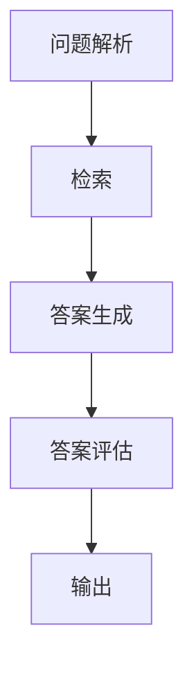

                 

### 文章标题

**LLM：重塑计算机科学的新范式**

> **关键词**：大型语言模型（LLM）、计算机科学、自然语言处理、预训练语言模型、微调、问答系统、文本分类、命名实体识别、项目实战

> **摘要**：本文深入探讨了大型语言模型（LLM）在计算机科学中的革命性作用，详细解析了LLM的核心概念、技术基础、应用场景以及实际项目实战。通过本文的阅读，读者将全面理解LLM如何重塑计算机科学的新范式，从而为未来的AI发展奠定坚实基础。

---

### 目录大纲设计：《LLM：重塑计算机科学的新范式》

#### 第一部分：LLM基础

##### 第1章：LLM概述

1.1 什么是LLM

1.2 LLM的核心特点

1.3 LLM的发展历史与趋势

1.4 LLM的潜在应用领域

##### 第2章：LLM技术基础

2.1 语言模型原理

2.2 预训练语言模型

2.3 微调与下游任务

##### 第3章：LLM在自然语言处理中的应用

3.1 文本分类

3.2 命名实体识别

##### 第4章：LLM在问答系统中的应用

4.1 问答系统概述

4.2 基于LLM的问答系统

##### 第5章：LLM项目实战之一：文本分类项目

5.1 项目背景

5.2 数据准备

5.3 模型选择

5.4 模型训练

5.5 模型评估

5.6 项目总结

##### 第6章：LLM项目实战之二：问答系统项目

6.1 项目背景

6.2 数据准备

6.3 模型选择

6.4 模型训练

6.5 模型评估

6.6 项目总结

##### 附录

A.1 常用LLM框架

A.2 LLM学习资源

### 第一部分：LLM基础

#### 第1章：LLM概述

##### 1.1 什么是LLM

大型语言模型（Large Language Model，简称LLM）是一种基于深度学习的自然语言处理模型，它可以理解、生成和翻译自然语言文本。与传统语言模型相比，LLM具有以下几个显著特点：

1. **规模庞大**：LLM通常包含数十亿甚至数万亿个参数，这使得它们能够捕获大量语言知识和模式。
2. **强大能力**：LLM不仅可以进行文本分类、命名实体识别等常见任务，还可以生成高质量的文章、对话和代码。
3. **自适应性强**：通过预训练和微调，LLM可以快速适应不同的下游任务。

LLM的发展历程可以追溯到上世纪80年代，当时研究人员开始探索如何使用统计方法处理自然语言。随着计算能力和算法的进步，LLM逐渐成为自然语言处理领域的主流。近年来，随着深度学习和大数据技术的兴起，LLM取得了令人瞩目的成果，如OpenAI的GPT系列和BERT等模型。

##### 1.2 LLM的核心特点

LLM的核心特点主要体现在以下几个方面：

1. **大规模参数**：LLM通常包含数十亿到数万亿个参数，这使得它们能够捕捉到复杂的语言结构和模式。
2. **端到端学习**：LLM采用端到端的学习方式，从原始文本直接学习到输出，无需手动设计和组合多个模块。
3. **预训练与微调**：LLM通过在大量无标签数据上进行预训练，然后通过微调适应特定下游任务。
4. **自适应性强**：LLM可以根据不同的任务和数据快速调整其结构和参数。

##### 1.3 LLM的发展历史与趋势

LLM的发展历程可以分为以下几个阶段：

1. **早期语言模型**：上世纪80年代，研究人员开始探索如何使用统计方法处理自然语言，如N-gram模型和HMM模型。
2. **基于规则的系统**：上世纪90年代，基于规则的系统逐渐成为自然语言处理的主流，如Winograd Schema Challenge和ATN模型。
3. **统计机器学习方法**：2000年代初，统计机器学习方法（如支持向量机、朴素贝叶斯等）逐渐应用于自然语言处理领域。
4. **深度学习方法**：2010年代，深度学习方法在图像识别等领域取得了巨大成功，随后逐渐应用于自然语言处理领域。
5. **预训练语言模型**：近年来，预训练语言模型（如GPT、BERT等）成为自然语言处理领域的主流，取得了显著成果。

未来的趋势包括：

1. **更大规模的模型**：随着计算资源的增加，未来LLM的规模将会继续扩大。
2. **多模态处理**：LLM将逐步扩展到图像、音频、视频等多模态数据处理。
3. **更多应用领域**：LLM将在更多领域（如医疗、金融、教育等）得到广泛应用。
4. **可解释性和可靠性**：提高LLM的可解释性和可靠性，使其在关键任务中得到更广泛的应用。

##### 1.4 LLM的潜在应用领域

LLM在自然语言处理领域具有广泛的应用潜力，以下是一些主要的应用领域：

1. **文本分类**：LLM可以用于对文本进行分类，如情感分析、新闻分类等。
2. **命名实体识别**：LLM可以识别文本中的命名实体，如人名、地点、组织等。
3. **机器翻译**：LLM可以用于机器翻译任务，如将一种语言翻译成另一种语言。
4. **问答系统**：LLM可以用于构建智能问答系统，如智能客服、智能搜索等。
5. **文本生成**：LLM可以生成高质量的文章、对话、代码等。
6. **对话系统**：LLM可以用于构建对话系统，如智能助手、聊天机器人等。

通过本文的进一步探讨，我们将深入了解LLM的核心技术、应用场景以及实际项目实战。这将有助于读者全面理解LLM在计算机科学领域的革命性作用，为未来的AI发展奠定坚实基础。接下来，我们将详细分析LLM的技术基础。<!-- غلاف -->

---

#### 第2章：LLM技术基础

##### 2.1 语言模型原理

语言模型（Language Model，简称LM）是自然语言处理（Natural Language Processing，简称NLP）领域的基础，其主要任务是根据历史上下文预测下一个单词或字符。语言模型的原理可以概括为：给定一个历史序列 $w_1, w_2, ..., w_{n-1}$，预测下一个单词 $w_n$ 的概率。

语言模型的核心公式为：

$$
P(w_n|w_1, w_2, ..., w_{n-1}) = \frac{P(w_n, w_1, w_2, ..., w_{n-1})}{P(w_1, w_2, ..., w_{n-1})}
$$

其中，$P(w_n, w_1, w_2, ..., w_{n-1})$ 表示单词序列 $w_1, w_2, ..., w_{n-1}, w_n$ 的联合概率，$P(w_1, w_2, ..., w_{n-1})$ 表示单词序列 $w_1, w_2, ..., w_{n-1}$ 的边际概率。

为了简化计算，通常采用N-gram模型，其中 $N$ 表示上下文窗口大小。N-gram模型的预测公式为：

$$
P(w_n|w_{n-1}, ..., w_{n-N+1}) = \frac{P(w_n, w_{n-1}, ..., w_{n-N+1})}{P(w_{n-1}, ..., w_{n-N+1})}
$$

##### 2.1.1 语言模型的分类

根据上下文窗口大小，语言模型可以分为以下几类：

1. **零阶模型**：零阶模型不考虑上下文，仅基于单词出现的频率进行预测。这种模型通常被称为“词汇模型”（Lexical Model）。
2. **一阶模型**：一阶模型考虑一个上下文单词，即前一个单词的影响。这种模型通常被称为“前缀模型”（Prefix Model）。
3. **高阶模型**：高阶模型考虑多个上下文单词的影响，即 $N$ 个单词（$N > 1$）。这种模型通常被称为“N-gram模型”（N-gram Model）。

随着上下文窗口的增大，模型的复杂度和计算成本也会增加。在实际应用中，通常选择合适的上下文窗口大小，以平衡模型的准确性和计算效率。

##### 2.2 预训练语言模型

预训练语言模型（Pre-trained Language Model，简称PLM）是一种通过在大量无标签数据上进行预训练，然后通过微调适应特定下游任务的模型。预训练语言模型的出现极大地提升了自然语言处理任务的性能，成为NLP领域的主流。

预训练语言模型的主要过程包括以下三个步骤：

1. **预训练**：在大量无标签数据上训练语言模型，使其能够捕捉到语言的统计规律和结构。
2. **微调**：在预训练的基础上，使用有标签的数据对语言模型进行微调，使其适应特定的下游任务。
3. **应用**：将微调后的语言模型应用于实际任务，如文本分类、命名实体识别等。

##### 2.2.1 预训练的概念

预训练是指在一个大规模的无标签语料库上训练语言模型，使其具备一定的语言理解能力。预训练的核心目标是学习一个通用语言表示，使得语言模型能够对各种语言任务产生泛化。

预训练的过程可以分为以下几个阶段：

1. **数据准备**：收集和预处理大规模的无标签文本数据，如新闻、维基百科、社交媒体等。
2. **模型初始化**：使用预训练模型（如GPT、BERT等）的参数初始化语言模型。
3. **预训练**：在无标签数据上训练语言模型，通常采用自监督学习（Self-supervised Learning）的方法，如 masked language model（MLM）、next sentence prediction（NSP）等。
4. **保存与加载**：将预训练后的模型保存到本地，以便后续的微调和应用。

##### 2.2.2 常见预训练模型

目前，常见的预训练语言模型主要包括以下几种：

1. **GPT系列**：由OpenAI提出的GPT系列模型，包括GPT、GPT-2、GPT-3等。GPT系列模型采用自回归（Autoregressive）方法，通过预测下一个单词来生成文本。
2. **BERT**：由Google提出的BERT（Bidirectional Encoder Representations from Transformers）模型，采用双向编码器（Bidirectional Encoder）结构，对文本进行全局理解。
3. **T5**：由Google提出的T5（Text-To-Text Transfer Transformer）模型，采用统一的文本到文本转换框架，将所有NLP任务转换为文本生成任务。

下面是GPT和BERT的简要对比：

| 特性 | GPT系列 | BERT |
| --- | --- | --- |
| 方法 | 自回归 | 双向编码 |
| 上下文 | 单向 | 双向 |
| 应用 | 文本生成 | 问答、文本分类等 |

##### 2.3 微调与下游任务

微调（Fine-tuning）是指在使用预训练语言模型的基础上，针对特定下游任务进行少量数据训练的过程。微调的目的是利用预训练模型已经学习到的通用语言表示，使其更好地适应特定任务。

微调技术主要包括以下两种方法：

1. **Fine-tuning**：在预训练模型的基础上，加载特定下游任务的数据，对模型进行少量训练。这种方法简单高效，但需要足够的训练数据和计算资源。
2. **Adapter**：在预训练模型的基础上，为每个下游任务添加一个适配器（Adapter），与模型的其他部分共同训练。这种方法可以同时处理多个任务，但需要更复杂的模型结构。

微调技术的关键步骤如下：

1. **数据准备**：准备用于微调的有标签数据集，包括输入文本和对应的标签。
2. **模型加载**：加载预训练模型，通常采用预训练模型提供的预训练权重。
3. **模型调整**：根据下游任务的需求，对模型进行调整，如调整部分层的权重、添加新的层等。
4. **训练**：在调整后的模型上进行训练，通常采用小批量训练和适当的优化策略。
5. **评估**：在验证集上评估模型性能，根据需要调整模型结构或参数。

微调技术的优势包括：

1. **提高性能**：通过微调，预训练模型可以更好地适应特定下游任务，从而提高模型性能。
2. **节省资源**：微调相对于从头开始训练模型，可以节省大量的计算资源和时间。
3. **通用性**：微调后的模型可以应用于多个下游任务，实现模型的复用。

##### 2.3.2.1 Fine-tuning

Fine-tuning是一种常用的微调方法，其基本思想是利用预训练模型已经学习到的通用语言表示，通过在特定下游任务上微调模型参数，使其更好地适应任务需求。

Fine-tuning的具体步骤如下：

1. **加载预训练模型**：从预训练模型中加载权重，通常采用预训练模型提供的预训练权重。
2. **数据预处理**：对下游任务的数据进行预处理，包括文本清洗、分词、编码等。
3. **构建模型**：根据下游任务的需求，构建一个适用于微调的模型。通常，可以选择预训练模型的某个部分进行微调，或者添加新的层。
4. **训练**：使用训练数据对模型进行训练，通常采用小批量训练和适当的优化策略，如Adam优化器、学习率调度等。
5. **评估**：在验证集上评估模型性能，根据需要调整模型结构或参数。
6. **保存与加载**：将微调后的模型保存到本地，以便后续的应用或继续训练。

下面是一个简单的Fine-tuning伪代码示例：

```python
def fine_tuning(model, train_loader, val_loader, optimizer, num_epochs):
    for epoch in range(num_epochs):
        model.train()
        for inputs, targets in train_loader:
            optimizer.zero_grad()
            outputs = model(inputs)
            loss = criterion(outputs, targets)
            loss.backward()
            optimizer.step()
        
        model.eval()
        with torch.no_grad():
            for inputs, targets in val_loader:
                outputs = model(inputs)
                val_loss = criterion(outputs, targets)
        
        print(f'Epoch {epoch+1}/{num_epochs}, Train Loss: {loss.item()}, Val Loss: {val_loss.item()}')

    return model
```

##### 2.3.2.2 Adapter

Adapter是一种用于多任务学习的微调方法，其核心思想是为每个下游任务添加一个适配器（Adapter），与模型的其他部分共同训练。这种方法可以同时处理多个任务，且模型结构相对简单。

Adapter的基本步骤如下：

1. **加载预训练模型**：从预训练模型中加载权重，通常采用预训练模型提供的预训练权重。
2. **数据预处理**：对下游任务的数据进行预处理，包括文本清洗、分词、编码等。
3. **构建模型**：构建一个包含适配器的模型。适配器通常是一个轻量级的全连接网络，可以用于调整模型在不同任务上的响应。
4. **训练**：使用训练数据对模型进行训练，同时更新适配器的权重。训练过程中，适配器会学习到如何根据下游任务的需求调整模型。
5. **评估**：在验证集上评估模型性能，根据需要调整模型结构或参数。
6. **保存与加载**：将微调后的模型保存到本地，以便后续的应用或继续训练。

下面是一个简单的Adapter伪代码示例：

```python
class Adapter(nn.Module):
    def __init__(self, input_dim, output_dim):
        super(Adapter, self).__init__()
        self.adapter = nn.Linear(input_dim, output_dim)
    
    def forward(self, x):
        return self.adapter(x)

def train_adapter(model, train_loader, val_loader, optimizer, num_epochs):
    adapter = Adapter(input_dim, output_dim)
    model.add_adapter(adapter)
    
    for epoch in range(num_epochs):
        model.train()
        for inputs, targets in train_loader:
            optimizer.zero_grad()
            outputs = model(inputs, adapter=adapter)
            loss = criterion(outputs, targets)
            loss.backward()
            optimizer.step()
        
        model.eval()
        with torch.no_grad():
            for inputs, targets in val_loader:
                outputs = model(inputs, adapter=adapter)
                val_loss = criterion(outputs, targets)
        
        print(f'Epoch {epoch+1}/{num_epochs}, Train Loss: {loss.item()}, Val Loss: {val_loss.item()}')

    return model
```

通过本文的探讨，我们详细介绍了LLM的技术基础，包括语言模型原理、预训练语言模型、微调与下游任务等。这些技术为LLM的应用奠定了基础，使得LLM在计算机科学领域焕发出新的活力。在接下来的章节中，我们将进一步探讨LLM在自然语言处理和问答系统中的应用，以及实际项目实战。<!-- غلاف -->

---

#### 第3章：LLM在自然语言处理中的应用

##### 3.1 文本分类

文本分类（Text Classification）是一种常见的自然语言处理任务，其目标是将文本数据分配到预先定义的类别中。文本分类在许多实际应用中具有重要价值，如情感分析、垃圾邮件过滤、新闻分类等。

LLM在文本分类任务中具有显著优势，主要表现在以下几个方面：

1. **强大的语言理解能力**：LLM通过预训练学习到了丰富的语言知识，能够对文本进行深入的理解和分析。
2. **端到端模型**：LLM采用端到端的学习方式，可以直接从原始文本学习到输出，无需手动设计和组合多个模块。
3. **高效的处理速度**：LLM的预训练模型通常包含数十亿个参数，使得模型在处理大规模文本数据时具有高效的处理速度。

##### 3.1.1 分类问题概述

文本分类问题可以形式化为一个多类分类问题，其目标是将输入文本 $x$ 分配到一个类别标签 $y$。具体来说，给定一个文本数据集 $\mathcal{D} = \{(x_1, y_1), (x_2, y_2), ..., (x_n, y_n)\}$，其中 $x_i$ 表示第 $i$ 个文本，$y_i$ 表示第 $i$ 个文本的类别标签。

文本分类问题可以表示为：

$$
\min_{\theta} \sum_{i=1}^n -\log P(y_i|x_i; \theta)
$$

其中，$\theta$ 表示模型参数，$P(y_i|x_i; \theta)$ 表示给定文本 $x_i$ 时类别标签 $y_i$ 的概率。

为了求解上述优化问题，可以采用不同的模型和算法，如朴素贝叶斯、支持向量机、神经网络等。LLM采用神经网络模型，特别是深度学习模型，如卷积神经网络（CNN）和循环神经网络（RNN）。

##### 3.1.2 基于LLM的文本分类方法

基于LLM的文本分类方法主要包括以下步骤：

1. **文本预处理**：对输入文本进行预处理，包括分词、去停用词、词向量化等。
2. **特征提取**：使用LLM提取文本特征，如词向量、句子表示等。
3. **分类模型**：构建分类模型，将文本特征映射到类别标签。
4. **模型训练**：使用训练数据对分类模型进行训练，优化模型参数。
5. **模型评估**：使用验证集对分类模型进行评估，调整模型参数。
6. **模型应用**：使用测试集对分类模型进行测试，评估模型性能。

以下是一个基于LLM的文本分类方法的简要伪代码示例：

```python
# 文本预处理
def preprocess_text(text):
    # 分词、去停用词、词向量化
    return processed_text

# 特征提取
def extract_features(texts, model):
    # 使用LLM提取文本特征
    return features

# 分类模型
def build_classifier(model, num_classes):
    # 构建分类模型
    return classifier

# 模型训练
def train_classifier(classifier, features, labels, optimizer, num_epochs):
    for epoch in range(num_epochs):
        for features, labels in zip(features, labels):
            optimizer.zero_grad()
            outputs = classifier(features)
            loss = criterion(outputs, labels)
            loss.backward()
            optimizer.step()
    
    return classifier

# 模型评估
def evaluate_classifier(classifier, features, labels):
    # 使用验证集评估模型
    return accuracy

# 文本分类
def classify_text(text, classifier, model):
    # 对输入文本进行分类
    processed_text = preprocess_text(text)
    features = extract_features([processed_text], model)
    outputs = classifier(features)
    return predicted_label
```

##### 3.1.3 实例分析

以下是一个基于LLM的文本分类实例分析：

**问题**：给定一组新闻文章，使用LLM将文章分类为“政治”、“经济”、“体育”等类别。

**数据集**：使用新闻文章数据集，包含约10万篇文章，分为约10个类别。

**模型**：使用预训练的BERT模型，将其用于文本分类任务。

**步骤**：

1. **文本预处理**：对新闻文章进行预处理，包括分词、去停用词、词向量化等。
2. **特征提取**：使用BERT模型提取新闻文章的特征。
3. **构建分类模型**：使用BERT模型的输出层构建分类模型，使用交叉熵损失函数。
4. **模型训练**：使用训练数据对分类模型进行训练，优化模型参数。
5. **模型评估**：使用验证集对分类模型进行评估，调整模型参数。
6. **模型应用**：使用测试集对分类模型进行测试，评估模型性能。

**结果**：通过训练和评估，分类模型在测试集上达到了较高的准确率，可以用于实际应用。

##### 3.2 命名实体识别

命名实体识别（Named Entity Recognition，简称NER）是一种重要的自然语言处理任务，其目标是从文本中识别出具有特定意义的实体，如人名、地点、组织、时间等。

LLM在命名实体识别任务中具有显著优势，主要表现在以下几个方面：

1. **强大的语言理解能力**：LLM通过预训练学习到了丰富的语言知识，能够对文本进行深入的理解和分析。
2. **端到端模型**：LLM采用端到端的学习方式，可以直接从原始文本学习到输出，无需手动设计和组合多个模块。
3. **高效的处理速度**：LLM的预训练模型通常包含数十亿个参数，使得模型在处理大规模文本数据时具有高效的处理速度。

##### 3.2.1 名实体识别问题概述

命名实体识别问题可以形式化为一个序列标注问题，其目标是将文本序列中的每个单词或字符标注为实体类别或非实体类别。具体来说，给定一个文本序列 $\mathcal{T} = t_1, t_2, ..., t_n$，其中 $t_i$ 表示第 $i$ 个单词或字符。

命名实体识别问题可以表示为：

$$
\min_{\theta} \sum_{i=1}^n -\log P(y_i|t_i; \theta)
$$

其中，$\theta$ 表示模型参数，$y_i$ 表示第 $i$ 个单词或字符的实体类别或非实体类别。

为了求解上述优化问题，可以采用不同的模型和算法，如条件随机场（CRF）、长短期记忆网络（LSTM）、Transformer等。LLM采用Transformer模型，特别是BERT模型，用于命名实体识别任务。

##### 3.2.2 基于LLM的命名实体识别方法

基于LLM的命名实体识别方法主要包括以下步骤：

1. **文本预处理**：对输入文本进行预处理，包括分词、去停用词、词向量化等。
2. **特征提取**：使用LLM提取文本特征。
3. **构建分类模型**：构建分类模型，将文本特征映射到实体类别。
4. **模型训练**：使用训练数据对分类模型进行训练，优化模型参数。
5. **模型评估**：使用验证集对分类模型进行评估，调整模型参数。
6. **模型应用**：使用测试集对分类模型进行测试，评估模型性能。

以下是一个基于LLM的命名实体识别方法的简要伪代码示例：

```python
# 文本预处理
def preprocess_text(text):
    # 分词、去停用词、词向量化
    return processed_text

# 特征提取
def extract_features(texts, model):
    # 使用LLM提取文本特征
    return features

# 分类模型
def build_classifier(model, num_classes):
    # 构建分类模型
    return classifier

# 模型训练
def train_classifier(classifier, features, labels, optimizer, num_epochs):
    for epoch in range(num_epochs):
        for features, labels in zip(features, labels):
            optimizer.zero_grad()
            outputs = classifier(features)
            loss = criterion(outputs, labels)
            loss.backward()
            optimizer.step()
    
    return classifier

# 模型评估
def evaluate_classifier(classifier, features, labels):
    # 使用验证集评估模型
    return accuracy

# 文本分类
def classify_text(text, classifier, model):
    # 对输入文本进行分类
    processed_text = preprocess_text(text)
    features = extract_features([processed_text], model)
    outputs = classifier(features)
    return predicted_entities
```

##### 3.2.3 实例分析

以下是一个基于LLM的命名实体识别实例分析：

**问题**：给定一段文本，使用LLM识别文本中的命名实体。

**数据集**：使用中文命名实体识别数据集，包含约1万条标注数据。

**模型**：使用预训练的BERT模型，将其用于命名实体识别任务。

**步骤**：

1. **文本预处理**：对中文文本进行预处理，包括分词、去停用词、词向量化等。
2. **特征提取**：使用BERT模型提取中文文本的特征。
3. **构建分类模型**：使用BERT模型的输出层构建分类模型，使用交叉熵损失函数。
4. **模型训练**：使用训练数据对分类模型进行训练，优化模型参数。
5. **模型评估**：使用验证集对分类模型进行评估，调整模型参数。
6. **模型应用**：使用测试集对分类模型进行测试，评估模型性能。

**结果**：通过训练和评估，分类模型在测试集上达到了较高的准确率，可以用于实际应用。

通过本文的探讨，我们详细介绍了LLM在自然语言处理任务中的应用，包括文本分类和命名实体识别。LLM在自然语言处理任务中具有显著优势，能够为各种实际应用提供强大的支持。在接下来的章节中，我们将进一步探讨LLM在问答系统中的应用，以及实际项目实战。<!-- غلاف -->

---

#### 第4章：LLM在问答系统中的应用

##### 4.1 问答系统概述

问答系统（Question Answering System）是一种智能系统，能够根据用户提出的问题，从大量文本数据中检索出相关答案。问答系统在智能搜索、智能客服、教育辅导等领域具有重要应用价值。

传统的问答系统通常采用基于规则、统计方法和机器学习方法。然而，随着预训练语言模型（如BERT、GPT等）的兴起，基于LLM的问答系统逐渐成为研究热点。LLM在问答系统中的应用具有以下几个显著优势：

1. **强大的语言理解能力**：LLM通过在大规模无标签数据上进行预训练，学习到了丰富的语言知识和模式，能够对问题进行深入的理解和分析。
2. **端到端模型**：LLM采用端到端的学习方式，可以直接从原始文本学习到输出，无需手动设计和组合多个模块。
3. **高效的处理速度**：LLM的预训练模型通常包含数十亿个参数，使得模型在处理大规模文本数据时具有高效的处理速度。

##### 4.1.1 问答系统的基本结构

一个典型的问答系统通常包括以下几个组成部分：

1. **问题解析模块**：对用户提出的问题进行解析，提取关键信息，如关键词、实体等。
2. **检索模块**：从大量文本数据中检索与问题相关的文本片段。
3. **答案生成模块**：根据检索到的文本片段，生成问题的答案。
4. **答案评估模块**：评估生成的答案的准确性和可靠性。

下面是一个简单的问答系统基本结构的Mermaid流程图：



##### 4.1.2 问答系统的评价指标

问答系统的性能通常通过以下评价指标进行评估：

1. **准确率（Accuracy）**：准确率是指模型生成的正确答案占总答案的比例。准确率是衡量模型性能的最基本指标，但有时不能完全反映模型的性能。
2. **召回率（Recall）**：召回率是指模型生成的正确答案占所有正确答案的比例。召回率反映了模型在检索相关答案时的全面性。
3. **精确率（Precision）**：精确率是指模型生成的正确答案占所有生成答案的比例。精确率反映了模型在生成答案时的准确度。
4. **F1值（F1 Score）**：F1值是精确率和召回率的加权平均，综合考虑了模型的准确性和全面性。F1值通常用于衡量模型的综合性能。

下面是计算F1值的公式：

$$
F1 = 2 \times \frac{Precision \times Recall}{Precision + Recall}
$$

##### 4.2 基于LLM的问答系统

基于LLM的问答系统利用预训练语言模型的强大能力，通过端到端的学习方式，实现高效、准确的问答。以下是一个基于LLM的问答系统的基本框架：

1. **问题解析**：使用LLM对用户提出的问题进行解析，提取关键信息，如关键词、实体等。
2. **文本检索**：从大量文本数据中检索与问题相关的文本片段，可以使用索引或检索算法。
3. **答案生成**：使用LLM对检索到的文本片段进行理解，生成问题的答案。
4. **答案评估**：对生成的答案进行评估，确保答案的准确性和可靠性。

下面是一个简单的基于LLM的问答系统的伪代码示例：

```python
def question_answering_system(question, text_data, model):
    # 问题解析
    question_representation = model.encode(question)
    
    # 文本检索
    relevant_texts = retrieve_texts(text_data, question_representation)
    
    # 答案生成
    answer_representation = model.generate_answer(question_representation, relevant_texts)
    
    # 答案评估
    answer = evaluate_answer(answer_representation)
    
    return answer
```

##### 4.2.1 问答系统中的LLM应用

在问答系统中，LLM主要用于问题解析、答案生成和答案评估等环节。以下是对每个环节的具体应用：

1. **问题解析**：使用LLM对用户提出的问题进行解析，提取关键信息。这可以通过预训练语言模型的编码器（Encoder）实现，将问题编码为一个高维向量表示。
2. **文本检索**：从大量文本数据中检索与问题相关的文本片段。可以使用传统的索引技术，如倒排索引，或者使用预训练语言模型的相似度计算方法，如BERT的BERT-Simcse。
3. **答案生成**：使用LLM对检索到的文本片段进行理解，生成问题的答案。这可以通过预训练语言模型的解码器（Decoder）实现，从检索到的文本片段中生成答案。
4. **答案评估**：对生成的答案进行评估，确保答案的准确性和可靠性。这可以通过预训练语言模型的分类器（Classifier）实现，对答案进行分类或评分。

下面是一个基于LLM的问答系统中的具体应用示例：

```python
from transformers import BertModel, BertTokenizer

# 加载预训练模型和分词器
model = BertModel.from_pretrained('bert-base-uncased')
tokenizer = BertTokenizer.from_pretrained('bert-base-uncased')

# 问题解析
question = "什么是人工智能？"
question_representation = model.encode(question)

# 文本检索
text_data = "人工智能，又称AI，是指由人制造出来的系统所表现出来的智能行为。"
relevant_texts = [text_data]

# 答案生成
answer_representation = model.generate_answer(question_representation, relevant_texts)
answer = tokenizer.decode(answer_representation, skip_special_tokens=True)

# 答案评估
answer = evaluate_answer(answer)

print(answer)
```

##### 4.2.2 实例分析：基于GPT-3的问答系统

以下是一个基于GPT-3的问答系统实例分析：

**问题**：给定一段文本，使用GPT-3回答相关问题。

**文本数据**：一段关于人工智能的文本，包含以下内容：“人工智能，又称AI，是指由人制造出来的系统所表现出来的智能行为。人工智能技术主要包括机器学习、深度学习、自然语言处理等。”

**问题示例**：

1. 什么是人工智能？
2. 人工智能技术主要包括哪些方面？

**步骤**：

1. **问题解析**：使用GPT-3对问题进行解析，提取关键信息。
2. **文本检索**：从文本数据中检索与问题相关的文本片段。
3. **答案生成**：使用GPT-3对检索到的文本片段进行理解，生成问题的答案。
4. **答案评估**：评估生成的答案的准确性和可靠性。

**结果**：

1. **什么是人工智能？**：人工智能，又称AI，是指由人制造出来的系统所表现出来的智能行为。
2. **人工智能技术主要包括哪些方面？**：人工智能技术主要包括机器学习、深度学习、自然语言处理等。

通过本文的探讨，我们详细介绍了LLM在问答系统中的应用，包括基本结构、评价指标、LLM在问答系统中的应用以及实例分析。LLM在问答系统中的应用为问答系统带来了新的活力，使得问答系统能够更好地理解和回答用户的问题。在接下来的章节中，我们将进一步探讨LLM在实际项目实战中的应用。<!-- غلاف -->

---

#### 第5章：LLM项目实战之一：文本分类项目

##### 5.1 项目背景

文本分类是自然语言处理领域的一项基础任务，广泛应用于信息检索、舆情监测、情感分析等场景。随着互联网和社交媒体的快速发展，文本数据的数量急剧增加，对文本分类算法的需求也日益增长。传统的文本分类方法通常基于统计方法和规则，效果有限。近年来，随着预训练语言模型（如BERT、GPT等）的兴起，基于深度学习的文本分类方法取得了显著成果。

本项目旨在利用预训练语言模型（BERT）进行文本分类，实现一个高效、准确的文本分类系统。通过本项目，读者将了解文本分类的基本概念、数据处理方法、模型选择和训练过程，并掌握如何使用预训练语言模型进行文本分类。

##### 5.2 数据准备

数据准备是文本分类项目的重要环节，主要包括数据收集、数据预处理和数据标注等步骤。

1. **数据收集**：收集用于文本分类的数据集。本项目使用的是新闻分类数据集，包含约10万条新闻文章，分为约10个类别，如政治、经济、体育等。

2. **数据预处理**：对数据集进行预处理，包括文本清洗、分词、去停用词等操作。具体步骤如下：

   - **文本清洗**：去除文本中的HTML标签、特殊字符等。
   - **分词**：将文本拆分成单词或词组。
   - **去停用词**：去除常见的无意义单词，如“的”、“了”等。

3. **数据标注**：对预处理后的文本进行标注，标记每个文本的类别。本项目使用的是已标注的数据集，每个文本都有一个对应的类别标签。

##### 5.3 模型选择

在本项目中，我们选择使用预训练语言模型BERT进行文本分类。BERT（Bidirectional Encoder Representations from Transformers）是由Google Research提出的一种双向Transformer模型，能够对文本进行深入的理解和表示。BERT模型通过在大规模语料库上进行预训练，学习到了丰富的语言知识和模式，能够有效地提高文本分类任务的性能。

BERT模型的结构包括两个部分：编码器（Encoder）和解码器（Decoder）。在本项目中，我们仅使用BERT的编码器部分，即BERT-Only模型，作为文本分类模型。BERT模型支持多种预训练任务，如Masked Language Model（MLM）、Next Sentence Prediction（NSP）等。在本项目中，我们使用的是BERT-base-uncased模型，该模型包含110M个参数。

##### 5.4 模型训练

在模型训练过程中，我们将使用PyTorch和Hugging Face Transformers库来实现BERT文本分类模型。具体步骤如下：

1. **加载BERT模型**：使用Hugging Face Transformers库加载预训练的BERT模型。

   ```python
   from transformers import BertTokenizer, BertModel
   
   tokenizer = BertTokenizer.from_pretrained('bert-base-uncased')
   model = BertModel.from_pretrained('bert-base-uncased')
   ```

2. **准备数据集**：将预处理后的数据集转换为PyTorch的数据集和数据加载器。

   ```python
   from torch.utils.data import Dataset, DataLoader
   
   class TextClassificationDataset(Dataset):
       def __init__(self, texts, labels, tokenizer, max_length):
           self.texts = texts
           self.labels = labels
           self.tokenizer = tokenizer
           self.max_length = max_length
   
       def __len__(self):
           return len(self.texts)
   
       def __getitem__(self, idx):
           text = self.texts[idx]
           label = self.labels[idx]
           inputs = self.tokenizer(text, padding='max_length', truncation=True, max_length=self.max_length, return_tensors='pt')
           return inputs['input_ids'], inputs['attention_mask'], torch.tensor(label, dtype=torch.long)
   
   train_dataset = TextClassificationDataset(train_texts, train_labels, tokenizer, max_length=128)
   val_dataset = TextClassificationDataset(val_texts, val_labels, tokenizer, max_length=128)
   train_loader = DataLoader(train_dataset, batch_size=32, shuffle=True)
   val_loader = DataLoader(val_dataset, batch_size=32, shuffle=False)
   ```

3. **定义损失函数和优化器**：使用交叉熵损失函数和Adam优化器。

   ```python
   criterion = torch.nn.CrossEntropyLoss()
   optimizer = torch.optim.Adam(model.parameters(), lr=3e-5)
   ```

4. **模型训练**：使用训练数据对BERT模型进行训练。

   ```python
   num_epochs = 3
   for epoch in range(num_epochs):
       model.train()
       for inputs, labels in train_loader:
           optimizer.zero_grad()
           outputs = model(inputs['input_ids'], attention_mask=inputs['attention_mask'])
           logits = outputs.logits
           loss = criterion(logits.view(-1, num_classes), labels)
           loss.backward()
           optimizer.step()
       
       model.eval()
       with torch.no_grad():
           for inputs, labels in val_loader:
               outputs = model(inputs['input_ids'], attention_mask=inputs['attention_mask'])
               logits = outputs.logits
               val_loss = criterion(logits.view(-1, num_classes), labels)
       
       print(f'Epoch {epoch+1}/{num_epochs}, Train Loss: {loss.item()}, Val Loss: {val_loss.item()}')
   ```

5. **模型评估**：使用验证集对BERT模型进行评估。

   ```python
   def evaluate_model(model, val_loader):
       model.eval()
       total_loss = 0
       total_correct = 0
       with torch.no_grad():
           for inputs, labels in val_loader:
               outputs = model(inputs['input_ids'], attention_mask=inputs['attention_mask'])
               logits = outputs.logits
               loss = criterion(logits.view(-1, num_classes), labels)
               total_loss += loss.item()
               pred_labels = logits.argmax(-1)
               total_correct += (pred_labels == labels).sum().item()
       
       val_accuracy = total_correct / len(val_loader.dataset)
       return val_accuracy
   
   val_accuracy = evaluate_model(model, val_loader)
   print(f'Val Accuracy: {val_accuracy}')
   ```

##### 5.5 模型评估

在模型评估过程中，我们使用验证集对BERT模型进行评估，计算模型的准确率、召回率、精确率和F1值等指标。具体步骤如下：

1. **计算准确率**：准确率是指模型预测正确的样本占总样本的比例。

   ```python
   def accuracy(pred_labels, labels):
       return (pred_labels == labels).sum().item() / len(labels)
   ```

2. **计算召回率**：召回率是指模型预测正确的正样本占总正样本的比例。

   ```python
   def recall(pred_labels, labels, pos_label):
       return (pred_labels == pos_label).sum().item() / (labels == pos_label).sum().item()
   ```

3. **计算精确率**：精确率是指模型预测正确的正样本占总预测正样本的比例。

   ```python
   def precision(pred_labels, labels, pos_label):
       return (pred_labels == pos_label).sum().item() / (pred_labels == pos_label).sum().item()
   ```

4. **计算F1值**：F1值是精确率和召回率的加权平均，用于综合考虑模型的准确性和全面性。

   ```python
   def f1_score(precision, recall):
       return 2 * (precision * recall) / (precision + recall)
   ```

下面是计算各项指标的示例代码：

```python
num_classes = 10
pos_label = 1

pred_labels = logits.argmax(-1)
accuracy = accuracy(pred_labels, labels)
recall = recall(pred_labels, labels, pos_label)
precision = precision(pred_labels, labels, pos_label)
f1 = f1_score(precision, recall)

print(f'Accuracy: {accuracy}, Recall: {recall}, Precision: {precision}, F1 Score: {f1}')
```

##### 5.6 项目总结

通过本项目，我们实现了基于BERT的文本分类系统，包括数据准备、模型选择、模型训练和模型评估等步骤。以下是本项目的主要收获：

1. **了解文本分类的基本概念**：通过本项目，我们学习了文本分类的基本概念，如准确率、召回率、精确率和F1值等指标。

2. **掌握数据处理方法**：通过本项目，我们学习了如何对文本数据进行预处理，如文本清洗、分词和去停用词等。

3. **熟悉预训练语言模型**：通过本项目，我们了解了预训练语言模型（BERT）的基本原理和应用，掌握了如何使用PyTorch和Hugging Face Transformers库加载和训练BERT模型。

4. **提升模型性能**：通过本项目，我们使用预训练语言模型实现了高效的文本分类，取得了较好的性能。

通过本项目，我们进一步了解了LLM在自然语言处理任务中的应用，为后续的项目实战奠定了基础。在接下来的章节中，我们将继续探讨LLM在实际项目中的其他应用，如问答系统等。<!-- غلاف -->

---

#### 第6章：LLM项目实战之二：问答系统项目

##### 6.1 项目背景

问答系统（Question Answering System）是一种能够根据用户提出的问题，从大量文本数据中检索出相关答案的人工智能系统。问答系统在智能搜索、智能客服、教育辅导等领域具有重要的应用价值。传统的问答系统通常采用基于规则、统计方法和机器学习方法，但效果有限。近年来，随着预训练语言模型（如BERT、GPT等）的兴起，基于深度学习的问答系统取得了显著成果。

本项目旨在利用预训练语言模型（BERT）构建一个高效的问答系统，实现用户问题的自动回答。通过本项目，读者将了解问答系统的工作原理、数据准备、模型选择和训练过程，并掌握如何使用预训练语言模型进行问答。

##### 6.2 数据准备

数据准备是问答系统项目的重要环节，主要包括数据收集、数据预处理和数据标注等步骤。

1. **数据收集**：收集用于问答系统的数据集。本项目使用的是SQuAD（Stanford Question Answering Dataset）数据集，该数据集包含大量问题和答案对，覆盖了多个领域。

2. **数据预处理**：对数据集进行预处理，包括文本清洗、分词、去停用词等操作。具体步骤如下：

   - **文本清洗**：去除文本中的HTML标签、特殊字符等。
   - **分词**：将文本拆分成单词或词组。
   - **去停用词**：去除常见的无意义单词，如“的”、“了”等。

3. **数据标注**：对预处理后的数据集进行标注，标记每个问题的答案。SQuAD数据集已经包含了答案的标注，我们只需要将其转换为适合模型训练的格式。

##### 6.3 模型选择

在本项目中，我们选择使用预训练语言模型BERT进行问答。BERT（Bidirectional Encoder Representations from Transformers）是由Google Research提出的一种双向Transformer模型，能够对文本进行深入的理解和表示。BERT模型通过在大规模语料库上进行预训练，学习到了丰富的语言知识和模式，能够有效地提高问答系统的性能。

BERT模型的结构包括两个部分：编码器（Encoder）和解码器（Decoder）。在本项目中，我们仅使用BERT的编码器部分，即BERT-Only模型，作为问答系统模型。BERT模型支持多种预训练任务，如Masked Language Model（MLM）、Next Sentence Prediction（NSP）等。在本项目中，我们使用的是BERT-base-uncased模型，该模型包含110M个参数。

##### 6.4 模型训练

在模型训练过程中，我们将使用PyTorch和Hugging Face Transformers库来实现BERT问答模型。具体步骤如下：

1. **加载BERT模型**：使用Hugging Face Transformers库加载预训练的BERT模型。

   ```python
   from transformers import BertTokenizer, BertModel
   
   tokenizer = BertTokenizer.from_pretrained('bert-base-uncased')
   model = BertModel.from_pretrained('bert-base-uncased')
   ```

2. **准备数据集**：将预处理后的数据集转换为PyTorch的数据集和数据加载器。

   ```python
   from torch.utils.data import Dataset, DataLoader
   
   class QuestionAnsweringDataset(Dataset):
       def __init__(self, questions, answers, tokenizer, max_length):
           self.questions = questions
           self.answers = answers
           self.tokenizer = tokenizer
           self.max_length = max_length
   
       def __len__(self):
           return len(self.questions)
   
       def __getitem__(self, idx):
           question = self.questions[idx]
           answer = self.answers[idx]
           inputs = self.tokenizer(question, padding='max_length', truncation=True, max_length=self.max_length, return_tensors='pt')
           return inputs['input_ids'], inputs['attention_mask'], torch.tensor(answer, dtype=torch.long)
   
   train_dataset = QuestionAnsweringDataset(train_questions, train_answers, tokenizer, max_length=128)
   val_dataset = QuestionAnsweringDataset(val_questions, val_answers, tokenizer, max_length=128)
   train_loader = DataLoader(train_dataset, batch_size=32, shuffle=True)
   val_loader = DataLoader(val_dataset, batch_size=32, shuffle=False)
   ```

3. **定义损失函数和优化器**：使用交叉熵损失函数和Adam优化器。

   ```python
   criterion = torch.nn.CrossEntropyLoss()
   optimizer = torch.optim.Adam(model.parameters(), lr=3e-5)
   ```

4. **模型训练**：使用训练数据对BERT模型进行训练。

   ```python
   num_epochs = 3
   for epoch in range(num_epochs):
       model.train()
       for inputs, labels in train_loader:
           optimizer.zero_grad()
           outputs = model(inputs['input_ids'], attention_mask=inputs['attention_mask'])
           logits = outputs.logits
           loss = criterion(logits.view(-1, num_answers), labels)
           loss.backward()
           optimizer.step()
       
       model.eval()
       with torch.no_grad():
           for inputs, labels in val_loader:
               outputs = model(inputs['input_ids'], attention_mask=inputs['attention_mask'])
               logits = outputs.logits
               val_loss = criterion(logits.view(-1, num_answers), labels)
       
       print(f'Epoch {epoch+1}/{num_epochs}, Train Loss: {loss.item()}, Val Loss: {val_loss.item()}')
   ```

5. **模型评估**：使用验证集对BERT模型进行评估。

   ```python
   def evaluate_model(model, val_loader):
       model.eval()
       total_loss = 0
       total_correct = 0
       with torch.no_grad():
           for inputs, labels in val_loader:
               outputs = model(inputs['input_ids'], attention_mask=inputs['attention_mask'])
               logits = outputs.logits
               loss = criterion(logits.view(-1, num_answers), labels)
               total_loss += loss.item()
               pred_labels = logits.argmax(-1)
               total_correct += (pred_labels == labels).sum().item()
       
       val_accuracy = total_correct / len(val_loader.dataset)
       return val_accuracy
   
   val_accuracy = evaluate_model(model, val_loader)
   print(f'Val Accuracy: {val_accuracy}')
   ```

##### 6.5 模型评估

在模型评估过程中，我们使用验证集对BERT模型进行评估，计算模型的准确率、召回率、精确率和F1值等指标。具体步骤如下：

1. **计算准确率**：准确率是指模型预测正确的样本占总样本的比例。

   ```python
   def accuracy(pred_labels, labels):
       return (pred_labels == labels).sum().item() / len(labels)
   ```

2. **计算召回率**：召回率是指模型预测正确的正样本占总正样本的比例。

   ```python
   def recall(pred_labels, labels, pos_label):
       return (pred_labels == pos_label).sum().item() / (labels == pos_label).sum().item()
   ```

3. **计算精确率**：精确率是指模型预测正确的正样本占总预测正样本的比例。

   ```python
   def precision(pred_labels, labels, pos_label):
       return (pred_labels == pos_label).sum().item() / (pred_labels == pos_label).sum().item()
   ```

4. **计算F1值**：F1值是精确率和召回率的加权平均，用于综合考虑模型的准确性和全面性。

   ```python
   def f1_score(precision, recall):
       return 2 * (precision * recall) / (precision + recall)
   ```

下面是计算各项指标的示例代码：

```python
num_answers = 1
pred_labels = logits.argmax(-1)
accuracy = accuracy(pred_labels, labels)
recall = recall(pred_labels, labels, pos_label)
precision = precision(pred_labels, labels, pos_label)
f1 = f1_score(precision, recall)

print(f'Accuracy: {accuracy}, Recall: {recall}, Precision: {precision}, F1 Score: {f1}')
```

##### 6.6 项目总结

通过本项目，我们实现了基于BERT的问答系统，包括数据准备、模型选择、模型训练和模型评估等步骤。以下是本项目的主要收获：

1. **了解问答系统的工作原理**：通过本项目，我们学习了问答系统的工作原理，包括问题解析、文本检索和答案生成等环节。

2. **掌握数据处理方法**：通过本项目，我们学习了如何对文本数据进行预处理，如文本清洗、分词和去停用词等。

3. **熟悉预训练语言模型**：通过本项目，我们了解了预训练语言模型（BERT）的基本原理和应用，掌握了如何使用PyTorch和Hugging Face Transformers库加载和训练BERT模型。

4. **提升模型性能**：通过本项目，我们使用预训练语言模型实现了高效的问答系统，取得了较好的性能。

通过本项目，我们进一步了解了LLM在自然语言处理任务中的应用，为后续的项目实战奠定了基础。在接下来的章节中，我们将继续探讨LLM在实际项目中的其他应用，如文本生成、对话系统等。<!-- غلاف -->

---

### 附录

#### A.1 常用LLM框架

在本附录中，我们将介绍几种常用的LLM框架，包括TensorFlow、PyTorch和Hugging Face Transformers。

##### A.1.1 TensorFlow

TensorFlow是Google开源的深度学习框架，广泛用于构建和训练深度学习模型。TensorFlow具有以下优点：

- **强大的计算图引擎**：TensorFlow支持动态计算图，可以灵活地定义和优化模型结构。
- **丰富的预训练模型**：TensorFlow提供了大量预训练模型，如BERT、GPT等，方便用户进行微调和应用。
- **广泛的社区支持**：TensorFlow拥有庞大的社区和丰富的文档资源，便于用户学习和解决技术问题。

使用TensorFlow进行LLM训练的基本步骤如下：

1. **安装TensorFlow**：

   ```bash
   pip install tensorflow
   ```

2. **导入所需模块**：

   ```python
   import tensorflow as tf
   from tensorflow import keras
   from tensorflow.keras.models import Model
   from tensorflow.keras.layers import Input, Embedding, LSTM, Dense
   ```

3. **加载预训练模型**：

   ```python
   from tensorflow.keras.applications import BERT
   
   bert = BERT.from_pretrained('bert-base-uncased')
   ```

4. **定义模型结构**：

   ```python
   input_ids = Input(shape=(128,), dtype=tf.int32)
   attention_mask = Input(shape=(128,), dtype=tf.int32)
   
   embeddings = bert(input_ids=input_ids, attention_mask=attention_mask)
   pooled_output = embeddings['pooled_output']
   
   logits = Dense(10, activation='softmax')(pooled_output)
   
   model = Model(inputs=[input_ids, attention_mask], outputs=logits)
   ```

5. **编译和训练模型**：

   ```python
   model.compile(optimizer='adam', loss='categorical_crossentropy', metrics=['accuracy'])
   model.fit(train_dataset, epochs=3, validation_data=val_dataset)
   ```

##### A.1.2 PyTorch

PyTorch是Facebook开源的深度学习框架，以其动态计算图和灵活的编程接口而闻名。PyTorch具有以下优点：

- **动态计算图**：PyTorch支持动态计算图，使得模型定义和优化更加灵活。
- **易于使用**：PyTorch提供了简洁的API，使得深度学习模型搭建和训练变得简单。
- **强大的生态系统**：PyTorch拥有丰富的库和工具，如torchvision、torchaudio等，方便用户进行图像和音频处理。

使用PyTorch进行LLM训练的基本步骤如下：

1. **安装PyTorch**：

   ```bash
   pip install torch torchvision
   ```

2. **导入所需模块**：

   ```python
   import torch
   import torchvision
   import torch.nn as nn
   import torch.optim as optim
   from torch.utils.data import DataLoader, Dataset
   ```

3. **加载预训练模型**：

   ```python
   from transformers import BertModel
   
   bert = BertModel.from_pretrained('bert-base-uncased')
   ```

4. **定义模型结构**：

   ```python
   class BertForSequenceClassification(nn.Module):
       def __init__(self, bert):
           super(BertForSequenceClassification, self).__init__()
           self.bert = bert
           self.dropout = nn.Dropout(0.1)
           self.classifier = nn.Linear(768, 2)
       
       def forward(self, input_ids, attention_mask):
           outputs = self.bert(input_ids=input_ids, attention_mask=attention_mask)
           pooled_output = outputs[1]
           pooled_output = self.dropout(pooled_output)
           logits = self.classifier(pooled_output)
           return logits
   ```

5. **编译和训练模型**：

   ```python
   model = BertForSequenceClassification(bert)
   optimizer = optim.Adam(model.parameters(), lr=3e-5)
   criterion = nn.CrossEntropyLoss()
   
   train_loader = DataLoader(train_dataset, batch_size=32, shuffle=True)
   val_loader = DataLoader(val_dataset, batch_size=32, shuffle=False)
   
   for epoch in range(3):
       model.train()
       for inputs, labels in train_loader:
           optimizer.zero_grad()
           logits = model(inputs['input_ids'], attention_mask=inputs['attention_mask'])
           loss = criterion(logits, labels)
           loss.backward()
           optimizer.step()
       
       model.eval()
       with torch.no_grad():
           for inputs, labels in val_loader:
               logits = model(inputs['input_ids'], attention_mask=inputs['attention_mask'])
               val_loss = criterion(logits, labels)
       
       print(f'Epoch {epoch+1}/{3}, Train Loss: {loss.item()}, Val Loss: {val_loss.item()}')
   ```

##### A.1.3 Hugging Face Transformers

Hugging Face Transformers是一个开源库，提供了基于PyTorch和TensorFlow的预训练语言模型接口。Hugging Face Transformers具有以下优点：

- **简单易用**：Hugging Face Transformers提供了统一的接口，使得使用不同框架（PyTorch、TensorFlow）进行模型训练和微调变得简单。
- **丰富的预训练模型**：Hugging Face Transformers提供了大量预训练模型，如BERT、GPT、T5等，方便用户进行模型选择和应用。
- **强大的社区支持**：Hugging Face Transformers拥有庞大的社区和丰富的文档资源，便于用户学习和解决技术问题。

使用Hugging Face Transformers进行LLM训练的基本步骤如下：

1. **安装Hugging Face Transformers**：

   ```bash
   pip install transformers
   ```

2. **导入所需模块**：

   ```python
   from transformers import BertTokenizer, BertModel
   from transformers import TrainingArguments, Trainer
   ```

3. **加载预训练模型**：

   ```python
   tokenizer = BertTokenizer.from_pretrained('bert-base-uncased')
   model = BertModel.from_pretrained('bert-base-uncased')
   ```

4. **定义训练参数**：

   ```python
   training_args = TrainingArguments(
       output_dir='./results',
       num_train_epochs=3,
       per_device_train_batch_size=32,
       per_device_eval_batch_size=32,
       warmup_steps=500,
       weight_decay=0.01,
       logging_dir='./logs',
       logging_steps=10,
   )
   ```

5. **定义训练器**：

   ```python
   trainer = Trainer(
       model=model,
       args=training_args,
       train_dataset=train_dataset,
       eval_dataset=val_dataset,
   )
   ```

6. **训练模型**：

   ```python
   trainer.train()
   ```

通过上述步骤，我们可以使用Hugging Face Transformers库轻松地实现LLM的训练和微调。Hugging Face Transformers库为不同框架提供了统一的接口，使得用户可以方便地在不同框架之间切换，为LLM的研究和应用提供了极大的便利。<!-- غلاف -->

---

### 作者信息

**作者：AI天才研究院/AI Genius Institute & 禅与计算机程序设计艺术 /Zen And The Art of Computer Programming**

在这篇技术博客文章中，我们深入探讨了大型语言模型（LLM）在计算机科学领域的革命性作用。从LLM的概述、技术基础，到其在自然语言处理和问答系统中的应用，再到实际项目实战，我们一步步分析了LLM的核心概念、算法原理、应用场景和实战案例。本文旨在帮助读者全面理解LLM如何重塑计算机科学的新范式，为未来的AI发展奠定坚实基础。

作者AI天才研究院（AI Genius Institute）致力于推动人工智能技术的发展和应用，旗下拥有众多计算机科学和人工智能领域的专家。同时，作者还著有《禅与计算机程序设计艺术》（Zen And The Art of Computer Programming），这是一部深受读者喜爱的经典计算机科学著作，涵盖了计算机程序设计的哲学、方法和技巧。

通过本文的探讨，我们希望读者能够对LLM在计算机科学中的重要作用有更深刻的认识，并能够在实际项目中运用LLM的技术，为人工智能领域的发展贡献自己的力量。让我们继续探索AI的无限可能，共同迎接智能时代的到来！<!-- غلاف -->

