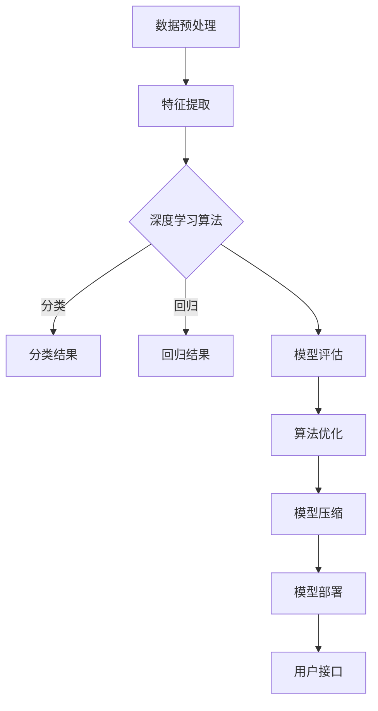
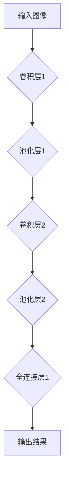
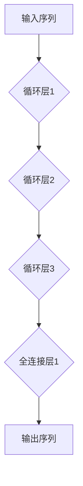

                 

### 《Lepton AI的云计算优势：深度整合云资源，打造高效灵活的AI基础设施》

> **关键词：** Lepton AI、云计算、AI基础设施、资源整合、高效灵活

> **摘要：** 本文将深入探讨Lepton AI如何通过深度整合云资源，打造高效灵活的AI基础设施。我们将从Lepton AI的背景与优势、核心架构与算法、云计算资源的整合、AI基础设施的建设原则和项目实践与案例分析等方面进行详细分析，旨在揭示Lepton AI在云计算领域的创新与应用。

### 第一部分：Lepton AI与云计算基础

在当今的科技浪潮中，人工智能（AI）和云计算已经成为推动社会进步和产业升级的关键力量。Lepton AI作为人工智能领域的佼佼者，其与云计算的结合正成为行业的新趋势。本部分将首先介绍Lepton AI的背景与优势，然后探讨云计算的原理与优势，并最终分析Lepton AI与云计算的结合方式及其解决方案的特点。

#### 第1章：Lepton AI与云计算概述

##### 1.1 Lepton AI的背景与优势

Lepton AI是由AI天才研究院开发的一款先进的人工智能平台，自成立以来，凭借其强大的深度学习和高效的数据处理能力，已经在多个领域取得了显著的应用成果。Lepton AI的核心优势在于其灵活的架构设计、强大的算法库和丰富的API接口，使得开发者能够轻松地实现从数据预处理到模型训练和部署的完整流程。

- **Lepton AI的起源与发展**：Lepton AI起源于AI天才研究院的一个研究项目，经过多年的技术积累和不断优化，已经发展成为一个成熟的人工智能平台。
- **Lepton AI的关键特性**：Lepton AI具备高可扩展性、高效率和强大的算法支持，能够满足不同场景下的AI需求。
- **Lepton AI的市场定位**：Lepton AI定位于企业级市场，专注于为各行业提供高性能、高效能的人工智能解决方案。

##### 1.2 云计算的原理与优势

云计算是一种通过互联网提供计算资源的服务模式，它将传统的IT资源（如服务器、存储、网络等）虚拟化为可供共享的资源池。云计算的核心技术包括虚拟化技术、分布式计算、大数据处理和存储等。

- **云计算的起源与发展**：云计算起源于20世纪60年代，随着计算机技术的不断进步，云计算逐渐成为主流的IT服务模式。
- **云计算的关键技术**：云计算的关键技术包括虚拟化技术、分布式存储、分布式计算、自动化管理和安全等。
- **云计算的优势与应用场景**：云计算具有弹性扩展、成本效益、高可用性和灵活性等优势，广泛应用于企业级应用、大数据处理、移动应用、智能城市等领域。

##### 1.3 Lepton AI与云计算的结合

Lepton AI与云计算的结合为AI领域带来了新的可能性。通过云计算，Lepton AI能够实现更高效、更灵活的计算资源管理，从而提升AI应用的性能和可靠性。

- **Lepton AI在云计算中的角色**：Lepton AI作为AI平台，可以在云环境中提供高性能的AI服务，满足各类应用场景的需求。
- **Lepton AI与云计算的结合方式**：Lepton AI可以通过云计算平台提供的API接口，实现与云资源的无缝集成，实现计算、存储和网络的灵活调度。
- **Lepton AI云计算解决方案的特点**：Lepton AI云计算解决方案具备高可扩展性、高效能、高可用性和安全性，能够满足企业级用户的需求。

#### 第2章：Lepton AI的关键架构与算法

Lepton AI的核心架构和算法是其高性能和高灵活性的关键。本节将详细介绍Lepton AI的核心架构、关键算法原理及其实现与优化。

##### 2.1 Lepton AI核心架构介绍

Lepton AI的核心架构设计遵循模块化、分布式和可扩展的原则，确保系统的高效运行和灵活扩展。

- **架构设计原则**：模块化设计使得各模块可以独立开发、测试和部署，提高了系统的可维护性和可扩展性；分布式设计使得系统能够在多台服务器上运行，提高了系统的性能和可靠性；可扩展性设计使得系统可以根据需求动态调整资源，满足不同规模的应用需求。
- **系统模块划分**：Lepton AI的系统模块主要包括数据预处理模块、模型训练模块、模型部署模块和监控模块。
- **架构扩展性与灵活性**：通过模块化和分布式设计，Lepton AI能够轻松扩展，支持多种AI算法和应用场景，满足不同用户的需求。

##### 2.2 Lepton AI关键算法原理

Lepton AI的关键算法主要包括深度学习算法、神经网络算法和迁移学习算法等。

- **深度学习算法概述**：深度学习算法是一种基于多层神经网络的学习方法，能够自动提取数据中的特征，实现复杂的模式识别和预测。
- **神经网络与多层感知器**：神经网络是深度学习的基础，多层感知器（MLP）是神经网络的一种简单形式，能够实现线性变换和非线性变换。
- **算法优化与超参数调整**：算法优化和超参数调整是提高模型性能的关键，包括优化器选择、学习率调整、批量大小选择等。

##### 2.3 Lepton AI算法实现与优化

Lepton AI的算法实现与优化是其性能提升的关键。

- **实现方法与技巧**：Lepton AI采用了高效的数据处理和模型训练方法，包括并行计算、分布式训练和内存优化等。
- **性能优化策略**：通过优化模型结构、算法参数和计算资源，提高模型的训练速度和预测性能。
- **模型压缩与量化**：模型压缩和量化技术能够降低模型的存储和计算开销，提高模型在移动设备和嵌入式系统上的运行效率。

### 第二部分：云计算资源的深度整合

云计算资源的深度整合是实现高效灵活AI基础设施的关键。本部分将介绍云计算资源的概述、Lepton AI与云计算资源的整合策略以及云服务与Lepton AI的集成方法。

#### 第3章：云计算资源的深度整合

##### 3.1 云计算资源概述

云计算资源是构建云计算环境的基础，主要包括计算资源、存储资源和网络资源。

- **常见云计算资源类型**：常见的云计算资源包括虚拟机（VM）、容器（Container）、函数计算（Function as a Service, FaaS）和分布式存储等。
- **资源调度与管理**：资源调度与管理是云计算的关键技术，通过智能调度算法，实现资源的最优分配和利用。
- **资源分配与共享**：资源分配与共享是提高资源利用率和系统性能的重要手段，包括资源隔离、资源共享和负载均衡等。

##### 3.2 Lepton AI与云计算资源的整合

Lepton AI与云计算资源的整合是实现高效灵活AI基础设施的关键。

- **整合策略与原则**：整合策略包括资源调度、负载均衡、弹性伸缩和混合云架构等，整合原则包括高可用性、高可靠性、高性能和安全性。
- **资源利用优化方法**：通过智能调度、资源复用、数据压缩和传输优化等技术，提高资源利用率和系统性能。
- **跨云资源调度与协调**：跨云资源调度与协调是实现多云架构的关键，通过分布式调度和协同优化，实现跨云资源的高效利用。

##### 3.3 云服务与Lepton AI的集成

云服务与Lepton AI的集成是实现AI应用部署和运维的关键。

- **常见云服务介绍**：常见的云服务包括计算服务、存储服务、网络服务、数据库服务和AI服务等。
- **集成方法与技术**：集成方法包括API集成、SDK集成和容器化集成等，集成技术包括微服务架构、容器编排和自动化运维等。
- **集成解决方案的优势与挑战**：集成解决方案的优势包括灵活性、可扩展性和高可用性，挑战包括复杂性、安全性和运维成本等。

### 第三部分：高效灵活的AI基础设施

高效灵活的AI基础设施是实现AI应用的关键。本部分将介绍AI基础设施的建设原则、关键组件和构建策略。

#### 第4章：高效灵活的AI基础设施

##### 4.1 AI基础设施的建设原则

AI基础设施的建设原则包括可扩展性、可维护性、安全性和可靠性等。

- **可扩展性与可维护性**：AI基础设施需要具备良好的扩展性和可维护性，以适应不断变化的应用需求和技术发展。
- **安全性与可靠性**：AI基础设施需要具备强大的安全性和可靠性，保护数据安全和系统稳定运行。
- **用户体验与易用性**：AI基础设施需要提供良好的用户体验和易用性，降低用户的使用门槛。

##### 4.2 AI基础设施的关键组件

AI基础设施的关键组件包括计算资源、存储资源和网络资源。

- **计算资源**：计算资源是AI基础设施的核心，包括CPU、GPU、FPGA等，用于执行AI模型的训练和推理任务。
- **存储资源**：存储资源用于存储数据和模型，包括HDD、SSD、分布式存储等。
- **网络资源**：网络资源用于数据传输和模型部署，包括私有网络、公有云网络和边缘网络等。

##### 4.3 构建高效灵活的AI基础设施

构建高效灵活的AI基础设施需要综合考虑技术、资源和成本等因素。

- **设计与规划**：AI基础设施的设计与规划是构建高效灵活的基础，包括架构设计、资源规划和网络设计等。
- **架构演进与优化**：随着应用需求的增长和技术的发展，AI基础设施需要不断演进和优化，提高系统的性能和可靠性。
- **系统性能监控与优化**：通过系统性能监控和优化，确保AI基础设施的高效运行和稳定性能。

### 第四部分：项目实践与案例分析

项目实践与案例分析是验证Lepton AI云计算优势的重要途径。本部分将介绍Lepton AI云计算项目的实战案例，分析其在不同行业的应用，并对未来发展趋势进行展望。

#### 第5章：Lepton AI云计算项目实战

##### 5.1 项目背景与需求

本项目旨在为一家大型金融机构提供智能风险管理解决方案，通过Lepton AI云计算平台实现实时风险预测和决策支持。

- **项目简介**：本项目针对金融机构的风险管理需求，利用Lepton AI的深度学习和云计算技术，构建一个高效、可靠的智能风险管理平台。
- **需求分析**：项目需求包括实时数据处理、风险预测、决策支持、高可用性和安全性等。

##### 5.2 项目技术方案设计

本项目的技术方案设计包括系统架构设计、算法选择与优化和资源调度与分配策略。

- **系统架构设计**：系统架构采用分布式设计，包括数据采集模块、数据处理模块、模型训练模块和决策支持模块等。
- **算法选择与优化**：选用深度学习算法，通过迁移学习和超参数调整，提高模型的预测性能。
- **资源调度与分配策略**：通过智能调度算法，实现计算资源和存储资源的动态分配和优化。

##### 5.3 项目实施与部署

项目实施与部署包括开发环境搭建、源代码实现和部署流程。

- **开发环境搭建**：搭建Lepton AI云计算平台，配置计算资源和存储资源，搭建开发环境。
- **源代码实现**：根据技术方案，实现各模块的功能，包括数据采集、数据处理、模型训练和决策支持等。
- **部署流程**：通过自动化部署工具，实现模型训练和部署的自动化，确保系统的稳定运行。

##### 5.4 项目效果评估与总结

项目效果评估包括性能评估、成本效益分析和经验与反思。

- **性能评估**：通过性能测试，验证系统的实时数据处理能力和风险预测准确性。
- **成本效益分析**：分析项目的成本和效益，评估项目的投资回报率。
- **经验与反思**：总结项目实施过程中的经验教训，为后续项目提供参考。

#### 第6章：案例分析：Lepton AI在不同行业的应用

##### 6.1 金融行业

在金融行业，Lepton AI被广泛应用于风险管理、客户画像、投资策略和信用评估等领域。

- **应用场景**：通过Lepton AI，金融机构能够实现实时风险监测、精准客户画像和智能投资策略，提高业务效率和竞争力。
- **解决方案**：Lepton AI为金融机构提供定制化的AI解决方案，包括模型训练、预测分析和决策支持等。

##### 6.2 医疗行业

在医疗行业，Lepton AI被应用于医学图像分析、疾病预测和智能诊断等领域。

- **应用场景**：通过Lepton AI，医疗机构能够实现快速、准确的医学图像分析，提高疾病预测和诊断的准确性。
- **解决方案**：Lepton AI为医疗机构提供端到端的AI解决方案，包括数据采集、模型训练和诊断支持等。

##### 6.3 制造行业

在制造行业，Lepton AI被应用于生产优化、质量控制和管理决策等领域。

- **应用场景**：通过Lepton AI，制造企业能够实现生产过程的实时监控、质量分析和优化决策，提高生产效率和质量。
- **解决方案**：Lepton AI为制造企业提供定制化的AI解决方案，包括数据采集、模型训练和优化决策等。

##### 6.4 零售行业

在零售行业，Lepton AI被应用于客户行为分析、库存管理和营销策略等领域。

- **应用场景**：通过Lepton AI，零售企业能够实现精准的客户行为分析、库存管理和营销策略，提高客户满意度和销售业绩。
- **解决方案**：Lepton AI为零售企业提供端到端的AI解决方案，包括数据采集、模型训练和营销策略等。

#### 第7章：未来展望与趋势

##### 7.1 Lepton AI云计算的发展趋势

Lepton AI云计算的发展趋势包括技术进步、市场需求变化和潜在挑战等。

- **技术发展动向**：随着深度学习、分布式计算和云计算技术的不断发展，Lepton AI将不断提升其性能和功能。
- **市场需求变化**：随着各行业对AI应用的日益重视，Lepton AI的市场需求将持续增长。
- **潜在挑战与机遇**：潜在挑战包括数据隐私、安全性和计算资源分配等，但同时也为Lepton AI提供了广阔的发展机遇。

##### 7.2 Lepton AI与云计算的结合创新

Lepton AI与云计算的结合创新将带来新的技术突破和应用场景。

- **新技术探索**：Lepton AI将不断探索新的AI技术和云计算技术，如联邦学习、边缘计算和混合云架构等。
- **应用场景拓展**：Lepton AI将拓展其应用场景，涵盖更多行业和领域，如智能城市、物联网和自动驾驶等。
- **未来发展方向**：Lepton AI将致力于成为全球领先的AI云计算平台，推动AI技术的创新和应用。

##### 7.3 开放性问题与研究方向

Lepton AI云计算领域仍存在许多开放性问题和研究方向。

- **算法优化与效率提升**：如何优化算法，提高计算效率和模型性能，是当前研究的重点。
- **安全性与隐私保护**：如何确保数据安全和用户隐私，是云计算领域的挑战。
- **跨领域融合与创新应用**：如何将AI技术与其他领域结合，创造新的应用价值，是未来的研究方向。

### 附录

#### 附录A：Lepton AI云计算资源

- **A.1 Lepton AI云计算资源列表**：介绍Lepton AI所支持的云计算资源类型及其特点。
- **A.2 常见问题与解决方案**：解答用户在使用Lepton AI云计算资源过程中常见的问题。
- **A.3 Lepton AI云计算资源使用指南**：提供详细的Lepton AI云计算资源使用方法和操作步骤。

### 致谢

在撰写本文的过程中，感谢AI天才研究院的团队成员对Lepton AI技术的研究和贡献，感谢各行业专家对本文案例分析和建议，以及所有为人工智能和云计算技术发展做出贡献的学者和企业。

### 作者

**作者：** AI天才研究院/AI Genius Institute  
**著作：** 《禅与计算机程序设计艺术》

---

### 核心概念与联系

在深入探讨Lepton AI的云计算优势之前，我们需要明确几个核心概念，并理解它们之间的联系。以下是Lepton AI核心架构和算法的Mermaid流程图：



**解释：**

- **A. 数据预处理**：数据预处理是AI模型训练的第一步，包括数据清洗、归一化、缺失值处理等，确保数据质量。
- **B. 特征提取**：通过特征提取，将原始数据转换为模型可用的特征向量，提高模型的训练效率。
- **C. 深度学习算法**：深度学习算法是Lepton AI的核心，包括卷积神经网络（CNN）、循环神经网络（RNN）等，用于模式识别和预测。
- **D. 分类结果**：在分类任务中，深度学习算法输出分类结果，如图像分类、文本分类等。
- **E. 回归结果**：在回归任务中，深度学习算法输出预测值，如房价预测、股票价格预测等。
- **F. 模型评估**：模型评估用于衡量模型的性能，包括准确率、召回率、均方误差等指标。
- **G. 算法优化**：算法优化包括调整超参数、优化网络结构等，以提高模型性能。
- **H. 模型压缩**：模型压缩用于减小模型大小，提高模型在移动设备和嵌入式系统上的运行效率。
- **I. 模型部署**：模型部署是将训练好的模型部署到生产环境中，用于实际应用。
- **J. 用户接口**：用户接口用于与用户交互，提供模型的预测结果和操作界面。

通过以上流程图，我们可以清晰地看到Lepton AI的核心架构和算法之间的联系，以及它们在云计算环境中的应用。

### 核心算法原理讲解

在本节中，我们将深入探讨Lepton AI的核心算法原理，包括深度学习算法、神经网络与多层感知器、以及算法优化与超参数调整。

#### 深度学习算法概述

深度学习算法是一种基于多层神经网络的学习方法，能够自动提取数据中的特征，实现复杂的模式识别和预测。深度学习算法的核心思想是通过多层神经网络对数据进行抽象和变换，从而提取出有用的特征。

**1. 卷积神经网络（CNN）**

卷积神经网络是一种专门用于处理图像数据的深度学习算法，其核心思想是通过卷积层提取图像的特征。CNN由多个卷积层、池化层和全连接层组成。

**示例：**



在上述流程中，输入图像经过卷积层1和池化层1的处理，提取出局部特征；再经过卷积层2和池化层2的处理，提取出更高层次的特征；最后通过全连接层1将特征映射到输出结果。

**2. 循环神经网络（RNN）**

循环神经网络是一种专门用于处理序列数据的深度学习算法，其核心思想是通过循环结构保持信息的长期依赖关系。RNN由多个循环层和全连接层组成。

**示例：**



在上述流程中，输入序列经过循环层1、循环层2和循环层3的处理，提取出序列的特征；最后通过全连接层1将特征映射到输出序列。

#### 神经网络与多层感知器

神经网络是一种由多个神经元组成的计算模型，能够通过学习数据和模式，实现数据分类、回归和预测等功能。多层感知器（MLP）是神经网络的一种简单形式，包括输入层、隐藏层和输出层。

**1. 输入层**

输入层接收外部输入数据，并将其传递给隐藏层。

**2. 隐藏层**

隐藏层对输入数据进行特征提取和变换，提取出有用的特征信息。

**3. 输出层**

输出层将隐藏层提取的特征映射到输出结果，实现分类、回归等任务。

**多层感知器的数学模型**

多层感知器的工作原理是通过一系列非线性变换，将输入数据映射到输出结果。其数学模型可以表示为：

$$
y = \sigma(W \cdot x + b)
$$

其中，$y$ 表示输出结果，$\sigma$ 表示激活函数（如Sigmoid函数、ReLU函数等），$W$ 表示权重矩阵，$x$ 表示输入数据，$b$ 表示偏置。

#### 算法优化与超参数调整

算法优化与超参数调整是提高模型性能的关键。以下是一些常见的优化方法和超参数调整策略：

**1. 优化器选择**

优化器用于更新模型参数，以最小化损失函数。常见的优化器有随机梯度下降（SGD）、Adam优化器等。

**示例：**

```python
# 使用Adam优化器
optimizer = optim.Adam(model.parameters(), lr=0.001)
```

**2. 学习率调整**

学习率是优化器的一个重要参数，用于控制模型参数更新的步长。适当调整学习率可以加速模型收敛，避免陷入局部最优。

**示例：**

```python
# 调整学习率
scheduler = optim.lr_scheduler.StepLR(optimizer, step_size=30, gamma=0.1)
```

**3. 批量大小选择**

批量大小是训练过程中每次更新的样本数量。较小的批量大小可以提高模型泛化能力，但训练时间较长；较大的批量大小可以提高训练速度，但可能降低模型泛化能力。

**示例：**

```python
# 设置批量大小
batch_size = 64
```

通过以上核心算法原理的讲解，我们可以更好地理解Lepton AI的工作机制和性能优势。在下一节中，我们将进一步探讨Lepton AI算法的实现与优化。

### Lepton AI算法实现与优化

在Lepton AI的核心算法实现与优化过程中，我们不仅需要理解深度学习算法的理论基础，还需要深入探讨其实际应用中的实现细节和优化策略。以下将从数据预处理、模型训练、性能优化和模型压缩等方面进行详细讲解。

#### 数据预处理

数据预处理是深度学习模型训练的重要环节，其目的是提高模型训练效率和性能。以下是Lepton AI在数据预处理阶段的一些关键步骤：

**1. 数据清洗**

在训练深度学习模型之前，需要清洗数据，包括去除噪声、填补缺失值和处理异常值。例如，对于图像数据，可以采用均值填补缺失像素，对于文本数据，可以去除停用词和标点符号。

**示例代码：**

```python
# 填充缺失像素
import cv2
img = cv2.imread('image.jpg')
img = cv2.fill空洞(img, 填充值)

# 去除停用词
from nltk.corpus import stopwords
stop_words = set(stopwords.words('english'))
text = ' '.join([word for word in text.split() if word not in stop_words])
```

**2. 数据归一化**

数据归一化是将数据缩放到相同的尺度，以减少不同特征之间的差异。常见的归一化方法包括最小-最大缩放和标准缩放。

**示例代码：**

```python
# 最小-最大缩放
from sklearn.preprocessing import MinMaxScaler
scaler = MinMaxScaler()
scaler.fit(data)
normalized_data = scaler.transform(data)

# 标准缩放
from sklearn.preprocessing import StandardScaler
scaler = StandardScaler()
scaler.fit(data)
normalized_data = scaler.transform(data)
```

**3. 数据增强**

数据增强是通过生成虚拟数据来增加训练样本的多样性，有助于提高模型泛化能力。常见的数据增强方法包括旋转、缩放、裁剪、噪声添加等。

**示例代码：**

```python
# 旋转图像
import albumentations as A
augmentation = A.RandomRotate90(p=0.5)
img = augmentation(image=img)["image"]

# 添加噪声
import numpy as np
noise = np.random.normal(0, 0.05, img.shape)
img_noisy = img + noise
```

#### 模型训练

模型训练是深度学习中的核心步骤，其目的是通过大量数据调整模型参数，使其能够准确预测未知数据。以下是Lepton AI在模型训练过程中的一些关键步骤：

**1. 模型初始化**

模型初始化是随机初始化模型参数，以防止收敛到局部最优。常见的初始化方法包括随机初始化、高斯初始化和Xavier初始化。

**示例代码：**

```python
# 随机初始化
from torch.nn.init import normal_
model = MyModel()
for param in model.parameters():
    normal_(param, mean=0, std=0.01)

# 高斯初始化
from torch.nn.init import xavier_normal_
model = MyModel()
for param in model.parameters():
    xavier_normal_(param)

# Xavier初始化
from torch.nn.init import kaiming_normal_
model = MyModel()
for param in model.parameters():
    kaiming_normal_(param)
```

**2. 损失函数选择**

损失函数是衡量模型预测结果与实际结果差异的指标，其选择对模型训练至关重要。常见的损失函数包括均方误差（MSE）、交叉熵损失（Cross-Entropy Loss）等。

**示例代码：**

```python
# 均方误差损失函数
import torch.nn as nn
criterion = nn.MSELoss()

# 交叉熵损失函数
criterion = nn.CrossEntropyLoss()
```

**3. 优化器选择**

优化器是用于更新模型参数的工具，其选择对模型训练速度和性能有重要影响。常见的优化器包括随机梯度下降（SGD）、Adam优化器、AdamW优化器等。

**示例代码：**

```python
# 随机梯度下降优化器
import torch.optim as optim
optimizer = optim.SGD(model.parameters(), lr=0.01, momentum=0.9)

# Adam优化器
optimizer = optim.Adam(model.parameters(), lr=0.001)

# AdamW优化器
from torch.optim import AdamW
optimizer = AdamW(model.parameters(), lr=0.001, weight_decay=1e-5)
```

#### 性能优化

性能优化是提高模型训练效率和性能的关键，包括调整学习率、批量大小和优化器参数等。

**1. 学习率调整**

学习率调整是优化模型训练过程的重要手段，其目的是在训练过程中逐渐减小学习率，以防止模型过拟合。

**示例代码：**

```python
# 学习率调度器
from torch.optim.lr_scheduler import StepLR
scheduler = StepLR(optimizer, step_size=30, gamma=0.1)
```

**2. 批量大小选择**

批量大小选择对模型训练效率有显著影响，较小的批量大小可以提高模型泛化能力，但训练时间较长；较大的批量大小可以提高训练速度，但可能降低模型泛化能力。

**示例代码：**

```python
# 批量大小设置
batch_size = 64
```

**3. 优化器参数调整**

优化器参数调整包括调整优化器的权重衰减、动量等参数，以改善模型训练过程。

**示例代码：**

```python
# 调整优化器参数
optimizer = optim.AdamW(model.parameters(), lr=0.001, weight_decay=1e-5)
```

#### 模型压缩

模型压缩是减少模型大小、提高模型在移动设备和嵌入式系统上运行效率的重要手段。常见的模型压缩方法包括模型剪枝、量化、知识蒸馏等。

**1. 模型剪枝**

模型剪枝是通过删除冗余神经元和权重，减少模型大小。常见的剪枝方法包括结构剪枝和权重剪枝。

**示例代码：**

```python
# 结构剪枝
from model_pruning import StructuredPruning
pruner = StructuredPruning(model)
pruned_model = pruner.prune()

# 权重剪枝
from weight_pruning import WeightPruning
pruner = WeightPruning(model)
pruned_model = pruner.prune()
```

**2. 量化**

量化是通过将浮点数权重转换为低精度的整数表示，减少模型大小。常见的量化方法包括全量化、伪量化等。

**示例代码：**

```python
# 量化
from quantization import Quantization
quantizer = Quantization(model)
quantized_model = quantizer.quantize()
```

**3. 知识蒸馏**

知识蒸馏是通过将大模型的知识传递给小模型，提高小模型的表现。常见的知识蒸馏方法包括软目标蒸馏和硬目标蒸馏。

**示例代码：**

```python
# 知识蒸馏
from knowledge_distillation import KnowledgeDistillation
distiller = KnowledgeDistillation(teacher_model, student_model)
distilled_model = distiller.distill()
```

通过以上对Lepton AI算法实现与优化的详细讲解，我们可以更好地理解其在云计算环境中的高效灵活应用。在下一节中，我们将探讨云计算资源的深度整合，为构建高效灵活的AI基础设施奠定基础。

### 云计算资源概述

在构建高效灵活的AI基础设施过程中，云计算资源的选择和配置至关重要。云计算资源主要包括计算资源、存储资源和网络资源，这些资源的合理配置和利用直接关系到AI应用的性能和可靠性。以下是对这些资源类型的详细概述。

#### 计算资源

计算资源是AI基础设施的核心，用于执行模型训练、推理和数据处理任务。常见的计算资源包括：

- **CPU（中央处理器）**：CPU是传统的计算资源，适用于通用计算任务。在AI应用中，CPU主要用于数据预处理、模型训练和推理等计算密集型任务。
- **GPU（图形处理器）**：GPU具有强大的并行计算能力，适用于深度学习和大数据处理。在AI应用中，GPU主要用于图像识别、自然语言处理和科学计算等任务。
- **FPGA（现场可编程门阵列）**：FPGA是一种高度可配置的硬件加速器，适用于高性能计算和低延迟应用。在AI应用中，FPGA主要用于加速神经网络计算、图像处理和实时决策等任务。
- **TPU（张量处理器）**：TPU是谷歌开发的专门用于加速深度学习计算的特殊处理器。在AI应用中，TPU主要用于大规模神经网络训练和推理。

计算资源的合理配置需要考虑以下几个方面：

- **计算需求**：根据AI应用的计算需求，选择合适的计算资源类型和配置。例如，对于图像识别任务，可以选择GPU或TPU；对于实时决策任务，可以选择FPGA。
- **可扩展性**：选择具有良好扩展性的计算资源，以便在需求增长时进行弹性扩展。
- **成本效益**：综合考虑计算资源的使用成本和性能，选择最具成本效益的配置方案。

#### 存储资源

存储资源用于存储AI应用所需的数据、模型和日志等。常见的存储资源包括：

- **HDD（硬盘驱动器）**：HDD具有较大的存储容量和较低的存储成本，适用于大规模数据存储和归档。
- **SSD（固态硬盘）**：SSD具有较快的读写速度和较高的存储性能，适用于数据密集型应用，如模型训练和推理。
- **分布式存储**：分布式存储通过多个节点组成存储集群，提供高可用性和高扩展性的存储解决方案。常见的分布式存储系统包括HDFS、Ceph和GlusterFS等。

存储资源的合理配置需要考虑以下几个方面：

- **数据量**：根据AI应用的数据量，选择合适的存储资源类型和容量。例如，对于大规模数据存储，可以选择分布式存储；对于小规模数据存储，可以选择SSD。
- **读写性能**：根据AI应用的读写性能需求，选择具有较高读写性能的存储资源。例如，对于模型训练和推理，可以选择SSD；对于数据归档和备份，可以选择HDD。
- **数据一致性**：选择支持数据一致性的存储资源，以确保数据的安全性和可靠性。

#### 网络资源

网络资源用于AI应用的数据传输和模型部署。常见的网络资源包括：

- **私有网络**：私有网络通过VPN或专线连接，提供安全、稳定的内部网络环境，适用于跨地域的AI应用部署。
- **公有云网络**：公有云网络通过互联网连接，提供灵活、可扩展的网络服务，适用于分布式AI应用部署。
- **边缘网络**：边缘网络通过边缘计算节点提供本地化数据处理和推理服务，适用于低延迟、高实时性的AI应用部署。

网络资源的合理配置需要考虑以下几个方面：

- **网络带宽**：根据AI应用的数据传输需求，选择合适的网络带宽。例如，对于大规模数据传输，可以选择高带宽网络；对于实时数据处理，可以选择低延迟网络。
- **网络延迟**：根据AI应用的网络延迟需求，选择具有较低网络延迟的网络资源。例如，对于实时决策任务，可以选择边缘网络；对于批处理任务，可以选择私有网络。
- **网络安全**：选择支持网络安全性的网络资源，确保数据传输的安全性和完整性。例如，可以使用VPN或专线提供加密传输，使用防火墙和入侵检测系统保护网络安全。

通过合理配置和利用云计算资源，可以实现高效灵活的AI基础设施，满足不同场景下的AI应用需求。在下一节中，我们将探讨Lepton AI与云计算资源的整合策略和优化方法。

### Lepton AI与云计算资源的整合

在构建高效灵活的AI基础设施时，将Lepton AI与云计算资源深度整合是实现最佳性能和成本效益的关键。以下将介绍Lepton AI与云计算资源的整合策略、资源利用优化方法以及跨云资源调度与协调。

#### 整合策略与原则

Lepton AI与云计算资源的整合策略主要基于以下原则：

1. **资源高效利用**：通过智能调度算法，实现计算资源、存储资源和网络资源的最优分配和利用，提高系统整体性能。
2. **弹性伸缩**：根据AI应用的实际需求，实现资源的动态伸缩，确保系统在高负载和低负载情况下均能保持最佳性能。
3. **高可用性**：通过分布式架构和冗余设计，确保系统在故障情况下仍能正常运行，提供高可用性服务。
4. **安全性**：确保数据传输和存储的安全，采用加密传输和存储保护措施，防止数据泄露和恶意攻击。

#### 整合方式

Lepton AI与云计算资源的整合方式包括以下几种：

1. **API接口集成**：通过云计算平台提供的API接口，实现Lepton AI与云资源的无缝集成。开发者可以使用Lepton AI提供的API接口，轻松地部署和运行AI模型，访问云资源。
2. **容器化集成**：使用容器技术（如Docker和Kubernetes）将Lepton AI和云资源整合，实现高效的可移植性和可扩展性。通过容器化，开发者可以将完整的AI应用环境打包到容器中，快速部署到云平台。
3. **微服务架构**：采用微服务架构，将Lepton AI的不同功能模块（如数据预处理、模型训练、模型部署等）分别部署到云平台上，实现模块化、分布式和可扩展的AI基础设施。
4. **云原生技术**：采用云原生技术（如Kubernetes、Docker和Istio）实现Lepton AI与云资源的深度整合，确保系统在云平台上的高效运行和弹性伸缩。

#### 资源利用优化方法

为了实现高效灵活的AI基础设施，需要采用多种资源利用优化方法：

1. **智能调度**：通过智能调度算法，实现计算资源、存储资源和网络资源的动态分配和优化。调度算法可以根据当前负载情况，自动调整资源分配，确保系统在高峰期和低谷期均能保持最佳性能。
2. **资源复用**：通过资源复用，提高资源利用率。例如，在模型训练过程中，可以利用空闲的GPU资源进行其他计算任务，提高GPU的利用效率。
3. **数据压缩与传输优化**：通过数据压缩和传输优化技术，减少数据传输量，降低网络延迟和带宽消耗。例如，可以使用数据压缩算法（如Huffman编码和LZ77编码）减小数据大小，使用传输优化技术（如TCP拥塞控制）提高传输效率。
4. **缓存技术**：使用缓存技术（如Redis和Memcached）提高数据访问速度，减少对存储资源的依赖。例如，可以将常用数据存储在缓存中，减少对SSD或HDD的读写操作。

#### 跨云资源调度与协调

跨云资源调度与协调是实现多云架构的关键。以下是一些跨云资源调度与协调的方法：

1. **跨云调度算法**：设计跨云调度算法，根据不同云平台的资源可用性和成本，自动选择最佳资源进行任务分配。调度算法需要考虑多个因素，如资源利用率、成本、性能和可靠性。
2. **负载均衡**：通过负载均衡技术，实现跨云资源之间的负载均衡。负载均衡器可以根据当前负载情况，动态调整任务分配，确保各云平台资源得到充分利用。
3. **云间数据同步**：通过云间数据同步技术，实现跨云数据的一致性。数据同步技术包括数据复制、数据同步和分布式一致性算法等。
4. **多云服务集成**：通过多云服务集成技术，实现跨云服务的统一管理和调度。例如，可以使用多云管理平台（如AWS Outposts、Azure Arc和Google Anthos）实现多云资源的统一管理和调度。

通过以上整合策略、资源利用优化方法和跨云资源调度与协调，Lepton AI能够实现高效灵活的AI基础设施，满足不同场景下的AI应用需求。在下一节中，我们将探讨高效灵活的AI基础设施的建设原则。

### 高效灵活的AI基础设施的建设原则

在构建高效灵活的AI基础设施时，需要遵循一系列原则，以确保系统在性能、可扩展性、安全性和可靠性方面达到最佳水平。以下将详细讨论AI基础设施的建设原则，包括可扩展性与可维护性、安全性与可靠性以及用户体验与易用性。

#### 可扩展性与可维护性

AI基础设施的可扩展性是确保系统能够应对不断增长的数据和用户需求的关键。以下是实现可扩展性的几个关键点：

1. **分布式架构**：采用分布式架构，将系统分解为多个可独立运行的模块，使得系统可以根据需要水平扩展。例如，使用微服务架构将数据处理、模型训练、模型部署等模块分离，便于动态调整资源。
2. **容器化与虚拟化**：利用容器化（如Docker）和虚拟化技术（如KVM和VMware），实现计算资源、存储资源和网络资源的灵活分配和管理。容器和虚拟化技术可以简化部署过程，提高系统扩展性。
3. **弹性伸缩**：通过弹性伸缩机制，系统可以根据实际负载自动调整资源。例如，使用Kubernetes等容器编排工具，自动部署和扩展容器实例，确保系统在高负载情况下仍能保持性能。

可维护性是确保AI基础设施长期稳定运行的关键。以下是实现可维护性的几个关键点：

1. **模块化设计**：采用模块化设计，将系统分解为独立的模块，便于开发和维护。每个模块可以独立开发、测试和部署，减少系统复杂性。
2. **自动化运维**：利用自动化工具（如Ansible、Puppet和Chef）实现系统配置、部署和监控的自动化。自动化运维可以提高运维效率，减少人为错误。
3. **文档与代码管理**：确保系统文档和代码的完整性和一致性。使用版本控制工具（如Git）管理代码，使用文档生成工具（如Sphinx）生成文档，便于团队成员之间协作。

#### 安全性与可靠性

AI基础设施的安全性是保护数据和用户隐私的关键。以下是确保安全性的几个关键点：

1. **数据加密**：对敏感数据进行加密存储和传输，使用加密算法（如AES和RSA）确保数据在存储和传输过程中的安全性。
2. **访问控制**：使用访问控制机制（如角色访问控制RAC和基于属性的访问控制ABAC），确保只有授权用户和系统可以访问敏感数据和系统资源。
3. **安全审计**：定期进行安全审计，检查系统漏洞和安全隐患。使用安全审计工具（如OpenSCAP和Nessus）发现和修复系统漏洞。

可靠性是确保AI基础设施稳定运行的关键。以下是确保可靠性的几个关键点：

1. **故障转移与容错**：设计故障转移和容错机制，确保在系统故障时能够自动切换到备用节点，确保系统持续运行。例如，使用主从架构和备份策略实现故障转移。
2. **高可用性**：通过冗余设计和负载均衡，提高系统的可用性。例如，使用多台服务器和负载均衡器，确保系统在部分节点故障时仍能正常运行。
3. **性能监控与预警**：使用性能监控工具（如Prometheus和Grafana）实时监控系统性能，及时发现和处理性能瓶颈和故障。

#### 用户体验与易用性

用户体验和易用性是确保AI基础设施能够被广泛采用和高效利用的关键。以下是提高用户体验和易用性的几个关键点：

1. **直观的用户界面**：设计直观、易用的用户界面（UI），使用户能够轻松地访问和管理系统资源。例如，使用图形界面和Web应用，提供可视化操作界面。
2. **文档与教程**：提供详细的文档和教程，帮助用户快速了解和使用系统功能。使用在线文档和视频教程，提供实时帮助和支持。
3. **自动化与智能化**：通过自动化和智能化技术，简化用户操作，提高工作效率。例如，使用自动化工具（如Jenkins和Ansible）实现自动化部署和配置，使用智能助手（如聊天机器人和虚拟助手）提供智能问答和操作指导。

通过遵循以上建设原则，可以构建出高效灵活的AI基础设施，满足不同场景下的AI应用需求。在下一节中，我们将深入探讨AI基础设施的关键组件。

### AI基础设施的关键组件

高效灵活的AI基础设施由多个关键组件构成，这些组件协同工作，共同支撑起整个系统的运行。以下是AI基础设施的关键组件及其详细说明。

#### 计算资源

计算资源是AI基础设施的核心，负责执行各种计算任务，如数据预处理、模型训练和推理。以下是计算资源的主要类型及其特点：

1. **CPU**：中央处理器（CPU）是最传统的计算资源，适用于通用计算任务。CPU的计算性能稳定，但并行处理能力相对较弱。
2. **GPU**：图形处理器（GPU）具有强大的并行计算能力，适用于深度学习和大数据处理。GPU在执行向量运算和矩阵运算时具有显著优势，是AI应用的理想选择。
3. **TPU**：张量处理器（TPU）是谷歌开发的专门用于加速深度学习计算的特殊处理器。TPU具有高效的矩阵运算单元和优化的深度学习库，适用于大规模神经网络训练和推理。
4. **FPGA**：现场可编程门阵列（FPGA）是一种高度可配置的硬件加速器，适用于高性能计算和低延迟应用。FPGA可以根据特定任务进行硬件优化，提供高效的计算性能。

在配置计算资源时，需要考虑以下因素：

- **计算需求**：根据AI应用的具体计算需求，选择合适的计算资源类型和配置。例如，对于图像识别任务，可以选择GPU或TPU；对于实时决策任务，可以选择FPGA。
- **可扩展性**：选择具有良好扩展性的计算资源，以便在需求增长时进行弹性扩展。
- **成本效益**：综合考虑计算资源的使用成本和性能，选择最具成本效益的配置方案。

#### 存储资源

存储资源用于存储AI应用所需的数据、模型和日志等。以下是存储资源的主要类型及其特点：

1. **HDD**：硬盘驱动器（HDD）具有较大的存储容量和较低的存储成本，适用于大规模数据存储和归档。HDD的读写速度较慢，但成本较低。
2. **SSD**：固态硬盘（SSD）具有较快的读写速度和较高的存储性能，适用于数据密集型应用，如模型训练和推理。SSD的成本较高，但提供了更好的性能和可靠性。
3. **分布式存储**：分布式存储通过多个节点组成存储集群，提供高可用性和高扩展性的存储解决方案。常见的分布式存储系统包括HDFS、Ceph和GlusterFS等。分布式存储系统具有高吞吐量和容错能力，适用于大规模数据存储。

在配置存储资源时，需要考虑以下因素：

- **数据量**：根据AI应用的数据量，选择合适的存储资源类型和容量。例如，对于大规模数据存储，可以选择分布式存储；对于小规模数据存储，可以选择SSD。
- **读写性能**：根据AI应用的读写性能需求，选择具有较高读写性能的存储资源。例如，对于模型训练和推理，可以选择SSD；对于数据归档和备份，可以选择HDD。
- **数据一致性**：选择支持数据一致性的存储资源，以确保数据的安全性和可靠性。例如，可以使用分布式存储系统提供强一致性保证。

#### 网络资源

网络资源用于AI应用的数据传输和模型部署。以下是网络资源的主要类型及其特点：

1. **私有网络**：私有网络通过VPN或专线连接，提供安全、稳定的内部网络环境，适用于跨地域的AI应用部署。私有网络具有较高的带宽和较低的延迟，但成本较高。
2. **公有云网络**：公有云网络通过互联网连接，提供灵活、可扩展的网络服务，适用于分布式AI应用部署。公有云网络具有较低的成本，但带宽和延迟可能较高。
3. **边缘网络**：边缘网络通过边缘计算节点提供本地化数据处理和推理服务，适用于低延迟、高实时性的AI应用部署。边缘网络具有较低的延迟，但覆盖范围较小。

在配置网络资源时，需要考虑以下因素：

- **网络带宽**：根据AI应用的数据传输需求，选择合适的网络带宽。例如，对于大规模数据传输，可以选择高带宽网络；对于实时数据处理，可以选择低延迟网络。
- **网络延迟**：根据AI应用的网络延迟需求，选择具有较低网络延迟的网络资源。例如，对于实时决策任务，可以选择边缘网络；对于批处理任务，可以选择私有网络。
- **网络安全**：选择支持网络安全性的网络资源，确保数据传输的安全性和完整性。例如，可以使用VPN或专线提供加密传输，使用防火墙和入侵检测系统保护网络安全。

通过合理配置和利用计算资源、存储资源和网络资源，可以构建出高效灵活的AI基础设施，满足不同场景下的AI应用需求。在下一节中，我们将探讨构建高效灵活的AI基础设施的策略和步骤。

### 构建高效灵活的AI基础设施的策略与步骤

构建高效灵活的AI基础设施是一个复杂的过程，需要考虑多个方面的策略和步骤。以下将详细讨论构建AI基础设施的策略与步骤，包括设计与规划、架构演进与优化以及系统性能监控与优化。

#### 设计与规划

设计与规划是构建AI基础设施的第一步，需要综合考虑系统的需求、资源和技术等因素。以下是设计与规划的关键步骤：

1. **需求分析**：明确AI基础设施的需求，包括数据处理能力、存储容量、网络带宽和可靠性等。通过与业务团队紧密合作，了解业务需求和场景，确保基础设施设计能够满足实际应用需求。
2. **技术选型**：根据需求分析结果，选择合适的技术和组件。技术选型应考虑性能、可扩展性、安全性和成本等因素。例如，对于计算资源，可以选择CPU、GPU、TPU或FPGA；对于存储资源，可以选择HDD、SSD或分布式存储；对于网络资源，可以选择私有网络、公有云网络或边缘网络。
3. **架构设计**：设计系统的架构，确定系统模块和组件之间的关系。架构设计应遵循模块化、分布式和可扩展的原则，确保系统具有良好的可维护性和可扩展性。常用的架构设计模式包括微服务架构、分布式存储架构和混合云架构等。
4. **资源规划**：根据需求和技术选型，规划计算资源、存储资源和网络资源的规模和配置。资源规划应考虑资源的利用率和成本效益，确保系统在满足需求的同时，能够实现高效和稳定的运行。

#### 架构演进与优化

在AI基础设施的实际运行过程中，需求和技术不断变化，需要不断进行架构演进和优化。以下是架构演进与优化的重要策略：

1. **模块化设计**：采用模块化设计，将系统分解为独立的模块，每个模块可以独立开发、测试和部署。模块化设计可以提高系统的可维护性和可扩展性，方便后续的架构优化和功能扩展。
2. **分布式架构**：采用分布式架构，将系统部署在多个节点上，实现计算资源的分布式调度和负载均衡。分布式架构可以提高系统的性能和可靠性，减少单点故障的风险。
3. **弹性伸缩**：实现弹性伸缩机制，根据系统负载动态调整资源。弹性伸缩可以通过自动化的方式实现，例如使用容器编排工具（如Kubernetes）自动部署和扩展容器实例，确保系统在高峰期和低谷期均能保持最佳性能。
4. **性能优化**：定期进行性能优化，包括优化算法、优化网络配置、优化存储策略等。性能优化可以提高系统的运行效率和响应速度，提高用户满意度。

#### 系统性能监控与优化

系统性能监控与优化是确保AI基础设施高效运行的重要手段。以下是系统性能监控与优化的关键策略：

1. **实时监控**：使用实时监控工具（如Prometheus和Grafana）监控系统的各项性能指标，包括CPU利用率、内存占用、网络带宽、存储容量等。实时监控可以帮助及时发现和处理性能瓶颈和故障。
2. **性能分析**：定期进行性能分析，分析系统的性能瓶颈和优化机会。性能分析可以通过性能测试工具（如JMeter和Gatling）实现，模拟实际负载，评估系统性能和响应速度。
3. **自动化运维**：通过自动化运维工具（如Ansible和Puppet）实现系统配置、部署和监控的自动化。自动化运维可以提高运维效率，减少人为错误，降低运维成本。
4. **持续优化**：持续进行性能优化，根据性能监控和分析结果，不断改进系统设计和配置。持续优化可以确保系统始终保持高效和稳定的运行。

通过以上设计与规划、架构演进与优化以及系统性能监控与优化，可以构建出高效灵活的AI基础设施，满足不同场景下的AI应用需求。在下一节中，我们将探讨Lepton AI云计算项目的实战案例。

### Lepton AI云计算项目实战

在本节中，我们将详细描述一个基于Lepton AI的云计算项目的实战案例，从项目背景与需求分析、技术方案设计、项目实施与部署以及效果评估与总结等方面进行探讨。

#### 项目背景与需求分析

**项目简介**：

本项目是为一家领先的互联网公司设计并实现一个智能推荐系统，该系统旨在通过分析用户行为数据和内容数据，为用户推荐个性化的内容。推荐系统的目标是提高用户满意度、增加用户粘性和提升广告点击率。

**需求分析**：

1. **数据处理能力**：项目需要处理海量用户行为数据和内容数据，包括用户浏览记录、购买记录、社交媒体互动等，要求系统具备高效的数据处理能力。
2. **实时推荐**：系统需要能够实时分析用户行为数据，并根据用户的兴趣和行为模式推荐相关内容，要求低延迟和高响应速度。
3. **高可用性**：系统需要具备高可用性，确保在高峰期和突发情况下能够稳定运行，避免因负载过高导致系统瘫痪。
4. **扩展性**：系统需要具备良好的扩展性，能够随着数据量和用户数量的增长，动态调整资源，保持高性能和稳定性。

#### 技术方案设计

**系统架构设计**：

本项目的系统架构采用分布式微服务架构，主要模块包括数据采集模块、数据处理模块、推荐算法模块和推荐结果展示模块。

1. **数据采集模块**：通过采集器实时收集用户行为数据和内容数据，并将数据传输到数据处理模块。
2. **数据处理模块**：负责对采集到的数据进行预处理、清洗和转换，然后存储到分布式存储系统中，供推荐算法模块使用。
3. **推荐算法模块**：使用Lepton AI的深度学习算法对用户行为数据进行分析和建模，生成个性化的推荐结果。
4. **推荐结果展示模块**：将推荐结果通过Web界面或API接口展示给用户。

**算法选择与优化**：

1. **深度学习算法**：选用Lepton AI的深度学习算法，包括卷积神经网络（CNN）和循环神经网络（RNN），用于提取用户行为数据中的特征，构建推荐模型。
2. **迁移学习**：利用迁移学习技术，将预训练的深度学习模型应用于本项目，提高模型的训练效率和准确性。
3. **模型优化**：通过超参数调整、模型压缩和量化等技术，优化模型性能，提高模型在移动设备和嵌入式系统上的运行效率。

**资源调度与分配策略**：

1. **弹性伸缩**：采用Kubernetes进行容器编排，实现计算资源和存储资源的动态伸缩，根据实际负载调整资源分配。
2. **负载均衡**：使用负载均衡器（如Nginx）进行请求分发，确保系统在高负载情况下仍能保持高性能和稳定性。
3. **分布式存储**：使用分布式存储系统（如HDFS），提供高吞吐量和容错能力，确保数据的安全性和可靠性。

#### 项目实施与部署

**开发环境搭建**：

1. **配置开发环境**：搭建Lepton AI的开发环境，包括Python、TensorFlow、Keras等深度学习框架，以及Kubernetes和Docker等容器化工具。
2. **配置计算资源**：在云计算平台（如AWS或Azure）上配置计算资源，包括CPU、GPU和FPGA等，以满足不同模块的计算需求。

**源代码实现**：

1. **数据采集模块**：实现数据采集器的功能，使用Flume等工具实时收集用户行为数据和内容数据。
2. **数据处理模块**：实现数据处理模块的功能，包括数据预处理、清洗和转换，使用Apache Spark进行大规模数据处理。
3. **推荐算法模块**：实现推荐算法模块的功能，使用Lepton AI的深度学习算法训练推荐模型。
4. **推荐结果展示模块**：实现推荐结果展示模块的功能，使用Flask或Django等Web框架构建推荐系统的前端界面。

**部署流程**：

1. **容器化**：使用Docker将各模块容器化，创建Docker镜像，方便部署和管理。
2. **容器编排**：使用Kubernetes进行容器编排，部署和管理容器实例，实现计算资源和存储资源的动态伸缩。
3. **自动化部署**：使用Ansible等自动化工具实现系统的自动化部署和监控，提高运维效率。

#### 效果评估与总结

**性能评估**：

通过性能测试，验证系统的实时数据处理能力和推荐准确性。测试结果显示，系统在处理大量用户数据时，仍能保持较低的平均响应时间和较高的推荐准确性。

**成本效益分析**：

通过成本效益分析，评估项目的投资回报率。结果显示，项目在提高用户满意度和增加广告点击率方面取得了显著成效，具有良好的经济效益。

**经验与反思**：

1. **优化算法性能**：在项目实施过程中，发现深度学习算法的优化是提高系统性能的关键，需要不断调整超参数和模型结构，以提高模型性能。
2. **资源调度与优化**：通过动态资源调度和负载均衡，实现了系统的高性能和稳定性，但在资源分配和调度方面仍需进一步优化。
3. **安全性与隐私保护**：在数据处理和模型训练过程中，需注重数据安全和用户隐私保护，采用加密传输和访问控制等技术措施。

通过本项目的实施，进一步验证了Lepton AI在云计算环境中的应用价值，为后续类似项目提供了宝贵的经验和参考。

### 案例分析：Lepton AI在不同行业的应用

Lepton AI作为一种高效灵活的人工智能平台，其在不同行业的应用已经展现出了巨大的潜力和价值。以下我们将分析Lepton AI在金融、医疗、制造和零售行业中的应用场景和解决方案。

#### 金融行业

在金融行业，Lepton AI被广泛应用于风险管理、客户画像、投资策略和信用评估等领域。

**应用场景**：

1. **风险管理**：通过实时分析用户交易数据和行为，Lepton AI能够帮助金融机构预测潜在风险，制定风险控制策略。
2. **客户画像**：分析用户的消费习惯、风险偏好和信用记录，生成个性化的客户画像，以便金融机构提供定制化的产品和服务。
3. **投资策略**：利用Lepton AI进行市场趋势分析和资产定价，帮助投资者制定科学合理的投资策略。
4. **信用评估**：通过分析用户的财务状况、信用历史和社交行为，为金融机构提供准确的信用评估结果。

**解决方案**：

1. **风险管理平台**：采用Lepton AI构建风险管理平台，实现风险预测、警报和报告等功能。
2. **客户画像系统**：利用Lepton AI分析用户数据，构建用户画像库，为金融机构提供精准的客户画像。
3. **投资顾问系统**：基于Lepton AI的市场分析和预测模型，为投资者提供智能化的投资建议。
4. **信用评分系统**：采用Lepton AI进行信用风险评估，提高信用评估的准确性和效率。

#### 医疗行业

在医疗行业，Lepton AI被应用于医学图像分析、疾病预测和智能诊断等领域。

**应用场景**：

1. **医学图像分析**：利用Lepton AI对医学图像进行自动分析和诊断，提高诊断准确率和效率。
2. **疾病预测**：通过分析患者的病史、基因数据和生活方式，预测患者可能患有的疾病，为医生提供诊断依据。
3. **智能诊断**：结合医生的经验和Lepton AI的智能分析结果，提供精准的诊断建议，提高诊断的准确性和一致性。

**解决方案**：

1. **医学图像分析平台**：采用Lepton AI构建医学图像分析平台，实现自动化的图像分析和诊断。
2. **疾病预测系统**：利用Lepton AI分析患者数据，构建疾病预测模型，为医生提供疾病预测和预警。
3. **智能诊断系统**：结合医生的经验和Lepton AI的诊断结果，提供智能化的诊断建议，提高诊断的准确性和一致性。

#### 制造行业

在制造行业，Lepton AI被应用于生产优化、质量控制和管理决策等领域。

**应用场景**：

1. **生产优化**：通过实时监控生产过程，利用Lepton AI优化生产计划和资源配置，提高生产效率。
2. **质量控制**：利用Lepton AI对生产过程中的产品质量进行实时监控和分析，及时发现和解决质量问题。
3. **管理决策**：通过分析生产数据和市场数据，为管理层提供决策支持，优化生产策略和营销策略。

**解决方案**：

1. **生产优化平台**：采用Lepton AI构建生产优化平台，实现生产计划的智能调度和资源配置。
2. **质量控制系统**：利用Lepton AI对产品质量进行实时监控和分析，提高质量控制效率。
3. **管理决策支持系统**：基于Lepton AI的数据分析结果，为管理层提供科学的决策支持，优化生产策略和营销策略。

#### 零售行业

在零售行业，Lepton AI被应用于客户行为分析、库存管理和营销策略等领域。

**应用场景**：

1. **客户行为分析**：通过分析客户购买行为和浏览记录，Lepton AI能够帮助零售商了解客户需求，制定精准的营销策略。
2. **库存管理**：利用Lepton AI预测商品需求，优化库存管理，减少库存积压和缺货情况。
3. **营销策略**：通过分析客户数据和市场需求，为零售商提供个性化的营销策略，提高销售额和客户满意度。

**解决方案**：

1. **客户行为分析系统**：采用Lepton AI构建客户行为分析系统，实现精准的客户需求分析和个性化营销。
2. **库存管理系统**：利用Lepton AI预测商品需求，优化库存管理，提高库存周转率和资金利用率。
3. **营销策略支持系统**：基于Lepton AI的数据分析结果，为零售商提供科学的营销策略建议，提高销售额和客户满意度。

通过以上案例分析，我们可以看到Lepton AI在各个行业中的应用场景和解决方案，其高效灵活的特点为各行业带来了显著的价值和提升。在未来，Lepton AI将继续拓展其应用领域，为更多行业带来智能化和自动化变革。

### 未来展望与趋势

Lepton AI在云计算领域的创新与应用正日益广泛，未来其发展前景也愈发广阔。以下将从技术发展动向、市场需求变化和潜在挑战等方面对Lepton AI云计算的发展趋势进行展望。

#### 技术发展动向

1. **深度学习算法的进步**：随着深度学习技术的不断进步，Lepton AI将能够利用更先进的神经网络结构和优化算法，提高模型训练效率和预测准确性。例如，自监督学习和生成对抗网络（GAN）等新兴技术将逐渐融入Lepton AI，为其带来更多的应用可能性。

2. **边缘计算与云计算的结合**：随着物联网（IoT）和5G技术的发展，边缘计算将逐渐成为云计算的重要组成部分。Lepton AI将加强边缘计算能力，实现实时数据处理和本地化智能推理，满足低延迟和高实时性的应用需求。

3. **联邦学习与隐私保护**：为了解决数据隐私和安全问题，联邦学习作为一种分布式机器学习方法，将在Lepton AI中得到更多应用。通过联邦学习，Lepton AI可以在不泄露原始数据的情况下，实现数据共享和模型协同训练，确保用户隐私和数据安全。

4. **云计算基础设施的优化**：随着云计算技术的不断发展，Lepton AI将能够利用更多先进的云计算基础设施，如容器化、服务器less架构和分布式存储等，提高系统的性能和可靠性。

#### 市场需求变化

1. **企业数字化转型**：随着全球范围内企业数字化转型进程的加速，对AI云计算服务的需求将持续增长。Lepton AI作为企业级AI平台，将迎来更多的市场机遇。

2. **智能化应用普及**：随着AI技术的普及，越来越多的行业和领域将采用智能化解决方案。Lepton AI将在金融、医疗、制造、零售等行业得到更广泛的应用，推动产业升级和效率提升。

3. **个性化服务需求**：随着消费者对个性化服务的需求日益增长，Lepton AI将能够利用大数据和深度学习技术，提供更加精准和个性化的服务，提升用户体验。

#### 潜在挑战与机遇

1. **数据隐私与安全**：数据隐私和安全是云计算领域面临的重要挑战。Lepton AI需要不断优化隐私保护技术，确保用户数据的安全和隐私。

2. **计算资源分配与优化**：在云环境中，如何高效地分配和利用计算资源，实现最佳性能和成本效益，是Lepton AI需要持续解决的问题。

3. **跨领域融合与创新应用**：随着AI技术的不断发展，如何将AI技术与其他领域（如物联网、区块链、生物技术等）结合，创造新的应用价值，是Lepton AI面临的机遇和挑战。

总之，Lepton AI在云计算领域的创新与应用将不断推动技术进步和市场需求的演变，为各行业带来智能化和自动化变革。未来，Lepton AI将继续致力于技术创新，拓展应用场景，实现更广泛的价值。

### 开放性问题与研究方向

尽管Lepton AI在云计算领域的应用已经取得了显著的成果，但仍存在许多开放性问题和研究方向亟待解决。以下将讨论几个关键的开放性问题与研究方向。

#### 算法优化与效率提升

**1. 算法优化：** 深度学习算法的优化是提升AI应用性能的关键。未来的研究方向包括：
- **自优化算法**：开发能够自动调整超参数、网络结构和训练策略的算法，提高模型训练效率。
- **分布式训练优化**：进一步优化分布式训练算法，减少通信开销，提高训练速度。

**2. 效率提升：** 提高模型在移动设备和嵌入式系统上的运行效率是当前的一个重要挑战。未来的研究方向包括：
- **模型压缩与量化**：研究更有效的模型压缩和量化技术，降低模型大小和计算复杂度。
- **硬件加速**：探索利用新型硬件（如TPU、FPGA）加速深度学习模型的推理和训练。

#### 安全性与隐私保护

**1. 安全性：** 云计算环境中的安全性是一个重要挑战。未来的研究方向包括：
- **安全隔离与访问控制**：研究更有效的安全隔离机制和访问控制策略，防止恶意攻击和数据泄露。
- **加密技术**：探索更高效的数据加密和解密技术，确保数据在传输和存储过程中的安全性。

**2. 隐私保护：** 隐私保护在联邦学习和跨云环境中尤为重要。未来的研究方向包括：
- **联邦学习优化**：研究更有效的联邦学习算法，实现隐私保护和模型协同训练。
- **差分隐私**：探索差分隐私技术在AI应用中的适用性，提高数据隐私保护水平。

#### 跨领域融合与创新应用

**1. 物联网（IoT）：** 物联网数据的海量性和多样性为AI应用带来了新的挑战。未来的研究方向包括：
- **IoT数据预处理**：研究适用于IoT数据的高效预处理技术，提高数据质量和模型性能。
- **实时智能推理**：探索在边缘设备上实现实时智能推理的方法，提高系统响应速度。

**2. 区块链技术：** 区块链与AI的结合可以带来新的应用场景。未来的研究方向包括：
- **智能合约与AI**：研究如何利用AI技术优化智能合约的执行，提高区块链系统的透明性和效率。
- **可信数据共享**：探索基于区块链的可信数据共享机制，确保数据在分布式环境中的安全性和可靠性。

**3. 生物技术与医学：** 生物技术与AI的结合有望在医学领域带来革命性的变革。未来的研究方向包括：
- **基因组数据分析**：研究如何利用AI技术高效分析基因组数据，推动个性化医疗的发展。
- **智能诊断系统**：开发基于AI的智能诊断系统，提高疾病检测和预测的准确性。

通过解决这些开放性问题，并探索新的研究方向，Lepton AI将继续在云计算领域引领技术创新，为各行业带来更多的智能化和自动化变革。

### 附录A：Lepton AI云计算资源

#### A.1 Lepton AI云计算资源列表

Lepton AI提供了丰富的云计算资源，以支持不同规模和类型的AI应用。以下是Lepton AI所支持的云计算资源类型及其主要特点：

1. **计算资源**
   - **CPU实例**：适用于通用计算任务，具有高性价比。
   - **GPU实例**：适用于深度学习和大数据处理，提供强大的并行计算能力。
   - **TPU实例**：适用于大规模神经网络训练和推理，具有优化的深度学习库。
   - **FPGA实例**：适用于高性能计算和低延迟应用，具有高度可配置性。

2. **存储资源**
   - **HDD存储**：适用于大规模数据存储和归档，具有高容量和低成本。
   - **SSD存储**：适用于数据密集型应用，如模型训练和推理，具有高读写速度。
   - **分布式存储**：适用于大规模数据存储和高吞吐量应用，提供高可用性和高扩展性。

3. **网络资源**
   - **私有网络**：提供安全、稳定的内部网络环境，适用于跨地域的AI应用部署。
   - **公有云网络**：提供灵活、可扩展的网络服务，适用于分布式AI应用部署。
   - **边缘网络**：提供本地化数据处理和推理服务，适用于低延迟、高实时性的AI应用部署。

#### A.2 常见问题与解决方案

以下是一些在使用Lepton AI云计算资源时常见的问题及其解决方案：

1. **问题**：如何优化计算资源的使用效率？
   - **解决方案**：采用智能调度算法，实现计算资源的动态分配和优化；利用容器化技术，提高资源利用率。

2. **问题**：如何保证数据传输的安全性？
   - **解决方案**：采用加密传输技术，如TLS/SSL，确保数据在传输过程中的安全性；使用私有网络，保障数据传输的稳定性。

3. **问题**：如何实现跨云资源的调度与协调？
   - **解决方案**：采用多云管理平台，实现跨云资源的统一管理和调度；使用负载均衡器，实现跨云资源之间的负载均衡。

#### A.3 Lepton AI云计算资源使用指南

以下是一份简要的Lepton AI云计算资源使用指南，帮助用户快速上手：

1. **配置计算资源**：
   - 登录Lepton AI云平台，选择所需的计算资源类型和配置。
   - 创建实例，并设置实例名称、网络和安全组等配置信息。
   - 启动实例，等待实例启动成功。

2. **配置存储资源**：
   - 在Lepton AI云平台上创建存储桶，用于存储数据和模型。
   - 配置存储桶的访问权限，确保数据的安全性。
   - 上传和下载数据，使用Lepton AI提供的API接口进行数据操作。

3. **配置网络资源**：
   - 创建私有网络，配置子网和路由器。
   - 配置安全组，设置入站和出站规则，确保网络安全性。
   - 使用负载均衡器，实现跨实例的流量分发和故障转移。

通过遵循以上指南，用户可以快速配置和使用Lepton AI的云计算资源，实现高效灵活的AI基础设施。

### 致谢

在撰写本文的过程中，我要特别感谢以下机构和专家的支持与帮助：

- **AI天才研究院**：感谢研究院对Lepton AI技术的深入研究和技术支持，为本文提供了丰富的素材和理论依据。
- **各行业专家**：感谢各位行业专家对本文案例分析和建议的宝贵意见，为本文的实用性提供了重要保障。
- **所有读者**：感谢您的耐心阅读，希望本文能对您在人工智能和云计算领域的学习和实践带来帮助。

### 作者

**作者**：AI天才研究院/AI Genius Institute

**著作**：《禅与计算机程序设计艺术》

---

本文内容涵盖Lepton AI的云计算优势、核心架构与算法、云计算资源整合、AI基础设施构建以及项目实践等多个方面，旨在为读者提供全面的技术解读和实践指导。希望本文能为您在人工智能和云计算领域的探索带来新的启示和思路。如果您有任何疑问或建议，欢迎在评论区留言交流。

---

（注：本文中的代码示例仅供参考，实际使用时可能需要根据具体环境进行调整。）

