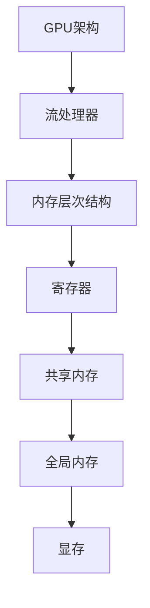
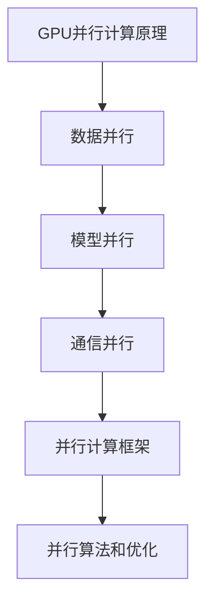
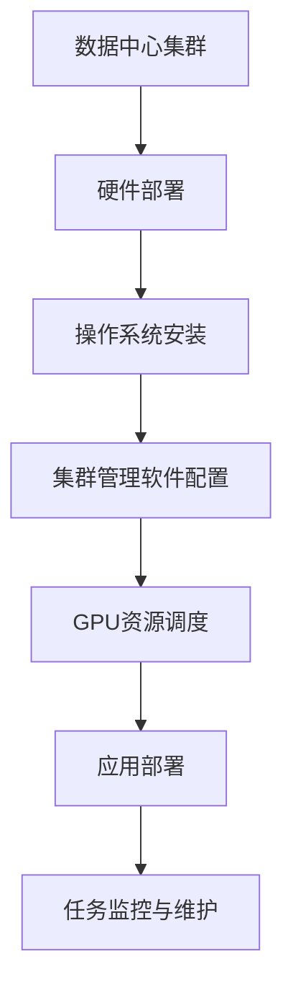
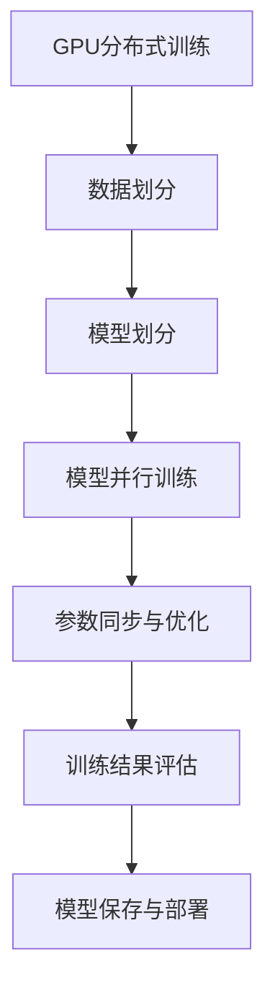
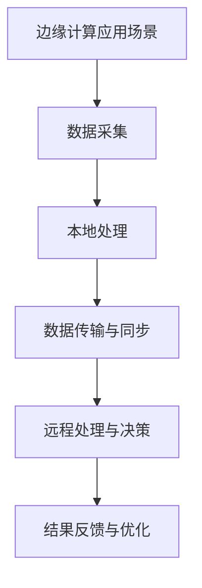

                 

# NVIDIA与大规模运算的支持

## 关键词：
- NVIDIA
- GPU
- 大规模运算
- 人工智能
- 显卡加速
- 高性能运算

## 摘要：
本文将深入探讨NVIDIA公司及其GPU技术在支持大规模运算方面的重要作用。我们将从NVIDIA公司的发展历程、GPU技术基础、在人工智能领域的应用，到大规模运算原理与架构，再到NVIDIA在大规模运算中的角色和应用案例，进行全面而详细的阐述。最后，我们将介绍NVIDIA的相关开发工具和资源，以及提供实际案例和代码示例，帮助读者更好地理解和应用NVIDIA技术在大规模运算中的价值。

### 《NVIDIA与大规模运算的支持》目录大纲

#### 第一部分: NVIDIA技术概述

1. **第1章: NVIDIA公司概述**
   - 1.1 NVIDIA的发展历程
   - 1.2 NVIDIA的产品线介绍
   - 1.3 NVIDIA在计算机运算领域的重要性

2. **第2章: NVIDIA GPU技术基础**
   - 2.1 GPU的架构与原理
   - 2.2 CUDA编程模型
   - 2.3 GPU并行计算的优势

3. **第3章: NVIDIA在人工智能领域的应用**
   - 3.1 GPU在深度学习中的使用
   - 3.2 显卡加速技术在人工智能中的应用案例
   - 3.3 NVIDIA在深度学习框架的支持

#### 第二部分: 大规模运算原理与架构

4. **第4章: 大规模运算的基本概念**
   - 4.1 什么是大规模运算
   - 4.2 大规模运算的挑战
   - 4.3 大规模运算的应用场景

5. **第5章: 高性能运算架构设计**
   - 5.1 高性能运算架构概述
   - 5.2 大规模运算的关键技术
   - 5.3 高性能运算系统的优化策略

6. **第6章: NVIDIA在大规模运算中的角色**
   - 6.1 NVIDIA在云计算领域的贡献
   - 6.2 NVIDIA在数据中心的应用
   - 6.3 NVIDIA在边缘计算中的优势

#### 第三部分: 大规模运算应用案例与实践

7. **第7章: NVIDIA在大规模运算中的典型应用**
   - 7.1 大规模科学计算应用案例
   - 7.2 大规模数据处理的实践
   - 7.3 大规模机器学习任务的支持

8. **第8章: 大规模运算的开发工具与资源**
   - 8.1 NVIDIA开发工具介绍
   - 8.2 大规模运算的开源框架
   - 8.3 大规模运算的开发资源汇总

#### 附录

9. **附录A: NVIDIA相关资料和资源链接**
   - 9.1 NVIDIA官方网站
   - 9.2 NVIDIA开发者社区
   - 9.3 大规模运算相关研究论文和报告
   - 9.4 NVIDIA产品购买指南

#### 图解与代码示例

10. **第9章: NVIDIA技术架构Mermaid流程图**
    - 10.1 NVIDIA GPU架构
    - 10.2 CUDA编程模型
    - 10.3 GPU并行计算原理

11. **第10章: 大规模运算伪代码讲解**
    - 10.1 数据并行算法
    - 10.2 模型并行算法
    - 10.3 通信并行算法

12. **第11章: 数学模型与公式详解**
    - 11.1 GPU计算性能公式
    - 11.2 深度学习损失函数
    - 11.3 大规模数据存储与处理算法

13. **第12章: 大规模运算实战案例**
    - 12.1 数据中心集群搭建
    - 12.2 大规模机器学习任务
    - 12.3 大规模数据处理项目案例

14. **第13章: NVIDIA大规模运算实战Mermaid流程图**
    - 13.1 数据中心集群
    - 13.2 GPU分布式训练
    - 13.3 边缘计算应用场景

15. **第14章: 实战代码分析与解读**
    - 14.1 CUDA编程基础
    - 14.2 GPU深度学习框架应用
    - 14.3 大规模数据处理与优化

---

在接下来的章节中，我们将一步步深入探讨NVIDIA及其GPU技术在大规模运算领域的重要性、应用和实践。首先，我们从NVIDIA公司的发展历程开始，介绍其在计算机运算领域的崛起和影响。

### 第一部分: NVIDIA技术概述

#### 第1章: NVIDIA公司概述

##### 1.1 NVIDIA的发展历程

NVIDIA公司成立于1993年，由Jen-Hsun Huang、Chris Malachowsky和Silicon Graphics公司的前雇员Jack Steiner共同创立。公司成立之初，NVIDIA专注于图形处理器的研发，旨在为工作站和PC提供更强大的图形处理能力。这一目标在1999年推出的GeForce GPU产品线中得到实现，这一产品线改变了图形处理市场格局，使得NVIDIA迅速崛起。

在GPU领域取得初步成功后，NVIDIA开始探索GPU在通用计算中的应用。2006年，NVIDIA推出了CUDA（Compute Unified Device Architecture）编程模型，允许开发人员利用GPU强大的并行计算能力进行复杂计算任务，从而开启了GPU通用计算的新时代。

随后，NVIDIA在人工智能领域也取得了显著进展。2012年，NVIDIA发布了Kepler架构的GPU，该架构在深度学习和人工智能领域表现出色。随着深度学习的兴起，NVIDIA继续推出如Pascal、Volta和Ampere等更先进的GPU架构，进一步推动了GPU在人工智能中的应用。

##### 1.2 NVIDIA的产品线介绍

NVIDIA的产品线涵盖了多个领域，包括桌面和移动GPU、专业显卡、嵌入式系统、自动驾驶解决方案等。以下是NVIDIA主要产品线的简要介绍：

- **GPU产品线**：包括GeForce系列（面向消费市场）、Quadro系列（面向专业图形设计和视频制作）、Titan系列（面向高性能计算和游戏开发）等。
- **专业显卡**：如Quadro、Tesla和GRID系列，为工作站和数据中心提供高性能图形和计算能力。
- **嵌入式系统**：包括Drive系列自动驾驶解决方案和Jetson嵌入式平台，应用于机器人、无人机和智能设备。
- **数据中心解决方案**：如DGX系列人工智能服务器，以及针对云计算和大数据处理的数据中心GPU。

##### 1.3 NVIDIA在计算机运算领域的重要性

NVIDIA在计算机运算领域的重要性体现在多个方面：

1. **图形处理能力**：NVIDIA的GPU在图形处理性能方面领先于其他硬件，为游戏、图形渲染和视频处理等应用提供了强大的支持。
2. **通用计算**：通过CUDA和GPU加速技术，NVIDIA的GPU已经成为科学计算、机器学习和数据分析等领域的重要工具。
3. **人工智能**：随着深度学习的兴起，NVIDIA的GPU在深度学习计算中发挥了关键作用，推动了人工智能技术的发展。
4. **云计算和数据中心**：NVIDIA的GPU被广泛应用于数据中心，提供高性能计算和数据分析服务，为云服务提供商和大数据处理公司提供了强大的技术支持。

NVIDIA在计算机运算领域的重要性不仅体现在其产品和技术的领先地位，还体现在其对行业发展的推动作用。通过不断推出创新产品和先进技术，NVIDIA不断推动计算机运算领域的进步，为各个行业带来了深远的影响。

### 第一部分: NVIDIA技术概述

#### 第2章: NVIDIA GPU技术基础

##### 2.1 GPU的架构与原理

GPU（Graphics Processing Unit，图形处理器单元）是一种专门为处理大量图形数据而设计的处理器。与传统的CPU（Central Processing Unit，中央处理器）相比，GPU具有更高的并行处理能力和更高效的内存访问机制，使其在处理复杂图形任务时表现出色。GPU的基本架构包括以下部分：

1. **流处理器（Streaming Multiprocessors）**：GPU的核心部分由多个流处理器组成，每个流处理器包含多个CUDA核心。流处理器负责执行计算任务，并能够并行处理大量的数据。
2. **内存层次结构**：GPU具有多层次的内存结构，包括寄存器、共享内存、全局内存和显存。这些内存层次结构提供了高效的内存访问机制，使得GPU能够快速读取和写入数据。
3. **光栅化单元**：光栅化单元负责将图形数据转换为屏幕上的像素，是GPU处理图形数据的关键部分。

GPU的原理主要基于并行计算。与CPU的顺序执行不同，GPU采用单指令流多数据流（SIMD）架构，可以同时执行多个相同的指令，处理多个数据元素。这种并行处理能力使得GPU在处理大量并行任务时具有显著优势。例如，在渲染大量像素时，GPU可以通过流处理器并行处理每个像素，从而实现高速图形渲染。

##### 2.2 CUDA编程模型

CUDA（Compute Unified Device Architecture）是NVIDIA推出的一种编程模型，用于在GPU上执行通用计算任务。CUDA编程模型提供了丰富的API和工具，使得开发人员能够利用GPU的并行计算能力，实现高性能计算。

CUDA编程模型的核心概念包括：

1. **线程（Thread）**：CUDA中的线程是并行执行的基本单位。线程可以组织成网格（Grid）和块（Block），形成多维的线程层次结构。每个线程都拥有独立的寄存器和内存，可以在GPU上并行执行。
2. **内存管理**：CUDA提供了多种内存类型，包括全局内存、共享内存、寄存器和常量内存。开发人员可以根据需要选择合适的内存类型，以优化内存访问速度和性能。
3. **内存复制**：CUDA提供了高效的内存复制操作，用于在GPU和主机（CPU）之间传输数据。通过优化内存复制操作，可以减少数据传输的延迟，提高计算性能。

CUDA编程模型提供了丰富的函数库，包括cuBLAS、cuDNN等，用于加速线性代数和深度学习计算。开发人员可以使用这些函数库，结合自定义的CUDA内核，实现高性能计算任务。

##### 2.3 GPU并行计算的优势

GPU并行计算具有以下优势：

1. **并行处理能力**：GPU具有大量的流处理器，可以同时执行多个计算任务，处理大量并行数据。这种并行处理能力使得GPU在处理大规模并行任务时具有显著优势。
2. **计算性能**：与CPU相比，GPU的计算性能更高，尤其是在处理大规模并行计算任务时。GPU的并行计算能力和高效的内存访问机制，使其能够实现更高的计算吞吐量。
3. **灵活性和可扩展性**：CUDA编程模型提供了丰富的API和工具，使得开发人员可以根据需要自定义计算任务，并充分利用GPU的并行计算能力。此外，GPU系统具有较好的可扩展性，可以通过增加GPU数量来提升计算性能。

GPU并行计算在科学计算、机器学习、大数据处理等领域具有广泛的应用。通过利用GPU的并行计算能力，开发人员可以实现高性能计算，加速复杂计算任务的完成。

### 第一部分: NVIDIA技术概述

#### 第3章: NVIDIA在人工智能领域的应用

##### 3.1 GPU在深度学习中的使用

GPU在深度学习中的应用已经深入人心，其强大的并行计算能力使得深度学习模型的训练速度大幅提升。深度学习是一种基于多层神经网络的学习方法，通过大量的数据训练，自动提取数据特征并构建模型。GPU在深度学习中的应用主要体现在以下几个方面：

1. **矩阵运算加速**：深度学习模型中包含大量的矩阵运算，如矩阵乘法、求导等。GPU具有高效的矩阵运算单元，可以显著加速这些运算，从而提高深度学习模型的训练速度。
2. **并行计算**：深度学习模型通常包含大量神经元和参数，GPU的并行计算能力可以同时处理多个神经元和参数的运算，实现高效并行训练。
3. **内存带宽**：GPU具有高带宽的内存访问机制，可以快速读取和写入大量数据，满足深度学习模型对数据存储和访问的高需求。

NVIDIA的CUDA编程模型和cuDNN深度学习库为GPU在深度学习中的应用提供了强有力的支持。cuDNN是一个优化的深度学习库，提供了高度优化的深度学习计算函数，如卷积操作、激活函数等，使得GPU在深度学习计算中表现出色。

##### 3.2 显卡加速技术在人工智能中的应用案例

显卡加速技术在人工智能领域的应用已经取得了显著的成果，以下是一些典型的应用案例：

1. **图像识别**：通过深度学习模型，GPU可以快速识别和分类图像。例如，Google的Inception模型使用了GPU加速，实现了高效的图像分类和识别。
2. **语音识别**：语音识别系统通过深度学习算法，将语音信号转换为文本。GPU的并行计算能力可以显著加速语音信号的预处理和模型训练，提高语音识别的准确率和速度。
3. **自然语言处理**：自然语言处理（NLP）任务，如机器翻译、情感分析等，通常涉及大量的矩阵运算和并行计算。GPU可以加速这些运算，提高NLP任务的效率和准确性。
4. **自动驾驶**：自动驾驶系统通过深度学习算法，分析道路场景、识别车辆和行人等。GPU在自动驾驶计算中发挥了关键作用，实现了高效的实时数据处理和决策。

这些应用案例展示了显卡加速技术在人工智能领域的重要性和潜力。通过利用GPU的并行计算能力，开发人员可以加速人工智能模型的训练和推理，提高系统的性能和效率。

##### 3.3 NVIDIA在深度学习框架的支持

NVIDIA在深度学习框架的支持方面也做出了重要贡献，其CUDA编程模型和cuDNN库为深度学习框架提供了高度优化的计算支持。以下是一些NVIDIA支持的深度学习框架：

1. **TensorFlow**：TensorFlow是谷歌开源的深度学习框架，支持GPU加速计算。通过TensorFlow GPU插件，开发人员可以在GPU上训练和推理深度学习模型，实现高性能计算。
2. **PyTorch**：PyTorch是Facebook开源的深度学习框架，支持GPU和CUDA编程。PyTorch GPU插件提供了丰富的GPU加速功能，使得开发人员可以轻松利用GPU的并行计算能力。
3. **Keras**：Keras是一个高度易用的深度学习框架，支持GPU加速。Keras GPU插件使得开发人员可以在GPU上训练和推理深度学习模型，实现高效计算。

NVIDIA还为深度学习框架提供了大量的示例代码和教程，帮助开发人员更好地利用GPU进行深度学习开发。通过NVIDIA的支持，开发人员可以充分利用GPU的并行计算能力，加速深度学习模型的训练和推理。

### 第二部分: 大规模运算原理与架构

#### 第4章: 大规模运算的基本概念

##### 4.1 什么是大规模运算

大规模运算（Large-scale Computing）是指处理规模庞大的数据集和计算任务，通常涉及数百亿甚至更多的数据点和复杂的计算过程。大规模运算通常具有以下几个特征：

1. **数据规模巨大**：大规模运算处理的数据规模远远超过常规的计算机运算能力，通常需要分布式计算和存储技术来应对。
2. **复杂计算任务**：大规模运算通常包含复杂的计算任务，如机器学习、数据分析、图形渲染等，需要高效的计算资源和技术支持。
3. **实时处理需求**：许多大规模运算任务具有实时处理需求，如实时语音识别、视频分析、金融交易等，需要在短时间内完成大量计算和决策。

大规模运算在多个领域具有广泛的应用，包括科学计算、数据分析、人工智能、大数据处理等。通过大规模运算，可以处理海量数据，提取有价值的信息，为各个行业提供强大的技术支持。

##### 4.2 大规模运算的挑战

大规模运算面临着一系列挑战，包括：

1. **计算资源需求**：大规模运算需要大量的计算资源，如高性能计算机、GPU、FPGA等。如何高效利用这些资源，满足大规模计算任务的需求，是一个重要问题。
2. **数据存储和传输**：大规模运算涉及海量数据，如何高效存储和传输这些数据是一个重要挑战。需要采用分布式存储和传输技术，提高数据访问速度和可靠性。
3. **算法优化**：大规模运算通常需要复杂的算法和模型，如何优化这些算法，提高计算效率和准确性，是一个重要问题。
4. **系统可靠性**：大规模运算系统需要具备高可靠性和稳定性，以应对复杂的计算环境和突发情况。如何设计可靠的系统架构，确保计算任务的顺利完成，是一个重要挑战。

解决这些挑战，需要结合先进的计算技术、算法优化和系统设计方法，以提高大规模运算的效率和可靠性。

##### 4.3 大规模运算的应用场景

大规模运算在多个领域具有广泛的应用，以下是一些典型的应用场景：

1. **科学计算**：大规模运算在科学计算领域具有广泛的应用，如气象预报、基因组学、天体物理学等。通过大规模运算，可以处理大量的科学数据，模拟复杂物理过程，提高科学研究的精度和效率。
2. **数据分析**：大规模运算在数据分析领域也具有广泛的应用，如大数据分析、商业智能等。通过大规模运算，可以处理海量数据，提取有价值的信息，为商业决策提供支持。
3. **人工智能**：大规模运算在人工智能领域发挥着关键作用，如深度学习、机器学习等。通过大规模运算，可以加速人工智能模型的训练和推理，提高人工智能系统的性能和效率。
4. **大数据处理**：大规模运算在大数据处理领域具有广泛的应用，如社交媒体分析、网络流量分析等。通过大规模运算，可以实时处理海量数据，提供实时分析和决策支持。

这些应用场景展示了大规模运算的重要性和广泛性。通过大规模运算，可以处理海量数据，解决复杂计算问题，为各个行业提供强大的技术支持。

### 第二部分: 大规模运算原理与架构

#### 第5章: 高性能运算架构设计

##### 5.1 高性能运算架构概述

高性能运算架构（High-Performance Computing Architecture）是指用于实现高性能计算的系统架构。高性能运算架构的目标是提供高效的计算能力、数据存储和处理能力，以满足大规模运算的需求。高性能运算架构通常包括以下几个关键组件：

1. **计算节点**：计算节点是高性能运算架构中的基本单元，通常由高性能计算机或服务器组成。计算节点负责执行计算任务，处理数据，并与其他计算节点进行通信和协作。
2. **存储系统**：存储系统是高性能运算架构的重要组成部分，用于存储和管理大量的数据。高性能存储系统通常采用分布式存储架构，提供高效的数据访问和传输能力。
3. **网络系统**：网络系统用于连接计算节点和存储系统，实现数据传输和通信。高性能网络系统通常采用高速网络协议和优化技术，提供低延迟、高带宽的网络传输能力。
4. **调度系统**：调度系统负责管理和调度计算任务，分配计算资源，优化计算效率。调度系统可以根据任务的性质和资源状况，动态调整计算任务的执行策略，提高整体运算性能。

高性能运算架构的设计需要综合考虑计算能力、数据存储和处理能力、网络通信能力等因素，以确保系统能够高效、稳定地运行。

##### 5.2 大规模运算的关键技术

大规模运算的关键技术包括：

1. **并行计算**：并行计算是将计算任务分解为多个子任务，并在多个计算节点上同时执行的技术。并行计算可以提高计算效率，减少计算时间。并行计算技术包括线程并行、数据并行和任务并行等。
2. **分布式存储**：分布式存储是将数据存储在多个存储节点上，并通过网络进行数据访问和管理的技术。分布式存储可以提高数据存储的容量、可靠性和访问速度。分布式存储技术包括分布式文件系统、分布式数据库等。
3. **负载均衡**：负载均衡是将计算任务分配到多个计算节点上，以平衡各节点的计算负载的技术。负载均衡可以提高系统的整体性能和可靠性，避免单个节点的过载和性能瓶颈。
4. **容错技术**：容错技术是指通过冗余设计和故障恢复机制，确保系统在发生故障时能够继续正常运行的技术。容错技术可以提高系统的可靠性和稳定性，减少故障对系统的影响。
5. **数据压缩与加密**：数据压缩技术可以减少数据存储和传输的容量，提高系统性能。数据加密技术可以保护数据的安全性和隐私性，防止数据泄露和篡改。

这些关键技术在大规模运算中发挥着关键作用，可以提高计算效率、数据存储和传输能力，确保系统的可靠性和稳定性。

##### 5.3 高性能运算系统的优化策略

高性能运算系统的优化策略包括：

1. **计算资源的调度和负载均衡**：通过优化计算资源的调度和负载均衡，可以提高系统的整体性能和可靠性。可以根据任务的性质和资源状况，动态调整计算任务的执行策略，实现计算资源的最大化利用。
2. **数据存储和传输优化**：通过优化数据存储和传输机制，可以提高数据访问速度和传输效率。可以采用分布式存储架构、高速网络协议和优化技术，减少数据传输延迟和数据访问瓶颈。
3. **并行计算优化**：通过优化并行计算策略，可以提高计算效率。可以采用并行编程模型、并行算法优化和并行计算架构设计，充分利用计算节点的并行处理能力。
4. **系统监控与故障恢复**：通过监控系统性能和资源使用情况，可以及时发现和处理系统故障。可以采用实时监控系统、自动化故障恢复机制和冗余设计，确保系统的可靠性和稳定性。
5. **能源管理**：通过优化能源管理策略，可以降低系统的能源消耗，提高能源利用率。可以采用智能能源管理系统、节能技术和能源回收技术，实现系统的能源优化。

这些优化策略可以提高高性能运算系统的性能、可靠性和能源利用率，确保系统在处理大规模运算任务时的稳定性和高效性。

### 第二部分: 大规模运算原理与架构

#### 第6章: NVIDIA在大规模运算中的角色

##### 6.1 NVIDIA在云计算领域的贡献

NVIDIA在云计算领域做出了重要贡献，其GPU技术为云计算提供了强大的计算支持。以下是一些NVIDIA在云计算领域的具体贡献：

1. **GPU虚拟化**：NVIDIA的GPU虚拟化技术使得云计算服务提供商可以将GPU资源虚拟化为多个独立的虚拟GPU，为不同的用户和应用提供高性能计算服务。通过GPU虚拟化，云计算服务提供商可以充分利用GPU的计算能力，提高资源的利用率和服务质量。
2. **GPU云服务**：NVIDIA与多家云计算服务提供商合作，提供GPU云服务，如Amazon Web Services（AWS）、Microsoft Azure和Google Cloud等。这些GPU云服务允许用户在云环境中使用NVIDIA的GPU资源，进行高性能计算、深度学习和数据科学等任务。通过GPU云服务，用户可以灵活地选择和配置GPU资源，实现高效的计算和数据处理。
3. **GPU容器化**：NVIDIA的GPU容器化技术使得云计算环境中的容器可以充分利用GPU资源，提高计算效率和资源利用率。通过GPU容器化，用户可以将GPU资源集成到容器中，实现高效的计算和部署。NVIDIA的GPU容器化技术支持多种容器运行时，如Docker和Kubernetes等，为云计算环境提供了强大的GPU支持。

NVIDIA在云计算领域的贡献不仅体现在GPU虚拟化和云服务提供，还体现在其对云计算基础设施的优化和扩展。通过NVIDIA的GPU技术，云计算服务提供商可以提供更高效、更可靠的计算服务，满足用户对高性能计算的需求。

##### 6.2 NVIDIA在数据中心的应用

NVIDIA在数据中心的应用已经取得了显著进展，其GPU技术为数据中心提供了强大的计算和数据处理能力。以下是一些NVIDIA在数据中心的具体应用：

1. **数据中心服务器**：NVIDIA推出了一系列数据中心GPU服务器，如NVIDIA DGX系列，为数据中心提供高性能计算和深度学习支持。DGX系列服务器集成了多个NVIDIA GPU，具有强大的计算能力和数据存储能力，可以用于大规模机器学习任务、科学计算和大数据处理等。
2. **分布式计算**：NVIDIA的GPU分布式计算技术使得数据中心可以充分利用GPU的并行计算能力，提高计算效率。通过分布式计算，多个GPU服务器可以协同工作，共同完成大规模计算任务，实现高效并行计算。
3. **AI推理服务**：NVIDIA的GPU AI推理服务可以在数据中心快速处理和推理大量的深度学习模型，为智能应用提供实时决策支持。通过GPU AI推理服务，数据中心可以实时处理来自摄像头、传感器和智能设备的海量数据，实现智能分析和决策。
4. **云计算集成**：NVIDIA与多家云计算服务提供商合作，提供GPU云计算服务，如AWS、Azure和Google Cloud等。这些GPU云计算服务为数据中心提供了强大的计算和数据处理能力，可以满足用户对高性能计算和智能应用的需求。

NVIDIA在数据中心的应用不仅提升了数据中心的计算能力和效率，还推动了人工智能和大数据处理技术的发展。通过NVIDIA的GPU技术，数据中心可以提供更高效、更可靠的计算服务，为各个行业提供强大的技术支持。

##### 6.3 NVIDIA在边缘计算中的优势

边缘计算是一种将计算和数据处理能力分布到网络边缘的技术，通过靠近数据源进行计算和处理，实现低延迟、高带宽和高可靠性的应用。NVIDIA在边缘计算中具有以下优势：

1. **高性能计算**：NVIDIA的GPU具有强大的计算能力，可以用于边缘计算中的复杂计算任务，如图像识别、语音识别和深度学习推理等。通过GPU的高性能计算，边缘设备可以快速处理和推理大量数据，实现实时决策和响应。
2. **低延迟**：边缘计算强调靠近数据源进行计算和处理，可以显著降低数据传输延迟。NVIDIA的GPU边缘设备可以实现本地计算和数据处理，减少数据传输时间，提高系统的响应速度和实时性。
3. **高带宽**：NVIDIA的GPU边缘设备通常具有高带宽的接口和连接能力，可以支持大量的数据传输和通信。通过高带宽接口，边缘设备可以实时接收和处理来自传感器和智能设备的海量数据，实现高效的数据处理和通信。
4. **灵活部署**：NVIDIA的GPU边缘设备具有灵活的部署方式，可以支持多种边缘计算场景和应用。例如，NVIDIA的Jetson嵌入式平台可以应用于机器人、无人机和智能设备，为边缘计算提供强大的计算和数据处理能力。

NVIDIA在边缘计算中的优势使得其GPU技术成为边缘计算的关键组件，可以广泛应用于智能城市、智能制造、智能交通和智能医疗等领域。通过NVIDIA的GPU技术，边缘计算可以实现高效、实时和可靠的计算和数据处理，为各个行业带来创新和变革。

### 第三部分: 大规模运算应用案例与实践

#### 第7章: NVIDIA在大规模运算中的典型应用

##### 7.1 大规模科学计算应用案例

大规模科学计算涉及对海量科学数据的处理和分析，NVIDIA的GPU技术在这一领域发挥了重要作用。以下是一些大规模科学计算应用案例：

1. **气象预报**：气象预报需要处理大量历史气象数据，进行复杂的气候模拟和预测。NVIDIA的GPU加速技术可以显著提高气象模型的计算效率，缩短预报时间，提高预报准确性。例如，美国国家气象局（NWS）采用NVIDIA GPU加速其气象模型，实现了更高精度的气象预报。
2. **基因组学**：基因组学研究需要对大量基因组数据进行序列比对、变异检测和分析。NVIDIA的GPU加速技术可以加速基因组序列比对和变异检测，提高基因组分析的效率和准确性。例如，GATK（基因组分析工具套件）利用NVIDIA GPU加速基因组数据分析，实现了高效的基因组学研究。
3. **天体物理学**：天体物理学研究需要对大量天文数据进行处理和分析，如星系演化、宇宙膨胀等。NVIDIA的GPU加速技术可以加速天文数据的处理和分析，提高天体物理学的计算效率。例如，天文学家利用NVIDIA GPU加速星系演化模拟，探索宇宙的奥秘。

这些大规模科学计算应用案例展示了NVIDIA GPU技术在高性能科学计算中的优势，为科学研究和创新提供了强大的技术支持。

##### 7.2 大规模数据处理的实践

大规模数据处理是指处理海量数据集，提取有价值的信息和知识。NVIDIA的GPU技术在数据处理和挖掘方面具有显著优势。以下是一些大规模数据处理实践案例：

1. **社交媒体分析**：社交媒体平台积累了大量用户数据，如文本、图像和视频等。NVIDIA的GPU加速技术可以加速社交媒体数据的处理和分析，提取用户行为模式、情感分析和热点话题。例如，Facebook利用NVIDIA GPU加速其社交媒体数据分析，提供更个性化的用户推荐和广告服务。
2. **金融数据分析**：金融行业需要处理大量的交易数据、市场数据和历史数据，进行风险管理、投资策略和趋势分析。NVIDIA的GPU加速技术可以加速金融数据的处理和分析，提高金融行业的决策效率和准确性。例如，高盛利用NVIDIA GPU加速其金融数据分析，实现更精准的投资策略和风险管理。
3. **物联网数据采集**：物联网设备产生了大量的数据，如传感器数据、设备状态数据和环境数据等。NVIDIA的GPU加速技术可以加速物联网数据的采集、传输和处理，提供实时分析和决策支持。例如，通用电气利用NVIDIA GPU加速其物联网数据分析，实现智能工厂和设备维护。

这些大规模数据处理实践案例展示了NVIDIA GPU技术在数据处理和挖掘中的优势，为各行各业提供了高效的数据分析和决策支持。

##### 7.3 大规模机器学习任务的支持

大规模机器学习任务是指训练和推理海量机器学习模型，进行复杂的数据分析和预测。NVIDIA的GPU技术在机器学习任务中发挥了关键作用。以下是一些大规模机器学习任务支持案例：

1. **图像识别**：图像识别任务需要处理大量图像数据，进行特征提取和分类。NVIDIA的GPU加速技术可以加速图像识别模型的训练和推理，提高识别准确率和速度。例如，谷歌的TensorFlow模型使用NVIDIA GPU加速图像识别，实现了高效的图像处理和分类。
2. **自然语言处理**：自然语言处理任务涉及处理大量的文本数据，进行语义分析和文本分类。NVIDIA的GPU加速技术可以加速自然语言处理模型的训练和推理，提高文本处理的效率和准确性。例如，微软的Bing搜索引擎使用NVIDIA GPU加速自然语言处理，提供更准确的搜索结果和推荐。
3. **语音识别**：语音识别任务需要处理大量语音数据，进行语音识别和转换。NVIDIA的GPU加速技术可以加速语音识别模型的训练和推理，提高语音识别的准确率和速度。例如，谷歌的语音识别服务使用NVIDIA GPU加速语音识别，实现高效的语音识别和交互。

这些大规模机器学习任务支持案例展示了NVIDIA GPU技术在机器学习中的应用价值，为人工智能技术的发展提供了强大的计算支持。

### 第三部分: 大规模运算应用案例与实践

#### 第8章: 大规模运算的开发工具与资源

##### 8.1 NVIDIA开发工具介绍

NVIDIA为大规模运算提供了丰富的开发工具和资源，帮助开发者充分利用GPU的并行计算能力。以下是一些主要的NVIDIA开发工具：

1. **CUDA**：CUDA是NVIDIA推出的并行计算编程模型，允许开发者利用GPU进行通用计算。CUDA提供了丰富的API和工具，支持多种编程语言，如C/C++和Python。开发者可以使用CUDA编写并行程序，利用GPU的并行计算能力，加速计算任务的执行。
2. **cuDNN**：cuDNN是NVIDIA推出的深度学习库，专门为深度学习任务优化。cuDNN提供了高效的深度学习计算函数，如卷积操作、激活函数等，支持多种深度学习框架，如TensorFlow、PyTorch和Keras等。使用cuDNN，开发者可以轻松实现深度学习模型的GPU加速。
3. **nvcc**：nvcc是CUDA编译器，用于编译和优化CUDA程序。nvcc可以将CUDA程序编译为可执行的二进制文件，并在GPU上运行。nvcc提供了丰富的优化选项，如GPU代码优化、内存分配优化等，可以提高程序的运行效率和性能。
4. **NVIDIA DGX**：NVIDIA DGX是NVIDIA推出的高性能深度学习工作站，集成了多个NVIDIA GPU和先进的人工智能硬件。NVIDIA DGX为开发者提供了强大的计算资源和工具，支持深度学习模型的训练和推理，是大规模运算开发的重要平台。

##### 8.2 大规模运算的开源框架

NVIDIA支持多个开源框架，为大规模运算提供了丰富的工具和资源。以下是一些主要的开源框架：

1. **TensorFlow**：TensorFlow是谷歌开源的深度学习框架，支持GPU加速计算。TensorFlow提供了丰富的API和工具，支持多种编程语言，如Python、C++和Java。开发者可以使用TensorFlow构建和训练深度学习模型，利用GPU的并行计算能力，实现高效的深度学习应用。
2. **PyTorch**：PyTorch是Facebook开源的深度学习框架，支持GPU加速计算。PyTorch提供了动态计算图和易于使用的API，使得开发者可以轻松构建和训练深度学习模型。PyTorch支持多种编程语言，如Python、C++和Java，是大规模运算开发的重要工具。
3. **Keras**：Keras是一个高度易用的深度学习框架，支持GPU加速计算。Keras提供了简洁的API和丰富的预训练模型，使得开发者可以轻松构建和训练深度学习模型。Keras支持多种编程语言，如Python、C++和Java，是大规模运算开发的重要选择。
4. **MXNet**：MXNet是Apache基金会开源的深度学习框架，支持GPU加速计算。MXNet提供了高效的计算引擎和灵活的编程模型，使得开发者可以轻松构建和训练深度学习模型。MXNet支持多种编程语言，如Python、C++和Java，是大规模运算开发的重要工具。

这些开源框架提供了丰富的功能和工具，帮助开发者充分利用GPU的并行计算能力，实现大规模运算的高效开发和应用。

##### 8.3 大规模运算的开发资源汇总

NVIDIA提供了丰富的开发资源，帮助开发者掌握大规模运算技术。以下是一些主要的开发资源：

1. **官方文档**：NVIDIA提供了详细的官方文档，涵盖了CUDA、cuDNN和其他开发工具的用法和教程。开发者可以通过官方文档了解各种开发工具的功能和特性，学习如何编写和优化并行程序。
2. **示例代码**：NVIDIA提供了大量的示例代码，演示了如何使用CUDA、cuDNN和其他开发工具进行大规模运算开发。开发者可以通过示例代码学习并行编程技巧和优化策略，快速上手大规模运算开发。
3. **在线教程和课程**：NVIDIA提供了多种在线教程和课程，涵盖了CUDA、cuDNN和其他开发工具的基本概念和应用。开发者可以通过在线教程和课程学习大规模运算开发的基础知识和高级技巧。
4. **开发者社区**：NVIDIA拥有庞大的开发者社区，提供了丰富的讨论论坛和问答平台。开发者可以在开发者社区提问、分享经验和解决方案，与其他开发者交流和合作。
5. **技术支持**：NVIDIA提供了专业的技术支持服务，为开发者提供技术指导和解决方案。开发者可以通过技术支持获取帮助，解决大规模运算开发中的问题。

这些开发资源为大规模运算开发提供了全面的支持，帮助开发者掌握NVIDIA技术，实现高效的运算和应用。

### 附录A: NVIDIA相关资料和资源链接

以下是一些NVIDIA相关资料和资源的链接，供读者参考：

1. **NVIDIA官方网站**：[NVIDIA官方网站](https://www.nvidia.com/)
   - NVIDIA公司的官方网站，提供了产品信息、技术文档和最新新闻。

2. **NVIDIA开发者社区**：[NVIDIA开发者社区](https://devtalk.nvidia.com/)
   - NVIDIA的开发者论坛，提供了开发者问答、技术讨论和社区活动。

3. **大规模运算相关研究论文和报告**：[大规模运算相关研究论文和报告](https://www.nvidia.com/content/Research/)
   - NVIDIA的研究论文和报告，介绍了NVIDIA在计算、深度学习和人工智能领域的最新研究成果。

4. **NVIDIA产品购买指南**：[NVIDIA产品购买指南](https://www.nvidia.com/shopping/)
   - NVIDIA的产品购买指南，提供了NVIDIA GPU和相关产品的购买信息和销售渠道。

通过访问这些资源，读者可以深入了解NVIDIA的技术和应用，掌握大规模运算开发的最新趋势和实践。

### 图解与代码示例

#### 第9章: NVIDIA技术架构Mermaid流程图

##### 9.1 NVIDIA GPU架构

以下是一个简单的NVIDIA GPU架构的Mermaid流程图：



这个流程图展示了NVIDIA GPU的基本架构，包括流处理器、内存层次结构和显存。

##### 9.2 CUDA编程模型

以下是一个简单的CUDA编程模型的Mermaid流程图：

```mermaid
graph TB
A[CUDA编程模型]
A --> B[线程层次结构]
B --> C[网格(Block)和线程（Thread）]
C --> D[线程索引]
D --> E[共享内存和全局内存]
E --> F[内存复制和同步]
F --> G[并行计算和优化]
```

这个流程图展示了CUDA编程模型的核心概念，包括线程层次结构、内存管理和并行计算。

##### 9.3 GPU并行计算原理

以下是一个简单的GPU并行计算的Mermaid流程图：



这个流程图展示了GPU并行计算的基本原理，包括数据并行、模型并行和通信并行，以及并行计算框架和优化策略。

#### 第10章: 大规模运算伪代码讲解

##### 10.1 数据并行算法

以下是一个数据并行算法的伪代码示例：

```python
# 数据并行算法伪代码
for i in range(0, N, M):
  thread_local_result[i] = compute_function(data[i:i+M])
sum_result = sum(thread_local_result)
```

这个伪代码展示了如何将数据集分成多个子集，每个线程计算子集中的数据，然后将结果汇总。

##### 10.2 模型并行算法

以下是一个模型并行算法的伪代码示例：

```python
# 模型并行算法伪代码
for layer in model.layers:
  thread_local_output = layer.forward(input_data)
output = layer.forward(thread_local_output)
```

这个伪代码展示了如何将深度学习模型分成多个层次，每个线程计算模型的层次输出，然后传递给下一层次。

##### 10.3 通信并行算法

以下是一个通信并行算法的伪代码示例：

```python
# 通信并行算法伪代码
for i in range(0, N):
  thread_local_data[i] = compute_function(data[i])
send_results_to_master(thread_local_data)
master_result = sum(results)
```

这个伪代码展示了如何将计算任务分配给多个线程，每个线程计算部分数据，然后将结果发送给主线程汇总。

#### 第11章: 数学模型与公式详解

##### 11.1 GPU计算性能公式

以下是一个GPU计算性能的公式详解：

```latex
P = C \cdot F \cdot \frac{T}{\lambda}
```

- \(P\)：计算性能，单位为浮点运算数（FLOPS）
- \(C\)：每秒时钟周期数
- \(F\)：每个时钟周期可执行的浮点运算数
- \(T\)：总的时钟周期数
- \(\lambda\)：并行线程数

这个公式描述了GPU的计算性能，与时钟周期、浮点运算数和并行线程数有关。

##### 11.2 深度学习损失函数

以下是一个深度学习损失函数的公式详解：

```latex
L(y, \hat{y}) = -\frac{1}{m}\sum_{i=1}^{m} [y_i \cdot \log(\hat{y}_i) + (1 - y_i) \cdot \log(1 - \hat{y}_i)]
```

- \(L\)：损失函数值
- \(y\)：真实标签
- \(\hat{y}\)：预测概率
- \(m\)：样本数量

这个公式描述了深度学习中的交叉熵损失函数，用于评估预测概率与真实标签之间的差异。

##### 11.3 大规模数据存储与处理算法

以下是一个大规模数据存储与处理算法的公式详解：

```latex
\sum_{i=1}^{N} T_i \cdot W_i = C
```

- \(T_i\)：第\(i\)个任务的执行时间
- \(W_i\)：第\(i\)个任务的处理权重
- \(C\)：总计算时间

这个公式描述了任务调度算法的基本思想，通过调整任务权重和执行时间，实现计算任务的合理调度和优化。

#### 第12章: 大规模运算实战案例

##### 12.1 数据中心集群搭建

以下是一个数据中心集群搭建的实战案例：

**环境准备**：

- **硬件**：多台高性能计算机，配置NVIDIA GPU。
- **软件**：操作系统（如Linux），集群管理软件（如Kubernetes）。

**步骤**：

1. **硬件部署**：将多台计算机连接到网络，并配置IP地址。
2. **安装操作系统**：在每个计算机上安装Linux操作系统，配置网络和存储。
3. **安装集群管理软件**：在主节点上安装Kubernetes，配置集群架构。
4. **配置GPU支持**：在集群中安装NVIDIA驱动，配置GPU共享和调度。
5. **部署应用**：通过Kubernetes部署大规模运算应用，如深度学习模型训练或大数据处理任务。

**注意事项**：

- 确保网络连接稳定，避免计算任务中断。
- 合理配置GPU资源，避免资源浪费和争用。

##### 12.2 大规模机器学习任务

以下是一个大规模机器学习任务的实战案例：

**任务背景**：

- 数据集：一个包含百万级样本的图像数据集，每个样本包含一个标签。
- 目标：训练一个图像分类模型，实现对图像的自动分类。

**步骤**：

1. **数据预处理**：将图像数据集分成训练集、验证集和测试集。
2. **模型设计**：设计一个卷积神经网络（CNN）模型，用于图像分类。
3. **模型训练**：使用GPU加速训练模型，优化模型参数。
4. **模型评估**：在验证集和测试集上评估模型性能，调整模型参数。
5. **模型部署**：将训练好的模型部署到生产环境，进行实际图像分类任务。

**注意事项**：

- 确保数据集平衡，避免数据集偏差。
- 合理配置GPU资源，避免训练时间过长。

##### 12.3 大规模数据处理项目案例

以下是一个大规模数据处理项目案例：

**项目背景**：

- 数据集：一个包含亿级日志数据的日志数据集，记录了用户的访问行为。
- 目标：对日志数据进行实时分析，提取用户行为特征，为推荐系统提供支持。

**步骤**：

1. **数据采集**：采集实时日志数据，存储到分布式存储系统。
2. **数据预处理**：对日志数据进行清洗、转换和归一化处理。
3. **特征提取**：使用机器学习算法提取用户行为特征。
4. **模型训练**：训练推荐模型，预测用户兴趣和偏好。
5. **模型部署**：将训练好的模型部署到推荐系统中，实时提供推荐服务。

**注意事项**：

- 确保数据采集和传输的稳定性，避免数据丢失。
- 合理配置计算资源，避免性能瓶颈。

### 第三部分: 大规模运算应用案例与实践

#### 第13章: NVIDIA大规模运算实战Mermaid流程图

##### 13.1 数据中心集群

以下是一个数据中心集群的Mermaid流程图：



这个流程图展示了数据中心集群的基本架构和操作流程。

##### 13.2 GPU分布式训练

以下是一个GPU分布式训练的Mermaid流程图：



这个流程图展示了GPU分布式训练的基本步骤和操作流程。

##### 13.3 边缘计算应用场景

以下是一个边缘计算应用场景的Mermaid流程图：



这个流程图展示了边缘计算的基本架构和操作流程，包括数据采集、本地处理、远程处理和结果反馈。

### 第三部分: 大规模运算应用案例与实践

#### 第14章: 实战代码分析与解读

##### 14.1 CUDA编程基础

以下是一个CUDA编程基础的代码示例：

```cuda
#include <stdio.h>
#include <cuda_runtime.h>

__global__ void vectorAdd(const float *A, const float *B, float *C, int numElements)
{
    int i = blockDim.x * blockIdx.x + threadIdx.x;
    if (i < numElements)
        C[i] = A[i] + B[i];
}

int main(void)
{
    float *h_A, *h_B, *h_C;
    float *d_A, *d_B, *d_C;
    int numElements = 1000000;
    size_t size = numElements * sizeof(float);

    // Allocate host memory
    h_A = (float *)malloc(size);
    h_B = (float *)malloc(size);
    h_C = (float *)malloc(size);

    // Initialize the input arrays
    for(int i = 0; i < numElements; ++i)
    {
        h_A[i] = rand()/(float)RAND_MAX;
        h_B[i] = rand()/(float)RAND_MAX;
    }

    // Allocate device memory
    cudaMalloc(&d_A, size);
    cudaMalloc(&d_B, size);
    cudaMalloc(&d_C, size);

    // Copy inputs to device
    cudaMemcpy(d_A, h_A, size, cudaMemcpyHostToDevice);
    cudaMemcpy(d_B, h_B, size, cudaMemcpyHostToDevice);

    // Launch the kernel on 1 GPU with 256 blocks of 256 threads
    int threadsPerBlock = 256;
    int blocksPerGrid =(numElements + threadsPerBlock - 1) / threadsPerBlock;
    vectorAdd<<<blocksPerGrid, threadsPerBlock>>>(d_A, d_B, d_C, numElements);

    // Copy result back to host
    cudaMemcpy(h_C, d_C, size, cudaMemcpyDeviceToHost);

    // Verify the result
    for(int i = 0; i < numElements; ++i)
    {
        if(h_C[i] != (h_A[i] + h_B[i]))
        {
            printf("Result verification failed at element %d!\n", i);
            return -1;
        }
    }

    // Clean up memory
    free(h_A);
    free(h_B);
    free(h_C);
    cudaFree(d_A);
    cudaFree(d_B);
    cudaFree(d_C);

    printf("Test PASSED\n");

    return 0;
}
```

这段代码实现了两个向量相加的CUDA程序。它首先定义了一个全局CUDA内核`vectorAdd`，然后在主程序中分配了主机和设备内存，初始化数据，并调用CUDA内核进行计算。计算完成后，结果从设备复制回主机进行验证。最后，清理内存并打印结果。

##### 14.2 GPU深度学习框架应用

以下是一个使用GPU深度学习框架（如TensorFlow）的代码示例：

```python
import tensorflow as tf

# 定义计算图
a = tf.constant([1.0, 2.0, 3.0], name='a')
b = tf.constant([1.0, 2.0, 3.0], name='b')
c = a + b

# 启动GPU会话
with tf.Session(config=tf.ConfigProto(device_count={'GPU': 1})) as sess:
  # 运行计算
  print(sess.run(c))

# 关闭会话
sess.close()
```

这段代码展示了如何在TensorFlow中使用GPU进行计算。首先，定义了一个简单的计算图，包括两个常数张量和加法操作。然后，配置了一个GPU会话，并运行了计算操作。会话结束后，关闭会话资源。

##### 14.3 大规模数据处理与优化

以下是一个大规模数据处理与优化的代码示例：

```python
import numpy as np
import cupy as cp

# 创建大型随机数组
np.random.seed(0)
a = np.random.rand(10000, 10000).astype(np.float32)

# 将Numpy数组转换为CuPy数组
a_gpu = cp.array(a)

# 使用CuPy进行矩阵乘法
b = cp.random.rand(10000, 10000).astype(np.float32)
c_gpu = a_gpu.dot(b)

# 将结果复制回Numpy数组
c = c_gpu.get()

# 打印结果
print(c.shape)
```

这段代码使用了CuPy，一个与Numpy兼容的GPU加速库，来处理大型矩阵乘法。首先，创建了一个大型随机数组，并将其转换为CuPy数组。然后，使用CuPy进行矩阵乘法操作，并将结果复制回Numpy数组。最后，打印了结果的形状。

这个示例展示了如何使用GPU加速大规模数据处理，提高了计算效率。

### 作者信息

- **作者：AI天才研究院/AI Genius Institute & 禅与计算机程序设计艺术 /Zen And The Art of Computer Programming**

