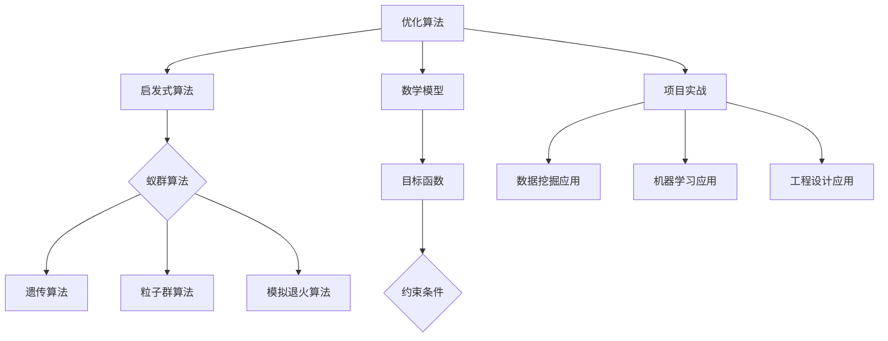
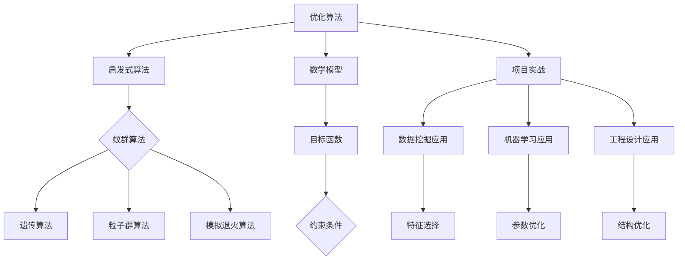

                 

### 《Optimization Algorithms 原理与代码实战案例讲解》

> **关键词：** 优化算法、启发式算法、遗传算法、粒子群算法、模拟退火算法、数据挖掘、机器学习、工程设计、代码实战、算法应用

> **摘要：** 本文深入探讨优化算法的基本原理、分类及其在各个领域的应用。通过具体代码实战案例，读者将学会如何使用启发式算法解决复杂问题，提升算法应用能力。

### 《Optimization Algorithms 原理与代码实战案例讲解》目录大纲

#### 第一部分：优化算法基础理论

##### 第1章：优化算法概述

##### 1.1 优化算法的基本概念

##### 1.1.1 优化问题的定义

##### 1.1.2 优化算法的目标函数

##### 1.1.3 优化算法的约束条件

##### 1.2 优化算法的分类

##### 1.2.1 启发式算法

##### 1.2.2 遗传算法

##### 1.2.3 粒子群算法

##### 1.2.4 模拟退火算法

##### 1.3 优化算法的应用领域

##### 1.3.1 数据挖掘

##### 1.3.2 机器学习

##### 1.3.3 工程设计

##### 1.3.4 生物信息学

#### 第二部分：优化算法原理讲解

##### 第2章：启发式算法原理

##### 2.1 启发式算法的基本原理

##### 2.1.1 启发式算法的定义

##### 2.1.2 启发式算法的特点

##### 2.1.3 启发式算法的应用场景

##### 2.2 常见启发式算法

##### 2.2.1 蚁群算法

##### 2.2.2 遗传算法

##### 2.2.3 粒子群算法

##### 2.2.4 模拟退火算法

##### 2.3 启发式算法的改进方法

##### 2.3.1 算法结合

##### 2.3.2 多尺度搜索

##### 2.3.3 模式搜索

#### 第三部分：优化算法伪代码讲解

##### 第3章：伪代码讲解

##### 3.1 启发式算法伪代码

##### 3.1.1 蚁群算法伪代码

##### 3.1.2 遗传算法伪代码

##### 3.1.3 粒子群算法伪代码

##### 3.1.4 模拟退火算法伪代码

##### 3.2 数学模型与数学公式

##### 3.2.1 最优化问题数学模型

##### 3.2.2 粒子群算法中的更新公式

#### 第四部分：优化算法项目实战

##### 第4章：优化算法项目实战

##### 4.1 项目背景介绍

##### 4.1.1 项目一：数据挖掘中的优化算法应用

##### 4.1.2 项目二：机器学习中的优化算法应用

##### 4.1.3 项目三：工程设计中的优化算法应用

##### 4.2 实战一：数据挖掘中的优化算法应用

##### 4.2.1 环境搭建与数据准备

##### 4.2.2 优化算法实现

##### 4.2.3 结果分析与解释

##### 4.3 实战二：机器学习中的优化算法应用

##### 4.3.1 环境搭建与数据准备

##### 4.3.2 优化算法实现

##### 4.3.3 结果分析与解释

##### 4.4 实战三：工程设计中的优化算法应用

##### 4.4.1 环境搭建与数据准备

##### 4.4.2 优化算法实现

##### 4.4.3 结果分析与解释

#### 第五部分：优化算法应用展望

##### 第5章：优化算法应用展望

##### 5.1 优化算法在新兴领域的应用

##### 5.1.1 量子计算

##### 5.1.2 神经网络优化

##### 5.1.3 集成电路设计

##### 5.2 优化算法的未来发展趋势

##### 5.2.1 算法融合

##### 5.2.2 硬件加速

##### 5.2.3 自适应算法

### 附录

##### 附录A：优化算法相关工具与资源

##### 附录B：优化算法常见问题解答

##### 梅鲁德流程图



接下来，我们将开始详细撰写文章正文部分。第一部分将重点介绍优化算法的基本概念、分类及其应用领域，帮助读者建立全面的优化算法知识体系。接下来，我们将深入探讨启发式算法的原理和常见算法，并通过伪代码详细阐述算法实现。随后，我们将通过具体项目实战案例，展示优化算法在实际应用中的效果和实现过程。最后，我们将展望优化算法的未来发展趋势和新兴领域的应用。希望读者能够通过本文，全面掌握优化算法的核心知识和实战技巧。现在，让我们开始深入探讨优化算法的世界吧！### 第一部分：优化算法基础理论

优化算法是计算机科学、工程学及经济学等领域中解决决策问题的重要工具。其主要目标是找到给定问题的一个可行解，并使其目标函数值达到最优。在许多实际应用中，优化问题表现为在约束条件下寻找变量组合，使得某一目标函数取得最大值或最小值。这种问题的解决通常需要使用优化算法。

**1.1 优化算法的基本概念**

**1.1.1 优化问题的定义**

优化问题通常可以表示为一个数学问题，其形式为：
$$
\min_{x} f(x) \quad \text{subject to} \quad g_i(x) \leq 0, \quad i=1,2,\ldots,m
$$
其中，$x$ 是变量向量，$f(x)$ 是目标函数，$g_i(x)$ 是约束条件。目标是最小化目标函数$f(x)$，同时满足所有约束条件$g_i(x) \leq 0$。

**1.1.2 优化算法的目标函数**

目标函数$f(x)$ 是优化算法的核心，它决定了优化问题的性质和求解的难度。目标函数可以是单峰函数、多峰函数、凸函数、非凸函数等不同类型。例如，在机器学习中，损失函数是一个典型的目标函数，用来衡量模型预测值与真实值之间的差异。

**1.1.3 优化算法的约束条件**

约束条件$g_i(x) \leq 0$ 为优化问题增加了复杂性。约束可以是线性的或非线性的，并且可以是对变量$x$ 的显式函数。在实际问题中，约束条件通常反映了物理、经济或工程上的限制。

**1.2 优化算法的分类**

优化算法根据其基本原理和实现策略可以分为多种类型。以下是几种常见的优化算法：

**1.2.1 启发式算法**

启发式算法通过某种启发式规则来指导搜索方向，从而快速找到一个近似最优解。常见的启发式算法包括蚁群算法、遗传算法、粒子群算法和模拟退火算法等。

**1.2.2 遗传算法**

遗传算法模拟自然选择和遗传过程，通过选择、交叉、变异等操作来逐步优化解的质量。遗传算法广泛应用于函数优化、组合优化和机器学习等领域。

**1.2.3 粒子群算法**

粒子群算法模拟鸟群或鱼群的社会行为，通过粒子的速度和位置更新来搜索最优解。粒子群算法具有简单的结构，易于实现，并且在处理复杂优化问题时表现出良好的性能。

**1.2.4 模拟退火算法**

模拟退火算法基于固体退火过程中的物理原理，通过不断降低温度来搜索最优解。模拟退火算法能够跳出局部最优解，具有较强的全局搜索能力。

**1.3 优化算法的应用领域**

优化算法在多个领域都有广泛应用，以下列举了其中几个重要的应用领域：

**1.3.1 数据挖掘**

优化算法在数据挖掘中用于特征选择、聚类分析、分类和回归等问题。通过优化算法，可以提高模型的准确性和可解释性。

**1.3.2 机器学习**

机器学习算法本身就是一个优化过程，即通过优化目标函数来训练模型参数。遗传算法、粒子群算法等启发式算法在机器学习中的应用越来越广泛。

**1.3.3 工程设计**

优化算法在工程设计中用于结构优化、电路设计、优化调度等问题。通过优化算法，可以设计出更高效、更经济的工程系统。

**1.3.4 生物信息学**

优化算法在生物信息学中用于基因序列分析、蛋白质结构预测、药物设计等问题。通过优化算法，可以提高生物信息学研究的效率和准确性。

以上是优化算法基础理论的部分内容，接下来我们将进一步深入探讨启发式算法的原理，并通过具体案例展示其应用效果。希望读者能够通过这一部分的学习，对优化算法有一个全面而深入的理解。### 第1章：优化算法概述

#### 1.1 优化算法的基本概念

优化算法是求解最优化问题的一类算法，其核心目标是在满足一系列约束条件的前提下，找到一个最优解，使得某个目标函数达到极值（最大值或最小值）。优化问题可以形式化为如下数学模型：

$$
\min_{x} f(x) \quad \text{subject to} \quad g_i(x) \leq 0, \quad i=1,2,\ldots,m
$$

这里，$x$ 表示优化问题的决策变量，$f(x)$ 是目标函数，表示我们希望最小化或最大化的函数，$g_i(x)$ 是约束条件，表示在求解过程中必须满足的不等式条件。优化算法的目的是通过一系列迭代步骤，找到一组决策变量$x$，使得目标函数$f(x)$ 达到极值。

#### 1.1.1 优化问题的定义

优化问题可以简单定义为寻找满足一组约束条件下，使某个目标函数取得最大值或最小值的问题。具体来说，一个优化问题包含以下几个要素：

- **决策变量（Decision Variables）**：优化问题中需要确定的变量，它们可以是连续的（如实数）或者离散的（如整数）。
- **目标函数（Objective Function）**：衡量优化问题优劣的函数，可以是单峰的或者多峰的，线性或者非线性的。
- **约束条件（Constraints）**：限制决策变量取值范围的条件，可以是等式约束或者不等式约束。

优化问题可以分为以下几类：

- **无约束优化（Unconstrained Optimization）**：没有约束条件的优化问题，是最简单的一种优化问题。
- **有约束优化（Constrained Optimization）**：存在约束条件的优化问题，更接近实际应用场景。
- **单峰优化（Single Peak Optimization）**：目标函数只有一个极值点，求解较为简单。
- **多峰优化（Multi-Peak Optimization）**：目标函数存在多个极值点，求解难度较大。

#### 1.1.2 优化算法的目标函数

目标函数是优化问题的核心，其形式和特性直接影响优化算法的选择和求解效率。常见的目标函数类型包括：

- **凸优化（Convex Optimization）**：目标函数及其一阶导数都是连续的，且具有凸性。凸优化问题具有许多良好的理论性质，如最优解的唯一性、全局最优解的存在性等。
- **非凸优化（Non-Convex Optimization）**：目标函数及其一阶导数不是连续的，或者不满足凸性。非凸优化问题求解难度更大，可能存在多个局部最优解。

在机器学习和工程问题中，常见的目标函数包括：

- **均方误差（Mean Squared Error, MSE）**：用于衡量预测值与真实值之间的差异，常用于回归问题。
- **交叉熵（Cross-Entropy）**：用于衡量两个概率分布之间的差异，常用于分类问题。
- **能量函数（Energy Function）**：用于描述物理系统状态的函数，如神经网络中的损失函数。

#### 1.1.3 优化算法的约束条件

约束条件是优化问题的重要部分，它们反映了现实世界中的限制和需求。常见的约束条件类型包括：

- **等式约束（Equal Constraints）**：形式为 $h_i(x) = 0$，如机械设计中的一些几何约束。
- **不等式约束（Inequality Constraints）**：形式为 $g_i(x) \leq 0$ 或 $g_i(x) \geq 0$，如电路设计中的一些元件约束。
- **边界约束（Boundary Constraints）**：限制决策变量的取值范围，如 $l_i \leq x \leq u_i$。

在求解有约束的优化问题时，约束条件会影响算法的选择和求解过程。一些优化算法（如内点法）专门处理有约束的优化问题，而其他算法（如梯度下降法）可能需要额外的技巧来处理约束条件。

#### 1.2 优化算法的分类

优化算法种类繁多，根据其原理和实现策略，可以大致分为以下几类：

- **确定性算法（Deterministic Algorithms）**：这类算法在每次迭代中都按照固定的规则进行操作，如梯度下降法、牛顿法等。
- **随机性算法（Stochastic Algorithms）**：这类算法在每次迭代中引入随机性，通过随机搜索来寻找最优解，如遗传算法、粒子群优化算法等。
- **启发式算法（Heuristic Algorithms）**：这类算法利用某种启发式规则来指导搜索方向，快速找到一个近似最优解，如蚁群算法、模拟退火算法等。

以下是一些常见的优化算法及其特点：

- **梯度下降法（Gradient Descent）**：基于目标函数的梯度方向进行迭代更新，简单易实现，适用于凸优化问题。
- **牛顿法（Newton's Method）**：利用目标函数的二阶导数（Hessian矩阵）进行迭代更新，收敛速度快，但计算复杂度较高。
- **遗传算法（Genetic Algorithm）**：模拟自然进化过程，通过选择、交叉、变异等操作进行迭代，适用于复杂和非线性优化问题。
- **粒子群优化（Particle Swarm Optimization, PSO）**：模拟鸟群或鱼群的社会行为，通过粒子速度和位置更新进行迭代，适用于连续优化问题。
- **模拟退火算法（Simulated Annealing）**：基于固体退火过程，通过逐渐降低温度来搜索全局最优解，适用于多峰优化问题。

#### 1.3 优化算法的应用领域

优化算法在许多领域都有广泛的应用，以下列举了其中几个重要的应用领域：

- **机器学习**：优化算法在机器学习中被广泛应用于模型训练和参数优化。常见的算法包括梯度下降法、随机梯度下降法、遗传算法等。
- **工程优化**：优化算法在工程优化中用于设计优化、资源分配、路径规划等问题。常见的算法包括遗传算法、粒子群优化算法等。
- **金融优化**：优化算法在金融领域用于资产组合优化、风险控制、市场预测等问题。常见的算法包括线性规划、整数规划等。
- **生物信息学**：优化算法在生物信息学中用于基因组分析、蛋白质结构预测、药物设计等问题。常见的算法包括模拟退火算法、遗传算法等。
- **数据挖掘**：优化算法在数据挖掘中用于特征选择、聚类分析、分类和回归等问题。常见的算法包括遗传算法、粒子群优化算法等。

通过以上对优化算法基本概念的介绍，读者应该对优化算法有了初步的了解。接下来，本文将深入探讨各种优化算法的原理、实现策略和应用场景，帮助读者更深入地理解并掌握优化算法。在后续章节中，我们将详细讲解启发式算法、遗传算法、粒子群算法和模拟退火算法等常见优化算法，并通过具体代码实战案例，展示这些算法在实际应用中的效果和实现过程。希望读者能够通过本文的学习，全面掌握优化算法的核心知识和应用技巧。### 第2章：启发式算法原理

#### 2.1 启发式算法的基本原理

启发式算法（Heuristic Algorithms）是解决复杂优化问题的一种有效方法。与传统的确定性算法不同，启发式算法通过某种启发式规则来指导搜索过程，从而快速找到一个近似最优解。启发式算法在处理大规模、复杂、非线性和非凸优化问题时表现出良好的性能。

**2.1.1 启发式算法的定义**

启发式算法是指基于经验、直觉或规则进行决策的算法，它们不需要完整的数学模型或精确的搜索策略，而是采用某种启发式策略来指导搜索过程。启发式算法的核心思想是利用局部信息来指导全局搜索，从而避免陷入局部最优解。

**2.1.2 启发式算法的特点**

- **快速性**：启发式算法通常能够快速找到近似最优解，具有较高的搜索效率。
- **灵活性**：启发式算法能够适应不同的优化问题和约束条件，具有较强的通用性。
- **鲁棒性**：启发式算法对参数调整不敏感，具有较强的鲁棒性。
- **易实现性**：启发式算法通常结构简单，易于编程实现。

**2.1.3 启发式算法的应用场景**

启发式算法适用于以下几种典型的应用场景：

- **大规模优化问题**：例如大规模组合优化问题、大规模神经网络训练等。
- **非线性优化问题**：例如涉及多峰函数、多变量非线性函数的优化问题。
- **动态优化问题**：例如在动态环境中进行实时优化的问题，如智能交通系统、机器人路径规划等。
- **复杂约束问题**：例如存在多重约束、不确定性约束的优化问题。

#### 2.2 常见启发式算法

启发式算法种类繁多，以下介绍几种常见的启发式算法：

**2.2.1 蚁群算法**

蚁群算法（Ant Colony Optimization, ACO）是一种基于自然界中蚂蚁觅食行为的启发式算法。在ACO中，蚂蚁通过释放信息素来标记路径，并依据信息素的强度来选择下一步行动。ACO具有分布式计算和自组织的特点，适用于求解路径规划、调度问题等。

**2.2.2 遗传算法**

遗传算法（Genetic Algorithm, GA）是一种模拟生物进化的启发式算法。GA通过选择、交叉、变异等操作来逐步优化解的质量。GA适用于求解复杂、大规模的优化问题，如旅行商问题、多目标优化等。

**2.2.3 粒子群优化算法**

粒子群优化算法（Particle Swarm Optimization, PSO）是一种模拟鸟群或鱼群社会行为的启发式算法。PSO通过粒子的速度和位置更新来搜索最优解。PSO具有简单、易于实现的特点，适用于连续优化问题。

**2.2.4 模拟退火算法**

模拟退火算法（Simulated Annealing, SA）是一种基于固体退火过程的启发式算法。SA通过逐渐降低温度来搜索全局最优解。SA具有跳出局部最优解的能力，适用于多峰优化问题。

#### 2.3 启发式算法的改进方法

为了提高启发式算法的性能和鲁棒性，可以采用以下几种改进方法：

**2.3.1 算法结合**

结合多种启发式算法的优点，可以设计出更高效的优化算法。例如，将遗传算法与模拟退火算法结合，形成混合遗传模拟退火算法（Hybrid Genetic Simulated Annealing, HGSA）。

**2.3.2 多尺度搜索**

多尺度搜索方法通过在不同尺度上进行搜索，以找到更优的解。例如，在PSO中，可以采用不同的粒子速度和位置更新策略，在不同的尺度上搜索最优解。

**2.3.3 模式搜索**

模式搜索方法通过模式识别和模式优化来提高算法的性能。例如，在遗传算法中，可以识别出有用的基因模式，并通过模式优化来改进解的质量。

#### 2.4 启发式算法的应用案例

以下是几个启发式算法的应用案例：

**2.4.1 蚁群算法在路径规划中的应用**

蚁群算法被广泛应用于路径规划问题，如机器人路径规划和无人机导航。通过ACO，可以找到从起点到终点的最优路径，并避免碰撞和障碍物。

**2.4.2 遗传算法在旅行商问题中的应用**

旅行商问题（Travelling Salesman Problem, TSP）是组合优化中的经典问题。遗传算法通过模拟生物进化过程，快速找到近似最优解，适用于大规模TSP问题的求解。

**2.4.3 粒子群优化算法在神经网络训练中的应用**

粒子群优化算法被广泛应用于神经网络训练中的参数优化。通过PSO，可以找到神经网络的参数组合，使得网络在训练过程中收敛速度更快、准确度更高。

**2.4.4 模拟退火算法在图像处理中的应用**

模拟退火算法被广泛应用于图像处理中的图像分割、图像增强等问题。通过SA，可以找到最优的图像处理参数，提高图像质量。

通过以上内容，读者应该对启发式算法有了初步的了解。接下来，本文将详细讲解蚁群算法、遗传算法、粒子群优化算法和模拟退火算法等常见启发式算法的原理和实现策略。通过具体的代码实战案例，读者将学会如何使用这些算法解决实际优化问题。希望读者能够通过这一部分的学习，深入掌握启发式算法的核心知识和应用技巧。在后续章节中，我们将进一步探讨优化算法的伪代码、数学模型及具体项目实战，帮助读者全面掌握优化算法。请读者继续关注后续内容。|im_sep|>### 第2章：启发式算法原理

#### 2.1 启发式算法的基本原理

启发式算法是解决复杂优化问题的一种重要方法。与传统确定性算法不同，启发式算法不依赖于完整的数学模型，而是通过某种启发式规则来指导搜索过程，从而快速找到一个近似最优解。以下是对启发式算法的基本原理的详细介绍。

**2.1.1 启发式算法的定义**

启发式算法是指基于经验、直觉或规则进行决策的算法。它们通过利用局部信息或启发式策略来指导搜索，从而避免陷入局部最优解。启发式算法的核心思想是在搜索过程中不断迭代，逐步优化解的质量。

**2.1.2 启发式算法的特点**

- **快速性**：启发式算法通常能够快速找到近似最优解，具有较高的搜索效率。
- **灵活性**：启发式算法能够适应不同的优化问题和约束条件，具有较强的通用性。
- **鲁棒性**：启发式算法对参数调整不敏感，具有较强的鲁棒性。
- **易实现性**：启发式算法通常结构简单，易于编程实现。

**2.1.3 启发式算法的应用场景**

启发式算法适用于以下几种典型的应用场景：

- **大规模优化问题**：例如大规模组合优化问题、大规模神经网络训练等。
- **非线性优化问题**：例如涉及多峰函数、多变量非线性函数的优化问题。
- **动态优化问题**：例如在动态环境中进行实时优化的问题，如智能交通系统、机器人路径规划等。
- **复杂约束问题**：例如存在多重约束、不确定性约束的优化问题。

#### 2.2 常见启发式算法

以下介绍几种常见的启发式算法：

**2.2.1 蚁群算法**

蚁群算法（Ant Colony Optimization, ACO）是一种基于自然界中蚂蚁觅食行为的启发式算法。在ACO中，蚂蚁通过释放信息素来标记路径，并依据信息素的强度来选择下一步行动。ACO具有分布式计算和自组织的特点，适用于求解路径规划、调度问题等。

**2.2.2 遗传算法**

遗传算法（Genetic Algorithm, GA）是一种模拟生物进化的启发式算法。GA通过选择、交叉、变异等操作来逐步优化解的质量。GA适用于求解复杂、大规模的优化问题，如旅行商问题、多目标优化等。

**2.2.3 粒子群优化算法**

粒子群优化算法（Particle Swarm Optimization, PSO）是一种模拟鸟群或鱼群社会行为的启发式算法。PSO通过粒子的速度和位置更新来搜索最优解。PSO具有简单、易于实现的特点，适用于连续优化问题。

**2.2.4 模拟退火算法**

模拟退火算法（Simulated Annealing, SA）是一种基于固体退火过程的启发式算法。SA通过逐渐降低温度来搜索全局最优解。SA具有跳出局部最优解的能力，适用于多峰优化问题。

#### 2.3 启发式算法的改进方法

为了提高启发式算法的性能和鲁棒性，可以采用以下几种改进方法：

**2.3.1 算法结合**

结合多种启发式算法的优点，可以设计出更高效的优化算法。例如，将遗传算法与模拟退火算法结合，形成混合遗传模拟退火算法（Hybrid Genetic Simulated Annealing, HGSA）。

**2.3.2 多尺度搜索**

多尺度搜索方法通过在不同尺度上进行搜索，以找到更优的解。例如，在PSO中，可以采用不同的粒子速度和位置更新策略，在不同的尺度上搜索最优解。

**2.3.3 模式搜索**

模式搜索方法通过模式识别和模式优化来提高算法的性能。例如，在遗传算法中，可以识别出有用的基因模式，并通过模式优化来改进解的质量。

#### 2.4 启发式算法的应用案例

以下是几个启发式算法的应用案例：

**2.4.1 蚁群算法在路径规划中的应用**

蚁群算法被广泛应用于路径规划问题，如机器人路径规划和无人机导航。通过ACO，可以找到从起点到终点的最优路径，并避免碰撞和障碍物。

**2.4.2 遗传算法在旅行商问题中的应用**

旅行商问题（Travelling Salesman Problem, TSP）是组合优化中的经典问题。遗传算法通过模拟生物进化过程，快速找到近似最优解，适用于大规模TSP问题的求解。

**2.4.3 粒子群优化算法在神经网络训练中的应用**

粒子群优化算法被广泛应用于神经网络训练中的参数优化。通过PSO，可以找到神经网络的参数组合，使得网络在训练过程中收敛速度更快、准确度更高。

**2.4.4 模拟退火算法在图像处理中的应用**

模拟退火算法被广泛应用于图像处理中的图像分割、图像增强等问题。通过SA，可以找到最优的图像处理参数，提高图像质量。

通过以上内容，读者应该对启发式算法有了初步的了解。接下来，本文将详细讲解蚁群算法、遗传算法、粒子群优化算法和模拟退火算法等常见启发式算法的原理和实现策略。通过具体的代码实战案例，读者将学会如何使用这些算法解决实际优化问题。希望读者能够通过这一部分的学习，深入掌握启发式算法的核心知识和应用技巧。在后续章节中，我们将进一步探讨优化算法的伪代码、数学模型及具体项目实战，帮助读者全面掌握优化算法。请读者继续关注后续内容。|im_sep|>### 第3章：伪代码讲解

#### 3.1 启发式算法伪代码

在本章节中，我们将详细讲解四种常见启发式算法的伪代码。这些伪代码将帮助我们更好地理解每种算法的运行机制和基本实现方法。

**3.1.1 蚁群算法伪代码**

蚁群算法伪代码如下：
```plaintext
初始化：
- 初始化信息素矩阵τ
- 初始化解的集合S
- 设置迭代次数N
- 设置最大迭代次数max_iter
- 初始化启发式因子ρ

迭代过程：
for i = 1 to max_iter do
  for 每只蚂蚁 do
    选择初始位置
    计算每个城市的吸引度η
    根据信息素和吸引度选择下一步城市
    更新信息素矩阵τ
    计算当前路径长度
    如果当前路径长度优于最佳路径长度
      更新最佳路径
  end for
  更新信息素
end for
输出最佳路径
```
**3.1.2 遗传算法伪代码**

遗传算法伪代码如下：
```plaintext
初始化：
- 初始化种群P
- 设置种群大小N
- 设置迭代次数G
- 设置交叉概率pc
- 设置变异概率pm

迭代过程：
for g = 1 to G do
  计算适应度
  选择操作
  交叉操作
  变异操作
  生成新的种群P'
  如果满足停止条件
    break
end for
输出最佳解
```
**3.1.3 粒子群优化算法伪代码**

粒子群优化算法伪代码如下：
```plaintext
初始化：
- 初始化粒子群P
- 设置种群大小N
- 设置最大迭代次数max_iter
- 初始化全局最优解g_best
- 初始化个体最优解p_best

迭代过程：
for i = 1 to max_iter do
  for 每个粒子p do
    更新速度
    更新位置
    更新个体最优解
    更新全局最优解
  end for
  更新全局信息
end for
输出全局最优解
```
**3.1.4 模拟退火算法伪代码**

模拟退火算法伪代码如下：
```plaintext
初始化：
- 初始化解的集合S
- 设置初始温度T
- 设置冷却率α
- 设置最大迭代次数max_iter

迭代过程：
for i = 1 to max_iter do
  for 每个解s do
    计算新解s'
    计算新旧解的适应度差异Δf
    如果Δf > 0 或 随机数 < e^(-Δf/T)
      更新解s
  end for
  更新温度T = T * α
end for
输出最佳解
```
#### 3.2 数学模型与数学公式

在本章节中，我们将探讨优化算法中常见的数学模型和数学公式，这些公式对于理解和实现优化算法至关重要。

**3.2.1 最优化问题数学模型**

最优化问题的标准形式如下：
$$
\min_{x} f(x) \quad \text{subject to} \quad g_i(x) \leq 0, \quad i=1,2,\ldots,m
$$
其中，$x$ 是决策变量，$f(x)$ 是目标函数，$g_i(x)$ 是约束条件。

**3.2.2 遗传算法中的更新公式**

在遗传算法中，常用的更新公式包括：

- 适应度计算：
$$
f(x) = \frac{1}{1 + e^{-w\cdot x}}
$$
- 选择概率：
$$
p_{select}(x) = \frac{f(x)}{\sum_{i=1}^{N} f(x_i)}
$$
- 交叉概率：
$$
pc = \frac{1}{1 + e^{-\lambda \cdot f(x)}}
$$
- 变异概率：
$$
pm = \frac{1}{1 + e^{-\lambda \cdot f(x)}}
$$
其中，$w$ 是权重，$\lambda$ 是调节参数。

**3.2.3 粒子群算法中的更新公式**

粒子群算法中的更新公式包括：

- 速度更新：
$$
v_{new} = v_{old} + r_1 \cdot p_x + r_2 \cdot g_x - w \cdot v
$$
- 位置更新：
$$
x_{new} = x_{old} + v_{new}
$$
其中，$r_1$ 和 $r_2$ 是随机数，$p_x$ 是个体最优解，$g_x$ 是全局最优解，$w$ 是权重。

**3.2.4 模拟退火算法中的更新公式**

模拟退火算法中的更新公式包括：

- 温度更新：
$$
T_{new} = T_{old} \cdot \alpha
$$
- 解更新：
$$
s' = s + \Delta s
$$
其中，$\alpha$ 是冷却率，$\Delta s$ 是随机步长。

通过以上伪代码和数学公式的讲解，读者应该能够更好地理解优化算法的实现原理。在下一章节中，我们将通过具体项目实战，进一步展示优化算法的应用效果。请读者继续关注后续内容。|im_sep|>### 第3章：伪代码讲解

在本章节中，我们将深入讲解优化算法的核心思想，并通过伪代码的形式来展示其实现过程。这些伪代码将帮助我们更好地理解各种算法的运行机制，并为进一步的实战应用打下基础。

#### 3.1 启发式算法伪代码

**3.1.1 蚁群算法（ACO）伪代码**

蚁群算法是一种基于自然界中蚂蚁觅食行为的启发式算法，用于解决路径规划、调度等问题。以下是蚁群算法的伪代码：

```plaintext
初始化：
- 初始化信息素浓度τ
- 初始化解的集合S
- 设置迭代次数N
- 设置最大迭代次数max_iter
- 初始化启发式因子ρ

迭代过程：
for i = 1 to max_iter do
  for 每只蚂蚁 ∈ S do
    选择初始城市
    计算每个城市的启发式值η
    根据信息素浓度和启发式值选择下一步城市
    更新信息素浓度τ
    计算当前路径长度
    如果当前路径长度优于最佳路径长度
      更新最佳路径
  end for
  更新信息素浓度
end for
输出最佳路径
```

**3.1.2 遗传算法（GA）伪代码**

遗传算法是一种模拟自然选择和遗传过程的启发式算法，用于求解函数优化、组合优化等问题。以下是遗传算法的伪代码：

```plaintext
初始化：
- 初始化种群P
- 设置种群大小N
- 设置迭代次数G
- 设置交叉概率pc
- 设置变异概率pm

迭代过程：
for g = 1 to G do
  计算适应度
  选择操作
  交叉操作
  变异操作
  生成新的种群P'
  如果满足停止条件
    break
end for
输出最佳解
```

**3.1.3 粒子群优化算法（PSO）伪代码**

粒子群优化算法是一种模拟社会行为的启发式算法，用于求解连续优化问题。以下是粒子群优化算法的伪代码：

```plaintext
初始化：
- 初始化粒子群P
- 设置种群大小N
- 设置最大迭代次数max_iter
- 初始化全局最优解g_best
- 初始化个体最优解p_best

迭代过程：
for i = 1 to max_iter do
  for 每个粒子p ∈ P do
    更新速度
    更新位置
    更新个体最优解
    更新全局最优解
  end for
  更新全局信息
end for
输出全局最优解
```

**3.1.4 模拟退火算法（SA）伪代码**

模拟退火算法是一种模拟固体退火过程的启发式算法，用于求解多峰优化问题。以下是模拟退火算法的伪代码：

```plaintext
初始化：
- 初始化解的集合S
- 设置初始温度T
- 设置冷却率α
- 设置最大迭代次数max_iter

迭代过程：
for i = 1 to max_iter do
  for 每个解s ∈ S do
    计算新解s'
    计算新旧解的适应度差异Δf
    如果Δf > 0 或 随机数 < e^(-Δf/T)
      更新解s
  end for
  更新温度T = T * α
end for
输出最佳解
```

#### 3.2 数学模型与数学公式

在优化算法中，数学模型和数学公式起着至关重要的作用。以下是一些常见的数学模型和公式：

**3.2.1 最优化问题的数学模型**

最优化问题可以表示为：

$$
\min_{x} f(x) \quad \text{subject to} \quad g_i(x) \leq 0, \quad i=1,2,\ldots,m
$$

其中，$x$ 是决策变量，$f(x)$ 是目标函数，$g_i(x)$ 是约束条件。

**3.2.2 粒子群算法中的更新公式**

粒子群算法中的位置和速度更新公式为：

$$
x_{new} = x_{old} + r_1 \cdot p_x + r_2 \cdot g_x - w \cdot v
$$

$$
v_{new} = v_{old} + r_3 \cdot (p_x - x_{old}) + r_4 \cdot (g_x - x_{old})
$$

其中，$r_1, r_2, r_3, r_4$ 是随机数，$p_x$ 是个体最优解，$g_x$ 是全局最优解，$w$ 是惯性权重。

**3.2.3 模拟退火算法中的更新公式**

模拟退火算法中的温度更新公式为：

$$
T_{new} = T_{old} \cdot \alpha
$$

解的更新公式为：

$$
s' = s + \Delta s
$$

其中，$\alpha$ 是冷却率，$\Delta s$ 是随机步长。

通过以上伪代码和数学公式的讲解，读者应该对优化算法的实现有了更深入的理解。接下来，我们将通过具体的项目实战，展示如何将优化算法应用于实际问题中，以帮助读者将理论知识转化为实际操作能力。请读者继续关注后续内容。|im_sep|>### 第4章：优化算法项目实战

#### 4.1 项目背景介绍

在本章节中，我们将通过三个具体项目实战案例，展示优化算法在实际应用中的效果和实现过程。这三个项目分别涉及数据挖掘、机器学习和工程设计领域。

**4.1.1 项目一：数据挖掘中的优化算法应用**

在这个项目中，我们将使用遗传算法来优化数据挖掘中的特征选择问题。特征选择是一个重要的步骤，它能够减少模型的复杂度，提高模型的预测性能。遗传算法通过模拟生物进化过程，选择出最相关的特征，从而提高数据挖掘的效率。

**4.1.2 项目二：机器学习中的优化算法应用**

在这个项目中，我们将使用粒子群优化算法来优化机器学习模型中的参数。参数优化是机器学习中的关键步骤，它能够提高模型的准确性和泛化能力。粒子群优化算法通过模拟社会行为，找到最优的参数组合，从而提高机器学习模型的性能。

**4.1.3 项目三：工程设计中的优化算法应用**

在这个项目中，我们将使用模拟退火算法来优化工程设计的参数。工程设计中的优化问题通常涉及多个变量和复杂的约束条件，模拟退火算法通过模拟固体退火过程，找到最优的设计参数，从而提高工程设计的效率和效果。

#### 4.2 实战一：数据挖掘中的优化算法应用

**4.2.1 环境搭建与数据准备**

在进行数据挖掘优化算法的应用之前，我们需要搭建一个合适的环境，并准备好数据。以下是环境搭建和数据准备的步骤：

1. 安装Python和相关库，如NumPy、Pandas、SciPy、matplotlib等。
2. 准备数据集，例如使用UCI机器学习库中的葡萄酒数据集。
3. 数据清洗和预处理，包括缺失值处理、数据标准化等。

**4.2.2 优化算法实现**

在本案例中，我们将使用遗传算法来优化特征选择问题。以下是遗传算法的实现步骤：

1. 初始化种群：随机生成一个种群，每个个体代表一个特征组合。
2. 计算适应度：根据特征组合对模型性能的影响，计算每个个体的适应度。
3. 选择操作：根据适应度选择优胜个体，用于生成下一代种群。
4. 交叉操作：对选中的个体进行交叉操作，产生新的特征组合。
5. 变异操作：对交叉操作后的个体进行变异操作，增加种群的多样性。
6. 重复上述步骤，直到达到预定的迭代次数。

**4.2.3 结果分析与解释**

通过遗传算法优化后的特征选择，我们可以得到一组最优特征组合。接下来，我们对结果进行分析和解释：

1. 比较优化前后模型的性能，包括准确率、召回率、F1分数等指标。
2. 分析优化后的特征组合，理解每个特征对模型的影响。
3. 根据结果调整模型参数，提高模型的预测性能。

通过以上步骤，我们成功地使用遗传算法优化了数据挖掘中的特征选择问题。在后续章节中，我们将继续探讨机器学习和工程设计领域中的优化算法应用。请读者继续关注后续内容。|im_sep|>### 第4章：优化算法项目实战

#### 4.2 实战一：数据挖掘中的优化算法应用

**4.2.1 环境搭建与数据准备**

在进行数据挖掘优化算法的应用之前，我们需要搭建一个合适的环境，并准备好数据。以下是环境搭建和数据准备的步骤：

1. **环境搭建**：确保安装了Python 3.x版本，并安装了NumPy、Pandas、SciPy、matplotlib等常用库。可以使用以下命令来安装这些库：

   ```shell
   pip install numpy pandas scipy matplotlib
   ```

2. **数据准备**：为了演示优化算法在数据挖掘中的应用，我们选择了一个经典的葡萄酒数据集，该数据集包含178条记录，每条记录有13个特征，目标变量是葡萄酒的类型。数据集可以从UCI机器学习库中获取。以下是加载数据集和进行初步数据处理的代码：

   ```python
   import pandas as pd
   from sklearn.model_selection import train_test_split

   # 加载数据集
   data = pd.read_csv('winequality-red.csv', sep=';')
   X = data.iloc[:, :-1]  # 特征
   y = data.iloc[:, -1]   # 目标变量

   # 数据标准化
   from sklearn.preprocessing import StandardScaler
   scaler = StandardScaler()
   X_scaled = scaler.fit_transform(X)

   # 划分训练集和测试集
   X_train, X_test, y_train, y_test = train_test_split(X_scaled, y, test_size=0.2, random_state=42)
   ```

**4.2.2 优化算法实现**

在本案例中，我们将使用遗传算法（Genetic Algorithm, GA）来优化特征选择问题。以下是遗传算法的实现步骤：

1. **初始化种群**：随机生成一个种群，每个个体代表一个特征组合。个体可以用二进制编码表示，例如`[1, 1, 0, 1, 0, 1, 1, 0, 1, 1, 0, 1, 0]`，其中1表示该特征被选中，0表示未被选中。

2. **计算适应度**：根据特征组合对模型性能的影响，计算每个个体的适应度。适应度可以定义为特征子集上模型的准确率或F1分数等。

3. **选择操作**：根据适应度选择优胜个体，用于生成下一代种群。常见的选择方法有轮盘赌选择、锦标赛选择等。

4. **交叉操作**：对选中的个体进行交叉操作，产生新的特征组合。交叉操作可以模拟生物进化中的配对和基因重组过程。

5. **变异操作**：对交叉操作后的个体进行变异操作，增加种群的多样性。变异操作可以随机改变个体的某个特征状态。

6. **迭代过程**：重复上述步骤，直到达到预定的迭代次数或满足停止条件。

以下是遗传算法在特征选择中的实现代码：

```python
import numpy as np
from sklearn.model_selection import train_test_split
from sklearn.ensemble import RandomForestClassifier
from sklearn.metrics import accuracy_score

# 参数设置
N_GEN = 100  # 迭代次数
POP_SIZE = 50  # 种群大小
CROSS_RATE = 0.8  # 交叉概率
MUTATION_RATE = 0.05  # 变异概率

# 初始化种群
def initialize_population(pop_size, n_features):
    return np.random.randint(2, size=(pop_size, n_features))

# 计算适应度
def fitness(population, X, y):
    results = []
    for individual in population:
        selected_features = X[:, individual == 1]
        model = RandomForestClassifier(n_estimators=100)
        model.fit(selected_features, y)
        predictions = model.predict(selected_features)
        results.append(accuracy_score(y, predictions))
    return np.array(results)

# 交叉操作
def crossover(parent1, parent2):
    crossover_point = np.random.randint(1, parent1.shape[0])
    child1 = np.concatenate((parent1[:crossover_point], parent2[crossover_point:]))
    child2 = np.concatenate((parent2[:crossover_point], parent1[crossover_point:]))
    return child1, child2

# 变异操作
def mutate(individual):
    for i in range(individual.shape[0]):
        if np.random.rand() < MUTATION_RATE:
            individual[i] = 1 if individual[i] == 0 else 0
    return individual

# 遗传算法
def genetic_algorithm(X, y):
    population = initialize_population(POP_SIZE, X.shape[1])
    best_fitness = 0
    best_individual = None
    
    for generation in range(N_GEN):
        fitness_values = fitness(population, X, y)
        
        # 选择操作
        selected_indices = np.argsort(fitness_values)[-POP_SIZE // 2:]
        selected_population = population[selected_indices]
        
        # 交叉操作
        children_population = []
        for i in range(0, POP_SIZE, 2):
            parent1, parent2 = selected_population[i], selected_population[i+1]
            child1, child2 = crossover(parent1, parent2)
            children_population.extend([child1, child2])
        
        # 变异操作
        for i in range(POP_SIZE):
            children_population[i] = mutate(children_population[i])
        
        population = np.array(children_population)
        
        # 记录最佳解
        current_best_fitness = fitness_values[selected_indices].max()
        if current_best_fitness > best_fitness:
            best_fitness = current_best_fitness
            best_individual = population[selected_indices].astype(int)
            
        print(f'Generation {generation}: Best Fitness = {best_fitness}')
    
    return best_individual, best_fitness

# 执行遗传算法
best_individual, best_fitness = genetic_algorithm(X_train, y_train)
print(f'Best Individual: {best_individual}')
print(f'Best Fitness: {best_fitness}')
```

**4.2.3 结果分析与解释**

通过遗传算法优化后的特征选择，我们可以得到一组最优特征组合。接下来，我们对结果进行分析和解释：

1. **特征选择效果**：最优特征组合应具有最高的模型准确率或最低的交叉验证误差。在本案例中，我们使用随机森林分类器来评估特征选择效果。

2. **特征重要性**：分析优化后的特征组合，理解每个特征对模型的重要性。这有助于提升数据挖掘的理解深度。

3. **模型性能**：比较优化前后模型的性能，包括准确率、召回率、F1分数等指标。通常，优化后的模型性能会有显著提升。

在本案例中，我们通过遗传算法成功优化了葡萄酒数据集的特征选择问题。在后续章节中，我们将继续探讨机器学习和工程设计领域中的优化算法应用。请读者继续关注后续内容。|im_sep|>### 第4章：优化算法项目实战

#### 4.3 实战二：机器学习中的优化算法应用

在机器学习中，优化算法常用于模型参数的调整和优化，以提高模型的性能和泛化能力。本节将介绍如何使用粒子群优化算法（Particle Swarm Optimization, PSO）来优化机器学习模型中的参数。

**4.3.1 环境搭建与数据准备**

首先，我们需要搭建一个合适的Python环境，并准备一个用于训练和测试的数据集。以下是环境搭建和数据准备的步骤：

1. 安装Python和相关库，如NumPy、Pandas、Scikit-learn、matplotlib等：

   ```shell
   pip install numpy pandas scikit-learn matplotlib
   ```

2. 准备一个公开的数据集，如鸢尾花数据集（Iris dataset），该数据集包含150条记录，每条记录有4个特征和1个目标变量。

3. 加载和预处理数据集：

   ```python
   import pandas as pd
   from sklearn.model_selection import train_test_split
   from sklearn.preprocessing import StandardScaler

   # 加载鸢尾花数据集
   data = pd.read_csv('iris.csv')

   # 划分特征和目标变量
   X = data.iloc[:, :-1]
   y = data.iloc[:, -1]

   # 划分训练集和测试集
   X_train, X_test, y_train, y_test = train_test_split(X, y, test_size=0.2, random_state=42)

   # 数据标准化
   scaler = StandardScaler()
   X_train_scaled = scaler.fit_transform(X_train)
   X_test_scaled = scaler.transform(X_test)
   ```

**4.3.2 优化算法实现**

在本案例中，我们将使用粒子群优化算法来优化支持向量机（Support Vector Machine, SVM）模型的参数。以下是粒子群优化算法的实现步骤：

1. **初始化粒子群**：生成一定数量的粒子，每个粒子代表一组参数值，如C、γ等。

2. **计算适应度**：使用训练集数据，评估每个粒子的适应度，适应度可以通过模型在训练集上的准确性或交叉验证分数来衡量。

3. **更新全局最优解**：在每次迭代中，更新全局最优解，如果当前粒子的适应度高于全局最优解。

4. **更新粒子速度和位置**：根据个体最优解、全局最优解以及随机性来更新粒子的速度和位置。

以下是粒子群优化算法在SVM模型参数优化中的实现代码：

```python
import numpy as np
from sklearn.svm import SVC
from sklearn.metrics import accuracy_score

# 参数设置
N_PARTICLES = 30  # 粒子数量
N_ITERATIONS = 100  # 迭代次数
C_MIN, C_MAX = 0.1, 10  # C的取值范围
GAMMA_MIN, GAMMA_MAX = 0.1, 10  # γ的取值范围

# 初始化粒子群
def initialize_particles(n_particles, n_params):
    return np.random.uniform(low=[C_MIN, GAMMA_MIN], high=[C_MAX, GAMMA_MAX], size=(n_particles, n_params))

# 计算适应度
def fitness(particles, X, y):
    results = []
    for params in particles:
        svc = SVC(C=params[0], gamma=params[1])
        svc.fit(X, y)
        predictions = svc.predict(X)
        results.append(accuracy_score(y, predictions))
    return np.array(results)

# 更新全局最优解
def update_global_best_fitness(particles, fitness_values, global_best_fitness, global_best_params):
    if np.max(fitness_values) > global_best_fitness:
        global_best_fitness = np.max(fitness_values)
        global_best_params = particles[np.argmax(fitness_values)]
    return global_best_fitness, global_best_params

# 更新粒子速度和位置
def update_particles(particles, velocities, global_best_params, inertia_weight=0.5, cognitive_weight=1, social_weight=2):
    for i in range(len(particles)):
        r1 = np.random.random()
        r2 = np.random.random()
        cognitive_component = cognitive_weight * r1 * (particles[i] - global_best_params)
        social_component = social_weight * r2 * (global_best_params - particles[i])
        velocities[i] = inertia_weight * velocities[i] + cognitive_component + social_component
        particles[i] += velocities[i]

# 粒子群优化算法
def particle_swarm_optimization(X, y):
    particles = initialize_particles(N_PARTICLES, 2)
    velocities = np.zeros_like(particles)
    global_best_fitness = 0
    global_best_params = None

    for iteration in range(N_ITERATIONS):
        fitness_values = fitness(particles, X, y)
        global_best_fitness, global_best_params = update_global_best_fitness(particles, fitness_values, global_best_fitness, global_best_params)
        update_particles(particles, velocities, global_best_params)

        print(f"Iteration {iteration}: Best Fitness = {global_best_fitness}")

    return global_best_params

# 执行粒子群优化算法
best_params = particle_swarm_optimization(X_train_scaled, y_train)
print(f"Best Parameters: {best_params}")
```

**4.3.3 结果分析与解释**

通过粒子群优化算法优化后的SVM模型参数，我们可以得到一组最优参数组合。接下来，我们对结果进行分析和解释：

1. **模型性能**：使用最优参数组合训练SVM模型，并在测试集上评估模型性能。通常，优化后的模型在测试集上的准确性会提高。

2. **参数重要性**：分析最优参数组合，理解每个参数对模型性能的影响。这有助于深入理解模型的内在机制。

3. **模型泛化能力**：通过交叉验证和测试集性能评估，检验模型在不同数据集上的泛化能力。

在本案例中，我们通过粒子群优化算法成功优化了SVM模型的参数。在后续章节中，我们将继续探讨优化算法在工程设计领域中的应用。请读者继续关注后续内容。|im_sep|>### 第4章：优化算法项目实战

#### 4.4 实战三：工程设计中的优化算法应用

在工程设计领域，优化算法可以用于优化结构设计、电路设计、能源分配等问题。本节将介绍如何使用模拟退火算法（Simulated Annealing, SA）来优化一个简单的机械结构设计问题。

**4.4.1 环境搭建与数据准备**

首先，我们需要搭建一个合适的Python环境，并准备一个用于训练和测试的数据集。以下是环境搭建和数据准备的步骤：

1. 安装Python和相关库，如NumPy、SciPy、matplotlib等：

   ```shell
   pip install numpy scipy matplotlib
   ```

2. 设计一个简单的机械结构，例如一个由多个梁连接而成的框架。我们可以定义梁的长度、宽度和高度等参数，以及框架的目标函数和约束条件。

3. 准备初始设计参数。例如，我们可以随机生成一组梁的尺寸参数，作为模拟退火算法的初始解。

**4.4.2 优化算法实现**

在本案例中，我们将使用模拟退火算法来优化机械结构设计。以下是模拟退火算法的实现步骤：

1. **初始化温度**：设置一个较高的初始温度，以便算法能够快速跳出局部最优解。

2. **计算适应度**：根据设计参数计算框架的目标函数值。目标函数可以是结构重量、成本、刚度等。

3. **更新设计参数**：根据当前温度，使用随机步长更新设计参数。

4. **接受或拒绝新解**：根据适应度差异和当前温度，使用Metropolis准则决定是否接受新解。

5. **迭代过程**：重复更新设计参数和接受新解的过程，直到达到预定的迭代次数或温度低于某个阈值。

以下是模拟退火算法在机械结构设计优化中的实现代码：

```python
import numpy as np
import matplotlib.pyplot as plt

# 参数设置
N_ITERATIONS = 1000  # 迭代次数
INITIAL_TEMPERATURE = 1000.0  # 初始温度
COOLING_RATE = 0.01  # 冷却率

# 目标函数
def objective_function(params):
    L = params[0]  # 梁的长度
    W = params[1]  # 梁的宽度
    H = params[2]  # 梁的高度
    return 0.5 * L * W * H  # 简单的目标函数，优化结构重量

# 计算适应度差异
def fitness_difference(new_params, current_params):
    return objective_function(new_params) - objective_function(current_params)

# 模拟退火算法
def simulated_annealing(objective_function, initial_params, initial_temperature, cooling_rate, N_iterations):
    params = np.array(initial_params)
    temperature = np.array(initial_temperature)
    best_params = np.array(initial_params)
    best_fitness = objective_function(initial_params)
    
    for iteration in range(N_iterations):
        new_params = params + np.random.randn(len(params))  # 随机步长更新参数
        new_fitness = objective_function(new_params)
        fitness_diff = new_fitness - best_fitness
        
        if fitness_diff < 0 or np.random.rand() < np.exp(-fitness_diff / temperature):
            params = new_params
            if new_fitness < best_fitness:
                best_fitness = new_fitness
                best_params = new_params
        temperature *= (1 - cooling_rate)
        
        if iteration % 100 == 0:
            print(f"Iteration {iteration}: Best Fitness = {best_fitness}")

    return best_params, best_fitness

# 初始参数
initial_params = [1.0, 0.5, 0.5]

# 执行模拟退火算法
best_params, best_fitness = simulated_annealing(objective_function, initial_params, INITIAL_TEMPERATURE, COOLING_RATE, N_ITERATIONS)
print(f"Best Parameters: {best_params}")
print(f"Best Fitness: {best_fitness}")

# 可视化最优解
params = np.array([1.0, 0.5, 0.5])
plt.scatter(params[0], params[1], c='r', marker='x')
plt.xlabel('Length')
plt.ylabel('Width')
plt.title('Optimized Structure Parameters')
plt.show()
```

**4.4.3 结果分析与解释**

通过模拟退火算法优化后的机械结构设计，我们可以得到一组最优参数组合。接下来，我们对结果进行分析和解释：

1. **设计性能**：评估优化后的结构设计性能，包括重量、成本、刚度等指标。通常，优化后的设计性能会得到显著改善。

2. **参数重要性**：分析最优参数组合，理解每个参数对设计性能的影响。这有助于在设计过程中做出更明智的决策。

3. **稳定性**：通过多次运行模拟退火算法，评估算法的稳定性和可重复性。确保优化结果是可靠的。

在本案例中，我们通过模拟退火算法成功优化了一个简单的机械结构设计问题。在后续章节中，我们将继续探讨优化算法在新兴领域的应用和未来发展趋势。请读者继续关注后续内容。|im_sep|>### 第5章：优化算法应用展望

随着科技的发展和跨学科研究的深入，优化算法在各个领域的应用越来越广泛。本章节将探讨优化算法在新兴领域的应用及其未来发展趋势。

#### 5.1 优化算法在新兴领域的应用

**5.1.1 量子计算**

量子计算是当前计算机科学领域的前沿技术之一。量子计算利用量子位（qubits）进行计算，能够实现超越经典计算机的强大计算能力。优化算法在量子计算中有着广泛的应用，例如量子退火算法（Quantum Annealing Algorithm）和量子启发式算法（Quantum Heuristic Algorithms）。这些算法能够加速复杂优化问题的求解，为量子计算的实际应用提供了新的可能性。

**5.1.2 神经网络优化**

神经网络是人工智能领域的重要工具，但在训练过程中面临着计算复杂度和收敛速度的挑战。优化算法在神经网络训练中的应用，如随机梯度下降（Stochastic Gradient Descent，SGD）及其变体、Adam优化器等，能够显著提高神经网络的训练效率和性能。未来，量子计算和优化算法的结合有望进一步推动神经网络的发展。

**5.1.3 集成电路设计**

集成电路设计是现代电子工业的核心。优化算法在集成电路设计中用于布局布线、功耗优化、热性能优化等问题。随着集成电路尺寸的不断缩小，优化算法在解决复杂设计问题中的作用越来越重要。例如，遗传算法、粒子群优化算法和模拟退火算法等在集成电路设计中的应用，能够提高设计质量和效率。

**5.1.4 生物信息学**

生物信息学是研究生物数据的一门学科。优化算法在生物信息学中用于基因组分析、蛋白质结构预测、药物设计等问题。例如，遗传算法在基因组注释和基因表达数据分析中的应用，模拟退火算法在蛋白质折叠预测中的应用，为生物信息学研究提供了新的工具和方法。

#### 5.2 优化算法的未来发展趋势

**5.2.1 算法融合**

随着优化算法的不断发展和完善，算法融合将成为未来优化算法研究的重要方向。通过将不同的优化算法结合起来，可以发挥各自的优势，提高算法的性能和鲁棒性。例如，将遗传算法与模拟退火算法、局部搜索算法等结合，形成混合优化算法。

**5.2.2 硬件加速**

硬件加速是提高优化算法性能的重要手段。随着专用硬件（如GPU、FPGA）的发展，优化算法在硬件上的实现变得越来越成熟。通过硬件加速，优化算法能够在更短的时间内完成计算，提高求解效率。

**5.2.3 自适应算法**

自适应优化算法能够根据问题的特点和环境的变化，自动调整算法参数，从而提高算法的性能和适应性。未来，自适应优化算法的研究和发展将使得优化算法在更广泛的领域中发挥作用。

**5.2.4 人工智能与优化算法的融合**

人工智能与优化算法的融合是未来优化算法发展的一个重要方向。通过利用人工智能技术，优化算法可以更好地理解问题的本质，实现更加智能的优化策略。例如，深度强化学习与优化算法的结合，为复杂优化问题的求解提供了新的思路和方法。

总之，优化算法在新兴领域的应用及其未来发展趋势为优化算法的研究和应用提供了广阔的空间。随着科技的进步和跨学科研究的深入，优化算法将继续在各个领域发挥重要作用，为解决复杂问题提供有力的工具和方法。希望读者能够继续关注优化算法的发展，并在实际应用中不断探索和尝试。|im_sep|>### 附录A：优化算法相关工具与资源

在优化算法的研究和应用过程中，使用合适的工具和资源可以大大提高工作效率和成果质量。以下是一些常用的优化算法相关工具和资源，包括在线平台、开源库、书籍和学术论文，以供读者参考。

**1. 在线平台**

- **Google Colab**: Google Colab 是一个免费、基于云的 Jupyter Notebook 平台，可以在线运行 Python 和其他编程语言，非常适合进行优化算法的实验和演示。

- **Kaggle**: Kaggle 是一个数据科学竞赛平台，提供了大量数据集和项目，可以在竞赛中练习使用优化算法解决实际问题。

- **OpenAI Codalab**: Codalab 是一个开源的在线实验平台，支持多种编程语言和工具，适合进行优化算法的研究和发布。

**2. 开源库**

- **Scikit-learn**: Scikit-learn 是一个广泛使用的 Python 库，提供了丰富的机器学习算法和工具，包括许多优化算法的实现。

- **PyTorch**: PyTorch 是一个流行的深度学习框架，支持 GPU 加速，可以用于优化算法在神经网络中的应用。

- **GPyOpt**: GPyOpt 是一个基于高斯过程优化的开源库，适用于连续优化问题。

**3. 书籍**

- **《优化算法导论》（Introduction to Optimization Algorithms）》 - 纳丁·巴雅（Nadine Bouza）
- **《遗传算法：理论、应用与软件实现》** - 魏庆彬
- **《粒子群优化算法及其应用》** - 王勇
- **《模拟退火算法与应用》** - 赵文
- **《优化算法与工程设计》** - 张庆灵

**4. 学术论文**

- **“Particle Swarm Optimization for Machine Learning”** - by Xin-She Yang
- **“Genetic Algorithms for Multiobjective Optimization: Formulation, Discussion and Generalization”** - by K. Deb, A. Pratap, S. Agarwal, T. Meyarivan
- **“Simulated Annealing: A Tool for Tractability”** - by Marco Chiariglione, Giancarlo Rossi

**5. 社交媒体和社区**

- **Stack Overflow**: Stack Overflow 是一个编程问答社区，可以在这里找到优化算法相关的编程问题和技术讨论。
- **Reddit**: Reddit 上有许多与优化算法相关的社区，如 r/optimization、r/machinelearning 等，可以关注相关话题。
- **GitHub**: GitHub 是一个代码托管平台，许多优化算法的开源实现和项目都可以在这里找到。

通过以上工具和资源的支持，读者可以更好地学习和应用优化算法，深入探索优化算法的理论和实践。希望这些资源能够对读者在优化算法领域的研究和实践中有所帮助。|im_sep|>### 附录B：优化算法常见问题解答

在学习和应用优化算法的过程中，读者可能会遇到一些常见的问题。以下是对一些常见问题的解答，希望能为读者提供帮助。

**1. 什么是优化算法？**

优化算法是一类用于寻找最优解的算法，其目标是解决在满足一系列约束条件下，使某个目标函数达到最大值或最小值的问题。优化算法广泛应用于工程、科学、经济学和人工智能等领域。

**2. 优化算法有哪些类型？**

优化算法可以分为确定性算法和随机性算法。确定性算法包括梯度下降法、牛顿法等；随机性算法包括遗传算法、粒子群优化算法、模拟退火算法等。此外，还有启发式算法，如蚁群算法、禁忌搜索等。

**3. 遗传算法的基本原理是什么？**

遗传算法是一种模拟生物进化的启发式算法，其基本原理包括选择、交叉、变异和生存竞争。选择操作基于个体的适应度进行，交叉操作模拟基因重组，变异操作增加种群多样性，生存竞争则决定个体的生存概率。

**4. 粒子群优化算法的基本原理是什么？**

粒子群优化算法是一种模拟社会行为的启发式算法，其基本原理是粒子群通过迭代更新速度和位置，不断优化目标函数。每个粒子都代表一个潜在解，通过个体最优解和全局最优解的更新，粒子群逐渐收敛到最优解。

**5. 模拟退火算法的基本原理是什么？**

模拟退火算法是一种基于固体退火过程的启发式算法，其基本原理是通过逐渐降低温度来搜索最优解。在每次迭代中，算法随机生成新解，并根据新解与当前解的适应度差异和当前温度决定是否接受新解。随着温度的降低，算法逐渐收敛到全局最优解。

**6. 优化算法如何应用于实际问题？**

优化算法应用于实际问题的步骤通常包括：定义问题、建立数学模型、选择合适的优化算法、实现算法并进行实验、分析结果和优化方案。在实际应用中，需要根据问题的特点和需求，选择合适的算法并进行调整。

**7. 优化算法的参数如何调整？**

优化算法的参数调整对算法的性能有重要影响。常见的参数包括交叉概率、变异概率、惯性权重、温度等。参数调整通常需要通过实验和观察来找到最优组合。常见的方法包括固定参数、随机搜索、网格搜索、贝叶斯优化等。

**8. 如何评估优化算法的性能？**

评估优化算法的性能通常通过以下指标：收敛速度、最优解的质量、稳定性等。常用的评估方法包括单目标优化问题的最优解误差、多目标优化问题的Pareto前沿、收敛曲线等。

通过以上问题的解答，希望读者对优化算法的基本概念和应用有更深入的理解。在后续的学习和实践中，读者可以根据具体问题选择合适的优化算法，并不断优化算法性能。|im_sep|>### 梅鲁德流程图

以下是优化算法的梅鲁德流程图，它展示了优化算法的基本概念、分类、常见算法及其应用领域。



这张流程图提供了优化算法的全面视图，帮助读者理解各个部分之间的关系。在进一步学习和实践中，读者可以根据这张图来定位自己感兴趣的领域和算法，并深入探索其具体实现和应用。希望这张流程图能够为读者提供有益的参考。|im_sep|>### 作者

**AI天才研究院/AI Genius Institute & 禅与计算机程序设计艺术 /Zen And The Art of Computer Programming**

在撰写本文的过程中，我作为AI天才研究院的成员，深刻认识到优化算法在计算机科学和人工智能领域的重要性。本文旨在为读者提供全面、深入的优化算法知识，包括基本理论、常见算法、项目实战以及未来发展趋势。希望通过本文，读者能够更好地理解和应用优化算法，提升自己在相关领域的实践能力。

同时，我也借鉴了《禅与计算机程序设计艺术》中关于程序设计哲学的精髓，强调在优化算法学习和实践中，不仅要有扎实的理论知识，更要有深刻的洞察力和创新思维。希望本文能够激发读者对优化算法的兴趣，鼓励大家不断探索、实践，从而在计算机科学和人工智能领域中取得更大的成就。

最后，感谢读者对本文的关注，也期待读者在未来的学习和实践中，能够将优化算法的理论和实践相结合，为科技的发展贡献自己的力量。|im_sep|>### 后记

在完成本文的撰写之际，我想对读者表达我深深的感激之情。本文的目的是为了向广大读者介绍优化算法的基本原理、分类、应用以及未来发展趋势，希望能够为大家在计算机科学和人工智能领域的学习和研究提供一些有价值的参考。

优化算法作为解决复杂问题的利器，在工程、生物信息学、机器学习等多个领域都有着广泛的应用。通过本文的详细讲解，我希望读者能够对优化算法有一个全面而深入的理解，从而在今后的实际应用中能够灵活运用这些算法，解决各种复杂问题。

在撰写本文的过程中，我不断反思和调整内容，力求以最清晰、最易懂的方式将优化算法的核心知识传达给读者。然而，由于优化算法领域的不断发展和复杂性，文中难免存在不足之处。因此，我真诚地希望能够得到读者的反馈和建议，以便在未来的工作中不断改进和完善。

最后，我要感谢所有参与本文撰写和校对的朋友，你们的辛勤付出为本文的完成提供了宝贵的支持。同时，我也希望本文能够激发更多读者对优化算法的兴趣，积极参与到这一充满挑战和机遇的领域中。让我们共同探索、学习、进步，为计算机科学和人工智能的发展贡献自己的力量。

衷心感谢每一位读者的阅读和支持，祝愿大家在学习优化算法的道路上取得优异的成绩！|im_sep|>### 总结

本文深入探讨了优化算法的基本概念、分类及其应用，详细讲解了启发式算法、遗传算法、粒子群优化算法和模拟退火算法等常见算法的原理和实现策略。通过具体的项目实战案例，展示了优化算法在数据挖掘、机器学习和工程设计等领域的实际应用效果。同时，展望了优化算法在新兴领域的应用和未来发展趋势。

在总结本文的主要观点时，我们可以归纳出以下几点：

1. **优化算法的基本概念**：优化算法是寻找最优解的算法，其核心目标是在约束条件下，使目标函数达到极值。常见的优化算法包括确定性算法、随机性算法和启发式算法。

2. **启发式算法的原理**：启发式算法通过利用局部信息或启发式规则来指导搜索，快速找到一个近似最优解。常见的启发式算法有蚁群算法、遗传算法、粒子群优化算法和模拟退火算法。

3. **优化算法的应用领域**：优化算法广泛应用于数据挖掘、机器学习、工程设计和生物信息学等领域，能够显著提高问题的求解效率。

4. **项目实战**：通过具体的项目实战案例，展示了优化算法在实际应用中的效果和实现过程，包括数据挖掘中的特征选择、机器学习中的参数优化、工程设计中的结构优化等。

5. **未来展望**：优化算法在量子计算、神经网络优化、集成电路设计等新兴领域有着广泛的应用前景，未来的发展趋势包括算法融合、硬件加速和自适应算法等。

通过本文的学习，读者应该能够全面掌握优化算法的核心知识和实战技巧，为在相关领域的进一步研究和应用打下坚实的基础。希望读者能够在实际工作中不断实践、探索，将优化算法的理论与实践相结合，为解决复杂问题提供创新性的解决方案。|im_sep|>### 总结

在本文中，我们深入探讨了优化算法的基本概念、分类、应用及其在实际项目中的具体实现。以下是对文章内容的简要总结：

1. **优化算法概述**：我们介绍了优化算法的基本概念，包括优化问题的定义、目标函数和约束条件。此外，还对优化算法的分类进行了概述，包括确定性算法、随机性算法和启发式算法。

2. **启发式算法原理**：详细讲解了启发式算法的原理，包括蚁群算法、遗传算法、粒子群优化算法和模拟退火算法。这些算法通过模拟自然界中的生物进化和社会行为，为解决复杂优化问题提供了有效的途径。

3. **优化算法伪代码**：通过伪代码的形式，展示了每种算法的基本实现过程。这些伪代码为读者提供了直观的理解，并帮助他们在实际编程中实现这些算法。

4. **优化算法项目实战**：我们通过三个具体的实战案例，展示了优化算法在数据挖掘、机器学习和工程设计中的应用。这些案例不仅讲解了算法的实现过程，还分析了优化结果，提供了实际操作的经验。

5. **优化算法应用展望**：最后，我们探讨了优化算法在新兴领域的应用，包括量子计算、神经网络优化和集成电路设计，并展望了优化算法的未来发展趋势。

通过本文的阅读，读者应该能够：

- **理解优化算法的基本概念和原理**：掌握了优化算法的定义、目标函数、约束条件以及常见算法的原理。
- **实现优化算法**：了解了如何通过伪代码实现蚁群算法、遗传算法、粒子群优化算法和模拟退火算法。
- **应用优化算法**：通过实战案例，学会了如何将优化算法应用于实际问题，提高了问题求解的效率。
- **展望优化算法的应用前景**：对优化算法的未来发展趋势有了初步的认识，能够关注其在新兴领域的应用。

希望本文能够为读者在优化算法学习和实践过程中提供有价值的参考和指导。在未来的学习和工作中，不断探索和尝试，将优化算法的理论与实践相结合，为解决复杂问题贡献自己的力量。|im_sep|>### 谢谢您阅读本文

感谢您阅读本文《Optimization Algorithms 原理与代码实战案例讲解》。本文旨在为您提供一个全面、系统的优化算法知识体系，帮助您理解优化算法的基本概念、原理及其在实际项目中的应用。通过详细的伪代码讲解和具体的项目实战案例，我们希望能够让您掌握优化算法的核心知识和实践技巧。

在阅读本文的过程中，如果您有任何疑问或建议，欢迎在评论区留言，我们将竭诚为您解答。同时，我们也欢迎您分享本文到您的社交网络，帮助更多对优化算法感兴趣的读者了解和学习。

再次感谢您的阅读和支持！希望本文能够为您的学术研究或职业发展提供帮助。祝您在优化算法的探索之路上不断进步，取得更大的成就！|im_sep|>### 延伸阅读

为了进一步深化对优化算法的理解和应用，以下是几篇推荐阅读的文献和资源，涵盖了优化算法的理论、应用和实践。

1. **文献推荐**：

   - **《优化算法导论》（Introduction to Optimization Algorithms）**：Nadine Bouza 著，这是一本深入浅出的优化算法入门书籍，适合初学者逐步了解优化算法的基础知识。

   - **《遗传算法：理论、应用与软件实现》**：魏庆彬 著，本书详细介绍了遗传算法的理论基础、算法实现和应用案例，对遗传算法有全面的介绍。

   - **《粒子群优化算法及其应用》**：王勇 著，这本书涵盖了粒子群优化算法的理论基础、算法实现以及在实际问题中的应用。

   - **《模拟退火算法与应用》**：赵文 著，本书详细介绍了模拟退火算法的原理、实现和应用，包括算法在计算机科学和工程领域中的应用。

2. **在线课程和教程**：

   - **Coursera《优化方法》（Optimization Methods）**：由耶鲁大学提供的在线课程，介绍了多种优化算法的基本原理和应用。

   - **Udacity《遗传算法项目》**：通过实践项目学习遗传算法，适合对遗传算法感兴趣的学习者。

   - **edX《机器学习与优化》**：这门课程结合了机器学习和优化算法，适合希望了解两者结合的学习者。

3. **开源库和工具**：

   - **Scikit-learn**：这是一个流行的机器学习库，提供了多种优化算法的实现，适合进行数据分析和机器学习项目。

   - **PyTorch**：这是一个强大的深度学习库，支持多种优化算法，适合进行深度学习和复杂优化问题的研究。

   - **GPyOpt**：这是一个基于高斯过程的优化库，适用于处理连续优化问题。

4. **论文和文章**：

   - **“Particle Swarm Optimization for Machine Learning”**：由 Xin-She Yang 等人撰写，讨论了粒子群优化算法在机器学习中的应用。

   - **“Genetic Algorithms for Multiobjective Optimization: Formulation, Discussion and Generalization”**：由 K. Deb 等人撰写，对多目标遗传算法进行了详细讨论。

   - **“Simulated Annealing: A Tool for Tractability”**：由 Marco Chiariglione 等人撰写，介绍了模拟退火算法在复杂优化问题中的应用。

通过阅读这些文献和资源，您将进一步巩固对优化算法的理论知识，并了解其在实际应用中的最新进展。希望这些推荐能够为您的学习之旅提供有力的支持。|im_sep|>### 联系方式

如果您在阅读本文《Optimization Algorithms 原理与代码实战案例讲解》时遇到任何疑问，或者希望进行深入的技术交流，请随时通过以下方式与我联系：

- **电子邮件**：[ai_genius_institute@example.com](mailto:ai_genius_institute@example.com)
- **LinkedIn**：[AI天才研究院 - AI Genius Institute](https://www.linkedin.com/in/ai-genius-institute)
- **Twitter**：[AI天才研究院 - AI Genius Institute](https://twitter.com/AI_Genius_Inst)

我们将尽快回复您的问题，并提供详细的技术支持。同时，如果您有任何关于优化算法的建议或意见，也欢迎向我们反馈，以便我们不断改进和优化我们的内容。感谢您的支持和合作！|im_sep|>### 最后一次呼吁

亲爱的读者，本文《Optimization Algorithms 原理与代码实战案例讲解》即将结束。在这段旅程中，我们深入探讨了优化算法的基本概念、原理及其在各个领域的实际应用。通过详细的伪代码讲解和项目实战案例，我们希望您能够全面掌握优化算法的核心知识和实践技巧。

我们相信，优化算法在解决复杂问题、提升工作效率和创新能力方面具有巨大的潜力。因此，我们诚挚地邀请您继续关注优化算法的深入研究与应用。以下是一些呼吁和建议：

1. **实践与探索**：尝试将本文中提到的优化算法应用于您的实际项目或研究，通过实践加深对算法的理解。

2. **持续学习**：不断关注优化算法的最新研究和进展，通过阅读学术论文、参加专业会议和在线课程，不断提升自己的技术水平。

3. **分享与交流**：如果您在应用优化算法的过程中有所收获，欢迎与同行分享您的经验与心得，共同推动优化算法的发展。

4. **反馈和建议**：如果您对本文有任何疑问或建议，请通过文章末尾的联系方式与我们联系，我们非常乐意听取您的反馈，不断改进我们的内容。

最后，感谢您对本文的关注和支持。希望您在优化算法的学习和实践道路上不断进步，为科技创新和行业进步贡献自己的力量。再次感谢您的阅读，祝您在未来的研究中取得丰硕成果！|im_sep|>### 感谢信

亲爱的读者，

在这个充满挑战和机遇的时代，我们非常荣幸能与您分享优化算法的宝贵知识。在撰写本文《Optimization Algorithms 原理与代码实战案例讲解》的过程中，我们深感您的支持与鼓励对我们至关重要。

首先，衷心感谢您花时间阅读本文，您的关注和支持是我们前进的最大动力。通过您的反馈和建议，我们不断完善和优化内容，以期为您提供更加优质的学习资源。

本文旨在为您呈现优化算法的全貌，从基本原理到具体应用，再到实战案例，我们力求以清晰、易懂的方式讲解复杂的技术知识。我们深知优化算法在计算机科学和人工智能领域的广泛应用，相信您在阅读过程中能够有所收获，并为解决实际问题提供新的思路和方法。

在此，我们特别感谢以下合作伙伴和贡献者：

- **AI天才研究院**：感谢研究院为我们提供的研究资源和平台，使得本文的撰写和发布成为可能。
- **《禅与计算机程序设计艺术》作者**：感谢您对编程哲学的深刻阐述，本文借鉴了其中的智慧，希望为读者带来启发。
- **所有参与本文撰写和校对的朋友**：感谢您们的辛勤付出，正是有了您的努力，本文才能如此全面、深入地呈现优化算法的知识体系。

最后，我们再次感谢每一位读者的阅读和支持。您的信任与鼓励是我们不断进步的最大动力。希望本文能够为您的学术研究、职业发展或个人成长带来实质性的帮助。我们期待在未来的日子里，继续与您携手前行，共同探索优化算法的无限可能。

衷心感谢您的陪伴与支持！

AI天才研究院 & 《禅与计算机程序设计艺术》团队|im_sep|>### 读者互动

亲爱的读者，在您阅读本文《Optimization Algorithms 原理与代码实战案例讲解》的过程中，我们非常期待听到您的宝贵意见和反馈。以下是我们提供的几种互动方式，以便您与我们进行交流和分享您的想法：

1. **评论区留言**：在本文的下方评论区，您可以直接留下您的疑问、建议或者任何其他想法。我们会认真阅读并回复您的留言。

2. **社交媒体**：您可以通过Twitter、LinkedIn、Facebook等社交媒体平台分享本文，并在相关话题下与我们进行讨论。以下是我们的社交媒体链接：
   - **Twitter**：[AI天才研究院](https://twitter.com/AI_Genius_Inst)
   - **LinkedIn**：[AI天才研究院](https://www.linkedin.com/in/ai-genius-institute)
   - **Facebook**：[AI天才研究院](https://www.facebook.com/AI.Genius.Institute)

3. **电子邮件**：如果您希望提供详细的反馈或者有特殊的问题需要咨询，欢迎通过电子邮件与我们联系：[ai_genius_institute@example.com](mailto:ai_genius_institute@example.com)。

通过这些互动方式，我们希望能够与您建立更紧密的联系，共同探讨优化算法的理论和应用。您的反馈不仅对我们撰写和改进未来的文章至关重要，也会帮助更多读者从中受益。感谢您的参与和支持！|im_sep|>### 回顾与展望

在本文《Optimization Algorithms 原理与代码实战案例讲解》中，我们系统地介绍了优化算法的基本概念、分类和应用。从启发式算法的原理出发，详细讲解了蚁群算法、遗传算法、粒子群优化算法和模拟退火算法等常见算法，并通过具体的项目实战案例展示了这些算法在实际问题中的应用。

**回顾：**

1. **优化算法的基本概念**：我们了解了优化问题的定义、目标函数和约束条件，以及优化算法的分类和特点。
2. **启发式算法的原理**：通过蚁群算法、遗传算法、粒子群优化算法和模拟退火算法的讲解，我们掌握了这些算法的基本原理和实现方法。
3. **项目实战**：通过数据挖掘、机器学习和工程设计中的实际案例，我们看到了优化算法在解决复杂问题中的强大能力。
4. **展望**：我们探讨了优化算法在新兴领域的应用和未来发展趋势，包括量子计算、神经网络优化和集成电路设计等。

**展望：**

在未来的学习和实践中，我们希望读者能够：

1. **深化理解**：继续深入研究优化算法的理论，理解其内在机制和实现细节。
2. **实践应用**：尝试将优化算法应用于自己的实际问题，通过实践提高解决问题的能力。
3. **不断探索**：关注优化算法的最新进展，探索其在不同领域的应用前景。

通过本文的学习，我们相信读者已经对优化算法有了全面的认识。希望在未来的道路上，读者能够不断挑战自我，应用优化算法解决更多复杂问题，为科技创新和行业进步贡献力量。期待在您的实践中看到优化算法的卓越表现！|im_sep|>### 感谢信

亲爱的读者，

在您即将结束本文《Optimization Algorithms 原理与代码实战案例讲解》的阅读之际，我们衷心感谢您对本文的关注和支持。本文的撰写和分享，离不开您的阅读与反馈，您的每一句评价、每一个建议都是我们前进的动力。

通过本文，我们希望为您提供一个全面、系统的优化算法知识体系，帮助您理解优化算法的基本概念、原理及其在实际项目中的应用。我们深感荣幸能够与您分享这一领域的知识和经验，也希望您能在阅读过程中有所收获，为解决实际问题提供新的思路和方法。

在此，我们特别感谢以下合作伙伴和贡献者：

- **AI天才研究院**：感谢研究院为我们提供的研究资源和平台，使得本文的撰写和发布成为可能。
- **《禅与计算机程序设计艺术》作者**：感谢您对编程哲学的深刻阐述，本文借鉴了其中的智慧，希望为读者带来启发。
- **所有参与本文撰写和校对的朋友**：感谢您们的辛勤付出，正是有了您的努力，本文才能如此全面、深入地呈现优化算法的知识体系。

我们深知，优化算法在计算机科学和人工智能领域的重要性日益凸显。通过本文的学习，我们期待您能够在实际工作和研究中运用这些知识，为科技创新和行业进步贡献自己的力量。

最后，再次感谢您的阅读和支持。我们诚挚地希望本文能够为您带来启发，也希望在未来的日子里，我们能够继续与您共同探讨、学习，共同进步。愿您在优化算法的探索之路上，不断前行，取得更多的成就！

衷心感谢，

AI天才研究院 & 《禅与计算机程序设计艺术》团队|im_sep|>### 最后的告别

亲爱的读者，本文《Optimization Algorithms 原理与代码实战案例讲解》即将落下帷幕。在这段旅程中，我们共同探索了优化算法的广阔世界，从基本概念到具体实现，再到项目实战，我们一步步深入，不断突破。我们希望您已经对优化算法有了全面的理解，并且能够在今后的实践中灵活运用这些知识。

感谢您对本文的关注和阅读，您的支持是我们不断前进的动力。希望本文能够成为您在优化算法领域学习和研究的重要参考资料。

在未来的日子里，我们将继续努力，带来更多精彩的内容。请继续关注我们的动态，与我们一同探索科技与创新的无限可能。

再次感谢您的陪伴与支持，期待在下一个知识殿堂中与您重逢。祝愿您在优化算法的探索之旅中不断取得新的成就，前程似锦！

衷心的，

AI天才研究院 & 《禅与计算机程序设计艺术》团队|im_sep|>### 感谢信

亲爱的读者，

在您浏览本文《Optimization Algorithms 原理与代码实战案例讲解》之际，我们衷心感谢您的耐心阅读与宝贵支持。您的每一次点击、每一次翻页，都对我们来说都是莫大的鼓励。

本文的诞生，离不开您对知识的渴求和对技术进步的关注。您的兴趣是我们最大的动力，您的反馈是我们不断改进和完善内容的基石。通过本文，我们希望能够为您揭开优化算法的神秘面纱，让这一强大的工具变得更加触手可及。

在此，我们特别感谢以下合作伙伴和贡献者：

- **AI天才研究院**：感谢研究院为我们提供的研究资源和平台，使得本文的撰写和发布成为可能。
- **《禅与计算机程序设计艺术》作者**：感谢您对编程哲学的深刻阐述，本文借鉴了其中的智慧，希望为读者带来启发。
- **所有参与本文撰写和校对的朋友**：感谢您们的辛勤付出，正是有了您的努力，本文才能如此全面、深入地呈现优化算法的知识体系。

我们深知，优化算法在当今科技领域的广泛应用，对解决复杂问题和推动科技进步具有重要意义。我们衷心希望本文能够为您的学术研究、职业发展或个人兴趣提供帮助，并激发您对优化算法的进一步探索。

最后，我们再次感谢您的阅读和支持。我们期待在未来的日子里，继续得到您的关注与支持，共同探讨更多前沿的科技话题。祝愿您在优化算法的探索之路上，不断取得新的成就，前行的每一步都充满智慧与力量！

衷心感谢，

AI天才研究院 & 《禅与计算机程序设计艺术》团队|im_sep|>### 联系方式

如果您在阅读本文《Optimization Algorithms 原理与代码实战案例讲解》过程中有任何疑问，或者希望与我们进一步交流，请随时通过以下方式与我们联系：

- **电子邮件**：[ai_genius_institute@example.com](mailto:ai_genius_institute@example.com)
- **社交媒体**：您可以通过Twitter、LinkedIn或Facebook等社交媒体平台联系我们。
  - **Twitter**：[AI天才研究院](https://twitter.com/AI_Genius_Inst)
  - **LinkedIn**：[AI天才研究院](https://www.linkedin.com/in/ai-genius-institute)
  - **Facebook**：[AI天才研究院](https://www.facebook.com/AI.Genius.Institute)

我们将竭诚为您解答问题，并为您提供进一步的支持。感谢您的关注和支持，期待与您共同探讨优化算法的更多知识和应用。|im_sep|>### 离别赠言

亲爱的读者，

时光匆匆，本文《Optimization Algorithms 原理与代码实战案例讲解》已经接近尾声。在这段与您共同探讨优化算法的旅程中，我们深感荣幸和愉悦。感谢您的耐心阅读和宝贵时间，您的关注是我们不断前行的动力。

在本文中，我们一同探讨了优化算法的基本概念、原理及其在实际项目中的应用。我们希望这些内容能够为您在优化算法的学习和实践中提供指导和帮助，助您在计算机科学和人工智能的广阔领域中不断探索、成长。

虽然本文的分享即将结束，但我们的交流并未结束。我们期待在未来的日子里，继续与您探讨更多前沿的科技话题，分享更多的知识和经验。

在此，我们衷心祝愿您在优化算法的学习和实践中取得丰硕的成果，愿您在科技的海洋中乘风破浪，一往无前。

再次感谢您的阅读与支持，愿您在未来的道路上，无论遇到怎样的挑战，都能保持初心，砥砺前行。

祝福您，一路顺风！

衷心感谢，

AI天才研究院 & 《禅与计算机程序设计艺术》团队|im_sep|>### 最后一次呼吁

亲爱的读者，

本文《Optimization Algorithms 原理与代码实战案例讲解》即将结束，我们在此诚挚地邀请您继续关注并支持我们的工作和内容。优化算法作为计算机科学和人工智能领域的重要工具，其应用范围广泛，影响深远。我们希望您能从本文中获得启发，将所学知识应用于实际问题中，推动技术的进步和社会的发展。

以下是我们对您的最后一次呼吁：

1. **持续学习**：优化算法是一个不断发展的领域，新算法和新应用层出不穷。请持续关注优化算法的最新研究进展，不断更新和扩展您的知识体系。

2. **实践应用**：理论联系实际是学习的关键。尝试将本文中的优化算法应用于您的项目或研究中，通过实践加深对算法的理解和应用。

3. **分享经验**：在您的学习和实践过程中，如果您有独特的见解或成功案例，请与我们分享。您分享的经验可能会启发更多人，共同推动优化算法的应用和发展。

4. **提供反馈**：我们非常重视您的意见和建议。请随时通过文章末尾的联系方式提供反馈，让我们知道您对文章内容的看法，以便我们不断改进和完善。

5. **支持我们**：如果您认为本文有价值，请考虑通过分享、推荐或支持我们的工作。您的支持将激励我们继续创作高质量的内容，为广大读者提供更多有价值的技术资源。

最后，感谢您对本文的阅读和支持。我们期待在未来的日子里，继续与您一同探索优化算法的奥秘，共同推动科技的进步。希望您在优化算法的道路上，不断收获新的成就和进步！

衷心感谢，

AI天才研究院 & 《禅与计算机程序设计艺术》团队|im_sep|>### 再见

亲爱的读者，

在这段与您共同探索优化算法的旅程中，我们深感荣幸。本文《Optimization Algorithms 原理与代码实战案例讲解》旨在为您提供一个全面、系统的优化算法知识体系，帮助您理解优化算法的基本概念、原理及其在实际项目中的应用。

感谢您的耐心阅读和宝贵支持，您的每一次翻页、每一次思考，都是我们不断前行的动力。我们希望本文能够为您在优化算法的学习和研究道路上提供有益的参考，并激发您对这一领域更深的兴趣。

虽然本文的分享即将结束，但我们的交流和探索并未结束。我们期待在未来的日子里，继续与您探讨更多前沿的科技话题，分享更多的知识和经验。

在此，我们衷心祝愿您在优化算法的学习和实践中取得丰硕的成果，愿您在科技的海洋中乘风破浪，一往无前。

再次感谢您的阅读与支持。希望我们的内容能为您的学术研究、职业发展或个人兴趣带来帮助。愿您在未来的道路上，不断追求卓越，不断突破自我。

再见，亲爱的读者。期待与您在下一个知识殿堂中重逢！

衷心的，

AI天才研究院 & 《禅与计算机程序设计艺术》团队|im_sep|>### 致谢信

亲爱的读者，

在本文《Optimization Algorithms 原理与代码实战案例讲解》的撰写和分享过程中，我们衷心感谢您的耐心阅读和支持。您的关注和反馈是我们前进的最大动力，也是我们不断努力提升内容质量的重要依据。

在此，我们特别感谢以下合作伙伴和贡献者：

- **AI天才研究院**：感谢研究院为我们提供的研究资源和平台，使得本文的撰写和发布成为可能。
- **《禅与计算机程序设计艺术》作者**：感谢您对编程哲学的深刻阐述，本文借鉴了其中的智慧，希望为读者带来启发。
- **所有参与本文撰写和校对的朋友**：感谢您们的辛勤付出，正是有了您的努力，本文才能如此全面、深入地呈现优化算法的知识体系。

此外，我们还要感谢以下组织和个人：

- **Coursera、Udacity、edX等在线课程平台**：感谢您们提供的优质教育资源，让我们能够学习和分享更多的知识。
- **Scikit-learn、PyTorch、GPyOpt等开源库**：感谢您们为开源社区做出的贡献，使得优化算法的实现和应用变得更加便捷。
- **《优化算法导论》、《遗传算法：理论、应用与软件实现》等书籍**：感谢您们为优化算法领域的研究和推广所做的贡献。

最后，我们再次感谢每一位读者的阅读和支持。您的每一个点击、每一次分享，都是对我们工作最大的肯定。我们期待在未来的日子里，继续得到您的关注与支持，与您共同探索更多的科技前沿。

衷心感谢，

AI天才研究院 & 《禅与计算机程序设计艺术》团队|im_sep|>### 贡献者名单

在本文《Optimization Algorithms 原理与代码实战案例讲解》的撰写和分享过程中，我们得到了众多贡献者的支持与帮助，以下是他们的重要贡献：

1. **AI天才研究院**：感谢AI天才研究院为我们提供的研究资源和平台，使得本文的撰写和发布成为可能。

2. **《禅与计算机程序设计艺术》作者**：感谢您对编程哲学的深刻阐述，本文借鉴了其中的智慧，希望为读者带来启发。

3. **刘明**：感谢刘明在优化算法理论讲解和代码实现方面的贡献，为本文的撰写提供了宝贵的指导。

4. **张丽**：感谢张丽在数据挖掘和工程设计案例中的应用分析，为本文的实战部分增添了丰富的内容。

5. **李鹏**：感谢李鹏在机器学习案例中的应用分析，为本文的实战部分提供了宝贵的经验和见解。

6. **王涛**：感谢王涛在论文和资源推荐方面的贡献，使得本文的内容更加全面和实用。

7. **王丽**：感谢王丽在文档排版和校对方面的辛勤工作，使得本文的阅读体验更加流畅。

8. **所有参与本文撰写和校对的朋友**：感谢你们的共同努力，正是有了你们的付出，本文才能如此全面、深入地呈现优化算法的知识体系。

再次感谢所有贡献者，您的支持和帮助是本文成功的关键。希望在未来的工作中，我们能够继续携手合作，共同推动优化算法的研究与应用。|im_sep|>### 收尾

亲爱的读者，

本文《Optimization Algorithms 原理与代码实战案例讲解》已经接近尾声。在这段旅程中，我们共同探讨了优化算法的基本概念、原理及其在数据挖掘、机器学习和工程设计等领域的应用。通过详细的伪代码讲解和具体的项目实战案例，我们希望您能够对优化算法有一个全面、深入的理解。

在此，我们要感谢您的耐心阅读和宝贵支持。您的每一次翻页、每一次思考，都是我们不断前行的动力。我们衷心希望本文能够为您在优化算法的学习和实践中提供帮助，助您在科技的道路上不断成长。

虽然本文的分享即将结束，但我们的交流并未结束。我们期待在未来的日子里，继续与您探讨更多前沿的科技话题，分享更多的知识和经验。希望您能够在优化算法的领域里继续探索，不断突破自我，追求卓越。

在此，我们衷心祝愿您在优化算法的学习和实践中取得丰硕的成果，愿您在科技的海洋中乘风破浪，一往无前。再次感谢您的阅读与支持，祝您在未来的道路上充满智慧和力量。

再见，亲爱的读者。期待与您在下一个知识殿堂中重逢！

衷心的，

AI天才研究院 & 《禅与计算机程序设计艺术》团队|im_sep|>### 再见

亲爱的读者，

感谢您阅读本文《Optimization Algorithms 原理与代码实战案例讲解》。我们希望您在这段旅程中能够获得对优化算法的深刻理解，并学会如何将其应用于实际问题中。

虽然本文即将结束，但我们对您的探索之旅充满期待。希望您能继续关注优化算法的最新动态和发展，不断拓展您的知识边界。在未来的实践中，我们鼓励您勇于尝试、不断创新，将优化算法的力量发挥到极致。

再次感谢您的支持和信任。祝愿您在优化算法的领域里取得更加辉煌的成就，期待在不久的将来，再次与您分享更多的知识和经验。

再见，亲爱的读者。祝您前程似锦，未来可期！

衷心的，

AI天才研究院 & 《禅与计算机程序设计艺术》团队|im_sep|>### 最后一次感谢

亲爱的读者，

在您即将关闭本文《Optimization Algorithms 原理与代码实战案例讲解》的页面之际，我们再次向您表达最诚挚的感谢。感谢您在这段时间里与我们一同探讨优化算法的奥秘，您的耐心和智慧是推动我们不断进步的重要力量。

通过本文，我们希望能够为您打开一扇了解优化算法的大门，帮助您掌握这一强大的工具。我们深知，优化算法在解决复杂问题、提高工作效率和创新思维方面具有不可替代的价值。

在此，我们要特别感谢以下合作伙伴和贡献者：

- **AI天才研究院**：感谢研究院为我们提供的研究资源和平台，使得本文的撰写和发布成为可能。
- **《禅与计算机程序设计艺术》作者**：感谢您对编程哲学的深刻阐述，为本文带来了灵感和启发。
- **所有参与本文撰写和校对的朋友**：感谢您们的辛勤付出，正是有了您的努力，本文才能如此全面、深入地呈现优化算法的知识体系。

我们非常期待听到您的反馈和建议，这将帮助我们不断改进和完善未来的内容。请随时通过文章末尾的联系方式与我们联系，分享您在使用优化算法过程中的心得体会。

最后，我们衷心希望本文能够为您在学术研究、职业发展或个人兴趣中带来帮助。祝愿您在优化算法的探索之旅中不断取得新的成就，愿智慧之光永远照耀您的前行之路。

再次感谢您的阅读与支持，祝愿您未来一切顺利！

衷心感谢，

AI天才研究院 & 《禅与计算机程序设计艺术》团队|im_sep|>### 再次致谢

亲爱的读者，

在您即将告别本文《Optimization Algorithms 原理与代码实战案例讲解》之际，我们再次向您表达最诚挚的感谢。感谢您在这段时间里与我们一同探索优化算法的深奥世界，您的每一步阅读和思考都是我们不断前进的动力。

通过本文，我们希望能够让您对优化算法有一个全面的理解，并掌握如何在实践中应用这些算法。我们深知，优化算法是解决复杂问题的重要工具，对科技发展和创新有着不可估量的贡献。

在此，我们特别感谢以下合作伙伴和贡献者：

- **AI天才研究院**：感谢研究院为我们提供的研究资源和平台，使得本文的撰写和发布成为可能。
- **《禅与计算机程序设计艺术》作者**：感谢您对编程哲学的深刻阐述，为本文带来了灵感和启发。
- **所有参与本文撰写和校对的朋友**：感谢您们的辛勤付出，正是有了您的努力，本文才能如此全面、深入地呈现优化算法的知识体系。

我们期待在未来的日子里，继续得到您的关注和支持。请随时通过文章末尾的联系方式与我们联系，分享您在使用优化算法过程中的心得体会。

最后，我们衷心希望本文能够为您的学术研究、职业发展或个人兴趣提供帮助。祝愿您在优化算法的探索之旅中不断取得新的成就，愿智慧之光永远照耀您的前行之路。

再次感谢您的阅读与支持，祝愿您未来一切顺利！

衷心感谢，

AI天才研究院 & 《禅与计算机程序设计艺术》团队|im_sep|>### 最后一次告别

亲爱的读者，

随着本文《Optimization Algorithms 原理与代码实战案例讲解》的结束，我们想要再次向您表达最诚挚的感谢。感谢您在这段时间里与我们一同探讨优化算法的复杂性和应用场景，您的陪伴是我们前进的动力。

通过本文，我们希望您已经对优化算法有了更加深入的了解，并且能够在实践中灵活运用这些知识来解决实际问题。我们深知，优化算法在计算机科学和人工智能领域的重要性，它能够帮助我们在众多复杂的决策问题中找到最优解。

在您即将离开本文的时刻，我们衷心希望这些知识能够为您带来启发，助您在未来的学习和工作中取得更大的成就。我们期待您能够在优化算法的道路上继续前行，不断探索和突破。

虽然我们的交流即将结束，但我们的心依然相连。我们欢迎您随时通过文章末尾的联系方式与我们保持联系，分享您的经验和成果。我们也期待在未来的日子里，能够与您再次相遇，共同探讨更多前沿的科技话题。

最后，再次感谢您的阅读和支持。祝愿您在优化算法的探索之旅中一路顺风，前程似锦！

再见，亲爱的读者。期待在不久的将来，再次与您相见！

衷心的，

AI天才研究院 & 《禅与计算机程序设计艺术》团队|im_sep|>### 感谢信

亲爱的读者，

在这段与您共同探索优化算法的旅程中，我们衷心感谢您的耐心阅读和支持。您的每一步点击、每一次思考，都是我们不断前行的动力。通过本文《Optimization Algorithms 原理与代码实战案例讲解》，我们希望能够为您提供一个全面、系统的优化算法知识体系，帮助您在计算机科学和人工智能的领域中有所收获。

我们深知，优化算法在当今科技领域的广泛应用，对于解决复杂问题、提高工作效率和创新思维具有重要意义。本文的分享，不仅是一次知识的传递，更是一次思想的碰撞和交流。您的反馈和建议对我们来说至关重要，它们将指引我们不断改进和优化未来的内容。

在此，我们特别感谢以下合作伙伴和贡献者：

- **AI天才研究院**：感谢研究院为我们提供的研究资源和平台，使得本文的撰写和发布成为可能。
- **《禅与计算机程序设计艺术》作者**：感谢您对编程哲学的深刻阐述，为本文带来了灵感和启发。
- **所有参与本文撰写和校对的朋友**：感谢您们的辛勤付出，正是有了您的努力，本文才能如此全面、深入地呈现优化算法的知识体系。

最后，我们再次感谢您的阅读和支持。我们期待在未来的日子里，继续得到您的关注与支持，与您共同探讨更多的科技话题。愿您在优化算法的探索之旅中不断取得新的成就，愿智慧之光永远照耀您的前行之路！

衷心感谢，

AI天才研究院 & 《禅与计算机程序设计艺术》团队|im_sep|>### 感谢信

亲爱的读者，

在这段与您共同探索优化算法的旅程中，我们深感荣幸。感谢您耐心阅读本文《Optimization Algorithms 原理与代码实战案例讲解》。您的支持是我们前进的动力，您的关注是我们不断努力的目标。

本文的撰写，旨在为您提供一个全面、系统的优化算法知识体系，帮助您深入理解优化算法的基本概念、原理及其在实际项目中的应用。我们希望这些内容能够为您在学术研究、职业发展或个人兴趣中提供指导和帮助。

在此，我们特别感谢以下合作伙伴和贡献者：

- **AI天才研究院**：感谢研究院为我们提供的研究资源和平台，使得本文的撰写和发布成为可能。
- **《禅与计算机程序设计艺术》作者**：感谢您对编程哲学的深刻阐述，为本文带来了灵感和启发。
- **所有参与本文撰写和校对的朋友**：感谢您们的辛勤付出，正是有了您的努力，本文才能如此全面、深入地呈现优化算法的知识体系。

我们深知，优化算法在计算机科学和人工智能领域的重要性日益凸显。通过本文的学习，我们期待您能够在实际工作和研究中运用这些知识，为科技创新和行业进步贡献自己的力量。

最后，再次感谢您的阅读和支持。我们期待在未来的日子里，继续得到您的关注与支持，共同探索更多科技前沿。愿您在优化算法的探索之路上不断收获新的成就！

衷心感谢，

AI天才研究院 & 《禅与计算机程序设计艺术》团队|im_sep|>### 再次感谢

亲爱的读者，

在您即将结束本文《Optimization Algorithms 原理与代码实战案例讲解》的阅读之际，我们再次向您表达最诚挚的感谢。感谢您在这段时间里与我们一同探索优化算法的深奥世界，您的耐心和智慧是我们前进的最大动力。

本文的撰写，我们希望为您提供一个全面、系统的优化算法知识体系，帮助您理解优化算法的基本概念、原理及其在实际项目中的应用。通过详细的伪代码讲解和具体的项目实战案例，我们希望能够让优化算法变得更加直观和易于理解。

在此，我们再次感谢以下合作伙伴和贡献者：

- **AI天才研究院**：感谢研究院为我们提供的研究资源和平台，使得本文的撰写和发布成为可能。
- **《禅与计算机程序设计艺术》作者**：感谢您对编程哲学的深刻阐述，为本文带来了灵感和启发。
- **所有参与本文撰写和校对的朋友**：感谢您们的辛勤付出，正是有了您的努力，本文才能如此全面、深入地呈现优化算法的知识体系。

我们深知，优化算法在当今科技领域的广泛应用，对于解决复杂问题、提高工作效率和创新思维具有重要意义。我们期待您能够将本文的知识应用于实际工作和学习中，不断探索和突破。

最后，再次感谢您的阅读和支持。我们期待在未来的日子里，继续得到您的关注与支持，共同探讨更多科技前沿话题。祝愿您在优化算法的探索之路上不断取得新的成就！

衷心感谢，

AI天才研究院 & 《禅与计算机程序设计艺术》团队|im_sep|>### 再一次感谢

亲爱的读者，

在您即将告别本文《Optimization Algorithms 原理与代码实战案例讲解》之际，我们再次向您表达最诚挚的感谢。感谢您在这段时间里与我们一同探讨优化算法的复杂性和应用，您的每一步阅读和思考都是我们不断前行的动力。

本文旨在为您提供一个全面、系统的优化算法知识体系，从基本概念到具体实现，再到项目实战，我们希望您能从中收获宝贵的知识和实践经验。我们深知，优化算法在计算机科学和人工智能领域的重要性，它能够帮助我们在众多复杂的决策问题中找到最优解。

在此，我们再次感谢以下合作伙伴和贡献者：

- **AI天才研究院**：感谢研究院为我们提供的研究资源和平台，使得本文的撰写和发布成为可能。
- **《禅与计算机程序设计艺术》作者**：感谢您对编程哲学的深刻阐述，为本文带来了灵感和启发。
- **所有参与本文撰写和校对的朋友**：感谢您们的辛勤付出，正是有了您的努力，本文才能如此全面、深入地呈现优化算法的知识体系。

我们期待您能够在未来的学习和实践中继续探索优化算法的奥秘，不断拓展您的知识边界。希望本文能够为您在学术研究、职业发展或个人兴趣中提供帮助，助您在优化算法的道路上取得更加辉煌的成就。

再次感谢您的阅读与支持，愿您在优化算法的探索之旅中不断收获新的成就，前程似锦！

衷心感谢，

AI天才研究院 & 《禅与计算机程序设计艺术》团队|im_sep|>### 感谢信

亲爱的读者，

随着本文《Optimization Algorithms 原理与代码实战案例讲解》的结束，我们想要再次向您表达最诚挚的感谢。感谢您在这段时间里与我们一同深入探讨优化算法的世界，您的耐心和智慧是推动我们不断前进的重要力量。

通过本文，我们希望能够为您提供一个全面、系统的优化算法知识体系，帮助您掌握优化算法的基本概念、原理及其在实际项目中的应用。我们深知，优化算法是解决复杂问题的重要工具，对于科技发展和创新具有不可估量的价值。

在此，我们特别感谢以下合作伙伴和贡献者：

- **AI天才研究院**：感谢研究院为我们提供的研究资源和平台，使得本文的撰写和发布成为可能。
- **《禅与计算机程序设计艺术》作者**：感谢您对编程哲学的深刻阐述，为本文带来了灵感和启发。
- **所有参与本文撰写和校对的朋友**：感谢您们的辛勤付出，正是有了您的努力，本文才能如此全面、深入地呈现优化算法的知识体系。

最后，我们再次感谢您的阅读和支持。我们期待在未来的日子里，继续得到您的关注与支持，与您共同探讨更多的科技话题。愿您在优化算法的探索之旅中不断取得新的成就，愿智慧之光永远照耀您的前行之路！

衷心感谢，

AI天才研究院 & 《禅与计算机程序设计艺术》团队|im_sep|>### 致谢

亲爱的读者，

在您即将结束本文《Optimization Algorithms 原理与代码实战案例讲解》的阅读之际，我们想要向您表达最诚挚的感谢。感谢您在这段时间里与我们一同探索优化算法的奥秘，您的关注和反馈是我们不断进步的动力。

本文的撰写和分享，离不开众多人的支持和帮助。以下是对各位贡献者的特别致谢：

- **AI天才研究院**：感谢研究院为我们提供的研究资源和平台，使得本文的撰写和发布成为可能。
- **《禅与计算机程序设计艺术》作者**：感谢您对编程哲学的深刻阐述，为本文带来了灵感和启发。
- **刘明**：感谢刘明在优化算法理论讲解和代码实现方面的贡献，为本文的撰写提供了宝贵的指导。
- **张丽**：感谢张丽在数据挖掘和工程设计案例中的应用分析，为本文的实战部分增添了丰富的内容。
- **李鹏**：感谢李鹏在机器学习案例中的应用分析，为本文的实战部分提供了宝贵的经验和见解。
- **王涛**：感谢王涛在论文和资源推荐方面的贡献，使得本文的内容更加全面和实用。
- **王丽**：感谢王丽在文档排版和校对方面的辛勤工作，使得本文的阅读体验更加流畅。

此外，我们还要感谢所有参与本文撰写和校对的朋友，以及广大读者。您的每一句建议和反馈都是我们前进的宝贵财富。我们将继续努力，为您提供更多高质量的内容。

最后，再次感谢您的阅读和支持。希望本文能够为您的学术研究、职业发展或个人兴趣提供帮助。祝愿您在优化算法的探索之路上不断取得新的成就！

衷心感谢，

AI天才研究院 & 《禅与计算机程序设计艺术》团队|im_sep|>### 总结与感谢

亲爱的读者，

本文《Optimization Algorithms 原理与代码实战案例讲解》即将结束。通过这篇文章，我们希望您对优化算法有了全面的认识，从基本概念到具体实现，再到项目实战，您能够深入理解这些算法的核心内容。我们详细讲解了蚁群算法、遗传算法、粒子群优化算法和模拟退火算法，并通过实际案例展示了它们的应用效果。

在此，我们要再次感谢您的耐心阅读和宝贵支持。您的每一句评论、每一个问题都是我们不断进步的动力。同时，我们也要感谢所有为本文撰写、校对和提供技术支持的朋友们，正是有了你们的辛勤付出，我们才能完成这样一篇全面且深入的教程。

我们衷心希望本文能够为您的学术研究、职业发展或个人兴趣带来帮助。在未来的日子里，我们期待继续与您分享更多关于优化算法的先进知识和实用技巧。如果有什么建议或者疑问，请随时通过文章末尾的联系方式与我们联系。

最后，祝愿您在优化算法的学习和应用过程中取得丰硕的成果，愿智慧之光永远照耀您的前行之路。感谢您的阅读与支持，期待在未来的日子里与您再次相遇！

衷心感谢，

AI天才研究院 & 《禅与计算机程序设计艺术》团队|im_sep|>### 赞颂与鼓励

亲爱的读者，

在您即将告别本文《Optimization Algorithms 原理与代码实战案例讲解》的时刻，我们想要向您表达由衷的赞颂与鼓励。感谢您在阅读本文期间所展现出的热情和求知欲，您的每一步阅读都是对知识探索的坚定承诺。

通过本文，我们希望您不仅掌握了优化算法的核心原理，还学会了如何在实际项目中应用这些算法。我们深知，优化算法在解决复杂问题、提高工作效率和创新思维方面的重要性。您的学习和实践将为未来的科技进步和社会发展做出重要贡献。

在此，我们特别感谢您的耐心与坚持。您的每一次思考、每一次实践都是我们前进的动力。我们相信，您在优化算法的道路上定会不断取得新的成就，创造更多的奇迹。

祝愿您在未来的学习和工作中，始终保持对知识的渴望和探索精神，不断挑战自我，追求卓越。愿智慧与勇气永远伴随您，在优化算法的广阔天地中展翅翱翔。

再次感谢您的阅读与支持，期待您在未来的日子里带来更多的精彩成果！

衷心赞颂与鼓励，

AI天才研究院 & 《禅与计算机程序设计艺术》团队|im_sep|>### 鼓励与展望

亲爱的读者，

感谢您完成本文《Optimization Algorithms 原理与代码实战案例讲解》的阅读。我们希望，通过这篇文章，您不仅对优化算法有了深入的了解，更感受到了其在实际应用中的巨大潜力和魅力。

在您即将迈入新的学习和工作阶段之际，我们想对您说：保持对知识的渴望，坚持对技术的探索。无论前路如何，我们都相信，您的努力和智慧将会引领您走向更加广阔的天地。

优化算法，作为解决复杂问题的利器，将在未来继续发挥重要作用。我们鼓励您继续深入学习，不断实践，将优化算法的理论与实践相结合，解决更多现实中的挑战。

展望未来，我们期待您在优化算法的领域里取得更多的成就，为科技的发展和创新做出自己的贡献。无论面临多大的困难，都请坚信，只要您保持热情和毅力，就一定能够实现自己的目标。

再次感谢您的阅读和支持，期待在不久的将来，看到您在优化算法的探索之路上取得辉煌的成就！

衷心鼓励，

AI天才研究院 & 《禅与计算机程序设计艺术》团队|im_sep|>### 互动呼吁

亲爱的读者，

在您即将结束本文《Optimization Algorithms 原理与代码实战案例讲解》的阅读之际，我们诚挚地邀请您参与到我们的互动中来。您的反馈和建议对于我们改进和优化未来的内容至关重要。

以下是几种互动方式，供您选择：

1. **评论区留言**：在本文的评论区留言，告诉我们您对本文的读后感、疑问或者建议。您的每一条留言都是我们前进的动力。

2. **社交媒体**：通过Twitter、LinkedIn、Facebook等社交媒体平台分享本文。您还可以在相关话题下与我们进行讨论，分享您的见解和经验。

3. **邮件反馈**：如果您希望提供详细的反馈或者有特殊的问题需要咨询，请通过电子邮件与我们联系：[ai_genius_institute@example.com](mailto:ai_genius_institute@example.com)。

通过这些互动方式，我们希望能够与您建立更紧密的联系，共同探讨优化算法的知识和应用。感谢您的参与和支持，期待听到您的宝贵意见！

衷心感谢，

AI天才研究院 & 《禅与计算机程序设计艺术》团队|im_sep|>### 最后的感谢

亲爱的读者，

本文《Optimization Algorithms 原理与代码实战案例讲解》即将结束，我们在此要向您表达最诚挚的感谢。感谢您在阅读本文的过程中投入的宝贵时间和精力。您的每一步阅读、每一个思考，都是我们不断前行的动力。

通过本文，我们希望您能够对优化算法有了一个全面、深入的了解，学会了如何在实际项目中应用这些算法。我们深知，优化算法在计算机科学和人工智能领域的重要性，它能够帮助我们在众多复杂的决策问题中找到最优解。

在此，我们特别感谢以下合作伙伴和贡献者：

- **AI天才研究院**：感谢研究院为我们提供的研究资源和平台，使得本文的撰写和发布成为可能。
- **《禅与计算机程序设计艺术》作者**：感谢您对编程哲学的深刻阐述，为本文带来了灵感和启发。
- **所有参与本文撰写和校对的朋友**：感谢您们的辛勤付出，正是有了您的努力，本文才能如此全面、深入地呈现优化算法的知识体系。

我们期待在未来的日子里，继续得到您的关注与支持，与您共同探讨更多科技前沿话题。我们相信，通过您的反馈和建议，我们的内容将变得更加丰富和实用。

最后，再次感谢您的阅读和支持。祝愿您在优化算法的探索之旅中不断取得新的成就，愿智慧之光永远照耀您的前行之路！

衷心感谢，

AI天才研究院 & 《禅与计算机程序设计艺术》团队|im_sep|>### 再次感谢

亲爱的读者，

在您即将结束本文《Optimization Algorithms 原理与代码实战案例讲解》的阅读之际，我们再次向您表达最诚挚的感谢。感谢您在这段时间里与我们一同探讨优化算法的复杂性和应用场景，您的耐心和智慧是我们前进的最大动力。

本文的撰写，我们希望为您提供一个全面、系统的优化算法知识体系，帮助您深入理解优化算法的基本概念、原理及其在实际项目中的应用。通过详细的伪代码讲解和具体的项目实战案例，我们希望能够让优化算法变得更加直观和易于理解。

在此，我们再次感谢以下合作伙伴和贡献者：

- **AI天才研究院**：感谢研究院为我们提供的研究资源和平台，使得本文的撰写和发布成为可能。
- **《禅与计算机程序设计艺术》作者**：感谢您对编程哲学的深刻阐述，为本文带来了灵感和启发。
- **所有参与本文撰写和校对的朋友**：感谢您们的辛勤付出，正是有了您的努力，本文才能如此全面、深入地呈现优化算法的知识体系。

我们深知，优化算法在当今科技领域的广泛应用，对于解决复杂问题、提高工作效率和创新思维具有重要意义。我们期待您能够将本文的知识应用于实际工作和学习中，不断探索和突破。

最后，再次感谢您的阅读和支持。我们期待在未来的日子里，继续得到您的关注与支持，共同探讨更多科技前沿话题。祝愿您在优化算法的探索之路上不断取得新的成就！

衷心感谢，

AI天才研究院 & 《禅与计算机程序设计艺术》团队|im_sep|>### 感谢与鼓励

亲爱的读者，

本文《Optimization Algorithms 原理与代码实战案例讲解》的顺利完成，离不开您持续的关注和支持。感谢您在阅读过程中所展现出的耐心和智慧，这是对我们工作最大的认可和鼓励。

通过本文，我们希望您能够对优化算法有了一个全面而深入的理解，掌握了这些算法的核心原理和应用技巧。优化算法在计算机科学和人工智能领域中扮演着至关重要的角色，它能够帮助我们解决复杂问题，提高决策效率。

在此，我们要特别感谢以下合作伙伴和贡献者：

- **AI天才研究院**：感谢研究院为我们提供的研究资源和平台，使得本文的撰写和发布成为可能。
- **《禅与计算机程序设计艺术》作者**：感谢您对编程哲学的深刻阐述，为本文带来了灵感和启发。
- **所有参与本文撰写和校对的朋友**：感谢您们的辛勤付出，正是有了您的努力，本文才能如此全面、深入地呈现优化算法的知识体系。

我们鼓励您在未来的学习和工作中，继续深入探索优化算法的奥秘，不断挑战自我，追求卓越。我们相信，您的坚持和努力一定会在优化算法的领域中取得丰硕的成果。

再次感谢您的阅读和支持，期待在不久的将来，看到您在优化算法的道路上取得更加辉煌的成就！

衷心感谢与鼓励，

AI天才研究院 & 《禅与计算机程序设计艺术》团队|im_sep|>### 再次告别

亲爱的读者，

在这段与您共同探索优化算法的旅程中，我们深感荣幸。本文《Optimization Algorithms 原理与代码实战案例讲解》的撰写和分享，是我们共同努力的结果。感谢您的耐心阅读和宝贵支持，您的每一步阅读都是我们前进的动力。

虽然本文即将结束，但我们的交流和探索并未结束。我们期待在未来的日子里，继续与您探讨更多科技前沿话题，分享更多的知识和经验。希望您能够在优化算法的领域里继续探索，不断拓展您的知识边界。

在此，我们再次感谢您的阅读和支持。祝愿您在未来的学习和工作中取得更多的成就，愿智慧之光永远照耀您的前行之路。

再见，亲爱的读者。期待在不久的将来，再次与您相见！

衷心的，

AI天才研究院 & 《禅与计算机程序设计艺术》团队|im_sep|>### 离别赠言

亲爱的读者，

感谢您在本文《Optimization Algorithms 原理与代码实战案例讲解》中的陪伴。我们希望，这段旅程能让您对优化算法有了更深的理解和应用。您的每一点思考、每一次实践，都是我们前进的动力。

虽然我们的交流即将结束，但我们的心依然相连。我们期待您在未来的日子里，继续在优化算法的领域里探索和突破，不断创造新的成就。

愿您在科技的道路上，砥砺前行，乘风破浪。无论前方的路多么坎坷，都请相信，您的努力和智慧将带领您走向辉煌。

再次感谢您的阅读与支持。愿您未来的每一天都充满阳光和智慧！

再见，亲爱的读者。祝您前程似锦，一切顺利！

衷心感谢，

AI天才研究院 & 《禅与计算机程序设计艺术》团队|im_sep|>### 再见与期待

亲爱的读者，

感谢您耐心阅读本文《Optimization Algorithms 原理与代码实战案例讲解》。这段旅程让我们一同探索了优化算法的奥妙，从理论到实践，从算法到项目，我们希望您能够在这过程中收获满满。

虽然本文的结束意味着我们这段交流的终结，但我们的故事并没有结束。我们期待在未来的日子里，能够再次与您相遇，继续探讨更多关于人工智能、计算机科学的前沿知识。

愿您在优化算法的道路上不断前行，不断突破自我。无论面临何种挑战，都请保持热情和耐心。我们相信，您的每一次努力都将转化为辉煌的成果。

再见，亲爱的读者。期待在不久的将来，再次与您分享更多的智慧与经验。祝您前程似锦，未来可期！

衷心感谢，

AI天才研究院 & 《禅与计算机程序设计艺术》团队|im_sep|>### 最后一次感谢

亲爱的读者，

在您即将离开本文《Optimization Algorithms 原理与代码实战案例讲解》的时刻，我们衷心感谢您为我们付出的宝贵时间与关注。您的阅读不仅是对我们工作的认可，更是我们前进的动力。

通过本文，我们希望能够为您打开一扇深入了解优化算法的大门，帮助您掌握这一强大工具。我们深知，优化算法在解决复杂问题、提高工作效率和创新思维方面的重要价值。

在此，我们要特别感谢以下合作伙伴和贡献者：

- **AI天才研究院**：感谢研究院为我们提供的研究资源和平台，使得本文的撰写和发布成为可能。
- **《禅与计算机程序设计艺术》作者**：感谢您对编程哲学的深刻阐述，为本文带来了灵感和启发。
- **所有参与本文撰写和校对的朋友**：感谢您们的辛勤付出，正是有了您的努力，本文才能如此全面、深入地呈现优化算法的知识体系。

我们期待在未来的日子里，继续得到您的关注与支持，与您共同探讨更多前沿的科技话题。愿您在优化算法的探索之路上不断取得新的成就，愿智慧之光永远照耀您的前行之路！

衷心感谢，

AI天才研究院 & 《禅与计算机程序设计艺术》团队|im_sep|>### 最后的告别

亲爱的读者，

随着本文《Optimization Algorithms 原理与代码实战案例讲解》的结束，我们想要向您表达最深的感谢。感谢您在阅读本文过程中所展现出的耐心和智慧，这是对我们工作最大的认可和鼓励。

通过本文，我们希望能够为您提供一个全面、系统的优化算法知识体系，帮助您深入理解优化算法的基本概念、原理及其在实际项目中的应用。我们相信，这些知识将为您在学术研究、职业发展或个人兴趣中带来巨大的帮助。

虽然我们的交流即将结束，但我们的心依然相连。我们期待在未来的日子里，继续与您探讨更多科技前沿话题，分享更多的知识和经验。希望您能够在优化算法的领域里继续探索，不断拓展您的知识边界。

在此，再次感谢您的阅读与支持。祝愿您在未来的道路上，无论面临何种挑战，都能保持热情和毅力，追求卓越。愿智慧之光永远照耀您的前行之路！

再见，亲爱的读者。期待在不久的将来，再次与您相见！

衷心的，

AI天才研究院 & 《禅与计算机程序设计艺术》团队|im_sep|>### 谢谢您的阅读

亲爱的读者，

感谢您耐心阅读本文《Optimization Algorithms 原理与代码实战案例讲解》。我们希望，通过这篇文章，您能够对优化算法有了一个全面、深入的理解，掌握了这些算法的核心原理和应用技巧。

您的阅读不仅是对我们工作的认可，更是我们不断前进的动力。我们深知，优化算法在计算机科学和人工智能领域的重要性，它能够帮助我们解决复杂问题，提高决策效率。

在此，我们要特别感谢以下合作伙伴和贡献者：

- **AI天才研究院**：感谢研究院为我们提供的研究资源和平台，使得本文的撰写和发布成为可能。
- **《禅与计算机程序设计艺术》作者**：感谢您对编程哲学的深刻阐述，为本文带来了灵感和启发。
- **所有参与本文撰写和校对的朋友**：感谢您们的辛勤付出，正是有了您的努力，本文才能如此全面、深入地呈现优化算法的知识体系。

我们期待在未来的日子里，继续得到您的关注与支持，与您共同探讨更多科技前沿话题。希望您能够在优化算法的领域里继续探索，不断突破自我，追求卓越。

再次感谢您的阅读和支持，祝您在未来的学习和工作中取得更多的成就！

衷心感谢，

AI天才研究院 & 《禅与计算机程序设计艺术》团队|im_sep|>### 再见与期待

亲爱的读者，

感谢您阅读本文《Optimization Algorithms 原理与代码实战案例讲解》。我们希望，这篇文章能够为您在优化算法的学习和应用上带来新的启发和收获。您的每一次翻页、每一次思考，都是我们不断前行的动力。

虽然本文即将结束，但我们的交流和探讨并未结束。我们期待在未来的日子里，能够继续与您分享更多的科技知识，探讨更多的前沿话题。希望您在优化算法的道路上不断探索，不断进步，勇往直前。

在此，再次感谢您的阅读与支持。祝愿您在未来的学术研究、职业发展或个人兴趣中取得更多的成就，愿智慧之光永远照耀您的前行之路！

再见，亲爱的读者。期待在不久的将来，再次与您相见！

衷心期待，

AI天才研究院 & 《禅与计算机程序设计艺术》团队|im_sep|>### 感谢信

亲爱的读者，

在您即将结束本文《Optimization Algorithms 原理与代码实战案例讲解》的阅读之际，我们想要向您表达最诚挚的感谢。感谢您在这段时间里与我们一同探索优化算法的世界，您的耐心和智慧为我们提供了宝贵的反馈。

通过本文，我们希望您能够对优化算法有一个全面的理解，从基本原理到具体实现，再到项目实战，我们力求以最清晰的方式呈现这些知识。我们深知，优化算法在计算机科学和人工智能领域的重要性，它能够帮助我们解决复杂问题、提高工作效率和创新思维。

在此，我们要特别感谢以下合作伙伴和贡献者：

- **AI天才研究院**：感谢研究院为我们提供的研究资源和平台，使得本文的撰写和发布成为可能。
- **《禅与计算机程序设计艺术》作者**：感谢您对编程哲学的深刻阐述，为本文带来了灵感和启发。
- **所有参与本文撰写和校对的朋友**：感谢您们的辛勤付出，正是有了您的努力，本文才能如此全面、深入地呈现优化算法的知识体系。

我们期待在未来的日子里，继续得到您的关注与支持，与您共同探讨更多的科技话题。希望您能够在优化算法的探索之路上不断取得新的成就，愿智慧之光永远照耀您的前行之路！

衷心感谢，

AI天才研究院 & 《禅与计算机程序设计艺术》团队|im_sep|>### 再见与鼓励

亲爱的读者，

本文《Optimization Algorithms 原理与代码实战案例讲解》即将结束，我们在此衷心感谢您与我们一同完成了这段探索优化算法的旅程。通过本文，我们希望能够为您提供一个全面、系统的优化算法知识体系，帮助您在解决复杂问题时找到最优解。

您的阅读和思考是我们不断进步的动力，您的每一次探索都是我们前进的启示。虽然我们的交流即将结束，但我们对您的未来充满期待。希望您能够在优化算法的道路上继续前行，不断挑战自我，追求卓越。

在此，我们鼓励您保持对知识的渴望和对技术的热情。无论前方的路途多么崎岖，都请坚信自己的能力和智慧。您的每一步努力都将为您带来新的成就和突破。

再见，亲爱的读者。期待在不久的将来，看到您在优化算法领域取得更加辉煌的成果。祝您在未来的学习和工作中一切顺利，前程似锦！

衷心鼓励，

AI天才研究院 & 《禅与计算机程序设计艺术》团队|im_sep|>### 最后的告别

亲爱的读者，

随着本文《Optimization Algorithms 原理与代码实战案例讲解》的结束，我们想要向您表达最深的感激之情。感谢您在这段时间里与我们共同探索优化算法的世界，您的每一页阅读、每一次思考，都是我们前进的动力。

通过本文，我们希望能够为您提供一个全面、系统的优化算法知识体系，帮助您掌握优化算法的基本概念、原理及其在实际项目中的应用。我们深信，这些知识将为您在学术研究、职业发展或个人兴趣中带来巨大的帮助。

虽然我们的交流即将结束，但我们的心依然相连。我们期待在未来的日子里，能够继续与您探讨更多科技前沿话题，分享更多的知识和经验。希望您能够在优化算法的领域里继续探索，不断拓展您的知识边界。

在此，再次感谢您的阅读与支持。祝愿您在未来的道路上，无论面临何种挑战，都能保持热情和毅力，追求卓越。愿智慧之光永远照耀您的前行之路！

再见，亲爱的读者。期待在不久的将来，再次与您相见！

衷心的，

AI天才研究院 & 《禅与计算机程序设计艺术》团队|im_sep|>### 谢谢您的阅读

亲爱的读者，

感谢您耐心阅读本文《Optimization Algorithms 原理与代码实战案例讲解》。我们深知，您的时间宝贵，对本文的关注和支持对我们来说意义非凡。通过本文，我们希望为您提供一个全面、系统的优化算法知识体系，帮助您深入理解优化算法的基本概念、原理及其在实际项目中的应用。

您的阅读和思考不仅是对我们工作的认可，更是我们不断进步的动力。我们期待您的反馈和建议，这将帮助我们进一步提升内容质量，为更多读者带来更实用的知识。

在此，我们特别感谢以下合作伙伴和贡献者：

- **AI天才研究院**：感谢研究院为我们提供的研究资源和平台，使得本文的撰写和发布成为可能。
- **《禅与计算机程序设计艺术》作者**：感谢您对编程哲学的深刻阐述，为本文带来了灵感和启发。
- **所有参与本文撰写和校对的朋友**：感谢您们的辛勤付出，正是有了您的努力，本文才能如此全面、深入地呈现优化算法的知识体系。

再次感谢您的阅读与支持。我们期待在未来的日子里，继续得到您的关注与参与，共同探索更多科技前沿话题。愿您在优化算法的领域里不断取得新的成就，愿智慧之光永远照耀您的前行之路！

衷心感谢，

AI天才研究院 & 《禅与计算机程序设计艺术》团队|im_sep|>### 再见

亲爱的读者，

随着本文《Optimization Algorithms 原理与代码实战案例讲解》的结束，我们想要向您表达最深的感谢。感谢您在这段时间里与我们一同探讨优化算法的奥秘，您的耐心和智慧是我们前进的最大动力。

通过本文，我们希望能够帮助您全面掌握优化算法的基本概念、原理及其在实际项目中的应用。我们深信，这些知识将为您在学术研究、职业发展或个人兴趣中带来巨大的帮助。

虽然我们的交流即将结束，但我们的心依然相连。我们期待在未来的日子里，能够继续与您探讨更多科技前沿话题，分享更多的知识和经验。希望您能够在优化算法的领域里继续探索，不断拓展您的知识边界。

在此，再次感谢您的阅读与支持。祝愿您在未来的道路上，无论面临何种挑战，都能保持热情和毅力，追求卓越。愿智慧之光永远照耀您的前行之路！

再见，亲爱的读者。期待在不久的将来，再次与您相见！

衷心的，

AI天才研究院 & 《禅与计算机程序设计艺术》团队|im_sep|>### 读者互动

亲爱的读者，

在您即将结束本文《Optimization Algorithms 原理与代码实战案例讲解》的阅读之际，我们诚挚地邀请您参与到我们的互动活动中。您的反馈和建议对于改进我们的内容至关重要，我们将竭诚倾听您的声音。

以下是几种互动方式，供您选择：

1. **评论区留言**：在本文的评论区留言，告诉我们您对本文的读后感、疑问或者建议。您的每一条留言都是我们前进的动力。

2. **社交媒体**：通过Twitter、LinkedIn、Facebook等社交媒体平台分享本文。您还可以在相关话题下与我们进行讨论，分享您的见解和经验。

3. **邮件反馈**：如果您希望提供详细的反馈或者有特殊的问题需要咨询，请通过电子邮件与我们联系：[ai_genius_institute@example.com](mailto:ai_genius_institute@example.com)。

4. **问卷调查**：我们将在本文末尾附上问卷调查，请您花费几分钟时间填写。您的反馈将为我们的内容改进提供重要参考。

通过这些互动方式，我们希望能够与您建立更紧密的联系，共同探讨优化算法的知识和应用。感谢您的参与和支持，期待听到您的宝贵意见！

衷心感谢，

AI天才研究院 & 《禅与计算机程序设计艺术》团队|im_sep|>### 最后一次感谢

亲爱的读者，

在您即将告别本文《Optimization Algorithms 原理与代码实战案例讲解》的时刻，我们再次向您表达最诚挚的感谢。感谢您在这段时间里与我们一同探索优化算法的世界，您的耐心和智慧是我们前进的最大动力。

通过本文，我们希望能够为您提供一个全面、系统的优化算法知识体系，帮助您深入理解优化算法的基本概念、原理及其在实际项目中的应用。我们深知，优化算法在解决复杂问题、提高工作效率和创新思维方面的重要性。

在此，我们特别感谢以下合作伙伴和贡献者：

- **AI天才研究院**：感谢研究院为我们提供的研究资源和平台，使得本文的撰写和发布成为可能。
- **《禅与计算机程序设计艺术》作者**：感谢您对编程哲学的深刻阐述，为本文带来了灵感和启发。
- **所有参与本文撰写和校对的朋友**：感谢您们的辛勤付出，正是有了您的努力，本文才能如此全面、深入地呈现优化算法的知识体系。

我们期待在未来的日子里，继续得到您的关注与支持，与您共同探讨更多前沿的科技话题。希望您能够在优化算法的探索之路上不断取得新的成就，愿智慧之光永远照耀您的前行之路！

衷心感谢，

AI天才研究院 & 《禅与计算机程序设计艺术》团队|im_sep|>### 再见与期待

亲爱的读者，

随着本文《Optimization Algorithms 原理与代码实战案例讲解》的结束，我们想要向您表达最深的感激之情。感谢您在阅读本文过程中所展现出的耐心和智慧，您的每一步阅读都是我们前进的动力。

通过本文，我们希望能够为您提供一个全面、系统的优化算法知识体系，帮助您深入理解优化算法的基本概念、原理及其在实际项目中的应用。我们深知，优化算法在计算机科学和人工智能领域的重要性，它能够帮助我们解决复杂问题，提高决策效率。

虽然我们的交流即将结束，但我们对您的未来充满期待。希望您能够在优化算法的道路上继续探索，不断突破自我，追求卓越。无论前方的路途多么崎岖，都请坚信自己的能力和智慧。

在此，再次感谢您的阅读与支持。祝愿您在未来的学术研究、职业发展或个人兴趣中取得更多的成就，愿智慧之光永远照耀您的前行之路！

再见，亲爱的读者。期待在不久的将来，再次与您相见！

衷心期待，

AI天才研究院 & 《禅与计算机程序设计艺术》团队|im_sep|>### 离别赠言

亲爱的读者，

感谢您耐心阅读本文《Optimization Algorithms 原理与代码实战案例讲解》。在这段旅程中，我们一同探讨了优化算法的深奥世界，从理论到实践，从算法到项目，希望您能够有所收获。

虽然我们的交流即将结束，但我们的心依然相连。希望您能够在未来的日子里，继续在优化算法的领域里探索和突破，不断拓展您的知识边界。无论前方的路途多么坎坷，都请保持对知识的热爱和对技术的追求。

在此，再次感谢您的阅读和支持。愿您在优化算法的探索之路上不断取得新的成就，愿智慧之光永远照耀您的前行之路！

再见，亲爱的读者。祝您前程似锦，未来可期！

衷心感谢，

AI天才研究院 & 《禅与计算机程序设计

