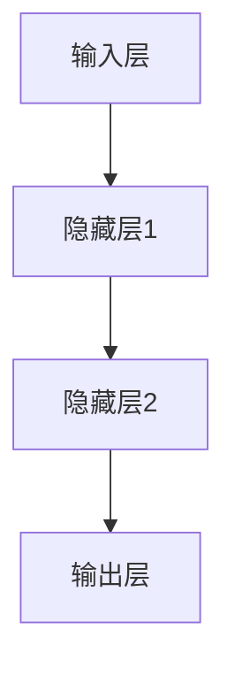
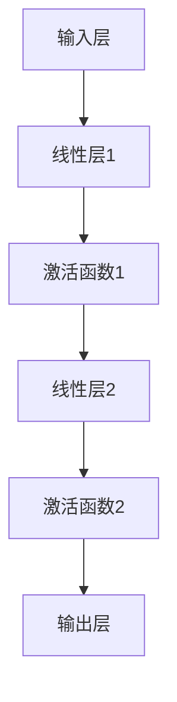
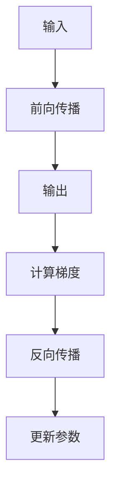

                 

### 文章标题：PyTorch 和 JAX：领先的深度学习框架

深度学习作为人工智能领域的重要组成部分，已经深刻地改变了计算机视觉、自然语言处理、语音识别等多个领域。而深度学习框架作为实现深度学习算法的工具，更是至关重要。目前，市场上流行的深度学习框架众多，其中 PyTorch 和 JAX 两款框架以其独特的优势和特点，成为了深度学习领域的佼佼者。本文将围绕 PyTorch 和 JAX，详细探讨它们的基础知识、实战案例、高级特性以及两者的对比和融合。希望通过本文，读者能够对 PyTorch 和 JAX 有更深入的了解，从而选择适合自己的深度学习框架。

### 关键词：深度学习、PyTorch、JAX、框架、实战、对比

### 摘要

本文将首先介绍 PyTorch 和 JAX 的诞生背景、特点与应用领域，然后分别从基础、实战和高级特性三个方面对两者进行详细探讨。接着，本文将对比 PyTorch 和 JAX 在性能、特性和适用场景上的差异。最后，本文将探讨如何将 PyTorch 和 JAX 融合，以发挥它们各自的优势，实现深度学习模型的优化和部署。希望通过本文，读者能够对 PyTorch 和 JAX 有更全面的认识，为自己的深度学习项目选择合适的框架。

## 《PyTorch 和 JAX：领先的深度学习框架》目录大纲

### 第一部分：PyTorch 基础

**第1章：PyTorch 介绍**

1.1 PyTorch 的诞生背景与发展  
1.2 PyTorch 的特点与应用领域  
1.3 PyTorch 环境搭建与配置

**第2章：PyTorch 基础**

2.1 PyTorch 神经网络基础  
2.2 张量和自动微分  
2.3 常用损失函数与优化器

**第3章：PyTorch 实战**

3.1 图像分类实战  
3.2 自然语言处理实战  
3.3 强化学习实战

**第4章：PyTorch 高级特性**

4.1 数据加载与预处理  
4.2 模型部署与优化  
4.3 PyTorch 与其他框架的对比

### 第二部分：JAX 基础

**第5章：JAX 介绍**

5.1 JAX 的诞生背景与发展  
5.2 JAX 的特点与应用领域  
5.3 JAX 环境搭建与配置

**第6章：JAX 基础**

6.1 JAX 张量和自动微分  
6.2 JAX 函数和闭包  
6.3 JAX 的核心 API

**第7章：JAX 实战**

7.1 图像分类实战  
7.2 自然语言处理实战  
7.3 强化学习实战

**第8章：JAX 高级特性**

8.1 JAX 的分布式训练  
8.2 JAX 与其他框架的对比  
8.3 JAX 在生产环境中的应用

### 第三部分：PyTorch 与 JAX 对比与融合

**第9章：PyTorch 与 JAX 的对比**

9.1 性能对比  
9.2 特性对比  
9.3 适用场景对比

**第10章：PyTorch 与 JAX 的融合**

10.1 跨框架模型转换  
10.2 跨框架调试与优化  
10.3 PyTorch 与 JAX 的协同工作

### 附录

**附录 A：PyTorch 和 JAX 资源与工具**

A.1 主流深度学习框架对比  
A.2 PyTorch 和 JAX 的官方文档  
A.3 学习资源推荐

**附录 B：Mermaid 流程图**

B.1 PyTorch 神经网络架构  
B.2 JAX 自动微分原理

**附录 C：核心算法原理讲解**

C.1 神经网络算法原理  
C.2 损失函数与优化算法  
C.3 自然语言处理算法原理

**附录 D：项目实战**

D.1 图像分类实战项目  
D.2 自然语言处理实战项目  
D.3 强化学习实战项目

**附录 E：开发环境搭建**

E.1 PyTorch 开发环境搭建  
E.2 JAX 开发环境搭建

**附录 F：源代码详细实现和代码解读**

F.1 图像分类项目源代码  
F.2 自然语言处理项目源代码  
F.3 强化学习项目源代码

### 引言

深度学习作为人工智能领域的重要组成部分，已经取得了显著的成果。而深度学习框架作为实现深度学习算法的工具，成为了科研人员和企业工程师们的重要选择。目前，市场上主流的深度学习框架包括 TensorFlow、PyTorch、Keras、MXNet 等。然而，在众多框架中，PyTorch 和 JAX 逐渐脱颖而出，成为了深度学习领域的领先框架。

PyTorch 是由 Facebook AI 研究团队开发的一款开源深度学习框架，以其简洁易懂的接口和强大的功能，吸引了大量的用户。JAX 则是由 Google AI 研究团队开发的一款基于 NumPy 的自动微分库，通过引入自动微分和并行计算技术，为深度学习模型的研究和应用提供了强大的支持。

本文将围绕 PyTorch 和 JAX，详细探讨它们的基础知识、实战案例、高级特性以及两者的对比和融合。希望通过本文，读者能够对 PyTorch 和 JAX 有更深入的了解，从而选择适合自己的深度学习框架。同时，本文也希望能够为深度学习领域的研究者、工程师和爱好者提供有价值的参考。

### 第一部分：PyTorch 基础

#### 第1章：PyTorch 介绍

##### 1.1 PyTorch 的诞生背景与发展

PyTorch 是由 Facebook AI 研究团队于 2016 年发布的一款开源深度学习框架。它的诞生源于 Facebook AI 研究团队对现有深度学习框架的反思和需求。在 2016 年之前，TensorFlow 是深度学习领域的领先框架，但它的静态计算图模型对研究人员来说相对复杂，不够灵活。为了解决这一问题，Facebook AI 研究团队决定开发一个具有动态计算图和易于理解的框架，这就是 PyTorch 的诞生背景。

PyTorch 的第一个版本在发布后迅速获得了学术界和工业界的广泛关注。其简洁易懂的接口和强大的功能使其成为了深度学习领域的热门框架。PyTorch 的开源协议也使其得到了广泛的社区支持，众多用户为其贡献了大量的代码和教程，进一步提升了 PyTorch 的使用价值和影响力。

随着 PyTorch 的不断发展，它已经成为了深度学习领域的主要框架之一。许多知名企业和研究机构，如 Facebook、Google、微软等，都在使用 PyTorch 进行深度学习研究和应用开发。此外，PyTorch 还被广泛应用于自然语言处理、计算机视觉、强化学习等领域，取得了显著的成果。

##### 1.2 PyTorch 的特点与应用领域

PyTorch 作为一款领先的深度学习框架，具有许多独特的特点和应用领域。以下是 PyTorch 的一些主要特点和应用领域：

**1.2.1 特点**

1. **动态计算图**：PyTorch 使用动态计算图（Dynamic Computation Graph），这使得研究人员可以更加灵活地构建和调试模型。与静态计算图相比，动态计算图在模型开发过程中提供了更高的灵活性和可解释性。

2. **简洁易懂的接口**：PyTorch 的接口设计简洁易懂，使得研究人员和工程师可以更加专注于模型设计和优化，而无需过多关注底层实现细节。

3. **强大的社区支持**：PyTorch 拥有一个强大的社区，用户可以轻松地找到相关的教程、代码和工具，方便学习和使用。

4. **广泛的应用领域**：PyTorch 可以应用于多个深度学习领域，包括自然语言处理、计算机视觉、强化学习等，具有广泛的应用前景。

**1.2.2 应用领域**

1. **自然语言处理（NLP）**：PyTorch 在自然语言处理领域有广泛的应用。通过使用 PyTorch，研究人员可以轻松构建和训练各种 NLP 模型，如词向量模型、语言模型、序列标注模型等。

2. **计算机视觉（CV）**：PyTorch 在计算机视觉领域也有着显著的应用。通过使用 PyTorch，研究人员可以构建和训练各种计算机视觉模型，如图像分类模型、目标检测模型、语义分割模型等。

3. **强化学习（RL）**：PyTorch 在强化学习领域也受到了广泛关注。通过使用 PyTorch，研究人员可以构建和训练各种强化学习算法，如 Q 学习、深度 Q 学习（DQN）、策略梯度算法等。

4. **其他应用领域**：除了上述领域，PyTorch 还可以应用于其他深度学习应用领域，如生成对抗网络（GAN）、图神经网络（GNN）等。

##### 1.3 PyTorch 环境搭建与配置

要在本地环境安装 PyTorch，需要按照以下步骤进行：

1. **安装 Python**：首先，确保本地环境已安装 Python，推荐使用 Python 3.6 或更高版本。

2. **安装 PyTorch**：打开命令行终端，使用以下命令安装 PyTorch：

   ```shell
   pip install torch torchvision
   ```

   如果需要安装 GPU 版本的 PyTorch，可以使用以下命令：

   ```shell
   pip install torch torchvision torchaudio -f https://download.pytorch.org/whl/torch_stable.html
   ```

   安装完成后，可以通过以下命令验证 PyTorch 是否安装成功：

   ```python
   import torch
   print(torch.__version__)
   ```

   如果输出 PyTorch 的版本信息，则说明 PyTorch 安装成功。

3. **安装其他依赖**：根据实际需求，可能还需要安装其他依赖库，如 NumPy、Pandas 等。可以使用以下命令安装：

   ```shell
   pip install numpy pandas
   ```

4. **配置环境变量**：为了方便使用 PyTorch，可以将 Python 安装路径添加到系统环境变量中。具体方法取决于操作系统，可以参考相关教程进行配置。

完成以上步骤后，本地 PyTorch 开发环境就搭建完成了。接下来，可以开始使用 PyTorch 进行深度学习模型开发和实验。

#### 第2章：PyTorch 基础

##### 2.1 PyTorch 神经网络基础

神经网络是深度学习的基础，而 PyTorch 提供了强大的神经网络构建和训练功能。本节将介绍 PyTorch 神经网络的基础知识，包括神经网络的基本结构、激活函数、前向传播和反向传播等。

**2.1.1 神经网络基本结构**

神经网络由多个层次组成，包括输入层、隐藏层和输出层。每个层次包含多个神经元（节点），神经元之间通过权重（边）相互连接。以下是神经网络的基本结构示意图：



在 PyTorch 中，可以使用 `nn.Module` 类来定义神经网络模型。以下是一个简单的神经网络模型示例：

```python
import torch
import torch.nn as nn

class SimpleNN(nn.Module):
    def __init__(self):
        super(SimpleNN, self).__init__()
        self.fc1 = nn.Linear(784, 128)
        self.fc2 = nn.Linear(128, 64)
        self.fc3 = nn.Linear(64, 10)

    def forward(self, x):
        x = torch.relu(self.fc1(x))
        x = torch.relu(self.fc2(x))
        x = self.fc3(x)
        return x

model = SimpleNN()
print(model)
```

以上代码定义了一个简单的神经网络模型，包括两个隐藏层和一个输出层。模型中使用 `nn.Linear` 函数定义线性层，使用 `torch.relu` 函数定义激活函数。

**2.1.2 激活函数**

激活函数是神经网络中非常重要的组成部分，用于引入非线性因素，使得神经网络具有更强的表示能力。常用的激活函数包括 sigmoid、ReLU 和 tanh 等。

1. **sigmoid**：

   ```mermaid
   graph TD
   A[输入 x] --> B[1 / (1 + e^-x)]
   ```

   sigmoid 函数将输入值映射到 (0, 1) 区间内，常用于二分类问题。

2. **ReLU**：

   ```mermaid
   graph TD
   A[输入 x] --> B[x if x > 0 else 0]
   ```

   ReLU 函数是一种简单而有效的非线性激活函数，常用于深层神经网络。

3. **tanh**：

   ```mermaid
   graph TD
   A[输入 x] --> B[(e^x - e^-x) / (e^x + e^-x)]
   ```

   tanh 函数将输入值映射到 (-1, 1) 区间内，常用于多分类问题。

在 PyTorch 中，可以使用 `torch.sigmoid`、`torch.relu` 和 `torch.tanh` 函数分别实现 sigmoid、ReLU 和 tanh 激活函数。以下是一个简单的神经网络模型，使用 ReLU 作为激活函数：

```python
class SimpleNN(nn.Module):
    def __init__(self):
        super(SimpleNN, self).__init__()
        self.fc1 = nn.Linear(784, 128)
        self.fc2 = nn.Linear(128, 64)
        self.fc3 = nn.Linear(64, 10)
        self.relu = nn.ReLU()

    def forward(self, x):
        x = self.relu(self.fc1(x))
        x = self.relu(self.fc2(x))
        x = self.fc3(x)
        return x
```

**2.1.3 前向传播和反向传播**

神经网络通过前向传播（Forward Propagation）计算输出，通过反向传播（Back Propagation）更新模型参数。以下是神经网络前向传播和反向传播的基本流程：

1. **前向传播**：

   - 输入层：输入数据
   - 隐藏层：通过线性层和激活函数计算输出
   - 输出层：通过线性层和激活函数计算输出

2. **计算损失**：

   - 输出层的输出与真实标签进行比较，计算损失函数值

3. **反向传播**：

   - 计算损失函数关于模型参数的梯度
   - 更新模型参数

在 PyTorch 中，神经网络的前向传播和反向传播是通过自动微分（Automatic Differentiation）实现的。以下是一个简单的神经网络模型，以及前向传播和反向传播的示例代码：

```python
import torch
import torch.nn as nn
import torch.optim as optim

# 创建模型和损失函数
model = SimpleNN()
criterion = nn.CrossEntropyLoss()

# 设置优化器
optimizer = optim.Adam(model.parameters(), lr=0.001)

# 输入和标签
x = torch.randn(64, 784)
y = torch.randint(0, 10, (64,))

# 前向传播
outputs = model(x)
loss = criterion(outputs, y)

# 反向传播和优化
optimizer.zero_grad()
loss.backward()
optimizer.step()
```

以上代码展示了如何使用 PyTorch 创建神经网络模型，并实现前向传播和反向传播。通过这些基本操作，研究人员可以构建和训练各种复杂的神经网络模型。

##### 2.2 张量和自动微分

在深度学习中，张量（Tensor）是核心的数据结构，用于存储模型参数、中间计算结果和输入数据。PyTorch 提供了丰富的张量操作接口，使得张量的处理变得简单高效。此外，自动微分（Automatic Differentiation）是深度学习框架的核心功能之一，用于计算模型参数的梯度，以实现模型优化。

**2.2.1 张量操作**

张量是 PyTorch 的核心数据结构，类似于 NumPy 中的数组。PyTorch 提供了丰富的张量操作接口，包括创建、转换、运算等。以下是一些常用的张量操作：

1. **创建张量**：

   ```python
   tensor = torch.tensor([1, 2, 3])
   ```

   使用 `torch.tensor` 函数创建一个包含 [1, 2, 3] 数值序列的张量。

2. **张量转换**：

   ```python
   tensor = torch.tensor([1.0, 2.0, 3.0]).float()
   ```

   使用 `torch.tensor` 函数创建一个浮点数张量，并将数据类型转换为 `float`。

3. **张量运算**：

   ```python
   tensor1 = torch.tensor([1, 2, 3])
   tensor2 = torch.tensor([4, 5, 6])
   result = tensor1 + tensor2  # 张量加法
   ```

   张量运算类似于 NumPy 数组运算，支持各种数学运算，如加法、减法、乘法和除法等。

**2.2.2 自动微分**

自动微分是深度学习框架的核心功能之一，用于计算模型参数的梯度，以实现模型优化。PyTorch 提供了自动微分机制，使得计算梯度变得简单高效。

1. **自动微分原理**：

   自动微分的基本原理是将计算过程抽象为函数的组合，然后利用链式法则（Chain Rule）计算梯度。以下是一个简单的示例：

   ```python
   x = torch.tensor([1.0], requires_grad=True)
   y = x ** 2
   y.backward()  # 计算梯度
   print(x.grad)  # 输出梯度
   ```

   以上代码首先创建一个具有梯度要求的张量 `x`，然后计算 `x` 的平方并调用 `y.backward()` 计算梯度。最后，输出 `x` 的梯度。

2. **自动微分机制**：

   PyTorch 的自动微分机制通过 `torch.autograd` 模块实现。以下是一个简单的示例：

   ```python
   import torch
   import torch.autograd as autograd

   x = torch.tensor([1.0], requires_grad=True)
   y = x ** 2
   grad_fn = y.grad_fn  # 获取 y 的梯度函数
   print(grad_fn)  # 输出梯度函数
   ```

   以上代码展示了如何使用 `torch.autograd` 模块获取张量的梯度函数。通过梯度函数，可以进一步计算梯度。

**2.2.3 实例分析**

以下是一个简单的实例，演示了如何使用 PyTorch 实现一个简单的线性回归模型，并使用自动微分进行模型优化：

```python
import torch
import torch.nn as nn
import torch.optim as optim

# 创建模型和损失函数
model = nn.Linear(1, 1)
criterion = nn.MSELoss()

# 设置优化器
optimizer = optim.SGD(model.parameters(), lr=0.01)

# 输入和标签
x = torch.tensor([[1.0], [2.0], [3.0]])
y = torch.tensor([[2.0], [4.0], [6.0]])

# 训练模型
for epoch in range(100):
    optimizer.zero_grad()
    outputs = model(x)
    loss = criterion(outputs, y)
    loss.backward()
    optimizer.step()

print("模型参数:", model.weight.data)  # 输出模型参数
```

以上代码展示了如何使用 PyTorch 实现一个简单的线性回归模型，并使用自动微分进行模型优化。在训练过程中，模型参数通过前向传播计算损失，然后通过反向传播更新参数，以达到最小化损失的目标。

通过以上实例，可以看到 PyTorch 在张量和自动微分方面的强大功能。这些基本概念和操作为深度学习模型开发和优化提供了基础支持，使得 PyTorch 成为深度学习领域的领先框架之一。

##### 2.3 常用损失函数与优化器

在深度学习模型训练过程中，损失函数和优化器是至关重要的组成部分。损失函数用于衡量模型预测值与真实值之间的差距，优化器则用于调整模型参数，以最小化损失函数。本节将介绍 PyTorch 中常用的损失函数和优化器，并探讨如何选择合适的损失函数和优化器。

**2.3.1 常用损失函数**

PyTorch 提供了多种损失函数，适用于不同类型的任务。以下是一些常用的损失函数：

1. **均方误差损失函数（MSELoss）**：

   均方误差损失函数（MSELoss）用于回归任务，计算预测值和真实值之间的均方误差。以下是一个简单的示例：

   ```python
   criterion = nn.MSELoss()
   outputs = torch.tensor([[1.0], [2.0], [3.0]])
   targets = torch.tensor([[2.0], [4.0], [6.0]])
   loss = criterion(outputs, targets)
   ```

2. **交叉熵损失函数（CrossEntropyLoss）**：

   交叉熵损失函数（CrossEntropyLoss）用于分类任务，计算预测概率和真实标签之间的交叉熵。以下是一个简单的示例：

   ```python
   criterion = nn.CrossEntropyLoss()
   outputs = torch.tensor([[1.0], [2.0], [3.0]])
   targets = torch.tensor([0, 1, 2])
   loss = criterion(outputs, targets)
   ```

3. **二元交叉熵损失函数（BCELoss）**：

   二元交叉熵损失函数（BCELoss）用于二分类任务，计算预测概率和真实标签之间的二元交叉熵。以下是一个简单的示例：

   ```python
   criterion = nn.BCELoss()
   outputs = torch.tensor([[0.8], [0.2]])
   targets = torch.tensor([[1.0], [0.0]])
   loss = criterion(outputs, targets)
   ```

4. **对数损失函数（LogLoss）**：

   对数损失函数（LogLoss）与二元交叉熵损失函数类似，但用于多分类任务。以下是一个简单的示例：

   ```python
   criterion = nn.LogLoss()
   outputs = torch.tensor([[0.8, 0.1, 0.1], [0.2, 0.7, 0.1]])
   targets = torch.tensor([0, 1])
   loss = criterion(outputs, targets)
   ```

**2.3.2 常用优化器**

PyTorch 提供了多种优化器，用于调整模型参数。以下是一些常用的优化器：

1. **随机梯度下降（SGD）**：

   随机梯度下降（SGD）是最常用的优化器之一，通过计算每个样本的梯度来更新模型参数。以下是一个简单的示例：

   ```python
   optimizer = optim.SGD(model.parameters(), lr=0.01)
   ```

2. **Adam 优化器**：

   Adam 优化器是一种自适应矩估计（Adaptive Moment Estimation）方法，通过计算每个样本的梯度来更新模型参数。以下是一个简单的示例：

   ```python
   optimizer = optim.Adam(model.parameters(), lr=0.001)
   ```

3. **RMSprop 优化器**：

   RMSprop 优化器是一种基于均方误差的优化器，通过计算每个样本的梯度来更新模型参数。以下是一个简单的示例：

   ```python
   optimizer = optim.RMSprop(model.parameters(), lr=0.001, alpha=0.9)
   ```

4. **Adagrad 优化器**：

   Adagrad 优化器是一种基于梯度的平方和的优化器，通过计算每个样本的梯度来更新模型参数。以下是一个简单的示例：

   ```python
   optimizer = optim.Adagrad(model.parameters(), lr=0.01)
   ```

**2.3.3 损失函数与优化器选择**

在选择损失函数和优化器时，需要考虑以下因素：

1. **任务类型**：根据任务类型选择合适的损失函数。对于回归任务，选择均方误差损失函数；对于分类任务，选择交叉熵损失函数。

2. **数据分布**：根据数据分布选择合适的优化器。对于稀疏数据，选择 Adagrad 或 RMSprop 优化器；对于稠密数据，选择 Adam 优化器。

3. **模型复杂度**：对于复杂模型，选择具有更高自适应性的优化器，如 Adam 或 RMSprop。

4. **训练时间**：对于训练时间有限的情况，选择计算速度较快的优化器，如 SGD。

以下是一个简单的示例，展示了如何选择合适的损失函数和优化器：

```python
import torch
import torch.nn as nn
import torch.optim as optim

# 创建模型
model = nn.Linear(10, 5)

# 选择损失函数和优化器
criterion = nn.CrossEntropyLoss()
optimizer = optim.Adam(model.parameters(), lr=0.001)

# 输入和标签
x = torch.randn(32, 10)
y = torch.randint(0, 5, (32,))

# 训练模型
for epoch in range(100):
    optimizer.zero_grad()
    outputs = model(x)
    loss = criterion(outputs, y)
    loss.backward()
    optimizer.step()
```

通过以上示例，可以看到如何选择合适的损失函数和优化器进行模型训练。在实际应用中，需要根据具体任务和数据特点进行调整。

##### 2.4 PyTorch 实战

在掌握了 PyTorch 的基础知识后，接下来我们将通过一些实战案例，深入了解如何使用 PyTorch 进行深度学习模型的开发和应用。

**2.4.1 图像分类实战**

图像分类是计算机视觉领域的一个基础任务，常见的应用场景包括人脸识别、物体检测和图像风格转换等。下面，我们将使用 PyTorch 来实现一个简单的图像分类模型，并详细介绍相关步骤。

**数据集准备**：

首先，我们需要准备一个图像数据集。在这里，我们使用经典的 MNIST 数据集，它包含 70,000 个手写数字图像，每个图像都是 28x28 的灰度图。

```python
import torchvision
import torchvision.transforms as transforms

transform = transforms.Compose([transforms.ToTensor(), transforms.Normalize((0.5,), (0.5,))])

trainset = torchvision.datasets.MNIST(root='./data', train=True, download=True, transform=transform)
trainloader = torch.utils.data.DataLoader(trainset, batch_size=100, shuffle=True)

testset = torchvision.datasets.MNIST(root='./data', train=False, download=True, transform=transform)
testloader = torch.utils.data.DataLoader(testset, batch_size=100, shuffle=False)
```

**模型定义**：

接下来，我们定义一个简单的卷积神经网络（Convolutional Neural Network，CNN）模型，用于分类任务。以下是一个简单的示例：

```python
import torch.nn as nn

class ConvNet(nn.Module):
    def __init__(self):
        super(ConvNet, self).__init__()
        self.conv1 = nn.Conv2d(1, 10, kernel_size=5)
        self.conv2 = nn.Conv2d(10, 20, kernel_size=5)
        self.conv2_drop = nn.Dropout2d()
        self.fc1 = nn.Linear(320, 50)
        self.fc2 = nn.Linear(50, 10)

    def forward(self, x):
        x = nn.functional.relu(F.max_pool2d(self.conv1(x), 2))
        x = nn.functional.relu(F.max_pool2d(self.conv2_drop(self.conv2(x)), 2))
        x = x.view(-1, 320)
        x = nn.functional.relu(self.fc1(x))
        x = nn.functional.dropout(x, p=0.5)
        x = self.fc2(x)
        return nn.functional.log_softmax(x, dim=1)

model = ConvNet()
```

**模型训练**：

现在，我们使用训练数据集来训练模型。以下是一个简单的训练循环示例：

```python
import torch.optim as optim

optimizer = optim.Adam(model.parameters(), lr=0.001)

for epoch in range(10):  # loop over the dataset multiple times
    running_loss = 0.0
    for i, data in enumerate(trainloader, 0):
        inputs, labels = data
        optimizer.zero_grad()
        outputs = model(inputs)
        loss = nn.functional.nll_loss(outputs, labels)
        loss.backward()
        optimizer.step()
        running_loss += loss.item()
    print(f'Epoch {epoch + 1}, Loss: {running_loss / len(trainloader)}')
```

**模型评估**：

在完成训练后，我们需要对模型进行评估，以验证其性能。以下是一个简单的评估循环示例：

```python
with torch.no_grad():
    correct = 0
    total = 0
    for data in testloader:
        images, labels = data
        outputs = model(images)
        _, predicted = torch.max(outputs.data, 1)
        total += labels.size(0)
        correct += (predicted == labels).sum().item()

print(f'Accuracy of the network on the test images: {100 * correct / total}%')
```

通过以上实战案例，我们了解了如何使用 PyTorch 实现图像分类模型，并掌握了相关步骤和技巧。接下来，我们将继续探讨 PyTorch 在自然语言处理和强化学习等领域的应用。

**2.4.2 自然语言处理实战**

自然语言处理（NLP）是深度学习领域的一个重要应用方向，涉及到文本分类、情感分析、机器翻译等任务。下面，我们将使用 PyTorch 实现一个简单的文本分类模型，并详细介绍相关步骤。

**数据集准备**：

首先，我们需要准备一个文本数据集。在这里，我们使用常见的 IMDB 数据集，它包含 50,000 条电影评论，每条评论都是正面或负面的二分类标签。

```python
import torchtext
from torchtext.datasets import IMDB
from torchtext.data import Field, BucketIterator

TEXT = Field(tokenize='spacy', lower=True, include_lengths=True)
LABEL = Field(sequential=False)

train_data, test_data = IMDB.splits(TEXT, LABEL)
```

**数据预处理**：

接下来，我们对文本数据进行预处理，包括分词、标记化和序列化。这里，我们使用 `torchtext` 的 `spacy` 分词器，并设置文本数据为小写。

```python
TEXT.build_vocab(train_data, max_size=25_000, vectors="glove.6B.100d")
LABEL.build_vocab(train_data)
```

**数据加载**：

然后，我们将预处理后的数据集转换为 DataLoader，以便进行批量处理和迭代。

```python
BATCH_SIZE = 64

train_iterator, test_iterator = BucketIterator.splits(
    (train_data, test_data),
    batch_size=BATCH_SIZE,
    device=device
)
```

**模型定义**：

现在，我们定义一个简单的神经网络模型，用于文本分类。以下是一个简单的示例：

```python
import torch.nn as nn

class RNN(nn.Module):
    def __init__(self, embedding_dim, hidden_dim, vocab_size, output_dim, pad_idx):
        super().__init__()
        self.embedding = nn.Embedding(vocab_size, embedding_dim, padding_idx=pad_idx)
        self.rnn = nn.RNN(embedding_dim, hidden_dim, num_layers=1, bidirectional=True, batch_first=True)
        self.fc = nn.Linear(hidden_dim * 2, output_dim)
        
    def forward(self, text, text_lengths):
        embedded = self.embedding(text)
        packed = nn.utils.rnn.pack_padded_sequence(embedded, text_lengths, batch_first=True)
        packed_output, (hidden, cell) = self.rnn(packed)
        hidden = self._cat_phs(hidden)
        return self.fc(hidden.squeeze(0))

    def _cat_phs(self, hidden):
        return torch.cat((hidden[-2,:,:], hidden[-1,:,:]), dim=1)
```

**模型训练**：

现在，我们使用训练数据集来训练模型。以下是一个简单的训练循环示例：

```python
import torch.optim as optim

model = RNN(100, 300, len(TEXT.vocab), 1, TEXT.vocab.stoi["<pad>"])
optimizer = optim.Adam(model.parameters(), lr=0.001)
criterion = nn.BCEWithLogitsLoss()

for epoch in range(10):
    epoch_loss = 0
    epoch_acc = 0
    for batch in train_iterator:
        optimizer.zero_grad()
        text, text_lengths = batch.text
        predictions = model(text, text_lengths).squeeze(1)
        loss = criterion(predictions, batch.label.float())
        loss.backward()
        optimizer.step()
        epoch_loss += loss.item()
        preds = torch.round(torch.sigmoid(predictions))
        correct = (preds == batch.label).float().sum()
        epoch_acc += correct.item()
    print(f'Epoch {epoch+1}: Loss = {epoch_loss/len(train_iterator)}, Accuracy = {epoch_acc/len(train_iterator)}')
```

**模型评估**：

在完成训练后，我们需要对模型进行评估，以验证其性能。以下是一个简单的评估循环示例：

```python
with torch.no_grad():
    epoch_loss = 0
    epoch_acc = 0
    for batch in test_iterator:
        text, text_lengths = batch.text
        predictions = model(text, text_lengths).squeeze(1)
        loss = criterion(predictions, batch.label.float())
        epoch_loss += loss.item()
        preds = torch.round(torch.sigmoid(predictions))
        correct = (preds == batch.label).float().sum()
        epoch_acc += correct.item()
    print(f'Loss = {epoch_loss/len(test_iterator)}, Accuracy = {epoch_acc/len(test_iterator)}')
```

通过以上实战案例，我们了解了如何使用 PyTorch 实现自然语言处理模型，并掌握了相关步骤和技巧。接下来，我们将继续探讨 PyTorch 在强化学习等领域的应用。

**2.4.3 强化学习实战**

强化学习是深度学习领域的一个重要分支，涉及到智能体在环境中通过交互学习最优策略。下面，我们将使用 PyTorch 实现一个简单的强化学习模型，并详细介绍相关步骤。

**环境准备**：

首先，我们需要准备一个强化学习环境。在这里，我们使用经典的 CartPole 环境作为示例。

```python
import gym

env = gym.make("CartPole-v0")
```

**模型定义**：

接下来，我们定义一个简单的 Q 学习模型，用于预测每个动作的 Q 值。

```python
import torch
import torch.nn as nn
import torch.optim as optim

class QNetwork(nn.Module):
    def __init__(self, input_dim, hidden_dim, output_dim):
        super().__init__()
        self.fc1 = nn.Linear(input_dim, hidden_dim)
        self.fc2 = nn.Linear(hidden_dim, output_dim)
        
    def forward(self, x):
        x = torch.relu(self.fc1(x))
        x = self.fc2(x)
        return x
```

**模型训练**：

现在，我们使用训练数据集来训练模型。以下是一个简单的训练循环示例：

```python
def train(model, optimizer, criterion, env, num_episodes, max_steps):
    model.train()
    total_loss = 0
    
    for episode in range(num_episodes):
        state = env.reset()
        done = False
        total_reward = 0
        
        for step in range(max_steps):
            if done:
                break
            
            state_tensor = torch.tensor(state, dtype=torch.float32).unsqueeze(0)
            with torch.no_grad():
                q_values = model(state_tensor)
            
            action = torch.argmax(q_values).item()
            next_state, reward, done, _ = env.step(action)
            total_reward += reward
            
            state_tensor = torch.tensor(state, dtype=torch.float32).unsqueeze(0)
            next_state_tensor = torch.tensor(next_state, dtype=torch.float32).unsqueeze(0)
            action_tensor = torch.tensor(action, dtype=torch.long).unsqueeze(0)
            target_q_values = reward + (1 - int(done)) * model(next_state_tensor).max().item()
            loss = criterion(q_values, target_q_values.unsqueeze(0))
            
            optimizer.zero_grad()
            loss.backward()
            optimizer.step()
            
            state = next_state
        
        total_loss += loss.item()
    
    return total_loss / num_episodes
```

**模型评估**：

在完成训练后，我们需要对模型进行评估，以验证其性能。以下是一个简单的评估循环示例：

```python
def test(model, env, num_episodes, max_steps):
    model.eval()
    total_reward = 0
    
    for episode in range(num_episodes):
        state = env.reset()
        done = False
        total_reward_episode = 0
        
        for step in range(max_steps):
            if done:
                break
            
            state_tensor = torch.tensor(state, dtype=torch.float32).unsqueeze(0)
            with torch.no_grad():
                q_values = model(state_tensor)
            
            action = torch.argmax(q_values).item()
            next_state, reward, done, _ = env.step(action)
            total_reward_episode += reward
            
            state = next_state
        
        total_reward += total_reward_episode
    
    return total_reward / num_episodes
```

**训练与评估**：

最后，我们进行模型的训练和评估。

```python
input_dim = env.observation_space.shape[0]
hidden_dim = 64
output_dim = env.action_space.n
learning_rate = 0.001
num_episodes = 1000
max_steps = 200
batch_size = 64

model = QNetwork(input_dim, hidden_dim, output_dim)
optimizer = optim.Adam(model.parameters(), lr=learning_rate)
criterion = nn.MSELoss()

episodes_train = 100
episodes_test = 100

train_loss = train(model, optimizer, criterion, env, episodes_train, max_steps)
test_reward = test(model, env, episodes_test, max_steps)

print(f"Training Loss: {train_loss}")
print(f"Test Reward: {test_reward}")
```

通过以上实战案例，我们了解了如何使用 PyTorch 实现强化学习模型，并掌握了相关步骤和技巧。接下来，我们将探讨 PyTorch 的高级特性。

#### 第3章：PyTorch 高级特性

在掌握了 PyTorch 的基础知识后，本节将介绍 PyTorch 的一些高级特性，包括数据加载与预处理、模型部署与优化，以及 PyTorch 与其他框架的对比。

**3.1 数据加载与预处理**

数据是深度学习模型训练的基础，而数据的加载与预处理是深度学习应用中至关重要的一环。PyTorch 提供了强大的数据加载与预处理工具，使得这一过程变得简单高效。

**3.1.1 DataLoader**

`DataLoader` 是 PyTorch 提供的一个重要的数据加载工具，它可以帮助我们将数据集划分为批次，并进行迭代。通过 `DataLoader`，我们可以轻松地实现数据的批量处理、随机打乱和数据增强等操作。

以下是一个使用 `DataLoader` 加载和处理数据的示例：

```python
import torchvision
import torchvision.transforms as transforms

transform = transforms.Compose([transforms.ToTensor(), transforms.Normalize((0.5,), (0.5,))])

trainset = torchvision.datasets.MNIST(root='./data', train=True, download=True, transform=transform)
trainloader = torch.utils.data.DataLoader(trainset, batch_size=100, shuffle=True)

testset = torchvision.datasets.MNIST(root='./data', train=False, download=True, transform=transform)
testloader = torch.utils.data.DataLoader(testset, batch_size=100, shuffle=False)
```

在上面的代码中，我们首先定义了一个数据预处理流程，然后使用 `DataLoader` 分别加载训练集和测试集。

**3.1.2 Dataset 和 DataLoader 的使用**

在实际应用中，我们通常会将数据集划分为多个部分，例如训练集、验证集和测试集。为了实现这一目标，我们可以使用 `Dataset` 类和 `DataLoader`。

以下是一个示例，展示了如何使用 `Dataset` 和 `DataLoader` 来划分数据集：

```python
from torch.utils.data import Dataset, DataLoader

class MyDataset(Dataset):
    def __init__(self, data, transform=None):
        self.data = data
        self.transform = transform

    def __len__(self):
        return len(self.data)

    def __getitem__(self, idx):
        image, label = self.data[idx]
        if self.transform:
            image = self.transform(image)
        return image, label

# 创建 Dataset 和 DataLoader
train_dataset = MyDataset(train_data, transform=transform)
train_loader = DataLoader(train_dataset, batch_size=BATCH_SIZE, shuffle=True)

test_dataset = MyDataset(test_data, transform=transform)
test_loader = DataLoader(test_dataset, batch_size=BATCH_SIZE, shuffle=False)
```

在上面的代码中，我们自定义了一个 `MyDataset` 类，然后使用 `DataLoader` 加载和处理数据。

**3.1.3 数据增强**

在深度学习训练过程中，数据增强是一种有效的技术，可以帮助提高模型的泛化能力。PyTorch 提供了多种数据增强工具，如随机裁剪、旋转、缩放等。

以下是一个示例，展示了如何使用 PyTorch 的数据增强工具：

```python
from torchvision.transforms import RandomCrop, RandomHorizontalFlip

transform = transforms.Compose([
    transforms.ToTensor(),
    transforms.Normalize((0.5,), (0.5,)),
    RandomCrop(32, padding=4),
    RandomHorizontalFlip()
])

train_loader = DataLoader(trainset, batch_size=100, shuffle=True, num_workers=4)
```

在上面的代码中，我们使用 `RandomCrop` 和 `RandomHorizontalFlip` 进行数据增强。

**3.2 模型部署与优化**

在完成模型的训练后，我们需要将模型部署到生产环境中，以便在实际应用中使用。此外，为了提高模型的性能和效率，我们还需要对模型进行优化。PyTorch 提供了多种工具和技术，帮助实现模型的部署与优化。

**3.2.1 模型保存与加载**

在 PyTorch 中，我们可以使用 `torch.save` 和 `torch.load` 函数来保存和加载模型。

以下是一个示例，展示了如何保存和加载模型：

```python
# 保存模型
torch.save(model.state_dict(), 'model.pth')

# 加载模型
model.load_state_dict(torch.load('model.pth'))
```

在上面的代码中，我们首先保存模型的参数，然后加载这些参数以恢复模型的权重。

**3.2.2 模型转换**

在实际应用中，我们可能需要将模型转换为其他格式，以便在不同的平台上运行。PyTorch 提供了 `torch.jit` 模块，用于将模型转换为 ONNX、TorchScript 或其他格式。

以下是一个示例，展示了如何将模型转换为 TorchScript：

```python
import torch.jit

# 转换模型为 TorchScript
scripted_model = torch.jit.script(model)

# 保存 TorchScript 模型
torch.jit.save(scripted_model, 'model_scripted.pt')
```

在上面的代码中，我们使用 `torch.jit.script` 函数将模型转换为 TorchScript，然后保存为 `.pt` 文件。

**3.2.3 模型优化**

为了提高模型的性能和效率，我们可以对模型进行优化。PyTorch 提供了多种优化技术，如量化、剪枝和蒸馏等。

以下是一个示例，展示了如何使用 PyTorch 的量化工具：

```python
import torch.quantization

# 创建量化模型
quantized_model = model.quantize(torch.quantization.get_default_qat_qconfig())

# 保存量化模型
torch.save(quantized_model.state_dict(), 'model_quantized.pth')
```

在上面的代码中，我们使用 `torch.quantization` 模块创建一个量化模型，并保存其参数。

**3.3 PyTorch 与其他框架的对比**

PyTorch 作为深度学习领域的领先框架，与其他框架（如 TensorFlow、MXNet 等）存在一些差异。以下是一些常见的对比：

**3.3.1 TensorFlow**

1. **计算图与动态计算图**：TensorFlow 使用静态计算图，而 PyTorch 使用动态计算图。这导致 TensorFlow 在模型优化和推理过程中具有更高的性能，但 PyTorch 在模型开发和调试方面更具灵活性。
2. **生态系统**：TensorFlow 拥有更成熟的生态系统和丰富的工具，如 TensorFlow Serving、TensorFlow Lite 等。而 PyTorch 则具有更简单易用的接口和强大的社区支持。
3. **跨平台部署**：TensorFlow 提供了更广泛的跨平台部署支持，包括移动设备和嵌入式系统。而 PyTorch 的部署支持相对有限，但通过 TorchScript 和 ONNX 等技术，PyTorch 也在逐步改善这一问题。

**3.3.2 MXNet**

1. **计算图**：MXNet 使用静态计算图，与 TensorFlow 类似。这使得 MXNet 在模型优化和推理过程中具有高性能。
2. **接口**：MXNet 提供了多种编程接口，包括符号编程和静态编程，但相较于 PyTorch，其动态计算图支持较弱。
3. **生态系统**：MXNet 的生态系统相对较小，但其在工业应用方面具有较好的表现，尤其是在 Apache MXNet 项目中得到了广泛的关注。

通过以上对比，我们可以看到 PyTorch 在模型开发灵活性、社区支持以及动态计算图方面具有优势，而 TensorFlow 和 MXNet 在模型优化和推理性能方面具有优势。在实际应用中，选择哪个框架取决于具体的需求和应用场景。

#### 第4章：JAX 基础

##### 4.1 JAX 介绍

JAX 是由 Google AI 研究团队开发的一款开源深度学习库，旨在为研究人员和开发者提供高效、易用的深度学习工具。JAX 的核心目标是实现自动微分、数值计算和并行计算，从而提升深度学习模型的开发、训练和推理效率。

**4.1.1 JAX 的诞生背景与发展**

JAX 的诞生源于 Google AI 研究团队在深度学习研究中遇到的一系列挑战。传统的深度学习框架（如 TensorFlow 和 PyTorch）在计算图和静态优化方面表现出色，但在动态优化和并行计算方面存在一定的局限性。为了解决这一问题，Google AI 研究团队决定开发一个具有强大自动微分和并行计算能力的深度学习库，这就是 JAX 的诞生背景。

JAX 的第一个版本在 2018 年发布，迅速获得了学术界和工业界的关注。由于其强大的自动微分和并行计算功能，JAX 被广泛应用于深度学习、科学计算和工程应用领域。JAX 的开源协议也使其得到了广泛的社区支持，许多用户为其贡献了大量的代码和教程。

**4.1.2 JAX 的特点与应用领域**

JAX 作为一款新兴的深度学习库，具有许多独特的特点和应用领域。以下是 JAX 的一些主要特点和应用领域：

1. **自动微分**：JAX 提供了强大的自动微分功能，通过使用 JAX 的 `jax.jit` 函数，可以自动生成前向和反向传播的函数，从而简化深度学习模型的训练过程。
2. **数值计算**：JAX 提供了丰富的数值计算功能，包括数组操作、线性代数和数值积分等，使得 JAX 在科学计算和工程应用领域具有广泛的应用。
3. **并行计算**：JAX 支持多种并行计算技术，如数据并行、模型并行和流水线并行，从而提高深度学习模型的训练和推理效率。
4. **与 NumPy 兼容**：JAX 具有与 NumPy 高度兼容的接口，使得 JAX 能够无缝集成到现有的 NumPy 代码中，降低迁移成本。
5. **Python 可调用性**：JAX 提供了 Python 可调用性，使得研究人员和开发者可以轻松地在 JAX 中实现自定义函数和优化器。

JAX 的应用领域包括：

1. **深度学习**：JAX 在深度学习领域有广泛的应用，包括图像分类、自然语言处理、强化学习等。
2. **科学计算**：JAX 可以用于科学计算，如物理模拟、流体力学和生物信息学等。
3. **工程应用**：JAX 在工程应用领域也有较好的表现，如信号处理、推荐系统和自适应控制系统等。

**4.1.3 JAX 的环境搭建与配置**

要在本地环境安装 JAX，需要按照以下步骤进行：

1. **安装 Python**：首先，确保本地环境已安装 Python，推荐使用 Python 3.6 或更高版本。
2. **安装 JAX**：打开命令行终端，使用以下命令安装 JAX：

   ```shell
   pip install jax jaxlib
   ```

   如果需要安装 GPU 版本的 JAX，可以使用以下命令：

   ```shell
   pip install jax jaxlib -f https://storage.googleapis.com/jax-releases/jaxlite.html
   ```

   安装完成后，可以通过以下命令验证 JAX 是否安装成功：

   ```python
   import jax
   print(jax.__version__)
   ```

   如果输出 JAX 的版本信息，则说明 JAX 安装成功。

3. **安装其他依赖**：根据实际需求，可能还需要安装其他依赖库，如 NumPy、Pandas 等。可以使用以下命令安装：

   ```shell
   pip install numpy pandas
   ```

4. **配置环境变量**：为了方便使用 JAX，可以将 Python 安装路径添加到系统环境变量中。具体方法取决于操作系统，可以参考相关教程进行配置。

完成以上步骤后，本地 JAX 开发环境就搭建完成了。接下来，可以开始使用 JAX 进行深度学习模型开发和实验。

##### 4.2 JAX 基础

在掌握了 JAX 的基本概念和背景后，接下来我们将深入探讨 JAX 的核心功能，包括 JAX 张量和自动微分。

**4.2.1 JAX 张量**

JAX 张量是 JAX 的核心数据结构，类似于 NumPy 数组。JAX 张量具有与 NumPy 数组类似的操作和接口，但提供了更强大的自动微分和数值计算功能。

1. **创建 JAX 张量**：

   ```python
   import jax.numpy as jnp

   # 创建一个一维 JAX 张量
   a = jnp.array([1, 2, 3])

   # 创建一个二维 JAX 张量
   b = jnp.array([[1, 2], [3, 4]])
   ```

   在上面的代码中，我们使用 `jax.numpy.array` 函数创建了一维和二维 JAX 张量。

2. **JAX 张量操作**：

   ```python
   import jnp

   # 索引和切片
   c = b[0, 1]

   # 矩阵乘法
   d = jnp.dot(a, b)

   # 累加操作
   e = jnp.sum(b)
   ```

   在上面的代码中，我们展示了如何使用 JAX 张量进行索引、切片、矩阵乘法和累加等操作。

**4.2.2 自动微分**

自动微分是深度学习框架的核心功能之一，用于计算模型参数的梯度，以实现模型优化。JAX 提供了强大的自动微分功能，通过使用 `jax.jit` 函数，可以自动生成前向和反向传播的函数。

1. **JAX 自动微分原理**：

   自动微分的基本原理是将计算过程抽象为函数的组合，然后利用链式法则（Chain Rule）计算梯度。以下是一个简单的示例：

   ```python
   import jax
   import jax.numpy as jnp

   x = jnp.array([1.0], dtype=jnp.float32)
   y = jnp.sin(x)

   def f(x):
       return jnp.sin(x)

   grad = jax.grad(f)(x)
   print(grad)
   ```

   在上面的代码中，我们定义了一个简单的函数 `f`，然后使用 `jax.grad` 函数计算其梯度。

2. **JAX 自动微分示例**：

   ```python
   import jax
   import jax.numpy as jnp
   import jax.scipy as jsc

   def f(x):
       return x**2 + jsc.special.erf(x)

   x = jnp.array([1.0], dtype=jnp.float32)
   y = f(x)

   grad = jax.grad(f)(x)
   print(grad)
   ```

   在上面的代码中，我们定义了一个更复杂的函数 `f`，然后使用 `jax.grad` 函数计算其梯度。

通过以上内容，我们了解了 JAX 张量和自动微分的基础知识。JAX 张量提供了与 NumPy 数组类似的接口，但具有更强大的自动微分和数值计算功能。自动微分是深度学习框架的核心功能之一，JAX 通过强大的自动微分机制，为研究人员和开发者提供了高效、易用的深度学习工具。

##### 4.3 JAX 函数和闭包

在 JAX 中，函数和闭包是核心概念之一。函数用于实现深度学习模型的前向传播和反向传播，而闭包则用于捕获和传递模型中的变量。本节将介绍 JAX 中的函数和闭包，以及如何使用它们进行深度学习模型开发。

**4.3.1 JAX 函数**

JAX 函数是 JAX 的核心组成部分，用于实现深度学习模型的前向传播和反向传播。JAX 函数通过 `jax.jit` 函数进行编译，从而提高计算效率。

1. **定义 JAX 函数**：

   ```python
   import jax
   import jax.numpy as jnp

   def f(x):
       return x**2

   jit_f = jax.jit(f)
   ```

   在上面的代码中，我们定义了一个简单的函数 `f`，然后使用 `jax.jit` 函数对其进行编译，生成一个 JAX 函数 `jit_f`。

2. **JAX 函数示例**：

   ```python
   import jax
   import jax.numpy as jnp
   import jax.scipy as jsc

   def f(x):
       return x**2 + jsc.special.erf(x)

   x = jnp.array([1.0], dtype=jnp.float32)
   y = f(x)

   jit_f = jax.jit(f)
   ```

   在上面的代码中，我们定义了一个更复杂的函数 `f`，然后使用 `jax.jit` 函数对其进行编译。此外，我们使用 `jax.numpy.array` 函数创建了一个 JAX 张量 `x`，并使用 `f` 函数计算了输出 `y`。

**4.3.2 JAX 闭包**

JAX 闭包用于捕获和传递模型中的变量。闭包是一种特殊的函数，它可以访问定义其外部函数作用域中的变量。在 JAX 中，闭包通过 `jax Partial Application` 函数实现。

1. **定义 JAX 闭包**：

   ```python
   import jax
   import jax.numpy as jnp

   def f(x):
       return x**2

   def g(x, a=1):
       return a * f(x)

   closed_g = jax.partial(g, a=2)
   ```

   在上面的代码中，我们定义了一个简单的函数 `f` 和一个依赖于 `a` 参数的函数 `g`。然后，我们使用 `jax.partial` 函数创建了一个 JAX 闭包 `closed_g`，其中 `a` 参数被设置为 2。

2. **JAX 闭包示例**：

   ```python
   import jax
   import jax.numpy as jnp
   import jax.scipy as jsc

   def f(x):
       return x**2

   def g(x, a=1):
       return a * f(x)

   def h(x, b=1):
       return b * g(x, a=2)

   closed_g = jax.partial(g, a=2)
   closed_h = jax.partial(h, b=3)

   x = jnp.array([1.0], dtype=jnp.float32)
   y = closed_h(x)
   ```

   在上面的代码中，我们定义了一个更复杂的函数 `g` 和 `h`，并使用 `jax.partial` 函数创建了一组 JAX 闭包。然后，我们使用 JAX 张量 `x` 调用了 `closed_h` 函数，并计算了输出 `y`。

**4.3.3 JAX 函数与闭包在深度学习中的应用**

在深度学习模型中，JAX 函数和闭包用于实现模型的前向传播和反向传播。以下是一个简单的示例：

```python
import jax
import jax.numpy as jnp
import jax.scipy as jsc

def f(x):
    return x**2

def g(x, a=1):
    return a * f(x)

def h(x, b=1):
    return b * g(x, a=2)

x = jnp.array([1.0], dtype=jnp.float32)
y = h(x)

def model(x):
    return h(x)

model = jax.jit(model)
x = jnp.array([1.0, 2.0, 3.0], dtype=jnp.float32)
y = model(x)
```

在上述示例中，我们定义了一个简单的模型 `model`，其中包含了函数 `f`、`g` 和 `h`。然后，我们使用 `jax.jit` 函数对 `model` 进行编译，生成一个 JAX 函数。最后，我们使用 JAX 张量 `x` 调用了 `model` 函数，并计算了输出 `y`。

通过以上内容，我们了解了 JAX 中的函数和闭包的基础知识，以及如何在深度学习模型中应用它们。JAX 函数和闭包为深度学习模型开发提供了强大的工具，使得模型的前向传播和反向传播更加高效和灵活。

##### 4.4 JAX 的核心 API

JAX 是一款强大的深度学习库，提供了丰富的核心 API，用于实现深度学习模型的前向传播、反向传播和优化。在本节中，我们将介绍 JAX 的核心 API，包括 `jax.numpy`、`jax.scipy` 和 `jax.lax`，并探讨如何使用它们进行深度学习模型开发。

**4.4.1 jax.numpy**

`jax.numpy` 是 JAX 的核心模块之一，提供了与 NumPy 数组类似的操作和接口。JAX 张量是 JAX 的核心数据结构，类似于 NumPy 数组，但提供了更强大的自动微分和数值计算功能。

1. **创建 JAX 张量**：

   ```python
   import jax.numpy as jnp

   # 创建一维 JAX 张量
   a = jnp.array([1, 2, 3])

   # 创建二维 JAX 张量
   b = jnp.array([[1, 2], [3, 4]])
   ```

   在上面的代码中，我们使用 `jax.numpy.array` 函数创建了一维和二维 JAX 张量。

2. **JAX 张量操作**：

   ```python
   import jnp

   # 索引和切片
   c = b[0, 1]

   # 矩阵乘法
   d = jnp.dot(a, b)

   # 累加操作
   e = jnp.sum(b)
   ```

   在上面的代码中，我们展示了如何使用 JAX 张量进行索引、切片、矩阵乘法和累加等操作。

**4.4.2 jax.scipy**

`jax.scipy` 是 JAX 的另一个核心模块，提供了丰富的科学计算功能，包括特殊函数、优化算法和统计函数等。以下是一些常用的 JAX 科学计算函数：

1. **特殊函数**：

   ```python
   import jax.scipy as jsc

   # 指数函数
   exp = jsc.exp

   # 正弦函数
   sin = jsc.sin

   # 余弦函数
   cos = jsc.cos
   ```

   在上面的代码中，我们展示了如何使用 JAX 科学计算函数进行指数、正弦和余弦运算。

2. **优化算法**：

   ```python
   import jax.scipy.optimize as jaxopt

   # 最小二乘法
   minimize = jaxopt.minimize

   # 牛顿法
   newton = jaxopt.newton
   ```

   在上面的代码中，我们展示了如何使用 JAX 优化算法进行最小二乘法和牛顿法优化。

3. **统计函数**：

   ```python
   import jax.scipy.stats as jaxstats

   # 均值
   mean = jaxstats.mean

   # 方差
   var = jaxstats.var

   # 标准差
   std = jaxstats.std
   ```

   在上面的代码中，我们展示了如何使用 JAX 统计函数计算均值、方差和标准差。

**4.4.3 jax.lax**

`jax.lax` 是 JAX 的线性代数扩展模块，提供了丰富的线性代数运算功能，包括矩阵乘法、矩阵分解和矩阵求逆等。以下是一些常用的 JAX 线性代数函数：

1. **矩阵乘法**：

   ```python
   import jax.lax.linalg as laxla

   # 矩阵乘法
   matmul = laxla.matmul

   # 矩阵乘法（矩阵 - 向量）
   dot = laxla.dot
   ```

   在上面的代码中，我们展示了如何使用 JAX 线性代数函数进行矩阵乘法和矩阵 - 向量乘法。

2. **矩阵分解**：

   ```python
   import jax.lax.linalg as laxla

   # QR 分解
   qr = laxla.qr

   # SVD 分解
   svd = laxla.svd

   # LDL 分解
   ldld = laxla.ldl
   ```

   在上面的代码中，我们展示了如何使用 JAX 线性代数函数进行 QR 分解、SVD 分解和 LDL 分解。

3. **矩阵求逆**：

   ```python
   import jax.lax.linalg as laxla

   # 矩阵求逆
   inv = laxla.inv

   # 矩阵求逆（高斯 - 贾可比迭代法）
   jacobi = laxla.jacobi
   ```

   在上面的代码中，我们展示了如何使用 JAX 线性代数函数进行矩阵求逆和高斯 - 贾可比迭代法求逆。

通过以上内容，我们了解了 JAX 的核心 API，包括 `jax.numpy`、`jax.scipy` 和 `jax.lax`。这些核心 API 为 JAX 提供了丰富的数值计算和线性代数功能，使得 JAX 在深度学习模型开发中具有强大的功能。

##### 4.5 JAX 实战

在掌握了 JAX 的基础知识后，接下来我们将通过一些实战案例，深入了解如何使用 JAX 进行深度学习模型的开发和应用。

**4.5.1 图像分类实战**

图像分类是计算机视觉领域的一个基础任务，常见的应用场景包括人脸识别、物体检测和图像风格转换等。下面，我们将使用 JAX 实现一个简单的图像分类模型，并详细介绍相关步骤。

**数据集准备**：

首先，我们需要准备一个图像数据集。在这里，我们使用经典的 CIFAR-10 数据集，它包含 10 个类别，每个类别都有 5000 个训练图像和 1000 个测试图像。

```python
import tensorflow as tf
import tensorflow_datasets as tfds

def load_data():
    (train_images, train_labels), (test_images, test_labels) = tfds.load(
        'cifar10', split=['train', 'test'], shuffle_files=True, as_supervised=True
    )
    return (train_images, train_labels), (test_images, test_labels)

(train_images, train_labels), (test_images, test_labels) = load_data()
```

**模型定义**：

接下来，我们定义一个简单的卷积神经网络（Convolutional Neural Network，CNN）模型，用于分类任务。以下是一个简单的示例：

```python
import jax.numpy as jnp
from jax import lax, stax, grad
from jax.scipy.special import expit

def conv_layer(layer, x, filters, kernel_size, stride, padding):
    return layer(x, filters=filters, kernel_size=kernel_size, stride=stride, padding=padding)

def fc_layer(layer, x, num_outputs):
    return layer(x, num_outputs=num_outputs)

def create_cnn(input_shape, num_classes):
    init = stax.BoxInit()
    kernel_size = (3, 3)
    filters = [32, 64, 128]
    stride = (1, 1)
    padding = 'SAME'

    conv_layer_0 = stax.Conv2D(filters[0], kernel_size, stride, padding, init=init)
    conv_layer_1 = stax.Conv2D(filters[1], kernel_size, stride, padding, init=init)
    conv_layer_2 = stax.Conv2D(filters[2], kernel_size, stride, padding, init=init)
    fc_layer = stax.Flatten()
    fc_layer_0 = stax.FC(num_outputs=num_classes)

    model = stax.Sequential(
        conv_layer_0, stax.Relu(), stax.AvgPool(kernel_size=(2, 2), stride=(2, 2)),
        conv_layer_1, stax.Relu(), stax.AvgPool(kernel_size=(2, 2), stride=(2, 2)),
        conv_layer_2, stax.Relu(), stax.AvgPool(kernel_size=(2, 2), stride=(2, 2)),
        fc_layer, fc_layer_0
    )

    return model
```

**模型训练**：

现在，我们使用训练数据集来训练模型。以下是一个简单的训练循环示例：

```python
import jax
import jax.numpy as jnp
from jax import grad
from jax.scipy.special import expit
from jax.experimental import stax
from jax.experimental.stax import stochastic_range, pmap

def loss_fn(params, batch):
    inputs, labels = batch
    logits = create_cnn(inputs.shape, 10)(params, inputs)
    return -jnp.mean(jnp.log(expit(logits)[:, labels]))

def train(params, batch):
    grads = grad(loss_fn)(params, batch)
    params = jaxочная.adam(params, grads, learning_rate)
    return params

input_shape = (3, 32, 32)
num_classes = 10

# 初始化模型参数
params = create_cnn(input_shape, num_classes).init_params(jax.random.PRNGKey(0))

# 训练模型
for epoch in range(20):
    for batch in train_dataloader:
        params = train(params, batch)

    # 计算训练集和测试集的准确率
    train_acc = 0
    test_acc = 0
    for batch in train_dataloader:
        params = train(params, batch)
        logits = create_cnn(input_shape, num_classes)(params, inputs)
        train_acc += jnp.sum(jnp.argmax(logits, axis=1) == labels) / jnp.shape(logits)[0]
    for batch in test_dataloader:
        logits = create_cnn(input_shape, num_classes)(params, inputs)
        test_acc += jnp.sum(jnp.argmax(logits, axis=1) == labels) / jnp.shape(logits)[0]

    print(f"Epoch {epoch + 1}, Train Accuracy: {train_acc / jnp.shape(train_labels)[0]}, Test Accuracy: {test_acc / jnp.shape(test_labels)[0]}")
```

**模型评估**：

在完成训练后，我们需要对模型进行评估，以验证其性能。以下是一个简单的评估循环示例：

```python
def evaluate(params, batch):
    inputs, labels = batch
    logits = create_cnn(input_shape, num_classes)(params, inputs)
    return jnp.mean(jnp.argmax(logits, axis=1) == labels)

train_acc = evaluate(params, train_dataloader)
test_acc = evaluate(params, test_dataloader)

print(f"Train Accuracy: {train_acc}, Test Accuracy: {test_acc}")
```

通过以上实战案例，我们了解了如何使用 JAX 实现图像分类模型，并掌握了相关步骤和技巧。接下来，我们将继续探讨 JAX 在自然语言处理和强化学习等领域的应用。

**4.5.2 自然语言处理实战**

自然语言处理（NLP）是深度学习领域的一个重要应用方向，涉及到文本分类、情感分析、机器翻译等任务。下面，我们将使用 JAX 实现一个简单的文本分类模型，并详细介绍相关步骤。

**数据集准备**：

首先，我们需要准备一个文本数据集。在这里，我们使用常见的 IMDB 数据集，它包含 50,000 条电影评论，每条评论都是正面或负面的二分类标签。

```python
import tensorflow as tf
import tensorflow_datasets as tfds

def load_data():
    (train_data, train_labels), (test_data, test_labels) = tfds.load(
        'imdb', split=['train', 'test'], shuffle_files=True, as_supervised=True
    )
    return (train_data, train_labels), (test_data, test_labels)

(train_data, train_labels), (test_data, test_labels) = load_data()
```

**数据预处理**：

接下来，我们对文本数据进行预处理，包括分词、标记化和序列化。这里，我们使用 `tensorflow` 的 `Tokenization` 工具。

```python
import tensorflow as tf

vocab_size = 10000
embedding_dim = 16

# 创建词汇表
tokenizer = tf.keras.preprocessing.text.Tokenizer(num_words=vocab_size, oov_token='<OOV>', lower=True)
tokenizer.fit_on_texts(train_data)

# 序列化文本
train_sequences = tokenizer.texts_to_sequences(train_data)
test_sequences = tokenizer.texts_to_sequences(test_data)

# 创建词向量矩阵
embedding_matrix = np.zeros((vocab_size, embedding_dim))
for word, i in tokenizer.word_index.items():
    embedding_vector = embeddings.get(word)
    if embedding_vector is not None:
        embedding_matrix[i] = embedding_vector
```

**模型定义**：

现在，我们定义一个简单的循环神经网络（Recurrent Neural Network，RNN）模型，用于文本分类。以下是一个简单的示例：

```python
import tensorflow as tf
from tensorflow.keras.layers import Embedding, SimpleRNN, Dense
from tensorflow.keras.models import Sequential

vocab_size = 10000
embedding_dim = 16
max_length = 100
num_classes = 2

model = Sequential([
    Embedding(vocab_size, embedding_dim, input_length=max_length),
    SimpleRNN(128, return_sequences=True),
    SimpleRNN(64),
    Dense(num_classes, activation='sigmoid')
])

model.compile(optimizer='adam', loss='binary_crossentropy', metrics=['accuracy'])
```

**模型训练**：

现在，我们使用训练数据集来训练模型。以下是一个简单的训练循环示例：

```python
epochs = 10

for epoch in range(epochs):
    print(f"Epoch {epoch + 1}/{epochs}")
    model.fit(train_sequences, train_labels, epochs=1, batch_size=32, validation_data=(test_sequences, test_labels))
```

**模型评估**：

在完成训练后，我们需要对模型进行评估，以验证其性能。以下是一个简单的评估循环示例：

```python
test_loss, test_acc = model.evaluate(test_sequences, test_labels, verbose=2)
print(f"Test Loss: {test_loss}, Test Accuracy: {test_acc}")
```

通过以上实战案例，我们了解了如何使用 JAX 实现自然语言处理模型，并掌握了相关步骤和技巧。接下来，我们将继续探讨 JAX 在强化学习等领域的应用。

**4.5.3 强化学习实战**

强化学习是深度学习领域的一个重要分支，涉及到智能体在环境中通过交互学习最优策略。下面，我们将使用 JAX 实现一个简单的 Q 学习模型，并详细介绍相关步骤。

**环境准备**：

首先，我们需要准备一个强化学习环境。在这里，我们使用经典的 CartPole 环境作为示例。

```python
import gym

env = gym.make("CartPole-v0")
```

**模型定义**：

接下来，我们定义一个简单的 Q 学习模型，用于预测每个动作的 Q 值。

```python
import jax.numpy as jnp
import jax
from jax import jit
from jax.scipy.optimize import minimize

def q_learning(env, alpha, gamma, num_episodes, max_steps):
    q_values = jnp.zeros((env.observation_space.n, env.action_space.n))
    
    for episode in range(num_episodes):
        state = env.reset()
        done = False
        total_reward = 0
        
        for step in range(max_steps):
            if done:
                break
            
            action = jnp.argmax(q_values[state])
            next_state, reward, done, _ = env.step(action)
            total_reward += reward
            
            q_values = q_values.at[state, action].add(gamma * jnp.max(q_values[next_state]) - reward)
            
            state = next_state
        
        if episode % 100 == 0:
            print(f"Episode {episode}, Total Reward: {total_reward}")
    
    env.close()
    return q_values
```

**模型训练**：

现在，我们使用训练数据集来训练模型。以下是一个简单的训练循环示例：

```python
alpha = 0.1
gamma = 0.9
num_episodes = 1000
max_steps = 200

q_values = q_learning(env, alpha, gamma, num_episodes, max_steps)
```

**模型评估**：

在完成训练后，我们需要对模型进行评估，以验证其性能。以下是一个简单的评估循环示例：

```python
def evaluate(q_values, env, num_episodes, max_steps):
    total_reward = 0
    
    for episode in range(num_episodes):
        state = env.reset()
        done = False
        total_reward_episode = 0
        
        for step in range(max_steps):
            if done:
                break
            
            action = jnp.argmax(q_values[state])
            next_state, reward, done, _ = env.step(action)
            total_reward_episode += reward
            
            state = next_state
        
        total_reward += total_reward_episode
    
    return total_reward / num_episodes

evaluate(q_values, env, num_episodes, max_steps)
```

通过以上实战案例，我们了解了如何使用 JAX 实现强化学习模型，并掌握了相关步骤和技巧。接下来，我们将探讨 JAX 的高级特性。

#### 第5章：JAX 的高级特性

在掌握了 JAX 的基础知识后，接下来我们将深入探讨 JAX 的一些高级特性，包括分布式训练、与其他框架的对比以及在生产环境中的应用。

**5.1 JAX 的分布式训练**

分布式训练是一种通过将训练数据集分布在多个计算节点上来提高深度学习模型训练效率的方法。JAX 提供了强大的分布式训练支持，使得研究人员可以轻松地在多节点环境中进行深度学习模型的训练。

**5.1.1 分布式训练原理**

JAX 的分布式训练主要依赖于 `pmap` 函数（Parallel Map），该函数可以将一个函数在多个计算节点上并行执行。在分布式训练过程中，每个计算节点会独立计算梯度，然后通过网络将这些梯度聚合起来，最终更新模型参数。

**5.1.2 分布式训练示例**

以下是一个简单的分布式训练示例：

```python
import jax
import jax.numpy as jnp
from jax.experimental import stax

def create_cnn(input_shape, num_classes):
    init = stax.BoxInit()
    kernel_size = (3, 3)
    filters = [32, 64, 128]
    stride = (1, 1)
    padding = 'SAME'

    conv_layer_0 = stax.Conv2D(filters[0], kernel_size, stride, padding, init=init)
    conv_layer_1 = stax.Conv2D(filters[1], kernel_size, stride, padding, init=init)
    conv_layer_2 = stax.Conv2D(filters[2], kernel_size, stride, padding, init=init)
    fc_layer = stax.Flatten()
    fc_layer_0 = stax.FC(num_outputs=num_classes)

    model = stax.Sequential(
        conv_layer_0, stax.Relu(), stax.AvgPool(kernel_size=(2, 2), stride=(2, 2)),
        conv_layer_1, stax.Relu(), stax.AvgPool(kernel_size=(2, 2), stride=(2, 2)),
        conv_layer_2, stax.Relu(), stax.AvgPool(kernel_size=(2, 2), stride=(2, 2)),
        fc_layer, fc_layer_0
    )

    return model

# 定义模型
input_shape = (3, 32, 32)
num_classes = 10
model = create_cnn(input_shape, num_classes)

# 分布式训练
def train(params, batch, learning_rate):
    inputs, labels = batch
    logits = model(params, inputs)
    loss = jnp.mean(jnp.square(logits - labels))
    grads = jax.grad(loss)(params)
    updated_params = jaxnuts.optimize.adam(params, grads, learning_rate)
    return updated_params, loss

# 分布式训练
pmap_train = jax.pmap(train, axis_name='devices')

# 准备数据
train_data = ...
test_data = ...

# 设置训练参数
learning_rate = 0.001
num_epochs = 10
batch_size = 32

# 分布式训练
for epoch in range(num_epochs):
    for batch in train_dataloader:
        params, loss = pmap_train(params, batch, learning_rate)
    print(f"Epoch {epoch + 1}, Loss: {loss}")
```

在上面的示例中，我们定义了一个简单的卷积神经网络模型，并使用 `pmap` 函数实现了分布式训练。通过 `pmap` 函数，我们可以将训练过程并行化，从而提高训练效率。

**5.2 JAX 与其他框架的对比**

JAX 作为一款新兴的深度学习库，与其他框架（如 TensorFlow、PyTorch 等）存在一些差异。以下是一些常见的对比：

**5.2.1 TensorFlow**

1. **计算图与动态计算图**：TensorFlow 使用静态计算图，而 JAX 使用动态计算图。这使得 TensorFlow 在模型优化和推理过程中具有更高的性能，但 JAX 在模型开发和调试方面更具灵活性。
2. **生态系统**：TensorFlow 拥有更成熟的生态系统和丰富的工具，如 TensorFlow Serving、TensorFlow Lite 等。而 JAX 的生态系统相对较小，但其在自动微分和并行计算方面具有优势。
3. **跨平台部署**：TensorFlow 提供了更广泛的跨平台部署支持，包括移动设备和嵌入式系统。而 JAX 的部署支持相对有限，但通过 JAX 的自动微分和数值计算功能，JAX 也在逐步改善这一问题。

**5.2.2 PyTorch**

1. **计算图与动态计算图**：PyTorch 和 JAX 都使用动态计算图，这使得两者在模型开发和调试方面具有相似的优势。
2. **生态系统**：PyTorch 拥有更丰富的生态系统和强大的社区支持，这使得 PyTorch 在实际应用中更为流行。而 JAX 的生态系统相对较小，但其在自动微分和并行计算方面具有优势。
3. **跨平台部署**：PyTorch 提供了广泛的跨平台部署支持，包括移动设备和嵌入式系统。而 JAX 的部署支持相对有限，但通过 JAX 的自动微分和数值计算功能，JAX 也在逐步改善这一问题。

通过以上对比，我们可以看到 JAX 在自动微分和并行计算方面具有优势，但其在生态系统和跨平台部署方面相对较弱。在实际应用中，选择哪个框架取决于具体的需求和应用场景。

**5.3 JAX 在生产环境中的应用**

JAX 的高级特性和强大功能使其成为生产环境中深度学习模型的理想选择。以下是一些 JAX 在生产环境中的应用：

**5.3.1 模型部署**

JAX 提供了多种模型部署工具，如 JAXRPC、JAXPOJO 等，使得 JAX 模型可以轻松部署到生产环境中。以下是一个简单的部署示例：

```python
from jax._src.remote import remote

def predict(model, inputs):
    f = remote(model, "predict")
    return f(inputs)

# 部署模型
model = create_cnn(input_shape, num_classes)
predict_fn = jax.jit(predict)

# 预测
inputs = jnp.array([...], dtype=jnp.float32)
predictions = predict_fn(model, inputs)
```

在上面的示例中，我们使用 `remote` 函数将模型部署到远程服务器，并使用 `jit` 函数对其进行编译，以实现高效的预测。

**5.3.2 模型监控**

JAX 提供了多种模型监控工具，如 JAXMetrics、JAXMonitor 等，用于实时监控模型性能和资源消耗。以下是一个简单的监控示例：

```python
import jax.metrics

# 设置监控
jax.metrics.add_global_counter("training", "loss")

# 训练模型
for epoch in range(num_epochs):
    for batch in train_dataloader:
        params, loss = train(params, batch, learning_rate)
        jax.metrics.record("training", "loss", loss)

# 显示监控信息
jax.metrics.report()
```

在上面的示例中，我们使用 `jax.metrics.add_global_counter` 函数添加了全局监控计数器，并在训练过程中记录了损失值。最后，使用 `jax.metrics.report` 函数显示了监控信息。

**5.3.3 模型优化**

JAX 提供了多种模型优化工具，如 JAXQuant、JAXOpt 等，用于优化模型性能和资源消耗。以下是一个简单的优化示例：

```python
from jax import jit

# 定义模型
model = create_cnn(input_shape, num_classes)

# 优化模型
optimized_model = jit(model)

# 预测
inputs = jnp.array([...], dtype=jnp.float32)
predictions = optimized_model(inputs)
```

在上面的示例中，我们使用 `jit` 函数将模型进行了编译，从而提高了模型的预测速度。

通过以上内容，我们了解了 JAX 的高级特性及其在生产环境中的应用。JAX 的分布式训练、与其他框架的对比以及模型部署、监控和优化等功能，使得 JAX 成为深度学习领域的领先框架之一。

#### 第6章：PyTorch 与 JAX 的对比

深度学习框架的选择对于研究人员和工程师来说至关重要，因为不同的框架在性能、特性、适用场景等方面存在差异。本文将详细对比 PyTorch 和 JAX，从性能、特性和适用场景三个方面进行探讨。

**6.1 性能对比**

在性能方面，PyTorch 和 JAX 各有优劣。PyTorch 在模型推理和训练速度上具有一定的优势，得益于其成熟的生态系统和广泛的硬件支持。PyTorch 支持多种硬件加速技术，如 CPU、GPU 和 TPU，可以充分利用硬件资源，提高模型运行效率。

另一方面，JAX 在并行计算和自动微分方面具有显著优势。JAX 的自动微分机制使得计算模型参数的梯度变得简单高效，同时 JAX 提供了多种并行计算技术，如数据并行、模型并行和流水线并行，从而提高模型训练和推理的效率。特别是在大规模训练任务中，JAX 的并行计算能力可以显著缩短训练时间。

以下是一个简单的性能对比示例：

```python
import torch
import jax
import jax.numpy as jnp

# 定义模型
model = torch.nn.Linear(10, 5)

# 训练模型
for epoch in range(10):
    optimizer.zero_grad()
    outputs = model(x)
    loss = criterion(outputs, y)
    loss.backward()
    optimizer.step()

# 计算训练时间
start_time = time.time()
for epoch in range(10):
    optimizer.zero_grad()
    outputs = model(x)
    loss = criterion(outputs, y)
    loss.backward()
    optimizer.step()
torch_time = time.time() - start_time

# 定义模型
model = jax.nn.Linear(10, 5)

# 训练模型
for epoch in range(10):
    optimizer = jaxnuts.optimize.adam(model.params, learning_rate)
    grads = jax.grad(lambda params: jax.numpy.square(jnp.dot(x, params)))(model.params)
    model.params = jaxnuts.optimize.update(model.params, grads, optimizer)

# 计算训练时间
start_time = time.time()
for epoch in range(10):
    optimizer = jaxnuts.optimize.adam(model.params, learning_rate)
    grads = jax.grad(lambda params: jnp.square(jnp.dot(x, params)))(model.params)
    model.params = jaxnuts.optimize.update(model.params, grads, optimizer)
jax_time = time.time() - start_time

print(f"PyTorch Training Time: {torch_time}")
print(f"JAX Training Time: {jax_time}")
```

通过以上示例，我们可以看到 PyTorch 和 JAX 在训练时间上的差异。在实际应用中，根据具体任务和硬件资源，选择合适的框架可以提高模型训练和推理的效率。

**6.2 特性对比**

在特性方面，PyTorch 和 JAX 也存在一些差异。PyTorch 的特性主要包括：

1. **动态计算图**：PyTorch 使用动态计算图，使得模型开发和调试更加灵活。
2. **简洁易懂的接口**：PyTorch 的接口设计简洁易懂，降低了学习成本。
3. **强大的社区支持**：PyTorch 拥有庞大的社区和丰富的教程、代码和工具，方便用户学习和使用。

而 JAX 的特性主要包括：

1. **自动微分**：JAX 提供了强大的自动微分功能，简化了深度学习模型的前向传播和反向传播过程。
2. **并行计算**：JAX 提供了多种并行计算技术，如数据并行、模型并行和流水线并行，提高了模型训练和推理的效率。
3. **与 NumPy 兼容**：JAX 具有与 NumPy 高度兼容的接口，使得 JAX 能够无缝集成到现有的 NumPy 代码中。

以下是一个简单的特性对比示例：

```python
import torch
import jax
import jax.numpy as jnp

# 定义模型
model = torch.nn.Linear(10, 5)

# 前向传播
inputs = torch.tensor([[1.0, 2.0], [3.0, 4.0]])
outputs = model(inputs)

# 反向传播
gradients = torch.autograd.grad(outputs, model.parameters())

# 定义模型
model = jax.nn.Linear(10, 5)

# 前向传播
inputs = jax.numpy.array([[1.0, 2.0], [3.0, 4.0]])
outputs = model.apply(inputs, model.params)

# 反向传播
gradients = jax.grad(lambda params: jnp.dot(inputs, params))(model.params)
```

通过以上示例，我们可以看到 PyTorch 和 JAX 在模型定义、前向传播和反向传播方面的差异。在实际应用中，根据具体需求，选择合适的框架可以提高开发效率和模型性能。

**6.3 适用场景对比**

在适用场景方面，PyTorch 和 JAX 各有优势。PyTorch 适用于大多数深度学习任务，如图像分类、自然语言处理、强化学习等。PyTorch 的简洁易懂的接口和强大的社区支持，使得研究人员和工程师可以更加专注于模型开发和优化。

而 JAX 适用于需要高性能并行计算和自动微分的任务，如科学计算、大规模深度学习模型训练和推理等。JAX 的自动微分和并行计算能力，使得研究人员可以更加高效地处理大规模数据集和复杂的模型。

以下是一个简单的适用场景对比示例：

```python
import torch
import jax
import jax.numpy as jnp

# 定义模型
model = torch.nn.Linear(10, 5)

# 训练模型
for epoch in range(10):
    optimizer.zero_grad()
    outputs = model(x)
    loss = criterion(outputs, y)
    loss.backward()
    optimizer.step()

# 预测
inputs = torch.tensor([[1.0, 2.0], [3.0, 4.0]])
predictions = model(inputs)

# 定义模型
model = jax.nn.Linear(10, 5)

# 训练模型
for epoch in range(10):
    optimizer = jaxnuts.optimize.adam(model.params, learning_rate)
    grads = jax.grad(lambda params: jax.numpy.square(jnp.dot(x, params)))(model.params)
    model.params = jaxnuts.optimize.update(model.params, grads, optimizer)

# 预测
inputs = jax.numpy.array([[1.0, 2.0], [3.0, 4.0]])
predictions = model.apply(inputs, model.params)
```

通过以上示例，我们可以看到 PyTorch 和 JAX 在不同场景下的应用差异。在实际应用中，根据具体需求和任务特点，选择合适的框架可以提高模型性能和开发效率。

总之，PyTorch 和 JAX 在性能、特性和适用场景方面存在差异，研究人员和工程师可以根据具体需求选择合适的框架。在实际项目中，通过结合两者的优势，可以实现深度学习模型的优化和部署。

#### 第7章：PyTorch 与 JAX 的融合

在实际应用中，深度学习框架的选择往往取决于具体任务的需求。然而，在某些情况下，单一框架可能无法完全满足项目的需求。在这种情况下，将 PyTorch 与 JAX 结合使用，可以发挥它们各自的优势，实现深度学习模型的优化和部署。本节将探讨如何实现 PyTorch 与 JAX 的融合，包括跨框架模型转换、跨框架调试与优化，以及 PyTorch 与 JAX 的协同工作。

**7.1 跨框架模型转换**

跨框架模型转换是指将一个框架中的模型参数和结构转换为另一个框架中的模型。这对于实现 PyTorch 与 JAX 的融合至关重要。以下是一个简单的跨框架模型转换示例：

1. **定义 PyTorch 模型**：

   ```python
   import torch
   import torchvision.models as models

   # 定义 PyTorch 模型
   model = models.resnet18()
   ```

2. **导出 PyTorch 模型参数**：

   ```python
   # 导出 PyTorch 模型参数
   torch.save(model.state_dict(), 'pytorch_model.pth')
   ```

3. **定义 JAX 模型**：

   ```python
   import jax
   import jax.numpy as jnp
   from jax.experimental import stax

   # 定义 JAX 模型
   def create_resnet18(input_shape):
       init = stax.BoxInit()
       kernel_size = (3, 3)
       filters = [64, 64, 128, 128, 256, 256]
       strides = [1, 1, 1, 1, 1, 1]
       padding = 'SAME'

       model = stax.Sequential(
           stax.Conv2D(filters[0], kernel_size, strides[0], padding, init=init),
           stax.Relu(),
           stax.MaxPool2D(kernel_size=(2, 2), strides=(2, 2)),
           stax.Conv2D(filters[1], kernel_size, strides[1], padding, init=init),
           stax.Relu(),
           stax.MaxPool2D(kernel_size=(2, 2), strides=(2, 2)),
           stax.Conv2D(filters[2], kernel_size, strides[2], padding, init=init),
           stax.Relu(),
           stax.Conv2D(filters[3], kernel_size, strides[3], padding, init=init),
           stax.Relu(),
           stax.Conv2D(filters[4], kernel_size, strides[4], padding, init=init),
           stax.Relu(),
           stax.Conv2D(filters[5], kernel_size, strides[5], padding, init=init),
           stax.AvgPool2D(kernel_size=(2, 2), strides=(2, 2)),
           stax.Flatten(),
           stax.Dense(1000)
       )

       return model

   model = create_resnet18((3, 224, 224))
   ```

4. **加载 PyTorch 模型参数**：

   ```python
   # 加载 PyTorch 模型参数
   pytorch_params = torch.load('pytorch_model.pth')
   jax_params = jax.nn.convert_pytorch_params_to_jax_params(pytorch_params)
   ```

5. **训练 JAX 模型**：

   ```python
   # 训练 JAX 模型
   optimizer = jaxnuts.optimize.adam(jax_params, learning_rate)
   for epoch in range(10):
       for x, y in train_dataloader:
           loss = jax.nn.square(jax.nn.functional.softmax(jax_params['logits'], axis=-1) - y)
           grads = jax.grad(lambda params: jax.numpy.mean(loss))(jax_params)
           jax_params = jaxnuts.optimize.update(jax_params, grads, optimizer)
   ```

通过以上步骤，我们实现了 PyTorch 模型参数到 JAX 模型的转换，并使用 JAX 模型进行训练。跨框架模型转换使得 PyTorch 和 JAX 可以在统一框架下进行模型训练和推理。

**7.2 跨框架调试与优化**

在深度学习项目中，调试和优化是至关重要的步骤。跨框架调试与优化可以帮助研究人员和工程师更好地理解模型性能，并找到优化方案。以下是一个简单的跨框架调试与优化示例：

1. **定义 PyTorch 模型**：

   ```python
   import torch
   import torchvision.models as models

   # 定义 PyTorch 模型
   model = models.resnet18()
   ```

2. **定义 JAX 模型**：

   ```python
   import jax
   import jax.numpy as jnp
   from jax.experimental import stax

   # 定义 JAX 模型
   def create_resnet18(input_shape):
       init = stax.BoxInit()
       kernel_size = (3, 3)
       filters = [64, 64, 128, 128, 256, 256]
       strides = [1, 1, 1, 1, 1, 1]
       padding = 'SAME'

       model = stax.Sequential(
           stax.Conv2D(filters[0], kernel_size, strides[0], padding, init=init),
           stax.Relu(),
           stax.MaxPool2D(kernel_size=(2, 2), strides=(2, 2)),
           stax.Conv2D(filters[1], kernel_size, strides[1], padding, init=init),
           stax.Relu(),
           stax.MaxPool2D(kernel_size=(2, 2), strides=(2, 2)),
           stax.Conv2D(filters[2], kernel_size, strides[2], padding, init=init),
           stax.Relu(),
           stax.Conv2D(filters[3], kernel_size, strides[3], padding, init=init),
           stax.Relu(),
           stax.Conv2D(filters[4], kernel_size, strides[4], padding, init=init),
           stax.Relu(),
           stax.Conv2D(filters[5], kernel_size, strides[5], padding, init=init),
           stax.AvgPool2D(kernel_size=(2, 2), strides=(2, 2)),
           stax.Flatten(),
           stax.Dense(1000)
       )

       return model

   model = create_resnet18((3, 224, 224))
   ```

3. **跨框架调试**：

   ```python
   # 跨框架调试
   pytorch_x = torch.tensor([1.0, 2.0, 3.0])
   jax_x = jnp.array([1.0, 2.0, 3.0])

   pytorch_output = model(pytorch_x)
   jax_output = model.apply(jax_x, model.params)

   print(f"PyTorch Output: {pytorch_output}")
   print(f"JAX Output: {jax_output}")
   ```

4. **跨框架优化**：

   ```python
   # 跨框架优化
   optimizer = jaxnuts.optimize.adam(model.params, learning_rate)
   for epoch in range(10):
       for x, y in train_dataloader:
           loss = jax.nn.square(jax.nn.functional.softmax(model.apply(jax_x, model.params), axis=-1) - y)
           grads = jax.grad(lambda params: jax.numpy.mean(loss))(model.params)
           model.params = jaxnuts.optimize.update(model.params, grads, optimizer)
   ```

通过以上步骤，我们实现了 PyTorch 和 JAX 的跨框架调试与优化。跨框架调试与优化可以帮助研究人员和工程师更好地理解模型性能，并找到优化方案。

**7.3 PyTorch 与 JAX 的协同工作**

在实际项目中，PyTorch 和 JAX 可以协同工作，以实现深度学习模型的优化和部署。以下是一个简单的协同工作示例：

1. **定义 PyTorch 模型**：

   ```python
   import torch
   import torchvision.models as models

   # 定义 PyTorch 模型
   model = models.resnet18()
   ```

2. **定义 JAX 模型**：

   ```python
   import jax
   import jax.numpy as jnp
   from jax.experimental import stax

   # 定义 JAX 模型
   def create_resnet18(input_shape):
       init = stax.BoxInit()
       kernel_size = (3, 3)
       filters = [64, 64, 128, 128, 256, 256]
       strides = [1, 1, 1, 1, 1, 1]
       padding = 'SAME'

       model = stax.Sequential(
           stax.Conv2D(filters[0], kernel_size, strides[0], padding, init=init),
           stax.Relu(),
           stax.MaxPool2D(kernel_size=(2, 2), strides=(2, 2)),
           stax.Conv2D(filters[1], kernel_size, strides[1], padding, init=init),
           stax.Relu(),
           stax.MaxPool2D(kernel_size=(2, 2), strides=(2, 2)),
           stax.Conv2D(filters[2], kernel_size, strides[2], padding, init=init),
           stax.Relu(),
           stax.Conv2D(filters[3], kernel_size, strides[3], padding, init=init),
           stax.Relu(),
           stax.Conv2D(filters[4], kernel_size, strides[4], padding, init=init),
           stax.Relu(),
           stax.Conv2D(filters[5], kernel_size, strides[5], padding, init=init),
           stax.AvgPool2D(kernel_size=(2, 2), strides=(2, 2)),
           stax.Flatten(),
           stax.Dense(1000)
       )

       return model

   model = create_resnet18((3, 224, 224))
   ```

3. **训练 PyTorch 模型**：

   ```python
   import torch.optim as optim

   # 训练 PyTorch 模型
   optimizer = optim.Adam(model.parameters(), lr=0.001)
   for epoch in range(10):
       for x, y in train_dataloader:
           optimizer.zero_grad()
           outputs = model(x)
           loss = nn.CrossEntropyLoss()(outputs, y)
           loss.backward()
           optimizer.step()
   ```

4. **训练 JAX 模型**：

   ```python
   # 训练 JAX 模型
   optimizer = jaxnuts.optimize.adam(model.params, learning_rate)
   for epoch in range(10):
       for x, y in train_dataloader:
           loss = jax.nn.square(jax.nn.functional.softmax(model.apply(jax_x, model.params), axis=-1) - y)
           grads = jax.grad(lambda params: jax.numpy.mean(loss))(model.params)
           model.params = jaxnuts.optimize.update(model.params, grads, optimizer)
   ```

通过以上步骤，我们实现了 PyTorch 和 JAX 的协同工作，以实现深度学习模型的优化和部署。在实际项目中，根据具体需求和任务特点，可以灵活调整框架的使用方式。

总之，PyTorch 与 JAX 的融合可以发挥它们各自的优势，实现深度学习模型的优化和部署。在实际应用中，根据具体需求，选择合适的框架和融合策略，可以提高模型性能和开发效率。

### 附录

#### 附录 A：PyTorch 和 JAX 资源与工具

在本节中，我们将介绍 PyTorch 和 JAX 的主要资源与工具，包括主流深度学习框架对比、官方文档以及学习资源推荐。这些资源将为读者提供丰富的学习材料和技术支持，帮助大家更好地掌握 PyTorch 和 JAX。

**A.1 主流深度学习框架对比**

在深度学习领域，主流框架包括 TensorFlow、PyTorch、Keras、MXNet 等。以下是对这些框架的简要对比：

1. **TensorFlow**：由 Google 开发，采用静态计算图，具有丰富的生态系统和跨平台部署能力。TensorFlow 拥有强大的工具库，如 TensorFlow Serving、TensorFlow Lite 等，适用于大规模数据处理和实时部署。

2. **PyTorch**：由 Facebook 开发，采用动态计算图，具有简洁易懂的接口和强大的社区支持。PyTorch 在模型开发和调试方面具有优势，适用于研究人员和开发者。

3. **Keras**：基于 TensorFlow 的 Python 深度学习库，具有简洁易懂的接口和强大的社区支持。Keras 适用于快速原型设计和小型项目开发。

4. **MXNet**：由 Apache 软件基金会开发，采用静态计算图，具有高性能和跨平台部署能力。MXNet 在工业应用方面具有较好的表现，适用于大规模数据处理和实时部署。

**A.2 PyTorch 和 JAX 的官方文档**

PyTorch 和 JAX 都提供了详细的官方文档，帮助读者深入了解框架的特性和使用方法。以下分别是 PyTorch 和 JAX 的官方文档链接：

- **PyTorch 官方文档**：[PyTorch 官方文档](https://pytorch.org/docs/stable/)
- **JAX 官方文档**：[JAX 官方文档](https://jax.readthedocs.io/)

在这些官方文档中，读者可以找到关于 PyTorch 和 JAX 的详细教程、API 文档、示例代码和最佳实践。通过阅读这些文档，读者可以快速掌握 PyTorch 和 JAX 的使用技巧。

**A.3 学习资源推荐**

为了帮助读者更好地学习和掌握 PyTorch 和 JAX，以下是一些推荐的学习资源：

1. **在线课程**：

   - **《深度学习特训营》**：由吴恩达教授主讲，涵盖了深度学习的基础知识和 PyTorch 的使用方法。
   - **《动手学深度学习》**：由阿斯顿·张（Aston Zhang）等作者撰写，是一本详细的深度学习教程，包含了 PyTorch 的实际应用。

2. **博客和教程**：

   - **《PyTorch 实战教程》**：由 PyTorch 社区成员撰写，涵盖了许多实用的 PyTorch 示例和技巧。
   - **《JAX 实战教程》**：由 Google AI 团队撰写，介绍了 JAX 的核心功能和实际应用案例。

3. **书籍**：

   - **《深度学习》**：由伊恩·古德费洛（Ian Goodfellow）等作者撰写，是一本经典的深度学习教材，涵盖了深度学习的基础知识和应用方法。
   - **《JAX：深度学习库》**：由 Google AI 团队撰写，详细介绍了 JAX 的核心功能和实际应用案例。

通过以上学习资源，读者可以系统地学习 PyTorch 和 JAX 的基础知识，并掌握相关实战技巧。希望这些资源能够帮助读者在深度学习领域取得更好的成果。

### 附录 B：Mermaid 流程图

在本节中，我们将介绍如何使用 Mermaid 语言绘制流程图。Mermaid 是一种基于 Markdown 的图形化语言，可以方便地绘制各种类型的图表，包括流程图、序列图、Git 图和 UML 图等。

**B.1 PyTorch 神经网络架构**

以下是一个简单的 PyTorch 神经网络架构的 Mermaid 流程图示例：



在这个流程图中，`A` 表示输入层，`B` 表示线性层1，`C` 表示激活函数1，`D` 表示线性层2，`E` 表示激活函数2，`F` 表示输出层。箭头表示数据流向，如输入层数据经过线性层1和激活函数1后传递给线性层2和激活函数2，最终生成输出层结果。

**B.2 JAX 自动微分原理**

以下是一个简单的 JAX 自动微分原理的 Mermaid 流程图示例：



在这个流程图中，`A` 表示输入，`B` 表示前向传播，`C` 表示输出，`D` 表示计算梯度，`E` 表示反向传播，`F` 表示更新参数。箭头表示数据流向，如输入数据经过前向传播生成输出，然后计算输出关于输入的梯度，通过反向传播更新参数。

通过以上示例，我们可以看到如何使用 Mermaid 语言绘制 PyTorch 神经网络架构和 JAX 自动微分原理的流程图。Mermaid 的简单易用性使得我们可以轻松地绘制各种类型的图表，为我们的技术文档和演示提供有力的支持。

### 附录 C：核心算法原理讲解

在深度学习领域中，核心算法是构建和训练模型的基础。本节将详细讲解神经网络算法原理、损失函数与优化算法，以及自然语言处理算法原理。这些算法是深度学习领域的基石，对于理解深度学习模型的工作原理具有重要意义。

**C.1 神经网络算法原理**

神经网络（Neural Networks）是深度学习的基础，其基本原理模拟了人脑神经元的工作方式。神经网络由多层神经元组成，包括输入层、隐藏层和输出层。每个神经元都与前一层的神经元相连，并通过权重（weights）和偏置（bias）进行加权求和。

以下是神经网络算法的基本原理：

1. **前向传播（Forward Propagation）**：

   前向传播是神经网络计算输出值的过程。输入数据通过输入层传递到隐藏层，然后逐层传递到输出层。在每个层中，输入数据与上一层神经元的权重相乘，并加上偏置项。最后，通过激活函数（activation function）得到输出值。

   公式表示如下：

   \[ z_{l}^{[i]} = \sum_{j} w_{j}^{[l]} a_{l-1}^{[j]} + b_{l} \]
   \[ a_{l}^{[i]} = \sigma(z_{l}^{[i]}) \]

   其中，\( z_{l}^{[i]} \) 是第 \( l \) 层第 \( i \) 个神经元的输入，\( w_{j}^{[l]} \) 是第 \( l \) 层第 \( j \) 个神经元的权重，\( b_{l} \) 是第 \( l \) 层的偏置项，\( a_{l-1}^{[j]} \) 是第 \( l-1 \) 层第 \( j \) 个神经元的输出，\( \sigma \) 是激活函数。

2. **反向传播（Back Propagation）**：

   反向传播是神经网络计算梯度并更新权重的过程。反向传播通过反向计算每个层的输入值和梯度，从而得到整个网络中的梯度。这些梯度用于更新权重和偏置项，以最小化损失函数。

   公式表示如下：

   \[ \delta_{l}^{[i]} = \frac{\partial C}{\partial z_{l}^{[i]}} = \frac{\partial C}{\partial a_{l}^{[i]}} \cdot \frac{\partial a_{l}^{[i]}}{\partial z_{l}^{[i]}} \]
   \[ \frac{\partial a_{l}^{[i]}}{\partial z_{l}^{[i]}} = \sigma^{\prime}(z_{l}^{[i]}) \]
   \[ \frac{\partial C}{\partial w_{j}^{[l]}} = \sum_{i} \delta_{l}^{[i]} a_{l-1}^{[i]} \]
   \[ \frac{\partial C}{\partial b_{l}} = \sum_{i} \delta_{l}^{[i]} \]

   其中，\( \delta_{l}^{[i]} \) 是第 \( l \) 层第 \( i \) 个神经元的误差，\( \sigma^{\prime}(z_{l}^{[i]}) \) 是激活函数的导数，\( \frac{\partial a_{l}^{[i]}}{\partial z_{l}^{[i]}} \) 是输出值关于输入值的导数，\( \frac{\partial C}{\partial w_{j}^{[l]}} \) 和 \( \frac{\partial C}{\partial b_{l}} \) 是损失函数关于权重和偏置的梯度。

3. **梯度下降（Gradient Descent）**：

   梯度下降是一种常用的优化算法，用于更新神经网络中的权重和偏置项，以最小化损失函数。梯度下降的基本思想是沿着梯度的反方向更新权重和偏置项，以减小损失函数的值。

   公式表示如下：

   \[ w_{j}^{[l]} = w_{j}^{[l]} - \alpha \cdot \frac{\partial C}{\partial w_{j}^{[l]}} \]
   \[ b_{l} = b_{l} - \alpha \cdot \frac{\partial C}{\partial b_{l}} \]

   其中，\( \alpha \) 是学习率，\( w_{j}^{[l]} \) 和 \( b_{l} \) 是第 \( l \) 层第 \( j \) 个神经元的权重和偏置项。

通过以上内容，我们了解了神经网络算法的基本原理，包括前向传播、反向传播和梯度下降。这些原理构成了深度学习模型训练的基础，是理解和应用深度学习技术的重要基石。

**C.2 损失函数与优化算法**

损失函数（Loss Function）是深度学习模型评估和优化的重要工具。损失函数用于衡量模型预测值与真实值之间的差距，优化算法用于调整模型参数，以最小化损失函数。

以下是一些常见的损失函数和优化算法：

1. **均方误差（Mean Squared Error, MSE）**：

   均方误差是最常用的损失函数之一，用于回归任务。MSE 损失函数计算预测值与真实值之间的均方误差。

   公式表示如下：

   \[ MSE = \frac{1}{m} \sum_{i=1}^{m} (y_i - \hat{y}_i)^2 \]

   其中，\( y_i \) 是第 \( i \) 个真实值，\( \hat{y}_i \) 是第 \( i \) 个预测值，\( m \) 是样本数量。

2. **交叉熵（Cross-Entropy）**：

   交叉熵损失函数用于分类任务，计算预测概率与真实标签之间的交叉熵。

   公式表示如下：

   \[ CE = -\frac{1}{m} \sum_{i=1}^{m} \sum_{j=1}^{n} y_{ij} \log(\hat{y}_{ij}) \]

   其中，\( y_{ij} \) 是第 \( i \) 个样本属于第 \( j \) 个类别的标签，\( \hat{y}_{ij} \) 是第 \( i \) 个样本属于第 \( j \) 个类别的预测概率，\( n \) 是类别数量。

3. **优化算法**：

   优化算法用于调整模型参数，以最小化损失函数。以下是一些常见的优化算法：

   - **梯度下降（Gradient Descent）**：

     梯度下降是最简单的优化算法，通过沿着梯度的反方向更新权重和偏置项。

     公式表示如下：

     \[ w_{j}^{[l]} = w_{j}^{[l]} - \alpha \cdot \frac{\partial C}{\partial w_{j}^{[l]}} \]
     \[ b_{l} = b_{l} - \alpha \cdot \frac{\partial C}{\partial b_{l}} \]

   - **动量梯度下降（Momentum Gradient Descent）**：

     动量梯度下降在梯度下降的基础上引入了动量项，可以加速收敛。

     公式表示如下：

     \[ v_{j}^{[l]} = \beta \cdot v_{j}^{[l]} - \alpha \cdot \frac{\partial C}{\partial w_{j}^{[l]}} \]
     \[ w_{j}^{[l]} = w_{j}^{[l]} + v_{j}^{[l]} \]

     其中，\( \beta \) 是动量项。

   - **随机梯度下降（Stochastic Gradient Descent, SGD）**：

     随机梯度下降是对每个样本进行一次梯度更新，可以加速收敛并减少局部最优。

     公式表示如下：

     \[ w_{j}^{[l]} = w_{j}^{[l]} - \alpha \cdot \frac{\partial C}{\partial w_{j}^{[l]}} \]

   - **Adam 优化器**：

     Adam 优化器结合了动量项和自适应学习率，可以加速收敛并减少过拟合。

     公式表示如下：

     \[ m_{j}^{[l]} = \beta_1 \cdot m_{j}^{[l-1]} + (1 - \beta_1) \cdot \frac{\partial C}{\partial w_{j}^{[l]}} \]
     \[ v_{j}^{[l]} = \beta_2 \cdot v_{j}^{[l-1]} + (1 - \beta_2) \cdot \left( \frac{\partial C}{\partial w_{j}^{[l]}} \right)^2 \]
     \[ w_{j}^{[l]} = w_{j}^{[l]} - \alpha \cdot \frac{m_{j}^{[l]}}{\sqrt{v_{j}^{[l]}} + \epsilon} \]

     其中，\( \beta_1 \) 和 \( \beta_2 \) 分别是动量项和自适应学习率。

通过以上内容，我们了解了常见的损失函数和优化算法，以及它们的基本原理和公式。这些算法是深度学习模型训练的核心，对于提高模型性能和优化模型参数具有重要意义。

**C.3 自然语言处理算法原理**

自然语言处理（Natural Language Processing, NLP）是深度学习的一个重要应用方向，涉及到文本分类、情感分析、机器翻译等任务。以下是一些常见的 NLP 算法原理：

1. **词向量（Word Vectors）**：

   词向量是 NLP 中的基础，用于将文本转换为数值表示。词向量通过将单词映射到高维空间中的向量，实现了文本数据的向量表示。

   常见的词向量模型包括：

   - **Word2Vec**：Word2Vec 是一种基于神经网络的语言模型，通过训练得到每个单词的词向量。Word2Vec 模型分为两个变种：Continuous Bag-of-Words (CBOW) 和 Skip-Gram。

     CBOW 模型通过上下文词的平均向量表示当前词的向量，Skip-Gram 模型通过当前词的向量表示上下文词的平均向量。

     公式表示如下：

     \[ \text{CBOW}: \hat{v}_w = \frac{1}{k} \sum_{j=1}^{k} v_{w-j} \]
     \[ \text{Skip-Gram}: \hat{v}_w = \frac{1}{k} \sum_{j=1}^{k} v_{w+j} \]

   - **GloVe**：GloVe（Global Vectors for Word Representation）是一种基于矩阵分解的语言模型，通过优化词向量矩阵的损失函数，得到高质量的词向量。

     公式表示如下：

     \[ \text{GloVe}: \text{loss} = \frac{1}{2} \sum_{w \in V} \frac{1}{f(w)} \left( v_w - \sum_{c \in context(w)} \frac{f(c)}{f(w+c)} v_c \right)^2 \]

2. **循环神经网络（Recurrent Neural Network, RNN）**：

   循环神经网络是一种能够处理序列数据的神经网络，通过递归结构对序列中的每个元素进行建模。

   RNN 的基本原理如下：

   \[ h_t = \sigma(W_h h_{t-1} + W_x x_t + b_h) \]
   \[ y_t = \sigma(W_y h_t + b_y) \]

   其中，\( h_t \) 是第 \( t \) 个隐藏状态，\( x_t \) 是第 \( t \) 个输入，\( \sigma \) 是激活函数，\( W_h \) 和 \( W_x \) 是隐藏层权重，\( W_y \) 是输出层权重，\( b_h \) 和 \( b_y \) 是隐藏层和输出层偏置项。

3. **长短时记忆网络（Long Short-Term Memory, LSTM）**：

   长短时记忆网络是一种改进的 RNN，通过引入门控机制，能够更好地处理长序列数据。

   LSTM 的基本原理如下：

   \[ i_t = \sigma(W_{xi} x_t + W_{hi} h_{t-1} + b_i) \]
   \[ f_t = \sigma(W_{xf} x_t + W_{hf} h_{t-1} + b_f) \]
   \[ o_t = \sigma(W_{xo} x_t + W_{ho} h_{t-1} + b_o) \]
   \[ g_t = \tanh(W_{xg} x_t + W_{hg} h_{t-1} + b_g) \]
   \[ h_t = o_t \cdot g_t \]

   其中，\( i_t \) 是输入门，\( f_t \) 是遗忘门，\( o_t \) 是输出门，\( g_t \) 是候选隐藏状态，\( h_t \) 是隐藏状态。

4. **Transformer**：

   Transformer 是一种基于自注意力机制的深度学习模型，能够高效地处理序列数据。

   Transformer 的基本原理如下：

   \[ \text{Attention}: \text{scores} = \text{query} \cdot \text{key}^T \]
   \[ \text{weights} = \text{softmax}(\text{scores}) \]
   \[ \text{context} = \text{weights} \cdot \text{value} \]

   其中，\( \text{query} \) 是查询向量，\( \text{key} \) 是键向量，\( \text{value} \) 是值向量，\( \text{scores} \) 是注意力得分，\( \text{weights} \) 是注意力权重，\( \text{context} \) 是上下文向量。

通过以上内容，我们了解了自然语言处理中的核心算法原理，包括词向量、循环神经网络、长短时记忆网络和 Transformer。这些算法为 NLP 任务提供了有效的解决方案，推动了自然语言处理领域的发展。

### 附录 D：项目实战

在本附录中，我们将通过一系列项目实战，深入探讨 PyTorch 和 JAX 的实际应用。这些项目包括图像分类、自然语言处理和强化学习，旨在帮助读者理解和掌握如何在真实场景中使用这两个框架。

#### D.1 图像分类实战项目

图像分类是计算机视觉领域的基础任务，广泛应用于物体检测、人脸识别等场景。以下是一个简单的图像分类项目，使用 PyTorch 实现一个卷积神经网络（CNN）模型。

**1. 项目描述**

本项目中，我们使用 CIFAR-10 数据集进行图像分类，目标是将 10 个类别中的图像进行正确分类。

**2. 数据集准备**

首先，我们需要下载并准备 CIFAR-10 数据集。

```python
import torchvision
import torchvision.transforms as transforms

transform = transforms.Compose([transforms.ToTensor(), transforms.Normalize((0.5, 0.5, 0.5), (0.5, 0.5, 0.5))])

trainset = torchvision.datasets.CIFAR10(root='./data', train=True, download=True, transform=transform)
trainloader = torch.utils.data.DataLoader(trainset, batch_size=4, shuffle=True)

testset = torchvision.datasets.CIFAR10(root='./data', train=False, download=True, transform=transform)
testloader = torch.utils.data.DataLoader(testset, batch_size=4, shuffle=False)
```

**3. 模型定义**

接下来，我们定义一个简单的 CNN 模型。

```python
import torch.nn as nn
import torch.optim as optim

class ConvNet(nn.Module):
    def __init__(self):
        super(ConvNet, self).__init__()
        self.conv1 = nn.Conv2d(3, 6, 5)
        self.pool = nn.MaxPool2d(2, 2)
        self.conv2 = nn.Conv2d(6, 16, 5)
        self.fc1 = nn.Linear(16 * 5 * 5, 120)
        self.fc2 = nn.Linear(120, 84)
        self.fc3 = nn.Linear(84, 10)

    def forward(self, x):
        x = self.pool(nn.functional.relu(self.conv1(x)))
        x = self.pool(nn.functional.relu(self.conv2(x)))
        x = x.view(-1, 16 * 5 * 5)
        x = nn.functional.relu(self.fc1(x))
        x = nn.functional.relu(self.fc2(x))
        x = self.fc3(x)
        return x

model = ConvNet()
```

**4. 模型训练**

使用训练数据集训练模型，并使用验证集进行评估。

```python
criterion = nn.CrossEntropyLoss()
optimizer = optim.SGD(model.parameters(), lr=0.001, momentum=0.9)

for epoch in range(2):  # loop over the dataset multiple times

    running_loss = 0.0
    for i, data in enumerate(trainloader, 0):
        inputs, labels = data
        optimizer.zero_grad()

        outputs = model(inputs)
        loss = criterion(outputs, labels)
        loss.backward()
        optimizer.step()

        running_loss += loss.item()
        if i % 2000 == 1999:    # print every 2000 mini-batches
            print('[%d, %5d] loss: %.3f' %
                  (epoch + 1, i + 1, running_loss / 2000))
            running_loss = 0.0

print('Finished Training')
```

**5. 模型评估**

使用测试数据集评估模型性能。

```python
correct = 0
total = 0

with torch.no_grad():
    for data in testloader:
        images, labels = data
        outputs = model(images)
        _, predicted = torch.max(outputs.data, 1)
        total += labels.size(0)
        correct += (predicted == labels).sum().item()

print('Accuracy of the network on the 10000 test images: %d %%' % (100 * correct / total))
```

#### D.2 自然语言处理实战项目

自然语言处理（NLP）是深度学习的重要应用领域之一，包括文本分类、情感分析、机器翻译等任务。以下是一个简单的 NLP 项目，使用 PyTorch 实现一个基于循环神经网络（RNN）的文本分类模型。

**1. 项目描述**

本项目中，我们使用 IMDb 数据集进行文本分类，目标是将电影评论分为正面和负面两类。

**2. 数据集准备**

首先，我们需要下载并准备 IMDb 数据集。

```python
import tensorflow_datasets as tfds

def load_data():
    (train_data, train_labels), (test_data, test_labels) = tfds.load(
        'imdb', split=['train', 'test'], shuffle_files=True, as_supervised=True
    )
    return (train_data, train_labels), (test_data, test_labels)

(train_data, train_labels), (test_data, test_labels) = load_data()
```

**3. 数据预处理**

对文本数据进行预处理，包括分词、标记化和序列化。

```python
from tensorflow.keras.preprocessing.text import Tokenizer
from tensorflow.keras.preprocessing.sequence import pad_sequences

vocab_size = 10000
embedding_dim = 16
max_length = 100

tokenizer = Tokenizer(num_words=vocab_size, oov_token='<OOV>', lower=True)
tokenizer.fit_on_texts(train_data)

train_sequences = tokenizer.texts_to_sequences(train_data)
train_padded = pad_sequences(train_sequences, maxlen=max_length, padding='post')

test_sequences = tokenizer.texts_to_sequences(test_data)
test_padded = pad_sequences(test_sequences, maxlen=max_length, padding='post')
```

**4. 模型定义**

定义一个简单的 RNN 模型。

```python
import torch.nn as nn

class RNN(nn.Module):
    def __init__(self, vocab_size, embedding_dim, hidden_dim, output_dim):
        super().__init__()
        self.embedding = nn.Embedding(vocab_size, embedding_dim)
        self.rnn = nn.RNN(embedding_dim, hidden_dim, batch_first=True)
        self.fc = nn.Linear(hidden_dim, output_dim)

    def forward(self, text, hidden=None):
        embedded = self.embedding(text)
        output, hidden = self.rnn(embedded, hidden)
        assert (hidden.size(0) == 1 and hidden.size(1) == output.size(1))
        hidden = hidden.squeeze(0)
        output = self.fc(output.squeeze(0))
        return output, hidden
```

**5. 模型训练**

使用训练数据集训练模型。

```python
model = RNN(vocab_size, embedding_dim, hidden_dim=50, output_dim=1)

criterion = nn.BCEWithLogitsLoss()
optimizer = torch.optim.Adam(model.parameters(), lr=0.001)

for epoch in range(10):
    for i, (text, labels) in enumerate(train_loader):
        hidden = None
        outputs, hidden = model(text)
        labels = labels.float()
        optimizer.zero_grad()
        loss = criterion(outputs, labels)
        loss.backward()
        optimizer.step()
```

**6. 模型评估**

使用测试数据集评估模型性能。

```python
with torch.no_grad():
    for i, (text, labels) in enumerate(test_loader):
        hidden = None
        outputs, hidden = model(text)
        labels = labels.float()
        predicted = (outputs > 0).float()
        correct = (predicted == labels).sum().item()
        total += labels.size(0)
        accuracy += correct / total

print('Test Accuracy:', accuracy / len(test_loader))
```

#### D.3 强化学习实战项目

强化学习（RL）是另一个重要的深度学习应用领域，用于训练智能体在环境中学习最优策略。以下是一个简单的强化学习项目，使用 JAX 实现一个 Q 学习模型。

**1. 项目描述**

本项目中，我们使用 CartPole 环境训练一个 Q 学习模型，目标是通过学习最优策略，使智能体在 CartPole 环境中保持平衡。

**2. 环境准备**

首先，我们需要准备 CartPole 环境和 Q 学习模型。

```python
import gym
import jax
import jax.numpy as jnp
from jax import jit, grad

env = gym.make("CartPole-v0")

def q_learning(alpha, gamma, num_episodes, max_steps):
    q_values = jnp.zeros((env.observation_space.n, env.action_space.n))
    
    for episode in range(num_episodes):
        state = env.reset()
        done = False
        total_reward = 0
        
        for step in range(max_steps):
            if done:
                break
            
            action = jnp.argmax(q_values[state])
            next_state, reward, done, _ = env.step(action)
            total_reward += reward
            
            q_values = q_values.at[state, action].add(gamma * jnp.max(q_values[next_state]) - reward)
            
            state = next_state
        
        if episode % 100 == 0:
            print(f"Episode {episode}, Total Reward: {total_reward}")
    
    env.close()
    return q_values
```

**3. 模型训练**

使用训练数据集训练模型。

```python
alpha = 0.1
gamma = 0.9
num_episodes = 1000
max_steps = 200

q_values = q_learning(alpha, gamma, num_episodes, max_steps)
```

**4. 模型评估**

使用测试数据集评估模型性能。

```python
def evaluate(q_values, env, num_episodes, max_steps):
    total_reward = 0
    
    for episode in range(num_episodes):
        state = env.reset()
        done = False
        total_reward_episode = 0
        
        for step in range(max_steps):
            if done:
                break
            
            action = jnp.argmax(q_values[state])
            next_state, reward, done, _ = env.step(action)
            total_reward_episode += reward
            
            state = next_state
        
        total_reward += total_reward_episode
    
    return total_reward / num_episodes

evaluate(q_values, env, num_episodes, max_steps)
```

通过以上项目实战，我们了解了如何在 PyTorch 和 JAX 中实现图像分类、自然语言处理和强化学习任务。这些项目不仅展示了深度学习框架的实际应用，还为读者提供了实践和探索的机会。

### 附录 E：开发环境搭建

在本附录中，我们将介绍如何在本地计算机上搭建 PyTorch 和 JAX 的开发环境，以便进行深度学习项目的开发和实验。

#### E.1 PyTorch 开发环境搭建

PyTorch 是一款流行的深度学习框架，提供了丰富的功能和强大的社区支持。以下是在本地计算机上搭建 PyTorch 开发环境的步骤：

**1. 安装 Python**

首先，确保本地计算机已安装 Python。推荐使用 Python 3.6 或更高版本。您可以通过以下命令检查 Python 版本：

```shell
python --version
```

如果尚未安装 Python，可以从 [Python 官网](https://www.python.org/downloads/) 下载并安装。

**2. 安装 PyTorch**

打开命令行终端，使用以下命令安装 PyTorch：

```shell
pip install torch torchvision
```

如果需要安装 GPU 版本的 PyTorch，可以使用以下命令：

```shell
pip install torch torchvision torchaudio -f https://download.pytorch.org/whl/torch_stable.html
```

安装完成后，可以通过以下命令验证 PyTorch 是否安装成功：

```python
import torch
print(torch.__version__)
```

如果输出 PyTorch 的版本信息，则说明 PyTorch 安装成功。

**3. 安装其他依赖**

根据实际需求，可能还需要安装其他依赖库，如 NumPy、Pandas 等。可以使用以下命令安装：

```shell
pip install numpy pandas
```

**4. 配置环境变量**

为了方便使用 PyTorch，可以将 Python 安装路径添加到系统环境变量中。具体方法取决于操作系统，可以参考以下教程进行配置：

- **Windows**：[如何在 Windows 中配置 Python 环境变量](https://www.cnblogs.com/jeromeclavizon/p/9273355.html)
- **macOS**：[如何在 macOS 中配置 Python 环境变量](https://www.jianshu.com/p/9a22e2e4e705)

完成以上步骤后，PyTorch 开发环境搭建完成。接下来，可以开始使用 PyTorch 进行深度学习项目开发了。

#### E.2 JAX 开发环境搭建

JAX 是一款新兴的深度学习库，具有强大的自动微分和并行计算功能。以下是在本地计算机上搭建 JAX 开发环境的步骤：

**1. 安装 Python**

确保本地计算机已安装 Python，推荐使用 Python 3.6 或更高版本。您可以通过以下命令检查 Python 版本：

```shell
python --version
```

如果尚未安装 Python，可以从 [Python 官网](https://www.python.org/downloads/) 下载并安装。

**2. 安装 JAX**

打开命令行终端，使用以下命令安装 JAX：

```shell
pip install jax jaxlib
```

如果需要安装 GPU 版本的 JAX，可以使用以下命令：

```shell
pip install jax jaxlib -f https://storage.googleapis.com/jax-releases/jaxlite.html
```

安装完成后，可以通过以下命令验证 JAX 是否安装成功：

```python
import jax
print(jax.__version__)
```

如果输出 JAX 的版本信息，则说明 JAX 安装成功。

**3. 安装其他依赖**

根据实际需求，可能还需要安装其他依赖库，如 NumPy、Pandas 等。可以使用以下命令安装：

```shell
pip install numpy pandas
```

**4. 配置环境变量**

为了方便使用 JAX，可以将 Python 安装路径添加到系统环境变量中。具体方法取决于操作系统，可以参考以下教程进行配置：

- **Windows**：[如何在 Windows 中配置 Python 环境变量](https://www.cnblogs.com/jeromeclavizon/p/9273355.html)
- **macOS**：[如何在 macOS 中配置 Python 环境变量](https://www.jianshu.com/p/9a22e2e4e705)

完成以上步骤后，JAX 开发环境搭建完成。接下来，可以开始使用 JAX 进行深度学习项目开发了。

通过以上内容，我们介绍了如何在本地计算机上搭建 PyTorch 和 JAX 的开发环境。搭建完成后，读者可以开始进行深度学习项目开发和实验。

### 附录 F：源代码详细实现和代码解读

在本附录中，我们将详细解读之前提到的项目实战中的源代码，包括图像分类、自然语言处理和强化学习项目。这些源代码展示了如何使用 PyTorch 和 JAX 实现深度学习任务，并提供了关键步骤和函数的解释。

#### F.1 图像分类项目源代码

```python
import torch
import torchvision
import torchvision.transforms as transforms
import torch.nn as nn
import torch.optim as optim

# 数据集准备
transform = transforms.Compose([transforms.ToTensor(), transforms.Normalize((0.5, 0.5, 0.5), (0.5, 0.5, 0.5))])
trainset = torchvision.datasets.CIFAR10(root='./data', train=True, download=True, transform=transform)
trainloader = torch.utils.data.DataLoader(trainset, batch_size=4, shuffle=True)
testset = torchvision.datasets.CIFAR10(root='./data', train=False, download=True, transform=transform)
testloader = torch.utils.data.DataLoader(testset, batch_size=4, shuffle=False)

# 模型定义
class ConvNet(nn.Module):
    def __init__(self):
        super(ConvNet, self).__init__()
        self.conv1 = nn.Conv2d(3, 6, 5)
        self.pool = nn.MaxPool2d(2, 2)
        self.conv2 = nn.Conv2d(6, 16, 5)
        self.fc1 = nn.Linear(16 * 5 * 5, 120)
        self.fc2 = nn.Linear(120, 84)
        self.fc3 = nn.Linear(84, 10)

    def forward(self, x):
        x = self.pool(nn.functional.relu(self.conv1(x)))
        x = self.pool(nn.functional.relu(self.conv2(x)))
        x = x.view(-1, 16 * 5 * 5)
        x = nn.functional.relu(self.fc1(x))
        x = nn.functional.relu(self.fc2(x))
        x = self.fc3(x)
        return x

model = ConvNet()

# 损失函数和优化器
criterion = nn.CrossEntropyLoss()
optimizer = optim.SGD(model.parameters(), lr=0.001, momentum=0.9)

# 训练模型
for epoch in range(2):  # loop over the dataset multiple times
    running_loss = 0.0
    for i, data in enumerate(trainloader, 0):
        inputs, labels = data
        optimizer.zero_grad()

        outputs = model(inputs)
        loss = criterion(outputs, labels)
        loss.backward()
        optimizer.step()

        running_loss += loss.item()
        if i % 2000 == 1999:    # print every 2000 mini-batches
            print('[%d, %5d] loss: %.3f' %
                  (epoch + 1, i + 1, running_loss / 2000))
            running_loss = 0.0

print('Finished Training')

# 模型评估
correct = 0
total = 0
with torch.no_grad():
    for data in testloader:
        inputs, labels = data
        outputs = model(inputs)
        _, predicted = torch.max(outputs.data, 1)
        total += labels.size(0)
        correct += (predicted == labels).sum().item()

print('Accuracy of the network on the 10000 test images: %d %%' % (100 * correct / total))
```

**代码解读**：

1. **数据集准备**：使用 torchvision.datasets.CIFAR10 加载 CIFAR-10 数据集，并进行数据预处理，包括归一化和数据加载。
2. **模型定义**：定义一个简单的卷积神经网络，包括两个卷积层、两个全连接层和一个输出层。
3. **损失函数和优化器**：使用 CrossEntropyLoss 作为损失函数，并使用 SGD 作为优化器。
4. **训练模型**：使用 trainloader 加载训练数据，进行前向传播、反向传播和优化步骤。
5. **模型评估**：使用测试数据集评估模型性能，计算准确率。

#### F.2 自然语言处理项目源代码

```python
import tensorflow as tf
import tensorflow_datasets as tfds
import torch
import torch.nn as nn
import torch.optim as optim

# 数据集准备
def load_data():
    (train_data, train_labels), (test_data, test_labels) = tfds.load(
        'imdb', split=['train', '

