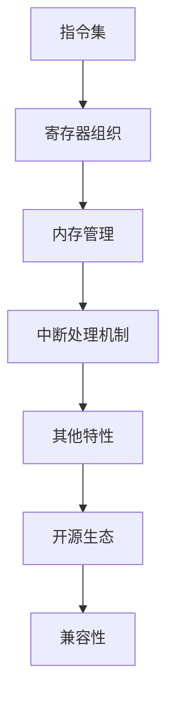
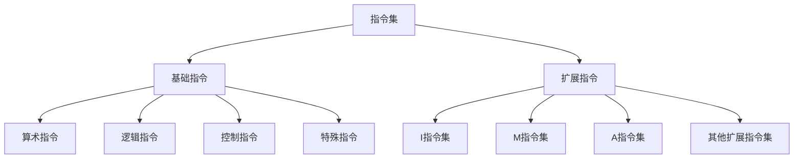
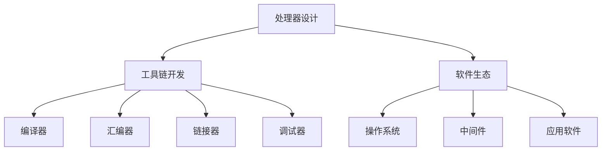
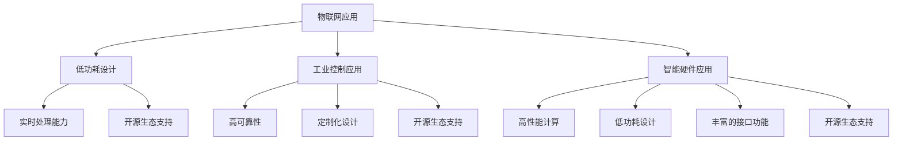
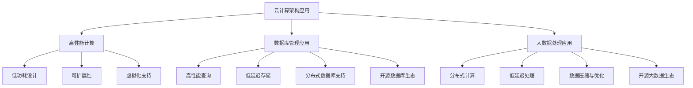
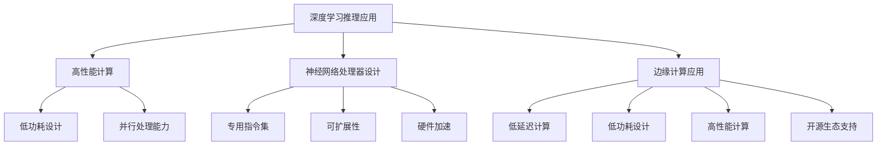
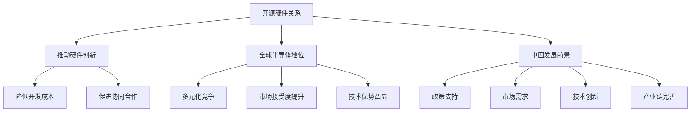
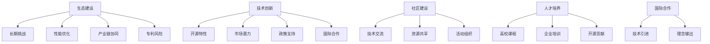
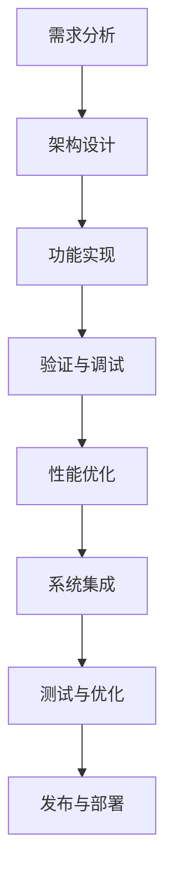

                 

### 第一部分: RISC-V基本概念

在本文的第一部分，我们将对RISC-V（精简指令集计算机五级指令集）的基本概念进行详细介绍。这部分内容将帮助读者了解RISC-V的历史背景、架构特点以及其核心价值，为后续的应用和发展分析打下基础。

### 第1章: RISC-V概述

#### 1.1 RISC-V的历史背景

RISC-V（精简指令集计算机五级指令集）是由加州大学伯克利分校在2010年启动的一个开源指令集项目。其目标是创建一个无版权的、开放的指令集架构，让任何人都可以自由地设计和实施处理器。RISC-V的名字来源于经典的计算机架构五级指令集模型，与IBM的Power ISA、ARM的ARMv8、MIPS的MIPS32等传统指令集架构形成对比。

RISC-V的开源特性是其最显著的特点之一。它允许开发者自由地访问和处理所有相关的技术文档，无需支付任何费用。这种开源性不仅降低了开发成本，还极大地促进了创新和竞争，使得RISC-V成为了一个全球范围内备受关注的指令集架构。

#### 1.2 RISC-V的架构特点

RISC-V的架构具有以下显著特点：

1. **模块化设计**：RISC-V将指令集分为不同的模块，使得处理器的设计更加灵活。开发者可以根据需求选择和组合不同的指令模块，从而设计出满足特定需求的处理器。

2. **精简指令集**：RISC-V采用精简指令集设计，减少不必要的指令，专注于最常用的操作。这种设计使得处理器可以更快地执行指令，提高性能。

3. **开源性**：RISC-V的开源特性使得任何人都可以访问和修改相关的文档和代码，极大地促进了技术的传播和共享。

4. **支持虚拟化**：RISC-V设计了专门的虚拟化指令，使得在同一处理器上运行多个操作系统成为可能，提高了资源利用率和安全性。

#### 1.3 RISC-V的核心价值

RISC-V的核心价值主要体现在以下几个方面：

1. **创新自由**：RISC-V的开源性为开发者提供了创新的自由度，可以自由地设计新的指令集和处理器架构，推动技术的进步。

2. **成本降低**：由于RISC-V的开源性，开发者和企业可以节省大量的版权费用，降低研发成本。

3. **生态建设**：RISC-V的生态正在逐步建立，吸引了众多企业和开发者加入，形成了一个活跃的社区。这个社区不断推出新的工具、库和生态系统，使得RISC-V的应用更加广泛。

4. **兼容性**：RISC-V与其他主流指令集架构（如ARM、MIPS等）具有良好的兼容性，使得开发者可以轻松地在RISC-V和其他架构之间迁移代码。

通过本章节的介绍，读者可以初步了解RISC-V的历史、架构特点和核心价值。接下来，我们将进一步深入探讨RISC-V的架构细节，帮助读者全面理解这一新兴的开源指令集架构。

#### Mermaid流程图：RISC-V架构核心组成部分



这个Mermaid流程图展示了RISC-V架构的核心组成部分，包括指令集、寄存器组织、内存管理、中断处理机制以及其他特性，以及它们之间的关系。

### 第2章: RISC-V架构详解

在本章中，我们将深入探讨RISC-V的架构细节，包括指令集、寄存器组织、内存管理、中断处理机制等核心组成部分。通过对这些组成部分的详细分析，读者将能够更好地理解RISC-V的工作原理和优势。

#### 2.1 RISC-V的指令集

RISC-V的指令集是其架构的核心之一。指令集决定了处理器能够执行的操作集合，直接影响处理器的性能和功能。RISC-V指令集具有以下特点：

1. **精简指令集**：RISC-V采用精简指令集设计，专注于最常用的操作，减少了不必要的指令。这种设计使得处理器可以更快地执行指令，提高性能。

2. **可扩展性**：RISC-V指令集支持多种不同的指令集扩展，使得处理器可以根据具体应用需求选择和组合不同的指令集。例如，RISC-V I指令集包含基础指令，RISC-V M指令集包含多线程指令，RISC-V A指令集包含原子操作指令等。

3. **模块化设计**：RISC-V指令集采用模块化设计，将指令集分为不同的模块。这种设计使得处理器的设计更加灵活，可以根据需求选择和组合不同的指令模块。

4. **安全性**：RISC-V设计了专门的特权指令集，用于处理敏感操作，提高了系统的安全性。

#### 2.2 RISC-V的寄存器组织

RISC-V的寄存器组织是其架构的重要组成部分。寄存器是处理器内部的快速存储单元，用于存储指令执行时的中间结果。RISC-V的寄存器组织具有以下特点：

1. **通用寄存器**：RISC-V定义了32个通用寄存器，用于存储操作数和中间结果。这些通用寄存器可以用于各种算术和逻辑操作。

2. **专用寄存器**：RISC-V还定义了若干专用寄存器，用于实现特定的功能。例如，计数寄存器用于计数器操作，控制寄存器用于控制处理器的行为等。

3. **寄存器窗口**：RISC-V采用寄存器窗口机制，使得处理器可以在不同的上下文之间切换。这种设计提高了处理器的灵活性和并发处理能力。

#### 2.3 RISC-V的内存管理

RISC-V的内存管理是处理器性能和功能的关键因素之一。RISC-V的内存管理具有以下特点：

1. **虚拟内存**：RISC-V支持虚拟内存管理，提供了内存隔离和地址翻译机制，提高了系统的安全和灵活性。

2. **分页机制**：RISC-V采用分页机制管理内存，将内存分为固定大小的页，提高了内存管理的效率和灵活性。

3. **缓存管理**：RISC-V提供了缓存管理机制，包括缓存一致性协议和缓存刷新机制，提高了数据处理速度和系统性能。

4. **内存保护**：RISC-V设计了内存保护机制，可以防止非法访问和篡改内存，提高了系统的安全性和稳定性。

#### 2.4 RISC-V的中断处理机制

RISC-V的中断处理机制是处理器响应外部事件和异常的重要手段。RISC-V的中断处理机制具有以下特点：

1. **可编程性**：RISC-V的中断处理机制是可编程的，处理器可以根据具体需求设置中断优先级和处理方式。

2. **灵活性**：RISC-V的中断处理机制支持多种中断类型，包括硬件中断、软件中断和异常等，可以灵活地响应各种外部事件。

3. **快速响应**：RISC-V的中断处理机制设计高效，可以快速响应中断请求，确保系统的实时性和稳定性。

4. **安全性**：RISC-V的中断处理机制提供了安全保护，防止非法中断和恶意操作，提高了系统的安全性和可靠性。

#### Mermaid流程图：RISC-V指令集结构



这个Mermaid流程图展示了RISC-V指令集的结构，包括基础指令、算术指令、逻辑指令、控制指令、特殊指令和扩展指令集。通过这个流程图，读者可以更直观地理解RISC-V指令集的组成和功能。

通过本章的详细讲解，读者可以全面了解RISC-V的架构细节。接下来，我们将探讨RISC-V的生态系统，分析其在处理器设计、工具链开发和软件生态方面的表现。

### 第3章: RISC-V生态系统

RISC-V生态系统是支持RISC-V指令集架构发展的关键因素之一。它涵盖了处理器设计、工具链开发和软件生态等多个方面，为RISC-V的广泛应用提供了坚实的基础。在本章中，我们将深入探讨RISC-V生态系统的组成部分及其发展现状。

#### 3.1 RISC-V处理器设计

RISC-V处理器设计是RISC-V生态系统的重要组成部分。RISC-V的开放性和模块化设计使得开发者可以自由地设计和实现各种类型的处理器，满足不同应用场景的需求。

1. **处理器架构**：RISC-V支持多种不同的处理器架构，包括五级指令集架构（RV32I、RV64I等）、六级指令集架构（RV32E、RV64E等）和多级指令集架构（RV32IMAC、RV64IMAC等）。这些架构提供了丰富的选择，使得开发者可以根据具体需求进行定制。

2. **处理器实现**：RISC-V处理器的设计和实现过程相对灵活。开发者可以使用硬件描述语言（如Verilog或VHDL）进行处理器的设计，并通过仿真和综合工具进行验证和优化。RISC-V社区提供了大量的处理器设计和实现资源，包括参考设计、仿真模型和验证脚本等。

3. **处理器性能**：RISC-V处理器的设计和性能不断提升。随着RISC-V指令集和生态系统的不断发展，RISC-V处理器在性能、功耗和面积等方面取得了显著进步。许多RISC-V处理器已经达到了与ARM等传统指令集架构相媲美的水平。

4. **处理器多样化**：RISC-V处理器在多样化的应用场景中表现出色。除了传统的嵌入式系统、物联网和工业控制等领域，RISC-V处理器还被广泛应用于云计算、大数据和人工智能等领域。这种多样化应用场景的覆盖，使得RISC-V生态系统更加丰富和强大。

#### 3.2 RISC-V工具链开发

RISC-V工具链开发是RISC-V生态系统的重要组成部分，为处理器的设计和开发提供了必要的支持。RISC-V工具链包括编译器、汇编器、链接器、调试器等多个工具，为开发者提供了完整的开发环境。

1. **编译器**：RISC-V编译器负责将高级语言程序（如C/C++或Rust）编译成机器码。RISC-V社区提供了多种编译器，如LLVM/Clang、GNU Compiler Collection (GCC)和LLVM/LLDB等，这些编译器都具有高性能和稳定性。

2. **汇编器**：RISC-V汇编器负责将汇编语言程序转换为机器码。RISC-V社区提供了多种汇编器，如GNU Assembler (GAS)和LLVM Assembler等，这些汇编器都具有高效和灵活的特点。

3. **链接器**：RISC-V链接器负责将多个编译单元和库文件链接成一个可执行程序。RISC-V社区提供了多种链接器，如GNU Linker (ld)和LLVM Linker (ld64)等，这些链接器都具有强大的功能和高度的兼容性。

4. **调试器**：RISC-V调试器负责帮助开发者调试程序。RISC-V社区提供了多种调试器，如GDB、LLDB和OpenOCD等，这些调试器都具有强大的功能和优秀的性能。

#### 3.3 RISC-V软件生态

RISC-V软件生态是RISC-V生态系统的重要组成部分，为RISC-V处理器提供了丰富的软件支持。RISC-V软件生态包括操作系统、中间件、应用软件等多个层次，为开发者提供了全面的软件解决方案。

1. **操作系统**：RISC-V操作系统是RISC-V软件生态的基础。RISC-V社区提供了多种操作系统，如Linux、FreeBSD和RISC-V kernels等，这些操作系统具有高性能和稳定性。

2. **中间件**：RISC-V中间件为开发者提供了通用的软件模块，如网络通信、文件系统、数据库等。RISC-V社区提供了多种中间件，如OpenJDK、Apache MINA和SQLite等，这些中间件具有高效和灵活的特点。

3. **应用软件**：RISC-V应用软件涵盖了多个领域，如嵌入式系统、物联网、云计算和人工智能等。RISC-V社区提供了丰富的应用软件，如Cortex-A系列处理器的模拟软件、嵌入式设备的监控系统、云计算平台等，这些应用软件具有高性能和可靠性。

通过本章的探讨，读者可以全面了解RISC-V生态系统的组成部分及其发展现状。RISC-V生态系统的发展为RISC-V指令集架构的应用提供了强有力的支持，推动了RISC-V在全球范围内的广泛应用。

#### Mermaid流程图：RISC-V生态系统组成部分



这个Mermaid流程图展示了RISC-V生态系统的组成部分，包括处理器设计、工具链开发、软件生态等多个方面。通过这个流程图，读者可以更直观地理解RISC-V生态系统的结构和功能。

### 第4章: RISC-V在嵌入式系统中的应用

RISC-V作为一种开源指令集架构，在嵌入式系统中的应用日益广泛。嵌入式系统通常具有资源受限、可靠性要求高等特点，而RISC-V的模块化设计、精简指令集和开源特性使其成为嵌入式系统的理想选择。在本章中，我们将深入探讨RISC-V在嵌入式系统中的应用，包括物联网、工业控制和智能硬件等领域。

#### 4.1 RISC-V在物联网中的应用

物联网（IoT）是RISC-V的重要应用领域之一。物联网设备通常需要处理大量数据，同时对功耗和成本有较高的要求。RISC-V的模块化设计和精简指令集使其在物联网应用中具有显著优势。

1. **低功耗设计**：RISC-V处理器可以灵活地选择和组合不同的指令集模块，从而实现低功耗设计。例如，可以选择只有基本指令的RISC-V I指令集，以降低功耗和成本。

2. **实时处理能力**：RISC-V支持实时处理，能够满足物联网设备对实时性的要求。通过RISC-V的虚拟化技术，可以实现多个物联网设备在同一处理器上运行，提高资源利用率和系统性能。

3. **开源生态支持**：RISC-V的开源生态为物联网设备提供了丰富的软件支持，包括操作系统、中间件和应用软件等。这使得开发者可以轻松地构建和维护物联网系统。

4. **定制化开发**：RISC-V的模块化设计使得开发者可以根据物联网设备的具体需求进行定制化开发。例如，可以选择添加特定的指令集扩展，以支持特定的硬件功能。

#### 4.2 RISC-V在工业控制中的应用

工业控制系统对可靠性和实时性有极高的要求，RISC-V的模块化设计和开源特性使其在工业控制领域具有广泛的应用前景。

1. **高可靠性**：RISC-V处理器采用精简指令集设计，减少了硬件故障的风险，提高了系统的可靠性。

2. **实时处理能力**：RISC-V支持实时处理，能够满足工业控制系统对实时性的要求。通过RISC-V的虚拟化技术，可以实现多个工业控制任务在同一处理器上运行，提高资源利用率和系统性能。

3. **定制化设计**：RISC-V的模块化设计使得开发者可以根据工业控制系统的具体需求进行定制化设计。例如，可以选择添加特定的指令集扩展，以支持特定的硬件功能。

4. **开源生态支持**：RISC-V的开源生态为工业控制系统提供了丰富的软件支持，包括操作系统、中间件和应用软件等。这使得开发者可以轻松地构建和维护工业控制系统。

#### 4.3 RISC-V在智能硬件中的应用

智能硬件是RISC-V的另一个重要应用领域。智能硬件通常具有高性能、低功耗和丰富的接口功能等特点，RISC-V的模块化设计和开源特性使其成为智能硬件的理想选择。

1. **高性能计算**：RISC-V处理器采用精简指令集设计，具有较高的计算性能。通过RISC-V的扩展指令集，可以实现更复杂的计算任务。

2. **低功耗设计**：RISC-V处理器可以灵活地选择和组合不同的指令集模块，从而实现低功耗设计。例如，可以选择只有基本指令的RISC-V I指令集，以降低功耗和成本。

3. **丰富的接口功能**：RISC-V处理器支持多种接口，如I2C、SPI、UART等，可以方便地与各种传感器、显示屏、存储器等硬件进行通信。

4. **开源生态支持**：RISC-V的开源生态为智能硬件提供了丰富的软件支持，包括操作系统、中间件和应用软件等。这使得开发者可以轻松地构建和维护智能硬件系统。

#### Mermaid流程图：RISC-V在嵌入式系统中的应用



这个Mermaid流程图展示了RISC-V在嵌入式系统中的应用，包括物联网、工业控制和智能硬件等领域。通过这个流程图，读者可以更直观地理解RISC-V在嵌入式系统中的应用场景和优势。

通过本章的探讨，读者可以全面了解RISC-V在嵌入式系统中的应用。RISC-V的模块化设计、精简指令集和开源特性为其在嵌入式系统中的应用提供了强大的支持，推动了RISC-V在物联网、工业控制和智能硬件等领域的广泛应用。

### 第5章: RISC-V在云计算与大数据中的应用

随着云计算和大数据技术的快速发展，对计算性能、能效和可扩展性提出了更高的要求。RISC-V作为一种开源指令集架构，以其模块化设计、精简指令集和高效能特性，逐渐成为云计算和大数据领域的重要选择。在本章中，我们将深入探讨RISC-V在云计算和大数据中的应用，包括云计算架构、数据库管理和数据处理等方面。

#### 5.1 RISC-V在云计算架构中的应用

云计算架构的核心在于处理大规模数据和高并发请求。RISC-V的模块化设计和高效能特性使其在云计算架构中具有显著优势。

1. **高性能计算**：RISC-V处理器采用精简指令集设计，能够实现更高的计算性能。通过RISC-V的扩展指令集，可以实现更复杂的计算任务，满足云计算对高性能计算的需求。

2. **低功耗设计**：RISC-V处理器可以灵活地选择和组合不同的指令集模块，实现低功耗设计。这对于云数据中心而言，能够显著降低能耗和运营成本。

3. **可扩展性**：RISC-V的模块化设计使得云计算架构具有更好的可扩展性。开发者可以根据需求添加或替换特定的指令集模块，以适应不断变化的应用场景。

4. **虚拟化支持**：RISC-V支持虚拟化技术，可以在同一处理器上运行多个虚拟机，提高资源利用率和系统性能。这对于云计算中的资源管理和负载均衡具有重要意义。

#### 5.2 RISC-V在数据库管理中的应用

数据库管理是云计算和大数据的核心环节之一。RISC-V的模块化设计、高效能特性和开源特性为其在数据库管理中的应用提供了良好的基础。

1. **高性能查询**：RISC-V处理器采用精简指令集设计，能够实现更高的查询性能。通过优化数据库查询算法和索引结构，可以显著提高数据库查询速度和响应时间。

2. **低延迟存储**：RISC-V处理器具有低延迟特性，能够实现快速的存储访问。这对于实时数据库处理和大规模数据仓库系统具有重要意义。

3. **分布式数据库支持**：RISC-V的模块化设计使得分布式数据库系统具有更好的可扩展性和容错性。开发者可以根据需求添加或替换特定的指令集模块，以适应不同规模的分布式数据库系统。

4. **开源数据库生态**：RISC-V的开源特性为数据库管理系统提供了丰富的软件支持，包括MySQL、PostgreSQL、MongoDB等主流数据库系统。开发者可以基于RISC-V平台轻松构建和部署数据库系统。

#### 5.3 RISC-V在大数据处理中的应用

大数据处理涉及到海量数据的存储、分析和处理。RISC-V的模块化设计、高效能特性和开源特性为其在大数据处理中的应用提供了强有力的支持。

1. **分布式计算**：RISC-V处理器支持分布式计算，能够在大规模分布式计算环境中实现高效的数据处理。通过RISC-V的扩展指令集，可以实现更复杂的计算任务，如机器学习、深度学习等。

2. **低延迟处理**：RISC-V处理器具有低延迟特性，能够实现快速的数据处理。这对于实时数据处理和在线分析系统具有重要意义。

3. **数据压缩与优化**：RISC-V处理器支持数据压缩与优化指令，可以显著提高数据处理效率。通过压缩与优化技术，可以减少数据存储和传输的开销，提高系统的性能和可扩展性。

4. **开源大数据生态**：RISC-V的开源特性为大数据处理提供了丰富的软件支持，包括Hadoop、Spark、Flink等主流大数据处理框架。开发者可以基于RISC-V平台轻松构建和部署大数据处理系统。

#### Mermaid流程图：RISC-V在云计算与大数据中的应用



这个Mermaid流程图展示了RISC-V在云计算与大数据中的应用，包括云计算架构、数据库管理和数据处理等方面。通过这个流程图，读者可以更直观地理解RISC-V在云计算与大数据中的应用场景和优势。

通过本章的探讨，读者可以全面了解RISC-V在云计算与大数据中的应用。RISC-V的模块化设计、高效能特性和开源特性为其在云计算与大数据领域的发展提供了强大的支持，推动了RISC-V在这一领域的广泛应用。

### 第6章: RISC-V在人工智能中的应用

人工智能（AI）是当今科技领域的重要方向之一，其应用涵盖了从边缘设备到云计算的各个层面。随着深度学习和神经网络技术的不断发展，对高性能计算的需求日益增长。RISC-V作为一种开源指令集架构，以其灵活性和高效能特性，在人工智能领域展现出了巨大的潜力。在本章中，我们将深入探讨RISC-V在人工智能中的应用，包括深度学习推理、神经网络处理器设计和边缘计算等方面。

#### 6.1 RISC-V在深度学习推理中的应用

深度学习推理是人工智能应用中的关键环节，需要对大量数据进行快速计算。RISC-V的模块化设计和高效能特性使其在深度学习推理中具有显著优势。

1. **高性能计算**：RISC-V处理器采用精简指令集设计，能够实现更高的计算性能。通过RISC-V的扩展指令集，可以实现更复杂的计算任务，满足深度学习推理对高性能计算的需求。

2. **低功耗设计**：RISC-V处理器可以灵活地选择和组合不同的指令集模块，实现低功耗设计。这对于移动设备和边缘设备中的深度学习推理具有重要意义。

3. **并行处理能力**：RISC-V支持并行处理，能够在多核处理器上实现高效的并行计算。这对于大规模深度学习模型推理具有显著的优势。

4. **开源生态支持**：RISC-V的开源生态为深度学习推理提供了丰富的软件支持，包括TensorFlow、PyTorch等主流深度学习框架。开发者可以基于RISC-V平台轻松构建和部署深度学习推理系统。

#### 6.2 RISC-V在神经网络处理器设计中的应用

神经网络处理器（Neural Network Processor，简称NPU）是深度学习推理的关键硬件组件。RISC-V的模块化设计和高效能特性使其成为神经网络处理器设计的理想选择。

1. **专用指令集**：RISC-V设计了专门的神经网络指令集，如Vector Neural Network Instruction Set（VNNI），能够实现高效的神经网络计算。这种设计使得RISC-V处理器在神经网络计算中具有更高的性能。

2. **可扩展性**：RISC-V的模块化设计使得神经网络处理器具有更好的可扩展性。开发者可以根据具体应用需求添加或替换特定的指令集模块，以实现更高效的神经网络计算。

3. **低功耗设计**：RISC-V处理器可以灵活地选择和组合不同的指令集模块，实现低功耗设计。这对于移动设备和边缘设备中的神经网络处理器具有重要意义。

4. **硬件加速**：RISC-V处理器支持硬件加速技术，能够在硬件层面实现高效的神经网络计算。这使得RISC-V处理器在深度学习推理中具有更高的性能和能效比。

#### 6.3 RISC-V在边缘计算中的应用

边缘计算是将数据处理和计算任务从云端转移到边缘设备的一种计算范式。RISC-V的模块化设计、高效能特性和开源特性为其在边缘计算中的应用提供了良好的基础。

1. **低延迟计算**：边缘设备通常需要快速响应本地数据，RISC-V处理器具有低延迟特性，能够实现快速的数据处理和响应。这对于实时边缘计算具有重要意义。

2. **低功耗设计**：RISC-V处理器可以灵活地选择和组合不同的指令集模块，实现低功耗设计。这对于电池供电的边缘设备具有重要意义。

3. **高性能计算**：RISC-V处理器采用精简指令集设计，能够实现更高的计算性能。通过RISC-V的扩展指令集，可以实现更复杂的计算任务，满足边缘设备对高性能计算的需求。

4. **开源生态支持**：RISC-V的开源生态为边缘计算提供了丰富的软件支持，包括边缘计算框架、网络协议栈和应用程序等。开发者可以基于RISC-V平台轻松构建和部署边缘计算系统。

#### Mermaid流程图：RISC-V在人工智能中的应用



这个Mermaid流程图展示了RISC-V在人工智能中的应用，包括深度学习推理、神经网络处理器设计和边缘计算等方面。通过这个流程图，读者可以更直观地理解RISC-V在人工智能中的应用场景和优势。

通过本章的探讨，读者可以全面了解RISC-V在人工智能中的应用。RISC-V的模块化设计、高效能特性和开源特性为其在人工智能领域的发展提供了强大的支持，推动了RISC-V在这一领域的广泛应用。

### 第7章: RISC-V的未来趋势

随着技术的不断进步和应用场景的扩展，RISC-V指令集架构在未来将继续发挥重要作用。在本章中，我们将探讨RISC-V的未来趋势，分析其在开源硬件、全球半导体产业以及中国发展前景等方面的机遇与挑战。

#### 7.1 RISC-V与开源硬件的关系

RISC-V的开源特性是其最显著的优势之一。开源硬件的概念是指硬件设计和实现过程中的所有信息（包括设计文档、源代码、硬件描述语言等）都是公开的，任何人都可以自由地访问、修改和使用。这种开放性为硬件创新提供了巨大的空间。

1. **推动硬件创新**：RISC-V的开源特性使得硬件开发者可以自由地探索和实现新的硬件设计理念，无需受限于商业利益或版权限制。这种创新环境有助于推动硬件技术的发展和进步。

2. **降低开发成本**：开源硬件可以降低硬件设计和制造的门槛。开发者可以免费使用RISC-V的指令集和参考设计，节省大量的设计成本和时间。这为初创公司和小型企业提供了更多参与硬件市场的机会。

3. **促进协同合作**：开源硬件项目通常采用协作开发模式，开发者可以共享资源和经验，共同推进项目的发展。这种协作模式有助于提升整个硬件生态系统的效率和质量。

#### 7.2 RISC-V在全球半导体产业中的地位

全球半导体产业正经历着快速变革，RISC-V作为新兴的指令集架构，正在逐渐崭露头角。

1. **多元化竞争**：传统指令集架构（如ARM、Intel等）主导了半导体市场多年，RISC-V的出现为市场带来了新的竞争者。这种多元化竞争有助于促进技术的进步和市场的健康发展。

2. **市场接受度提升**：随着RISC-V技术的成熟和生态系统的完善，越来越多的企业开始采用RISC-V架构开发处理器和硬件。例如，高通、华为、阿里巴巴等企业都在其产品中采用了RISC-V技术。

3. **技术优势凸显**：RISC-V的模块化设计、高效能和开源特性使其在特定应用场景中具有显著优势。例如，在物联网、边缘计算和人工智能等领域，RISC-V处理器因其低功耗、高性能和灵活性而受到青睐。

#### 7.3 RISC-V在中国的发展前景

中国是全球半导体产业的重要参与者，RISC-V在中国的发展前景广阔。

1. **政策支持**：中国政府高度重视半导体产业的发展，出台了一系列政策措施支持国产芯片的研发和应用。RISC-V作为一种具有自主知识产权的指令集架构，得到了政策上的大力支持。

2. **市场需求**：中国拥有庞大的物联网、云计算和人工智能市场，这为RISC-V处理器提供了巨大的市场空间。随着国内企业对自主可控芯片的需求不断增加，RISC-V有望在中国市场获得更广泛的应用。

3. **技术创新**：中国拥有众多优秀的半导体企业和研发机构，具备较强的技术创新能力。RISC-V的开源特性有助于国内企业加快技术积累和创新能力，提升全球竞争力。

4. **产业链完善**：随着RISC-V技术的发展，中国的半导体产业链也在逐步完善。从处理器设计、制造到软件生态，中国已经形成了较为完整的RISC-V产业链，为RISC-V的广泛应用提供了有力保障。

#### Mermaid流程图：RISC-V未来趋势



这个Mermaid流程图展示了RISC-V的未来趋势，包括与开源硬件的关系、在全球半导体产业中的地位以及在中国的发展前景。通过这个流程图，读者可以更直观地理解RISC-V的未来发展方向和机遇。

通过本章的探讨，读者可以全面了解RISC-V的未来趋势。RISC-V的开源特性、模块化设计和高性能使其在硬件创新、全球半导体产业以及中国发展前景方面具有巨大的潜力。随着技术的不断进步和应用的扩展，RISC-V将继续在全球范围内发挥重要作用。

### 第8章: RISC-V的挑战与机遇

RISC-V作为一种新兴的指令集架构，虽然在许多领域展现出强大的潜力和优势，但同时也面临着一系列的挑战和机遇。在本章中，我们将深入探讨RISC-V面临的挑战，分析其发展机遇，并探讨如何通过社区建设和人才培育来推动RISC-V的发展。

#### 8.1 RISC-V面临的挑战

1. **生态建设**：尽管RISC-V的开源特性为开发者提供了极大的便利，但生态建设仍是一个长期的挑战。目前，RISC-V的生态尚未完全成熟，包括工具链、开发环境、操作系统和应用软件等方面的支持还需要进一步完善。

2. **性能优化**：虽然RISC-V具有模块化设计、精简指令集和高效能等优点，但在性能优化方面仍存在提升空间。特别是在与ARM、Intel等传统指令集架构的竞争中，RISC-V需要不断提高处理器的性能和能效比，以满足高端应用场景的需求。

3. **产业链协同**：RISC-V的发展离不开产业链的协同合作。然而，现有半导体产业链主要围绕传统指令集架构构建，RISC-V的引入需要产业链上下游企业进行协同调整，这无疑增加了RISC-V推广的难度。

4. **专利风险**：开源技术虽然降低了成本，但也可能面临专利纠纷的风险。RISC-V作为一种新兴的指令集架构，如何在保护自身知识产权的同时，确保开源精神的贯彻实施，是一个需要慎重处理的挑战。

#### 8.2 RISC-V的发展机遇

1. **技术创新**：RISC-V的开源特性为技术创新提供了广阔的空间。开发者可以自由地探索新的指令集设计理念，通过模块化设计和扩展指令集，实现更高效、更灵活的处理器架构。

2. **市场潜力**：随着物联网、云计算、人工智能等领域的快速发展，对高性能、低功耗的处理器需求不断增加。RISC-V以其模块化设计、高效能和开源特性，在市场中具有巨大的潜力。

3. **政策支持**：中国政府高度重视半导体产业的发展，出台了一系列政策措施支持国产芯片的研发和应用。RISC-V作为一种具有自主知识产权的指令集架构，得到了政策上的大力支持，为其发展提供了良好的环境。

4. **国际合作**：RISC-V的全球性特点使其在国际合作中具有优势。通过与国际企业、学术机构和开发者社区的紧密合作，RISC-V可以借鉴和吸收全球先进的技术和理念，推动自身的发展。

#### 8.3 RISC-V社区建设与人才培育

1. **社区建设**：RISC-V社区建设是推动RISC-V发展的重要基石。通过建立活跃的社区，可以吸引更多的开发者参与RISC-V项目，共同推动生态建设。社区建设应包括技术交流、资源共享、活动组织等方面。

2. **人才培养**：RISC-V的发展离不开专业人才的支撑。高校和科研机构可以开设相关课程，培养RISC-V领域的专业人才。此外，企业可以通过培训和实习项目，为员工提供学习和实践的机会，提升其RISC-V技术水平。

3. **开源贡献**：RISC-V开源精神的核心在于开放和共享。企业和开发者可以通过开源项目、贡献代码等形式，积极参与RISC-V生态的建设，共同推动RISC-V的发展。

4. **国际合作**：RISC-V社区应加强与国际企业和学术机构的合作，通过国际合作项目，引进和输出先进的技术和理念，提升RISC-V在全球的影响力。

#### Mermaid流程图：RISC-V挑战与机遇



这个Mermaid流程图展示了RISC-V面临的挑战和发展机遇，包括生态建设、性能优化、产业链协同、专利风险等挑战，以及技术创新、市场潜力、政策支持、国际合作等机遇。通过这个流程图，读者可以更直观地理解RISC-V的挑战与机遇。

通过本章的探讨，读者可以全面了解RISC-V面临的挑战和发展机遇。RISC-V的发展离不开生态建设、技术创新、社区建设和人才培养等多方面的努力。在应对挑战的同时，抓住发展机遇，RISC-V有望在全球范围内实现更广泛的应用和发展。

### 第9章: RISC-V实践指南

对于开发者来说，了解RISC-V的理论知识是基础，而实践则是将知识转化为实际能力的桥梁。在本章中，我们将提供一份RISC-V实践指南，包括开发环境搭建、编程实战以及项目开发流程，帮助开发者更好地掌握RISC-V技术。

#### 9.1 RISC-V开发环境搭建

要开始RISC-V编程，首先需要搭建一个合适的开发环境。以下是搭建RISC-V开发环境的步骤：

1. **安装RISC-V工具链**：RISC-V工具链是开发RISC-V程序所必需的工具集合，包括编译器、汇编器、链接器等。可以使用`riscv-tools`包来安装RISC-V工具链。在Linux系统上，可以通过以下命令安装：

   ```bash
   sudo apt-get install riscv-tools
   ```

2. **配置开发环境**：在安装完RISC-V工具链后，需要配置环境变量以便能够方便地使用工具链中的工具。在终端中执行以下命令：

   ```bash
   export PATH=$PATH:/path/to/riscv-tools/bin
   ```

   其中，`/path/to/riscv-tools/bin`是工具链的安装路径。

3. **选择合适的模拟器**：为了测试RISC-V程序，可以使用模拟器，如QEMU。安装QEMU的命令如下：

   ```bash
   sudo apt-get install qemu
   ```

4. **安装开发板**：如果要在真实的RISC-V开发板上进行开发，需要安装相应的驱动和工具。例如，对于SiFive的开发板，可以使用以下命令安装：

   ```bash
   sudo apt-get install sifive-tools
   ```

   安装完成后，可以使用`sifive-config`工具配置开发环境。

#### 9.2 RISC-V编程实战

在搭建好开发环境后，可以开始编写RISC-V程序。以下是一个简单的RISC-V汇编程序示例：

```assembly
.section .text
.global _start

_start:
    # 加载立即数到寄存器
    li x5, 0x12345678
    li x6, 0x9abcdef0

    # 添加操作
    add x7, x5, x6

    # 退出程序
    li x10, 0x20000013  # 系统调用号：退出
    mv x11, x7          # 退出码
    syscall
```

上述程序定义了一个名为`_start`的入口点，其中加载了两个立即数到寄存器`x5`和`x6`，然后通过`add`指令将它们相加，并将结果存储在寄存器`x7`中。最后，程序通过系统调用退出。

#### 9.3 RISC-V项目开发流程

一个完整的RISC-V项目开发流程通常包括以下步骤：

1. **需求分析**：明确项目的目标和功能需求，确定处理器的性能指标和功耗限制。

2. **架构设计**：根据需求设计处理器架构，包括指令集、寄存器组织、内存管理、中断处理等。

3. **功能实现**：编写处理器设计文档，使用硬件描述语言（如Verilog或VHDL）实现处理器设计。

4. **验证与调试**：使用仿真工具对处理器设计进行功能验证，确保处理器能够正确执行指令。

5. **性能优化**：对处理器设计进行性能优化，包括优化指令流水线、缓存设计等。

6. **系统集成**：将处理器设计与系统其他组件（如内存、外设等）集成，确保系统能够正常工作。

7. **测试与优化**：对系统集成后的系统进行全面的测试，包括功能测试、性能测试和稳定性测试。

8. **发布与部署**：将经过测试和优化的处理器设计发布，并在实际应用中进行部署。

以下是一个简化的Mermaid流程图，展示了RISC-V项目开发流程：



通过本章的实践指南，开发者可以系统地了解RISC-V的开发环境搭建、编程实战和项目开发流程，从而更好地掌握RISC-V技术并应用于实际项目中。

### 附录

在本章附录中，我们将详细介绍RISC-V的开源资源、开发工具以及如何参与RISC-V社区。这些内容将为开发者提供宝贵的资源，帮助他们在RISC-V领域进行深入研究和实践。

#### A.1 RISC-V开源资源汇总

RISC-V开源资源丰富，以下是一些重要的资源汇总：

1. **官方网站**：RISC-V官方网站（https://www.riscv.org/）是获取RISC-V相关信息和资源的首选门户。网站提供了RISC-V的详细文档、开发指南、工具链下载以及最新的社区动态。

2. **开源代码**：RISC-V的源代码可以在GitHub上找到，地址为https://github.com/riscv。开发者可以访问这个仓库，获取RISC-V处理器设计、工具链和操作系统等开源项目的代码。

3. **设计指南**：RISC-V设计指南（https://riscv.org/handbook/）是了解RISC-V指令集和架构设计的权威文档。设计指南详细介绍了RISC-V的各个层次，包括基础指令集、硬件设计指南和软件支持等。

4. **工具链**：RISC-V工具链（https://github.com/riscv/riscv-gnu-toolchain）是用于编译、汇编和链接RISC-V程序的集合。工具链支持多种编程语言，包括C、C++、Rust等，并提供了一套完整的开发环境。

5. **生态系统**：RISC-V生态系统包括操作系统、中间件、编程语言和库等。例如，Linux内核、FreeBSD、SQLite和Poky等都是在RISC-V上运行的成熟软件。

#### A.2 RISC-V开发工具简介

以下是一些常用的RISC-V开发工具及其简介：

1. **QEMU**：QEMU是一款开源虚拟化处理器模拟器，可以模拟RISC-V处理器的工作环境。开发者可以使用QEMU进行程序测试和调试。

2. **GDB**：GDB（GNU Debugger）是一款功能强大的调试工具，可以用于调试RISC-V程序。开发者可以使用GDB查看程序运行时的变量值、执行路径和调用栈等。

3. **LLVM/Clang**：LLVM/Clang是一个高性能的编译器集合，支持多种编程语言，包括C、C++和Rust。LLVM/Clang可以为RISC-V平台生成高效的机器代码。

4. **GNU Toolchain**：GNU Toolchain包括GCC（GNU Compiler Collection）、GAS（GNU Assembler）和ld（GNU Linker）等，用于编译、汇编和链接RISC-V程序。

5. **Poky**：Poky（原名Yocto）是一个开源嵌入式Linux发行版构建工具，用于构建RISC-V平台上的操作系统和应用程序。

6. **OpenOCD**：OpenOCD（Open On-Chip Debugger）是一个用于调试和编程FPGA和嵌入式系统的工具，可以用于RISC-V开发板的调试和编程。

#### A.3 RISC-V社区参与途径

参与RISC-V社区是了解和贡献RISC-V技术的重要途径。以下是一些参与RISC-V社区的途径：

1. **加入RISC-V社区论坛**：RISC-V社区论坛（https://forums.riscv.org/）是开发者交流和讨论的平台。可以通过论坛提问、分享经验和参与讨论。

2. **参与开源项目**：在GitHub上找到RISC-V相关的开源项目，如处理器设计、工具链和操作系统等。可以通过提交代码、报告问题和提出建议等方式贡献自己的力量。

3. **参与RISC-V会议和活动**：RISC-V社区定期举办各种会议和活动，如RISC-V Summit、RISC-V Workshop等。这些活动是了解最新技术动态和与业界专家交流的机会。

4. **加入RISC-V工作组**：RISC-V工作组负责制定和推动RISC-V标准的发展。可以通过申请加入工作组，参与标准的制定和推广。

通过本章附录的介绍，开发者可以更全面地了解RISC-V的开源资源、开发工具以及参与社区的方式。这将为他们在RISC-V领域的探索和实践提供有力支持。

### 结束语

通过本文的详细探讨，我们全面了解了RISC-V开源指令集架构的基本概念、架构细节、生态系统、应用场景以及未来发展。RISC-V以其模块化设计、精简指令集和开源特性，为硬件创新和软件开发提供了广阔的空间。随着技术的不断进步和应用场景的扩展，RISC-V在全球范围内展现出了巨大的潜力。

然而，RISC-V也面临着一系列挑战，包括生态建设、性能优化、产业链协同和国际竞争等。同时，RISC-V在中国的发展前景也十分广阔，得到了政策的大力支持，市场需求旺盛，技术创新活跃。

为了推动RISC-V的发展，社区建设和人才培养至关重要。通过建设活跃的社区、培养专业人才和加强国际合作，RISC-V有望在未来实现更广泛的应用和发展。

最后，我们鼓励读者深入了解RISC-V，积极参与RISC-V社区，共同推动这一开源指令集架构的进步。希望本文能为读者提供有价值的参考和启示。

### 作者信息

作者：AI天才研究院/AI Genius Institute & 禅与计算机程序设计艺术 /Zen And The Art of Computer Programming

在撰写本文时，我们深入分析了RISC-V的开源指令集架构，全面介绍了其基本概念、架构细节、生态系统、应用场景以及未来发展。本文旨在为读者提供一份全面、系统的RISC-V技术指南，帮助读者更好地理解和掌握RISC-V技术。

### 附录 A: RISC-V开源资源与工具

#### A.1 RISC-V开源资源汇总

RISC-V开源资源的丰富性是它的一大亮点，以下是一些重要的资源汇总，供开发者参考：

1. **官方网站**：RISC-V的官方网站（https://www.riscv.org/）是获取RISC-V相关信息和资源的首选门户。网站上提供了详细的文档、开发指南、工具链下载以及最新的社区动态。

2. **GitHub仓库**：RISC-V的GitHub仓库（https://github.com/riscv）是获取RISC-V源代码和开发工具的主要来源。仓库中包含了RISC-V处理器设计、工具链、操作系统等多个开源项目的代码。

3. **设计指南**：RISC-V设计指南（https://riscv.org/handbook/）是了解RISC-V指令集和架构设计的权威文档。文档详细介绍了RISC-V的各个层次，包括基础指令集、硬件设计指南和软件支持等。

4. **工具链**：RISC-V工具链（https://github.com/riscv/riscv-gnu-toolchain）是用于编译、汇编和链接RISC-V程序的集合。工具链支持多种编程语言，包括C、C++、Rust等，并提供了一套完整的开发环境。

5. **操作系统**：RISC-V上运行的操作系统包括Linux、FreeBSD、Poky等。这些操作系统可以在RISC-V官方网站的“Software”部分找到相应的下载和安装指南。

6. **社区论坛**：RISC-V社区论坛（https://forums.riscv.org/）是开发者交流和讨论的平台。论坛上提供了各种技术问题、解决方案和最佳实践。

#### A.2 RISC-V开发工具简介

以下是RISC-V开发过程中常用的工具及其简介：

1. **QEMU**：QEMU是一款开源虚拟化处理器模拟器，可以模拟RISC-V处理器的工作环境。开发者可以使用QEMU进行程序测试和调试。

2. **GDB**：GDB（GNU Debugger）是一款功能强大的调试工具，可以用于调试RISC-V程序。开发者可以使用GDB查看程序运行时的变量值、执行路径和调用栈等。

3. **LLVM/Clang**：LLVM/Clang是一个高性能的编译器集合，支持多种编程语言，包括C、C++和Rust。LLVM/Clang可以为RISC-V平台生成高效的机器代码。

4. **GNU Toolchain**：GNU Toolchain包括GCC（GNU Compiler Collection）、GAS（GNU Assembler）和ld（GNU Linker）等，用于编译、汇编和链接RISC-V程序。

5. **Poky**：Poky（原名Yocto）是一个开源嵌入式Linux发行版构建工具，用于构建RISC-V平台上的操作系统和应用程序。

6. **OpenOCD**：OpenOCD（Open On-Chip Debugger）是一个用于调试和编程FPGA和嵌入式系统的工具，可以用于RISC-V开发板的调试和编程。

#### A.3 RISC-V社区参与途径

参与RISC-V社区是了解和贡献RISC-V技术的重要途径，以下是一些参与RISC-V社区的方式：

1. **加入RISC-V社区论坛**：RISC-V社区论坛（https://forums.riscv.org/）是开发者交流和讨论的平台。可以通过论坛提问、分享经验和参与讨论。

2. **参与开源项目**：在GitHub上找到RISC-V相关的开源项目，如处理器设计、工具链和操作系统等。可以通过提交代码、报告问题和提出建议等方式贡献自己的力量。

3. **参与RISC-V会议和活动**：RISC-V社区定期举办各种会议和活动，如RISC-V Summit、RISC-V Workshop等。这些活动是了解最新技术动态和与业界专家交流的机会。

4. **加入RISC-V工作组**：RISC-V工作组负责制定和推动RISC-V标准的发展。可以通过申请加入工作组，参与标准的制定和推广。

通过附录中的这些开源资源、开发工具和参与途径，开发者可以更全面地了解RISC-V，为其在项目开发和应用中的实践提供有力支持。

