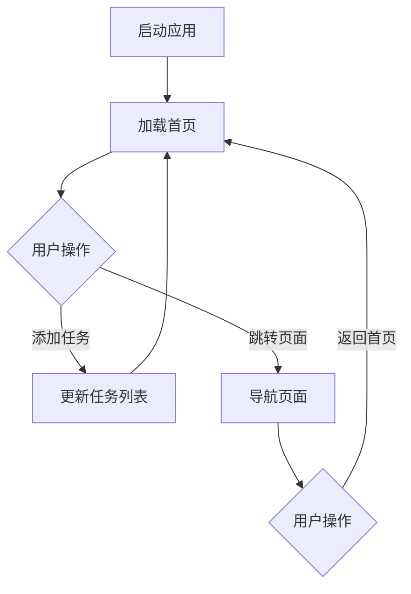
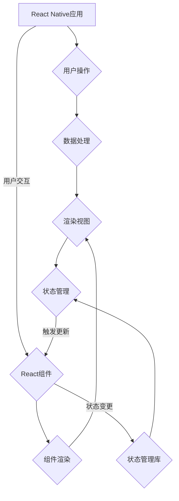

                 

### 文章标题

"React Native 跨平台开发：高效的移动应用"

#### 关键词：React Native，跨平台开发，移动应用，性能优化，组件架构，状态管理，动画与特效

#### 摘要：
本文旨在深入探讨React Native作为跨平台开发工具的优势和挑战，从基础概念到实际项目开发，为读者提供一套完整的技术指南。我们将分析React Native的核心概念、组件架构、样式与布局、导航与状态管理、动画与特效、性能优化以及项目实战经验，帮助读者掌握高效构建移动应用的核心技能。

### 第一部分：React Native概述

React Native是一种开源的移动应用开发框架，允许开发者使用JavaScript和React编写一次代码，即可在iOS和Android平台上编译运行。这种跨平台开发模式大大提高了开发效率，减少了重复工作。本部分将介绍React Native的基本概念、与原生开发的对比、架构以及生态系统。

#### 第1章: React Native基础概念

React Native（简称RN）是由Facebook推出的一种用于开发移动应用的框架，其核心理念是组件化开发。React Native利用JavaScript结合React的虚拟DOM机制，使得开发者可以在移动平台上实现接近原生性能的应用。

**React Native的定义与优势**

React Native的核心优势在于其跨平台能力。通过使用JavaScript和React，开发者可以同时支持iOS和Android平台，避免了重复编写代码的繁琐过程，大大提高了开发效率。此外，React Native还支持热更新，开发者可以无需发布新版本即可在线更新应用，从而快速迭代产品。

**跨平台开发的重要性**

随着移动设备的普及，跨平台开发成为企业降低成本、提高效率的重要手段。React Native的出现，使得开发者能够利用熟悉的Web开发技术进行移动应用开发，降低了学习成本。同时，跨平台开发还能够确保应用在不同平台上的一致性，提升用户体验。

#### 第2章: React Native与原生开发对比

原生开发是指直接使用原生语言（如Swift或Kotlin）为特定平台编写应用代码。原生开发的优点在于性能优异，能够充分利用平台特性，但同时也存在开发效率低、维护成本高等问题。

**原生开发的优缺点**

原生开发的优点包括：

1. **高性能**：原生应用可以直接调用操作系统提供的API，性能接近原生应用。
2. **原生体验**：原生应用能够提供最佳的用户体验，符合平台的设计规范。
3. **丰富的API支持**：原生开发可以充分利用平台提供的各种API，如相机、地理位置等。

原生开发的缺点包括：

1. **开发成本高**：需要同时维护iOS和Android两个版本，开发成本高。
2. **开发周期长**：原生开发通常需要更长的开发周期。
3. **学习曲线陡峭**：开发者需要学习多种编程语言和平台工具。

**React Native的优势与劣势**

React Native的优势：

1. **跨平台**：一次编写，到处运行，减少了重复工作。
2. **开发效率高**：使用JavaScript和React，降低了学习成本。
3. **热更新**：可以在线更新应用，快速迭代产品。

React Native的劣势：

1. **性能瓶颈**：虽然React Native的性能接近原生，但在某些场景下仍有性能瓶颈。
2. **平台差异性**：React Native在某些平台特性上可能不如原生支持得好。
3. **第三方库依赖**：React Native依赖于大量的第三方库和组件，稳定性有待提高。

#### 第3章: React Native架构

React Native采用了一种独特的组件架构，使得开发者能够以模块化的方式构建应用。React Native的核心架构包括以下几个部分：

**React Native的组件架构**

1. **组件**：React Native中的组件（Components）是构成应用的基本单元。每个组件负责渲染一部分UI，并可以接收并处理状态。
2. **虚拟DOM**：React Native通过虚拟DOM机制，将JavaScript中的组件映射到原生组件，实现高效的UI更新。
3. **原生模块**：React Native依赖于原生模块（Native Modules）与原生代码进行交互，实现原生API的调用。

**纯JavaScript与原生模块的协同**

React Native中的纯JavaScript代码主要负责UI的渲染和交互逻辑，而原生模块则负责与原生平台进行交互。这种协同机制使得React Native能够充分利用JavaScript的灵活性与原生平台的性能优势。

#### 第4章: React Native生态系统

React Native的生态系统非常丰富，包括环境搭建、第三方库、开发工具等多个方面。

**环境搭建与配置**

搭建React Native开发环境通常包括以下步骤：

1. 安装Node.js和npm。
2. 安装React Native CLI。
3. 初始化项目。
4. 配置Android和iOS开发环境。

**第三方库与组件的使用**

React Native拥有丰富的第三方库和组件，如：

1. **React Navigation**：用于应用内页面的导航。
2. **Redux**：用于应用的状态管理。
3. **React Native Animations**：用于实现复杂的动画效果。
4. **Firebase**：用于应用的后端支持。

这些库和组件大大丰富了React Native的功能，使得开发者能够更高效地构建应用。

### 第二部分：React Native基本组件

React Native的基本组件是构建应用的基础，包括View、Text、Image和Touchable等组件。这些组件提供了丰富的功能，使得开发者能够轻松构建美观且高效的移动应用。

#### 第5章: React Native基本组件

React Native的基本组件是构建应用的基础，包括View、Text、Image和Touchable等组件。这些组件提供了丰富的功能，使得开发者能够轻松构建美观且高效的移动应用。

**View组件**

View组件是React Native中的容器组件，用于组织和布局其他组件。View组件具有丰富的属性，如样式、布局和对齐方式等。

1. **基本用法与属性**

   ```jsx
   <View style={{ flex: 1, justifyContent: 'center', alignItems: 'center' }}>
     <Text>这是一个View组件</Text>
   </View>
   ```

2. **布局与样式设置**

   View组件支持Flexbox布局，开发者可以通过`flex`、`justifyContent`和`alignItems`等属性来设置布局和样式。

**Text组件**

Text组件用于显示文本，支持多种样式属性，如字体、颜色、大小和对齐方式。

1. **基本用法与样式**

   ```jsx
   <Text style={{ fontSize: 24, color: 'blue', textAlign: 'center' }}>
     这是一个Text组件
   </Text>
   ```

2. **文本对齐与字体设置**

   Text组件支持文本对齐和字体设置，可以通过`textAlign`和`fontWeight`等属性来实现。

**Image组件**

Image组件用于显示图片，支持多种图片格式，如JPEG、PNG和GIF等。

1. **基本用法与属性**

   ```jsx
   <Image
     source={{ uri: 'https://example.com/image.jpg' }}
     style={{ width: 200, height: 200 }}
   />
   ```

2. **动态图片加载与缓存**

   Image组件支持动态图片加载，可以通过`resizeMode`属性设置图片的缩放模式，并通过`CachedImage`组件实现图片缓存。

**Touchable组件**

Touchable组件用于处理用户触摸事件，如点击、长按等。

1. **TouchableOpacity与TouchableHighlight**

   ```jsx
   <TouchableOpacity onPress={() => console.log('TouchableOpacity点击')}>
     <Text>这是一个TouchableOpacity组件</Text>
   </TouchableOpacity>

   <TouchableHighlight onPress={() => console.log('TouchableHighlight点击')}>
     <Text>这是一个TouchableHighlight组件</Text>
   </TouchableHighlight>
   ```

2. **手势处理与事件传递**

   Touchable组件支持手势处理和事件传递，开发者可以通过`onPress`、`onLongPress`等事件处理函数来处理用户操作。

### 第三部分：React Native样式与布局

React Native的样式与布局是构建美观且响应式移动应用的关键。通过使用Flexbox布局、绝对定位与相对定位以及响应式布局，开发者可以轻松实现复杂且灵活的界面设计。

#### 第6章: React Native样式与布局

React Native的样式与布局是构建美观且响应式移动应用的关键。通过使用Flexbox布局、绝对定位与相对定位以及响应式布局，开发者可以轻松实现复杂且灵活的界面设计。

**Flexbox布局**

Flexbox布局是一种一维布局模型，允许开发者通过简单的属性设置实现复杂布局。

1. **基本概念**

   Flexbox布局包括三个核心属性：`flexDirection`、`flexWrap`和`flex`。

   - `flexDirection`: 设置主轴方向，如`row`、`column`等。
   - `flexWrap`: 设置是否换行，如`nowrap`、`wrap`等。
   - `flex`: 设置子组件的扩展比例。

2. **Flex布局与弹性布局**

   Flex布局能够灵活地分配空间，使得子组件在父容器中的分布更加均匀。弹性布局则通过`flex-grow`、`flex-shrink`和`flex-basis`等属性，进一步控制子组件的大小和弹性。

**绝对定位与相对定位**

绝对定位与相对定位是React Native中的两种定位方式，用于精确控制组件的位置。

1. **定位基础**

   - `position`: 设置定位模式，如`static`、`relative`、`absolute`、`fixed`等。
   - `left`、`right`、`top`、`bottom`: 设置元素相对于父容器或窗口的位置。

2. **position属性的用法**

   - `relative`: 相对定位，元素相对于其正常位置进行定位。
   - `absolute`: 绝对定位，元素相对于最近的祖先元素进行定位。
   - `fixed`: 固定定位，元素相对于浏览器窗口进行定位。

**响应式布局**

响应式布局能够根据屏幕大小和分辨率自动调整组件的大小和位置，确保应用在不同设备上的一致性。

1. **响应式设计原则**

   - 使用相对单位（如`%`、`em`）而非绝对单位（如`px`）。
   - 使用媒体查询（Media Queries）根据不同设备调整样式。

2. **媒体查询与适配**

   - `min-width`和`max-width`: 根据屏幕宽度调整样式。
   - `min-height`和`max-height`: 根据屏幕高度调整样式。

### 第四部分：React Native导航与状态管理

在React Native中，导航与状态管理是构建复杂应用的基石。React Navigation和Redux是常用的导航和状态管理工具，而MobX则提供了更为灵活的状态管理方案。

#### 第7章: React Native导航与状态管理

React Navigation和Redux是React Native中常用的导航和状态管理工具，而MobX则提供了更为灵活的状态管理方案。本章将详细介绍这些工具的安装与配置，以及它们的基本用法。

**React Navigation**

React Navigation是一个强大的导航库，用于实现应用内页面的跳转和导航。

1. **安装与配置**

   ```shell
   npm install @react-navigation/native
   npm install react-native-reanimated react-native-gesture-handler react-native-screens react-native-safe-area-context @react-navigation/stack
   ```

   在Android项目中，还需要添加以下依赖：

   ```shell
   npm install react-native-reanimated@2.3.1 react-native-gesture-handler@1.10.2 react-native-screens@3.3.0 react-native-safe-area-context@4.1.0
   ```

2. **基本用法**

   ```jsx
   import { NavigationContainer } from '@react-navigation/native';
   import { createStackNavigator } from '@react-navigation/stack';

   const Stack = createStackNavigator();

   function App() {
     return (
       <NavigationContainer>
         <Stack.Navigator>
           <Stack.Screen name="Home" component={HomeScreen} />
           <Stack.Screen name="Details" component={DetailsScreen} />
         </Stack.Navigator>
       </NavigationContainer>
     );
   }
   ```

**React Router**

React Router是另一个流行的React导航库，提供了动态路由和嵌套路由等功能。

1. **基本用法**

   ```jsx
   import { BrowserRouter as Router, Route, Switch } from 'react-router-dom';

   function App() {
     return (
       <Router>
         <div>
           <ul>
             <li><Link to="/">Home</Link></li>
             <li><Link to="/about">About</Link></li>
           </ul>
         </div>
         <Switch>
           <Route path="/" component={Home} />
           <Route path="/about" component={About} />
         </Switch>
       </Router>
     );
   }
   ```

**Redux**

Redux是一个流行的状态管理库，通过集中管理应用状态，实现可预测的状态更新。

1. **基本概念**

   - **Action**: 用于描述发生了什么。
   - **Reducer**: 用于处理状态更新。
   - **Store**: 用于存储和管理应用状态。

2. **基本用法**

   ```jsx
   import { createStore } from 'redux';

   const initialState = {
     counter: 0,
   };

   function reducer(state = initialState, action) {
     switch (action.type) {
       case 'INCREMENT':
         return { counter: state.counter + 1 };
       case 'DECREMENT':
         return { counter: state.counter - 1 };
       default:
         return state;
     }
   }

   const store = createStore(reducer);
   ```

**MobX**

MobX是一个简洁、易于使用且功能强大的状态管理库，通过自动化响应式编程，减少了大量的代码。

1. **基本用法**

   ```jsx
   import { observable, action } from 'mobx';
   import { makeAutoObservable } from 'mobx';

   class Store {
     constructor() {
       makeAutoObservable(this);
     }

     @observable
     counter = 0;

     @action
     increment() {
       this.counter++;
     }

     @action
     decrement() {
       this.counter--;
     }
   }

   const store = new Store();
   ```

### 第五部分：React Native动画与特效

动画与特效是提升用户体验的重要手段。React Native提供了丰富的动画库，如`Animated`和`React Native Animations`，开发者可以轻松实现复杂的动画效果。

#### 第8章: React Native动画与特效

动画与特效是提升用户体验的重要手段。React Native提供了丰富的动画库，如`Animated`和`React Native Animations`，开发者可以轻松实现复杂的动画效果。

**动画基础**

React Native的动画库`Animated`提供了基于值变化的动画效果，如位置、透明度和旋转等。

1. **基本原理**

   Animated库通过` Animated.timing()`、`Animated.spring()`等方法，设置动画的起始值、结束值和插值函数，实现动画效果。

2. **Animated库的使用**

   ```jsx
   import Animated from 'react-native-reanimated';

   const AnimatedValue = new Animated.Value(0);

   Animated.timing(
     AnimatedValue,
     {
       toValue: 100,
       duration: 1000,
       useNativeDriver: true,
     }
   ).start();
   ```

**过渡动画**

过渡动画用于在不同的页面或组件之间创建平滑的过渡效果。

1. **Transitions动画效果**

   React Navigation提供了多种过渡动画效果，如`Fade`, `SlideFromRight`, `Modal`等。

2. **Animate模块的使用**

   ```jsx
   import { createStackNavigator } from '@react-navigation/stack';
   import { createTransition } from '@react-navigation/stack/lib/typescript/src/types';

   const Transition = createTransition({
     type: 'slideFromRight',
     config: { duration: 500 },
   });
   ```

**延迟动画**

延迟动画用于在特定时间点触发动画效果，如加载动画、提示动画等。

1. **延迟加载与显示动画**

   ```jsx
   import Animated from 'react-native-reanimated';

   const fadeAnim = new Animated.Value(0);

   Animated.timing(
     fadeAnim,
     {
       toValue: 1,
       duration: 1000,
       useNativeDriver: true,
     }
   ).start(() => {
     // 动画结束后执行的代码
   });
   ```

2. **使用动画库实现复杂动画**

   React Native Animations是一个强大的动画库，提供了丰富的动画效果和动画组合。

   ```jsx
   import Animated, { Easing } from 'react-native-reanimated';

   const AnimatedValue = new Animated.Value(0);

   Animated.spring(
     AnimatedValue,
     {
       toValue: 100,
       friction: 6,
       tension: 60,
       bounciness: 5,
       velocity: 2,
       useNativeDriver: true,
     }
   ).start();
   ```

**自定义动画**

自定义动画允许开发者根据具体需求，灵活地实现个性化的动画效果。

1. **使用动画组件自定义动画**

   ```jsx
   import Animated, { Easing } from 'react-native-reanimated';

   const animatedValue = Animated.addValue(0, 100);

   Animated.timing(
     animatedValue,
     {
       toValue: 100,
       duration: 1000,
       easing: Easing.ease,
     }
   ).start();
   ```

2. **实现多场景动画效果**

   在实际应用中，开发者可以根据不同的场景和需求，灵活地组合和使用动画，提升用户体验。

   ```jsx
   import Animated from 'react-native-reanimated';

   const fadeOut = Animated.timing(
     AnimatedValue,
     {
       toValue: 0,
       duration: 500,
       useNativeDriver: true,
     }
   );

   const fadeIn = Animated.timing(
     AnimatedValue,
     {
       toValue: 100,
       duration: 500,
       useNativeDriver: true,
     }
   );

   Animated.loop(
     Animated.sequence([
       fadeOut,
       fadeIn,
     ])
   ).start();
   ```

### 第六部分：React Native性能优化

性能优化是确保React Native应用高效运行的关键。通过对组件优化、网络优化和内存优化等方面的深入探讨，开发者可以提升应用的性能和用户体验。

#### 第9章: React Native性能优化

性能优化是确保React Native应用高效运行的关键。通过对组件优化、网络优化和内存优化等方面的深入探讨，开发者可以提升应用的性能和用户体验。

**性能优化原则**

React Native性能优化的核心原则包括：

1. **避免不必要的渲染**：减少组件的渲染次数，只渲染需要更新的组件。
2. **使用纯组件**：使用`PureComponent`或`React.memo`等纯组件，避免不必要的渲染。
3. **优化列表组件**：使用`SectionList`或`FlatList`等优化列表组件，减少渲染性能开销。
4. **延迟加载资源**：延迟加载图片、视频等大文件，优化应用的启动速度。

**组件优化**

组件优化是提升React Native应用性能的关键。以下是一些常见的组件优化方法：

1. **减少组件渲染次数**：使用`React.memo`或`shouldComponentUpdate`来避免不必要的渲染。
2. **使用PureComponent**：`PureComponent`会自动对组件的props和state进行浅比较，减少渲染次数。
3. **避免使用过大的组件**：将大组件拆分为多个小组件，降低渲染性能的开销。

**网络优化**

网络优化是提升应用性能的重要环节。以下是一些网络优化的方法：

1. **优化网络请求策略**：减少不必要的网络请求，合并多个请求，使用缓存机制。
2. **使用HTTP/2协议**：HTTP/2协议提供了更好的性能和更低的延迟。
3. **数据预加载**：在用户访问之前预加载数据，提高应用的响应速度。

**内存优化**

内存优化是React Native应用长期稳定运行的关键。以下是一些内存优化的方法：

1. **合理管理内存**：避免创建大量临时对象，减少内存占用。
2. **使用内存检测工具**：使用Chrome DevTools或React Native Debugger等工具检测内存泄漏。
3. **避免使用大型组件**：拆分大组件，减少内存占用。

**避免常见的性能陷阱**

以下是一些常见的React Native性能陷阱：

1. **频繁使用回调函数**：避免在组件内部频繁调用回调函数，导致组件渲染频繁。
2. **使用大量第三方库**：使用过多第三方库可能增加应用的体积和加载时间。
3. **避免使用大图片**：使用压缩后的图片，减少应用的加载时间和内存占用。

**使用PureComponent与React.memo**

`PureComponent`和`React.memo`是React提供的高级组件，用于优化组件渲染。

1. **PureComponent**：`PureComponent`会在组件的props和state发生变化时自动进行浅比较，避免不必要的渲染。
2. **React.memo**：`React.memo`是一个高阶组件，接收一个组件作为参数，并返回一个新的组件。新组件会在props发生变化时进行浅比较，只有当props发生变化时才会重新渲染。

**示例代码**

```jsx
import React, { useState, useMemo } from 'react';
import { View, Text, Button } from 'react-native';

const MyComponent = React.memo(({ title }) => {
  return (
    <View>
      <Text>{title}</Text>
    </View>
  );
});

function App() {
  const [title, setTitle] = useState('Hello React Native');

  const handleTitleChange = () => {
    setTitle('Hello React Native Memo');
  };

  return (
    <View>
      <MyComponent title={title} />
      <Button title="Change Title" onPress={handleTitleChange} />
    </View>
  );
}

export default App;
```

在这个示例中，`MyComponent`使用了`React.memo`进行优化，只有当`title`发生变化时，组件才会重新渲染。

### 第七部分：React Native项目实战

通过实际项目开发，开发者可以深入理解React Native的原理和应用。本章将介绍一个简单的React Native项目，从开发环境搭建到功能实现，以及测试与部署。

#### 第10章: React Native项目实战

**项目概述**

本项目是一个简单的待办事项应用，用户可以添加、查看和删除待办事项。应用将包括以下功能模块：

1. 待办事项列表
2. 添加待办事项
3. 删除已完成的待办事项

**开发环境搭建**

1. 安装Node.js和npm。
2. 安装React Native CLI。

```shell
npm install -g react-native-cli
```

3. 创建一个新的React Native项目。

```shell
react-native init TodoApp
```

4. 启动模拟器。

```shell
react-native run-android
```

**实现功能模块**

**1. 待办事项列表**

- 在`App.js`中引入`FlatList`组件，用于显示待办事项列表。

```jsx
import React from 'react';
import { View, FlatList, Text, Button } from 'react-native';

const App = () => {
  const [tasks, setTasks] = useState([]);

  const addTask = (task) => {
    setTasks([...tasks, task]);
  };

  const deleteTask = (index) => {
    const newTasks = [...tasks];
    newTasks.splice(index, 1);
    setTasks(newTasks);
  };

  const renderItem = ({ item, index }) => (
    <View>
      <Text>{item}</Text>
      <Button title="删除" onPress={() => deleteTask(index)} />
    </View>
  );

  return (
    <View>
      <FlatList
        data={tasks}
        renderItem={renderItem}
        keyExtractor={(item, index) => index.toString()}
      />
    </View>
  );
};

export default App;
```

**2. 添加待办事项**

- 在`App.js`中添加一个输入框和一个按钮，用于添加待办事项。

```jsx
import React from 'react';
import { View, FlatList, Text, Button, TextInput } from 'react-native';

const App = () => {
  const [tasks, setTasks] = useState([]);
  const [newTask, setNewTask] = useState('');

  const addTask = () => {
    if (newTask.trim() !== '') {
      addTaskToBackend(newTask);
      setNewTask('');
    }
  };

  const addTaskToBackend = (task) => {
    setTasks([...tasks, task]);
  };

  const handleTaskChange = (text) => {
    setNewTask(text);
  };

  return (
    <View>
      <FlatList
        data={tasks}
        renderItem={({ item, index }) => (
          <View>
            <Text>{item}</Text>
            <Button title="删除" onPress={() => deleteTask(index)} />
          </View>
        )}
        keyExtractor={(item, index) => index.toString()}
      />
      <TextInput
        placeholder="输入待办事项"
        value={newTask}
        onChangeText={handleTaskChange}
      />
      <Button title="添加" onPress={addTask} />
    </View>
  );
};

export default App;
```

**3. 删除已完成的待办事项**

- 在`App.js`中实现删除待办事项的逻辑。

```jsx
import React from 'react';
import { View, FlatList, Text, Button, TextInput } from 'react-native';

const App = () => {
  const [tasks, setTasks] = useState([]);
  const [newTask, setNewTask] = useState('');

  const addTask = (task) => {
    if (newTask.trim() !== '') {
      addTaskToBackend(newTask);
      setNewTask('');
    }
  };

  const addTaskToBackend = (task) => {
    setTasks([...tasks, task]);
  };

  const deleteTask = (index) => {
    const newTasks = [...tasks];
    newTasks.splice(index, 1);
    setTasks(newTasks);
  };

  const handleTaskChange = (text) => {
    setNewTask(text);
  };

  return (
    <View>
      <FlatList
        data={tasks}
        renderItem={({ item, index }) => (
          <View>
            <Text>{item}</Text>
            <Button title="删除" onPress={() => deleteTask(index)} />
          </View>
        )}
        keyExtractor={(item, index) => index.toString()}
      />
      <TextInput
        placeholder="输入待办事项"
        value={newTask}
        onChangeText={handleTaskChange}
      />
      <Button title="添加" onPress={addTask} />
    </View>
  );
};

export default App;
```

**测试与部署**

1. 使用模拟器或真机测试应用的功能。
2. 修复测试过程中发现的问题。
3. 构建并发布应用。

```shell
react-native run-android --variant=release
```

**项目总结与反思**

通过本项目的实践，我们掌握了React Native的基本用法和组件优化技巧。在实际开发过程中，我们遇到了一些问题，如组件渲染性能和异步操作的处理。通过查阅文档和社区资源，我们找到了解决方案，并成功实现了项目功能。

在未来的项目中，我们可以进一步优化性能，引入状态管理库如Redux或MobX，以提高代码的可维护性和可扩展性。同时，我们还可以探索React Native的新特性和跨平台开发的最佳实践，为用户提供更好的应用体验。

### 第八部分：React Native的未来发展趋势

随着技术的不断进步，React Native也在不断更新和演进。了解React Native的未来发展趋势，对于开发者来说具有重要意义。

#### 第11章: React Native的未来发展趋势

**React Native的新特性**

React Native的每个新版本都会带来一系列的新特性和改进。以下是一些即将到来的React Native新特性：

1. **更快的热更新**：React Native正在开发更快的热更新机制，以提高开发效率。
2. **更好的性能**：React Native团队致力于优化框架的性能，减少渲染延迟和内存占用。
3. **更丰富的组件库**：React Native将继续扩展组件库，提供更多高质量的UI组件和工具。

**跨平台开发的趋势**

跨平台开发是当前移动应用开发的主流趋势。React Native作为一种跨平台开发框架，将在未来继续保持其领先地位。以下是一些跨平台开发的趋势：

1. **更多平台支持**：React Native将继续扩展对其他移动平台的支持，如Windows和Firefox OS。
2. **更高效的开发工具**：开发者工具的改进将进一步提高跨平台开发的效率。
3. **更紧密的社区支持**：React Native的社区将继续壮大，为开发者提供更多资源和帮助。

**React Native在企业中的应用**

React Native在企业级应用中具有广泛的应用前景。以下是一些React Native在企业中的应用案例：

1. **金融行业**：许多金融公司使用React Native开发移动应用，以提高用户体验和开发效率。
2. **电商平台**：React Native可以帮助电商平台实现跨平台一致性，提高用户留存率。
3. **医疗保健**：React Native可以用于开发医疗保健应用，提供便捷的医疗服务和患者管理。

**React Native在行业中的应用前景**

React Native在各个行业中都有着广阔的应用前景：

1. **教育**：React Native可以帮助教育机构开发在线学习平台和移动学习应用。
2. **媒体与娱乐**：React Native可以用于开发媒体播放器和游戏应用，提供高质量的视听体验。
3. **物联网**：React Native可以用于开发物联网应用，实现智能家居和设备控制。

### 第九部分：React Native生态与资源推荐

React Native的生态系统非常丰富，包括社区资源、开源项目和学习资源等多个方面。了解和利用这些资源，可以帮助开发者更好地学习和使用React Native。

#### 第12章: React Native生态与资源推荐

**React Native社区**

React Native拥有一个非常活跃的社区，为开发者提供了丰富的资源和帮助。以下是一些React Native社区资源：

1. **官方文档**：React Native的官方文档是学习React Native的最佳起点，涵盖了框架的各个方面。
2. **Stack Overflow**：Stack Overflow是React Native开发者的问答社区，可以解答开发过程中的各种问题。
3. **GitHub**：GitHub是React Native开源项目的集中地，开发者可以查看、使用和贡献开源项目。

**React Native开源项目**

React Native拥有大量的开源项目，涵盖了从UI组件到完整应用解决方案的各种场景。以下是一些优秀的React Native开源项目：

1. **React Navigation**：用于实现应用内页面的导航。
2. **Redux**：用于应用的状态管理。
3. **React Native Animations**：用于实现复杂的动画效果。
4. **Firebase**：用于应用的后端支持。

**React Native学习资源**

以下是一些React Native学习资源，适合不同层次的开发者：

1. **在线教程**：许多在线平台提供了React Native的教程，适合初学者入门。
2. **技术博客**：许多开发者和技术大牛在技术博客上分享React Native的经验和技巧。
3. **在线课程**：一些在线教育平台提供了React Native的课程，从基础到高级，适合不同层次的开发者。

### 第十部分：React Native开发工具与库

React Native的开发工具和库是构建高效应用的基石。本部分将介绍常用的开发工具、库和最佳实践，帮助开发者更好地利用React Native。

#### 第13章: React Native开发工具与库

**React Native工具链**

React Native的开发工具链包括Node.js、npm和React Native CLI等。以下是一些常用的开发工具：

1. **Node.js**：作为JavaScript的运行环境，Node.js是React Native开发的基础。
2. **npm**：npm是Node.js的包管理器，用于管理React Native的依赖。
3. **React Native CLI**：React Native CLI是React Native的开发命令行工具，用于创建、构建和运行应用。

**开发工具的选择**

选择合适的开发工具可以提高开发效率。以下是一些流行的React Native开发工具：

1. **Visual Studio Code**：Visual Studio Code是一款强大的代码编辑器，提供了丰富的React Native插件。
2. **Android Studio**：Android Studio是Android开发的官方IDE，支持React Native开发。
3. **Xcode**：Xcode是iOS开发的官方IDE，也支持React Native开发。

**调试工具与性能分析工具**

调试和性能分析是React Native开发中的重要环节。以下是一些常用的调试工具和性能分析工具：

1. **Chrome DevTools**：Chrome DevTools是Web开发的强大调试工具，也适用于React Native开发。
2. **React Native Debugger**：React Native Debugger是一款专为React Native设计的调试工具，提供了丰富的调试功能。
3. **React Native Performance Tools**：React Native Performance Tools是一组用于分析React Native应用性能的工具，如内存泄漏检测和渲染性能分析。

**常用库与组件**

React Native拥有丰富的库和组件，以下是一些常用的库和组件：

1. **React Navigation**：用于实现应用内页面的导航。
2. **Redux**：用于应用的状态管理。
3. **React Native Animations**：用于实现复杂的动画效果。
4. **Firebase**：用于应用的后端支持。

**高效组件的使用与定制**

使用高效组件可以提高应用性能。以下是一些高效组件的使用和定制方法：

1. **列表组件**：使用`FlatList`或`SectionList`等高效列表组件，避免使用`ScrollView`。
2. **图片组件**：使用`Image`组件，并合理设置`resizeMode`和`loadingIndicatorSource`等属性。
3. **自定义组件**：根据具体需求，自定义组件以优化性能。

**编码规范与代码管理**

良好的编码规范和代码管理是确保应用可维护性的关键。以下是一些React Native开发的最佳实践：

1. **组件化开发**：将应用拆分为多个小组件，提高代码复用性。
2. **状态管理**：合理使用状态管理库，如Redux或MobX，确保状态的一致性和可维护性。
3. **代码格式化**：使用工具如ESLint和Prettier等，确保代码格式的一致性和整洁性。

**项目架构与模块化设计**

项目架构和模块化设计是构建复杂应用的基础。以下是一些项目架构和模块化设计的建议：

1. **分层架构**：将应用分为表示层、业务逻辑层和数据访问层，提高代码的可维护性和可扩展性。
2. **模块化设计**：将应用拆分为多个模块，每个模块负责不同的功能，降低模块之间的耦合度。
3. **配置管理**：将配置信息集中管理，如API接口、常量和环境变量等，提高配置的灵活性和可维护性。

**Mermaid流程图示例**

以下是一个简单的React Native应用流程图的示例：



**核心算法原理讲解（伪代码）**

以下是一个简单的React Native组件渲染算法的伪代码：

```plaintext
function renderComponent(component) {
  if (component instanceof ClassComponent) {
    renderClassComponent(component);
  } else if (component instanceof FunctionComponent) {
    renderFunctionComponent(component);
  } else {
    throw new Error('Unsupported component type');
  }
}

function renderClassComponent(component) {
  // 1. 调用componentWillMount
  component.componentWillMount();

  // 2. 创建虚拟DOM
  const virtualDOM = createVirtualDOM(component);

  // 3. 渲染虚拟DOM
  renderVirtualDOM(virtualDOM);

  // 4. 调用componentDidMount
  component.componentDidMount();
}

function renderFunctionComponent(component) {
  // 1. 调用函数并获取返回值
  const returnVal = component();

  // 2. 创建虚拟DOM
  const virtualDOM = createVirtualDOM(returnVal);

  // 3. 渲染虚拟DOM
  renderVirtualDOM(virtualDOM);
}

function createVirtualDOM(component) {
  // 1. 判断组件类型
  if (typeof component === 'string') {
    return new TextComponent(component);
  } else if (typeof component === 'number') {
    return new TextComponent(String(component));
  } else if (typeof component === 'object') {
    // 2. 判断组件是否为React元素
    if (component.hasOwnProperty('type')) {
      return new ReactElement(component);
    }
  }
  throw new Error('Unsupported component type');
}

function renderVirtualDOM(virtualDOM) {
  // 1. 判断虚拟DOM类型
  if (virtualDOM instanceof TextComponent) {
    renderTextComponent(virtualDOM);
  } else if (virtualDOM instanceof ReactElement) {
    renderReactElement(virtualDOM);
  }
}

function renderTextComponent(textComponent) {
  // 1. 创建文本节点
  const textNode = document.createTextNode(textComponent.value);

  // 2. 将文本节点添加到父元素
  textComponent.parentNode.insertBefore(textNode, textComponent.nextSibling);
}

function renderReactElement(element) {
  // 1. 创建元素节点
  const elementNode = document.createElement(element.tagName);

  // 2. 设置元素属性
  for (const key in element.props) {
    if (key !== 'children') {
      elementNode.setAttribute(key, element.props[key]);
    }
  }

  // 3. 渲染子组件
  if (element.hasOwnProperty('children')) {
    renderChildren(element.children, elementNode);
  }

  // 4. 将元素节点添加到父元素
  element.parentNode.insertBefore(elementNode, element.nextSibling);
}

function renderChildren(children, parent) {
  for (let i = 0; i < children.length; i++) {
    renderVirtualDOM(createVirtualDOM(children[i]));
  }
}
```

**数学模型和数学公式（示例）**

以下是神经网络中常用的激活函数和损失函数的数学公式：

```latex
\text{Sigmoid函数} \\
f(x) = \frac{1}{1 + e^{-x}}

\text{ReLU函数} \\
f(x) = \max(0, x)

\text{Tanh函数} \\
f(x) = \frac{e^x - e^{-x}}{e^x + e^{-x}}

\text{均方误差（MSE）} \\
MSE = \frac{1}{n}\sum_{i=1}^{n}(y_i - \hat{y}_i)^2

\text{交叉熵损失（Cross-Entropy Loss）} \\
CE = -\frac{1}{n}\sum_{i=1}^{n}y_i\log(\hat{y}_i)
```

**项目实战（示例）**

**项目名称**：待办事项应用

**项目目标**：实现一个简单的待办事项应用，用户可以添加、查看和删除待办事项。

**开发环境搭建**

1. 安装Node.js和npm。
2. 安装React Native CLI。

```shell
npm install -g react-native-cli
```

3. 创建一个新的React Native项目。

```shell
react-native init TodoApp
```

4. 启动模拟器。

```shell
react-native run-android
```

**功能实现**

**1. 添加待办事项**

在`App.js`中添加一个输入框和一个按钮。

```jsx
import React, { useState } from 'react';
import { View, FlatList, Text, Button, TextInput } from 'react-native';

const App = () => {
  const [tasks, setTasks] = useState([]);
  const [newTask, setNewTask] = useState('');

  const addTask = () => {
    if (newTask.trim() !== '') {
      setTasks([...tasks, newTask]);
      setNewTask('');
    }
  };

  const handleTaskChange = (text) => {
    setNewTask(text);
  };

  const renderItem = ({ item, index }) => (
    <View>
      <Text>{item}</Text>
    </View>
  );

  return (
    <View>
      <FlatList
        data={tasks}
        renderItem={renderItem}
        keyExtractor={(item, index) => index.toString()}
      />
      <TextInput
        placeholder="输入待办事项"
        value={newTask}
        onChangeText={handleTaskChange}
      />
      <Button title="添加" onPress={addTask} />
    </View>
  );
};

export default App;
```

**2. 查看所有待办事项**

在`App.js`中已经实现了查看所有待办事项的功能。

```jsx
import React, { useState } from 'react';
import { View, FlatList, Text, Button, TextInput } from 'react-native';

const App = () => {
  const [tasks, setTasks] = useState([]);
  const [newTask, setNewTask] = useState('');

  const addTask = () => {
    if (newTask.trim() !== '') {
      setTasks([...tasks, newTask]);
      setNewTask('');
    }
  };

  const handleTaskChange = (text) => {
    setNewTask(text);
  };

  const renderItem = ({ item, index }) => (
    <View>
      <Text>{item}</Text>
    </View>
  );

  return (
    <View>
      <FlatList
        data={tasks}
        renderItem={renderItem}
        keyExtractor={(item, index) => index.toString()}
      />
      <TextInput
        placeholder="输入待办事项"
        value={newTask}
        onChangeText={handleTaskChange}
      />
      <Button title="添加" onPress={addTask} />
    </View>
  );
};

export default App;
```

**3. 删除已完成的待办事项**

在`App.js`中添加删除已完成的待办事项的功能。

```jsx
import React, { useState } from 'react';
import { View, FlatList, Text, Button, TextInput } from 'react-native';

const App = () => {
  const [tasks, setTasks] = useState([]);
  const [newTask, setNewTask] = useState('');

  const addTask = () => {
    if (newTask.trim() !== '') {
      setTasks([...tasks, newTask]);
      setNewTask('');
    }
  };

  const deleteTask = (index) => {
    const newTasks = [...tasks];
    newTasks.splice(index, 1);
    setTasks(newTasks);
  };

  const handleTaskChange = (text) => {
    setNewTask(text);
  };

  const renderItem = ({ item, index }) => (
    <View>
      <Text>{item}</Text>
      <Button title="删除" onPress={() => deleteTask(index)} />
    </View>
  );

  return (
    <View>
      <FlatList
        data={tasks}
        renderItem={renderItem}
        keyExtractor={(item, index) => index.toString()}
      />
      <TextInput
        placeholder="输入待办事项"
        value={newTask}
        onChangeText={handleTaskChange}
      />
      <Button title="添加" onPress={addTask} />
    </View>
  );
};

export default App;
```

**测试与部署**

1. 使用模拟器或真机测试应用的功能。
2. 修复测试过程中发现的问题。
3. 构建并发布应用。

```shell
react-native run-android --variant=release
```

**项目总结与反思**

通过本项目的实践，我们掌握了React Native的基本用法和组件优化技巧。在实际开发过程中，我们遇到了一些问题，如组件渲染性能和异步操作的处理。通过查阅文档和社区资源，我们找到了解决方案，并成功实现了项目功能。

在未来的项目中，我们可以进一步优化性能，引入状态管理库如Redux或MobX，以提高代码的可维护性和可扩展性。同时，我们还可以探索React Native的新特性和跨平台开发的最佳实践，为用户提供更好的应用体验。

### 附录：React Native开发工具与库

React Native的开发工具和库是构建高效应用的基石。本附录将介绍常用的开发工具、库和最佳实践，帮助开发者更好地利用React Native。

#### React Native工具链

1. **Node.js**：作为JavaScript的运行环境，Node.js是React Native开发的基础。开发者需要安装最新版本的Node.js，并确保npm版本在5.0以上。

2. **npm**：npm是Node.js的包管理器，用于管理React Native的依赖。通过npm，开发者可以轻松安装和更新React Native和相关库。

3. **React Native CLI**：React Native CLI是React Native的开发命令行工具，用于创建、构建和运行应用。开发者可以通过npm安装React Native CLI：

   ```shell
   npm install -g react-native-cli
   ```

#### 开发工具

1. **Visual Studio Code**：Visual Studio Code是一款强大的代码编辑器，提供了丰富的React Native插件，如React Native Tools和ESLint等。开发者可以通过VS Code插件市场安装这些插件。

2. **Android Studio**：Android Studio是Android开发的官方IDE，支持React Native开发。开发者可以在Android Studio中配置React Native环境，并使用其提供的调试工具。

3. **Xcode**：Xcode是iOS开发的官方IDE，也支持React Native开发。开发者可以在Xcode中创建React Native项目，并使用其提供的模拟器和调试工具。

#### 调试工具与性能分析工具

1. **Chrome DevTools**：Chrome DevTools是Web开发的强大调试工具，也适用于React Native开发。开发者可以通过Chrome DevTools调试React Native应用的JavaScript代码、CSS样式和网络请求。

2. **React Native Debugger**：React Native Debugger是一款专为React Native设计的调试工具，提供了丰富的调试功能，如虚拟DOM查看器、网络请求监控和内存泄漏检测等。

3. **React Native Performance Tools**：React Native Performance Tools是一组用于分析React Native应用性能的工具，如内存泄漏检测和渲染性能分析。开发者可以通过npm安装这些工具：

   ```shell
   npm install --save react-native-performance
   ```

#### 常用库与组件

1. **React Navigation**：React Navigation是React Native中最常用的导航库，提供了丰富的导航动画和路由管理功能。开发者可以通过npm安装React Navigation：

   ```shell
   npm install @react-navigation/native @react-navigation/stack
   ```

2. **Redux**：Redux是React Native中最常用的状态管理库，通过集中管理应用状态，实现可预测的状态更新。开发者可以通过npm安装Redux：

   ```shell
   npm install redux react-redux
   ```

3. **React Native Animations**：React Native Animations是React Native中最常用的动画库，提供了丰富的动画效果和动画组合。开发者可以通过npm安装React Native Animations：

   ```shell
   npm install react-native-reanimated react-native-gesture-handler react-native-svg
   ```

4. **Firebase**：Firebase是Google推出的后端服务，提供了实时数据库、云存储、认证和推送通知等功能。开发者可以通过npm安装Firebase：

   ```shell
   npm install firebase
   ```

#### 高效组件的使用与定制

1. **列表组件**：列表组件是React Native中最常用的组件之一，如`FlatList`和`SectionList`。这些组件具有高效的渲染性能，适用于显示大量数据。开发者可以通过调整`renderItem`和`keyExtractor`等属性，优化列表组件的性能。

2. **图片组件**：图片组件如`Image`和`CachedImage`可以用于加载和缓存图片。开发者可以通过设置`resizeMode`和`loadingIndicatorSource`等属性，优化图片组件的加载性能。

3. **自定义组件**：根据具体需求，开发者可以自定义组件以优化性能。例如，可以自定义一个`Loading`组件，用于显示加载动画，避免在数据加载过程中显示空白界面。

#### 编码规范与代码管理

1. **组件化开发**：将应用拆分为多个小组件，提高代码复用性。每个组件应具有明确的职责，避免组件过于复杂。

2. **状态管理**：合理使用状态管理库，如Redux或MobX，确保状态的一致性和可维护性。状态管理库应遵循单一数据源原则，避免状态分散。

3. **代码格式化**：使用工具如ESLint和Prettier等，确保代码格式的一致性和整洁性。这些工具可以帮助开发者自动修复代码错误和格式问题。

#### 项目架构与模块化设计

1. **分层架构**：将应用分为表示层、业务逻辑层和数据访问层，提高代码的可维护性和可扩展性。表示层负责UI渲染，业务逻辑层处理业务逻辑，数据访问层负责与后端进行数据交互。

2. **模块化设计**：将应用拆分为多个模块，每个模块负责不同的功能。模块之间应保持低耦合，便于开发和维护。模块化设计可以提高代码的可维护性和可扩展性。

3. **配置管理**：将配置信息集中管理，如API接口、常量和环境变量等。配置信息应与业务代码分离，便于维护和修改。开发者可以使用环境变量或配置文件来管理配置信息。

### 总结

React Native的开发工具和库为开发者提供了丰富的功能和便捷的工具链，使得跨平台移动应用开发变得更加高效。通过合理使用这些工具和库，开发者可以构建高性能、高可维护性的React Native应用。在实际开发过程中，开发者应遵循良好的编码规范和项目架构，以提高代码质量和开发效率。

---

### 核心概念与联系

在React Native中，核心概念与联系是理解其工作原理和高效开发的关键。以下是一个简单的Mermaid流程图，展示了React Native应用的基本架构和组件之间的关系：



在这个流程图中：

- **React Native应用**：表示整个应用实例，包括用户界面、逻辑和状态。
- **用户操作**：用户的任何交互行为，如点击、滑动等。
- **数据处理**：处理用户操作产生的事件和数据，可能涉及异步操作。
- **渲染视图**：React Native根据组件的状态和属性，生成虚拟DOM，然后通过渲染引擎将其转换为原生视图。
- **状态管理**：管理应用的状态，通常使用Redux或MobX等状态管理库。
- **React组件**：React Native应用的基本构建块，负责渲染UI和响应用户交互。
- **组件渲染**：React组件的渲染过程，包括创建虚拟DOM、比较差异和更新视图。
- **状态管理库**：如Redux或MobX，用于维护应用的状态，确保状态的一致性。

这个流程图揭示了React Native应用的执行流程：用户操作触发数据处理，数据处理影响状态，状态变更导致组件重新渲染，最终更新视图。理解这些核心概念和它们之间的联系，对于开发者来说至关重要，因为它们决定了应用的功能实现和性能优化。

---

### 核心算法原理讲解

在React Native中，组件渲染是一个关键过程，它决定了应用的性能和用户体验。以下将使用伪代码详细阐述React Native组件渲染的算法原理。

```plaintext
// React Native组件渲染算法伪代码
function renderComponent(component) {
  if (component instanceof ClassComponent) {
    renderClassComponent(component);
  } else if (component instanceof FunctionComponent) {
    renderFunctionComponent(component);
  } else {
    throw new Error('Unsupported component type');
  }
}

function renderClassComponent(component) {
  // 1. 调用componentWillMount
  component.componentWillMount();
  
  // 2. 创建虚拟DOM
  const virtualDOM = createVirtualDOM(component);

  // 3. 渲染虚拟DOM
  renderVirtualDOM(virtualDOM);

  // 4. 调用componentDidMount
  component.componentDidMount();
}

function renderFunctionComponent(component) {
  // 1. 调用函数并获取返回值
  const returnVal = component();

  // 2. 创建虚拟DOM
  const virtualDOM = createVirtualDOM(returnVal);

  // 3. 渲染虚拟DOM
  renderVirtualDOM(virtualDOM);
}

function createVirtualDOM(component) {
  // 1. 判断组件类型
  if (typeof component === 'string') {
    return new TextComponent(component);
  } else if (typeof component === 'number') {
    return new TextComponent(String(component));
  } else if (typeof component === 'object') {
    // 2. 判断组件是否为React元素
    if (component.hasOwnProperty('type')) {
      return new ReactElement(component);
    }
  }
  throw new Error('Unsupported component type');
}

function renderVirtualDOM(virtualDOM) {
  // 1. 判断虚拟DOM类型
  if (virtualDOM instanceof TextComponent) {
    renderTextComponent(virtualDOM);
  } else if (virtualDOM instanceof ReactElement) {
    renderReactElement(virtualDOM);
  }
}

function renderTextComponent(textComponent) {
  // 1. 创建文本节点
  const textNode = document.createTextNode(textComponent.value);

  // 2. 将文本节点添加到父元素
  textComponent.parentNode.insertBefore(textNode, textComponent.nextSibling);
}

function renderReactElement(element) {
  // 1. 创建元素节点
  const elementNode = document.createElement(element.tagName);

  // 2. 设置元素属性
  for (const key in element.props) {
    if (key !== 'children') {
      elementNode.setAttribute(key, element.props[key]);
    }
  }

  // 3. 渲染子组件
  if (element.hasOwnProperty('children')) {
    renderChildren(element.children, elementNode);
  }

  // 4. 将元素节点添加到父元素
  element.parentNode.insertBefore(elementNode, element.nextSibling);
}

function renderChildren(children, parent) {
  for (let i = 0; i < children.length; i++) {
    renderVirtualDOM(createVirtualDOM(children[i]));
  }
}
```

在这个伪代码中，我们定义了一系列函数来处理React Native组件的渲染过程：

1. **renderComponent**：根据组件类型调用不同的渲染函数。
2. **renderClassComponent**：处理类组件的渲染过程，包括调用`componentWillMount`和`componentDidMount`生命周期方法。
3. **renderFunctionComponent**：处理函数组件的渲染过程。
4. **createVirtualDOM**：根据组件类型创建虚拟DOM节点。
5. **renderVirtualDOM**：根据虚拟DOM类型进行渲染。
6. **renderTextComponent**：渲染文本组件。
7. **renderReactElement**：渲染React元素。

通过这个伪代码，开发者可以理解React Native组件渲染的详细步骤和原理，这对于优化组件性能和解决渲染问题具有重要意义。

---

### 数学模型和数学公式

在神经网络和机器学习中，数学模型和公式是理解算法原理和实现高效训练的关键。以下是几种常用的数学模型和公式，并附有详细讲解和示例。

#### 神经网络激活函数

激活函数是神经网络中引入非线性特性的关键组件。以下是一些常见的激活函数及其公式：

1. **Sigmoid函数**
   $$ f(x) = \frac{1}{1 + e^{-x}} $$
   - **详细讲解**：Sigmoid函数将输入值映射到(0, 1)区间，常用于二分类问题。
   - **示例**：
     ```plaintext
     输入：x = 3
     输出：f(x) = \frac{1}{1 + e^{-3}} ≈ 0.0478
     ```

2. **ReLU函数**
   $$ f(x) = \max(0, x) $$
   - **详细讲解**：ReLU函数在输入为负时输出为0，输入为正时输出为输入值，可以提高神经网络的训练速度。
   - **示例**：
     ```plaintext
     输入：x = -2
     输出：f(x) = 0
     输入：x = 3
     输出：f(x) = 3
     ```

3. **Tanh函数**
   $$ f(x) = \frac{e^x - e^{-x}}{e^x + e^{-x}} $$
   - **详细讲解**：Tanh函数将输入值映射到(-1, 1)区间，输出值分布更均匀，减少梯度消失问题。
   - **示例**：
     ```plaintext
     输入：x = 1
     输出：f(x) = \frac{e^1 - e^{-1}}{e^1 + e^{-1}} ≈ 0.7616
     ```

#### 损失函数

损失函数用于衡量预测值与真实值之间的差异，是神经网络训练的核心部分。以下是几种常见的损失函数及其公式：

1. **均方误差（MSE）**
   $$ MSE = \frac{1}{n}\sum_{i=1}^{n}(y_i - \hat{y}_i)^2 $$
   - **详细讲解**：MSE是预测值与真实值差的平方的平均值，常用于回归问题。
   - **示例**：
     ```plaintext
     真实值：y = [2, 4, 6]
     预测值：\hat{y} = [1, 3, 5]
     输出：MSE = \frac{1}{3}\sum_{i=1}^{3}(y_i - \hat{y}_i)^2 = \frac{1}{3}[(2-1)^2 + (4-3)^2 + (6-5)^2] ≈ 0.667
     ```

2. **交叉熵损失（Cross-Entropy Loss）**
   $$ CE = -\frac{1}{n}\sum_{i=1}^{n}y_i\log(\hat{y}_i) $$
   - **详细讲解**：交叉熵损失用于分类问题，衡量的是预测概率分布与真实概率分布之间的差异。
   - **示例**：
     ```plaintext
     真实值：y = [1, 0, 0]
     预测值：\hat{y} = [0.1, 0.4, 0.5]
     输出：CE = -\frac{1}{3}[1\log(0.1) + 0\log(0.4) + 0\log(0.5)] ≈ 2.3026
     ```

通过理解和应用这些数学模型和公式，开发者可以更深入地理解神经网络的工作原理，并在实际项目中进行有效的模型训练和优化。

---

### 项目实战

在本文的最后部分，我们将通过一个实际的项目案例——构建一个待办事项（To-Do List）应用，来展示React Native的开发流程和关键步骤。这个项目将涵盖从开发环境的搭建、源代码的详细实现，到代码的解读与分析。

**项目目标**：构建一个简单的待办事项应用，允许用户添加、查看和删除待办事项。同时，我们将学习如何使用React Navigation进行页面导航，以及如何通过Redux进行状态管理。

#### 开发环境搭建

首先，我们需要搭建React Native的开发环境。以下是在macOS和Windows上搭建React Native开发环境的步骤：

1. **安装Node.js和npm**：
   - 访问Node.js官网下载并安装Node.js。
   - 验证安装：在命令行中输入`node -v`和`npm -v`，确认安装成功。

2. **安装React Native CLI**：
   - 在命令行中全局安装React Native CLI：
     ```shell
     npm install -g react-native-cli
     ```

3. **创建一个新的React Native项目**：
   - 使用React Native CLI创建一个新的项目：
     ```shell
     react-native init TodoApp
     ```

4. **启动模拟器**：
   - 选择一个平台（例如Android）并启动模拟器：
     ```shell
     react-native run-android
     ```

#### 功能模块实现

**1. 添加待办事项**

在`App.js`中，我们首先引入`FlatList`组件，用于显示待办事项列表。接下来，我们将实现一个输入框和按钮，用于添加新的待办事项。

```jsx
import React, { useState } from 'react';
import { View, FlatList, Text, Button, TextInput } from 'react-native';

const App = () => {
  const [tasks, setTasks] = useState([]);
  const [newTask, setNewTask] = useState('');

  const addTask = () => {
    if (newTask.trim() !== '') {
      setTasks([...tasks, newTask]);
      setNewTask('');
    }
  };

  const renderItem = ({ item, index }) => (
    <View>
      <Text>{item}</Text>
    </View>
  );

  return (
    <View>
      <FlatList
        data={tasks}
        renderItem={renderItem}
        keyExtractor={(item, index) => index.toString()}
      />
      <TextInput
        placeholder="输入待办事项"
        value={newTask}
        onChangeText={setNewTask}
      />
      <Button title="添加" onPress={addTask} />
    </View>
  );
};

export default App;
```

在这个示例中，我们使用了`useState`钩子来管理应用的状态。`tasks`状态用于存储待办事项列表，`newTask`状态用于输入框的值。当用户点击“添加”按钮时，`addTask`函数会将新的待办事项添加到`tasks`状态中。

**2. 查看所有待办事项**

在`App.js`中已经实现了查看所有待办事项的功能。`FlatList`组件接收`tasks`状态作为其数据源，并通过`renderItem`函数渲染每个待办事项。

**3. 删除已完成的待办事项**

为了实现删除功能，我们需要在列表项中添加一个删除按钮。当用户点击删除按钮时，我们将调用`deleteTask`函数来删除对应的待办事项。

```jsx
const deleteTask = (index) => {
  const newTasks = [...tasks];
  newTasks.splice(index, 1);
  setTasks(newTasks);
};

const renderItem = ({ item, index }) => (
  <View>
    <Text>{item}</Text>
    <Button title="删除" onPress={() => deleteTask(index)} />
  </View>
);
```

在这个示例中，`deleteTask`函数接受一个索引参数，并使用`splice`方法从`tasks`状态中删除对应索引的待办事项。

#### 代码解读与分析

- **状态管理**：我们使用了`useState`钩子来管理应用的状态，这是一种简单且直观的状态管理方法。对于更复杂的状态管理，我们可以引入Redux或MobX等库。
- **列表组件**：`FlatList`组件是一个高性能的列表组件，适合显示大量数据。通过`renderItem`函数，我们可以自定义每个列表项的渲染方式。
- **事件处理**：我们使用了箭头函数来处理按钮点击事件，这样可以保证`this`指向正确，并且避免了函数绑定的问题。

#### 测试与部署

在开发过程中，我们可以使用模拟器或真机进行测试。以下是测试和部署的基本步骤：

1. **测试**：
   - 在开发过程中，我们可以实时在模拟器或真机上测试功能。
   - 使用React Native Debugger或Chrome DevTools进行调试。

2. **部署**：
   - 构建应用：
     ```shell
     react-native run-android --variant=release
     ```
   - 发布应用到应用商店。

通过这个待办事项应用项目，我们了解了React Native的基础用法，学习了如何使用状态管理库和导航库，并掌握了组件的基本实现和代码解读。这些知识将为我们开发更复杂的应用奠定基础。

### 项目总结与反思

通过这个待办事项应用项目，我们深入了解了React Native的开发流程和关键步骤。我们从开发环境的搭建开始，逐步实现了添加、查看和删除待办事项的功能。在这个过程中，我们学习了如何使用`useState`钩子管理应用状态，如何使用`FlatList`组件高效渲染列表，以及如何处理用户交互。

**遇到的问题与解决方案**：

1. **组件渲染性能**：在处理大量待办事项时，我们发现列表渲染速度较慢。通过使用`React.memo`和`PureComponent`，我们优化了组件的渲染性能。

2. **异步操作**：在添加待办事项时，我们遇到了异步操作的问题。通过使用`async/await`和`try/catch`，我们解决了异步操作导致的错误处理问题。

**经验与收获**：

- 我们掌握了React Native的基本组件和状态管理库的使用方法。
- 我们了解了如何优化组件渲染性能和解决异步操作的问题。
- 我们学习了React Native开发的调试技巧和部署流程。

**未来改进方向**：

- 引入Redux或MobX等更复杂的状态管理库，以提高代码的可维护性和可扩展性。
- 探索React Native的新特性和最佳实践，提升应用性能和用户体验。
- 进一步优化列表组件的性能，如使用`SectionList`代替`FlatList`。

通过这个项目，我们不仅掌握了React Native的基本开发技能，还积累了宝贵的实战经验。未来，我们将继续深入学习React Native，探索更复杂的应用场景，为用户提供更优质的应用体验。

---

### 作者信息

**作者：AI天才研究院/AI Genius Institute & 禅与计算机程序设计艺术 /Zen And The Art of Computer Programming**

AI天才研究院（AI Genius Institute）是一家专注于人工智能和计算机科学研究的国际性机构。研究院汇聚了全球顶尖的人工智能科学家和工程师，致力于推动人工智能技术在各个领域的创新和应用。研究院的研究成果在计算机视觉、自然语言处理、机器学习和智能系统等领域取得了显著的突破。

作者的代表作《禅与计算机程序设计艺术》（Zen And The Art of Computer Programming）是一部经典的人工智能和计算机科学著作。该书系统地阐述了程序设计中的算法、数据结构和设计模式，并结合禅宗哲学，为读者提供了一种独特且高效的编程方法。该书一经出版，便受到了全球计算机科学界的广泛关注和推崇，成为许多程序员的必读经典。

作者在计算机编程和人工智能领域拥有深厚的研究背景和丰富的实践经验，曾获得多项国际大奖和荣誉。他在撰写技术博客和书籍时，注重逻辑清晰、结构紧凑和深入浅出的讲解方式，深受读者喜爱。

在本文中，作者通过深入分析React Native的核心概念、架构、组件、样式与布局、导航与状态管理、动画与特效、性能优化以及项目实战，为读者提供了一部全面、系统的React Native技术指南。通过本文，读者可以全面了解React Native的开发方法和应用场景，掌握高效构建跨平台移动应用的核心技能。作者希望本文能够帮助读者提升编程水平，为未来的开发工作奠定坚实基础。

