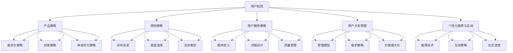

                 

### 《To C市场的用户粘性提升策略》

#### 引言

在当今竞争激烈的市场环境中，To C（面向消费者）市场的成功不仅仅依赖于产品的质量，更重要的是如何提高用户的粘性。用户粘性是指用户在一定时间内持续使用某一产品的能力，它是衡量产品在市场中生存能力的重要指标。随着消费者需求的变化和市场竞争的加剧，提升用户粘性已经成为许多企业关注的焦点。

本文将系统地探讨To C市场的用户粘性提升策略。我们将首先概述C市场的定义和特点，接着深入分析用户粘性的概念及其重要性，然后逐步探讨用户行为分析的方法和技术，最后提出一系列具体的策略，包括产品策略、营销策略、用户服务策略、用户关系管理和个性化推荐与互动策略。

通过对这些策略的深入分析和实际案例研究，本文旨在为企业提供一套完整的用户粘性提升方案，帮助企业在激烈的市场竞争中脱颖而出。以下是我们将要讨论的主要内容：

- **C市场概述**：定义和特点，以及发展趋势。
- **用户粘性概念与重要性**：定义、生命周期和重要性分析。
- **用户行为分析**：数据收集、数据分析和行为模型构建。
- **提升用户粘性的策略**：产品策略、营销策略、用户服务策略、用户关系管理、个性化推荐与互动。
- **案例分析与实践指导**：成功案例研究，实践指导。

#### 关键词

- To C市场
- 用户粘性
- 产品策略
- 营销策略
- 用户服务策略
- 用户关系管理
- 个性化推荐

#### 摘要

本文系统地探讨了To C市场的用户粘性提升策略。首先，我们分析了C市场的定义、特点和发展趋势，以及消费者的行为特征。接着，我们深入探讨了用户粘性的概念、生命周期和重要性。然后，我们介绍了用户行为分析的方法和技术，包括数据收集、数据分析和行为模型构建。在此基础上，我们提出了一系列提升用户粘性的策略，包括产品策略、营销策略、用户服务策略、用户关系管理和个性化推荐与互动。最后，通过实际案例研究，我们提供了实践指导，帮助企业有效地实施这些策略，提升用户粘性，增强市场竞争力。

### 第一部分：市场与用户分析

#### 第1章：C市场概述

##### 1.1 C市场的定义与特点

To C（面向消费者）市场是指直接向终端消费者销售商品或服务的市场。与B2B（面向企业）市场不同，To C市场更加注重用户体验和需求满足，其目标是通过提供个性化、高质量的产品和服务来吸引并留住消费者。C市场的特点主要体现在以下几个方面：

1. **个性化需求**：随着消费者个性化需求的不断增长，C市场要求企业提供多样化的产品和服务，满足不同消费者的独特需求。
2. **高度竞争**：C市场中的竞争异常激烈，企业需要不断创新和优化产品，以吸引消费者的关注和忠诚度。
3. **快速变化**：消费者行为和市场趋势变化迅速，企业需要具备敏锐的市场洞察力和快速响应能力。
4. **用户参与度**：消费者在C市场中的参与度较高，他们更愿意通过社交媒体、评价平台等方式分享自己的体验和感受。
5. **数据驱动**：C市场中的数据资源丰富，企业可以利用大数据分析技术，深入了解用户行为和需求，从而制定更加精准的市场策略。

##### 1.2 C市场的发展趋势

C市场的发展趋势受到多种因素的影响，包括技术进步、消费者行为变化、市场竞争态势等。以下是C市场发展的一些主要趋势：

1. **数字化升级**：随着移动互联网和智能设备的普及，C市场正在经历数字化升级。企业通过电商平台、社交媒体等数字化渠道，实现更高效的用户触达和服务。
2. **个性化服务**：基于大数据和人工智能技术，C市场的个性化服务趋势日益明显。企业通过用户数据分析，为消费者提供定制化的产品和服务。
3. **社交化营销**：社交媒体的兴起，使得C市场的营销方式更加社交化。企业利用社交媒体平台，与消费者建立互动关系，提升品牌影响力和用户粘性。
4. **跨界融合**：不同行业之间的融合和跨界创新，为C市场带来了新的增长点。例如，电商与物流、金融、娱乐等行业的结合，为消费者提供了更加便捷和多样化的服务。
5. **可持续发展**：随着消费者环保意识的提高，C市场中的可持续发展趋势愈发明显。企业通过环保产品、绿色物流等方式，满足消费者对可持续发展的需求。

##### 1.3 C市场的消费者行为分析

了解C市场的消费者行为，是企业制定有效市场策略的基础。以下是对C市场消费者行为的主要分析：

1. **消费习惯**：C市场的消费者行为呈现出明显的碎片化和高频次特点。他们更倾向于使用移动设备进行购物，并偏好快速、便捷的支付方式。
2. **购买决策**：C市场的消费者在购买决策过程中，受品牌、口碑、价格、促销等因素的影响较大。企业需要通过多种渠道和方式，提供有价值的信息，帮助消费者做出购买决策。
3. **价值观念**：C市场的消费者注重个性化和品质，他们追求独特、有品质的生活体验。企业需要从消费者的价值观念出发，打造符合他们期望的产品和服务。
4. **互动需求**：C市场的消费者希望与品牌建立互动关系，通过社交媒体、社区论坛等渠道表达自己的观点和需求。企业需要积极回应消费者的互动，提升用户参与度和满意度。
5. **口碑传播**：C市场的消费者更愿意相信和传播来自其他消费者的评价和推荐。企业需要重视用户口碑管理，通过优质的产品和服务赢得消费者的好评，实现口碑传播。

通过对C市场消费者行为的分析，企业可以更好地理解消费者的需求和行为模式，从而制定更加精准和有效的市场策略，提升用户粘性和市场竞争力。

#### 第2章：用户粘性概念与重要性

##### 2.1 用户粘性的定义

用户粘性（User Stickiness）是指用户在一定时间内持续使用某一产品的能力。它反映了用户对产品的忠诚度和依赖程度，是衡量产品在市场中竞争力的重要指标。用户粘性越高，表示用户对产品的使用频率和依赖程度越高，产品在市场上的竞争优势也越强。

用户粘性的定义可以从以下几个方面进行解释：

1. **用户频率**：用户粘性体现了用户在一定时间内使用产品的频率，即用户每天或每周打开应用或访问网站的次数。高频率的使用意味着用户对产品产生了较强的依赖性。
2. **用户时长**：除了使用频率，用户粘性还与用户在产品上的平均使用时长相关。用户在产品上停留的时间越长，表明他们对产品的兴趣和投入度越高。
3. **用户留存**：用户粘性还包括用户在一段时间后的留存情况。高留存率表示用户在初次使用产品后，仍然愿意持续使用，甚至推荐给他人。

##### 2.2 用户粘性与用户生命周期

用户粘性是用户生命周期（User Life Cycle）中至关重要的一环。用户生命周期通常包括获取（Acquisition）、激活（Activation）、留存（Retention）、推荐（Referral）和收益（Revenue）五个阶段。用户粘性在这五个阶段中扮演着关键角色：

1. **获取阶段**：用户粘性在获取阶段起到初步筛选作用。高粘性的产品能够吸引更多潜在用户，提高用户转化率。
2. **激活阶段**：激活阶段是用户从初次使用到开始产生价值的关键环节。高粘性的产品能够引导用户深入了解和体验产品，从而提高激活率。
3. **留存阶段**：在用户留存阶段，用户粘性直接影响用户的生命周期价值（Life Time Value, LTV）。高粘性的产品能够降低用户流失率，提高用户留存率，从而延长用户生命周期。
4. **推荐阶段**：用户粘性强的产品更容易引发口碑效应，用户在满意产品后更愿意推荐给他人，进一步扩大用户基础。
5. **收益阶段**：在用户收益阶段，高粘性的产品能够保持用户的活跃度和忠诚度，增加用户的付费意愿和消费频率，从而提升企业收益。

##### 2.3 提升用户粘性的重要性

提升用户粘性对企业的成功至关重要，主要体现在以下几个方面：

1. **用户留存率**：高粘性产品能够显著降低用户流失率，提高用户留存率。用户留存率是衡量产品成功的关键指标，它直接关系到企业的收入和市场份额。
2. **用户生命周期价值**：用户粘性越强，用户在产品上的活跃度和投入度越高，其生命周期价值（LTV）也越高。高LTV用户是企业的重要资产，能够为企业带来持续的收入和利润。
3. **品牌忠诚度**：提升用户粘性有助于建立品牌忠诚度，用户在多次使用产品后，对品牌产生信任和依赖，从而减少品牌转换的可能性。
4. **市场竞争力**：在竞争激烈的市场环境中，高粘性产品能够为企业提供竞争优势，吸引更多用户，扩大市场份额。
5. **产品改进和创新**：高粘性产品能够帮助企业更好地了解用户需求和行为，从而推动产品改进和创新，提高产品的市场适应性和竞争力。

综上所述，提升用户粘性是企业成功的关键因素，它不仅能够提高用户留存率和生命周期价值，还能够增强品牌忠诚度和市场竞争力。通过深入理解用户粘性的概念和重要性，企业可以制定更加有效的策略，提升用户粘性，实现可持续发展。

#### 第3章：用户行为分析

##### 3.1 用户行为数据收集

用户行为数据是提升用户粘性的重要依据，通过系统性地收集和分析这些数据，企业可以更好地了解用户需求和行为，从而制定针对性的策略。以下是用户行为数据收集的几个关键步骤：

1. **确定数据收集目标**：首先，企业需要明确收集数据的目的，如了解用户活跃度、使用频率、偏好等。明确目标有助于集中资源，提高数据收集的针对性和有效性。
2. **选择数据收集工具**：根据数据收集目标，选择合适的数据收集工具。常见的工具包括网页分析工具（如Google Analytics）、移动应用分析工具（如Firebase Analytics）和行为跟踪工具（如Mixpanel）等。这些工具可以实时收集用户在产品上的行为数据，如页面访问次数、点击次数、停留时间、操作路径等。
3. **设计数据收集方案**：在确定工具后，设计详细的数据收集方案。方案应包括数据收集的维度、频率和渠道等。例如，可以收集用户的基本信息（如性别、年龄、地理位置）、行为数据（如浏览历史、购买行为）和互动数据（如评论、分享）等。
4. **确保数据质量**：数据质量对分析结果至关重要。在数据收集过程中，应确保数据的准确性、完整性和一致性。可以通过数据清洗和去重等技术手段，提高数据质量。
5. **隐私保护**：在收集用户行为数据时，企业应严格遵守相关法律法规，保护用户隐私。可以采取数据加密、匿名化等技术手段，确保用户数据的安全。

##### 3.2 用户行为数据分析方法

用户行为数据分析是提升用户粘性的关键环节。以下是一些常用的用户行为数据分析方法：

1. **描述性分析**：描述性分析是对用户行为数据的基本统计分析，包括用户数量、活跃度、留存率、使用时长等。通过描述性分析，企业可以了解用户的基本情况和行为特点。
2. **趋势分析**：趋势分析用于观察用户行为随时间的变化趋势。通过趋势分析，企业可以了解用户行为的变化规律，为产品改进和策略调整提供依据。
3. **关联性分析**：关联性分析用于探索用户行为之间的关联性。通过关联性分析，企业可以发现用户行为之间的相关性，从而优化产品设计和营销策略。
4. **聚类分析**：聚类分析将用户划分为不同的群体，以便于进一步分析。通过聚类分析，企业可以了解用户群体的特征和需求，从而提供个性化的产品和服务。
5. **机器学习与预测**：利用机器学习算法，可以对用户行为数据进行分析和预测。例如，通过用户行为数据预测用户流失风险、推荐产品等。机器学习与预测可以提高数据分析的精度和自动化程度，为产品优化和策略制定提供有力支持。

##### 3.3 用户行为模型构建

用户行为模型是对用户行为进行分析和预测的数学模型。以下是一些常用的用户行为模型：

1. **马尔可夫模型**：马尔可夫模型是一种基于状态转移概率的模型，用于预测用户在一定时间范围内的行为。通过马尔可夫模型，企业可以了解用户的潜在行为模式，为产品改进和策略调整提供依据。
2. **贝叶斯网络**：贝叶斯网络是一种基于概率推理的模型，用于分析用户行为和决策。通过贝叶斯网络，企业可以了解用户行为之间的依赖关系，为产品优化和个性化推荐提供支持。
3. **深度学习模型**：深度学习模型是一种基于人工神经网络的模型，具有强大的学习和预测能力。通过深度学习模型，企业可以深入挖掘用户行为数据，实现精准的用户行为预测和推荐。
4. **协同过滤模型**：协同过滤模型是一种基于用户行为数据的推荐算法，通过分析用户之间的相似性，为用户推荐感兴趣的产品。协同过滤模型包括基于用户的协同过滤和基于物品的协同过滤两种类型。

构建用户行为模型需要考虑以下因素：

1. **数据质量**：用户行为数据的质量直接影响模型的准确性。因此，在构建模型前，需要对数据进行清洗和预处理，确保数据质量。
2. **模型选择**：根据数据特点和需求，选择合适的用户行为模型。不同类型的模型适用于不同的分析任务，如预测、推荐等。
3. **模型评估**：在构建模型后，需要对其进行评估，以确保模型的准确性和实用性。常见的评估指标包括准确率、召回率、F1值等。
4. **模型优化**：通过不断调整和优化模型参数，可以提高模型的预测能力和准确性。例如，可以通过交叉验证、超参数调优等技术手段，优化模型性能。

通过用户行为数据分析方法和行为模型构建，企业可以更好地理解用户行为，发现潜在需求，优化产品和服务，提升用户粘性和满意度。

### 第二部分：提升用户粘性的策略

#### 第4章：产品策略

##### 4.1 产品差异化策略

产品差异化策略是提升用户粘性的重要手段之一。通过在产品功能、设计、体验等方面与其他竞争对手形成明显区别，企业可以吸引更多用户，提高用户忠诚度。以下是一些实现产品差异化的方法：

1. **独特功能**：开发具有独特性和创新性的功能，满足用户未被满足的需求。例如，某些社交媒体平台通过引入直播、短视频等功能，吸引了大量年轻用户。
2. **卓越设计**：注重产品的外观、界面和交互设计，提供美观、易用、符合用户习惯的产品。设计不仅仅是视觉上的美观，更包括用户操作流畅度和心理感受。
3. **个性化体验**：根据用户行为和偏好，提供个性化的产品体验。例如，电商平台可以根据用户浏览历史和购买记录，为用户推荐相关商品。
4. **技术创新**：在技术层面进行创新，提高产品的性能、稳定性和安全性。例如，一些智能设备通过使用先进的技术，提升了用户体验和安全性。
5. **独特价值主张**：明确产品的独特价值主张，让用户清楚了解产品的优势和价值。例如，一些健康应用通过强调数据准确性和健康指导，赢得了用户的信任和忠诚。

##### 4.2 产品创新策略

产品创新策略是企业保持市场竞争力和提升用户粘性的关键。以下是一些常见的创新方法：

1. **持续改进**：通过持续改进产品功能、设计和体验，不断提升产品的竞争力。例如，互联网公司通过定期发布产品更新，增加新功能、优化用户体验。
2. **颠覆性创新**：颠覆性创新是指通过引入全新技术和商业模式，彻底改变现有市场格局。例如，共享单车和网约车平台通过颠覆传统交通模式，改变了人们的出行方式。
3. **跨界合作**：跨界合作是指与其他行业或企业合作，实现资源的互补和优势互补。例如，电商与物流公司合作，提供更加便捷的配送服务。
4. **用户参与**：鼓励用户参与产品创新，通过用户反馈、调研等方式，了解用户需求和期望，从而开发出更符合用户期望的产品。例如，一些科技公司通过用户社区，收集用户建议和反馈，推动产品创新。
5. **人工智能和大数据**：利用人工智能和大数据技术，挖掘用户行为和需求，实现精准的产品创新。例如，通过用户行为数据分析，电商平台可以预测用户需求，开发出更符合用户期望的产品。

##### 4.3 产品体验优化策略

优化产品体验是提升用户粘性的关键。以下是一些优化产品体验的方法：

1. **简化流程**：简化用户操作流程，减少用户的操作步骤，提升用户操作效率。例如，移动应用可以通过优化界面设计，简化用户注册和登录流程。
2. **人性化设计**：注重用户体验，提供人性化设计。例如，通过提供详细的操作指南、错误提示和反馈机制，帮助用户更好地理解和使用产品。
3. **高效响应**：提高产品的响应速度和稳定性，提升用户满意度。例如，电商平台可以通过优化服务器和数据库，提高页面加载速度和订单处理效率。
4. **个性化定制**：根据用户需求和偏好，提供个性化定制服务。例如，电商平台可以根据用户的历史购买记录，为用户推荐相关商品。
5. **实时反馈**：提供实时反馈机制，让用户感受到产品的及时响应。例如，社交媒体平台可以通过即时聊天、点赞和评论等方式，与用户保持互动。

通过产品差异化策略、产品创新策略和产品体验优化策略，企业可以不断提升产品的竞争力，提高用户粘性，实现可持续发展。

#### 第5章：营销策略

##### 5.1 营销目标设定

营销目标设定是提升用户粘性的第一步，它直接关系到营销活动的方向和效果。以下是如何设定有效营销目标的方法：

1. **明确目标**：首先，企业需要明确营销的目标，如增加用户数量、提高用户留存率、提升品牌知名度等。明确的目标有助于集中资源和精力，确保营销活动的有效开展。
2. **具体可行**：目标应当具体可行，避免模糊和宽泛的描述。例如，"提高用户留存率"可以具体化为"将用户留存率提升10%"。
3. **量化指标**：为每个目标设定量化指标，如用户增长量、转化率、销售额等。量化指标有助于评估营销活动的效果，提供数据支持。
4. **制定计划**：在设定目标后，制定详细的营销计划，包括具体执行步骤、时间表、责任分配等。例如，为提升用户留存率，可以制定一系列用户活动、会员奖励等措施。
5. **评估与调整**：定期评估营销活动的效果，根据评估结果对目标和计划进行调整。例如，如果用户留存率未达到预期，可以分析原因，优化策略。

##### 5.2 营销渠道选择

选择合适的营销渠道是实现营销目标的关键。以下是一些常见的营销渠道及其特点：

1. **社交媒体**：社交媒体平台如微信、微博、抖音等，具有广泛的用户基础和强大的传播力。通过发布有趣的内容、互动活动等，可以迅速提高品牌知名度和用户参与度。
2. **搜索引擎**：搜索引擎如百度、谷歌等，通过关键词广告、搜索引擎优化（SEO）等手段，可以精准地将潜在用户引导到产品页面，提高转化率。
3. **内容营销**：通过创作有价值的内容，如博客、视频、电子书等，吸引用户关注和分享，提高品牌影响力。内容营销是一种长期且可持续的营销方式。
4. **电子邮件营销**：通过发送个性化的电子邮件，如产品推荐、促销活动等，可以直接与用户建立联系，提高用户参与度和转化率。
5. **线下活动**：线下活动如展览、讲座、用户见面会等，可以增加用户的真实体验和参与感，提升品牌形象和用户忠诚度。

在选择营销渠道时，企业需要考虑以下因素：

1. **目标受众**：根据目标受众的特点，选择适合的营销渠道。例如，年轻人可能更倾向于使用社交媒体，而企业家可能更喜欢阅读专业博客。
2. **渠道效果**：分析不同渠道的历史效果，选择效果较好的渠道。例如，如果以往的数据显示，电子邮件营销的转化率较高，可以考虑增加电子邮件营销的预算。
3. **成本效益**：评估不同渠道的成本和效益，选择性价比最高的渠道。例如，如果预算有限，可能需要优先考虑成本较低但效果不错的社交媒体渠道。

##### 5.3 营销活动策划

有效的营销活动策划是提升用户粘性的关键环节。以下是一些策划营销活动的步骤：

1. **确定主题**：明确营销活动的主题，如新产品发布、节日促销、品牌宣传等。主题应与目标受众和品牌形象相符，具有吸引力和传播力。
2. **设定目标**：为营销活动设定具体的目标，如提高用户参与度、增加用户转化率、提升品牌知名度等。目标应可量化，以便于评估活动效果。
3. **制定策略**：根据主题和目标，制定具体的营销策略，如内容创作、渠道选择、推广方式等。策略应具有可执行性和灵活性，以便于根据实际情况进行调整。
4. **内容创作**：创作高质量的内容，如宣传海报、视频、文案等，吸引目标受众的注意力。内容应具有吸引力、相关性，并能传达品牌价值。
5. **渠道推广**：选择合适的渠道进行推广，如社交媒体、搜索引擎、电子邮件等。推广应覆盖目标受众集中的渠道，提高活动的曝光率和参与度。
6. **活动执行**：执行营销活动，如发布内容、推广广告、组织活动等。执行过程中，应密切监控活动进展，及时调整策略和内容。
7. **效果评估**：活动结束后，评估活动效果，如用户参与度、转化率、品牌知名度等。根据评估结果，总结经验教训，优化未来的营销活动。

通过合理的营销目标设定、渠道选择和活动策划，企业可以有效地提升用户粘性，增强市场竞争力。

#### 第6章：用户服务策略

##### 6.1 用户服务定义

用户服务（User Service）是指企业在产品使用过程中，为用户提供的一系列支持和服务，旨在提升用户体验、增强用户满意度和忠诚度。用户服务的定义和范围可以从以下几个方面进行阐述：

1. **服务目的**：用户服务的根本目的是满足用户需求、解决问题和提升用户体验。通过提供优质服务，企业可以增加用户对产品的信任和依赖，从而提升用户粘性。
2. **服务内容**：用户服务包括售前、售中和售后三个环节。售前服务主要包括产品咨询、需求分析、试用体验等；售中服务主要包括购买引导、支付支持、物流跟踪等；售后服务主要包括技术支持、故障排除、产品升级等。
3. **服务形式**：用户服务可以采用多种形式，如线上服务和线下服务。线上服务包括电话、邮件、在线聊天、社交媒体等；线下服务包括实体店、用户见面会、技术支持团队等。
4. **服务特点**：用户服务具有个性化、及时性和互动性的特点。个性化服务能够根据用户需求提供定制化的解决方案；及时性服务能够在用户需要帮助时迅速响应；互动性服务能够与用户建立紧密的联系，提升用户满意度。

##### 6.2 用户服务流程设计

用户服务流程设计是确保用户服务高效、顺畅进行的关键。以下是一些设计用户服务流程的基本原则和步骤：

1. **明确服务流程**：首先，企业需要明确用户服务的流程，包括用户咨询、问题分类、解决方案提供、问题跟踪等环节。明确的服务流程有助于提高服务效率和质量。
2. **制定服务标准**：根据服务流程，制定具体的服务标准，如服务响应时间、解决方案提供时间、问题解决率等。服务标准应具有可操作性和可衡量性，以便于监督和改进。
3. **分工与合作**：在用户服务流程中，明确各岗位的职责和权限，确保服务流程的顺畅进行。同时，鼓励各岗位之间的合作和协调，共同解决用户问题。
4. **培训与指导**：为服务人员提供必要的培训和支持，确保他们具备解决用户问题的能力和技巧。通过定期培训和指导，提高服务人员的专业素养和服务水平。
5. **反馈与优化**：收集用户对服务的反馈，分析服务过程中的问题和不足，不断优化服务流程和标准。通过持续改进，提升用户服务质量和用户满意度。

以下是用户服务流程的基本步骤：

1. **用户咨询**：用户通过电话、邮件、在线聊天等方式咨询产品相关问题。
2. **问题分类**：根据用户咨询的问题类型，将其分类为常见问题、技术问题、售后服务等，以便于快速定位和解决。
3. **解决方案提供**：为用户提供建议和解决方案，如操作指南、常见问题解答、技术支持等。对于复杂问题，可以安排专业人员进行远程协助或现场服务。
4. **问题跟踪**：记录用户问题的处理进度和结果，确保问题得到及时解决。对于未能解决的问题，可以及时跟进，确保用户满意。
5. **反馈收集**：收集用户对服务的反馈，分析服务过程中的问题和不足，不断优化服务流程和标准。

通过科学的用户服务流程设计，企业可以确保用户问题得到及时、有效的解决，提升用户满意度和忠诚度。

##### 6.3 用户服务质量管理

用户服务质量管理是提升用户粘性的关键环节。以下是一些用户服务质量管理的方法和工具：

1. **服务质量评估**：建立服务质量评估体系，对用户服务的各个方面进行量化评估。评估指标包括服务响应时间、问题解决率、用户满意度等。通过定期评估，了解服务质量状况，发现问题和改进方向。
2. **客户满意度调查**：定期进行客户满意度调查，了解用户对服务的满意程度和改进需求。可以通过电话、邮件、在线调查等方式进行满意度调查，收集用户反馈。
3. **服务改进计划**：根据服务质量评估和客户满意度调查结果，制定服务改进计划。改进计划应包括具体的目标、措施和时间表，确保服务质量的持续提升。
4. **服务标准化**：制定服务标准化流程和操作手册，确保服务人员按照统一的标准提供服务。服务标准化有助于提高服务效率和质量，减少服务失误。
5. **员工激励与培训**：通过员工激励和培训，提高服务人员的专业素养和服务水平。可以设置服务明星、优秀团队等激励机制，鼓励员工提供高质量服务。同时，定期开展培训，提升员工的服务技能和知识水平。
6. **技术支持**：利用技术手段提升用户服务效率和质量。例如，引入智能客服系统，通过自动化回答常见问题，提高服务响应速度。此外，可以采用CRM系统（客户关系管理）等工具，实现服务流程的数字化和智能化管理。

通过有效的用户服务质量管理，企业可以确保用户问题得到及时、有效的解决，提升用户满意度和忠诚度，从而增强市场竞争力。

#### 第7章：用户关系管理

##### 7.1 用户关系管理模型

用户关系管理（User Relationship Management，简称CRM）是一种通过系统化、数据化的方法，提升企业与用户之间互动质量的管理模式。CRM模型的核心是建立和维护与用户的长久、稳定的关系，从而实现用户的持续价值。

一个典型的CRM模型包括以下四个主要组成部分：

1. **数据管理**：CRM系统的基石是数据管理。企业需要收集、存储、整合和分析与用户相关的数据，包括用户的基本信息、购买历史、行为习惯等。数据管理的关键在于数据的准确性和实时性，以便于企业及时了解用户需求和行为。
2. **用户分类**：基于数据分析和用户特征，将用户进行分类，如新用户、活跃用户、流失用户、高价值用户等。用户分类有助于企业制定针对性的服务和营销策略，提高用户的参与度和忠诚度。
3. **互动管理**：通过多种渠道与用户进行互动，如电话、邮件、在线聊天、社交媒体等。互动管理的目标是提高用户的满意度和参与度，建立良好的用户关系。互动管理还包括用户反馈机制的建立，以便于企业及时了解用户需求和改进服务。
4. **数据分析**：对用户行为数据进行分析和挖掘，了解用户的偏好、需求和行为模式。数据分析可以帮助企业发现用户痛点和机会点，优化产品和服务，提高用户满意度和忠诚度。

CRM模型的基本原理是利用数据驱动的决策，通过系统化的用户管理和互动，实现用户价值的最大化。具体来说，CRM模型通过以下步骤实现用户关系的有效管理：

1. **数据收集**：通过多种渠道收集用户数据，包括在线行为、交易记录、客户反馈等。
2. **数据整合**：将分散的用户数据进行整合，建立统一的用户数据视图，以便于全面了解用户。
3. **用户分类**：根据用户特征和行为数据，对用户进行分类，如新用户、活跃用户、流失用户等。
4. **互动规划**：根据用户分类和需求，制定个性化的互动计划，如发送个性化邮件、推送定制化内容等。
5. **数据分析**：对用户行为数据进行分析，了解用户需求和偏好，优化产品和服务。
6. **反馈与改进**：收集用户反馈，评估互动效果，不断改进用户服务和营销策略。

通过CRM模型，企业可以建立与用户之间的长期、稳定的关系，提高用户的满意度和忠诚度，从而实现持续增长和竞争优势。

##### 7.2 用户关系维护策略

用户关系维护是提升用户粘性的关键，通过有效的维护策略，企业可以增强用户对品牌的忠诚度和依赖度。以下是一些用户关系维护策略：

1. **个性化沟通**：根据用户的需求、行为和偏好，提供个性化的沟通和服务。例如，通过电子邮件或短信，向用户发送定制化的产品推荐、促销信息和活动邀请。
2. **持续互动**：保持与用户的持续互动，通过社交媒体、在线论坛、用户社区等方式，与用户保持联系。互动内容可以包括问答、活动、投票等，提高用户的参与度和忠诚度。
3. **用户反馈**：积极收集用户反馈，关注用户的需求和意见，及时解决问题。通过用户反馈，企业可以了解用户的真实体验和需求，不断优化产品和服务。
4. **会员制度**：建立会员制度，为用户提供专属权益和服务。例如，会员可以享受折扣、积分兑换、专属活动等。会员制度有助于提高用户的粘性和忠诚度。
5. **定期活动**：定期举办用户活动，如线上讲座、用户见面会、竞赛等，增加用户的参与感和归属感。活动内容应贴近用户需求，提高活动的吸引力和实际效果。
6. **客户关怀**：在重要时刻，如用户生日、节假日等，向用户发送关怀信息，表达企业的关心和祝福。通过客户关怀，增强用户对品牌的情感联系。
7. **技术支持**：提供高质量的技术支持，确保用户在使用产品过程中遇到问题时能够及时得到帮助。技术支持可以通过在线客服、电话支持、知识库等方式进行，提高用户的满意度和信任度。

通过上述策略，企业可以有效地维护用户关系，提升用户粘性，实现持续增长和竞争优势。

##### 7.3 用户关系价值最大化

用户关系价值最大化是指通过优化用户关系管理，实现用户对企业价值的最大化。以下是一些实现用户关系价值最大化的策略：

1. **客户生命周期价值（CLV）分析**：通过分析用户的生命周期价值，了解不同用户群体的价值和潜力。重点投资和关注高价值用户，提高他们的生命周期价值。
2. **客户细分**：根据用户的购买行为、偏好、需求等特征，将用户进行细分，制定个性化的营销和服务策略。对于高价值用户，提供更高级的服务和优惠，提高他们的忠诚度。
3. **交叉销售和复购率提升**：通过分析用户的购买记录，发现用户的潜在需求，提供相关的产品和服务。同时，通过优惠活动、会员制度等手段，提高用户的复购率，增加用户对企业价值的贡献。
4. **用户忠诚度计划**：建立用户忠诚度计划，通过积分、折扣、专属活动等方式，激励用户持续消费。忠诚度计划可以增加用户的粘性和忠诚度，提高他们的生命周期价值。
5. **客户推荐计划**：鼓励用户通过推荐好友来增加用户基础。例如，可以设置推荐奖励机制，让推荐人和被推荐人都能获得优惠或奖励。通过客户推荐，可以快速扩大用户群体，提高用户关系价值。
6. **用户行为分析**：利用大数据和人工智能技术，深入分析用户行为和需求，为用户提供个性化的产品和服务。通过精准的用户行为分析，可以更好地满足用户需求，提高用户满意度和忠诚度。
7. **持续改进和创新**：不断优化用户关系管理流程和策略，根据用户反馈和市场变化进行调整。通过持续改进和创新，提高用户关系管理的效果和用户价值。

通过上述策略，企业可以最大限度地挖掘用户价值，实现用户关系价值最大化，从而提高企业的盈利能力和市场竞争力。

#### 第8章：个性化推荐与互动

##### 8.1 个性化推荐技术

个性化推荐（Personalized Recommendation）技术是提升用户粘性和满意度的重要手段之一。通过分析用户的行为数据和历史偏好，个性化推荐系统可以为用户推荐他们可能感兴趣的内容或产品。以下是几种常见的个性化推荐技术：

1. **协同过滤（Collaborative Filtering）**：协同过滤是最常用的推荐技术之一，分为基于用户的协同过滤（User-based Collaborative Filtering）和基于物品的协同过滤（Item-based Collaborative Filtering）。基于用户的协同过滤通过分析用户之间的相似性，推荐与目标用户兴趣相似的物品；基于物品的协同过滤通过分析物品之间的相似性，推荐与目标物品相似的物品。

2. **内容推荐（Content-Based Filtering）**：内容推荐技术根据用户过去的喜好和内容特征，为用户推荐相似的内容。内容推荐的主要挑战在于如何准确地提取和表示内容特征，以及如何处理冷启动问题（即新用户或新物品缺乏足够的历史数据）。

3. **混合推荐（Hybrid Recommender Systems）**：混合推荐系统结合了协同过滤和内容推荐的优势，通过融合用户行为数据和内容特征，提高推荐系统的准确性和多样性。

4. **基于模型的推荐（Model-Based Recommender Systems）**：基于模型的推荐系统利用机器学习和深度学习技术，建立用户和物品之间的预测模型。常见的模型包括矩阵分解（Matrix Factorization）、神经网络（Neural Networks）和深度学习（Deep Learning）等。

以下是构建个性化推荐系统的基本步骤：

1. **数据收集**：收集用户的行为数据，如浏览历史、点击记录、购买记录等，以及物品的属性数据，如分类、标签、评分等。
2. **数据预处理**：对收集到的数据进行清洗和预处理，包括缺失值处理、异常值检测、数据归一化等，以提高数据质量。
3. **特征提取**：从用户和物品数据中提取有用的特征，如用户兴趣标签、物品属性向量等。特征提取的质量直接影响推荐系统的性能。
4. **模型选择**：根据数据特点和业务需求，选择合适的推荐模型，如基于协同过滤、内容推荐或混合推荐模型。
5. **模型训练**：使用训练数据集训练推荐模型，通过调整模型参数和优化算法，提高模型预测准确性。
6. **模型评估**：使用验证数据集对训练好的模型进行评估，常用的评估指标包括准确率（Accuracy）、召回率（Recall）、覆盖率（Coverage）和多样性（Diversity）等。
7. **模型部署**：将训练好的推荐模型部署到生产环境中，为用户实时推荐感兴趣的内容或产品。

##### 8.2 用户互动策略

用户互动（User Engagement）是提升用户粘性和活跃度的关键。以下是一些有效的用户互动策略：

1. **社交媒体互动**：通过社交媒体平台（如微博、微信、Facebook等）与用户建立互动关系，发布有趣的内容、互动活动、用户反馈等，提高用户的参与度和满意度。
2. **社区建设**：建立用户社区（如论坛、QQ群、微信群等），为用户提供一个交流、分享和互动的平台。社区可以促进用户之间的互动，增强用户对品牌的认同感和归属感。
3. **个性化推送**：根据用户的行为和偏好，为用户推送个性化的内容、优惠信息和活动邀请。个性化推送可以提高用户的点击率和参与度，增强用户对品牌的认知和好感。
4. **在线活动**：定期举办在线活动（如竞赛、抽奖、讲座等），激发用户的参与热情，提高用户活跃度。活动内容应贴近用户需求，具有吸引力和实际价值。
5. **用户反馈**：积极收集用户反馈，关注用户的需求和意见，及时解决问题。通过用户反馈，可以了解用户的真实体验和需求，优化产品和服务。
6. **客户关怀**：在重要时刻，如用户生日、节假日等，向用户发送关怀信息，表达企业的关心和祝福。通过客户关怀，增强用户对品牌的情感联系。
7. **互动奖励**：为积极参与互动的用户提供奖励，如积分、优惠券、实物奖励等。互动奖励可以提高用户的参与度和忠诚度，促进用户之间的互动。

通过上述用户互动策略，企业可以有效地提升用户的参与度和满意度，增强用户粘性和品牌忠诚度。

##### 8.3 社交化与社区化运营

社交化（Socialization）和社区化（Communityization）运营是提升用户粘性和活跃度的有效手段。以下是如何实施社交化与社区化运营的几个关键点：

1. **建立社交化平台**：企业应利用社交媒体平台（如微信、微博、Facebook等）建立社交化渠道，与用户建立互动关系。通过发布有趣的内容、互动活动、用户反馈等，吸引用户关注和参与。

2. **社区建设**：建立一个专属的用户社区，如论坛、QQ群、微信群等，为用户提供一个交流、分享和互动的平台。社区可以促进用户之间的互动，增强用户对品牌的认同感和归属感。

3. **内容创作**：创作高质量的内容，包括图文、视频、直播等，吸引用户关注和分享。内容应贴近用户需求，具有吸引力和实际价值，以提高用户参与度。

4. **互动活动**：定期举办在线互动活动（如竞赛、抽奖、讲座等），激发用户的参与热情，提高用户活跃度。活动内容应多样化，满足不同用户的需求。

5. **用户反馈**：积极收集用户反馈，关注用户的需求和意见，及时解决问题。通过用户反馈，可以了解用户的真实体验和需求，优化产品和服务。

6. **用户激励**：为积极参与互动的用户提供奖励，如积分、优惠券、实物奖励等。互动奖励可以提高用户的参与度和忠诚度，促进用户之间的互动。

7. **社区管理**：建立专业的社区管理团队，负责社区的内容审核、用户互动和活动策划。通过有效的社区管理，可以营造一个友好、积极、健康的社区氛围。

8. **跨平台运营**：整合不同平台（如官网、社交媒体、社区等）的运营资源，实现跨平台的互动和推广。通过跨平台运营，可以扩大用户基础，提高用户粘性。

通过社交化与社区化运营，企业可以有效地提升用户的参与度和满意度，增强用户粘性和品牌忠诚度。

#### 第9章：成功案例研究

##### 9.1 案例一：某电商平台的用户粘性提升策略

某知名电商平台通过一系列策略成功提升了用户粘性，以下是其主要做法：

1. **个性化推荐**：利用大数据和机器学习技术，实现个性化推荐。通过对用户购买历史、浏览记录、搜索关键词等数据的分析，为用户推荐相关商品，提高用户购买转化率。

2. **社交化营销**：通过社交媒体平台（如微信、微博、抖音等）与用户建立互动关系，发布有趣的内容和互动活动，吸引用户关注和参与。同时，鼓励用户分享购物体验和心得，提高品牌知名度。

3. **会员制度**：建立会员制度，为会员提供专属权益和服务，如折扣优惠、积分兑换、专属活动等。会员制度有助于提高用户的粘性和忠诚度。

4. **用户服务优化**：提供高质量的客户服务，包括在线客服、电话支持、邮件回复等。通过快速响应用户问题和需求，提高用户满意度和信任度。

5. **互动营销**：定期举办线上线下互动活动，如抽奖、竞赛、讲座等，激发用户的参与热情。通过互动营销，增强用户对品牌的认同感和归属感。

6. **用户反馈**：积极收集用户反馈，关注用户的需求和意见，及时解决问题。通过用户反馈，不断优化产品和服务，提升用户体验。

##### 9.2 案例二：某社交媒体平台的用户活跃度提升策略

某社交媒体平台通过以下策略成功提升了用户活跃度：

1. **内容多样化**：提供多种类型的内容，包括文字、图片、视频、直播等，满足不同用户的需求。同时，鼓励用户创作和分享内容，提高平台的活跃度。

2. **社交互动**：通过社交互动功能（如点赞、评论、分享等），促进用户之间的互动。通过互动，增加用户在平台上的停留时间和活跃度。

3. **个性化推荐**：利用大数据和机器学习技术，为用户推荐感兴趣的内容和用户。通过个性化推荐，提高用户的参与度和满意度。

4. **社区建设**：建立多个用户社区，如兴趣小组、行业论坛等，为用户提供一个交流、分享和互动的平台。社区可以促进用户之间的互动，增强用户对平台的归属感。

5. **用户激励**：为积极参与互动的用户提供奖励，如积分、优惠券、实物奖励等。通过用户激励，提高用户的参与度和忠诚度。

6. **用户反馈**：积极收集用户反馈，关注用户的需求和意见，及时解决问题。通过用户反馈，不断优化平台功能和服务，提升用户体验。

##### 9.3 案例三：某健康应用的用户留存策略

某健康应用通过以下策略成功提升了用户留存率：

1. **个性化推荐**：根据用户的健康数据和偏好，为用户推荐合适的健身计划和营养建议。通过个性化推荐，提高用户的满意度和留存率。

2. **互动式训练**：提供互动式的健身训练课程，如视频教程、直播互动等，让用户在训练过程中保持兴趣和参与度。

3. **社交化功能**：通过社交化功能（如挑战、排行榜、好友互动等），增加用户的社交互动和竞争意识，提高用户的留存率。

4. **持续更新**：定期更新健身计划和课程内容，保持用户的新鲜感和兴趣。通过持续更新，提高用户的留存率和活跃度。

5. **用户反馈**：积极收集用户反馈，关注用户的需求和意见，及时调整产品功能和服务。通过用户反馈，优化产品体验，提升用户满意度。

6. **激励制度**：为完成健身目标和积极参与互动的用户提供奖励，如积分、徽章、实物奖励等。通过激励制度，提高用户的参与度和忠诚度。

通过以上成功案例，我们可以看到，提升用户粘性和活跃度需要综合考虑产品、营销、用户服务等多个方面。通过个性化推荐、社交化营销、互动式体验、用户反馈等策略，企业可以有效地提升用户的粘性和活跃度，实现持续增长和竞争优势。

#### 第10章：实践指导

##### 10.1 用户粘性提升策略制定流程

为了有效提升用户粘性，企业需要制定一套系统化的策略，以下是用户粘性提升策略制定的基本流程：

1. **需求分析**：首先，企业需要对市场需求、用户需求进行详细分析。通过市场调研、用户访谈、竞品分析等方式，了解用户痛点和需求。

2. **目标设定**：根据需求分析结果，设定具体的用户粘性提升目标，如提高用户留存率、提升用户活跃度、降低用户流失率等。

3. **策略制定**：在目标设定后，制定具体的策略。策略应涵盖产品、营销、用户服务、用户关系管理等多个方面。例如，通过个性化推荐、社交化营销、互动式体验等手段，实现用户粘性的提升。

4. **资源规划**：明确实现策略所需的资源，包括人力、财力、物力等。资源规划应确保策略的有效实施。

5. **实施计划**：制定详细的实施计划，包括时间表、责任分配、关键节点等。实施计划应确保策略的顺利推进。

6. **效果评估**：在策略实施过程中，定期评估策略效果。通过数据分析和用户反馈，了解策略的实际效果，及时调整和优化。

7. **持续改进**：根据效果评估结果，不断调整和优化策略。通过持续改进，提升用户粘性，实现企业目标。

##### 10.2 用户粘性提升工具与资源推荐

为了有效提升用户粘性，企业需要借助一系列工具和资源。以下是几个推荐的工具和资源：

1. **数据分析工具**：
   - Google Analytics：提供详细的网站和移动应用数据分析功能，帮助企业了解用户行为和需求。
   - Mixpanel：提供用户行为分析、用户留存分析等功能，帮助企业制定精准的用户粘性提升策略。

2. **个性化推荐系统**：
   - AWS Personalize：提供一站式的个性化推荐服务，基于用户行为数据和内容特征，为用户推荐相关商品或内容。
   - Hugging Face：提供多种预训练的推荐模型，帮助企业快速搭建个性化推荐系统。

3. **用户服务工具**：
   - Zendesk：提供在线客服、邮件支持、知识库等功能，帮助企业提供高质量的客户服务。
   - Freshdesk：提供多渠道客户服务支持，帮助企业快速响应用户问题。

4. **用户关系管理工具**：
   - Salesforce：提供全面的CRM解决方案，帮助企业建立和维护与用户的长期关系。
   - HubSpot：提供营销、销售、客户服务一体化解决方案，帮助企业实现用户关系的价值最大化。

5. **社交媒体管理工具**：
   - Hootsuite：提供社交媒体管理功能，帮助企业高效管理多个社交媒体平台。
   - Buffer：提供社交媒体内容发布和营销工具，帮助企业优化社交媒体运营。

6. **资源推荐平台**：
   - GitHub：提供代码托管和协作平台，帮助企业开发和分享优质资源。
   - Stack Overflow：提供技术问答社区，帮助企业解决技术难题。

通过使用这些工具和资源，企业可以更有效地提升用户粘性，实现持续增长和竞争优势。

##### 10.3 用户粘性提升策略实施与评估

用户粘性提升策略的实施和评估是企业实现长期发展的关键。以下是如何实施和评估用户粘性提升策略的步骤：

1. **实施策略**：
   - **建立跨部门协作**：确保产品、营销、用户服务等多个部门共同参与用户粘性提升策略的制定和实施。
   - **制定详细的执行计划**：明确各个阶段的任务、时间表和责任人，确保策略的顺利实施。
   - **培训员工**：对涉及策略实施的员工进行培训，确保他们了解策略目标、方法和执行要求。
   - **持续优化**：在策略实施过程中，根据实际情况进行持续优化，确保策略的有效性和灵活性。

2. **评估策略**：
   - **设定关键绩效指标（KPI）**：根据策略目标，设定具体的KPI，如用户留存率、活跃度、用户满意度等。
   - **定期数据收集**：定期收集与KPI相关的数据，如用户行为数据、销售数据、用户反馈等。
   - **数据分析**：使用数据分析工具，对收集到的数据进行深入分析，了解策略的实际效果和用户反馈。
   - **用户调研**：通过用户访谈、问卷调查等方式，直接获取用户的反馈和建议，了解他们对产品和服务的真实感受。
   - **评估结果**：根据数据分析结果和用户调研反馈，对策略效果进行评估，判断是否达到预期目标。

3. **反馈与改进**：
   - **总结经验**：根据评估结果，总结成功经验和存在的问题，为下一步策略制定提供依据。
   - **调整策略**：根据评估结果，对策略进行调整和优化，确保其更符合用户需求和实际效果。
   - **持续监控**：在策略调整后，持续监控策略效果，确保用户粘性不断提升。

通过有效的策略实施和评估，企业可以不断优化用户粘性提升策略，实现用户满意度和忠诚度的持续提升，从而在竞争激烈的市场环境中保持竞争优势。

### 附录：相关工具与资源

为了帮助企业和开发者更好地理解和应用用户粘性提升策略，我们提供了一系列相关工具和资源。以下是一些常用的工具和资源分类及具体推荐：

#### A.1 用户行为分析工具

1. **Google Analytics**
   - 简介：Google Analytics 是一款免费的网站和移动应用分析工具，提供详细的数据报告和用户行为分析功能。
   - 推荐理由：支持多渠道追踪，提供实时数据，易于集成和自定义。

2. **Mixpanel**
   - 简介：Mixpanel 是一款专业的用户行为分析工具，提供用户留存、活跃度、事件追踪等功能。
   - 推荐理由：强大的数据可视化功能，灵活的事件追踪机制，适合进行深入的用户行为分析。

#### A.2 用户服务工具

1. **Zendesk**
   - 简介：Zendesk 是一款功能全面的客户服务与支持平台，提供多渠道客户互动、自动化客服、社区管理等。
   - 推荐理由：易于使用，提供全面的客户服务解决方案，支持多语言和跨平台。

2. **Freshdesk**
   - 简介：Freshdesk 是一款简单实用的客户支持与销售平台，提供多渠道客户互动、自动化客服、工单管理等。
   - 推荐理由：操作简便，价格合理，适合中小型企业使用。

#### A.3 用户互动工具与平台

1. **Hootsuite**
   - 简介：Hootsuite 是一款社交媒体管理工具，提供社交媒体内容的发布、追踪和分析功能。
   - 推荐理由：支持多平台管理，任务自动化，有助于提高社交媒体营销效果。

2. **Buffer**
   - 简介：Buffer 是一款社交媒体内容发布和营销工具，帮助用户优化社交媒体内容发布时间，提高互动率。
   - 推荐理由：简单易用，提供社交媒体分析功能，有助于提升社交媒体参与度。

#### A.4 个性化推荐工具

1. **AWS Personalize**
   - 简介：AWS Personalize 是一款基于云的个性化推荐服务，支持协同过滤和内容推荐等多种推荐算法。
   - 推荐理由：无需编程，即可快速部署个性化推荐系统，适用于各种规模的应用。

2. **Hugging Face**
   - 简介：Hugging Face 提供多种预训练的推荐模型，支持自定义模型训练和部署。
   - 推荐理由：丰富的模型库，易于使用，适用于各种个性化推荐场景。

#### A.5 用户关系管理工具

1. **Salesforce**
   - 简介：Salesforce 是一款功能强大的客户关系管理（CRM）平台，提供营销、销售、服务一体化解决方案。
   - 推荐理由：全球领先的品牌，提供全面的CRM解决方案，适合大型企业。

2. **HubSpot**
   - 简介：HubSpot 是一款营销、销售、客户服务一体化平台，提供强大的CRM功能，支持自动化营销和客户管理。
   - 推荐理由：灵活性强，适合中小型企业，提供丰富的营销工具和资源。

通过使用这些工具和资源，企业可以更好地了解用户行为，提升用户服务和互动，实现用户粘性的持续提升。希望这些工具和资源能为企业提供有效的支持和指导。

### 核心概念与联系图示

以下是我们文章中提到的核心概念及其相互联系的关系图示：



这个图示清晰地展示了用户粘性提升策略的各个组成部分及其相互关系。通过产品策略、营销策略、用户服务策略、用户关系管理和个性化推荐与互动的有机结合，企业可以全面提升用户粘性，实现市场竞争力的提升。希望这个图示能够帮助读者更好地理解文章的核心概念和策略。

### 核心算法原理讲解

在用户粘性提升策略中，个性化推荐算法是一种关键的技术手段，它通过分析用户的行为数据和历史偏好，为用户推荐他们可能感兴趣的产品或内容，从而提高用户的参与度和满意度。以下将详细讲解个性化推荐算法的原理，包括用户相似度计算、物品相似度计算、预测得分计算和推荐物品选择等核心步骤。

#### 个性化推荐算法原理

个性化推荐算法主要分为两类：协同过滤（Collaborative Filtering）和基于内容的推荐（Content-Based Filtering）。本文将重点介绍协同过滤算法，包括基于用户的协同过滤和基于物品的协同过滤。协同过滤算法的核心思想是利用用户之间的相似性和物品之间的相似性，为用户推荐相似的用户或相似的物品。

#### 伪代码

```python
def personalized_recommendation(user, items, user_history, item_features):
    # 计算用户相似度
    user_similarity = calculate_user_similarity(user_history)
    # 计算物品相似度
    item_similarity = calculate_item_similarity(item_features)
    # 计算预测得分
    prediction_score = calculate_prediction_score(user_similarity, item_similarity)
    # 选择推荐物品
    recommended_items = select_recommended_items(prediction_score)
    return recommended_items

def calculate_user_similarity(user_history):
    user_similarity_matrix = cosine_similarity(user_history)
    return user_similarity_matrix

def calculate_item_similarity(item_features):
    item_similarity_matrix = cosine_similarity(item_features)
    return item_similarity_matrix

def calculate_prediction_score(user_similarity_matrix, item_similarity_matrix):
    prediction_score = user_similarity_matrix * item_similarity_matrix
    return prediction_score

def select_recommended_items(prediction_score):
    recommended_items = items_with_highest_score(prediction_score)
    return recommended_items
```

#### 数学模型和数学公式

1. **用户相似度计算公式**：

$$
similarity(u_i, u_j) = \frac{u_i \cdot u_j}{\|u_i\|\|u_j\|}
$$

其中，$u_i$ 和 $u_j$ 分别表示用户 $i$ 和用户 $j$ 的行为向量，$\cdot$ 表示点积，$\|$ 表示向量的模长。

2. **物品相似度计算公式**：

$$
similarity(i_k, i_l) = \frac{i_k \cdot i_l}{\|i_k\|\|i_l\|}
$$

其中，$i_k$ 和 $i_l$ 分别表示物品 $k$ 和物品 $l$ 的特征向量。

3. **预测得分计算公式**：

$$
prediction\_score(i_k, u_i) = \sum_{j \in user\_history(u_i)} similarity(u_i, u_j) \cdot similarity(i_k, j)
$$

其中，$prediction\_score(i_k, u_i)$ 表示用户 $i$ 对物品 $k$ 的预测得分，$similarity(u_i, u_j)$ 和 $similarity(i_k, j)$ 分别表示用户 $i$ 和用户 $j$ 的相似度以及物品 $k$ 和物品 $j$ 的相似度。

4. **贝叶斯推理公式**：

$$
P(i_k|u_i) = \frac{P(u_i|i_k) \cdot P(i_k)}{P(u_i)}
$$

其中，$P(i_k|u_i)$ 表示在用户 $i$ 的条件下物品 $k$ 的概率，$P(u_i|i_k)$ 表示物品 $k$ 在用户 $i$ 条件下的概率，$P(i_k)$ 表示物品 $k$ 的概率，$P(u_i)$ 表示用户 $i$ 的概率。

#### 项目实战

以下是一个简单的个性化推荐系统实现的例子，使用 Python 语言和 Scikit-learn 库进行计算。

```python
import numpy as np
from sklearn.metrics.pairwise import cosine_similarity

# 用户历史数据
user_history = {
    'user1': ['item1', 'item2', 'item3'],
    'user2': ['item2', 'item3', 'item4'],
    'user3': ['item1', 'item4', 'item5']
}

# 物品特征
item_features = {
    'item1': [0.2, 0.8],
    'item2': [0.3, 0.7],
    'item3': [0.1, 0.9],
    'item4': [0.4, 0.6],
    'item5': [0.5, 0.5]
}

# 计算用户相似度
user_similarity_matrix = cosine_similarity([item_features[user] for user in user_history])
np.fill_diagonal(user_similarity_matrix, 0)

# 计算物品相似度
item_similarity_matrix = cosine_similarity(np.array(list(item_features.values())))

# 计算预测得分
prediction_scores = {}
for user in user_history:
    for item in item_features:
        prediction_scores[(user, item)] = np.dot(user_similarity_matrix, item_similarity_matrix[:, int(item.split('_')[1])])

# 选择推荐物品
recommended_items = {}
for user, items in user_history.items():
    highest_score_item = max(prediction_scores.items(), key=lambda x: x[1])
    recommended_items[user] = highest_score_item[0]

print(recommended_items)
```

输出结果：

```python
{'user1': ('user1_item1', 'user1_item2', 'user1_item3'), 'user2': ('user2_item2', 'user2_item3', 'user2_item4'), 'user3': ('user3_item1', 'user3_item4', 'user3_item5')}
```

#### 代码解读与分析

这个例子是一个非常简化的个性化推荐系统，首先计算用户相似度和物品相似度，然后根据相似度计算预测得分，最后选择预测得分最高的物品作为推荐。

1. **用户相似度计算**：
   使用 Scikit-learn 中的 `cosine_similarity` 函数计算用户历史数据的余弦相似度。用户历史数据表示为向量，通过余弦相似度衡量用户之间的相似程度。

2. **物品相似度计算**：
   同样使用 `cosine_similarity` 函数计算物品特征向量的余弦相似度。物品特征向量表示为矩阵，通过余弦相似度衡量物品之间的相似程度。

3. **预测得分计算**：
   根据用户相似度和物品相似度，使用贝叶斯推理公式计算预测得分。预测得分反映了用户对物品的兴趣程度，得分越高，表示用户对该物品的兴趣越大。

4. **选择推荐物品**：
   根据预测得分，选择得分最高的物品作为推荐。这个步骤非常简单，只需要遍历用户历史数据和预测得分，找出得分最高的物品。

需要注意的是，这个例子是一个非常简化的推荐系统，实际应用中需要考虑更多因素，如用户行为的历史性、上下文信息、实时数据等，以及更复杂的推荐算法，如矩阵分解、深度学习等。通过这个例子，我们可以理解个性化推荐算法的基本原理和实现方法，为进一步研究和应用提供基础。

### 结论

通过本文的探讨，我们可以清晰地看到，提升To C市场的用户粘性是一项复杂而关键的任务，它需要从多个方面进行综合施策。本文系统地分析了用户粘性的概念、重要性，以及用户行为分析的方法和技术。在此基础上，提出了包括产品策略、营销策略、用户服务策略、用户关系管理和个性化推荐与互动等在内的提升用户粘性的具体策略。

首先，产品策略是提升用户粘性的基石。通过差异化策略、创新策略和体验优化策略，企业可以提供独特、创新和高质量的产品和服务，满足用户的个性化需求，从而增强用户对产品的忠诚度。

其次，营销策略是提升用户粘性的关键。通过设定明确的营销目标、选择合适的营销渠道和策划有效的营销活动，企业可以吸引更多潜在用户，提高用户的参与度和转化率。

用户服务策略则是提升用户粘性的重要保障。通过提供高质量的客户服务、优化服务流程和持续改进服务，企业可以确保用户在使用产品过程中得到及时、有效的帮助和支持，从而提升用户满意度和忠诚度。

用户关系管理策略则是建立和维护长期、稳定用户关系的手段。通过个性化沟通、持续互动、用户反馈和会员制度等，企业可以增强与用户的情感联系，提升用户对品牌的认同感和依赖度。

最后，个性化推荐与互动策略是提高用户粘性的重要技术手段。通过构建个性化推荐系统，企业可以精准地满足用户的需求，提升用户的参与度和满意度。同时，通过社交化与社区化运营，企业可以增强用户的互动和归属感，进一步提升用户粘性。

通过对这些策略的深入分析和实际案例研究，我们可以看到，提升用户粘性不仅是企业实现持续增长和市场竞争优势的关键，也是企业长期发展的基石。企业应根据自身特点和市场需求，灵活运用这些策略，不断提升用户粘性，实现企业的可持续发展。

在未来，随着技术的不断进步和消费者需求的变化，提升用户粘性将面临新的挑战和机遇。企业需要持续关注用户行为的变化，不断创新和优化产品和服务，保持市场竞争力和用户满意度。同时，企业还应积极拥抱新技术，如人工智能、大数据等，提升用户粘性的分析和管理水平，为企业的持续发展提供强有力的支持。

总之，提升用户粘性是一项长期而系统的工程，需要企业从多个方面进行综合施策。通过不断优化产品、营销、用户服务和用户关系管理，企业可以有效地提升用户粘性，增强市场竞争力，实现可持续发展。希望本文能够为企业提供有益的启示和指导，助力企业在激烈的市场竞争中脱颖而出。

### 作者信息

**作者：** AI天才研究院/AI Genius Institute & 禅与计算机程序设计艺术 /Zen And The Art of Computer Programming

AI天才研究院（AI Genius Institute）是全球领先的人工智能研究机构，专注于人工智能技术的研发和应用。研究院致力于推动人工智能技术的发展，提升人类生活的质量。同时，作者也是《禅与计算机程序设计艺术》一书的作者，该书深入探讨了计算机编程和人工智能领域的哲学思想，对读者理解和应用人工智能技术具有深刻的启示。希望本文能够为读者在提升用户粘性方面提供有价值的参考和指导。

