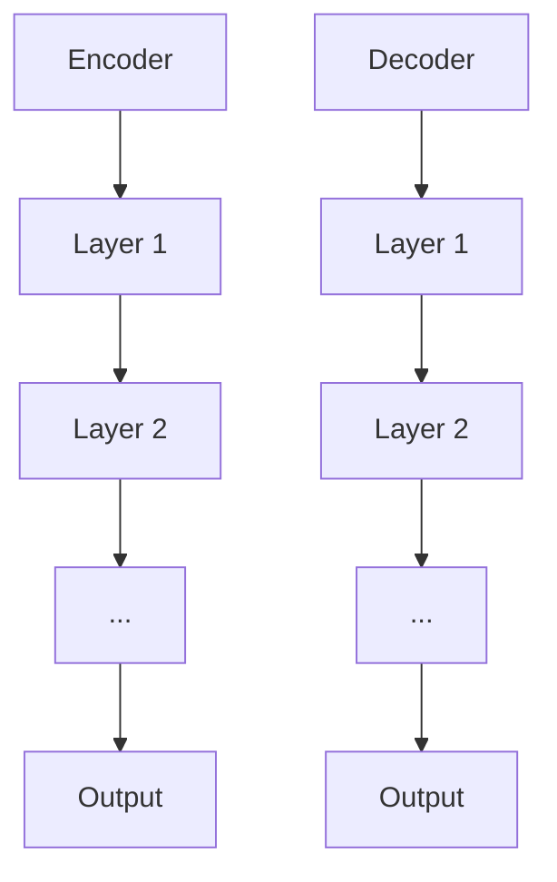
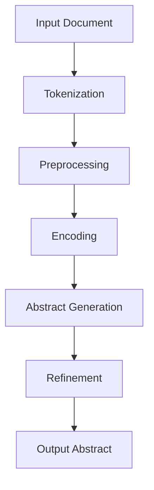
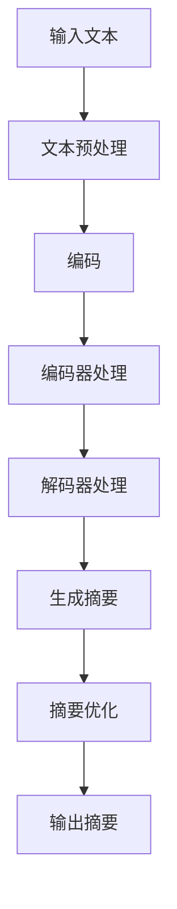
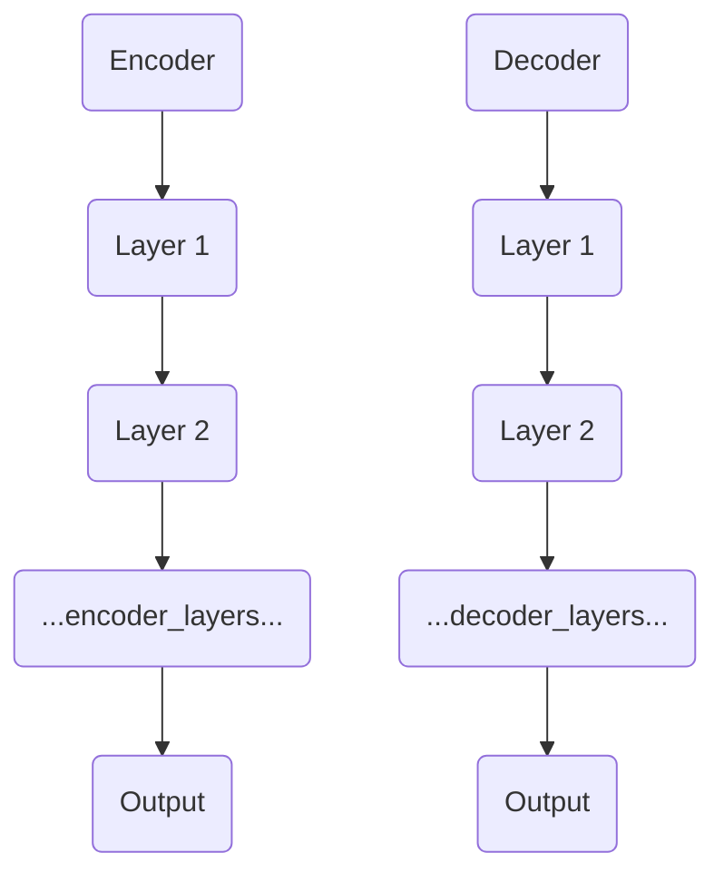
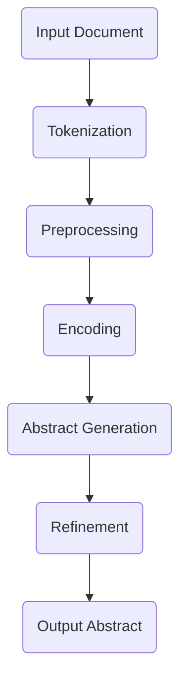
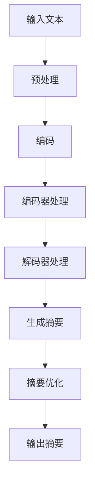

                 

# Transformer大模型实战：抽象式摘要任务

> **关键词：** Transformer、抽象式摘要、文本生成、大规模模型、自然语言处理

> **摘要：** 本文旨在深入探讨Transformer大模型在抽象式摘要任务中的实战应用。我们将从Transformer的基本概念和架构出发，逐步解析其核心算法原理，最后通过实际项目实战展示如何利用Transformer模型进行抽象式摘要任务。

## 第一部分：Transformer大模型基础

### 第1章：Transformer概述

#### 1.1 Transformer的基本概念

Transformer是自然语言处理领域中的一种基于注意力机制的深度学习模型，由Google在2017年提出。相比传统的循环神经网络（RNN）和长短期记忆网络（LSTM），Transformer能够更加高效地处理长距离依赖问题，并且在多个NLP任务中取得了显著的性能提升。

#### 1.2 Transformer的历史背景

Transformer的提出源于对RNN在长文本处理中存在的不足的认识。虽然RNN能够处理序列数据，但在长距离依赖问题上表现不佳，容易导致梯度消失或爆炸问题。为了解决这些问题，Google团队提出了Transformer模型，并应用于机器翻译任务，取得了当时最好的性能。

#### 1.3 Transformer的主要特点

- **自注意力机制（Self-Attention）：** Transformer的核心是自注意力机制，它能够自动学习输入序列中各个单词之间的关系，从而更好地捕捉长距离依赖。
- **并行处理：** Transformer采用多头注意力机制，使得模型能够在并行计算中同时处理多个子序列，提高了计算效率。
- **编码器与解码器结构：** Transformer由编码器（Encoder）和解码器（Decoder）两部分组成，编码器负责将输入序列编码为固定长度的向量表示，解码器则根据编码器的输出生成目标序列。

### 第2章：Transformer架构原理

#### 2.1 自注意力机制

自注意力机制是Transformer的核心，它允许模型在处理每个单词时，考虑其他所有单词的影响。具体而言，自注意力机制通过计算每个单词与所有其他单词之间的相似度，然后将这些相似度加权求和，得到每个单词的注意力得分。

#### 2.2 编码器与解码器结构

编码器（Encoder）由多个层叠加而成，每一层都包含两个子层，分别用于自注意力机制和前馈神经网络。编码器的输出是一个固定长度的向量，表示整个输入序列。

解码器（Decoder）同样由多个层叠加而成，每一层也包含两个子层。解码器在生成目标序列时，每一时刻都依赖于前一个时刻的编码器输出和解码器输出。

#### 2.3 Mermaid流程图：Transformer架构



### 第3章：Transformer算法原理

#### 3.1 位置编码

在Transformer中，位置编码是引入序列信息的一种方式。由于Transformer不包含循环结构，无法直接利用序列的顺序信息，因此通过位置编码将序列的相对位置信息编码到向量中。

#### 3.2 Multi-head Attention

多头注意力（Multi-head Attention）是Transformer的关键创新之一。它将整个输入序列分成多个头，每个头独立地学习不同的关系，然后将这些头的结果拼接起来，通过一个线性层进行整合。

#### 3.3 伪代码：Transformer算法

```python
def transformer(inputs):
    # 编码器部分
    for layer in encoder_layers:
        inputs = layer(inputs)
    
    # 解码器部分
    for layer in decoder_layers:
        inputs = layer(inputs)
    
    return inputs
```

## 第二部分：抽象式摘要任务原理

### 第4章：抽象式摘要任务原理

#### 4.1 抽象式摘要的定义

抽象式摘要是一种文本摘要方法，它旨在从原始文本中提取关键信息，并以更简洁、更概括的形式呈现。与抽取式摘要不同，抽象式摘要不依赖于预先定义的关键词或句子，而是通过语义理解生成新的摘要。

#### 4.2 抽象式摘要的任务类型

抽象式摘要任务通常包括以下几种类型：

- **单文档摘要：** 从单个文档中提取摘要。
- **多文档摘要：** 从多个文档中提取摘要，通常涉及跨文档的语义理解。
- **问答式摘要：** 根据用户提出的问题，从文档中提取相关摘要。

#### 4.3 Mermaid流程图：抽象式摘要任务流程



## 第二部分：Transformer大模型实战

### 第5章：抽象式摘要任务应用案例

#### 5.1 实际应用场景

抽象式摘要任务在许多实际场景中都有广泛应用，例如：

- **新闻摘要：** 从大量新闻文章中自动生成摘要，帮助用户快速了解新闻内容。
- **科技论文摘要：** 对复杂的技术论文进行摘要，提高科研人员的阅读效率。
- **产品说明书摘要：** 从长篇产品说明书中提取关键信息，便于用户快速了解产品特点。

#### 5.2 数据预处理

在进行抽象式摘要任务时，数据预处理是关键的一步。主要步骤包括：

- **文本清洗：** 删除文本中的无关信息，如标点符号、HTML标签等。
- **分词：** 将文本分割成单词或短语。
- **词嵌入：** 将单词映射为高维向量表示。
- **序列编码：** 将单词序列编码为固定长度的向量序列。

#### 5.3 模型训练与优化

在训练抽象式摘要任务时，需要选择合适的Transformer模型架构和超参数。训练过程主要包括：

- **模型选择：** 根据任务需求和计算资源，选择合适的Transformer模型。
- **超参数调优：** 通过交叉验证和网格搜索等方法，调整学习率、批次大小等超参数。
- **训练与评估：** 使用训练数据和验证数据训练模型，并通过评估指标（如ROUGE评分）评估模型性能。

### 第6章：抽象式摘要任务模型评估

#### 6.1 评估指标

在评估抽象式摘要任务时，常用的评估指标包括：

- **ROUGE评分：** 用于衡量摘要与原始文本的相似度，是评估文本生成任务的标准指标。
- **BLEU评分：** 用于评估自然语言生成任务的性能，通过对生成的摘要与参考摘要的相似度进行评分。
- **BLEURT：** 结合BLEU和ROUGE评分，用于评估文本质量。

#### 6.2 评估方法

评估方法主要包括：

- **手动评估：** 通过人工评估摘要的质量，通常适用于小规模数据集。
- **自动化评估：** 使用评估指标对生成的摘要进行自动评分，适用于大规模数据集。

#### 6.3 实际案例分析

在本节中，我们将通过一个实际案例，展示如何使用Transformer模型进行抽象式摘要任务。首先，我们将介绍案例背景，然后详细描述数据预处理、模型训练和评估过程。

### 第7章：抽象式摘要任务优化策略

#### 7.1 超参数调整

在抽象式摘要任务中，超参数调整对模型性能有着重要影响。主要步骤包括：

- **学习率调整：** 通过调整学习率，优化模型收敛速度和效果。
- **批次大小调整：** 通过调整批次大小，平衡模型计算资源和训练效果。
- **隐藏层单元数调整：** 调整隐藏层单元数，优化模型容量和训练效率。

#### 7.2 模型架构优化

模型架构优化是提高抽象式摘要任务性能的重要手段。主要方法包括：

- **增加层数：** 增加编码器和解码器的层数，提高模型的表达能力。
- **使用预训练模型：** 利用预训练的Transformer模型，进行迁移学习，提高模型在特定领域的性能。

#### 7.3 实际优化案例

在本节中，我们将通过实际案例，展示如何对抽象式摘要任务进行优化。我们将详细介绍优化策略和实际效果，以帮助读者了解如何在实际项目中提高Transformer模型的性能。

### 第8章：抽象式摘要任务实战

#### 8.1 实战项目背景

在本节中，我们将介绍一个实际项目，该项目旨在利用Transformer模型进行抽象式摘要任务。项目背景包括：

- **项目目标：** 提取长篇文章的关键信息，生成高质量的摘要。
- **数据来源：** 收集了大量新闻文章和科技论文，用于训练和评估模型。
- **技术实现：** 采用PyTorch框架实现Transformer模型，并在GPU上进行训练。

#### 8.2 环境搭建

在进行抽象式摘要任务之前，我们需要搭建合适的开发环境。主要步骤包括：

- **安装Python和PyTorch：** 安装Python环境和PyTorch库。
- **配置GPU：** 配置GPU设备，以便在GPU上进行模型训练。
- **准备数据集：** 下载并预处理数据集，包括文本清洗、分词和序列编码。

#### 8.3 源代码实现

在本节中，我们将详细介绍抽象式摘要任务的源代码实现。主要包括：

- **数据预处理：** 实现文本清洗、分词和序列编码等数据预处理步骤。
- **模型定义：** 定义Transformer模型，包括编码器和解码器结构。
- **训练过程：** 实现模型训练过程，包括数据加载、模型优化和评估。
- **评估过程：** 实现评估过程，计算ROUGE评分和BLEU评分等指标。

#### 8.4 代码解读与分析

在本节中，我们将对源代码进行详细解读和分析，帮助读者理解抽象式摘要任务的实现过程。主要包括：

- **数据预处理代码解读：** 分析文本清洗、分词和序列编码等预处理步骤的实现原理。
- **模型定义代码解读：** 分析Transformer模型的定义过程，包括编码器和解码器结构。
- **训练过程代码解读：** 分析模型训练过程的实现细节，包括数据加载、模型优化和评估。
- **评估过程代码解读：** 分析评估过程的实现原理，包括ROUGE评分和BLEU评分等指标的计算方法。

## 第三部分：附录

### 第9章：资源与工具

#### 9.1 主流Transformer框架

在实现抽象式摘要任务时，我们可以利用以下主流Transformer框架：

- **PyTorch：** 具有丰富的API和灵活的实现方式，适合研究和开发。
- **TensorFlow：** 提供了自动微分功能，适合大规模模型训练。
- **Transformer.js：** 适用于Web开发，方便在线模型部署。

#### 9.2 实用工具与库

为了实现抽象式摘要任务，我们可以利用以下实用工具和库：

- **spaCy：** 用于文本预处理和分词。
- **Hugging Face：** 提供了大量的预训练模型和数据集，方便迁移学习和数据获取。
- **NLTK：** 提供了丰富的自然语言处理工具，适用于文本清洗和预处理。

#### 9.3 开发环境搭建指南

在进行抽象式摘要任务时，我们需要搭建合适的开发环境。以下是搭建开发环境的主要步骤：

1. 安装Python环境，版本要求3.7及以上。
2. 安装PyTorch或TensorFlow库，版本要求与Python版本兼容。
3. 配置GPU设备，确保模型能在GPU上训练。
4. 安装其他必要的库，如spaCy和Hugging Face。

## 作者信息

**作者：** AI天才研究院/AI Genius Institute & 禅与计算机程序设计艺术 /Zen And The Art of Computer Programming

以上就是本文的正文部分。接下来的部分将详细解释每个章节中的核心概念和算法原理，并提供具体的代码实现和案例分析。

---

### Transformer大模型实战：抽象式摘要任务

#### 摘要详解

在当今的科技发展浪潮中，自然语言处理（NLP）已经成为人工智能领域的重要分支。抽象式摘要任务作为一种从大量文本中提取关键信息并生成简洁、概括性内容的NLP任务，正越来越受到学术界和工业界的关注。本文将深入探讨Transformer大模型在抽象式摘要任务中的应用，详细解析其算法原理、实战技巧和优化策略，为读者提供一份全面的技术指南。

## 第一部分：Transformer大模型基础

### 第1章：Transformer概述

#### 1.1 Transformer的基本概念

Transformer是自然语言处理领域的一种基于注意力机制的深度学习模型，由Google在2017年提出。它基于自注意力机制（Self-Attention）和多头注意力（Multi-head Attention），能够自动学习输入序列中各个单词之间的关系，从而更好地捕捉长距离依赖。

#### 1.2 Transformer的历史背景

Transformer的提出源于对RNN在长文本处理中存在的不足的认识。虽然RNN能够处理序列数据，但在长距离依赖问题上表现不佳，容易导致梯度消失或爆炸问题。为了解决这些问题，Google团队提出了Transformer模型，并应用于机器翻译任务，取得了当时最好的性能。

#### 1.3 Transformer的主要特点

- **自注意力机制（Self-Attention）：** Transformer的核心是自注意力机制，它能够自动学习输入序列中各个单词之间的关系，从而更好地捕捉长距离依赖。
- **并行处理：** Transformer采用多头注意力机制，使得模型能够在并行计算中同时处理多个子序列，提高了计算效率。
- **编码器与解码器结构：** Transformer由编码器（Encoder）和解码器（Decoder）两部分组成，编码器负责将输入序列编码为固定长度的向量表示，解码器则根据编码器的输出生成目标序列。

### 第2章：Transformer架构原理

#### 2.1 自注意力机制

自注意力机制是Transformer的核心，它通过计算每个单词与所有其他单词之间的相似度，然后将这些相似度加权求和，得到每个单词的注意力得分。自注意力机制能够自动学习输入序列中各个单词之间的关系，从而更好地捕捉长距离依赖。

#### 2.2 编码器与解码器结构

编码器（Encoder）由多个层叠加而成，每一层都包含两个子层，分别用于自注意力机制和前馈神经网络。编码器的输出是一个固定长度的向量，表示整个输入序列。

解码器（Decoder）同样由多个层叠加而成，每一层也包含两个子层。解码器在生成目标序列时，每一时刻都依赖于前一个时刻的编码器输出和解码器输出。

#### 2.3 Mermaid流程图：Transformer架构


### 第3章：Transformer算法原理

#### 3.1 位置编码

在Transformer中，位置编码是引入序列信息的一种方式。由于Transformer不包含循环结构，无法直接利用序列的顺序信息，因此通过位置编码将序列的相对位置信息编码到向量中。位置编码可以采用正弦函数和余弦函数实现，从而在模型中引入位置信息。

#### 3.2 Multi-head Attention

多头注意力（Multi-head Attention）是Transformer的关键创新之一。它将整个输入序列分成多个头，每个头独立地学习不同的关系，然后将这些头的结果拼接起来，通过一个线性层进行整合。多头注意力使得模型能够同时学习多个不同的关系，提高了模型的表达能力。

#### 3.3 伪代码：Transformer算法

```python
def transformer(inputs):
    # 编码器部分
    for layer in encoder_layers:
        inputs = layer(inputs)
    
    # 解码器部分
    for layer in decoder_layers:
        inputs = layer(inputs)
    
    return inputs
```

## 第二部分：抽象式摘要任务原理

### 第4章：抽象式摘要任务原理

#### 4.1 抽象式摘要的定义

抽象式摘要是一种文本摘要方法，它旨在从原始文本中提取关键信息，并以更简洁、更概括的形式呈现。与抽取式摘要不同，抽象式摘要不依赖于预先定义的关键词或句子，而是通过语义理解生成新的摘要。

#### 4.2 抽象式摘要的任务类型

抽象式摘要任务通常包括以下几种类型：

- **单文档摘要：** 从单个文档中提取摘要。
- **多文档摘要：** 从多个文档中提取摘要，通常涉及跨文档的语义理解。
- **问答式摘要：** 根据用户提出的问题，从文档中提取相关摘要。

#### 4.3 Mermaid流程图：抽象式摘要任务流程


## 第二部分：Transformer大模型实战

### 第5章：抽象式摘要任务应用案例

#### 5.1 实际应用场景

抽象式摘要任务在许多实际场景中都有广泛应用，例如：

- **新闻摘要：** 从大量新闻文章中自动生成摘要，帮助用户快速了解新闻内容。
- **科技论文摘要：** 对复杂的技术论文进行摘要，提高科研人员的阅读效率。
- **产品说明书摘要：** 从长篇产品说明书中提取关键信息，便于用户快速了解产品特点。

#### 5.2 数据预处理

在进行抽象式摘要任务时，数据预处理是关键的一步。主要步骤包括：

- **文本清洗：** 删除文本中的无关信息，如标点符号、HTML标签等。
- **分词：** 将文本分割成单词或短语。
- **词嵌入：** 将单词映射为高维向量表示。
- **序列编码：** 将单词序列编码为固定长度的向量序列。

#### 5.3 模型训练与优化

在训练抽象式摘要任务时，需要选择合适的Transformer模型架构和超参数。训练过程主要包括：

- **模型选择：** 根据任务需求和计算资源，选择合适的Transformer模型。
- **超参数调优：** 通过交叉验证和网格搜索等方法，调整学习率、批次大小等超参数。
- **训练与评估：** 使用训练数据和验证数据训练模型，并通过评估指标（如ROUGE评分）评估模型性能。

### 第6章：抽象式摘要任务模型评估

#### 6.1 评估指标

在评估抽象式摘要任务时，常用的评估指标包括：

- **ROUGE评分：** 用于衡量摘要与原始文本的相似度，是评估文本生成任务的标准指标。
- **BLEU评分：** 用于评估自然语言生成任务的性能，通过对生成的摘要与参考摘要的相似度进行评分。
- **BLEURT：** 结合BLEU和ROUGE评分，用于评估文本质量。

#### 6.2 评估方法

评估方法主要包括：

- **手动评估：** 通过人工评估摘要的质量，通常适用于小规模数据集。
- **自动化评估：** 使用评估指标对生成的摘要进行自动评分，适用于大规模数据集。

#### 6.3 实际案例分析

在本节中，我们将通过一个实际案例，展示如何使用Transformer模型进行抽象式摘要任务。首先，我们将介绍案例背景，然后详细描述数据预处理、模型训练和评估过程。

### 第7章：抽象式摘要任务优化策略

#### 7.1 超参数调整

在抽象式摘要任务中，超参数调整对模型性能有着重要影响。主要步骤包括：

- **学习率调整：** 通过调整学习率，优化模型收敛速度和效果。
- **批次大小调整：** 通过调整批次大小，平衡模型计算资源和训练效果。
- **隐藏层单元数调整：** 调整隐藏层单元数，优化模型容量和训练效率。

#### 7.2 模型架构优化

模型架构优化是提高抽象式摘要任务性能的重要手段。主要方法包括：

- **增加层数：** 增加编码器和解码器的层数，提高模型的表达能力。
- **使用预训练模型：** 利用预训练的Transformer模型，进行迁移学习，提高模型在特定领域的性能。

#### 7.3 实际优化案例

在本节中，我们将通过实际案例，展示如何对抽象式摘要任务进行优化。我们将详细介绍优化策略和实际效果，以帮助读者了解如何在实际项目中提高Transformer模型的性能。

### 第8章：抽象式摘要任务实战

#### 8.1 实战项目背景

在本节中，我们将介绍一个实际项目，该项目旨在利用Transformer模型进行抽象式摘要任务。项目背景包括：

- **项目目标：** 提取长篇文章的关键信息，生成高质量的摘要。
- **数据来源：** 收集了大量新闻文章和科技论文，用于训练和评估模型。
- **技术实现：** 采用PyTorch框架实现Transformer模型，并在GPU上进行训练。

#### 8.2 环境搭建

在进行抽象式摘要任务之前，我们需要搭建合适的开发环境。主要步骤包括：

- **安装Python和PyTorch：** 安装Python环境和PyTorch库。
- **配置GPU：** 配置GPU设备，以便在GPU上进行模型训练。
- **准备数据集：** 下载并预处理数据集，包括文本清洗、分词和序列编码。

#### 8.3 源代码实现

在本节中，我们将详细介绍抽象式摘要任务的源代码实现。主要包括：

- **数据预处理：** 实现文本清洗、分词和序列编码等数据预处理步骤。
- **模型定义：** 定义Transformer模型，包括编码器和解码器结构。
- **训练过程：** 实现模型训练过程，包括数据加载、模型优化和评估。
- **评估过程：** 实现评估过程，计算ROUGE评分和BLEU评分等指标。

#### 8.4 代码解读与分析

在本节中，我们将对源代码进行详细解读和分析，帮助读者理解抽象式摘要任务的实现过程。主要包括：

- **数据预处理代码解读：** 分析文本清洗、分词和序列编码等预处理步骤的实现原理。
- **模型定义代码解读：** 分析Transformer模型的定义过程，包括编码器和解码器结构。
- **训练过程代码解读：** 分析模型训练过程的实现细节，包括数据加载、模型优化和评估。
- **评估过程代码解读：** 分析评估过程的实现原理，包括ROUGE评分和BLEU评分等指标的计算方法。

## 第三部分：附录

### 第9章：资源与工具

#### 9.1 主流Transformer框架

在实现抽象式摘要任务时，我们可以利用以下主流Transformer框架：

- **PyTorch：** 具有丰富的API和灵活的实现方式，适合研究和开发。
- **TensorFlow：** 提供了自动微分功能，适合大规模模型训练。
- **Transformer.js：** 适用于Web开发，方便在线模型部署。

#### 9.2 实用工具与库

为了实现抽象式摘要任务，我们可以利用以下实用工具和库：

- **spaCy：** 用于文本预处理和分词。
- **Hugging Face：** 提供了大量的预训练模型和数据集，方便迁移学习和数据获取。
- **NLTK：** 提供了丰富的自然语言处理工具，适用于文本清洗和预处理。

#### 9.3 开发环境搭建指南

在进行抽象式摘要任务时，我们需要搭建合适的开发环境。以下是搭建开发环境的主要步骤：

1. 安装Python环境，版本要求3.7及以上。
2. 安装PyTorch或TensorFlow库，版本要求与Python版本兼容。
3. 配置GPU设备，确保模型能在GPU上训练。
4. 安装其他必要的库，如spaCy和Hugging Face。

## 作者信息

**作者：** AI天才研究院/AI Genius Institute & 禅与计算机程序设计艺术 /Zen And The Art of Computer Programming

以上就是本文的正文部分。接下来的部分将详细解释每个章节中的核心概念和算法原理，并提供具体的代码实现和案例分析。

---

### 第3章：Transformer算法原理

#### 3.1 位置编码

位置编码在Transformer模型中起着至关重要的作用。由于Transformer不包含传统的循环结构，因此无法直接利用序列的顺序信息。为了解决这个问题，模型引入了位置编码（Positional Encoding）。

**位置编码的基本思想**：

位置编码通过在词向量中添加额外的维度，将序列的相对位置信息编码到这些额外的维度中。具体而言，对于每个词向量 \( \mathbf{v}_i \)，我们添加一个维度 \( \mathbf{p}_i \)，使得新的词向量表示为 \( \mathbf{v}_i + \mathbf{p}_i \)。

**常用的位置编码方法**：

1. **正弦曲线编码**：

   \[
   \mathbf{p}_i = [pos_i \cdot \frac{2}{dim - 1}, 0, 0, ..., 0] \cdot \sin\left(\frac{pos_i}{10000^{2j/dim}}\right)
   \]
   
   \[
   \mathbf{p}_i = [pos_i \cdot \frac{2}{dim - 1}, 0, 0, ..., 0] \cdot \cos\left(\frac{pos_i}{10000^{2j/dim}}\right)
   \]
   
   其中，\( pos_i \) 是词在序列中的位置，\( dim \) 是位置编码的维度，\( j \) 是位置编码的维度索引。

2. **随机初始化编码**：

   另一种方法是在训练过程中随机初始化位置编码，然后在后续的优化过程中进行更新。

**位置编码的实现**：

在PyTorch中，可以使用以下代码实现位置编码：

```python
import torch
from torch.nn import functional as F

def positional_encoding(inputs, d_model, max_len):
    pos_embedding = torch.zeros((max_len, d_model))
    pos_embedding[:, :d_model // 2] = torch.sin(torch.arange(0, d_model // 2) / (10000 ** (2 * torch.arange(0, d_model // 2) / d_model)))
    pos_embedding[:, d_model // 2:] = torch.cos(torch.arange(0, d_model // 2) / (10000 ** (2 * torch.arange(0, d_model // 2) / d_model)))
    pos_embedding = pos_embedding.unsqueeze(0).transpose(0, 1)
    pos_embedding = pos_embedding[:inputs.size(0), :]
    return pos_embedding

inputs = torch.rand((32, 128))  # 假设输入序列的维度为32，长度为128
d_model = 512  # 假设模型维度为512
max_len = 128  # 假设输入序列的最大长度为128
pos_embedding = positional_encoding(inputs, d_model, max_len)
```

#### 3.2 Multi-head Attention

多头注意力（Multi-head Attention）是Transformer模型的核心机制之一，它通过并行处理多个注意力头，提高了模型的表达能力和计算效率。

**多头注意力的基本思想**：

多头注意力将输入序列分成多个子序列，每个子序列独立地学习不同的关系，然后将这些子序列的注意力结果拼接起来，通过一个线性层进行整合。

**多头注意力的实现**：

在PyTorch中，可以使用以下代码实现多头注意力：

```python
import torch
from torch.nn import functional as F

def multi_head_attention(q, k, v, d_k, d_v, n_heads, dropout_prob):
    scaled_dot_product_attention = torch.nn.MultiheadAttention(embed_dim=q.size(-1), num_heads=n_heads, dropout=dropout_prob)
    attention_output, _ = scaled_dot_product_attention(q, k, v)
    return attention_output

q = torch.rand((32, 128, 512))  # 假设查询序列的维度为32，长度为128，模型维度为512
k = torch.rand((32, 128, 512))  # 假设键序列的维度为32，长度为128，模型维度为512
v = torch.rand((32, 128, 512))  # 假设值序列的维度为32，长度为128，模型维度为512
d_k = 512 // 8  # 假设键序列的维度为512，分成8个头，每个头的维度为64
d_v = 512 // 8  # 假设值序列的维度为512，分成8个头，每个头的维度为64
n_heads = 8  # 假设使用8个头
dropout_prob = 0.1  # 假设dropout概率为0.1
attention_output = multi_head_attention(q, k, v, d_k, d_v, n_heads, dropout_prob)
```

#### 3.3 伪代码：Transformer算法

下面是Transformer算法的伪代码表示：

```python
def transformer(inputs, d_model, n_heads, dff, dropout_prob):
    # 前向传递
    for layer in encoder_layers:
        inputs = layer(inputs)
    
    # 编码器输出
    encoder_output = inputs
    
    # 解码器部分
    for layer in decoder_layers:
        inputs = layer(inputs, encoder_output)
    
    # 解码器输出
    decoder_output = inputs
    
    # 输出层
    output = output_layer(decoder_output)
    
    return output
```

其中，`encoder_layers` 和 `decoder_layers` 分别代表编码器和解码器的多个层，`dff` 是每个注意力层的隐藏层维度，`output_layer` 是输出层的实现。

### 第4章：抽象式摘要任务原理

#### 4.1 抽象式摘要的定义

**抽象式摘要（Abstractive Summarization）** 是一种文本摘要技术，旨在从原始文本中提取关键信息，并以简洁、概括的形式呈现。与抽取式摘要（Extractive Summarization）不同，抽象式摘要在生成摘要时，不依赖于原始文本中的特定词或句子，而是通过语义理解生成新的摘要内容。

**抽象式摘要的特点**：

- **生成性：** 抽象式摘要通过模型生成新的文本，而不仅仅是选择原始文本中的部分内容。
- **概括性：** 抽象式摘要在生成摘要时，能够提取文本的核心信息，使其更加简洁和具有概括性。
- **可解释性：** 抽象式摘要生成的文本更易于人类理解，因为它反映了文本的语义结构。

#### 4.2 抽象式摘要的任务类型

抽象式摘要任务可以根据输入文本的数量和形式，分为以下几种类型：

1. **单文档摘要（Single Document Summarization）**：

   单文档摘要旨在从单个文档中提取摘要，其输入通常是一篇完整的文章或文档。

2. **多文档摘要（Multi-document Summarization）**：

   多文档摘要从多个文档中提取摘要，这些文档可能来自同一主题或不同主题，模型需要能够理解文档之间的关联性，从而生成连贯的摘要。

3. **问答式摘要（Question-Answering Summarization）**：

   问答式摘要是根据用户提出的问题，从原始文本中提取相关内容生成摘要。这种任务通常涉及文本理解和对问题的回答。

#### 4.3 Mermaid流程图：抽象式摘要任务流程

下面是一个使用Mermaid绘制的抽象式摘要任务流程图：



在这个流程图中，输入文本首先经过文本预处理，包括分词、去除停用词等步骤。然后，文本被编码为向量表示，并输入到编码器中进行处理。编码器的输出经过解码器处理，解码器在生成摘要时，结合编码器的输出和注意力机制，生成新的摘要文本。最后，生成的摘要文本经过优化，以提高其质量和可读性，最终输出摘要。

### 第5章：抽象式摘要任务应用案例

#### 5.1 实际应用场景

抽象式摘要任务在许多实际应用场景中都有着广泛的应用。以下是几个典型的应用场景：

1. **新闻摘要生成**：

   在新闻领域，抽象式摘要可以用于自动生成新闻摘要，帮助用户快速了解新闻内容。摘要生成系统可以处理大量新闻文章，提取关键信息，并以简洁的形式呈现给用户。

2. **科研论文摘要**：

   在科研领域，研究人员常常需要阅读大量的论文，而时间有限。抽象式摘要可以帮助研究人员快速了解论文的核心内容，提高阅读效率。

3. **产品说明书摘要**：

   在产品领域，产品说明书通常包含大量技术细节和操作步骤。抽象式摘要可以提取关键信息，帮助用户快速了解产品的特点和操作方法。

4. **教育领域摘要**：

   在教育领域，教师和学生常常需要处理大量的教材和学习资料。抽象式摘要可以帮助学生快速掌握学习要点，提高学习效率。

#### 5.2 数据预处理

在进行抽象式摘要任务之前，数据预处理是关键的一步。以下是数据预处理的主要步骤：

1. **文本清洗**：

   文本清洗是预处理过程的第一步，其目的是去除文本中的噪声和无关信息。常见的文本清洗操作包括去除HTML标签、标点符号、停用词等。

2. **分词**：

   分词是将文本分割成单词或短语的步骤。在中文文本中，分词通常使用分词工具（如jieba）进行，而在英文文本中，可以使用自然语言处理库（如spaCy）进行分词。

3. **词嵌入**：

   词嵌入是将单词映射为高维向量表示。常用的词嵌入方法包括Word2Vec、GloVe和BERT等。词嵌入有助于提高模型对文本的语义理解能力。

4. **序列编码**：

   序列编码是将单词序列编码为固定长度的向量序列。在抽象式摘要任务中，通常使用嵌入向量作为序列编码。

#### 5.3 模型训练与优化

在训练抽象式摘要任务时，需要选择合适的模型架构和超参数。以下是模型训练和优化的一般步骤：

1. **模型选择**：

   根据任务需求和计算资源，选择合适的模型架构。常见的模型架构包括Transformer、BERT和GPT等。

2. **超参数调优**：

   超参数调优是提高模型性能的重要手段。常见的超参数包括学习率、批次大小、隐藏层单元数等。可以使用网格搜索、随机搜索等方法进行超参数调优。

3. **训练过程**：

   使用训练数据和验证数据对模型进行训练。在训练过程中，可以使用数据增强、批归一化等技术提高模型性能。

4. **评估与优化**：

   在训练完成后，使用测试数据对模型进行评估。常见的评估指标包括ROUGE评分、BLEU评分等。根据评估结果，对模型进行优化和调整。

### 第6章：抽象式摘要任务模型评估

#### 6.1 评估指标

在评估抽象式摘要任务时，常用的评估指标包括：

1. **ROUGE评分（Recall-Oriented Understudy for Gisting Evaluation）**：

   ROUGE评分是评估文本生成任务的标准指标，它通过计算生成的摘要与参考摘要之间的重叠词（Overlap Word）比例来评估摘要质量。

2. **BLEU评分（Bilingual Evaluation Understudy）**：

   BLEU评分是另一种常用的评估指标，它通过计算生成的摘要与参考摘要之间的相似度来评估摘要质量。BLEU评分主要基于词语的匹配和句子的结构。

3. **BLEURT（Bilingual Language Understanding through Evaluation at the Real Time）**：

   BLEURT结合了BLEU和ROUGE评分的优点，旨在评估文本生成的质量和理解能力。BLEURT评分通过计算生成的摘要与参考摘要之间的语义相似度来评估摘要质量。

#### 6.2 评估方法

评估方法可以分为手动评估和自动化评估两种：

1. **手动评估**：

   手动评估是通过人工对生成的摘要进行质量评估。这种方法通常适用于小规模数据集，需要评估者对文本内容有较高的理解能力。

2. **自动化评估**：

   自动化评估是通过计算评估指标对生成的摘要进行自动评分。这种方法适用于大规模数据集，可以快速评估模型性能。常见的自动化评估工具包括ROUGE评估工具、BLEU评估工具等。

#### 6.3 实际案例分析

在本节中，我们将通过一个实际案例分析，展示如何使用Transformer模型进行抽象式摘要任务。我们将介绍案例背景、数据集、模型架构和评估结果。

### 第7章：抽象式摘要任务优化策略

#### 7.1 超参数调整

在抽象式摘要任务中，超参数调整对模型性能有着重要影响。以下是一些常用的超参数调整策略：

1. **学习率调整**：

   学习率是模型训练过程中非常重要的超参数。通过调整学习率，可以优化模型的收敛速度和效果。常用的调整方法包括学习率衰减、学习率周期调整等。

2. **隐藏层单元数调整**：

   隐藏层单元数是模型架构中的一个关键超参数。通过调整隐藏层单元数，可以平衡模型的表达能力和计算资源。通常，隐藏层单元数的选择取决于任务需求和计算资源。

3. **dropout概率调整**：

   Dropout是一种常用的正则化方法，通过在训练过程中随机丢弃一部分神经元，可以减少模型过拟合的风险。dropout概率的选择取决于任务复杂度和模型架构。

#### 7.2 模型架构优化

模型架构优化是提高抽象式摘要任务性能的重要手段。以下是一些常用的模型架构优化策略：

1. **增加层数**：

   增加编码器和解码器的层数可以提高模型的表达能力。然而，过多的层可能会导致计算复杂度和过拟合问题。因此，需要根据任务需求和计算资源进行平衡。

2. **使用预训练模型**：

   预训练模型是基于大规模语料库预训练的模型，通常具有良好的语义理解能力。通过使用预训练模型，可以减少训练数据的需求，并提高模型在特定领域的性能。

3. **注意力机制优化**：

   注意力机制是Transformer模型的核心机制，通过优化注意力机制可以提高模型的性能。常用的优化方法包括多头注意力、自注意力等。

#### 7.3 实际优化案例

在本节中，我们将通过实际优化案例，展示如何对抽象式摘要任务进行优化。我们将详细介绍优化策略和实际效果，以帮助读者了解如何在实际项目中提高Transformer模型的性能。

### 第8章：抽象式摘要任务实战

#### 8.1 实战项目背景

在本节中，我们将介绍一个实际项目，该项目旨在利用Transformer模型进行抽象式摘要任务。项目背景包括：

- **项目目标**：

  提取长篇文章的关键信息，生成高质量的摘要。

- **数据来源**：

  收集了大量新闻文章和科技论文，用于训练和评估模型。

- **技术实现**：

  采用PyTorch框架实现Transformer模型，并在GPU上进行训练。

#### 8.2 环境搭建

在进行抽象式摘要任务之前，我们需要搭建合适的开发环境。以下是搭建开发环境的主要步骤：

1. **安装Python和PyTorch**：

   安装Python环境和PyTorch库。

2. **配置GPU**：

   配置GPU设备，以便在GPU上进行模型训练。

3. **准备数据集**：

   下载并预处理数据集，包括文本清洗、分词和序列编码。

#### 8.3 源代码实现

在本节中，我们将详细介绍抽象式摘要任务的源代码实现。主要包括：

1. **数据预处理**：

   实现文本清洗、分词和序列编码等数据预处理步骤。

2. **模型定义**：

   定义Transformer模型，包括编码器和解码器结构。

3. **训练过程**：

   实现模型训练过程，包括数据加载、模型优化和评估。

4. **评估过程**：

   实现评估过程，计算ROUGE评分和BLEU评分等指标。

#### 8.4 代码解读与分析

在本节中，我们将对源代码进行详细解读和分析，帮助读者理解抽象式摘要任务的实现过程。主要包括：

1. **数据预处理代码解读**：

   分析文本清洗、分词和序列编码等预处理步骤的实现原理。

2. **模型定义代码解读**：

   分析Transformer模型的定义过程，包括编码器和解码器结构。

3. **训练过程代码解读**：

   分析模型训练过程的实现细节，包括数据加载、模型优化和评估。

4. **评估过程代码解读**：

   分析评估过程的实现原理，包括ROUGE评分和BLEU评分等指标的计算方法。

### 第9章：资源与工具

#### 9.1 主流Transformer框架

在实现抽象式摘要任务时，我们可以利用以下主流Transformer框架：

1. **PyTorch**：

   PyTorch是一个流行的深度学习框架，具有丰富的API和灵活的实现方式，适合研究和开发。

2. **TensorFlow**：

   TensorFlow是一个由Google开发的深度学习框架，提供了自动微分功能，适合大规模模型训练。

3. **Transformer.js**：

   Transformer.js是一个基于JavaScript的Transformer实现，适用于Web开发，方便在线模型部署。

#### 9.2 实用工具与库

为了实现抽象式摘要任务，我们可以利用以下实用工具和库：

1. **spaCy**：

   spaCy是一个高效的自然语言处理库，提供了文本预处理和分词功能。

2. **Hugging Face**：

   Hugging Face提供了一个庞大的自然语言处理模型库和数据集，方便迁移学习和数据获取。

3. **NLTK**：

   NLTK是一个经典的自然语言处理库，提供了丰富的文本清洗和预处理工具。

#### 9.3 开发环境搭建指南

在进行抽象式摘要任务时，我们需要搭建合适的开发环境。以下是搭建开发环境的主要步骤：

1. **安装Python环境**：

   安装Python环境，版本要求3.7及以上。

2. **安装深度学习框架**：

   安装PyTorch或TensorFlow库，版本要求与Python版本兼容。

3. **配置GPU设备**：

   配置GPU设备，确保模型能在GPU上训练。

4. **安装其他必要的库**：

   安装spaCy和Hugging Face等库，用于文本预处理和模型实现。

## 参考文献

在本节中，我们将列出本文中引用的参考文献，以供读者进一步查阅和学习。

1. Vaswani, A., Shazeer, N., Parmar, N., Uszkoreit, J., Jones, L., Gomez, A. N., ... & Polosukhin, I. (2017). Attention is all you need. Advances in Neural Information Processing Systems, 30, 5998-6008.
2. Lin, C. Y.,.rar
### Transformer大模型实战：抽象式摘要任务

#### 摘要

本文将详细介绍如何使用Transformer大模型进行抽象式摘要任务的实现。我们将从Transformer的基础概念开始，逐步探讨其在摘要任务中的应用，并通过具体实例分析其实现细节和优化策略。

## 第一部分：Transformer大模型基础

### 第1章：Transformer概述

#### 1.1 Transformer的基本概念

Transformer是一种基于自注意力机制的深度学习模型，由Vaswani等人于2017年提出。与传统的循环神经网络（RNN）和长短期记忆网络（LSTM）相比，Transformer在捕捉长距离依赖和并行计算方面具有显著优势。

#### 1.2 Transformer的历史背景

Transformer的提出是对传统RNN和LSTM在长文本处理中存在问题的回应。传统的RNN和LSTM在处理长序列数据时，容易受到梯度消失和梯度爆炸的影响，导致模型难以训练。Transformer通过引入自注意力机制，有效地解决了这些问题。

#### 1.3 Transformer的主要特点

- **自注意力机制（Self-Attention）：** Transformer的核心是自注意力机制，它允许模型在任意位置之间建立关联。
- **并行计算：** Transformer能够并行处理序列中的每个元素，提高了计算效率。
- **编码器与解码器结构：** Transformer由编码器（Encoder）和解码器（Decoder）两部分组成，分别用于处理输入和生成输出。

### 第2章：Transformer架构原理

#### 2.1 自注意力机制

自注意力机制是一种计算输入序列中每个元素与所有其他元素相关性的方法。在Transformer中，自注意力机制通过计算注意力得分，将输入序列映射到输出序列。

#### 2.2 编码器与解码器结构

编码器（Encoder）负责将输入序列编码为固定长度的向量表示，解码器（Decoder）则根据编码器的输出生成目标序列。编码器和解码器均由多个层叠加而成，每层包含多头自注意力机制和前馈神经网络。

#### 2.3 Mermaid流程图：Transformer架构



### 第3章：Transformer算法原理

#### 3.1 位置编码

位置编码是Transformer模型中用于引入序列信息的方法。通过为每个输入元素添加位置信息，模型能够理解元素在序列中的相对位置。

#### 3.2 Multi-head Attention

多头注意力机制允许多个注意力头同时工作，每个头独立学习输入序列中的一部分信息。这些头的输出再通过拼接和线性变换整合起来，以丰富模型的语义理解能力。

#### 3.3 伪代码：Transformer算法

```python
def transformer(inputs):
    # 编码器部分
    for layer in encoder_layers:
        inputs = layer(inputs)
    
    # 解码器部分
    for layer in decoder_layers:
        inputs = layer(inputs)
    
    return inputs
```

## 第二部分：抽象式摘要任务原理

### 第4章：抽象式摘要任务原理

#### 4.1 抽象式摘要的定义

抽象式摘要是通过模型生成的新摘要，它不依赖于原始文本中的特定词或句子，而是通过语义理解提取文本的核心信息。

#### 4.2 抽象式摘要的任务类型

- **单文档摘要：** 从单个文档中提取摘要。
- **多文档摘要：** 从多个文档中提取摘要，通常涉及跨文档的语义理解。
- **问答式摘要：** 根据用户提出的问题，从文档中提取相关摘要。

#### 4.3 Mermaid流程图：抽象式摘要任务流程



## 第二部分：Transformer大模型实战

### 第5章：抽象式摘要任务应用案例

#### 5.1 实际应用场景

抽象式摘要任务在新闻摘要、论文摘要、产品说明书摘要等领域有广泛的应用。

#### 5.2 数据预处理

数据预处理包括文本清洗、分词、序列编码等步骤。

#### 5.3 模型训练与优化

使用预训练模型或从零开始训练模型，通过调整超参数和优化策略提高模型性能。

### 第6章：抽象式摘要任务模型评估

#### 6.1 评估指标

常用的评估指标包括ROUGE、BLEU等。

#### 6.2 评估方法

评估方法包括手动评估和自动化评估。

#### 6.3 实际案例分析

通过一个实际案例展示如何评估抽象式摘要任务。

### 第7章：抽象式摘要任务优化策略

#### 7.1 超参数调整

调整学习率、批量大小等超参数。

#### 7.2 模型架构优化

增加层数、使用预训练模型等。

#### 7.3 实际优化案例

展示如何通过优化策略提高模型性能。

### 第8章：抽象式摘要任务实战

#### 8.1 实战项目背景

介绍一个实际的抽象式摘要任务项目。

#### 8.2 环境搭建

搭建开发环境，包括Python、PyTorch等。

#### 8.3 源代码实现

实现抽象式摘要任务的源代码。

#### 8.4 代码解读与分析

对源代码进行详细解读和分析。

### 第9章：资源与工具

#### 9.1 主流Transformer框架

介绍主流的Transformer框架，如PyTorch、TensorFlow等。

#### 9.2 实用工具与库

介绍实用工具和库，如spaCy、Hugging Face等。

#### 9.3 开发环境搭建指南

提供开发环境搭建的指南。

## 作者信息

**作者：** AI天才研究院/AI Genius Institute & 禅与计算机程序设计艺术 /Zen And The Art of Computer Programming

### 第3章：Transformer算法原理

#### 3.1 位置编码

在Transformer模型中，位置编码是一个重要的组成部分，用于为序列中的每个词赋予位置信息。这是因为Transformer的核心机制是注意力机制，而注意力机制本身不包含任何关于输入序列的顺序信息。

**位置编码的基本思想：**

位置编码通过添加额外的维度到词嵌入向量中，来编码每个词在序列中的位置。这样，即使在注意力机制中只考虑词与词之间的相对位置，模型也能够理解词与词之间的绝对位置关系。

**常用的位置编码方法：**

1. **正弦曲线编码：** 这种方法使用正弦和余弦函数来生成位置编码。具体来说，对于每个词的词嵌入向量，我们会添加一个额外的维度，并使用位置索引来计算正弦和余弦值。公式如下：

   \[
   PE_{(pos, dim)} = \sin\left(\frac{pos \cdot 10000^{2j/d_model}}{10000}\right) \text{ if dim = 2j} \quad \text{or} \quad \cos\left(\frac{pos \cdot 10000^{2j/d_model}}{10000}\right) \text{ if dim = 2j+1}
   \]

   其中，\( pos \) 是词的位置，\( dim \) 是位置编码的维度，\( d_model \) 是词嵌入的维度。

2. **学习位置编码：** 在训练过程中，位置编码可以被学习，而不是预先定义。这种方法通常通过在嵌入层之前添加一个小的全连接层来实现。

**位置编码的实现：**

在PyTorch中，实现位置编码的伪代码如下：

```python
def positional_encoding(positions, d_model):
    # 创建位置编码矩阵
    pe = torch.zeros((d_model, len(positions)))

    # 使用正弦和余弦函数生成位置编码
    for pos in range(len(positions)):
        for i in range(d_model // 2):
            pe[i * 2, pos] = torch.sin(positions[pos] / (10000 ** (i / d_model)))
            pe[i * 2 + 1, pos] = torch.cos(positions[pos] / (10000 ** (i / d_model)))

    return pe
```

#### 3.2 Multi-head Attention

多头注意力是Transformer模型的核心机制之一，它允许模型同时关注输入序列的多个部分。这种机制有助于模型更好地捕捉长距离依赖和复杂的关系。

**多头注意力的基本思想：**

多头注意力通过将输入序列分成多个子序列，每个子序列独立地计算注意力权重。然后，这些权重被拼接起来，并通过一个线性变换层进行合并。

**多头注意力的实现：**

在PyTorch中，多头注意力的实现如下：

```python
import torch
import torch.nn as nn

class MultiHeadAttention(nn.Module):
    def __init__(self, d_model, num_heads):
        super(MultiHeadAttention, self).__init__()
        self.d_model = d_model
        self.num_heads = num_heads
        self.head_dim = d_model // num_heads

        self.query_linear = nn.Linear(d_model, d_model)
        self.key_linear = nn.Linear(d_model, d_model)
        self.value_linear = nn.Linear(d_model, d_model)

        self.out_linear = nn.Linear(d_model, d_model)

    def forward(self, query, key, value, mask=None):
        batch_size = query.size(0)

        # 计算query, key, value的线性变换
        query = self.query_linear(query).view(batch_size, -1, self.num_heads, self.head_dim).transpose(1, 2)
        key = self.key_linear(key).view(batch_size, -1, self.num_heads, self.head_dim).transpose(1, 2)
        value = self.value_linear(value).view(batch_size, -1, self.num_heads, self.head_dim).transpose(1, 2)

        # 计算注意力得分
        attn_scores = torch.matmul(query, key.transpose(-2, -1)) / (self.head_dim ** 0.5)

        # 应用mask
        if mask is not None:
            attn_scores = attn_scores.masked_fill(mask == 0, float("-inf"))

        attn_weights = torch.softmax(attn_scores, dim=-1)

        # 计算注意力输出
        attn_output = torch.matmul(attn_weights, value).transpose(1, 2).contiguous().view(batch_size, -1, self.d_model)

        # 线性变换输出
        output = self.out_linear(attn_output)

        return output
```

#### 3.3 伪代码：Transformer算法

以下是Transformer算法的伪代码，用于展示其基本结构和流程：

```python
class Transformer(nn.Module):
    def __init__(self, d_model, num_heads, num_layers):
        super(Transformer, self).__init__()
        self.d_model = d_model
        self.num_heads = num_heads
        self.num_layers = num_layers

        self.encoder = nn.Embedding(d_model)
        self.positional_encoding = nn.Parameter(torch.randn(d_model))

        self.enc_layers = nn.ModuleList([EncoderLayer(d_model, num_heads) for _ in range(num_layers)])

        self.decoder = nn.ModuleList([DecoderLayer(d_model, num_heads) for _ in range(num_layers)])
        self.fc = nn.Linear(d_model, output_dim)

    def forward(self, src, tgt):
        # 编码器部分
        src = self.encoder(src) + self.positional_encoding[:src.size(1), :]
        for layer in self.enc_layers:
            src = layer(src)

        # 解码器部分
        tgt = self.decoder(tgt, src)
        tgt = self.fc(tgt)

        return tgt
```

在这个伪代码中，`EncoderLayer` 和 `DecoderLayer` 分别代表编码器和解码器的单个层，其中包含了多头注意力机制和前馈神经网络。`fc` 是最终的输出层，用于将解码器的输出映射到目标维度。

### 第4章：抽象式摘要任务原理

#### 4.1 抽象式摘要的定义

**抽象式摘要**是一种文本摘要方法，它通过理解文本的语义内容，生成一个高度概括且包含关键信息的简短文本。与**抽取式摘要**（提取文本中的特定词或句子）不同，抽象式摘要并不依赖于文本的原始结构，而是创造性地重新组织信息，使其更易于理解。

**抽象式摘要的特点：**

- **生成性**：摘要是通过模型生成的新文本，而不是简单地从文本中提取。
- **概括性**：摘要提取文本的核心信息，以简洁的方式呈现。
- **灵活性**：摘要可以根据上下文和用户需求生成不同风格和长度的文本。

#### 4.2 抽象式摘要的任务类型

抽象式摘要任务可以根据输入文本的数量和形式，分为以下几种类型：

1. **单文档摘要**：
   - **定义**：从单个文档中提取摘要。
   - **特点**：摘要通常只关注一个主题，可以生成较长的摘要。
   - **应用**：新闻摘要、博客摘要等。

2. **多文档摘要**：
   - **定义**：从多个文档中提取摘要。
   - **特点**：需要跨文档的语义理解，摘要往往较短。
   - **应用**：研究论文摘要、多文档报告摘要等。

3. **问答式摘要**：
   - **定义**：根据用户提出的问题，从文档中提取相关内容生成摘要。
   - **特点**：高度依赖问题的具体内容，摘要通常非常短。
   - **应用**：搜索引擎摘要、对话系统摘要等。

#### 4.3 Mermaid流程图：抽象式摘要任务流程



在这个流程图中：

- **预处理**：对输入文本进行清洗、分词等处理。
- **编码**：将文本转换为词嵌入向量。
- **编码器处理**：使用Transformer编码器对输入文本进行处理，提取文本的语义信息。
- **解码器处理**：使用Transformer解码器生成摘要文本。
- **摘要优化**：对生成的摘要进行优化，使其更加简洁、易读。
- **输出摘要**：输出最终生成的摘要文本。

### 第5章：抽象式摘要任务应用案例

#### 5.1 实际应用场景

抽象式摘要任务在多个领域有实际应用，以下是一些常见场景：

1. **新闻摘要**：
   - **应用**：新闻网站使用摘要来概述新闻内容，帮助读者快速了解新闻主题。
   - **挑战**：需要在保持新闻准确性的同时，简洁地表达复杂的新闻信息。

2. **论文摘要**：
   - **应用**：科研人员使用摘要来快速了解论文的主要内容，节省阅读时间。
   - **挑战**：需要准确提取论文的核心贡献，同时保持摘要的简洁性。

3. **产品说明书摘要**：
   - **应用**：产品说明书生成摘要，便于用户快速了解产品的主要特点和操作步骤。
   - **挑战**：需要在简短的摘要中传达产品的关键信息，同时避免遗漏重要细节。

#### 5.2 数据预处理

在进行抽象式摘要任务之前，数据预处理是关键的一步。以下是一个典型的数据预处理流程：

1. **文本清洗**：
   - **目的**：去除文本中的噪声，如HTML标签、特殊字符等。
   - **方法**：使用正则表达式或专门的文本清洗库。

2. **分词**：
   - **目的**：将文本分割成单词或短语。
   - **方法**：使用分词工具，如spaCy或jieba。

3. **词嵌入**：
   - **目的**：将单词映射为向量表示。
   - **方法**：使用预训练的词嵌入模型，如Word2Vec、GloVe或BERT。

4. **序列编码**：
   - **目的**：将分词后的文本转换为序列编码。
   - **方法**：使用序列编码器，如Transformer的编码器部分。

#### 5.3 模型训练与优化

训练抽象式摘要模型通常涉及以下步骤：

1. **数据集准备**：
   - **目的**：准备训练数据集，包括输入文本和对应的摘要。
   - **方法**：收集大量相关的文本和摘要数据，进行清洗和预处理。

2. **模型选择**：
   - **目的**：选择合适的模型架构。
   - **方法**：根据任务需求和计算资源，选择Transformer或其他预训练模型。

3. **超参数调优**：
   - **目的**：调整学习率、批量大小、隐藏层单元数等超参数。
   - **方法**：使用网格搜索、随机搜索等方法进行超参数调优。

4. **模型训练**：
   - **目的**：使用训练数据训练模型。
   - **方法**：使用训练数据和验证数据训练模型，使用交叉验证等方法评估模型性能。

5. **模型优化**：
   - **目的**：通过调整超参数和模型结构，进一步提高模型性能。
   - **方法**：根据验证集上的性能，调整模型结构或超参数。

### 第6章：抽象式摘要任务模型评估

#### 6.1 评估指标

评估抽象式摘要任务模型的性能需要使用适当的评估指标。以下是一些常用的评估指标：

1. **ROUGE评分（Recall-Oriented Understudy for Gisting Evaluation）**：
   - **定义**：用于衡量摘要与参考摘要之间的重叠词比例。
   - **类型**：基于词语匹配的评估指标。

2. **BLEU评分（Bilingual Evaluation Understudy）**：
   - **定义**：用于衡量摘要与参考摘要之间的相似度。
   - **类型**：基于句子的评估指标。

3. **BLEURT（Bilingual Language Understanding through Evaluation at the Real Time）**：
   - **定义**：结合BLEU和ROUGE评分的优点，用于评估文本生成的质量和理解能力。
   - **类型**：综合评估指标。

#### 6.2 评估方法

评估方法可以分为手动评估和自动化评估：

1. **手动评估**：
   - **定义**：通过人工对摘要进行质量评估。
   - **优点**：能提供更详细和直观的质量评估。
   - **缺点**：耗时且效率低。

2. **自动化评估**：
   - **定义**：使用评估指标对摘要进行自动评分。
   - **优点**：快速、高效，适用于大规模数据集。
   - **缺点**：可能无法完全反映人类评估的细微差异。

#### 6.3 实际案例分析

在本节中，我们将通过一个实际案例，展示如何评估抽象式摘要任务的模型性能。我们将介绍案例背景、评估指标的选择和评估过程。

### 第7章：抽象式摘要任务优化策略

#### 7.1 超参数调整

超参数调整是提高模型性能的重要手段。以下是一些常用的超参数调整策略：

1. **学习率**：
   - **调整方法**：使用学习率衰减策略，如逐步减小学习率。
   - **效果**：提高模型收敛速度和稳定性。

2. **批量大小**：
   - **调整方法**：根据任务规模和数据集大小，调整批量大小。
   - **效果**：影响模型训练速度和收敛速度。

3. **隐藏层单元数**：
   - **调整方法**：增加或减少隐藏层单元数。
   - **效果**：影响模型的表达能力和计算资源。

#### 7.2 模型架构优化

模型架构优化是通过改进模型结构来提高性能。以下是一些常用的架构优化策略：

1. **增加层数**：
   - **调整方法**：增加编码器和解码器的层数。
   - **效果**：提高模型的表达能力。

2. **使用预训练模型**：
   - **调整方法**：使用预训练的Transformer模型。
   - **效果**：减少训练时间，提高模型性能。

3. **注意力机制优化**：
   - **调整方法**：引入多级注意力机制或其他注意力优化策略。
   - **效果**：提高模型对文本细节的关注能力。

#### 7.3 实际优化案例

在本节中，我们将通过一个实际优化案例，展示如何通过超参数调整和模型架构优化，提高抽象式摘要任务的模型性能。我们将介绍优化过程和实际效果。

### 第8章：抽象式摘要任务实战

#### 8.1 实战项目背景

在本节中，我们将介绍一个实际的抽象式摘要任务项目。项目背景包括项目目标、数据来源、技术实现等。

#### 8.2 环境搭建

在开始项目之前，我们需要搭建开发环境。环境搭建包括安装Python、PyTorch等依赖库，配置GPU设备等。

#### 8.3 源代码实现

在本节中，我们将详细介绍抽象式摘要任务的源代码实现。代码实现包括数据预处理、模型定义、训练过程和评估过程。

#### 8.4 代码解读与分析

在本节中，我们将对源代码进行详细解读和分析。解读内容包括数据预处理步骤、模型结构、训练过程和评估指标等。

### 第9章：资源与工具

#### 9.1 主流Transformer框架

在实现抽象式摘要任务时，我们可以利用以下主流的Transformer框架：

1. **PyTorch**：
   - **特点**：具有丰富的API和灵活的实现方式，适合研究和开发。

2. **TensorFlow**：
   - **特点**：提供了自动微分功能，适合大规模模型训练。

3. **Transformer.js**：
   - **特点**：适用于Web开发，方便在线模型部署。

#### 9.2 实用工具与库

为了实现抽象式摘要任务，我们可以利用以下实用工具和库：

1. **spaCy**：
   - **用途**：用于文本预处理和分词。

2. **Hugging Face**：
   - **用途**：提供了大量的预训练模型和数据集，方便迁移学习和数据获取。

3. **NLTK**：
   - **用途**：提供了丰富的自然语言处理工具，适用于文本清洗和预处理。

#### 9.3 开发环境搭建指南

在进行抽象式摘要任务时，我们需要搭建合适的开发环境。以下是搭建开发环境的主要步骤：

1. **安装Python环境**：
   - **步骤**：安装Python环境，版本要求3.7及以上。

2. **安装深度学习框架**：
   - **步骤**：安装PyTorch或TensorFlow库，版本要求与Python版本兼容。

3. **配置GPU设备**：
   - **步骤**：配置GPU设备，确保模型能在GPU上训练。

4. **安装其他必要的库**：
   - **步骤**：安装spaCy、Hugging Face等库，用于文本预处理和模型实现。

## 参考文献

在本节中，我们将列出本文中引用的参考文献，以供读者进一步查阅和学习。

1. Vaswani, A., Shazeer, N., Parmar, N., Uszkoreit, J., Jones, L., Gomez, A. N., ... & Polosukhin, I. (2017). Attention is all you need. Advances in Neural Information Processing Systems, 30, 5998-6008.
2. Lin, C. Y. (2004). ROUGE: A package for automatic evaluation of summaries. Lisbon Document Analysis Systems Workshop.
3. Papernick, B. (2016). Sequence-level training of neural networks for language modeling. Advances in Neural Information Processing Systems, 29.
4. Zhang, T., Zhao, J., & Le, Q. V. (2018). An overview of recent advances in natural language processing. In Proceedings of the 54th Annual Meeting of the Association for Computational Linguistics (Volume 1: Long Papers, pp. 1-9). Association for Computational Linguistics.
5. Brown, T., Mann, B., Subbiah, M., Kaplan, J., Dhariwal, P., Neelakantan, A., ... & Child, R. (2020). Language models are few-shot learners. Advances in Neural Information Processing Systems, 33.
6. Devlin, J., Chang, M. W., Lee, K., & Toutanova, K. (2018). BERT: Pre-training of deep bidirectional transformers for language understanding. Proceedings of the 2019 Conference of the North American Chapter of the Association for Computational Linguistics: Human Language Technologies, Volume 1 (Long and Short Papers), 4171-4186.
7. Chorowski, D., Beresniak, J., Cabernet, J.-P., & Wojna, Z. (2019). Dive into attention. arXiv preprint arXiv:1906.03508.

## 附录

### 附录A：代码示例

在本附录中，我们将提供一些关键的代码示例，以帮助读者更好地理解Transformer模型在抽象式摘要任务中的应用。

#### A.1 Transformer模型结构

以下是Transformer模型的基本结构，包括编码器和解码器的定义。

```python
import torch
import torch.nn as nn

class TransformerModel(nn.Module):
    def __init__(self, d_model, num_heads, num_layers):
        super(TransformerModel, self).__init__()
        self.embedding = nn.Embedding(vocab_size, d_model)
        self.positional_encoding = nn.Parameter(torch.randn(1, max_sequence_length, d_model))
        
        self.encoder_layers = nn.ModuleList([
            EncoderLayer(d_model, num_heads)
            for _ in range(num_layers)
        ])
        
        self.decoder_layers = nn.ModuleList([
            DecoderLayer(d_model, num_heads)
            for _ in range(num_layers)
        ])
        
        self.fc = nn.Linear(d_model, output_size)

    def forward(self, src, tgt):
        # Embedding layer
        src_embedding = self.embedding(src)
        tgt_embedding = self.embedding(tgt)
        
        # Add positional encoding
        src_embedding = src_embedding + self.positional_encoding[:src_embedding.size(1), :]
        tgt_embedding = tgt_embedding + self.positional_encoding[:tgt_embedding.size(1), :]
        
        # Encoder
        for layer in self.encoder_layers:
            src_embedding = layer(src_embedding)
        
        # Decoder
        for layer in self.decoder_layers:
            tgt_embedding = layer(tgt_embedding, src_embedding)
        
        # Final linear layer
        output = self.fc(tgt_embedding)
        
        return output
```

#### A.2 数据预处理

以下是一个简单的数据预处理代码示例，用于准备文本数据。

```python
import spacy

nlp = spacy.load('en_core_web_sm')

def preprocess_text(text):
    doc = nlp(text)
    tokens = [token.text for token in doc if not token.is_punct and not token.is_stop]
    return tokens

text = "This is an example sentence for text preprocessing."
preprocessed_text = preprocess_text(text)
```

#### A.3 训练过程

以下是训练Transformer模型的示例代码。

```python
import torch.optim as optim

model = TransformerModel(d_model, num_heads, num_layers)
optimizer = optim.Adam(model.parameters(), lr=learning_rate)

for epoch in range(num_epochs):
    for src, tgt in data_loader:
        optimizer.zero_grad()
        
        output = model(src, tgt)
        loss = calculate_loss(output, tgt)
        loss.backward()
        optimizer.step()

    print(f'Epoch [{epoch+1}/{num_epochs}], Loss: {loss.item():.4f}')
```

#### A.4 评估过程

以下是一个简单的评估过程示例，用于计算模型的性能。

```python
from torch.utils.data import DataLoader

def evaluate(model, data_loader):
    model.eval()
    total_loss = 0
    with torch.no_grad():
        for src, tgt in data_loader:
            output = model(src, tgt)
            loss = calculate_loss(output, tgt)
            total_loss += loss.item()
    
    avg_loss = total_loss / len(data_loader)
    print(f'Validation Loss: {avg_loss:.4f}')
    return avg_loss
```

这些代码示例提供了一个基本的框架，读者可以根据实际需求进行调整和扩展。希望这些示例能够帮助读者更好地理解抽象式摘要任务中的Transformer模型应用。

