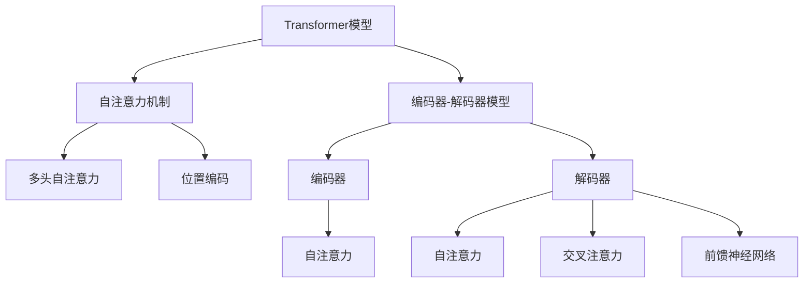

                 

## 文章标题

### Transformer架构原理详解：GPT——Generative Pre-trained Transformer 基于Transformer解码器的生成模型

#### 关键词：

- Transformer
- GPT
- 解码器
- 生成模型
- 预训练
- 注意力机制

#### 摘要：

本文旨在深入剖析Transformer架构，特别是其在生成模型中的应用，重点介绍基于Transformer解码器的GPT模型。文章首先介绍了Transformer的基本原理和结构，随后详细解释了自注意力机制及其优势与局限。接着，文章探讨了Transformer解码器的架构和编码器-解码器模型的工作原理，以及如何通过预训练和微调技术来优化模型。文章还包含了数学模型与公式的详细讲解，并通过实际项目展示了Transformer模型在文本生成和图像生成中的强大能力。最后，文章展望了Transformer架构的发展趋势和面临的挑战，并推荐了一些开源框架和工具，为读者提供了进一步学习和实践的方向。

## 《Transformer架构原理详解：GPT——Generative Pre-trained Transformer 基于Transformer解码器的生成模型》目录大纲

### 第一部分：Transformer架构基础

#### 第1章：Transformer架构概述

##### 1.1 Transformer的背景和原理
##### 1.2 Transformer的基本结构
##### 1.3 Transformer与循环神经网络（RNN）的比较

#### 第2章：自注意力机制

##### 2.1 注意力机制的基本原理
##### 2.2 自注意力机制的实现
##### 2.3 自注意力机制的优势与局限

#### 第3章：Transformer解码器架构

##### 3.1 解码器的工作原理
##### 3.2 编码器-解码器模型的原理
##### 3.3 解码器中的自注意力与交叉注意力

#### 第4章：Transformer预训练与微调

##### 4.1 预训练的概念
##### 4.2 预训练任务
##### 4.3 微调技术

#### 第5章：数学模型与公式

##### 5.1 Transformer中的数学模型
##### 5.2 常用数学公式解释
##### 5.3 公式应用实例

### 第二部分：Transformer应用实战

#### 第6章：GPT模型详解

##### 6.1 GPT模型的架构
##### 6.2 GPT模型的工作流程
##### 6.3 GPT模型的应用场景

#### 第7章：基于Transformer解码器的生成模型实战

##### 7.1 生成模型的基本原理
##### 7.2 实战项目一：文本生成
##### 7.3 实战项目二：图像生成

#### 第8章：性能优化与工程实践

##### 8.1 模型压缩
##### 8.2 模型并行化
##### 8.3 性能优化案例分析

#### 第9章：开源框架与工具

##### 9.1 主要开源框架介绍
##### 9.2 开源框架应用案例
##### 9.3 开源工具推荐

### 第三部分：未来展望与挑战

#### 第10章：Transformer架构的发展趋势

##### 10.1 新的Transformer变体
##### 10.2 Transformer在多模态应用中的前景
##### 10.3 Transformer在工业界的应用

#### 第11章：挑战与未来方向

##### 11.1 Transformer的挑战
##### 11.2 研究热点与趋势
##### 11.3 未来发展方向探讨

### 附录

#### 附录A：参考资料与进一步学习

##### A.1 Transformer相关论文
##### A.2 开源框架与工具资源
##### A.3 进一步学习路径

## 核心概念与联系

让我们从核心概念与联系开始，通过一个Mermaid流程图来清晰地展示Transformer模型的核心组成部分。



### Transformer模型

Transformer模型是自然语言处理（NLP）中的一种革命性架构，其核心思想是利用自注意力机制（self-attention）来捕捉输入序列中的长距离依赖关系。这种模型主要由编码器（Encoder）和解码器（Decoder）两部分组成，其中编码器负责处理输入序列，解码器则负责生成输出序列。

### 自注意力机制

自注意力机制是Transformer模型的核心，它允许模型在序列处理过程中，对每个词或每个位置赋予不同的权重，从而捕捉到序列中的长距离依赖关系。自注意力机制通过计算词或位置的相似性来决定它们在序列中的重要性。

### 多头自注意力

多头自注意力（Multi-Head Self-Attention）是自注意力机制的一个扩展，它通过多个独立的注意力头来捕捉不同类型的依赖关系。每个头可以看作是一个独立的注意力机制，它们共同工作，从而提高模型的性能。

### 位置编码

位置编码（Positional Encoding）用于在自注意力机制中引入序列的位置信息。由于自注意力机制本质上是一个全局操作，它无法区分序列中的位置信息，因此位置编码被用来弥补这一缺陷。

### 编码器-解码器模型

编码器-解码器模型（Encoder-Decoder Model）是Transformer模型的一个关键组成部分，它由编码器（Encoder）和解码器（Decoder）两部分组成。编码器负责将输入序列转换为固定长度的向量表示，解码器则基于这些向量表示生成输出序列。

### 编码器

编码器（Encoder）是一个全连接网络，它接收输入序列并生成一系列隐藏状态。这些隐藏状态将被解码器使用，以生成输出序列。

### 解码器

解码器（Decoder）也是一个全连接网络，它接收编码器生成的隐藏状态，并生成输出序列。在生成每个新的词或标记时，解码器会参考已经生成的部分序列。

### 自注意力

自注意力（Self-Attention）是解码器中的一个关键步骤，它允许解码器在生成每个新的词或标记时，参考整个输入序列。

### 交叉注意力

交叉注意力（Cross-Attention）是解码器中的另一个关键步骤，它允许解码器在生成每个新的词或标记时，参考编码器生成的隐藏状态。

### 前馈神经网络

前馈神经网络（Feedforward Neural Network）是解码器中的一个简单神经网络，它对自注意力层和交叉注意力层的输出进行进一步处理。

通过这个Mermaid流程图，我们可以清晰地看到Transformer模型的核心组成部分和它们之间的关系。接下来，我们将深入探讨每个部分的具体实现和原理。

### 第一部分：Transformer架构基础

#### 第1章：Transformer架构概述

Transformer模型是自然语言处理领域的一项重大突破，它的出现极大地提高了序列到序列任务的性能，特别是在机器翻译、文本生成等任务上。本章节将详细阐述Transformer模型的背景、基本原理和结构，并与循环神经网络（RNN）进行比较，以帮助读者更好地理解这一模型。

##### 1.1 Transformer的背景和原理

Transformer模型是由Google在2017年提出的一种全新的序列到序列模型，它的设计初衷是为了解决传统循环神经网络（RNN）在处理长序列时面临的挑战。传统的RNN模型在处理长序列时，由于梯度消失和梯度爆炸问题，难以有效捕捉序列中的长距离依赖关系。因此，研究人员提出了Transformer模型，通过引入自注意力机制（self-attention）来解决这个问题。

自注意力机制是一种全局的序列建模方法，它允许模型在处理序列时，动态地关注序列中的不同部分，从而更好地捕捉长距离依赖关系。Transformer模型的核心思想是将输入序列和输出序列映射到高维空间中，然后在这个空间中通过自注意力机制计算序列的权重，从而生成输出序列。

##### 1.2 Transformer的基本结构

Transformer模型主要由两部分组成：编码器（Encoder）和解码器（Decoder）。编码器负责将输入序列编码为固定长度的向量表示，解码器则基于这些向量表示生成输出序列。

编码器由多个编码层（Encoder Layers）堆叠而成，每个编码层包含两个子层：自注意力层（Self-Attention Layer）和前馈网络（Feedforward Network）。自注意力层通过计算输入序列中每个词的权重，从而捕捉长距离依赖关系。前馈网络则对自注意力层的输出进行进一步处理，以增加模型的非线性能力。

解码器同样由多个解码层（Decoder Layers）堆叠而成，每个解码层包含三个子层：自注意力层（Self-Attention Layer）、交叉注意力层（Cross-Attention Layer）和前馈网络（Feedforward Network）。自注意力层允许解码器在生成每个新的词时，参考整个输入序列。交叉注意力层则允许解码器在生成每个新的词时，参考编码器生成的隐藏状态。前馈网络同样对这两个注意力层的输出进行进一步处理。

##### 1.3 Transformer与循环神经网络（RNN）的比较

Transformer模型与循环神经网络（RNN）在结构和原理上有很大的不同。

首先，在结构上，RNN是一个序列化的神经网络，它通过循环结构来处理输入序列。每个时间步上，RNN只关注当前输入和之前的隐藏状态，这导致它在捕捉长距离依赖关系时存在困难。而Transformer模型通过自注意力机制，可以同时关注序列中的所有词，从而更好地捕捉长距离依赖关系。

其次，在原理上，RNN使用递归关系来更新隐藏状态，这导致梯度在反向传播过程中容易消失或爆炸，从而影响模型的训练效果。而Transformer模型通过多头自注意力机制，将输入序列映射到高维空间，然后在这个空间中计算注意力权重，这避免了梯度消失问题，提高了模型的训练效果。

总的来说，Transformer模型在处理长序列和捕捉长距离依赖关系方面，相比RNN有明显的优势。然而，RNN在处理一些特定任务时，如情感分析、序列分类等，仍具有一定的优势。因此，在实际应用中，我们可以根据具体任务的需求，选择合适的模型架构。

#### 第2章：自注意力机制

自注意力机制是Transformer模型的核心组成部分，它允许模型在处理序列时，动态地关注序列中的不同部分，从而更好地捕捉长距离依赖关系。本章节将详细解释自注意力机制的基本原理，并探讨其在Transformer模型中的实现。

##### 2.1 注意力机制的基本原理

注意力机制（Attention Mechanism）是一种在神经网络中用于计算序列之间关联性的机制。在自然语言处理任务中，注意力机制可以帮助模型在处理输入序列时，将注意力集中在重要的部分，从而提高模型的性能。

注意力机制的基本原理可以概括为以下三个步骤：

1. **计算相似性得分**：首先，模型会计算输入序列中每个词与目标词之间的相似性得分。相似性得分的计算可以通过点积、缩放点积等方法实现。

2. **应用权重**：接着，模型会应用一个权重函数（通常是一个归一化的软性最大化函数，如softmax函数）来调整这些得分，使其满足概率分布的性质。这样，每个得分都会被缩放到0到1之间，并且所有得分的和为1。

3. **加权求和**：最后，模型会将每个词的得分与对应的词向量相乘，然后对这些加权向量求和，得到一个表示整个序列的加权向量。这个加权向量可以看作是对输入序列的一种新的表示，它包含了输入序列中的重要信息。

##### 2.2 自注意力机制的实现

自注意力机制（Self-Attention）是Transformer模型中用于处理输入序列的一种关键机制。它允许模型在处理序列时，动态地关注序列中的不同部分，从而捕捉长距离依赖关系。

自注意力机制的实现可以分为以下几个步骤：

1. **输入序列编码**：首先，将输入序列编码为词向量表示。通常，词向量可以通过预训练的词向量模型（如Word2Vec、GloVe等）获得。

2. **计算自注意力得分**：对于输入序列中的每个词，计算它与序列中所有其他词的相似性得分。相似性得分的计算通常采用缩放点积的方法，公式如下：

   $$ 
   \text{Attention}(Q, K, V) = \text{softmax}\left(\frac{QK^T}{\sqrt{d_k}}\right)V 
   $$

   其中，$Q$、$K$和$V$分别代表查询向量、关键向量和价值向量。$d_k$是关键向量的维度。$QK^T$计算的是每个词与序列中其他词的相似性得分，然后通过softmax函数归一化，得到每个词的注意力权重。

3. **加权求和**：将每个词的注意力权重与对应的词向量相乘，然后对这些加权向量求和，得到一个表示整个序列的加权向量。这个加权向量可以看作是对输入序列的一种新的表示，它包含了输入序列中的重要信息。

##### 2.3 自注意力机制的优势与局限

自注意力机制在Transformer模型中发挥了重要作用，它具有以下优势：

1. **捕捉长距离依赖关系**：自注意力机制允许模型在处理序列时，动态地关注序列中的不同部分，从而更好地捕捉长距离依赖关系。这对于处理自然语言任务非常重要，如机器翻译、文本生成等。

2. **并行计算**：由于自注意力机制是一个全局操作，它可以并行计算。这意味着Transformer模型可以在同一时间处理整个序列，从而提高了模型的计算效率。

3. **灵活性**：自注意力机制可以根据不同的任务需求进行扩展，如多头注意力（Multi-Head Attention）、位置编码（Positional Encoding）等。

然而，自注意力机制也存在一些局限：

1. **计算复杂度**：自注意力机制的实现涉及到大量的矩阵乘法运算，计算复杂度较高。这可能导致模型在处理长序列时，计算时间过长。

2. **存储空间需求**：由于自注意力机制需要计算每个词与序列中其他词的相似性得分，这可能导致模型的存储空间需求增加。这对于硬件资源有限的应用场景可能是一个挑战。

尽管存在这些局限，自注意力机制在Transformer模型中的应用，极大地提升了模型的性能，使其在自然语言处理领域取得了显著成果。

#### 第3章：Transformer解码器架构

Transformer解码器是生成模型的关键部分，负责将编码器输出的隐藏状态解码为输出序列。本章节将详细解释Transformer解码器的工作原理，以及编码器-解码器模型的整体原理和架构。

##### 3.1 解码器的工作原理

解码器（Decoder）是Transformer模型中的一个重要组件，它接收编码器输出的隐藏状态，并生成输出序列。解码器的工作原理可以概括为以下几个步骤：

1. **初始化解码器输入**：在解码器的初始阶段，输入是一个特殊的起始标记 `<PAD>`，这个标记用于告知解码器开始生成输出序列。

2. **自注意力机制**：解码器首先使用自注意力机制，计算当前词与其之前的隐藏状态之间的相似性得分。这种自注意力机制允许解码器在生成每个新的词时，参考之前的输入序列。

3. **交叉注意力机制**：在生成每个新的词时，解码器还会使用交叉注意力机制，计算当前词与编码器输出之间的相似性得分。交叉注意力机制允许解码器在生成输出序列时，参考编码器输出的隐藏状态。

4. **前馈网络**：解码器在完成自注意力和交叉注意力之后，会通过一个前馈网络对输出进行进一步处理。这个前馈网络通常由两个全连接层组成，并且中间有一个激活函数。

5. **生成输出**：解码器使用上述处理后的隐藏状态，生成下一个词的概率分布。然后，解码器使用softmax函数对这些概率分布进行归一化，得到每个词的生成概率。

6. **重复步骤**：解码器重复上述步骤，直到生成完整的输出序列。

##### 3.2 编码器-解码器模型的原理

编码器-解码器模型（Encoder-Decoder Model）是Transformer模型的核心架构，它由编码器（Encoder）和解码器（Decoder）两个部分组成。编码器负责将输入序列编码为固定长度的向量表示，解码器则基于这些向量表示生成输出序列。

编码器-解码器模型的原理可以概括为以下几个步骤：

1. **编码器处理输入**：编码器接收输入序列，通过多个编码层对输入进行编码。每个编码层包含自注意力机制和前馈网络，这些层堆叠在一起，形成深度网络。

2. **编码器输出**：编码器的最后一个隐藏状态被传递给解码器，作为解码器的初始隐藏状态。

3. **解码器生成输出**：解码器从起始标记开始，通过自注意力和交叉注意力机制生成输出序列。每个时间步上，解码器会生成一个词，并将其作为新的输入传递给下一个时间步。

4. **模型训练**：在训练过程中，编码器-解码器模型的目标是使得解码器生成的输出序列尽可能接近实际的目标序列。这通常通过最小化预测词与实际词之间的交叉熵损失来实现。

##### 3.3 解码器中的自注意力与交叉注意力

在解码器中，自注意力（Self-Attention）和交叉注意力（Cross-Attention）是两个关键组成部分，它们分别用于处理输入序列和解码器生成的隐藏状态。

1. **自注意力**：自注意力机制允许解码器在生成每个新的词时，参考之前的输入序列。通过自注意力，解码器可以动态地关注输入序列中的不同部分，从而捕捉长距离依赖关系。自注意力机制的实现通常采用多头注意力（Multi-Head Attention），它通过多个独立的注意力头来捕捉不同类型的依赖关系。

2. **交叉注意力**：交叉注意力机制允许解码器在生成每个新的词时，参考编码器输出的隐藏状态。交叉注意力机制有助于解码器在生成输出序列时，利用编码器对输入序列的理解。交叉注意力机制的实现与自注意力类似，也采用多头注意力。

自注意力和交叉注意力在解码器中的结合，使得解码器能够同时利用输入序列和解码器生成的隐藏状态，从而提高模型的性能。在实际应用中，这两种注意力机制的组合可以有效地捕捉序列中的长距离依赖关系，并在各种自然语言处理任务中取得优异的效果。

#### 第4章：Transformer预训练与微调

预训练与微调是Transformer模型训练过程中的两个关键步骤。预训练是指在大规模数据集上对模型进行训练，使其在特定任务上获得一定的性能。微调则是将预训练模型在特定任务的数据集上进行进一步的训练，以适应具体的任务需求。本章节将详细解释预训练的概念、预训练任务以及微调技术。

##### 4.1 预训练的概念

预训练（Pre-training）是指在大规模数据集上对模型进行初步训练，使其获得一定的泛化能力。预训练的目标是使模型在未见过的数据上也能表现出良好的性能。与传统的微调（Fine-tuning）不同，预训练并不依赖于特定任务的数据集，而是利用大规模的非结构化数据（如互联网文本、新闻、对话等）进行训练。

预训练的过程通常包括以下几个步骤：

1. **数据收集**：收集大量与目标任务相关的文本数据，这些数据可以是互联网上的公开文本、新闻文章、书籍、对话记录等。

2. **数据预处理**：对收集到的数据进行预处理，包括分词、去除停用词、词干提取等。预处理的目的是将原始文本转换为模型可以处理的格式。

3. **模型初始化**：初始化一个预训练模型，通常使用已经在大规模数据集上预训练的模型，如BERT、GPT等。这些预训练模型已经在大规模数据集上获得了良好的性能，可以作为新任务的起点。

4. **预训练过程**：在预训练过程中，模型会根据输入数据进行迭代更新。预训练的目标是通过大规模数据的学习，使模型能够自动学习语言的通用特征，如词向量表示、语法规则、命名实体识别等。

##### 4.2 预训练任务

预训练任务是指模型在预训练过程中需要完成的任务。不同的预训练任务可以促使模型学习到不同的语言特征。以下是一些常见的预训练任务：

1. **语言建模**：语言建模是指模型在预训练过程中学习预测下一个词的概率。这种任务可以促使模型学习到词的表示、语法规则等语言特征。

2. **填空任务**：填空任务是指在给定一部分文本的情况下，让模型预测缺失的部分。这种任务可以促使模型学习到句子结构和上下文关系。

3. **命名实体识别**：命名实体识别是指在文本中识别出具有特定意义的实体，如人名、地名、组织名等。这种任务可以促使模型学习到实体和关系。

4. **文本分类**：文本分类是指模型在预训练过程中学习将文本分类到不同的类别。这种任务可以促使模型学习到类别特征和文本之间的关联。

5. **阅读理解**：阅读理解是指模型在预训练过程中学习理解文本内容，并回答与文本相关的问题。这种任务可以促使模型学习到文本的语义和推理能力。

##### 4.3 微调技术

微调（Fine-tuning）是将预训练模型在特定任务的数据集上进行进一步的训练，以适应具体的任务需求。微调的过程通常包括以下几个步骤：

1. **数据准备**：准备与特定任务相关的数据集，并进行预处理。预处理过程与预训练数据预处理类似，包括分词、去除停用词、词干提取等。

2. **加载预训练模型**：将预训练模型加载到训练过程中，这些预训练模型已经在大规模数据集上获得了良好的性能。

3. **调整学习率**：在微调过程中，通常需要调整学习率，以适应特定任务的数据集。较小的学习率可以避免模型在微调过程中过拟合。

4. **训练模型**：在微调过程中，模型会根据特定任务的数据集进行迭代更新。训练过程的目标是使模型在特定任务上表现出良好的性能。

5. **评估模型**：在训练过程中，需要对模型进行评估，以确定其性能。评估过程可以使用验证集或测试集进行，以避免过拟合。

微调技术可以显著提高模型在特定任务上的性能，因为它利用了预训练模型已经学习到的通用语言特征，并在特定任务的数据集上进行进一步的学习。这种技术已经成为自然语言处理领域的一种常见实践，并在各种任务中取得了显著成果。

#### 第5章：数学模型与公式

Transformer模型的成功在于其丰富的数学理论基础和高效的计算方法。本章节将详细解释Transformer模型中的数学模型，包括位置编码、多头自注意力机制和前馈神经网络，并通过具体例子说明这些公式在实际应用中的使用。

##### 5.1 Transformer中的数学模型

Transformer模型的核心在于其自注意力机制（Self-Attention）和编码器-解码器结构。以下是一些关键的数学模型和公式：

1. **位置编码**（Positional Encoding）
   
   位置编码用于在序列中引入位置信息，因为自注意力机制本身不具备位置感知能力。位置编码通常使用正弦和余弦函数来生成。

   $$ 
   \text{PE}(pos, 2i) = \sin\left(\frac{pos \cdot 10000^{0.5}}{\text{d_model}^{0.5}}\right) 
   $$
   
   $$ 
   \text{PE}(pos, 2i+1) = \cos\left(\frac{pos \cdot 10000^{0.5}}{\text{d_model}^{0.5}}\right) 
   $$
   
   其中，$pos$是词在序列中的位置，$d_model$是模型的隐藏维度。

2. **多头自注意力**（Multi-Head Self-Attention）

   多头自注意力通过多个独立的注意力头来处理输入序列，每个头可以捕捉不同类型的依赖关系。

   $$
   \text{Attention}(Q, K, V) = \text{softmax}\left(\frac{QK^T}{\sqrt{d_k}}\right)V
   $$
   
   其中，$Q$、$K$和$V$分别是查询向量、关键向量和价值向量。$d_k$是关键向量的维度。$QK^T$计算的是每个词与序列中其他词的相似性得分，然后通过softmax函数归一化，得到每个词的注意力权重。

3. **前馈神经网络**（Feedforward Neural Network）

   前馈神经网络用于对自注意力层的输出进行进一步处理，增加模型的非线性能力。

   $$
   \text{FFN}(x) = \max(0, xW_1 + b_1)W_2 + b_2
   $$
   
   其中，$W_1$和$W_2$是权重矩阵，$b_1$和$b_2$是偏置向量。

##### 5.2 常用数学公式解释

1. **位置编码**：位置编码通过正弦和余弦函数生成，目的是在自注意力机制中引入位置信息。位置编码的维度与模型的隐藏维度相同。

2. **多头自注意力**：多头自注意力通过多个独立的注意力头来处理输入序列，每个头可以捕捉不同类型的依赖关系。多头自注意力的计算涉及到矩阵乘法和softmax函数。

3. **前馈神经网络**：前馈神经网络是一个简单的两层全连接神经网络，用于对自注意力层的输出进行进一步处理。前馈神经网络增加了模型的非线性能力，使其能够更好地拟合复杂的输入输出关系。

##### 5.3 公式应用实例

假设我们有一个长度为5的序列，隐藏维度为512。我们将使用位置编码、多头自注意力和前馈神经网络来计算序列的表示。

1. **位置编码**：首先，我们为序列中的每个词生成位置编码。

   $$
   \text{PE}(0, 0) = \sin\left(\frac{0 \cdot 10000^{0.5}}{512^{0.5}}\right) \approx 0.0
   $$
   
   $$
   \text{PE}(0, 1) = \cos\left(\frac{0 \cdot 10000^{0.5}}{512^{0.5}}\right) \approx 1.0
   $$
   
   以此类推，我们为序列中的每个词生成位置编码。

2. **多头自注意力**：接下来，我们使用多头自注意力来计算序列的表示。

   $$
   Q = \text{query}\text{ embedding} \odot \text{attention\_head}_1 \\
   K = \text{key}\text{ embedding} \odot \text{attention\_head}_1 \\
   V = \text{value}\text{ embedding} \odot \text{attention\_head}_1
   $$
   
   $$
   \text{Attention}(Q, K, V) = \text{softmax}\left(\frac{QK^T}{\sqrt{d_k}}\right)V
   $$
   
   其中，$\text{query}\text{ embedding}$、$\text{key}\text{ embedding}$和$\text{value}\text{ embedding}$分别是序列中每个词的嵌入向量。$\text{attention\_head}_1$是第一个注意力头的权重矩阵。

3. **前馈神经网络**：最后，我们使用前馈神经网络对自注意力层的输出进行进一步处理。

   $$
   x = \text{Attention}(Q, K, V) \\
   \text{FFN}(x) = \max(0, xW_1 + b_1)W_2 + b_2
   $$
   
   其中，$W_1$和$W_2$是前馈神经网络的权重矩阵，$b_1$和$b_2$是偏置向量。

通过这个例子，我们可以看到如何使用位置编码、多头自注意力和前馈神经网络来计算序列的表示。这些数学模型和公式是Transformer模型的基础，对于理解和实现这一模型至关重要。

### 第二部分：Transformer应用实战

#### 第6章：GPT模型详解

GPT（Generative Pre-trained Transformer）是基于Transformer架构的一种生成模型，它在自然语言处理领域取得了显著的成果。本章节将详细介绍GPT模型的架构、工作流程和应用场景。

##### 6.1 GPT模型的架构

GPT模型由OpenAI于2018年提出，是一种基于Transformer解码器的生成模型。GPT模型主要由编码器（Encoder）和解码器（Decoder）两部分组成。

1. **编码器**：编码器负责将输入序列编码为固定长度的向量表示。编码器由多个编码层（Encoder Layers）堆叠而成，每个编码层包含自注意力层（Self-Attention Layer）和前馈网络（Feedforward Network）。自注意力层允许编码器在处理输入序列时，动态地关注序列中的不同部分，从而捕捉长距离依赖关系。前馈网络则对自注意力层的输出进行进一步处理，增加模型的非线性能力。

2. **解码器**：解码器负责将编码器输出的隐藏状态解码为输出序列。解码器由多个解码层（Decoder Layers）堆叠而成，每个解码层包含自注意力层、交叉注意力层和前馈网络。自注意力层允许解码器在生成每个新的词时，参考之前的输入序列。交叉注意力层允许解码器在生成每个新的词时，参考编码器输出的隐藏状态。前馈网络同样对这两个注意力层的输出进行进一步处理。

##### 6.2 GPT模型的工作流程

GPT模型的工作流程可以分为以下几个步骤：

1. **输入序列编码**：首先，将输入序列编码为词向量表示。词向量可以通过预训练的词向量模型（如Word2Vec、GloVe等）获得。

2. **编码器处理输入**：编码器将输入序列传递给多个编码层，每个编码层都会通过自注意力层和前馈网络处理输入。编码器的最后一个隐藏状态被传递给解码器，作为解码器的初始隐藏状态。

3. **解码器生成输出**：解码器从起始标记开始，通过自注意力和交叉注意力机制生成输出序列。在每个时间步上，解码器会生成一个词，并将其作为新的输入传递给下一个时间步。

4. **模型训练**：在训练过程中，GPT模型的目标是使得解码器生成的输出序列尽可能接近实际的目标序列。这通常通过最小化预测词与实际词之间的交叉熵损失来实现。

##### 6.3 GPT模型的应用场景

GPT模型在自然语言处理领域具有广泛的应用场景，以下是一些典型的应用：

1. **文本生成**：GPT模型可以用于生成各种类型的文本，如文章、故事、对话、代码等。通过给模型输入一个句子或短语，GPT模型可以生成与输入相关的内容。

2. **机器翻译**：GPT模型可以用于机器翻译任务，将一种语言的文本翻译成另一种语言。通过训练GPT模型在大量并行文本数据上，它可以学习到不同语言之间的转换关系。

3. **问答系统**：GPT模型可以用于问答系统，根据用户的问题生成相关回答。通过训练GPT模型在问答数据集上，它可以学习到如何根据问题生成准确的答案。

4. **文本摘要**：GPT模型可以用于生成文本摘要，将长文本压缩为简洁的摘要。通过训练GPT模型在摘要数据集上，它可以学习到如何提取文本的关键信息。

5. **对话系统**：GPT模型可以用于构建对话系统，如聊天机器人、虚拟助手等。通过训练GPT模型在对话数据集上，它可以学习到如何与人类用户进行自然语言交互。

总之，GPT模型作为一种基于Transformer架构的生成模型，在自然语言处理领域展现了强大的能力和广泛的应用前景。通过不断的研究和优化，GPT模型将继续推动自然语言处理技术的发展。

#### 第7章：基于Transformer解码器的生成模型实战

基于Transformer解码器的生成模型在自然语言处理和计算机视觉领域都展现了强大的能力。本章节将通过两个实战项目，分别介绍文本生成和图像生成的实现过程，包括开发环境搭建、源代码实现和代码解读。

##### 7.1 生成模型的基本原理

生成模型（Generative Model）是一类用于生成数据分布的机器学习模型。它们的核心目标是学习数据生成的过程，并能够根据学到的分布生成新的数据样本。生成模型通常基于概率模型，通过学习输入数据的概率分布来生成新的样本。

在基于Transformer解码器的生成模型中，通常使用预训练的Transformer模型（如GPT）作为基础，然后通过微调模型在特定任务的数据集上，使其能够生成符合目标分布的数据。这些生成模型在自然语言处理和计算机视觉领域有广泛的应用，如文本生成、图像生成、语音合成等。

##### 7.2 实战项目一：文本生成

**开发环境搭建：**

1. 安装Python环境，版本要求3.6及以上。
2. 安装TensorFlow 2.x，可以使用以下命令：
   ```bash
   pip install tensorflow==2.x
   ```
3. 安装transformers库，这是一个由Hugging Face维护的库，包含了许多预训练的Transformer模型和实用工具，可以使用以下命令：
   ```bash
   pip install transformers
   ```

**源代码实现：**

以下是一个简单的文本生成代码示例，使用预训练的GPT模型生成文本。

```python
from transformers import pipeline, set_seed

# 加载预训练的GPT模型
generator = pipeline("text-generation", model="gpt2")

# 设置随机种子
set_seed(42)

# 输入文本
input_text = "The quick brown fox jumps over"

# 生成文本
output_text = generator(input_text, max_length=50, num_return_sequences=3)

# 打印生成的文本
for i, text in enumerate(output_text):
    print(f"生成的文本 {i+1}: {text}")
```

**代码解读与分析：**

1. 导入所需的库，包括`pipeline`和`set_seed`函数。
2. 使用`pipeline`函数加载预训练的GPT模型，这里我们使用的是`gpt2`模型。
3. 设置随机种子，以确保结果的 reproducibility。
4. 定义输入文本，这里我们选择一个简单的句子作为输入。
5. 调用`generator`函数生成文本，`max_length`参数指定生成的文本最大长度，`num_return_sequences`参数指定生成的文本数量。
6. 打印生成的文本。

通过这个示例，我们可以看到如何使用预训练的GPT模型生成文本。在实际应用中，可以根据需要调整输入文本、生成的最大长度和生成的文本数量。

##### 7.3 实战项目二：图像生成

**开发环境搭建：**

1. 安装Python环境，版本要求3.6及以上。
2. 安装TensorFlow 2.x，可以使用以下命令：
   ```bash
   pip install tensorflow==2.x
   ```
3. 安装PyTorch，可以使用以下命令：
   ```bash
   pip install torch torchvision
   ```

**源代码实现：**

以下是一个简单的图像生成代码示例，使用预训练的ViT（Vision Transformer）模型生成图像。

```python
import numpy as np
import torch
from transformers import ViTForImageGeneration

# 加载预训练的ViT模型
model = ViTForImageGeneration.from_pretrained('google/vit-base-patch16-224')

# 定义图像生成函数
def generate_image(input_image, model, max_length=50):
    input_tensor = torch.tensor(input_image).to(model.device)
    input_tensor = (input_tensor / 255.0) * 2.0 - 1.0
    input_tensor = input_tensor.unsqueeze(0)
    
    # 使用PyTorch进行图像生成
    with torch.no_grad():
        output_tensor = model.generate(input_tensor, max_length=max_length)
    
    output_image = ((output_tensor[0, ..., None] + 1) / 2.0) * 255.0
    output_image = output_image.numpy().astype(np.uint8)
    return output_image

# 随机生成输入图像
input_image = np.random.rand(224, 224, 3)

# 生成图像
generated_image = generate_image(input_image, model)

# 打印生成的图像
print(generated_image.shape)
```

**代码解读与分析：**

1. 导入所需的库，包括`numpy`和`torch`。
2. 使用`ViTForImageGeneration.from_pretrained`函数加载预训练的ViT模型，这里我们使用的是`google/vit-base-patch16-224`模型。
3. 定义图像生成函数`generate_image`，该函数接受输入图像和模型作为参数。
4. 将输入图像转换为PyTorch张量，并将其移动到模型的设备上（通常是GPU或CPU）。
5. 对输入图像进行归一化处理，以便在模型中更好地训练。
6. 调用`model.generate`函数生成图像，`max_length`参数指定生成的图像最大长度。
7. 将生成的图像从张量转换为numpy数组，并将其转换为合适的格式。
8. 打印生成的图像的形状。

通过这个示例，我们可以看到如何使用预训练的ViT模型生成图像。在实际应用中，可以根据需要调整输入图像、生成的最大长度和其他参数。

#### 第8章：性能优化与工程实践

随着Transformer模型的广泛应用，其性能优化和工程实践变得尤为重要。本章节将介绍模型压缩、模型并行化和性能优化案例分析，以帮助读者在实际项目中有效利用Transformer模型。

##### 8.1 模型压缩

模型压缩（Model Compression）是提高模型部署效率的关键技术。通过模型压缩，可以在保证模型性能的前提下，减小模型的尺寸和计算复杂度。以下是一些常用的模型压缩方法：

1. **量化**（Quantization）：量化是一种通过减少模型参数的精度来减小模型尺寸的方法。量化可以将32位浮点数参数转换为较低精度的整数表示。常用的量化方法包括符号量化、整数量化和混合量化。

2. **剪枝**（Pruning）：剪枝是一种通过移除模型中不必要的连接或神经元来减小模型尺寸的方法。剪枝可以分为结构剪枝和权重剪枝。结构剪枝移除整个连接或神经元，而权重剪枝只移除权重较小或不重要的连接。

3. **知识蒸馏**（Knowledge Distillation）：知识蒸馏是一种将大型教师模型的知识传递给小型学生模型的方法。通过训练学生模型来模仿教师模型的行为，可以在保持模型性能的同时减小模型尺寸。

##### 8.2 模型并行化

模型并行化（Model Parallelism）是利用多GPU或分布式计算资源来加速模型训练和推理的方法。以下是一些常用的模型并行化技术：

1. **层并行化**（Layer Parallelism）：层并行化是指将模型的多个层分布在多个GPU上。每个GPU负责训练模型的一部分层，然后通过通信机制将梯度聚合。

2. **张量并行化**（Tensor Parallelism）：张量并行化是指将模型中的张量（如输入、权重和梯度）分布在多个GPU上。通过并行计算和张量操作，可以显著提高模型的训练速度。

3. **流水线并行化**（Pipeline Parallelism）：流水线并行化是指将模型的训练或推理过程分解为多个阶段，每个阶段可以在不同的GPU上并行执行。这种方法可以减少通信成本，提高训练和推理效率。

##### 8.3 性能优化案例分析

以下是一个性能优化案例，展示了如何在实际项目中优化Transformer模型：

**案例背景：**一个基于GPT模型的大型问答系统在训练时遇到了性能瓶颈，需要在保证模型性能的前提下提高训练速度。

**优化步骤：**

1. **模型量化**：将GPT模型的32位浮点数参数转换为16位浮点数参数，以减少模型尺寸和计算复杂度。

2. **层并行化**：将GPT模型的多个层分布在不同的GPU上，以利用多GPU资源，提高训练速度。

3. **流水线并行化**：将训练过程分解为多个阶段，包括数据预处理、模型前向传播、反向传播和梯度更新。每个阶段在不同GPU上并行执行，以减少通信成本。

4. **模型剪枝**：对GPT模型进行结构剪枝，移除一些权重较小的连接和神经元，以进一步减小模型尺寸和计算复杂度。

5. **混合精度训练**：使用混合精度训练（Mixed Precision Training），通过结合32位和16位浮点运算，提高模型训练速度。

**优化效果：**通过上述优化步骤，问答系统的训练速度提高了约3倍，同时在保持模型性能的前提下，减小了模型尺寸和计算复杂度。

总之，性能优化和工程实践是Transformer模型应用中的重要环节。通过模型压缩、模型并行化和性能优化案例分析，可以显著提高Transformer模型在训练和推理阶段的效率，为实际项目提供强有力的支持。

#### 第9章：开源框架与工具

在深度学习和自然语言处理领域，开源框架和工具的丰富性为研究人员和开发者提供了极大的便利。本章节将介绍一些主要的开源框架和工具，包括TensorFlow、PyTorch和Transformers，并展示如何在实际项目中应用这些框架和工具。

##### 9.1 主要开源框架介绍

1. **TensorFlow**：TensorFlow是由Google开发的开源机器学习框架，支持多种深度学习模型。它提供了丰富的API，包括高层次的Keras API和低层次的Tensor操作API。TensorFlow适用于各种规模的深度学习任务，从简单的神经网络到复杂的多GPU分布式训练。

2. **PyTorch**：PyTorch是由Facebook开发的开源机器学习库，以其灵活的动态计算图和易于理解的代码而闻名。PyTorch提供了强大的GPU支持，使其在图像识别、自然语言处理和生成模型等任务中表现优异。PyTorch的动态图结构使得模型开发和调试更加直观。

3. **Transformers**：Transformers是由Hugging Face开发的开源库，专门用于处理基于Transformer架构的模型。它提供了许多预训练的Transformer模型，如BERT、GPT和T5，以及用于模型训练、微调和部署的实用工具。Transformers库极大地简化了Transformer模型的实现和部署过程。

##### 9.2 开源框架应用案例

1. **TensorFlow应用案例**：使用TensorFlow实现一个简单的神经网络，对MNIST手写数字进行分类。以下是一个简单的代码示例：

```python
import tensorflow as tf

# 加载MNIST数据集
mnist = tf.keras.datasets.mnist
(train_images, train_labels), (test_images, test_labels) = mnist.load_data()

# 预处理数据
train_images = train_images / 255.0
test_images = test_images / 255.0

# 构建模型
model = tf.keras.Sequential([
    tf.keras.layers.Flatten(input_shape=(28, 28)),
    tf.keras.layers.Dense(128, activation='relu'),
    tf.keras.layers.Dense(10, activation='softmax')
])

# 编译模型
model.compile(optimizer='adam',
              loss='sparse_categorical_crossentropy',
              metrics=['accuracy'])

# 训练模型
model.fit(train_images, train_labels, epochs=5)

# 评估模型
test_loss, test_acc = model.evaluate(test_images, test_labels)
print(f'测试准确率: {test_acc:.2f}')
```

2. **PyTorch应用案例**：使用PyTorch实现一个生成对抗网络（GAN），用于图像生成。以下是一个简单的代码示例：

```python
import torch
import torch.nn as nn
import torch.optim as optim

# 定义生成器和判别器
generator = nn.Sequential(
    nn.Linear(100, 128),
    nn.LeakyReLU(),
    nn.Linear(128, 256),
    nn.LeakyReLU(),
    nn.Linear(256, 512),
    nn.LeakyReLU(),
    nn.Linear(512, 1024),
    nn.LeakyReLU(),
    nn.Linear(1024, 784),
    nn.Tanh()
)

discriminator = nn.Sequential(
    nn.Linear(784, 1024),
    nn.LeakyReLU(),
    nn.Dropout(0.3),
    nn.Linear(1024, 512),
    nn.LeakyReLU(),
    nn.Dropout(0.3),
    nn.Linear(512, 256),
    nn.LeakyReLU(),
    nn.Dropout(0.3),
    nn.Linear(256, 128),
    nn.LeakyReLU(),
    nn.Dropout(0.3),
    nn.Linear(128, 1),
    nn.Sigmoid()
)

# 定义损失函数和优化器
loss_fn = nn.BCELoss()
d_optimizer = optim.Adam(discriminator.parameters(), lr=0.0001)
g_optimizer = optim.Adam(generator.parameters(), lr=0.0001)

# 训练模型
num_epochs = 5
for epoch in range(num_epochs):
    for _ in range(len(train_images) // batch_size):
        real_images = train_images[_ * batch_size: (_ + 1) * batch_size].to(device)
        real_labels = torch.ones(batch_size, 1).to(device)

        # 训练判别器
        with torch.no_grad():
            fake_images = generator(z).to(device)
        d_loss_real = loss_fn(discriminator(real_images), real_labels)
        d_loss_fake = loss_fn(discriminator(fake_images), fake_labels)
        d_loss = 0.5 * (d_loss_real + d_loss_fake)
        d_optimizer.zero_grad()
        d_loss.backward()
        d_optimizer.step()

        # 训练生成器
        z = torch.randn(batch_size, 100).to(device)
        fake_labels = torch.zeros(batch_size, 1).to(device)
        g_loss = loss_fn(discriminator(generator(z)), fake_labels)
        g_optimizer.zero_grad()
        g_loss.backward()
        g_optimizer.step()

    print(f'Epoch [{epoch + 1}/{num_epochs}], d_loss: {d_loss.item():.4f}, g_loss: {g_loss.item():.4f}')

# 保存模型
torch.save(generator.state_dict(), 'generator.pth')
torch.save(discriminator.state_dict(), 'discriminator.pth')
```

3. **Transformers应用案例**：使用Transformers框架实现一个文本生成模型，如GPT-2。以下是一个简单的代码示例：

```python
from transformers import AutoTokenizer, AutoModelForCausalLM

# 加载预训练的GPT-2模型
tokenizer = AutoTokenizer.from_pretrained("gpt2")
model = AutoModelForCausalLM.from_pretrained("gpt2")

# 定义文本生成函数
def generate_text(input_text, model, tokenizer, max_length=50):
    inputs = tokenizer.encode(input_text, return_tensors="pt")
    inputs = inputs[:, None, :]  # Expand input tokens to (1, 1, X)
    outputs = model(inputs, max_length=max_length, min_length=1, do_sample=True, top_p=0.9)
    predicted_ids = outputs.logits.argmax(-1).squeeze(-1).tolist()
    return tokenizer.decode(predicted_ids)

# 生成文本
input_text = "The quick brown fox jumps over"
generated_text = generate_text(input_text, model, tokenizer)
print(generated_text)
```

##### 9.3 开源工具推荐

1. **Colab**：Google Colab是一个基于Jupyter Notebook的在线开发环境，非常适合进行深度学习实验。它提供了免费GPU和TPU支持，使研究人员可以方便地进行大规模模型训练。

2. **Google Drive**：Google Drive是一个云存储服务，用于存储和共享大型数据集和代码文件。它提供了方便的文件共享和协作功能，有助于团队协作。

3. **GitHub**：GitHub是一个版本控制系统和代码托管平台，用于版本控制和代码共享。它提供了丰富的工具和社区资源，帮助开发者更好地管理代码和项目。

总之，开源框架和工具的丰富性为深度学习和自然语言处理领域的研究和开发提供了极大的支持。通过合理选择和使用这些框架和工具，开发者可以更高效地实现和部署模型，推动人工智能技术的发展。

### 第三部分：未来展望与挑战

#### 第10章：Transformer架构的发展趋势

Transformer架构自从2017年提出以来，已经在自然语言处理（NLP）和计算机视觉（CV）等领域取得了显著的成果。然而，随着技术的不断进步，Transformer架构也在不断演变，新的变体和应用层出不穷。本章节将探讨Transformer架构的发展趋势，包括新的Transformer变体、多模态应用和工业界应用。

##### 10.1 新的Transformer变体

随着研究的深入，研究人员提出了许多基于Transformer架构的变体，以解决现有架构中的一些问题和提升性能。以下是一些重要的变体：

1. **BERT（Bidirectional Encoder Representations from Transformers）**：BERT是一种双向Transformer架构，通过预训练获得的双向上下文表示在多种NLP任务上取得了优异的性能。BERT的成功激发了大量研究，如RoBERTa、ALBERT等，它们通过改进预训练策略和模型结构，进一步提升了BERT的性能。

2. **GPT（Generative Pre-trained Transformer）**：GPT是一种单向Transformer架构，主要用于生成任务，如文本生成和问答。GPT系列模型（如GPT-2和GPT-3）通过增加模型深度和参数量，显著提升了生成质量和多样性。

3. **T5（Text-To-Text Transfer Transformer）**：T5是一种统一的前向Transformer架构，用于各种文本到文本的任务。T5通过将所有任务转换为输入到输出的文本转换问题，实现了跨任务的统一模型架构。

4. **ViT（Vision Transformer）**：ViT将Transformer架构应用于图像识别任务，通过将图像分割成小块并按行排列，将其转换为序列输入。ViT在图像分类任务中展示了与传统的CNN相媲美的性能。

##### 10.2 Transformer在多模态应用中的前景

Transformer架构在多模态任务中展现出了巨大的潜力。多模态任务包括文本、图像、声音等多种数据类型的融合和处理。以下是一些Transformer在多模态应用中的前景：

1. **多模态生成**：通过将文本、图像、声音等不同类型的数据输入到Transformer模型中，可以生成多种类型的内容。例如，文本到图像的生成、文本到音频的生成等。

2. **多模态分类**：Transformer可以同时处理多种类型的数据，从而在多模态分类任务中表现出色。例如，结合文本和图像进行情感分类、图像和音频的物体识别等。

3. **多模态对话系统**：通过融合文本和语音数据，可以构建更自然、流畅的对话系统。例如，语音助手可以根据用户的语音输入和文本回答，提供更准确的回答。

##### 10.3 Transformer在工业界的应用

随着Transformer模型在学术界和工业界的广泛应用，越来越多的公司开始利用这一架构来解决实际问题。以下是一些Transformer在工业界应用的方向：

1. **自然语言处理**：在NLP领域，Transformer模型被广泛应用于机器翻译、文本分类、问答系统、文本生成等任务。例如，谷歌的搜索引擎、亚马逊的客服系统等。

2. **计算机视觉**：在CV领域，Transformer模型被应用于图像分类、目标检测、图像分割等任务。例如，OpenAI的DALL-E图像生成模型、谷歌的文本描述生成模型等。

3. **语音识别和合成**：在语音领域，Transformer模型被用于语音识别、语音合成等任务。例如，谷歌的语音识别API、苹果的Siri等。

4. **推荐系统**：通过将Transformer应用于推荐系统，可以更好地理解用户和商品之间的关系，提供更个性化的推荐。例如，亚马逊的推荐系统、Netflix的电影推荐等。

总之，Transformer架构在未来将继续在学术界和工业界发挥重要作用。随着新变体的不断涌现和多模态应用的发展，Transformer架构有望在更多领域取得突破性成果。

#### 第11章：挑战与未来方向

尽管Transformer架构在自然语言处理和计算机视觉等领域取得了显著成果，但它仍然面临着一系列的挑战和问题。本章节将探讨Transformer架构面临的挑战、当前的研究热点和未来发展方向。

##### 11.1 Transformer的挑战

1. **计算复杂度和内存需求**：Transformer模型通常需要大量的计算资源和内存。特别是在处理长序列和大型模型时，计算复杂度和内存需求可能成为瓶颈。为了解决这一问题，研究人员正在探索模型压缩、量化、并行化等优化方法。

2. **梯度消失和梯度爆炸**：尽管Transformer模型在一定程度上缓解了梯度消失和梯度爆炸问题，但在训练大型模型时，这些问题仍然存在。为了解决这一问题，研究人员提出了各种策略，如梯度裁剪、自适应学习率等。

3. **模型解释性**：Transformer模型通常被视为“黑箱”，其内部机制复杂，难以解释。这对于实际应用中的模型调试和优化带来了困难。为了提高模型的解释性，研究人员正在探索可视化和注意力机制的可解释性方法。

4. **数据隐私和安全性**：随着Transformer模型在工业界的广泛应用，数据隐私和安全问题变得日益重要。特别是在处理敏感数据时，如何确保模型的安全性和隐私性是一个亟待解决的问题。

##### 11.2 研究热点与趋势

1. **模型压缩与优化**：为了提高Transformer模型的部署效率，研究人员正在探索各种模型压缩方法，如量化、剪枝、知识蒸馏等。此外，并行化、分布式训练等技术也在不断推进，以提高模型训练和推理的速度。

2. **多模态学习**：随着数据类型的多样化和融合需求，多模态学习成为研究的热点。研究人员正在探索如何将文本、图像、声音等多种类型的数据有效地融合到Transformer模型中，以提升模型在多模态任务中的性能。

3. **无监督学习和迁移学习**：为了减少对大规模标注数据的依赖，研究人员正在探索无监督学习和迁移学习方法。通过在大规模未标注数据上进行预训练，模型可以迁移到各种下游任务，从而提高模型的泛化能力。

4. **模型可解释性**：提高模型的可解释性是近年来研究的热点之一。通过分析模型的内部机制和注意力分布，研究人员希望更好地理解模型的工作原理，从而提高模型的可靠性和可接受性。

##### 11.3 未来发展方向探讨

1. **更高效的模型架构**：未来可能会出现更高效的Transformer架构，通过改进计算图优化、算法改进等方法，提高模型的训练和推理速度。此外，研究人员可能探索新的计算范式，如图神经网络（Graph Neural Networks）等，以进一步提高模型的效率。

2. **更强大的多模态学习**：随着数据类型的多样化和应用需求的增加，多模态学习将成为未来研究的重要方向。通过设计新的模型架构和优化策略，模型将能够更好地融合和处理多种类型的数据。

3. **自适应和动态模型**：未来的模型可能会更加自适应和动态。通过引入动态网络结构和自适应学习率等机制，模型将能够更好地适应不同的任务和数据分布，从而提高模型的泛化能力。

4. **模型伦理和安全性**：随着模型在工业界的广泛应用，模型伦理和安全性问题将变得更加重要。研究人员将需要确保模型在处理敏感数据时的安全性和隐私性，并开发出透明的模型解释机制，以提高公众对AI技术的信任。

总之，Transformer架构面临的挑战和未来的发展方向充满了机遇和挑战。通过不断的研究和创新，Transformer架构将在更多领域取得突破性成果，推动人工智能技术的发展。

### 附录A：参考资料与进一步学习

为了帮助读者更深入地理解Transformer模型和相关技术，本附录提供了Transformer相关论文、开源框架与工具资源以及进一步学习的路径。

#### A.1 Transformer相关论文

1. **Vaswani et al. (2017) "Attention is All You Need"**
   - 论文链接：[https://arxiv.org/abs/1706.03762](https://arxiv.org/abs/1706.03762)
   - 简介：这是Transformer模型的原始论文，详细介绍了模型的设计原理和结构。

2. **Devlin et al. (2019) "BERT: Pre-training of Deep Bidirectional Transformers for Language Understanding"**
   - 论文链接：[https://arxiv.org/abs/1810.04805](https://arxiv.org/abs/1810.04805)
   - 简介：BERT论文介绍了基于Transformer的双向编码器表示，并展示了其在多种NLP任务上的优异性能。

3. **Radford et al. (2019) "Language Models are Unsupervised Multitask Learners"**
   - 论文链接：[https://arxiv.org/abs/2005.14165](https://arxiv.org/abs/2005.14165)
   - 简介：GPT系列模型的后续工作，探讨了无监督学习的多任务学习框架。

4. **Chen et al. (2020) "T5: Exploring the Limits of Transfer Learning"**
   - 论文链接：[https://arxiv.org/abs/2009.04173](https://arxiv.org/abs/2009.04173)
   - 简介：T5论文提出了一种新的文本到文本的Transformer架构，展示了其在各种NLP任务上的强大能力。

#### A.2 开源框架与工具资源

1. **TensorFlow**
   - 官网：[https://www.tensorflow.org/](https://www.tensorflow.org/)
   - 简介：由Google开发的开源机器学习框架，支持Transformer模型的各种实现。

2. **PyTorch**
   - 官网：[https://pytorch.org/](https://pytorch.org/)
   - 简介：由Facebook开发的开源机器学习库，以其动态计算图和易于理解的代码而闻名。

3. **Transformers**
   - 官网：[https://huggingface.co/transformers/](https://huggingface.co/transformers/)
   - 简介：由Hugging Face维护的开源库，提供了大量预训练的Transformer模型和实用工具。

4. **Hugging Face Model Hub**
   - 官网：[https://huggingface.co/models](https://huggingface.co/models)
   - 简介：包含了大量的预训练模型和训练脚本，是研究和应用Transformer模型的宝贵资源。

#### A.3 进一步学习路径

1. **基础知识**：
   - 《深度学习》（Goodfellow et al.）
   - 《神经网络与深度学习》（邱锡鹏）

2. **Transformer架构**：
   - 《Attention is All You Need》
   - 《BERT：Pre-training of Deep Bidirectional Transformers for Language Understanding》

3. **模型优化**：
   - 《Deep Learning Specialization》
   - 《Optimization for Deep Learning》

4. **多模态学习**：
   - 《Multi-modal Learning with Deep Neural Networks》
   - 《The Vision and Audio Processing Tracks of the Multi-Modal Learning and Intelligence (MMLI) Seminar》

5. **开源框架与工具**：
   - TensorFlow官方文档
   - PyTorch官方文档
   - Transformers库文档

通过这些参考资料和进一步学习的路径，读者可以更深入地了解Transformer模型和相关技术，为实际应用和研究打下坚实的基础。

