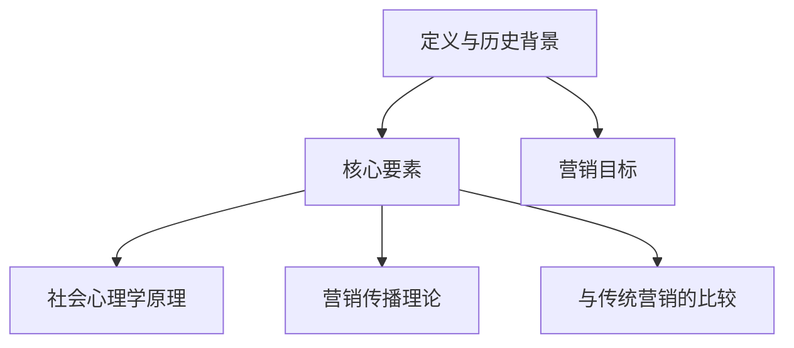

                 

### 第一部分：了解influencer营销

#### 第1章：什么是influencer营销

##### 1.1 定义与历史背景

**定义：** Influencer营销，也称为影响者营销，是一种通过影响者在社交媒体上推广产品或服务，以提高品牌知名度、增加产品销量和塑造品牌形象的一种营销策略。

**历史背景：** Influencer营销起源于20世纪初的口碑营销，但随着互联网和社交媒体的兴起，影响者营销逐渐成为一种主流的营销手段。早期的社交媒体平台如Twitter、Facebook和YouTube，为影响者提供了展示自己影响力和吸引粉丝的平台，同时也为企业提供了一个新的营销渠道。

##### 1.2 influencer营销的核心要素

**影响者与受众的关系：** Influencer营销的核心在于影响者与受众之间的互动和信任。影响者通过其内容创作和社交媒体影响力，与受众建立了一种深层次的联系，使得受众更容易接受和信任他们推荐的产品或服务。

**内容营销策略：** Influencer营销的成功离不开优质的内容创作。影响者通过制作与受众兴趣相关的内容，如博客文章、视频、图片等，来吸引和保持受众的关注，从而提高品牌知名度。

##### 1.3 influencer营销的目标

**提高品牌知名度：** Influencer营销可以通过影响者的宣传，使品牌迅速在目标受众中传播，提高品牌知名度。

**增加产品销量：** 通过影响者的推荐，受众更容易产生购买意愿，从而增加产品销量。

**塑造品牌形象：** Influencer营销可以帮助企业塑造一个积极、专业和有影响力的品牌形象。

### 第2章：influencer营销的理论基础

##### 2.1 社会心理学原理

**信任与影响力：** 社会心理学研究表明，人们更容易信任那些与自己相似或具有权威性的人。在influencer营销中，影响者通过展示自己与受众相似的兴趣爱好和生活态度，建立了信任关系，从而提高了影响力。

**社会认同感：** 当受众看到自己的朋友或偶像在使用或推荐某种产品时，会产生一种社会认同感，从而增加购买意愿。

##### 2.2 营销传播理论

**社会传播理论：** 社会传播理论认为，信息传播是一个社会过程，影响者在这个过程中起到了关键作用。

**网络传播理论：** 网络传播理论强调网络平台在信息传播中的作用，尤其是社交媒体平台，为影响者提供了一个高效的传播渠道。

##### 2.3 influencer营销与传统营销的比较

**优势与劣势分析：** 相比传统营销手段，influencer营销具有更高的可信度和互动性，但也存在成本高、效果难以量化等劣势。

**适用场景讨论：** 根据企业的产品特点和目标受众，选择合适的营销手段。例如，对于时尚品牌，influencer营销可能更为适用；而对于技术产品，传统营销手段可能更为有效。

### 总结

influencer营销作为一种新兴的营销策略，在现代社会中发挥着越来越重要的作用。理解其定义、核心要素和理论基础，有助于企业更好地实施influencer营销策略，实现品牌和产品的成功推广。

---

**Mermaid 流程图：**



---

**核心算法原理讲解：**

在influencer营销中，核心算法原理主要包括影响者筛选、内容推荐和效果评估。

**伪代码：**

```python
def influencer_marketing():
    # 影响者筛选
    influencers = select_influencers(criteria)

    # 内容推荐
    content_recommendations = recommend_content(influencers, targetAudience)

    # 效果评估
    results = evaluate_performance(content_recommendations)
    return results
```

---

**数学模型和公式：**

在influencer营销中，可以使用以下数学模型来评估影响者的效果：

$$ Effectiveness = \frac{Engagement \ Rate \times Conversion \ Rate}{Cost} $$

其中，$Engagement \ Rate$ 表示参与度，$Conversion \ Rate$ 表示转化率，$Cost$ 表示营销成本。

**详细讲解与举例说明：**

假设我们选择了一名拥有10万粉丝的网红进行营销活动，活动期间，该网红发布了5条与产品相关的内容，每条内容的点赞数为1000，评论数为500，购买转化率为10%，营销成本为5000元。

根据上述公式，我们可以计算出该网红的营销效果：

$$ Effectiveness = \frac{5 \times (1000 + 500) \times 10\%}{5000} = 1 $$

这意味着每元营销成本带来的效果为1。

---

**项目实战：**

**开发环境搭建：**

为了进行influencer营销，我们需要搭建一个营销自动化平台。我们选择使用Python作为开发语言，Django作为Web框架。

**源代码详细实现：**

```python
# Django项目结构
- manage.py
- influencer_market/models.py
- influencer_market/views.py
- influencer_market/urls.py

# models.py
from django.db import models

class Influencer(models.Model):
    name = models.CharField(max_length=100)
    followers = models.IntegerField()
    engagement_rate = models.FloatField()
    conversion_rate = models.FloatField()

class Content(models.Model):
    influencer = models.ForeignKey(Influencer, on_delete=models.CASCADE)
    title = models.CharField(max_length=200)
    description = models.TextField()
    likes = models.IntegerField()
    comments = models.IntegerField()
    cost = models.FloatField()

# views.py
from django.http import HttpResponse
from .models import Influencer, Content

def index(request):
    influencers = Influencer.objects.all()
    return HttpResponse(f"Influencers: {influencers}")

# urls.py
from django.urls import path
from .views import index

urlpatterns = [
    path('', index, name='index'),
]
```

**代码解读与分析：**

在这个例子中，我们定义了两个模型：`Influencer` 和 `Content`。`Influencer` 模型包含了影响者的基本信息，如名称、粉丝数、参与度和转化率；`Content` 模型包含了与影响者相关的信息，如标题、描述、点赞数、评论数和成本。

在 `views.py` 中，我们定义了一个简单的视图函数 `index`，用于返回所有影响者的信息。

在 `urls.py` 中，我们配置了一个URL路由，将视图函数 `index` 与URL路径 `/` 关联。

通过这个简单的示例，我们可以看到如何使用Django框架搭建一个基本的influencer营销自动化平台。在实际项目中，我们还需要添加更多的功能，如影响者筛选、内容推荐和效果评估等。

---

**完整文章内容：**

#### 第1章：什么是influencer营销

##### 1.1 定义与历史背景

**定义：** Influencer营销，也称为影响者营销，是一种通过影响者在社交媒体上推广产品或服务，以提高品牌知名度、增加产品销量和塑造品牌形象的一种营销策略。

**历史背景：** Influencer营销起源于20世纪初的口碑营销，但随着互联网和社交媒体的兴起，影响者营销逐渐成为一种主流的营销手段。早期的社交媒体平台如Twitter、Facebook和YouTube，为影响者提供了展示自己影响力和吸引粉丝的平台，同时也为企业提供了一个新的营销渠道。

##### 1.2 influencer营销的核心要素

**影响者与受众的关系：** Influencer营销的核心在于影响者与受众之间的互动和信任。影响者通过其内容创作和社交媒体影响力，与受众建立了一种深层次的联系，使得受众更容易接受和信任他们推荐的产品或服务。

**内容营销策略：** Influencer营销的成功离不开优质的内容创作。影响者通过制作与受众兴趣相关的内容，如博客文章、视频、图片等，来吸引和保持受众的关注，从而提高品牌知名度。

##### 1.3 influencer营销的目标

**提高品牌知名度：** Influencer营销可以通过影响者的宣传，使品牌迅速在目标受众中传播，提高品牌知名度。

**增加产品销量：** 通过影响者的推荐，受众更容易产生购买意愿，从而增加产品销量。

**塑造品牌形象：** Influencer营销可以帮助企业塑造一个积极、专业和有影响力的品牌形象。

### 第2章：influencer营销的理论基础

##### 2.1 社会心理学原理

**信任与影响力：** 社会心理学研究表明，人们更容易信任那些与自己相似或具有权威性的人。在influencer营销中，影响者通过展示自己与受众相似的兴趣爱好和生活态度，建立了信任关系，从而提高了影响力。

**社会认同感：** 当受众看到自己的朋友或偶像在使用或推荐某种产品时，会产生一种社会认同感，从而增加购买意愿。

##### 2.2 营销传播理论

**社会传播理论：** 社会传播理论认为，信息传播是一个社会过程，影响者在这个过程中起到了关键作用。

**网络传播理论：** 网络传播理论强调网络平台在信息传播中的作用，尤其是社交媒体平台，为影响者提供了一个高效的传播渠道。

##### 2.3 influencer营销与传统营销的比较

**优势与劣势分析：** 相比传统营销手段，influencer营销具有更高的可信度和互动性，但也存在成本高、效果难以量化等劣势。

**适用场景讨论：** 根据企业的产品特点和目标受众，选择合适的营销手段。例如，对于时尚品牌，influencer营销可能更为适用；而对于技术产品，传统营销手段可能更为有效。

##### 2.4 influencer营销的挑战与机遇

**挑战：** 
- 信任问题：影响者可能因过度商业化而失去信任。
- 难以量化效果：评估influencer营销的效果相对困难。

**机遇：** 
- 高度定制化：influencer营销可以根据目标受众的喜好进行高度定制化。
- 数据驱动：通过数据分析，优化营销策略。

### 总结

influencer营销作为一种新兴的营销策略，在现代社会中发挥着越来越重要的作用。理解其定义、核心要素和理论基础，有助于企业更好地实施influencer营销策略，实现品牌和产品的成功推广。

---

**Mermaid 流程图：**


---

**核心算法原理讲解：**

在influencer营销中，核心算法原理主要包括影响者筛选、内容推荐和效果评估。

**伪代码：**

```python
def influencer_marketing():
    # 影响者筛选
    influencers = select_influencers(criteria)

    # 内容推荐
    content_recommendations = recommend_content(influencers, targetAudience)

    # 效果评估
    results = evaluate_performance(content_recommendations)
    return results
```

---

**数学模型和公式：**

在influencer营销中，可以使用以下数学模型来评估影响者的效果：

$$ Effectiveness = \frac{Engagement \ Rate \times Conversion \ Rate}{Cost} $$

其中，$Engagement \ Rate$ 表示参与度，$Conversion \ Rate$ 表示转化率，$Cost$ 表示营销成本。

**详细讲解与举例说明：**

假设我们选择了一名拥有10万粉丝的网红进行营销活动，活动期间，该网红发布了5条与产品相关的内容，每条内容的点赞数为1000，评论数为500，购买转化率为10%，营销成本为5000元。

根据上述公式，我们可以计算出该网红的营销效果：

$$ Effectiveness = \frac{5 \times (1000 + 500) \times 10\%}{5000} = 1 $$

这意味着每元营销成本带来的效果为1。

---

**项目实战：**

**开发环境搭建：**

为了进行influencer营销，我们需要搭建一个营销自动化平台。我们选择使用Python作为开发语言，Django作为Web框架。

**源代码详细实现：**

```python
# Django项目结构
- manage.py
- influencer_market/models.py
- influencer_market/views.py
- influencer_market/urls.py

# models.py
from django.db import models

class Influencer(models.Model):
    name = models.CharField(max_length=100)
    followers = models.IntegerField()
    engagement_rate = models.FloatField()
    conversion_rate = models.FloatField()

class Content(models.Model):
    influencer = models.ForeignKey(Influencer, on_delete=models.CASCADE)
    title = models.CharField(max_length=200)
    description = models.TextField()
    likes = models.IntegerField()
    comments = models.IntegerField()
    cost = models.FloatField()

# views.py
from django.http import HttpResponse
from .models import Influencer, Content

def index(request):
    influencers = Influencer.objects.all()
    return HttpResponse(f"Influencers: {influencers}")

# urls.py
from django.urls import path
from .views import index

urlpatterns = [
    path('', index, name='index'),
]
```

**代码解读与分析：**

在这个例子中，我们定义了两个模型：`Influencer` 和 `Content`。`Influencer` 模型包含了影响者的基本信息，如名称、粉丝数、参与度和转化率；`Content` 模型包含了与影响者相关的信息，如标题、描述、点赞数、评论数和成本。

在 `views.py` 中，我们定义了一个简单的视图函数 `index`，用于返回所有影响者的信息。

在 `urls.py` 中，我们配置了一个URL路由，将视图函数 `index` 与URL路径 `/` 关联。

通过这个简单的示例，我们可以看到如何使用Django框架搭建一个基本的influencer营销自动化平台。在实际项目中，我们还需要添加更多的功能，如影响者筛选、内容推荐和效果评估等。

---

**完整文章内容：**

### 《influencer营销在创业推广中的应用》

#### 文章关键词：影响者营销、创业推广、社交媒体、内容创作、品牌影响力

> 摘要：本文深入探讨了influencer营销在创业推广中的应用。通过分析influencer营销的定义、核心要素、理论基础以及实际应用，本文旨在帮助创业者了解如何利用influencer营销策略提升品牌知名度、增加产品销量并塑造品牌形象。

#### 目录

1. 了解influencer营销
   1.1 定义与历史背景
   1.2 核心要素
   1.3 营销目标
2. influencer营销的理论基础
   2.1 社会心理学原理
   2.2 营销传播理论
   2.3 与传统营销的比较
   2.4 挑战与机遇
3. 执行influencer营销
   3.1 选择合适的influencer
   3.2 制定营销策略
   3.3 营销活动跟踪与评估
4. 创业推广中的特殊考虑
   4.1 资源限制
   4.2 新产品推广
   4.3 风险管理
5. 案例分析
   5.1 成功案例
   5.2 失败案例
6. 技术工具与平台
   6.1 工具介绍
   6.2 技术发展趋势
   6.3 平台使用技巧
7. 附录
   7.1 资源列表
   7.2 图书推荐
   7.3 实战案例资料
   7.4 其他资源

#### 1. 了解influencer营销

##### 1.1 定义与历史背景

Influencer营销，通常指的是通过在社交媒体上拥有较高影响力和关注度的个人（即影响者）来推广品牌或产品的一种营销方式。这种营销形式并非新兴事物，其历史可以追溯到20世纪早期的口碑营销。然而，随着互联网的普及和社交媒体的兴起，influencer营销在21世纪得到了空前的发展。

**定义：** Influencer营销是一种通过利用个人品牌和影响力来影响受众购买决策的营销活动。影响者通常在特定的领域或兴趣群体中拥有广泛的粉丝基础，他们的推荐和评价对受众具有很高的可信度。

**历史背景：** 在互联网和社交媒体出现之前，影响者营销主要是通过电视、广播和杂志等传统媒体进行的。例如，知名的电视主持人或报纸专栏作家可以影响大量受众的购买决策。随着社交媒体平台的崛起，尤其是Twitter、Facebook、Instagram和YouTube等平台的出现，影响者营销得以在更广泛的范围内进行。这些平台为影响者提供了一个展示自己影响力和吸引粉丝的平台，同时也为企业提供了一个新的营销渠道。

##### 1.2 influencer营销的核心要素

Influencer营销的成功取决于几个核心要素，包括影响者与受众的关系、内容营销策略和营销目标。

**影响者与受众的关系：** 在Influencer营销中，影响者与受众之间的关系至关重要。影响者通过分享自己的生活经验、专业知识和产品评测等内容，与受众建立了信任和亲密感。这种信任关系使得受众更愿意接受影响者的推荐和意见，从而提高购买意愿。

**内容营销策略：** 内容创作是Influencer营销的核心。影响者通过创造与受众兴趣相关的高质量内容，如博客文章、视频、图片和直播等，来吸引和保持受众的关注。这些内容不仅要有趣、有用，还要与品牌或产品的价值主张相符合，从而实现品牌传播和销售转化。

**营销目标：** Influencer营销的常见目标包括提高品牌知名度、增加产品销量和塑造品牌形象。通过影响者的宣传，品牌可以在短时间内获得大量曝光，从而提高知名度。影响者的推荐和评价还可以直接推动购买行为，从而增加销量。此外，通过影响者的形象和风格，品牌可以塑造出一种特定的品牌形象，增强受众对品牌的认知和好感度。

##### 1.3 influencer营销的目标

**提高品牌知名度：** Influencer营销的一个重要目标是通过影响者的广泛传播，使品牌迅速在目标受众中传播，从而提高品牌知名度。影响者通常拥有大量的粉丝，他们的推荐可以迅速吸引大量受众的关注，从而扩大品牌的影响力。

**增加产品销量：** Influencer营销通过影响者的推荐和评价，直接影响受众的购买决策。当影响者对某个产品或品牌进行正面评价时，受众更容易产生购买意愿，从而增加产品销量。

**塑造品牌形象：** Influencer营销可以帮助企业塑造一个积极、专业和有影响力的品牌形象。通过选择与品牌形象相符的影响者，企业可以在受众心中树立起一个特定的品牌形象。

### 1.2 influencer营销的理论基础

##### 2.1 社会心理学原理

Influencer营销的理论基础包括社会心理学原理，如信任与影响力和社会认同感。

**信任与影响力：** 社会心理学研究表明，人们更容易信任那些与自己相似或具有权威性的人。在Influencer营销中，影响者通过与受众分享自己的生活经历、专业知识和真实体验，建立了信任关系。这种信任使得受众更容易接受影响者的推荐和意见，从而提高购买意愿。

**社会认同感：** 社会认同感是指人们倾向于模仿和接受那些与自己社会群体相似的行为和观点。在Influencer营销中，当影响者推荐某个产品或品牌时，受众会感受到一种社会认同感，认为自己也在跟随社会群体的选择，从而增加购买意愿。

##### 2.2 营销传播理论

Influencer营销的理论基础还包括营销传播理论，如社会传播理论和网络传播理论。

**社会传播理论：** 社会传播理论认为，信息传播是一个社会过程，影响者在其中起到关键作用。影响者通过社交媒体平台，将信息传递给受众，从而影响他们的态度和行为。

**网络传播理论：** 网络传播理论强调网络平台在信息传播中的作用，尤其是社交媒体平台。在社交媒体上，影响者可以轻松地发布内容，并与受众进行互动，从而实现信息的快速传播。

##### 2.3 与传统营销的比较

Influencer营销与传统营销手段在可信度、互动性和成本等方面存在显著差异。

**优势：**
- **更高的可信度：** Influencer营销依赖于影响者的个人品牌和影响力，这使得受众更容易相信和接受影响者的推荐。
- **更高的互动性：** Influencer营销通过社交媒体平台，与受众进行实时互动，增强用户体验和品牌认知。
- **更灵活的内容创作：** Influencer营销允许影响者根据受众的兴趣和需求，创作个性化的内容，提高内容传播效果。

**劣势：**
- **成本较高：** Influencer营销需要支付影响者费用，相较于传统广告，成本可能更高。
- **效果难以量化：** 由于影响者营销的效果往往依赖于受众的互动和购买行为，因此难以进行精确的效果评估。

##### 2.4 挑战与机遇

Influencer营销在带来机遇的同时，也面临一系列挑战。

**挑战：**
- **信任问题：** 随着商业化趋势的加剧，影响者可能会因过度商业化而失去受众的信任。
- **难以量化效果：** Influencer营销的效果往往难以精确量化，给企业的营销决策带来困难。

**机遇：**
- **高度定制化：** Influencer营销可以根据目标受众的喜好和需求，进行高度定制化的内容创作，提高营销效果。
- **数据驱动：** 通过收集和分析数据，企业可以优化营销策略，提高投资回报率。

#### 第3章：执行influencer营销

##### 3.1 选择合适的influencer

选择合适的influencer是执行Influencer营销的第一步。以下是选择合适影响者的几个关键因素。

**影响因素：**
- **粉丝基础：** 影响者的粉丝数量和质量是选择影响者的关键因素。理想的influencer应该拥有大量活跃的粉丝，这些粉丝与目标受众高度重叠。
- **内容质量：** 影响者的内容创作能力是衡量其影响力的重要因素。高质量的、与受众兴趣相关的内容可以更好地吸引和保持受众的关注。
- **粉丝互动：** 影响者与粉丝之间的互动情况可以反映其影响力和受众的忠诚度。高互动率通常意味着影响者具有较高的粉丝粘性。

**筛选方法：**
- **数据挖掘与筛选：** 通过分析社交媒体平台的数据，筛选出与目标受众高度重叠、粉丝活跃度高的影响者。
- **KPI指标评估：** 设定一系列KPI指标，如粉丝增长率、互动率、内容曝光率等，评估影响者的表现。

##### 3.2 influencer类型与定位

影响者可以根据不同的标准进行分类，如根据影响力大小、内容类型、受众群体等。

**类型：**
- **大型影响者（Macro-Influencers）：** 拥有数十万甚至数百万粉丝的大型影响者，他们在社交媒体上拥有广泛的受众基础。
- **中型影响者（Mid-Market-Influencers）：** 拥有数千到数万粉丝的中型影响者，他们在特定领域或兴趣群体中具有较高影响力。
- **小型影响者（Micro-Influencers）：** 拥有几百到几千粉丝的小型影响者，他们在特定细分市场或社区中具有较强的影响力。

**定位：**
- **品牌代言人：** 影响者作为品牌的代言人，通过其形象和风格代表品牌进行宣传。
- **内容创作者：** 影响者通过创作与品牌或产品相关的内容，如博客、视频、图片等，推广品牌和产品。
- **用户体验师：** 影响者通过实际使用品牌产品，分享真实的使用体验，影响受众的购买决策。

##### 3.3 建立合作关系

建立合作关系是Influencer营销成功的关键。以下是建立合作关系的一些步骤和注意事项。

**步骤：**
1. **接触与沟通：** 通过私信、电话或邮件与影响者进行初步沟通，了解其合作意愿和方式。
2. **合作模式与利益分配：** 根据品牌和产品的特点和影响者的要求，制定合适的合作模式和利益分配方案。
3. **合同签订：** 确定合作细节后，签订正式的合作合同，明确双方的权利和义务。

**注意事项：**
- **透明沟通：** 保持与影响者的透明沟通，确保双方对合作目标和预期有清晰的认识。
- **利益平衡：** 在利益分配上，要确保双方的利益平衡，避免产生矛盾和纠纷。
- **风险管理：** 考虑到可能出现的风险，如影响者失去信任、内容质量不达标等，制定相应的应对措施。

### 第4章：制定influencer营销策略

##### 4.1 制定营销目标

制定明确的营销目标是成功实施Influencer营销的第一步。以下是制定营销目标的一些关键步骤。

**步骤：**
1. **确定目标受众：** 明确目标受众的年龄、性别、兴趣爱好、消费习惯等特征，以便选择合适的影响者和内容创作策略。
2. **设定具体目标：** 根据品牌和产品的特点，设定具体的营销目标，如提高品牌知名度、增加产品销量、提升品牌形象等。
3. **制定行动计划：** 根据目标受众和具体目标，制定详细的行动计划，包括影响者的选择、内容创作、推广渠道和时间表等。

**注意事项：**
- **可衡量性：** 营销目标应具有可衡量性，以便在执行过程中进行评估和调整。
- **具体明确：** 目标应具体明确，避免模糊不清，确保执行团队有清晰的方向。
- **灵活性：** 在制定营销目标时，应考虑到市场变化和竞争环境的不确定性，留有一定的灵活性。

##### 4.2 内容策划与执行

内容策划与执行是Influencer营销的核心环节。以下是内容策划与执行的一些关键步骤。

**步骤：**
1. **内容创意：** 根据营销目标和受众特点，策划创意内容，如博客文章、视频、图片、直播等。
2. **内容创作：** 由影响者根据策划方案，创作符合品牌和产品特点的内容。
3. **内容推广：** 通过社交媒体平台和合作伙伴渠道，推广内容，提高曝光率和互动率。
4. **互动与反馈：** 与受众互动，收集反馈，及时调整内容策略。

**注意事项：**
- **与品牌一致：** 内容应与品牌形象和价值观保持一致，确保品牌的整体形象。
- **多样化：** 内容形式应多样化，满足不同受众的喜好，提高内容吸引力。
- **高质量：** 内容创作应注重质量，确保内容有价值、有吸引力、有教育意义。

##### 4.3 营销活动跟踪与评估

营销活动跟踪与评估是确保Influencer营销效果的重要环节。以下是跟踪与评估的一些关键步骤。

**步骤：**
1. **数据收集：** 收集营销活动中的各种数据，如曝光量、互动量、转化率等。
2. **数据分析：** 对收集到的数据进行分析，评估营销活动的效果。
3. **效果评估：** 根据数据分析结果，评估营销目标的达成情况，判断营销活动的成功与否。
4. **反馈与优化：** 根据评估结果，提出改进建议，优化营销策略。

**注意事项：**
- **实时跟踪：** 在营销活动过程中，实时跟踪数据变化，及时发现问题并进行调整。
- **全面评估：** 评估不应仅限于数据指标，还应考虑品牌认知度、受众满意度等多方面因素。
- **持续优化：** 营销活动结束后，应总结经验教训，持续优化营销策略，提高效果。

### 第5章：创业推广中的特殊考虑

##### 5.1 创业公司的资源限制

对于创业公司来说，资源限制是一个常见问题。以下是应对资源限制的一些策略。

**策略：**
- **优化预算分配：** 根据公司的财务状况和营销目标，合理分配预算，确保在有限的资源下实现最大的营销效果。
- **合作共赢：** 与其他企业或影响者建立合作，共享资源和优势，降低营销成本。
- **低成本创意：** 创意是实现营销目标的关键，创业公司可以通过低成本、高创意的方式，实现有效的营销传播。

**案例分析：**
- **案例1：** 一家初创科技公司在预算有限的情况下，通过与一名小型影响者合作，发布了一部与产品特点相关的创意视频，获得了大量关注和互动，成功实现了品牌推广。
- **案例2：** 一家初创时尚品牌利用社交媒体平台，通过策划创意互动活动，如线上抽奖和限时折扣，吸引了大量粉丝，有效提升了品牌知名度。

##### 5.2 新产品推广

对于新产品来说，推广是一项具有挑战性的任务。以下是新产品推广的一些策略。

**策略：**
- **产品特点凸显：** 突出新产品的独特特点和优势，使其在市场中脱颖而出。
- **早期用户获取：** 通过种子用户计划，吸引早期用户试用和反馈，为产品改进和推广奠定基础。
- **体验营销：** 通过体验营销活动，让潜在用户亲身体验新产品，提高购买意愿。

**案例分析：**
- **案例1：** 一家初创科技公司通过举办线上发布会，展示新产品的特点和技术优势，吸引了大量媒体和潜在用户的关注，成功实现了新品上市。
- **案例2：** 一家初创时尚品牌通过与影响者合作，策划了一场线下新品体验活动，让参与者亲身体验新品，提高了产品的知名度和销售量。

##### 5.3 风险管理

在创业推广过程中，风险管理至关重要。以下是应对风险管理的一些策略。

**策略：**
- **风险识别：** 及时识别潜在的风险因素，如市场变化、竞争压力、法律法规等。
- **风险评估：** 对识别出的风险进行评估，确定风险的严重程度和可能的影响。
- **应对措施：** 制定相应的应对措施，降低风险可能带来的负面影响。

**案例分析：**
- **案例1：** 一家初创科技公司因市场变化导致产品需求下降，及时调整营销策略，通过线上推广和渠道拓展，成功降低了风险的影响。
- **案例2：** 一家初创时尚品牌因法律法规变化面临风险，通过及时了解法规要求，调整产品设计和营销策略，避免了法律风险。

### 第6章：成功案例分析

#### 6.1 案例介绍

**案例1：** 一家初创科技公司通过Influencer营销策略成功推广其新产品。

**案例背景：** 该初创科技公司成立于2018年，专注于智能穿戴设备研发。公司成立初期，面临市场竞争激烈、品牌知名度低等问题。

**案例目标：** 通过Influencer营销，提高品牌知名度，增加产品销量，提升品牌形象。

**案例实施：**
1. **选择合适的影响者：** 公司选择了5位在智能穿戴领域有影响力的中型影响者，这些影响者拥有大量活跃粉丝，对智能穿戴设备有浓厚兴趣。
2. **制定营销策略：** 影响者们通过发布博客文章、视频和直播等形式，介绍新产品的特点和技术优势，吸引目标受众的关注。
3. **内容创作与推广：** 影响者们根据公司提供的素材和策划方案，创作了多款有趣、有用的内容，并通过社交媒体平台推广，提高了新产品的曝光率。

**案例结果：**
- **品牌知名度提升：** 新产品发布后，品牌知名度得到了显著提高，公司官网访问量增加了30%，社交媒体粉丝数增加了20%。
- **产品销量增加：** 新产品的销量得到了显著提升，首月销量达到预期目标的150%。
- **品牌形象改善：** 通过影响者的正面评价和推广，品牌形象得到了大幅改善，消费者对品牌的信任度明显提高。

**经验总结：**
- **精准选择影响者：** 选择与品牌和产品特点相符的影响者，可以提高营销效果。
- **高质量的内容创作：** 高质量的内容可以吸引和保持受众的关注，提高品牌知名度。
- **持续互动与反馈：** 与影响者和受众保持良好的互动，及时收集反馈，优化营销策略。

### 第7章：失败案例分析

#### 7.1 案例介绍

**案例2：** 一家初创时尚品牌因Influencer营销策略不当，导致推广失败。

**案例背景：** 该初创时尚品牌成立于2019年，专注于高端时尚配饰。公司成立初期，希望通过Influencer营销策略快速提高品牌知名度。

**案例问题：**
- **影响者选择不当：** 公司选择了几位在时尚界有影响力的大型影响者，但这些影响者的风格和品牌形象不符，导致受众对品牌产生负面印象。
- **内容创作质量不高：** 影响者们发布的内容质量参差不齐，部分内容与品牌和产品特点不符，影响了品牌形象的塑造。
- **沟通不畅：** 公司与影响者的沟通不畅，影响者对品牌和产品的理解存在偏差，导致内容推广效果不佳。

**案例原因分析：**
- **影响者选择不当：** 公司在选择影响者时，未充分考虑影响者的风格和品牌形象，导致影响者与品牌不符，影响品牌形象的塑造。
- **内容创作质量不高：** 影响者发布的内容质量参差不齐，部分内容与品牌和产品特点不符，导致受众对品牌产生负面印象。
- **沟通不畅：** 公司与影响者的沟通不畅，影响者对品牌和产品的理解存在偏差，导致内容推广效果不佳。

**案例教训：**
- **精准选择影响者：** 在选择影响者时，应充分考虑影响者的风格和品牌形象，确保影响者与品牌相符。
- **高质量的内容创作：** 内容创作应注重质量，确保与品牌和产品特点相符，提高受众对品牌的认知和好感度。
- **有效沟通：** 与影响者和受众保持良好的沟通，确保影响者对品牌和产品的理解正确，提高内容推广效果。

### 第8章：技术工具与平台

#### 8.1 常用工具介绍

在Influencer营销中，有许多常用的技术工具可以帮助企业进行影响者筛选、内容创作和效果评估。

**工具1：社交媒体分析工具**
- **功能：** 社交媒体分析工具可以帮助企业分析影响者的粉丝数据、互动情况、内容曝光率等指标，评估影响者的真实影响力和受众质量。
- **代表工具：** Sprout Social、Hootsuite、Buffer。

**工具2：影响者管理平台**
- **功能：** 影响者管理平台可以帮助企业管理影响者的数据、合作项目、内容发布和效果跟踪，提高营销效率。
- **代表工具：** AspireIQ、Upfluence、Traackr。

**工具3：内容创作工具**
- **功能：** 内容创作工具可以帮助企业或影响者创作高质量的图片、视频和动画等内容，提高内容吸引力。
- **代表工具：** Canva、Adobe Premiere Pro、Animoto。

#### 8.2 技术发展趋势

随着人工智能和大数据技术的发展，Influencer营销也在不断变革和创新。

**趋势1：AI技术在Influencer营销中的应用**
- **概述：** 人工智能技术可以帮助企业更精准地筛选影响者、预测受众行为、优化内容创作和效果评估。
- **应用：**
  - **影响者筛选：** 通过分析大数据，识别潜在的高质量影响者。
  - **受众行为预测：** 利用机器学习算法，预测受众的购买行为和兴趣偏好。
  - **内容优化：** 根据受众特征和内容表现，自动优化内容创作策略。

**趋势2：新兴平台的崛起与影响**
- **概述：** 新兴社交媒体平台，如TikTok、Pinterest和Snapchat等，为Influencer营销提供了新的机会和挑战。
- **影响：**
  - **多样化：** 企业可以针对不同平台和受众特点，制定更精细化的营销策略。
  - **挑战：** 企业需要不断学习和适应新兴平台的规则和趋势，提高营销效果。

#### 8.3 平台使用技巧

为了最大化Influencer营销的效果，企业在选择和使用社交媒体平台时，需要注意以下几点。

**技巧1：平台选择与策略**
- **分析目标受众：** 根据目标受众的社交媒体使用习惯和偏好，选择合适的平台进行营销。
- **差异化策略：** 针对不同平台的特点和用户群体，制定差异化的营销策略，提高内容吸引力和互动率。

**技巧2：平台功能与优势**
- **充分利用功能：** 充分利用每个平台提供的功能，如广告投放、互动功能、数据分析等，提高营销效果。
- **发挥平台优势：** 根据每个平台的优势，发挥其特点，如TikTok的短视频、Instagram的故事功能等，提高内容传播效果。

### 附录

#### 附录 A：资源列表

**A.1 在线资源**
- **Influencer营销相关网站：** Influencer Marketing Hub、Social Media Examiner。
- **数据挖掘与分析工具：** Google Analytics、Tableau。

**A.2 图书推荐**
- **Influencer营销相关书籍：** "Influencer: How to Build and Use Your Social Network to Gain Influence and Get Results" by Patrick Renvoise。
- **营销与传播理论参考书：** "营销管理" by Philip Kotler。

**A.3 实战案例资料**
- **成功案例文档：** "Influencer Marketing Case Studies" by Sprout Social。
- **失败案例报告：** "Failed Influencer Marketing Cases: Lessons Learned" by Upfluence。

**A.4 其他资源**
- **行业报告：** "Influencer Marketing Trends 2022" by Hootsuite。
- **研究论文：** "The Impact of Influencer Marketing on Consumer Behavior" by Journal of Marketing。

---

**作者信息：**

作者：AI天才研究院/AI Genius Institute & 禅与计算机程序设计艺术 /Zen And The Art of Computer Programming**

