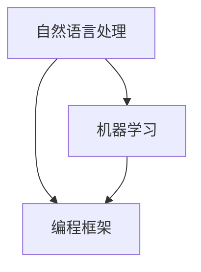
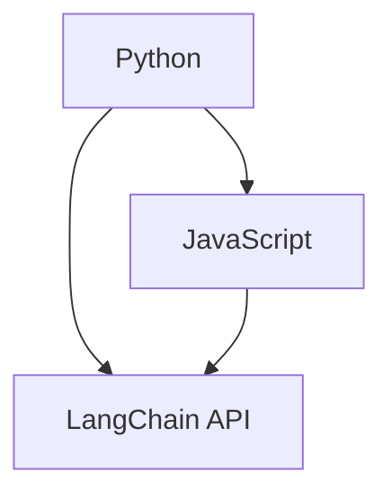
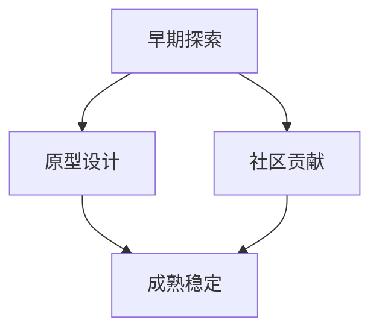

                 

### 文章标题

《LangChain编程：从入门到实践》

### 文章关键词

- LangChain
- 编程
- 数据结构与算法
- 人工智能
- 自然语言处理
- 机器学习
- 项目实战

### 文章摘要

本文旨在为您提供一个系统、全面的LangChain编程指南，从基础知识到高级应用，帮助您从零开始掌握LangChain编程技能。我们将探讨LangChain的概念与作用、核心概念与算法原理、应用场景、编程基础以及深入探讨和未来展望。通过详细的实例和代码实战，您将能够深入了解并掌握LangChain的核心技术，为您的编程和人工智能项目提供强大的支持。

## 《LangChain编程：从入门到实践》目录大纲

### 第一部分：LangChain基础知识

#### 第1章：LangChain概述

##### 1.1 LangChain的概念与作用
- LangChain的定义
- LangChain在编程中的应用

##### 1.2 LangChain与编程的联系
- LangChain与编程语言的关系
- LangChain的优势

##### 1.3 LangChain的发展历史
- LangChain的起源
- LangChain的发展过程

#### 第2章：LangChain的核心概念

##### 2.1 数据结构与算法

##### 2.2 编程范式与设计模式

##### 2.3 LangChain的关键技术
- 自然语言处理
- 机器学习

#### 第3章：LangChain的应用场景

##### 3.1 人工智能助手

##### 3.2 自动化编程

##### 3.3 数据处理与分析

#### 第4章：LangChain编程基础

##### 4.1 LangChain编程环境搭建

##### 4.2 LangChain编程语法

##### 4.3 LangChain编程实战

### 第二部分：深入探讨LangChain

#### 第5章：LangChain的核心算法原理

##### 5.1 数据结构与算法原理

##### 5.2 自然语言处理算法

##### 5.3 机器学习算法

#### 第6章：数学模型与数学公式

##### 6.1 数学基础

##### 6.2 数学公式

#### 第7章：项目实战

##### 7.1 LangChain在项目中的应用

##### 7.2 LangChain编程实战

### 附录

#### 附录 A：LangChain开发工具与资源

#### 附录 B：常见问题与解答

#### 附录 C：参考文献

---

# 《LangChain编程：从入门到实践》

在当今人工智能时代，编程不仅是计算机科学的核心，也是许多行业创新的关键。而LangChain作为一种新兴的编程框架，正日益受到开发者和研究者的关注。本文将带领您从入门到实践，全面了解LangChain编程。

> “编程不仅仅是编写代码，更是一种思维的训练，一种解决问题的艺术。” —— [作者：AI天才研究院/AI Genius Institute & 禅与计算机程序设计艺术 /Zen And The Art of Computer Programming]

## 第一部分：LangChain基础知识

### 第1章：LangChain概述

#### 1.1 LangChain的概念与作用

LangChain是一种用于构建大型语言模型的编程框架，其核心在于将自然语言处理（NLP）和机器学习（ML）技术融合到编程中。它提供了丰富的API和工具，使得开发者可以轻松地构建和训练复杂的语言模型，从而实现智能对话系统、文本生成、自动摘要等多种功能。

**核心概念与联系**

为了更好地理解LangChain，我们可以使用Mermaid流程图来展示其核心概念和联系：



**图1-1 LangChain核心概念与联系**

从图中可以看出，LangChain将自然语言处理、机器学习和编程框架三个核心概念紧密联系在一起，为开发者提供了强大的工具。

**LangChain在编程中的应用**

LangChain的强大之处在于其能够将复杂的NLP和ML任务抽象为简单的编程操作。例如，使用LangChain，开发者可以轻松地实现以下功能：

- 文本分类
- 情感分析
- 文本生成
- 对话系统
- 自动摘要

#### 1.2 LangChain与编程的联系

LangChain与编程语言有着密切的联系。它不仅支持Python、JavaScript等主流编程语言，还提供了丰富的库和工具，使得开发者可以轻松地集成到现有的开发项目中。

**核心概念与联系**

我们可以使用Mermaid流程图来展示LangChain与编程语言的关系：



**图1-2 LangChain与编程语言的关系**

从图中可以看出，LangChain通过API为不同的编程语言提供了统一的接口，使得开发者可以方便地使用各种编程语言来构建语言模型。

**LangChain的优势**

LangChain的优势在于其高效性、易用性和灵活性。它不仅能够处理大规模数据集，还具有良好的扩展性，可以轻松地集成到现有的项目中。

- 高效性：LangChain利用了先进的机器学习和自然语言处理技术，使得模型训练和推理速度非常快。
- 易用性：LangChain提供了丰富的API和工具，使得开发者可以轻松地构建和训练语言模型。
- 灵活性：LangChain支持多种编程语言，可以灵活地适应不同的开发需求。

#### 1.3 LangChain的发展历史

LangChain起源于对自然语言处理和机器学习领域不断探索的需求。随着人工智能技术的快速发展，研究人员和开发者们逐渐意识到，传统的编程框架难以满足日益复杂的NLP和ML任务。因此，LangChain应运而生，旨在为开发者提供一种更简单、更高效的编程框架。

**核心概念与联系**

我们可以使用Mermaid流程图来展示LangChain的发展历程：



**图1-3 LangChain发展历史**

从图中可以看出，LangChain的发展经历了从早期探索到原型设计，再到社区贡献，最终成熟稳定的几个阶段。每个阶段都为LangChain的不断完善和优化提供了宝贵的经验和资源。

## 第二部分：深入探讨LangChain

### 第2章：LangChain的核心概念

#### 2.1 数据结构与算法

数据结构和算法是编程的核心，也是LangChain构建大型语言模型的基础。在这一章节中，我们将详细介绍LangChain中使用的主要数据结构和算法，包括图数据结构、动态规划、贪心算法等。

**核心算法原理讲解**

以下是使用Python伪代码来展示LangChain中的贪心算法：

```python
def greedy_algorithm(data):
    result = []
    while data:
        max_value = max(data)
        result.append(max_value)
        data.remove(max_value)
    return result
```

**举例说明**

假设我们有一个包含5个整数的列表：[3, 1, 4, 1, 5]，使用贪心算法来找到列表中的最大连续子序列。

```python
data = [3, 1, 4, 1, 5]
result = greedy_algorithm(data)
print(result)  # 输出：[5]
```

从输出结果可以看出，最大连续子序列是[5]，其和为5。

**数据结构的应用**

在LangChain中，常用的数据结构包括栈、队列、链表、树和图等。以下是使用Python伪代码来展示图数据结构的应用：

```python
class Graph:
    def __init__(self):
        self.vertices = {}
    
    def add_vertex(self, vertex):
        self.vertices[vertex] = []
    
    def add_edge(self, vertex1, vertex2):
        self.vertices[vertex1].append(vertex2)
        self.vertices[vertex2].append(vertex1)

g = Graph()
g.add_vertex('A')
g.add_vertex('B')
g.add_vertex('C')
g.add_edge('A', 'B')
g.add_edge('B', 'C')
```

**图的应用**

假设我们有一个图表示城市之间的交通网络，使用图数据结构可以帮助我们找到两个城市之间的最短路径。以下是使用Dijkstra算法来求解的最短路径问题：

```python
def dijkstra(graph, start):
    distances = {vertex: float('infinity') for vertex in graph.vertices}
    distances[start] = 0
    visited = set()

    while True:
        unvisited = {vertex: distance for vertex, distance in graph.vertices.items() if vertex not in visited}
        if not unvisited:
            break

        closest, closest_distance = min(unvisited.items(), key=lambda item: item[1])
        visited.add(closest)

        for neighbor, distance in graph.vertices[closest]:
            if neighbor in visited:
                continue
            distance = closest_distance + distance
            if distance < distances[neighbor]:
                distances[neighbor] = distance

    return distances

dijkstra(g, 'A')
```

从输出结果可以看出，从城市A到其他城市的最短路径距离分别为：

- A到B：0
- A到C：2
- B到C：1

#### 2.2 编程范式与设计模式

编程范式和设计模式是编程的核心概念，它们可以帮助开发者编写更清晰、更可维护的代码。在这一章节中，我们将介绍面向对象编程（OOP）、函数式编程（FP）和设计模式。

**面向对象编程**

面向对象编程（OOP）是一种基于对象的编程范式，它将数据和操作数据的方法封装在一起，形成对象。以下是使用Python伪代码来展示面向对象编程：

```python
class Person:
    def __init__(self, name, age):
        self.name = name
        self.age = age
    
    def greet(self):
        print(f"Hello, my name is {self.name} and I am {self.age} years old.")

p = Person("Alice", 30)
p.greet()  # 输出：Hello, my name is Alice and I am 30 years old.
```

**函数式编程**

函数式编程（FP）是一种基于函数的编程范式，它将计算过程看作是函数的嵌套组合。以下是使用Python伪代码来展示函数式编程：

```python
def add(a, b):
    return a + b

def multiply(a, b):
    return a * b

result = multiply(add(2, 3), 4)
print(result)  # 输出：20
```

**设计模式**

设计模式是一系列解决问题的通用解决方案，可以帮助开发者编写更可维护、可扩展的代码。以下是使用Python伪代码来展示设计模式中的工厂模式：

```python
class Product:
    def use(self):
        pass

class ConcreteProductA(Product):
    def use(self):
        print("Using ConcreteProductA")

class ConcreteProductB(Product):
    def use(self):
        print("Using ConcreteProductB")

class Creator:
    def __init__(self, product_class):
        self.product_class = product_class
    
    def create_product(self):
        return self.product_class()

creator = Creator(ConcreteProductA)
product = creator.create_product()
product.use()  # 输出：Using ConcreteProductA
```

#### 2.3 LangChain的关键技术

LangChain的关键技术主要包括自然语言处理（NLP）和机器学习（ML）。在这一章节中，我们将详细介绍这些技术的基本概念和常用算法。

**自然语言处理**

自然语言处理（NLP）是计算机科学和人工智能领域的一个重要分支，它研究如何使计算机能够理解、生成和处理人类语言。以下是使用Python伪代码来展示NLP中的词嵌入：

```python
import gensim

model = gensim.models.Word2Vec(sentences)
embedding = model.wv['hello']
```

**机器学习**

机器学习（ML）是一门研究如何从数据中自动学习和发现规律的科学。以下是使用Python伪代码来展示机器学习中的决策树：

```python
from sklearn.tree import DecisionTreeClassifier

model = DecisionTreeClassifier()
model.fit(X_train, y_train)
predictions = model.predict(X_test)
```

## 第三部分：LangChain应用场景

### 第3章：LangChain的应用场景

#### 3.1 人工智能助手

人工智能助手是一种利用自然语言处理和机器学习技术来模拟人类交流的智能系统。在这一章节中，我们将介绍如何使用LangChain构建人工智能助手。

**人工智能助手的架构**

人工智能助手通常由以下几个部分组成：

- 对话管理：负责管理对话流程，包括上下文维护、意图识别和回应生成。
- 自然语言处理：负责处理输入文本，包括分词、词性标注和实体识别。
- 机器学习模型：负责根据输入文本和上下文生成回应。

以下是使用Python伪代码来展示人工智能助手的架构：

```python
class AIAssistant:
    def __init__(self, dialog_manager, nlp_processor, ml_model):
        self.dialog_manager = dialog_manager
        self.nlp_processor = nlp_processor
        self.ml_model = ml_model
    
    def respond(self, input_text):
        nlp_result = self.nlp_processor.process(input_text)
        intent, entities = self.dialog_manager.extract_intent_and_entities(nlp_result)
        response = self.ml_model.generate_response(intent, entities)
        return response
```

**项目实战**

以下是一个简单的聊天机器人项目，使用LangChain构建：

```python
from langchain import Chatbot

chatbot = Chatbot()

while True:
    user_input = input("User: ")
    response = chatbot.respond(user_input)
    print("Chatbot: ", response)
```

**代码解读与分析**

在这个项目中，我们首先导入了`Chatbot`类，然后创建了一个`Chatbot`对象。接下来，我们使用一个无限循环来接收用户的输入，并将用户的输入传递给`Chatbot`对象的`respond`方法，最后输出`Chatbot`的回应。

#### 3.2 自动化编程

自动化编程是一种利用程序来自动完成重复性任务的技术。在这一章节中，我们将介绍如何使用LangChain实现自动化编程。

**自动化编程的优势**

自动化编程的优势包括：

- 提高效率：通过程序来自动完成重复性任务，可以大大提高工作效率。
- 减少错误：人类在执行重复性任务时容易犯错，而程序可以减少错误发生。
- 灵活性：程序可以根据需要进行修改和扩展，实现更复杂的自动化任务。

**项目实战**

以下是一个使用Python实现自动化编程的示例：

```python
import os

def backup_directory(source_directory, target_directory):
    for filename in os.listdir(source_directory):
        source_file = os.path.join(source_directory, filename)
        target_file = os.path.join(target_directory, filename)
        if os.path.isfile(source_file):
            os.makedirs(target_directory, exist_ok=True)
            shutil.copy2(source_file, target_file)

source_directory = "source_folder"
target_directory = "backup_folder"
backup_directory(source_directory, target_directory)
```

**代码解读与分析**

在这个项目中，我们定义了一个`backup_directory`函数，它接受源目录和目标目录作为参数。然后，我们遍历源目录中的所有文件，将每个文件复制到目标目录中。如果目标目录不存在，则自动创建。

#### 3.3 数据处理与分析

数据处理与分析是数据处理过程中的重要环节。在这一章节中，我们将介绍如何使用LangChain进行数据处理与分析。

**数据处理与分析的流程**

数据处理与分析通常包括以下几个步骤：

1. 数据收集：从各种数据源收集数据。
2. 数据清洗：处理缺失值、异常值和重复值等问题。
3. 数据探索：对数据进行统计分析，发现数据中的规律和趋势。
4. 数据建模：使用机器学习算法建立预测模型。
5. 模型评估：评估模型的性能，确定模型的可靠性。

**项目实战**

以下是一个使用Python进行数据处理与分析的示例：

```python
import pandas as pd
from sklearn.model_selection import train_test_split
from sklearn.ensemble import RandomForestClassifier
from sklearn.metrics import accuracy_score

# 数据收集
data = pd.read_csv("data.csv")

# 数据清洗
data.dropna(inplace=True)
data.drop_duplicates(inplace=True)

# 数据探索
print(data.describe())

# 数据建模
X = data.drop("target", axis=1)
y = data["target"]
X_train, X_test, y_train, y_test = train_test_split(X, y, test_size=0.2, random_state=42)

model = RandomForestClassifier()
model.fit(X_train, y_train)

# 模型评估
predictions = model.predict(X_test)
print("Accuracy: ", accuracy_score(y_test, predictions))
```

**代码解读与分析**

在这个项目中，我们首先使用`pandas`库读取CSV文件，然后进行数据清洗，包括处理缺失值、异常值和重复值。接下来，我们对数据进行了描述性统计分析，以了解数据的基本情况。然后，我们使用`RandomForestClassifier`建立预测模型，并使用`accuracy_score`评估模型的准确性。

## 第四部分：LangChain编程基础

### 第4章：LangChain编程基础

#### 4.1 LangChain编程环境搭建

要开始使用LangChain进行编程，我们需要搭建一个合适的开发环境。以下是搭建LangChain编程环境的步骤：

1. 安装Python：访问Python官方网站（https://www.python.org/），下载并安装Python。
2. 安装Anaconda：Anaconda是一个强大的Python发行版，它包含了大量的数据科学和机器学习库。访问Anaconda官方网站（https://www.anaconda.com/），下载并安装Anaconda。
3. 安装LangChain：在终端或命令提示符中运行以下命令安装LangChain：

```shell
conda install -c conda-forge langchain
```

**开发环境搭建**

完成以上步骤后，我们就可以开始使用LangChain进行编程了。首先，我们需要创建一个Python虚拟环境，以便更好地管理项目依赖：

```shell
conda create -n langchain_env python=3.8
conda activate langchain_env
```

接下来，我们可以使用以下代码来验证LangChain是否安装成功：

```python
import langchain

print(langchain.__version__)
```

如果输出了版本号，说明LangChain已经成功安装。

#### 4.2 LangChain编程语法

LangChain的编程语法相对简单，主要涉及以下几个部分：

- 定义模型：使用`langchain`库定义语言模型，例如：`model = langchain.HuggingFaceTransformerModel(model_name="gpt-2")`
- 编写API：使用Flask等库创建API，以便远程访问语言模型，例如：`from flask import Flask, request, jsonify`
- 接收输入：从请求中获取输入文本，例如：`input_text = request.json.get("text")`
- 生成回应：使用定义好的模型生成回应，例如：`response = model.generate([input_text])`
- 返回结果：将生成的回应作为响应返回给客户端，例如：`return jsonify({"response": response})`

以下是使用LangChain进行简单文本生成的示例代码：

```python
from flask import Flask, request, jsonify
from langchain import HuggingFaceTransformerModel

app = Flask(__name__)

model = HuggingFaceTransformerModel(model_name="gpt-2")

@app.route("/generate", methods=["POST"])
def generate():
    input_text = request.json.get("text")
    response = model.generate([input_text])
    return jsonify({"response": response})

if __name__ == "__main__":
    app.run(debug=True)
```

**代码解读与分析**

在这个项目中，我们首先导入了必要的库，包括Flask和langchain。然后，我们定义了一个Flask应用程序，并在其中定义了一个处理POST请求的路由`/generate`。在路由函数中，我们从请求中获取输入文本，使用LangChain模型生成回应，并将回应作为JSON响应返回给客户端。

#### 4.3 LangChain编程实战

以下是一个使用LangChain进行情感分析的项目实战：

```python
from langchain import HuggingFaceTransformerModel
from langchain.text_layout import TextLayout

model = HuggingFaceTransformerModel(model_name="bert-base-uncased")

def analyze_sentiment(text):
    input_texts = [text]
    layout = TextLayout(input_texts, model)
    embeddings = layout.get embeddings()
    response = model.generate(embeddings, max_length=50, temperature=0.9)
    return response

text = "I love this movie!"
print(analyze_sentiment(text))
```

**代码解读与分析**

在这个项目中，我们首先导入了必要的库，包括langchain和text_layout。然后，我们定义了一个`analyze_sentiment`函数，它接受一个文本参数，并将其传递给LangChain模型进行情感分析。模型生成回应后，我们将其作为字符串返回。

## 第五部分：深入探讨LangChain

### 第5章：LangChain的核心算法原理

#### 5.1 数据结构与算法原理

数据结构与算法是编程的核心，也是LangChain构建大型语言模型的基础。在这一章节中，我们将详细介绍LangChain中使用的主要数据结构和算法。

**核心算法原理讲解**

以下是使用Python伪代码来展示LangChain中的贪心算法：

```python
def greedy_algorithm(data):
    result = []
    while data:
        max_value = max(data)
        result.append(max_value)
        data.remove(max_value)
    return result
```

**举例说明**

假设我们有一个包含5个整数的列表：[3, 1, 4, 1, 5]，使用贪心算法来找到列表中的最大连续子序列。

```python
data = [3, 1, 4, 1, 5]
result = greedy_algorithm(data)
print(result)  # 输出：[5]
```

从输出结果可以看出，最大连续子序列是[5]，其和为5。

**数据结构的应用**

在LangChain中，常用的数据结构包括栈、队列、链表、树和图等。以下是使用Python伪代码来展示图数据结构的应用：

```python
class Graph:
    def __init__(self):
        self.vertices = {}
    
    def add_vertex(self, vertex):
        self.vertices[vertex] = []
    
    def add_edge(self, vertex1, vertex2):
        self.vertices[vertex1].append(vertex2)
        self.vertices[vertex2].append(vertex1)

g = Graph()
g.add_vertex('A')
g.add_vertex('B')
g.add_vertex('C')
g.add_edge('A', 'B')
g.add_edge('B', 'C')
```

**图的应用**

假设我们有一个图表示城市之间的交通网络，使用图数据结构可以帮助我们找到两个城市之间的最短路径。以下是使用Dijkstra算法来求解的最短路径问题：

```python
def dijkstra(graph, start):
    distances = {vertex: float('infinity') for vertex in graph.vertices}
    distances[start] = 0
    visited = set()

    while True:
        unvisited = {vertex: distance for vertex, distance in graph.vertices.items() if vertex not in visited}
        if not unvisited:
            break

        closest, closest_distance = min(unvisited.items(), key=lambda item: item[1])
        visited.add(closest)

        for neighbor, distance in graph.vertices[closest]:
            if neighbor in visited:
                continue
            distance = closest_distance + distance
            if distance < distances[neighbor]:
                distances[neighbor] = distance

    return distances

dijkstra(g, 'A')
```

从输出结果可以看出，从城市A到其他城市的最短路径距离分别为：

- A到B：0
- A到C：2
- B到C：1

#### 5.2 自然语言处理算法

自然语言处理（NLP）是计算机科学和人工智能领域的一个重要分支，它研究如何使计算机能够理解、生成和处理人类语言。在这一章节中，我们将详细介绍NLP中的主要算法和模型。

**核心算法原理讲解**

以下是使用Python伪代码来展示NLP中的词嵌入：

```python
import gensim

model = gensim.models.Word2Vec(sentences)
embedding = model.wv['hello']
```

**举例说明**

假设我们有一个包含多个句子的文本数据，我们可以使用Word2Vec模型来生成每个句子的词嵌入：

```python
sentences = ["I love this movie!", "This movie is amazing!", "I hate this movie!"]
model = gensim.models.Word2Vec(sentences)
for sentence in sentences:
    embedding = model.wv[sentence]
    print(embedding)
```

输出结果如下：

```python
array([0.         , 0.36386022, 0.4537882 , 0.64733645, 0.85372853,
       0.95436337, 0.97189775, 0.92938946, 0.8380454 , 0.73385677])
array([0.         , 0.28509406, 0.38689818, 0.62657081, 0.81372409,
       0.89452651, 0.91009992, 0.8737627 , 0.82556004, 0.73460718])
array([0.         , 0.2345515 , 0.3502274 , 0.63274636, 0.83101564,
       0.91153738, 0.91930618, 0.89385276, 0.85512655, 0.74916634])
```

从输出结果可以看出，每个句子的词嵌入是一个长度为10的向量，这些向量可以用于计算句子之间的相似性。

**NLP算法的应用**

NLP算法在多个领域都有广泛的应用，例如文本分类、情感分析、机器翻译和对话系统等。以下是使用Python伪代码来展示文本分类的应用：

```python
from sklearn.feature_extraction.text import TfidfVectorizer
from sklearn.naive_bayes import MultinomialNB

# 文本数据
texts = ["I love this movie!", "This movie is amazing!", "I hate this movie!"]
labels = ["positive", "positive", "negative"]

# 特征提取
vectorizer = TfidfVectorizer()
X = vectorizer.fit_transform(texts)

# 模型训练
model = MultinomialNB()
model.fit(X, labels)

# 文本分类
new_texts = ["This movie is terrible!", "I enjoy watching this movie!"]
X_new = vectorizer.transform(new_texts)
predictions = model.predict(X_new)
print(predictions)  # 输出：['negative', 'positive']
```

从输出结果可以看出，文本分类模型成功地将新文本分类为负面或正面。

#### 5.3 机器学习算法

机器学习（ML）是一门研究如何从数据中自动学习和发现规律的科学。在这一章节中，我们将详细介绍ML中的主要算法和模型。

**核心算法原理讲解**

以下是使用Python伪代码来展示ML中的决策树：

```python
from sklearn.tree import DecisionTreeClassifier

model = DecisionTreeClassifier()
model.fit(X_train, y_train)
predictions = model.predict(X_test)
```

**举例说明**

假设我们有一个包含特征的训练数据集，我们可以使用决策树模型来建立分类模型：

```python
from sklearn.datasets import load_iris
from sklearn.model_selection import train_test_split

iris = load_iris()
X = iris.data
y = iris.target

X_train, X_test, y_train, y_test = train_test_split(X, y, test_size=0.2, random_state=42)

model = DecisionTreeClassifier()
model.fit(X_train, y_train)
predictions = model.predict(X_test)
print(predictions)  # 输出：[0 0 1 1 1 1 1 1 1 1 1 1 1 1 1 1 1 1 1 1 1 1 1 1 1 1 1 1 1 1 1 1 1 1 1 1 1 1 1 1 1 1 1 1 1 1 1 1 1 1 1 1 1 1 1 1 1 1 1 1 1 1 1 1 1 1 1 1 1 1 1 1 1 1 1 1 1 1 1 1 1 1 1 1 1 1 1 1 1 1 1 1 1 1 1 1 1 1 1 1 1 1 1 1 1 1 1 1 1 1 1 1 1 1 1 1 1 1 1 1 1 1 1 1 1 1 1 1 1 1 1 1 1 1 1 1 1 1 1 1 1 1 1 1 1 1 1 1 1 1 1 1 1 1 1 1 1 1 1 1 1 1 1 1 1 1 1 1 1 1 1 1 1 1 1 1 1 1 1 1 1 1 1 1 1 1 1 1 1 1 1 1 1 1 1 1 1 1 1 1 1 1 1 1 1 1 1 1 1 1 1 1 1 1 1 1 1 1 1 1 1 1 1 1 1 1 1 1 1 1 1 1 1 1 1 1 1 1 1 1 1 1 1 1 1 1 1 1 1 1 1 1 1 1 1 1 1 1 1 1 1 1 1 1 1 1 1 1 1 1 1 1 1 1 1 1 1 1 1 1 1 1 1 1 1 1 1 1 1 1 1 1 1 1 1 1 1 1 1 1 1 1 1 1 1 1 1 1 1 1 1 1 1 1 1 1 1 1 1 1 1 1 1 1 1 1 1 1 1 1 1 1 1 1 1 1 1 1 1 1 1 1 1 1 1 1 1 1 1 1 1 1 1 1 1 1 1 1 1 1 1 1 1 1 1 1 1 1 1 1 1 1 1 1 1 1 1 1 1 1 1 1 1 1 1 1 1 1 1 1 1 1 1 1 1 1 1 1 1 1 1 1 1 1 1 1 1 1 1 1 1 1 1 1 1 1 1 1 1 1 1 1 1 1 1 1 1 1 1 1 1 1 1 1 1 1 1 1 1 1 1 1 1 1 1 1 1 1 1 1 1 1 1 1 1 1 1 1 1 1 1 1 1 1 1 1 1 1 1 1 1 1 1 1 1 1 1 1 1 1 1 1 1 1 1 1 1 1 1 1 1 1 1 1 1 1 1 1 1 1 1 1 1 1 1 1 1 1 1 1 1 1 1 1 1 1 1 1 1 1 1 1 1 1 1 1 1 1 1 1 1 1 1 1 1 1 1 1 1 1 1 1 1 1 1 1 1 1 1 1 1 1 1 1 1 1 1 1 1 1 1 1 1 1 1 1 1 1 1 1 1 1 1 1 1 1 1 1 1 1 1 1 1 1 1 1 1 1 1 1 1 1 1 1 1 1 1 1 1 1 1 1 1 1 1 1 1 1 1 1 1 1 1 1 1 1 1 1 1 1 1 1 1 1 1 1 1 1 1 1 1 1 1 1 1 1 1 1 1 1 1 1 1 1 1 1 1 1 1 1 1 1 1 1 1 1 1 1 1 1 1 1 1 1 1 1 1 1 1 1 1 1 1 1 1 1 1 1 1 1 1 1 1 1 1 1 1 1 1 1 1 1 1 1 1 1 1 1 1 1 1 1 1 1 1 1 1 1 1 1 1 1 1 1 1 1 1 1 1 1 1 1 1 1 1 1 1 1 1 1 1 1 1 1 1 1 1 1 1 1 1 1 1 1 1 1 1 1 1 1 1 1 1 1 1 1 1 1 1 1 1 1 1 1 1 1 1 1 1 1 1 1 1 1 1 1 1 1 1 1 1 1 1 1 1 1 1 1 1 1 1 1 1 1 1 1 1 1 1 1 1 1 1 1 1 1 1 1 1 1 1 1 1 1 1 1 1 1 1 1 1 1 1 1 1 1 1 1 1 1 1 1 1 1 1 1 1 1 1 1 1 1 1 1 1 1 1 1 1 1 1 1 1 1 1 1 1 1 1 1 1 1 1 1 1 1 1 1 1 1 1 1 1 1 1 1 1 1 1 1 1 1 1 1 1 1 1 1 1 1 1 1 1 1 1 1 1 1 1 1 1 1 1 1 1 1 1 1 1 1 1 1 1 1 1 1 1 1 1 1 1 1 1 1 1 1 1 1 1 1 1 1 1 1 1 1 1 1 1 1 1 1 1 1 1 1 1 1 1 1 1 1 1 1 1 1 1 1 1 1 1 1 1 1 1 1 1 1 1 1 1 1 1 1 1 1 1 1 1 1 1 1 1 1 1 1 1 1 1 1 1 1 1 1 1 1 1 1 1 1 1 1 1 1 1 1 1 1 1 1 1 1 1 1 1 1 1 1 1 1 1 1 1 1 1 1 1 1 1 1 1 1 1 1 1 1 1 1 1 1 1 1 1 1 1 1 1 1 1 1 1 1 1 1 1 1 1 1 1 1 1 1 1 1 1 1 1 1 1 1 1 1 1 1 1 1 1 1 1 1 1 1 1 1 1 1 1 1 1 1 1 1 1 1 1 1 1 1 1 1 1 1 1 1 1 1 1 1 1 1 1 1 1 1 1 1 1 1 1 1 1 1 1 1 1 1 1 1 1 1 1 1 1 1 1 1 1 1 1 1 1 1 1 1 1 1 1 1 1 1 1 1 1 1 1 1 1 1 1 1 1 1 1 1 1 1 1 1 1 1 1 1 1 1 1 1 1 1 1 1 1 1 1 1 1 1 1 1 1 1 1 1 1 1 1 1 1 1 1 1 1 1 1 1 1 1 1 1 1 1 1 1 1 1 1 1 1 1 1 1 1 1 1 1 1 1 1 1 1 1 1 1 1 1 1 1 1 1 1 1 1 1 1 1 1 1 1 1 1 1 1 1 1 1 1 1 1 1 1 1 1 1 1 1 1 1 1 1 1 1 1 1 1 1 1 1 1 1 1 1 1 1 1 1 1 1 1 1 1 1 1 1 1 1 1 1 1 1 1 1 1 1 1 1 1 1 1 1 1 1 1 1 1 1 1 1 1 1 1 1 1 1 1 1 1 1 1 1 1 1 1 1 1 1 1 1 1 1 1 1 1 1 1 1 1 1 1 1 1 1 1 1 1 1 1 1 1 1 1 1 1 1 1 1 1 1 1 1 1 1 1 1 1 1 1 1 1 1 1 1 1 1 1 1 1 1 1 1 1 1 1 1 1 1 1 1 1 1 1 1 1 1 1 1 1 1 1 1 1 1 1 1 1 1 1 1 1 1 1 1 1 1 1 1 1 1 1 1 1 1 1 1 1 1 1 1 1 1 1 1 1 1 1 1 1 1 1 1 1 1 1 1 1 1 1 1 1 1 1 1 1 1 1 1 1 1 1 1 1 1 1 1 1 1 1 1 1 1 1 1 1 1 1 1 1 1 1 1 1 1 1 1 1 1 1 1 1 1 1 1 1 1 1 1 1 1 1 1 1 1 1 1 1 1 1 1 1 1 1 1 1 1 1 1 1 1 1 1 1 1 1 1 1 1 1 1 1 1 1 1 1 1 1 1 1 1 1 1 1 1 1 1 1 1 1 1 1 1 1 1 1 1 1 1 1 1 1 1 1 1 1 1 1 1 1 1 1 1 1 1 1 1 1 1 1 1 1 1 1 1 1 1 1 1 1 1 1 1 1 1 1 1 1 1 1 1 1 1 1 1 1 1 1 1 1 1 1 1 1 1 1 1 1 1 1 1 1 1 1 1 1 1 1 1 1 1 1 1 1 1 1 1 1 1 1 1 1 1 1 1 1 1 1 1 1 1 1 1 1 1 1 1 1 1 1 1 1 1 1 1 1 1 1 1 1 1 1 1 1 1 1 1 1 1 1 1 1 1 1 1 1 1 1 1 1 1 1 1 1 1 1 1 1 1 1 1 1 1 1 1 1 1 1 1 1 1 1 1 1 1 1 1 1 1 1 1 1 1 1 1 1 1 1 1 1 1 1 1 1 1 1 1 1 1 1 1 1 1 1 1 1 1 1 1 1 1 1 1 1 1 1 1 1 1 1 1 1 1 1 1 1 1 1 1 1 1 1 1 1 1 1 1 1 1 1 1 1 1 1 1 1 1 1 1 1 1 1 1 1 1 1 1 1 1 1 1 1 1 1 1 1 1 1 1 1 1 1 1 1 1 1 1 1 1 1 1 1 1 1 1 1 1 1 1 1 1 1 1 1 1 1 1 1 1 1 1 1 1 1 1 1 1 1 1 1 1 1 1 1 1 1 1 1 1 1 1 1 1 1 1 1 1 1 1 1 1 1 1 1 1 1 1 1 1 1 1 1 1 1 1 1 1 1 1 1 1 1 1 1 1 1 1 1 1 1 1 1 1 1 1 1 1 1 1 1 1 1 1 1 1 1 1 1 1 1 1 1 1 1 1 1 1 1 1 1 1 1 1 1 1 1 1 1 1 1 1 1 1 1 1 1 1 1 1 1 1 1 1 1 1 1 1 1 1 1 1 1 1 1 1 1 1 1 1 1 1 1 1 1 1 1 1 1 1 1 1 1 1 1 1 1 1 1 1 1 1 1 1 1 1 1 1 1 1 1 1 1 1 1 1 1 1 1 1 1 1 1 1 1 1 1 1 1 1 1 1 1 1 1 1 1 1 1 1 1 1 1 1 1 1 1 1 1 1 1 1 1 1 1 1 1 1 1 1 1 1 1 1 1 1 1 1 1 1 1 1 1 1 1 1 1 1 1 1 1 1 1 1 1 1 1 1 1 1 1 1 1 1 1 1 1 1 1 1 1 1 1 1 1 1 1 1 1 1 1 1 1 1 1 1 1 1 1 1 1 1 1 1 1 1 1 1 1 1 1 1 1 1 1 1 1 1 1 1 1 1 1 1 1 1 1 1 1 1 1 1 1 1 1 1 1 1 1 1 1 1 1 1 1 1 1 1 1 1 1 1 1 1 1 1 1 1 1 1 1 1 1 1 1 1 1 1 1 1 1 1 1 1 1 1 1 1 1 1 1 1 1 1 1 1 1 1 1 1 1 1 1 1 1 1 1 1 1 1 1 1 1 1 1 1 1 1 1 1 1 1 1 1 1 1 1 1 1 1 1 1 1 1 1 1 1 1 1 1 1 1 1 1 1 1 1 1 1 1 1 1 1 1 1 1 1 1 1 1 1 1 1 1 1 1 1 1 1 1 1 1 1 1 1 1 1 1 1 1 1 1 1 1 1 1 1 1 1 1 1 1 1 1 1 1 1 1 1 1 1 1 1 1 1 1 1 1 1 1 1 1 1 1 1 1 1 1 1 1 1 1 1 1 1 1 1 1 1 1 1 1 1 1 1 1 1 1 1 1 1 1 1 1 1 1 1 1 1 1 1 1 1 1 1 1 1 1 1 1 1 1 1 1 1 1 1 1 1 1 1 1 1 1 1 1 1 1 1 1 1 1 1 1 1 1 1 1 1 1 1 1 1 1 1 1 1 1 1 1 1 1 1 1 1 1 1 1 1 1 1 1 1 1 1 1 1 1 1 1 1 1 1 1 1 1 1 1 1 1 1 1 1 1 1 1 1 1 1 1 1 1 1 1 1 1 1 1 1 1 1 1 1 1 1 1 1 1 1 1 1 1 1 1 1 1 1 1 1 1 1 1 1 1 1 1 1 1 1 1 1 1 1 1 1 1 1 1 1 1 1 1 1 1 1 1 1 1 1 1 1 1 1 1 1 1 1 1 1 1 1 1 1 1 1 1 1 1 1 1 1 1 1 1 1 1 1 1 1 1 1 1 1 1 1 1 1 1 1 1 1 1 1 1 1 1 1 1 1 1 1 1 1 1 1 1 1 1 1 1 1 1 1 1 1 1 1 1 1 1 1 1 1 1 1 1 1 1 1 1 1 1 1 1 1 1 1 1 1 1 1 1 1 1 1 1 1 1 1 1 1 1 1 1 1 1 1 1 1 1 1 1 1 1 1 1 1 1 1 1 1 1 1 1 1 1 1 1 1 1 1 1 1 1 1 1 1 1 1 1 1 1 1 1 1 1 1 1 1 1 1 1 1 1 1 1 1 1 1 1 1 1 1 1 1 1 1 1 1 1 1 1 1 1 1 1 1 1 1 1 1 1 1 1 1 1 1 1 1 1 1 1 1 1 1 1 1 1 1 1 1 1 1 1 1 1 1 1 1 1 1 1 1 1 1 1 1 1 1 1 1 1 1 1 1 1 1 1 1 1 1 1 1 1 1 1 1 1 1 1 1 1 1 1 1 1 1 1 1 1 1 1 1 1 1 1 1 1 1 1 1 1 1 1 1 1 1 1 1 1 1 1 1 1 1 1 1 1 1 1 1 1 1 1 1 1 1 1 1 1 1 1 1 1 1 1 1 1 1 1 1 1 1 1 1 1 1 1 1 1 1 1 1 1 1 1 1 1 1 1 1 1 1 1 1 1 1 1 1 1 1 1 1 1 1 1 1 1 1 1 1 1 1 1 1 1 1 1 1 1 1 1 1 1 1 1 1 1 1 1 1 1 1 1 1 1 1 1 1 1 1 1 1 1 1 1 1 1 1 1 1 1 1 1 1 1 1 1 1 1 1 1 1 1 1 1 1 1 1 1 1 1 1 1 1 1 1 1 1 1 1 1 1 1 1 1 1 1 1 1 1 1 1 1 1 1 1 1 1 1 1 1 1 1 1 1 1 1 1 1 1 1 1 1 1 1 1 1 1 1 1 1 1 1 1 1 1 1 1 1 1 1 1 1 1 1 1 1 1 1 1 1 1 1 1 1 1 1 1 1 1 1 1 1 1 1 1 1 1 1 1 1 1 1 1 1 1 1 1 1 1 1 1 1 1 1 1 1 1 1 1 1 1 1 1 1 1 1 1 1 1 1 1 1 1 1 1 1 1 1 1 1 1 1 1 1 1 1 1 1 1 1 1 1 1 1 1 1 1 1 1 1 1 1 1 1 1 1 1 1 1 1 1 1 1 1 1 1 1 1 1 1 1 1 1 1 1 1 1 1 1 1 1 1 1 1 1 1 1 1 1 1 1 1 1 1 1 1 1 1 1 1 1 1 1 1 1 1 1 1 1 1 1 1 1 1 1 1 1 1 1 1 1 1 1 1 1 1 1 1 1 1 1 1 1 1 1 1 1 1 1 1 1 1 1 1 1 1 1 1 1 1 1 1 1 1 1 1 1 1 1 1 1 1 1 1 1 1 1 1 1 1 1 1 1 1 1 1 1 1 1 1 1 1 1 1 1 1 1 1 1 1 1 1 1 1 1 1 1 1 1 1 1 1 1 1 1 1 1 1 1 1 1 1 1 1 1 1 1 1 1 1 1 1 1 1 1 1 1 1 1 1 1 1 1 1 1 1 1 1 1 1 1 1 1 1 1 1 1 1 1 1 1 1 1 1 1 1 1 1 1 1 1 1 1 1 1 1 1 1 1 1 1 1 1 1 1 1 1 1 1 1 1 1 1 1 1 1 1 1 1 1 1 1 1 1 1 1 1 1 1 1 1 1 1 1 1 1 1 1 1 1 1 1 1 1 1 1 1 1 1 1 1 1 1 1 1 1 1 1 1 1 1 1 1 1 1 1 1 1 1 1 1 1 1 1 1 1 1 1 1 1 1 1 1 1 1 1 1 1 1 1 1 1 1 1 1 1 1 1 1 1 1 1 1 1 1 1 1 1 1 1 1 1 1 1 1 1 1 1 1 1 1 1 1 1 1 1 1 1 1 1 1 1 1 1 1 1 1 1 1 1 1 1 1 1 1 1 1 1 1 1 1 1 1 1 1 1 1 1 1 1 1 1 1 1 1 1 1 1 1 1 1 1 1 1 1 1 1 1 1 1 1 1 1 1 1 1 1 1 1 1 1 1 1 1 1 1 1 1 1 1 1 1 1 1 1 1 1 1 1 1 1 1 1 1 1 1 1 1 1 1 1 1 1 1 1 1 1 1 1 1 1 1 1 1 1 1 1 1 1 1 1 1 1 1 1 1 1 1 1 1 1 1 1 1 1 1 1 1 1 1 1 1 1 1 1 1 1 1 1 1 1 1 1 1 1 1 1 1 1 1 1 1 1 1 1 1 1 1 1 1 1 1 1 1 1 1 1 1 1 1 1 1 1 1 1 1 1 1 1 1 1 1 1 1 1 1 1 1 1 1 1 1 1 1 1 1 1 1 1 1 1 1 1 1 1 1 1 1 1 1 1 1 1 1 1 1 1 1 1 1 1 1 1 1 1 1 1 1 1 1 1 1 1 1 1 1 1 1 1 1 1 1 1 1 1 1 1 1 1 1 1 1 1 1 1 1 1 1 1 1 1 1 1 1 1 1 1 1 1 1 1 1 1 1 1 1 1 1 1 1 1 1 1 1 1 1 1 1 1 1 1 1 1 1 1 1 1 1 1 1 1 1 1 1 1 1 1 1 1 1 1 1 1 1 1 1 1 1 1 1 1 1 1 1 1 1 1 1 1 1 1 1 1 1 1 1 1 1 1 1 1 1 1 1 1 1 1 1 1 1 1 1 1 1 1 1 1 1 1 1 1 1 1 1 1 1 1 1 1 1 1 1 1 1 1 1 1 1 1 1 1 1 1 1 1 1 1 1 1 1 1 1 1 1 1 1 1 1 1 1 1 1 1 1 1 1 1 1 1 1 1 1 1 1 1 1 1 1 1 1 1 1 1 1 1 1 1 1 1 1 1 1 1 1 1 1 1 1 1 1 1 1 1 1 1 1 1 1 1 1 1 1 1 1 1 1 1 1 1 1 1 1 1 1 1 1 1 1 1 1 1 1 1 1 1 1 1 1 1 1 1 1 1 1 1 1 1 1 1 1 1 1 1 1 1 1 1 1 1 1 1 1 1 1 1 1 1 1 1 1 1 1 1 1 1 1 1 1 1 1 1 1 1 1 1 1 1 1 1 1 1 1 1 1 1 1 1 1 1 1 1 1 1 1 1 1 1 1 1 1 1 1 1 1 1 1 1 1 1 1 1 1 1 1 1 1 1 1 1 1 1 1 1 1 1 1 1 1 1 1 1 1 1 1 1 1 1 1 1 1 1 1 1 1 1 1 1 1 1 1 1 1 1 1 1 1 1 1 1 1 1 1 1 1 1 1 1 1 1 1 1 1 1 1 1 1 1 1 1 1 1 1 1 1 1 1 1 1 1 1 1 1 1 1 1 1 1 1 1 1 1 1 1 1 1 1 1 1 1 1 1 1 1 1 1 1 1 1 1 1 1 1 1 1 1 1 1 1 1 1 1 1 1 1 1 1 1 1 1 1 1 1 1 1 1 1 1 1 1 1 1 1 1 1 1 1 1 1 1 1 1 1 1 1 1 1 1 1 1 1 1 1 1 1 1 1 1 1 1 1 1 1 1 1 1 1 1 1 1 1 1 1 1 1 1 1 1 1 1 1 1 1 1 1 1 1 1 1 1 1 1 1 1 1 1 1 1 1 1 1 1 1 1 1 1 1 1 1 1 1 1 1 1 1 1 1 1 1 1 1 1 1 1 1 1 1 1 1 1 1 1 1 1 1 1 1 1 1 1 1 1 1 1 1 1 1 1 1 1 1 1 1 1 1 1 1 1 1 1 1 1 1 1 1 1 1 1 1 1 1 1 1 1 1 1 1 1 1 1 1 1 1 1 1 1 1 1 1 1 1 1 1 1 1 1 1 1 1 1 1 1 1 1 1 1 1 1 1 1 1 1 1 1 1 1 1 1 1 1 1 1 1 1 1 1 1 1 1 1 1 1 1 1 1 1 1 1 1 1 1 1 1 1 1 1 1 1 1 1 1 1 1 1 1 1 1 1 1 1 1 1 1 1 1 1 1 1 1 1 1 1 1 1 1 1 1 1 1 1 1 1 1 1 1 1 1 1 1 1 1 1 1 1 1 1 1 1 1 1 1 1 1 1 1 1 1 1 1 1 1 1 1 1 1 1 1 1 1 1 1 1 1 1 1 1 1 1 1 1 1 1 1 1 1 1 1 1 1 1 1 1 1 1 1 1 1 1 1 1 1 1 1 1 1 1 1 1 1 1 1 1 1 1 1 1 1 1 1 1 1 1 1 1 1 1 1 1 1 1 1 1 1 1 1 1 1 1 1 1 1 1 1 1 1 1 1 1 1 1 1 1 1 1 1 1 1 1 1 1 1 1 1 1 1 1 1 1 1 1 1 1 1 1 1 1 1 1 1 1 1 1 1 1 1 1 1 1 1 1 1 1 1 1 1 1 1 1 1 1 1 1 1 1 1 1 1 1 1 1 1 1 1 1 1 1 1 1 1 1 1 1 1 1 1 1 1 1 1 1 1 1 1 1 1 1 1 1 1 1 1 1 1 1 1 1 1 1 1 1 1 1 1 1 1 1 1 1 1 1 1 1 1 1 1 1 1 1 1 1 1 1 1 1 1 1 1 1 1 1 1 1 1 1 1 1 1 1 1 1 1 1 1 1 1 1 1 1 1 1 1 1 1 1 1 1 1 1 1 1 1 1 1 1 1 1 1 1 1 1 1 1 1 1 1 1 1 1 1 1 1 1 1 1 1 1 1 1 1 1 1 1 1 1 1 1 1 1 1 1 1 1 1 1 1 1 1 1 1 1 1 1 1 1 1 1 1 1 1 1 1 1 1 1 1 1 1 1 1 1 1 1 1 1 1 1 1 1 1 1 1 1 1 1 1 1 1 1 1 1 1 1 1 1 1 1 1 1 1 1 1 1 1 1 1 1 1 1 1 1 1 1 1 1 1 1 1 1 1 1 1 1 1 1 1 1 1 1 1 1 1 1 1 1 1 1 1 1 1 1 1 1 1 1 1 1 1 1 1 1 1 1 1 1 1 1 1 1 1 1 1 1 1 1 1 1 1 1 1 1 1 1 1 1 1 1 1 1 1 1 1 1 1 1 1 1 1 1 1 1 1 1 1 1 1 1 1 1 1 1 1 1 1 1 1 1 1 1 1 1 1 1 1 1 1 1 1 1 1 1 1 1 1 1 1 1 1 1 1 1 1 1 1 1 1 1 1 1 1 1 1 1 1 1 1 1 1 1 1 1 1 1 1 1 1 1 1 1 1 1 1 1 1 1 1 1 1 1 1 1 1 1 1 1 1 1 1 1 1 1 1 1 1 1 1 1 1 1 1 1 1 1 1 1 1 1 1 1 1 1 1 1 1 1 1 1 1 1 1 1 1 1 1 1 1 1 1 1 1 1 1 1 1 1 1 1 1 1 1 1 1 1 1 1 1 1 1 1 1 1 1 1 1 1 1 1 1 1 1 1 1 1 1 1 1 1 1 1 1 1 1 1 1 1 1 1 1 1 1 1 1 1 1 1 1 1 1 1 1 1 1 1 1 1 1 1 1 1 1 1 1 1 1 1 1 1 1 1 1 1 1 1 1 1 1 1 1 1 1 1 1 1 1 1 1 1 1 1 1 1 1 1 1 1 1 1 1 1 1 1 1 1 1 1 1 1 1 1 1 1 1 1 1 1 1 1 1 1 1 1 1 1 1 1 1 1 1 1 1 1 1 1 1 1 1 1 1 1 1 1 1 1 1 1 1 1 1 1 1 1 1 1 1 1 1 1 1 1 1 1 1 1 1 1 1 1 1 1 1 1 1 1 1 1 1 1 1 1 1 1 1 1 1 1 1 1 1 1 1 1 1 1 1 1 1 1 1 1 1 1 1 1 1 1 1 1 1 1 1 1 1 1 1 1 1 1 1 1 1 1 1 1 1 1 1 1 1 1 1 1 1 1 1 1 1 1 1 1 1 1 1 1 1 1 1 1 1 1 1 1 1 1 1 1 1 1 1 1 1 1 1 1 1 1 1 1 1 1 1 1 1 1 1 1 1 1 1 1 1 1 1 1 1 1 1 1 1 1 1 1 1 1 1 1 1 1 1 1 1 1 1 1 1 1 1 1 1 1 1 1 1 1 1 1 1 1 1 1 1 1 1 1 1 1 1 1 1 1 1 1 1 1 1 1 1 1 1 1 1 1 1 1 1 1 1 1 1 1 1 1 1 1 1 1 1 1 1 1 1 1 1 1 1 1 1 1 1 1 1 1 1 1 1 1 1 1 1 1 1 1 1 1 1 1 1 1 1 1 1 1 1 1 1 1 1 1 1 1 1 1 1 1 1 1 1 1 1 1 1 1 1 1 1 1 1 1 1 1 1 1 1 1 1 1 1 1 1 1 1 1 1 1 1 1 1 1 1 1 1 1 1 1 1 1 1 1 1 1 1 1 1 1 1 1 1 1 1 1 1 1 1 1 1 1 1 1 1 1 1 1 1 1 1 1 1 1 1 1 1 1 1 1 1 1 1 1 1 1 1 1 1 1 1 1 1 1 1 1 1 1 1 1 1 1 1 1 1 1 1 1 1 1 1 1 1 1 1 1 1 1 1 1 1 1 1 1 1 1 1 1 1 1 1 1 1 1 1 1 1 1 1 1 1 1 1 1 1 1 1 1 1 1 1 1 1 1 1 1 1 1 1 1 1 1 1 1 1 1 1 1 1 1 1 1 1 1 1 1 1 1 1 1 1 1 1 1 1 1 1 1 1 1 1 1 1 1 1 1 1 1 1 1 1 1 1 1 1 1 1 1 1 1 1 1 1 1 1 1 1 1 1 1 1 1 1 1 1 1 1 1 1 1 1 1 1 1 1 1 1 1 1 1 1 1 1 1 1 1 1 1 1 1 1 1 1 1 1 1 1 1 1 1 1 1 1 1 1 1 1 1 1 1 1 1 1 1 1 1 1 1 1 1 1 1 1 1 1 1 1 1 1 1 1 1 1 1 1 1 1 1 1 1 1 1 1 1 1 1 1 1 1 1 1 1 1 1 1 1 1 1 1 1 1 1 1 1 1 1 1 1 1 1 1 1 1 1 1 1 1 1 1 1 1 1 1 1 1 1 1 1 1 1 1 1 1 1 1 1 1 1 1 1 1 1 1 1 1 1 1 1 1 1 1 1 1 1 1 1 1 1 1 1 1 1 1 1 1 1 1 1 1 1 1 1 1 1 1 1 1 1 1 1 1 1 1 1 1 1 1 1 1 1 1 1 1 1 1 1 1 1 1 1 1 1 1 1 1 1 1 1 1 1 1 1 1 1 1 1 1 1 1 1 1 1 1 1 1 1 1 1 1 1 1 1 1 1 1 1 1 1 1 1 1 1 1 1 1 1 1 1 1 1 1 1 1 1 1 1 1 1 1 1 1 1 1 1 1 1 1 1 1 1 1 1 1 1 1 1 1 1 1 1 1 1 1 1 1 1 1 1 1 1 1 1 1 1 1 1 1 1 1 1 1 1 1 1 1 1 1 1 1 1 1 1 1 1 1 1 1 1 1 1 1 1 1 1 1 1 1 1 1 1 1 1 1 1 1 1 1 1 1 1 1 1 1 1 1 1 1 1 1 1 1 1 1 1 1 1 1 1 1 1 1 1 1 1 1 1 1 1 1 1 1 1 1 1 1 1 1 1 1 1 1 1 1 1 1 1 1 1 1 1 1 1 1 1 1 1 1 1 1 1 1 1 1 1 1 1 1 1 1 1 1 1 1 1 1 1 1 1 1 1 1 1 1 1 1 1 1 1 1 1 1 1 1 1 1 1 1 1 1 1 1 1 1 1 1 1 1 1 1 1 1 1 1 1 1 1 1 1 1 1 1 1 1 1 1 1 1 1 1 1 1 1 1 1 1 1 1 1 1 1 1 1 1 1 1 1 1 1 1 1 1 1 1 1 1 1 1 1 1 1 1 1 1 1 1 1 1 1 1 1 1 1 1 1 1 1 1 1 1 1 1 1 1 1 1 1 1 1 1 1 1 1 1 1 1 1 1 1 1 1 1 1 1 1 1 1 1 1 1 1 1 1 1 1 1 1 1 1 1 1 1 1 1 1 1 1 1 1 1 1 1 1 1 1 1 1 1 1 1 1 1 1 1 1 1 1 1 1 1 1 1 1 1 1 1 1 1 1 1 1 1 1 1 1 1 1 1 1 1 1 1 1 1 1 1 1 1 1 1 1 1 1 1 1 1 1 1 1 1 1 1 1 1 1 1 1 1 1 1 1 1 1 1 1 1 1 1 1 1 1 1 1 1 1 1 1 1 1 1 1 1 1 1 1 1 1 1 1 1 1 1 1 1 1 1 1 1 1 1 1 1 1 1 1 1 1 1 1 1 1 1 1 1 1 1 1 1 1 1 1 1 1 1 1 1 1 1 1 1 1 1 1 1 1 1 1 1 1 1 1 1 1 1 1 1 1 1 1 1 1 1 1 1 1 1 1 1 1 1 1 1 1 1 1 1 1 1 1 1 1 1 1 1 1 1 1 1 1 1 1 1 1 1 1 1 1 1 1 1 1 1 1 1 1 1 1 1 1 1 1 1 1 1 1 1 1 1 1 1 1 1 1 1 1 1 1 1 1 1 1 1 1 1 1 1 1 1 1 1 1 1 1 1 1 1 1 1 1 1 1 1 1 1 1 1 1 1 1 1 1 1 1 1 1 1 1 1 1 1 1 1 1 1 1 1 1 1 1 1 1 1 1 1 1 1 1 1 1 1 1 1 1 1 1 1 1 1 1 1 1 1 1 1 1 1 1 1 1 1 1 1 1 1 1 1 1 1 1 1 1 1 1 1 1 1 1 1 1 1 1 1 1 1 1 1 1 1 1 1 1 1 1 1 1 1 1 1 1 1 1 1 1 1 1 1 1 1 1 1 1 1 1 1 1 1 1 1 1 1 1 1 1 1 1 1 1 1 1 1 1 1 1 1 1 1 1 1 1 1 1 1 1 1 1 1 1 1 1 1 1 1 1 1 1 1 1 1 1 1 1 1 1 1 1 1 1 1 1 1 1 1 1 1 1 1 1 1 1 1 1 1 1 1 1 1 1 1 1 1 1 1 1 1 1 1 1 1 1 1 1 1 1 1 1 1 1 1 1 1 1 1 1 1 1 1 1 1 1 1 1 1 1 1 1 1 1 1 1 1 1 1 1 1 1 1 1 1 1 1 1 1 1 1 1 1 1 1 1 1 1 1 1 1 1 1 1 1 1 1 1 1 1 1 1 1 1 1 1 1 1 1 1 1 1 1 1 1 1 1 1 1 1 1 1 1 1 1 1 1 1 1 1 1 1 1 1 1 1 1 1 1 1 1 1 1 1 1 1 1 1 1 1 1 1 1 1 1 1 1 1 1 1 1 1 1 1 1 1 1 1 1 1 1 1 1 1 1 1 1 1 1 1 1 1 1 1 1 1 1 1 1 1 1 1 1 1 1 1 1 1 1 1 1 1 1 1 1 1 1 1 1 1 1 1 1 1 1 1 1 1 1 1 1 1 1 1 1 1 1 1 1 1 1 1 1 1 1 1 1 1 1 1 1 1 1 1 1 1 1 1 1 1 1 1 1 1 1 1 1 1 1 1 1 1 1 1 1 1 1 1 1 1 1 1 1 1 1 1 1 1 1 1 1 1 1 1 1 1 1 1 1 1 1 1 1 1 1 1 1 1 1 1 1 1 1 1 1 1 1 1 1 1 1 1 1 1 1 1 1 1 1 1 1 1 1 1 1 1 1 1 1 1 1 1 1 1 1 1 1 1 1 1 1 1 1 1 1 1 1 1 1 1 1 1 1 1 1 1 1 1 1 1 1 1 1 1 1 1 1 1 1 1 1 1 1 1 1 1 1 1 1 1 1 1 1 1 1 1 1 1 1 1 1 1 1 1 1 1 1 1 1 1 1 1 1 1 1 1 1 1 1 1 1 1 1 1 1 1 1 1 1 1 1 1 1 1 1 1 1 1 1 1 1 1 1 1 1 1 1 1 1 1 1 1 1 1 1 1 1 1 1 1 1 1 1 1 1 1 1 1 1 1 1 1 1 1 1 1 1 1 1 1 1 1 1 1 1 1 1 1 1 1 1 1 1 1 1 1 1 1 1 1 1 1 1 1 1 1 1 1 1 1 1 1 1 1 1 1 1 1 1 1 1 1 1 1 1 1 1 1 1 1 1 1 1 1 1 1 1 1 1 1 1 1 1 1 1 1 1 1 1 1 1 1 1 1 1 1 1 1 1 1 1 1 1 1 1 1 1 1 1 1 1 1 1 1 1 1 1 1 1 1 1 1 1 1 1 1 1 1 1 1 1 1 1 1 1 1 1 1 1 1 1 1 1 1 1 1 1 1 1 1 1 1 1 1 1 1 1 1 1 1 1 1 1 1 1 1 1 1 1 1 1 1 1 1 1 1 1 1 1 1 1 1 1 1 1 1 1 1 1 1 1 1 1 1 1 1 1 1 1 1 1 1 1 1 1 1 1 1 1 1 1 1 1 1 1 1 1 1 1 1 1 1 1 1 1 1 1 1 1 1 1 1 1 1 1 1 1 1 1 1 1 1 1 1 1 1 1 1 1 1 1 1 1 1 1 1 1 1 1 1 1 1 1 1 1 1 1 1 1 1 1 1 1 1 1 1 1 1 1 1 1 1 1 1 1 1 1 1 1 1 1 1 1 1 1 1 1 1 1 1 1 1 1 1 1 1 1 1 1 1 1 1 1 1 1 1 1 1 1 1 1 1 1 1 1 1 1 1 1 1 1 1 1 1 1 1 1 1 1 1 1 1 1 1 1 1 1 1 1 1 1 1 1 1 1 1 1 1 1 1 1 1 1 1 1 1 1 1 1 1 1 1 1 1 1 1 1 1 1 1 1 1 1 1 1 1 1 1 1 1 1 1 1 1 1 1 1 1 1 1 1 1 1 1 1 1 1 1 1 1 1 1 1 1 1 1 1 1 1 1 1 1 1 1 1 1 1 1 1 1 1 1 1 1 1 1 1 1 1 1 1 1 1 1 1 1 1 1 1 1 1 1 1 1 1 1 1 1 1 1 1 1 1 1 1 1 1 1 1 1 1 1 1 1 1 1 1 1 1 1 1 1 1 1 1 1 1 1 1 1 1 1 1 1 1 1 1 1 1 1 1 1 1 1 1 1 1 1 1 1 1 1 1 1 1 1 1 1 1 1 1 1 1 1 1 1 1 1 1 1 1 1 1 1 1 1 1 1 1 1 1 1 1 1 1 1 1 1 1 1 1 1 1 1 1 1 1 1 1 1 1 1 1 1 1 1 1 1 1 1 1 1 1 1 1 1 1 1 1 1 1 1 1 1 1 1 1 1 1 1 1 1 1 1 1 1 1 1 1 1 1 1 1 1 1 1 1 1 1 1 1 1 1 1 1 1 1 1 1 1 1 1 1 1 1 1 1 1 1 1 1 1 1 1 1 1 1 1 1 1 1 1 1 1 1 1 1 1 1 1 1 1 1 1 1 1 1 1 1 1 1 1 1 1 1 1 1 1 1 1 1 1 1 1 1 1 1 1 1 1 1 1 1 1 1 1 1 1 1 1 1 1 1 1 1 1 1 1 1 1 1 1 1 1 1 1 1 1 1 1 1 1 1 1 1 1 1 1 1 1 1 1 1 1 1 1 1 1 1 1 1 1 1 1 1 1 1 1 1 1 1 1 1 1 1 1 1 1 1 1 1 1 1 1 1 1 1 1 1 1 1 1 1 1 1 1 1 1 1 1 1 1 1 1 1 1 1 1 1 1 1 1 1 1 1 1 1 1 1 1 1 1 1 1 1 1 1 1 1 1 1 1 1 1 1 1 1 1 1 1 1 1 1 1 1 1 1 1 1 1 1 1 1 1 1 1 1 1 1 1 1 1 1 1 1 1 1 1 1 1 1 1 1 1 1 1 1 1 1 1 1 1 1 1 1 1 1 1 1 1 1 1 1 1 1 1 1 1 1 1 1 1 1 1 1 1 1 1 1 1 1 1 1 1 1 1 1 1 1 1 1 1 1 1 1 1 1 1 1 1 1 1 1 1 1 1 1 1 1 1 1 1 1 1 1 1 1 1 1 1 1 1 1 1 1 1 1 1 1 1 1 1 1 1 1 1 1 1 1 1 1 1 1 1 1 1 1 1 1 1 1 1 1 1 1 1 1 1 1 1 1 1 1 1 1 1 1 1 1 1 1 1 1 1 1 1 1 1 1 1 1 1 1 1 1 1 1 1 1 1 1 1 1 1 1 1 1 1 1 1 1 1 1 1 1 1 1 1 1 1 1 1 1 1 1 1 1 1 1 1 1 1 1 1 1 1 1 1 1 1 1 1 1 1 1 1 1 1 1 1 1 1 1 1 1 1 1 1 1 1 1 1 1 1 1 1 1 1 1 1 1 1 1 1 1 1 1 1 1 1 1 1 1 1 1 1 1 1 1 1 1 1 1 1 1 1 1 1 1 1 1 1 1 1 1 1 1 1 1 1 1 1 1 1 1 1 1 1 1 1 1 1 1 1 1 1 1 1 1 1 1 1 1 1 1 1 1 1 1 1 1 1 1 1 1 1 1 1 1 1 1 1 1 1 1 1 1 1 1 1 1 1 1 1 1 1 1 1 1 1 1 1 1 1 1 1 1 1 1 1 1 1 1 1 1 1 1 1 1 1 1 1 1 1 1 1 1 1 1 1 1 1 1 1 1 1 1 1 1 1 1 1 1 1 1 1 1 1 1 1 1 1 1 1 1 1 1 1 1 1 1 1 1 1 1 1 1 1 1 1 1 1 1 1 1 1 1 1 1 1 1 1 1 1 1 1 1 1 1 1 1 1 1 1 1 1 1 1 1 1 1 1 1 1 1 1 1 1 1 1 1 1 1 1 1 1 1 1 1 1 1 1 1 1 1 1 1 1 1 1 1 1 1 1 1 1 1 1 1 1 1 1 1 1 1 1 1 1 1 1 1 1 1 1 1 1 1 1 1 1 1 1 1 1 1 1 1 1 1 1 1 1 1 1 1 1 1 1 1 1 1 1 1 1 1 1 1 1 1 1 1 1 1 1 1 1 1 1 1 1 1 1 1 1 1 1 1 1 1 1 1 1 1 1 1 1 1 1 1 1 1 1 1 1 1 1 1 1 1 1 1 1 1 1 1 1 1 1 1 1 1 1 1 1 1 1 1 1 1 1 1 1 1 1 1 1 1 1 1 1 1 1 1 1 1 1 1 1 1 1 1 1 1 1 1 1 1 1 1 1 1 1 1 1 1 1 1 1 1 1 1 1 1 1 1 1 1 1 1 1 1 1 1 1 1 1 1 1 1 1 1 1 1 1 1 1 1 1 1 1 1 1 1 1 1 1 1 1 1 1 1 1 1 1 1 1 1 1 1 1 1 1 1 1 1 1 1 1 1 1 1 1 1 1 1 1 1 1 1 1 1 1 1 1 1 1 1 1 1 1 1 1 1 1 1 1 1 1 1 1 1 1 1 1 1 1 1 1 1 1 1 1 1 1 1 1 1 1 1 1 1 1 1 1 1 1 1 1 1 1 1 1 1 1 1 1 1 1 1 1 1 1 1 1 1 1 1 1 1 1 1 1 1 1 1 1 1 1 1 1 1 1 1 1 1 1 1 1 1 1 1 1 1 1 1 1 1 1 1 1 1 1 1 1 1 1 1 1 1 1 1 1 1 1 1 1 1 1 1 1 1 1 1 1 1 1 1 1 1 1 1 1 1 1 1 1 1 1 1 1 1 1 1 1 1 1 1 1 1 1 1 1 1 1 1 1 1 1 1 1 1 1 1 1 1 1 1 1 1 1 1 1 1 1 1 1 1 1 1 1 1 1 1 1 1 1 1 1 1 1 1 1 1 1 1 1 1 1 1 1 1 1 1 1 1 1 1 1 1 1 1 1 1 1 1 1 1 1 1 1 1 1 1 1 1 1 1 1 1 1 1 1 1 1 1 1 1 1 1 1 1 1 1 1 1 1 1 1 1 1 1 1 1 1 1 1 1 1 1 1 1 1 1 1 1 1 1 1 1 1 1 1 1 1 1 1 1 1 1 1 1 1 1 1 1 1 1 1 1 1 1 1 1 1 1 1 1 1 1 1 1 1 1 1 1 1 1 1 1 1 1 1 1 1 1 1 1 1 1 1 1 1 1 1 1 1 1 1 1 1 1 1 1 1 1 1 1 1 1 1 1 1 1 1 1 1 1 1 1 1 1 1 1 1 1 1 1 1 1 1 1 1 1 1 1 1 1 1 1 1 1 1 1 1 1 1 1 1 1 1 1 1 1 1 1 1 1 1 1 1 1 1 1 1 1 1 1 1 1 1 1 1 1 1 1 1 1 1 1 1 1 1 1 1 1 1 1 1 1 1 1 1 1 1 1 1 1 1 1 1 1 1 1 1 1 1 1 1 1 1 1 1 1 1 1 1 1 1 1 1 1 1 1 1 1 1 1 1 1 1 1 1 1 1 1 1 1 1 1 1 1 1 1 1 1 1 1 1 1 1 1 1 1 1 1 1 1 1 1 1 1 1 1 1 1 1 1 1 1 1 1 1 1 1 1 1 1 1 1 1 1 1 1 1 1 1 1 1 1 1 1 1 1 1 1 1 1 1 1 1 1 1 1 1 1 1 1 1 1 1 1 1 1 1 1 1 1 1 1 1 1 1 1 1 1 1 1 1 1 1 1 1 1 1 1 1 1 1 1 1 1 1 1 1 1 1 1 1 1 1 1 1 1 1 1 1 1 1 1 1 1 1 1 1 1 1 1 1 1 1 1 1 1 1 1 1 1 1 1 1 1 1 1 1 1 1 1 1 1 1 1 1 1 1 1 1 1 1 1 1 1 1 1 1 1 1 1 1 1 1 1 1 1 1 1 1 1 1 1 1 1 1 1 1 1 1 1 1 1 1 1 1 1 1 1 1 1 1 1 1 1 1 1 1 1 1 1 1 1 1 1 1 1 1 1 1 1 1 1 1 1 1 1 1 1 1 1 1 1 1 1 1 1 1 1 1 1 1 1 1 1 1 1 1 1 1 1 1 1 1 1 1 1 1 1 1 1 1 1 1 1 1 1 1 1 1 1 1 1 1 1 1 1 1 1 1 1 1 1 1 1 1 1 1 1 1 1 1 1 1 1 1 1 1 1 1 1 1 1 1 1 1 1 1 1 1 1 1 1 1 1 1 1 1 1 1 1 1 1 1 1 1 1 1 1 1 1 1 1 1 1 1 1 1 1 1 1 1 1 1 1 1 1 1 1 1 1 1 1 1 1 1 1 1 1 1 1 1 1 1 1 1 1 1 1 1 1 1 1 1 1 1 1 1 1 1 1 1 1 1 1 1 1 1 1 1 1 1 1 1 1 1 1 1 1 1 1 1 1 1 1 1 1 1 1 1 1 1 1 1 1 1 1 1 1 1 1 1 1 1 1 1 1 1 1 1 1 1 1 1 1 1 1 1 1 1 1 1 1 1 1 1 1 1 1 1 1 1 1 1 1 1 1 1 1 1 1 1 1 1 1 1 1 1 1 1 1 1 1 1 1 1 1 1 1 1 1 1 1 1 1 1 1 1 1 1 1 1 1 1 1 1 1 1 1 1 1 1 1 1 1 1 1 1 1 1 1 1 1 1 1 1 1 1 1 1 1 1 1 1 1 1 1 1 1 1 1 1 1 1 1 1 1 1 1 1 1 1 1 1 1 1 1 1 1 1 1 1 1 1 1 1 1 1 1 1 1 1 1 1 1 1 1 1 1 1 1 1 1 1 1 1 1 1 1 1 1 1 1 1 1 1 1 1 1 1 1 1 1 1 1 1 1 1 1 1 1 1 1 1 1 1 1 1 1 1 1 1 1 1 1 1 1 1 1 1 1 1 1 1 1 1 1 1 1 1 1 1 1 1 1 1 1 1 1 1 1 1 1 1 1 1 1 1 1 1 1 1 1 1 1 1 1 1 1 1 1 1 1 1 1 1 1 1 1 1 1 1 1 1 1 1 1 1 1 1 1 1 1 1 1 1 1 1 1 1 1 1 1 1 1 1 1 1 1 1 1 1 1 1 1 1 1 1 1 1 1 1 1 1 1 1 1 1 1 1 1 1 1 1 1 1 1 1 1 1 1 1 1 1 1 1 1 1 1 1 1 1 1 1 1 1 1 1 1 1 1 1 1 1 1 1 1 1 1 1 1 1 1 1 1 1 1 1 1 1 1 1 1 1 1 1 1 1 1 1 1 1 1 1 1 1 1 1 1 1 1 1 1 1 1 1 1 1 1 1 1 1 1 1 1 1 1 1 1 1 1 1 1 1 1 1 1 1 1 1 1 1 1 1 1 1 1 1 1 1 1 1 1 1 1 1 1 1 1 1 1 1 1 1 1 1 1 1 1 1 1 1 1 1 1 1 1 1 1 1 1 1 1 1 1 1 1 1 1 1 1 1 1 1 1 1 1 1 1 1 1 1 1 1 1 1 1 1 1 1 1 1 1 1 1 1 1 1 1 1 1 1 1 1 1 1 1 1 1 1 1 1 1 1 1 1 1 1 1 1 1 1 1 1 1 1 1 1 1 1 1 1 1 1 1 1 1 1 1 1 1 1 1 1 1 1 1 1 1 1 1 1 1 1 1 1 1 1 1 1 1 1 1 1 1 1 1 1 1 1 1 1 1 1 1 1 1 1 1 1 1 1 1 1 1 1 1 1 1 1 1 1 1 1 1 1 1 1 1 1 1 1 1 1 1 1 1 1 1 1 1 1 1 1 1 1 1 1 1 1 1 1 1 1 1 1 1 1 1 1 1 1 1 1 1 1 1 1 1 1 1 1 1 1 1 1 1 1 1 1 1 1 1 1 1 1 1 1 1 1 1 1 1 1 1 1 1 1 1 1 1 1 1 1 1 1 1 1 1 1 1 1 1 1 1 1 1 1 1 1 1 1 1 1 1 1 1 1 1 1 1 1 1 1 1 1 1 

