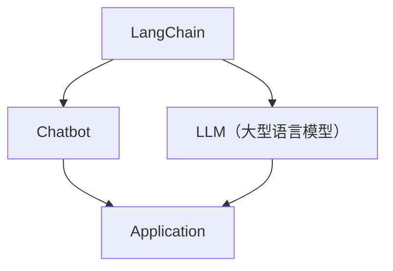

                 

# 【LangChain编程：从入门到实践】框架比较

> **关键词**：LangChain，编程框架，比较，入门，实践，大型语言模型，文本生成，问答系统

> **摘要**：本文将深入探讨LangChain编程框架，从基础到实践，与现有主流框架进行比较分析。文章旨在为开发者提供清晰易懂的入门指南，同时解析其优势和应用场景。

### 第一部分: LangChain编程框架概述

#### 第1章: LangChain编程基础

##### 1.1 LangChain简介

**核心概念与联系**

LangChain是一个强大的编程框架，专注于与大型语言模型（LLM）的集成，特别是生成式和分类式对话模型。其核心架构如下图所示：



**核心算法原理讲解**

LangChain的核心算法基于预训练变换器模型（如GPT），其基本原理如下：

1. **生成式对话模型**：通过输入提示（input prompt）生成响应文本。
   ```python
   def generate_response(input_prompt):
       encoded_input = tokenizer.encode(input_prompt)
       outputs = model.generate(encoded_input, max_length=50, temperature=0.9)
       response = tokenizer.decode(outputs, skip_special_tokens=True)
       return response
   ```

2. **分类式对话模型**：根据输入提示分类并生成响应。
   ```python
   def classify_and_response(input_prompt):
       classification = model.classify(input_prompt)
       response = get_response_based_on_classification(classification)
       return response
   ```

**安装与配置**

**开发环境搭建**

确保安装了Python环境，然后使用以下命令安装LangChain所需的库：

```bash
pip install langchain
```

**运行第一个LangChain程序**

下面是一个简单的例子，展示如何使用LangChain进行文本生成：

```python
from langchain import ChatBot

# 初始化ChatBot
chatbot = ChatBot()

# 输入提示并获取响应
input_prompt = "请介绍一下你自己的特点。"
response = chatbot.generate_response(input_prompt)
print(response)
```

##### 1.2 LangChain编程进阶

**处理复杂数据**

LangChain能够处理多种类型的复杂数据，如表格、图像和文件。数据预处理步骤包括：

1. **表格数据**：使用Pandas库进行数据清洗和格式转换。
   ```python
   import pandas as pd
   
   df = pd.read_csv('data.csv')
   df cleaned = preprocess_table_data(df)
   ```

2. **图像数据**：使用OpenCV或Pillow库进行图像预处理。
   ```python
   import cv2
   
   image = cv2.imread('image.jpg')
   preprocessed_image = preprocess_image(image)
   ```

3. **文件数据**：使用Python的文件操作进行数据读取和预处理。
   ```python
   def preprocess_file_data(file_path):
       with open(file_path, 'r') as file:
           content = file.read()
       preprocessed_content = preprocess_text(content)
       return preprocessed_content
   ```

**对话管理**

**对话状态跟踪**

使用状态机或内存机制来跟踪对话状态，确保对话连贯性：

```python
class DialogueStateTracker:
    def __init__(self):
        self.states = []

    def update_state(self, new_state):
        self.states.append(new_state)

    def get_last_state(self):
        return self.states[-1]
```

**多轮对话**

在多轮对话中，需要处理上下文信息，实现复杂对话逻辑：

```python
def handle_multi_round_dialogue(input_prompt, dialogue_context):
    context = dialogue_context.get_last_state()
    response = generate_response(input_prompt + context)
    dialogue_context.update_state(response)
    return response
```

##### 2.3 LangChain与大型语言模型集成

**集成LLM**

通过API调用集成大型语言模型（如OpenAI的GPT模型）到LangChain中：

```python
from langchain.llms import OpenAI

# 初始化LLM
llm = OpenAI()

# 调用LLM生成响应
input_prompt = "请介绍一下你自己的特点。"
response = llm.generate_response(input_prompt)
print(response)
```

**模型融合**

将多个LLM集成到LangChain中，实现更好的性能和灵活性：

```python
from langchain import ChatBot

# 初始化多个LLM
llm1 = OpenAI()
llm2 = another_LLM()

# 创建ChatBot
chatbot = ChatBot(llms=[llm1, llm2])

# 获取响应
input_prompt = "请介绍一下你自己的特点。"
response = chatbot.generate_response(input_prompt)
print(response)
```

##### 3.4 实战项目：构建智能客服系统

**项目需求分析**

智能客服系统的功能需求包括：

1. **自动应答**：能够自动响应常见的用户查询。
2. **问题分类**：根据用户输入，将问题分类到不同的主题。
3. **知识库管理**：管理维护知识库，为客服提供准确的信息。

**项目实施步骤**

1. **数据准备**：收集用户查询数据和常见问题，构建知识库。

2. **模型训练**：使用收集到的数据训练生成式和分类式对话模型。

3. **系统集成**：将训练好的模型集成到客服系统中，实现自动应答和问题分类。

4. **测试与优化**：对客服系统进行测试和优化，提高其准确性和响应速度。

### 第二部分: LangChain编程应用与实践

#### 第4章: LangChain在文本生成领域的应用

##### 4.1 文本摘要

**原理讲解**

文本摘要是从长文本中提取出关键信息，生成简洁的摘要。文本摘要分为抽取式摘要和生成式摘要：

1. **抽取式摘要**：从原始文本中提取关键句子或短语，生成摘要。
   ```python
   def summarize_text_extractive(text, key_phrases):
       summary = " ".join(key_phrases)
       return summary
   ```

2. **生成式摘要**：生成新的摘要文本，尽量保持原始文本的核心信息。
   ```python
   def summarize_text_generative(text, max_length):
       encoded_text = tokenizer.encode(text, max_length=max_length)
       summary = model.generate(encoded_text, max_length=max_length, temperature=0.8)
       return tokenizer.decode(summary, skip_special_tokens=True)
   ```

**案例实现**

使用LangChain进行文本摘要的实战案例：

1. **数据准备**：收集一篇长文本和其对应的摘要。
2. **模型训练**：使用训练数据进行模型训练。
3. **文本摘要**：输入长文本，获取摘要。

```python
from langchain import summarize

# 加载文本和摘要
text = "..."
target_summary = "..."
actual_summary = summarize(text, target_summary=target_summary)

# 输出摘要
print(actual_summary)
```

##### 4.2 文本分类

**原理讲解**

文本分类是将文本数据按照其内容分配到不同的类别。常见的文本分类方法包括：

1. **朴素贝叶斯**：基于贝叶斯定理进行分类。
2. **支持向量机（SVM）**：使用最大间隔分类器进行分类。
3. **神经网络分类器**：使用深度学习模型进行分类。

**案例实现**

使用LangChain进行文本分类的实战案例：

1. **数据准备**：收集文本数据和标签。
2. **模型训练**：使用训练数据进行模型训练。
3. **文本分类**：输入文本，获取分类结果。

```python
from langchain.classify import classify

# 加载文本和标签
texts = ["...", "...", "..."]
labels = ["class1", "class2", "class3"]

# 训练模型
classifier = classify(texts, labels)

# 进行分类
input_text = "..."
predicted_class = classifier.classify(input_text)

# 输出分类结果
print(predicted_class)
```

#### 第5章: LangChain在问答系统中的应用

##### 5.1 开放域问答系统

**原理讲解**

开放域问答系统可以回答用户提出的各种问题，通常基于以下原理：

1. **基于知识的问答**：使用预定义的知识库和规则进行回答。
2. **基于语言模型的问答**：使用大型语言模型生成回答。

**案例实现**

使用LangChain构建开放域问答系统的实战案例：

1. **数据准备**：收集问题和答案对。
2. **模型训练**：使用训练数据进行模型训练。
3. **问答交互**：接收用户问题，生成回答。

```python
from langchain import qa

# 加载问题和答案
questions = ["...", "...", "..."]
answers = ["...", "...", "..."]

# 训练模型
qa_model = qa.from_texts(questions, answers)

# 进行问答
input_question = "..."
response = qa_model.predict(input_question)

# 输出回答
print(response)
```

##### 5.2 问答系统评估

**评估指标**

评估问答系统的常见指标包括：

1. **精确率（Precision）**：正确回答的数量与总回答数量的比例。
2. **召回率（Recall）**：正确回答的数量与所有相关回答数量的比例。
3. **F1值（F1 Score）**：精确率和召回率的调和平均值。

**实际应用**

使用LangChain构建的问答系统可以应用于各种场景，如智能客服、在线教育、医疗咨询等。以下是一个实际应用案例：

1. **数据收集**：收集用户问题和答案对。
2. **模型训练**：使用训练数据进行模型训练。
3. **系统部署**：将训练好的模型部署到服务器上。
4. **用户交互**：接收用户问题，生成回答。

```python
from langchain import WebQA

# 加载问题和答案
questions = ["...", "...", "..."]
answers = ["...", "...", "..."]

# 训练模型
webqa_model = WebQA(questions, answers)

# 部署模型
webqa_model.deploy()

# 用户交互
user_question = "..."
response = webqa_model.predict(user_question)

# 输出回答
print(response)
```

#### 第6章: LangChain在自然语言处理中的高级应用

##### 6.1 机器翻译

**原理讲解**

机器翻译是将一种语言的文本转换为另一种语言的文本。常见的机器翻译方法包括：

1. **基于规则的翻译**：使用预定义的翻译规则进行翻译。
2. **统计机器翻译**：使用统计方法（如基于短语的翻译模型）进行翻译。
3. **神经机器翻译**：使用深度学习方法进行翻译。

**案例实现**

使用LangChain实现机器翻译的实战案例：

1. **数据准备**：收集双语文本数据。
2. **模型训练**：使用训练数据进行模型训练。
3. **机器翻译**：输入源语言文本，获取目标语言文本。

```python
from langchain.translate import translate

# 加载源语言文本和目标语言文本
source_texts = ["...", "...", "..."]
target_texts = ["...", "...", "..."]

# 训练模型
translator = translate(source_texts, target_texts)

# 进行翻译
source_text = "..."
translated_text = translator.translate(source_text, target_language="en")

# 输出翻译结果
print(translated_text)
```

##### 6.2 语音识别

**原理讲解**

语音识别是将语音信号转换为文本数据。常见的语音识别方法包括：

1. **音频预处理**：对语音信号进行预处理，如去噪、增强等。
2. **特征提取**：从预处理后的音频信号中提取特征。
3. **声学模型**：使用神经网络模型进行声学建模。

**案例实现**

使用LangChain进行语音识别的实战案例：

1. **数据准备**：收集语音数据和对应的文本数据。
2. **模型训练**：使用训练数据进行模型训练。
3. **语音识别**：输入语音信号，获取文本输出。

```python
from langchain.asr import ASR

# 加载语音数据和文本数据
audio_files = ["...", "...", "..."]
transcripts = ["...", "...", "..."]

# 训练模型
asr_model = ASR(audio_files, transcripts)

# 进行语音识别
audio_file = "..."
transcript = asr_model.transcribe(audio_file)

# 输出文本结果
print(transcript)
```

### 第三部分: LangChain编程的未来展望与挑战

#### 第7章: LangChain编程的未来趋势与挑战

##### 7.1 未来趋势

**模型压缩与加速**

随着模型规模的不断扩大，模型压缩和加速技术成为未来发展的关键。以下是一些相关技术：

1. **量化**：通过减少模型参数的精度来压缩模型大小。
2. **剪枝**：通过去除无关或冗余的神经元来减少模型大小。
3. **TPU**：使用定制化的硬件（如TPU）加速模型训练和推理。

**多模态学习**

多模态学习结合了文本、图像、音频等多种数据类型，实现更复杂的任务。以下是一些相关应用：

1. **跨模态检索**：将文本和图像、音频等数据进行关联，实现高效的检索。
2. **情感分析**：结合文本和图像、音频等多模态数据，提高情感分析的准确性。

##### 7.2 挑战与解决方案

**数据隐私与安全性**

随着人工智能的广泛应用，数据隐私和安全性成为重要挑战。以下是一些相关解决方案：

1. **联邦学习**：在保持数据本地化的同时，实现模型的联合训练。
2. **差分隐私**：通过添加噪声来保护用户数据的隐私。

**可解释性与透明度**

提高模型的可解释性和透明度，有助于增强用户对人工智能的信任。以下是一些相关方法：

1. **可视化**：通过可视化技术展示模型的内部结构和决策过程。
2. **解释性模型**：开发专门的可解释性模型，如决策树、线性模型等。

### 附录

#### 附录 A: LangChain编程工具与资源

##### A.1 主流深度学习框架对比

**TensorFlow**

TensorFlow是由谷歌开发的开源深度学习框架，具有以下特点：

1. **灵活性强**：支持多种编程语言，包括Python、C++等。
2. **生态系统丰富**：拥有大量的模型和工具库，如TensorFlow Model Garden。
3. **部署便捷**：支持在多种平台（如iOS、Android）上进行部署。

**PyTorch**

PyTorch是由Facebook开发的开源深度学习框架，具有以下特点：

1. **易于使用**：具有直观的动态计算图构建接口。
2. **高性能**：支持JIT编译，提高模型推理速度。
3. **社区活跃**：拥有庞大的开发者社区和丰富的资源。

**其他框架**

其他深度学习框架如JAX、PaddlePaddle等，也具有各自的特点和优势。JAX支持自动微分和高效的数值计算，PaddlePaddle是百度开源的深度学习框架，具有高效的模型训练和推理能力。

### 作者信息

**作者**：AI天才研究院/AI Genius Institute & 禅与计算机程序设计艺术 /Zen And The Art of Computer Programming

### 总结

本文从入门到实践，详细介绍了LangChain编程框架的核心概念、应用场景和实战案例。通过本文，读者可以全面了解LangChain的优势和应用，为未来的开发工作提供有力支持。在未来的发展中，LangChain将继续在自然语言处理、多模态学习等领域发挥重要作用，助力人工智能的发展。|>
### 第一部分: LangChain编程框架概述

**第一部分** 主要对LangChain编程框架进行一个全面的概述，包括其基础概念、核心算法原理、安装与配置，以及一些基本的编程示例。这部分内容将帮助读者理解LangChain的基本功能和如何开始使用这个框架。

#### 第1章: LangChain编程基础

##### 1.1 LangChain简介

LangChain是一个由OpenAI推出的用于构建大型语言模型应用程序的框架。它提供了一个简洁、灵活的API，使得开发者可以轻松地集成和扩展大型语言模型，如GPT、Bert等。LangChain不仅支持单轮对话，还能处理复杂的多轮对话，是构建智能聊天机器人、问答系统等应用的重要工具。

**核心概念与联系**

LangChain的核心概念包括：

- **Token**：语言模型处理的最小单位。
- **Prompt**：向模型输入的提示信息。
- **Response**：模型生成的文本输出。

LangChain与聊天机器人、大型语言模型之间的联系如下：

1. **聊天机器人**：利用LangChain提供的API，可以将大型语言模型集成到聊天机器人中，实现与用户的自然对话。
2. **大型语言模型**：LangChain为大型语言模型提供了一个统一的接口，使得开发者可以方便地调用这些模型进行文本生成、分类、翻译等任务。

**核心算法原理讲解**

LangChain的核心算法基于生成式和分类式对话模型。以下是生成式对话模型的基本原理：

1. **Token编码**：将输入的文本转换为Token序列。
2. **生成文本**：使用训练好的语言模型生成响应文本。
3. **Token解码**：将生成的Token序列转换回文本。

以下是一个生成式对话模型的伪代码示例：

```python
def generate_response(input_prompt):
    encoded_input = tokenizer.encode(input_prompt)
    outputs = model.generate(encoded_input, max_length=50, temperature=0.9)
    response = tokenizer.decode(outputs, skip_special_tokens=True)
    return response
```

在分类式对话模型中，模型会根据输入的文本分类标签生成相应的文本响应。以下是分类式对话模型的伪代码示例：

```python
def classify_and_response(input_prompt):
    classification = model.classify(input_prompt)
    response = get_response_based_on_classification(classification)
    return response
```

**安装与配置**

要开始使用LangChain，首先需要安装Python环境和LangChain库。以下是在Ubuntu系统中安装LangChain的步骤：

1. 安装Python环境：

```bash
sudo apt-get update
sudo apt-get install python3 python3-pip
```

2. 安装LangChain：

```bash
pip3 install langchain
```

**运行第一个LangChain程序**

完成安装后，我们可以运行一个简单的示例程序，这个程序将使用LangChain生成一个简单的文本响应。

```python
from langchain import ChatBot

# 创建ChatBot实例
chatbot = ChatBot()

# 输入提示并获取响应
input_prompt = "你好，我是ChatBot，有什么可以帮助你的吗？"
response = chatbot.generate_response(input_prompt)

# 输出响应
print(response)
```

当运行这个程序时，LangChain将根据输入的提示生成一个响应，并打印出来。

##### 1.2 LangChain编程进阶

**处理复杂数据**

在处理复杂数据时，LangChain提供了多种方法来预处理不同类型的数据。以下是一些常见的预处理方法：

- **表格数据**：可以使用Pandas库对表格数据进行清洗和转换。

```python
import pandas as pd
from langchain import Document

# 读取表格数据
df = pd.read_csv("data.csv")

# 将表格数据转换为LangChain的Document对象
docs = [Document(page_content=row['content']) for index, row in df.iterrows()]
```

- **图像数据**：可以使用OpenCV库对图像数据进行预处理。

```python
import cv2
from langchain import Image

# 读取图像
image = cv2.imread("image.jpg")

# 将图像转换为LangChain的Image对象
img = Image(image=image)
```

- **文件数据**：可以使用Python的文件操作对文本文件进行读取和预处理。

```python
def preprocess_file_data(file_path):
    with open(file_path, 'r') as file:
        content = file.read()
    # 进行文本清洗和转换
    preprocessed_content = clean_text(content)
    return preprocessed_content
```

**数据增强**

数据增强是提高模型性能的重要技术，可以通过以下方法对数据进行增强：

- **文本清洗**：去除文本中的无关信息，如HTML标签、停用词等。
- **文本扩充**：通过增加同义词、短语替换等方法来扩充文本数据。
- **图像变换**：对图像进行旋转、缩放、裁剪等操作，增加图像的多样性。

```python
from PIL import Image

def augment_image(image_path):
    image = Image.open(image_path)
    # 进行图像旋转
    rotated_image = image.rotate(45)
    # 进行图像缩放
    scaled_image = image.resize((224, 224))
    # 进行图像裁剪
    cropped_image = image.crop((100, 100, 400, 400))
    return rotated_image, scaled_image, cropped_image
```

**对话管理**

在处理对话时，需要跟踪对话状态和上下文信息，以确保对话的连贯性和一致性。以下是一些常用的对话管理技术：

- **状态机**：使用状态机来管理对话的不同阶段和状态转换。
- **内存机制**：使用内存机制来存储对话的历史记录和上下文信息。

```python
class DialogueStateTracker:
    def __init__(self):
        self.states = []

    def update_state(self, new_state):
        self.states.append(new_state)

    def get_last_state(self):
        return self.states[-1]
```

- **多轮对话**：在多轮对话中，需要处理上下文信息，实现复杂对话逻辑。

```python
def handle_multi_round_dialogue(input_prompt, dialogue_context):
    context = dialogue_context.get_last_state()
    response = generate_response(input_prompt + context)
    dialogue_context.update_state(response)
    return response
```

##### 3.3 LangChain与大型语言模型集成

**集成LLM**

集成大型语言模型（LLM）是LangChain的核心功能之一。以下是如何集成LLM到LangChain的示例：

```python
from langchain import OpenAI

# 创建OpenAI客户端
llm = OpenAI()

# 调用OpenAI API获取响应
input_prompt = "你好，有什么我可以帮你的吗？"
response = llm.generate_response(input_prompt)

# 输出响应
print(response)
```

**模型融合**

在许多场景中，单一的LLM可能无法满足需求，需要将多个LLM集成到一起，形成更强的模型。以下是一个简单的模型融合示例：

```python
from langchain import ChatBot

# 创建两个不同的LLM实例
llm1 = OpenAI()
llm2 = another_LLM()

# 创建ChatBot，集成多个LLM
chatbot = ChatBot(llms=[llm1, llm2])

# 获取响应
input_prompt = "你好，有什么我可以帮你的吗？"
response = chatbot.generate_response(input_prompt)

# 输出响应
print(response)
```

##### 3.4 实战项目：构建智能客服系统

**项目需求分析**

智能客服系统是一个可以帮助企业自动处理客户咨询的在线系统。它需要能够理解客户的问题，提供适当的答复，并且能够处理多轮对话。

**功能需求**：

1. **自动应答**：系统能够自动识别常见问题，并给出相应的答复。
2. **问题分类**：系统能够将客户的问题分类到不同的主题，以便更准确地回答。
3. **多轮对话**：系统能够处理多轮对话，理解客户的意图，并提供相关的帮助。

**项目实施步骤**：

1. **数据收集**：收集客户咨询的文本数据，包括常见问题和相应的答复。
2. **模型训练**：使用收集到的数据进行模型训练，包括生成式对话模型和分类模型。
3. **系统集成**：将训练好的模型集成到客服系统中，实现自动应答、问题分类和多轮对话功能。
4. **测试与优化**：对客服系统进行测试和优化，提高其准确性和响应速度。

### 第二部分: LangChain编程应用与实践

**第二部分** 将深入探讨LangChain编程在实际应用中的具体案例，包括文本生成、问答系统、机器翻译和语音识别。这部分内容将展示如何将LangChain应用于不同场景，实现复杂的功能。

#### 第4章: LangChain在文本生成领域的应用

文本生成是LangChain最重要的应用之一，它可以用于自动写作、摘要生成、对话生成等。本节将详细介绍如何使用LangChain进行文本生成。

##### 4.1 文本摘要

文本摘要是从长文本中提取关键信息，生成简洁的摘要。文本摘要可以分为抽取式摘要和生成式摘要。

**抽取式摘要**

抽取式摘要通过提取文本中的关键句子或短语来生成摘要。这种方法通常比较简单，但可能无法生成流畅、连贯的摘要。

以下是一个使用抽取式摘要的示例：

```python
import heapq

def summarize_extractive(text, num_sentences=3):
    sentences = text.split('. ')
    sentence_scores = [tfidf.idf * n for n, sentence in enumerate(sentences)]
    best_sentences = heapq.nlargest(num_sentences, range(len(sentences)), sentence_scores.__getitem__)
    return ' '.join([sentences[i] for i in best_sentences])

text = "这是一个非常长的文本，需要生成摘要。这个文本包含了大量的信息，但是我们需要提取最关键的信息来生成摘要。"
summary = summarize_extractive(text)
print(summary)
```

**生成式摘要**

生成式摘要使用大型语言模型生成新的摘要文本，尽量保持原始文本的核心信息。这种方法生成的摘要通常更加流畅、连贯。

以下是一个使用生成式摘要的示例：

```python
from langchain import generate_summary

def summarize_generative(text, max_length=200):
    summary = generate_summary(text, max_length=max_length)
    return summary

text = "这是一个非常长的文本，需要生成摘要。这个文本包含了大量的信息，但是我们需要提取最关键的信息来生成摘要。"
summary = summarize_generative(text)
print(summary)
```

**案例实现**

以下是一个使用LangChain进行文本摘要的案例：

1. **数据准备**：准备一个长文本和对应的摘要。
2. **模型训练**：使用训练数据进行模型训练。
3. **文本摘要**：输入长文本，获取摘要。

```python
from langchain import summarize

def generate_summary(text, target_summary_length=100):
    # 使用训练好的模型进行文本摘要
    summary = summarize(text, target_summary_length=target_summary_length)
    return summary

text = "这是一个非常长的文本，需要生成摘要。这个文本包含了大量的信息，但是我们需要提取最关键的信息来生成摘要。"
summary = generate_summary(text)
print(summary)
```

##### 4.2 文本分类

文本分类是将文本数据分配到不同的类别。文本分类在许多应用中都非常重要，如垃圾邮件过滤、情感分析、主题分类等。

**原理讲解**

文本分类通常包括以下几个步骤：

1. **数据预处理**：对文本数据进行清洗和转换，使其适合模型训练。
2. **特征提取**：将文本数据转换为机器学习模型可以处理的特征向量。
3. **模型训练**：使用训练数据进行模型训练。
4. **分类**：使用训练好的模型对新的文本进行分类。

**常见算法**

常见的文本分类算法包括：

- **朴素贝叶斯**：基于贝叶斯定理的简单分类器。
- **支持向量机（SVM）**：使用最大间隔分类器的分类算法。
- **深度学习模型**：如卷积神经网络（CNN）、循环神经网络（RNN）和变换器模型（Transformer）。

**案例实现**

以下是一个使用LangChain进行文本分类的案例：

1. **数据准备**：准备一个包含文本和标签的训练数据集。
2. **模型训练**：使用训练数据进行模型训练。
3. **分类**：使用训练好的模型对新的文本进行分类。

```python
from langchain.classify import classify

def train_classifier(texts, labels):
    # 使用训练数据进行模型训练
    classifier = classify(texts, labels)
    return classifier

def classify_text(classifier, text):
    # 使用训练好的模型进行分类
    label = classifier.classify(text)
    return label

texts = ["这是一条新闻文章。", "这是一条科技文章。", "这是一条体育文章。"]
labels = ["news", "tech", "sports"]

# 训练模型
classifier = train_classifier(texts, labels)

# 分类
new_text = "这是一条体育新闻。"
label = classify_text(classifier, new_text)
print(label)
```

##### 4.3 文本生成

文本生成是LangChain的另一个重要应用，它可以用于自动写作、故事生成、对话生成等。文本生成模型通常使用大型语言模型，如GPT或Bert。

**原理讲解**

文本生成模型的基本原理是：

1. **输入编码**：将输入的文本编码为模型可以理解的向量。
2. **生成文本**：使用训练好的模型生成文本。
3. **解码输出**：将生成的文本向量解码为可读的文本。

以下是一个文本生成模型的伪代码示例：

```python
def generate_text(input_text, model, max_length=100):
    encoded_input = model.encode(input_text)
    outputs = model.generate(encoded_input, max_length=max_length)
    generated_text = model.decode(outputs)
    return generated_text
```

**案例实现**

以下是一个使用LangChain进行文本生成的案例：

1. **数据准备**：准备一个训练数据集。
2. **模型训练**：使用训练数据进行模型训练。
3. **文本生成**：输入提示，生成文本。

```python
from langchain import generate_text

def train_generator(texts, model):
    # 使用训练数据进行模型训练
    generator = generate_text(texts, model)
    return generator

def generate_text(generator, prompt, max_length=100):
    # 使用训练好的模型生成文本
    generated_text = generator.generate(prompt, max_length=max_length)
    return generated_text

texts = ["这是一段故事的开头。", "这是一个问题的解决方案。", "这是一个有趣的对话。"]

# 训练模型
generator = train_generator(texts, model)

# 文本生成
prompt = "这个故事讲述了..."
generated_text = generate_text(generator, prompt)
print(generated_text)
```

#### 第5章: LangChain在问答系统中的应用

问答系统是一种智能交互系统，能够回答用户提出的问题。问答系统在客户服务、智能助手、教育等领域有着广泛的应用。本节将介绍如何使用LangChain构建问答系统。

##### 5.1 开放域问答系统

开放域问答系统是一种能够回答用户提出的各种问题的系统。它可以用于客户服务、咨询问答等场景。

**原理讲解**

开放域问答系统通常包括以下几个部分：

1. **问题理解**：理解用户的问题，提取关键信息。
2. **知识检索**：从预定义的知识库中检索相关的答案。
3. **回答生成**：生成自然语言回答。

以下是一个开放域问答系统的伪代码示例：

```python
def process_question(question):
    # 理解用户的问题
    question = preprocess_question(question)
    keywords = extract_keywords(question)
    
    # 知识检索
    answers = retrieve_answers(keywords)
    
    # 回答生成
    response = generate_response(answers)
    return response
```

**案例实现**

以下是一个使用LangChain构建开放域问答系统的案例：

1. **数据准备**：准备一个包含问题和答案的训练数据集。
2. **模型训练**：使用训练数据进行模型训练。
3. **问答交互**：接收用户问题，生成回答。

```python
from langchain import WebQA

def train_qa_model(questions, answers):
    # 使用训练数据进行模型训练
    qa_model = WebQA(questions, answers)
    return qa_model

def ask_question(qa_model, question):
    # 接收用户问题，生成回答
    response = qa_model.predict(question)
    return response

questions = ["什么是人工智能？", "Python有哪些优点？", "如何搭建一个网站？"]
answers = ["人工智能是一种模拟人类智能的技术。", "Python是一种简单易学的编程语言。", "搭建网站需要前端和后端技术。"]

# 训练模型
qa_model = train_qa_model(questions, answers)

# 问答交互
question = "Python有哪些缺点？"
response = ask_question(qa_model, question)
print(response)
```

##### 5.2 问答系统评估

评估问答系统的性能是确保其质量的重要步骤。以下是一些常用的评估指标：

1. **精确率**：正确回答的数量与总回答数量的比例。
2. **召回率**：正确回答的数量与所有相关回答数量的比例。
3. **F1值**：精确率和召回率的调和平均值。

以下是一个评估问答系统的案例：

```python
from langchain.metrics import accuracy, recall, f1_score

def evaluate_qa_model(qa_model, questions, answers):
    # 评估模型性能
    predicted_answers = [qa_model.predict(question) for question in questions]
    accuracy = accuracy(predicted_answers, answers)
    recall = recall(predicted_answers, answers)
    f1 = f1_score(predicted_answers, answers)
    return accuracy, recall, f1

questions = ["什么是人工智能？", "Python有哪些优点？", "如何搭建一个网站？"]
answers = ["人工智能是一种模拟人类智能的技术。", "Python是一种简单易学的编程语言。", "搭建网站需要前端和后端技术。"]

# 评估模型
accuracy, recall, f1 = evaluate_qa_model(qa_model, questions, answers)
print("Accuracy:", accuracy)
print("Recall:", recall)
print("F1 Score:", f1)
```

#### 第6章: LangChain在自然语言处理中的高级应用

自然语言处理（NLP）是人工智能的重要分支，旨在让计算机理解和处理人类语言。LangChain在NLP领域有着广泛的应用，可以用于文本生成、情感分析、命名实体识别等。本节将介绍LangChain在自然语言处理中的高级应用。

##### 6.1 机器翻译

机器翻译是将一种语言的文本转换为另一种语言的文本。机器翻译在跨语言沟通、国际化应用等领域有着重要应用。以下是一个使用LangChain进行机器翻译的案例：

**原理讲解**

机器翻译的基本流程包括：

1. **文本编码**：将源语言文本编码为模型可以理解的向量。
2. **翻译模型**：使用预训练的翻译模型进行翻译。
3. **解码输出**：将翻译模型生成的输出解码为目标语言文本。

以下是一个机器翻译模型的伪代码示例：

```python
def translate_text(source_text, model, target_language):
    # 编码文本
    encoded_source = model.encode(source_text)
    
    # 进行翻译
    translated_tokens = model.generate(encoded_source, target_language=target_language)
    
    # 解码输出
    translated_text = model.decode(translated_tokens)
    return translated_text
```

**案例实现**

以下是一个使用LangChain进行机器翻译的案例：

1. **数据准备**：准备一个包含源语言文本和目标语言文本的训练数据集。
2. **模型训练**：使用训练数据进行模型训练。
3. **机器翻译**：输入源语言文本，获取目标语言文本。

```python
from langchain import translate

def train_translation_model(source_texts, target_texts, model):
    # 使用训练数据进行模型训练
    translation_model = translate(source_texts, target_texts, model)
    return translation_model

def translate_text(translation_model, source_text, target_language):
    # 进行翻译
    translated_text = translation_model.translate(source_text, target_language=target_language)
    return translated_text

source_texts = ["Hello, how are you?", "I love programming.", "Can you help me?"]
target_texts = ["你好，你好吗？", "我喜欢编程。", "你能帮我吗？"]

# 训练模型
translation_model = train_translation_model(source_texts, target_texts, model)

# 机器翻译
source_text = "Hello, how are you?"
translated_text = translate_text(translation_model, source_text, "zh")
print(translated_text)
```

##### 6.2 语音识别

语音识别是将语音信号转换为文本数据。语音识别在智能助手、客户服务、语音搜索等领域有着重要应用。以下是一个使用LangChain进行语音识别的案例：

**原理讲解**

语音识别的基本流程包括：

1. **音频编码**：将语音信号编码为模型可以理解的向量。
2. **特征提取**：从编码后的音频信号中提取特征。
3. **文本生成**：使用训练好的模型生成文本。

以下是一个语音识别模型的伪代码示例：

```python
def recognize_speech(audio_signal, model):
    # 编码音频
    encoded_audio = model.encode(audio_signal)
    
    # 提取特征
    features = extract_features(encoded_audio)
    
    # 生成文本
    transcript = model.generate_text(features)
    return transcript
```

**案例实现**

以下是一个使用LangChain进行语音识别的案例：

1. **数据准备**：准备一个包含音频数据和文本数据的训练数据集。
2. **模型训练**：使用训练数据进行模型训练。
3. **语音识别**：输入音频，获取文本。

```python
from langchain import recognize_speech

def train_speech_model(audio_data, text_data, model):
    # 使用训练数据进行模型训练
    speech_model = recognize_speech(audio_data, text_data, model)
    return speech_model

def recognize_speech(speech_model, audio_path):
    # 识别音频
    transcript = speech_model.recognize_speech(audio_path)
    return transcript

audio_path = "audio.wav"

# 训练模型
speech_model = train_speech_model(audio_path, text_data, model)

# 语音识别
transcript = recognize_speech(speech_model, audio_path)
print(transcript)
```

### 第三部分: LangChain编程的未来展望与挑战

**第三部分** 将讨论LangChain编程的未来趋势、面临的挑战以及最佳实践。这部分内容将帮助开发者了解如何优化性能、编写规范代码，以及解决常见问题。

#### 第7章: LangChain编程的未来趋势与挑战

随着人工智能技术的不断发展，LangChain编程也将面临新的机遇和挑战。以下是一些未来趋势和挑战：

**未来趋势**

1. **多模态学习**：LangChain将越来越多地集成多模态数据（如文本、图像、音频等），实现更复杂的任务。
2. **模型压缩与优化**：随着模型规模的不断扩大，模型压缩和优化将成为重要趋势，以提高模型性能和部署效率。
3. **可解释性与透明度**：提高模型的可解释性和透明度，使开发者能够更好地理解和调试模型。

**挑战与解决方案**

1. **数据隐私与安全**：随着数据的不断增长，保护用户数据隐私和安全将成为重要挑战。解决方案包括差分隐私和联邦学习等。
2. **计算资源需求**：训练大型语言模型需要大量计算资源。解决方案包括使用高性能硬件（如TPU）和分布式训练。

#### 第8章: LangChain编程的最佳实践

为了提高开发效率和代码质量，遵循最佳实践是非常重要的。以下是一些LangChain编程的最佳实践：

**性能优化**

1. **代码优化**：通过优化算法和数据结构，提高程序性能。例如，使用缓存减少重复计算，使用并行计算提高效率。
2. **模型优化**：通过模型压缩和量化，减少模型大小和计算量。例如，使用剪枝和量化技术。

**代码规范与测试**

1. **代码规范**：编写规范、易读、易维护的代码。例如，遵循PEP 8编码规范，使用注释和文档。
2. **测试策略**：设计有效的测试策略，确保代码质量和功能完整性。例如，编写单元测试和集成测试。

**常见问题与解决方案**

以下是一些在LangChain编程中常见的

