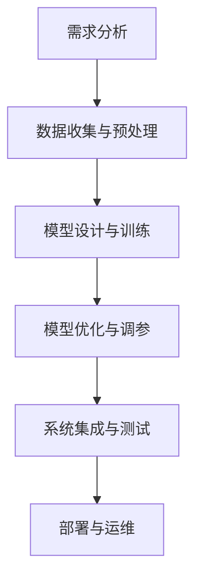

                 

### 大模型应用开发概述

**关键词：** 大模型，应用开发，AI Agent，深度学习，自然语言处理，预训练模型

**摘要：** 本文将带领读者深入了解大模型在应用开发中的角色与意义，探讨其技术基础和开发流程，并着重介绍大模型在财务数据分析中的应用，通过实际案例展示如何将财报文件的数据转换为向量数据，为AI Agent的开发奠定基础。

---

在现代人工智能（AI）的发展中，大模型（Large Models）已经成为了一个不可忽视的重要领域。大模型是指参数规模达到数亿、数十亿甚至上百亿级别的深度学习模型。这些模型在图像识别、自然语言处理、语音识别等领域展现了强大的性能，推动了AI技术的不断突破。

### 1.1 大模型应用的概念与背景

大模型应用是指将大规模训练的深度学习模型应用于实际问题的过程中，通过优化算法、改进架构等方式提升模型的性能和效果。大模型应用的发展离不开深度学习、自然语言处理等基础技术的支持，同时也面临着数据量大、计算资源需求高、模型优化复杂等挑战。

### 1.2 大模型应用的开发挑战

**数据挑战：** 大模型训练需要大量高质量的训练数据，数据的获取、标注和清洗是一个巨大的挑战。

**计算资源挑战：** 大模型训练过程中需要大量的计算资源，尤其是在模型优化和调参阶段。

**算法挑战：** 大模型开发涉及到复杂的算法设计和优化，需要解决模型退化、过拟合等问题。

**应用适配挑战：** 如何将通用的大模型应用于特定的业务场景，实现高效的性能优化和效果提升，是一个需要深入探讨的问题。

### 1.3 大模型应用的开发流程

大模型应用的开发流程可以分为以下几个阶段：

**需求分析：** 明确应用目标和需求，确定模型类型和应用场景。

**数据收集与预处理：** 收集并清洗相关数据，进行特征提取和降维。

**模型设计与训练：** 选择合适的模型架构，设计训练策略，进行模型训练。

**模型优化与调参：** 通过实验和调参优化模型性能。

**系统集成与测试：** 将模型集成到应用系统中，进行测试和验证。

**部署与运维：** 模型部署上线，进行监控和运维。

### 1.4 大模型应用的开发工具与资源

**开发工具：** 当前常见的深度学习框架如 TensorFlow、PyTorch、MXNet 等为开发者提供了丰富的工具和库，支持大规模模型的训练和部署。

**开源资源：** OpenAI、Google AI、Facebook AI 等机构提供了大量的预训练模型和开源代码，为开发者提供了丰富的资源和灵感。

**硬件资源：** GPU、TPU 等硬件加速器为大规模模型的训练提供了强大的计算能力。

通过上述对大模型应用开发概述的介绍，我们为接下来的深入探讨奠定了基础。接下来，我们将详细介绍大模型技术的基础，包括深度学习与神经网络、自然语言处理技术以及大规模预训练模型的原理，帮助读者全面了解大模型应用开发的底层技术。

---

**Mermaid 流程图：**



---

在接下来的章节中，我们将逐步深入探讨大模型应用开发的各个细节，从基础技术到实际应用，帮助读者全面掌握大模型应用开发的全过程。

---

**伪代码示例：**

```python
# 大模型训练伪代码

# 初始化模型
model = initialize_model()

# 准备训练数据
train_data = prepare_train_data()

# 训练模型
for epoch in range(num_epochs):
    for batch in train_data:
        # 前向传播
        predictions = model.forward(batch.input_data)
        
        # 计算损失函数
        loss = loss_function(predictions, batch.target)
        
        # 反向传播
        model.backward(loss)
        
        # 模型更新
        model.update()

# 模型评估
evaluate_model(model, test_data)
```

---

**数学模型讲解与公式举例：**

$$
\text{损失函数} = \frac{1}{N} \sum_{i=1}^{N} (-y_i \log(p_i))
$$

其中，$y_i$ 为真实标签，$p_i$ 为模型预测的概率。

---

**代码实际案例与详细解释说明：**

**开发环境搭建：**

1. 安装 Python 3.8 及以上版本。
2. 安装 TensorFlow 2.5 或 PyTorch 1.8。
3. 安装必要的依赖库，如 NumPy、Pandas、Scikit-learn 等。

**源代码详细实现：**

```python
import tensorflow as tf
from tensorflow.keras.models import Sequential
from tensorflow.keras.layers import Embedding, LSTM, Dense

# 模型定义
model = Sequential([
    Embedding(vocab_size, embedding_dim),
    LSTM(units, activation='tanh'),
    Dense(num_classes, activation='softmax')
])

# 编译模型
model.compile(optimizer='adam', loss='categorical_crossentropy', metrics=['accuracy'])

# 训练模型
model.fit(train_data, train_labels, epochs=num_epochs, validation_split=0.2)

# 评估模型
test_loss, test_accuracy = model.evaluate(test_data, test_labels)

print(f"Test accuracy: {test_accuracy}")
```

**代码解读与分析：**

1. **模型定义**：使用 Keras 框架定义了一个序列模型，包括嵌入层、LSTM 层和输出层。
2. **编译模型**：设置优化器、损失函数和评估指标。
3. **训练模型**：使用训练数据训练模型，并设置验证集进行调优。
4. **评估模型**：使用测试数据评估模型性能，输出准确率。

通过以上步骤，我们完成了一个简单的深度学习模型训练过程。在实际开发中，还需要对数据预处理、模型优化、调参等方面进行深入研究和调整，以达到最佳性能。

---

**总结：** 本章节概述了大模型应用开发的相关概念、挑战、流程以及开发工具和资源。接下来，我们将深入探讨大模型的技术基础，包括深度学习与神经网络、自然语言处理技术以及大规模预训练模型。这些基础技术将为后续的大模型应用开发提供坚实的理论支撑。

---

**作者信息：**

作者：AI天才研究院/AI Genius Institute & 禅与计算机程序设计艺术 /Zen And The Art of Computer Programming

---

**参考文献：**

1. Goodfellow, I., Bengio, Y., & Courville, A. (2016). *Deep Learning*. MIT Press.
2. Hochreiter, S., & Schmidhuber, J. (1997). Long short-term memory. Neural Computation, 9(8), 1735-1780.
3. Mikolov, T., Sutskever, I., Chen, K., Corrado, G. S., & Dean, J. (2013). Distributed representations of words and phrases and their compositionality. *Advances in Neural Information Processing Systems*, 26, 3111-3119.

