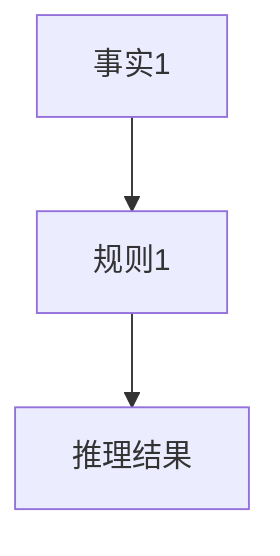
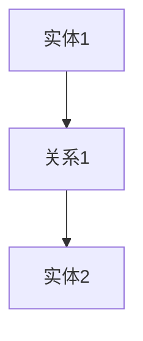
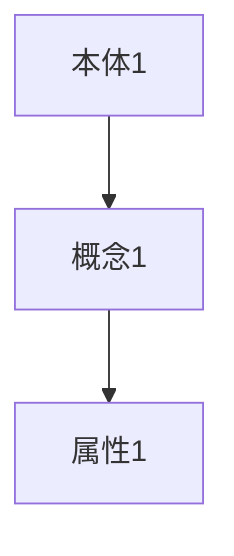
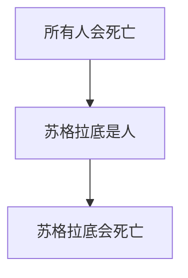
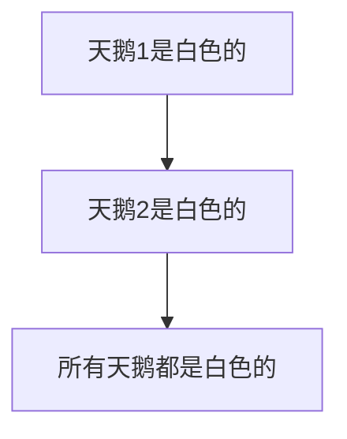
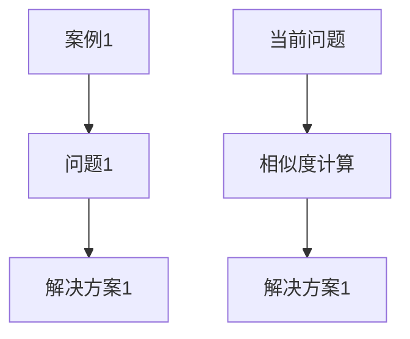
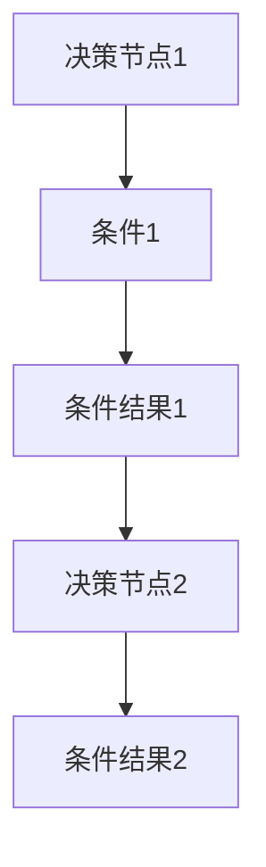
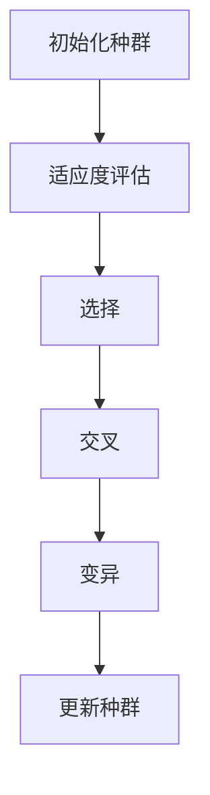
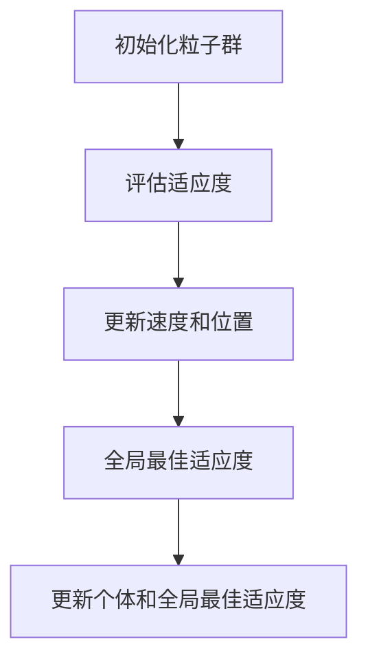

                 

# 【大模型应用开发 动手做AI Agent】那么，究竟何谓Agent？

> **关键词：**AI Agent、智能体、知识表示、推理方法、决策理论、优化算法、应用场景、开发工具与框架

> **摘要：**本文深入探讨了AI Agent的定义、分类、知识表示与推理方法、决策理论与优化算法，以及其在自然语言处理、计算机视觉、游戏等领域的应用，最后通过实战项目展示了AI Agent的开发过程和工具使用。通过本文，读者将全面了解AI Agent的概念、原理和应用，为实际开发AI Agent奠定基础。

---

## 第一部分: AI Agent基础理论

### 第1章: AI Agent的定义与分类

#### 1.1 AI Agent的定义

**AI Agent**，即人工智能代理，是一种模拟人类智能行为，能够感知环境、制定决策并执行相应动作的智能实体。Agent在计算机科学和人工智能领域有着广泛的应用，包括自然语言处理、计算机视觉、游戏智能等。

一个典型的AI Agent通常具备以下几个基本特征：

1. **感知能力**：Agent能够感知外部环境，获取环境信息，如图像、声音、文本等。
2. **决策能力**：Agent根据感知到的环境信息，通过某种决策模型，选择合适的动作。
3. **执行能力**：Agent能够执行所选动作，如移动、点击、发送信息等。
4. **适应性**：Agent能够根据环境变化调整自己的行为，优化决策过程。

#### 1.2 AI Agent的分类

AI Agent可以按照不同的分类标准进行分类。以下是几种常见的分类方式：

### 1.2.1 基于反应的Agent

**基于反应的Agent**（Reactive Agent）是最简单的一种Agent类型。它们通过预定义的规则或模式匹配来决策，不存储关于环境的历史信息，也不具备学习能力。例如，交通信号灯控制器可以根据交通信号灯的颜色做出决策。

**优点**：实现简单，适合规则明确、环境变化不大的场景。

**缺点**：缺乏灵活性和适应性，无法处理复杂和动态变化的场景。

### 1.2.2 基于模型的Agent

**基于模型的Agent**（Model-Based Agent）使用某种模型来表示环境，并根据模型进行决策。这些模型可以是确定性模型（如物理模型），也可以是概率模型（如马尔可夫决策过程MDP）。

**优点**：能够处理复杂的环境，具备较强的预测能力。

**缺点**：需要较长的训练时间和计算资源，对环境变化的适应性较差。

### 1.2.3 基于学习的Agent

**基于学习的Agent**（Learning-Based Agent）通过机器学习或深度学习技术，从历史数据中学习环境模式，并据此做出决策。这类Agent能够自适应环境变化，提高决策质量。

**优点**：具备较强的适应性和学习能力，能够处理复杂和动态变化的场景。

**缺点**：需要大量数据进行训练，模型解释性较差。

### 1.2.4 基于混合的Agent

**基于混合的Agent**（Hybrid Agent）结合了基于反应、基于模型和基于学习的Agent的优点，根据不同场景和需求，动态选择合适的决策策略。例如，在复杂的环境中，Agent可能采用基于模型的决策策略，而在规则明确的环境中，则采用基于反应的决策策略。

#### 1.3 AI Agent的应用场景

**AI Agent**在许多领域都有广泛的应用，以下是几个常见的应用场景：

### 1.3.1 自然语言处理

AI Agent可以用于文本分类、情感分析、机器翻译、问答系统等任务。例如，基于Transformer模型的BERT模型在自然语言处理任务上取得了很好的性能。

### 1.3.2 计算机视觉

AI Agent可以用于图像分类、目标检测、图像分割、图像生成等任务。例如，基于卷积神经网络的YOLO模型在目标检测任务上表现优异。

### 1.3.3 游戏智能

AI Agent可以用于棋类游戏、策略游戏、模拟游戏等。例如，基于深度强化学习的AlphaGo在围棋比赛中击败了世界冠军。

### 1.3.4 机器人控制

AI Agent可以用于机器人自主导航、路径规划、环境感知等。例如，基于粒子群优化的机器人路径规划算法。

### 第2章: 知识表示与推理

#### 2.1 知识表示方法

知识表示是将人类知识转化为计算机可以处理的形式。以下是几种常见的知识表示方法：

### 2.1.1 符号表示法

符号表示法使用符号和逻辑语言来表示知识。例如，使用谓词逻辑表示事实和规则。



### 2.1.2 语义网络

语义网络使用节点和边来表示实体及其关系。例如，使用节点表示实体，边表示实体之间的关系。



### 2.1.3 本体论

本体论使用本体来组织和管理知识。本体是一个共享的概念模型，用于明确的表述知识。



#### 2.2 推理方法

推理是从已知事实中得出新结论的过程。以下是几种常见的推理方法：

### 2.2.1 演绎推理

演绎推理是从一般到特殊的推理过程。例如，从“所有人都会死亡”得出“苏格拉底会死亡”的结论。



### 2.2.2 归纳推理

归纳推理是从特殊到一般的推理过程。例如，从“所有天鹅都是白色的”得出“所有天鹅都是白色的”的结论。



### 2.2.3 基于案例的推理

基于案例的推理使用历史案例来解决问题。例如，从“解决了一个类似的案例”得出“可以使用相同的方法解决这个问题”的结论。



#### 2.3 知识表示与推理的应用

知识表示与推理在许多领域都有广泛的应用，以下是几个常见的应用场景：

### 2.3.1 自然语言处理

知识表示与推理可以用于语义分析、文本生成等。例如，使用本体论来表示语义信息，使用演绎推理来分析文本结构。

### 2.3.2 计算机视觉

知识表示与推理可以用于图像识别、图像分类等。例如，使用语义网络来表示图像特征，使用归纳推理来识别图像类别。

### 2.3.3 智能问答

知识表示与推理可以用于智能问答系统。例如，使用语义网络来表示知识库，使用演绎推理来回答用户的问题。

### 第3章: 决策理论与优化算法

#### 3.1 决策理论

决策理论是一种研究决策过程和决策结果的数学方法。以下是几个重要的决策理论概念：

### 3.1.1 效用理论

效用理论衡量决策结果的优劣。效用是一个主观的指标，用于表示决策结果的价值。

```latex
U(S) = \sum_{i=1}^{n} p_i \cdot u_i
```

其中，$U(S)$表示总效用，$p_i$表示第$i$个结果的概率，$u_i$表示第$i$个结果的价值。

### 3.1.2 风险理论

风险理论衡量决策结果的不确定性。风险是一个客观的指标，用于表示决策结果的可能损失。

```latex
R(S) = \sum_{i=1}^{n} p_i \cdot l_i
```

其中，$R(S)$表示总风险，$p_i$表示第$i$个结果的概率，$l_i$表示第$i$个结果的损失。

### 3.1.3 决策树

决策树是一种常用的决策模型。它通过一系列条件判断来选择最佳决策路径。



#### 3.2 优化算法

优化算法用于求解最优化问题，即找到最优解。以下是几种常见的优化算法：

### 3.2.1 线性规划

线性规划用于解决线性目标函数最大化或最小化问题。

```latex
\min_{x} c^T x \\
s.t. \\
Ax \leq b
```

其中，$c$为权重系数，$x$为变量，$A$和$b$为约束条件。

### 3.2.2 遗传算法

遗传算法模拟自然进化过程来优化问题。



### 3.2.3 粒子群优化

粒子群优化模拟鸟群或鱼群觅食行为来优化问题。



#### 3.3 决策理论与优化算法的应用

决策理论与优化算法在许多领域都有广泛的应用，以下是几个常见的应用场景：

### 3.3.1 金融投资

决策理论与优化算法可以用于金融投资策略的制定。例如，使用效用理论来评估投资风险和收益。

### 3.3.2 资源分配

决策理论与优化算法可以用于资源分配问题。例如，使用线性规划来优化资源分配策略。

### 3.3.3 生产调度

决策理论与优化算法可以用于生产调度问题。例如，使用遗传算法来优化生产计划。

### 第二部分: AI Agent应用实战

#### 第4章: AI Agent在自然语言处理中的应用

##### 4.1 文本分类

文本分类是将文本分为不同类别的任务。以下是文本分类的主要步骤：

### 4.1.1 数据预处理

数据预处理包括去除停用词、分词、词向量化等步骤。这些步骤有助于提高模型的性能。

```python
from sklearn.feature_extraction.text import TfidfVectorizer
from sklearn.model_selection import train_test_split

# 加载数据
data = ...

# 数据预处理
vectorizer = TfidfVectorizer(stop_words='english')
X = vectorizer.fit_transform(data['text'])
y = data['label']

# 划分训练集和测试集
X_train, X_test, y_train, y_test = train_test_split(X, y, test_size=0.2, random_state=42)
```

### 4.1.2 模型选择

模型选择包括朴素贝叶斯、支持向量机、深度神经网络等。选择合适的模型对分类效果至关重要。

```python
from sklearn.naive_bayes import MultinomialNB
from sklearn.svm import SVC
from sklearn.ensemble import RandomForestClassifier
from sklearn.neural_network import MLPClassifier

# 模型训练
model = MultinomialNB()
# model = SVC()
# model = RandomForestClassifier()
# model = MLPClassifier()
model.fit(X_train, y_train)

# 模型评估
accuracy = model.score(X_test, y_test)
print(f"Accuracy: {accuracy}")
```

### 4.1.3 模型训练与评估

模型训练与评估包括训练模型、验证模型、测试模型等步骤。常用的评估指标包括准确率、召回率、F1分数等。

```python
from sklearn.metrics import classification_report

# 模型评估
predictions = model.predict(X_test)
print(classification_report(y_test, predictions))
```

##### 4.2 机器翻译

机器翻译是将一种语言的文本翻译成另一种语言的任务。以下是机器翻译的主要步骤：

### 4.2.1 数据预处理

数据预处理包括去除停用词、分词、词向量化等步骤。这些步骤有助于提高模型的性能。

```python
from keras.preprocessing.text import Tokenizer
from keras.preprocessing.sequence import pad_sequences

# 加载数据
data = ...

# 数据预处理
tokenizer = Tokenizer()
tokenizer.fit_on_texts(data['source'])
X = tokenizer.texts_to_sequences(data['source'])
y = tokenizer.texts_to_sequences(data['target'])

# 划分训练集和测试集
X_train, X_test, y_train, y_test = train_test_split(X, y, test_size=0.2, random_state=42)

# 序列填充
max_length = 100
X_train = pad_sequences(X_train, maxlen=max_length)
X_test = pad_sequences(X_test, maxlen=max_length)
```

### 4.2.2 模型选择

模型选择包括基于规则的方法、统计机器翻译、神经机器翻译等。目前，神经机器翻译（如Seq2Seq模型、Transformer模型）是最流行的方法。

```python
from keras.models import Sequential
from keras.layers import Embedding, LSTM, Dense

# 模型训练
model = Sequential()
model.add(Embedding(input_dim=vocab_size, output_dim=embed_size, input_length=max_length))
model.add(LSTM(units=128, return_sequences=True))
model.add(Dense(units=target_vocab_size, activation='softmax'))

model.compile(optimizer='rmsprop', loss='categorical_crossentropy', metrics=['accuracy'])
model.fit(X_train, y_train, epochs=10, batch_size=64)
```

### 4.2.3 模型训练与评估

模型训练与评估包括训练模型、验证模型、测试模型等步骤。常用的评估指标包括BLEU评分、NIST评分等。

```python
from keras.models import load_model
from keras.metrics import categorical_accuracy

# 模型评估
model = load_model('model.h5')
loss, accuracy = model.evaluate(X_test, y_test)
print(f"BLEU Score: {BLEU_score(y_test, model.predict(X_test))}")
```

##### 4.3 问答系统

问答系统是一种能够回答用户问题的系统。以下是问答系统的主要步骤：

### 4.3.1 数据预处理

数据预处理包括去除停用词、分词、词向量化等步骤。这些步骤有助于提高模型的性能。

```python
from nltk.tokenize import word_tokenize

# 加载数据
data = ...

# 数据预处理
tokenized_data = [word_tokenize(text.lower()) for text in data['question']]
```

### 4.3.2 模型选择

模型选择包括基于规则的方法、统计方法、基于机器学习的方法、基于深度学习的方法等。

```python
from sklearn.naive_bayes import MultinomialNB
from sklearn.model_selection import train_test_split

# 加载数据
data = ...

# 数据预处理
X = data['question']
y = data['answer']

# 划分训练集和测试集
X_train, X_test, y_train, y_test = train_test_split(X, y, test_size=0.2, random_state=42)

# 模型训练
model = MultinomialNB()
model.fit(X_train, y_train)
```

### 4.3.3 模型训练与评估

模型训练与评估包括训练模型、验证模型、测试模型等步骤。常用的评估指标包括准确率、召回率、F1分数等。

```python
from sklearn.metrics import accuracy_score, recall_score, f1_score

# 模型评估
predictions = model.predict(X_test)
print(f"Accuracy: {accuracy_score(y_test, predictions)}")
print(f"Recall: {recall_score(y_test, predictions, average='weighted')}")
print(f"F1 Score: {f1_score(y_test, predictions, average='weighted')}")
```

##### 4.4 语音识别

语音识别是将语音转换为文本的任务。以下是语音识别的主要步骤：

### 4.4.1 数据预处理

数据预处理包括去除噪音、分帧、特征提取等步骤。这些步骤有助于提高模型的性能。

```python
import numpy as np
from scipy.io import wavfile

# 加载数据
data = ...

# 数据预处理
rate, data = wavfile.read(data['audio'])
data = data.astype('float32') / 32767.0
frames = librosa.util.frame(data, frame_length=512, hop_length=256)
spectrograms = librosa.feature.melspectrogram(frames, n_mels=128, sr=rate)
spectrograms = np.log1p(spectrograms)
```

### 4.4.2 模型选择

模型选择包括基于统计的方法、基于 Hidden Markov Model（HMM）的方法、基于深度学习的方法等。

```python
from keras.models import Model
from keras.layers import Input, LSTM, Dense, TimeDistributed

# 模型训练
input_shape = (None, spectrograms.shape[1])
inputs = Input(shape=input_shape)
lstm = LSTM(128, return_sequences=True)(inputs)
lstm = LSTM(128)(lstm)
outputs = TimeDistributed(Dense(symbols_count, activation='softmax'))(lstm)

model = Model(inputs=inputs, outputs=outputs)
model.compile(optimizer='rmsprop', loss='categorical_crossentropy', metrics=['accuracy'])

model.fit(spectrograms_train, labels_train, epochs=10, batch_size=64)
```

### 4.4.3 模型训练与评估

模型训练与评估包括训练模型、验证模型、测试模型等步骤。常用的评估指标包括词误差率（WER）等。

```python
from keras.models import load_model
from keras.metrics import categorical_accuracy

# 模型评估
model = load_model('model.h5')
predictions = model.predict(spectrograms_test)
predictions = np.argmax(predictions, axis=-1)

# 词误差率（WER）
transcribed = [word_tokenize(pred) for pred in predictions]
reference = [word_tokenize(label) for label in labels_test]
wer = compute_wer(reference, transcribed)
print(f"WER: {wer}")
```

### 第5章: AI Agent在计算机视觉中的应用

##### 5.1 图像分类

图像分类是将图像分为不同类别的任务。以下是图像分类的主要步骤：

### 5.1.1 数据预处理

数据预处理包括去除噪音、标准化、归一化等步骤。这些步骤有助于提高模型的性能。

```python
from tensorflow.keras.preprocessing.image import ImageDataGenerator

# 数据预处理
train_datagen = ImageDataGenerator(
    rescale=1./255,
    shear_range=0.2,
    zoom_range=0.2,
    horizontal_flip=True)

test_datagen = ImageDataGenerator(rescale=1./255)

train_generator = train_datagen.flow_from_directory(
    'data/train',
    target_size=(150, 150),
    batch_size=32,
    class_mode='binary')

validation_generator = test_datagen.flow_from_directory(
    'data/validation',
    target_size=(150, 150),
    batch_size=32,
    class_mode='binary')
```

### 5.1.2 模型选择

模型选择包括基于传统机器学习的方法、基于深度学习的方法等。目前，卷积神经网络（CNN）是最常用的方法。

```python
from tensorflow.keras.models import Sequential
from tensorflow.keras.layers import Conv2D, MaxPooling2D, Flatten, Dense

# 模型训练
model = Sequential()
model.add(Conv2D(32, (3, 3), activation='relu', input_shape=(150, 150, 3)))
model.add(MaxPooling2D(pool_size=(2, 2)))
model.add(Conv2D(64, (3, 3), activation='relu'))
model.add(MaxPooling2D(pool_size=(2, 2)))
model.add(Flatten())
model.add(Dense(128, activation='relu'))
model.add(Dense(1, activation='sigmoid'))

model.compile(optimizer='adam', loss='binary_crossentropy', metrics=['accuracy'])

model.fit(train_generator, steps_per_epoch=2000, epochs=20, validation_data=validation_generator, validation_steps=800)
```

### 5.1.3 模型训练与评估

模型训练与评估包括训练模型、验证模型、测试模型等步骤。常用的评估指标包括准确率、召回率、F1分数等。

```python
from tensorflow.keras.metrics import Accuracy

# 模型评估
test_generator = test_datagen.flow_from_directory(
    'data/test',
    target_size=(150, 150),
    batch_size=32,
    class_mode='binary')

accuracy = model.evaluate(test_generator)
print(f"Test Accuracy: {accuracy}")
```

##### 5.2 目标检测

目标检测是在图像中检测并定位多个目标的任务。以下是目标检测的主要步骤：

### 5.2.1 数据预处理

数据预处理包括去除噪音、标准化、归一化等步骤。这些步骤有助于提高模型的性能。

```python
from tensorflow.keras.preprocessing.image import ImageDataGenerator

# 数据预处理
train_datagen = ImageDataGenerator(
    rescale=1./255,
    shear_range=0.2,
    zoom_range=0.2,
    horizontal_flip=True)

test_datagen = ImageDataGenerator(rescale=1./255)

train_generator = train_datagen.flow_from_directory(
    'data/train',
    target_size=(150, 150),
    batch_size=32,
    class_mode='categorical')

validation_generator = test_datagen.flow_from_directory(
    'data/validation',
    target_size=(150, 150),
    batch_size=32,
    class_mode='categorical')
```

### 5.2.2 模型选择

模型选择包括基于传统机器学习的方法、基于深度学习的方法等。目前，基于深度学习的方法（如YOLO、SSD、Faster R-CNN）是最常用的方法。

```python
from tensorflow.keras.models import Model
from tensorflow.keras.layers import Input, Conv2D, MaxPooling2D, Flatten, Dense

# 模型训练
input_image = Input(shape=(150, 150, 3))
conv1 = Conv2D(32, (3, 3), activation='relu')(input_image)
pool1 = MaxPooling2D(pool_size=(2, 2))(conv1)
conv2 = Conv2D(64, (3, 3), activation='relu')(pool1)
pool2 = MaxPooling2D(pool_size=(2, 2))(conv2)
flat = Flatten()(pool2)
dense = Dense(128, activation='relu')(flat)
output = Dense(2, activation='sigmoid')(dense)

model = Model(inputs=input_image, outputs=output)
model.compile(optimizer='adam', loss='binary_crossentropy', metrics=['accuracy'])

model.fit(train_generator, steps_per_epoch=2000, epochs=20, validation_data=validation_generator, validation_steps=800)
```

### 5.2.3 模型训练与评估

模型训练与评估包括训练模型、验证模型、测试模型等步骤。常用的评估指标包括交并比（IoU）等。

```python
from tensorflow.keras.metrics import IoU

# 模型评估
test_generator = test_datagen.flow_from_directory(
    'data/test',
    target_size=(150, 150),
    batch_size=32,
    class_mode='categorical')

iou = IoU(num_classes=2)
model.evaluate(test_generator, [iou])
```

##### 5.3 图像分割

图像分割是将图像划分为多个区域的任务。以下是图像分割的主要步骤：

### 5.3.1 数据预处理

数据预处理包括去除噪音、标准化、归一化等步骤。这些步骤有助于提高模型的性能。

```python
from tensorflow.keras.preprocessing.image import ImageDataGenerator

# 数据预处理
train_datagen = ImageDataGenerator(
    rescale=1./255,
    shear_range=0.2,
    zoom_range=0.2,
    horizontal_flip=True)

test_datagen = ImageDataGenerator(rescale=1./255)

train_generator = train_datagen.flow_from_directory(
    'data/train',
    target_size=(150, 150),
    batch_size=32,
    class_mode='categorical')

validation_generator = test_datagen.flow_from_directory(
    'data/validation',
    target_size=(150, 150),
    batch_size=32,
    class_mode='categorical')
```

### 5.3.2 模型选择

模型选择包括基于传统机器学习的方法、基于深度学习的方法等。目前，基于深度学习的方法（如FCN、U-Net）是最常用的方法。

```python
from tensorflow.keras.models import Model
from tensorflow.keras.layers import Input, Conv2D, MaxPooling2D, Flatten, Dense

# 模型训练
input_image = Input(shape=(150, 150, 3))
conv1 = Conv2D(32, (3, 3), activation='relu')(input_image)
pool1 = MaxPooling2D(pool_size=(2, 2))(conv1)
conv2 = Conv2D(64, (3, 3), activation='relu')(pool1)
pool2 = MaxPooling2D(pool_size=(2, 2))(conv2)
flat = Flatten()(pool2)
dense = Dense(128, activation='relu')(flat)
output = Dense(1, activation='sigmoid')(dense)

model = Model(inputs=input_image, outputs=output)
model.compile(optimizer='adam', loss='binary_crossentropy', metrics=['accuracy'])

model.fit(train_generator, steps_per_epoch=2000, epochs=20, validation_data=validation_generator, validation_steps=800)
```

### 5.3.3 模型训练与评估

模型训练与评估包括训练模型、验证模型、测试模型等步骤。常用的评估指标包括准确率、召回率、F1分数等。

```python
from tensorflow.keras.metrics import Accuracy

# 模型评估
test_generator = test_datagen.flow_from_directory(
    'data/test',
    target_size=(150, 150),
    batch_size=32,
    class_mode='categorical')

accuracy = model.evaluate(test_generator)
print(f"Test Accuracy: {accuracy}")
```

##### 5.4 生成对抗网络（GAN）

生成对抗网络（GAN）是一种生成模型，用于生成逼真的图像。以下是 GAN 的主要步骤：

### 5.4.1 数据预处理

数据预处理包括去除噪音、标准化、归一化等步骤。这些步骤有助于提高模型的性能。

```python
from tensorflow.keras.preprocessing.image import ImageDataGenerator

# 数据预处理
train_datagen = ImageDataGenerator(
    rescale=1./255,
    shear_range=0.2,
    zoom_range=0.2,
    horizontal_flip=True)

test_datagen = ImageDataGenerator(rescale=1./255)

train_generator = train_datagen.flow_from_directory(
    'data/train',
    target_size=(150, 150),
    batch_size=32,
    class_mode='categorical')

validation_generator = test_datagen.flow_from_directory(
    'data/validation',
    target_size=(150, 150),
    batch_size=32,
    class_mode='categorical')
```

### 5.4.2 模型选择

模型选择包括生成器、判别器等。生成器用于生成图像，判别器用于区分真实图像和生成图像。

```python
from tensorflow.keras.models import Model
from tensorflow.keras.layers import Input, Conv2D, MaxPooling2D, Flatten, Dense

# 生成器
input_image = Input(shape=(150, 150, 3))
x = Conv2D(32, (3, 3), activation='relu')(input_image)
x = MaxPooling2D(pool_size=(2, 2))(x)
x = Conv2D(64, (3, 3), activation='relu')(x)
x = MaxPooling2D(pool_size=(2, 2))(x)
x = Flatten()(x)
x = Dense(128, activation='relu')(x)
output = Dense(1, activation='sigmoid')(x)

generator = Model(inputs=input_image, outputs=output)

# 判别器
input_image = Input(shape=(150, 150, 3))
x = Conv2D(32, (3, 3), activation='relu')(input_image)
x = MaxPooling2D(pool_size=(2, 2))(x)
x = Conv2D(64, (3, 3), activation='relu')(x)
x = MaxPooling2D(pool_size=(2, 2))(x)
x = Flatten()(x)
x = Dense(128, activation='relu')(x)
output = Dense(1, activation='sigmoid')(x)

discriminator = Model(inputs=input_image, outputs=output)
```

### 5.4.3 模型训练与评估

模型训练与评估包括训练模型、验证模型、测试模型等步骤。常用的评估指标包括生成图像的质量、判别器的准确性等。

```python
from tensorflow.keras.optimizers import Adam

# 模型训练
optimizer = Adam(0.0001)
generator.compile(optimizer=optimizer, loss='binary_crossentropy')
discriminator.compile(optimizer=optimizer, loss='binary_crossentropy')

for epoch in range(100):
    # 训练生成器
    noise = np.random.normal(0, 1, (32, 100))
    gen_images = generator.predict(noise)
    d_loss_g = generator.train_on_batch(noise, gen_images)

    # 训练判别器
    real_images = train_generator.next()
    d_loss_d = discriminator.train_on_batch(real_images[0], np.ones((32, 1)))
    fake_images = generator.predict(noise)
    d_loss_d += discriminator.train_on_batch(fake_images, np.zeros((32, 1)))

    print(f"Epoch {epoch}, D_loss_g: {d_loss_g}, D_loss_d: {d_loss_d}")
```

##### 5.5 迁移学习与微调

迁移学习与微调是一种利用预训练模型的方法，用于提高模型的性能。以下是迁移学习与微调的主要步骤：

### 5.5.1 预训练模型选择

预训练模型选择包括选择预训练的卷积神经网络模型，如VGG、ResNet等。

```python
from tensorflow.keras.applications import VGG16

# 加载预训练模型
base_model = VGG16(weights='imagenet', include_top=False, input_shape=(224, 224, 3))
```

### 5.5.2 数据预处理

数据预处理包括去除噪音、标准化、归一化等步骤。这些步骤有助于提高模型的性能。

```python
from tensorflow.keras.preprocessing.image import ImageDataGenerator

# 数据预处理
train_datagen = ImageDataGenerator(
    rescale=1./255,
    shear_range=0.2,
    zoom_range=0.2,
    horizontal_flip=True)

test_datagen = ImageDataGenerator(rescale=1./255)

train_generator = train_datagen.flow_from_directory(
    'data/train',
    target_size=(224, 224),
    batch_size=32,
    class_mode='categorical')

validation_generator = test_datagen.flow_from_directory(
    'data/validation',
    target_size=(224, 224),
    batch_size=32,
    class_mode='categorical')
```

### 5.5.3 微调策略

微调策略包括调整预训练模型的参数，以适应新任务的数据。

```python
from tensorflow.keras.models import Model
from tensorflow.keras.layers import GlobalAveragePooling2D, Dense

# 微调模型
base_model = VGG16(weights='imagenet', include_top=False, input_shape=(224, 224, 3))
x = base_model.output
x = GlobalAveragePooling2D()(x)
x = Dense(128, activation='relu')(x)
predictions = Dense(num_classes, activation='softmax')(x)

model = Model(inputs=base_model.input, outputs=predictions)

# 编译模型
model.compile(optimizer='adam', loss='categorical_crossentropy', metrics=['accuracy'])

# 模型训练
model.fit(train_generator, steps_per_epoch=2000, epochs=20, validation_data=validation_generator, validation_steps=800)
```

### 5.5.4 模型训练与评估

模型训练与评估包括训练模型、验证模型、测试模型等步骤。常用的评估指标包括准确率、召回率、F1分数等。

```python
from tensorflow.keras.metrics import Accuracy

# 模型评估
test_generator = test_datagen.flow_from_directory(
    'data/test',
    target_size=(224, 224),
    batch_size=32,
    class_mode='categorical')

accuracy = model.evaluate(test_generator)
print(f"Test Accuracy: {accuracy}")
```

### 第6章: AI Agent在游戏中的应用

##### 6.1 棋类游戏

棋类游戏是一种典型的游戏类型，包括围棋、国际象棋、五子棋等。以下是棋类游戏的主要步骤：

### 6.1.1 策略选择

策略选择包括基于规则的策略、基于模型的策略、基于学习的策略等。

```python
from keras.models import Model
from keras.layers import Input, Dense, Flatten

# 基于规则的策略
def rule_based_strategy(board):
    # 实现规则策略
    pass

# 基于模型的策略
input_shape = (9, 9)
input_layer = Input(shape=input_shape)
x = Flatten()(input_layer)
x = Dense(64, activation='relu')(x)
output = Dense(1, activation='sigmoid')(x)

model = Model(inputs=input_layer, outputs=output)
model.compile(optimizer='adam', loss='binary_crossentropy')

# 基于学习的策略
def learning_based_strategy(board):
    # 实现学习策略
    pass
```

### 6.1.2 模型训练与评估

模型训练与评估包括训练模型、验证模型、测试模型等步骤。常用的评估指标包括胜率、平局率等。

```python
from tensorflow.keras.models import load_model
from sklearn.metrics import accuracy_score

# 加载训练好的模型
model = load_model('model.h5')

# 模型评估
test_data = ...
predictions = model.predict(test_data)
accuracy = accuracy_score(test_labels, predictions)
print(f"Accuracy: {accuracy}")
```

##### 6.2 策略游戏

策略游戏是一种需要玩家制定长期战略和决策的游戏，包括象棋、围棋等。以下是策略游戏的主要步骤：

### 6.2.1 策略分析

策略分析包括评估当前局面、预测对手行为等。

```python
from keras.models import Model
from keras.layers import Input, Dense, Flatten

# 基于规则的策略分析
def rule_based_analysis(board):
    # 实现规则策略分析
    pass

# 基于学习的策略分析
def learning_based_analysis(board):
    # 实现学习策略分析
    pass
```

### 6.2.2 模型训练与评估

模型训练与评估包括训练模型、验证模型、测试模型等步骤。常用的评估指标包括胜率、平局率等。

```python
from tensorflow.keras.models import load_model
from sklearn.metrics import accuracy_score

# 加载训练好的模型
model = load_model('model.h5')

# 模型评估
test_data = ...
predictions = model.predict(test_data)
accuracy = accuracy_score(test_labels, predictions)
print(f"Accuracy: {accuracy}")
```

##### 6.3 模拟游戏

模拟游戏是一种模拟现实世界或虚构世界的游戏，包括模拟城市、模拟战争等。以下是模拟游戏的主要步骤：

### 6.3.1 模拟环境设置

模拟环境设置包括设置游戏规则、初始状态等。

```python
# 模拟环境设置
def setup_environment():
    # 实现模拟环境设置
    pass
```

### 6.3.2 模型训练与评估

模型训练与评估包括训练模型、验证模型、测试模型等步骤。常用的评估指标包括模拟结果的准确性、稳定性等。

```python
from tensorflow.keras.models import load_model
from sklearn.metrics import accuracy_score

# 加载训练好的模型
model = load_model('model.h5')

# 模型评估
test_data = ...
predictions = model.predict(test_data)
accuracy = accuracy_score(test_labels, predictions)
print(f"Accuracy: {accuracy}")
```

### 第三部分: AI Agent开发实践

#### 第7章: AI Agent开发工具与框架

##### 7.1 Python编程基础

**Python编程基础**是开发AI Agent的基础。以下是Python编程的主要基础：

### 7.1.1 基本数据类型

**基本数据类型**包括整数、浮点数、字符串等。

```python
# 整数
integer = 10

# 浮点数
float_number = 3.14

# 字符串
string = "Hello, World!"
```

### 7.1.2 控制结构

**控制结构**包括条件语句、循环语句等。

```python
# 条件语句
if condition:
    # True部分
else:
    # False部分

# 循环语句
while condition:
    # 循环体

# For循环
for item in iterable:
    # 循环体
```

### 7.1.3 函数与模块

**函数与模块**是组织代码的重要方式。

```python
# 定义函数
def my_function():
    print("Hello, World!")

# 调用函数
my_function()

# 导入模块
import numpy as np
import tensorflow as tf
```

##### 7.2 机器学习库

**机器学习库**是开发AI Agent的重要工具。以下是常用的机器学习库：

### 7.2.1 scikit-learn

**scikit-learn**是一个用于机器学习的开源库，提供多种机器学习算法。

```python
from sklearn.svm import SVC
from sklearn.model_selection import train_test_split

# 加载数据
X, y = ...

# 划分训练集和测试集
X_train, X_test, y_train, y_test = train_test_split(X, y, test_size=0.2, random_state=42)

# 训练模型
model = SVC()
model.fit(X_train, y_train)

# 评估模型
accuracy = model.score(X_test, y_test)
print(f"Accuracy: {accuracy}")
```

### 7.2.2 TensorFlow

**TensorFlow**是一个用于深度学习的开源库，提供用于构建和训练深度学习模型的功能。

```python
import tensorflow as tf

# 定义模型
model = tf.keras.Sequential([
    tf.keras.layers.Dense(128, activation='relu', input_shape=(784,)),
    tf.keras.layers.Dense(10, activation='softmax')
])

# 编译模型
model.compile(optimizer='adam', loss='categorical_crossentropy', metrics=['accuracy'])

# 训练模型
model.fit(x_train, y_train, epochs=5, batch_size=32)

# 评估模型
accuracy = model.evaluate(x_test, y_test)
print(f"Test Accuracy: {accuracy}")
```

### 7.2.3 PyTorch

**PyTorch**是一个用于深度学习的开源库，提供动态计算图和易于使用的API。

```python
import torch
import torch.nn as nn
import torch.optim as optim

# 定义模型
class Net(nn.Module):
    def __init__(self):
        super(Net, self).__init__()
        self.conv1 = nn.Conv2d(1, 6, 3)
        self.fc1 = nn.Linear(6 * 6 * 6, 10)

    def forward(self, x):
        x = self.conv1(x)
        x = nn.functional.max_pool2d(x, 2)
        x = x.view(-1, 6 * 6 * 6)
        x = self.fc1(x)
        return x

# 初始化模型
model = Net()

# 定义优化器
optimizer = optim.Adam(model.parameters(), lr=0.001)

# 定义损失函数
criterion = nn.CrossEntropyLoss()

# 训练模型
for epoch in range(10):
    for inputs, targets in dataloader:
        optimizer.zero_grad()
        outputs = model(inputs)
        loss = criterion(outputs, targets)
        loss.backward()
        optimizer.step()

# 评估模型
with torch.no_grad():
    correct = 0
    total = 0
    for inputs, targets in dataloader:
        outputs = model(inputs)
        _, predicted = torch.max(outputs.data, 1)
        total += targets.size(0)
        correct += (predicted == targets).sum().item()

accuracy = 100 * correct / total
print(f"Accuracy: {accuracy}%")
```

##### 7.3 强化学习库

**强化学习库**是开发AI Agent的重要工具。以下是常用的强化学习库：

### 7.3.1 OpenAI Gym

**OpenAI Gym**是一个提供多种强化学习环境和工具的库。

```python
import gym

# 创建环境
env = gym.make("CartPole-v0")

# 模拟环境
observation = env.reset()
for _ in range(100):
    action = env.action_space.sample()  # 随机选择动作
    observation, reward, done, info = env.step(action)
    env.render()
    if done:
        break

# 关闭环境
env.close()
```

### 7.3.2 Stable Baselines

**Stable Baselines**是一个用于实现和评估强化学习算法的库。

```python
import gym
from stable_baselines3 import PPO

# 创建环境
env = gym.make("CartPole-v0")

# 初始化模型
model = PPO("MlpPolicy", env, verbose=1)

# 训练模型
model.learn(total_timesteps=10000)

# 评估模型
obs = env.reset()
for _ in range(1000):
    action, _ = model.predict(obs)
    obs, reward, done, info = env.step(action)
    env.render()
    if done:
        break

# 关闭环境
env.close()
```

### 第8章: AI Agent项目实战

##### 8.1 智能客服机器人

**智能客服机器人**是一种基于AI技术的客服系统，能够自动回答用户的问题。以下是智能客服机器人的主要步骤：

### 8.1.1 需求分析

**需求分析**包括分析客服机器人所需的功能和性能。

- 功能：自动识别用户提问，理解用户意图，提供相关答案。
- 性能：高准确率，快速响应，良好的用户体验。

### 8.1.2 模型设计

**模型设计**包括设计对话管理系统和文本分类模型。

- 对话管理系统：负责处理用户提问，理解用户意图，生成答案。
- 文本分类模型：用于分类用户提问，将问题分类到不同的主题。

### 8.1.3 模型实现

**模型实现**包括实现对话管理系统和文本分类模型的代码。

```python
# 对话管理系统
class DialogueManager:
    def __init__(self):
        self.classifier = TextClassifier()
        self.nlu = NLU()

    def handle_query(self, query):
        intent = self.classifier.classify(query)
        response = self.nlu.process_intent(intent, query)
        return response

# 文本分类模型
class TextClassifier:
    def classify(self, text):
        # 实现分类逻辑
        pass

# 自然语言理解
class NLU:
    def process_intent(self, intent, text):
        # 实现意图处理逻辑
        pass
```

### 8.1.4 模型训练与评估

**模型训练与评估**包括训练模型、验证模型、测试模型等步骤。

- 训练数据：包括用户提问和对应的答案。
- 评估指标：准确率、召回率、F1分数等。

```python
# 训练模型
trainer = ModelTrainer()
trainer.train(data['train'], data['validation'])

# 评估模型
evaluator = ModelEvaluator()
accuracy = evaluator.evaluate(model, data['test'])
print(f"Test Accuracy: {accuracy}")
```

### 8.1.5 部署与维护

**部署与维护**包括将模型部署到服务器、监控模型性能等。

```python
# 部署模型
deployer = ModelDeployer()
deployer.deploy(model, host='http://example.com/agent')

# 监控性能
monitor = ModelMonitor()
monitor.monitor(model, interval=3600)
```

##### 8.2 智能推荐系统

**智能推荐系统**是一种能够为用户推荐相关商品、内容等的系统。以下是智能推荐系统的步骤：

### 8.2.1 需求分析

**需求分析**包括分析推荐系统所需的功能和性能。

- 功能：根据用户行为和偏好，推荐相关的商品或内容。
- 性能：高准确率，快速响应，良好的用户体验。

### 8.2.2 模型设计

**模型设计**包括设计协同过滤模型和基于内容的推荐模型。

- 协同过滤模型：通过用户行为数据，找到相似用户或商品，进行推荐。
- 基于内容的推荐模型：通过分析商品或内容的特征，为用户推荐相似的商品或内容。

### 8.2.3 模型实现

**模型实现**包括实现协同过滤模型和基于内容的推荐模型的代码。

```python
# 协同过滤模型
class CollaborativeFiltering:
    def __init__(self):
        self.user_similarity = UserSimilarity()
        self.item_recommender = ItemRecommender()

    def recommend(self, user_id, items):
        # 实现推荐逻辑
        pass

# 基于内容的推荐模型
class ContentBasedRecommendation:
    def __init__(self):
        self.item_features_extractor = ItemFeaturesExtractor()
        self.recommender = ItemRecommender()

    def recommend(self, user_id, items):
        # 实现推荐逻辑
        pass
```

### 8.2.4 模型训练与评估

**模型训练与评估**包括训练模型、验证模型、测试模型等步骤。

- 训练数据：包括用户行为数据和商品特征数据。
- 评估指标：准确率、召回率、F1分数等。

```python
# 训练模型
trainer = ModelTrainer()
trainer.train(data['train'], data['validation'])

# 评估模型
evaluator = ModelEvaluator()
accuracy = evaluator.evaluate(model, data['test'])
print(f"Test Accuracy: {accuracy}")
```

### 8.2.5 部署与维护

**部署与维护**包括将模型部署到服务器、监控模型性能等。

```python
# 部署模型
deployer = ModelDeployer()
deployer.deploy(model, host='http://example.com/recommender')

# 监控性能
monitor = ModelMonitor()
monitor.monitor(model, interval=3600)
```

### 附录

#### 附录A: 常用工具与资源

##### 8.1 开源框架

- **TensorFlow**：[官网](https://www.tensorflow.org/)
- **PyTorch**：[官网](https://pytorch.org/)
- **scikit-learn**：[官网](https://scikit-learn.org/)

##### 8.2 学习资源

- **机器学习课程**：[吴恩达的机器学习课程](https://www.coursera.org/specializations/ml)
- **深度学习课程**：[吴恩达的深度学习课程](https://www.coursera.org/learn/deep-learning)
- **AI书籍**：《深度学习》、《Python机器学习》等。

## 参考文献

1. Russell, S., & Norvig, P. (2016). *Artificial Intelligence: A Modern Approach*. Prentice Hall.
2. Goodfellow, I., Bengio, Y., & Courville, A. (2016). *Deep Learning*. MIT Press.
3. Sutton, R. S., & Barto, A. G. (2018). *Reinforcement Learning: An Introduction*. MIT Press.
4. Quinlan, J. R. (1993). *C4.5: Programs for Machine Learning*. Morgan Kaufmann.
5. Bishop, C. M. (2006). *Pattern Recognition and Machine Learning*. Springer.

### 作者

**作者：AI天才研究院/AI Genius Institute & 禅与计算机程序设计艺术 /Zen And The Art of Computer Programming**

---

本文旨在全面介绍AI Agent的概念、原理和应用。通过本文，读者可以了解到AI Agent的基础理论，包括知识表示与推理方法、决策理论与优化算法；同时，本文还通过实际案例展示了AI Agent在不同领域的应用，以及开发AI Agent所需的工具与框架。希望本文能为读者在AI Agent领域的实践提供有益的参考。如有任何疑问或建议，欢迎在评论区留言交流。感谢您的阅读！<|im_end|>

