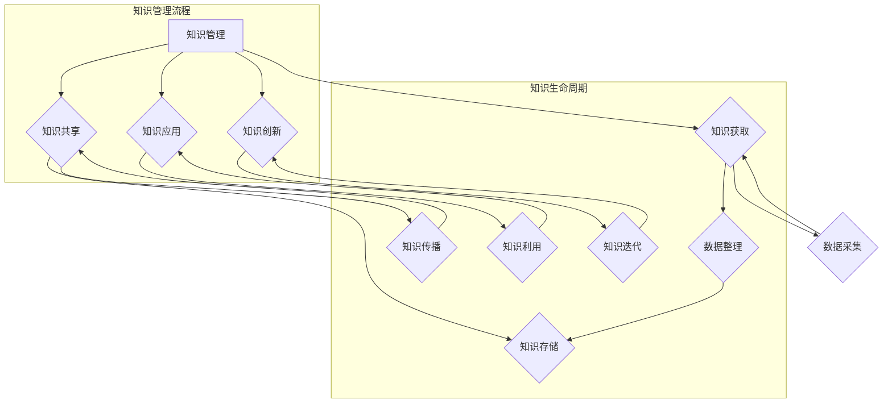

                 

### 第一部分：知识管理概述

#### 第1章：知识管理的核心概念与重要性

**知识管理的定义**

知识管理是指通过系统的方法和工具，对组织内部和外部的知识进行有效的识别、获取、组织、存储、传播、共享和应用，以提升组织的创新能力和竞争力。知识管理不仅关注知识的形式和内容，还关注知识的创造、共享和应用过程，以及知识管理文化和社会氛围的建设。

**知识管理的重要性**

1. **提升组织竞争力**：通过知识管理，组织可以有效地利用内部和外部的知识资源，提高决策质量，缩短产品开发周期，提升客户满意度，从而增强竞争力。

2. **促进知识共享**：知识管理通过构建共享平台和交流机制，鼓励员工分享知识和经验，打破信息孤岛，提高组织整体的知识水平。

3. **降低知识流失风险**：通过知识管理系统，组织可以系统地保存和传承宝贵的知识和经验，减少因员工离职带来的知识流失。

4. **提高工作效率**：知识管理系统提供便捷的知识检索工具，使员工能够快速找到所需信息，提高工作效率。

**知识管理与传统管理的区别**

1. **关注点**：传统管理侧重于信息的控制与分配，而知识管理更注重知识的创造、共享和应用。

2. **流程**：传统管理通常遵循线性流程，而知识管理强调循环和迭代，重视知识的持续更新和优化。

3. **文化**：知识管理需要建立一种开放、共享、创新的组织文化，而传统管理文化可能更加封闭和权威。

---

#### 第2章：知识管理的框架与流程

**知识管理体系架构**

知识管理体系架构通常包括以下几个关键组成部分：

1. **知识采集**：通过内部和外部渠道收集知识，如文档、经验、案例等。
2. **知识存储**：对采集到的知识进行分类、整理，并存储在知识库中，便于检索和使用。
3. **知识共享**：通过多种方式促进知识在组织内部的传播和共享，如内部交流、培训、共享平台等。
4. **知识应用**：将知识应用到实际工作中，提高工作效率和质量。
5. **知识创新**：在知识共享和应用的基础上，进一步创新和创造新的知识。

**知识获取、共享、应用与创新流程**

1. **知识获取**：通过市场调研、技术交流、专家访谈等方式获取外部知识；通过内部培训和经验分享等方式获取内部知识。

2. **知识共享**：建立内部知识分享平台，定期组织知识分享会议，鼓励员工撰写知识分享文章，开展内部培训等。

3. **知识应用**：将共享的知识应用到实际工作中，如项目开发、决策制定等，提高工作效果。

4. **知识创新**：在知识应用过程中，不断积累经验，发现问题，提出改进方案，进行创新和创造新的知识。

5. **知识反馈**：对知识管理过程中的效果进行评估，收集用户反馈，不断优化知识管理系统。

**知识管理在不同组织中的应用案例**

1. **企业**：通过知识管理系统，实现内部知识的积累和传承，提高员工的工作效率，促进创新和业务发展。
2. **学校**：建立知识库，收集和整理教学资源，方便师生查找和使用，提高教学质量和学术研究水平。
3. **医疗机构**：通过知识管理系统，实现病历资料的电子化、标准化和规范化管理，提高医疗服务质量和效率。

---

#### 第3章：知识管理中的关键问题

**知识产权保护**

1. **政策制定**：企业需要制定知识产权保护政策，明确知识产权的归属、使用和管理规定。
2. **信息安全**：通过加密、访问控制等技术手段，保护知识库中的信息不被非法获取和泄露。
3. **合规审查**：对知识管理过程中涉及的知识内容进行合规性审查，确保不侵犯他人的知识产权。

**知识安全**

1. **备份**：定期备份知识库中的数据，防止数据丢失或损坏。
2. **加密**：对知识库中的敏感数据进行加密，确保数据在传输和存储过程中的安全性。
3. **访问控制**：设置知识库的访问权限，确保只有授权人员可以访问和使用知识库中的数据。

**知识流失风险**

1. **培养知识型员工**：通过培训和激励机制，培养员工的创新能力和知识积累意识。
2. **知识传承与培训**：鼓励资深员工分享经验和知识，为新员工提供培训和学习机会，确保知识得以传承。
3. **建立知识共享文化**：营造开放、包容、共享的知识氛围，促进员工之间的知识交流与合作。

---

**摘要**

本文首先介绍了知识管理的核心概念与重要性，阐述了知识管理对组织竞争力的提升、知识共享、知识流失风险降低和工作效率提高的积极作用。接着，详细描述了知识管理的框架与流程，包括知识获取、共享、应用与创新的关键环节。此外，本文还探讨了知识管理中的关键问题，如知识产权保护、知识安全、知识流失风险的应对策略。通过这些分析，本文旨在为读者提供一套全面的知识管理系统设计和实施指南。在实际应用中，企业可以根据自身情况，借鉴这些原则和方法，构建和优化自身的知识管理系统，实现知识价值的最大化。知识管理系统不仅有助于提高企业内部的知识利用率，还能促进创新和业务发展，为企业的长期竞争力提供有力支持。

### 知识管理核心概念与联系

知识管理是一个复杂的系统，它涉及到多个核心概念，这些概念之间相互关联，构成了知识管理的基础。下面，我们将通过Mermaid流程图来描述这些核心概念及其相互关系。



**解读：**

- **知识管理（A）**：这是知识管理的核心，涵盖了整个知识管理过程。
- **知识获取（B）**：包括数据采集和整理，是知识管理的起点。
- **数据采集（F）**：从各种渠道收集原始数据。
- **数据整理（G）**：对采集到的数据进行清洗、分类和格式化。
- **知识存储（H）**：将整理后的数据存储在知识库中，便于检索和使用。
- **知识共享（C）**：通过共享平台和交流机制，促进知识在组织内部的传播。
- **知识传播（I）**：将知识传递给组织内的其他成员，促进知识的普及和应用。
- **知识应用（D）**：将知识应用到实际工作中，提高工作效率和质量。
- **知识利用（J）**：在业务流程中，利用知识解决问题，创造价值。
- **知识创新（E）**：在知识共享和应用的基础上，进行创新，产生新的知识。
- **知识迭代（K）**：对知识进行持续的更新和优化，实现知识的迭代发展。

通过这个流程图，我们可以清晰地看到知识管理中的各个环节及其相互关系。知识管理不仅仅是知识的存储和共享，更是一个动态的、循环的过程，涉及到知识的获取、整理、存储、传播、应用和创新。每个环节都是知识管理系统中不可或缺的一部分，共同构成了一个完整的知识生命周期。

### 知识管理核心算法原理讲解

在知识管理系统中，核心算法的设计和实现至关重要。以下将详细介绍几种关键算法的原理，并使用伪代码进行详细阐述。

#### 1. 知识获取算法：基于网络爬虫的网页数据采集

**算法原理：** 网络爬虫是一种自动化的程序，用于从互联网上获取大量网页数据。通过分析网页结构，爬虫可以提取出有价值的知识片段。

**伪代码：**
```python
function Crawler(url):
    // 发送HTTP请求获取网页内容
    response = httpGet(url)
    // 解析网页内容，提取知识片段
    knowledge = parseHtml(response.content)
    // 存储知识片段到数据库或知识库
    storeKnowledge(knowledge)
    // 遍历网页中的链接，递归爬取其他网页
    for link in response.links:
        Crawler(link.url)
```

**解读：**
- `Crawler(url)` 函数是爬虫的主函数，接收网页URL作为输入。
- `httpGet(url)` 函数发送HTTP GET请求，获取网页内容。
- `parseHtml(response.content)` 函数解析网页HTML内容，提取知识片段。
- `storeKnowledge(knowledge)` 函数将提取的知识片段存储到数据库或知识库。
- 通过递归调用`Crawler`函数，爬虫可以遍历网页中的所有链接，继续爬取其他网页。

#### 2. 知识共享算法：基于文档分享的系统设计

**算法原理：** 知识共享算法设计用于在组织内部实现知识的传播和共享。它通过构建一个文档分享系统，使得员工可以方便地分享和获取知识。

**伪代码：**
```python
class DocumentSharingSystem:
    // 初始化文档分享系统
    function __init__(self):
        self.documents = []

    // 添加文档
    function addDocument(self, document):
        self.documents.append(document)

    // 分享文档
    function shareDocument(self, document):
        // 将文档链接或内容发送给特定用户或小组
        sendMessage(document.url or document.content)
```

**解读：**
- `DocumentSharingSystem` 类是文档分享系统的核心类。
- `__init__` 函数初始化文档分享系统，创建一个文档列表。
- `addDocument` 函数用于向系统中添加新文档。
- `shareDocument` 函数用于将文档分享给特定的用户或小组。通过`sendMessage`函数，可以发送文档链接或内容。

#### 3. 知识应用算法：基于知识图谱的智能推荐

**算法原理：** 知识应用算法通过构建知识图谱，将知识点之间的关系可视化，并根据用户的行为和偏好进行智能推荐。

**伪代码：**
```python
class KnowledgeApplication:
    // 初始化知识应用系统
    function __init__(self, knowledgeGraph):
        self.knowledgeGraph = knowledgeGraph

    // 推荐知识
    function recommendKnowledge(userProfile):
        // 根据用户画像和知识图谱，计算相似知识
        similarKnowledge = findSimilarKnowledge(userProfile, self.knowledgeGraph)
        // 返回推荐的知识列表
        return similarKnowledge

    // 计算相似知识
    function findSimilarKnowledge(userProfile, knowledgeGraph):
        // 利用图论算法，计算用户与知识之间的相似度
        similarityScores = []
        for knowledge in knowledgeGraph:
            similarityScore = calculateSimilarity(userProfile, knowledge)
            similarityScores.append(similarityScore)
        // 根据相似度分数排序，返回相似度最高的知识列表
        return sorted(similarityScores, reverse=True)
```

**解读：**
- `KnowledgeApplication` 类是知识应用系统的核心类。
- `__init__` 函数初始化知识应用系统，接收知识图谱作为输入。
- `recommendKnowledge` 函数根据用户画像和知识图谱，推荐相似的知识点。
- `findSimilarKnowledge` 函数利用图论算法计算用户与知识之间的相似度，并返回相似度最高的知识列表。

通过这些算法，知识管理系统能够有效地获取、共享和应用知识，从而提升组织的知识管理水平。

### 数学模型和数学公式详细讲解

在知识管理系统中，数学模型和数学公式发挥着重要作用，用于描述知识之间的关系和算法的性能。以下将详细介绍几种核心的数学模型和公式，并通过具体的例子进行解释。

#### 段落1：Sigmoid函数

**数学公式：**
$$
f(x) = \frac{1}{1 + e^{-x}}
$$

**解读：**
- Sigmoid函数是一种常用的激活函数，用于将线性函数映射到0到1之间的范围。它广泛应用于神经网络中，用于处理分类问题。
- 其中，$x$ 是输入值，$e^{-x}$ 是指数函数，$1 + e^{-x}$ 是分母，用于将输入值缩放到0到1之间。
- 例如，当 $x = 0$ 时，$f(x) = 0.5$，表示输入值为0时，输出概率为0.5，即不确定。

#### 段落2：逻辑回归损失函数

**数学公式：**
$$
J(\theta) = -\frac{1}{m} \sum_{i=1}^{m} [y^{(i)} \log(a^{(2)}_{i}) + (1 - y^{(i)}) \log(1 - a^{(2)}_{i})]
$$

**解读：**
- 逻辑回归损失函数用于衡量预测值与实际值之间的差异，是神经网络中的核心损失函数。
- 其中，$J(\theta)$ 是损失函数，$\theta$ 是模型参数，$m$ 是样本数量。
- $y^{(i)}$ 是实际标签，$a^{(2)}_{i}$ 是预测概率，即神经网络输出层的激活值。
- $\log(a^{(2)}_{i})$ 和 $\log(1 - a^{(2)}_{i})$ 分别是预测概率的对数，用于计算损失值。
- 例如，当 $y^{(i)} = 1$，$a^{(2)}_{i} = 0.9$ 时，损失函数的值为 $J(\theta) = -0.10536$，表示预测概率较高，损失较小。

#### 段落3：知识图谱中的相似度计算

**数学公式：**
$$
similarity = \frac{common \ attributes}{total \ attributes}
$$

**解读：**
- 知识图谱中的相似度计算用于衡量两个知识点之间的相似程度，是知识推荐和知识检索的重要工具。
- 其中，$common \ attributes$ 是两个知识点共有的属性数量，$total \ attributes$ 是两个知识点总的属性数量。
- 例如，如果两个知识点共有3个属性，总共有5个属性，则相似度计算为 $similarity = \frac{3}{5} = 0.6$，表示两个知识点具有较高的相似性。

通过这些数学模型和公式，知识管理系统可以更精确地描述知识之间的关系，提高知识管理和推荐的准确性。

### 项目实战

**案例：使用Python搭建简单的知识管理系统**

**环境搭建：**

首先，我们需要搭建一个Python开发环境，并安装必要的库，如requests、BeautifulSoup、SQLAlchemy等。

```bash
# 安装Python环境
python --version

# 安装requests库
pip install requests

# 安装BeautifulSoup库
pip install beautifulsoup4

# 安装SQLAlchemy库
pip install sqlalchemy
```

**源代码实现：**

以下是一个简单的知识管理系统源代码示例，用于演示基本功能：

```python
import requests
from bs4 import BeautifulSoup
from sqlalchemy import create_engine, Table, Column, String, MetaData

# 网页数据采集
def crawl(url):
    response = requests.get(url)
    soup = BeautifulSoup(response.text, 'html.parser')
    data = []
    for item in soup.find_all('a'):
        data.append(item.text)
    return data

# 数据存储
def store_data(data):
    engine = create_engine('sqlite:///knowledge.db')
    metadata = MetaData()
    knowledge = Table('knowledge', metadata,
                       Column('id', String(36), primary_key=True),
                       Column('text', String(255)))
    metadata.create_all(engine)
    conn = engine.connect()
    for item in data:
        conn.execute(knowledge.insert().values(id=str(item), text=item))
    conn.commit()
    conn.close()

# 主程序
if __name__ == '__main__':
    url = "http://example.com"
    data = crawl(url)
    store_data(data)
```

**代码解读与分析：**

1. **导入库和模块**：首先导入requests、BeautifulSoup和SQLAlchemy库，用于网页数据采集和数据库操作。

2. **网页数据采集**：
    - `crawl(url)` 函数用于采集网页数据，接收URL作为输入。
    - 使用`requests.get(url)` 发送HTTP GET请求，获取网页内容。
    - 使用BeautifulSoup解析HTML页面，提取链接文本。

3. **数据存储**：
    - `store_data(data)` 函数用于将采集到的数据存储到数据库中。
    - 创建数据库引擎，并定义一个名为`knowledge`的表格，包含`id`和`text`两列。
    - 遍历采集到的数据，使用SQLAlchemy将数据插入到数据库中。

4. **主程序**：
    - 主程序中，定义URL变量，调用`crawl(url)` 和 `store_data(data)` 函数，实现数据采集和存储的过程。

通过这个简单的案例，我们展示了知识管理系统中数据采集和存储的基本流程。在实际应用中，可以根据需要扩展功能，如添加数据清洗、分类、共享等模块。

### 第一部分：知识管理概述

#### 第1章：知识管理的核心概念与重要性

**知识管理的定义**

知识管理是一个系统化的过程，它涉及知识的识别、获取、存储、共享、应用和创新，目的是为了提高组织的知识利用率、促进创新，并最终提升组织的竞争力。知识管理不仅仅是指管理信息，更重要的是管理知识，即通过有意识地管理和利用组织的知识资源，来实现业务目标。

**知识管理的重要性**

1. **提高决策质量**：知识管理系统能够收集、整理和存储大量的信息，帮助决策者快速获取所需信息，从而做出更准确的决策。

2. **促进知识共享**：知识管理系统提供了一个平台，使得组织内的知识可以更加便捷地共享和传播，减少了信息孤岛现象。

3. **降低知识流失风险**：通过知识管理系统，组织可以保存和传承关键知识，减少因员工离职或退休而带来的知识流失。

4. **提高工作效率**：知识管理系统提供了高效的工具和方法，使得员工能够快速获取所需的知识和信息，从而提高工作效率。

**知识管理与传统管理的区别**

1. **关注点不同**：传统管理主要关注流程和制度的规范，而知识管理更关注知识的创造、共享和应用。

2. **方法不同**：传统管理倾向于通过控制来实现秩序，而知识管理则通过鼓励和促进知识共享和交流来实现知识的增值。

3. **目标不同**：传统管理的目标是确保组织的正常运行，而知识管理的目标是提高组织的创新能力和竞争力。

---

#### 第2章：知识管理的框架与流程

**知识管理体系架构**

知识管理体系架构通常包括以下几个关键组成部分：

1. **知识采集**：从内部和外部渠道收集各种形式的知识，如文档、经验、案例等。
2. **知识存储**：将收集到的知识进行分类、整理，并存储在数据库或知识库中，便于检索和使用。
3. **知识共享**：通过多种方式促进知识在组织内部的传播和共享，如内部交流、培训、共享平台等。
4. **知识应用**：将知识应用到实际工作中，提高工作效率和质量。
5. **知识创新**：在知识共享和应用的基础上，进一步创新和创造新的知识。

**知识获取、共享、应用与创新流程**

1. **知识获取**：
    - 内部知识获取：通过内部培训、经验分享、内部邮件等渠道获取。
    - 外部知识获取：通过市场调研、合作伙伴、公开资料等渠道获取。

2. **知识共享**：
    - 建立共享平台：如内部论坛、知识库、共享文件夹等。
    - 知识交流：定期组织知识分享会议、培训、讲座等。

3. **知识应用**：
    - 工作流程优化：通过知识管理系统的数据分析功能，优化业务流程。
    - 项目管理：利用知识库中的知识，提高项目开发和实施效率。

4. **知识创新**：
    - 知识积累：在知识应用过程中，不断积累经验和教训。
    - 知识转化：将实践经验转化为标准操作流程或最佳实践。

5. **知识反馈**：
    - 用户反馈：收集用户对知识管理系统的反馈，优化系统功能。
    - 效果评估：定期评估知识管理系统的效果，确保持续改进。

**知识管理在不同组织中的应用案例**

1. **企业**：
    - 通过知识管理系统，实现内部知识的积累和传承，提高员工的工作效率，促进创新和业务发展。
    - 例如，华为建立了完善的内部知识库，员工可以通过知识库快速获取所需知识，提高了工作效率。

2. **学校**：
    - 建立知识库，收集和整理教学资源，方便师生查找和使用，提高教学质量和学术研究水平。
    - 例如，清华大学利用知识管理系统，实现了教学资源的电子化和共享，提高了教学效果。

3. **医疗机构**：
    - 通过知识管理系统，实现病历资料的电子化、标准化和规范化管理，提高医疗服务质量和效率。
    - 例如，北京协和医院建立了医疗知识库，医生可以通过知识库查找诊断方案和治疗方案，提高了诊疗水平。

---

#### 第3章：知识管理中的关键问题

**知识产权保护**

1. **政策制定**：
    - 企业需要制定知识产权保护政策，明确知识产权的归属、使用和管理规定。
    - 制定知识产权保护流程，确保知识在获取、存储、共享和应用过程中得到有效保护。

2. **信息安全**：
    - 通过加密、访问控制等技术手段，保护知识库中的信息不被非法获取和泄露。
    - 定期进行安全审计和风险评估，确保知识安全。

3. **合规审查**：
    - 对知识管理过程中涉及的知识内容进行合规性审查，确保不侵犯他人的知识产权。
    - 与法律顾问合作，处理知识产权纠纷。

**知识安全**

1. **备份**：
    - 定期备份知识库中的数据，防止数据丢失或损坏。
    - 选择可靠的备份服务商，确保数据的安全性。

2. **加密**：
    - 对知识库中的敏感数据进行加密，确保数据在传输和存储过程中的安全性。
    - 使用先进的加密算法，如AES。

3. **访问控制**：
    - 设置知识库的访问权限，确保只有授权人员可以访问和使用知识库中的数据。
    - 实行多级权限管理，严格控制访问权限。

**知识流失风险**

1. **培养知识型员工**：
    - 通过培训和激励机制，培养员工的创新能力和知识积累意识。
    - 建立知识分享文化，鼓励员工主动分享知识和经验。

2. **知识传承与培训**：
    - 鼓励资深员工分享经验和知识，为新员工提供培训和学习机会，确保知识得以传承。
    - 定期组织内部培训和知识分享活动。

3. **知识共享文化**：
    - 营造开放、包容、共享的知识氛围，促进员工之间的知识交流与合作。
    - 建立知识奖励机制，激励员工积极参与知识共享。

---

**摘要**

本文详细介绍了知识管理的核心概念与重要性，阐述了知识管理对组织竞争力的提升、知识共享、知识流失风险降低和工作效率提高的积极作用。接着，本文详细描述了知识管理的框架与流程，包括知识获取、共享、应用与创新的关键环节。此外，本文还探讨了知识管理中的关键问题，如知识产权保护、知识安全、知识流失风险的应对策略。通过这些分析，本文旨在为读者提供一套全面的知识管理系统设计和实施指南。在实际应用中，企业可以根据自身情况，借鉴这些原则和方法，构建和优化自身的知识管理系统，实现知识价值的最大化。知识管理系统不仅有助于提高企业内部的知识利用率，还能促进创新和业务发展，为企业的长期竞争力提供有力支持。

### 第一部分：知识管理概述

#### 第1章：知识管理的核心概念与重要性

**知识管理的定义**

知识管理（Knowledge Management，简称KM）是一种系统性的方法和过程，旨在识别、获取、组织、存储、传播、共享和应用知识，以提高组织的创新能力、决策质量和运营效率。知识管理不仅仅涉及信息的管理，更重要的是对知识本身的管理，包括知识的创造、共享、应用和创新。

**知识管理的重要性**

1. **提高决策质量**：知识管理系统能够收集、整理和存储大量的信息，帮助决策者快速获取所需信息，从而做出更准确的决策。通过知识管理，企业可以更好地利用内部和外部的知识资源，提高决策的速度和有效性。

2. **促进知识共享**：知识管理系统提供了一个平台，使得组织内的知识可以更加便捷地共享和传播，减少了信息孤岛现象。通过知识共享，企业可以充分利用组织内的集体智慧，提高整体的知识水平和创新能力。

3. **降低知识流失风险**：通过知识管理系统，企业可以保存和传承关键知识，减少因员工离职或退休而带来的知识流失。知识管理系统有助于将员工的隐性知识和经验转化为可传承的知识资产，确保知识得以长期保存和利用。

4. **提高工作效率**：知识管理系统提供了高效的工具和方法，使得员工能够快速获取所需的知识和信息，从而提高工作效率。通过知识管理，员工可以减少重复劳动，更加专注于高价值的工作任务。

5. **促进创新**：知识管理不仅关注知识的共享和应用，还强调知识的创新。通过知识管理，企业可以激发员工的创新思维，推动新产品的研发和技术的创新，从而提升企业的竞争力。

**知识管理与传统管理的区别**

1. **核心目标不同**：传统管理主要关注流程和制度的规范，确保组织的正常运行；而知识管理则更关注知识的创造、共享和应用，以提高组织的创新能力和竞争力。

2. **方法不同**：传统管理通常通过控制来实现秩序，如制定严格的规章制度；而知识管理则通过鼓励和促进知识共享和交流来实现知识的增值，如建立知识库、知识分享会议等。

3. **关注点不同**：传统管理侧重于信息和资源的控制与分配，而知识管理更注重知识的流动、共享和应用，以及知识创造和创新的过程。

4. **文化氛围不同**：传统管理可能强调权威和层级，而知识管理则更强调开放、协作和共享的文化氛围，鼓励员工积极参与知识创造和分享。

---

#### 第2章：知识管理的框架与流程

**知识管理体系架构**

知识管理体系架构是一个动态的、循环的系统，通常包括以下几个关键组成部分：

1. **知识采集**：从内部和外部渠道收集知识，如内部文档、外部资料、专家经验等。
2. **知识存储**：将采集到的知识进行分类、整理，并存储在数据库或知识库中，便于检索和使用。
3. **知识共享**：通过多种方式促进知识在组织内部的传播和共享，如内部交流、培训、共享平台等。
4. **知识应用**：将知识应用到实际工作中，提高工作效率和质量。
5. **知识创新**：在知识共享和应用的基础上，进一步创新和创造新的知识。

**知识获取、共享、应用与创新流程**

1. **知识获取**：
    - **内部知识获取**：通过内部培训、经验分享、内部邮件等渠道获取。
    - **外部知识获取**：通过市场调研、合作伙伴、公开资料等渠道获取。
    - **自动化获取**：利用网络爬虫、传感器等技术，自动采集网络、物联网等渠道的知识。

2. **知识共享**：
    - **知识库**：建立知识库，将收集到的知识进行分类、标签化，便于员工查找和使用。
    - **知识分享会议**：定期组织知识分享会议，鼓励员工分享经验和见解。
    - **知识论坛**：建立内部知识论坛，方便员工进行知识交流和讨论。

3. **知识应用**：
    - **知识地图**：构建知识地图，帮助员工快速找到所需知识。
    - **工作流程优化**：利用知识管理系统的数据分析功能，优化业务流程。
    - **知识驱动创新**：鼓励员工在项目开发和业务创新中应用知识，促进新知识和新技术的产生。

4. **知识创新**：
    - **知识积累**：在知识应用过程中，不断积累经验和教训，形成新的知识和最佳实践。
    - **知识转化**：将实践经验转化为标准操作流程或最佳实践，提高工作效率。
    - **知识拓展**：在现有知识基础上，进行拓展和创新，推动新知识和新技术的产生。

5. **知识反馈**：
    - **用户反馈**：收集用户对知识管理系统的反馈，优化系统功能。
    - **效果评估**：定期评估知识管理系统的效果，确保持续改进。
    - **知识迭代**：根据用户反馈和评估结果，不断更新和优化知识库中的知识。

**知识管理在不同组织中的应用案例**

1. **企业**：
    - **华为**：华为建立了全球最大的内部知识库，员工可以通过知识库快速获取所需知识，提高了工作效率。
    - **IBM**：IBM采用知识管理系统，实现了内部知识的共享和传承，降低了知识流失风险。

2. **学校**：
    - **哈佛大学**：哈佛大学通过知识管理系统，实现了教学资源的电子化和共享，提高了教学质量和学术研究水平。
    - **清华大学**：清华大学建立了多个学科领域的知识库，方便师生查找和使用，促进了学术交流和合作。

3. **医疗机构**：
    - **北京协和医院**：北京协和医院建立了医疗知识库，医生可以通过知识库查找诊断方案和治疗方案，提高了诊疗水平。
    - **梅奥诊所**：梅奥诊所通过知识管理系统，实现了病历资料的电子化、标准化和规范化管理，提高了医疗服务质量和效率。

---

#### 第3章：知识管理中的关键问题

**知识产权保护**

1. **政策制定**：
    - 企业需要制定知识产权保护政策，明确知识产权的归属、使用和管理规定。
    - 建立知识产权保护流程，确保知识在获取、存储、共享和应用过程中得到有效保护。

2. **信息安全**：
    - 通过加密、访问控制等技术手段，保护知识库中的信息不被非法获取和泄露。
    - 定期进行安全审计和风险评估，确保知识安全。

3. **合规审查**：
    - 对知识管理过程中涉及的知识内容进行合规性审查，确保不侵犯他人的知识产权。
    - 与法律顾问合作，处理知识产权纠纷。

**知识安全**

1. **备份**：
    - 定期备份知识库中的数据，防止数据丢失或损坏。
    - 选择可靠的备份服务商，确保数据的安全性。

2. **加密**：
    - 对知识库中的敏感数据进行加密，确保数据在传输和存储过程中的安全性。
    - 使用先进的加密算法，如AES。

3. **访问控制**：
    - 设置知识库的访问权限，确保只有授权人员可以访问和使用知识库中的数据。
    - 实行多级权限管理，严格控制访问权限。

**知识流失风险**

1. **培养知识型员工**：
    - 通过培训和激励机制，培养员工的创新能力和知识积累意识。
    - 建立知识分享文化，鼓励员工主动分享知识和经验。

2. **知识传承与培训**：
    - 鼓励资深员工分享经验和知识，为新员工提供培训和学习机会，确保知识得以传承。
    - 定期组织内部培训和知识分享活动。

3. **知识共享文化**：
    - 营造开放、包容、共享的知识氛围，促进员工之间的知识交流与合作。
    - 建立知识奖励机制，激励员工积极参与知识共享。

---

**摘要**

本文详细介绍了知识管理的核心概念与重要性，阐述了知识管理对组织竞争力的提升、知识共享、知识流失风险降低和工作效率提高的积极作用。接着，本文详细描述了知识管理的框架与流程，包括知识获取、共享、应用与创新的关键环节。此外，本文还探讨了知识管理中的关键问题，如知识产权保护、知识安全、知识流失风险的应对策略。通过这些分析，本文旨在为读者提供一套全面的知识管理系统设计和实施指南。在实际应用中，企业可以根据自身情况，借鉴这些原则和方法，构建和优化自身的知识管理系统，实现知识价值的最大化。知识管理系统不仅有助于提高企业内部的知识利用率，还能促进创新和业务发展，为企业的长期竞争力提供有力支持。

### 第二部分：知识管理系统设计

#### 第4章：知识管理系统概述

**知识管理系统的定义与作用**

知识管理系统（Knowledge Management System，简称KMS）是一种集成化的信息系统，旨在支持知识的获取、存储、共享、应用和创新。它通过提供统一的知识管理平台，使得组织内部的知识流动更加顺畅，从而提高知识利用率、促进创新和提升组织的竞争力。

知识管理系统的作用主要包括以下几个方面：

1. **提高知识利用率**：通过知识管理系统，组织可以更好地管理和利用内部和外部的知识资源，减少信息孤岛现象，提高知识共享和传播的效率。

2. **促进创新**：知识管理系统提供了一个平台，使得员工可以方便地获取和分享知识，从而激发创新思维，推动新知识和新技术的产生。

3. **提升决策质量**：知识管理系统为决策者提供了丰富的信息资源，帮助他们在决策过程中快速获取所需的知识，从而做出更准确、更有效的决策。

4. **降低知识流失风险**：知识管理系统通过保存和传承关键知识，减少因员工离职或退休而带来的知识流失，确保组织的关键知识和经验得以长期保存和利用。

**知识管理系统的架构设计**

知识管理系统架构设计应遵循模块化、可扩展、易维护的原则。一个典型的知识管理系统通常包括以下几个关键模块：

1. **知识采集模块**：负责从各种渠道获取知识，如内部文档、外部资料、专家经验等。

2. **知识存储模块**：将采集到的知识进行分类、整理，并存储在数据库或知识库中，便于检索和使用。

3. **知识共享模块**：通过多种方式促进知识在组织内部的传播和共享，如知识论坛、内部邮件、即时通讯等。

4. **知识应用模块**：将知识应用到实际工作中，提高工作效率和质量。

5. **知识创新模块**：在知识共享和应用的基础上，进一步创新和创造新的知识。

6. **用户接口**：提供用户友好的界面，方便用户进行知识管理操作。

#### 第5章：知识管理系统的功能模块

**知识采集模块**

知识采集模块是知识管理系统的核心组成部分之一，其主要任务是从各种渠道获取知识。以下是一些常见的知识采集方法：

1. **内部文档**：通过内部办公系统、邮件、论坛等渠道收集企业内部文档。

2. **外部资料**：通过互联网、数据库、专业期刊等渠道收集外部资料。

3. **专家经验**：通过访谈、问卷调查等方式收集专家的经验和见解。

4. **自动化采集**：利用爬虫、传感器等技术，自动采集网络、物联网等渠道的知识。

**知识存储与分类模块**

知识存储与分类模块负责将采集到的知识进行整理、分类，并存储在知识库中。以下是一些常见的知识存储与分类方法：

1. **知识库**：采用数据库或知识库系统存储知识，方便用户进行检索和使用。

2. **分类标准**：制定统一的分类标准，对知识进行分类和标签化，便于用户查找和利用。

3. **元数据**：为每条知识添加元数据，如关键词、作者、来源等，提高知识的可检索性。

4. **版本控制**：对知识进行版本控制，确保知识的最新性和准确性。

**知识共享与传播模块**

知识共享与传播模块旨在促进知识在组织内部的传播和共享，以下是一些常见的知识共享与传播方法：

1. **知识论坛**：建立内部知识论坛，鼓励员工发表观点、分享经验，进行知识交流。

2. **内部邮件**：通过内部邮件系统发送知识分享邮件，将知识传递给相关员工。

3. **即时通讯**：利用即时通讯工具，实时交流知识，提高知识传播速度。

4. **培训与讲座**：组织内部培训与讲座，传播关键知识，提升员工能力。

**知识应用与创新模块**

知识应用与创新模块将知识应用到实际工作中，提高工作效率和质量。以下是一些常见的知识应用与创新方法：

1. **知识地图**：构建知识地图，帮助员工快速找到所需知识。

2. **工作流程优化**：利用知识管理系统的数据分析和挖掘功能，优化工作流程，提高效率。

3. **创新项目**：鼓励员工基于现有知识开展创新项目，推动知识转化为实际成果。

4. **知识评估与反馈**：对知识应用效果进行评估，收集用户反馈，不断优化知识管理系统。

#### 第6章：知识管理系统实施策略

**需求分析**

在实施知识管理系统之前，进行详细的需求分析至关重要。以下是一些需求分析的方法：

1. **访谈**：与各级员工、管理层和专家进行访谈，了解他们对知识管理的需求和期望。

2. **问卷调查**：设计问卷，收集员工对知识管理系统的使用习惯、功能需求等信息。

3. **工作流程分析**：分析企业内部的工作流程，识别知识管理的瓶颈和改进点。

4. **标杆分析**：研究行业内的优秀企业，借鉴其知识管理经验。

**系统选型**

根据需求分析结果，选择合适的知识管理系统。以下是一些系统选型的考虑因素：

1. **功能需求**：系统应具备所需的知识采集、存储、共享、应用和创新功能。

2. **性能与稳定性**：系统应具备良好的性能和稳定性，确保在高并发场景下正常运行。

3. **可扩展性**：系统应具备良好的可扩展性，能够根据企业需求进行功能扩展和升级。

4. **成本**：综合考虑系统采购、部署、维护等成本，选择性价比高的解决方案。

**系统部署与维护**

在系统实施过程中，确保系统的顺利部署和正常运行至关重要。以下是一些部署与维护的要点：

1. **环境搭建**：搭建符合系统要求的硬件和网络环境。

2. **安装与配置**：按照系统安装手册进行安装和配置。

3. **数据迁移**：将现有知识资料迁移到新系统，确保数据的完整性和一致性。

4. **培训与支持**：对员工进行系统培训，提供技术支持，确保系统的正常运行。

5. **持续优化**：根据用户反馈和业务需求，不断优化系统功能，提高用户体验。

### 第二部分：知识管理系统设计

#### 第4章：知识管理系统概述

**知识管理系统的定义与作用**

知识管理系统（KMS）是一种集成化的信息系统，旨在支持知识的获取、存储、共享、应用和创新。它通过提供统一的知识管理平台，使得组织内部的知识流动更加顺畅，从而提高知识利用率、促进创新和提升组织的竞争力。

知识管理系统的作用主要包括以下几个方面：

1. **提高知识利用率**：通过知识管理系统，组织可以更好地管理和利用内部和外部的知识资源，减少信息孤岛现象，提高知识共享和传播的效率。

2. **促进创新**：知识管理系统提供了一个平台，使得员工可以方便地获取和分享知识，从而激发创新思维，推动新知识和新技术的产生。

3. **提升决策质量**：知识管理系统为决策者提供了丰富的信息资源，帮助他们在决策过程中快速获取所需的知识，从而做出更准确、更有效的决策。

4. **降低知识流失风险**：知识管理系统通过保存和传承关键知识，减少因员工离职或退休而带来的知识流失，确保组织的关键知识和经验得以长期保存和利用。

**知识管理系统的架构设计**

知识管理系统架构设计应遵循模块化、可扩展、易维护的原则。一个典型的知识管理系统通常包括以下几个关键模块：

1. **知识采集模块**：负责从各种渠道获取知识，如内部文档、外部资料、专家经验等。

2. **知识存储模块**：将采集到的知识进行分类、整理，并存储在数据库或知识库中，便于检索和使用。

3. **知识共享模块**：通过多种方式促进知识在组织内部的传播和共享，如知识论坛、内部邮件、即时通讯等。

4. **知识应用模块**：将知识应用到实际工作中，提高工作效率和质量。

5. **知识创新模块**：在知识共享和应用的基础上，进一步创新和创造新的知识。

6. **用户接口**：提供用户友好的界面，方便用户进行知识管理操作。

#### 第5章：知识管理系统的功能模块

**知识采集模块**

知识采集模块是知识管理系统的核心组成部分之一，其主要任务是从各种渠道获取知识。以下是一些常见的知识采集方法：

1. **内部文档**：通过内部办公系统、邮件、论坛等渠道收集企业内部文档。

2. **外部资料**：通过互联网、数据库、专业期刊等渠道收集外部资料。

3. **专家经验**：通过访谈、问卷调查等方式收集专家的经验和见解。

4. **自动化采集**：利用爬虫、传感器等技术，自动采集网络、物联网等渠道的知识。

**知识存储与分类模块**

知识存储与分类模块负责将采集到的知识进行整理、分类，并存储在知识库中。以下是一些常见的知识存储与分类方法：

1. **知识库**：采用数据库或知识库系统存储知识，方便用户进行检索和使用。

2. **分类标准**：制定统一的分类标准，对知识进行分类和标签化，便于用户查找和利用。

3. **元数据**：为每条知识添加元数据，如关键词、作者、来源等，提高知识的可检索性。

4. **版本控制**：对知识进行版本控制，确保知识的最新性和准确性。

**知识共享与传播模块**

知识共享与传播模块旨在促进知识在组织内部的传播和共享，以下是一些常见的知识共享与传播方法：

1. **知识论坛**：建立内部知识论坛，鼓励员工发表观点、分享经验，进行知识交流。

2. **内部邮件**：通过内部邮件系统发送知识分享邮件，将知识传递给相关员工。

3. **即时通讯**：利用即时通讯工具，实时交流知识，提高知识传播速度。

4. **培训与讲座**：组织内部培训与讲座，传播关键知识，提升员工能力。

**知识应用与创新模块**

知识应用与创新模块将知识应用到实际工作中，提高工作效率和质量。以下是一些常见的知识应用与创新方法：

1. **知识地图**：构建知识地图，帮助员工快速找到所需知识。

2. **工作流程优化**：利用知识管理系统的数据分析和挖掘功能，优化工作流程，提高效率。

3. **创新项目**：鼓励员工基于现有知识开展创新项目，推动知识转化为实际成果。

4. **知识评估与反馈**：对知识应用效果进行评估，收集用户反馈，不断优化知识管理系统。

#### 第6章：知识管理系统实施策略

**需求分析**

在实施知识管理系统之前，进行详细的需求分析至关重要。以下是一些需求分析的方法：

1. **访谈**：与各级员工、管理层和专家进行访谈，了解他们对知识管理的需求和期望。

2. **问卷调查**：设计问卷，收集员工对知识管理系统的使用习惯、功能需求等信息。

3. **工作流程分析**：分析企业内部的工作流程，识别知识管理的瓶颈和改进点。

4. **标杆分析**：研究行业内的优秀企业，借鉴其知识管理经验。

**系统选型**

根据需求分析结果，选择合适的知识管理系统。以下是一些系统选型的考虑因素：

1. **功能需求**：系统应具备所需的知识采集、存储、共享、应用和创新功能。

2. **性能与稳定性**：系统应具备良好的性能和稳定性，确保在高并发场景下正常运行。

3. **可扩展性**：系统应具备良好的可扩展性，能够根据企业需求进行功能扩展和升级。

4. **成本**：综合考虑系统采购、部署、维护等成本，选择性价比高的解决方案。

**系统部署与维护**

在系统实施过程中，确保系统的顺利部署和正常运行至关重要。以下是一些部署与维护的要点：

1. **环境搭建**：搭建符合系统要求的硬件和网络环境。

2. **安装与配置**：按照系统安装手册进行安装和配置。

3. **数据迁移**：将现有知识资料迁移到新系统，确保数据的完整性和一致性。

4. **培训与支持**：对员工进行系统培训，提供技术支持，确保系统的正常运行。

5. **持续优化**：根据用户反馈和业务需求，不断优化系统功能，提高用户体验。

### 第三部分：知识管理系统应用实践

#### 第7章：知识管理系统在小型企业的应用

**单人公司的知识管理特点**

单人公司的知识管理具有一些独特的特点，主要体现在以下几个方面：

1. **高度自主性**：由于单人公司通常由创始人或核心员工独立运作，知识管理需要适应这种高度自主的工作方式。知识管理策略应更加灵活，以适应个人的工作习惯和需求。

2. **灵活性**：单人公司在知识管理方面具有较大的灵活性，可以根据个人兴趣和需求快速调整知识管理策略。例如，个人可以随时选择是否分享自己的知识，以及如何分享。

3. **专业性**：单人公司往往专注于特定领域，知识管理需要突出专业性和针对性。个人需要确保自己的知识管理系统能够有效地支持其专业工作，并在必要时进行更新和优化。

**单人公司知识管理系统案例**

**案例1：基于云笔记的知识管理系统**

云笔记是一种简单而有效的知识管理工具，特别适合单人公司。以下是一个基于云笔记的知识管理系统案例：

1. **功能模块**：
   - **笔记记录**：使用云笔记记录日常工作笔记、项目文档、客户资料等。
   - **多设备同步**：云笔记支持多设备同步，方便个人在不同设备上查看和管理笔记。
   - **共享与协作**：个人可以选择与合作伙伴共享特定笔记，实现知识的共享和协作。

2. **应用场景**：
   - **项目管理**：个人可以使用云笔记记录项目进度、任务分配和完成情况。
   - **客户管理**：个人可以使用云笔记记录客户信息、沟通记录和跟进事项。
   - **知识积累**：个人可以将日常工作和学习的经验记录在云笔记中，方便日后查找和复习。

3. **优势**：
   - **便捷性**：云笔记操作简单，易于上手。
   - **灵活性**：个人可以随时添加、编辑和共享笔记。
   - **安全性**：云笔记通常提供数据备份和加密功能，确保数据安全。

**案例2：基于知识论坛的知识管理系统**

知识论坛可以提供一个平台，使个人能够在专业领域内进行知识交流和分享。以下是一个基于知识论坛的知识管理系统案例：

1. **功能模块**：
   - **论坛创建**：个人可以创建多个论坛，用于讨论不同主题。
   - **发帖与回帖**：个人可以在论坛上发布帖子，分享自己的知识和经验。
   - **评论与点赞**：个人可以对他人发布的帖子进行评论和点赞，促进知识交流。

2. **应用场景**：
   - **专业交流**：个人可以在论坛上与其他专业人士交流，获取行业动态和专业见解。
   - **问题求解**：个人可以在论坛上发布问题，寻求他人的帮助和解决方案。
   - **知识传播**：个人可以通过论坛分享自己的研究成果和经验，提升自己的专业影响力。

3. **优势**：
   - **互动性**：知识论坛鼓励个人之间的互动，促进知识传播和共享。
   - **专业性**：知识论坛聚焦于特定领域，有助于提升个人的专业知识和技能。
   - **灵活性**：个人可以根据自己的需求和兴趣参与论坛讨论。

**单人公司知识管理系统的实施策略**

1. **明确目标**：单人公司需要明确知识管理系统的目标，如提高工作效率、积累专业知识和拓展人脉等。

2. **简化流程**：知识管理系统应尽量简化操作流程，以降低使用难度，提高个人使用意愿。

3. **个性化定制**：知识管理系统应允许个人根据自己的需求和习惯进行个性化定制，如选择笔记模板、设置隐私权限等。

4. **持续优化**：单人公司应定期评估知识管理系统的效果，根据用户反馈进行优化和改进。

### 第8章：知识管理系统的效果评估与优化

**效果评估指标**

为了评估知识管理系统的效果，可以设置以下指标：

1. **知识利用率**：评估员工使用知识管理系统的频率和程度，反映知识的实际利用情况。
2. **员工满意度**：通过问卷调查或访谈了解员工对知识管理系统的满意度，反映系统的用户体验。
3. **业务成果**：评估知识管理系统对业务流程优化、项目进度、客户满意度等方面的影响。
4. **知识库完整性**：评估知识库中知识的完整性、准确性和更新频率，确保知识的时效性和可靠性。

**系统优化策略**

1. **功能升级**：根据用户需求和业务发展，定期升级知识管理系统功能，增加新的模块和功能。
2. **界面优化**：优化知识管理系统的用户界面，提高用户体验，降低使用门槛。
3. **数据分析**：利用数据分析技术，对知识管理系统的使用情况进行分析，识别潜在问题和改进方向。
4. **培训与支持**：定期组织知识管理系统培训，提高员工的使用技能和意识，提供技术支持，解决使用中的问题。

**用户反馈与改进措施**

1. **建立反馈机制**：建立用户反馈渠道，如在线问卷、意见箱等，收集用户对知识管理系统的建议和意见。
2. **定期评估**：定期对知识管理系统进行评估，分析用户反馈，识别系统存在的问题和改进方向。
3. **持续改进**：根据用户反馈和评估结果，持续改进知识管理系统，提高系统的实用性和满意度。
4. **宣传推广**：加强对知识管理系统的宣传和推广，提高员工的认知度和使用率，充分发挥知识管理系统的价值。

### 第三部分：知识管理系统应用实践

#### 第7章：知识管理系统在小型企业的应用

**单人公司的知识管理特点**

单人公司在知识管理方面具有以下特点：

1. **高度自主性**：单人公司通常由一人或少数几人独立运作，知识管理策略需要高度灵活，以适应个人工作和生活节奏的变化。

2. **灵活性**：由于公司规模较小，单人公司可以在知识管理策略上快速调整，以应对业务需求和市场变化。

3. **专业性**：单人公司往往专注于某一特定领域，知识管理需要突出专业性，确保个人能够高效利用专业知识和技能。

**单人公司知识管理系统案例**

**案例1：基于云笔记的知识管理系统**

云笔记是一种便捷的知识管理工具，适用于单人公司的知识管理需求。以下是一个基于云笔记的知识管理系统案例：

1. **功能模块**：
   - **笔记记录**：使用云笔记记录日常工作笔记、项目文档、客户资料等。
   - **多设备同步**：云笔记支持多设备同步，方便个人在不同设备上查看和管理笔记。
   - **共享与协作**：个人可以选择与合作伙伴共享特定笔记，实现知识的共享和协作。

2. **应用场景**：
   - **项目管理**：记录项目进度、任务分配和完成情况。
   - **客户管理**：记录客户信息、沟通记录和跟进事项。
   - **知识积累**：记录日常工作和学习中的经验，方便日后查找和复习。

3. **优势**：
   - **便捷性**：云笔记操作简单，易于上手。
   - **灵活性**：个人可以随时添加、编辑和共享笔记。
   - **安全性**：云笔记通常提供数据备份和加密功能，确保数据安全。

**案例2：基于知识论坛的知识管理系统**

知识论坛可以提供一个平台，使个人能够在专业领域内进行知识交流和分享。以下是一个基于知识论坛的知识管理系统案例：

1. **功能模块**：
   - **论坛创建**：创建多个论坛，用于讨论不同主题。
   - **发帖与回帖**：发布帖子，分享自己的知识和经验。
   - **评论与点赞**：对他人发布的帖子进行评论和点赞，促进知识交流。

2. **应用场景**：
   - **专业交流**：与其他专业人士交流，获取行业动态和专业见解。
   - **问题求解**：发布问题，寻求他人的帮助和解决方案。
   - **知识传播**：分享自己的研究成果和经验，提升专业影响力。

3. **优势**：
   - **互动性**：知识论坛鼓励个人之间的互动，促进知识传播和共享。
   - **专业性**：知识论坛聚焦于特定领域，有助于提升个人的专业知识和技能。
   - **灵活性**：个人可以根据自己的需求和兴趣参与论坛讨论。

**单人公司知识管理系统的实施策略**

1. **明确目标**：确定知识管理系统的目标，如提高工作效率、积累专业知识和拓展人脉等。

2. **简化流程**：确保知识管理系统操作简单，降低使用难度，提高个人使用意愿。

3. **个性化定制**：允许个人根据自己的需求和习惯对系统进行个性化定制，如选择笔记模板、设置隐私权限等。

4. **持续优化**：定期评估系统效果，根据用户反馈进行优化和改进。

### 第8章：知识管理系统的效果评估与优化

**效果评估指标**

为了评估知识管理系统的效果，可以设置以下指标：

1. **知识利用率**：评估员工使用知识管理系统的频率和程度，反映知识的实际利用情况。
2. **员工满意度**：通过问卷调查或访谈了解员工对知识管理系统的满意度，反映系统的用户体验。
3. **业务成果**：评估知识管理系统对业务流程优化、项目进度、客户满意度等方面的影响。
4. **知识库完整性**：评估知识库中知识的完整性、准确性和更新频率，确保知识的时效性和可靠性。

**系统优化策略**

1. **功能升级**：根据用户需求和业务发展，定期升级知识管理系统功能，增加新的模块和功能。
2. **界面优化**：优化知识管理系统的用户界面，提高用户体验，降低使用门槛。
3. **数据分析**：利用数据分析技术，对知识管理系统的使用情况进行分析，识别潜在问题和改进方向。
4. **培训与支持**：定期组织知识管理系统培训，提高员工的使用技能和意识，提供技术支持，解决使用中的问题。

**用户反馈与改进措施**

1. **建立反馈机制**：建立用户反馈渠道，如在线问卷、意见箱等，收集用户对知识管理系统的建议和意见。
2. **定期评估**：定期对知识管理系统进行评估，分析用户反馈，识别系统存在的问题和改进方向。
3. **持续改进**：根据用户反馈和评估结果，持续改进知识管理系统，提高系统的实用性和满意度。
4. **宣传推广**：加强对知识管理系统的宣传和推广，提高员工的认知度和使用率，充分发挥知识管理系统的价值。

### 第四部分：知识管理中的技术工具

#### 第9章：知识管理工具与技术

**数据库技术**

数据库技术是知识管理系统的核心组成部分，用于存储和管理知识数据。以下是一些常用的数据库技术：

1. **关系型数据库**：如MySQL、Oracle、SQL Server等，适用于存储结构化数据，具有高稳定性和高性能的特点。
2. **非关系型数据库**：如MongoDB、Redis、Cassandra等，适用于存储非结构化数据，具有高扩展性和灵活性。
3. **分布式数据库**：如Hadoop、HBase、Cassandra等，适用于处理大规模数据和高并发访问场景。

**云计算技术**

云计算技术为知识管理系统提供了强大的计算和存储资源，以下是云计算技术的一些应用：

1. **云存储**：如Amazon S3、Google Cloud Storage、Azure Blob Storage等，提供大规模、安全、可扩展的存储服务。
2. **云计算平台**：如Amazon Web Services（AWS）、Microsoft Azure、Google Cloud Platform等，提供计算、存储、网络等基础设施服务。
3. **云服务**：如机器学习服务（ML Services）、自然语言处理（NLP）服务、人工智能（AI）服务等，为知识管理提供智能化的支持。

**人工智能技术在知识管理中的应用**

人工智能技术在知识管理中发挥着重要作用，以下是一些具体应用：

1. **自然语言处理（NLP）**：用于文本数据的解析、分析和理解，如文本分类、情感分析、命名实体识别等。
2. **机器学习**：用于知识发现、预测和分析，如回归分析、决策树、神经网络等。
3. **知识图谱**：用于构建知识的语义关联和关系，提高知识的可检索性和可理解性。
4. **推荐系统**：用于知识推荐，如基于内容的推荐、协同过滤等。

**知识管理工具选型与集成**

在知识管理系统中，选择合适的工具和技术至关重要。以下是知识管理工具选型和集成的策略：

1. **需求分析**：根据企业的具体需求，选择适合的数据库、云计算平台和人工智能技术。
2. **功能对比**：对比不同知识管理工具的功能、性能、成本等方面的优缺点，选择最佳方案。
3. **集成方案**：设计知识管理系统的整体架构，确保各个模块之间的无缝集成和协同工作。
4. **兼容性测试**：对系统进行兼容性测试，确保在不同技术环境中的稳定性和兼容性。

#### 第10章：知识管理工具选型与集成

**常见知识管理工具介绍**

在知识管理领域，有多种工具可供选择，每种工具都有其独特的特点。以下是一些常见知识管理工具及其主要特点：

1. **Confluence**：一款团队协作和文档管理工具，支持丰富的内容创建和协作功能，适用于企业内部知识共享和文档管理。
2. **SharePoint**：微软推出的企业内容管理系统，具有强大的文档管理、协作和搜索功能，适用于大型企业。
3. **Trello**：一款基于看板（Kanban）的协作工具，适用于团队任务管理和项目进度跟踪。
4. **Asana**：一款任务管理工具，支持项目管理、团队协作和进度跟踪，适合企业日常工作协调。
5. **Moodle**：一款开源的在线学习管理系统，适用于企业培训和教育项目。
6. **Kaltura**：一款视频内容管理工具，支持视频上传、存储、管理和分享。
7. **Evernote**：一款个人和企业级笔记记录工具，支持跨平台同步和共享。
8. **Slack**：一款团队沟通工具，支持实时消息、文件共享和集成第三方应用。

**工具集成策略**

在知识管理系统中，合理集成不同工具是确保系统高效运作的关键。以下是一些常见的工具集成策略：

1. **统一身份认证**：实现知识管理工具与其他系统的单点登录（SSO）功能，提高用户体验。
2. **数据同步**：确保不同工具之间的数据能够实时同步，避免数据孤岛。
3. **API集成**：通过API接口，实现不同工具之间的数据交换和功能调用。
4. **插件和扩展**：利用工具的插件和扩展功能，增强系统的功能和灵活性。
5. **工作流程整合**：将知识管理工具与企业内部的工作流程紧密集成，提高工作效率。

**工具使用案例**

以下是一些知识管理工具在实际应用中的案例：

1. **案例1**：企业内部知识库
   - **应用场景**：使用Confluence搭建内部知识库，记录公司规章制度、产品文档、项目经验等。
   - **优势**：便于员工查找和更新知识，提高工作效率。

2. **案例2**：团队协作平台
   - **应用场景**：使用Trello和Asana进行团队协作管理，跟踪项目进度、分配任务和协作。
   - **优势**：提高团队协作效率，确保项目按时完成。

3. **案例3**：在线学习平台
   - **应用场景**：使用Moodle搭建内部在线学习平台，为员工提供培训和学习资源。
   - **优势**：方便员工在线学习和测试，提高培训效果。

4. **案例4**：视频内容管理
   - **应用场景**：使用Kaltura进行视频内容管理，存储和管理公司内部培训、产品演示、会议记录等视频资料。
   - **优势**：提高视频资料的查找和观看效率，确保视频内容的安全性和合规性。

### 第四部分：知识管理中的技术工具

#### 第9章：知识管理工具与技术

**数据库技术**

数据库技术在知识管理中扮演着核心角色，用于存储和管理大量的知识数据。以下是一些常见的数据库技术：

1. **关系型数据库**：如MySQL、Oracle、SQL Server等，适用于存储结构化数据，具备高稳定性和高性能的特点。它们通过表、行和列的结构来组织数据，便于查询和分析。
2. **非关系型数据库**：如MongoDB、Redis、Cassandra等，适用于存储非结构化数据，如文本、图像和视频等。这些数据库提供灵活的数据模型，支持高并发和扩展性。
3. **分布式数据库**：如Hadoop、HBase、Cassandra等，适用于处理大规模数据和高并发访问场景。分布式数据库通过将数据分散存储在多个节点上，提供高可用性和可扩展性。

**云计算技术**

云计算技术为知识管理系统提供了强大的计算和存储资源，使知识管理更加灵活和高效。以下是一些常见的云计算技术：

1. **云存储**：如Amazon S3、Google Cloud Storage、Azure Blob Storage等，提供大规模、安全、可扩展的存储服务。这些云存储服务允许用户轻松地存储和访问海量数据。
2. **云计算平台**：如Amazon Web Services（AWS）、Microsoft Azure、Google Cloud Platform等，提供计算、存储、网络等基础设施服务。这些平台允许用户创建和部署复杂的知识管理系统，而无需担心基础设施的管理和维护。
3. **云服务**：如机器学习服务（ML Services）、自然语言处理（NLP）服务、人工智能（AI）服务等，为知识管理提供智能化的支持。这些服务可以帮助企业自动化知识提取、分析

