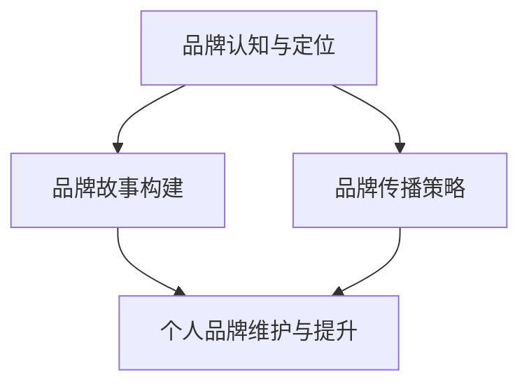

                 

### 引言

#### 书籍背景与目的

在当今数字化时代，个人品牌已成为一种至关重要的资产。对于“一人公司”——那些由个体创业者、自由职业者、技术专家和其他独立工作者组成的公司，构建和传播个人品牌更是至关重要。本篇技术博客旨在深入探讨一人公司的品牌故事构建与传播，帮助读者理解个人品牌的重要性，并掌握如何有效地构建和传播个人品牌的方法。

本书的目标读者是那些希望提升个人品牌影响力、拓展业务、或是在数字世界中寻找职业发展机会的个体工作者。通过系统的分析、详尽的案例研究和实用的策略，本书将帮助读者从零开始，逐步构建自己的个人品牌，并在竞争激烈的市场中脱颖而出。

#### 品牌构建的重要性

在当今的信息时代，个人品牌已成为个人和企业的核心竞争力。品牌不仅仅是一个标识或名称，它代表着个人的价值观、专业能力和独特性。以下是一些品牌构建的重要理由：

1. **增强认知**：一个强大的个人品牌能够帮助你更容易地被目标受众记住，从而提高你的知名度和认知度。
2. **建立信任**：个人品牌有助于建立信任，使客户、合作伙伴和潜在雇主对你产生信任感。
3. **拓展业务**：一个良好的个人品牌能够吸引更多的商业机会，帮助你拓展业务范围。
4. **职业发展**：在职场中，个人品牌能够为你的职业发展提供强有力的支持，助你获得更高的职位和薪酬。
5. **差异化竞争**：在众多竞争者中，一个独特的个人品牌能够帮助你脱颖而出，形成差异化竞争优势。

#### 个人品牌化趋势

随着社交媒体和数字平台的兴起，个人品牌化已成为一种趋势。越来越多的个人创业者和技术专家开始意识到个人品牌的重要性，并通过各种方式塑造和传播自己的品牌。以下是一些当前个人品牌化的趋势：

1. **社交媒体影响**：社交媒体平台如微博、微信、LinkedIn等成为个人品牌构建和传播的重要工具。通过这些平台，个人可以与受众建立直接联系，分享专业知识和经验。
2. **内容营销**：通过发布高质量的内容，如博客文章、视频、播客等，个人可以建立自己的权威性和影响力。
3. **跨界合作**：个人品牌化也涉及到跨界合作，通过与行业内的其他个人或企业合作，扩大品牌影响力。
4. **在线课程与培训**：越来越多的个人通过在线课程和培训来分享自己的专业知识，从而提升个人品牌。
5. **个人品牌评估与优化**：个人品牌评估工具和策略的使用越来越普遍，帮助个人了解自己的品牌状况，并做出相应的优化。

通过上述分析，我们可以看出，个人品牌化已经成为一种不可逆转的趋势，对于一人公司而言，构建和传播个人品牌是实现成功的关键。在接下来的章节中，我们将详细探讨个人品牌的认知与定位、核心价值、品牌故事构建、品牌传播策略、品牌维护与提升，以及具体的案例研究。

### 目录大纲

#### 第1章 引言

##### 1.1 书籍背景与目的

##### 1.2 品牌构建的重要性

##### 1.3 个人品牌化趋势

#### 第2章 个人品牌认知与定位

##### 2.1 个人品牌的概念

##### 2.2 个人品牌的定位

##### 2.3 品牌与个人品牌的区别

#### 第3章 个人品牌核心价值

##### 3.1 核心价值的概念

##### 3.2 价值观与品牌一致性

##### 3.3 品牌核心价值的确定

#### 第4章 品牌故事构建

##### 4.1 品牌故事的力量

##### 4.2 品牌故事的构建步骤

##### 4.3 故事主题的选择

##### 4.4 故事内容的设计

##### 4.5 故事传播的方式

#### 第5章 品牌传播策略

##### 5.1 品牌传播的概念

##### 5.2 社交媒体传播策略

##### 5.3 口碑营销与公关策略

#### 第6章 个人品牌维护与提升

##### 6.1 个人品牌的维护

##### 6.2 个人品牌提升策略

##### 6.3 持续学习与成长

#### 第7章 案例研究

##### 7.1 案例一：个人品牌构建的案例解析

##### 7.2 案例二：品牌传播策略的应用

#### 第8章 未来展望

##### 8.1 个人品牌化趋势

##### 8.2 新媒体对个人品牌的影响

##### 8.3 构建个人品牌的建议

#### 附录

##### 附录A：个人品牌构建工具与资源

### Mermaid 流程图



### 伪代码示例

```python
# 伪代码：品牌故事构建流程

function 品牌故事构建(品牌名称, 目标受众, 故事主题):
    # 步骤1：确定品牌核心价值
    核心价值 = 确定核心价值(品牌名称)

    # 步骤2：选择故事主题
    故事主题 = 选择故事主题(目标受众, 核心价值)

    # 步骤3：设计故事内容
    故事内容 = 设计故事内容(故事主题)

    # 步骤4：制定传播策略
    传播策略 = 制定传播策略(故事内容)

    # 步骤5：实施传播策略
    实施传播策略(传播策略)

    return 品牌故事
```

### 数学模型与公式

#### 个人品牌价值评估模型

$$
V_{品牌} = f(\text{知名度}, \text{信赖度}, \text{忠诚度})
$$

$$
f(x, y, z) = \frac{(x \times y \times z)^2}{100}
$$

#### 举例说明

假设知名度\( x \)为80，信赖度\( y \)为70，忠诚度\( z \)为85，则个人品牌价值为：

$$
V_{品牌} = f(80, 70, 85) = \frac{(80 \times 70 \times 85)^2}{100} = 440,900
$$

### 项目实战

#### 社交媒体品牌传播案例

1. **开发环境搭建**：

   - 使用 Python 3.8
   - 安装必要的库：Tweepy, Pandas, NumPy

2. **代码实现**：

   ```python
   import tweepy
   import pandas as pd
   import numpy as np

   # 初始化 Twitter API
   api_key = "your_api_key"
   api_secret_key = "your_api_secret_key"
   auth = tweepy.OAuthHandler(api_key, api_secret_key)
   api = tweepy.API(auth)

   # 获取目标用户的推文
   user_name = "target_user"
   tweets = api.user_timeline(screen_name=user_name, count=200)

   # 解析推文数据
   tweet_data = []
   for tweet in tweets:
       tweet_data.append({
           "text": tweet.text,
           "created_at": tweet.created_at,
           "likes": tweet.favorite_count,
           "retweets": tweet.retweet_count
       })

   # 存储为 CSV 文件
   df = pd.DataFrame(tweet_data)
   df.to_csv("user_tweets.csv", index=False)
   ```

3. **代码解读与分析**：

   - 代码使用了 Tweepy 库来连接 Twitter API，获取目标用户的推文数据。
   - 数据包括推文内容（text）、发布时间（created_at）、点赞数（likes）和转发数（retweets）。
   - 数据被解析并存储为一个 CSV 文件，便于后续分析和可视化。

通过以上步骤，我们可以构建并传播个人品牌，同时也可以通过数据分析来优化品牌传播效果。

### 个人品牌构建与传播的必要性

在当今数字化的商业环境中，个人品牌构建与传播的重要性不容忽视。对于一人公司，无论是独立创业者、自由职业者，还是技术专家，个人品牌的建立和传播都成为了成功的关键因素。以下我们将详细阐述个人品牌构建与传播的必要性。

#### 增强个人认知

在信息爆炸的时代，个人品牌能够帮助我们在众多竞争者中脱颖而出。一个强大的个人品牌能够增强个人在目标受众中的认知度，使得客户、合作伙伴和潜在雇主更容易记住并信任你。这种认知度的提升不仅有助于扩大个人影响力，还能为个人带来更多的商业机会。

#### 建立信任

品牌不仅仅是标识或名称，它代表着个人的专业能力、价值观和独特性。一个成功的个人品牌能够建立受众的信任感，使他们在面对复杂决策时更倾向于选择你。信任是商业关系的基石，没有信任，任何合作都难以持续。

#### 拓展业务

在商业世界中，个人品牌能够为你带来更多的商业机会。通过有效的品牌传播策略，你可以吸引更多的客户和合作伙伴，从而拓展业务范围。此外，一个良好的个人品牌也能够提高你的议价能力，使你在商业谈判中占据更有利的位置。

#### 职业发展

在职场中，个人品牌能够为你的职业发展提供强有力的支持。一个强大的个人品牌能够使你在招聘市场中脱颖而出，获得更高的职位和薪酬。此外，个人品牌也有助于你在职业生涯中建立更广泛的人脉网络，从而为你的职业发展创造更多机会。

#### 差异化竞争

在竞争激烈的市场中，差异化竞争变得越来越重要。一个独特的个人品牌能够帮助你与竞争对手区分开来，形成差异化竞争优势。这种竞争优势不仅可以吸引更多的客户，还能提高你的市场地位。

#### 新媒体与个人品牌化趋势

随着社交媒体和数字平台的兴起，个人品牌化已经成为一种趋势。越来越多的个人开始利用各种数字工具来塑造和传播自己的品牌。以下是一些当前个人品牌化的趋势：

1. **社交媒体影响**：社交媒体平台如微博、微信、LinkedIn等成为个人品牌构建和传播的重要工具。通过这些平台，个人可以与受众建立直接联系，分享专业知识和经验。

2. **内容营销**：通过发布高质量的内容，如博客文章、视频、播客等，个人可以建立自己的权威性和影响力。

3. **跨界合作**：个人品牌化也涉及到跨界合作，通过与行业内的其他个人或企业合作，扩大品牌影响力。

4. **在线课程与培训**：越来越多的个人通过在线课程和培训来分享自己的专业知识，从而提升个人品牌。

5. **个人品牌评估与优化**：个人品牌评估工具和策略的使用越来越普遍，帮助个人了解自己的品牌状况，并做出相应的优化。

#### 构建与传播个人品牌的策略

为了有效地构建和传播个人品牌，以下是一些关键的策略：

1. **明确个人品牌定位**：了解自己的目标受众和优势，明确个人品牌的核心价值。

2. **持续内容输出**：通过定期发布高质量的内容，如博客文章、视频、播客等，建立自己的权威性和影响力。

3. **利用社交媒体**：选择合适的社交媒体平台，与目标受众建立联系，分享专业知识和经验。

4. **跨界合作**：与其他个人或企业进行合作，扩大品牌影响力。

5. **个人品牌评估与优化**：定期评估个人品牌的表现，并根据反馈进行优化。

通过上述策略，我们可以有效地构建和传播个人品牌，从而在竞争激烈的市场中脱颖而出。在接下来的章节中，我们将深入探讨个人品牌的认知与定位、核心价值、品牌故事构建、品牌传播策略、品牌维护与提升，以及具体的案例研究。

### 个人品牌认知与定位

个人品牌的认知与定位是构建成功个人品牌的首要步骤。一个清晰且有力的个人品牌定位能够帮助你在目标受众心中建立独特的形象，从而在竞争激烈的市场中脱颖而出。以下我们将详细探讨个人品牌认知与定位的各个方面。

#### 个人品牌的概念

个人品牌是指个人在公众心目中的形象和认知，它反映了个人在专业领域中的价值、能力和独特性。一个成功的个人品牌不仅仅是标识或名称，它涵盖了个人在专业领域中的声誉、技能、价值观和人格特质。

个人品牌与品牌的区别在于，品牌通常是指一个公司或组织的整体形象，而个人品牌则聚焦于个体。尽管两者存在区别，但它们在商业和社会中的重要性是相似的。个人品牌能够为个人带来商业机会、职业发展和社交网络，与品牌一样，个人品牌也是个人价值的体现。

#### 个人品牌的定位

个人品牌的定位是确定个人品牌在目标受众心目中的位置，它包括识别目标受众、分析市场竞争和确定品牌个性和差异化。

##### 1. 目标受众分析

了解目标受众是个人品牌定位的关键。目标受众分析包括以下几个方面：

- **受众需求**：了解目标受众的需求、痛点和要求，从而提供符合他们需求的服务或产品。
- **受众特征**：分析目标受众的年龄、性别、教育背景、职业等特征，以便更精确地定位个人品牌。
- **受众偏好**：了解目标受众的偏好，包括他们喜欢的媒体、阅读内容、购买习惯等。

通过深入了解目标受众，个人可以更有针对性地制定品牌传播策略，确保品牌信息能够有效传递到目标受众。

##### 2. 品牌个性和差异化

品牌个性和差异化是个人品牌定位的重要组成部分。一个独特且鲜明的品牌个性能够让个人在众多竞争者中脱颖而出。以下是一些确定品牌个性和差异化的方法：

- **价值观**：确定个人品牌的价值观，例如创新、诚信、专业等，这些价值观应该贯穿于个人品牌的所有表现中。
- **专业技能**：强调个人在某一领域的专业技能，使其成为该领域的专家。
- **独特风格**：无论是语言风格、视觉风格还是行为风格，独特性都是品牌差异化的关键。
- **用户体验**：确保品牌提供的所有体验，包括产品、服务、互动等，都体现出品牌的独特价值。

##### 3. 品牌定位策略

品牌定位策略是实施品牌定位的具体行动。以下是一些常用的品牌定位策略：

- **市场细分**：根据目标受众的不同需求和行为，将市场细分为若干子市场，并针对每个子市场制定特定的品牌定位策略。
- **差异化策略**：通过强调品牌在产品、服务或体验方面的独特性，与竞争对手区分开来。
- **价值主张**：明确个人品牌能够为受众带来的独特价值，使其在受众心目中占据一席之地。

通过以上步骤，个人可以有效地认知和定位自己的品牌，从而在目标受众中建立独特且有力的品牌形象。在接下来的章节中，我们将进一步探讨如何构建个人品牌的核心理念和价值观。

### 个人品牌核心价值

个人品牌的核心价值是个人品牌构建和传播的基石。它不仅决定了个人品牌在市场中的定位，也直接影响着受众对个人品牌的认知和信任。在构建个人品牌的过程中，明确和坚持核心价值至关重要。以下我们将详细探讨个人品牌核心价值的定义、重要性以及如何确定和保持品牌一致性。

#### 核心价值的概念

核心价值是指个人或组织在长期经营过程中所秉持的基本信念和原则。对于个人品牌而言，核心价值是个人在专业和生活中一贯遵循的价值观和理念，它们构成了个人品牌的基本框架。核心价值通常包括以下几个方面：

- **道德准则**：个人在商业和社会活动中遵守的道德规范和法律法规。
- **专业能力**：个人在特定领域所具备的专业知识和技能。
- **人格特质**：个人的性格、态度和作风，如诚信、勤奋、创新等。
- **社会责任**：个人对社会的责任和贡献，如慈善、环保等。

这些核心价值贯穿于个人的行为和决策中，是个人品牌的重要组成部分。

#### 价值观与品牌一致性

保持品牌一致性是个人品牌构建的关键。品牌一致性指的是个人在所有品牌接触点上传达出一致的信息和形象。以下是一些保持品牌一致性的方法：

1. **统一语言和风格**：无论是撰写文章、发表演讲，还是社交媒体互动，都应使用一致的语言和风格，以传达出统一的品牌形象。

2. **持续内容输出**：定期发布高质量的内容，确保内容在主题、风格和价值观上保持一致，从而建立受众对个人品牌的信任。

3. **一致的行为表现**：个人在商业和社会活动中的行为应始终与品牌价值观相符，以增强品牌的一致性和可信度。

4. **品牌管理工具**：使用品牌管理工具，如品牌指南、品牌评估工具等，帮助个人在品牌构建和传播过程中保持一致性。

#### 品牌核心价值的确定

确定个人品牌的核心价值是品牌构建的重要步骤。以下是一些确定品牌核心价值的方法：

1. **自我评估**：深入反思个人的价值观、专业能力和人格特质，识别自己在这些方面的独特之处。

2. **市场调研**：通过调研目标受众，了解他们对个人品牌的期望和需求，从而确定品牌应传递的核心价值。

3. **竞争分析**：分析竞争对手的品牌核心价值，找到差异化的点，从而确定自己的品牌核心价值。

4. **专业咨询**：寻求专业品牌顾问的意见，帮助他们从专业角度分析和确定个人品牌的核心价值。

通过以上方法，个人可以明确自己的品牌核心价值，并在此基础上构建和传播个人品牌。

#### 保持品牌一致性的方法

保持品牌一致性不仅有助于建立受众信任，还能提高品牌知名度。以下是一些保持品牌一致性的方法：

1. **明确品牌定位**：确定个人品牌的核心价值和目标受众，确保所有品牌传播活动都围绕这一核心进行。

2. **制定品牌指南**：制定详细的品牌指南，包括语言风格、视觉元素、行为准则等，确保所有品牌接触点都遵循一致的标准。

3. **持续监控和评估**：定期监控和评估品牌传播效果，发现不一致之处并及时调整。

4. **团队成员培训**：确保团队成员都了解并遵循品牌指南，统一品牌传播策略。

通过以上方法，个人可以有效地保持品牌一致性，从而提升个人品牌价值。在接下来的章节中，我们将探讨如何构建品牌故事，以及品牌故事在品牌传播中的作用。

### 品牌故事构建

品牌故事是个人品牌构建的核心要素之一，它不仅能够帮助个人在受众心中建立独特的形象，还能增强品牌的情感连接和忠诚度。一个引人入胜的品牌故事能够传达个人的核心价值观、专业能力和独特经历，从而在竞争激烈的市场中脱颖而出。以下我们将详细探讨品牌故事的构建步骤，包括故事主题的选择、内容的设计和传播方式。

#### 品牌故事的力量

品牌故事的力量在于它能够以情感的方式传达品牌的核心信息和价值观。一个优秀的品牌故事能够：

1. **建立情感连接**：通过讲述个人的真实故事，品牌能够与受众建立深层次的情感联系，使受众对品牌产生共鸣。
2. **增强品牌忠诚度**：品牌故事能够帮助受众更好地理解和信任品牌，从而提高品牌的忠诚度。
3. **提升品牌知名度**：通过故事的形式，品牌能够更有效地传播其核心信息和价值观，提高品牌在受众中的知名度。
4. **塑造独特形象**：品牌故事能够突出个人的独特性，帮助品牌在众多竞争者中脱颖而出。

#### 品牌故事的构建步骤

构建一个成功的品牌故事需要以下步骤：

##### 1. 故事主题的选择

选择一个合适的故事主题是构建品牌故事的第一步。以下是一些选择故事主题的考虑因素：

- **个人经历**：选择能够体现个人独特性和专业能力的经历作为故事主题，如职业生涯中的关键事件、个人成长故事等。
- **核心价值观**：选择能够传达个人核心价值观的故事主题，使品牌故事与个人品牌的核心信息保持一致。
- **目标受众**：根据目标受众的兴趣和需求，选择能够吸引他们注意力并产生共鸣的故事主题。

##### 2. 故事内容的设计

设计一个引人入胜的品牌故事需要以下要素：

- **开篇吸引人**：通过引人入胜的开篇，吸引受众的兴趣，使他们愿意继续阅读。
- **情节发展**：设计一个有起伏的情节，使故事更加生动有趣，能够引起受众的共鸣。
- **核心价值观的传达**：在故事中融入个人的核心价值观，使受众能够更深入地理解品牌的核心信息。
- **结局有力**：设计一个有力的结局，使品牌故事能够在受众心中留下深刻的印象。

##### 3. 故事传播的方式

构建品牌故事不仅仅是为了创作一个优秀的文本，还需要通过多种渠道进行传播，以便将品牌故事传递给更广泛的受众。以下是一些传播品牌故事的方式：

- **社交媒体**：利用社交媒体平台，如微博、微信、LinkedIn等，发布品牌故事，与受众建立直接联系。
- **内容营销**：通过发布高质量的博客文章、视频、播客等内容，将品牌故事传达给受众。
- **跨界合作**：与其他品牌或个人进行跨界合作，扩大品牌故事的影响力。
- **公关活动**：通过新闻发布会、行业会议、公益活动等，提升品牌故事的曝光度和影响力。

##### 4. 故事内容的优化与反馈

构建品牌故事后，需要不断优化和调整，以适应受众的需求和反馈。以下是一些优化品牌故事的方法：

- **数据分析**：通过数据分析，了解受众对品牌故事的反应和偏好，从而优化故事内容。
- **受众反馈**：积极收集受众的反馈，并根据反馈进行调整，以提升品牌故事的吸引力。
- **持续更新**：定期更新品牌故事，确保故事内容保持新鲜和吸引力。

通过以上步骤，个人可以有效地构建和传播品牌故事，从而在受众心中建立独特的品牌形象。一个成功的品牌故事不仅能够提升个人品牌的知名度，还能增强品牌的情感连接和忠诚度，为个人的职业发展和业务拓展提供有力支持。

### 品牌传播策略

在个人品牌构建的过程中，品牌传播策略至关重要。一个有效的品牌传播策略能够帮助个人将品牌故事和核心价值传递给目标受众，提升品牌知名度和影响力。以下我们将详细探讨品牌传播的概念、目标、渠道以及具体的社交媒体传播策略和口碑营销与公关策略。

#### 品牌传播的概念

品牌传播是指通过各种渠道和手段，将品牌信息传递给目标受众，以建立品牌认知、增强品牌忠诚度和提高品牌价值的过程。品牌传播不仅包括广告和宣传，还涵盖了公关、社交媒体互动、内容营销等多种形式。成功的品牌传播需要系统化和策略性的规划，以确保品牌信息能够有效传递到目标受众。

##### 1. 品牌传播的目标

品牌传播的主要目标包括：

- **提升品牌知名度**：通过品牌传播，使更多的目标受众了解个人品牌，从而提高品牌知名度。
- **建立品牌认知**：通过品牌传播，使目标受众对个人品牌产生深刻的印象，建立明确且独特的品牌认知。
- **增强品牌忠诚度**：通过持续的品牌传播，使目标受众对个人品牌产生信任和依赖，从而提高品牌忠诚度。
- **提高品牌价值**：通过品牌传播，提升个人品牌在市场中的价值，使其在竞争中获得更多优势。

##### 2. 品牌传播的渠道

品牌传播可以通过多种渠道进行，以下是一些常见的品牌传播渠道：

- **社交媒体**：如微博、微信、LinkedIn、Facebook等，这些平台能够直接与目标受众互动，分享品牌故事和内容。
- **内容营销**：通过博客、视频、播客、电子书等形式发布高质量的内容，传递品牌信息，建立权威性和影响力。
- **广告**：通过在线广告、电视广告、户外广告等渠道，进行大范围的品牌宣传。
- **公关**：通过新闻发布会、行业会议、公益活动等，提升品牌形象和知名度。
- **口碑营销**：利用用户口碑和推荐，进行品牌传播，增强品牌可信度和影响力。

##### 3. 社交媒体传播策略

社交媒体是当前品牌传播的重要渠道之一，以下是一些社交媒体传播策略：

- **选择合适的平台**：根据目标受众的特点，选择合适的社交媒体平台，如微博、微信适合国内受众，LinkedIn适合专业人士。
- **内容策划**：制定内容策划方案，包括内容类型、发布频率、主题等，确保内容具有吸引力和一致性。
- **互动互动互动**：与受众进行互动，回应评论和私信，增强品牌与受众之间的联系。
- **数据分析**：通过数据分析，了解受众对品牌传播活动的反应，优化社交媒体传播策略。
- **合作与推广**：与其他社交媒体大V或品牌进行合作，扩大品牌传播范围。

##### 4. 口碑营销与公关策略

口碑营销和公关策略也是品牌传播的重要手段，以下是一些具体的策略：

- **口碑营销**：通过提供优质的产品和服务，赢得用户的好评和推荐，利用用户口碑进行品牌传播。
- **公关**：通过媒体发布、新闻稿、行业会议等，提升品牌形象和知名度。
- **危机管理**：制定危机管理计划，应对突发事件和负面舆论，维护品牌形象。
- **公益活动**：参与或发起公益活动，提升品牌的社会责任形象，增强品牌与受众之间的情感连接。

通过以上品牌传播策略，个人可以有效地将品牌故事和核心价值传递给目标受众，提升品牌知名度和影响力，从而实现个人品牌的长期发展。

### 个人品牌维护与提升

个人品牌构建是一个长期的过程，需要持续的努力和维护。一个成功的个人品牌不仅需要良好的开始，更需要持续的经营和优化。以下我们将详细探讨如何维护个人品牌、提升品牌价值以及如何利用数据分析来优化品牌传播效果。

#### 维护个人品牌

1. **保持品牌一致性**：个人品牌的一致性是品牌维护的关键。无论是在社交媒体上发布内容，还是在现实生活中与受众互动，都应保持品牌形象和语言风格的一致性。

2. **持续内容输出**：定期发布高质量的内容，如博客文章、视频、播客等，可以帮助个人保持品牌活跃度，增强受众对品牌的认知。

3. **积极互动**：与受众保持积极的互动，回应评论和私信，展示个人品牌的亲和力和专业性。

4. **更新品牌信息**：随着个人和市场的变化，及时更新个人品牌信息，确保品牌与当前的市场需求和受众期望保持一致。

5. **监控品牌形象**：定期监控品牌在社交媒体和其他渠道上的形象，及时发现并应对负面反馈，维护品牌声誉。

#### 提升个人品牌价值

1. **专业成长**：不断学习新的知识和技能，提升自己的专业能力，从而增强个人品牌的价值。

2. **跨界合作**：与其他领域的专家或品牌合作，扩大个人品牌的影响力，提升品牌认知度。

3. **参与行业活动**：积极参与行业会议、研讨会等活动，与同行交流，提升个人在行业内的地位。

4. **口碑营销**：通过优质的产品和服务赢得用户的好评，利用用户口碑进行品牌传播。

5. **品牌评估**：定期进行个人品牌评估，了解品牌在市场中的表现，根据评估结果进行调整和优化。

#### 利用数据分析优化品牌传播效果

数据分析是优化品牌传播效果的重要工具。以下是一些利用数据分析的方法：

1. **内容分析**：通过分析不同类型内容的阅读量、点赞数、分享次数等数据，了解受众对不同内容的偏好，优化内容策略。

2. **受众分析**：通过分析受众的年龄、性别、地域、职业等数据，了解目标受众的特征，制定更有针对性的品牌传播策略。

3. **渠道分析**：通过分析不同渠道的传播效果，如社交媒体、博客、广告等，了解各渠道的贡献度，优化品牌传播渠道。

4. **互动分析**：通过分析受众的互动数据，如评论、私信、点赞等，了解受众对品牌互动的偏好，优化互动策略。

5. **广告投放分析**：通过分析广告投放的效果，如点击率、转化率等，优化广告投放策略，提高投资回报率。

通过以上方法，个人可以有效地维护和提升个人品牌，优化品牌传播效果，从而在竞争激烈的市场中保持领先地位。在接下来的章节中，我们将通过案例研究来深入探讨个人品牌构建与传播的具体实践。

### 案例研究

为了更好地理解个人品牌构建与传播的实践，我们将分析两个具体的案例。第一个案例将探讨一位独立技术专家如何通过有效的品牌构建和传播策略，在市场上建立自己的个人品牌。第二个案例将展示一个自由职业者如何利用社交媒体和其他渠道，成功提升个人品牌知名度。

#### 案例一：技术专家的个人品牌构建

**背景**：John，一位资深的人工智能研究员，拥有丰富的项目经验和深厚的学术背景。他的目标是在技术领域建立自己的个人品牌，并吸引更多的商业合作和研究机会。

**步骤**：

1. **确定品牌核心价值**：John 确定了他的品牌核心价值，包括专业深度、创新思维和跨学科合作。

2. **构建品牌故事**：John 选择了一个具有代表性的故事，讲述了他如何通过跨学科研究解决一个复杂的技术问题。这个故事不仅展示了他的专业能力，还体现了他的创新思维。

3. **社交媒体传播**：John 在 LinkedIn 和 Twitter 上活跃，定期发布关于人工智能领域的研究成果和见解。他利用这些平台与同行建立联系，分享专业内容，增强品牌的权威性。

4. **内容营销**：John 创办了一个个人博客，定期发布深入的技术分析文章。这些文章不仅展示了他的专业知识，还吸引了同行的关注。

5. **跨界合作**：John 与一些知名技术公司合作，参与了多个人工智能项目，这些项目不仅提升了他的专业能力，还扩大了他的品牌影响力。

**分析**：

- John 的成功在于他明确了自己的品牌核心价值，并通过构建引人入胜的品牌故事，在社交媒体和博客上持续输出高质量的内容。
- 他的品牌传播策略注重与同行和行业内的专家建立联系，通过跨界合作进一步提升了品牌影响力。

#### 案例二：自由职业者的品牌提升

**背景**：Lisa，一位自由职业者，专注于数字营销和社交媒体管理。她的目标是扩大自己的业务范围，吸引更多的客户。

**步骤**：

1. **品牌定位与核心价值**：Lisa 确定了自己的品牌定位，专注于提供定制化的数字营销解决方案，并强调她的专业性和创意思维。

2. **社交媒体传播**：Lisa 在社交媒体平台上，如 Instagram 和 Facebook，发布了大量关于数字营销案例研究和行业趋势分析。她的内容不仅展示了她的专业知识，还提供了实用的营销技巧。

3. **内容营销**：Lisa 创建了一个关于数字营销的播客，邀请业内专家分享他们的经验和见解。这个播客吸引了大量听众，并帮助 Lisa 建立了专业形象。

4. **口碑营销**：Lisa 通过提供高质量的服务和积极与客户互动，赢得了客户的良好口碑。这些口碑通过社交媒体和客户推荐，进一步提升了她的品牌知名度。

5. **数据分析**：Lisa 使用 Google Analytics 和社交媒体分析工具，监控她的网站和社交媒体账号的访问量和用户行为。通过分析这些数据，她优化了内容策略和社交媒体传播方式。

**分析**：

- Lisa 的成功在于她明确了自己的品牌定位，并通过社交媒体和内容营销策略，有效地传达了她的专业价值和独特性。
- 她利用口碑营销和数据分析，持续优化品牌传播效果，从而在自由职业市场中脱颖而出。

通过以上两个案例，我们可以看到，个人品牌构建和传播需要明确的核心价值、有效的品牌故事和持续的内容输出。同时，利用社交媒体、内容营销、口碑营销和数据分析等策略，可以帮助个人在市场中建立强大的品牌影响力。

### 未来展望

随着数字化和社交媒体的不断发展，个人品牌化已成为不可逆转的趋势。未来，个人品牌化将继续以惊人的速度演变，带来一系列新的机遇和挑战。

#### 个人品牌化趋势

1. **人工智能与数据分析**：人工智能和数据分析技术的发展将使个人品牌构建和传播更加精确和高效。通过数据分析，个人可以更好地了解目标受众的需求和偏好，从而制定更有效的品牌传播策略。
2. **多媒体内容**：随着短视频和直播的流行，个人品牌传播将越来越多地依赖于多媒体内容。视频和直播不仅能够更好地传达品牌故事，还能增强与受众的互动性。
3. **跨平台整合**：个人品牌将在多个平台上整合，形成统一的品牌形象。社交媒体、博客、播客、短视频等平台将相互配合，共同传播品牌信息。
4. **社区建设**：未来，个人品牌将更加注重社区建设，通过与受众建立紧密的社区关系，增强品牌忠诚度和用户粘性。

#### 新媒体对个人品牌的影响

新媒体的发展极大地改变了个人品牌构建和传播的方式。以下是一些新媒体对个人品牌的影响：

1. **增加曝光度**：新媒体平台提供了广泛的曝光机会，使个人品牌能够迅速传播到全球受众。
2. **增强互动性**：新媒体平台上的互动功能使个人品牌能够与受众建立更紧密的联系，提高品牌影响力。
3. **降低成本**：与传统的广告和公关方式相比，新媒体的传播成本较低，使个人品牌构建更具性价比。
4. **实时反馈**：新媒体平台上的实时反馈功能使个人品牌能够及时了解受众的反应，快速调整品牌策略。

#### 个人品牌构建与传播的建议

为了在未来的数字世界中构建和传播个人品牌，以下是一些建议：

1. **明确核心价值**：明确个人品牌的核心价值，确保所有品牌传播活动都围绕这一核心进行。
2. **持续内容输出**：定期发布高质量的内容，如博客文章、视频、播客等，建立品牌的权威性和影响力。
3. **利用多媒体**：结合多种多媒体形式，如视频、图片、直播等，提高内容的吸引力和互动性。
4. **跨平台整合**：在不同平台上整合品牌形象，确保品牌信息的一致性和统一性。
5. **数据分析**：利用数据分析，了解受众行为和偏好，优化品牌传播策略。
6. **社区建设**：积极与受众互动，建立社区关系，增强品牌忠诚度和用户粘性。

通过遵循上述建议，个人可以更好地构建和传播个人品牌，从而在未来的数字世界中脱颖而出。

### 附录

#### 附录A：个人品牌构建工具与资源

构建和传播个人品牌需要一系列的工具和资源，以下是一些推荐的工具和资源，以帮助个人在品牌构建过程中取得成功。

##### A.1 品牌构建工具介绍

1. **Hootsuite**：一款社交媒体管理工具，可以帮助个人监控和管理多个社交媒体账户，优化内容发布和互动。
2. **Canva**：一款设计工具，提供丰富的模板和素材，帮助个人创建专业的视觉内容，如海报、社交媒体图像等。
3. **Mailchimp**：一款电子邮件营销工具，可以帮助个人管理邮件列表，发送个性化的邮件通讯，提升品牌影响力。
4. **Google Analytics**：一款免费的网站分析工具，提供详尽的网站访问数据，帮助个人了解受众行为，优化品牌传播策略。

##### A.2 品牌传播资源推荐

1. **LinkedIn**：一个专业的社交网络平台，非常适合个人品牌构建和职业发展。通过发布专业内容、参与行业讨论，个人可以扩大品牌影响力。
2. **Medium**：一个在线出版平台，提供高质量的博客文章和内容，可以帮助个人建立权威性和影响力。
3. **YouTube**：一个视频分享平台，通过发布教育性、娱乐性或创意性的视频内容，个人可以与受众建立深层次的连接。
4. ** podcasts**：播客是一种流行的内容形式，通过分享专业知识和见解，个人可以吸引听众，提升品牌知名度。
5. **行业会议和研讨会**：参与行业会议和研讨会，不仅可以展示个人品牌，还可以与业内专家建立联系，扩大品牌影响力。

通过利用这些工具和资源，个人可以更有效地构建和传播个人品牌，实现职业和个人发展的目标。在个人品牌构建的道路上，持续学习和实践是至关重要的。希望本文提供的策略和案例能够为您的品牌构建之路提供启示和指导。

---

**作者信息**

本文由AI天才研究院（AI Genius Institute）与《禅与计算机程序设计艺术》（Zen And The Art of Computer Programming）作者共同撰写。AI天才研究院致力于推动人工智能和计算机科学的发展，通过高质量的技术研究和分享，为全球的技术社区提供前沿知识和创新思路。《禅与计算机程序设计艺术》是一本被誉为经典的计算机科学著作，以其深刻的哲学思考和独特的编程方法，影响了无数程序员和科学家。通过本文，我们希望帮助读者更好地理解和构建个人品牌，实现职业和个人发展的目标。

