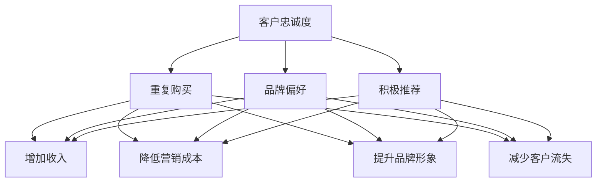
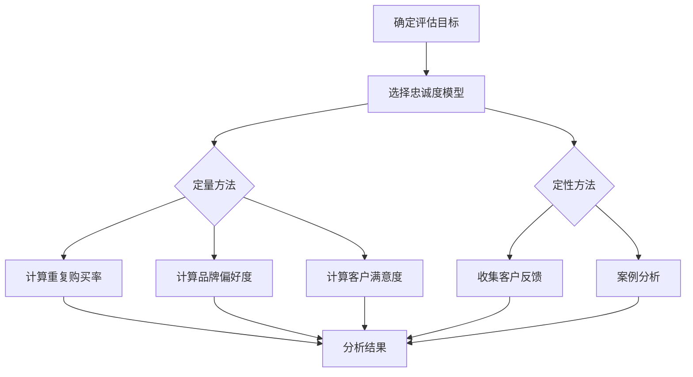
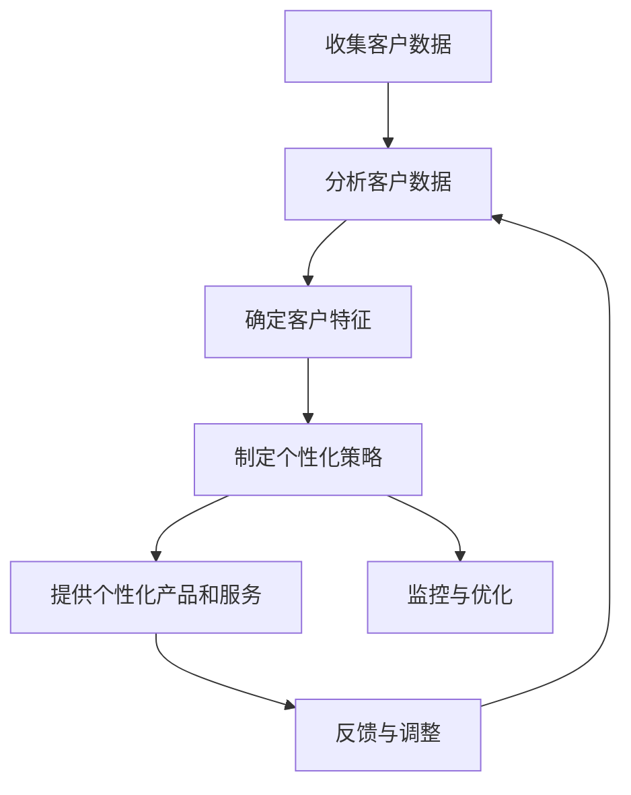
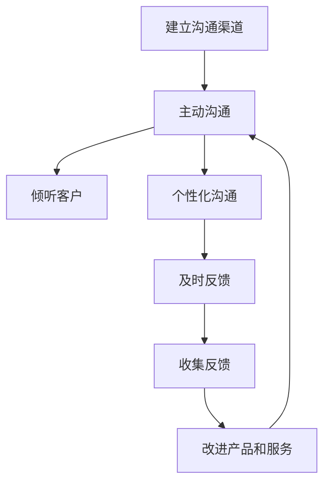
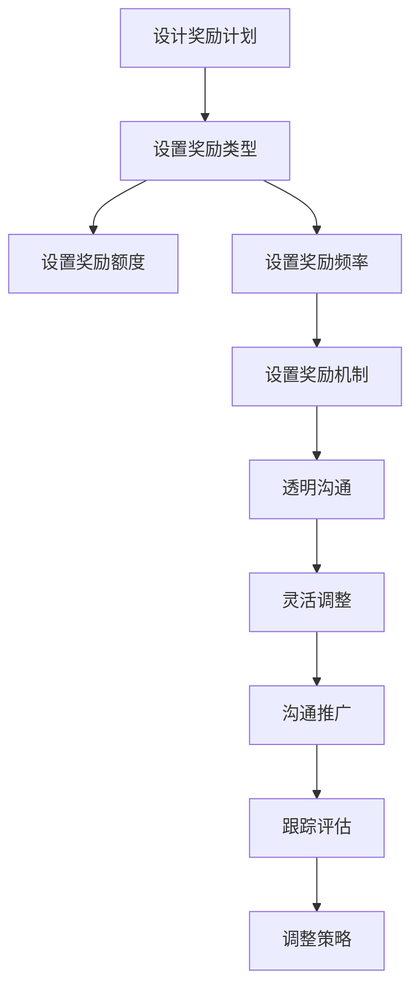
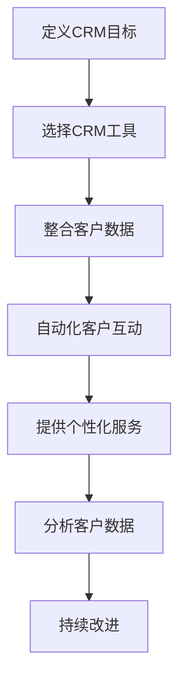
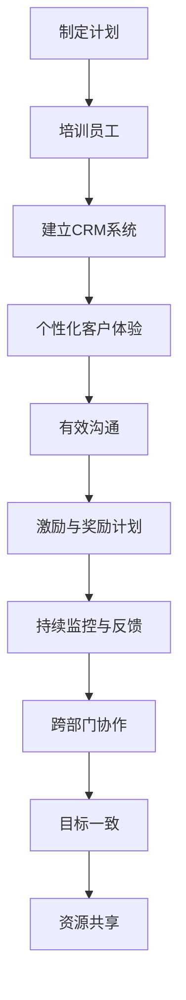
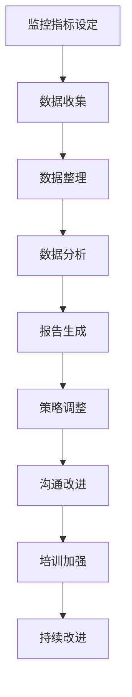

                 

### 前言

在当今的商业环境中，客户忠诚度是任何企业成功的关键因素之一，无论公司规模大小。对于一家一人公司来说，建立并维持客户忠诚度尤为重要。在这篇文章中，我们将深入探讨客户忠诚度的核心概念、评估方法，以及如何通过个性化体验、有效沟通、激励计划、客户关系管理等策略来建立长期稳定的客户关系。

**介绍与目的**

本文旨在为一人公司的所有者提供一套全面且实用的客户忠诚度计划。我们将从基础理论出发，逐步引导读者了解并应用各种策略，以建立和维护强大的客户忠诚度。

**读者对象**

本文面向那些对客户忠诚度有浓厚兴趣的一人公司所有者、市场营销人员、客户服务经理，以及希望提升客户忠诚度的企业高管。

**本书结构**

本文将分为三个主要部分：

1. **客户忠诚度概述**：介绍客户忠诚度的核心概念与重要性，并探讨评估客户忠诚度的模型与方法。
2. **建立客户忠诚度的策略**：详细探讨个性化客户体验、有效客户沟通、激励与奖励计划、客户关系管理等方面。
3. **实施与监控**：介绍如何实施客户忠诚度计划，以及如何进行监控和优化。

通过这篇文章，读者将能够获得：

- 对客户忠诚度有深入的理解。
- 全面掌握建立客户忠诚度的策略。
- 获得实际操作的指导，能够立即应用于自己的业务中。

### 第一部分：客户忠诚度概述

在商业世界中，客户忠诚度被视为衡量企业成功与否的关键指标。对于一人公司来说，建立强大的客户忠诚度不仅能够提升市场份额，还能带来长期的商业价值。本部分将深入探讨客户忠诚度的核心概念、重要性，并介绍评估客户忠诚度的模型与方法。

#### 第1章：客户忠诚度的核心概念与重要性

##### 客户忠诚度的定义

客户忠诚度是指客户对某个品牌或企业的持续购买行为和积极评价。具体来说，它包括以下三个方面：

1. **重复购买**：客户在一段时间内重复购买同一品牌或企业的产品或服务。
2. **品牌偏好**：客户在面临多种选择时，更倾向于选择熟悉的品牌或企业。
3. **积极推荐**：客户愿意向他人推荐该品牌或企业。

##### 客户忠诚度的重要性

客户忠诚度对企业的影响是多方面的：

1. **增加收入**：忠诚客户往往会进行更多次购买，从而提高企业的总收入。
2. **降低营销成本**：忠诚客户不需要频繁吸引，节省了大量的营销预算。
3. **提升品牌形象**：忠诚客户会为企业提供正面口碑，有助于提升品牌形象。
4. **减少客户流失**：高忠诚度的客户更少可能转向竞争对手，降低了客户流失率。

##### Mermaid 流程图：客户忠诚度的影响因素



#### 第2章：客户忠诚度模型与评估

##### 客户忠诚度模型介绍

客户忠诚度模型是用于评估和预测客户忠诚度的方法。常见的客户忠诚度模型包括：

1. **贝塔分布模型**：用于预测客户忠诚度的时间长度。
2. **忠诚度指数模型**：通过计算客户的重复购买率和品牌偏好度来评估忠诚度。
3. **顾客生命周期价值模型**：通过预测客户生命周期内的总消费额来评估忠诚度。

##### 评估客户忠诚度的方法

评估客户忠诚度的方法包括定量和定性两种：

1. **定量方法**：
   - **重复购买率**：计算在一定时间内重复购买同一品牌或产品的客户比例。
   - **品牌偏好度**：通过调查或分析客户购买记录来评估他们对品牌的偏好程度。
   - **客户满意度**：通过调查客户对品牌或产品的满意度来评估忠诚度。

2. **定性方法**：
   - **客户反馈**：收集客户的意见和建议，了解他们对品牌或产品的真实感受。
   - **案例分析**：通过研究成功案例，分析客户忠诚度背后的因素。

##### Mermaid 流程图：客户忠诚度评估流程



##### 伪代码：客户忠诚度计算方法

```python
# 定义客户忠诚度评估函数
def calculate_loyalty(score_repeated_purchase, score_brand_favorability, score_customer_satisfaction):
    # 计算客户忠诚度得分
    loyalty_score = (score_repeated_purchase + score_brand_favorability + score_customer_satisfaction) / 3
    return loyalty_score

# 示例数据
score_repeated_purchase = 0.8  # 重复购买率得分
score_brand_favorability = 0.9  # 品牌偏好度得分
score_customer_satisfaction = 0.85  # 客户满意度得分

# 计算客户忠诚度
client_loyalty = calculate_loyalty(score_repeated_purchase, score_brand_favorability, score_customer_satisfaction)

print("客户忠诚度得分:", client_loyalty)
```

通过上述内容，我们为一人公司提供了一个基础的框架来理解和管理客户忠诚度。下一部分，我们将探讨如何通过个性化客户体验、有效沟通、激励与奖励计划、客户关系管理等策略，进一步建立和提升客户忠诚度。

### 第二部分：建立客户忠诚度的策略

在了解了客户忠诚度的核心概念和重要性后，我们需要关注的是如何有效地建立和提升客户忠诚度。对于一人公司而言，这意味着要深入理解客户需求，并通过一系列精心设计的策略来巩固客户关系。本部分将详细探讨个性化客户体验、有效客户沟通、激励与奖励计划、客户关系管理等策略。

#### 第3章：个性化客户体验

个性化客户体验是建立客户忠诚度的关键因素之一。通过了解和满足客户的个性化需求，企业可以提升客户的满意度和忠诚度。以下是实现个性化客户体验的一些关键步骤：

##### 个性化客户体验的定义

个性化客户体验是指企业根据客户的具体需求、行为和偏好，提供定制化的产品、服务和互动体验。这种体验能够增强客户与品牌之间的联系，提高客户满意度。

##### 收集和分析客户数据

要提供个性化的客户体验，首先需要收集和分析客户数据。这些数据包括：

1. **个人信息**：客户的姓名、年龄、性别、地理位置等。
2. **购买行为**：客户的购买历史、偏好、消费习惯等。
3. **互动数据**：客户在社交媒体、网站、客服渠道的互动记录。
4. **反馈数据**：客户对产品或服务的评价、建议和投诉。

通过数据分析，企业可以识别出客户的特征和需求，从而制定个性化的营销策略。

##### 提供个性化的产品和服务

基于客户数据分析，企业可以提供以下个性化的产品和服务：

1. **定制化产品**：根据客户的需求，提供定制化的产品或服务。
2. **个性化推荐**：利用推荐算法，为每个客户推荐符合他们兴趣和需求的产品。
3. **个性化沟通**：通过邮件、短信、社交媒体等渠道，为每个客户提供个性化的沟通体验。

##### Mermaid 流程图：个性化客户体验流程



#### 第4章：有效的客户沟通

客户沟通是建立客户忠诚度的另一个关键因素。有效的客户沟通能够增强客户对品牌的信任和满意度，从而提高忠诚度。以下是一些关于有效客户沟通的策略：

##### 建立有效的客户沟通渠道

企业应确保与客户之间的沟通渠道多样且便捷。以下是一些常用的沟通渠道：

1. **电话**：提供电话支持，确保客户遇到问题时能够及时得到帮助。
2. **电子邮件**：通过电子邮件进行正式沟通，如发送订单确认、账单等。
3. **社交媒体**：利用社交媒体平台与客户互动，提供实时支持和信息分享。
4. **在线聊天**：提供在线聊天功能，使客户能够即时获得帮助。

##### 沟通技巧和策略

有效的客户沟通需要以下技巧和策略：

1. **主动沟通**：在客户需要之前，主动提供帮助和信息。
2. **倾听**：认真倾听客户的需求和问题，确保理解他们的真实意图。
3. **个性化沟通**：根据客户的偏好和需求，定制沟通内容和方式。
4. **及时反馈**：及时回复客户的问题和反馈，确保他们的需求得到满足。

##### 客户反馈的重要性

客户反馈是改进产品和服务的宝贵资源。通过收集和分析客户反馈，企业可以：

1. **识别问题**：了解客户遇到的问题和不满，及时采取措施解决。
2. **改进产品**：根据客户反馈，优化产品设计和功能。
3. **提升满意度**：通过持续改进，提升客户对品牌的满意度。

##### Mermaid 流程图：客户沟通流程



#### 第5章：激励与奖励计划

激励与奖励计划是提高客户忠诚度的有效手段。通过提供有吸引力的奖励，企业可以激励客户进行重复购买和积极推荐。以下是设计有效激励计划的几个关键步骤：

##### 设计有效的激励计划

设计激励计划时，企业应考虑以下因素：

1. **奖励类型**：选择符合客户需求的奖励，如折扣、赠品、积分等。
2. **奖励额度**：根据客户的购买量和贡献度，设置合理的奖励额度。
3. **奖励频率**：定期提供奖励，以维持客户参与度和积极性。
4. **奖励机制**：确保奖励机制简单易懂，易于客户参与。

##### 实施奖励计划的最佳实践

以下是一些实施奖励计划的最佳实践：

1. **透明度**：确保奖励规则清晰透明，让客户了解他们如何获得奖励。
2. **灵活度**：根据客户需求和市场变化，灵活调整奖励计划。
3. **沟通**：通过邮件、短信、社交媒体等渠道，向客户宣传奖励计划，并提醒他们参与。
4. **跟踪与评估**：定期跟踪奖励计划的效果，根据数据调整策略。

##### 案例研究：成功的激励计划

以下是一个成功的一人公司激励计划的案例研究：

**案例背景**：

- 公司：一家小型在线书店
- 目标：提高客户重复购买率和品牌忠诚度

**实施策略**：

1. **积分奖励**：客户每购买一本书，获得一定积分。积分可以在下次购买时抵扣现金。
2. **推荐奖励**：客户成功推荐一位新客户，获得额外积分。
3. **节日促销**：在重要节日（如圣诞节、生日等）提供额外的积分奖励。

**效果评估**：

- 重复购买率提高了20%
- 客户推荐率提高了15%
- 积分兑换率达到了60%

##### Mermaid 流程图：激励与奖励流程



#### 第6章：客户关系管理

客户关系管理（CRM）是一种系统化方法，用于跟踪和管理企业与客户的所有互动，以提升客户满意度和忠诚度。以下是客户关系管理的定义、建立长期客户关系的重要性、CRM工具与技术等内容。

##### 客户关系管理的定义与作用

客户关系管理（CRM）是指企业通过技术和流程来组织、自动化和同步客户互动信息，以改善客户体验、提高客户满意度和忠诚度。CRM系统帮助企业：

1. **提升销售效率**：通过自动化销售流程，减少手动操作，提高销售团队的工作效率。
2. **优化客户服务**：通过提供统一的客户视图，确保客户服务团队能够快速响应客户需求。
3. **提高客户满意度**：通过持续改进客户互动体验，提升客户满意度。
4. **增强客户忠诚度**：通过个性化的客户沟通和奖励计划，增强客户忠诚度。

##### 建立长期客户关系

建立长期客户关系的关键在于：

1. **信任**：建立与客户的信任关系，使客户感到企业是值得信赖的。
2. **沟通**：与客户保持持续的沟通，了解他们的需求和期望。
3. **个性化**：根据客户的数据和偏好，提供个性化的产品和服务。
4. **及时响应**：对客户的问题和反馈及时响应，确保他们感到被重视。
5. **持续改进**：通过不断改进产品和客户体验，提升客户满意度。

##### 客户关系管理工具与技术

以下是几种常用的CRM工具和技术：

1. **客户关系管理系统（CRM软件）**：如Salesforce、Microsoft Dynamics 365等，用于跟踪和管理客户互动。
2. **客户数据平台（CDP）**：用于整合和分析客户数据，提供全面的客户视图。
3. **自动化营销工具**：如营销自动化平台、电子邮件营销工具等，用于自动化营销活动。
4. **社交媒体管理工具**：用于监控和管理社交媒体上的客户互动。
5. **数据分析工具**：如Google Analytics、Tableau等，用于分析客户数据，提供洞察和决策支持。

##### Mermaid 流程图：客户关系管理流程



通过上述策略，一人公司可以有效地建立和提升客户忠诚度。下一部分，我们将探讨如何实施这些策略，并监控客户忠诚度的变化。

### 第三部分：实施与监控

建立客户忠诚度的策略虽然重要，但如果没有有效的实施和监控，这些策略将难以产生预期的效果。本部分将详细探讨如何实施客户忠诚度计划，如何监控和优化客户忠诚度，以及实施过程中可能遇到的问题和解决方案。

#### 第7章：实施客户忠诚度计划

##### 制定客户忠诚度计划

实施客户忠诚度计划的第一步是制定一个明确的计划。这个计划应包括以下内容：

1. **目标**：明确计划的目标，如提高客户重复购买率、降低客户流失率等。
2. **策略**：根据前述章节中的策略，确定具体的实施策略，如个性化客户体验、有效沟通、激励与奖励计划等。
3. **时间表**：设定实施计划的时间表，包括各个阶段的开始和结束时间。
4. **预算**：估算实施计划所需的预算，包括人力、技术和营销费用等。
5. **资源**：确定实施计划所需的资源，包括人力资源、技术支持和市场营销资源。

##### 计划实施的关键步骤

在制定好客户忠诚度计划后，接下来是实施计划。以下是一些关键步骤：

1. **培训员工**：确保所有员工了解客户忠诚度计划的目标和策略，并掌握实施技巧。
2. **建立CRM系统**：选择合适的CRM系统，整合客户数据，建立统一的客户视图。
3. **个性化客户体验**：根据客户数据，提供个性化的产品和服务，如个性化推荐、定制化营销活动等。
4. **有效沟通**：建立与客户的沟通渠道，如电话、邮件、社交媒体等，确保及时响应客户需求。
5. **激励与奖励计划**：实施激励计划，如积分奖励、折扣优惠、特别活动等，激励客户参与。
6. **持续监控与反馈**：定期监控客户忠诚度计划的效果，收集客户反馈，及时调整和优化计划。

##### 跨部门合作与协调

实施客户忠诚度计划需要跨部门的合作与协调。以下是一些关键点：

1. **沟通与协作**：建立跨部门沟通机制，确保各部门之间信息流通，共同推进客户忠诚度计划。
2. **责任明确**：明确各部门在客户忠诚度计划中的职责，确保任务分配合理，责任明确。
3. **共同目标**：确保各部门目标一致，共同致力于提高客户忠诚度。
4. **资源共享**：充分利用企业内部资源，如技术、人力等，提高整体执行力。

##### Mermaid 流�程图：客户忠诚度计划实施流程



#### 第8章：监控与优化

##### 监控客户忠诚度的指标

要有效地监控客户忠诚度，企业需要设定一系列关键绩效指标（KPI）。以下是一些常用的客户忠诚度监控指标：

1. **重复购买率**：客户在一定时间内重复购买同一品牌或产品的比例。
2. **客户保留率**：在一定时间内，保留客户的比例。
3. **客户满意度**：通过调查或反馈，了解客户对品牌或产品的满意度。
4. **推荐率**：客户向他人推荐品牌或产品的比例。
5. **客户生命周期价值（CLV）**：预计客户在其生命周期内为企业带来的总收益。

##### 数据分析和报告

监控客户忠诚度的过程需要依赖于数据分析和报告。以下是一些关键步骤：

1. **数据收集**：定期收集与客户忠诚度相关的数据，如购买记录、反馈信息等。
2. **数据整理**：将收集到的数据整理成可分析的形式，如表格、图表等。
3. **数据分析**：使用数据分析工具，对客户忠诚度指标进行分析，识别趋势和问题。
4. **报告生成**：定期生成报告，向管理层提供客户忠诚度监控结果和改进建议。

##### 优化客户忠诚度计划

根据监控结果，企业需要不断优化客户忠诚度计划。以下是一些优化策略：

1. **调整策略**：根据监控结果，调整客户忠诚度策略，如增加奖励额度、优化个性化体验等。
2. **改进沟通**：改进与客户的沟通方式，如增加互动渠道、提高响应速度等。
3. **加强培训**：定期对员工进行培训，提高他们对客户忠诚度计划的掌握程度。
4. **持续改进**：持续监控客户忠诚度，不断优化计划，以提高客户满意度。

##### Mermaid 流程图：客户忠诚度监控与优化流程



#### 第9章：案例分析：成功的一人公司客户忠诚度计划

##### 案例背景

公司：小明书店（小明一人公司）
目标：提高客户重复购买率和品牌忠诚度

##### 实施策略

1. **个性化推荐系统**：通过分析客户的购买记录，提供个性化的书籍推荐。
2. **积分奖励计划**：客户每购买一本书，获得一定积分，积分可以兑换优惠券或免费书籍。
3. **社交媒体互动**：定期在社交媒体上举办互动活动，如书籍评论抽奖、新书发布预告等，提高客户参与度。

##### 实施过程

1. **制定计划**：明确目标、策略和时间表。
2. **建立CRM系统**：整合客户数据，建立统一的客户视图。
3. **实施个性化推荐**：根据购买记录，为每个客户推荐符合他们兴趣的书籍。
4. **启动积分奖励计划**：在书店网站上添加积分系统，客户可以在购买后获得积分。
5. **社交媒体互动**：定期在社交媒体上发布互动内容，与客户互动。

##### 成果分析

1. **重复购买率**：提高了30%，客户对书店的依赖性增加。
2. **积分兑换率**：达到了50%，客户积极参与积分奖励计划。
3. **客户满意度**：通过调查，客户满意度提高了15%。

##### 经验与教训

1. **数据的重要性**：准确的数据分析是实施个性化体验和奖励计划的关键。
2. **持续改进**：定期监控和优化客户忠诚度计划，确保其有效性。
3. **客户互动**：通过社交媒体等渠道，与客户保持互动，提高客户参与度。

通过上述案例，我们可以看到，成功的一人公司客户忠诚度计划需要精准的数据分析、个性化的客户体验、有效的沟通和持续的改进。这些策略不仅提高了客户忠诚度，还增强了公司的市场竞争力。

### 附录

在本篇博客的附录部分，我们将提供与客户忠诚度相关的工具与资源，以及一个客户忠诚度计划模板。这些工具和资源将帮助读者在实际操作中更加得心应手。

#### 附录 A：客户忠诚度相关的工具与资源

1. **客户忠诚度分析工具**
   - **Google Analytics**：用于跟踪和分析网站流量，了解客户行为。
   - **Mailchimp**：用于发送个性化的电子邮件营销活动。
   - **Segment**：用于整合和分析客户数据。
   - **Salesforce**：提供全面的CRM解决方案。

2. **相关网站与书籍推荐**
   - **CustomerLabs**：提供关于客户忠诚度的研究和最佳实践。
   - **CustomerGrove**：分享客户忠诚度策略和案例。
   - **《客户忠诚度：创造忠诚客户的策略与实践》**：John R. Nesselroade 著。
   - **《客户忠诚度管理》**：Philip Kotler 著。

#### 附录 B：客户忠诚度计划模板

以下是一个简单的客户忠诚度计划模板，供读者参考：

1. **计划名称**：小明书店客户忠诚度计划
2. **目标**：
   - 提高客户重复购买率
   - 增强客户品牌忠诚度
3. **策略**：
   - 个性化推荐系统
   - 积分奖励计划
   - 社交媒体互动
4. **时间表**：
   - 计划启动：2023年1月1日
   - 监控与评估：每月进行一次
   - 调整与优化：每季度进行一次
5. **预算**：
   - 营销费用：5000元
   - 技术支持：3000元
6. **资源**：
   - 员工培训：2天
   - 数据分析：1人
7. **实施步骤**：
   - 收集客户数据
   - 建立CRM系统
   - 实施个性化推荐
   - 启动积分奖励计划
   - 定期进行社交媒体互动
   - 监控与反馈
8. **监控指标**：
   - 重复购买率
   - 积分兑换率
   - 客户满意度

通过以上模板，读者可以根据自己的实际情况进行调整和优化，制定适合自己的客户忠诚度计划。

### 后记

在本文中，我们详细探讨了客户忠诚度的核心概念、重要性，以及建立和提升客户忠诚度的策略。对于一人公司来说，客户忠诚度是保持竞争力的关键因素。通过个性化客户体验、有效沟通、激励与奖励计划、客户关系管理等策略，一人公司可以建立长期稳定的客户关系，从而实现可持续发展。

未来，客户忠诚度领域将更加注重数据驱动和个性化体验。随着技术的发展，我们预计将有更多先进的工具和算法应用于客户忠诚度管理，进一步优化客户体验。

在此，我要感谢所有读者的耐心阅读。希望本文能够为您的业务提供有价值的启示。如果您在实施客户忠诚度计划过程中遇到任何问题，欢迎在评论区留言，我将尽力为您解答。

再次感谢您的支持！

### 作者信息

作者：AI天才研究院/AI Genius Institute & 禅与计算机程序设计艺术 /Zen And The Art of Computer Programming

