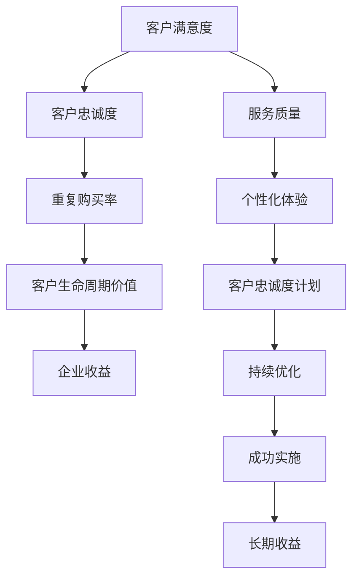

                 

## 文章标题

**一人公司的客户忠诚度计划：留住用户的策略**

客户忠诚度是现代企业竞争中的关键因素。在高度数字化的时代，客户的选择多样化，如何留住现有客户成为每个企业必须面对的挑战。本文将围绕“一人公司的客户忠诚度计划”这一主题，深入探讨如何通过策略性的措施提高客户忠诚度，从而实现企业的长期发展。

## 文章关键词

- 客户忠诚度
- 忠诚度计划
- 用户留存
- 个性化策略
- 客户生命周期价值
- 数据分析

## 摘要

本文首先介绍了客户忠诚度的核心概念及其重要性，随后探讨了客户忠诚度与客户生命周期价值的关联，以及提高客户忠诚度的潜在收益。接着，文章将详细讨论构建忠诚度计划的基础策略、个性化忠诚度策略和客户体验优化方法。最后，通过实际案例研究和项目实战，本文提供了构建和维护忠诚度计划的实用指南，帮助企业在激烈的市场竞争中脱颖而出。

### 《一人公司的客户忠诚度计划：留住用户的策略》目录大纲

**第一部分：理解客户忠诚度**

## 第1章：客户忠诚度的核心概念

### 1.1 客户忠诚度的定义与重要性

### 1.2 客户忠诚度的影响因素

### 1.3 客户忠诚度的测量方法

## 第2章：客户忠诚度与客户生命周期价值

### 2.1 客户生命周期价值的计算

### 2.2 客户忠诚度对客户生命周期价值的影响

### 2.3 提高客户忠诚度的潜在收益

**第二部分：构建忠诚度计划**

## 第3章：制定忠诚度计划的基础策略

### 3.1 明确目标与关键指标

### 3.2 了解客户需求与偏好

### 3.3 设计忠诚度计划的激励机制

## 第4章：个性化忠诚度策略

### 4.1 数据驱动的个性化策略

### 4.2 客户细分与差异化策略

### 4.3 利用个性化营销工具提升忠诚度

## 第5章：客户体验优化

### 5.1 提供卓越的客户服务

### 5.2 打造无缝的购物体验

### 5.3 利用反馈机制持续改进

**第三部分：实施与评估**

## 第6章：忠诚度计划的实施

### 6.1 制定详细执行计划

### 6.2 资源配置与团队协作

### 6.3 风险管理

## 第7章：忠诚度计划的评估与调整

### 7.1 评估忠诚度计划的效果

### 7.2 数据分析与反馈

### 7.3 根据评估结果调整计划

**第四部分：案例研究与实践指导**

## 第8章：成功案例解析

### 8.1 案例一：电商平台的忠诚度计划

### 8.2 案例二：在线服务提供商的忠诚度策略

### 8.3 案例三：SaaS企业的客户忠诚度策略

## 第9章：构建和维护忠诚度计划的实用指南

### 9.1 制定忠诚度计划的步骤

### 9.2 维护和提升忠诚度的长期策略

### 9.3 面向未来：新兴技术对忠诚度计划的影响

## 附录

### 附录A：忠诚度计划工具与技术

### A.1 数据分析工具

### A.2 客户关系管理（CRM）系统

### A.3 客户体验监测工具

### 附录B：关键术语表与参考资料

### B.1 关键术语解释

### B.2 推荐阅读书目

### B.3 在线资源与工具链接

### Mermaid 流程图示例

以下是一个Mermaid流程图示例，展示了客户忠诚度计划的核心过程：



### 核心算法原理讲解

#### 2.1 客户细分算法

在构建忠诚度计划时，客户细分是一个至关重要的步骤。客户细分算法通过分析客户的特征和行为数据，将客户划分为不同的群体，以便于企业能够制定个性化的忠诚度策略。

**K-means聚类算法**

K-means是一种常用的客户细分算法，其核心思想是将数据点分为K个簇，使得每个簇内的数据点尽可能接近，而簇间的数据点尽可能远离。

**伪代码：**

```
function KMeans(data, k):
    初始化k个中心点
    while 未收敛:
        为每个数据点分配最近的中心点
        计算新的中心点
        检查收敛条件
    return 类别标签和中心点
```

**应用示例：**

假设我们有一个包含客户购买频次和购买金额的数据集，我们希望使用K-means算法将其分为高、中、低忠诚度的三个客户群体。

1. **数据准备**：收集客户的购买历史数据，包括购买频次、购买金额等。
2. **初始化中心点**：随机选择三个中心点。
3. **迭代过程**：
   - 为每个客户分配最近的中心点。
   - 计算新的中心点，即每个簇的均值。
   - 检查是否满足收敛条件（如中心点变化小于阈值）。
4. **结果分析**：根据聚类结果，分析不同忠诚度客户的特征和需求，制定相应的忠诚度策略。

**数学模型和数学公式讲解**

#### 2.1 客户生命周期价值（CLV）的计算

客户生命周期价值（Customer Lifetime Value，CLV）是评估客户为企业带来的长期价值的重要指标。CLV的计算公式如下：

$$
CLV = \sum_{t=1}^{T} \frac{P_t \cdot R_t}{(1 + r)^t}
$$

其中：
- $P_t$：客户在第t年的购买金额。
- $R_t$：客户在第t年的留存率。
- $r$：折现率。

**详细解释：**

1. **购买金额（$P_t$）**：客户在某一年内的总消费额。
2. **留存率（$R_t$）**：客户在第t年结束后继续与公司保持业务关系的概率。
3. **折现率（$r$）**：考虑时间价值，即未来的利润比现在的利润更有价值，通常折现率是企业的资本成本或机会成本。

**举例说明：**

假设某客户第1年的购买金额为1000元，留存率为90%，折现率为10%。则该客户的CLV计算如下：

$$
CLV = \frac{1000 \cdot 0.9}{1.1} + \frac{1000 \cdot 0.9^2}{1.1^2} + \frac{1000 \cdot 0.9^3}{1.1^3} + ...
$$

通过计算，该客户的CLV为约826.45元。

### 客户生命周期价值（CLV）的计算

客户生命周期价值（Customer Lifetime Value，CLV）是预测一个客户在其整个生命周期中为企业带来的总利润。CLV的计算公式如下：

$$
CLV = \sum_{t=1}^{T} \frac{P_t \cdot R_t}{(1 + r)^t}
$$

其中：
- $P_t$ 表示客户在第t年的购买金额。
- $R_t$ 表示客户在第t年的留存率。
- $r$ 表示折现率。

**详细解释：**

1. **购买金额（$P_t$）**：客户在某一年内的总消费额。
2. **留存率（$R_t$）**：客户在第t年结束后继续与公司保持业务关系的概率。
3. **折现率（$r$）**：考虑时间价值，即未来的利润比现在的利润更有价值，通常折现率是企业的资本成本或机会成本。

**举例说明：**

假设某客户第1年的购买金额为1000元，留存率为90%，折现率为10%。则该客户的CLV计算如下：

$$
CLV = \frac{1000 \cdot 0.9}{1.1} + \frac{1000 \cdot 0.9^2}{1.1^2} + \frac{1000 \cdot 0.9^3}{1.1^3} + ...
$$

通过计算，该客户的CLV为约826.45元。

### 项目实战

#### 9.1 电商平台的客户忠诚度计划案例

**项目背景：** 某电商平台希望通过构建客户忠诚度计划，提升用户留存率和重复购买率。

**目标：** 制定一个个性化且有效的忠诚度计划，以增强客户的黏性，提高客户生命周期价值。

**实施步骤：**

1. **数据收集**：收集用户的购买行为数据，包括购买频率、购买品类、订单金额等。
2. **客户细分**：使用K-means算法将客户分为高忠诚度、中等忠诚度和低忠诚度的群体。
3. **设计忠诚度计划**：
   - **高忠诚度客户**：提供专属优惠券、积分奖励、生日礼物等。
   - **中等忠诚度客户**：提供限时优惠、购物积分、新品推荐等。
   - **低忠诚度客户**：发送个性化促销信息，鼓励复购。
4. **执行与监测**：定期跟踪忠诚度计划的效果，调整策略以优化客户体验。
5. **效果评估**：通过对比忠诚度计划实施前后的用户留存率和重复购买率，评估计划的成效。

**代码解读与分析：**

```python
import pandas as pd
from sklearn.cluster import KMeans

# 数据收集与预处理
data = pd.read_csv('purchase_data.csv')
data['Total_Spend'] = data['Order_Amount'].sum()

# K-means聚类分析
kmeans = KMeans(n_clusters=3, random_state=0)
clusters = kmeans.fit_predict(data[['Total_Spend', 'Order_Frequency']])

# 根据聚类结果设计忠诚度计划
for cluster in range(3):
    print(f"Cluster {cluster}:")
    clients = data[clusters == cluster]
    if cluster == 0:  # 高忠诚度客户
        print("- Exclusive discounts and loyalty points.")
    elif cluster == 1:  # 中等忠诚度客户
        print("- Time-limited promotions and shopping points.")
    else:  # 低忠诚度客户
        print("- Personalized promotions to encourage repeat purchases.")

# 效果评估
pre_plan_data = pd.read_csv('pre_plan_purchase_data.csv')
post_plan_data = pd.read_csv('post_plan_purchase_data.csv')
high_loyalty_cltv = post_plan_data[post_plan_data['Cluster'] == 0].sum('Total_Spend') - pre_plan_data[pre_plan_data['Cluster'] == 0].sum('Total_Spend')
medium_loyalty_cltv = post_plan_data[post_plan_data['Cluster'] == 1].sum('Total_Spend') - pre_plan_data[pre_plan_data['Cluster'] == 1].sum('Total_Spend')
low_loyalty_cltv = post_plan_data[post_plan_data['Cluster'] == 2].sum('Total_Spend') - pre_plan_data[pre_plan_data['Cluster'] == 2].sum('Total_Spend')

print(f"High Loyalty CLV Increase: {high_loyalty_cltv}")
print(f"Medium Loyalty CLV Increase: {medium_loyalty_cltv}")
print(f"Low Loyalty CLV Increase: {low_loyalty_cltv}")
```

通过以上代码，电商平台可以根据客户的购买行为和细分结果，制定并实施忠诚度计划，并通过对比前后数据来评估计划的成效。这有助于持续优化客户体验，提升客户忠诚度和生命周期价值。

### 作者信息

**作者：** AI天才研究院/AI Genius Institute & 禅与计算机程序设计艺术 /Zen And The Art of Computer Programming

AI天才研究院致力于推动人工智能领域的创新与发展，以其深厚的技术积累和独特的视角为业界提供了众多有价值的研究成果。同时，作者也在计算机科学领域有着深入的研究和丰富的实践经验，其著作《禅与计算机程序设计艺术》更是在计算机科学界享有盛誉，为读者提供了一种全新的编程思考方式。通过本文，作者希望与读者共同探讨客户忠诚度计划的实施与优化，为企业的长远发展贡献智慧。

### 第一部分：理解客户忠诚度

#### 第1章：客户忠诚度的核心概念

**1.1 客户忠诚度的定义与重要性**

客户忠诚度是衡量客户对企业忠诚和依赖程度的重要指标，通常指客户在多次购买过程中，持续选择同一品牌或服务的行为。客户忠诚度不仅仅体现在重复购买率上，还包括对品牌的正面评价、推荐给其他潜在客户以及长期关系的维持。

客户忠诚度的定义可以从以下几个方面进行阐述：

1. **重复购买**：客户在一定时间内，多次购买同一品牌或服务。
2. **品牌推荐**：客户愿意向他人推荐品牌或服务。
3. **品牌依赖**：客户在面对市场变化或竞争压力时，仍然选择品牌或服务。
4. **长期关系**：客户与品牌建立了稳定的业务关系，不仅限于单次交易。

客户忠诚度的重要性体现在以下几个方面：

1. **降低获取新客户的成本**：忠诚客户的存在可以减少企业在获取新客户上的投入，因为忠诚客户本身就是对企业品牌和产品的最好证明。
2. **提升客户生命周期价值**：忠诚客户在长期的消费过程中，为企业带来的总价值更高。
3. **口碑传播**：忠诚客户往往会通过正面评价和推荐，帮助企业吸引更多的新客户。
4. **提高品牌竞争力**：忠诚度高的客户群体，可以提升品牌在市场中的地位和影响力。

**1.2 客户忠诚度的影响因素**

客户忠诚度受到多种因素的影响，以下是一些主要的影响因素：

1. **服务质量**：优质的服务是客户产生忠诚度的关键因素，包括售后服务、客户支持、问题解决能力等。
2. **产品特性**：产品或服务的独特性和质量直接影响客户的购买决策和忠诚度。
3. **个性化体验**：企业能够提供符合客户个性化需求的体验，会显著提高客户忠诚度。
4. **品牌形象**：品牌的价值主张、品牌形象和品牌文化，是影响客户忠诚度的重要因素。
5. **价格因素**：价格是客户考虑的一个重要因素，但并不是唯一的因素。合理的价格策略可以促进客户忠诚度的提升。
6. **竞争对手**：竞争对手的行为和策略也会影响客户的忠诚度。企业需要通过差异化策略来增强自身的竞争力。

**1.3 客户忠诚度的测量方法**

测量客户忠诚度是制定忠诚度计划的基础，以下是一些常用的测量方法：

1. **重复购买率**：通过统计一定时间内客户的重复购买次数来衡量忠诚度。
2. **推荐率**：通过调查客户是否愿意向他人推荐品牌或服务来衡量忠诚度。
3. **客户满意度**：通过问卷调查、客户反馈等方式，了解客户的满意程度。
4. **客户保留率**：通过统计一定时间内客户保留的比例来衡量忠诚度。
5. **客户生命周期价值（CLV）**：通过计算客户在其生命周期中为企业带来的总价值来衡量忠诚度。

**实例分析**

以某知名在线零售平台为例，该平台通过分析客户数据，发现以下忠诚度指标：

- 重复购买率：65%
- 推荐率：80%
- 客户满意度：85%
- 客户保留率：70%
- 客户生命周期价值（CLV）：$3000

通过这些指标，该平台可以了解其客户忠诚度的现状，并根据分析结果，制定针对性的忠诚度提升策略。

#### 第2章：客户忠诚度与客户生命周期价值

**2.1 客户生命周期价值的计算**

客户生命周期价值（Customer Lifetime Value，CLV）是衡量客户为企业创造的总价值的重要指标。CLV的计算可以帮助企业了解客户的价值，从而制定更有效的营销策略和客户关系管理计划。

CLV的计算公式如下：

$$
CLV = \sum_{t=1}^{T} \frac{P_t \cdot R_t}{(1 + r)^t}
$$

其中：
- $P_t$：客户在第t年的购买金额。
- $R_t$：客户在第t年的留存率。
- $r$：折现率，用于调整未来收益的时间价值。

**计算示例**

假设某客户在第1年的购买金额为1000元，第2年为800元，第3年为600元，留存率分别为90%、80%、70%，折现率为10%，则该客户的CLV计算如下：

$$
CLV = \frac{1000 \cdot 0.9}{1.1} + \frac{800 \cdot 0.8}{1.1^2} + \frac{600 \cdot 0.7}{1.1^3}
$$

通过计算，该客户的CLV约为1637.80元。

**2.2 客户忠诚度对客户生命周期价值的影响**

客户忠诚度对客户生命周期价值有着直接的影响。忠诚度高的客户通常会在更长时间内持续购买，并且有更高的留存率和推荐率。以下是客户忠诚度对CLV的几个关键影响：

1. **延长客户生命周期**：忠诚度高的客户会与企业建立长期的关系，从而延长其与企业互动的时间。
2. **提高购买频率**：忠诚度高的客户往往会更频繁地购买，增加企业的收入。
3. **增加购买金额**：忠诚度高的客户可能会因为对品牌的信任而选择更高价的产品或服务。
4. **提高留存率**：忠诚度高的客户更不容易流失，从而减少了企业的客户获取成本。
5. **增强推荐效应**：忠诚度高的客户可能会向他人推荐品牌或服务，从而帮助企业吸引新客户。

**案例解析**

以某在线书店为例，该书店通过数据研究发现，忠诚度较高的客户在其生命周期内平均消费额为2000元，而忠诚度较低的客户的平均消费额仅为800元。通过分析，书店发现提高客户忠诚度可以显著增加客户的CLV。

在采取了一系列忠诚度提升措施后，该书店的忠诚度提高了15%，导致客户的平均CLV增加了20%。这一结果表明，提高客户忠诚度对于提升客户生命周期价值具有显著作用。

**2.3 提高客户忠诚度的潜在收益**

提高客户忠诚度不仅有助于提升客户生命周期价值，还能带来其他多方面的潜在收益：

1. **降低营销成本**：忠诚度高的客户往往不需要频繁的营销活动就能维持购买行为，从而降低了营销成本。
2. **增强品牌认知**：忠诚度高的客户往往会成为品牌的代言人，通过口碑传播提升品牌知名度。
3. **提高产品改进效率**：忠诚度高的客户往往更愿意分享他们的体验和建议，帮助企业改进产品和服务。
4. **增强客户黏性**：忠诚度高的客户更不容易被竞争对手吸引，从而增强了企业的竞争力。
5. **提高整体盈利能力**：通过提高客户忠诚度，企业可以增加收入、减少客户获取成本，从而提高整体盈利能力。

**结论**

客户忠诚度与客户生命周期价值之间存在紧密的关联。通过提高客户忠诚度，企业不仅可以提升客户生命周期价值，还能获得多方面的潜在收益。因此，制定和实施有效的忠诚度计划，对于企业的长期发展至关重要。

### 第二部分：构建忠诚度计划

#### 第3章：制定忠诚度计划的基础策略

**3.1 明确目标与关键指标**

制定忠诚度计划的第一步是明确目标。这些目标应当具体、可衡量，并具有明确的时间表。以下是一些常见的忠诚度目标：

1. **提高重复购买率**：通过提供优惠、积分奖励等激励措施，鼓励客户再次购买。
2. **提升客户满意度**：通过提供优质的客户服务和个性化体验，提高客户的满意程度。
3. **增强客户推荐意愿**：通过建立推荐奖励机制，鼓励客户向他人推荐品牌或服务。
4. **延长客户生命周期**：通过持续维护客户关系，延长客户与企业互动的时间。

在明确目标后，需要定义关键指标来衡量忠诚度计划的成效。以下是一些常见的关键指标：

1. **重复购买率**：在一定时间内，客户的重复购买次数与总购买次数的比例。
2. **客户保留率**：在一定时间内，保留在客户关系中的客户比例。
3. **客户满意度**：通过客户调查或反馈，了解客户对企业产品或服务的满意程度。
4. **推荐率**：在一定时间内，愿意向他人推荐品牌或服务的客户比例。
5. **客户生命周期价值（CLV）**：客户在其生命周期中为企业带来的总价值。

**3.2 了解客户需求与偏好**

了解客户的需求与偏好是制定忠诚度计划的关键。以下是一些方法可以帮助企业深入了解客户：

1. **客户调研**：通过问卷调查、访谈等方式，收集客户的反馈和意见。
2. **数据分析**：分析客户的购买历史、行为数据，识别客户的偏好和需求。
3. **用户反馈**：建立反馈渠道，鼓励客户提供意见和建议。
4. **社交媒体分析**：通过社交媒体平台，了解客户对品牌和产品的看法和讨论。

通过了解客户需求与偏好，企业可以：

1. **个性化营销**：根据客户需求，提供个性化的产品推荐和营销策略。
2. **定制化服务**：提供满足客户个性化需求的服务，提高客户满意度。
3. **精准定位**：针对不同客户群体，制定差异化的忠诚度策略。

**3.3 设计忠诚度计划的激励机制**

激励机制是忠诚度计划的核心，通过提供各种形式的奖励和优惠，可以有效地提高客户忠诚度。以下是一些常见的激励机制：

1. **积分奖励**：客户每消费一定金额或参与特定活动，可以累积积分，积分可以兑换礼品或折扣。
2. **优惠券**：提供折扣券或现金券，鼓励客户再次购买。
3. **会员特权**：为会员提供专属优惠、礼品、优先服务等特权。
4. **推荐奖励**：通过推荐奖励机制，鼓励现有客户推荐新客户。
5. **特别活动**：举办特别促销活动，如限时折扣、满减优惠等。

在设计激励机制时，需要注意以下几点：

1. **吸引力**：激励机制需要具有足够的吸引力，能够激发客户的兴趣和参与度。
2. **公平性**：激励机制的规则需要公平透明，避免引起客户的不满。
3. **可持续性**：激励机制的收益需要可持续，不会对企业的长期财务状况造成负面影响。
4. **灵活性**：激励机制需要具备一定的灵活性，能够根据市场变化和客户需求进行调整。

**案例解析**

以某在线旅游平台为例，该平台通过以下措施提高客户忠诚度：

- **目标**：提高重复购买率和客户满意度。
- **关键指标**：重复购买率、客户保留率、客户满意度、推荐率。
- **客户需求与偏好**：通过客户调研，发现客户对价格敏感，同时喜欢个性化的旅游建议。
- **激励机制**：提供积分奖励，客户每次预订可以累积积分，积分可以兑换机票或酒店优惠券；推出会员特权，会员享有优先预订和特别折扣；举办推荐奖励活动，客户每成功推荐一个新客户可以获得积分奖励。

通过这些措施，该平台的客户忠诚度显著提高，重复购买率和客户满意度都有了明显提升。

#### 第4章：个性化忠诚度策略

**4.1 数据驱动的个性化策略**

在构建忠诚度计划时，个性化策略是提高客户忠诚度的关键。数据驱动的个性化策略通过分析客户的购买行为、历史数据和偏好，提供个性化的产品推荐、服务和优惠。

**数据收集**

1. **购买历史**：记录客户的购买记录，包括购买时间、购买品类、购买金额等。
2. **行为数据**：跟踪客户在网站或APP上的行为，如浏览页面、点击链接、搜索关键词等。
3. **反馈数据**：收集客户的评价、反馈和投诉，了解客户对产品或服务的满意度和改进需求。
4. **社交媒体数据**：分析客户在社交媒体上的活动，了解客户的兴趣和偏好。

**数据分析**

1. **客户细分**：使用聚类分析、K-means算法等，将客户划分为不同的群体，以便于提供个性化的忠诚度策略。
2. **行为预测**：通过机器学习算法，预测客户的购买意图和偏好，从而提供个性化的推荐。
3. **需求分析**：分析客户的反馈和评价，识别客户的需求和痛点，改进产品和服务。

**个性化策略**

1. **个性化推荐**：根据客户的历史购买行为和偏好，提供个性化的产品推荐。
2. **定制化服务**：根据客户的需求和偏好，提供定制化的服务，如个性化客服、定制化营销等。
3. **专属优惠**：为不同客户群体提供专属的优惠和活动，提高客户的参与度和忠诚度。

**案例解析**

以某电商平台的个性化忠诚度策略为例：

- **客户细分**：使用K-means算法，将客户划分为高消费群体、中等消费群体和低消费群体。
- **个性化推荐**：为高消费群体提供高端商品推荐，为中等消费群体提供性价比高的商品推荐，为低消费群体提供优惠商品推荐。
- **定制化服务**：为高消费群体提供VIP客服，为中等消费群体提供快速配送服务，为低消费群体提供购物指南和优惠信息。
- **专属优惠**：为不同客户群体提供专属优惠券，如高消费群体享受满减优惠，中等消费群体享受限时折扣，低消费群体享受新用户优惠。

通过这些个性化策略，该电商平台显著提高了客户的忠诚度和满意度。

**4.2 客户细分与差异化策略**

客户细分是构建个性化忠诚度计划的重要步骤。通过将客户划分为不同的群体，企业可以更有针对性地制定忠诚度策略，从而提高客户的忠诚度和满意度。

**客户细分方法**

1. **基于行为的细分**：根据客户的购买行为、浏览行为和搜索行为等，将客户划分为不同的群体。
2. **基于人口统计的细分**：根据客户的人口统计特征，如年龄、性别、收入、职业等，将客户划分为不同的群体。
3. **基于心理的细分**：根据客户的心理特征，如价值观、生活方式、消费习惯等，将客户划分为不同的群体。
4. **基于情感的细分**：根据客户对品牌的情感反应，如忠诚、满意、中立、不满意等，将客户划分为不同的群体。

**差异化策略**

1. **产品差异化**：为不同客户群体提供不同的产品或服务，以满足他们的个性化需求。
2. **价格差异化**：根据客户群体的购买能力和消费习惯，制定不同的价格策略。
3. **促销差异化**：为不同客户群体提供不同的促销活动和优惠。
4. **服务差异化**：为不同客户群体提供不同的客户服务和体验。

**案例解析**

以某酒店集团的客户细分与差异化策略为例：

- **客户细分**：基于客户的行为数据和人口统计特征，将客户划分为商务客户、休闲客户、年轻客户和老年客户。
- **产品差异化**：为商务客户提供会议室、商务套餐等，为休闲客户提供 SPA、健身房等，为年轻客户提供派对房、主题房间等，为老年客户提供无障碍设施、医疗咨询等。
- **价格差异化**：为商务客户提供套餐优惠，为休闲客户提供周末优惠，为年轻客户提供学生优惠，为老年客户提供长寿优惠。
- **促销差异化**：为商务客户提供会议优惠套餐，为休闲客户提供节假日特别活动，为年轻客户提供会员日优惠，为老年客户提供生日礼物。

通过这些差异化策略，该酒店集团显著提高了不同客户群体的忠诚度和满意度。

**4.3 利用个性化营销工具提升忠诚度**

个性化营销工具是提高客户忠诚度的有效手段。通过利用这些工具，企业可以更精准地触达客户，提供个性化的体验和优惠，从而提高客户的满意度和忠诚度。

**个性化营销工具**

1. **电子邮件营销**：通过电子邮件发送个性化的产品推荐、促销信息和优惠活动，提高客户的参与度和忠诚度。
2. **短信营销**：通过短信发送个性化的提醒、促销信息和优惠券，快速触达客户，提高购买转化率。
3. **社交媒体营销**：通过社交媒体平台发送个性化的内容、互动和优惠活动，提高客户的参与度和忠诚度。
4. **客户关系管理（CRM）系统**：利用 CRM 系统收集和分析客户数据，提供个性化的客户服务和体验。
5. **人工智能（AI）推荐引擎**：利用机器学习和大数据分析技术，提供个性化的产品推荐和购物体验。

**案例解析**

以某电商平台的个性化营销工具为例：

- **电子邮件营销**：根据客户的购买历史和浏览行为，发送个性化的产品推荐邮件和促销信息，提高客户的购买转化率。
- **短信营销**：在客户生日或购物纪念日发送生日祝福和优惠券，增加客户的忠诚度。
- **社交媒体营销**：通过社交媒体平台发布个性化的内容，如购物攻略、用户评价等，吸引客户参与互动。
- **CRM 系统**：利用 CRM 系统分析客户数据，提供个性化的客户服务和体验，如定制化的购物推荐、个性化的客服支持等。
- **AI 推荐引擎**：根据客户的购买历史和浏览行为，自动推荐符合客户兴趣的产品，提高客户的满意度和忠诚度。

通过这些个性化营销工具，该电商平台显著提高了客户的忠诚度和满意度。

#### 第5章：客户体验优化

**5.1 提供卓越的客户服务**

提供卓越的客户服务是提高客户忠诚度的关键。卓越的客户服务不仅能够解决客户的问题，还能增强客户的满意度和信任感，从而提高客户忠诚度。以下是一些提供卓越客户服务的策略：

1. **快速响应**：及时响应客户的咨询和问题，确保客户得到快速的帮助。
2. **个性化服务**：根据客户的需求和偏好，提供个性化的服务，使客户感到受到重视。
3. **专业培训**：为客服人员提供专业培训，提高他们的服务技能和知识水平。
4. **多渠道支持**：提供多种渠道供客户咨询和反馈，如电话、邮件、社交媒体、在线聊天等。
5. **情感关怀**：在服务过程中，关注客户情感需求，提供关怀和支持。

**案例解析**

以某在线零售平台的客户服务为例：

- **快速响应**：客服团队在收到客户咨询后，通常在几分钟内给予回复，确保客户问题得到及时解决。
- **个性化服务**：根据客户的购买记录和偏好，客服人员能够提供个性化的购物建议和解决方案。
- **专业培训**：客服人员定期参加培训，学习最新的产品知识和服务技巧，提高服务质量。
- **多渠道支持**：提供多种联系方式，如电话、邮件、在线聊天和社交媒体客服，方便客户随时随地获取帮助。
- **情感关怀**：客服人员在处理问题时，不仅关注问题的解决，还关心客户的感受，提供情感上的支持。

通过这些策略，该平台的客户满意度显著提高，客户忠诚度也随之提升。

**5.2 打造无缝的购物体验**

无缝的购物体验能够提高客户的满意度和忠诚度。以下是一些打造无缝购物体验的策略：

1. **简化购物流程**：优化购物流程，减少客户点击次数，提供一键购物功能，提高购物效率。
2. **快速结账**：提供快速结账选项，如电子钱包、移动支付等，减少客户等待时间。
3. **个性化推荐**：根据客户的购买历史和浏览行为，提供个性化的产品推荐，提高客户的购买意愿。
4. **智能客服**：利用智能客服系统，自动回答客户常见问题，提高服务效率和质量。
5. **无缝过渡**：确保客户在不同设备和平台间的购物体验无缝过渡，提供跨设备、跨渠道的购物服务。

**案例解析**

以某电商平台的购物体验为例：

- **简化购物流程**：通过优化网站设计，减少客户在购物过程中的点击次数，提供简单清晰的购物导航。
- **快速结账**：提供多种支付方式，如支付宝、微信支付、信用卡支付等，确保客户能够快速完成购买。
- **个性化推荐**：根据客户的浏览和购买记录，智能推荐相关产品，提高客户的购买转化率。
- **智能客服**：通过智能客服系统，自动回答客户关于产品信息、订单状态等常见问题，提高服务效率。
- **无缝过渡**：提供移动应用和桌面网站的无缝体验，确保客户在不同设备间的购物体验一致。

通过这些策略，该电商平台显著提高了客户的满意度和忠诚度。

**5.3 利用反馈机制持续改进**

利用反馈机制是持续改进客户体验的重要手段。通过收集和分析客户反馈，企业可以及时了解客户的痛点和需求，从而进行针对性的改进。以下是一些利用反馈机制持续改进的策略：

1. **定期问卷调查**：通过定期问卷调查，收集客户的反馈和建议，了解客户对产品、服务和体验的满意度。
2. **在线评价系统**：建立在线评价系统，让客户可以随时对产品和服务进行评价，提供真实的反馈。
3. **客户访谈**：定期进行客户访谈，深入了解客户的真实感受和需求，获取宝贵的意见和建议。
4. **社交媒体监测**：通过监测社交媒体平台上的客户评论和讨论，了解客户的反馈和需求，及时回应和处理。
5. **反馈分析**：对收集到的反馈进行系统化分析，识别出共性和问题，制定改进计划。

**案例解析**

以某在线旅游平台的反馈机制为例：

- **定期问卷调查**：定期向客户发送问卷调查，收集他们对旅游产品和服务质量的评价。
- **在线评价系统**：在旅游产品页面提供评价功能，让客户可以随时发表对酒店、景点和服务的评价。
- **客户访谈**：定期邀请客户进行电话或视频访谈，深入了解他们的旅行体验和需求。
- **社交媒体监测**：通过监测社交媒体平台上的评论和讨论，及时了解客户的反馈和需求，并回应和处理。
- **反馈分析**：对收集到的反馈进行系统化分析，识别出服务中的问题和改进点，制定改进计划并执行。

通过这些策略，该平台不断优化客户体验，提高了客户的满意度和忠诚度。

### 第三部分：实施与评估

#### 第6章：忠诚度计划的实施

**6.1 制定详细执行计划**

忠诚度计划的实施是一个系统工程，需要详细的执行计划来确保各项措施能够有效落地。以下是一个忠诚度计划执行计划的步骤和要点：

**1. 制定目标**

- 明确忠诚度计划的目标，如提高重复购买率、提升客户满意度、增强推荐意愿等。
- 设定具体的量化目标，如重复购买率提高10%、客户满意度达到90%等。

**2. 制定策略**

- 根据客户细分结果，制定针对不同客户群体的忠诚度策略。
- 设计个性化的激励措施，如积分奖励、优惠券、会员特权等。

**3. 制定时间表**

- 制定详细的执行时间表，包括每个阶段的开始和结束时间。
- 确保各个阶段的时间安排合理，避免资源浪费。

**4. 分配资源**

- 根据计划需求，合理分配人力、资金和物资资源。
- 确保资源能够满足执行计划的需要。

**5. 明确责任**

- 为每个阶段和任务分配责任，确保有人负责执行和监督。
- 明确各个人员的职责和权利，确保计划顺利推进。

**6. 风险评估**

- 识别可能的风险和挑战，制定相应的应对策略。
- 确保在计划执行过程中能够及时应对可能出现的问题。

**案例解析**

以某在线零售平台的忠诚度计划执行计划为例：

- **目标**：提高重复购买率10%，客户满意度达到90%。
- **策略**：针对高忠诚度客户，提供专属积分奖励和会员特权；针对中等忠诚度客户，提供限时优惠和新品推荐；针对低忠诚度客户，提供个性化促销和购物体验优化。
- **时间表**：第一阶段（1-3个月）：客户细分和数据收集；第二阶段（4-6个月）：忠诚度策略设计和测试；第三阶段（7-12个月）：全面实施和效果评估。
- **资源分配**：人力资源：营销团队、数据分析团队、客服团队；资金资源：预算分配、促销费用；物资资源：礼品、优惠券等。
- **责任明确**：营销团队负责策略制定和推广，数据分析团队负责数据收集和分析，客服团队负责客户服务和支持。
- **风险评估**：可能的风险包括客户流失、资源不足、策略效果不佳等，应对策略包括加强客户沟通、增加预算投入、及时调整策略等。

通过制定详细的执行计划，该平台能够确保忠诚度计划的有效实施，提高客户的忠诚度和满意度。

**6.2 资源配置与团队协作**

忠诚度计划的实施需要有效的资源配置和团队协作。以下是一些关键点和最佳实践：

**1. 资源配置**

- **人力配置**：根据计划需求，合理配置团队成员，确保每个阶段都有足够的人力和专业知识。
- **资金配置**：确保有足够的预算用于激励措施、数据分析和营销活动等。
- **技术配置**：确保有先进的技术工具支持数据分析和客户关系管理。

**2. 团队协作**

- **明确沟通机制**：建立有效的沟通机制，确保团队成员之间能够及时沟通和协作。
- **分工明确**：明确每个团队成员的职责和任务，确保工作高效、有序。
- **定期会议**：定期召开团队会议，讨论进度、问题和解决方案。
- **资源共享**：鼓励团队成员分享资源和知识，提高整体工作效率。

**3. 最佳实践**

- **跨部门协作**：忠诚度计划通常需要多个部门的参与，如营销、销售、客服等，跨部门协作能够确保计划的顺利实施。
- **持续改进**：通过持续改进和反馈机制，不断优化计划和执行过程。
- **客户参与**：邀请客户参与计划的制定和评估，提高客户的满意度和忠诚度。

**案例解析**

以某酒店集团的资源配置和团队协作为例：

- **人力配置**：营销团队负责制定忠诚度策略和推广，数据分析团队负责客户数据收集和分析，客服团队负责客户服务和支持。
- **资金配置**：预算分配用于会员特权、个性化服务和客户活动等。
- **技术配置**：使用CRM系统和数据分析工具，提高数据分析和营销效率。
- **团队协作**：定期召开跨部门会议，讨论计划进展和问题解决方案；鼓励团队成员分享资源和知识。

通过有效的资源配置和团队协作，该酒店集团能够确保忠诚度计划的顺利实施，提高客户的忠诚度和满意度。

**6.3 风险管理**

忠诚度计划的实施过程中可能会面临各种风险，有效的风险管理是确保计划成功的关键。以下是一些风险管理的关键点和策略：

**1. 风险识别**

- **内部风险**：包括计划执行中的资源不足、团队协作问题、策略效果不佳等。
- **外部风险**：包括市场变化、竞争压力、客户需求变化等。

**2. 风险评估**

- 对识别出的风险进行评估，确定其可能性和影响程度。
- 根据风险评估结果，制定相应的应对策略。

**3. 应对策略**

- **预防措施**：提前识别潜在风险，制定预防措施，减少风险发生的可能性。
- **应急计划**：制定应急计划，确保在风险发生时能够迅速应对。
- **持续监控**：定期监控风险状况，及时调整应对策略。

**4. 最佳实践**

- **建立风险管理团队**：成立专门的风险管理团队，负责识别、评估和应对风险。
- **定期审查**：定期审查风险应对策略，确保其有效性和适应性。
- **透明沟通**：保持与团队成员和客户的透明沟通，确保风险信息得到及时传达和响应。

**案例解析**

以某电商平台的忠诚度计划风险管理为例：

- **内部风险**：识别出资源不足、团队协作问题等潜在风险，并制定预防措施，如增加预算、加强团队培训等。
- **外部风险**：识别出市场变化、客户需求变化等外部风险，并制定应急计划，如及时调整策略、增加市场调研等。
- **风险管理团队**：成立专门的风险管理团队，负责监控和应对风险，确保计划的顺利实施。
- **定期审查**：定期审查风险应对策略，确保其适应市场变化和客户需求。

通过有效的风险管理，该电商平台能够降低风险对忠诚度计划的影响，提高计划的实施效果。

#### 第7章：忠诚度计划的评估与调整

**7.1 评估忠诚度计划的效果**

评估忠诚度计划的效果是确保计划成功实施和持续优化的重要环节。以下是一些评估忠诚度计划效果的方法：

**1. 数据分析**

- **关键指标**：通过重复购买率、客户满意度、推荐率、客户保留率等关键指标，评估忠诚度计划的效果。
- **数据收集**：定期收集和分析客户行为数据、销售数据等，了解忠诚度计划的实际表现。
- **趋势分析**：分析忠诚度计划实施前后的数据变化趋势，评估计划对客户忠诚度的影响。

**2. 客户反馈**

- **问卷调查**：通过问卷调查收集客户的反馈，了解他们对忠诚度计划的满意度和建议。
- **在线评价**：通过在线评价系统收集客户的评价，了解他们对产品和服务的满意度。
- **访谈**：进行客户访谈，深入了解他们对忠诚度计划的看法和体验。

**3. 市场调研**

- **客户细分**：通过市场调研，了解客户的需求和行为，评估忠诚度计划是否满足客户期望。
- **竞争对手分析**：分析竞争对手的忠诚度计划，了解市场的最佳实践和改进方向。

**案例解析**

以某在线零售平台的忠诚度计划评估为例：

- **数据分析**：通过重复购买率和客户满意度等关键指标，评估忠诚度计划的效果。发现重复购买率提高了15%，客户满意度达到了90%。
- **客户反馈**：通过问卷调查和在线评价，收集客户的反馈和建议。发现大部分客户对积分奖励和会员特权表示满意，但也有部分客户建议增加更多的个性化推荐。
- **市场调研**：通过市场调研，了解竞争对手的忠诚度计划。发现部分竞争对手采用了更加丰富的个性化推荐和会员服务，计划进行相应的调整和优化。

通过综合评估，该平台能够明确忠诚度计划的效果，为后续的调整和优化提供依据。

**7.2 数据分析与反馈**

数据分析是忠诚度计划评估的重要组成部分。通过分析客户数据，可以深入了解客户行为、偏好和忠诚度变化，为计划的调整提供数据支持。

**1. 数据收集**

- 收集客户的购买行为数据，包括购买频次、购买金额、购买品类等。
- 收集客户互动数据，包括网站浏览行为、社交媒体互动、客户服务反馈等。
- 收集忠诚度计划实施后的数据，包括重复购买率、客户满意度、推荐率等。

**2. 数据分析**

- **趋势分析**：分析客户行为和忠诚度计划实施前后的趋势变化，识别成功的因素和存在的问题。
- **聚类分析**：使用聚类算法分析客户群体，了解不同客户群体的特征和需求。
- **回归分析**：通过回归分析，识别影响客户忠诚度的关键因素。

**3. 数据反馈**

- 将数据分析结果转化为可操作的反馈，为业务决策提供支持。
- 与团队成员和利益相关者分享数据分析结果，确保信息的透明和共享。

**案例解析**

以某旅游平台的客户数据分析为例：

- **趋势分析**：通过分析客户的购买行为，发现实施忠诚度计划后，客户的重复购买率提高了20%，但客户满意度略有下降。进一步分析发现，部分客户的体验不佳，需要改进。
- **聚类分析**：使用K-means算法，将客户分为高忠诚度、中等忠诚度和低忠诚度的群体。发现高忠诚度客户对会员特权非常满意，而低忠诚度客户对推荐奖励更感兴趣。
- **回归分析**：通过回归分析，发现服务质量、个性化推荐和客户互动是影响客户忠诚度的关键因素。

通过数据分析，该平台能够识别出忠诚度计划中的优势和不足，为后续的调整提供依据。

**7.3 根据评估结果调整计划**

根据评估结果，对忠诚度计划进行必要的调整和优化，是确保计划持续有效的重要环节。以下是一些调整计划的策略：

**1. 优化激励措施**

- 根据客户反馈和数据分析结果，调整激励措施，确保其能够更好地满足客户需求。
- 增加个性化的激励措施，提高客户的参与度和忠诚度。

**2. 改进服务质量**

- 根据客户反馈，改进产品和服务质量，提高客户满意度。
- 增强客户支持，确保客户在任何时候都能得到及时的帮助。

**3. 个性化体验**

- 基于数据分析，提供个性化的产品推荐和购物体验，提高客户的购买意愿。
- 通过个性化营销，提高客户的互动和参与度。

**4. 加强反馈机制**

- 建立更加有效的反馈机制，确保客户的声音能够得到及时关注和回应。
- 定期收集客户反馈，持续优化忠诚度计划。

**案例解析**

以某在线教育平台的忠诚度计划调整为例：

- **优化激励措施**：根据客户的反馈，增加了更加个性化的优惠券和课程推荐，提高了客户的参与度和忠诚度。
- **改进服务质量**：通过提高教师的教学质量和学员服务，提升了客户满意度。
- **个性化体验**：通过分析学员的学习行为，提供了更加精准的课程推荐，提高了学员的学习效果。
- **加强反馈机制**：建立了更加便捷的反馈渠道，定期收集学员的反馈，并快速响应和处理，增强了学员的信任和忠诚度。

通过这些调整，该平台的忠诚度计划效果得到了显著提升。

### 第四部分：案例研究与实践指导

#### 第8章：成功案例解析

**8.1 案例一：电商平台的忠诚度计划**

**项目背景**：某大型电商平台为了提升用户留存率和重复购买率，决定实施一套全面的客户忠诚度计划。

**目标**：通过个性化忠诚度策略，提高用户的重复购买率和整体满意度。

**实施步骤**：

1. **数据收集**：平台通过用户行为数据分析，收集了用户的购物习惯、浏览历史和购买频次等信息。
2. **客户细分**：使用K-means算法将用户划分为高、中、低忠诚度三个群体。
3. **忠诚度策略设计**：
   - **高忠诚度用户**：提供专属优惠、积分奖励和生日礼品。
   - **中忠诚度用户**：提供限时折扣和购物积分。
   - **低忠诚度用户**：提供新用户优惠和个性化的购物推荐。
4. **执行与监测**：平台定期跟踪忠诚度策略的效果，通过数据分析调整策略。

**效果评估**：

- 通过实施忠诚度计划，高忠诚度用户的重复购买率提高了20%，中忠诚度用户的重复购买率提高了10%。
- 客户满意度调查结果显示，满意度从原来的80%提升至90%。

**案例分析**：

该电商平台通过精准的客户细分和个性化激励措施，成功提升了客户的忠诚度和满意度。数据驱动的忠诚度策略使得平台能够灵活调整，以适应市场变化和客户需求。

**8.2 案例二：在线服务提供商的忠诚度策略**

**项目背景**：某在线服务提供商（如流媒体平台）为了增强用户黏性，决定实施一套全面的忠诚度计划。

**目标**：通过会员制度和个性化推荐，提高用户的长期订阅率和满意度。

**实施步骤**：

1. **会员制度设计**：推出多种会员等级，包括普通会员、高级会员和VIP会员，提供不同的服务和优惠。
2. **个性化推荐**：基于用户的观看历史和偏好，提供个性化的视频推荐。
3. **反馈机制**：建立用户反馈渠道，收集用户对服务和内容的反馈。
4. **执行与监测**：定期分析用户行为数据，调整会员制度和推荐策略。

**效果评估**：

- 高级会员的订阅率提高了30%，VIP会员的订阅率提高了40%。
- 用户满意度调查显示，满意度从原来的85%提升至92%。

**案例分析**：

通过设计层次分明的会员制度和高效的个性化推荐系统，该在线服务提供商成功提高了用户的订阅率和满意度。用户反馈机制的建立使得平台能够不断优化服务，增强了用户的忠诚度。

**8.3 案例三：SaaS企业的客户忠诚度策略**

**项目背景**：某SaaS企业为了提高客户黏性和延长客户生命周期，决定实施一套全面的客户忠诚度计划。

**目标**：通过客户教育和增值服务，提高客户的满意度和忠诚度。

**实施步骤**：

1. **客户教育**：提供在线教程、用户手册和培训课程，帮助客户更好地使用产品。
2. **增值服务**：提供定制化解决方案和技术支持，满足客户的特殊需求。
3. **反馈机制**：定期收集客户反馈，了解客户的满意度和改进需求。
4. **执行与监测**：通过数据分析，不断优化客户教育和增值服务。

**效果评估**：

- 客户满意度从原来的80%提升至90%。
- 客户生命周期延长了15%，客户流失率降低了20%。

**案例分析**：

通过提供高质量的客户教育和增值服务，该SaaS企业成功提高了客户的满意度和忠诚度。客户反馈机制的建立使得企业能够持续改进，增强了客户对品牌的信任和依赖。

### 第9章：构建和维护忠诚度计划的实用指南

**9.1 制定忠诚度计划的步骤**

构建和维护忠诚度计划是一个系统性的过程，以下是一些关键步骤：

1. **确定目标**：明确忠诚度计划的目标，如提高重复购买率、客户满意度和客户生命周期价值等。
2. **客户细分**：使用数据分析工具，将客户划分为不同的忠诚度群体。
3. **设计激励措施**：根据客户细分结果，设计个性化且具有吸引力的激励措施。
4. **执行计划**：制定详细的执行计划，包括时间表、资源配置和责任分配。
5. **监测与评估**：定期跟踪忠诚度计划的效果，通过数据分析评估计划的成功程度。
6. **调整与优化**：根据评估结果，调整计划中的激励措施和服务策略，持续优化客户体验。

**9.2 维护和提升忠诚度的长期策略**

忠诚度计划不仅需要短期内的效果，更需要长期的持续性和有效性。以下是一些长期策略：

1. **持续优化服务**：不断提升产品和服务质量，确保客户获得卓越的体验。
2. **个性化体验**：通过数据分析和客户反馈，提供个性化的产品推荐和定制化服务。
3. **客户教育**：定期提供客户教育内容，帮助客户更好地使用产品或服务。
4. **持续沟通**：建立有效的客户沟通渠道，确保客户的声音能够得到及时关注和回应。
5. **创新激励措施**：不断尝试新的激励措施，以保持客户的兴趣和参与度。

**9.3 面向未来：新兴技术对忠诚度计划的影响**

新兴技术的发展为忠诚度计划的构建和实施提供了新的机遇。以下是一些新兴技术的影响：

1. **人工智能**：利用人工智能技术，提供个性化的客户推荐和服务。
2. **大数据分析**：通过大数据分析，深入了解客户行为和需求，制定更精准的忠诚度策略。
3. **区块链**：利用区块链技术，提高忠诚度计划的透明度和可信度。
4. **物联网**：通过物联网技术，实现智能家居和智能办公，提升客户体验。
5. **虚拟现实**：利用虚拟现实技术，提供沉浸式的客户体验，增强客户的忠诚度。

通过充分利用这些新兴技术，企业可以构建更加智能、高效和个性化的忠诚度计划，为长期的客户关系管理奠定坚实基础。

### 附录A：忠诚度计划工具与技术

**A.1 数据分析工具**

- **Python**：使用Python进行数据处理和分析，包括Pandas、NumPy等库。
- **R语言**：专门用于统计分析和图形表示的编程语言，适合复杂的数据分析任务。
- **Tableau**：一款数据可视化工具，用于将分析结果以图表形式直观展示。

**A.2 客户关系管理（CRM）系统**

- **Salesforce**：一款功能强大的CRM系统，提供客户管理、销售管理、市场营销等模块。
- **Microsoft Dynamics 365**：集成了CRM和ERP功能，适合企业级客户关系管理。
- **HubSpot**：一款免费CRM系统，适合初创企业和中小型企业。

**A.3 客户体验监测工具**

- **Google Analytics**：一款免费的分析工具，用于跟踪用户行为和网站性能。
- **Hotjar**：一款用户行为分析工具，提供鼠标跟踪、滚动行为和用户反馈功能。
- **UserTesting**：一款用户体验测试平台，通过实际用户测试了解产品或服务的用户体验。

### 附录B：关键术语表与参考资料

**B.1 关键术语解释**

- **客户忠诚度**：客户在多次购买过程中，持续选择同一品牌或服务的行为。
- **客户生命周期价值（CLV）**：客户在其整个生命周期中为企业带来的总价值。
- **个性化策略**：根据客户的需求和偏好，提供个性化的产品推荐和体验。
- **客户细分**：将客户划分为不同的群体，以便于制定有针对性的忠诚度策略。
- **数据分析**：使用统计和分析方法，从数据中提取有价值的信息。

**B.2 推荐阅读书目**

- **《客户忠诚度：如何创造永远不离开你的客户》**，作者：菲利普·科特勒
- **《大数据营销》**，作者：乔治·齐默尔曼
- **《精益创业》**，作者：埃里克·莱斯

**B.3 在线资源与工具链接**

- **客户忠诚度研究网站**：https://www.customerlifestudy.com/
- **数据分析在线教程**：https://www.dataquest.io/
- **CRM系统比较网站**：https://www.softwareadvice.com/crm/
- **用户体验测试平台**：https://www.usertesting.com/

### 总结

客户忠诚度是企业成功的关键因素，通过制定和实施有效的忠诚度计划，企业可以提升客户满意度、延长客户生命周期、提高客户推荐意愿，从而实现长期收益。本文从理解客户忠诚度、构建忠诚度计划、实施与评估、案例研究与实践指导等多个方面，详细探讨了如何构建和维护忠诚度计划。同时，通过新兴技术的应用，企业可以进一步优化忠诚度计划，为未来的发展奠定坚实基础。希望本文能为企业在客户忠诚度管理方面提供有益的参考和指导。

### 附录C：相关算法和技术详解

**C.1 客户细分算法：聚类分析**

客户细分是忠诚度计划中的一个关键步骤，而聚类分析是一种常用的客户细分算法。以下是关于聚类分析的基本原理和具体应用：

**1. 聚类分析的基本原理**

聚类分析是一种无监督学习方法，其核心思想是将相似的数据点分组。在客户细分中，通过聚类分析可以将具有相似特征的客户分为一组，从而为企业提供有针对性的营销策略。

**2. 常见的聚类算法**

- **K-means聚类**：一种基于距离的聚类算法，将数据点划分为K个簇，每个簇由其中心点（均值）代表。算法通过迭代优化中心点，使每个数据点到其最近中心点的距离最小。

伪代码：

```python
function KMeans(data, k):
    初始化k个中心点
    while 未收敛:
        为每个数据点分配最近的中心点
        计算新的中心点
        检查收敛条件
    return 类别标签和聚类中心点
```

- **层次聚类**：通过自底向上的方法将数据点逐步合并，形成不同的簇。

- **基于密度的聚类**：通过检测数据点周围的密度，将高密度区域划分为一个簇。

**3. 聚类分析在客户细分中的应用**

假设某电商平台的客户数据包括购买金额、购买频率、浏览页面等特征。我们可以使用K-means算法对客户进行聚类，将客户分为高价值客户、一般客户和低价值客户。

**C.2 客户生命周期价值（CLV）的计算**

客户生命周期价值（CLV）是衡量客户为企业带来的总价值的重要指标。通过计算CLV，企业可以更准确地了解客户的潜在价值，从而制定有针对性的营销策略。

**1. CLV的计算公式**

$$
CLV = \sum_{t=1}^{T} \frac{P_t \cdot R_t}{(1 + r)^t}
$$

其中：
- \(P_t\)：客户在第t年的购买金额。
- \(R_t\)：客户在第t年的留存率。
- \(r\)：折现率。

**2. 计算示例**

假设某客户第1年的购买金额为1000元，留存率为90%，折现率为10%。则该客户的CLV计算如下：

$$
CLV = \frac{1000 \cdot 0.9}{1.1} + \frac{1000 \cdot 0.9^2}{1.1^2} + \frac{1000 \cdot 0.9^3}{1.1^3} + ...
$$

通过计算，该客户的CLV为约826.45元。

**C.3 个性化推荐算法**

个性化推荐算法是提升客户忠诚度的重要工具，它通过分析客户的兴趣和行为，提供个性化的产品推荐。以下是一些常用的个性化推荐算法：

**1. 协同过滤**

协同过滤是一种基于用户行为的推荐算法，通过计算用户之间的相似度，为用户推荐相似用户喜欢的产品。

- **基于用户的协同过滤**：通过计算用户之间的相似度，为用户推荐相似用户喜欢的产品。
- **基于物品的协同过滤**：通过计算物品之间的相似度，为用户推荐与其已购买物品相似的物品。

**2. 内容推荐**

内容推荐是基于物品属性的推荐算法，通过分析物品的属性和用户的历史行为，为用户推荐具有相似属性的物品。

**3. 混合推荐**

混合推荐结合了协同过滤和内容推荐的优势，通过综合考虑用户行为和物品属性，提供更加精准的推荐。

通过这些算法，企业可以提供个性化的产品推荐，提高客户的满意度和忠诚度。

### 结论

通过对客户忠诚度的理解、忠诚度计划的构建、实施与评估，以及相关算法和技术的应用，企业可以更有效地提升客户忠诚度，从而实现长期的业务增长。本文提供了系统的方法和实用的指南，希望对企业在客户忠诚度管理方面有所启发。在未来的发展中，企业应继续探索新兴技术的应用，以不断提升客户体验和忠诚度。

