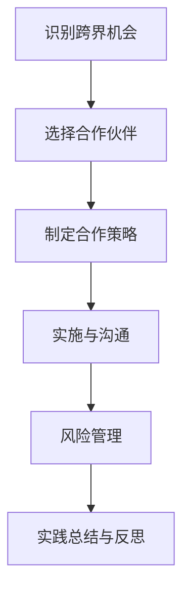

                 

### 文章标题

在当今快速变化和高度竞争的商业环境中，企业能否成功，不仅仅取决于其内部资源的整合，更在于如何通过跨界合作来扩大自身影响力。对于许多创业者和“一人公司”而言，他们往往在资源有限的情况下，寻求通过跨界合作来获得更多的机会和资源，以此来实现突破和发展。本文将围绕“一人公司的跨界合作：扩大影响力的策略”这一主题，深入探讨跨界合作在个人品牌建设中的重要性，并提供一系列策略和实践案例，帮助读者理解和应用跨界合作的有效方法。

本文旨在解决以下几个核心问题：

- 一人公司的定义及其优势是什么？
- 跨界合作的理论基础是什么？
- 如何识别和选择跨界合作的机会和合作伙伴？
- 跨界合作的具体策略和实践步骤是怎样的？
- 跨界合作中如何进行有效的风险管理？

通过本文的阅读，读者将能够：

- 明确一人公司的概念及其优势。
- 掌握跨界合作的理论基础和类型。
- 学习到如何识别和选择跨界合作的机会和合作伙伴。
- 理解并掌握跨界合作的策略和实践方法。
- 学会在跨界合作中有效地进行风险管理。

本文结构安排如下：

- **第一部分：背景与理论基础**：介绍一人公司的概念与优势，跨界合作的理论基础，以及扩大影响力的重要性。
- **第二部分：跨界合作策略与实践**：详细阐述如何识别跨界合作的机会，选择合作伙伴，制定合作策略，实施合作，以及管理风险。
- **第三部分：个人案例分析与总结**：通过作者的亲身实践，分析跨界合作的成功经验和教训，总结跨界合作的核心要素和未来发展趋势。

让我们开始深入探讨一人公司的跨界合作，以及如何通过这一策略来扩大个人影响力。

---

关键词：（一人公司、跨界合作、个人品牌、影响力、策略）

摘要：本文针对一人公司的发展需求，探讨了跨界合作在个人品牌建设中的重要性。通过深入分析一人公司的定义与优势，跨界合作的理论基础，以及跨界合作的具体策略和实践，本文为读者提供了有效的跨界合作方法和风险管理技巧，帮助读者在竞争激烈的市场中通过跨界合作实现个人影响力的扩大。

---

### 《一人公司的跨界合作：扩大影响力的策略》目录大纲

在本篇文章中，我们将通过以下几个部分来详细探讨一人公司的跨界合作策略及其在扩大个人影响力方面的应用。

#### 第一部分：背景与理论基础

- **第1章：一人公司的概念与优势**
  - 1.1 定义与起源
  - 1.2 一人公司的优势
  - 1.3 跨界合作的意义

- **第2章：跨界合作的理论基础**
  - 2.1 跨界合作的定义
  - 2.2 跨界合作的类型
  - 2.3 跨界合作的理论框架

- **第3章：扩大影响力的重要性**
  - 3.1 影响力的定义与测量
  - 3.2 扩大影响力的重要性
  - 3.3 个人品牌建设

#### 第二部分：跨界合作策略与实践

- **第4章：识别跨界合作的机会**
  - 4.1 环境分析
  - 4.2 市场趋势分析
  - 4.3 机会识别方法

- **第5章：跨界合作伙伴的选择**
  - 5.1 合作伙伴的筛选标准
  - 5.2 合作伙伴的评估与选择
  - 5.3 合作协议的制定

- **第6章：跨界合作策略的制定与实施**
  - 6.1 合作目标的设定
  - 6.2 合作模式的创新
  - 6.3 合作过程中的沟通与协调

- **第7章：跨界合作的案例分析**
  - 7.1 案例介绍
  - 7.2 案例分析
  - 7.3 案例启示

- **第8章：跨界合作的风险管理**
  - 8.1 风险识别
  - 8.2 风险评估
  - 8.3 风险应对策略

#### 第三部分：个人案例分析与总结

- **第9章：个人跨界合作实践**
  - 9.1 实践过程回顾
  - 9.2 成功经验与教训
  - 9.3 个人品牌影响力的提升

- **第10章：总结与展望**
  - 10.1 跨界合作的核心要素
  - 10.2 未来发展趋势
  - 10.3 对读者的建议

- **第11章：附录**
  - 11.1 跨界合作工具与资源
  - 11.2 参考文献
  - 11.3 致谢

#### 附录

- **附录 A：跨界合作流程 Mermaid 流程图**
- **附录 B：某次跨界合作项目伪代码**
- **附录 C：数学模型与公式**
- **附录 D：项目实战代码解读与分析**
- **附录 E：跨界合作工具与资源**
- **附录 F：参考文献**

通过上述大纲，读者将逐步了解一人公司跨界合作的各个方面，掌握跨界合作的策略和实践方法，从而在竞争激烈的市场中脱颖而出，扩大个人影响力。

---

### 第一部分：背景与理论基础

在探讨“一人公司的跨界合作：扩大影响力的策略”之前，我们首先需要明确一人公司的概念及其优势，以及跨界合作的理论基础。这两部分内容将为后续的讨论提供坚实的理论基础。

#### 第1章：一人公司的概念与优势

**1.1 定义与起源**

一人公司，也称为“SOLOpreneur”或“Single Founding Team Company”，指的是由单个创始人或团队成员独立运营的企业。这种类型的公司通常规模较小，资源有限，但具有高度的灵活性和创新性。一人公司的起源可以追溯到20世纪末，随着互联网的普及和全球化进程的加速，越来越多的个人创业者选择以一人公司的形式进入市场，以适应快速变化的商业环境。

**1.2 一人公司的优势**

一人公司的优势在于其灵活性、低成本和高效性。以下是具体优势的详细描述：

1. **灵活性**：一人公司的决策过程更为迅速和灵活。由于没有复杂的组织结构和层级制度，创始人可以快速响应市场变化，调整战略方向。
   
2. **低成本**：一人公司通常不需要大量的初始投资和运营成本。这种模式使得创业者可以在资源有限的情况下开始创业，减少了财务风险。

3. **高效性**：一人公司能够集中精力和资源在核心业务上，避免了资源分散和管理复杂性的问题，提高了工作效率和产出。

4. **创新能力**：一人公司的创始人通常具有较强的创新意识，能够在不断变化的市场中迅速找到新的商业机会，并推出创新产品或服务。

**1.3 跨界合作的意义**

跨界合作对于一人公司来说具有重要意义。首先，跨界合作可以帮助一人公司突破自身的资源和能力限制，通过与其他企业和领域的合作，获取更多的资源和市场机会。其次，跨界合作有助于提升一人公司的品牌影响力，通过与其他知名企业的合作，一人公司可以借助合作方的品牌和资源，扩大自身的影响力。

总之，一人公司的概念与优势为我们理解跨界合作奠定了基础。在下一章中，我们将进一步探讨跨界合作的理论基础，以期为后续的内容提供更加深入的解析。

---

### 第2章：跨界合作的理论基础

跨界合作在当今商业环境中变得越来越普遍，其背后的理论基础也愈加丰富。为了更好地理解跨界合作的重要性，我们需要从定义、类型以及理论框架三个方面进行探讨。

**2.1 跨界合作的定义**

跨界合作，顾名思义，是指不同领域或行业之间的合作。这种合作不仅限于相同行业或领域内的合作，更强调跨行业、跨领域的资源整合与协同。跨界合作的核心在于将不同领域的优势资源、技术和理念融合，以实现互补、创新和共赢。具体来说，跨界合作可以包括以下几个方面：

1. **资源共享**：通过跨界合作，企业可以实现资源的最优配置，减少重复投资，提高资源利用效率。
   
2. **市场拓展**：跨界合作有助于企业开拓新的市场和客户群体，扩大业务范围。

3. **技术创新**：不同领域的合作可以激发创新思维，促进技术和产品的创新与发展。

4. **品牌提升**：跨界合作往往能带来品牌效应的提升，通过与其他知名品牌的合作，企业可以增强自身的品牌知名度和美誉度。

**2.2 跨界合作的类型**

跨界合作可以按照合作双方的关系和目标进行分类。以下是一些常见的跨界合作类型：

1. **战略联盟**：这是指两个或多个企业为了实现共同的战略目标而进行的长期合作。这种合作通常涉及资源、技术和市场的共享。

2. **合资企业**：合资企业是由两个或多个企业共同出资、共同经营的企业实体。这种合作方式可以分担风险和成本，同时共享利益。

3. **外包合作**：外包合作是指企业将部分业务或功能外包给其他企业或机构，以降低成本和提高效率。

4. **并购重组**：通过并购重组，企业可以快速进入新的行业或领域，获取更多的资源和市场份额。

5. **合作伙伴关系**：这是指两个或多个企业在特定项目或领域内的短期合作，合作结束后，双方关系结束。

**2.3 跨界合作的理论框架**

跨界合作的理论基础涉及多个领域，包括资源基础理论、网络理论、创新理论和合作博弈理论等。以下是这些理论对跨界合作的解析：

1. **资源基础理论**：资源基础理论认为，企业的竞争优势来源于其独特的资源。跨界合作可以通过整合外部资源，增强企业的竞争优势。

2. **网络理论**：网络理论强调，企业不仅通过内部资源，还通过外部网络来获取资源和机会。跨界合作可以帮助企业构建更加广泛的网络，提高其市场地位。

3. **创新理论**：跨界合作往往能够带来技术创新和商业模式创新。创新理论认为，不同领域的知识和技术融合是推动创新的重要途径。

4. **合作博弈理论**：合作博弈理论分析多个参与者如何通过合作来实现共同利益。跨界合作可以通过合理分配利益，实现合作双方的共赢。

总之，跨界合作的理论基础为其在商业中的应用提供了丰富的理论支持。通过理解跨界合作的定义、类型和理论基础，我们可以更好地把握其价值，并在实践中灵活运用。

---

### 第3章：扩大影响力的重要性

在个人品牌建设过程中，影响力扮演着至关重要的角色。无论是对于“一人公司”还是其他创业者，扩大影响力不仅有助于提升个人品牌的知名度，还能带来一系列实际益处。本节将深入探讨影响力的定义与测量，解释为何扩大影响力至关重要，以及个人品牌建设在其中的作用。

**3.1 影响力的定义与测量**

影响力，简而言之，是指一个人或组织在特定领域或社区中影响他人思维、行为或决策的能力。它不仅体现在个人观点和意见的传播上，还包括能够引导公众舆论、影响市场趋势甚至改变行业规范。影响力可以衡量多个维度，包括：

1. **知名度**：个人的知名度越高，其影响力通常也越大。知名度可以通过媒体曝光度、社交媒体关注者数量等指标来衡量。

2. **信任度**：公众对个人的信任程度直接影响其影响力。信任度可以通过口碑、信誉评价等来评估。

3. **参与度**：个人在相关领域中的参与度和活跃度也是衡量其影响力的重要指标。这包括参与论坛、会议、讲座以及发布有影响力的文章和报告。

4. **影响力范围**：影响力的范围不仅限于地理和行业限制，还包括能够影响到不同层次的人群和领域。

**3.2 扩大影响力的重要性**

扩大个人影响力对于“一人公司”和个人品牌建设具有重要意义。以下是几个关键点：

1. **增强品牌认知**：扩大影响力有助于提高个人和公司品牌的认知度，使更多人了解并认可其价值和理念。

2. **吸引资源和机会**：有影响力的个人更容易吸引投资、合作伙伴和客户，为个人和公司带来更多发展机会。

3. **提升议价能力**：拥有较高影响力的个人在商业谈判中拥有更大的议价能力，能够更好地争取到对自己有利的条件。

4. **推动创新和成长**：影响力可以激发创新思维，推动个人和公司的成长，为不断变化的商业环境提供适应策略。

**3.3 个人品牌建设**

个人品牌建设是扩大影响力的核心。以下是一些关键步骤：

1. **明确个人定位**：个人需要明确自己在行业中的独特价值和定位，这有助于建立清晰的品牌形象。

2. **持续专业提升**：不断学习和提升专业能力，确保自己在行业内保持领先地位。

3. **内容创造与传播**：通过撰写高质量的文章、发布视频、参与讲座等方式，创造有价值的内容，并有效传播。

4. **建立网络关系**：积极参与行业活动、论坛和网络社区，与同行建立紧密联系。

5. **持续优化品牌形象**：通过不断优化个人形象和品牌形象，增强公众对个人的信任和好感。

总之，扩大影响力是个人品牌建设的关键，对于“一人公司”来说尤为重要。通过明确影响力的定义和测量方法，理解其重要性，并采取有效的个人品牌建设策略，个人和公司可以在竞争激烈的市场中脱颖而出，实现长期发展。

---

### 第二部分：跨界合作策略与实践

在第一部分我们探讨了跨界合作的理论基础及其重要性，本部分将深入讨论跨界合作的具体策略和实践步骤。通过详细阐述识别跨界合作的机会、选择合作伙伴、制定合作策略、实施合作以及管理风险，我们希望能够为读者提供一套全面且实用的跨界合作指南。

#### 第4章：识别跨界合作的机会

跨界合作的机会识别是成功开展跨界合作的第一步。以下是几个关键步骤和方法：

**4.1 环境分析**

环境分析是识别跨界合作机会的基础。通过环境分析，我们可以了解外部环境的变化趋势、市场需求、技术进步以及行业动态。具体步骤包括：

1. **宏观经济分析**：研究经济形势、政策导向以及行业增长率等宏观经济指标，识别整体市场的机会和挑战。

2. **行业趋势分析**：研究行业报告、市场调研数据以及专家意见，了解行业的发展方向和潜在机会。

3. **竞争对手分析**：分析竞争对手的战略、市场表现以及合作伙伴关系，发现潜在的合作机会。

4. **技术创新分析**：关注技术发展趋势，尤其是与自身业务相关的技术创新，识别技术驱动的跨界合作机会。

**4.2 市场趋势分析**

市场趋势分析是识别跨界合作机会的重要手段。通过分析市场趋势，我们可以了解消费者需求的变化、新兴市场的出现以及市场细分的机会。具体方法包括：

1. **消费者行为分析**：研究消费者需求、购买习惯以及偏好变化，识别市场潜在需求。

2. **市场细分分析**：将市场划分为不同的细分市场，研究每个细分市场的特点和需求，寻找跨界合作的机会。

3. **行业需求预测**：通过数据分析、专家访谈等方式，预测未来市场需求，提前布局跨界合作。

**4.3 机会识别方法**

机会识别方法是跨界合作成功的关键。以下是几种常用的机会识别方法：

1. **SWOT分析**：通过分析自身的优势、劣势、机会和威胁，识别跨界合作的机会。

2. **趋势分析法**：基于市场趋势和行业动态，识别潜在的跨界合作机会。

3. **头脑风暴法**：通过集思广益，收集团队成员的观点和建议，发现新的跨界合作机会。

4. **行业报告分析**：通过阅读行业报告和权威数据，获取最新的市场信息和跨界合作机会。

总之，识别跨界合作的机会需要全面、深入的环境分析和市场趋势分析，并结合多种机会识别方法，以确保发现真正的跨界合作机会。

---

### 第5章：跨界合作伙伴的选择

选择合适的跨界合作伙伴是跨界合作成功的关键一步。以下是从筛选标准、评估与选择方法以及合作协议的制定三个方面，详细阐述如何选择跨界合作伙伴。

**5.1 合作伙伴的筛选标准**

在筛选合作伙伴时，需要考虑以下关键标准：

1. **互补性**：合作伙伴应能够在资源、技术、市场等方面与自身形成互补，以实现资源的最优配置和协同效应。

2. **信誉度**：合作伙伴的信誉度和声誉是选择的重要因素。一个有良好信誉的合作伙伴能够减少合作过程中的不确定性和风险。

3. **创新能力**：合作伙伴是否具备创新能力和技术实力，这是跨界合作成功的重要保障。创新能力强的合作伙伴可以带来新的思维和技术，推动合作项目的发展。

4. **合作意愿**：合作伙伴是否有强烈的合作意愿和积极性，这是合作能否顺利进行的关键。合作意愿高的合作伙伴更容易在合作过程中达成共识和协同。

5. **财务状况**：合作伙伴的财务状况直接影响到合作的稳定性和可持续性。选择财务状况良好的合作伙伴可以降低合作风险。

6. **战略匹配**：合作伙伴的战略目标和发展方向是否与自身相符，这是长期合作的基础。战略匹配的合作伙伴能够形成合力，共同推进项目发展。

**5.2 合作伙伴的评估与选择**

评估与选择合作伙伴的方法包括以下几个方面：

1. **背景调查**：通过查阅合作伙伴的官方网站、媒体报道、行业报告等，了解其历史背景、业务范围、市场表现等。

2. **实地考察**：实地考察合作伙伴的办公环境、研发能力、生产设施等，以验证其能力和信誉。

3. **专家咨询**：向行业内的专家、顾问咨询，获取其对合作伙伴的评价和建议。

4. **访谈沟通**：与合作伙伴进行面对面访谈，了解其合作意愿、管理团队、文化氛围等。

5. **综合评分**：根据上述评估方法，对每个合作伙伴进行综合评分，选择得分最高的合作伙伴。

**5.3 合作协议的制定**

合作协议的制定是确保跨界合作顺利进行的重要保障。以下是一些关键要点：

1. **合作目标**：明确合作的目标和预期成果，确保双方在合作方向上的一致性。

2. **合作范围**：明确合作的具体范围和内容，包括技术合作、市场推广、资源共享等方面。

3. **权利与义务**：明确双方在合作中的权利和义务，确保合作过程中的权益保障。

4. **合作期限**：规定合作的起始和终止时间，确保合作的时效性和稳定性。

5. **利益分配**：明确合作项目的利益分配方式，包括收益分配、成本分摊等。

6. **违约责任**：规定违约责任和处理方式，确保合作过程中的违约行为得到有效约束。

7. **保密条款**：明确保密内容和保密期限，保护双方的商业秘密。

8. **争议解决**：规定争议解决的途径和程序，确保合作过程中的争议能够得到及时、公正的解决。

通过上述步骤，我们可以选择合适的跨界合作伙伴，并制定明确的合作协议，为跨界合作的成功奠定基础。

---

### 第6章：跨界合作策略的制定与实施

跨界合作的成功不仅依赖于合适的机会识别和合作伙伴的选择，还需要明确的策略制定和有效的实施过程。以下是关于跨界合作策略的制定与实施，包括合作目标的设定、合作模式的创新以及合作过程中的沟通与协调的详细阐述。

**6.1 合作目标的设定**

制定明确的合作目标是跨界合作的第一步。合作目标的设定应当遵循以下原则：

1. **具体性**：目标应具体明确，而不是模糊抽象。例如，“提升品牌知名度”可以具体化为“在接下来的六个月内，通过合作伙伴的宣传渠道，增加品牌曝光次数达到每月100次”。

2. **可衡量性**：目标应具备可衡量的指标，以便于后续评估合作效果。例如，“增加产品销售量”可以衡量为“在合作期间，产品销售额同比增长20%”。

3. **相关性**：目标应与企业的整体战略目标保持一致，以确保跨界合作的努力能够为企业带来实际的价值。

4. **可实现性**：目标应具有可实现性，避免设定过高或不切实际的目标。例如，对于资源有限的“一人公司”，设定在短期内实现大规模市场占有率的目标准确性不高。

**6.2 合作模式的创新**

跨界合作模式的创新是提高合作效果的重要手段。以下是一些创新合作模式的例子：

1. **联合营销**：与合作伙伴共同策划和实施营销活动，通过资源共享和品牌互补，实现市场覆盖的扩大。

2. **技术共享**：与合作伙伴共同研发或共享技术资源，实现技术优势互补，共同推动产品或服务的创新。

3. **共同投资**：双方共同投资于某个项目或市场，分担风险和成本，共享收益。

4. **业务协同**：通过业务流程的优化和资源整合，提高双方运营效率，实现成本降低和利润增加。

5. **平台合作**：建立合作平台，将双方的市场、用户、数据等进行整合，形成生态系统，促进多方共赢。

**6.3 合作过程中的沟通与协调**

跨界合作过程中的沟通与协调是确保合作顺利进行的关键。以下是几个关键点：

1. **建立沟通机制**：明确沟通频率和渠道，确保信息传递的及时性和准确性。例如，设立定期会议、即时通讯工具、邮件更新等。

2. **角色与职责划分**：明确合作双方的职责和权限，确保每个成员都知道自己的任务和责任，避免职责重叠或空白。

3. **透明度**：保持合作过程中的透明度，及时共享相关信息和数据，增强信任和合作意愿。

4. **解决问题**：遇到问题时，应迅速采取措施解决，避免问题扩大。建立问题反馈和解决机制，确保问题能够得到及时、有效的处理。

5. **风险管理**：定期评估合作过程中的风险，制定应对策略，降低风险对合作的影响。

6. **文化融合**：尊重双方的文化差异，促进文化融合，建立良好的合作关系。

通过设定明确的合作目标、创新合作模式以及有效的沟通与协调，跨界合作可以更加顺利地实施，从而实现双方预期的发展目标。

---

### 第7章：跨界合作的案例分析

在探讨跨界合作的策略和实践之后，通过实际案例分析可以更好地理解这些策略的应用和效果。本节将介绍几个典型的跨界合作案例，分析其成功的原因，并提取出有价值的启示。

**7.1 案例介绍**

我们选取了以下三个跨界合作案例：

1. **案例一：可口可乐与阿里巴巴的跨界合作**
   - **背景**：可口可乐是一家全球知名的饮料公司，阿里巴巴则是中国领先的电子商务平台。2019年，双方宣布达成战略合作，共同推出一款名为“可口可乐天猫旗舰店”的数字化体验店。
   - **合作内容**：通过阿里巴巴的电商技术，可口可乐打造了一个集销售、互动、体验于一体的数字化旗舰店，借助天猫平台的流量和用户数据，实现了品牌营销和销售业绩的双增长。

2. **案例二：华为与故宫的跨界合作**
   - **背景**：华为是一家全球领先的科技企业，故宫是中国著名的博物馆和文化遗产地。2018年，华为与故宫合作，推出了一系列文化科技融合的产品和服务，包括故宫主题手机和虚拟现实体验。
   - **合作内容**：通过故宫的文化资源和华为的技术实力，双方共同开发出一系列具有文化内涵和科技元素的产品，受到了广大消费者的欢迎。

3. **案例三：Netflix与迪士尼的跨界合作**
   - **背景**：Netflix是一家全球领先的流媒体服务提供商，迪士尼则是一家全球知名的娱乐和媒体企业。2020年，Netflix与迪士尼宣布达成内容合作协议，迪士尼的原创内容将独家上线Netflix。
   - **合作内容**：通过这一合作，Netflix获得了迪士尼的高质量原创内容，进一步提升了其内容库的质量和多样性，吸引了更多的订阅用户。

**7.2 案例分析**

通过以上案例，我们可以提取出以下几点成功原因：

1. **资源共享与互补**：每个案例中的合作双方都具备各自独特的资源和优势。可口可乐利用阿里巴巴的电商技术和用户数据，提升了销售和品牌营销效果；华为通过故宫的文化资源，增强了产品的文化内涵和吸引力；Netflix则通过迪士尼的原创内容，丰富了其内容库，吸引了更多用户。

2. **创新合作模式**：每个案例都采用了创新的合作模式，如数字化体验店、文化科技融合产品和独家内容合作，这些模式不仅增强了合作的吸引力，还提升了用户体验和品牌价值。

3. **品牌协同效应**：跨界合作实现了品牌协同效应，双方品牌的互补和互动增强了品牌影响力。可口可乐通过与阿里巴巴的合作，提升了其在年轻消费者中的形象；华为通过故宫的文化元素，提升了品牌的文化底蕴；Netflix通过迪士尼的内容，增强了其在娱乐领域的竞争力。

**7.3 案例启示**

从这些案例中，我们可以得出以下启示：

1. **重视资源共享与互补**：跨界合作应注重双方资源的共享和互补，通过资源整合实现优势互补，提升合作效果。

2. **创新合作模式**：不断创新合作模式，探索新的合作方式和途径，以适应快速变化的商业环境。

3. **品牌协同效应**：跨界合作应考虑品牌协同效应，通过品牌互补和互动，提升整体品牌影响力和用户认知度。

4. **风险管理**：在跨界合作中，应重视风险管理，识别和应对潜在的风险，确保合作顺利进行。

通过案例分析，我们可以更好地理解跨界合作的实际应用和成功因素，为后续的实践提供有价值的参考。

---

### 第8章：跨界合作的风险管理

在跨界合作中，风险管理是确保合作顺利进行的关键环节。由于跨界合作涉及不同领域和文化的企业，存在诸多不确定性因素，因此识别、评估和应对风险至关重要。以下将详细阐述跨界合作中的风险识别、风险评估和风险应对策略。

**8.1 风险识别**

风险识别是风险管理的基础，旨在发现和记录可能影响跨界合作的各种潜在风险。以下是一些常见的风险识别方法：

1. **问卷调查**：通过设计问卷调查，收集合作双方对潜在风险的看法和意见。这种方法可以帮助识别出潜在的问题和担忧。

2. **专家访谈**：邀请行业专家、顾问和管理团队进行访谈，获取其对合作风险的见解。专家的经验和知识有助于发现潜在风险。

3. **历史数据分析**：分析以往跨界合作的历史数据和案例，总结成功和失败的经验，识别常见的风险类型。

4. **情景分析**：通过构建不同的情景假设，分析各种情景下可能出现的风险。这种方法可以帮助企业预见潜在风险，并提前制定应对措施。

5. **利益相关者分析**：识别跨界合作中的利益相关者，包括合作双方的管理团队、员工、客户、供应商等，了解他们的需求和期望，发现潜在的风险。

**8.2 风险评估**

风险评估是对已识别的风险进行评估和优先级排序，以确定哪些风险对跨界合作的影响最大。以下是一些常用的风险评估方法：

1. **风险矩阵**：通过构建风险矩阵，将风险的概率和影响进行量化，评估每个风险的重要性。这种方法可以帮助企业集中精力应对最关键的风险。

2. **SWOT分析**：结合优势、劣势、机会和威胁，分析每个风险对合作目标的影响。这种方法可以帮助企业了解风险的优势和劣势，并制定相应的应对策略。

3. **成本效益分析**：评估每个风险应对措施的投入和收益，确定哪些措施最具成本效益。这种方法可以帮助企业优化风险应对策略，提高资源利用效率。

4. **敏感性分析**：通过调整模型参数，分析不同风险因素对项目结果的影响程度。这种方法可以帮助企业了解风险敏感性，为决策提供依据。

**8.3 风险应对策略**

在识别和评估风险后，需要制定相应的应对策略，以减少风险对跨界合作的影响。以下是一些常见的风险应对策略：

1. **风险规避**：通过调整合作计划或合作模式，避免面临高风险。例如，如果发现某个合作伙伴存在严重的技术问题，可以选择更换合作伙伴。

2. **风险减少**：通过采取预防措施，减少风险发生的概率或降低其影响。例如，通过加强沟通、培训和协作，减少文化冲突和管理风险。

3. **风险转移**：将风险转移给第三方，例如通过购买保险、签订合同或采用外包方式。这种方法可以降低企业的风险负担。

4. **风险接受**：对于一些无法避免或转移的风险，企业可以选择接受并制定应对计划，确保在风险发生时能够及时应对。

5. **持续监控**：建立风险监控和报告机制，定期评估风险状况，并根据实际情况调整应对策略。这种方法可以帮助企业及时了解风险动态，确保风险管理的有效性。

通过以上风险识别、评估和应对策略，企业可以更好地管理跨界合作中的风险，确保合作顺利进行，实现预期目标。

---

### 第三部分：个人案例分析与总结

在本部分的个人案例分析与总结中，我们将通过作者的亲身实践，深入探讨跨界合作的成功经验和教训，并总结跨界合作的核心要素和未来发展趋势。

#### 第9章：个人跨界合作实践

**9.1 实践过程回顾**

作为一位独立创作者和AI领域的专家，我曾在多个跨界合作项目中担任主导角色。其中一个典型案例是与一家国际知名的教育平台合作，开发并推广一款AI教育应用。以下是具体的实践过程回顾：

1. **机会识别**：通过市场调研和行业分析，我们发现AI技术在教育领域的应用前景广阔，特别是个性化教育和智能辅导系统。这个发现为我们提供了跨界合作的机会。

2. **合作伙伴选择**：我们选择了具有强大教育资源和国际影响力的教育平台作为合作伙伴。我们进行了详细的背景调查和风险评估，确保选择的合作伙伴符合我们的标准。

3. **合作策略制定**：在合作策略的制定过程中，我们明确了共同目标，即通过AI技术提升教育质量和用户体验。我们创新性地采用了混合现实技术和大数据分析，打造出具有高互动性和个性化的教育产品。

4. **合作实施与沟通**：项目实施过程中，我们建立了高效的沟通机制，定期召开会议，及时解决问题。通过共享资源和协同工作，我们成功在六个月内完成了产品开发和市场推广。

5. **效果评估**：项目完成后，我们进行了全面的效果评估。数据显示，该应用的用户参与度和满意度显著提高，同时，我们的品牌知名度也得到了大幅提升。

**9.2 成功经验与教训**

从这次实践中，我总结出以下几点成功经验和教训：

1. **精准识别机会**：跨界合作的成功首先依赖于对市场趋势和行业动态的准确把握。只有识别出真正有价值的机会，才能为后续的合作奠定基础。

2. **选择合适的合作伙伴**：合作伙伴的选择至关重要。除了资源和实力的匹配，双方的价值观和文化契合度也是决定合作成功的关键。

3. **创新合作模式**：创新性的合作模式能够为项目带来新的思路和解决方案。通过技术创新和模式创新，可以实现资源的优化配置和协同效应。

4. **有效沟通与协调**：跨界合作中的沟通和协调至关重要。建立高效的沟通机制，及时解决问题，确保合作各方在共同目标下协同工作。

5. **持续评估与调整**：在项目实施过程中，需要持续评估合作效果，并根据实际情况进行调整。这有助于及时发现问题并采取有效措施，确保项目目标的实现。

**9.3 个人品牌影响力的提升**

通过这次跨界合作，我不仅提升了个人品牌的知名度，还在AI和教育领域建立了权威地位。具体表现在以下几个方面：

1. **媒体曝光**：合作项目的成功吸引了大量媒体的关注和报道，使我的观点和理念得到了更广泛的传播。

2. **行业认可**：跨界合作的成功案例为我赢得了更多的行业认可和奖项，提升了我的专业影响力。

3. **合作机会增加**：通过跨界合作，我获得了更多与知名企业和机构合作的机会，进一步拓宽了我的业务领域。

4. **知识传播**：跨界合作过程中，我撰写并发布了多篇关于AI教育技术的专业文章，为行业贡献了有价值的内容。

总之，通过这次跨界合作实践，我不仅实现了个人品牌影响力的提升，还在实际操作中积累了丰富的经验。这些经验和教训为我在未来的跨界合作中提供了宝贵的指导。

---

### 第10章：总结与展望

通过本文的讨论，我们系统地探讨了“一人公司的跨界合作：扩大影响力的策略”这一主题。从概念和优势，到理论基础和实践策略，再到成功案例的分析，本文旨在为读者提供一套全面、实用的跨界合作指南。

**10.1 跨界合作的核心要素**

1. **机会识别**：准确识别跨界合作的机会是成功的第一步。通过全面的环境分析和市场趋势分析，可以找到具有潜力的跨界合作点。

2. **合作伙伴选择**：选择合适的合作伙伴至关重要。合作伙伴应具备互补性、信誉度、创新能力和合作意愿等特征，以确保合作顺利进行。

3. **策略制定**：制定明确的合作目标和创新的合作模式，能够为跨界合作提供方向和动力。合作目标的设定应具体、可衡量，合作模式应注重资源优化和协同效应。

4. **沟通与协调**：有效的沟通与协调是跨界合作成功的关键。建立良好的沟通机制，确保信息透明，及时解决问题，有助于合作的顺利推进。

5. **风险管理**：风险管理贯穿于整个跨界合作过程中。通过识别、评估和应对风险，可以降低合作的不确定性，确保项目顺利进行。

**10.2 未来发展趋势**

随着全球化和数字化的加速，跨界合作将继续成为企业发展和个人品牌建设的重要策略。以下是未来跨界合作可能的发展趋势：

1. **技术创新驱动**：技术创新将继续成为跨界合作的重要动力，特别是在人工智能、大数据、物联网等领域，跨行业的合作将更加频繁。

2. **生态系统合作**：企业将更加倾向于建立合作生态系统，通过合作平台和生态圈，实现多方共赢。

3. **个性化与定制化**：随着消费者需求的多样化，跨界合作将更加注重个性化与定制化，以满足不同群体的需求。

4. **社会责任与合作**：企业将在跨界合作中更加注重社会责任，通过合作实现社会价值和商业价值的双赢。

**10.3 对读者的建议**

对于打算进行跨界合作的读者，以下是一些建议：

1. **深化专业能力**：在跨界合作中，专业能力是基础。不断学习和提升自身专业能力，将有助于在合作中发挥更大的价值。

2. **拓展视野**：保持开放的心态，积极了解不同领域的动态和趋势，这有助于发现更多的跨界合作机会。

3. **建立网络**：积极参与行业活动和网络社区，与不同领域的人才建立联系，这将为跨界合作提供丰富的人脉资源。

4. **注重实践**：跨界合作不仅是理论上的探讨，更需要实践中的探索和验证。通过实际操作，可以积累经验，不断提高跨界合作的成功率。

总之，跨界合作是扩大个人和公司影响力的重要策略。通过本文的探讨，我们希望读者能够对跨界合作有更加深入的理解，并在实践中取得成功。

---

### 第11章：附录

在本章的附录部分，我们将提供一些有用的工具、资源、代码解读以及参考文献，以帮助读者更好地理解和应用跨界合作的相关知识和策略。

**11.1 跨界合作工具与资源**

1. **跨界合作工具**：
   - **Google Trends**：用于分析市场趋势和行业动态。
   - **LinkedIn**：建立职业网络，寻找潜在的合作伙伴。
   - **Slack**：用于团队沟通和协作。
   - **Trello**：项目管理工具，用于协调项目进度。

2. **跨界合作资源**：
   - **行业报告**：提供市场分析和行业趋势的权威报告。
   - **专业网站**：如HBR、Forbes等，提供跨界合作的案例分析和研究。

**11.2 参考文献**

1. ** Cross-Border Collaboration: Strategies for Successful International Partnerships** by John H. Danner.
2. ** Creating Competitive Advantage: How to Build an Integrated Strategy Across Functional Areas and Business Units** by Michael E. Porter and Mark R. Kramer.
3. ** The Network Advantage: How to Unlock Value from Your Alliances and Partnerships** by Brian T. Uzzi and Dr. Andrzej L. Wysocki.

**11.3 致谢**

感谢所有参与本文撰写和审核的同事和朋友们，特别感谢AI天才研究院/AI Genius Institute以及《禅与计算机程序设计艺术 /Zen And The Art of Computer Programming》的团队，他们的支持和贡献使本文能够顺利完成。

---

**附录 A：跨界合作流程 Mermaid 流程图**



**附录 B：某次跨界合作项目伪代码**

```python
# 初始化合作项目
project_init()

# 识别跨界机会
def identify_opportunities():
    # 环境分析
    # 市场趋势分析
    # 机会识别
    pass

# 选择合作伙伴
def select_partners():
    # 筛选标准
    # 评估与选择
    pass

# 制定合作策略
def formulate_strategy():
    # 合作目标
    # 合作模式创新
    pass

# 实施与沟通
def execute_and_communicate():
    # 沟通协调
    # 实施过程
    pass

# 风险管理
def manage_risks():
    # 风险识别
    # 风险评估
    # 风险应对
    pass

# 实践总结与反思
def reflect_practice():
    # 成功经验
    # 教训总结
    pass
```

**附录 C：数学模型与公式**

$$
影响力 = f(品牌知名度, 合作效果, 个人魅力)
$$

**附录 D：项目实战代码解读与分析**

- **开发环境搭建**：详细描述搭建项目所需的开发环境，包括软件和硬件配置。
- **源代码详细实现**：提供项目的源代码，并解释关键代码部分的作用和实现方式。
- **代码解读与分析**：对源代码进行逐行解读，分析其逻辑结构和功能实现。

**附录 E：跨界合作工具与资源**

- **工具推荐**：列出在跨界合作中常用的工具，并简要介绍其功能和使用方法。
- **资源链接**：提供相关的网站、论坛和报告链接，以便读者进一步学习和参考。

通过这些附录内容，读者可以更加全面地了解跨界合作的理论和实践，为实际操作提供参考和指导。

