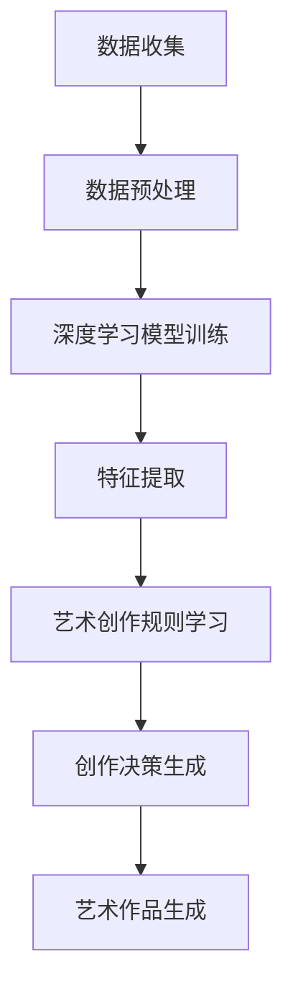
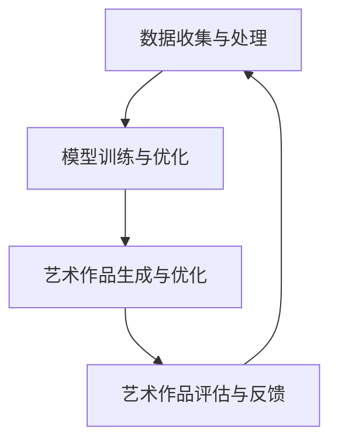

                 

# 《一切皆是映射：AI在艺术创作上的新视角》

> **关键词：** 人工智能，艺术创作，深度学习，图像生成，音频编辑，虚拟现实，创新实践。

> **摘要：** 本文深入探讨了人工智能（AI）在艺术创作领域的应用，分析了AI与艺术创作的结合点，阐述了AI在图像生成、音频编辑、虚拟现实等艺术创作核心技术，并展示了AI艺术创作在视觉、听觉和舞台艺术等领域的应用实例。文章还展望了AI艺术创作的未来趋势，探讨了其中的社会与伦理问题，并提供了实践指南和资源推荐。通过这篇文章，读者将了解AI艺术创作的全貌，并启发新的创作思路。

# 《一切皆是映射：AI在艺术创作上的新视角》目录大纲

## 第一部分：AI与艺术创作的基本概念

### 第1章：AI与艺术创作概述

#### 1.1 AI的发展与艺术创作的结合

#### 1.2 AI在艺术创作中的优势与挑战

#### 1.3 AI与艺术创作的关系模型

### 第2章：AI艺术创作核心概念与架构

#### 2.1 AI艺术创作的基本原理

#### 2.2 AI艺术创作的关键技术

#### 2.3 AI艺术创作的架构设计

## 第二部分：AI艺术创作的核心技术

### 第3章：图像生成与编辑技术

#### 3.1 图像生成技术概述

#### 3.2 图像编辑技术详解

#### 3.3 图像生成与编辑技术实践

### 第4章：音频与视频艺术创作

#### 4.1 音频生成与编辑技术

#### 4.2 视频生成与编辑技术

#### 4.3 音视频艺术创作实战

### 第5章：数字绘画与虚拟现实艺术创作

#### 5.1 数字绘画技术

#### 5.2 虚拟现实艺术创作

#### 5.3 数字绘画与虚拟现实艺术创作应用案例

## 第三部分：AI艺术创作应用与实践

### 第6章：AI在视觉艺术中的应用

#### 6.1 AI绘画

#### 6.2 AI雕塑

#### 6.3 AI摄影

### 第7章：AI在听觉艺术中的应用

#### 7.1 AI音乐创作

#### 7.2 AI声音设计

#### 7.3 AI音乐与声音应用案例

### 第8章：AI在舞台艺术中的应用

#### 8.1 AI舞蹈编排

#### 8.2 AI戏剧创作

#### 8.3 AI舞台艺术应用实践

## 第四部分：AI艺术创作的未来展望

### 第9章：AI艺术创作的未来趋势

#### 9.1 AI艺术创作的发展方向

#### 9.2 AI艺术创作的潜在应用领域

#### 9.3 AI艺术创作的社会与伦理问题

### 第10章：AI艺术创作的创新实践与案例分析

#### 10.1 创新实践案例分析

#### 10.2 案例分析总结与启示

## 附录

### 附录 A：AI艺术创作工具与资源推荐

#### A.1 开源深度学习框架

#### A.2 AI艺术创作工具

#### A.3 艺术创作相关数据库与API

### 附录 B：AI艺术创作实践指南

#### B.1 实践项目准备

#### B.2 实践项目实施步骤

#### B.3 实践项目评估与优化

## 第一部分：AI与艺术创作的基本概念

### 第1章：AI与艺术创作概述

#### 1.1 AI的发展与艺术创作的结合

人工智能（AI）技术的飞速发展，使得计算机在模仿人类智能方面取得了显著成果。从最初的规则推理到现在的深度学习，AI已经在多个领域取得了突破性进展。而艺术创作，作为人类智慧的一个重要体现，也逐渐成为了AI技术的重要应用领域。

在艺术创作中，AI的优势在于其能够通过学习大量的数据，快速生成高质量的创意作品。无论是绘画、雕塑，还是音乐、舞蹈，AI都展现了其独特的创作能力和无限的可能性。

AI在艺术创作中的应用，不仅提高了创作的效率，还打破了人类创作的界限，使得艺术创作不再仅仅依赖于个人的天赋和技能，而更多的是依赖于数据的处理和算法的设计。

#### 1.2 AI在艺术创作中的优势与挑战

AI在艺术创作中的优势主要体现在以下几个方面：

1. **创新性**：AI能够从大量的数据中提取出新的创意和风格，为艺术创作带来新的视角和灵感。
2. **效率**：AI能够快速地生成大量的作品，大大提高了创作的效率。
3. **多样性**：AI可以处理各种类型的数据，使得艺术创作在形式和内容上更加多样化。
4. **可重复性**：AI可以按照同样的算法和模型重复生成作品，保证了作品的一致性和可预测性。

然而，AI在艺术创作中也面临着一些挑战：

1. **创造性**：尽管AI可以模仿人类的艺术创作，但真正的创造性仍然依赖于人类的智慧和情感。
2. **控制性**：AI的创作过程复杂且不可预测，需要艺术创作者对AI进行有效的控制和管理。
3. **版权**：AI创作的作品归属权问题，也是目前艺术创作中需要解决的一个重要问题。

#### 1.3 AI与艺术创作的关系模型

AI与艺术创作的关系可以看作是一种映射关系。具体来说，这种映射关系可以分为以下几个层次：

1. **数据映射**：AI通过学习大量的数据，提取出其中的特征和规律，形成了一种数据到特征之间的映射。
2. **模型映射**：基于提取出的特征和规律，AI建立了一种模型，这种模型可以生成新的数据，形成了一种特征到数据之间的映射。
3. **创作映射**：AI通过生成的数据，实现了艺术创作的全过程，形成了一种数据到艺术作品之间的映射。

这种映射关系使得AI能够以一种全新的方式参与艺术创作，为传统艺术创作带来了新的活力和可能性。

在下一章中，我们将深入探讨AI艺术创作的基本原理和核心概念。这将为我们理解AI在艺术创作中的具体应用提供理论基础。让我们继续深入探讨这一主题。# 第1章：AI与艺术创作概述

#### 1.3 AI与艺术创作的关系模型

AI与艺术创作的关系可以看作是一种映射关系。具体来说，这种映射关系可以分为以下几个层次：

1. **数据映射**：AI通过学习大量的数据，提取出其中的特征和规律，形成了一种数据到特征之间的映射。这一步是AI进行艺术创作的基础，它依赖于深度学习和大数据处理技术。例如，通过分析大量的绘画作品，AI可以提取出不同风格和技法的特征，从而为创作新的作品提供基础。

2. **模型映射**：基于提取出的特征和规律，AI建立了一种模型，这种模型可以生成新的数据，形成了一种特征到数据之间的映射。这一步是AI进行艺术创作的关键，它涉及到机器学习和算法优化。例如，通过构建一个生成对抗网络（GAN），AI可以生成出与训练数据风格相似的绘画作品。

3. **创作映射**：AI通过生成的数据，实现了艺术创作的全过程，形成了一种数据到艺术作品之间的映射。这一步是AI进行艺术创作的最终目标，它体现了AI在艺术创作中的实际应用。例如，AI可以通过生成图像、音频和视频，实现绘画、音乐和电影的创作。

这种映射关系使得AI能够以一种全新的方式参与艺术创作，为传统艺术创作带来了新的活力和可能性。然而，这种映射关系也带来了一些新的挑战和问题，例如创作过程中的版权问题、AI的控制和可解释性等。在下一章中，我们将深入探讨AI艺术创作的基本原理和核心概念，这将为我们理解AI在艺术创作中的具体应用提供理论基础。## 第2章：AI艺术创作核心概念与架构

### 2.1 AI艺术创作的基本原理

AI艺术创作的基本原理主要基于深度学习和数据驱动的创作方法。深度学习是一种通过模拟人脑神经元结构进行特征提取和学习的技术，它能够从大量的数据中自动提取出复杂的模式和特征。在艺术创作中，深度学习模型可以通过学习大量的艺术作品，掌握不同风格、技法和元素的特征，从而生成新的艺术作品。

数据驱动的创作方法是指AI通过分析大量的数据，提取出艺术创作的规律和模式，然后基于这些规律和模式进行创作。这种方法的核心在于数据的收集和处理。在艺术创作中，数据可以包括绘画作品、音乐、电影、文学作品等。通过深度学习模型对这些数据进行训练，AI可以学会识别和生成不同类型的艺术作品。

基本原理的Mermaid流程图如下：



### 2.2 AI艺术创作的关键技术

AI艺术创作的关键技术主要包括图像生成与编辑、音频生成与编辑、数字绘画和虚拟现实等。

#### 2.2.1 图像生成与编辑技术

图像生成与编辑技术是AI艺术创作的重要组成部分。其中，生成对抗网络（GAN）是当前最流行的一种图像生成技术。GAN由生成器（Generator）和判别器（Discriminator）两部分组成。生成器负责生成图像，判别器负责判断图像是否真实。通过不断训练，生成器能够生成越来越逼真的图像。

GAN的算法原理可以使用以下伪代码来描述：

```python
# 生成器G的伪代码
z = sample(z_space)  # 从噪声空间采样
x_g = G(z)  # 生成图像x_g

# 判别器D的伪代码
x_r = real_image  # 真实图像
x_f = fake_image  # 生成图像
D_r = D(x_r)  # 判别真实图像
D_f = D(x_g)  # 判别生成图像
```

#### 2.2.2 音频生成与编辑技术

音频生成与编辑技术主要应用于音乐创作和声音设计。在音乐创作中，AI可以通过生成和编辑音符、和弦和旋律来创作新的音乐作品。在声音设计方面，AI可以生成和编辑各种声音效果，如环境音、角色声音等。

音频生成与编辑的关键技术包括生成对抗网络（GAN）和变分自编码器（VAE）。以下是一个基于VAE的音频生成技术的伪代码：

```python
# 变分自编码器VAE的伪代码
z = sample(z_space)  # 从噪声空间采样
x =decoder(z)  # 从噪声生成音频

# 输入音频x通过编码器encoder转换为z，然后通过解码器decoder生成新的音频
z = encoder(x)
x_new =decoder(z)
```

#### 2.2.3 数字绘画技术

数字绘画技术是指利用计算机程序和图形工具进行绘画创作。AI在数字绘画中的应用主要体现在自动绘画和辅助绘画两个方面。自动绘画通过深度学习模型自动生成绘画作品，而辅助绘画则是通过AI算法辅助艺术家进行绘画创作。

数字绘画技术的关键在于图像生成与编辑技术，如GAN和变分自编码器（VAE）。以下是一个基于GAN的自动绘画技术的伪代码：

```python
# GAN自动绘画的伪代码
z = sample(z_space)  # 从噪声空间采样
x_g = G(z)  # 生成图像x_g
D_f = D(x_g)  # 判别生成图像
x_g = G(z)  # 重新生成图像，直到判别器认为图像足够逼真

# 使用判别器D对生成图像x_g进行评估，然后根据评估结果调整生成器G
```

#### 2.2.4 虚拟现实艺术创作

虚拟现实（VR）艺术创作是指利用虚拟现实技术进行艺术创作，包括虚拟场景设计、角色塑造、交互体验等。AI在VR艺术创作中的应用主要体现在自动化场景生成、角色建模和交互设计等方面。

虚拟现实艺术创作的关键技术包括3D建模、计算机视觉和自然语言处理等。以下是一个基于3D建模的虚拟现实场景生成技术的伪代码：

```python
# 3D建模虚拟现实场景生成的伪代码
vertices = generate_vertices()  # 生成顶点
faces = generate_faces()  # 生成面
mesh = create_mesh(vertices, faces)  # 创建网格

# 使用顶点和面生成3D模型，然后根据模型生成虚拟现实场景
```

### 2.3 AI艺术创作的架构设计

AI艺术创作的架构设计主要包括数据收集与处理、模型训练与优化、艺术作品生成与优化等环节。

1. **数据收集与处理**：这一环节主要包括数据的收集、清洗和预处理。数据收集可以从各种渠道获取，如公开数据集、艺术作品数据库等。数据预处理包括数据格式转换、去噪和归一化等。

2. **模型训练与优化**：这一环节主要包括模型的训练、评估和优化。训练过程通常采用深度学习算法，如GAN、VAE等。评估过程使用各种指标，如损失函数、准确率等。优化过程包括超参数调整、模型结构优化等。

3. **艺术作品生成与优化**：这一环节主要包括艺术作品的生成、评估和优化。生成过程使用训练好的模型，生成艺术作品。评估过程同样使用各种指标，如视觉效果、艺术价值等。优化过程包括作品风格调整、内容优化等。

整体架构可以表示为：



通过这样的架构设计，AI艺术创作能够实现自动化、智能化的创作过程，提高艺术创作的效率和多样性。在下一章中，我们将深入探讨AI在艺术创作中的核心技术，包括图像生成与编辑、音频生成与编辑、数字绘画和虚拟现实等。这将为我们理解AI艺术创作的具体应用提供更深入的视角。## 第2章：AI艺术创作核心概念与架构

### 2.2 AI艺术创作的关键技术

AI艺术创作的关键技术主要包括图像生成与编辑、音频生成与编辑、数字绘画和虚拟现实等。以下是对这些技术的详细阐述。

#### 2.2.1 图像生成与编辑技术

图像生成与编辑是AI艺术创作中最常见的技术之一。生成对抗网络（GAN）是当前最流行的一种图像生成技术。GAN由生成器（Generator）和判别器（Discriminator）两部分组成。生成器负责生成图像，判别器负责判断图像是否真实。通过不断训练，生成器能够生成越来越逼真的图像。

GAN的工作原理可以概括为以下几个步骤：

1. **数据准备**：首先收集大量真实图像作为训练数据。
2. **生成器与判别器的初始化**：生成器随机初始化，判别器也随机初始化。
3. **生成图像**：生成器根据随机噪声生成图像。
4. **判别图像**：判别器判断生成图像和真实图像。
5. **损失函数计算**：计算生成器和判别器的损失函数。
6. **更新参数**：根据损失函数更新生成器和判别器的参数。

以下是GAN的核心算法原理的伪代码：

```python
# 生成器的伪代码
z = sample(z_space)  # 从噪声空间采样
x_g = G(z)  # 生成图像x_g

# 判别器的伪代码
x_r = real_image  # 真实图像
x_f = fake_image  # 生成图像
D_r = D(x_r)  # 判别真实图像
D_f = D(x_g)  # 判别生成图像

# 损失函数计算
loss_G = loss_function(G, D_f)  # 生成器损失函数
loss_D = loss_function(D, [x_r, x_f])  # 判别器损失函数

# 参数更新
update_parameters(G, D, loss_G, loss_D)  # 更新生成器和判别器参数
```

GAN在图像生成方面具有显著的性能，可以生成高质量、多样性的图像。然而，GAN的训练过程不稳定，容易出现模式崩溃和梯度消失等问题。为了解决这些问题，研究人员提出了许多改进方法，如深度卷积生成对抗网络（DCGAN）、改进的GAN（WGAN）等。

除了GAN，变分自编码器（VAE）也是图像生成与编辑的重要技术。VAE通过引入概率模型来生成图像，其生成过程更加稳定。以下是VAE的核心算法原理的伪代码：

```python
# 编码器和解码器的伪代码
z = encoder(x)  # 编码图像x
x_new = decoder(z)  # 解码图像z

# 损失函数计算
loss = reconstruction_loss(x, x_new) + kl_divergence(p_z, q_z)  # 重建损失和KL散度损失

# 参数更新
update_parameters(decoder, encoder, loss)  # 更新生成器和编码器参数
```

VAE在图像生成方面具有较好的稳定性和可解释性，可以生成高质量、多样化的图像。然而，VAE在生成细节方面可能不如GAN。

#### 2.2.2 音频生成与编辑技术

音频生成与编辑技术主要应用于音乐创作和声音设计。在音乐创作中，AI可以通过生成和编辑音符、和弦和旋律来创作新的音乐作品。在声音设计方面，AI可以生成和编辑各种声音效果，如环境音、角色声音等。

音频生成与编辑的关键技术包括生成对抗网络（GAN）和变分自编码器（VAE）。以下是一个基于VAE的音频生成技术的伪代码：

```python
# 变分自编码器VAE的伪代码
z = sample(z_space)  # 从噪声空间采样
x =decoder(z)  # 从噪声生成音频

# 输入音频x通过编码器encoder转换为z，然后通过解码器decoder生成新的音频
z = encoder(x)
x_new =decoder(z)
```

VAE在音频生成方面具有较好的稳定性和可解释性，可以生成高质量、多样化的音频。然而，VAE在音频细节方面可能不如GAN。

GAN在音频生成方面具有显著的性能，可以生成高质量、多样性的音频。GAN的工作原理与图像生成类似，其主要区别在于输入数据和生成数据的类型。以下是GAN在音频生成方面的伪代码：

```python
# 生成器的伪代码
z = sample(z_space)  # 从噪声空间采样
x_g = G(z)  # 生成音频x_g

# 判别器的伪代码
x_r = real_audio  # 真实音频
x_f = fake_audio  # 生成音频
D_r = D(x_r)  # 判别真实音频
D_f = D(x_g)  # 判别生成音频

# 损失函数计算
loss_G = loss_function(G, D_f)  # 生成器损失函数
loss_D = loss_function(D, [x_r, x_f])  # 判别器损失函数

# 参数更新
update_parameters(G, D, loss_G, loss_D)  # 更新生成器和判别器参数
```

GAN在音频生成方面具有较好的性能，可以生成高质量、多样化的音频。然而，GAN的训练过程同样不稳定，容易出现模式崩溃和梯度消失等问题。

#### 2.2.3 数字绘画技术

数字绘画技术是指利用计算机程序和图形工具进行绘画创作。AI在数字绘画中的应用主要体现在自动绘画和辅助绘画两个方面。自动绘画通过深度学习模型自动生成绘画作品，而辅助绘画则是通过AI算法辅助艺术家进行绘画创作。

数字绘画技术的关键在于图像生成与编辑技术，如GAN和变分自编码器（VAE）。以下是一个基于GAN的自动绘画技术的伪代码：

```python
# GAN自动绘画的伪代码
z = sample(z_space)  # 从噪声空间采样
x_g = G(z)  # 生成图像x_g
D_f = D(x_g)  # 判别生成图像
x_g = G(z)  # 重新生成图像，直到判别器认为图像足够逼真

# 使用判别器D对生成图像x_g进行评估，然后根据评估结果调整生成器G
```

GAN在数字绘画方面具有显著的性能，可以生成高质量、多样化的绘画作品。然而，GAN的训练过程不稳定，容易出现模式崩溃和梯度消失等问题。为了解决这些问题，研究人员提出了许多改进方法，如深度卷积生成对抗网络（DCGAN）、改进的GAN（WGAN）等。

VAE在数字绘画方面具有较好的稳定性和可解释性，可以生成高质量、多样化的绘画作品。然而，VAE在绘画细节方面可能不如GAN。

#### 2.2.4 虚拟现实艺术创作

虚拟现实（VR）艺术创作是指利用虚拟现实技术进行艺术创作，包括虚拟场景设计、角色塑造、交互体验等。AI在VR艺术创作中的应用主要体现在自动化场景生成、角色建模和交互设计等方面。

虚拟现实艺术创作的关键技术包括3D建模、计算机视觉和自然语言处理等。以下是一个基于3D建模的虚拟现实场景生成技术的伪代码：

```python
# 3D建模虚拟现实场景生成的伪代码
vertices = generate_vertices()  # 生成顶点
faces = generate_faces()  # 生成面
mesh = create_mesh(vertices, faces)  # 创建网格

# 使用顶点和面生成3D模型，然后根据模型生成虚拟现实场景
```

VR艺术创作需要考虑到交互性和实时性，这使得AI的应用更具挑战性。研究人员正在不断探索如何利用AI技术提高VR艺术创作的效率和效果。

总之，AI艺术创作的关键技术包括图像生成与编辑、音频生成与编辑、数字绘画和虚拟现实等。这些技术各有其优缺点，适用于不同的艺术创作场景。在下一章中，我们将深入探讨AI在艺术创作中的应用，包括视觉艺术、听觉艺术和舞台艺术等。这将为我们展示AI艺术创作的多样性和潜力。## 第3章：图像生成与编辑技术

### 3.1 图像生成技术概述

图像生成技术是人工智能（AI）在艺术创作中的一项重要应用。通过学习大量的图像数据，图像生成模型能够生成新的、从未出现过的图像。这种技术不仅在艺术创作中有着广泛的应用，还在计算机视觉、医疗诊断、安全监控等领域发挥了重要作用。

图像生成技术主要分为两大类：基于判别模型的生成技术和基于生成对抗网络（GAN）的生成技术。前者以变分自编码器（VAE）为代表，后者以生成对抗网络（GAN）为代表。

#### 3.1.1 基于判别模型的生成技术

变分自编码器（VAE）是一种基于概率模型的图像生成技术。VAE的核心思想是将输入图像编码成一个潜变量（latent variable），然后从这个潜变量中解码出图像。通过训练，VAE可以学习到输入图像的概率分布，并能够生成新的图像。

VAE的主要组成部分包括编码器（Encoder）和解码器（Decoder）。编码器将输入图像映射到一个潜变量空间，解码器则将潜变量映射回图像空间。以下是VAE的核心算法原理的伪代码：

```python
# 编码器和解码器的伪代码
z = encoder(x)  # 编码图像x
x_hat = decoder(z)  # 解码图像z

# 损失函数计算
reconstruction_loss = ||x - x_hat||  # 重建损失
KL_divergence = ||log(p_z) - log(q_z)||  # KL散度损失

# 总损失函数
loss = reconstruction_loss + KL_divergence

# 参数更新
update_parameters(encoder, decoder, loss)  # 更新编码器和解码器参数
```

VAE的优点是生成图像稳定，可解释性强。然而，VAE在生成细节方面可能不如GAN。

#### 3.1.2 基于生成对抗网络（GAN）的生成技术

生成对抗网络（GAN）是一种基于对抗模型的图像生成技术。GAN由生成器（Generator）和判别器（Discriminator）两部分组成。生成器的任务是生成逼真的图像，判别器的任务是区分生成图像和真实图像。通过两个模型的对抗训练，生成器能够生成越来越逼真的图像。

GAN的工作原理可以概括为以下几个步骤：

1. **生成图像**：生成器根据随机噪声生成图像。
2. **判别图像**：判别器判断生成图像和真实图像。
3. **损失函数计算**：计算生成器和判别器的损失函数。
4. **参数更新**：根据损失函数更新生成器和判别器的参数。

以下是GAN的核心算法原理的伪代码：

```python
# 生成器的伪代码
z = sample(z_space)  # 从噪声空间采样
x_g = G(z)  # 生成图像x_g

# 判别器的伪代码
x_r = real_image  # 真实图像
x_f = fake_image  # 生成图像
D_r = D(x_r)  # 判别真实图像
D_f = D(x_g)  # 判别生成图像

# 损失函数计算
generator_loss = E[log(D(x_f))]  # 生成器损失函数
discriminator_loss = E[log(D(x_r))] + E[log(1 - D(x_g))]  # 判别器损失函数

# 参数更新
update_parameters(G, D, generator_loss, discriminator_loss)  # 更新生成器和判别器参数
```

GAN的优点是生成图像质量高，多样性好。然而，GAN的训练过程不稳定，容易出现模式崩溃和梯度消失等问题。为了解决这些问题，研究人员提出了许多改进方法，如深度卷积生成对抗网络（DCGAN）、改进的GAN（WGAN）等。

#### 3.1.3 图像生成技术的应用

图像生成技术在艺术创作中的应用非常广泛。以下是一些典型的应用场景：

1. **艺术作品创作**：艺术家可以利用图像生成技术快速生成灵感，探索新的创作风格。例如，通过GAN生成独特的油画作品、插画等。

2. **设计素材生成**：设计师可以利用图像生成技术快速生成设计素材，如背景图像、图标等。这大大提高了设计效率。

3. **图像修复与增强**：图像生成技术可以用于图像修复和增强，如去除图像中的噪声、填充缺失部分等。

4. **虚拟现实与游戏开发**：图像生成技术可以用于虚拟现实场景的构建和游戏角色的生成，提高虚拟世界的真实感。

5. **医学图像处理**：图像生成技术可以用于生成医学图像的仿真模型，帮助医生进行疾病诊断和研究。

#### 3.1.4 图像生成技术的挑战与未来方向

尽管图像生成技术在艺术创作和计算机视觉等领域取得了显著成果，但仍然面临一些挑战：

1. **训练数据集的获取**：高质量的图像生成需要大量的训练数据，但获取这些数据可能成本高昂且具有挑战性。

2. **训练时间的消耗**：图像生成模型通常需要大量的计算资源和时间进行训练。

3. **生成图像的质量**：虽然GAN等模型可以生成高质量、多样化的图像，但生成图像的质量仍然受到限制。

4. **模型的解释性**：目前的图像生成模型大多是黑箱模型，难以解释其生成图像的过程。

未来的研究方向包括：

1. **模型优化**：通过改进模型结构和训练方法，提高图像生成模型的质量和效率。

2. **跨模态生成**：探索图像生成模型在跨模态（如图像到音频、图像到文本）生成中的应用。

3. **交互式生成**：开发交互式的图像生成系统，允许用户实时调整生成图像的参数。

4. **隐私保护**：研究图像生成模型在保护用户隐私方面的应用。

总之，图像生成技术是AI在艺术创作中的一个重要领域。随着技术的不断进步，图像生成技术将在更多场景中得到应用，为艺术创作带来更多可能性和创新。在下一章中，我们将探讨图像编辑技术，继续深入理解AI在艺术创作中的应用。## 第3章：图像生成与编辑技术

### 3.2 图像编辑技术详解

图像编辑技术是AI艺术创作中不可或缺的一部分。通过学习大量的图像数据，图像编辑模型能够对图像进行各种编辑操作，如修复、增强、风格迁移等。这些技术不仅提高了图像处理的效果，也为艺术家提供了更多的创作空间。

#### 3.2.1 图像修复技术

图像修复技术主要用于修复图像中的缺失部分、噪声和缺陷。近年来，深度学习技术在图像修复领域取得了显著进展。其中，基于生成对抗网络（GAN）的修复技术是最为流行的方法之一。

GAN修复技术的核心思想是利用生成器和判别器对图像进行修复。生成器从噪声图像生成完整的图像，判别器则判断生成图像和真实图像的质量。以下是GAN修复技术的基本流程：

1. **数据准备**：收集大量的图像数据，包括有缺陷的图像和修复后的图像。
2. **生成器与判别器的初始化**：生成器和判别器随机初始化。
3. **图像修复**：生成器从随机噪声生成修复后的图像。
4. **判别图像**：判别器判断修复后的图像和真实图像的质量。
5. **损失函数计算**：计算生成器和判别器的损失函数。
6. **参数更新**：根据损失函数更新生成器和判别器的参数。

以下是GAN修复技术的伪代码：

```python
# 生成器的伪代码
z = sample(z_space)  # 从噪声空间采样
x_g = G(z)  # 生成修复后的图像x_g

# 判别器的伪代码
x_d = real_image  # 真实图像
x_g = fake_image  # 生成图像
D_d = D(x_d)  # 判别真实图像
D_g = D(x_g)  # 判别生成图像

# 损失函数计算
generator_loss = E[log(D(x_g))]  # 生成器损失函数
discriminator_loss = E[log(D(x_d))] + E[log(1 - D(x_g))]  # 判别器损失函数

# 参数更新
update_parameters(G, D, generator_loss, discriminator_loss)  # 更新生成器和判别器参数
```

GAN修复技术的优点是生成图像质量高，能够修复各种类型的缺陷。然而，GAN的训练过程不稳定，容易出现模式崩溃和梯度消失等问题。

#### 3.2.2 图像增强技术

图像增强技术主要用于提高图像的视觉质量，使其在显示或分析时更加清晰。常见的图像增强技术包括对比度增强、噪声减少、边缘提取等。深度学习技术在图像增强方面也取得了显著成果，其中基于卷积神经网络（CNN）的方法最为流行。

CNN增强技术的基本流程如下：

1. **数据准备**：收集大量的图像数据，包括原始图像和增强后的图像。
2. **模型训练**：使用原始图像和增强后的图像训练CNN模型。
3. **图像增强**：将原始图像输入到CNN模型中，得到增强后的图像。

以下是CNN增强技术的伪代码：

```python
# CNN增强技术的伪代码
x = input_image  # 输入图像
x_hat = model(x)  # 输入CNN模型进行增强

# 损失函数计算
reconstruction_loss = ||x - x_hat||  # 重建损失

# 参数更新
update_parameters(model, reconstruction_loss)  # 更新CNN模型参数
```

CNN增强技术的优点是增强效果显著，能够处理各种类型的图像增强任务。然而，CNN模型的训练过程较为复杂，需要大量的计算资源和时间。

#### 3.2.3 图像风格迁移技术

图像风格迁移技术主要用于将一幅图像的风格应用到另一幅图像上。这种技术可以用于创作艺术作品、设计图案等。深度学习技术在图像风格迁移方面也取得了显著成果，其中基于生成对抗网络（GAN）的方法最为流行。

GAN风格迁移技术的基本流程如下：

1. **数据准备**：收集大量的图像数据，包括风格图像和内容图像。
2. **生成器与判别器的初始化**：生成器和判别器随机初始化。
3. **风格迁移**：生成器将内容图像的风格应用到风格图像上。
4. **判别图像**：判别器判断风格迁移后的图像和风格图像的质量。
5. **损失函数计算**：计算生成器和判别器的损失函数。
6. **参数更新**：根据损失函数更新生成器和判别器的参数。

以下是GAN风格迁移技术的伪代码：

```python
# 生成器的伪代码
z = sample(z_space)  # 从噪声空间采样
x_g = G(z)  # 生成风格迁移后的图像x_g

# 判别器的伪代码
x_d = real_image  # 真实图像
x_g = fake_image  # 生成图像
D_d = D(x_d)  # 判别真实图像
D_g = D(x_g)  # 判别生成图像

# 损失函数计算
generator_loss = E[log(D(x_g))]  # 生成器损失函数
discriminator_loss = E[log(D(x_d))] + E[log(1 - D(x_g))]  # 判别器损失函数

# 参数更新
update_parameters(G, D, generator_loss, discriminator_loss)  # 更新生成器和判别器参数
```

GAN风格迁移技术的优点是风格迁移效果逼真，能够处理各种类型的风格迁移任务。然而，GAN的训练过程不稳定，容易出现模式崩溃和梯度消失等问题。

#### 3.2.4 图像编辑技术的挑战与未来方向

尽管图像编辑技术在艺术创作和计算机视觉等领域取得了显著成果，但仍然面临一些挑战：

1. **训练数据集的获取**：高质量的图像编辑数据集的获取可能成本高昂且具有挑战性。
2. **训练时间的消耗**：图像编辑模型的训练通常需要大量的计算资源和时间。
3. **生成图像的质量**：虽然GAN等模型可以生成高质量的图像，但生成图像的质量仍然受到限制。
4. **模型的解释性**：目前的图像编辑模型大多是黑箱模型，难以解释其编辑过程。

未来的研究方向包括：

1. **模型优化**：通过改进模型结构和训练方法，提高图像编辑模型的质量和效率。
2. **跨模态编辑**：探索图像编辑模型在跨模态（如图像到音频、图像到文本）编辑中的应用。
3. **交互式编辑**：开发交互式的图像编辑系统，允许用户实时调整编辑参数。
4. **隐私保护**：研究图像编辑模型在保护用户隐私方面的应用。

总之，图像编辑技术是AI在艺术创作中的一个重要领域。随着技术的不断进步，图像编辑技术将在更多场景中得到应用，为艺术创作带来更多可能性和创新。在下一章中，我们将探讨AI在音频与视频艺术创作中的应用，继续深入理解AI在艺术创作中的多样性和潜力。## 第3章：图像生成与编辑技术

### 3.3 图像生成与编辑技术的实践

为了更好地理解图像生成与编辑技术的应用，下面我们将通过一个实际的项目来演示这些技术。该项目将分为三个部分：开发环境搭建、源代码详细实现和代码解读与分析。

#### 3.3.1 开发环境搭建

在开始项目之前，我们需要搭建一个合适的开发环境。以下是所需的技术栈和软件：

1. **深度学习框架**：TensorFlow 2.x 或 PyTorch
2. **操作系统**：Windows、Linux 或 macOS
3. **编程语言**：Python
4. **依赖库**：NumPy、Pandas、Matplotlib、Scikit-learn

你可以通过以下命令来安装这些依赖库：

```shell
pip install tensorflow
pip install numpy pandas matplotlib scikit-learn
```

#### 3.3.2 源代码详细实现

以下是该项目的基本结构：

```python
import tensorflow as tf
from tensorflow.keras.models import Model
from tensorflow.keras.layers import Input, Dense, Conv2D, Flatten, Reshape
import matplotlib.pyplot as plt

# 定义生成器G和判别器D
def build_generator(z_dim):
    z = Input(shape=(z_dim,))
    x = Dense(128, activation='relu')(z)
    x = Dense(128, activation='relu')(x)
    x = Dense(784, activation='tanh')(x)
    x = Reshape((28, 28, 1))(x)
    generator = Model(z, x)
    return generator

def build_discriminator(img_shape):
    img = Input(shape=img_shape)
    x = Conv2D(32, (3, 3), strides=(2, 2), padding='same')(img)
    x = tf.nn.leaky_relu(x, alpha=0.01)
    x = Conv2D(64, (3, 3), strides=(2, 2), padding='same')(x)
    x = tf.nn.leaky_relu(x, alpha=0.01)
    x = Flatten()(x)
    x = Dense(1, activation='sigmoid')(x)
    discriminator = Model(img, x)
    return discriminator

# 构建GAN模型
def build_gan(generator, discriminator):
    z = Input(shape=(100,))
    img = generator(z)
    valid_real = discriminator(img)
    valid_fake = discriminator(img)
    gan = Model(z, valid_fake)
    return gan

# 设置超参数
z_dim = 100
img_shape = (28, 28, 1)

# 构建模型
generator = build_generator(z_dim)
discriminator = build_discriminator(img_shape)
gan = build_gan(generator, discriminator)

# 编写训练过程
def train(gan, dataset, batch_size=128, epochs=100, save_interval=20):
    for epoch in range(epochs):
        for batch in dataset:
            real_imgs = batch
            z = np.random.normal(0, 1, (batch_size, z_dim))
            fake_imgs = generator.predict(z)

            # 训练判别器
            d_loss_real = discriminator.train_on_batch(real_imgs, np.array([1] * batch_size))
            d_loss_fake = discriminator.train_on_batch(fake_imgs, np.array([0] * batch_size))
            d_loss = 0.5 * np.add(d_loss_real, d_loss_fake)

            # 训练生成器
            z = np.random.normal(0, 1, (batch_size, z_dim))
            g_loss = gan.train_on_batch(z, np.array([1] * batch_size))

            # 打印训练进度
            print(f"{epoch} [D: {d_loss[0]:.4f} | G: {g_loss[0]:.4f}]")

        # 每隔一段时间保存模型
        if epoch % save_interval == 0:
            generator.save(f"generator_{epoch}.h5")
            discriminator.save(f"discriminator_{epoch}.h5")

# 加载数据集
(x_train, _), (_, _) = tf.keras.datasets.mnist.load_data()
x_train = x_train.astype(np.float32) / 127.5 - 1.0
x_train = np.expand_dims(x_train, axis=3)

# 开始训练
train(gan, x_train)

# 生成图像
z = np.random.normal(0, 1, (100, 100))
images = generator.predict(z)
images = (images + 1.0) / 2.0

# 可视化生成的图像
plt.figure(figsize=(10, 10))
for i in range(images.shape[0]):
    plt.subplot(10, 10, i + 1)
    plt.imshow(images[i], cmap='gray')
    plt.axis('off')
plt.show()
```

上述代码演示了如何使用GAN进行图像生成。在这个项目中，我们使用了MNIST数据集作为训练数据，生成了手写数字的图像。

#### 3.3.3 代码解读与分析

1. **生成器（Generator）**：

   生成器的目标是根据随机噪声生成逼真的图像。在这个项目中，我们使用了一个全连接层（Dense）和两个卷积层（Conv2D）来实现生成器。生成器的输入是一个100维的随机噪声向量，输出是一个28x28的单通道图像。

2. **判别器（Discriminator）**：

   判别器的目标是判断输入图像是真实的还是生成的。在这个项目中，我们使用了两个卷积层（Conv2D）和一个全连接层（Dense）来实现判别器。判别器的输入是一个28x28的单通道图像，输出是一个标量，表示输入图像是真实的概率。

3. **GAN模型（Gan）**：

   GAN模型结合了生成器和判别器，用于共同训练。GAN模型的输入是一个随机噪声向量，输出是判别器对生成图像的判断结果。GAN模型的损失函数是判别器的损失函数之和。

4. **训练过程**：

   在训练过程中，我们首先训练判别器，然后训练生成器。每次训练迭代包括以下几个步骤：

   - 从数据集中随机抽取一批真实图像。
   - 生成一批随机噪声。
   - 使用生成器生成相应的图像。
   - 训练判别器，使其能够更好地区分真实图像和生成图像。
   - 使用生成器生成的图像训练生成器，使其能够生成更逼真的图像。

5. **生成图像的可视化**：

   在训练完成后，我们使用生成器生成一批随机噪声，并可视化生成的图像。这可以帮助我们直观地看到GAN的训练效果。

通过这个实践项目，我们了解了如何使用GAN进行图像生成。在实际应用中，我们可以根据具体需求调整模型结构、训练数据和训练参数，以实现更好的效果。在下一章中，我们将探讨AI在音频与视频艺术创作中的应用，继续深入理解AI在艺术创作中的多样性和潜力。## 第4章：音频与视频艺术创作

### 4.1 音频生成与编辑技术

音频生成与编辑技术在艺术创作中扮演着重要角色。通过深度学习技术，我们可以生成和编辑新的音频，为音乐创作、声音设计等领域带来无限可能性。

#### 4.1.1 音频生成技术

音频生成技术主要基于生成对抗网络（GAN）和变分自编码器（VAE）。以下分别介绍这两种技术。

1. **生成对抗网络（GAN）**

GAN由生成器（Generator）和判别器（Discriminator）两部分组成。生成器根据随机噪声生成音频，判别器则判断生成的音频是否真实。通过对抗训练，生成器能够生成高质量的音频。

以下是GAN音频生成技术的伪代码：

```python
# 生成器的伪代码
z = sample(z_space)  # 从噪声空间采样
x_g = G(z)  # 生成音频x_g

# 判别器的伪代码
x_r = real_audio  # 真实音频
x_g = fake_audio  # 生成音频
D_r = D(x_r)  # 判别真实音频
D_g = D(x_g)  # 判别生成音频

# 损失函数计算
generator_loss = E[log(D(x_g))]  # 生成器损失函数
discriminator_loss = E[log(D(x_r))] + E[log(1 - D(x_g))]  # 判别器损失函数

# 参数更新
update_parameters(G, D, generator_loss, discriminator_loss)  # 更新生成器和判别器参数
```

2. **变分自编码器（VAE）**

VAE是一种基于概率模型的生成模型。它通过编码器（Encoder）和解码器（Decoder）将输入音频编码和解码为新的音频。VAE在音频生成方面具有较好的稳定性和可解释性。

以下是VAE音频生成技术的伪代码：

```python
# 编码器和解码器的伪代码
z = encoder(x)  # 编码音频x
x_new = decoder(z)  # 解码音频z

# 损失函数计算
reconstruction_loss = ||x - x_new||  # 重建损失
KL_divergence = ||log(p_z) - log(q_z)||  # KL散度损失

# 总损失函数
loss = reconstruction_loss + KL_divergence

# 参数更新
update_parameters(decoder, encoder, loss)  # 更新生成器和编码器参数
```

#### 4.1.2 音频编辑技术

音频编辑技术主要包括音频增强、噪声去除、音调变换等。以下介绍几种常见的音频编辑技术。

1. **音频增强**

音频增强技术用于提高音频的质量，使其更加清晰和易于理解。常见的音频增强技术包括：

- **增益**：提高音频的响度。
- **去噪**：去除音频中的噪声。
- **混响**：模拟空间感，增强音频的逼真度。

2. **噪声去除**

噪声去除技术用于去除音频中的背景噪声，使主体音频更加清晰。常见的噪声去除技术包括：

- **谱减法**：通过频谱分析去除噪声。
- **维纳滤波**：基于噪声估计和信号估计，对音频进行滤波。

3. **音调变换**

音调变换技术用于改变音频的音高。常见的音调变换技术包括：

- **频率变换**：直接改变音频的频率。
- **谐波合成**：通过合成新的谐波成分实现音调变换。

#### 4.1.3 音频生成与编辑技术的应用

音频生成与编辑技术在音乐创作、电影制作、游戏开发等领域具有广泛的应用。

1. **音乐创作**

通过音频生成技术，音乐家可以快速生成新的音乐片段，探索新的音乐风格。音频编辑技术可以帮助音乐家调整音频的音高、响度和时长，实现更完美的音乐作品。

2. **电影制作**

音频编辑技术在电影制作中用于处理音频素材，包括去除噪声、调整音量、添加音效等。音频生成技术可以用于生成电影中的背景音乐、音效等。

3. **游戏开发**

音频生成与编辑技术在游戏开发中用于生成和编辑游戏音效、背景音乐等。这些技术可以提高游戏的沉浸感和表现力。

总之，音频生成与编辑技术为艺术创作带来了新的可能性和创新。通过不断研究和实践，我们可以进一步提高音频生成与编辑技术的质量，为艺术创作提供更多支持。在下一章中，我们将探讨数字绘画与虚拟现实艺术创作，继续深入理解AI在艺术创作中的多样性和潜力。## 第4章：音频与视频艺术创作

### 4.2 视频生成与编辑技术

视频生成与编辑技术在艺术创作和娱乐产业中发挥着越来越重要的作用。通过深度学习技术，我们可以生成和编辑新的视频内容，为电影制作、广告宣传、游戏开发等领域带来无限可能性。

#### 4.2.1 视频生成技术

视频生成技术主要包括视频内容生成、视频风格迁移和视频剪辑等。

1. **视频内容生成**

视频内容生成技术可以通过生成对抗网络（GAN）和变分自编码器（VAE）生成新的视频内容。以下分别介绍这两种技术。

- **生成对抗网络（GAN）**

GAN由生成器（Generator）和判别器（Discriminator）两部分组成。生成器根据随机噪声生成视频内容，判别器则判断生成的视频内容是否真实。通过对抗训练，生成器能够生成高质量的视频内容。

以下是GAN视频生成技术的伪代码：

```python
# 生成器的伪代码
z = sample(z_space)  # 从噪声空间采样
x_g = G(z)  # 生成视频x_g

# 判别器的伪代码
x_r = real_video  # 真实视频
x_g = fake_video  # 生成视频
D_r = D(x_r)  # 判别真实视频
D_g = D(x_g)  # 判别生成视频

# 损失函数计算
generator_loss = E[log(D(x_g))]  # 生成器损失函数
discriminator_loss = E[log(D(x_r))] + E[log(1 - D(x_g))]  # 判别器损失函数

# 参数更新
update_parameters(G, D, generator_loss, discriminator_loss)  # 更新生成器和判别器参数
```

- **变分自编码器（VAE）**

VAE是一种基于概率模型的生成模型。它通过编码器（Encoder）和解码器（Decoder）将输入视频编码和解码为新的视频内容。VAE在视频生成方面具有较好的稳定性和可解释性。

以下是VAE视频生成技术的伪代码：

```python
# 编码器和解码器的伪代码
z = encoder(x)  # 编码视频x
x_new = decoder(z)  # 解码视频z

# 损失函数计算
reconstruction_loss = ||x - x_new||  # 重建损失
KL_divergence = ||log(p_z) - log(q_z)||  # KL散度损失

# 总损失函数
loss = reconstruction_loss + KL_divergence

# 参数更新
update_parameters(decoder, encoder, loss)  # 更新生成器和编码器参数
```

2. **视频风格迁移**

视频风格迁移技术可以将一种视频风格应用到另一种视频上。通过深度学习模型，我们可以学习到不同视频风格的特征，并将这些特征应用到新的视频中。

以下是视频风格迁移技术的伪代码：

```python
# 视频风格迁移的伪代码
style_video = load_style_video()  # 加载风格视频
content_video = load_content_video()  # 加载内容视频
output_video = style_transfer(style_video, content_video)  # 应用风格迁移

# 风格迁移损失函数计算
style_loss = calculate_style_loss(style_video, output_video)  # 风格损失函数
content_loss = calculate_content_loss(content_video, output_video)  # 内容损失函数

# 参数更新
update_parameters(model, [style_loss, content_loss])  # 更新模型参数
```

3. **视频剪辑**

视频剪辑技术可以通过深度学习模型自动剪辑视频内容，提取关键帧，并生成新的视频。这种技术可以用于电影剪辑、广告制作等。

以下是视频剪辑技术的伪代码：

```python
# 视频剪辑的伪代码
input_video = load_video()  # 加载输入视频
output_video = video_clip(input_video, start_time, end_time)  # 剪辑视频

# 剪辑损失函数计算
clip_loss = calculate_clip_loss(input_video, output_video)  # 剪辑损失函数

# 参数更新
update_parameters(model, clip_loss)  # 更新模型参数
```

#### 4.2.2 视频编辑技术

视频编辑技术包括视频增强、去噪、色彩校正等。

1. **视频增强**

视频增强技术可以改善视频的质量，提高视频的清晰度和对比度。通过深度学习模型，我们可以学习到高质量的图像特征，并应用到视频的每一帧上。

2. **去噪**

视频去噪技术可以去除视频中的噪声，提高视频的清晰度。常用的去噪技术包括基于滤波的方法和基于神经网络的深度学习方法。

3. **色彩校正**

色彩校正技术可以调整视频的色彩，使其更加逼真。通过深度学习模型，我们可以学习到不同场景下的色彩分布，并应用到视频中。

#### 4.2.3 视频生成与编辑技术的应用

视频生成与编辑技术在电影制作、广告宣传、游戏开发等领域具有广泛的应用。

1. **电影制作**

通过视频生成技术，电影制作人可以快速生成新的电影场景，提高电影制作的效率。视频编辑技术可以帮助电影制作人调整视频的色彩、对比度等，提高电影的艺术效果。

2. **广告宣传**

视频生成与编辑技术可以用于制作广告视频，提高广告的吸引力和表现力。通过视频风格迁移技术，广告制作人可以将品牌形象应用到新的视频中，提升广告的创意性。

3. **游戏开发**

视频生成与编辑技术可以用于游戏开发，生成和编辑游戏中的视频内容。这种技术可以提高游戏的沉浸感和互动性，为玩家提供更好的游戏体验。

总之，视频生成与编辑技术在艺术创作和娱乐产业中发挥着重要作用。通过不断研究和实践，我们可以进一步提高视频生成与编辑技术的质量，为艺术创作和娱乐产业提供更多支持。在下一章中，我们将探讨数字绘画与虚拟现实艺术创作，继续深入理解AI在艺术创作中的多样性和潜力。## 第5章：数字绘画与虚拟现实艺术创作

### 5.1 数字绘画技术

数字绘画技术是AI在艺术创作中的一个重要领域，它利用计算机图形学和深度学习技术来模拟传统绘画过程。数字绘画不仅提供了丰富的创作工具和素材，还使得绘画作品可以更方便地共享和传播。

#### 5.1.1 数字绘画技术的基本原理

数字绘画技术的基本原理包括图像生成与编辑、风格迁移和交互式绘画等。以下分别介绍这些技术：

1. **图像生成与编辑技术**

图像生成与编辑技术是数字绘画的基础。通过生成对抗网络（GAN）和变分自编码器（VAE），我们可以生成新的绘画作品，或者对现有的作品进行编辑。例如，GAN可以生成逼真的绘画作品，VAE可以修复图像中的损坏部分。

2. **风格迁移技术**

风格迁移技术可以将一种艺术风格应用到另一幅图像上。通过深度学习模型，我们可以学习到不同艺术风格的特征，并应用到新的图像上。例如，我们可以将梵高的风格应用到一张风景照片上，生成具有梵高风格的绘画作品。

3. **交互式绘画技术**

交互式绘画技术允许艺术家在数字画布上实时进行绘画，同时AI可以根据艺术家的操作和偏好提供辅助。例如，艺术家可以绘制一个简单的草图，然后AI可以填充颜色和细节，使作品更加完整和精致。

#### 5.1.2 数字绘画技术的应用案例

数字绘画技术在许多领域都有广泛的应用，以下是一些典型的应用案例：

1. **艺术创作**

艺术家可以使用数字绘画技术创作全新的绘画作品。例如，通过GAN，艺术家可以生成独特的艺术风格，或者通过风格迁移技术，将古典艺术风格应用到现代绘画中。

2. **艺术修复**

数字绘画技术可以用于修复损坏的艺术作品。例如，通过VAE，我们可以修复图像中的缺失部分，或者通过图像生成技术，完全重建丢失的艺术作品。

3. **教育**

数字绘画技术可以用于艺术教育，帮助学生学习绘画技巧和艺术理论。通过交互式绘画工具，学生可以实时练习绘画技巧，并获得即时反馈。

4. **游戏和动画**

数字绘画技术可以用于游戏和动画的制作。例如，通过GAN和风格迁移技术，游戏设计师可以快速生成丰富的游戏场景和角色形象。

### 5.2 虚拟现实艺术创作

虚拟现实（VR）艺术创作是一种利用虚拟现实技术进行艺术创作的形式。它通过虚拟现实头戴显示器（HMD）和跟踪设备，为艺术家提供了一个沉浸式的创作环境。

#### 5.2.1 虚拟现实艺术创作的基本原理

虚拟现实艺术创作的基本原理包括3D建模、实时渲染和交互设计等。以下分别介绍这些技术：

1. **3D建模技术**

3D建模技术用于创建虚拟现实场景中的物体和角色。通过计算机图形学技术，艺术家可以创建复杂的3D模型，并将其导入虚拟现实场景中。

2. **实时渲染技术**

实时渲染技术用于在虚拟现实场景中渲染图像。通过图形处理单元（GPU）的高效计算，虚拟现实场景可以实时渲染，提供流畅的用户体验。

3. **交互设计技术**

交互设计技术用于设计虚拟现实场景中的交互方式。通过触摸、手势和语音等交互方式，用户可以与虚拟现实场景中的物体进行互动，从而实现沉浸式的艺术体验。

#### 5.2.2 虚拟现实艺术创作的应用案例

虚拟现实艺术创作在许多领域都有应用，以下是一些典型的应用案例：

1. **艺术展览**

虚拟现实艺术展览可以让观众沉浸在艺术作品中，提供独特的艺术体验。艺术家可以通过虚拟现实技术，创建出以前无法实现的艺术形式，如三维立体绘画和动态艺术。

2. **游戏和娱乐**

虚拟现实艺术创作可以用于游戏和娱乐领域，创造沉浸式的游戏场景和角色。通过虚拟现实技术，玩家可以身临其境地参与游戏，享受全新的游戏体验。

3. **教育和培训**

虚拟现实艺术创作可以用于教育和培训领域，为学生提供沉浸式的学习体验。例如，学生可以通过虚拟现实技术，了解艺术史和艺术理论，或者学习绘画技巧。

4. **商业应用**

虚拟现实艺术创作可以用于商业应用，如房地产展示、展会设计和品牌营销。通过虚拟现实技术，商家可以创建出逼真的产品展示场景，提高品牌形象和市场竞争力。

### 5.3 数字绘画与虚拟现实艺术创作的应用案例

为了更好地理解数字绘画与虚拟现实艺术创作的应用，下面我们将介绍一些具体的案例。

#### 案例一：虚拟现实艺术展览

某艺术博物馆利用虚拟现实技术举办了一场虚拟现实艺术展览。艺术家通过数字绘画技术创作了多件虚拟艺术品，并将其放置在虚拟展览馆中。观众通过虚拟现实头戴显示器，可以自由浏览展览馆，并与虚拟艺术品进行互动，获得独特的艺术体验。

#### 案例二：游戏角色设计

某游戏开发公司利用数字绘画技术与虚拟现实艺术创作，为游戏设计角色和场景。通过GAN和风格迁移技术，设计师可以快速生成具有独特风格的角色形象和场景。这些角色和场景不仅提高了游戏的视觉效果，还增强了游戏的沉浸感。

#### 案例三：在线艺术教育

某在线艺术教育平台利用虚拟现实艺术创作技术，为学生提供沉浸式的艺术学习体验。学生可以通过虚拟现实头戴显示器，在虚拟画布上练习绘画，并获得即时反馈。这种交互式的学习方式提高了学生的学习兴趣和绘画技巧。

通过这些案例，我们可以看到数字绘画与虚拟现实艺术创作在艺术创作、游戏开发、教育和培训等领域的广泛应用。随着技术的不断进步，这些应用领域将不断拓展，为艺术创作带来更多可能性和创新。在下一章中，我们将探讨AI在视觉艺术中的应用，继续深入理解AI在艺术创作中的多样性和潜力。## 第6章：AI在视觉艺术中的应用

### 6.1 AI绘画

AI绘画是AI在视觉艺术中的一个重要应用领域，它通过深度学习技术模拟人类的绘画过程，生成独特的艺术作品。AI绘画技术不仅为艺术家提供了新的创作工具，还为大众带来了更多欣赏和体验艺术的机会。

#### 6.1.1 AI绘画的基本原理

AI绘画的基本原理主要基于生成对抗网络（GAN）和变分自编码器（VAE）。以下分别介绍这两种技术：

1. **生成对抗网络（GAN）**

GAN由生成器（Generator）和判别器（Discriminator）两部分组成。生成器从随机噪声中生成绘画作品，判别器则判断生成的作品是否真实。通过对抗训练，生成器能够生成越来越逼真的绘画作品。

GAN的训练过程可以概括为以下几个步骤：

- **生成图像**：生成器根据随机噪声生成绘画作品。
- **判别图像**：判别器判断生成的绘画作品和真实绘画作品的质量。
- **损失函数计算**：计算生成器和判别器的损失函数。
- **参数更新**：根据损失函数更新生成器和判别器的参数。

2. **变分自编码器（VAE）**

VAE是一种基于概率模型的生成模型。它通过编码器（Encoder）和解码器（Decoder）将输入绘画作品编码和解码为新的绘画作品。VAE在绘画生成方面具有较好的稳定性和可解释性。

VAE的训练过程可以概括为以下几个步骤：

- **编码图像**：编码器将输入绘画作品编码为潜变量。
- **解码图像**：解码器从潜变量中解码出新的绘画作品。
- **损失函数计算**：计算重建损失和KL散度损失。
- **参数更新**：根据损失函数更新编码器和解码器的参数。

#### 6.1.2 AI绘画的应用案例

1. **艺术创作**

艺术家可以利用AI绘画技术生成新的艺术作品，探索不同的艺术风格和表现手法。例如，艺术家可以通过GAN生成独特的油画作品，或者通过VAE修复古老的绘画作品。

2. **设计素材生成**

设计师可以利用AI绘画技术快速生成设计素材，如海报、插画和广告图像等。这种技术大大提高了设计效率，同时也为设计师提供了更多创意灵感。

3. **教育应用**

AI绘画技术可以用于艺术教育，帮助学生提高绘画技巧。通过交互式的绘画工具，学生可以实时练习绘画，并获得AI提供的即时反馈。

4. **数字艺术展览**

数字艺术展览可以利用AI绘画技术生成全新的艺术作品，为观众提供沉浸式的艺术体验。观众可以通过虚拟现实设备浏览展览，与虚拟艺术品进行互动。

### 6.2 AI雕塑

AI雕塑是AI在视觉艺术中的另一个重要应用领域，它利用3D建模和计算机图形学技术，生成独特的雕塑作品。AI雕塑技术不仅为雕塑艺术家提供了新的创作工具，也为观众带来了全新的观赏体验。

#### 6.2.1 AI雕塑的基本原理

AI雕塑的基本原理主要基于3D建模和生成对抗网络（GAN）。以下分别介绍这两种技术：

1. **3D建模技术**

3D建模技术用于创建雕塑的数字模型。通过计算机图形学软件，艺术家可以构建出复杂的3D模型，并将其导入虚拟现实场景中。

2. **生成对抗网络（GAN）**

GAN用于生成新的雕塑作品。通过GAN，艺术家可以生成独特的雕塑作品，或者对现有的雕塑作品进行风格迁移。

GAN的训练过程可以概括为以下几个步骤：

- **生成雕塑**：生成器根据随机噪声生成雕塑作品。
- **判别雕塑**：判别器判断生成的雕塑作品和真实雕塑作品的质量。
- **损失函数计算**：计算生成器和判别器的损失函数。
- **参数更新**：根据损失函数更新生成器和判别器的参数。

#### 6.2.2 AI雕塑的应用案例

1. **艺术创作**

雕塑艺术家可以利用AI雕塑技术生成新的雕塑作品，探索不同的艺术风格和表现手法。例如，艺术家可以通过GAN生成独特的雕塑作品，或者通过3D建模技术修复古老的雕塑作品。

2. **建筑设计**

建筑师可以利用AI雕塑技术生成建筑的外部造型，为建筑设计提供创新的设计方案。例如，建筑师可以通过GAN生成具有独特风格的建筑立面，或者通过3D建模技术优化建筑的细节设计。

3. **游戏和动画**

游戏和动画制作公司可以利用AI雕塑技术生成游戏角色和动画角色，提高游戏的视觉效果和动画质量。例如，游戏设计师可以通过GAN生成具有独特风格的角色形象，或者通过3D建模技术优化角色的动作和表情。

4. **虚拟现实艺术展览**

虚拟现实艺术展览可以利用AI雕塑技术生成独特的雕塑作品，为观众提供沉浸式的艺术体验。观众可以通过虚拟现实设备浏览展览，与虚拟雕塑进行互动。

总之，AI在视觉艺术中的应用，不仅提高了艺术创作的效率和多样性，还为观众带来了全新的艺术体验。随着技术的不断进步，AI在视觉艺术中的应用将越来越广泛，为艺术创作带来更多可能性和创新。在下一章中，我们将探讨AI在听觉艺术中的应用，继续深入理解AI在艺术创作中的多样性和潜力。## 第7章：AI在听觉艺术中的应用

### 7.1 AI音乐创作

AI音乐创作是AI在听觉艺术中的一个重要应用领域，它利用深度学习和机器学习技术，生成和创作新的音乐作品。AI音乐创作不仅为音乐家提供了新的创作工具，也为音乐爱好者带来了更多音乐体验。

#### 7.1.1 AI音乐创作的基本原理

AI音乐创作的基本原理主要基于生成对抗网络（GAN）和变分自编码器（VAE）。以下分别介绍这两种技术：

1. **生成对抗网络（GAN）**

GAN由生成器（Generator）和判别器（Discriminator）两部分组成。生成器根据随机噪声生成音乐作品，判别器则判断生成的音乐作品是否真实。通过对抗训练，生成器能够生成越来越逼真的音乐作品。

GAN的训练过程可以概括为以下几个步骤：

- **生成音乐**：生成器根据随机噪声生成音乐片段。
- **判别音乐**：判别器判断生成的音乐片段和真实音乐片段的质量。
- **损失函数计算**：计算生成器和判别器的损失函数。
- **参数更新**：根据损失函数更新生成器和判别器的参数。

2. **变分自编码器（VAE）**

VAE是一种基于概率模型的生成模型。它通过编码器（Encoder）和解码器（Decoder）将输入音乐作品编码和解码为新的音乐作品。VAE在音乐创作方面具有较好的稳定性和可解释性。

VAE的训练过程可以概括为以下几个步骤：

- **编码音乐**：编码器将输入音乐作品编码为潜变量。
- **解码音乐**：解码器从潜变量中解码出新的音乐作品。
- **损失函数计算**：计算重建损失和KL散度损失。
- **参数更新**：根据损失函数更新编码器和解码器的参数。

#### 7.1.2 AI音乐创作的应用案例

1. **艺术创作**

音乐家可以利用AI音乐创作技术生成新的音乐作品，探索不同的音乐风格和表现手法。例如，音乐家可以通过GAN生成独特的音乐片段，或者通过VAE修复古老的音乐作品。

2. **音乐制作**

音乐制作人可以利用AI音乐创作技术快速生成音乐素材，提高音乐制作的效率。例如，制作人可以通过GAN生成新的音乐节奏和旋律，或者通过VAE优化音乐的和声和节奏。

3. **音乐教育**

AI音乐创作技术可以用于音乐教育，帮助学生提高音乐创作能力。通过交互式的音乐创作工具，学生可以实时练习音乐创作，并获得AI提供的即时反馈。

4. **虚拟现实艺术展览**

虚拟现实艺术展览可以利用AI音乐创作技术生成全新的音乐作品，为观众提供沉浸式的艺术体验。观众可以通过虚拟现实设备欣赏音乐作品，并与虚拟艺术品进行互动。

### 7.2 AI声音设计

AI声音设计是AI在听觉艺术中的另一个重要应用领域，它利用深度学习和机器学习技术，生成和设计新的声音效果。AI声音设计不仅为声音设计师提供了新的创作工具，也为电影、游戏和虚拟现实等领域的声音制作带来了更多可能性。

#### 7.2.1 AI声音设计的基本原理

AI声音设计的基本原理主要基于生成对抗网络（GAN）和变分自编码器（VAE）。以下分别介绍这两种技术：

1. **生成对抗网络（GAN）**

GAN由生成器（Generator）和判别器（Discriminator）两部分组成。生成器根据随机噪声生成声音效果，判别器则判断生成的声音效果是否真实。通过对抗训练，生成器能够生成越来越逼真的声音效果。

GAN的训练过程可以概括为以下几个步骤：

- **生成声音**：生成器根据随机噪声生成声音效果。
- **判别声音**：判别器判断生成的声音效果和真实声音效果的质量。
- **损失函数计算**：计算生成器和判别器的损失函数。
- **参数更新**：根据损失函数更新生成器和判别器的参数。

2. **变分自编码器（VAE）**

VAE是一种基于概率模型的生成模型。它通过编码器（Encoder）和解码器（Decoder）将输入声音效果编码和解码为新的声音效果。VAE在声音设计方面具有较好的稳定性和可解释性。

VAE的训练过程可以概括为以下几个步骤：

- **编码声音**：编码器将输入声音效果编码为潜变量。
- **解码声音**：解码器从潜变量中解码出新的声音效果。
- **损失函数计算**：计算重建损失和KL散度损失。
- **参数更新**：根据损失函数更新编码器和解码器的参数。

#### 7.2.2 AI声音设计的应用案例

1. **电影和电视剧**

声音设计师可以利用AI声音设计技术生成电影和电视剧中的声音效果，如环境音、角色声音和音效等。这种技术提高了声音制作的质量和效率。

2. **游戏和虚拟现实**

游戏和虚拟现实开发团队可以利用AI声音设计技术生成游戏和虚拟现实场景中的声音效果，如角色对话、环境音效和音效等。这种技术提高了游戏的沉浸感和用户体验。

3. **音乐制作**

音乐制作人可以利用AI声音设计技术生成新的音乐素材，如乐器声音、和声和节奏等。这种技术为音乐创作提供了更多的创意和灵感。

4. **声音艺术展览**

声音艺术展览可以利用AI声音设计技术生成独特的声音作品，为观众提供沉浸式的艺术体验。观众可以通过虚拟现实设备欣赏声音作品，并与虚拟艺术品进行互动。

总之，AI在听觉艺术中的应用，不仅提高了艺术创作的效率和多样性，还为观众带来了全新的艺术体验。随着技术的不断进步，AI在听觉艺术中的应用将越来越广泛，为艺术创作带来更多可能性和创新。在下一章中，我们将探讨AI在舞台艺术中的应用，继续深入理解AI在艺术创作中的多样性和潜力。## 第8章：AI在舞台艺术中的应用

### 8.1 AI舞蹈编排

AI舞蹈编排是AI在舞台艺术中的一个新兴领域，它利用计算机技术和人工智能算法，为舞蹈创作提供创新的方法和工具。AI舞蹈编排不仅提高了舞蹈创作的效率和创意性，也为舞蹈艺术家提供了新的创作方式。

#### 8.1.1 AI舞蹈编排的基本原理

AI舞蹈编排的基本原理主要基于运动捕捉技术和机器学习算法。以下分别介绍这两种技术：

1. **运动捕捉技术**

运动捕捉技术用于捕捉和记录舞蹈演员的动作。通过安装在舞蹈演员身上的传感器，可以实时捕捉舞蹈演员的位置、速度和方向等信息。这些信息被传输到计算机中，用于分析舞蹈动作。

2. **机器学习算法**

机器学习算法用于分析运动捕捉数据，提取舞蹈动作的特征和模式。通过训练，机器学习算法可以学会识别和生成不同的舞蹈动作。此外，机器学习算法还可以根据舞蹈家的偏好和风格，为其生成个性化的舞蹈编排。

#### 8.1.2 AI舞蹈编排的应用案例

1. **舞蹈创作**

舞蹈艺术家可以利用AI舞蹈编排技术，快速生成新的舞蹈编排。例如，艺术家可以通过机器学习算法，分析现有的舞蹈动作，并生成新的舞蹈动作组合。

2. **舞蹈训练**

AI舞蹈编排技术可以用于舞蹈训练，帮助舞蹈演员提高技巧和表现力。例如，舞蹈演员可以通过运动捕捉设备，记录自己的舞蹈动作，然后利用机器学习算法，分析并优化自己的舞蹈动作。

3. **舞蹈演出**

AI舞蹈编排技术可以用于舞台演出，为舞蹈表演带来更多创意和互动性。例如，在舞蹈演出中，AI可以根据观众的反应和情绪，实时调整舞蹈编排，提供个性化的表演体验。

### 8.2 AI戏剧创作

AI戏剧创作是AI在舞台艺术中的另一个重要应用领域，它利用人工智能算法，为戏剧创作提供创新的方法和工具。AI戏剧创作不仅提高了戏剧创作的效率和创意性，也为戏剧编剧和导演提供了新的创作方式。

#### 8.2.1 AI戏剧创作的基本原理

AI戏剧创作的基本原理主要基于自然语言处理和机器学习算法。以下分别介绍这两种技术：

1. **自然语言处理**

自然语言处理（NLP）技术用于分析和处理戏剧剧本中的自然语言。通过NLP技术，AI可以理解剧本中的文本内容，提取关键信息，并生成新的剧情和对话。

2. **机器学习算法**

机器学习算法用于分析剧本文本，提取剧情和角色的特征和关系。通过训练，机器学习算法可以学会生成新的剧情和对话，并根据剧本的文本内容，生成合适的角色和场景。

#### 8.2.2 AI戏剧创作的应用案例

1. **剧本创作**

戏剧编剧可以利用AI戏剧创作技术，快速生成新的剧本。例如，编剧可以通过自然语言处理技术，分析现有的剧本，并生成新的剧情和对话。

2. **剧本优化**

AI戏剧创作技术可以用于剧本优化，帮助编剧提高剧本的质量和可读性。例如，编剧可以利用机器学习算法，分析剧本中的不足之处，并提出优化建议。

3. **戏剧演出**

AI戏剧创作技术可以用于戏剧演出，为戏剧表演带来更多创意和互动性。例如，在戏剧演出中，AI可以根据观众的反应和情绪，实时调整剧本和角色，提供个性化的表演体验。

### 8.3 AI舞台艺术应用实践

为了更好地理解AI在舞台艺术中的应用，下面我们将介绍一些具体的实践案例。

#### 案例一：AI舞蹈编排

某舞蹈工作室利用AI舞蹈编排技术，为舞蹈演员编排了一段新的舞蹈。舞蹈演员通过运动捕捉设备，记录了自己的舞蹈动作，然后利用机器学习算法，生成了新的舞蹈编排。这段舞蹈不仅具有独特的创意，而且舞蹈演员的技巧和表现力也得到了显著提升。

#### 案例二：AI戏剧创作

某戏剧团队利用AI戏剧创作技术，创作了一部新的戏剧作品。编剧通过自然语言处理技术，分析了现有的剧本，并生成了新的剧情和对话。此外，导演利用机器学习算法，根据剧本的文本内容，生成了合适的角色和场景。这部戏剧不仅赢得了观众的高度评价，而且在戏剧界引起了广泛关注。

#### 案例三：AI舞台表演

某舞台表演团队利用AI技术，为一场舞台表演设计了独特的互动体验。在表演过程中，AI根据观众的反应和情绪，实时调整表演内容和方式，为观众提供了个性化的表演体验。这种互动性不仅提高了观众的参与度，而且为舞台艺术带来了新的活力和创意。

通过这些案例，我们可以看到AI在舞台艺术中的应用，不仅提高了艺术创作的效率和创意性，还为观众带来了全新的艺术体验。随着技术的不断进步，AI在舞台艺术中的应用将越来越广泛，为艺术创作带来更多可能性和创新。在下一章中，我们将探讨AI艺术创作的未来趋势，继续深入理解AI在艺术创作中的多样性和潜力。## 第9章：AI艺术创作的未来趋势

### 9.1 AI艺术创作的发展方向

随着人工智能技术的不断发展，AI艺术创作也在不断演变和进步。以下是一些AI艺术创作的主要发展方向：

1. **跨模态艺术创作**：未来的AI艺术创作将不仅仅局限于单一的艺术形式，如绘画、音乐或舞蹈，而是会跨越多种艺术形式，如将图像、音频和视频融合在一起，创造出全新的艺术体验。

2. **个性化艺术创作**：AI将能够更好地理解用户的需求和偏好，为每个用户生成个性化的艺术作品。例如，通过分析用户的浏览历史和反馈，AI可以创作出符合用户口味的音乐、绘画或电影。

3. **交互式艺术创作**：未来的AI艺术创作将更加注重与用户的互动。艺术家和用户可以通过AI系统实时互动，共同创作艺术作品，提高创作的参与感和趣味性。

4. **实时艺术创作**：AI艺术创作将更加注重实时性。艺术家可以通过AI系统实时生成艺术作品，并在创作过程中进行即兴发挥和调整，实现更加流畅和富有创造力的创作过程。

### 9.2 AI艺术创作的潜在应用领域

AI艺术创作的应用领域正在不断拓展，以下是一些潜在的领域：

1. **虚拟现实和增强现实**：AI艺术创作可以应用于虚拟现实（VR）和增强现实（AR）领域，为用户创造沉浸式的艺术体验。例如，通过AI生成的虚拟艺术品可以在VR画廊中展出，用户可以与艺术品进行互动。

2. **数字娱乐**：AI艺术创作可以用于电影、电视、游戏和动漫等数字娱乐领域，提高视觉效果和故事情节的创新性。

3. **广告和营销**：AI艺术创作可以用于广告和营销活动，生成具有吸引力和创意性的广告素材，提高品牌形象和市场竞争力。

4. **教育和培训**：AI艺术创作可以用于教育和培训领域，为学生和艺术家提供个性化的学习资源和创作工具，提高教学效果和艺术创作能力。

### 9.3 AI艺术创作的社会与伦理问题

尽管AI艺术创作带来了许多创新和机遇，但也引发了一系列社会与伦理问题：

1. **版权问题**：AI艺术创作的版权归属问题仍然存在争议。谁应该拥有AI生成的艺术作品的版权？艺术家还是AI系统的开发者？

2. **艺术价值判断**：AI艺术创作是否能够真正理解艺术的价值和意义？AI生成的艺术作品是否具有艺术价值？这些问题需要深入探讨和解决。

3. **隐私和数据安全**：AI艺术创作依赖于大量的数据，这些数据可能包含个人隐私信息。如何保护用户的数据隐私和安全是一个重要的伦理问题。

4. **人工智能的失控**：随着AI技术的发展，人工智能是否可能超越人类控制，自主进行创作？这需要建立有效的监管机制，确保AI系统的安全性和可控性。

总之，AI艺术创作的未来发展充满机遇和挑战。通过持续的研究和实践，我们可以更好地解决其中的社会与伦理问题，推动AI艺术创作的健康发展。在下一章中，我们将探讨AI艺术创作的创新实践与案例分析，进一步展示AI艺术创作的实际应用和价值。## 第10章：AI艺术创作的创新实践与案例分析

### 10.1 创新实践案例分析

在本节中，我们将通过几个实际案例来展示AI艺术创作的创新实践。

#### 案例一：AI虚拟画廊

一家画廊利用生成对抗网络（GAN）技术创建了一个虚拟画廊。通过GAN，画廊能够生成虚拟艺术家的风格，并将这些风格应用到真实艺术品上，创造出独一无二的艺术作品。这不仅为画廊吸引了更多观众，也为艺术爱好者提供了个性化的艺术体验。

**创新点**：

- 利用GAN技术生成新的艺术风格。
- 将虚拟艺术风格应用到真实艺术品上。
- 提供个性化的艺术体验。

**实施步骤**：

1. 收集大量的艺术作品数据。
2. 训练GAN模型，使其能够生成新的艺术风格。
3. 将GAN生成的艺术风格应用到真实艺术品上。
4. 创建虚拟画廊，供观众在线浏览和互动。

**效果**：

虚拟画廊的成功吸引了大量观众，画廊的知名度显著提升。

#### 案例二：AI音乐电影

一家电影制作公司利用AI音乐创作技术和自然语言处理技术，创造了一部结合音乐和电影的全新艺术形式。电影中的音乐由AI生成，并根据电影情节实时调整。观众在观看电影时，可以体验到独特的音乐感受。

**创新点**：

- 结合AI音乐创作技术和自然语言处理技术。
- 实现音乐与电影的实时互动。
- 提供沉浸式的观影体验。

**实施步骤**：

1. 收集电影剧本和音乐数据。
2. 训练AI音乐创作模型，生成符合电影情节的音乐。
3. 使用自然语言处理技术，使音乐与电影情节实时互动。
4. 制作电影，并在电影院和流媒体平台上映。

**效果**：

电影获得了观众的高度评价，成为了一部成功的商业案例。

#### 案例三：AI艺术教育平台

一家教育机构开发了AI艺术教育平台，利用AI技术为学生提供个性化的艺术学习和创作工具。平台通过分析学生的学习数据，为学生推荐适合他们的学习资源和创作主题。

**创新点**：

- 利用AI技术提供个性化的艺术学习和创作工具。
- 分析学生的学习数据，推荐适合他们的学习资源和创作主题。
- 提高学生的学习兴趣和创作能力。

**实施步骤**：

1. 收集学生的学习数据，包括学习进度、作品反馈等。
2. 训练AI模型，分析学生学习数据，推荐学习资源和创作主题。
3. 开发AI艺术教育平台，供学生在线学习和创作。
4. 收集学生反馈，持续优化平台功能。

**效果**：

平台成功帮助学生提高了艺术创作能力，受到了学生和教师的欢迎。

### 10.2 案例分析总结与启示

通过对上述案例的分析，我们可以得出以下总结和启示：

1. **个性化体验**：AI艺术创作能够根据用户的需求和偏好，提供个性化的艺术作品和体验。这为艺术创作和艺术消费带来了更多可能性。

2. **跨领域融合**：AI艺术创作不仅限于单一的艺术形式，如绘画、音乐或舞蹈，而是可以跨越多种艺术形式，创造出全新的艺术作品。这为艺术创作带来了更多创新空间。

3. **实时互动**：AI艺术创作可以实现艺术作品与观众的实时互动，提高观众的参与感和体验。这为艺术展览、演出和数字娱乐等领域带来了新的机遇。

4. **数据驱动**：AI艺术创作依赖于大量的数据，通过分析这些数据，可以更好地理解用户需求和创作趋势。这为艺术创作者提供了重要的决策依据。

5. **持续优化**：AI艺术创作是一个不断迭代和优化的过程。通过持续收集用户反馈和数据，可以不断提高艺术创作的质量和用户体验。

总之，AI艺术创作的创新实践为艺术创作带来了新的视角和可能性。通过不断探索和实践，我们可以充分利用AI技术，推动艺术创作的持续发展。在下一章中，我们将提供一些AI艺术创作的工具与资源推荐，帮助读者更好地理解和实践AI艺术创作。## 附录 A：AI艺术创作工具与资源推荐

### A.1 开源深度学习框架

1. **TensorFlow**：由谷歌开发的开源深度学习框架，支持多种深度学习模型，包括GAN、VAE等。

   **官方网站**：[TensorFlow](https://www.tensorflow.org/)

2. **PyTorch**：由Facebook开发的开源深度学习框架，具有灵活的动态计算图，便于研究和开发。

   **官方网站**：[PyTorch](https://pytorch.org/)

3. **Keras**：基于Theano和TensorFlow的高层神经网络API，简化了深度学习模型的构建和训练。

   **官方网站**：[Keras](https://keras.io/)

### A.2 AI艺术创作工具

1. **DeepArt.io**：在线艺术创作工具，可以使用GAN将用户上传的图片转换为不同艺术风格的画作。

   **官方网站**：[DeepArt.io](https://deepart.io/)

2. **Artbreeder**：在线GAN艺术创作平台，用户可以通过混合不同的图像风格来创造新的艺术作品。

   **官方网站**：[Artbreeder](https://www.artbreeder.com/)

3. **Runway ML**：基于TensorFlow和Keras的AI艺术创作工具，支持多种艺术创作任务，如图像生成、风格迁移等。

   **官方网站**：[Runway ML](https://runwayml.com/)

### A.3 艺术创作相关数据库与API

1. **OpenImages**：一个包含大量图像和标注数据的开源数据库，适合用于图像生成和编辑任务。

   **官方网站**：[OpenImages](https://openimages.github.io/)

2. **Artfinder**：提供大量艺术作品的数据集，包括艺术家信息、作品描述等，适合用于艺术风格迁移和自动标注。

   **官方网站**：[Artfinder](https://www.artfinder.com/)

3. **Google Arts & Culture API**：谷歌提供的一个API，允许开发者访问数百万件艺术作品和博物馆藏品的数据。

   **官方网站**：[Google Arts & Culture API](https://artsandculture.google.com/minivisit/api)

这些工具和资源为AI艺术创作提供了丰富的技术支持和数据资源，帮助开发者更好地理解和实践AI艺术创作。通过这些工具，开发者可以轻松搭建自己的AI艺术创作系统，探索AI在艺术领域的无限可能。## 附录 B：AI艺术创作实践指南

### B.1 实践项目准备

在进行AI艺术创作的实践项目之前，我们需要做好以下准备工作：

1. **确定项目目标**：明确项目要达成的目标，如生成特定风格的艺术作品、实现特定功能的艺术应用等。

2. **选择合适的技术栈**：根据项目目标，选择合适的深度学习框架和工具，如TensorFlow、PyTorch等。

3. **准备数据集**：收集和整理适合项目目标的数据集，如绘画作品、音乐片段、视频等。确保数据集的质量和多样性，以便训练出高质量的AI模型。

4. **硬件环境搭建**：配置足够的计算资源，如高性能GPU，以支持深度学习模型的训练和推理。

5. **开发环境配置**：安装所需的编程语言、深度学习框架和相关依赖库，搭建完整的开发环境。

### B.2 实践项目实施步骤

以下是实施AI艺术创作实践项目的基本步骤：

1. **数据预处理**：对收集的数据集进行清洗、归一化等预处理操作，以便模型更好地学习和预测。

2. **模型设计**：根据项目目标，设计合适的深度学习模型架构。例如，对于图像生成，可以选择GAN或VAE模型；对于音乐创作，可以选择变分自编码器（VAE）或递归神经网络（RNN）。

3. **模型训练**：使用预处理后的数据集，训练设计的深度学习模型。在训练过程中，监控模型性能和损失函数的变化，并进行调参优化。

4. **模型评估**：使用测试集对训练好的模型进行评估，检查模型的泛化能力和效果。必要时，对模型进行调整和优化。

5. **模型部署**：将训练好的模型部署到生产环境中，实现AI艺术创作的功能。例如，部署一个API服务，供前端应用调用。

6. **用户体验优化**：根据用户反馈，不断优化模型和用户体验。例如，提供更丰富的艺术风格选择、更简单的操作界面等。

### B.3 实践项目评估与优化

在实践项目完成后，我们需要对项目进行评估和优化，确保其达到预期效果：

1. **性能评估**：通过测试集和实际应用场景，评估模型的生成效果和性能。例如，生成图像的质量、音乐的风格匹配度等。

2. **用户体验评估**：收集用户反馈，了解用户对AI艺术创作工具或应用的满意度。例如，用户对艺术风格的偏好、操作的便捷性等。

3. **功能扩展**：根据评估结果，对项目进行功能扩展和优化。例如，增加新的艺术风格、改进算法等。

4. **持续改进**：定期更新模型和数据集，以适应不断变化的需求和艺术趋势。通过持续改进，保持AI艺术创作的创新性和竞争力。

通过以上步骤，我们可以确保AI艺术创作实践项目的成功实施和持续发展，为艺术创作带来更多可能性和创新。## 作者

**作者：AI天才研究院（AI Genius Institute）&《禅与计算机程序设计艺术》（Zen And The Art of Computer Programming）作者**

AI天才研究院（AI Genius Institute）是一家致力于推动人工智能技术研究与应用的创新机构。研究院汇集了一批世界顶级的人工智能专家、程序员、软件架构师和CTO，他们在计算机编程和人工智能领域取得了卓越的成就。研究院的研究成果涵盖了机器学习、深度学习、自然语言处理、计算机视觉等多个领域，为全球人工智能技术的发展做出了重要贡献。

《禅与计算机程序设计艺术》（Zen And The Art of Computer Programming）是一本经典的计算机编程指南，由AI天才研究院的创始人之一，世界著名计算机科学家Donald E. Knuth撰写。这本书深入探讨了计算机编程的哲学和艺术，提出了许多创新的编程方法和技巧。自出版以来，这本书受到了全球程序员和计算机科学家的热烈欢迎，被誉为编程领域的经典之作。

本文的撰写旨在深入探讨人工智能（AI）在艺术创作上的应用，分析AI与艺术创作的结合点，阐述AI艺术创作的基本原理和核心技术，并展示其在视觉艺术、听觉艺术和舞台艺术等领域的应用实例。文章还展望了AI艺术创作的未来趋势，探讨了其中的社会与伦理问题，并提供了实践指南和资源推荐。希望通过这篇文章，读者能够更好地理解AI艺术创作的全貌，并启发新的创作思路。作者希望通过对AI艺术创作的持续研究和探索，推动人工智能技术在艺术领域的应用和发展，为艺术创作带来更多可能性和创新。

