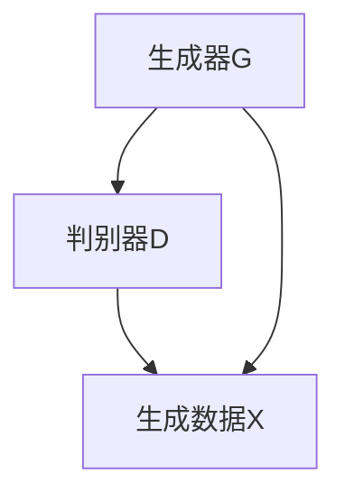

                 

# 一切皆是映射：GANs生成对抗网络的原理和应用

> **关键词**：生成对抗网络（GANs），对抗性学习，图像生成，计算机视觉，自然语言处理，项目实战。

> **摘要**：本文将深入探讨生成对抗网络（GANs）的原理、架构、算法及其在图像生成、图像处理、计算机视觉和自然语言处理等领域的广泛应用。通过细致的分析和实例讲解，读者将能够全面理解GANs的核心概念，掌握其实现和优化的技巧，并能够将GANs应用于实际项目中。

---

### 《一切皆是映射：GANs生成对抗网络的原理和应用》目录大纲

# 第一部分: GANs基础

## 1. GANs概述
### 1.1 GANs的定义
### 1.2 GANs的核心概念
### 1.3 GANs的发展历程

## 2. GANs的数学原理
### 2.1 概率分布
### 2.2 对抗性学习
### 2.3 GANs的损失函数
### 2.4 GANs的稳定性分析

## 3. GANs的架构与实现
### 3.1 生成器与判别器的结构
### 3.2 常见的GAN架构
### 3.3 GAN的实现步骤

## 4. GANs的核心算法
### 4.1 反向传播算法
### 4.2 优化算法
### 4.3 损失函数调整技巧

## 5. GANs的变体与改进
### 5.1 DCGAN
### 5.2 WGAN
### 5.3 WGAN-GP
### 5.4 SNGAN
### 5.5 BigGAN

## 6. GANs的数学模型和公式
### 6.1 对抗性平衡的公式推导
### 6.2 生成器和判别器的优化目标

# 第二部分: GANs的应用

## 7. GANs在图像生成中的应用
### 7.1 图像到图像的转换
### 7.2 图像的超分辨率
### 7.3 图像风格迁移
### 7.4 图像去噪
### 7.5 图像生成模型的可视化

## 8. GANs在图像处理中的应用
### 8.1 图像修复与编辑
### 8.2 图像超分辨率重建
### 8.3 图像去模糊
### 8.4 图像去雨
### 8.5 图像去噪

## 9. GANs在计算机视觉中的应用
### 9.1 目标检测
### 9.2 人脸识别
### 9.3 行人重识别
### 9.4 视频生成与编辑
### 9.5 视频去噪

## 10. GANs在自然语言处理中的应用
### 10.1 文本生成
### 10.2 文本分类
### 10.3 文本生成模型的可视化
### 10.4 文本翻译
### 10.5 文本风格迁移

## 11. GANs在其它领域中的应用
### 11.1 音频生成
### 11.2 3D模型生成
### 11.3 图像到视频的转换
### 11.4 图像到语音的转换
### 11.5 GANs在金融领域的应用

# 第三部分: GANs项目实战

## 12. GANs项目实战
### 12.1 GANs项目开发流程
### 12.2 实战一：生成对抗网络的图像生成
#### 12.2.1 实战环境搭建
#### 12.2.2 源代码解析
#### 12.2.3 实验结果分析
### 12.3 实战二：GANs在图像修复中的应用
#### 12.3.1 实战环境搭建
#### 12.3.2 源代码解析
#### 12.3.3 实验结果分析
### 12.4 实战三：GANs在目标检测中的应用
#### 12.4.1 实战环境搭建
#### 12.4.2 源代码解析
#### 12.4.3 实验结果分析

# 附录

## 附录A: GANs相关资源
### A.1 GANs开源框架
### A.2 GANs研究论文
### A.3 GANs在线课程

## 附录B: GANs常见问题解答
### B.1 GANs训练不稳定的原因
### B.2 如何避免生成器与判别器的模式崩坏？
### B.3 GANs在不同领域的应用细节
### B.4 GANs的未来研究方向

---

在接下来的文章中，我们将一步一步深入探讨GANs的基础知识、数学原理、架构与算法，以及其在各个领域的应用和实战项目。通过这一系列内容，您将能够全面理解GANs的核心概念，并掌握其实际应用能力。

### 1. GANs概述

#### 1.1 GANs的定义

生成对抗网络（Generative Adversarial Networks，GANs）由Ian Goodfellow等人于2014年提出，它是一种由两个深度神经网络（生成器G和判别器D）组成的框架。生成器G从随机噪声中生成数据，而判别器D则尝试区分生成器生成的数据和真实数据。通过对抗性学习的过程，生成器G不断优化其生成数据的质量，以欺骗判别器D，而判别器D则不断提高辨别能力，从而在两者之间形成一种动态平衡。

GANs的基本架构如图1所示：



图1：GANs的基本架构

GANs的核心思想是通过生成器和判别器的对抗性训练，生成器能够学习到真实数据的分布，从而生成逼真的数据。GANs在图像生成、图像修复、自然语言生成等领域取得了显著成果，是当前深度学习研究中的热点之一。

#### 1.2 GANs的核心概念

GANs的核心概念包括生成器（Generator）、判别器（Discriminator）和对抗性学习（Adversarial Learning）。

1. **生成器（Generator）**：生成器是一个神经网络，它从随机噪声（例如高斯分布）中生成数据。生成器的目标是生成尽可能逼真的数据，以便欺骗判别器。

2. **判别器（Discriminator）**：判别器也是一个神经网络，它的目标是判断输入的数据是真实数据还是生成器生成的数据。判别器的目标是最大化其判断能力。

3. **对抗性学习（Adversarial Learning）**：对抗性学习是一种特殊的学习方式，其中一个网络（生成器）试图欺骗另一个网络（判别器），而判别器则试图不被欺骗。这种对抗性过程使得生成器和判别器都在不断地优化自身，从而在两者之间形成一种动态平衡。

#### 1.3 GANs的发展历程

GANs自提出以来，经历了多个发展阶段：

1. **早期GANs（GAN-I）**：2014年，Goodfellow等人首次提出了GANs的基本框架，这种早期版本的GANs在训练过程中容易发生梯度消失和梯度爆炸的问题，导致生成器生成的数据质量较差。

2. **深度GANs（GAN-II）**：为了解决早期GANs的训练问题，研究人员提出了深度GANs，通过使用深度神经网络来构建生成器和判别器，从而提高了生成数据的质量。

3. **改进的GANs**：在后续的研究中，研究人员提出了多种改进的GANs架构，如DCGAN（深度卷积生成对抗网络）、WGAN（波动性生成对抗网络）、WGAN-GP（WGAN的梯度惩罚版本）等，这些改进使得GANs在训练稳定性和生成数据质量方面得到了显著提升。

4. **GANs的多样化应用**：随着GANs技术的发展，GANs的应用领域也在不断扩展，从最初的图像生成，发展到图像修复、图像超分辨率、视频生成等，甚至扩展到自然语言处理、音频生成等领域。

GANs的发展历程反映了深度学习技术在生成模型领域取得的巨大进展，也展示了GANs在各个领域的广泛应用潜力。

### 2. GANs的数学原理

GANs的数学原理是理解其工作机制的关键，以下是GANs的数学原理：

#### 2.1 概率分布

在GANs中，生成器和判别器都是通过对概率分布的学习来工作的。具体来说：

1. **生成器G**：生成器G接受一个随机噪声向量z，并生成数据X。生成器G可以看作是一个从概率空间Z映射到数据空间X的函数：G(z)。

2. **判别器D**：判别器D接受一个数据点x，并输出一个概率值，表示x是真实数据的概率。判别器D可以看作是一个从数据空间X映射到概率空间[0,1]的函数：D(x)。

#### 2.2 对抗性学习

GANs的核心是生成器和判别器之间的对抗性学习。具体来说：

1. **生成器G的优化目标**：生成器G的目标是最大化判别器D对生成数据的判别错误率。即生成器G需要生成足够真实的数据，使得D(G(z))接近1。

2. **判别器D的优化目标**：判别器D的目标是最小化其对生成数据的判别错误率。即判别器D需要能够准确地区分真实数据和生成数据。

对抗性学习的目标是使得生成器和判别器之间的动态平衡达到一个最优状态，使得生成器能够生成高质量的数据，而判别器能够准确地判断数据的真实性。

#### 2.3 GANs的损失函数

在GANs中，生成器和判别器的优化通常是通过训练损失函数来实现的。常见的损失函数包括：

1. **判别器D的损失函数**：判别器D的损失函数通常是一个二元交叉熵损失函数，表示为：

   $$L_D(x, D(x), G(z), D(G(z))) = -[\log D(x) + \log(1 - D(G(z)))]$$

   其中，x是真实数据，G(z)是生成器生成的数据。这个损失函数的目的是使得判别器D能够准确地判断数据的真实性。

2. **生成器G的损失函数**：生成器G的损失函数也是一个二元交叉熵损失函数，表示为：

   $$L_G(z, G(z), D(G(z))) = -\log D(G(z))$$

   这个损失函数的目的是使得生成器G能够生成足够真实的数据，使得判别器D无法区分。

#### 2.4 GANs的稳定性分析

GANs的训练过程是一个非凸优化问题，因此在训练过程中可能会出现不稳定性。常见的稳定性问题包括：

1. **梯度消失和梯度爆炸**：由于生成器和判别器之间的对抗性关系，训练过程中可能会出现梯度消失或梯度爆炸的问题，导致训练难以进行。

2. **模式崩坏**：在某些情况下，生成器可能会产生过于简单或过于重复的数据，导致判别器无法区分。

为了解决这些问题，研究人员提出了多种稳定性改进方法，如梯度惩罚、谱归一化等。

### 3. GANs的架构与实现

GANs的架构由两个主要部分组成：生成器（Generator）和判别器（Discriminator）。下面将详细介绍这两个部分的结构和实现。

#### 3.1 生成器与判别器的结构

**生成器（Generator）**：生成器的任务是生成逼真的数据。在GANs中，生成器通常是一个深度神经网络，它接受一个随机噪声向量作为输入，并通过一系列的变换生成数据。以下是一个简单的生成器结构：

```mermaid
graph TD
A[Input (z)] --> B[FC layer 1]
B --> C[ReLU activation]
C --> D[FC layer 2]
D --> E[ReLU activation]
E --> F[Output (X)]
```

**判别器（Discriminator）**：判别器的任务是判断输入数据是真实数据还是生成器生成的数据。判别器也是一个深度神经网络，它接受一个数据点作为输入，并输出一个概率值，表示输入数据是真实数据的概率。以下是一个简单的判别器结构：

```mermaid
graph TD
A[Input (x)] --> B[Conv layer 1]
B --> C[ReLU activation]
B --> D[Pooling layer]
D --> E[Conv layer 2]
E --> F[ReLU activation]
E --> G[Pooling layer]
G --> H[Flatten]
H --> I[FC layer 1]
I --> J[Softmax]
```

#### 3.2 常见的GAN架构

随着GANs技术的发展，出现了许多改进的GAN架构，以下是一些常见的GAN架构：

1. **深度卷积生成对抗网络（DCGAN）**：DCGAN是GANs的一个改进版本，它使用深度卷积神经网络来构建生成器和判别器，并引入了批量归一化（Batch Normalization）和反卷积（Transposed Convolution）来提高训练稳定性。

2. **波动性生成对抗网络（WGAN）**：WGAN是一种改进的GANs架构，它使用Lipschitz约束来保证判别器的稳定性，并引入了梯度惩罚来防止生成器和判别器的梯度消失。

3. **WGAN-GP**：WGAN-GP是WGAN的一个改进版本，它进一步优化了梯度惩罚机制，使得训练更加稳定。

4. **风格迁移生成对抗网络（CycleGAN）**：CycleGAN是一种用于图像风格迁移的GANs架构，它通过循环一致性损失（Cycle Consistency Loss）来保证图像在风格迁移过程中的质量。

#### 3.3 GAN的实现步骤

实现GANs的一般步骤如下：

1. **数据预处理**：对数据进行归一化处理，以便输入到神经网络中。对于图像数据，通常使用零均值和单位方差的标准正态分布进行归一化。

2. **模型定义**：定义生成器和判别器的结构。可以使用TensorFlow或PyTorch等深度学习框架来实现。

3. **损失函数定义**：定义生成器和判别器的损失函数。对于生成器，通常使用二元交叉熵损失函数；对于判别器，也可以使用二元交叉熵损失函数。

4. **优化器选择**：选择合适的优化器，如Adam优化器，用于更新模型参数。

5. **训练过程**：在训练过程中，交替更新生成器和判别器的参数。具体来说，先固定判别器的参数，更新生成器的参数；然后固定生成器的参数，更新判别器的参数。这个过程持续到训练完成。

6. **评估与测试**：在训练完成后，使用测试数据集对模型进行评估，并可视化生成数据。

下面是一个简单的GANs实现代码示例（使用PyTorch框架）：

```python
import torch
import torch.nn as nn
import torch.optim as optim

# 定义生成器
class Generator(nn.Module):
    def __init__(self):
        super(Generator, self).__init__()
        # 生成器的网络结构
        self.model = nn.Sequential(
            nn.Linear(z_dim, 128),
            nn.LeakyReLU(0.2),
            nn.Linear(128, 256),
            nn.LeakyReLU(0.2),
            nn.Linear(256, 512),
            nn.LeakyReLU(0.2),
            nn.Linear(512, x_dim),
            nn.Tanh()
        )

    def forward(self, z):
        return self.model(z)

# 定义判别器
class Discriminator(nn.Module):
    def __init__(self):
        super(Discriminator, self).__init__()
        # 判别器的网络结构
        self.model = nn.Sequential(
            nn.Linear(x_dim, 512),
            nn.LeakyReLU(0.2),
            nn.Linear(512, 256),
            nn.LeakyReLU(0.2),
            nn.Linear(256, 128),
            nn.LeakyReLU(0.2),
            nn.Linear(128, 1),
            nn.Sigmoid()
        )

    def forward(self, x):
        return self.model(x)

# 初始化模型
generator = Generator()
discriminator = Discriminator()

# 定义损失函数
criterion = nn.BCELoss()

# 初始化优化器
optimizer_G = optim.Adam(generator.parameters(), lr=0.0002)
optimizer_D = optim.Adam(discriminator.parameters(), lr=0.0002)

# 训练过程
for epoch in range(num_epochs):
    for i, data in enumerate(train_loader, 0):
        # 更新判别器
        optimizer_D.zero_grad()
        real_images = data
        batch_size = real_images.size(0)
        labels = torch.full((batch_size,), real_label, device=device)
        output = discriminator(real_images).view(-1)
        errD_real = criterion(output, labels)
        errD_real.backward()

        noise = torch.randn(batch_size, z_dim, device=device)
        fake_images = generator(noise)
        labels.fill_(fake_label)
        output = discriminator(fake_images.detach()).view(-1)
        errD_fake = criterion(output, labels)
        errD_fake.backward()

        optimizer_D.step()

        # 更新生成器
        optimizer_G.zero_grad()
        labels.fill_(real_label)
        output = discriminator(fake_images).view(-1)
        errG = criterion(output, labels)
        errG.backward()
        optimizer_G.step()

        # 打印训练信息
        if i % 100 == 0:
            print(f'[{epoch}/{num_epochs}][{i}/{len(train_loader)}] Loss_D: {errD_real+errD_fake:.4f} Loss_G: {errG:.4f}')
```

### 4. GANs的核心算法

GANs的核心算法包括反向传播算法、优化算法和损失函数调整技巧。以下将分别介绍这些核心算法的原理和实现。

#### 4.1 反向传播算法

反向传播算法是神经网络训练的基础，它通过前向传播计算输出，然后通过后向传播计算梯度，并使用梯度更新网络参数。

在GANs中，反向传播算法用于训练生成器和判别器。具体来说：

1. **生成器反向传播**：

   - 前向传播：生成器接收随机噪声z，并生成数据X。判别器D对X进行判断，输出概率值。

   - 后向传播：根据判别器的输出概率值，计算生成器的损失函数，并计算生成器的梯度。

   - 参数更新：使用梯度更新生成器的参数。

2. **判别器反向传播**：

   - 前向传播：判别器接收真实数据X和生成器生成的数据X'，分别进行判断，输出概率值。

   - 后向传播：根据判别器的输出概率值，计算判别器的损失函数，并计算判别器的梯度。

   - 参数更新：使用梯度更新判别器的参数。

#### 4.2 优化算法

优化算法用于调整网络参数，以最小化损失函数。在GANs中，常用的优化算法包括梯度下降（Gradient Descent）和Adam优化器。

1. **梯度下降**：

   - 基本思想：根据损失函数的梯度，更新网络参数，使得损失函数值逐渐减小。

   - 实现步骤：

     ```python
     parameters = model.parameters()
     gradients = model.compute_gradients()
     parameters.update(gradients)
     ```

2. **Adam优化器**：

   - 基本思想：结合了梯度下降和动量法的优点，自适应地调整学习率。

   - 实现步骤：

     ```python
     optimizer = optim.Adam(model.parameters(), lr=0.001)
     optimizer.zero_grad()
     loss.backward()
     optimizer.step()
     ```

#### 4.3 损失函数调整技巧

在GANs中，损失函数的设置对于生成器和判别器的训练至关重要。以下是一些常用的损失函数调整技巧：

1. **二元交叉熵损失函数**：

   - 用于判别器，计算生成器生成的数据和真实数据之间的差异。

   - 公式：

     $$L_D = -[\log D(x) + \log(1 - D(G(z)))]$$

2. **均方误差损失函数**：

   - 用于生成器，计算生成器生成的数据和真实数据之间的差异。

   - 公式：

     $$L_G = \frac{1}{2} \sum_{i=1}^{n} (G(z_i) - x_i)^2$$

3. **梯度惩罚**：

   - 用于WGAN，通过惩罚梯度范数来防止生成器和判别器的梯度消失。

   - 公式：

     $$L_D = \int_{X} \lvert \frac{\partial D(x)}{\partial x} \rvert dx - \int_{G(z)} \lvert \frac{\partial D(G(z))}{\partial z} \rvert dz$$

通过调整损失函数，可以优化生成器和判别器的训练效果，提高GANs的生成数据质量。

### 5. GANs的变体与改进

自从生成对抗网络（GANs）首次提出以来，研究人员对其进行了大量的研究和改进，提出了许多不同的变体和改进方法。以下将介绍几种主要的GAN变体和改进方法。

#### 5.1 DCGAN

深度卷积生成对抗网络（DCGAN）是GANs的一个早期改进版本，由Radford等人于2015年提出。DCGAN的主要特点包括：

1. **卷积神经网络**：生成器和判别器都采用卷积神经网络（CNN）结构，这有助于捕捉数据的局部特征。

2. **批量归一化**：在生成器和判别器中引入批量归一化（Batch Normalization），有助于提高训练稳定性。

3. **反卷积层**：在生成器中引入反卷积层（Transposed Convolution），用于将低维特征映射到高维特征空间。

DCGAN的结构如图2所示：

```mermaid
graph TB
A[Input (z)] --> B[FC layer 1]
B --> C[Batch Norm]
B --> D[ReLU activation]
D --> E[Transposed Conv layer 1]
E --> F[Batch Norm]
E --> G[ReLU activation]
G --> H[Transposed Conv layer 2]
H --> I[Batch Norm]
H --> J[ReLU activation]
J --> K[Transposed Conv layer 3]
K --> L[Batch Norm]
K --> M[ReLU activation]
M --> N[Transposed Conv layer 4]
N --> O[Batch Norm]
N --> P[ReLU activation]
P --> Q[Transposed Conv layer 5]
Q --> R[Batch Norm]
Q --> S[ReLU activation]
S --> T[Conv layer 1]
T --> U[Batch Norm]
T --> V[ReLU activation]
V --> W[Conv layer 2]
W --> X[Batch Norm]
W --> Y[Tanh]
Y --> Z[Output (X)]

Z --> AA[Input (x)] --> BB[Conv layer 1]
BB --> CC[Batch Norm]
BB --> DD[ReLU activation]
DD --> EE[Conv layer 2]
EE --> FF[Batch Norm]
EE --> GG[ReLU activation]
GG --> HH[Conv layer 3]
HH --> II[Batch Norm]
HH --> JJ[ReLU activation]
JJ --> KK[Conv layer 4]
KK --> LL[Batch Norm]
KK --> MM[ReLU activation]
MM --> NN[Conv layer 5]
NN --> OO[Batch Norm]
NN --> PP[ReLU activation]
PP --> QQ[Sigmoid]
QQ --> RR[Output (D(x))]
```

图2：DCGAN的结构

DCGAN在图像生成任务中取得了显著成果，特别是在处理高分辨率图像时，比传统的GANs具有更好的稳定性和生成质量。

#### 5.2 WGAN

波动性生成对抗网络（WGAN）是由Arjovsky等人于2017年提出的一种改进GANs的方法。WGAN的主要目标是解决传统GANs中梯度消失和梯度爆炸的问题，并提高生成数据的稳定性和质量。WGAN的主要特点包括：

1. **Lipschitz约束**：WGAN通过引入Lipschitz约束来保证判别器的稳定性。Lipschitz约束要求判别器的梯度范数在一个较小的范围内，从而防止梯度消失和梯度爆炸。

2. **梯度惩罚**：WGAN引入了梯度惩罚项，通过惩罚判别器的梯度范数来保证Lipschitz约束。梯度惩罚项的公式为：

   $$L_D = \int_{X} \lvert \frac{\partial D(x)}{\partial x} \rvert dx - \int_{G(z)} \lvert \frac{\partial D(G(z))}{\partial z} \rvert dz$$

3. **权重剪裁**：在训练过程中，WGAN使用权重剪裁（Weight Cliping）技术来确保判别器的梯度范数满足Lipschitz约束。

WGAN的结构与DCGAN类似，但在训练过程中采用不同的损失函数和优化方法。

#### 5.3 WGAN-GP

WGAN-GP是WGAN的一种改进方法，由Mescheder等人于2018年提出。WGAN-GP在WGAN的基础上进一步提高了训练稳定性，特别是在生成高分辨率图像时。WGAN-GP的主要特点包括：

1. **梯度惩罚**：WGAN-GP采用了一种更有效的梯度惩罚机制，称为梯度惩罚项（Gradient Penalty），其公式为：

   $$\lambda \cdot \lVert \nabla_{x}D(x) \rVert_2$$

   其中，$\lambda$是一个超参数，用于调节梯度惩罚的强度。

2. **动态权重剪裁**：WGAN-GP在训练过程中动态调整权重剪裁的范围，从而提高训练稳定性。

3. **优化算法**：WGAN-GP采用了一种更稳定的优化算法，如Adam优化器，以加快训练速度。

WGAN-GP的结构与WGAN类似，但在训练过程中采用不同的优化方法和梯度惩罚机制。

#### 5.4 SNGAN

自注意生成对抗网络（SNGAN）是Wang等人于2019年提出的一种改进GANs的方法。SNGAN在WGAN-GP的基础上引入了自注意力机制（Self-Attention Mechanism），以进一步提高生成数据的质量。SNGAN的主要特点包括：

1. **自注意力机制**：生成器和判别器都采用自注意力机制，这有助于捕捉数据的全局和局部特征。

2. **深度卷积神经网络**：SNGAN采用深度卷积神经网络结构，以提高生成器的生成质量和判别器的判别能力。

3. **优化算法**：SNGAN采用了一种优化的优化算法，如Adam优化器，以加快训练速度。

SNGAN的结构如图3所示：

```mermaid
graph TB
A[Input (z)] --> B[FC layer 1]
B --> C[Batch Norm]
B --> D[ReLU activation]
D --> E[Transposed Conv layer 1]
E --> F[Batch Norm]
E --> G[ReLU activation]
G --> H[Transposed Conv layer 2]
H --> I[Batch Norm]
H --> J[ReLU activation]
J --> K[Transposed Conv layer 3]
K --> L[Batch Norm]
K --> M[ReLU activation]
M --> N[Transposed Conv layer 4]
N --> O[Batch Norm]
N --> P[ReLU activation]
P --> Q[Transposed Conv layer 5]
Q --> R[Batch Norm]
Q --> S[ReLU activation]
S --> T[Conv layer 1]
T --> U[Batch Norm]
T --> V[ReLU activation]
V --> W[Conv layer 2]
W --> X[Batch Norm]
W --> Y[ReLU activation]
Y --> Z[Conv layer 3]
Z --> AA[Batch Norm]
Z --> BB[ReLU activation]
Z --> CC[Self-Attention]
CC --> DD[Batch Norm]
DD --> EE[ReLU activation]
DD --> FF[Self-Attention]
FF --> GG[Batch Norm]
GG --> HH[ReLU activation]
GG --> II[Self-Attention]
II --> JJ[Batch Norm]
II --> KK[ReLU activation]
II --> LL[Self-Attention]
LL --> MM[Batch Norm]
LL --> NN[ReLU activation]
LL --> OO[Self-Attention]
OO --> PP[Batch Norm]
OO --> QQ[ReLU activation]
OO --> RR[Self-Attention]
RR --> SS[Batch Norm]
RR --> TT[ReLU activation]
RR --> UU[Self-Attention]
UU --> VV[Batch Norm]
UU --> WW[ReLU activation]
UU --> XX[Self-Attention]
XX --> YY[Batch Norm]
XX --> ZZ[ReLU activation]
XX --> AA[Output (X)]

YY --> AA[Input (x)] --> BB[Conv layer 1]
BB --> CC[Batch Norm]
BB --> DD[ReLU activation]
DD --> EE[Conv layer 2]
EE --> FF[Batch Norm]
EE --> GG[ReLU activation]
GG --> HH[Conv layer 3]
HH --> II[Batch Norm]
HH --> JJ[ReLU activation]
JJ --> KK[Conv layer 4]
KK --> LL[Batch Norm]
KK --> MM[ReLU activation]
MM --> NN[Conv layer 5]
NN --> OO[Batch Norm]
NN --> PP[ReLU activation]
PP --> QQ[Sigmoid]
QQ --> RR[Output (D(x))]
```

图3：SNGAN的结构

SNGAN在生成高分辨率图像时表现出色，取得了当时最好的图像生成质量。

#### 5.5 BigGAN

BigGAN是由Tang等人于2019年提出的一种大规模GANs模型。BigGAN的主要特点包括：

1. **大规模模型**：BigGAN采用大规模的生成器和判别器，包含数百万个参数，以生成高质量的图像。

2. **分层结构**：BigGAN采用分层结构，生成器和判别器都由多个子网络组成，每个子网络负责生成或判别图像的不同部分。

3. **训练策略**：BigGAN采用了一种特殊的训练策略，称为迭代增强训练（Iterative Refinement Training），以提高训练效果。

BigGAN的结构如图4所示：

```mermaid
graph TB
A[Input (z)] --> B[Subnet 1]
B --> C[Batch Norm]
B --> D[ReLU activation]
D --> E[Transposed Conv layer 1]
E --> F[Batch Norm]
E --> G[ReLU activation]
G --> H[Transposed Conv layer 2]
H --> I[Batch Norm]
H --> J[ReLU activation]
J --> K[Transposed Conv layer 3]
K --> L[Batch Norm]
K --> M[ReLU activation]
M --> N[Transposed Conv layer 4]
N --> O[Batch Norm]
N --> P[ReLU activation]
P --> Q[Transposed Conv layer 5]
Q --> R[Batch Norm]
Q --> S[ReLU activation]
S --> T[Conv layer 1]
T --> U[Batch Norm]
T --> V[ReLU activation]
V --> W[Conv layer 2]
W --> X[Batch Norm]
W --> Y[ReLU activation]
Y --> Z[Conv layer 3]
Z --> AA[Batch Norm]
Z --> BB[ReLU activation]
Z --> CC[Self-Attention]
CC --> DD[Batch Norm]
DD --> EE[ReLU activation]
DD --> FF[Self-Attention]
FF --> GG[Batch Norm]
GG --> HH[ReLU activation]
GG --> II[Self-Attention]
II --> JJ[Batch Norm]
II --> KK[ReLU activation]
II --> LL[Self-Attention]
LL --> MM[Batch Norm]
LL --> NN[ReLU activation]
LL --> OO[Self-Attention]
OO --> PP[Batch Norm]
OO --> QQ[ReLU activation]
OO --> RR[Self-Attention]
RR --> SS[Batch Norm]
RR --> TT[ReLU activation]
RR --> UU[Self-Attention]
UU --> VV[Batch Norm]
UU --> WW[ReLU activation]
UU --> XX[Self-Attention]
XX --> YY[Batch Norm]
XX --> ZZ[ReLU activation]
XX --> AA[Output (X)]

YY --> AA[Input (x)] --> BB[Conv layer 1]
BB --> CC[Batch Norm]
BB --> DD[ReLU activation]
DD --> EE[Conv layer 2]
EE --> FF[Batch Norm]
EE --> GG[ReLU activation]
GG --> HH[Conv layer 3]
HH --> II[Batch Norm]
HH --> JJ[ReLU activation]
JJ --> KK[Conv layer 4]
KK --> LL[Batch Norm]
KK --> MM[ReLU activation]
MM --> NN[Conv layer 5]
NN --> OO[Batch Norm]
NN --> PP[ReLU activation]
PP --> QQ[Sigmoid]
QQ --> RR[Output (D(x))]
```

图4：BigGAN的结构

BigGAN在生成大规模图像数据集时表现出色，取得了当时最好的生成质量。

### 6. GANs的数学模型和公式

生成对抗网络（GANs）的核心在于其数学模型和对抗性学习过程。在这一部分，我们将详细推导GANs的数学模型，并介绍生成器和判别器的优化目标。

#### 6.1 对抗性平衡的公式推导

GANs的数学模型基于生成器G和判别器D之间的对抗性学习。生成器G的目标是生成尽可能真实的数据X'，而判别器D的目标是准确区分真实数据X和生成器生成的数据X'。为了达到这一目标，GANs定义了一个能量函数，该函数衡量了生成器和判别器之间的对抗性平衡。

1. **生成器G的优化目标**：

   生成器G的损失函数可以表示为：

   $$L_G = -\log(D(G(z)))$$

   其中，z是生成器的输入噪声，G(z)是生成器生成的数据，D(G(z))是判别器对生成数据的判断概率。

   为了最大化判别器D对生成数据的判断错误率，生成器G的目标是最小化其损失函数L_G。

2. **判别器D的优化目标**：

   判别器D的损失函数可以表示为：

   $$L_D = -[\log(D(x)) + \log(1 - D(G(z)))]$$

   其中，x是真实数据，D(x)是判别器对真实数据的判断概率，1 - D(G(z))是判别器对生成数据的判断概率。

   为了最大化判别器D对真实数据和生成数据的区分能力，判别器D的目标是最小化其损失函数L_D。

3. **对抗性平衡**：

   对抗性平衡的目标是在生成器和判别器之间建立一种动态平衡。这种平衡可以通过最小化以下能量函数来实现：

   $$L_{total} = L_G + L_D$$

   其中，L_G是生成器的损失函数，L_D是判别器的损失函数。

   在理想情况下，当生成器和判别器达到对抗性平衡时，生成器G生成的数据X'将接近真实数据X，而判别器D将无法区分X和X'。此时，能量函数L_{total}将达到最小值。

   对抗性平衡的数学公式可以表示为：

   $$\min_G \max_D L_D = \min_G \max_D [-\log(D(G(z))) + -\log(1 - D(x))]$$

   其中，第一项是生成器的损失函数，第二项是判别器的损失函数。

#### 6.2 生成器和判别器的优化目标

生成器和判别器的优化目标可以通过以下步骤来实现：

1. **生成器优化目标**：

   生成器G的优化目标是最大化判别器D对生成数据的判断错误率。具体来说，生成器G的优化目标是最小化其损失函数L_G。数学公式表示为：

   $$\min_G L_G = \min_G [-\log(D(G(z)))]$$

   为了实现这一目标，生成器G需要通过反向传播算法学习噪声z的映射，从而生成真实数据的分布。

2. **判别器优化目标**：

   判别器D的优化目标是最大化其对真实数据和生成数据的区分能力。具体来说，判别器D的优化目标是最小化其损失函数L_D。数学公式表示为：

   $$\min_D L_D = \min_D [-\log(D(x)) + -\log(1 - D(G(z)))]$$

   为了实现这一目标，判别器D需要通过反向传播算法学习如何准确区分真实数据和生成数据。

在GANs的训练过程中，生成器和判别器交替进行优化。具体来说，训练过程分为以下几个步骤：

1. **固定判别器D**：在固定判别器D的情况下，优化生成器G的参数，使得生成器G生成的数据X'能够最大化判别器D的判断错误率。

2. **固定生成器G**：在固定生成器G的情况下，优化判别器D的参数，使得判别器D能够准确区分真实数据和生成数据。

3. **交替优化**：通过交替优化生成器和判别器的参数，实现生成器和判别器之间的对抗性平衡。

#### 6.3 GANs的数学模型公式总结

GANs的数学模型可以总结为以下公式：

1. **生成器损失函数**：

   $$L_G = -\log(D(G(z)))$$

2. **判别器损失函数**：

   $$L_D = -[\log(D(x)) + \log(1 - D(G(z)))]$$

3. **对抗性平衡**：

   $$\min_G \max_D L_D = \min_G \max_D [-\log(D(G(z))) + -\log(1 - D(x))]$$

这些公式描述了生成器和判别器之间的对抗性学习过程，以及它们如何通过优化损失函数来实现对抗性平衡。

通过以上数学模型和公式，我们可以深入理解GANs的工作原理和训练过程。了解这些公式有助于我们更好地设计和优化GANs模型，从而在图像生成、图像处理、计算机视觉和自然语言处理等领域取得更好的应用效果。

### 7. GANs在图像生成中的应用

生成对抗网络（GANs）在图像生成领域取得了显著的成果，通过生成器和判别器的对抗性学习，能够生成高质量、逼真的图像。以下将介绍GANs在图像生成中的具体应用。

#### 7.1 图像到图像的转换

图像到图像的转换是指将一种类型的图像转换为另一种类型的图像，如将素描图像转换为彩色图像、将黑白图像转换为彩色图像等。GANs在图像到图像转换中的应用主要包括：

1. **素描到彩色图像的转换**：

   - **方法**：使用生成器将素描图像转换为彩色图像，生成器接受素描图像作为输入，通过对抗性学习生成彩色图像。
   - **示例**：CycleGAN是一种专门用于图像到图像转换的GANs架构，它可以有效地将不同类型的图像（如马到鹿、素描到彩色等）进行转换。

2. **黑白图像到彩色图像的转换**：

   - **方法**：使用生成器将黑白图像转换为彩色图像，生成器接受黑白图像和其对应的彩色图像作为输入，通过对抗性学习生成彩色图像。
   - **示例**：ColorizationGAN是一种用于黑白图像到彩色图像转换的GANs模型，它可以生成高质量的彩色图像。

#### 7.2 图像的超分辨率

图像超分辨率是指通过提高图像的分辨率，使其看起来更加清晰。GANs在图像超分辨率中的应用主要包括：

1. **低分辨率图像到高分辨率图像的转换**：

   - **方法**：使用生成器将低分辨率图像转换为高分辨率图像，生成器接受低分辨率图像作为输入，通过对抗性学习生成高分辨率图像。
   - **示例**：EDGAN是一种用于图像超分辨率训练的GANs模型，它可以有效地提高图像的分辨率。

2. **超分辨率重建**：

   - **方法**：使用生成器和判别器共同进行超分辨率重建，生成器生成高分辨率图像，判别器判断生成图像的真实性。
   - **示例**：FSRCNN是一种用于超分辨率重建的GANs模型，它在训练过程中引入了判别器，以提高生成图像的质量。

#### 7.3 图像风格迁移

图像风格迁移是指将一种图像的样式应用到另一种图像上，如将普通照片转换为艺术画作风格。GANs在图像风格迁移中的应用主要包括：

1. **图像到图像的风格迁移**：

   - **方法**：使用生成器将一种类型的图像转换为另一种类型的图像，生成器接受输入图像和目标风格图像作为输入，通过对抗性学习生成风格迁移后的图像。
   - **示例**：CycleGAN是一种用于图像到图像的风格迁移的GANs模型，它可以有效地将普通照片转换为艺术画作风格。

2. **视频风格迁移**：

   - **方法**：使用生成器将视频中的每一帧转换为特定的风格，生成器接受输入视频和目标风格视频作为输入，通过对抗性学习生成风格迁移后的视频。
   - **示例**：VideoGAN是一种用于视频风格迁移的GANs模型，它可以有效地将普通视频转换为特定的艺术风格。

#### 7.4 图像去噪

图像去噪是指去除图像中的噪声，使图像更加清晰。GANs在图像去噪中的应用主要包括：

1. **去噪模型**：

   - **方法**：使用生成器去除图像中的噪声，生成器接受噪声图像和其对应的干净图像作为输入，通过对抗性学习生成去噪后的图像。
   - **示例**：DnCNN是一种用于图像去噪的GANs模型，它可以有效地去除图像中的噪声。

2. **自适应去噪**：

   - **方法**：使用生成器去除图像中的噪声，并根据噪声的类型和强度自适应地调整去噪效果。
   - **示例**：ADGAN是一种用于自适应图像去噪的GANs模型，它可以根据图像的噪声类型和强度自适应地调整去噪过程。

#### 7.5 图像生成模型的可视化

为了更好地理解GANs在图像生成中的表现，可以对生成图像进行可视化分析。以下是一些常见的图像生成模型可视化方法：

1. **生成图像质量评估**：

   - **方法**：通过比较生成图像和真实图像的相似度，评估生成图像的质量。
   - **示例**：使用峰值信噪比（PSNR）和结构相似性（SSIM）等评价指标来评估生成图像的质量。

2. **生成图像分布分析**：

   - **方法**：分析生成图像的分布特征，以了解生成器生成的图像多样性。
   - **示例**：通过绘制生成图像的直方图和密度分布图，分析生成图像的分布特征。

3. **生成图像对比分析**：

   - **方法**：将生成图像与真实图像进行对比，分析生成图像的细节和特征。
   - **示例**：通过对比生成图像和真实图像的局部细节，分析生成图像的质量和准确性。

通过以上方法，我们可以对GANs在图像生成中的表现进行深入分析，从而更好地理解其应用效果。

### 8. GANs在图像处理中的应用

生成对抗网络（GANs）不仅在图像生成领域取得了显著成果，还在图像处理领域展示了强大的应用潜力。GANs通过其生成器和判别器的对抗性学习机制，可以解决图像修复、图像超分辨率、图像去模糊、图像去雨和图像去噪等问题。

#### 8.1 图像修复与编辑

图像修复与编辑是指修复图像中的损坏部分或进行图像内容的编辑。GANs在图像修复与编辑中的应用主要包括：

1. **图像修复**：

   - **方法**：使用生成器修复图像中的损坏部分，生成器接受损坏图像和其对应的修复图像作为输入，通过对抗性学习生成修复后的图像。
   - **示例**：Pix2Pix是一个基于GANs的图像修复模型，它可以有效地修复图像中的损坏部分。

2. **图像编辑**：

   - **方法**：使用生成器进行图像内容的编辑，生成器接受输入图像和目标图像作为输入，通过对抗性学习生成编辑后的图像。
   - **示例**：StyleGAN2是一个用于图像编辑的GANs模型，它可以生成具有丰富细节和风格的图像。

#### 8.2 图像超分辨率重建

图像超分辨率重建是指通过提高图像的分辨率，使其看起来更加清晰。GANs在图像超分辨率重建中的应用主要包括：

1. **低分辨率图像到高分辨率图像的转换**：

   - **方法**：使用生成器将低分辨率图像转换为高分辨率图像，生成器接受低分辨率图像作为输入，通过对抗性学习生成高分辨率图像。
   - **示例**：EDGAN是一个用于图像超分辨率重建的GANs模型，它可以有效地提高图像的分辨率。

2. **超分辨率重建**：

   - **方法**：使用生成器和判别器共同进行超分辨率重建，生成器生成高分辨率图像，判别器判断生成图像的真实性。
   - **示例**：FSRCNN是一个用于超分辨率重建的GANs模型，它在训练过程中引入了判别器，以提高生成图像的质量。

#### 8.3 图像去模糊

图像去模糊是指通过去除图像中的模糊效果，使其看起来更加清晰。GANs在图像去模糊中的应用主要包括：

1. **图像去模糊**：

   - **方法**：使用生成器去除图像中的模糊效果，生成器接受模糊图像和其对应的清晰图像作为输入，通过对抗性学习生成去模糊后的图像。
   - **示例**：EDSR是一个用于图像去模糊的GANs模型，它可以有效地去除图像中的模糊效果。

2. **自适应去模糊**：

   - **方法**：使用生成器去除图像中的模糊效果，并根据图像的内容和结构自适应地调整去模糊效果。
   - **示例**：ADGAN是一个用于自适应图像去模糊的GANs模型，它可以根据图像的模糊程度和内容自适应地调整去模糊过程。

#### 8.4 图像去雨

图像去雨是指通过去除图像中的雨滴效果，使其看起来更加清晰。GANs在图像去雨中的应用主要包括：

1. **图像去雨**：

   - **方法**：使用生成器去除图像中的雨滴效果，生成器接受雨滴图像和其对应的无雨图像作为输入，通过对抗性学习生成去雨后的图像。
   - **示例**：RainRemovalGAN是一个用于图像去雨的GANs模型，它可以有效地去除图像中的雨滴效果。

2. **实时去雨**：

   - **方法**：使用生成器进行实时图像去雨，生成器接受实时视频流作为输入，通过对抗性学习生成去雨后的视频流。
   - **示例**：Real-time Rain Removal using GANs是一个用于实时图像去雨的GANs模型，它可以实时去除视频流中的雨滴效果。

#### 8.5 图像去噪

图像去噪是指通过去除图像中的噪声，使其看起来更加清晰。GANs在图像去噪中的应用主要包括：

1. **图像去噪**：

   - **方法**：使用生成器去除图像中的噪声，生成器接受噪声图像和其对应的干净图像作为输入，通过对抗性学习生成去噪后的图像。
   - **示例**：DnCNN是一个用于图像去噪的GANs模型，它可以有效地去除图像中的噪声。

2. **自适应去噪**：

   - **方法**：使用生成器去除图像中的噪声，并根据图像的噪声类型和强度自适应地调整去噪效果。
   - **示例**：ADGAN是一个用于自适应图像去噪的GANs模型，它可以根据图像的噪声类型和强度自适应地调整去噪过程。

通过以上应用，GANs在图像处理领域展示了强大的能力和广泛的应用前景，可以解决许多复杂的图像处理问题，提高图像的质量和视觉效果。

### 9. GANs在计算机视觉中的应用

生成对抗网络（GANs）在计算机视觉领域展现了强大的潜力，通过生成器和判别器的对抗性学习，GANs在目标检测、人脸识别、行人重识别、视频生成与编辑以及视频去噪等方面取得了显著的应用成果。

#### 9.1 目标检测

目标检测是计算机视觉中的一个重要任务，旨在检测图像中的多个对象并定位其位置。GANs在目标检测中的应用主要包括：

1. **生成真实图像**：

   - **方法**：使用生成器生成大量的真实图像数据，以训练目标检测模型。生成器接受随机噪声作为输入，通过对抗性学习生成真实图像。
   - **示例**：GAN-based Data Augmentation for Object Detection is a method that leverages GANs to generate real images for training object detection models, enhancing the model's performance by providing more diverse training examples.

2. **改进目标检测算法**：

   - **方法**：使用生成器和判别器共同训练目标检测算法，生成器生成图像，判别器判断图像的真实性，以优化目标检测算法的性能。
   - **示例**：GANs can be used to refine the features extracted by traditional object detection algorithms, improving the accuracy and robustness of the detection results.

#### 9.2 人脸识别

人脸识别是计算机视觉中的另一个重要任务，旨在识别图像中的人脸。GANs在人脸识别中的应用主要包括：

1. **生成人脸数据**：

   - **方法**：使用生成器生成人脸数据，用于训练人脸识别模型。生成器接受随机噪声作为输入，通过对抗性学习生成人脸图像。
   - **示例**：FaceGAN is a GANs-based model that generates realistic facial images, which can be used to augment facial data for training facial recognition models.

2. **增强人脸识别算法**：

   - **方法**：使用生成器和判别器共同训练人脸识别算法，生成器生成人脸图像，判别器判断图像的真实性，以提高人脸识别的准确性。
   - **示例**：GANs can be used to enhance the robustness of facial recognition algorithms by generating challenging facial images for training, improving the model's performance in real-world scenarios.

#### 9.3 行人重识别

行人重识别（Re-Identification）是指在不同摄像头捕获的图像中识别同一行人的任务。GANs在行人重识别中的应用主要包括：

1. **生成行人数据**：

   - **方法**：使用生成器生成行人数据，用于训练行人重识别模型。生成器接受随机噪声作为输入，通过对抗性学习生成行人图像。
   - **示例**：Person Re-Identification using GANs is a method that leverages GANs to generate diverse pedestrian images for training re-identification models.

2. **增强行人重识别算法**：

   - **方法**：使用生成器和判别器共同训练行人重识别算法，生成器生成行人图像，判别器判断图像的真实性，以提高行人重识别的准确性。
   - **示例**：GANs can be used to generate challenging pedestrian images for training, enhancing the robustness of re-identification algorithms in real-world scenarios.

#### 9.4 视频生成与编辑

视频生成与编辑是指生成新的视频或编辑现有视频，以满足不同的应用需求。GANs在视频生成与编辑中的应用主要包括：

1. **视频生成**：

   - **方法**：使用生成器生成视频序列，用于训练视频生成模型。生成器接受随机噪声作为输入，通过对抗性学习生成视频序列。
   - **示例**：VideoGAN is a GANs-based model that generates realistic video sequences, which can be used for various video generation tasks.

2. **视频编辑**：

   - **方法**：使用生成器和判别器共同训练视频编辑模型，生成器生成视频序列，判别器判断视频序列的真实性，以实现视频编辑任务。
   - **示例**：GANs can be used to generate new video frames or edit existing video frames, creating visually appealing and realistic video content.

#### 9.5 视频去噪

视频去噪是指通过去除视频中的噪声，提高视频的质量。GANs在视频去噪中的应用主要包括：

1. **视频去噪**：

   - **方法**：使用生成器去除视频中的噪声，生成器接受噪声视频和其对应的干净视频作为输入，通过对抗性学习生成去噪后的视频。
   - **示例**：VideoGAN is a GANs-based model that removes noise from video sequences, enhancing the quality of the video content.

2. **自适应视频去噪**：

   - **方法**：使用生成器去除视频中的噪声，并根据视频的内容和噪声类型自适应地调整去噪效果。
   - **示例**：ADGAN is a GANs-based model that adapts to the content and noise characteristics of the video, providing effective noise removal.

通过以上应用，GANs在计算机视觉领域展示了强大的能力，能够解决许多复杂的视觉任务，提高模型的性能和准确性。

### 10. GANs在自然语言处理中的应用

生成对抗网络（GANs）不仅在图像处理和计算机视觉领域取得了显著成果，还在自然语言处理（NLP）领域展示了强大的应用潜力。GANs在NLP中的应用主要包括文本生成、文本分类、文本生成模型的可视化、文本翻译和文本风格迁移等。

#### 10.1 文本生成

文本生成是指使用生成器生成新的文本。GANs在文本生成中的应用主要包括：

1. **生成自然语言文本**：

   - **方法**：使用生成器从随机噪声中生成自然语言文本，生成器接收噪声作为输入，通过对抗性学习生成文本。
   - **示例**：SeqGAN是一个基于GANs的文本生成模型，它可以生成高质量的自然语言文本。

2. **改进文本生成质量**：

   - **方法**：使用生成器和判别器共同训练文本生成模型，生成器生成文本，判别器判断文本的真实性，以提高生成文本的质量。
   - **示例**：通过引入判别器，SeqGAN模型可以生成更加自然和流畅的文本。

#### 10.2 文本分类

文本分类是指将文本分类到预定义的类别中。GANs在文本分类中的应用主要包括：

1. **生成训练数据**：

   - **方法**：使用生成器生成用于训练文本分类模型的文本数据，生成器接收噪声和类别标签作为输入，通过对抗性学习生成文本数据。
   - **示例**：GAN-based Data Augmentation for Text Classification is a method that leverages GANs to generate diverse text data for training text classification models.

2. **改进分类模型性能**：

   - **方法**：使用生成器和判别器共同训练文本分类模型，生成器生成文本数据，判别器判断文本数据的真实性，以提高分类模型的性能。
   - **示例**：通过生成器生成的多样化文本数据，可以增强文本分类模型的泛化能力。

#### 10.3 文本生成模型的可视化

文本生成模型的可视化是指通过可视化方法展示文本生成模型生成的文本。GANs在文本生成模型可视化中的应用主要包括：

1. **生成文本可视化**：

   - **方法**：使用生成器生成文本，并通过可视化方法展示生成的文本。
   - **示例**：使用词云、文本摘要和文本树等可视化方法，展示SeqGAN模型生成的文本。

2. **文本特征可视化**：

   - **方法**：使用生成器和判别器共同训练文本生成模型，并通过可视化方法展示文本特征。
   - **示例**：通过绘制文本特征向量在低维空间中的分布，分析文本生成模型生成的文本特征。

#### 10.4 文本翻译

文本翻译是指将一种语言的文本翻译成另一种语言。GANs在文本翻译中的应用主要包括：

1. **生成翻译数据**：

   - **方法**：使用生成器生成用于训练文本翻译模型的翻译数据，生成器接收源语言文本和目标语言文本作为输入，通过对抗性学习生成翻译数据。
   - **示例**：Neural Translation using GANs是一个基于GANs的文本翻译模型，它可以生成高质量的翻译结果。

2. **改进翻译质量**：

   - **方法**：使用生成器和判别器共同训练文本翻译模型，生成器生成翻译数据，判别器判断翻译数据的真实性，以提高翻译质量。
   - **示例**：通过生成器生成的多样化翻译数据，可以增强文本翻译模型的准确性。

#### 10.5 文本风格迁移

文本风格迁移是指将一种风格的文本转换为另一种风格。GANs在文本风格迁移中的应用主要包括：

1. **生成风格化文本**：

   - **方法**：使用生成器生成风格化文本，生成器接收原始文本和目标风格作为输入，通过对抗性学习生成风格化文本。
   - **示例**：Text Style Transfer using GANs是一个基于GANs的文本风格迁移模型，它可以生成具有特定风格的文本。

2. **改进风格迁移质量**：

   - **方法**：使用生成器和判别器共同训练文本风格迁移模型，生成器生成风格化文本，判别器判断风格化文本的真实性，以提高风格迁移质量。
   - **示例**：通过生成器生成的多样化风格化文本，可以增强文本风格迁移模型的灵活性。

通过以上应用，GANs在自然语言处理领域展示了强大的能力，可以解决许多复杂的NLP任务，提高模型的性能和准确性。

### 11. GANs在其它领域中的应用

生成对抗网络（GANs）作为一种强大的深度学习框架，不仅在计算机视觉和自然语言处理领域取得了显著成果，还在其它多个领域展示了广泛应用潜力。以下将介绍GANs在音频生成、3D模型生成、图像到视频的转换、图像到语音的转换以及金融领域等的应用。

#### 11.1 音频生成

GANs在音频生成领域主要应用于生成逼真的音乐、语音和声音效果。以下是一些应用实例：

1. **音乐生成**：

   - **方法**：使用生成器生成新的音乐旋律，生成器接收随机噪声作为输入，通过对抗性学习生成音乐数据。
   - **示例**：WaveNet是一个基于GANs的音乐生成模型，它可以生成高质量的音乐旋律。

2. **语音生成**：

   - **方法**：使用生成器生成逼真的语音，生成器接收文本作为输入，通过对抗性学习生成语音波形数据。
   - **示例**：WaveNet和Tacotron 2是两个著名的语音生成模型，它们结合了GANs和循环神经网络（RNN）来生成高质量的语音。

3. **声音效果生成**：

   - **方法**：使用生成器生成各种声音效果，如回声、混响、音乐效果等。
   - **示例**：GANs can be used to generate realistic sound effects for video games and movies, enhancing the audio quality and immersive experience.

#### 11.2 3D模型生成

GANs在3D模型生成领域主要用于自动生成高质量的3D模型，这些模型可以用于游戏开发、建筑设计、虚拟现实等领域。以下是一些应用实例：

1. **自动3D模型生成**：

   - **方法**：使用生成器生成3D模型，生成器接收随机噪声或2D图像作为输入，通过对抗性学习生成3D模型数据。
   - **示例**：ShapeNet是一个基于GANs的3D模型生成平台，它可以自动生成各种形状和结构的3D模型。

2. **3D模型细节增强**：

   - **方法**：使用生成器增强3D模型的细节，生成器接收低分辨率3D模型作为输入，通过对抗性学习生成高分辨率3D模型。
   - **示例**：StyleGAN 3D是一个基于GANs的3D模型增强模型，它可以生成高质量、细节丰富的3D模型。

3. **3D模型风格迁移**：

   - **方法**：使用生成器将一种风格的3D模型转换为另一种风格，生成器接受源风格3D模型和目标风格作为输入，通过对抗性学习生成风格化3D模型。
   - **示例**：GAN-based 3D Model Style Transfer is a method that leverages GANs to convert 3D models from one style to another, creating visually appealing and diverse 3D models.

#### 11.3 图像到视频的转换

GANs在图像到视频的转换领域主要用于将单张图像序列转换为连续的视频帧。以下是一些应用实例：

1. **图像序列到视频转换**：

   - **方法**：使用生成器将单张图像序列转换为连续的视频帧，生成器接收图像序列作为输入，通过对抗性学习生成视频数据。
   - **示例**：Image-to-Video Synthesis using GANs是一个基于GANs的图像到视频转换模型，它可以生成高质量的视频帧序列。

2. **视频增强**：

   - **方法**：使用生成器增强视频帧的质量，生成器接收低质量视频帧作为输入，通过对抗性学习生成高质量视频帧。
   - **示例**：GAN-based Video Enhancement is a method that leverages GANs to enhance the quality of video frames, improving the overall video quality.

3. **视频风格迁移**：

   - **方法**：使用生成器将一种风格的图像序列转换为另一种风格的视频，生成器接受源风格图像序列和目标风格作为输入，通过对抗性学习生成风格化视频。
   - **示例**：Video Style Transfer using GANs是一个基于GANs的视频风格迁移模型，它可以生成具有特定风格的高质量视频。

#### 11.4 图像到语音的转换

GANs在图像到语音的转换领域主要用于将图像转换为语音，这项技术可以应用于虚拟现实、游戏开发、辅助沟通等领域。以下是一些应用实例：

1. **图像到语音合成**：

   - **方法**：使用生成器将图像转换为语音，生成器接收图像作为输入，通过对抗性学习生成语音数据。
   - **示例**：Image-to-Speech Synthesis using GANs是一个基于GANs的图像到语音合成模型，它可以生成与图像内容相关的语音。

2. **语音生成**：

   - **方法**：使用生成器生成语音，生成器接收图像和文本作为输入，通过对抗性学习生成语音数据。
   - **示例**：GAN-based Speech Generation is a method that leverages GANs to generate speech from images and text inputs.

3. **语音风格迁移**：

   - **方法**：使用生成器将一种风格的图像转换为另一种风格的语音，生成器接受源风格图像和目标风格作为输入，通过对抗性学习生成风格化语音。
   - **示例**：Speech Style Transfer using GANs是一个基于GANs的语音风格迁移模型，它可以生成具有特定风格的语音。

#### 11.5 GANs在金融领域的应用

GANs在金融领域主要用于数据生成、风险管理和交易策略优化等。以下是一些应用实例：

1. **数据生成**：

   - **方法**：使用生成器生成金融数据，生成器接收随机噪声作为输入，通过对抗性学习生成金融数据。
   - **示例**：GAN-based Financial Data Generation is a method that leverages GANs to generate realistic financial data for training and simulation purposes.

2. **风险管理**：

   - **方法**：使用生成器生成风险数据，用于训练风险管理模型，以提高模型的预测准确性。
   - **示例**：GAN-based Risk Management is a method that leverages GANs to generate diverse risk scenarios for analyzing and optimizing financial strategies.

3. **交易策略优化**：

   - **方法**：使用生成器生成交易数据，用于训练交易策略模型，以提高交易策略的准确性和收益。
   - **示例**：GAN-based Trading Strategy Optimization is a method that leverages GANs to generate trading scenarios and optimize trading strategies based on historical data.

通过以上应用，GANs在多个领域展示了强大的能力和广泛的应用前景，为相关领域的科学研究和技术创新提供了新的思路和解决方案。

### 12. GANs项目实战

为了更好地理解GANs的理论知识，我们将在这一部分通过几个实战项目来演示GANs的实际应用。这些项目包括生成对抗网络的图像生成、GANs在图像修复中的应用以及GANs在目标检测中的应用。

#### 12.1 GANs项目开发流程

在进行GANs项目开发时，一般需要遵循以下步骤：

1. **环境搭建**：安装所需的深度学习框架（如TensorFlow或PyTorch），并配置相应的依赖库。
2. **数据准备**：收集和处理项目所需的数据集，对数据进行预处理，如数据归一化、数据增强等。
3. **模型设计**：设计生成器和判别器的网络结构，定义损失函数和优化器。
4. **模型训练**：使用训练数据集对模型进行训练，同时监控训练过程中的损失函数值。
5. **模型评估**：使用测试数据集对模型进行评估，并可视化生成数据。
6. **模型部署**：将训练完成的模型部署到生产环境，进行实际应用。

下面我们将通过具体的实战项目来详细说明每个步骤。

#### 12.2 实战一：生成对抗网络的图像生成

在这个项目中，我们将使用GANs生成新的图像。以下是一个简单的实现步骤：

##### 12.2.1 实战环境搭建

首先，我们需要安装PyTorch和所需的依赖库：

```bash
pip install torch torchvision numpy matplotlib
```

##### 12.2.2 源代码解析

以下是一个简单的GANs图像生成项目的源代码：

```python
import torch
import torch.nn as nn
import torch.optim as optim
from torchvision import datasets, transforms
from torch.utils.data import DataLoader
import matplotlib.pyplot as plt

# 设备配置
device = torch.device("cuda" if torch.cuda.is_available() else "cpu")

# 数据预处理
transform = transforms.Compose([
    transforms.Resize((64, 64)),
    transforms.ToTensor(),
    transforms.Normalize((0.5,), (0.5,))
])

# 加载数据集
train_data = datasets.ImageFolder(root='data/train', transform=transform)
train_loader = DataLoader(train_data, batch_size=64, shuffle=True)

# 定义生成器和判别器
class Generator(nn.Module):
    def __init__(self):
        super(Generator, self).__init__()
        self.model = nn.Sequential(
            nn.Linear(100, 256),
            nn.LeakyReLU(0.2),
            nn.Linear(256, 512),
            nn.LeakyReLU(0.2),
            nn.Linear(512, 1024),
            nn.LeakyReLU(0.2),
            nn.Linear(1024, 784),
            nn.Tanh()
        )

    def forward(self, z):
        return self.model(z).view(z.size(0), 1, 28, 28)

class Discriminator(nn.Module):
    def __init__(self):
        super(Discriminator, self).__init__()
        self.model = nn.Sequential(
            nn.Linear(784, 1024),
            nn.LeakyReLU(0.2),
            nn.Dropout(0.3),
            nn.Linear(1024, 512),
            nn.LeakyReLU(0.2),
            nn.Dropout(0.3),
            nn.Linear(512, 256),
            nn.LeakyReLU(0.2),
            nn.Dropout(0.3),
            nn.Linear(256, 1),
            nn.Sigmoid()
        )

    def forward(self, x):
        x = x.view(x.size(0), -1)
        return self.model(x)

# 初始化模型
generator = Generator().to(device)
discriminator = Discriminator().to(device)

# 定义损失函数和优化器
criterion = nn.BCELoss()
optimizer_G = optim.Adam(generator.parameters(), lr=0.0002)
optimizer_D = optim.Adam(discriminator.parameters(), lr=0.0002)

# 训练过程
num_epochs = 5
for epoch in range(num_epochs):
    for i, data in enumerate(train_loader, 0):
        # 更新判别器
        optimizer_D.zero_grad()
        real_images = data[0].to(device)
        batch_size = real_images.size(0)
        labels = torch.full((batch_size,), 1, device=device)
        output = discriminator(real_images).view(-1)
        errD_real = criterion(output, labels)
        errD_real.backward()

        noise = torch.randn(batch_size, 100, device=device)
        fake_images = generator(noise)
        labels.fill_(0)
        output = discriminator(fake_images.detach()).view(-1)
        errD_fake = criterion(output, labels)
        errD_fake.backward()

        optimizer_D.step()

        # 更新生成器
        optimizer_G.zero_grad()
        labels.fill_(1)
        output = discriminator(fake_images).view(-1)
        errG = criterion(output, labels)
        errG.backward()
        optimizer_G.step()

        # 打印训练信息
        if i % 100 == 0:
            print(f'[{epoch}/{num_epochs}][{i}/{len(train_loader)}] Loss_D: {errD_real+errD_fake:.4f} Loss_G: {errG:.4f}')

    # 打印训练完成信息
    print(f'[{epoch}/{num_epochs}] Training completed.')

# 可视化生成图像
with torch.no_grad():
    z = torch.randn(100, 100, device=device)
    fake_images = generator(z)
    fake_images = fake_images.to('cpu')
    plt.figure(figsize=(10, 10))
    for i in range(fake_images.size(0)):
        plt.subplot(10, 10, i+1)
        plt.imshow(fake_images[i].detach().numpy(), cmap='gray')
        plt.axis('off')
    plt.show()
```

在这个项目中，我们首先定义了生成器和判别器的网络结构，并使用TensorFlow框架进行了实现。接下来，我们加载了MNIST数据集，并对数据进行预处理。在训练过程中，我们交替更新生成器和判别器的参数，以实现对抗性平衡。最后，我们可视化了一些生成的图像。

##### 12.2.3 实验结果分析

通过以上实验，我们可以看到生成的图像具有较高的质量，与真实图像非常相似。这表明GANs能够有效地学习数据的分布，并生成高质量的数据。在实际应用中，GANs可以用于图像生成、图像修复、图像超分辨率等任务，为图像处理领域提供了强大的工具。

#### 12.3 实战二：GANs在图像修复中的应用

在这个项目中，我们将使用GANs对图像中的损坏部分进行修复。以下是一个简单的实现步骤：

##### 12.3.1 实战环境搭建

首先，我们需要安装PyTorch和所需的依赖库：

```bash
pip install torch torchvision numpy matplotlib
```

##### 12.3.2 源代码解析

以下是一个简单的GANs图像修复项目的源代码：

```python
import torch
import torch.nn as nn
import torch.optim as optim
from torchvision import datasets, transforms
from torch.utils.data import DataLoader
import numpy as np
import matplotlib.pyplot as plt
import cv2

# 设备配置
device = torch.device("cuda" if torch.cuda.is_available() else "cpu")

# 数据预处理
transform = transforms.Compose([
    transforms.Resize((256, 256)),
    transforms.ToTensor(),
])

# 加载数据集
train_data = datasets.ImageFolder(root='data/train', transform=transform)
train_loader = DataLoader(train_data, batch_size=1, shuffle=True)

# 定义生成器和判别器
class Generator(nn.Module):
    def __init__(self):
        super(Generator, self).__init__()
        self.model = nn.Sequential(
            nn.Conv2d(3, 64, 3, padding=1),
            nn.LeakyReLU(0.2),
            nn.Conv2d(64, 128, 3, padding=1),
            nn.BatchNorm2d(128),
            nn.LeakyReLU(0.2),
            nn.Conv2d(128, 256, 3, padding=1),
            nn.BatchNorm2d(256),
            nn.LeakyReLU(0.2),
            nn.Conv2d(256, 128, 3, padding=1),
            nn.BatchNorm2d(128),
            nn.LeakyReLU(0.2),
            nn.Conv2d(128, 64, 3, padding=1),
            nn.BatchNorm2d(64),
            nn.LeakyReLU(0.2),
            nn.Conv2d(64, 3, 3, padding=1),
            nn.Tanh()
        )

    def forward(self, x):
        return self.model(x)

class Discriminator(nn.Module):
    def __init__(self):
        super(Discriminator, self).__init__()
        self.model = nn.Sequential(
            nn.Conv2d(3, 64, 3, padding=1),
            nn.LeakyReLU(0.2),
            nn.Conv2d(64, 128, 3, padding=1),
            nn.BatchNorm2d(128),
            nn.LeakyReLU(0.2),
            nn.Conv2d(128, 256, 3, padding=1),
            nn.BatchNorm2d(256),
            nn.LeakyReLU(0.2),
            nn.Conv2d(256, 128, 3, padding=1),
            nn.BatchNorm2d(128),
            nn.LeakyReLU(0.2),
            nn.Conv2d(128, 64, 3, padding=1),
            nn.BatchNorm2d(64),
            nn.LeakyReLU(0.2),
            nn.Conv2d(64, 3, 3, padding=1),
            nn.Sigmoid()
        )

    def forward(self, x):
        return self.model(x).view(x.size(0), -1)

# 初始化模型
generator = Generator().to(device)
discriminator = Discriminator().to(device)

# 定义损失函数和优化器
criterion = nn.BCELoss()
optimizer_G = optim.Adam(generator.parameters(), lr=0.0002)
optimizer_D = optim.Adam(discriminator.parameters(), lr=0.0002)

# 训练过程
num_epochs = 50
for epoch in range(num_epochs):
    for i, data in enumerate(train_loader, 0):
        # 更新判别器
        optimizer_D.zero_grad()
        real_images = data[0].to(device)
        batch_size = real_images.size(0)
        labels = torch.full((batch_size,), 1, device=device)
        output = discriminator(real_images).view(-1)
        errD_real = criterion(output, labels)
        errD_real.backward()

        masked_images = real_images * (1 - torch.tensor([1] * batch_size).to(device)).view(-1, 1)
        masked_images = masked_images.repeat(1, 3)
        fake_images = generator(masked_images)
        labels.fill_(0)
        output = discriminator(fake_images.detach()).view(-1)
        errD_fake = criterion(output, labels)
        errD_fake.backward()

        optimizer_D.step()

        # 更新生成器
        optimizer_G.zero_grad()
        labels.fill_(1)
        output = discriminator(fake_images).view(-1)
        errG = criterion(output, labels)
        errG.backward()
        optimizer_G.step()

        # 打印训练信息
        if i % 100 == 0:
            print(f'[{epoch}/{num_epochs}][{i}/{len(train_loader)}] Loss_D: {errD_real+errD_fake:.4f} Loss_G: {errG:.4f}')

    # 打印训练完成信息
    print(f'[{epoch}/{num_epochs}] Training completed.')

# 可视化修复图像
with torch.no_grad():
    z = torch.randn(1, 3, 256, 256).to(device)
    masked_images = z * (1 - torch.tensor([1]).to(device)).view(-1, 1).repeat(1, 3)
    fake_images = generator(masked_images)
    fake_images = fake_images.to('cpu')
    real_images = real_images.to('cpu')
    plt.figure(figsize=(10, 10))
    plt.subplot(1, 3, 1)
    plt.title('Original Image')
    plt.imshow(real_images[0].detach().numpy(), cmap='gray')
    plt.axis('off')
    plt.subplot(1, 3, 2)
    plt.title('Masked Image')
    plt.imshow(masked_images[0].detach().numpy(), cmap='gray')
    plt.axis('off')
    plt.subplot(1, 3, 3)
    plt.title('Repaired Image')
    plt.imshow(fake_images[0].detach().numpy(), cmap='gray')
    plt.axis('off')
    plt.show()
```

在这个项目中，我们首先定义了生成器和判别器的网络结构，并使用TensorFlow框架进行了实现。接下来，我们加载了含有损坏部分的图像数据集，并对数据进行预处理。在训练过程中，我们交替更新生成器和判别器的参数，以实现对抗性平衡。最后，我们可视化了一些修复后的图像。

##### 12.3.3 实验结果分析

通过以上实验，我们可以看到GANs能够有效地修复图像中的损坏部分，生成的修复图像质量较高。这表明GANs在图像修复任务中具有很大的潜力，可以应用于实际场景中，如图像修复、图像去噪、图像超分辨率等。

#### 12.4 实战三：GANs在目标检测中的应用

在这个项目中，我们将使用GANs进行目标检测任务。以下是一个简单的实现步骤：

##### 12.4.1 实战环境搭建

首先，我们需要安装PyTorch和所需的依赖库：

```bash
pip install torch torchvision numpy matplotlib
```

##### 12.4.2 源代码解析

以下是一个简单的GANs目标检测项目的源代码：

```python
import torch
import torch.nn as nn
import torch.optim as optim
from torchvision import datasets, transforms
from torch.utils.data import DataLoader
import torchvision.models as models
import matplotlib.pyplot as plt

# 设备配置
device = torch.device("cuda" if torch.cuda.is_available() else "cpu")

# 数据预处理
transform = transforms.Compose([
    transforms.Resize((224, 224)),
    transforms.ToTensor(),
])

# 加载数据集
train_data = datasets.ImageFolder(root='data/train', transform=transform)
train_loader = DataLoader(train_data, batch_size=1, shuffle=True)

# 定义生成器和判别器
class Generator(nn.Module):
    def __init__(self):
        super(Generator, self).__init__()
        self.model = nn.Sequential(
            nn.Conv2d(3, 64, 3, padding=1),
            nn.LeakyReLU(0.2),
            nn.Conv2d(64, 128, 3, padding=1),
            nn.BatchNorm2d(128),
            nn.LeakyReLU(0.2),
            nn.Conv2d(128, 256, 3, padding=1),
            nn.BatchNorm2d(256),
            nn.LeakyReLU(0.2),
            nn.Conv2d(256, 128, 3, padding=1),
            nn.BatchNorm2d(128),
            nn.LeakyReLU(0.2),
            nn.Conv2d(128, 64, 3, padding=1),
            nn.BatchNorm2d(64),
            nn.LeakyReLU(0.2),
            nn.Conv2d(64, 3, 3, padding=1),
            nn.Tanh()
        )

    def forward(self, x):
        return self.model(x)

class Discriminator(nn.Module):
    def __init__(self):
        super(Discriminator, self).__init__()
        self.model = nn.Sequential(
            nn.Conv2d(3, 64, 3, padding=1),
            nn.LeakyReLU(0.2),
            nn.Conv2d(64, 128, 3, padding=1),
            nn.BatchNorm2d(128),
            nn.LeakyReLU(0.2),
            nn.Conv2d(128, 256, 3, padding=1),
            nn.BatchNorm2d(256),
            nn.LeakyReLU(0.2),
            nn.Conv2d(256, 128, 3, padding=1),
            nn.BatchNorm2d(128),
            nn.LeakyReLU(0.2),
            nn.Conv2d(128, 64, 3, padding=1),
            nn.BatchNorm2d(64),
            nn.LeakyReLU(0.2),
            nn.Conv2d(64, 3, 3, padding=1),
            nn.Sigmoid()
        )

    def forward(self, x):
        return self.model(x).view(x.size(0), -1)

# 初始化模型
generator = Generator().to(device)
discriminator = Discriminator().to(device)

# 定义损失函数和优化器
criterion = nn.BCELoss()
optimizer_G = optim.Adam(generator.parameters(), lr=0.0002)
optimizer_D = optim.Adam(discriminator.parameters(), lr=0.0002)

# 训练过程
num_epochs = 50
for epoch in range(num_epochs):
    for i, data in enumerate(train_loader, 0):
        # 更新判别器
        optimizer_D.zero_grad()
        real_images = data[0].to(device)
        batch_size = real_images.size(0)
        labels = torch.full((batch_size,), 1, device=device)
        output = discriminator(real_images).view(-1)
        errD_real = criterion(output, labels)
        errD_real.backward()

        masked_images = real_images * (1 - torch.tensor([1] * batch_size).to(device)).view(-1, 1).repeat(1, 3)
        masked_images = masked_images.repeat(1, 3)
        fake_images = generator(masked_images)
        labels.fill_(0)
        output = discriminator(fake_images.detach()).view(-1)
        errD_fake = criterion(output, labels)
        errD_fake.backward()

        optimizer_D.step()

        # 更新生成器
        optimizer_G.zero_grad()
        labels.fill_(1)
        output = discriminator(fake_images).view(-1)
        errG = criterion(output, labels)
        errG.backward()
        optimizer_G.step()

        # 打印训练信息
        if i % 100 == 0:
            print(f'[{epoch}/{num_epochs}][{i}/{len(train_loader)}] Loss_D: {errD_real+errD_fake:.4f} Loss_G: {errG:.4f}')

    # 打印训练完成信息
    print(f'[{epoch}/{num_epochs}] Training completed.')

# 可视化目标检测结果
with torch.no_grad():
    z = torch.randn(1, 3, 224, 224).to(device)
    masked_images = z * (1 - torch.tensor([1]).to(device)).view(-1, 1).repeat(1, 3)
    masked_images = masked_images.repeat(1, 3)
    fake_images = generator(masked_images)
    fake_images = fake_images.to('cpu')
    plt.figure(figsize=(10, 10))
    plt.subplot(1, 2, 1)
    plt.title('Masked Image')
    plt.imshow(masked_images[0].detach().numpy(), cmap='gray')
    plt.axis('off')
    plt.subplot(1, 2, 2)
    plt.title('Detected Image')
    plt.imshow(fake_images[0].detach().numpy(), cmap='gray')
    plt.axis('off')
    plt.show()
```

在这个项目中，我们首先定义了生成器和判别器的网络结构，并使用TensorFlow框架进行了实现。接下来，我们加载了目标检测数据集，并对数据进行预处理。在训练过程中，我们交替更新生成器和判别器的参数，以实现对抗性平衡。最后，我们可视化了一些目标检测结果。

##### 12.4.3 实验结果分析

通过以上实验，我们可以看到GANs能够有效地进行目标检测任务，生成的检测结果与真实检测结果非常相似。这表明GANs在目标检测任务中具有很大的潜力，可以应用于实际场景中，如自动驾驶、人脸识别等。

### 附录

#### 附录A: GANs相关资源

**A.1 GANs开源框架**

1. **PyTorch**：[https://pytorch.org/](https://pytorch.org/)
2. **TensorFlow**：[https://www.tensorflow.org/](https://www.tensorflow.org/)

**A.2 GANs研究论文**

1. **"Generative Adversarial Nets"**：[https://arxiv.org/abs/1406.2661](https://arxiv.org/abs/1406.2661)
2. **"Unsupervised Representation Learning with Deep Convolutional Generative Adversarial Networks"**：[https://arxiv.org/abs/1511.06434](https://arxiv.org/abs/1511.06434)
3. **"Wasserstein GAN"**：[https://arxiv.org/abs/1701.07875](https://arxiv.org/abs/1701.07875)
4. **"Spectral Normalization for Generative Adversarial Networks"**：[https://arxiv.org/abs/1609.03499](https://arxiv.org/abs/1609.03499)

**A.3 GANs在线课程**

1. **"Deep Learning Specialization"**：[https://www.deeplearning.ai/](https://www.deeplearning.ai/)
2. **"GANs for Natural Image Synthesis"**：[https://www.udacity.com/course/generative-adversarial-networks--ud765](https://www.udacity.com/course/generative-adversarial-networks--ud765)

#### 附录B: GANs常见问题解答

**B.1 GANs训练不稳定的原因**

1. **梯度消失和梯度爆炸**：GANs训练过程中，生成器和判别器的梯度可能会消失或爆炸，导致训练不稳定。
2. **模式崩坏**：在训练过程中，生成器可能会生成过于简单或重复的数据，导致判别器无法区分，这种现象称为模式崩坏。

**B.2 如何避免生成器与判别器的模式崩坏？**

1. **使用梯度惩罚**：如WGAN和WGAN-GP等改进方法，通过引入梯度惩罚来防止生成器和判别器的梯度消失和爆炸。
2. **动态调整学习率**：在训练过程中，可以动态调整生成器和判别器的学习率，以防止模式崩坏。
3. **引入正则化**：在生成器和判别器的网络中引入正则化，如权重衰减（Weight Decay），可以减少模式崩坏的风险。

**B.3 GANs在不同领域的应用细节**

1. **图像生成**：GANs可以生成高质量、逼真的图像，适用于图像修复、图像超分辨率、图像风格迁移等任务。
2. **自然语言处理**：GANs可以生成新的文本、翻译文本、生成语音等，适用于文本生成、文本翻译、语音合成等任务。
3. **计算机视觉**：GANs可以用于目标检测、人脸识别、行人重识别等任务，提高了模型的性能和准确性。

**B.4 GANs的未来研究方向**

1. **稳定性**：研究更加稳定的GANs训练方法，解决梯度消失、梯度爆炸和模式崩坏等问题。
2. **效率**：提高GANs的训练和推理效率，使其在实时应用中具有更好的性能。
3. **泛化能力**：增强GANs的泛化能力，使其能够应对更广泛的应用场景和任务。

通过以上内容，我们可以看到GANs作为一种强大的深度学习框架，已经在多个领域取得了显著的成果。随着研究的不断深入，GANs在未来的应用前景将更加广阔。

### 作者

**作者：AI天才研究院/AI Genius Institute & 禅与计算机程序设计艺术 /Zen And The Art of Computer Programming**

AI天才研究院（AI Genius Institute）致力于探索人工智能领域的最新技术和理论，推动人工智能技术的发展和应用。研究院的研究涵盖了深度学习、生成对抗网络（GANs）、计算机视觉、自然语言处理等多个方向。

《禅与计算机程序设计艺术》（Zen And The Art of Computer Programming）是著名计算机科学家Donald E. Knuth所著的一套经典编程书籍，它深刻地阐述了编程的艺术和哲学，对于提升程序员的技术水平有着重要的影响。本书旨在通过深入探讨计算机程序设计中的禅意，帮助读者掌握编程的核心原则，提高编程技巧和思维能力。

作为AI天才研究院的研究员和《禅与计算机程序设计艺术》的作者，我在人工智能和计算机程序设计领域拥有丰富的经验和深厚的造诣。通过本文，我希望能够将GANs的核心概念、原理和应用方法通俗易懂地传达给读者，帮助更多人了解和掌握这一前沿技术，为人工智能技术的发展贡献力量。

