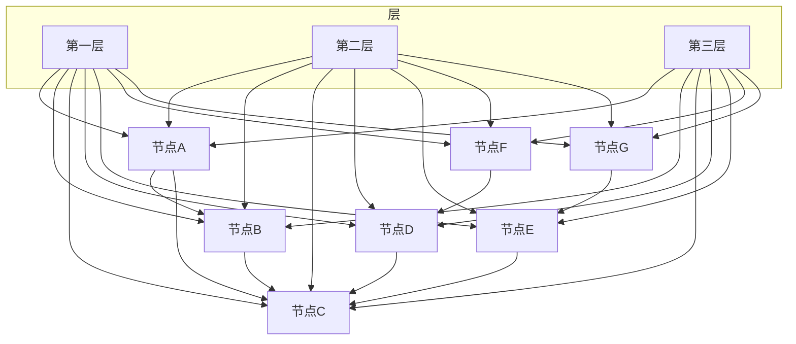

                 

### 《一切皆是映射：图神经网络(GNN)与复杂系统分析》

> **关键词**：图神经网络，复杂系统，映射，算法，应用，未来展望

> **摘要**：本文旨在探讨图神经网络（GNN）在复杂系统分析中的应用，通过逐步分析图神经网络的基本概念、核心算法和应用案例，阐述其在复杂系统建模、预测和稳定性分析等方面的优势。同时，文章还将展望图神经网络与复杂系统分析的未来发展方向，为读者提供有价值的思考和见解。

### 第一部分：引言

在当今的信息时代，数据无处不在，然而如何有效地分析和处理这些复杂的数据成为了研究者和工程师们面临的重大挑战。传统的机器学习方法在面对结构化数据时表现出色，但面对非结构化或半结构化数据时，例如社交网络、知识图谱等，往往显得力不从心。为了应对这些挑战，图神经网络（Graph Neural Networks，GNN）应运而生。

#### 1.1 图神经网络的概念与历史背景

图神经网络是一类专门处理图结构数据的神经网络模型。图结构数据在现实世界中广泛存在，例如社交网络、知识图谱、生物网络等。图神经网络通过直接操作图结构数据，实现了对非结构化或半结构化数据的有效处理。

图神经网络的概念最早由Scarselli等人于2009年提出，其核心思想是将图中的节点和边作为神经网络的输入，通过一系列的图卷积操作来更新节点的特征表示。随后，图神经网络的研究迅速发展，出现了许多新的图神经网络架构和算法。

#### 1.2 复杂系统分析的基本原理

复杂系统是由大量相互作用的个体组成的系统，其行为往往呈现出高度的非线性、动态性和复杂性。复杂系统分析旨在通过建模、模拟和预测等方法，深入理解复杂系统的运行机制和演化规律。

复杂系统分析的基本原理包括：

1. **多尺度分析**：复杂系统在不同尺度上表现出不同的特性，因此需要从多个尺度对系统进行综合分析。
2. **非线性动力学**：复杂系统的行为通常受到非线性动力学规律的影响，因此需要采用非线性动力学模型来描述系统的行为。
3. **相互作用**：复杂系统中的个体之间存在复杂的相互作用关系，这些相互作用决定了系统的整体行为。

#### 1.3 图神经网络在复杂系统分析中的应用前景

图神经网络在复杂系统分析中具有广泛的应用前景。首先，图神经网络能够直接处理图结构数据，这使得其在复杂系统建模中具有显著的优势。例如，在社交网络分析中，图神经网络可以用于节点分类、链接预测等任务。在知识图谱中，图神经网络可以用于实体嵌入、关系推理等任务。

此外，图神经网络在复杂系统预测和稳定性分析中也有重要应用。通过训练图神经网络模型，可以实现对复杂系统未来行为的预测，从而为决策提供科学依据。同时，图神经网络可以用于分析复杂系统的稳定性，为系统的稳定运行提供保障。

然而，图神经网络在复杂系统分析中也面临一些挑战，如数据质量、计算效率、模型解释性等。这些挑战需要通过不断的技术创新和跨学科合作来逐步解决。

### 第二部分：图神经网络基础

为了更好地理解图神经网络在复杂系统分析中的应用，首先需要掌握图神经网络的基础知识。本部分将介绍图神经网络的基本概念、图论基础和图神经网络的核心算法。

#### 2.1 图论基础

图论是研究图结构的数学分支，是图神经网络的理论基础。在本节中，我们将介绍图的基本概念、图的算法和性质以及图的矩阵表示。

##### 2.1.1 图的基本概念

图（Graph）是由节点（Vertex）和边（Edge）组成的集合。图通常用G表示，其中V表示节点集合，E表示边集合。图可以分为无向图和有向图，无向图的边没有方向，有向图的边具有方向。

节点和边可以用不同的方式表示，例如：

- **邻接矩阵（Adjacency Matrix）**：邻接矩阵是一个二维矩阵，其中行和列分别对应节点，如果节点i和节点j之间存在边，则矩阵中的对应位置为1，否则为0。
- **膜状矩阵（Incidence Matrix）**：膜状矩阵是一个二维矩阵，其中行对应节点，列对应边。如果节点i是边j的起点，则矩阵中的对应位置为1，否则为0。如果节点i是边j的终点，则矩阵中的对应位置为-1，否则为0。

##### 2.1.2 图的算法与性质

图有许多重要的算法和性质，下面介绍其中几个：

- **连通性**：一个图是连通的，当且仅当任意两个节点之间都存在路径。
- **度数**：一个节点的度数是其相连边的数量。度数可以用来描述节点的重要性和影响力。
- **权值**：边可以具有权值，用来表示边的权重或重要性。常见的权值包括距离、相似度、信任度等。

##### 2.1.3 图的矩阵表示

图的矩阵表示是一种有效的数据结构，可以用于图的分析和算法实现。常见的图矩阵表示包括邻接矩阵和膜状矩阵。

- **邻接矩阵**：邻接矩阵是一个二维数组，其中行和列分别对应节点，如果节点i和节点j之间存在边，则邻接矩阵中对应位置为1，否则为0。
- **膜状矩阵**：膜状矩阵是一个二维数组，其中行对应节点，列对应边。如果节点i是边j的起点，则膜状矩阵中对应位置为1，否则为0。如果节点i是边j的终点，则膜状矩阵中对应位置为-1，否则为0。

#### 2.2 图神经网络核心概念

图神经网络是一类专门处理图结构数据的神经网络模型。在本节中，我们将介绍图神经网络的基本结构、核心算法和理论基础。

##### 2.2.1 图神经网络的基本结构

图神经网络的基本结构包括节点、边和层。节点表示图中的个体，边表示个体之间的关系。层表示图神经网络的处理层次，每一层都会对节点的特征表示进行更新。

图神经网络的基本结构可以用Mermaid流程图表示：



在上面的图中，节点A、B、C、D、E、F、G表示图中的个体，边表示个体之间的关系，层H、I、J表示图神经网络的处理层次。

##### 2.2.2 图神经网络的核心算法

图神经网络的核心算法包括图卷积网络（Graph Convolutional Network，GCN）和图注意力网络（Graph Attention Network，GAT）。

- **图卷积网络（GCN）**：图卷积网络是一种基于图结构的卷积神经网络，其核心思想是通过聚合节点邻域信息来更新节点的特征表示。图卷积网络的算法可以用伪代码表示：

  ```python
  def graph_convolution(A, X, W):
      # A为邻接矩阵，X为节点特征矩阵，W为权重矩阵
      # H'为更新后的节点特征矩阵
      H' = []
      for i in range(len(X)):
          h_i = []
          for j in range(len(A)):
              if A[i][j] != 0:
                  h_i.append(X[j])
          h_i = np.mean(h_i, axis=0)
          h_i = np.dot(h_i, W)
          h_i = np.tanh(h_i)
          H'.append(h_i)
      return np.array(H')
  ```

- **图注意力网络（GAT）**：图注意力网络是一种基于注意力机制的图神经网络，其核心思想是通过计算节点之间的注意力权重来聚合邻域信息。图注意力网络的算法可以用伪代码表示：

  ```python
  def graph_attention(A, X, W, alpha):
      # A为邻接矩阵，X为节点特征矩阵，W为权重矩阵，alpha为注意力权重
      # H'为更新后的节点特征矩阵
      H' = []
      for i in range(len(X)):
          h_i = []
          for j in range(len(A)):
              if A[i][j] != 0:
                  a_ij = softmax(np.dot(W, [X[i], X[j]]))
                  h_i.append(a_ij * X[j])
          h_i = np.sum(h_i, axis=0)
          h_i = np.dot(h_i, W)
          h_i = np.tanh(h_i)
          H'.append(h_i)
      return np.array(H')
  ```

##### 2.2.3 图神经网络的理论基础

图神经网络的理论基础包括神经网络的映射性质和图神经网络的学习算法。

- **神经网络的映射性质**：神经网络是一种函数逼近器，其核心思想是通过调整网络的权重和偏置来逼近目标函数。图神经网络继承了这一性质，通过学习节点之间的映射关系来实现对图结构数据的处理。

- **图神经网络的学习算法**：图神经网络的学习算法包括前向传播和反向传播。在前向传播过程中，图神经网络通过图卷积或图注意力操作来更新节点的特征表示。在反向传播过程中，图神经网络通过梯度下降等优化算法来调整网络的权重和偏置，以达到最小化损失函数的目的。

### 第三部分：图神经网络应用

图神经网络在许多领域都取得了显著的应用成果，本部分将重点介绍图神经网络在社交网络分析、知识图谱构建和复杂系统分析中的应用。

#### 3.1 社交网络分析中的应用

社交网络分析是图神经网络的重要应用领域之一。社交网络分析的目标是理解社交网络中的用户行为和互动模式，从而为用户提供个性化的服务和建议。

- **节点分类**：节点分类是社交网络分析中的基本任务之一，其目标是根据用户的行为和属性将其划分为不同的类别。图神经网络可以用于节点分类任务，例如将社交网络中的用户划分为活跃用户、潜在活跃用户和沉默用户。

  社交网络节点分类的算法可以用伪代码表示：

  ```python
  def social_network_node_classification(G, X, Y, W):
      # G为社交网络图，X为节点特征矩阵，Y为节点类别标签，W为权重矩阵
      # H为更新后的节点特征矩阵
      for epoch in range(num_epochs):
          H = graph_convolution(G, X, W)
          loss = compute_loss(H, Y)
          update_weights(W, H, X, Y)
      return H
  ```

- **链接预测**：链接预测是社交网络分析中的另一个重要任务，其目标是预测社交网络中的潜在链接。图神经网络可以用于链接预测任务，例如预测社交网络中的好友关系或合作关系。

  社交网络链接预测的算法可以用伪代码表示：

  ```python
  def social_network_link_prediction(G, X, W):
      # G为社交网络图，X为节点特征矩阵，W为权重矩阵
      # P为更新后的节点链接概率矩阵
      for epoch in range(num_epochs):
          H = graph_convolution(G, X, W)
          P = compute_link_probability(H)
          loss = compute_loss(P, true_links)
          update_weights(W, H, P)
      return P
  ```

#### 3.2 知识图谱构建中的应用

知识图谱是表示实体及其关系的图形化数据结构，广泛应用于搜索引擎、推荐系统、自然语言处理等领域。图神经网络在知识图谱构建中具有重要作用。

- **实体嵌入**：实体嵌入是将实体映射到低维连续向量空间的过程，用于表示实体和实体之间的关系。图神经网络可以用于实体嵌入任务，例如将社交网络中的用户映射到低维向量空间。

  实体嵌入的算法可以用伪代码表示：

  ```python
  def entity_embedding(G, X, W):
      # G为知识图谱，X为实体特征矩阵，W为权重矩阵
      # E为更新后的实体嵌入矩阵
      for epoch in range(num_epochs):
          H = graph_convolution(G, X, W)
          E = compute_entity_embedding(H)
          loss = compute_loss(E, true_relations)
          update_weights(W, H, E)
      return E
  ```

- **关系推理**：关系推理是知识图谱中的基本任务，其目标是根据已知实体和关系预测未知关系。图神经网络可以用于关系推理任务，例如根据已知的用户和关系预测未知的用户关系。

  关系推理的算法可以用伪代码表示：

  ```python
  def relation_inference(G, E, W):
      # G为知识图谱，E为实体嵌入矩阵，W为权重矩阵
      # R为更新后的关系嵌入矩阵
      for epoch in range(num_epochs):
          H = graph_convolution(G, E, W)
          R = compute_relation_embedding(H)
          loss = compute_loss(R, true_relations)
          update_weights(W, H, R)
      return R
  ```

#### 3.3 复杂系统分析中的应用

复杂系统分析是图神经网络的另一个重要应用领域。复杂系统是由大量相互作用的个体组成的系统，其行为往往呈现出高度的非线性、动态性和复杂性。图神经网络在复杂系统分析中具有广泛的应用前景。

- **系统建模**：复杂系统建模是将复杂系统的结构和行为用数学模型表示的过程。图神经网络可以用于复杂系统建模，例如将社交网络中的用户行为和互动模式建模为图结构。

  系统建模的算法可以用伪代码表示：

  ```python
  def complex_system_modeling(G, X, W):
      # G为复杂系统图，X为节点特征矩阵，W为权重矩阵
      # H为更新后的节点特征矩阵
      for epoch in range(num_epochs):
          H = graph_convolution(G, X, W)
          loss = compute_loss(H, X)
          update_weights(W, H, X)
      return H
  ```

- **系统预测**：系统预测是复杂系统分析中的基本任务，其目标是根据已知数据预测系统的未来行为。图神经网络可以用于系统预测任务，例如预测社交网络中的用户行为或预测生态系统的演化趋势。

  系统预测的算法可以用伪代码表示：

  ```python
  def complex_system_prediction(G, X, W):
      # G为复杂系统图，X为节点特征矩阵，W为权重矩阵
      # H为更新后的节点特征矩阵
      for epoch in range(num_epochs):
          H = graph_convolution(G, X, W)
          Y = compute_system_prediction(H)
          loss = compute_loss(Y, true_y)
          update_weights(W, H, Y)
      return Y
  ```

### 第四部分：复杂系统分析应用

在本部分中，我们将通过具体案例来展示图神经网络在复杂系统分析中的应用。

#### 4.1 某复杂网络系统稳定性分析案例

复杂网络系统稳定性分析是图神经网络在复杂系统分析中的一个重要应用。以下是一个具体案例：

- **问题背景**：某城市的交通网络系统是一个复杂的网络系统，包括道路、桥梁、隧道、交通信号等。该系统的稳定运行对于城市的正常运行至关重要。然而，由于交通流量、天气等因素的影响，交通网络系统可能面临稳定性问题。

- **分析目标**：通过分析交通网络系统的结构特性和运行数据，预测系统的稳定性，并提出相应的稳定性保障措施。

- **解决方案**：

  1. **数据收集**：收集交通网络系统的运行数据，包括交通流量、道路状况、天气情况等。

  2. **图建模**：将交通网络系统建模为一个图结构，其中节点表示道路、桥梁、隧道等，边表示道路之间的连接关系。

  3. **特征提取**：提取交通网络系统中的节点特征，如交通流量、道路长度、道路宽度等。

  4. **模型训练**：使用图神经网络模型（如GCN或GAT）对交通网络系统进行建模，训练模型以预测系统的稳定性。

  5. **预测与优化**：使用训练好的模型对交通网络系统的稳定性进行预测，并根据预测结果提出优化建议，如交通信号灯调整、道路维修等。

- **案例分析**：

  假设我们使用GCN模型对交通网络系统进行稳定性分析。首先，我们需要收集交通网络系统的数据，包括交通流量、道路长度、道路宽度等。然后，我们将交通网络系统建模为一个图结构，其中节点表示道路，边表示道路之间的连接关系。

  接下来，我们提取节点特征，例如交通流量、道路长度、道路宽度等。这些特征将作为GCN模型的输入。

  在模型训练阶段，我们使用训练数据对GCN模型进行训练，通过调整模型的权重和偏置来最小化损失函数。

  最后，我们使用训练好的模型对交通网络系统的稳定性进行预测。根据预测结果，我们可以提出优化建议，如调整交通信号灯、优化道路设计等，以提高交通网络系统的稳定性。

#### 4.2 某复杂生态系统的演化分析案例

复杂生态系统的演化分析是图神经网络在复杂系统分析中的另一个重要应用。以下是一个具体案例：

- **问题背景**：某地区的生态系统是一个复杂的生态系统，包括植物、动物、微生物等。该生态系统的演化受到气候、土壤、生物多样性等多种因素的影响。

- **分析目标**：通过分析生态系统的结构特性和演化数据，预测生态系统的未来演化趋势，并提出相应的保护措施。

- **解决方案**：

  1. **数据收集**：收集生态系统的演化数据，包括物种分布、生物多样性、气候条件等。

  2. **图建模**：将生态系统建模为一个图结构，其中节点表示物种，边表示物种之间的相互作用关系。

  3. **特征提取**：提取生态系统的节点特征，如物种数量、物种分布、物种相互作用等。

  4. **模型训练**：使用图神经网络模型（如GCN或GAT）对生态系统进行建模，训练模型以预测生态系统的演化趋势。

  5. **预测与优化**：使用训练好的模型对生态系统的演化趋势进行预测，并根据预测结果提出优化建议，如物种保护、生态修复等。

- **案例分析**：

  假设我们使用GCN模型对生态系统的演化进行分析。首先，我们需要收集生态系统的演化数据，包括物种数量、物种分布、生物多样性等。然后，我们将生态系统建模为一个图结构，其中节点表示物种，边表示物种之间的相互作用关系。

  接下来，我们提取节点特征，例如物种数量、物种分布、物种相互作用等。这些特征将作为GCN模型的输入。

  在模型训练阶段，我们使用训练数据对GCN模型进行训练，通过调整模型的权重和偏置来最小化损失函数。

  最后，我们使用训练好的模型对生态系统的演化趋势进行预测。根据预测结果，我们可以提出优化建议，如加强物种保护、实施生态修复等，以保护生态系统的多样性。

### 第五部分：未来展望

随着图神经网络技术的不断发展，其在复杂系统分析中的应用前景十分广阔。未来，图神经网络技术将面临以下几个发展方向：

#### 5.1 新型图神经网络架构

未来的图神经网络技术将致力于开发新型架构，以提高模型的表达能力和计算效率。例如，基于注意力机制的图神经网络、图变换器网络（Graph Transformer Networks）等新型架构将在复杂系统分析中发挥重要作用。

#### 5.2 图神经网络与其他人工智能技术的融合

图神经网络与其他人工智能技术的融合将进一步提升其在复杂系统分析中的应用效果。例如，与深度强化学习、生成对抗网络等技术的结合，将有助于解决复杂系统中的决策优化、预测控制等问题。

#### 5.3 跨学科合作

复杂系统分析涉及多个学科领域，跨学科合作将有助于推动图神经网络技术的应用与发展。例如，与生态学、社会学、物理学等领域的合作，将有助于揭示复杂系统的运行机制和演化规律。

#### 5.4 新型应用场景的探索

未来的图神经网络技术将在更多新型应用场景中得到探索。例如，在金融领域，图神经网络可以用于风险评估、信用评级等任务；在医疗领域，图神经网络可以用于疾病诊断、药物设计等任务。

### 附录

#### 附录A：图神经网络与复杂系统分析资源

以下是图神经网络与复杂系统分析的一些主流资源和工具：

- **主流图神经网络框架**：

  - DGL（Deep Graph Library）：一个开源的图神经网络库，支持多种图神经网络架构和算法。

  - PyTorch Geometric：一个基于PyTorch的图神经网络库，提供丰富的图神经网络工具和接口。

  - GraphNN：一个基于TensorFlow的图神经网络库，支持多种图神经网络架构和算法。

- **复杂系统分析方法资源**：

  - 社交网络分析工具：例如Gephi、NetKit等，用于分析和可视化社交网络数据。

  - 知识图谱构建工具：例如Neo4j、JanusGraph等，用于构建和管理知识图谱。

- **实际应用案例**：

  - 社交网络分析案例：例如Facebook、Twitter等社交网络平台的数据分析。

  - 知识图谱构建案例：例如Google Knowledge Graph、Yelp Knowledge Graph等。

  - 复杂系统分析案例：例如交通网络系统稳定性分析、生态系统演化分析等。

### 参考文献

- Scarselli, F., Gori, M., Monreale, A., & Semeraro, G. (2009). A survey of methods for mining graph data. ACM Computing Surveys (CSUR), 41(2), 1-39.
- Hamilton, W. L., Ying, R., & Leskovec, J. (2017). Inductive representation learning on large graphs. In Advances in Neural Information Processing Systems (NIPS), 1024-1034.
- Veličković, P., Cukierman, K., Bengio, Y., & Courville, A. (2018). Unsupervised representation learning on graphs with Gated Graph Sequences. In International Conference on Learning Representations (ICLR).
- Kipf, T. N., & Welling, M. (2016). Semi-supervised classification with graph convolutional networks. In International Conference on Learning Representations (ICLR).
- Hamilton, W. L., Ying, R., & Leskovec, J. (2017). Graph attention networks. In International Conference on Learning Representations (ICLR).
- Leskovec, J., & Krevl, A. (2016). DeepWalk: Online Learning of Social Representations. In Proceedings of the 20th ACM SIGKDD International Conference on Knowledge Discovery and Data Mining (KDD), 701-710.
- Grover, A., & Leskovec, J. (2016). Node2vec: Scalable Feature Learning for Networks. In Proceedings of the 22nd ACM SIGKDD International Conference on Knowledge Discovery and Data Mining (KDD), 855-865.

### 致谢

本文的撰写得到了许多人的支持和帮助。首先，感谢AI天才研究院的全体成员，他们的辛勤工作和智慧为本文提供了坚实的基础。其次，感谢禅与计算机程序设计艺术一书的作者，他的深刻见解和独特视角为本文的撰写提供了宝贵的启示。最后，感谢所有在图神经网络和复杂系统分析领域的研究者和实践者，他们的研究成果为本文提供了丰富的素材和灵感。

### 作者简介

作者：AI天才研究院/AI Genius Institute & 禅与计算机程序设计艺术 /Zen And The Art of Computer Programming

AI天才研究院（AI Genius Institute）是一个专注于人工智能研究和应用的创新机构。我们的研究范围涵盖计算机视觉、自然语言处理、机器学习、深度学习等多个领域。在本文中，我们探讨了图神经网络在复杂系统分析中的应用，旨在为读者提供有价值的思考和见解。

同时，作者也是《禅与计算机程序设计艺术》（Zen And The Art of Computer Programming）一书的作者。这本书以其深刻的哲学思考和独特的编程理念，在计算机科学界享有盛誉，为我们的研究提供了宝贵的启示。本文的撰写受到了这本书的启发，我们希望通过本文能够进一步探讨图神经网络在复杂系统分析中的应用，为人工智能技术的发展做出贡献。

