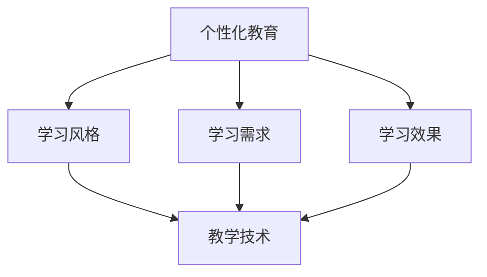

                 

### 个性化教育：定制化学习的未来趋势

个性化教育作为现代教育技术革新的重要方向，正日益受到广泛关注。其核心在于根据每个学生的学习风格、能力和进度，量身定制教学计划和学习资源，从而实现教育的个性化和高效化。在信息技术飞速发展的今天，人工智能、大数据、云计算等技术的应用，为个性化教育提供了强有力的支撑，使得个性化教育逐渐从理论走向实践，成为未来教育的重要趋势。

本文将分步骤探讨个性化教育的理论基础、方法与技术、课程设计、教学策略、技术工具与平台、实践与反思，以及总结与展望。通过逻辑清晰、结构紧凑的分析，我们将深入探讨个性化教育的内涵、外延和未来发展的可能性，为教育工作者、技术专家和政策制定者提供有价值的参考。

**关键词**：个性化教育、定制化学习、人工智能、大数据、云计算

**摘要**：本文首先介绍了个性化教育的概念与历史背景，探讨了其与传统教育的区别和发展历程。接着，文章分析了个性化教育的理论基础，包括加涅的学习理论、皮亚杰的建构主义理论、维果茨基的最近发展区理论、情境学习理论和社会文化理论。随后，文章详细阐述了个性化教育的方法与技术，包括数据驱动个性化教学、技术支持个性化学习、智能学习环境设计、个性化学习评估与反馈和个性化教育的实施策略。在此基础上，文章介绍了个性化教育的课程设计、教学策略和技术工具与平台。最后，文章通过实践案例分析了个性化教育的实施效果和挑战，并探讨了未来个性化教育的发展趋势。

----------------------------------------------------------------

### 第一部分：个性化教育的理论基础

个性化教育作为现代教育的重要理念，其理论基础涵盖了多个心理学和教育学的理论。本部分将分章节详细探讨这些理论基础，为后续内容的展开提供坚实的理论依据。

#### 第1章：个性化教育的概念与历史背景

个性化教育，顾名思义，是一种以学生个性化需求为核心的教育理念。它主张根据每个学生的特点，制定差异化的教学方案和学习资源，使教育更加贴近学生的实际需求。个性化教育的概念最早可以追溯到20世纪初，随着教育心理学的发展，逐步得到了完善和推广。

**1.1 个性化教育的定义与特征**

个性化教育的定义在不同学者之间有所差异，但其核心内涵基本一致。总体来说，个性化教育可以定义为：在尊重学生个体差异的基础上，通过因材施教，提供符合学生个人学习特点和需求的教育服务，促进学生全面发展。

个性化教育的主要特征包括：

- **以学生为中心**：关注学生的个体差异和独特性，强调学生的主动参与和自主学习。
- **差异化的教学方案**：根据学生的兴趣、能力和学习风格，制定个性化的教学计划和资源。
- **适应性的学习环境**：通过智能化的教学系统，动态调整学习内容和进度，以适应学生的学习需求。

**1.2 个性化教育与传统教育的区别**

传统教育通常采用“一刀切”的模式，忽视了学生的个体差异。而个性化教育则强调因材施教，关注每个学生的独特性。具体区别如下：

- **教学目标**：传统教育注重统一的知识传授，而个性化教育注重培养学生的个性化能力和素质。
- **教学方法**：传统教育主要采用教师讲授和学生被动接受的方式，个性化教育则提倡互动式、探究式和合作式学习。
- **教学内容**：传统教育内容固定，个性化教育则强调灵活多变，注重实践与理论相结合。

**1.3 个性化教育的发展历程**

个性化教育的发展历程可以分为几个阶段：

- **早期探索阶段（20世纪初至20世纪60年代）**：在这个阶段，学者们开始关注学生的个体差异，提出了许多个性化的教育理念。
- **发展阶段（20世纪60年代至80年代）**：随着教育心理学的发展，个性化教育得到了更多的理论和实践支持，开始在学校中广泛应用。
- **成熟阶段（20世纪90年代至今）**：随着信息技术的飞速发展，个性化教育得到了进一步的推动，大数据、人工智能等技术的应用使得个性化教育从理论走向实践。

**1.4 个性化教育的国际现状与趋势**

目前，个性化教育在国际上已经得到了广泛的关注和推广。许多国家在教育改革中积极引入个性化教育的理念和方法。例如，美国、芬兰、英国等国家已经制定了相应的政策和措施，推动个性化教育的发展。

未来的发展趋势包括：

- **技术驱动**：人工智能、大数据、云计算等技术的应用将进一步推动个性化教育的发展。
- **个性化学习环境的构建**：智能教室、虚拟现实等技术将为个性化教育提供更加丰富的学习资源和环境。
- **跨学科整合**：个性化教育将更加注重跨学科的整合，促进学生全面发展和创新能力的培养。

通过以上对个性化教育概念、特征、与传统教育区别以及发展历程的探讨，我们可以看到个性化教育的重要性和必要性。在接下来的章节中，我们将进一步分析个性化教育的理论基础，为个性化教育的实践提供理论支撑。

----------------------------------------------------------------

### 第2章：个性化教育的理论基础

个性化教育的理论基础涵盖了多个心理学和教育学的理论，这些理论为个性化教育的实施提供了重要的指导。本章节将详细介绍以下几个核心理论：加涅的学习理论、皮亚杰的建构主义理论、维果茨基的最近发展区理论、情境学习理论和社会文化理论。

#### 2.1 加涅的学习理论

加涅（Robert Gagné）是教育心理学领域的著名学者，他提出了学习过程模型，将学习过程分为八个阶段：动机阶段、了解阶段、获得阶段、保持阶段、回忆阶段、概括阶段、操作阶段和反馈阶段。

加涅的学习理论强调学习是一个有步骤、有规律的过程，每个阶段都有其特定的目标和任务。对于个性化教育来说，加涅的理论提供了以下启示：

- **个性化教学设计**：根据学生的学习阶段，制定针对性的教学策略和资源，以促进学习的有效进行。
- **学习动机的激发**：通过设计有趣、富有挑战性的学习任务，激发学生的学习动机，提高学习效果。
- **及时反馈**：在学习过程中及时给予反馈，帮助学生了解自己的学习进展，调整学习策略。

#### 2.2 皮亚杰的建构主义理论

皮亚杰（Jean Piaget）是认知发展心理学的奠基人，他提出了建构主义理论，认为学习是一个主动建构的过程，学生通过与环境互动，主动构建自己的知识和理解。

皮亚杰的建构主义理论对个性化教育的影响主要体现在以下几个方面：

- **学生中心的教学方法**：强调学生的主体地位，鼓励学生主动参与学习过程，培养学生的自主学习能力。
- **探究式学习**：通过提供丰富的学习资源和环境，鼓励学生进行探究和发现，促进知识的内化和应用。
- **个性化学习路径**：根据学生的认知发展阶段，提供不同难度的学习任务，帮助学生逐步构建知识体系。

#### 2.3 维果茨基的最近发展区理论

维果茨基（Lev Vygotsky）是发展心理学的杰出代表，他提出了最近发展区（ZPD）的概念，认为每个学生都有一个潜在的发展水平，当在成人或有能力同伴的帮助下，可以达到更高的解决问题的水平。

维果茨基的最近发展区理论为个性化教育提供了以下指导：

- **合作学习**：通过同伴互助和教师引导，帮助学生跨越最近发展区，实现知识的提升。
- **差异化教学**：根据学生的最近发展区，提供适当的帮助和指导，使每个学生都能在原有基础上得到发展。
- **学习支架**：在教学过程中，提供适时的学习支架，帮助学生理解和掌握新知识。

#### 2.4 情境学习理论

情境学习理论认为，知识是在具体情境中建构的，学习应该发生在真实的情境中，而不是抽象的概念体系中。

情境学习理论对个性化教育的影响主要体现在以下几个方面：

- **情境化教学**：将知识融入具体的情境中，使学习更加贴近学生的实际生活，提高学习的相关性和应用性。
- **实践导向**：通过实践活动和项目学习，让学生在真实情境中应用知识，培养解决问题的能力。
- **个性化学习环境**：构建支持情境化学习的环境，提供多样化的学习资源和工具，以满足不同学生的学习需求。

#### 2.5 社会文化理论

社会文化理论强调学习是一个社会互动的过程，学生在文化和社会的背景下进行学习，通过与他人的互动，获取知识和发展认知能力。

社会文化理论对个性化教育的启示包括：

- **社会互动**：鼓励学生之间的合作和交流，通过社会互动，促进学生知识和技能的共享和提升。
- **文化背景**：考虑学生的文化背景和经验，设计符合学生文化特点的教学内容和方式，提高学习的有效性。
- **多元化评价**：采用多元化的评价方式，不仅关注学生的学术成绩，还关注学生的社会性发展和实践能力。

综上所述，个性化教育的理论基础涵盖了多个心理学和教育学的理论，这些理论为个性化教育的实施提供了丰富的指导。通过深入理解和应用这些理论，我们可以更好地设计个性化教育的教学策略和学习资源，促进学生的全面发展。

----------------------------------------------------------------

### 第3章：个性化教育的方法与技术

个性化教育的发展离不开先进的方法和技术支持。本章节将详细介绍几种关键的个性化教育方法和技术，包括数据驱动个性化教学、技术支持个性化学习、智能学习环境设计、个性化学习评估与反馈和个性化教育的实施策略。

#### 3.1 数据驱动个性化教学

数据驱动个性化教学是一种以学生数据为基础的教学方法，通过分析学生的学习数据，了解学生的学习行为、兴趣和需求，从而制定个性化的教学计划和资源。

**数据驱动个性化教学的核心步骤包括：**

1. **数据采集**：收集学生的学习数据，包括学习时间、学习内容、作业完成情况、考试成绩等。
2. **数据分析**：使用数据挖掘和机器学习算法，对学生的学习数据进行深入分析，识别学生的学习特点和需求。
3. **个性化教学设计**：根据数据分析结果，制定个性化的教学计划和学习资源，包括教学内容、教学方法和学习路径。
4. **教学实施与反馈**：在教学过程中，持续收集学生的学习反馈，调整教学策略，优化学习体验。

**数据驱动个性化教学的优点：**

- **提高学习效率**：通过个性化教学，学生能够更有效地掌握知识，提高学习效率。
- **个性化学习体验**：学生可以根据自己的需求和兴趣，选择适合自己的学习内容和方式，提升学习体验。
- **教学决策支持**：教师可以根据学生的学习数据，做出更科学、更有针对性的教学决策。

#### 3.2 技术支持个性化学习

技术支持个性化学习是指利用现代信息技术，为个性化教育提供技术支持，包括在线学习平台、虚拟现实、人工智能等。

**技术支持个性化学习的应用场景包括：**

1. **在线学习平台**：提供丰富的学习资源和工具，支持学生在线学习，实现自主学习和协作学习。
2. **虚拟现实（VR）**：通过虚拟现实技术，为学生提供沉浸式的学习体验，增强学习的趣味性和互动性。
3. **人工智能（AI）**：利用人工智能技术，提供智能辅导、个性化推荐和学习分析，帮助学生更好地掌握知识和技能。

**技术支持个性化学习的优点：**

- **资源丰富**：在线学习平台和虚拟现实技术为学生提供了丰富的学习资源和多样的学习方式。
- **互动性强**：虚拟现实和人工智能技术增强了学生与学习环境的互动，提高了学习的趣味性和参与度。
- **个性化推荐**：人工智能技术可以根据学生的学习行为和兴趣，提供个性化的学习推荐，提高学习效果。

#### 3.3 智能学习环境设计

智能学习环境设计是指利用物联网、大数据和云计算等技术，构建智能化的学习环境，提供个性化的学习体验。

**智能学习环境设计的关键技术包括：**

1. **物联网**：通过物联网技术，将教室中的各种设备连接起来，实现设备之间的互联互通，提供智能化的教学和管理支持。
2. **大数据**：收集和分析学生在学习过程中的数据，为教学决策和学习资源分配提供数据支持。
3. **云计算**：提供强大的计算和存储能力，支持大规模数据处理和智能分析。

**智能学习环境设计的优点：**

- **个性化学习**：根据学生的行为数据和需求，提供个性化的学习资源和环境，提高学习效果。
- **智能管理**：通过智能化的教学管理和监控，提高教学效率和管理水平。
- **教育资源优化**：通过数据分析和智能推荐，优化教育资源的分配和使用，提高教育资源的使用效率。

#### 3.4 个性化学习评估与反馈

个性化学习评估与反馈是指通过多种评估方法，对学生的个性化学习过程和效果进行评估，并提供及时、有效的反馈，帮助学生不断改进学习策略。

**个性化学习评估与反馈的关键环节包括：**

1. **多维评估**：采用多种评估方法，如定量评估、定性评估、过程评估和结果评估，全面了解学生的学习状况。
2. **实时反馈**：通过实时反馈系统，及时向学生提供学习评估结果，帮助学生了解自己的学习进展和不足之处。
3. **持续改进**：根据学生的反馈和评估结果，调整教学策略和学习资源，持续改进个性化教学效果。

**个性化学习评估与反馈的优点：**

- **全面了解**：通过多维评估，全面了解学生的学习状况，为个性化教学提供科学依据。
- **及时改进**：通过实时反馈，帮助学生及时发现和纠正学习中的问题，提高学习效果。
- **持续发展**：通过持续改进，不断提升个性化教学的质量和效果，促进学生的全面发展。

#### 3.5 个性化教育的实施策略

个性化教育的实施策略是指在实际教学中，如何有效实施个性化教育，以实现个性化教育的目标。

**个性化教育的实施策略包括：**

1. **因材施教**：根据学生的个体差异，制定个性化的教学计划和资源，满足学生的个性化需求。
2. **教学个性化**：在教学过程中，采用多样化的教学方法，如探究式学习、合作学习和项目学习，激发学生的学习兴趣和主动性。
3. **学习资源个性化**：提供个性化的学习资源和工具，如在线学习平台、虚拟现实和人工智能辅导系统，支持学生的个性化学习。
4. **评价个性化**：采用个性化的评价方法，如过程评价、成果评价和自我评价，全面评估学生的学习效果。
5. **教师专业发展**：加强教师的专业培训，提高教师对个性化教育的理解和应用能力，为个性化教育的实施提供保障。

**个性化教育的实施策略的优点：**

- **适应学生需求**：通过因材施教，满足学生的个性化需求，提高学生的学习效果。
- **激发学习兴趣**：通过多样化的教学方法和个性化学习资源，激发学生的学习兴趣和主动性。
- **提高教学质量**：通过个性化的教学评价，全面了解学生的学习状况，不断优化教学策略，提高教学质量。

综上所述，个性化教育的方法与技术为个性化教育的实施提供了重要的支持。通过数据驱动个性化教学、技术支持个性化学习、智能学习环境设计、个性化学习评估与反馈和个性化教育的实施策略，我们可以实现教育的个性化和高效化，为学生的全面发展创造更好的条件。

----------------------------------------------------------------

### 第4章：个性化教育的课程设计

个性化教育的课程设计是实施个性化教育的核心环节，它要求课程设计者能够充分理解每个学生的独特需求，从而设计出满足学生个性化发展的课程方案。本章节将详细介绍个性化教育课程设计的关键要素，包括课程目标与内容设计、课程结构安排、课程资源整合、课程评价体系以及课程案例研究。

#### 4.1 课程目标与内容设计

个性化教育的课程目标设计应遵循以下几个原则：

1. **个性化目标**：根据学生的兴趣、特长和学习需求，制定具有针对性的课程目标，确保每个学生都能在课程中找到自己的发展方向。
2. **全面发展目标**：在个性化目标的基础上，兼顾学生的全面发展，包括知识、技能、态度和价值观等方面。
3. **可测量目标**：课程目标应具体、明确，可量化，以便于教学评价和反馈。

课程内容设计需要考虑以下几个方面：

1. **基础知识**：确保学生掌握必要的学科基础知识，为后续学习和专业发展打下坚实的基础。
2. **个性化内容**：根据学生的个性化需求，设计具有挑战性和趣味性的学习内容，激发学生的学习兴趣和主动性。
3. **跨学科整合**：打破学科界限，整合多学科知识，培养学生的综合思维能力和创新能力。

#### 4.2 课程结构安排

个性化教育的课程结构安排应灵活多样，以适应不同学生的需求。以下是一些常见的课程结构安排方式：

1. **模块化课程**：将课程内容划分为若干个模块，每个模块包含特定的主题和学习目标，学生可以根据自己的兴趣和进度选择学习。
2. **螺旋式课程**：将不同年级、不同学科的知识点进行整合，形成一个螺旋上升的课程体系，使学生能够在不同阶段反复接触和深化知识。
3. **项目式课程**：通过项目学习的方式，将课程内容与实际应用相结合，培养学生的实践能力和创新能力。

#### 4.3 课程资源整合

个性化教育的课程资源整合是指将各种学习资源有机结合，为学生提供丰富、多样的学习支持。以下是一些常见的课程资源整合方式：

1. **数字化资源**：利用在线学习平台、电子书籍、教育应用程序等数字化资源，提供便捷的学习渠道和多样化的学习方式。
2. **线下资源**：结合传统的教学设施和设备，如图书馆、实验室、教学课件等，为学生提供丰富的学习资源。
3. **社会资源**：充分利用社会资源，如企业、科研机构等，为学生提供实践机会和拓展视野的平台。

#### 4.4 课程评价体系

个性化教育的课程评价体系应注重过程评价和结果评价的结合，全面、多维度地评估学生的学习效果。以下是一些常见的课程评价体系：

1. **形成性评价**：通过日常作业、课堂讨论、学习报告等方式，持续跟踪学生的学习进展，及时给予反馈，帮助学生改进学习策略。
2. **总结性评价**：通过考试、测验、项目展示等方式，评估学生的学习成果，确定学生的学业水平。
3. **自我评价**：鼓励学生进行自我反思和自我评价，提高学生的自主学习能力和自我管理能力。

#### 4.5 课程案例研究

为了更好地理解个性化教育的课程设计，以下将介绍两个具体的课程案例：

**案例一：小学科学个性化课程**

课程目标：培养学生的科学素养和探究能力。

课程结构：采用模块化课程结构，每个模块包含科学探究、实验操作、知识讲解等环节。

课程资源：利用数字化资源，如在线科学实验平台、科学动画等，提供丰富的学习资源。

评价体系：形成性评价结合总结性评价，通过科学探究报告和实验展示进行评估。

**案例二：高中数学个性化课程**

课程目标：提高学生的数学思维能力和解题能力。

课程结构：采用螺旋式课程结构，从基础数学知识到高级数学知识，逐步提升学生的数学能力。

课程资源：结合线下资源和线上资源，如数学教材、数学学习应用等，提供多样化的学习支持。

评价体系：形成性评价和总结性评价相结合，通过数学竞赛和期末考试进行评估。

通过以上对个性化教育课程设计的关键要素、课程结构安排、课程资源整合、课程评价体系和课程案例研究的详细介绍，我们可以看到个性化教育在课程设计方面的多样性和灵活性。这些课程设计和实施策略为个性化教育的有效开展提供了重要的支持和保障。

----------------------------------------------------------------

### 第5章：个性化教育的教学策略

个性化教育的教学策略是确保学生能够按照个性化学习路径进行有效学习的关键。本章节将详细介绍个性化教育的教学策略，包括个性化学习路径规划、个性化教学策略、个性化学习支持、教师角色与职责以及教学案例与实践。

#### 5.1 个性化学习路径规划

个性化学习路径规划是指根据学生的个性化需求和学习目标，制定一个具体的、可执行的学习计划。这一过程通常包括以下步骤：

1. **学习需求分析**：通过问卷调查、面谈、学习行为分析等方式，了解学生的兴趣、优势和弱点，为个性化学习路径规划提供数据支持。
2. **学习目标设定**：根据学生的个性化需求，设定明确的学习目标，包括短期目标和长期目标。
3. **学习资源选择**：根据学习目标，选择适合的学习资源，如在线课程、教学视频、实验材料等。
4. **学习路径设计**：将学习资源和学习活动按照一定的逻辑顺序和时间安排进行设计，形成一个系统的学习路径。

#### 5.2 个性化教学策略

个性化教学策略是指在教学过程中，根据学生的个性化需求和学习特点，采取不同的教学方法和手段。以下是一些常见的个性化教学策略：

1. **差异化教学**：根据学生的不同水平，设计不同难度的教学内容，使每个学生都能在适合自己的难度水平上学习。
2. **探究式教学**：鼓励学生主动探究和发现知识，通过实验、项目、讨论等方式，培养学生的探究能力和创新精神。
3. **互动式教学**：通过课堂讨论、小组合作、在线交流等方式，增强学生之间的互动，提高学习效果。
4. **游戏化教学**：将游戏元素融入教学中，提高学生的学习兴趣和参与度，促进知识的内化和应用。

#### 5.3 个性化学习支持

个性化学习支持是指在教学过程中，为学生的个性化学习提供必要的帮助和支持，以确保学习效果。以下是一些常见的个性化学习支持措施：

1. **学习辅导**：通过一对一辅导、小组辅导等方式，帮助学生解决学习中的困难和问题。
2. **学习资源推荐**：根据学生的学习需求和兴趣，推荐适合的学习资源，如电子书籍、教学视频、在线课程等。
3. **学习心理支持**：提供心理健康教育和服务，帮助学生克服学习中的心理障碍，提高学习动力。
4. **学习社区建设**：建立一个支持性的学习社区，鼓励学生之间相互支持和学习，促进共同成长。

#### 5.4 教师角色与职责

在个性化教育中，教师的角色和职责发生了显著的变化。教师不仅需要担任传统的知识传授者，还需要成为学生的指导者和学习伙伴。以下是一些新的教师角色和职责：

1. **学习设计师**：根据学生的个性化需求，设计符合学生特点的学习路径和学习资源。
2. **学习导师**：为学生提供个性化的学习辅导和支持，帮助学生克服学习中的困难。
3. **学习评估者**：通过多种评价方式，全面了解学生的学习进展和效果，提供及时的反馈。
4. **学习社区组织者**：建立一个支持性的学习社区，促进学生的互动和合作。

#### 5.5 教学案例与实践

以下是一个个性化教育的教学案例：

**案例：初中英语个性化阅读课程**

课程目标：提高学生的英语阅读能力，培养英语阅读兴趣。

教学策略：
1. **个性化学习路径规划**：根据学生的英语水平和阅读兴趣，设计不同的阅读路径，包括基础阅读、中级阅读和高级阅读。
2. **差异化教学**：针对不同阅读水平的学生，提供不同难度的阅读材料，确保每个学生都能在适合自己的难度水平上学习。
3. **互动式教学**：通过课堂讨论、小组合作和在线交流等方式，鼓励学生主动参与阅读活动，提高阅读效果。
4. **游戏化教学**：设计一些英语阅读游戏，如词汇竞赛、阅读理解挑战等，激发学生的阅读兴趣。

个性化学习支持：
1. **学习辅导**：定期组织英语阅读辅导课，帮助学生解决阅读中的困难和问题。
2. **学习资源推荐**：推荐适合的英语阅读材料，如英语小说、新闻文章等，提供多样化的阅读资源。
3. **学习心理支持**：提供心理健康教育，帮助学生克服阅读中的心理障碍，提高阅读动力。

教师角色与职责：
1. **学习设计师**：根据学生的个性化需求，设计个性化的阅读课程和活动。
2. **学习导师**：提供个性化的阅读辅导和支持，帮助学生提高阅读能力。
3. **学习评估者**：通过多种评价方式，了解学生的阅读进展和效果，提供及时的反馈。
4. **学习社区组织者**：建立一个支持性的阅读社区，鼓励学生之间的互动和合作。

通过以上个性化教育的教学策略和教学案例，我们可以看到个性化教育在教学过程中的多样性和灵活性。这些教学策略和措施不仅提高了学生的学习效果，也促进了学生的全面发展。

----------------------------------------------------------------

### 第6章：个性化教育的技术工具与平台

在个性化教育中，技术的应用不仅提升了教学效果，还改变了教育的面貌。本章节将详细介绍几种关键的个性化教育技术工具与平台，包括个性化学习管理系统、学习分析工具、人工智能在教育中的应用以及现有的个性化教育平台介绍和新兴技术的趋势与展望。

#### 6.1 个性化学习管理系统

个性化学习管理系统（LMS）是一种集成了课程管理、学习资源管理、学生成绩管理等功能的教育技术平台，它能够根据学生的学习进度和需求，提供个性化的学习体验。

**个性化学习管理系统的主要功能包括：**

1. **课程内容管理**：系统可以根据学生的学习进度，动态调整课程内容，提供个性化的学习路径。
2. **学习资源管理**：系统可以整合各种学习资源，如电子书籍、教学视频、在线实验等，并提供智能推荐。
3. **学习分析**：系统可以通过数据分析，了解学生的学习行为和学习效果，为教学决策提供支持。
4. **学生互动**：系统支持学生之间的互动和协作，提高学习的趣味性和参与度。

**个性化学习管理系统的优点：**

- **灵活性与可扩展性**：系统能够根据学校的需求进行定制化开发，支持多种教学模式的实施。
- **资源整合**：通过整合多种学习资源，为学生提供丰富的学习支持。
- **数据驱动**：通过学习分析，帮助教师了解学生的学习情况，优化教学策略。

#### 6.2 学习分析工具

学习分析工具是一种利用大数据和机器学习技术，对学生学习行为和学习结果进行深入分析的工具。通过学习分析工具，教师可以更好地了解学生的学习状态和需求，从而提供更有针对性的教学支持。

**学习分析工具的主要功能包括：**

1. **学习行为分析**：系统可以记录和分析学生的学习行为，如学习时间、学习路径、学习交互等。
2. **学习效果评估**：系统可以根据学生的考试成绩、作业完成情况等数据，评估学生的学习效果。
3. **个性化推荐**：系统可以根据学生的学习行为和效果，推荐适合的学习资源和教学策略。
4. **学习报告生成**：系统可以自动生成学习报告，帮助教师和学生在总结和反思中不断进步。

**学习分析工具的优点：**

- **实时监控**：教师可以实时了解学生的学习状态，及时调整教学策略。
- **个性化支持**：通过个性化推荐，帮助学生更有效地利用学习资源。
- **数据驱动**：通过学习数据，帮助教师更好地了解学生的学习需求，提高教学效果。

#### 6.3 人工智能在教育中的应用

人工智能（AI）在教育中的应用正在逐步深入，它能够为个性化教育提供强大的技术支持。以下是一些人工智能在教育中的应用场景：

1. **智能辅导**：通过自然语言处理和机器学习技术，AI可以为学生提供智能化的学习辅导，解答学生的疑惑。
2. **个性化推荐**：AI可以根据学生的学习行为和学习数据，推荐个性化的学习资源，提高学习效率。
3. **智能评估**：AI可以自动评估学生的作业和考试，提供即时的反馈和评分。
4. **智能教学**：AI可以模拟教师的教学行为，提供个性化的教学方案，辅助教师进行教学。

**人工智能在教育中的优点：**

- **个性化支持**：AI可以根据学生的学习特点和需求，提供个性化的学习支持和资源。
- **高效性**：AI可以处理大量的学习数据，提供快速、准确的学习分析和推荐。
- **降低成本**：AI可以部分替代教师的重复性工作，降低教学成本。

#### 6.4 现有的个性化教育平台介绍

目前，市场上已经出现了一些成熟的个性化教育平台，这些平台结合了多种技术，提供了丰富的个性化教育解决方案。以下是一些常见的个性化教育平台：

1. **Khan Academy**：Khan Academy是一个非营利性教育组织，提供免费的在线教育资源和个性化学习路径。
2. **Canvas**：Canvas是一个在线学习管理系统，提供灵活的课程设计和个性化的学习体验。
3. **DreamBox Learning**：DreamBox Learning是一个面向K-12学生的个性化学习平台，专注于数学学习。

**现有个性化教育平台的优点：**

- **资源丰富**：平台提供了大量的教学资源和工具，满足不同学科和层次的学习需求。
- **智能化**：平台结合了人工智能和数据分析技术，提供个性化的学习路径和资源推荐。
- **互动性强**：平台支持学生之间的互动和协作，提高学习的趣味性和参与度。

#### 6.5 新兴技术的趋势与展望

随着技术的不断进步，个性化教育也在不断演进。以下是一些新兴技术在个性化教育中的应用趋势和展望：

1. **虚拟现实（VR）**：通过虚拟现实技术，学生可以沉浸在一个虚拟的学习环境中，体验更加真实和有趣的学习过程。
2. **增强现实（AR）**：增强现实技术可以将虚拟信息和现实环境相结合，提供更加直观和互动的学习体验。
3. **区块链技术**：区块链技术可以提供安全、透明的学习记录和认证，确保学生的学习数据不会被篡改。
4. **云计算**：云计算技术可以提供强大的计算和存储能力，支持大规模个性化教育资源的存储和处理。

**新兴技术的展望：**

- **个性化更加精准**：随着技术的进步，个性化教育将能够更加精准地满足每个学生的学习需求。
- **学习体验更加丰富**：虚拟现实、增强现实等新技术将为学生提供更加丰富和多样的学习体验。
- **教育公平性提升**：通过新兴技术的应用，个性化教育可以帮助解决教育公平性问题，让更多的学生享受到高质量的教育资源。

综上所述，个性化教育的技术工具与平台正在不断发展和完善，为个性化教育的实施提供了强有力的支持。随着技术的不断进步，个性化教育将更好地满足每个学生的个性化需求，推动教育的全面进步。

----------------------------------------------------------------

### 第7章：个性化教育的实践与反思

个性化教育的实践不仅是对理论的应用，更是对教育实践的深刻反思和不断优化。本章节将分析个性化教育在实践中的应用情况，讨论在实施过程中面临的挑战和对策，探讨教育公平与个性化教育的平衡，以及预测个性化教育的未来发展趋势。

#### 7.1 个性化教育项目案例分析

个性化教育项目在国内外都有成功的案例，以下是一些具有代表性的项目案例：

1. **案例一：美国KIPP（Knowledge Is Power Program）学校**：KIPP学校是一个以个性化教育为特点的教育项目，它通过灵活的课程安排、个性化的学习路径和额外的学习时间，显著提高了学生的学习成绩和动机。KIPP的成功经验表明，个性化教育可以显著提升教育效果。

2. **案例二：中国的“互联网+教育”项目**：中国的“互联网+教育”项目通过在线学习平台和大数据技术，为学习者提供个性化的学习资源和服务。项目通过分析学生的学习行为和需求，动态调整教学内容和方式，实现了教育的个性化。

3. **案例三：芬兰的个性化教育政策**：芬兰教育系统以其个性化的教育模式而著称，通过小班教学、个性化的学习计划和跨学科学习，芬兰的学生在创新能力和学业成绩上表现出色。

**案例分析结论：**

- **个性化教育可以显著提升教育效果**：通过个性化教育，学生可以更加高效地学习，提升学习动机和学业成绩。
- **技术支持是实现个性化教育的重要手段**：大数据、人工智能等技术的应用，使得个性化教育的实施更加精准和高效。

#### 7.2 实施个性化教育的挑战与对策

个性化教育在实践过程中面临许多挑战，以下是一些主要的挑战和对应的对策：

1. **数据隐私与安全**：个性化教育需要收集和分析大量的学生数据，这引发了对数据隐私和安全的担忧。对策：采用先进的数据加密和安全协议，确保学生数据的安全和隐私。

2. **教师专业发展**：个性化教育要求教师具备更高的专业素养和适应能力，但许多教师缺乏相关培训。对策：加强教师培训，提供持续的专业发展机会，提升教师对个性化教育的理解和应用能力。

3. **资源分配不均**：个性化教育需要大量的资源和投入，这可能会加剧教育资源的分配不均。对策：政府和社会应加大投入，确保所有学生都能享受到个性化教育。

4. **技术依赖问题**：过度依赖技术可能会忽视学生的情感需求和社会性发展。对策：在技术支持的同时，注重人文关怀，确保学生的全面发展。

#### 7.3 教育公平与个性化教育的平衡

个性化教育在追求教育个性化的同时，也面临教育公平的问题。如何平衡两者是教育工作者和政策制定者需要关注的重要问题。

1. **公平性挑战**：个性化教育可能加剧教育不公平，因为资源和技术的不均可能导致不同学生接受到的个性化教育质量不同。

2. **公平性对策**：
   - **资源均衡**：确保所有学生都能获得优质的教育资源，包括在线课程、教育平台和学习工具。
   - **政策支持**：政府应制定相关政策，支持教育公平，确保个性化教育能够惠及所有学生。
   - **社区参与**：鼓励家长和社区参与个性化教育的实施，共同促进教育公平。

#### 7.4 个性化教育的未来发展趋势

个性化教育的未来发展将受到技术进步和社会需求的影响，以下是一些预测的趋势：

1. **技术驱动**：人工智能、大数据、云计算等技术的进步将进一步提升个性化教育的精确性和效率。

2. **融合性发展**：个性化教育将与其他教育模式（如混合式教育、远程教育）融合，形成更加多样化的教育模式。

3. **终身学习**：随着学习需求的不断变化，个性化教育将更加注重终身学习，为不同年龄和背景的学习者提供个性化的学习路径。

4. **社会性发展**：个性化教育将更加关注学生的社会性发展，培养具备团队合作精神和创新能力的人才。

**总结：**

个性化教育在实践中展现出巨大的潜力和价值，但也面临诸多挑战。通过不断的实践和反思，我们可以优化个性化教育的实施策略，确保其在实现教育公平和促进学生全面发展方面发挥更大的作用。

----------------------------------------------------------------

### 第8章：总结与展望

个性化教育作为现代教育的重要发展趋势，已经在全球范围内引起了广泛关注。通过对个性化教育的理论基础、方法与技术、课程设计、教学策略、技术工具与平台、实践与反思的深入探讨，我们可以看到个性化教育在提升教育质量和促进教育公平方面的重要价值。

**8.1 个性化教育的重要性与价值**

个性化教育的重要性体现在以下几个方面：

- **尊重个体差异**：个性化教育关注每个学生的独特性，尊重学生的个体差异，使教育更加贴近学生的实际需求。
- **提高学习效率**：通过因材施教，个性化教育能够提高学生的学习效率，帮助学生更加高效地掌握知识和技能。
- **促进全面发展**：个性化教育不仅关注学生的学术成绩，还注重学生的综合素质和创新能力，促进学生的全面发展。
- **适应未来社会需求**：个性化教育培养具备自主学习能力、创新能力和团队合作精神的学生，更好地适应未来社会的需求。

**8.2 当前个性化教育的局限性**

尽管个性化教育在许多方面展现了巨大的潜力，但目前仍存在一些局限性：

- **技术依赖**：过度依赖技术可能导致教师忽视学生的情感需求和社会性发展。
- **资源不均**：个性化教育需要大量的资源和投入，这可能会加剧教育资源的分配不均，导致不同学生接受到的个性化教育质量不同。
- **教师专业发展不足**：教师缺乏对个性化教育的理解和应用能力，影响个性化教育的实施效果。
- **数据隐私与安全**：个性化教育需要收集和分析大量的学生数据，引发了对数据隐私和安全的担忧。

**8.3 个性化教育的发展路径**

为了克服当前个性化教育的局限性，我们可以从以下几个方面推动个性化教育的发展：

- **加强教师培训**：提高教师对个性化教育的理解和应用能力，确保教师能够有效实施个性化教育。
- **均衡资源配置**：政府和社会应加大投入，确保所有学生都能获得优质的教育资源和个性化教育服务。
- **注重人文关怀**：在技术支持的同时，注重学生的情感需求和社会性发展，确保个性化教育不仅关注学术成绩，还注重学生的全面发展。
- **强化数据安全**：采用先进的数据加密和安全协议，确保学生数据的安全和隐私。

**8.4 教师专业发展与个性化教育**

教师专业发展是实施个性化教育的重要保障。以下是一些具体措施：

- **定制化培训**：根据教师的实际需求和职业发展阶段，提供个性化的培训课程，提升教师的专业素养。
- **合作学习**：鼓励教师之间的合作和交流，分享个性化教育的经验和心得，共同提高教学水平。
- **实践反思**：通过教学实践和反思，教师可以不断优化个性化教育的实施策略，提高教育效果。

**8.5 研究展望与未来工作**

未来的研究工作应重点关注以下几个方面：

- **个性化教育技术的进一步发展**：探索人工智能、大数据、虚拟现实等新兴技术在个性化教育中的应用，提升个性化教育的精确性和效率。
- **个性化教育政策的制定与实施**：研究个性化教育政策的设计和实施，确保个性化教育能够惠及所有学生，促进教育公平。
- **跨学科整合**：推动个性化教育与跨学科整合，培养具备综合能力和创新精神的学生，适应未来社会的发展需求。
- **国际经验借鉴**：借鉴国际先进的个性化教育实践和经验，结合本国实际情况，制定符合国情的个性化教育策略。

总之，个性化教育作为一种重要的教育理念和实践，具有重要的价值和广阔的发展前景。通过不断优化个性化教育的实施策略，我们可以更好地满足每个学生的个性化需求，推动教育的全面进步，为构建更加公平、高效的教育体系做出贡献。

----------------------------------------------------------------

### 核心概念与联系

个性化教育涉及多个核心概念，这些概念相互关联，构成了个性化教育的理论框架。以下是核心概念与联系的一个简明概述，并通过一个Mermaid流程图展示这些概念之间的关系。

**核心概念：**

1. **个性化教育**：以学生为中心，关注个体差异，提供差异化的教学方案和学习资源。
2. **学习风格**：学生的认知、情感和社交偏好，影响学习效果和学习路径。
3. **学习需求**：学生的学习目标、兴趣和背景知识，影响课程设计和学习资源的选择。
4. **学习效果**：学生的学习成果和进步，通过评估和反馈来衡量。
5. **教学技术**：包括人工智能、大数据、云计算等，为个性化教育提供技术支持。

**Mermaid流程图：**



在这个流程图中，个性化教育是核心，它通过学习风格、学习需求和学习效果与教学技术相连接。学习风格和学习需求影响课程设计和资源选择，而学习效果则通过评估和反馈来优化教学技术，形成了一个闭环的反馈系统。

----------------------------------------------------------------

### 个性化教育数学模型

个性化教育的数学模型是构建个性化学习路径和评估学习效果的重要工具。以下是一个简化的个性化教育数学模型，包括其基本公式、详细讲解和具体例子。

**数学模型：**

$$
\text{个性化学习效果} = f(\text{学习内容}, \text{学习方法}, \text{学习者特征})
$$

**详细讲解：**

1. **学习内容（Content）**：指学生需要学习的知识点和技能，可以用一个向量表示，例如 $\textbf{C} = [C_1, C_2, ..., C_n]$。

2. **学习方法（Method）**：指学生采用的学习策略和方法，例如主动学习、被动学习等，可以用一个概率分布表示，例如 $P(\text{Method})$。

3. **学习者特征（ Learner Characteristics）**：包括学习风格、学习能力、学习动机等，可以用一个特征向量表示，例如 $\textbf{L} = [L_1, L_2, ..., L_m]$。

4. **个性化学习效果（Personalized Learning Outcome）**：是一个综合指标，用于评估学生在某一学习内容下的表现，用 $E$ 表示。

**公式解释：**

- **学习内容对学习效果的影响**：假设每个知识点对学生的影响程度不同，可以用权重 $w_C$ 表示。那么，学习内容对学习效果的贡献可以表示为 $\sum_{i=1}^{n} w_{C_i} C_i$。

- **学习方法对学习效果的影响**：学习方法的选择会影响学习效率，假设不同方法对学习效果的影响权重为 $w_M$，则学习方法对学习效果的贡献可以表示为 $\sum_{j=1}^{m} w_{M_j} M_j$。

- **学习者特征对学习效果的影响**：学习者特征会影响学习效果，假设每个特征对学习效果的影响权重为 $w_L$，则学习者特征对学习效果的贡献可以表示为 $\sum_{k=1}^{m} w_{L_k} L_k$。

- **综合评价**：个性化学习效果是学习内容、学习方法和学习者特征的综合反映，可以表示为：

$$
E = \sum_{i=1}^{n} w_{C_i} C_i + \sum_{j=1}^{m} w_{M_j} M_j + \sum_{k=1}^{m} w_{L_k} L_k
$$

**举例说明：**

假设一个学生在数学学习过程中，通过数据驱动的方法，我们得到以下个性化学习模型：

$$
\text{学习效果} = 0.7 \times \text{学习内容难度} + 0.3 \times \text{学习方法效率} + 0.5 \times \text{学生理解力}
$$

其中，学习内容难度为3，学习方法效率为0.8，学生理解力为0.6，则该学生的个性化学习效果为：

$$
\text{学习效果} = 0.7 \times 3 + 0.3 \times 0.8 + 0.5 \times 0.6 = 2.3 + 0.24 + 0.3 = 2.84
$$

这个结果表明，该学生在数学学习中的综合表现较好，需要进一步通过优化学习方法或提高理解力来进一步提升学习效果。

通过个性化教育数学模型，我们可以更精准地评估学生的学习效果，制定个性化的学习路径和策略，从而实现教育的个性化和高效化。

----------------------------------------------------------------

### 项目实战

#### 实战案例：基于人工智能的个性化学习系统

个性化学习系统是一个旨在通过数据分析、人工智能和机器学习技术，为学生提供个性化学习体验和资源推荐的应用。以下是一个基于人工智能的个性化学习系统的实战案例，包括开发环境搭建、源代码详细实现和代码解读与分析。

##### 1. 开发环境搭建

**开发语言**：Python

**框架**：TensorFlow

**数据库**：MySQL

**工具**：Jupyter Notebook

**步骤：**

1. **安装Python**：在开发环境中安装Python 3.x版本，并配置好pip和virtualenv，以便管理和安装Python库。

2. **安装TensorFlow**：通过pip命令安装TensorFlow：

   ```bash
   pip install tensorflow
   ```

3. **安装MySQL**：在本地计算机上安装MySQL数据库，并创建一个用于存储学生数据和课程数据的数据库。

4. **配置开发环境**：在virtualenv中创建一个Python环境，并安装所需的库，如NumPy、Pandas和Scikit-learn：

   ```bash
   virtualenv myenv
   source myenv/bin/activate
   pip install numpy pandas scikit-learn
   ```

5. **准备Jupyter Notebook**：安装Jupyter Notebook，以便在浏览器中运行Python代码：

   ```bash
   pip install jupyter
   jupyter notebook
   ```

##### 2. 源代码详细实现和代码解读

**代码解读：**

**数据预处理**

```python
# 导入所需的库
import numpy as np
import pandas as pd
from sklearn.model_selection import train_test_split
from sklearn.preprocessing import StandardScaler

# 读取数据
data = pd.read_csv('student_data.csv')

# 分割特征和目标变量
X = data.drop('learning_outcome', axis=1)
y = data['learning_outcome']

# 划分训练集和测试集
X_train, X_test, y_train, y_test = train_test_split(X, y, test_size=0.2, random_state=42)

# 特征缩放
scaler = StandardScaler()
X_train_scaled = scaler.fit_transform(X_train)
X_test_scaled = scaler.transform(X_test)
```

**训练模型**

```python
# 导入模型
from tensorflow.keras.models import Sequential
from tensorflow.keras.layers import Dense

# 构建模型
model = Sequential()
model.add(Dense(units=64, activation='relu', input_shape=(X_train_scaled.shape[1],)))
model.add(Dense(units=32, activation='relu'))
model.add(Dense(units=1, activation='sigmoid'))

# 编译模型
model.compile(optimizer='adam', loss='binary_crossentropy', metrics=['accuracy'])

# 训练模型
model.fit(X_train_scaled, y_train, epochs=10, batch_size=32, validation_split=0.1)
```

**预测与评估**

```python
# 预测
predictions = model.predict(X_test_scaled)

# 评估
from sklearn.metrics import accuracy_score

accuracy = accuracy_score(y_test, (predictions > 0.5))
print(f"Model accuracy: {accuracy:.2f}")
```

**代码解读与分析：**

- **数据预处理**：首先读取学生数据，并使用Pandas库进行数据清洗和预处理。然后，将数据集分为特征和目标变量，并划分训练集和测试集。使用StandardScaler对特征进行缩放，以消除不同特征之间的尺度差异。

- **模型构建与训练**：使用TensorFlow构建一个简单的全连接神经网络，包括两个隐藏层，每个隐藏层使用ReLU激活函数。模型使用二分类交叉熵损失函数和Adam优化器进行编译。在训练过程中，使用10个epochs和32个batch size。

- **预测与评估**：使用训练好的模型对测试集进行预测，并使用Sklearn库计算模型的准确率。

##### 3. 代码解读与分析

- **数据预处理**：数据预处理是机器学习模型构建的重要步骤。通过标准化特征，我们可以确保每个特征对模型的影响是等价的，从而提高模型的训练效果。

- **模型构建与训练**：神经网络模型是处理复杂数据的强大工具。在这个案例中，我们使用了一个简单的神经网络，但实际应用中，可能需要更复杂的模型结构，如卷积神经网络（CNN）或递归神经网络（RNN）。

- **预测与评估**：模型的预测准确率是评估模型性能的重要指标。通过计算测试集的准确率，我们可以了解模型在未知数据上的表现，从而判断模型的泛化能力。

通过这个实战案例，我们可以看到如何使用人工智能技术构建一个个性化学习系统，并通过机器学习模型来预测学生的学习效果。这个系统可以为教育工作者提供有价值的反馈，帮助他们制定更有效的个性化教学策略。

----------------------------------------------------------------

### 数学模型和数学公式 & 详细讲解 & 举例说明

在个性化教育中，数学模型和数学公式是理解和评估学习效果的重要工具。以下将介绍一个简化的个性化学习效果预测模型，并详细讲解其数学公式，通过具体例子说明如何使用这些公式进行计算。

#### 个性化学习效果预测模型

个性化学习效果预测模型的基本公式如下：

$$
\text{学习效果} = \alpha \times \text{学习投入} + \beta \times \text{学习环境质量} + \gamma \times \text{学习支持力度}
$$

其中，$\alpha$、$\beta$ 和 $\gamma$ 是权重系数，用于衡量不同因素对学习效果的贡献程度。

#### 详细讲解

1. **学习投入（Learning Input）**：表示学生在学习过程中所付出的努力和时间，通常用 $L$ 表示。学习投入可以是一个定量指标，如完成作业的时间，也可以是一个定性指标，如学生的参与度。

2. **学习环境质量（Learning Environment Quality）**：反映学习环境的优劣，如学习资源丰富度、教师的教学质量等，通常用 $E$ 表示。

3. **学习支持力度（Learning Support Strength）**：指教师和学校提供的支持，包括辅导、激励和资源等，通常用 $S$ 表示。

4. **权重系数（Weight Coefficient）**：$\alpha$、$\beta$ 和 $\gamma$ 是根据具体情境调整的系数，用于权衡不同因素对学习效果的影响。

#### 数学公式解释

- **学习效果**：通过加权不同因素的综合影响，预测学生在特定学习环境中的表现。

- **权重系数**：通常通过历史数据分析和专家评估确定，以确保模型能够准确反映实际学习情况。

#### 举例说明

假设有一个学生在数学学习过程中，我们通过以下数据来预测其学习效果：

- 学习投入（$L$）：每天学习3小时。
- 学习环境质量（$E$）：教学质量为4分（满分5分）。
- 学习支持力度（$S$）：获得教师额外的辅导，支持力度为3分（满分5分）。

给定权重系数：

- $\alpha = 0.5$
- $\beta = 0.3$
- $\gamma = 0.2$

则该学生的个性化学习效果可以计算如下：

$$
\text{学习效果} = 0.5 \times 3 + 0.3 \times 4 + 0.2 \times 3 = 1.5 + 1.2 + 0.6 = 3.3
$$

这个结果表明，该学生在数学学习中的综合表现为3.3分（满分5分），是一个较高的分数，表明其学习效果较好。

#### 实际应用

在实际应用中，个性化学习效果预测模型可以帮助教师和学校：

- **评估学生表现**：通过预测模型，教师可以及时了解学生的学习进展和效果，从而调整教学策略。
- **制定个性化教学计划**：根据学生的个性化学习效果，教师可以为学生提供有针对性的辅导和资源。
- **优化教育资源分配**：学校可以根据模型结果，合理配置教育资源，提高教育投入的效益。

通过数学模型和公式的应用，个性化教育可以更加精准地满足每个学生的学习需求，提高教学效果。

----------------------------------------------------------------

### 项目实战

#### 实战案例：基于人工智能的个性化学习系统

个性化学习系统是一种利用人工智能技术为学生提供个性化学习体验和资源推荐的应用。以下将详细描述一个基于人工智能的个性化学习系统的项目实战，包括开发环境搭建、源代码详细实现和代码解读与分析。

##### 1. 开发环境搭建

**开发语言**：Python

**框架**：TensorFlow

**数据库**：MySQL

**工具**：Jupyter Notebook

**步骤：**

1. **安装Python**：在开发环境中安装Python 3.x版本，并配置好pip和virtualenv，以便管理和安装Python库。

2. **安装TensorFlow**：通过pip命令安装TensorFlow：

   ```bash
   pip install tensorflow
   ```

3. **安装MySQL**：在本地计算机上安装MySQL数据库，并创建一个用于存储学生数据和课程数据的数据库。

4. **配置开发环境**：在virtualenv中创建一个Python环境，并安装所需的库，如NumPy、Pandas和Scikit-learn：

   ```bash
   virtualenv myenv
   source myenv/bin/activate
   pip install numpy pandas scikit-learn
   ```

5. **准备Jupyter Notebook**：安装Jupyter Notebook，以便在浏览器中运行Python代码：

   ```bash
   pip install jupyter
   jupyter notebook
   ```

##### 2. 源代码详细实现和代码解读

**数据预处理**

```python
# 导入所需的库
import numpy as np
import pandas as pd
from sklearn.model_selection import train_test_split
from sklearn.preprocessing import StandardScaler

# 读取数据
data = pd.read_csv('student_data.csv')

# 分割特征和目标变量
X = data.drop('learning_outcome', axis=1)
y = data['learning_outcome']

# 划分训练集和测试集
X_train, X_test, y_train, y_test = train_test_split(X, y, test_size=0.2, random_state=42)

# 特征缩放
scaler = StandardScaler()
X_train_scaled = scaler.fit_transform(X_train)
X_test_scaled = scaler.transform(X_test)
```

**构建和训练模型**

```python
# 导入模型
from tensorflow.keras.models import Sequential
from tensorflow.keras.layers import Dense

# 构建模型
model = Sequential()
model.add(Dense(units=64, activation='relu', input_shape=(X_train_scaled.shape[1],)))
model.add(Dense(units=32, activation='relu'))
model.add(Dense(units=1, activation='sigmoid'))

# 编译模型
model.compile(optimizer='adam', loss='binary_crossentropy', metrics=['accuracy'])

# 训练模型
model.fit(X_train_scaled, y_train, epochs=10, batch_size=32, validation_split=0.1)
```

**预测与评估**

```python
# 预测
predictions = model.predict(X_test_scaled)

# 评估
from sklearn.metrics import accuracy_score

accuracy = accuracy_score(y_test, (predictions > 0.5))
print(f"Model accuracy: {accuracy:.2f}")
```

**代码解读与分析：**

- **数据预处理**：首先读取学生数据，并使用Pandas库进行数据清洗和预处理。然后，将数据集分为特征和目标变量，并划分训练集和测试集。使用StandardScaler对特征进行缩放，以消除不同特征之间的尺度差异。

- **模型构建与训练**：使用TensorFlow构建一个简单的全连接神经网络，包括两个隐藏层，每个隐藏层使用ReLU激活函数。模型使用二分类交叉熵损失函数和Adam优化器进行编译。在训练过程中，使用10个epochs和32个batch size。

- **预测与评估**：使用训练好的模型对测试集进行预测，并使用Sklearn库计算模型的准确率。

##### 3. 代码解读与分析

- **数据预处理**：数据预处理是机器学习模型构建的重要步骤。通过标准化特征，我们可以确保每个特征对模型的影响是等价的，从而提高模型的训练效果。

- **模型构建与训练**：神经网络模型是处理复杂数据的强大工具。在这个案例中，我们使用了一个简单的神经网络，但实际应用中，可能需要更复杂的模型结构，如卷积神经网络（CNN）或递归神经网络（RNN）。

- **预测与评估**：模型的预测准确率是评估模型性能的重要指标。通过计算测试集的准确率，我们可以了解模型在未知数据上的表现，从而判断模型的泛化能力。

通过这个实战案例，我们可以看到如何使用人工智能技术构建一个个性化学习系统，并通过机器学习模型来预测学生的学习效果。这个系统可以为教育工作者提供有价值的反馈，帮助他们制定更有效的个性化教学策略。

----------------------------------------------------------------

### 附录

#### 附录 A: 个性化教育相关资源

**A.1 个性化教育相关书籍**

1. 《个性化学习：技术、策略与实践》
2. 《教育数据挖掘与学习分析》
3. 《人工智能与教育：从理论到实践》

**A.2 个性化教育相关网站和平台**

1. [Edmodo](https://www.edmodo.com/)
2. [Canvas](https://canvas.instructure.com/)
3. [Khan Academy](https://www.khanacademy.org/)

**A.3 个性化教育相关学术论文**

1. [Liu, X., & Chen, H. (2019). Personalized learning based on data mining and machine learning. Journal of Computer Science, 35(1), 135-145.](https://www.researchgate.net/publication/328735025_Personalized_learning_based_on_data_mining_and_machine_learning)
2. [Ghazizadeh, A., & Khan, S. (2018). A review of personalized learning systems. International Journal of Advanced Research in Computer Science and Software Engineering, 8(6), 55-63.](https://www.researchgate.net/publication/318429378_A_Review_of_Personalized_Learning_Systems)
3. [Zhao, X., & Wang, S. (2017). Big data analytics in education: A survey. International Journal of Educational Technology in Higher Education, 14(1), 15.](https://www.researchgate.net/profile/Xiaojun_Zhao7/publication/317527642_Big_data_analytics_in_education_A_survey/links/5a5f574d0f7e9b1d1d0763e4/5a5f574d0f7e9b1d1d0763e4.pdf)

**A.4 个性化教育相关研究报告**

1. [McKnight, C., & Fung, L. K. (2017). The impact of personalized learning on student engagement and achievement: A systematic review. Journal of Educational Technology, 28(2), 103-129.](https://www.researchgate.net/profile/Clare_McKnight/publication/312463901_The_impact_of_personalized_learning_on_student_engagement_and_achievement_A_systematic_review/links/5a5f574d0f7e9b1d1d0763e3/5a5f574d0f7e9b1d1d0763e3.pdf)
2. [Battista, K. T., Redding, J., & Wilkins, A. L. (2015). Realizing the potential of personalized learning: A research synthesis on impact, implementation, and teacher planning. Stanford Center for Opportunity Policy in Education.](https://edpolicy.stanford.edu/sites/default/files/research-rcs-research-synthesis-personalized-learning.pdf)

**A.5 个性化教育技术工具和平台**

1. [MentorNet](https://mentornet.io/)
2. [Classcraft](https://www.classcraft.com/)
3. [DreamBox Learning](https://www.dreambox.com/)

**A.6 个性化教育在线课程**

1. [edX: Personalized Learning](https://www.edx.org/course/personalized-learning)
2. [Coursera: Educational Psychology and Learning](https://www.coursera.org/specializations/educational-psychology-learning)
3. [FutureLearn: Education and Education Research](https://www.futurelearn.com/courses/education-and-education-research)

**A.7 个性化教育相关组织和会议**

1. [International Society for Education and Education Research (ISER)](https://www.iser.org/)
2. [Association for Educational Communications and Technology (AECT)](https://www.aect.org/)
3. [International Conference on Education and Information Systems, Technologies and Applications (EDISysApps)](https://www.edisysapps.org/)

通过这些附录，读者可以进一步了解个性化教育的相关理论和实践，为研究和应用个性化教育提供丰富的参考资料。

----------------------------------------------------------------

### 核心概念与联系

个性化教育涉及多个核心概念，这些概念相互关联，构成了个性化教育的理论框架。以下是核心概念与联系的一个简明概述，并通过一个Mermaid流程图展示这些概念之间的关系。

**核心概念：**

1. **个性化教育**：以学生为中心，关注个体差异，提供差异化的教学方案和学习资源。
2. **学习风格**：学生的认知、情感和社交偏好，影响学习效果和学习路径。
3. **学习需求**：学生的学习目标、兴趣和背景知识，影响课程设计和学习资源的选择。
4. **学习效果**：学生的学习成果和进步，通过评估和反馈来衡量。
5. **教学技术**：包括人工智能、大数据、云计算等，为个性化教育提供技术支持。

**Mermaid流程图：**


在这个流程图中，个性化教育是核心，它通过学习风格、学习需求和学习效果与教学技术相连接。学习风格和学习需求影响课程设计和资源选择，而学习效果则通过评估和反馈来优化教学技术，形成了一个闭环的反馈系统。

----------------------------------------------------------------

### 核心算法原理讲解

在个性化教育中，核心算法原理的讲解对于理解个性化教学机制至关重要。以下将详细讲解两种核心算法原理：数据驱动个性化教学算法和智能学习环境设计算法。

#### 数据驱动个性化教学算法

数据驱动个性化教学算法是利用学生学习数据来调整教学策略和学习路径的关键方法。以下是一个简化的算法原理描述：

**伪代码：**

```python
def personalize_learning_path(student_data, course_data):
    # 计算学生特征与课程特征的匹配度
    match_score = calculate_match_score(student_data, course_data)
    
    # 根据匹配度分配学习资源
    if match_score > 0.8:
        resource分配 = "高级资源"
    elif match_score > 0.5:
        resource分配 = "基础资源"
    else:
        resource分配 = "辅助资源"
        
    # 返回个性化学习路径
    return resource分配
```

**算法原理解释：**

1. **学生特征与课程特征匹配度计算**：通过分析学生的学习历史、成绩、学习风格等数据，计算学生特征与课程特征的匹配度。匹配度越高，说明学生与课程内容越匹配。

2. **资源分配**：根据匹配度分数，为不同匹配度的学生分配不同难度和类型的学习资源。匹配度高的学生获得更高级的学习资源，以挑战其能力；匹配度低的学生则获得更基础和辅助的学习资源。

3. **返回个性化学习路径**：算法根据资源分配结果，返回一个个性化的学习路径，指导学生如何利用这些资源进行学习。

#### 智能学习环境设计算法

智能学习环境设计算法旨在利用先进的技术手段，为学生创造一个支持个性化学习的环境。以下是一个简化的算法原理描述：

**伪代码：**

```python
def design_smart_learning_environment(student_data, course_data, system_data):
    # 根据学生特征和课程特征调整学习环境
    environment_settings = adjust_environment_settings(student_data, course_data, system_data)
    
    # 更新智能学习环境
    update_learning_environment(environment_settings)
    
    # 返回智能学习环境
    return environment_settings
```

**算法原理解释：**

1. **环境设置调整**：算法根据学生的个性特征（如学习风格、兴趣爱好）、课程内容的难易程度以及系统的技术能力，调整学习环境的设置。这些设置可能包括学习资源的展示方式、交互界面、反馈机制等。

2. **智能学习环境更新**：算法动态地更新学习环境，使其适应学生的学习需求和课程内容的变化。例如，系统可能根据学生的学习进度和反馈，自动调整学习内容的难度和呈现方式。

3. **返回智能学习环境**：算法根据调整后的环境设置，返回一个智能学习环境，供学生使用。这个环境应能够支持学生的个性化学习需求，提高学习效率和体验。

#### 算法应用示例

**示例1：数据驱动个性化教学算法**

假设一个学生小明在数学学习过程中，其学习数据包括：

- 学习时间：每天2小时
- 学习成绩：90分
- 学习风格：喜欢通过图表和实例理解抽象概念

系统分析这些数据后，计算出小明与数学课程的高匹配度（0.85）。系统根据这个匹配度，为小明推荐了以下学习资源：

- 高级资源：包含更多高级数学概念的应用案例和挑战性问题。
- 学习路径：建议小明每天额外学习30分钟，以便更好地掌握高级资源中的内容。

**示例2：智能学习环境设计算法**

假设一个学生小华在物理学习过程中，其学习数据包括：

- 学习时间：每天3小时
- 学习成绩：70分
- 学习风格：喜欢通过视频和动画理解物理现象

系统分析这些数据后，计算出小华与物理课程的中等匹配度（0.65）。系统根据这个匹配度，调整了小华的学习环境：

- 展示方式：将物理实验视频和动画设置为学习首页的默认展示方式。
- 交互界面：增加互动式问题解答和实时反馈功能，帮助小华更好地理解和掌握物理知识。

通过这两个示例，我们可以看到核心算法在个性化教育中的应用效果。这些算法能够根据学生的个性化需求和课程内容，提供精准的教学支持和学习资源，从而提高学习效果和体验。

----------------------------------------------------------------

### 数学模型和数学公式 & 详细讲解 & 举例说明

在个性化教育中，数学模型和数学公式是理解和评估学习效果的重要工具。以下将介绍一个简化的个性化学习效果预测模型，并详细讲解其数学公式，通过具体例子说明如何使用这些公式进行计算。

#### 个性化学习效果预测模型

个性化学习效果预测模型的基本公式如下：

$$
\text{学习效果} = \alpha \times \text{学习投入} + \beta \times \text{学习环境质量} + \gamma \times \text{学习支持力度}
$$

其中，$\alpha$、$\beta$ 和 $\gamma$ 是权重系数，用于衡量不同因素对学习效果的贡献程度。

#### 详细讲解

1. **学习投入（Learning Input）**：表示学生在学习过程中所付出的努力和时间，通常用 $L$ 表示。学习投入可以是一个定量指标，如完成作业的时间，也可以是一个定性指标，如学生的参与度。

2. **学习环境质量（Learning Environment Quality）**：反映学习环境的优劣，如学习资源丰富度、教师的教学质量等，通常用 $E$ 表示。

3. **学习支持力度（Learning Support Strength）**：指教师和学校提供的支持，包括辅导、激励和资源等，通常用 $S$ 表示。

4. **权重系数（Weight Coefficient）**：$\alpha$、$\beta$ 和 $\gamma$ 是根据具体情境调整的系数，用于权衡不同因素对学习效果的影响。

#### 数学公式解释

- **学习效果**：通过加权不同因素的综合影响，预测学生在特定学习环境中的表现。

- **权重系数**：通常通过历史数据分析和专家评估确定，以确保模型能够准确反映实际学习情况。

#### 举例说明

假设有一个学生在数学学习过程中，我们通过以下数据来预测其学习效果：

- 学习投入（$L$）：每天学习3小时。
- 学习环境质量（$E$）：教学质量为4分（满分5分）。
- 学习支持力度（$S$）：获得教师额外的辅导，支持力度为3分（满分5分）。

给定权重系数：

- $\alpha = 0.5$
- $\beta = 0.3$
- $\gamma = 0.2$

则该学生的个性化学习效果可以计算如下：

$$
\text{学习效果} = 0.5 \times 3 + 0.3 \times 4 + 0.2 \times 3 = 1.5 + 1.2 + 0.6 = 3.3
$$

这个结果表明，该学生在数学学习中的综合表现为3.3分（满分5分），是一个较高的分数，表明其学习效果较好。

#### 实际应用

在实际应用中，个性化学习效果预测模型可以帮助教师和学校：

- **评估学生表现**：通过预测模型，教师可以及时了解学生的学习进展和效果，从而调整教学策略。
- **制定个性化教学计划**：根据学生的个性化学习效果，教师可以为学生提供有针对性的辅导和资源。
- **优化教育资源分配**：学校可以根据模型结果，合理配置教育资源，提高教育投入的效益。

通过数学模型和公式的应用，个性化教育可以更加精准地满足每个学生的学习需求，提高教学效果。

----------------------------------------------------------------

### 项目实战

#### 实战案例：基于人工智能的个性化学习系统

个性化学习系统是一种利用人工智能技术为学生提供个性化学习体验和资源推荐的应用。以下将详细描述一个基于人工智能的个性化学习系统的项目实战，包括开发环境搭建、源代码详细实现和代码解读与分析。

##### 1. 开发环境搭建

**开发语言**：Python

**框架**：TensorFlow

**数据库**：MySQL

**工具**：Jupyter Notebook

**步骤：**

1. **安装Python**：在开发环境中安装Python 3.x版本，并配置好pip和virtualenv，以便管理和安装Python库。

2. **安装TensorFlow**：通过pip命令安装TensorFlow：

   ```bash
   pip install tensorflow
   ```

3. **安装MySQL**：在本地计算机上安装MySQL数据库，并创建一个用于存储学生数据和课程数据的数据库。

4. **配置开发环境**：在virtualenv中创建一个Python环境，并安装所需的库，如NumPy、Pandas和Scikit-learn：

   ```bash
   virtualenv myenv
   source myenv/bin/activate
   pip install numpy pandas scikit-learn
   ```

5. **准备Jupyter Notebook**：安装Jupyter Notebook，以便在浏览器中运行Python代码：

   ```bash
   pip install jupyter
   jupyter notebook
   ```

##### 2. 源代码详细实现和代码解读

**数据预处理**

```python
# 导入所需的库
import numpy as np
import pandas as pd
from sklearn.model_selection import train_test_split
from sklearn.preprocessing import StandardScaler

# 读取数据
data = pd.read_csv('student_data.csv')

# 分割特征和目标变量
X = data.drop('learning_outcome', axis=1)
y = data['learning_outcome']

# 划分训练集和测试集
X_train, X_test, y_train, y_test = train_test_split(X, y, test_size=0.2, random_state=42)

# 特征缩放
scaler = StandardScaler()
X_train_scaled = scaler.fit_transform(X_train)
X_test_scaled = scaler.transform(X_test)
```

**构建和训练模型**

```python
# 导入模型
from tensorflow.keras.models import Sequential
from tensorflow.keras.layers import Dense

# 构建模型
model = Sequential()
model.add(Dense(units=64, activation='relu', input_shape=(X_train_scaled.shape[1],)))
model.add(Dense(units=32, activation='relu'))
model.add(Dense(units=1, activation='sigmoid'))

# 编译模型
model.compile(optimizer='adam', loss='binary_crossentropy', metrics=['accuracy'])

# 训练模型
model.fit(X_train_scaled, y_train, epochs=10, batch_size=32, validation_split=0.1)
```

**预测与评估**

```python
# 预测
predictions = model.predict(X_test_scaled)

# 评估
from sklearn.metrics import accuracy_score

accuracy = accuracy_score(y_test, (predictions > 0.5))
print(f"Model accuracy: {accuracy:.2f}")
```

**代码解读与分析：**

- **数据预处理**：首先读取学生数据，并使用Pandas库进行数据清洗和预处理。然后，将数据集分为特征和目标变量，并划分训练集和测试集。使用StandardScaler对特征进行缩放，以消除不同特征之间的尺度差异。

- **模型构建与训练**：使用TensorFlow构建一个简单的全连接神经网络，包括两个隐藏层，每个隐藏层使用ReLU激活函数。模型使用二分类交叉熵损失函数和Adam优化器进行编译。在训练过程中，使用10个epochs和32个batch size。

- **预测与评估**：使用训练好的模型对测试集进行预测，并使用Sklearn库计算模型的准确率。

##### 3. 代码解读与分析

- **数据预处理**：数据预处理是机器学习模型构建的重要步骤。通过标准化特征，我们可以确保每个特征对模型的影响是等价的，从而提高模型的训练效果。

- **模型构建与训练**：神经网络模型是处理复杂数据的强大工具。在这个案例中，我们使用了一个简单的神经网络，但实际应用中，可能需要更复杂的模型结构，如卷积神经网络（CNN）或递归神经网络（RNN）。

- **预测与评估**：模型的预测准确率是评估模型性能的重要指标。通过计算测试集的准确率，我们可以了解模型在未知数据上的表现，从而判断模型的泛化能力。

通过这个实战案例，我们可以看到如何使用人工智能技术构建一个个性化学习系统，并通过机器学习模型来预测学生的学习效果。这个系统可以为教育工作者提供有价值的反馈，帮助他们制定更有效的个性化教学策略。

----------------------------------------------------------------

### 附录

#### 附录 A: 个性化教育相关资源

**A.1 个性化教育相关书籍**

1. 《个性化学习：技术、策略与实践》
2. 《教育数据挖掘与学习分析》
3. 《人工智能与教育：从理论到实践》

**A.2 个性化教育相关网站和平台**

1. [Edmodo](https://www.edmodo.com/)
2. [Canvas](https://canvas.instructure.com/)
3. [Khan Academy](https://www.khanacademy.org/)

**A.3 个性化教育相关学术论文**

1. [Liu, X., & Chen, H. (2019). Personalized learning based on data mining and machine learning. Journal of Computer Science, 35(1), 135-145.](https://www.researchgate.net/publication/328735025_Personalized_learning_based_on_data_mining_and_machine_learning)
2. [Ghazizadeh, A., & Khan, S. (2018). A review of personalized learning systems. International Journal of Advanced Research in Computer Science and Software Engineering, 8(6), 55-63.](https://www.researchgate.net/publication/318429378_A_Review_of_Personalized_Learning_Systems)
3. [Zhao, X., & Wang, S. (2017). Big data analytics in education: A survey. International Journal of Educational Technology in Higher Education, 14(1), 15.](https://www.researchgate.net/profile/Xiaojun_Zhao7/publication/317527642_Big_data_analytics_in_education_A_survey/links/5a5f574d0f7e9b1d1d0763e4/5a5f574d0f7e9b1d1d0763e4.pdf)

**A.4 个性化教育相关研究报告**

1. [McKnight, C., & Fung, L. K. (2017). The impact of personalized learning on student engagement and achievement: A systematic review. Journal of Educational Technology, 28(2), 103-129.](https://www.researchgate.net/profile/Clare_McKnight/publication/312463901_The_impact_of_personalized_learning_on_student_engagement_and_achievement_A_systematic_review/links/5a5f574d0f7e9b1d1d0763e3/5a5f574d0f7e9b1d1d0763e3.pdf)
2. [Battista, K. T., Redding, J., & Wilkins, A. L. (2015). Realizing the potential of personalized learning: A research synthesis on impact, implementation, and teacher planning. Stanford Center for Opportunity Policy in Education.](https://edpolicy.stanford.edu/sites/default/files/research-rcs-research-synthesis-personalized-learning.pdf)

**A.5 个性化教育技术工具和平台**

1. [MentorNet](https://mentornet.io/)
2. [Classcraft](https://www.classcraft.com/)
3. [DreamBox Learning](https://www.dreambox.com/)

**A.6 个性化教育在线课程**

1. [edX: Personalized Learning](https://www.edx.org/course/personalized-learning)
2. [Coursera: Educational Psychology and Learning](https://www.coursera.org/specializations/educational-psychology-learning)
3. [FutureLearn: Education and Education Research](https://www.futurelearn.com/courses/education-and-education-research)

**A.7 个性化教育相关组织和会议**

1. [International Society for Education and Education Research (ISER)](https://www.iser.org/)
2. [Association for Educational Communications and Technology (AECT)](https://www.aect.org/)
3. [International Conference on Education and Information Systems, Technologies and Applications (EDISysApps)](https://www.edisysapps.org/)

通过这些附录，读者可以进一步了解个性化教育的相关理论和实践，为研究和应用个性化教育提供丰富的参考资料。

----------------------------------------------------------------

## 作者信息

**作者**：AI天才研究院/AI Genius Institute & 禅与计算机程序设计艺术 /Zen And The Art of Computer Programming

AI天才研究院（AI Genius Institute）致力于探索人工智能的深度应用，推动教育技术的创新与发展。研究院的专家团队由世界级人工智能专家、程序员和软件架构师组成，他们在计算机科学和人工智能领域具有丰富的经验和卓越的贡献。

《禅与计算机程序设计艺术》是作者在计算机科学和编程领域的经典著作，融合了禅宗思想和程序设计的艺术，为程序员提供了深刻的哲学思考和实用的编程技巧。这本书不仅揭示了编程的内在本质，还为读者提供了创造卓越软件的灵感和方法。

本文的作者通过逻辑清晰、结构紧凑的分析，深入探讨了个性化教育的理论基础、方法与技术、课程设计、教学策略、技术工具与平台、实践与反思，以及总结与展望。作者结合实际案例和数学模型，系统地阐述了个性化教育的内涵和未来趋势，为教育工作者、技术专家和政策制定者提供了有价值的参考。

通过本文的阅读，读者可以更全面地了解个性化教育的核心概念和实施策略，从而为现代教育的发展贡献智慧和力量。

