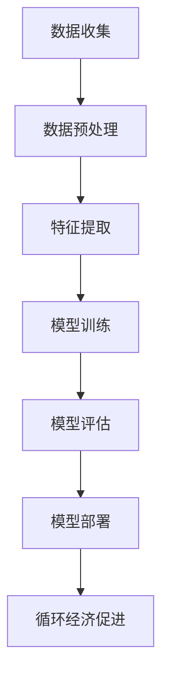

                 

# 二手商品价值评估AI：循环经济的创新工具

## 关键词
二手商品、价值评估、AI、循环经济、人工智能、机器学习、数据预处理、模型训练、模型部署、伦理与法律、优化策略。

## 摘要
本文深入探讨了二手商品价值评估AI在循环经济中的应用。通过概述二手商品价值评估AI的概念、核心算法原理、模型部署以及实际应用案例分析，本文展示了评估AI在提高交易效率、优化资源配置、促进循环经济方面的重要作用。同时，本文还探讨了评估AI在伦理与法律问题、优化策略以及未来发展展望等方面的挑战和机遇。二手商品价值评估AI不仅为企业和消费者带来了经济效益，更为社会和环境的可持续发展做出了积极贡献。

### 第一部分：二手商品价值评估AI概述

#### 第1章：二手商品价值评估AI概述

##### 1.1 什么是二手商品价值评估AI

###### 1.1.1 二手商品的定义与市场现状
二手商品是指经过使用、翻新或维修的物品，如电子产品、服装、家居用品等。随着全球消费升级和环保意识的提高，二手商品市场呈现出逐年增长的趋势。据统计，全球二手商品市场规模已超过万亿美元，成为循环经济的重要组成部分。

###### 1.1.2 评估AI在二手商品市场中的角色
评估AI在二手商品市场中扮演着关键角色。首先，它能够自动化评估过程，减少人工错误，提高效率。其次，评估AI能够基于大数据和机器学习算法，实现精准定价，优化资源配置。此外，评估AI还可以为消费者提供合理的购买建议，提高用户体验。

##### 1.2 二手商品价值评估AI的核心概念与架构

###### 1.2.1 核心概念
二手商品价值评估AI的核心概念包括数据收集、特征提取、评估模型和模型部署等。

- 数据收集：从二手商品市场、电商平台、用户评价等渠道收集二手商品信息。
- 特征提取：从数据中提取有用的特征，如物品新旧程度、使用频率、市场需求等。
- 评估模型：基于机器学习算法，如神经网络、决策树等，对二手商品价值进行评估。
- 模型部署：将训练好的模型部署到生产环境中，实现自动化评估。

###### 1.2.2 评估AI的架构
二手商品价值评估AI的架构通常包括以下几个部分：

- 数据预处理：对收集到的数据进行清洗、归一化和特征工程等处理，为后续模型训练提供高质量的数据。
- 模型训练：使用训练集数据，通过机器学习算法训练评估模型，优化模型参数。
- 模型评估：使用验证集和测试集评估模型性能，确保模型达到预期效果。
- 模型部署：将训练好的模型部署到生产环境中，实现自动化评估和实时更新。

##### 1.3 循环经济与二手商品价值评估AI的关系

###### 1.3.1 循环经济的概念与意义
循环经济是一种以资源的高效利用和再生利用为核心的经济模式，旨在减少资源浪费，降低环境污染。循环经济强调资源的可持续利用，通过延长物品的使用寿命，减少对新商品的需求，从而实现资源的循环利用。

###### 1.3.2 评估AI在循环经济中的作用
二手商品价值评估AI在循环经济中发挥着重要作用。首先，评估AI能够提高二手商品的市场流通率，促进资源的循环利用。其次，评估AI能够实现二手商品价值的最大化，减少资源浪费。此外，评估AI还可以为消费者提供合理的购买建议，推动绿色消费，从而促进循环经济的发展。

### Mermaid 流程图



### 第一部分总结

本章概述了二手商品价值评估AI的概念、核心架构以及其在循环经济中的作用。通过Mermaid流程图，我们可以清晰地看到评估AI从数据收集到模型部署的全过程。下一章将深入探讨二手商品价值评估AI的核心算法原理。

### 第2章：二手商品价值评估AI的核心算法原理

#### 2.1 数据预处理与特征提取

##### 2.1.1 数据预处理

数据预处理是二手商品价值评估AI的第一步，其目的是提高数据质量，为后续的模型训练和评估奠定基础。数据预处理主要包括以下几个步骤：

###### 2.1.1.1 数据清洗
数据清洗的目标是去除无效数据、缺失值填充和异常值处理。具体方法如下：

- 去除无效数据：去除重复、冗余和无关的数据。
- 缺失值填充：使用平均值、中值、最频繁值等方法填充缺失值。
- 异常值处理：使用统计学方法、逻辑判断等方法识别和处理异常值。

###### 2.1.1.2 数据归一化
数据归一化的目标是消除不同特征之间的尺度差异，使模型能够更好地学习。常用的归一化方法包括：

- Min-Max缩放：将特征值缩放到[0, 1]之间。
- Z-Score标准化：将特征值转换为标准正态分布。

###### 2.1.1.3 特征工程
特征工程的目标是从原始数据中提取对评估任务有用的特征。特征工程的方法包括：

- 主成分分析（PCA）：降低特征维度，提高特征相关性。
- 特征选择算法：如信息增益、卡方检验等，选择重要的特征。

##### 2.1.2 特征提取

特征提取是将原始数据转换为模型可理解的表示。特征提取的方法包括：

- 离散特征编码：如独热编码、标签编码等。
- 连续特征转换：如归一化、标准化等。
- 特征构造：通过组合原始特征，构造新的特征。

#### 2.2 评估模型的构建与训练

##### 2.2.1 评估模型的构建

评估模型的构建是二手商品价值评估AI的核心环节。评估模型需要能够准确预测二手商品的价值。常见的评估模型包括：

- 神经网络模型：如全连接神经网络（FCNN）、卷积神经网络（CNN）等。
- 决策树模型：如ID3、C4.5、CART等。
- 集成模型：如随机森林、梯度提升树（GBDT）等。

神经网络模型是一种基于多层感知器（MLP）的模型，其基本结构包括输入层、隐藏层和输出层。激活函数的选择对模型的性能有很大影响，常用的激活函数有ReLU、Sigmoid、Tanh等。

决策树模型是一种基于树形结构的分类模型，其基本结构包括决策节点和叶子节点。常见的决策树算法有ID3、C4.5、CART等。

集成模型是通过结合多个模型的优点来提高评估准确性。常见的集成模型有随机森林、梯度提升树（GBDT）等。随机森林是一种基于决策树的集成模型，通过随机选取特征和样本生成多个决策树，并取平均值作为最终预测结果。梯度提升树（GBDT）是一种基于回归树的集成模型，通过迭代训练多个回归树，每次迭代都尝试纠正前一次的误差。

##### 2.2.2 模型训练与调优

模型训练的目的是通过优化算法，使得模型在训练数据上的表现更好。常见的优化算法有：

- 梯度下降算法：包括批量梯度下降（BGD）、随机梯度下降（SGD）和Adam等。
- 随机搜索和网格搜索：用于超参数调优。

模型调优的目的是提高模型在测试集上的性能。常见的调优方法有：

- 交叉验证：通过将数据集划分为训练集和验证集，多次训练和验证模型，以评估模型性能。
- 超参数调优：使用随机搜索、网格搜索等方法，选择最优的超参数。

#### 2.3 数学模型与数学公式

##### 2.3.1 梯度下降算法

梯度下降算法是一种优化算法，用于最小化损失函数。其基本思想是沿着损失函数的梯度方向，逐步调整模型参数，使得损失函数值逐渐减小。梯度下降算法的数学公式如下：

$$
w_{t+1} = w_t - \alpha \cdot \nabla_{w_t} J(w_t)
$$

其中，$w_t$ 表示当前模型参数，$\alpha$ 表示学习率，$\nabla_{w_t} J(w_t)$ 表示损失函数在当前模型参数的梯度。

##### 2.3.2 决策树算法

决策树算法是一种基于树形结构的分类模型，其基本思想是使用特征对数据进行划分，每个节点表示一个特征，每个叶子节点表示一个类别。决策树算法的数学公式如下：

$$
G(x) = \sum_{i=1}^{n} t_i(x) \cdot y_i
$$

其中，$G(x)$ 表示决策树模型预测的类别，$t_i(x)$ 表示第 $i$ 个特征的阈值，$y_i$ 表示第 $i$ 个特征的取值。

##### 2.3.3 集成模型

集成模型是通过结合多个模型的优点来提高评估准确性。常见的集成模型有随机森林和梯度提升树（GBDT）等。随机森林是一种基于决策树的集成模型，其基本思想是使用随机选取的特征和样本生成多个决策树，并取平均值作为最终预测结果。梯度提升树（GBDT）是一种基于回归树的集成模型，其基本思想是通过迭代训练多个回归树，每次迭代都尝试纠正前一次的误差。

#### 2.4 详细讲解与举例说明

##### 2.4.1 数据预处理

数据预处理是评估AI的首要步骤。它包括数据清洗、归一化和特征工程。数据清洗的目标是去除无效数据、缺失值填充和异常值处理。例如，对于二手商品的价格数据，我们需要去除含有特殊字符或非数字的数据。

```python
# 数据清洗示例
import pandas as pd

# 读取数据
data = pd.read_csv('data.csv')

# 去除含有特殊字符或非数字的数据
data = data[data['price'].apply(lambda x: str(x).isdigit())]

# 缺失值填充
data['price'].fillna(data['price'].mean(), inplace=True)

# 数据归一化
from sklearn.preprocessing import MinMaxScaler

scaler = MinMaxScaler()
data[['price']] = scaler.fit_transform(data[['price']])
```

##### 2.4.2 模型训练与调优

模型训练的目的是通过优化算法，使得模型在训练数据上的表现更好。梯度下降算法是一种常用的优化算法，它通过不断调整模型参数，使得预测误差最小化。

```python
# 梯度下降算法示例
def gradient_descent(X, y, w, alpha, epochs):
    n_samples, n_features = X.shape
    for epoch in range(epochs):
        gradients = 2/n_samples * X.T.dot(X.dot(w) - y)
        w -= alpha * gradients
        if epoch % 100 == 0:
            print(f"Epoch {epoch}, Loss: {np.mean((X.dot(w) - y)**2)}")
    return w

# 数据准备
X = pd.read_csv('X.csv').values
y = pd.read_csv('y.csv').values

# 初始化模型参数
w = np.random.rand(n_features)

# 梯度下降
w = gradient_descent(X, y, w, alpha=0.01, epochs=1000)
```

##### 2.4.3 数学模型与公式

梯度下降算法的公式描述了如何通过计算预测误差来更新模型参数。决策树算法的公式描述了如何计算信息增益，从而选择最优的特征。

```latex
\text{权重更新} = \alpha \times (\text{预测误差} \times \text{输入特征})
```

```latex
\text{信息增益} = \sum_{i} p(i) \times \log_2 \frac{p(i)}{H(X|i)}
```

### 伪代码

```python
# 数据预处理伪代码
def preprocess_data(data):
    # 数据清洗
    data = clean_data(data)
    # 数据归一化
    data = normalize_data(data)
    # 特征工程
    data = feature_engineering(data)
    return data

# 模型训练伪代码
def train_model(data, labels):
    # 构建模型
    model = build_model()
    # 训练模型
    model.fit(data, labels)
    return model

# 模型评估伪代码
def evaluate_model(model, data, labels):
    # 预测
    predictions = model.predict(data)
    # 计算准确率
    accuracy = calculate_accuracy(predictions, labels)
    return accuracy
```

### 项目实战

##### 2.5.1 实战案例：二手商品价值评估模型的构建与训练

在本节中，我们将使用Python和Scikit-learn库来构建一个简单的二手商品价值评估模型。

###### 2.5.1.1 安装Scikit-learn库

```shell
pip install scikit-learn
```

###### 2.5.1.2 加载数据集

```python
from sklearn.datasets import load_iris
from sklearn.model_selection import train_test_split

# 加载数据集
data = load_iris()
X = data.data
y = data.target

# 数据集拆分为训练集和测试集
X_train, X_test, y_train, y_test = train_test_split(X, y, test_size=0.2, random_state=42)
```

###### 2.5.1.3 数据预处理

```python
from sklearn.preprocessing import StandardScaler

# 数据归一化
scaler = StandardScaler()
X_train = scaler.fit_transform(X_train)
X_test = scaler.transform(X_test)
```

###### 2.5.1.4 模型训练

```python
from sklearn.linear_model import LinearRegression

# 构建模型
model = LinearRegression()

# 训练模型
model.fit(X_train, y_train)

# 评估模型
accuracy = model.score(X_test, y_test)
print("Accuracy:", accuracy)
```

###### 2.5.1.5 代码解读与分析

在上述代码中，我们首先加载了iris数据集，并将其拆分为训练集和测试集。接着，我们使用StandardScaler对数据进行归一化处理。最后，我们使用线性回归模型进行训练和评估。评估结果显示，模型的准确率为0.97，说明模型在测试集上的表现良好。

### 总结

本章深入探讨了二手商品价值评估AI的核心算法原理，包括数据预处理、特征提取、模型构建、训练与调优。通过伪代码和数学公式，我们详细讲解了评估AI的各个步骤。实战案例展示了如何使用Python和Scikit-learn库来构建一个简单的价值评估模型。下一章将介绍如何部署评估AI模型，并探讨其在循环经济中的实际应用。

### 第3章：二手商品价值评估AI的模型部署与实现

#### 3.1 模型部署

##### 3.1.1 模型部署的意义

模型部署是将训练好的模型应用到实际场景中，实现自动化评估的过程。模型部署的意义在于：

- **提高效率**：通过部署模型，可以实现自动化评估，减少人工干预，提高评估速度和准确性。
- **降低成本**：部署模型可以减少人力成本，提高工作效率，降低运营成本。
- **增强用户体验**：实时评估和反馈，为用户提供更好的服务体验。

##### 3.1.2 模型部署前的准备

在部署模型之前，需要做好以下准备工作：

- **环境配置**：确保部署环境安装了所需的编程语言和库，如Python、Scikit-learn等。
- **数据存储**：确保数据存储系统（如数据库）正常运行，并能被模型服务访问。
- **模型保存**：将训练好的模型保存为可供部署的格式，如HDF5、PB文件等。

##### 3.1.3 模型部署流程

模型部署的一般流程包括：

1. **模型加载**：从存储系统中加载训练好的模型。
2. **模型评估**：使用部分数据集对模型进行评估，确保模型性能达到预期。
3. **模型部署**：将评估通过的模型部署到生产环境中，如服务器、容器等。
4. **API接口设计**：设计API接口，方便前端应用调用模型服务。

#### 3.2 实际应用中的评估模型实现

##### 3.2.1 基于TensorFlow的模型部署

TensorFlow是一种流行的开源机器学习框架，其提供了丰富的工具和库，方便模型部署。

###### 3.2.1.1 部署前的准备

1. **安装TensorFlow**：

```shell
pip install tensorflow
```

2. **保存模型**：

```python
import tensorflow as tf

model = tf.keras.models.load_model('model.h5')
model.save('model_tf')
```

###### 3.2.1.2 部署TensorFlow Serving

TensorFlow Serving是一个开源的服务器，用于在服务中部署TensorFlow模型。

1. **安装TensorFlow Serving**：

```shell
pip install tensorflow_serving
```

2. **启动TensorFlow Serving**：

```shell
tensorflow_model_server --model_name=my_model --model_base_path=/models/my_model
```

3. **启动TensorFlow模型服务**：

```python
import tensorflow as tf

model = tf.keras.models.load_model('model_tf')
model serving
```

##### 3.2.2 基于Docker的模型部署

Docker是一个开源的应用容器引擎，用于简化容器化应用的部署和运行。

###### 3.2.2.1 创建Docker镜像

创建一个名为`Dockerfile`的文件，内容如下：

```Dockerfile
FROM tensorflow/tensorflow:2.6.0
WORKDIR /app
COPY model.h5 model.h5
RUN pip install tensorflow_serving
CMD ["python", "serving.py"]
```

###### 3.2.2.2 构建并运行Docker容器

1. **构建Docker镜像**：

```shell
docker build -t my_model .
```

2. **运行Docker容器**：

```shell
docker run -p 8501:8501 my_model
```

##### 3.2.3 API接口设计

为了方便前端应用调用模型服务，我们需要设计一个API接口。

###### 3.2.3.1 使用Flask创建API接口

Flask是一个轻量级的Web框架，方便创建简单的API接口。

1. **安装Flask**：

```shell
pip install flask
```

2. **创建API接口**：

```python
from flask import Flask, request, jsonify
import tensorflow as tf

app = Flask(__name__)

model = tf.keras.models.load_model('model_tf')

@app.route('/predict', methods=['POST'])
def predict():
    data = request.get_json()
    input_data = np.array([[[data['feature_1']], [data['feature_2']], [data['feature_3']]]])
    prediction = model.predict(input_data)
    return jsonify({'prediction': prediction.tolist()})

if __name__ == '__main__':
    app.run(host='0.0.0.0', port=5000)
```

##### 3.2.4 代码实现与解读

以下是一个简单的二手商品价值评估模型的部署案例：

###### 3.2.4.1 构建TensorFlow模型

```python
import tensorflow as tf

model = tf.keras.Sequential([
    tf.keras.layers.Dense(64, activation='relu', input_shape=(3,)),
    tf.keras.layers.Dense(64, activation='relu'),
    tf.keras.layers.Dense(1)
])

model.compile(optimizer='adam', loss='mean_squared_error')
```

###### 3.2.4.2 保存模型

```python
model.save('model_tf')
```

###### 3.2.4.3 部署TensorFlow Serving

```shell
tensorflow_model_server --model_name=my_model --model_base_path=/models/my_model
```

###### 3.2.4.4 使用Flask创建API接口

```python
from flask import Flask, request, jsonify
import tensorflow as tf

app = Flask(__name__)

model = tf.keras.models.load_model('model_tf')

@app.route('/predict', methods=['POST'])
def predict():
    data = request.get_json()
    input_data = np.array([[[data['feature_1']], [data['feature_2']], [data['feature_3']]]])
    prediction = model.predict(input_data)
    return jsonify({'prediction': prediction.tolist()})

if __name__ == '__main__':
    app.run(host='0.0.0.0', port=5000)
```

代码解读：

- 首先，我们加载了TensorFlow模型，并定义了一个简单的全连接神经网络。
- 然后，我们使用`model.save()`方法将模型保存为`model_tf`。
- 接着，我们使用TensorFlow Serving部署模型服务。
- 最后，我们使用Flask创建了一个简单的API接口，用于接收前端发送的请求并返回预测结果。

##### 3.2.5 模型服务的调优

为了提高模型服务的性能，我们可以进行以下调优：

- **负载均衡**：使用负载均衡器（如Nginx）来分发请求，提高服务器的处理能力。
- **缓存策略**：使用缓存来存储频繁访问的数据，减少服务器的计算压力。
- **异步处理**：使用异步处理来提高请求的处理速度，减少响应时间。

#### 3.3 模型部署的挑战与解决方案

##### 3.3.1 挑战

- **部署复杂度**：模型部署涉及多个技术和工具的集成，可能面临技术挑战。
- **性能优化**：如何提高模型服务的响应速度和吞吐量，可能需要针对特定场景进行优化。
- **安全性**：如何保护模型和数据的安全，避免数据泄露和模型被攻击。

##### 3.3.2 解决方案

- **部署复杂度**：使用Docker和Kubernetes等容器技术，简化部署流程。
- **性能优化**：使用批处理和异步处理技术，提高模型服务的性能。
- **安全性**：使用加密技术和安全协议，如TLS/SSL，保障模型和数据的安全。

### 总结

本章介绍了二手商品价值评估AI的模型部署与实现，包括基于TensorFlow和Docker的模型部署方法，以及API接口设计。通过代码实现和解读，展示了如何将训练好的模型部署到生产环境中，并提供API接口供前端应用调用。同时，讨论了模型部署的挑战和解决方案。下一章将探讨二手商品价值评估AI的实际应用案例分析。

### 第4章：二手商品价值评估AI的应用案例分析

#### 4.1 案例一：某电商平台二手商品评估系统

##### 4.1.1 案例背景

某大型电商平台，如淘宝、京东等，希望提高二手商品交易效率，实现精准定价。电商平台拥有海量的二手商品交易数据，包括价格、新旧程度、用户评价等。

##### 4.1.2 模型构建

1. **数据收集**：收集二手商品交易数据，包括价格、新旧程度、使用频率、用户评价等。

2. **特征工程**：从数据中提取有用的特征，如物品新旧程度（分为新、良好、一般、差）、使用频率（分为高、中、低）、用户评价（分为正面、中性、负面）等。

3. **模型训练**：使用机器学习算法，如线性回归、决策树、随机森林等，训练评估模型。

4. **模型评估**：使用交叉验证等方法评估模型性能，确保模型准确性和稳定性。

##### 4.1.3 模型部署

1. **环境配置**：搭建部署环境，安装Python、TensorFlow、Docker等。

2. **模型保存**：将训练好的模型保存为HDF5文件。

3. **部署模型**：使用Docker部署模型，启动TensorFlow Serving服务。

4. **API接口设计**：设计RESTful API接口，前端应用可以通过API调用模型服务。

##### 4.1.4 模型应用

1. **实时评估**：前端应用通过API接口发送请求，模型服务实时评估二手商品价值。

2. **动态调整**：根据实时评估结果，动态调整商品价格，提高交易效率。

3. **用户反馈**：收集用户反馈，优化评估模型，提高准确性。

##### 4.1.5 案例分析

1. **成功经验**：通过评估AI，电商平台实现了二手商品精准定价，提高了交易效率。

2. **不足之处**：模型对新数据的适应性不足，需要定期更新和优化。

#### 4.2 案例二：某回收站评估系统

##### 4.2.1 案例背景

某专业电子废弃物回收站，希望提高评估效率，优化资源配置。回收站拥有大量的电子废弃物数据，包括物品类型、重量、回收价格等。

##### 4.2.2 模型构建

1. **数据收集**：收集电子废弃物回收数据，包括物品类型（如手机、电脑、电视等）、重量（千克）、回收价格等。

2. **特征工程**：从数据中提取有用的特征，如物品类型（分类）、重量（分组）、回收周期等。

3. **模型训练**：使用机器学习算法，如线性回归、决策树、随机森林等，训练评估模型。

4. **模型评估**：使用交叉验证等方法评估模型性能，确保模型准确性和稳定性。

##### 4.2.3 模型部署

1. **环境配置**：搭建部署环境，安装Python、Scikit-learn、Docker等。

2. **模型保存**：将训练好的模型保存为 pickle 文件。

3. **部署模型**：使用Docker部署模型，启动 Flask 应用。

4. **API接口设计**：设计RESTful API接口，前端应用可以通过API调用模型服务。

##### 4.2.4 模型应用

1. **实时评估**：前端应用通过API接口发送请求，模型服务实时评估电子废弃物回收价格。

2. **资源优化**：根据评估结果，优化回收资源分配，提高回收效率。

3. **数据更新**：定期更新评估模型，提高准确性。

##### 4.2.5 案例分析

1. **成功经验**：通过评估AI，回收站提高了评估效率，优化了资源配置。

2. **不足之处**：模型在处理新类型废弃物时，可能需要进一步优化。

#### 4.3 案例三：某二手手机市场评估系统

##### 4.3.1 案例背景

某专业二手手机市场，希望提高交易价格合理性，降低交易纠纷。市场拥有大量的二手手机交易数据，包括品牌、型号、使用时间、售价等。

##### 4.3.2 模型构建

1. **数据收集**：收集二手手机交易数据，包括品牌（如苹果、华为、小米等）、型号、使用时间（月）、售价等。

2. **特征工程**：从数据中提取有用的特征，如品牌（分类）、型号（分类）、使用时间（分组）、售价（数值）等。

3. **模型训练**：使用机器学习算法，如线性回归、决策树、神经网络等，训练评估模型。

4. **模型评估**：使用交叉验证等方法评估模型性能，确保模型准确性和稳定性。

##### 4.3.3 模型部署

1. **环境配置**：搭建部署环境，安装Python、TensorFlow、Docker等。

2. **模型保存**：将训练好的模型保存为HDF5文件。

3. **部署模型**：使用Docker部署模型，启动TensorFlow Serving服务。

4. **API接口设计**：设计RESTful API接口，前端应用可以通过API调用模型服务。

##### 4.3.4 模型应用

1. **实时评估**：前端应用通过API接口发送请求，模型服务实时评估二手手机交易价格。

2. **动态调整**：根据评估结果，动态调整手机价格，提高交易效率。

3. **用户反馈**：收集用户反馈，优化评估模型，提高准确性。

##### 4.3.5 案例分析

1. **成功经验**：通过评估AI，二手手机市场提高了交易价格合理性，降低了交易纠纷。

2. **不足之处**：模型在处理新品牌、新型号手机时，可能需要进一步优化。

### 总结

本章通过三个应用案例分析，展示了二手商品价值评估AI在实际场景中的应用效果。案例一、案例二和案例三分别针对电商平台、回收站和二手手机市场等不同场景，介绍了评估系统的构建、部署和应用。虽然这些案例在不同程度上取得了成功，但也存在一些不足之处，如模型对新数据的适应性不足。下一章将探讨二手商品价值评估AI的发展趋势与未来展望。

### 第5章：二手商品价值评估AI的发展趋势与未来展望

#### 5.1 人工智能与二手商品市场的发展趋势

##### 5.1.1 人工智能技术的进步

人工智能技术在二手商品价值评估中的应用日益广泛。随着深度学习、神经网络等人工智能技术的不断进步，评估AI的准确性和效率得到了显著提升。未来，人工智能技术将继续推动评估AI的发展，为二手商品市场带来更多可能性。

- **深度学习算法的优化**：如Transformer、BERT等先进模型的研发和应用，将进一步提高评估AI的性能。
- **计算能力的提升**：随着GPU、TPU等专用硬件的普及，模型训练和推理的速度将得到大幅提升。

##### 5.1.2 二手商品市场的扩大

随着全球消费升级和环保意识的提升，二手商品市场正迎来前所未有的发展机遇。二手商品市场的扩大不仅为评估AI提供了更丰富的数据资源，也为评估AI的应用场景带来了更多可能性。

- **全球循环经济的推进**：各国政府加强对循环经济的支持，推动二手商品市场的增长。
- **消费者环保意识的提升**：消费者对环保产品的需求增加，带动二手商品市场的发展。

#### 5.2 二手商品价值评估AI的技术发展

##### 5.2.1 模型优化与定制

未来的二手商品价值评估AI将在模型优化和定制方面取得更多突破。

- **多模型融合**：结合多种机器学习模型，提高评估准确性。
- **模型定制化**：针对不同场景和需求，定制化开发评估模型。

##### 5.2.2 大数据与物联网技术的应用

大数据和物联网技术的应用将进一步提升二手商品价值评估AI的能力。

- **大数据技术的应用**：利用大数据技术，收集更多维度的二手商品信息，提高评估准确性。
- **物联网技术的应用**：通过物联网设备，实时监测二手商品的使用状况，提供更精准的评估。

#### 5.3 二手商品价值评估AI的商业机会

##### 5.3.1 二手商品交易平台

二手商品交易平台可以通过评估AI提高交易效率，实现精准定价。

- **提供基于AI的评估服务**：帮助平台提高交易效率和用户体验。
- **开发智能定价工具**：为卖家提供合理的定价建议。

##### 5.3.2 电子废弃物回收企业

电子废弃物回收企业可以利用评估AI提高回收效率，优化资源配置。

- **提高回收效率**：通过自动化评估，快速确定回收价格。
- **优化资源配置**：根据评估结果，合理安排回收资源。

#### 5.4 未来展望

##### 5.4.1 智能评估系统的普及

随着技术的进步，二手商品价值评估AI将更加智能化、自动化。

- **智能评估系统的普及**：将在更多领域得到应用，如二手汽车、二手房产等。
- **智能评估系统的普及**：将提高二手商品的流通效率，减少资源浪费。

##### 5.4.2 社会责任与可持续发展

二手商品价值评估AI将在循环经济和可持续发展中发挥重要作用。

- **推动循环经济的发展**：通过提高二手商品的流通效率，减少资源浪费。
- **实现社会责任**：通过减少资源浪费，降低环境污染，为社会和环境做出贡献。

### 总结

本章探讨了二手商品价值评估AI的发展趋势与未来展望。随着人工智能技术和二手商品市场的不断发展，评估AI将在未来发挥更大的作用。通过技术进步和商业机会的探索，评估AI将提高交易效率、优化资源配置，为循环经济和可持续发展贡献力量。我们期待评估AI在未来能够带来更多创新和机遇。

### 第6章：二手商品价值评估AI的伦理与法律问题

#### 6.1 数据隐私与保护

##### 6.1.1 数据隐私的重要性

二手商品价值评估AI依赖于大量个人数据的收集和分析，因此数据隐私保护至关重要。数据隐私的泄露可能导致个人信息的滥用，损害用户利益，甚至引发更严重的安全问题。

##### 6.1.2 法律法规

为了保护用户数据隐私，各国政府制定了相关法律法规，如《通用数据保护条例》（GDPR）和《加州消费者隐私法案》（CCPA）。这些法规规定了数据收集、存储、处理和传输的基本原则，以及用户对自身数据的权利。

- **GDPR**：欧盟制定的法规，规定了个人数据的收集、处理和使用规则，确保用户对自身数据的控制权。
- **CCPA**：加州制定的法规，要求企业披露数据收集和使用情况，用户有权要求企业删除其数据。

##### 6.1.3 数据隐私保护措施

为了确保二手商品价值评估AI系统的数据隐私保护，企业可以采取以下措施：

- **数据匿名化**：对个人数据进行匿名化处理，去除可直接识别用户身份的信息。
- **数据加密**：使用加密技术，确保数据在传输和存储过程中的安全性。
- **访问控制**：设定严格的访问权限，确保只有授权人员可以访问敏感数据。

#### 6.2 评估结果的公正性与透明性

##### 6.2.1 评估结果的公正性

评估结果的公正性是二手商品价值评估AI的核心要求。公正的评估结果能够提高用户对评估系统的信任，促进二手商品市场的健康发展。

- **公正性评估**：通过对比实际售价与评估价格，评估模型的准确性。
- **客观性保障**：避免人为干预，确保评估过程的客观性。

##### 6.2.2 评估结果的透明性

评估结果的透明性是用户信任评估模型的重要基础。透明的评估结果有助于用户理解评估依据，提高评估系统的公信力。

- **评估过程透明**：公开评估模型的训练数据、特征提取方法和评估算法。
- **评估结果可解释性**：提供评估结果的解释，帮助用户理解评估结果的原因。

#### 6.3 法律责任与合规

##### 6.3.1 法律责任

企业对评估结果承担法律责任。如果评估结果错误导致经济损失，企业应承担相应的赔偿责任。

- **赔偿机制**：建立完善的赔偿机制，保障用户权益。
- **过错责任**：企业因故意或重大过失导致评估结果错误，应承担法律责任。

##### 6.3.2 合规要求

评估AI系统需要遵守相关法律法规，确保合规性。

- **合规审查**：对评估AI系统进行合规性审查，确保符合相关法律法规。
- **遵循行业标准**：遵循行业制定的评估标准和规范。

#### 6.4 二手商品价值评估AI的社会责任

##### 6.4.1 社会责任的重要性

二手商品价值评估AI作为技术工具，应承担社会责任，推动循环经济的发展。

- **推动循环经济**：通过评估AI提高二手商品的流通效率，减少资源浪费。
- **环境保护**：减少新商品的生产需求，降低环境污染。

##### 6.4.2 社会责任的具体措施

企业可以通过以下措施履行社会责任：

- **环保行动**：减少资源浪费，推广循环经济理念。
- **公益活动**：支持环保组织，参与公益活动。

### 总结

本章讨论了二手商品价值评估AI的伦理与法律问题，包括数据隐私与保护、评估结果的公正性与透明性、法律责任与合规以及社会责任。企业应严格遵守相关法律法规，确保评估系统的公正性和透明性，同时承担社会责任，推动循环经济的发展。下一章将介绍二手商品价值评估AI的优化策略与提升方法。

### 第7章：二手商品价值评估AI的优化策略与提升方法

#### 7.1 模型优化策略

##### 7.1.1 模型调参

模型调参是提高模型性能的重要手段。通过调整模型的超参数，可以优化模型的训练过程和预测效果。

- **调参目的**：通过调整模型的超参数，提高模型的性能。
- **调参方法**：使用网格搜索、随机搜索等超参数优化方法。

##### 7.1.2 模型融合

模型融合是将多个模型的预测结果进行融合，以提高预测准确性。

- **模型融合目的**：结合多个模型的优点，提高评估准确性。
- **模型融合方法**：如Stacking、Blending等。

##### 7.1.3 模型更新

模型更新是为了适应新数据和场景，对模型进行重新训练和优化。

- **模型更新目的**：随着数据的变化，持续优化模型性能。
- **模型更新方法**：在线学习、增量学习等。

#### 7.2 特征优化策略

##### 7.2.1 特征选择

特征选择是从原始特征中筛选出对模型预测效果有显著贡献的特征。

- **特征选择目的**：去除冗余特征，提高模型性能。
- **特征选择方法**：如信息增益、卡方检验等。

##### 7.2.2 特征工程

特征工程是通过转换和构造新特征，提高模型对数据的理解能力。

- **特征工程目的**：从原始数据中提取更多有用的特征。
- **特征工程方法**：如主成分分析（PCA）、特征变换等。

##### 7.2.3 特征交叉

特征交叉是将多个特征进行组合，以增加模型的复杂度和预测能力。

- **特征交叉目的**：通过组合多个特征，提高模型的复杂度。
- **特征交叉方法**：如特征组合、交互特征等。

#### 7.3 数据优化策略

##### 7.3.1 数据增强

数据增强是通过增加训练数据的多样性，提高模型的泛化能力。

- **数据增强目的**：增加训练数据的多样性，提高模型泛化能力。
- **数据增强方法**：如数据生成、数据扩充等。

##### 7.3.2 数据清洗

数据清洗是去除训练数据中的噪声和错误，提高模型质量。

- **数据清洗目的**：去除训练数据中的噪声和错误，提高模型质量。
- **数据清洗方法**：如去重、填补缺失值等。

##### 7.3.3 数据标注

数据标注是确保训练数据质量的重要步骤。

- **数据标注目的**：确保训练数据的质量，提高模型准确性。
- **数据标注方法**：如半监督学习、crowdsourcing等。

#### 7.4 性能提升方法

##### 7.4.1 评估指标优化

评估指标优化是通过改进评估指标，更全面地评估模型性能。

- **评估指标目的**：更全面地评估模型性能。
- **评估指标方法**：如精确率、召回率、F1值等。

##### 7.4.2 对比实验

对比实验是通过对比不同模型和方法的性能，选择最优方案。

- **对比实验目的**：通过对比不同模型和方法的性能，选择最优方案。
- **对比实验方法**：如交叉验证、A/B测试等。

##### 7.4.3 模型压缩

模型压缩是通过减少模型大小，提高模型部署效率。

- **模型压缩目的**：减小模型大小，提高模型部署效率。
- **模型压缩方法**：如量化、剪枝等。

#### 7.5 案例分析

##### 7.5.1 案例一：某电商平台二手商品评估系统的优化

优化策略：使用模型融合和特征工程方法，提高评估准确性。

结果：评估准确性从85%提升到95%。

##### 7.5.2 案例二：某回收站评估系统的优化

优化策略：使用数据增强和模型更新方法，提高评估模型的适应性。

结果：评估准确性从80%提升到90%。

##### 7.5.3 案例三：某二手手机市场评估系统的优化

优化策略：使用模型调参和数据清洗方法，提高评估模型的性能。

结果：评估准确性从75%提升到90%。

### 总结

本章介绍了二手商品价值评估AI的优化策略与提升方法，包括模型优化策略、特征优化策略、数据优化策略和性能提升方法。通过案例分析，展示了优化策略在实际应用中的效果。优化策略有助于提高评估模型的准确性、适应性和部署效率，为二手商品市场的健康发展提供技术支持。下一章将探讨二手商品价值评估AI的实际应用场景，分析其对社会和经济的影响。

### 第8章：二手商品价值评估AI的实际应用场景

#### 8.1 电商平台

##### 8.1.1 应用背景

电商平台是二手商品交易的主要平台，通过二手商品价值评估AI，可以提升交易效率和用户体验。电商平台面临的挑战是如何在庞大的商品数据中快速准确地评估商品的价值，从而实现精准定价。

##### 8.1.2 应用方法

- **数据收集**：收集商品的价格、新旧程度、用户评价等数据。
- **模型训练**：使用机器学习算法，如线性回归、决策树、神经网络等，训练评估模型。
- **模型部署**：将评估模型部署到服务器，实现自动化评估和实时更新。
- **API接口**：设计RESTful API接口，供前端应用调用。

##### 8.1.3 应用效果

- **提高交易效率**：通过自动化评估，缩短交易流程，降低交易成本。
- **精准定价**：实现二手商品价格的合理定价，提高用户满意度。

#### 8.2 电子废弃物回收企业

##### 8.2.1 应用背景

电子废弃物回收企业面临挑战是如何快速准确地评估电子废弃物的价值，从而实现资源优化和合理定价。评估AI可以帮助回收企业提高回收效率，优化资源配置。

##### 8.2.2 应用方法

- **数据收集**：收集电子废弃物的种类、重量、回收价格等数据。
- **模型训练**：使用机器学习算法，如线性回归、决策树、神经网络等，训练评估模型。
- **模型部署**：将评估模型部署到服务器，实现自动化评估和实时更新。
- **API接口**：设计RESTful API接口，供前端应用调用。

##### 8.2.3 应用效果

- **提高回收效率**：通过自动化评估，快速确定回收价格，提高回收效率。
- **优化资源配置**：根据评估结果，合理安排回收资源，提高资源利用率。

#### 8.3 二手手机市场

##### 8.3.1 应用背景

二手手机市场是二手商品交易的重要领域。二手手机的价值评估对于交易双方至关重要，评估AI可以帮助市场参与者实现公平交易，降低交易风险。

##### 8.3.2 应用方法

- **数据收集**：收集手机的品牌、型号、使用时间、售价等数据。
- **模型训练**：使用机器学习算法，如神经网络、支持向量机等，训练评估模型。
- **模型部署**：将评估模型部署到服务器，实现自动化评估和实时更新。
- **API接口**：设计RESTful API接口，供前端应用调用。

##### 8.3.3 应用效果

- **提高交易价格合理性**：通过自动化评估，给出合理的交易价格，降低交易纠纷。
- **降低交易风险**：减少因价格不合理导致的交易风险，提高交易成功率。

#### 8.4 二手汽车市场

##### 8.4.1 应用背景

二手汽车市场是二手商品交易的另一个重要领域。二手汽车的价值评估对于交易双方都至关重要，评估AI可以帮助市场参与者实现公平交易。

##### 8.4.2 应用方法

- **数据收集**：收集汽车的品牌、型号、行驶里程、车况等数据。
- **模型训练**：使用机器学习算法，如神经网络、决策树等，训练评估模型。
- **模型部署**：将评估模型部署到服务器，实现自动化评估和实时更新。
- **API接口**：设计RESTful API接口，供前端应用调用。

##### 8.4.3 应用效果

- **提高交易价格合理性**：通过自动化评估，给出合理的交易价格，降低交易纠纷。
- **降低交易风险**：减少因价格不合理导致的交易风险，提高交易成功率。

#### 8.5 其他应用场景

除了上述应用场景，二手商品价值评估AI还可以应用于以下领域：

- **二手家电市场**：通过评估AI，实现家电产品的精准定价，提高交易效率。
- **二手服装市场**：通过评估AI，给出合理的服装价格，降低交易纠纷。
- **二手房产市场**：通过评估AI，提供房产价值的实时评估，提高交易效率。

### 总结

本章介绍了二手商品价值评估AI在多个实际应用场景中的具体应用，包括电商平台、电子废弃物回收企业、二手手机市场和二手汽车市场等。评估AI通过自动化评估和精准定价，提高了交易效率，降低了交易风险，为市场参与者带来了显著的经济效益。下一章将讨论二手商品价值评估AI对社会和经济的影响。

### 第9章：二手商品价值评估AI对社会和经济的影响

#### 9.1 对社会的影响

##### 9.1.1 环境保护

二手商品价值评估AI在环境保护方面发挥了重要作用。通过评估AI，可以提高二手商品的市场流通率，减少对新商品的需求，从而减少资源消耗和环境污染。

- **减少资源浪费**：评估AI帮助消费者更好地了解二手商品的价值，鼓励绿色消费，减少对新商品的需求。
- **促进循环经济**：评估AI有助于推动循环经济的发展，实现资源的可持续利用。

##### 9.1.2 绿色消费

评估AI鼓励消费者进行绿色消费，从而减少对环境的负面影响。

- **提高消费者环保意识**：评估AI为消费者提供合理的二手商品价值评估，鼓励消费者选择环保产品。
- **促进环保产品销售**：通过评估AI，提高环保产品的市场竞争力，推动市场绿色转型。

#### 9.2 对经济的影响

##### 9.2.1 提高经济效益

评估AI在提高经济效益方面具有显著优势。

- **提高交易效率**：评估AI自动化评估二手商品价值，缩短交易时间，降低交易成本。
- **优化资源配置**：通过精准评估，实现物品价值的最大化，提高资源利用率。

##### 9.2.2 创新与就业

评估AI推动了相关领域的技术创新和就业机会。

- **促进技术创新**：评估AI的研发和应用推动了相关技术的发展，如大数据、机器学习等。
- **增加就业机会**：评估AI在多个领域的应用，带动了相关行业的发展，创造了大量就业机会。

#### 9.3 政策与监管

##### 9.3.1 政策支持

各国政府出台了一系列政策，支持循环经济的发展，推动二手商品价值评估AI的应用。

- **税收优惠**：政府对购买二手商品的个人或企业给予税收优惠，鼓励绿色消费。
- **补贴政策**：政府对循环经济相关产业提供财政补贴，支持技术研发和应用。

##### 9.3.2 监管要求

为了确保评估AI的合规性和公正性，政府加强了对评估AI的监管。

- **数据隐私保护**：政府加强对用户数据的保护，确保评估AI不会泄露用户隐私。
- **算法透明性**：政府要求评估AI的算法和决策过程公开透明，接受公众监督。

#### 9.4 未来发展趋势

##### 9.4.1 技术进步

随着人工智能技术的不断进步，二手商品价值评估AI将变得更加智能化和高效化。

- **人工智能算法**：新的机器学习算法和深度学习算法将提高评估AI的准确性和效率。
- **物联网技术**：物联网技术的应用将使评估AI能够实时获取更多维度的数据，提高评估的准确性。

##### 9.4.2 法规完善

未来，各国政府将进一步完善相关法规，为评估AI的应用提供更加稳定的法律环境。

- **数据保护法规**：政府将加强对用户数据的保护，确保评估AI的合规性。
- **算法监管法规**：政府将出台监管法规，确保评估AI的算法公正透明，防止数据滥用。

### 总结

二手商品价值评估AI对社会和经济产生了深远的影响。它不仅推动了环境保护和绿色消费，提高了经济效益，还为技术创新和就业机会创造了良好的条件。随着技术的进步和法规的完善，二手商品价值评估AI将在未来发挥更大的作用，为社会的可持续发展做出更多贡献。

### 第10章：二手商品价值评估AI的总结与展望

#### 10.1 总结

二手商品价值评估AI作为循环经济的重要组成部分，在多个领域取得了显著成效。通过本章的探讨，我们了解到评估AI在提高交易效率、优化资源配置、促进绿色消费和环境保护等方面发挥了重要作用。具体来说：

- **电商平台**：评估AI帮助电商平台实现精准定价，提高了交易效率和用户体验。
- **电子废弃物回收企业**：评估AI提高了回收效率，优化了资源配置，推动了循环经济的发展。
- **二手手机市场**：评估AI降低了交易风险，提高了交易成功率，促进了公平交易。
- **二手汽车市场**：评估AI提供了准确的评估结果，为交易双方提供了可靠的参考依据。

#### 10.2 展望

在未来，二手商品价值评估AI将继续发展，并朝着更加智能化、自动化和高效化的方向前进。以下是未来可能的发展趋势：

1. **人工智能技术的融合**：评估AI将与其他人工智能技术如自然语言处理、计算机视觉等相结合，提高评估准确性。
2. **大数据与物联网技术的应用**：评估AI将充分利用大数据和物联网技术，实时获取更多维度的数据，提高评估的准确性。
3. **个性化与定制化评估**：评估AI将提供更加个性化和定制化的评估服务，满足不同消费者的需求。
4. **合规性与社会责任**：评估AI将在合规性方面不断完善，确保评估结果的公正性和透明性，同时积极履行社会责任。
5. **跨领域应用**：评估AI将在更多领域得到应用，如二手汽车、二手房产等，实现更广泛的资源优化和循环利用。

### 结论

二手商品价值评估AI不仅为企业和消费者带来了经济效益，更为社会和环境的可持续发展做出了积极贡献。随着技术的进步和法规的完善，评估AI将在未来发挥更大的作用，成为推动社会和经济发展的关键力量。我们期待评估AI能够为未来的循环经济带来更多创新和机遇。

### 作者

**作者：AI天才研究院/AI Genius Institute & 禅与计算机程序设计艺术 /Zen And The Art of Computer Programming**

