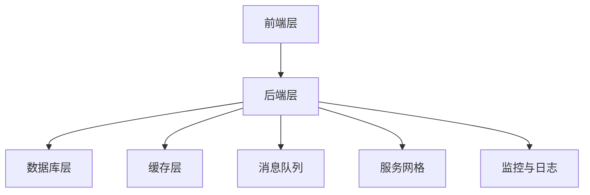
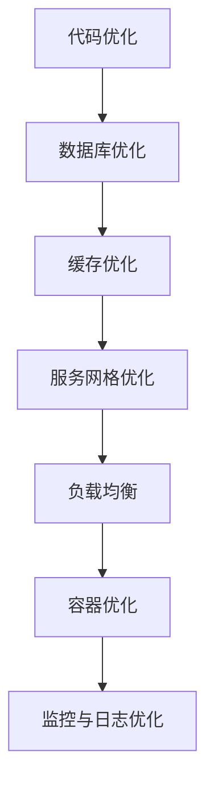
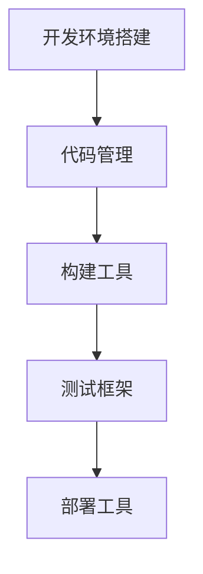
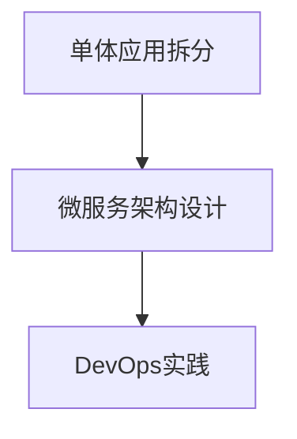
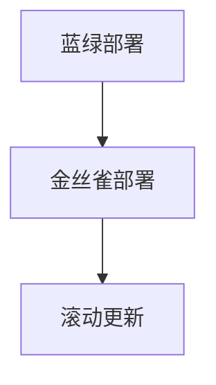
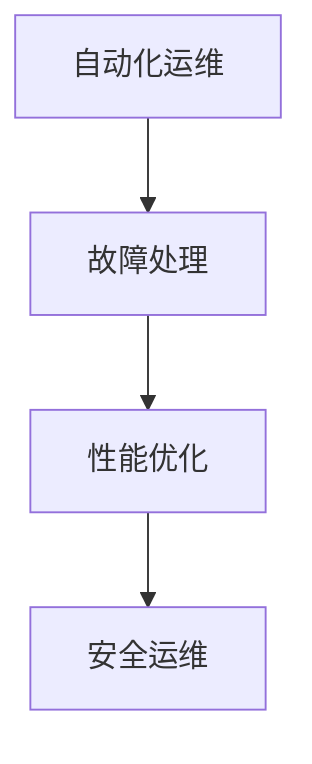
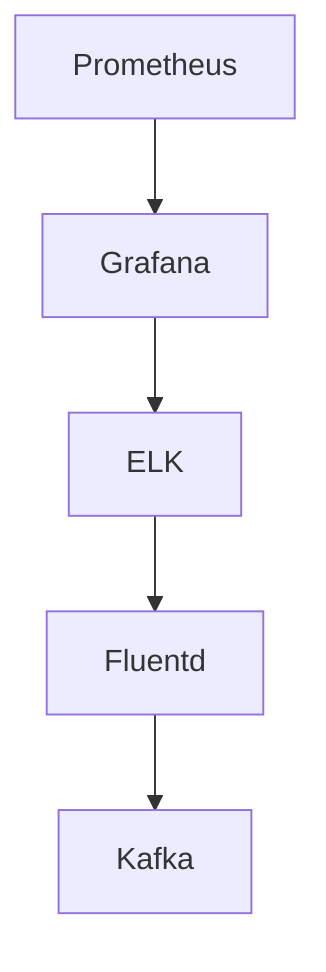
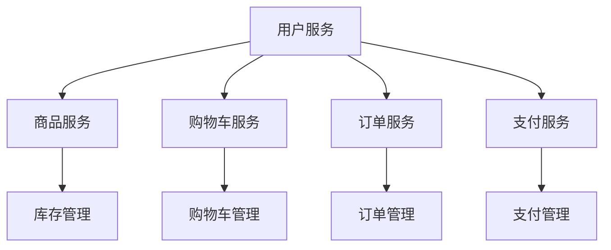

                 

# 《云原生应用开发：现代化架构的实践之路》

> **关键词**：云原生应用开发、容器化技术、微服务架构、Kubernetes、服务网格、持续交付

> **摘要**：本文将深入探讨云原生应用开发的核心概念和实践路径。从云原生概述、容器化技术，到容器编排与自动化，再到服务网格、微服务架构、持续交付，我们将逐步分析云原生应用开发的各个方面。通过丰富的案例和实践经验，本文旨在帮助读者理解并掌握云原生应用的现代化架构设计，为开发高效、可扩展和可靠的应用系统提供指导。

---

## 目录大纲

1. **第一部分：云原生基础**
    1. **第1章：云原生概述**
        1. 1.1 云原生概念与历史背景
        1. 1.2 云原生与传统架构的比较
        1. 1.3 云原生架构的优势
    2. **第2章：容器化技术**
        1. 2.1 容器概述
        2. 2.2 Docker基础
        2. 2.3 容器网络与存储
    3. **第3章：容器编排与自动化**
        1. 3.1 Kubernetes基础
        2. 3.2 Kubernetes资源管理
        3. 3.3 Kubernetes自动化与持续集成

2. **第二部分：云原生服务架构**
    1. **第4章：服务网格技术**
        1. 4.1 服务网格概念
        2. 4.2 Istio基础
        3. 4.3 服务网格的实践应用
    2. **第5章：微服务架构**
        1. 5.1 微服务概述
        2. 5.2 微服务设计原则
        3. 5.3 微服务实践案例
    3. **第6章：持续交付**
        1. 6.1 持续交付的概念
        2. 6.2 持续交付流程
        3. 6.3 持续交付工具选择

3. **第三部分：云原生应用开发实践**
    1. **第7章：云原生应用设计**
        1. 7.1 云原生应用设计原则
        2. 7.2 云原生应用架构设计
        3. 7.3 云原生应用性能优化
    2. **第8章：云原生应用开发**
        1. 8.1 云原生应用开发工具链
        2. 8.2 云原生应用开发模式
        3. 8.3 云原生应用开发案例
    3. **第9章：云原生应用部署与运维**
        1. 9.1 云原生应用部署策略
        2. 9.2 云原生应用运维实践
        3. 9.3 云原生应用监控与日志
    4. **第10章：云原生应用案例剖析**
        1. 10.1 案例选择与概述
        2. 10.2 案例分析
        3. 10.3 案例总结与启示

4. **第四部分：未来展望与趋势**
    1. **第11章：云原生生态与产业趋势**
        1. 11.1 云原生生态的发展
        2. 11.2 云原生技术在行业应用中的趋势
        3. 11.3 云原生未来的发展方向

5. **附录**
    1. **附录A：云原生开发工具与资源**
        1. 1. Kubernetes工具链
        2. 2. 服务网格工具
        3. 3. 云原生应用开发框架
        4. 4. 云原生社区与资源
    2. **附录B：Mermaid流程图与伪代码示例**
        1. 1. 云原生应用架构设计流程图
        2. 2. 容器编排算法伪代码
        3. 3. 微服务架构设计伪代码
    3. **附录C：数学模型与公式解释**
        1. 1. 云原生应用性能评估模型
        2. 2. 机器学习算法数学基础
        3. 3. 常见优化算法数学原理
    4. **附录D：项目实战与代码解读**
        1. 1. 云原生应用开发项目案例
        2. 2. 代码实际案例实现与解析
        3. 3. 源代码详细实现与解读

---

现在，让我们开始深入探讨云原生应用开发的基础知识，以构建现代化架构的应用系统。

## 第一部分：云原生基础

### 第1章：云原生概述

在讨论云原生应用开发之前，我们首先需要了解什么是云原生以及其与传统架构的区别。云原生（Cloud Native）不仅仅是一种技术，更是一种新型的软件架构和开发方法。它起源于云计算时代，强调的是利用云计算的资源动态分配能力和灵活性，构建出具有高可扩展性、高可靠性和高敏捷性的应用系统。

#### 1.1 云原生概念与历史背景

云原生这一概念最早由Google的专家在2013年提出，当时主要是指那些在设计、开发和部署过程中充分利用云计算特性的应用。这些应用具有以下几个核心特征：

- **基于容器**：使用容器作为应用的基本运行单元，确保应用的独立性和可移植性。
- **微服务架构**：将大型应用拆分成多个小型、独立的微服务，每个服务负责一个特定的业务功能。
- **动态管理**：利用自动化工具进行应用的部署、扩展和管理，实现快速响应业务变化。
- **持续交付**：采用持续集成和持续交付（CI/CD）方法，实现应用的快速迭代和持续改进。

云原生的发展历程可以分为以下几个阶段：

1. **基础设施即代码（Infrastructure as Code, IaC）**：通过代码定义和管理基础设施，实现基础设施的自动化部署和配置。
2. **容器化**：容器技术的出现，使得应用的可移植性和隔离性得到了极大的提升。
3. **编排与自动化**：Kubernetes等编排工具的出现，实现了容器化应用的高效管理和自动化部署。
4. **服务网格与微服务**：Service Mesh技术和微服务架构的引入，解决了微服务之间的通信和管理的复杂性。

#### 1.2 云原生与传统架构的比较

传统架构通常基于物理服务器或虚拟机，其应用部署和管理方式相对固定，扩展性和灵活性较差。相比之下，云原生架构具有以下优势：

1. **可扩展性**：云原生架构能够根据业务需求动态调整资源，实现水平和垂直扩展。
2. **可靠性**：通过容器的隔离性和自动化管理，云原生应用具有更高的可靠性。
3. **敏捷性**：云原生架构支持快速迭代和持续交付，提高开发效率。
4. **成本效益**：云原生架构能够充分利用云计算资源，降低运维成本。
5. **安全**：云原生架构提供了丰富的安全机制，如容器安全、网络隔离等。

尽管云原生架构具有诸多优势，但它也带来了一些挑战，如微服务管理的复杂性、数据一致性和服务治理等问题。因此，在引入云原生架构时，需要充分考虑其适用场景和实际需求。

#### 1.3 云原生架构的优势

云原生架构的优势主要体现在以下几个方面：

1. **弹性扩展**：云原生应用能够根据实际负载动态调整资源，实现高效的水平扩展和垂直扩展。
2. **服务自治**：每个微服务都具有独立的部署、升级和监控能力，提高了系统的灵活性和可维护性。
3. **快速迭代**：云原生架构支持持续交付，缩短了软件开发周期，提高了交付速度。
4. **资源共享**：通过容器化和服务网格技术，云原生应用能够高效地共享基础设施资源，降低资源浪费。
5. **可靠性保障**：云原生架构提供了丰富的监控和日志分析工具，确保应用的高可用性和稳定性。

总之，云原生架构为现代化应用开发提供了全新的思路和解决方案。在接下来的章节中，我们将深入探讨云原生技术的基础知识，包括容器化技术、容器编排与自动化，以及服务网格和微服务架构，帮助读者逐步掌握云原生应用开发的实践方法。

## 第2章：容器化技术

容器化技术是云原生应用开发的核心基础之一，它通过将应用及其依赖环境打包成一个独立的容器，实现了应用的可移植性、隔离性和轻量级运行。在本章中，我们将详细介绍容器化技术的基本概念、Docker基础以及容器网络与存储技术。

### 2.1 容器概述

容器是一种轻量级、可执行的软件包，它包含了应用运行所需的所有依赖项，如代码、库、框架、配置文件和运行时环境等。与传统的虚拟机相比，容器具有以下几个显著特点：

1. **轻量级**：容器不包含完整的操作系统，仅包含应用运行所需的库和文件，因此启动速度快、资源占用小。
2. **可移植性**：容器是操作系统级别的虚拟化技术，可以轻松地在不同操作系统和硬件平台上运行，确保应用在不同环境下的兼容性。
3. **隔离性**：容器通过命名空间和文件系统隔离技术，确保每个容器之间互不干扰，提高了系统的稳定性和安全性。
4. **高效性**：容器直接运行在宿主机的操作系统内核上，无需额外的操作系统层，因此性能开销较低。

容器技术的发展经历了多个阶段：

1. **早期容器**：最早期的容器技术，如chroot和cgroups，仅提供了基本的隔离和资源限制功能。
2. **LXC**：Linux容器（LXC）是一种基于命名空间的容器技术，它通过将进程和资源限制在一个独立的命名空间中，实现了轻量级的容器化。
3. **Docker**：Docker是现代容器技术的代表，它引入了容器镜像和容器引擎，提供了强大的容器创建和管理功能。
4. **Kubernetes**：Kubernetes是容器编排和管理平台，它通过自动化管理容器，实现了大规模容器化应用的部署和运维。

### 2.2 Docker基础

Docker是容器技术的先驱和代表，它通过将应用和其依赖环境打包成容器镜像，实现了应用的标准化和可移植性。以下将介绍Docker的基本概念、安装和配置。

#### 2.2.1 Docker基本概念

1. **Docker镜像**：镜像是一个静态的容器模板，它包含了应用的代码、库、框架和运行时环境等所有依赖项。镜像是一个只读的文件系统层，可以通过叠加的方式创建新的容器实例。
2. **Docker容器**：容器是基于镜像的可执行实例，它包含了运行中的应用和其依赖环境。容器是动态的，可以启动、停止、重启和管理。
3. **Docker仓库**：仓库是存储和管理Docker镜像的服务器。用户可以从仓库中拉取镜像，也可以将自己的镜像推送到仓库中。
4. **Docker引擎**：Docker引擎是负责容器创建、运行和管理的核心组件。它通过API和命令行工具与用户交互，实现了容器化的操作和管理。

#### 2.2.2 Docker安装与配置

1. **安装Docker**：在不同操作系统上安装Docker的方法略有不同。以下是基于Linux系统的安装步骤：
    ```bash
    # 更新系统软件包
    sudo apt-get update
    
    # 安装Docker包
    sudo apt-get install docker-ce docker-ce-cli containerd.io
    
    # 启动Docker服务
    sudo systemctl start docker
    
    # 设置Docker服务开机自启
    sudo systemctl enable docker
    ```

2. **配置Docker**：以下是一些常用的Docker配置命令：
    ```bash
    # 查看Docker版本
    docker --version
    
    # 查看容器运行状态
    docker ps
    
    # 启动一个容器
    docker run <image> <command>
    
    # 进入容器
    docker exec -it <container> /bin/bash
    
    # 查看镜像仓库列表
    docker search <keyword>
    
    # 拉取镜像
    docker pull <repository>/<image>:<tag>
    
    # 推送镜像
    docker push <repository>/<image>:<tag>
    ```

#### 2.2.3 Docker镜像制作

1. **创建Dockerfile**：Dockerfile是一个包含一系列指令的文本文件，用于定义如何构建镜像。以下是一个简单的Dockerfile示例：
    ```Dockerfile
    FROM ubuntu:18.04
    
    RUN apt-get update && apt-get install -y nginx
    
    COPY ./nginx.conf /etc/nginx/nginx.conf
    
    COPY . /var/www/html
    
    EXPOSE 80
    
    CMD ["nginx", "-g", "daemon off;"]
    ```

2. **构建镜像**：使用以下命令构建镜像：
    ```bash
    docker build -t my-nginx:latest .
    ```

3. **运行容器**：使用以下命令运行基于该镜像的容器：
    ```bash
    docker run -d -p 8080:80 my-nginx
    ```

### 2.3 容器网络与存储

容器网络和存储是容器化应用的重要组成部分，它们提供了容器之间通信和数据持久化的能力。

#### 2.3.1 容器网络

Docker提供了丰富的容器网络功能，包括：

1. **默认网络**：每个Docker实例都包含一个默认网络，容器默认连接到此网络。
2. **自定义网络**：用户可以创建自定义网络，用于容器之间的通信。自定义网络可以设置不同的网络模式，如bridge、host、macvlan等。

以下是一些常用的Docker网络命令：
```bash
# 创建自定义网络
docker network create my-network

# 查看网络列表
docker network ls

# 连接容器到网络
docker run --network my-network <image> <command>

# 从网络中断开容器
docker network disconnect my-network <container>
```

#### 2.3.2 容器存储

Docker提供了多种存储解决方案，包括：

1. **本地存储**：容器使用本地文件系统进行存储，数据仅限于容器生命周期内。
2. **卷（Volume）**：卷是一种持久化存储解决方案，数据存储在宿主机文件系统中，与容器生命周期无关。
3. **绑定挂载**：绑定挂载允许将宿主机的文件或目录挂载到容器中，实现数据共享。

以下是一些常用的Docker存储命令：
```bash
# 创建卷
docker volume create my-volume

# 查看卷列表
docker volume ls

# 挂载卷到容器
docker run -v my-volume:/data <image> <command>

# 查看容器挂载点
docker inspect <container>
```

通过容器网络和存储技术，我们可以实现容器之间高效的数据传输和共享，为云原生应用开发提供了坚实的基础。在下一章中，我们将继续探讨容器编排与自动化技术，进一步优化容器化应用的部署和管理。

## 第3章：容器编排与自动化

容器编排和自动化是云原生应用开发的重要组成部分，它们使得大规模容器化应用的部署、扩展和管理变得更加高效和可自动化。在本章中，我们将深入探讨Kubernetes（简称K8s）的基础知识，包括其资源管理、自动化与持续集成（CI/CD）方法。

### 3.1 Kubernetes基础

Kubernetes是一个开源的容器编排平台，由Google设计并捐赠给云原生计算基金会（CNCF）。它通过自动化部署、扩展和管理容器化应用，解决了容器化环境中的复杂性问题。Kubernetes具有以下核心组件：

1. **Master节点**：Master节点是Kubernetes集群的管理中心，包括以下组件：
    - **API服务器**：接收并处理集群操作的请求。
    - **调度器**：根据资源需求和策略，将容器部署到合适的节点上。
    - **控制平面**：负责集群的整体状态管理和事件响应。

2. **Node节点**：Node节点是Kubernetes集群的工作节点，包括以下组件：
    - **Kubelet**：在节点上运行，负责容器的创建、启动和管理。
    - **Kube-Proxy**：负责网络代理和负载均衡。
    - **容器运行时**：如Docker、rkt等，负责容器的实际运行。

3. **Pod**：Pod是Kubernetes的基本部署单元，它包含一组相互依赖的容器。Pod提供了容器的运行环境，包括资源共享、调度和管理等功能。

4. **ReplicaSet**：ReplicaSet确保指定数量的Pod副本始终运行，实现应用的容错和高可用性。

5. **Deployment**：Deployment是一个更高层次的管理资源，它提供了一个声明式的更新机制，用于管理ReplicaSet的生命周期。

6. **StatefulSet**：StatefulSet用于管理有状态的应用，如数据库和缓存服务。它确保每个Pod都具有唯一的标识和稳定的网络标识。

7. **Service**：Service提供了一组Pod的逻辑抽象，实现了服务的负载均衡和访问控制。

8. **Ingress**：Ingress提供外部访问集群内部服务的入口，实现了负载均衡和域名解析。

### 3.2 Kubernetes资源管理

Kubernetes通过多种资源对象进行资源管理，包括Pod、Service、Deployment、StatefulSet等。以下是对这些资源对象的基本介绍：

1. **Pod**：Pod是Kubernetes的基本部署单元，它包含一个或多个容器，共享网络命名空间和存储卷。Pod提供了容器间的资源共享和调度。以下是一个简单的Pod定义示例：
    ```yaml
    apiVersion: v1
    kind: Pod
    metadata:
      name: my-pod
    spec:
      containers:
      - name: my-container
        image: my-image
    ```

2. **Service**：Service提供了一组Pod的逻辑抽象，实现了服务的负载均衡和访问控制。Service可以通过DNS名称或Cluster IP访问。以下是一个简单的Service定义示例：
    ```yaml
    apiVersion: v1
    kind: Service
    metadata:
      name: my-service
    spec:
      selector:
        app: my-app
      ports:
        - name: http
          protocol: TCP
          port: 80
          targetPort: 8080
      type: ClusterIP
    ```

3. **Deployment**：Deployment是一个更高层次的管理资源，它提供了一个声明式的更新机制，用于管理ReplicaSet的生命周期。以下是一个简单的Deployment定义示例：
    ```yaml
    apiVersion: apps/v1
    kind: Deployment
    metadata:
      name: my-deployment
    spec:
      replicas: 3
      selector:
        matchLabels:
          app: my-app
      template:
        metadata:
          labels:
            app: my-app
        spec:
          containers:
          - name: my-container
            image: my-image
    ```

4. **StatefulSet**：StatefulSet用于管理有状态的应用，如数据库和缓存服务。它确保每个Pod都具有唯一的标识和稳定的网络标识。以下是一个简单的StatefulSet定义示例：
    ```yaml
    apiVersion: apps/v1
    kind: StatefulSet
    metadata:
      name: my-statefulset
    spec:
      serviceName: my-service
      replicas: 3
      selector:
        matchLabels:
          app: my-app
      template:
        metadata:
          labels:
            app: my-app
        spec:
          containers:
          - name: my-container
            image: my-image
            ports:
            - containerPort: 8080
    ```

### 3.3 Kubernetes自动化与持续集成

自动化和持续集成（CI/CD）是提高开发效率和质量的关键手段。在Kubernetes环境中，我们可以通过自动化工具和CI/CD流程来实现应用的自动化部署、测试和交付。

1. **自动化部署**：Kubernetes提供了多种自动化部署方法，如Kubernetes Deployment、Helm和Ksonnet等。以下是一个简单的Kubernetes Deployment自动化部署示例：
    ```yaml
    apiVersion: apps/v1
    kind: Deployment
    metadata:
      name: my-deployment
    spec:
      replicas: 3
      selector:
        matchLabels:
          app: my-app
      template:
        metadata:
          labels:
            app: my-app
        spec:
          containers:
          - name: my-container
            image: my-image:latest
            ports:
            - containerPort: 8080
    ```

2. **持续集成**：持续集成（CI）是将代码集成到共享版本控制中的过程，以实现自动化测试和构建。常见的CI工具包括Jenkins、GitLab CI和Travis CI等。以下是一个简单的Jenkins CI示例：
    ```yaml
    pipeline {
        agent any
        stages {
            stage('Build') {
                steps {
                    sh 'mvn clean package'
                }
            }
            stage('Test') {
                steps {
                    sh 'mvn test'
                }
            }
            stage('Deploy') {
                steps {
                    sh 'kubectl apply -f deployment.yml'
                }
            }
        }
    }
    ```

3. **持续交付**：持续交付（CD）是将代码从开发环境部署到生产环境的过程。常见的CD工具包括Kubernetes Deployment、Helm和Ksonnet等。以下是一个简单的Kubernetes Deployment持续交付示例：
    ```yaml
    apiVersion: apps/v1
    kind: Deployment
    metadata:
      name: my-deployment
    spec:
      replicas: 3
      selector:
        matchLabels:
          app: my-app
      template:
        metadata:
          labels:
            app: my-app
        spec:
          containers:
          - name: my-container
            image: my-image:latest
            ports:
            - containerPort: 8080
    ```

通过Kubernetes的自动化和持续集成，我们可以实现应用的快速迭代和持续交付，提高开发效率和质量。在下一章中，我们将继续探讨服务网格技术，以解决容器化应用之间的通信和管理问题。

## 第二部分：云原生服务架构

### 第4章：服务网格技术

在云原生应用开发中，服务网格（Service Mesh）是一种用于解决微服务通信、管理和服务发现问题的架构模式。服务网格通过独立的网络层，为微服务提供了可靠的通信通道，并简化了服务管理和监控。本章将详细介绍服务网格的概念、Istio基础及其实践应用。

#### 4.1 服务网格概念

服务网格是一种用于管理服务间通信的网络架构，它将服务之间的通信路由、监控和安全等功能从服务中分离出来，以降低复杂性并提高可维护性。服务网格的核心组件包括：

1. **控制平面（Control Plane）**：控制平面负责管理服务网格的配置和策略，包括服务发现、流量管理和策略实施等。
2. **数据平面（Data Plane）**：数据平面是服务网格中的实际代理组件，负责处理服务间的流量传输和监控。常见的数据平面代理包括Envoy、Istio等。
3. **服务接口（Service Interface）**：服务接口是服务网格中各服务的访问入口，通过控制平面和数据平面实现服务的注册、发现和路由。

服务网格的主要功能包括：

- **服务发现**：服务网格提供了自动化的服务注册和发现机制，使服务能够动态地相互发现并通信。
- **流量管理**：服务网格通过路由规则和策略，实现了流量的控制、限流和负载均衡等功能。
- **服务监控**：服务网格提供了丰富的监控指标和日志收集功能，帮助运维人员实时了解服务的运行状态和性能。
- **安全控制**：服务网格通过访问控制和认证机制，实现了服务之间的安全通信。

#### 4.2 Istio基础

Istio是一个开源的服务网格平台，由Lyft公司开发并捐赠给云原生计算基金会（CNCF）。Istio提供了强大的服务网格功能，包括服务发现、流量管理、服务监控和安全控制等。以下是Istio的基本概念和安装方法。

##### 4.2.1 Istio基本概念

1. **Mixer**：Mixer是Istio的控制平面组件，负责收集服务网格中的遥测数据和策略执行。Mixer分为两个部分：数据平面代理和后端适配器。数据平面代理负责从数据平面代理收集数据，后端适配器负责将数据发送到外部监控系统或策略引擎。
2. **Pilot**：Pilot是Istio的控制平面组件，负责管理服务网格的配置和策略。Pilot通过服务发现机制获取服务信息，并将路由规则和策略下发到数据平面代理。
3. **数据平面代理**：数据平面代理是Istio的数据平面组件，通常嵌入到服务容器中，负责处理服务间的流量传输和监控。常见的数据平面代理包括Envoy和Pipy。
4. **服务定义**：Istio通过服务定义文件来描述服务网格中的服务，包括服务名称、端口、地址等。

##### 4.2.2 Istio安装与配置

1. **安装Istio**：以下是安装Istio的步骤：

    - 安装Istio：

        ```bash
        curl -L https://istio.io/downloadIstio | ISTIO_VERSION=1.10.3 SHA=sha512-xxx sh -
        ```

        其中，`ISTIO_VERSION`和`SHA`是Istio的版本号和校验值，可以在Istio官方网站上找到。

    - 配置环境变量：

        ```bash
        export PATH="$PATH:/path/to/istio-1.10.3/bin"
        ```

    - 启动Istio控制平面：

        ```bash
        istioctl install --set profile=demo
        ```

        `demo`是Istio的安装配置文件，用于简化安装过程。

2. **配置服务定义**：以下是配置Istio服务定义的示例：

    ```yaml
    apiVersion: networking.istio.io/v1alpha3
    kind: ServiceEntry
    metadata:
      name: my-service-entry
    spec:
      hosts:
      - "my-service.com"
      ports:
      - number: 80
        name: http
        protocol: HTTP
      resolution: DNS
      location: MESH_INTERNAL
      addresses:
      - "10.10.10.10"
      servings:
      - port: 80
        route:
        - destination:
            host: my-service
            port: 80
    ```

3. **验证安装**：以下是验证Istio安装的步骤：

    - 验证控制平面：

        ```bash
        kubectl get pods -n istio-system
        ```

        应显示所有Istio控制平面组件正常运行。

    - 验证数据平面：

        ```bash
        istioctl ps -n istio-system
        ```

        应显示所有Istio数据平面代理正常运行。

#### 4.3 服务网格的实践应用

服务网格在云原生应用开发中具有广泛的应用场景，以下是一些常见的实践应用：

1. **服务发现与路由**：服务网格通过服务定义文件实现了服务的自动发现和路由。开发者只需定义服务名称和地址，服务网格将自动处理服务间的路由和负载均衡。
2. **流量管理和监控**：服务网格提供了丰富的流量管理功能，如流量拆分、灰度发布和故障转移等。同时，服务网格还提供了全面的监控指标和日志收集功能，帮助运维人员实时了解服务的运行状态和性能。
3. **安全控制**：服务网格通过访问控制和认证机制实现了服务之间的安全通信。开发者可以定义细粒度的访问策略，确保服务间的通信符合安全要求。
4. **分布式追踪**：服务网格支持分布式追踪技术，如OpenTracing和OpenCensus等。通过服务网格，开发者可以方便地实现跨服务的性能分析和故障定位。

通过服务网格技术，开发者可以轻松管理云原生应用中的服务通信，提高系统的可维护性和可靠性。在下一章中，我们将继续探讨微服务架构，深入分析微服务的设计原则和实践案例。

### 第5章：微服务架构

微服务架构是一种基于将大型应用拆分为多个小型、独立服务的架构风格。这种架构模式具有高可扩展性、高可用性和高敏捷性等优点，适用于快速变化和高度并发的业务场景。在本章中，我们将详细介绍微服务架构的概念、设计原则以及实践案例。

#### 5.1 微服务概述

微服务架构的核心思想是将大型应用分解为多个独立的小型服务，每个服务负责实现一个特定的业务功能。这些服务通过轻量级的通信协议（如HTTP、gRPC等）进行交互，并且可以独立部署、扩展和管理。以下是微服务架构的一些关键特点：

1. **独立性**：每个微服务都是独立开发、部署和管理的，具有自己的代码库、数据库和配置文件。这使得开发团队可以独立地推动各自的进度，而不会受到其他团队的影响。
2. **小型化**：微服务通常较小，具有明确的职责边界，这使得它们更易于理解和维护。小型化还提高了代码的可重用性和可测试性。
3. **可扩展性**：微服务架构支持水平扩展，即通过增加服务实例的数量来提高系统的处理能力。这使得系统能够灵活应对流量变化和负载增长。
4. **自治性**：每个微服务都拥有自己的生命周期，包括创建、部署、监控和升级。这使得系统能够快速响应业务需求的变化，提高了整体系统的弹性。
5. **松耦合**：微服务之间通过轻量级的通信协议进行交互，通常不共享状态或数据。这种松耦合减少了系统之间的依赖关系，提高了系统的稳定性和可维护性。

#### 5.2 微服务设计原则

设计微服务架构时，需要遵循一些关键原则，以确保系统的可扩展性、可靠性和可维护性。以下是微服务设计的主要原则：

1. **单一职责**：每个微服务应仅实现一个明确的业务功能，避免功能过度集中。这有助于提高代码的可读性、可测试性和可维护性。
2. **自治**：每个微服务应具有独立的数据存储和配置，以确保其自主运行。这使得服务之间不会相互依赖，提高了系统的弹性。
3. **独立部署**：微服务应能够独立部署，即一个服务的更新不会影响其他服务的运行。这有助于减少系统停机时间，提高系统的可用性。
4. **异步通信**：微服务之间的通信应采用异步方式，以避免同步调用带来的阻塞和性能问题。常用的异步通信方式包括消息队列和事件总线。
5. **轻量级协议**：微服务之间应使用轻量级的通信协议，如HTTP/REST、gRPC等，以减少通信开销和复杂度。
6. **服务发现与路由**：微服务架构应具备服务发现和路由功能，以自动发现可用服务并选择最优路由。这有助于提高系统的可靠性和性能。
7. **监控与日志**：微服务架构应集成监控和日志系统，以便实时监控服务运行状态和性能，快速定位和解决问题。

#### 5.3 微服务实践案例

以下是一个微服务架构的实践案例，描述了一个电商平台的微服务设计。

##### 案例概述

该电商平台包括多个微服务，每个服务负责一个特定的业务功能，如用户管理、商品管理、订单管理和支付等。以下是各个微服务的简要描述：

1. **用户服务**：负责用户注册、登录、权限管理和个人信息管理等功能。
2. **商品服务**：负责商品信息管理、分类和库存管理等功能。
3. **订单服务**：负责订单创建、支付、发货和取消等功能。
4. **支付服务**：负责处理支付请求、生成支付凭证和退款等功能。
5. **库存服务**：负责商品库存管理和实时同步库存信息。

##### 服务设计

1. **用户服务**：
    - 功能：用户注册、登录、密码找回、权限管理。
    - 数据库：用户表、权限表、认证令牌表。
    - 通信协议：HTTP/REST。

2. **商品服务**：
    - 功能：商品信息管理、分类管理、库存管理。
    - 数据库：商品表、分类表、库存表。
    - 通信协议：HTTP/REST。

3. **订单服务**：
    - 功能：订单创建、支付、发货、取消。
    - 数据库：订单表、订单详情表、支付表。
    - 通信协议：HTTP/REST。

4. **支付服务**：
    - 功能：处理支付请求、生成支付凭证、退款处理。
    - 数据库：支付表、支付凭证表。
    - 通信协议：HTTP/REST。

5. **库存服务**：
    - 功能：商品库存管理、实时同步库存信息。
    - 数据库：库存表。
    - 通信协议：HTTP/REST。

##### 服务间通信

各个微服务之间通过HTTP/REST进行通信，采用异步方式处理请求。以下是一个订单服务的请求流程：

1. 用户发起订单创建请求。
2. 订单服务调用用户服务验证用户身份。
3. 订单服务调用商品服务查询商品信息和库存状态。
4. 订单服务调用库存服务检查库存是否充足。
5. 订单服务创建订单并保存到数据库。
6. 订单服务调用支付服务处理支付请求。
7. 支付服务生成支付凭证并返回给订单服务。
8. 订单服务更新订单状态并返回给用户。

通过微服务架构，该电商平台实现了高可用性、高可扩展性和高敏捷性。开发团队可以独立地开发和部署各个微服务，同时确保系统整体的稳定性和性能。

在下一章中，我们将探讨持续交付，介绍如何通过自动化流程提高开发效率和系统质量。

### 第6章：持续交付

持续交付（Continuous Delivery，简称CD）是一种软件开发实践，旨在通过自动化流程实现软件的快速迭代和持续交付。持续交付的核心目标是确保软件可以随时发布到生产环境，同时保持高质量和高可靠性。在本章中，我们将详细介绍持续交付的概念、流程以及工具选择。

#### 6.1 持续交付的概念

持续交付是一种软件开发和部署方法，其目标是实现软件从开发到交付的自动化和持续过程。持续交付的核心思想包括以下几点：

1. **快速迭代**：通过频繁的迭代和交付，确保软件能够快速适应市场变化和用户需求。
2. **自动化**：通过自动化工具和脚本实现软件构建、测试、部署和监控等各个环节，减少人工干预，提高效率。
3. **高质量**：通过严格的测试和质量控制，确保软件在每次交付时都符合质量标准。
4. **高可靠性**：通过持续监控和反馈机制，确保软件在生产和运维过程中保持高可靠性。

持续交付与传统软件开发方法（如瀑布模型）相比，具有以下几个显著优势：

- **快速响应**：持续交付能够快速响应市场变化和用户需求，缩短软件开发周期。
- **高效率**：通过自动化和标准化流程，减少重复性工作和人工干预，提高开发效率。
- **高质量**：通过严格的测试和质量控制，确保软件在每次交付时都符合质量标准。
- **高可靠性**：通过持续监控和反馈机制，确保软件在生产和运维过程中保持高可靠性。

#### 6.2 持续交付流程

持续交付流程包括多个环节，从代码提交到最终部署到生产环境。以下是持续交付的主要流程：

1. **代码提交**：开发人员将代码提交到版本控制系统，触发持续交付流程。
2. **代码审查**：通过代码审查确保代码质量，防止潜在问题的引入。
3. **自动化构建**：使用构建工具（如Jenkins、GitLab CI等）自动化编译、打包和构建项目。
4. **单元测试**：运行单元测试以确保代码的正确性和功能完整性。
5. **集成测试**：在构建完成后，运行集成测试以确保不同模块之间的交互和兼容性。
6. **性能测试**：对系统进行性能测试，确保在高并发和负载情况下系统的稳定性和性能。
7. **部署到预生产环境**：将构建好的软件部署到预生产环境，进行全面的测试和验证。
8. **用户验收测试（UAT）**：用户对预生产环境进行测试，验证软件的功能和用户体验。
9. **部署到生产环境**：在确保软件质量后，将其部署到生产环境。
10. **监控与反馈**：在生产环境中监控软件的运行状态，收集用户反馈，持续优化软件。

以下是一个简化的持续交付流程示例：

```yaml
# Jenkinsfile
stages:
  - build
  - test
  - deploy

build:
  stage: build
  jobs:
    - name: build-job
      script:
        - echo "Building project..."
        - mvn clean package

test:
  stage: test
  jobs:
    - name: test-job
      script:
        - echo "Running tests..."
        - mvn test

deploy:
  stage: deploy
  jobs:
    - name: deploy-job
      script:
        - echo "Deploying to production..."
        - kubectl apply -f deployment.yml
```

#### 6.3 持续交付工具选择

选择合适的持续交付工具对于实现高效的持续交付流程至关重要。以下是一些常见的持续交付工具及其特点：

1. **Jenkins**：Jenkins是一个开源的持续集成和持续交付工具，支持多种插件和构建模板。它提供了丰富的自动化功能，包括代码构建、测试、部署和监控等。
2. **GitLab CI/CD**：GitLab CI/CD是GitLab内置的持续集成和持续交付工具，支持自动化构建、测试和部署。它通过`.gitlab-ci.yml`文件定义构建和部署流程，易于配置和扩展。
3. **CircleCI**：CircleCI是一个云端的持续集成和持续交付平台，提供了灵活的构建和部署流程。它支持多种编程语言和平台，支持并行构建和测试。
4. **Travis CI**：Travis CI是一个开源的持续集成服务，支持多种编程语言和平台。它通过`.travis.yml`文件定义构建和测试流程，提供了丰富的报告和通知功能。
5. **AWS CodePipeline**：AWS CodePipeline是AWS提供的持续集成和持续交付服务，支持与AWS的其他服务（如AWS CodeCommit、AWS S3、AWS Lambda等）集成。它提供了直观的界面和自动化流程。
6. **Azure DevOps**：Azure DevOps是一个全面的持续集成和持续交付平台，包括版本控制、项目管理、测试和发布等工具。它支持多种构建和部署方法，包括容器化、虚拟机和本地环境。

选择持续交付工具时，应考虑以下因素：

- **需求**：根据项目的具体需求，选择合适的工具。例如，对于需要与特定平台集成的项目，可以选择AWS CodePipeline或Azure DevOps。
- **易用性**：选择易于配置和使用的工具，降低学习成本和复杂度。
- **扩展性**：选择具有良好扩展性的工具，以便在未来扩展功能。
- **成本**：考虑工具的成本，包括许可证费用和使用费用。

通过持续交付，开发者可以快速适应市场需求，提高开发效率和质量。在下一章中，我们将探讨云原生应用的设计与开发，介绍云原生应用的设计原则和开发模式。

### 第7章：云原生应用设计

云原生应用设计是构建现代化、高可扩展性和高可靠性的应用系统的关键。在本章中，我们将详细探讨云原生应用设计的原则、架构设计和性能优化方法。

#### 7.1 云原生应用设计原则

设计云原生应用时，需要遵循一系列原则，以确保应用能够充分利用云原生架构的优势。以下是一些核心设计原则：

1. **微服务化**：将应用分解为多个小型、独立的微服务，每个服务负责一个特定的业务功能。这有助于提高系统的可维护性、可扩展性和可复用性。
2. **容器化**：使用容器将应用及其依赖环境打包成一个独立的单元，确保应用的可移植性和隔离性。容器化使得应用可以轻松地在不同的环境中部署和运行。
3. **动态管理**：利用容器编排工具（如Kubernetes）实现应用的自动化部署、扩展和管理。这有助于提高系统的弹性、可靠性和运维效率。
4. **服务网格**：采用服务网格技术（如Istio）管理服务间的通信，实现服务发现、流量管理和安全控制等功能。服务网格使得服务间通信更加透明和高效。
5. **持续交付**：采用持续交付（CI/CD）方法，实现应用的快速迭代和持续交付。持续交付能够提高开发效率和质量，缩短软件交付周期。
6. **容错和自愈**：设计应用时考虑容错和自愈能力，确保系统在遇到故障时能够自动恢复。这有助于提高系统的可靠性和稳定性。

#### 7.2 云原生应用架构设计

云原生应用的架构设计是构建高效、可扩展和可靠应用系统的关键。以下是一个典型的云原生应用架构设计：

1. **前端层**：前端层负责与用户交互，通常包括Web应用、移动应用或桌面应用。前端层可以采用单页面应用（SPA）、微前端或服务端渲染（SSR）等架构模式，以提高用户体验和性能。
2. **后端层**：后端层负责处理业务逻辑和数据存储，通常包括多个微服务，每个微服务负责一个特定的业务功能。后端层可以采用RESTful API、gRPC、WebSocket等通信协议，实现前后端的有效交互。
3. **数据库层**：数据库层负责存储和管理应用数据，可以采用关系数据库（如MySQL、PostgreSQL）或非关系数据库（如MongoDB、Cassandra）。根据业务需求选择合适的数据库类型，以提高数据存储和查询的性能。
4. **缓存层**：缓存层用于缓存频繁访问的数据，减轻数据库的负载，提高系统的响应速度。常用的缓存技术包括Redis、Memcached等。
5. **消息队列**：消息队列用于异步处理任务和实现服务间的解耦。常用的消息队列技术包括RabbitMQ、Kafka、Pulsar等。
6. **服务网格**：服务网格用于管理服务间的通信，实现服务发现、流量管理和安全控制等功能。常用的服务网格技术包括Istio、Linkerd等。
7. **监控与日志**：监控与日志系统用于实时监控应用的运行状态和性能指标，收集日志数据以实现故障诊断和性能优化。常用的监控与日志技术包括Prometheus、Grafana、ELK（Elasticsearch、Logstash、Kibana）等。

以下是一个简化的云原生应用架构设计流程图：



#### 7.3 云原生应用性能优化

云原生应用性能优化是确保应用在高负载和并发情况下保持高性能的关键。以下是一些常用的性能优化方法：

1. **代码优化**：通过代码重构、性能分析和代码审查，优化应用的算法和逻辑，减少冗余和低效代码。
2. **数据库优化**：优化数据库查询和索引，减少数据库访问延迟，提高数据访问性能。使用缓存技术减少数据库负载。
3. **缓存优化**：优化缓存策略，确保缓存数据的有效性和命中率。合理配置缓存存储容量，避免缓存击穿和缓存雪崩问题。
4. **服务网格优化**：优化服务网格配置，减少服务间通信延迟和开销。合理配置服务网格的流量管理和安全策略，确保服务的高可用性和可靠性。
5. **负载均衡**：采用负载均衡技术，合理分配流量到不同的服务实例，提高系统的处理能力和响应速度。常用的负载均衡技术包括轮询、最少连接数、源IP哈希等。
6. **容器优化**：优化容器配置，如CPU、内存限制和资源配额，确保容器在资源受限的情况下能够高效运行。合理配置容器网络和存储，提高容器性能和稳定性。
7. **监控与日志优化**：通过监控与日志系统实时收集和分析应用的性能数据，快速定位和解决问题。合理配置监控阈值和报警规则，确保系统的稳定性和可靠性。

以下是一个简化的云原生应用性能优化流程图：



通过遵循云原生应用设计原则、进行合理的架构设计和性能优化，我们可以构建高效、可扩展和可靠的应用系统，充分利用云原生架构的优势。在下一章中，我们将探讨云原生应用的开发实践，介绍开发工具链、开发模式以及开发案例。

### 第8章：云原生应用开发

云原生应用开发是一个涉及多个环节的过程，包括选择合适的开发工具链、确定开发模式以及实现具体的开发案例。在本章中，我们将详细探讨这些内容，帮助开发者构建高效、可扩展和可靠的应用系统。

#### 8.1 云原生应用开发工具链

云原生应用开发工具链包括开发环境搭建、代码管理、构建工具、测试框架和部署工具等。以下是一些常用的工具：

1. **开发环境搭建**：
    - **Docker**：用于容器化应用开发，确保应用的可移植性和隔离性。
    - **Kubernetes**：用于容器编排和管理，实现自动化部署、扩展和管理。
    - **Istio**：用于服务网格管理，实现服务发现、流量管理和安全控制。

2. **代码管理**：
    - **Git**：用于版本控制和代码管理，支持分布式开发模式。
    - **GitHub/GitLab**：提供代码托管、协作和持续集成功能。

3. **构建工具**：
    - **Maven/Gradle**：用于构建和打包Java应用。
    - **Dockerfile**：用于构建Docker镜像，确保应用的可移植性和一致性。

4. **测试框架**：
    - **JUnit/TestNG**：用于编写单元测试和集成测试。
    - **Selenium**：用于编写自动化测试脚本，测试Web应用的界面和行为。
    - **JMeter**：用于性能测试，评估系统的负载和响应时间。

5. **部署工具**：
    - **Kubernetes**：用于部署和管理容器化应用。
    - **Helm**：用于Kubernetes的包管理工具，简化应用部署和管理。
    - **Ksonnet**：用于Kubernetes的配置管理工具，提供可重用的配置模板。

以下是一个简化的云原生应用开发工具链流程图：



#### 8.2 云原生应用开发模式

云原生应用开发模式包括单体应用拆分、微服务架构设计和DevOps实践等。以下是一些核心开发模式：

1. **单体应用拆分**：
    - **逐步重构**：将单体应用逐步拆分为多个独立的微服务，保持原有功能不变。
    - **新服务开发**：在原有应用基础上，开发新的微服务，逐步替代旧的服务。

2. **微服务架构设计**：
    - **服务拆分**：根据业务功能，将应用拆分为多个独立的微服务，每个服务负责一个特定的业务功能。
    - **API设计**：为每个微服务设计RESTful API或gRPC接口，实现服务间的通信。
    - **服务发现**：采用服务网格（如Istio）实现服务发现和负载均衡。

3. **DevOps实践**：
    - **持续集成（CI）**：将代码提交到版本控制系统，触发构建和测试流程，确保代码质量和功能完整性。
    - **持续交付（CD）**：通过自动化部署和测试，实现软件的快速迭代和持续交付。
    - **基础设施即代码（IaC）**：使用代码定义和管理基础设施，实现基础设施的自动化部署和配置。

以下是一个简化的云原生应用开发模式流程图：



#### 8.3 云原生应用开发案例

以下是一个简单的云原生应用开发案例，展示如何使用Docker和Kubernetes构建一个简单的博客系统。

1. **项目概述**：

    博客系统包括两个微服务：前端服务和后端服务。前端服务使用React框架实现，后端服务使用Spring Boot框架实现。

2. **Dockerfile**：

    ```Dockerfile
    # 基础镜像
    FROM node:14-alpine
    
    # 设置工作目录
    WORKDIR /app
    
    # 安装依赖
    RUN npm install
    
    # 拷贝前端代码
    COPY frontend/build ./frontend
    
    # 暴露前端服务端口
    EXPOSE 3000
    
    # 启动前端服务
    CMD ["npm", "start"]
    ```

3. **Kubernetes部署文件**：

    ```yaml
    apiVersion: apps/v1
    kind: Deployment
    metadata:
      name: frontend
    spec:
      replicas: 3
      selector:
        matchLabels:
          app: frontend
      template:
        metadata:
          labels:
            app: frontend
        spec:
          containers:
          - name: frontend
            image: frontend:latest
            ports:
            - containerPort: 3000
    
    ---
    apiVersion: v1
    kind: Service
    metadata:
      name: frontend-service
    spec:
      selector:
        app: frontend
      ports:
        - name: http
          protocol: TCP
          port: 80
          targetPort: 3000
      type: LoadBalancer
    ```

4. **部署与运行**：

    - 使用Docker命令构建前端服务的Docker镜像：

        ```bash
        docker build -t frontend:latest .
        ```

    - 使用Kubernetes命令部署前端服务：

        ```bash
        kubectl apply -f frontend.yml
        ```

    - 前端服务运行在Kubernetes集群的LoadBalancer服务上，可以通过外部访问地址访问。

通过这个简单的案例，我们展示了如何使用Docker和Kubernetes构建一个云原生应用。开发者可以根据实际需求，扩展和优化这个应用，构建更复杂和功能更强大的云原生应用系统。

在下一章中，我们将探讨云原生应用的部署与运维，介绍部署策略、运维实践和监控与日志管理。

### 第9章：云原生应用部署与运维

云原生应用的部署与运维是确保应用在分布式环境中稳定运行的关键环节。在本章中，我们将详细介绍云原生应用的部署策略、运维实践以及监控与日志管理。

#### 9.1 云原生应用部署策略

部署策略是确保云原生应用在分布式环境中高效、稳定运行的重要手段。以下是一些常用的部署策略：

1. **水平扩展（Horizontal Scaling）**：通过增加服务实例的数量来提高系统的处理能力。水平扩展适用于读多写少的场景，如前端服务和缓存服务。

2. **垂直扩展（Vertical Scaling）**：通过增加服务实例的硬件资源（如CPU、内存）来提高系统的处理能力。垂直扩展适用于读少写多的场景，如数据库服务和存储服务。

3. **蓝绿部署（Blue-Green Deployment）**：在部署新版本的应用时，先将新版本部署到一小部分用户，观察其运行状况，再逐步切换到全部用户。这种方法可以减少版本切换过程中的风险。

4. **金丝雀部署（Canary Release）**：将新版本部署到一部分用户，观察其运行状况，根据反馈逐步扩大部署范围。这种方法适用于新版本的逐步推广。

5. **滚动更新（Rolling Update）**：在更新应用时，逐个实例地替换旧版本实例，确保新版本实例逐渐替代旧版本实例。这种方法适用于高可用性的应用。

以下是一个简化的云原生应用部署策略流程图：



#### 9.2 云原生应用运维实践

云原生应用运维实践涉及多个方面，包括自动化运维、故障处理和性能优化等。

1. **自动化运维**：通过自动化工具（如Kubernetes、Ansible、Terraform等）实现基础设施和应用的自动化部署、配置和管理，降低运维成本和提高运维效率。

2. **故障处理**：在应用运行过程中，可能遇到各种故障，如服务异常、网络故障和硬件故障等。运维人员需要快速响应和定位故障，采取相应的措施进行故障处理。

3. **性能优化**：通过性能监控和分析，识别系统瓶颈和性能问题，采取优化措施（如缓存、数据库调优、服务网格优化等）提高系统性能。

4. **安全运维**：确保应用在运行过程中的安全性，包括网络安全、数据安全和应用安全等。采取安全策略（如访问控制、加密、防火墙等）保护应用和数据。

以下是一个简化的云原生应用运维实践流程图：



#### 9.3 云原生应用监控与日志管理

监控与日志管理是确保云原生应用稳定运行的重要手段。以下是一些常用的监控与日志管理工具和方法：

1. **监控工具**：

    - **Prometheus**：开源监控解决方案，适用于Kubernetes环境，提供指标收集、告警和可视化等功能。
    - **Grafana**：开源可视化仪表盘工具，与Prometheus集成，提供丰富的监控图表和告警功能。
    - **Kubernetes Metrics Server**：内置的Kubernetes监控组件，提供集群和容器资源使用情况的监控数据。

2. **日志管理**：

    - **ELK（Elasticsearch、Logstash、Kibana）**：开源日志管理解决方案，提供日志收集、存储和可视化功能。
    - **Fluentd**：开源日志收集器，支持多种数据源和输出目标，适用于Kubernetes环境。
    - **Kafka**：分布式消息队列系统，用于大规模日志数据的收集和传输。

以下是一个简化的云原生应用监控与日志管理流程图：



通过合理的部署策略、高效的运维实践和全面的监控与日志管理，开发者可以确保云原生应用在分布式环境中稳定运行，满足高可用性和高可靠性的需求。

在下一章中，我们将通过一个具体案例剖析云原生应用开发与运维的实践过程，帮助读者更好地理解和应用云原生技术。

### 第10章：云原生应用案例剖析

在本章中，我们将通过一个具体的云原生应用案例，详细剖析其开发与运维的实践过程。这个案例将展示如何使用云原生技术构建一个在线购物平台，从需求分析到应用设计，再到开发、部署和运维，全面解析云原生应用的实现过程。

#### 10.1 案例选择与概述

我们选择构建一个在线购物平台作为案例，因为它涉及多个微服务，需要处理大量用户请求和数据存储，适合展示云原生应用开发的各个方面。在线购物平台的主要功能包括用户注册与登录、商品浏览与搜索、购物车管理、订单处理和支付等。

#### 10.2 案例分析

1. **需求分析**：

    在线购物平台的需求分析主要包括以下几个方面：

    - 用户管理：用户注册、登录、权限管理。
    - 商品管理：商品信息展示、分类管理、库存管理。
    - 购物车管理：添加商品、修改数量、删除商品。
    - 订单管理：订单创建、订单状态更新、订单查询。
    - 支付管理：支付请求处理、支付结果通知。

2. **应用设计**：

    根据需求分析，我们设计以下微服务：

    - 用户服务（UserService）：处理用户注册、登录和权限管理。
    - 商品服务（ProductService）：处理商品信息展示、分类管理和库存管理。
    - 购物车服务（CartService）：处理购物车管理功能。
    - 订单服务（OrderService）：处理订单创建、状态更新和查询。
    - 支付服务（PaymentService）：处理支付请求和支付结果通知。

3. **开发过程**：

    开发过程主要分为前端和后端开发，以及各个微服务的集成和测试。

    - 前端开发：使用React框架实现用户界面，采用RESTful API与后端服务进行通信。
    - 后端开发：使用Spring Boot框架实现各个微服务，使用Docker容器化部署服务。

4. **部署与运维**：

    - 部署：使用Kubernetes进行容器编排，实现应用的自动化部署、扩展和管理。
    - 运维：采用Prometheus和Grafana进行监控，使用ELK进行日志管理，确保应用的高可用性和稳定性。

#### 10.3 案例总结与启示

通过这个案例，我们可以总结出以下启示：

1. **微服务架构**：在线购物平台采用了微服务架构，将不同功能模块拆分为独立的微服务，提高了系统的可维护性和扩展性。

2. **容器化与编排**：使用Docker和Kubernetes实现了应用的容器化部署，提高了应用的可移植性和资源利用效率。

3. **自动化与持续交付**：通过CI/CD工具实现了自动化部署和测试，提高了开发效率和软件质量。

4. **监控与日志管理**：采用Prometheus和Grafana进行实时监控，使用ELK进行日志管理，确保了系统的稳定性和可维护性。

5. **安全与可靠性**：在设计和实现过程中，重视安全性，采用了身份验证、访问控制和加密等手段，确保了用户数据的安全。

通过这个案例，我们展示了如何利用云原生技术构建一个高可用性、高扩展性的在线购物平台。开发者可以借鉴这个案例，将云原生技术应用到自己的项目中，构建现代化的应用系统。

在下一章中，我们将探讨云原生生态与产业趋势，分析云原生技术的发展方向和行业应用。

### 第11章：云原生生态与产业趋势

随着云计算和容器技术的不断成熟，云原生技术正在迅速发展，成为现代应用架构的重要方向。在本章中，我们将分析云原生生态的发展、云原生技术在行业应用中的趋势以及云原生未来的发展方向。

#### 11.1 云原生生态的发展

云原生生态的发展离不开开源社区的贡献和企业级的支持。以下是一些推动云原生生态发展的重要因素：

1. **开源社区**：云原生技术开源社区蓬勃发展，众多开源项目如Kubernetes、Docker、Istio、Prometheus等，为开发者提供了丰富的技术资源和实践经验。开源社区的发展加速了云原生技术的普及和应用。

2. **企业支持**：大型科技公司如Google、Microsoft、Amazon、IBM等，纷纷投入资源支持云原生技术的发展。它们不仅在开源社区中贡献代码，还提供了商业化的云原生解决方案，推动了云原生生态的商业化进程。

3. **标准化**：云原生技术的标准化进程正在加速，云原生计算基金会（CNCF）等标准化组织推动了云原生技术的标准化，为开发者提供了统一的接口和协议，提高了不同平台之间的兼容性和互操作性。

4. **社区活动**：全球范围内，云原生技术相关的会议、工作坊和培训活动不断增多，为开发者提供了交流和学习的机会，推动了云原生技术的传播和应用。

#### 11.2 云原生技术在行业应用中的趋势

云原生技术已经在多个行业中得到广泛应用，以下是一些典型的应用趋势：

1. **金融行业**：金融机构采用云原生技术实现业务的敏捷开发和持续交付，提高了系统的可靠性和安全性。例如，银行和保险公司通过容器化和Kubernetes实现了业务的自动化部署和弹性扩展。

2. **零售行业**：零售企业利用云原生技术构建在线购物平台和移动应用，实现个性化推荐和快速响应客户需求。云原生技术使得零售业务能够更灵活地应对市场变化，提高客户满意度。

3. **制造业**：制造业企业通过云原生技术实现生产过程的数字化和智能化，提高了生产效率和质量。例如，自动化生产线和物联网设备的集成，使得生产数据能够实时采集和分析，优化生产流程。

4. **医疗行业**：医疗行业利用云原生技术构建电子健康记录系统、远程诊疗平台和医疗大数据分析平台，提高了医疗服务的效率和质量。云原生技术使得医疗信息系统能够快速部署和扩展，满足不同医疗场景的需求。

5. **媒体与娱乐行业**：媒体和娱乐行业利用云原生技术实现流媒体服务、视频点播和互动游戏等业务的高效运营。云原生架构的弹性扩展能力，使得媒体和娱乐业务能够应对高峰流量的挑战。

#### 11.3 云原生未来的发展方向

云原生技术的发展正处于快速演进阶段，未来将朝着以下方向发展：

1. **智能化**：随着人工智能技术的进步，云原生应用将更加智能化。通过机器学习和数据分析，云原生应用能够实现自我优化、故障预测和自动化运维。

2. **分布式存储**：分布式存储技术的发展，将进一步提升云原生应用的数据存储和处理能力。分布式存储系统能够提供更高的性能、可靠性和可扩展性，满足大规模数据处理的需求。

3. **混合云与多云**：混合云和多云架构将成为云原生应用的主要部署方式。企业将根据业务需求和成本效益，在不同云平台上部署应用，实现灵活的资源管理和优化。

4. **服务网格进化**：服务网格技术将在云原生生态中发挥更重要的作用。随着微服务架构的普及，服务网格将提供更丰富的功能，如动态服务发现、流量管理和安全控制等。

5. **开源生态持续发展**：开源社区将继续推动云原生技术的发展，新的开源项目和工具将不断涌现。开源社区的创新活力，将推动云原生技术不断演进和成熟。

通过分析云原生生态的发展、行业应用趋势以及未来的发展方向，我们可以看到云原生技术在未来几年将继续保持快速增长，为各行业的数字化和智能化转型提供有力支持。

在附录部分，我们将提供云原生开发工具与资源、Mermaid流程图与伪代码示例，以及数学模型与公式解释，帮助读者深入理解云原生应用开发的技术细节。

### 附录

#### 附录A：云原生开发工具与资源

**A.1 Kubernetes工具链**

- **Kubernetes**：官方的容器编排和管理工具，提供集群管理、容器编排、资源调度等功能。
- **Helm**：Kubernetes的包管理工具，用于简化应用的部署和管理。
- **Ksonnet**：Kubernetes的配置管理工具，提供可重用的配置模板。
- **Kubeadm**：用于部署Kubernetes集群的工具。
- **Kubectl**：Kubernetes的命令行工具，用于与Kubernetes集群进行交互。

**A.2 服务网格工具**

- **Istio**：开源的服务网格平台，提供服务发现、流量管理和安全控制等功能。
- **Linkerd**：开源的服务网格代理，提供轻量级服务网格功能。
- **Conduit**：开源的服务网格平台，提供动态服务发现、流量控制和监控功能。

**A.3 云原生应用开发框架**

- **Spring Cloud**：Spring框架的云原生扩展，提供服务发现、配置管理和断路器等功能。
- **Spring Boot**：轻量级的应用框架，简化了应用的开发和部署。
- **Node.js**：开源的JavaScript运行时环境，适用于构建高性能的Web应用。
- **Django**：Python Web开发框架，适用于快速构建Web应用。

**A.4 云原生社区与资源**

- **Cloud Native Computing Foundation (CNCF)**：云原生计算基金会，提供云原生技术的标准化和推广。
- **Kubernetes.io**：Kubernetes的官方文档和资源网站。
- **Istio.io**：Istio的官方文档和资源网站。
- **CNCF官网**：云原生计算基金会官方网站，提供云原生技术的最新动态和资源。

#### 附录B：Mermaid流程图与伪代码示例

**B.1 云原生应用架构设计流程图**



**B.2 容器编排算法伪代码**

```python
# 容器编排算法伪代码
function container编排算法(container_list, resource_constraints):
    for container in container_list:
        if 资源可用(resource_constraints):
            创建容器(container)
            分配资源(resource_constraints)
        else:
            等待资源释放()
    返回容器列表
```

**B.3 微服务架构设计伪代码**

```python
# 微服务架构设计伪代码
function 微服务架构设计(service_list, dependency_map):
    for service in service_list:
        创建服务(service)
        for dependent_service in dependency_map[service]:
            连接服务(dependent_service)
    返回服务列表
```

#### 附录C：数学模型与公式解释

**C.1 云原生应用性能评估模型**

云原生应用性能评估模型通常基于以下公式：

\[ P = \frac{C}{T} \]

其中，\( P \) 表示性能，\( C \) 表示计算能力，\( T \) 表示响应时间。

**C.2 机器学习算法数学基础**

机器学习算法的数学基础包括线性回归、逻辑回归、支持向量机（SVM）等。以下是一个简化的线性回归模型公式：

\[ y = \beta_0 + \beta_1 \cdot x \]

其中，\( y \) 是预测值，\( x \) 是输入特征，\( \beta_0 \) 和 \( \beta_1 \) 是模型参数。

**C.3 常见优化算法数学原理**

常见的优化算法包括梯度下降、牛顿法和共轭梯度法等。以下是一个简化的梯度下降算法公式：

\[ \theta = \theta - \alpha \cdot \nabla_{\theta} J(\theta) \]

其中，\( \theta \) 是模型参数，\( \alpha \) 是学习率，\( \nabla_{\theta} J(\theta) \) 是损失函数 \( J(\theta) \) 关于 \( \theta \) 的梯度。

#### 附录D：项目实战与代码解读

**D.1 云原生应用开发项目案例**

以下是一个简单的云原生应用开发项目案例，展示如何使用Kubernetes和Docker构建一个简单的博客系统。

**D.2 代码实际案例实现与解析**

**Dockerfile**

```dockerfile
# 使用官方的Nginx镜像作为基础镜像
FROM nginx:latest

# 设置Nginx默认的HTML目录为当前目录
COPY ./nginx.conf /etc/nginx/nginx.conf
COPY ./html /usr/share/nginx/html

# 暴露Nginx默认的80端口
EXPOSE 80

# 运行Nginx
CMD ["nginx", "-g", "daemon off;"]
```

**nginx.conf**

```nginx
http {
    server {
        listen       80;
        server_name  localhost;

        location / {
            root   /usr/share/nginx/html;
            index  index.html index.htm;
        }
    }
}
```

**部署与运行**

1. 构建Docker镜像：

    ```bash
    docker build -t blog .
    ```

2. 运行Docker容器：

    ```bash
    docker run -d -p 80:80 blog
    ```

**D.3 源代码详细实现与解读**

**前端代码（index.html）**

```html
<!DOCTYPE html>
<html>
<head>
    <title>我的博客</title>
</head>
<body>
    <h1>欢迎来到我的博客</h1>
</body>
</html>
```

**后端代码（Spring Boot应用）**

```java
@RestController
public class HelloController {

    @GetMapping("/hello")
    public String sayHello() {
        return "Hello, World!";
    }
}
```

**解析**：

- **Dockerfile**：通过Dockerfile将前端代码和配置文件打包成一个Nginx容器镜像，并暴露80端口。
- **nginx.conf**：配置Nginx服务器，将访问请求路由到前端HTML目录。
- **前端代码**：一个简单的HTML页面，展示博客系统的欢迎信息。
- **后端代码**：一个简单的Spring Boot应用，提供/hello端点，用于测试。

通过这个案例，我们展示了如何使用Docker和Kubernetes构建一个简单的博客系统。开发者可以在此基础上扩展和优化，构建功能更丰富的云原生应用。

---

本文通过对云原生应用开发的全过程进行详细剖析，从基础理论到实践案例，全面介绍了云原生技术的应用。云原生应用开发不仅提高了开发效率和系统性能，还为企业的数字化转型提供了有力支持。随着云原生技术的不断成熟，我们可以预见其在未来将进一步推动各个行业的创新发展。希望读者能够通过本文的学习，更好地掌握云原生应用开发的实践方法，并在实际项目中发挥其优势。

## 作者信息

作者：AI天才研究院/AI Genius Institute & 禅与计算机程序设计艺术 /Zen And The Art of Computer Programming

