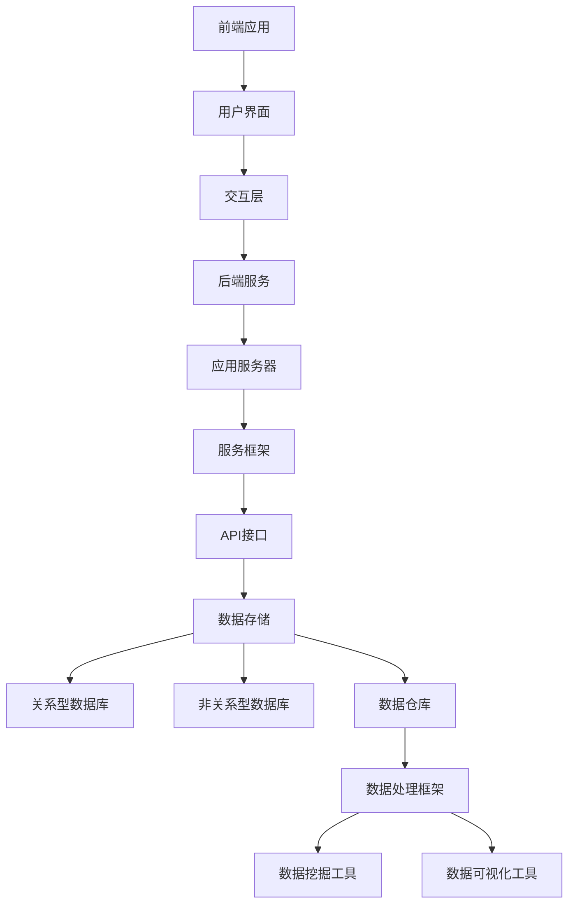

                 

# 《2024京东智能客户关系管理校招面试真题汇总及其解答》

> **关键词：** 智能客户关系管理、校招面试、真题汇总、解答、案例分析、未来趋势

> **摘要：** 本文旨在为广大准备2024年京东智能客户关系管理校招面试的考生提供一份全面的真题汇总与解答，通过对历年面试真题的分析和解答，帮助考生深入了解智能客户关系管理领域的核心知识点，提升面试能力。本文结构清晰，内容详实，包括智能客户关系管理概述、实战案例解析、未来趋势与挑战等部分，旨在为考生提供全方位的学习支持。

## 目录大纲

### 第一部分：智能客户关系管理概述

#### 第1章：智能客户关系管理基础

- 1.1 智能客户关系管理概述
- 1.2 智能客户关系管理的关键要素
- 1.3 智能客户关系管理的技术支撑

#### 第2章：智能客户关系管理实战案例

- 2.1 客户数据管理实战
- 2.2 客户画像构建
- 2.3 客户互动与体验优化
- 2.4 智能客服系统建设
- 2.5 客户价值分析与运营

#### 第3章：客户关系管理平台搭建

- 3.1 客户关系管理平台架构
- 3.2 客户关系管理平台功能
- 3.3 客户关系管理平台实施案例

### 第二部分：智能客户关系管理未来趋势与挑战

#### 第4章：智能客户关系管理未来趋势

- 4.1 人工智能技术在客户关系管理中的应用前景
- 4.2 大数据技术在客户关系管理中的应用
- 4.3 客户关系管理平台演进方向

#### 第5章：智能客户关系管理挑战与应对策略

- 5.1 技术挑战
- 5.2 运营挑战
- 5.3 应对策略

### 附录：智能客户关系管理资源与工具

- 附录A：智能客户关系管理相关资源
- 附录B：智能客户关系管理常用工具
- 附录C：智能客户关系管理实践案例

---

### 第1章：智能客户关系管理基础

#### 1.1 智能客户关系管理概述

智能客户关系管理（Intelligent Customer Relationship Management，简称ICRM）是指利用先进的人工智能技术、大数据分析和云计算等手段，对客户信息进行深入挖掘和分析，从而实现精准营销、个性化服务和高效客户互动的目标。它涵盖了客户数据管理、客户画像构建、客户互动与体验优化、客户价值分析等多个方面。

**定义：**

智能客户关系管理是一种基于人工智能和大数据分析的技术手段，通过对客户信息的收集、存储、分析和应用，实现企业与客户之间的智能互动和深度沟通，从而提升客户满意度和忠诚度，提高企业盈利能力。

**目的和意义：**

- 提高客户满意度：通过个性化服务和精准营销，满足客户的需求，提升客户满意度。
- 提升企业竞争力：通过数据分析，帮助企业发现市场机会，优化业务流程，提高运营效率。
- 降低运营成本：通过智能客服系统和自动化流程，减少人力成本，提高工作效率。
- 提高客户忠诚度：通过持续的客户互动和个性化服务，增强客户对企业品牌的认知和信任，提升客户忠诚度。

**发展历程：**

智能客户关系管理的发展可以分为以下几个阶段：

1. **传统客户关系管理阶段**：以客户关系管理（CRM）系统为核心，主要侧重于客户信息的收集、存储和基本管理。
2. **数据驱动阶段**：引入大数据分析和数据挖掘技术，对客户行为进行分析，实现精准营销和个性化服务。
3. **人工智能阶段**：利用人工智能技术，如机器学习、自然语言处理等，实现更加智能的客户互动和服务。
4. **智能化阶段**：结合物联网、区块链等新兴技术，实现全渠道、全流程的智能客户关系管理。

#### 1.2 智能客户关系管理的关键要素

智能客户关系管理的关键要素包括客户数据管理、客户画像构建、客户互动与体验优化、客户价值分析等。

1. **客户数据管理**：

客户数据管理是智能客户关系管理的基础。它包括客户数据的采集、存储、清洗、整合和分析等环节。

- **数据采集**：通过在线调查、社交媒体、客户互动等渠道收集客户数据。
- **数据存储**：使用大数据技术，如Hadoop、Spark等，对海量客户数据进行存储和管理。
- **数据清洗**：对采集到的数据进行清洗，去除重复、错误和无关数据，保证数据质量。
- **数据整合**：将不同来源和格式的数据整合到统一的数据仓库中，实现数据的一致性和完整性。

2. **客户画像构建**：

客户画像是指通过对客户数据的分析，构建出客户的综合特征和需求模型。客户画像可以包括以下方面：

- **人口统计学特征**：如年龄、性别、职业、收入等。
- **行为特征**：如购买行为、浏览行为、评论行为等。
- **兴趣偏好**：如兴趣爱好、品牌偏好、消费偏好等。
- **需求预测**：根据客户历史行为和特征，预测其未来的需求和购买行为。

3. **客户互动与体验优化**：

客户互动与体验优化是智能客户关系管理的核心。它包括以下方面：

- **智能客服系统**：利用自然语言处理和机器学习技术，实现自动化客户服务，提高服务效率和客户满意度。
- **个性化服务**：根据客户画像和需求，提供个性化的产品推荐和服务。
- **用户体验优化**：通过用户体验设计，优化客户与企业的交互流程，提升客户体验。

4. **客户价值分析**：

客户价值分析是指通过分析客户的历史行为和特征，评估客户对企业价值的贡献，从而制定相应的营销策略和服务计划。

- **客户价值评估**：根据客户的购买频次、购买金额、留存率等指标，评估客户的价值。
- **客户细分**：根据客户价值，将客户分为高价值客户、潜力客户、低价值客户等，制定不同的营销和服务策略。
- **客户生命周期管理**：通过客户生命周期模型，分析客户在不同生命周期阶段的特征和需求，制定相应的营销和服务策略。

#### 1.3 智能客户关系管理的技术支撑

智能客户关系管理的技术支撑主要包括人工智能技术、大数据技术和云计算技术。

1. **人工智能技术**：

人工智能技术是智能客户关系管理的重要支撑。它包括自然语言处理、机器学习、深度学习等技术。

- **自然语言处理**：通过文本挖掘和语义分析，实现人机对话和智能客服。
- **机器学习**：通过数据驱动的方法，自动发现客户行为模式和趋势，实现个性化服务和预测。
- **深度学习**：通过神经网络模型，实现图像识别、语音识别等复杂任务。

2. **大数据技术**：

大数据技术是实现智能客户关系管理的关键。它包括数据采集、存储、处理和分析等技术。

- **数据采集**：通过多种渠道收集客户数据，如在线调查、社交媒体、客户互动等。
- **数据存储**：使用大数据技术，如Hadoop、Spark等，存储和管理海量客户数据。
- **数据处理**：使用大数据技术，对海量客户数据进行清洗、整合和分析。
- **数据分析**：使用大数据技术，实现客户行为分析、需求预测等。

3. **云计算技术**：

云计算技术是实现智能客户关系管理的重要基础设施。它包括云计算平台、云存储、云服务等技术。

- **云计算平台**：提供计算资源和存储资源，支持智能客户关系管理的计算和存储需求。
- **云存储**：提供海量数据的存储解决方案，支持客户数据的长期存储和管理。
- **云服务**：提供各种云服务，如数据处理、分析、安全等，支持智能客户关系管理的实现和应用。

## 第一部分：智能客户关系管理概述

### 第1章：智能客户关系管理基础

#### 1.1 智能客户关系管理概述

智能客户关系管理（Intelligent Customer Relationship Management，简称ICRM）是一种以人工智能、大数据分析和云计算等先进技术为基础的客户关系管理方法。它旨在通过深入挖掘和分析客户数据，实现客户信息的精准掌握、客户需求的准确判断以及客户服务的智能化优化，从而提高企业的客户满意度和市场竞争力。

**智能客户关系管理的核心概念：**

- **客户数据管理**：通过对客户数据的采集、存储、清洗、分析和应用，实现对客户信息的全面了解和管理。
- **客户画像构建**：基于客户数据的分析，构建出具有综合特征的客户画像，以便更精准地满足客户需求。
- **客户互动与体验优化**：通过智能客服、个性化服务和用户体验设计等手段，提升客户互动质量和客户满意度。
- **客户价值分析**：通过对客户行为的分析，评估客户的价值，为企业制定有针对性的营销策略和服务方案。

**智能客户关系管理的发展历程：**

智能客户关系管理的发展可以分为以下几个阶段：

1. **传统CRM阶段**：以客户关系管理（Customer Relationship Management，简称CRM）系统为核心，主要侧重于客户信息的收集、存储和基本管理。
2. **数据驱动CRM阶段**：引入大数据技术和数据挖掘方法，对客户行为进行分析，实现精准营销和个性化服务。
3. **智能CRM阶段**：利用人工智能技术，如机器学习、自然语言处理等，实现更加智能的客户互动和服务。
4. **全方位智能CRM阶段**：结合物联网、大数据、云计算等新兴技术，实现全渠道、全流程的智能客户关系管理。

**智能客户关系管理的目的和意义：**

- **提高客户满意度**：通过个性化服务和精准营销，满足客户的需求，提升客户满意度。
- **提升企业竞争力**：通过数据分析，帮助企业发现市场机会，优化业务流程，提高运营效率。
- **降低运营成本**：通过智能客服系统和自动化流程，减少人力成本，提高工作效率。
- **提高客户忠诚度**：通过持续的客户互动和个性化服务，增强客户对企业品牌的认知和信任，提升客户忠诚度。

**智能客户关系管理的关键要素：**

- **客户数据管理**：数据是智能客户关系管理的核心，客户数据的管理包括数据的采集、存储、清洗、整合和分析等环节。
- **客户画像构建**：通过对客户数据的分析，构建出客户的综合特征和需求模型，以便更精准地满足客户需求。
- **客户互动与体验优化**：通过智能客服、个性化服务和用户体验设计等手段，提升客户互动质量和客户满意度。
- **客户价值分析**：通过对客户行为的分析，评估客户的价值，为企业制定有针对性的营销策略和服务方案。

**智能客户关系管理的技术支撑：**

- **人工智能技术**：包括机器学习、深度学习、自然语言处理等，用于实现客户互动的智能化和个性化服务。
- **大数据技术**：包括数据采集、存储、处理和分析等技术，用于处理和分析海量客户数据。
- **云计算技术**：提供计算资源和存储资源，支持智能客户关系管理的计算和存储需求。

### 1.2 智能客户关系管理的关键要素

智能客户关系管理（ICRM）的成功实施依赖于以下几个关键要素：客户数据管理、客户画像构建、客户互动与体验优化、以及客户价值分析。以下是这些要素的详细解读。

#### 1.2.1 客户数据管理

**客户数据管理**是智能客户关系管理的基石。它包括数据采集、存储、清洗、整合和分析等环节。

- **数据采集**：数据采集是获取客户信息的起点。这些数据可以来源于客户交互、交易记录、社交媒体行为等多个渠道。有效的数据采集需要确保数据的全面性和准确性。

  **Mermaid流程图：**
  ```mermaid
  graph TD
  A[数据采集] --> B[数据存储]
  B --> C[数据清洗]
  C --> D[数据整合]
  D --> E[数据分析]
  E --> F[决策支持]
  ```

- **数据存储**：为了高效地管理客户数据，需要选择合适的存储方案。大数据技术，如Hadoop、Spark，提供了强大的数据存储和处理能力。

  **伪代码示例：**
  ```python
  def store_data(data):
      # 使用Hadoop HDFS存储数据
      hdfs = HadoopFileSystem()
      hdfs.write(data, "data_folder")
  ```

- **数据清洗**：数据清洗是确保数据质量的重要步骤。这一过程包括去除重复记录、纠正错误、填补缺失值等。

  **伪代码示例：**
  ```python
  def clean_data(data):
      # 删除重复记录
      unique_data = remove_duplicates(data)
      # 填补缺失值
      filled_data = fill_missing_values(unique_data)
      return filled_data
  ```

- **数据整合**：通过整合来自不同来源的数据，企业可以构建一个全面的客户视图。

  **伪代码示例：**
  ```python
  def integrate_data(data_sources):
      integrated_data = {}
      for source in data_sources:
          integrated_data.update(source)
      return integrated_data
  ```

- **数据分析**：数据分析是利用统计方法和机器学习算法，从客户数据中提取有价值的信息，用于决策支持。

  **Mermaid流程图：**
  ```mermaid
  graph TD
  A[数据分析] --> B[预测分析]
  B --> C[描述性分析]
  C --> D[决策支持]
  ```

#### 1.2.2 客户画像构建

**客户画像构建**是智能客户关系管理的重要环节，它通过数据分析技术，对客户进行多维度特征刻画，形成客户的综合画像。

- **客户画像概念**：客户画像是一个关于客户的全面描述，包括人口统计信息、行为特征、需求偏好等。

  **伪代码示例：**
  ```python
  def build_customer_profile(data):
      profile = {
          'age': data['age'],
          'gender': data['gender'],
          'location': data['location'],
          '行为特征': data['行为特征'],
          '需求偏好': data['需求偏好']
      }
      return profile
  ```

- **构建方法**：构建客户画像通常包括以下步骤：

  1. 数据收集：收集客户的各项信息。
  2. 数据清洗：清洗和整理数据，去除噪音和错误。
  3. 特征提取：从数据中提取关键特征。
  4. 模型训练：使用机器学习算法，对特征进行建模。
  5. 画像生成：基于模型生成客户画像。

- **应用**：客户画像在企业中有着广泛的应用，如个性化推荐、精准营销、客户细分等。

  **伪代码示例：**
  ```python
  def apply_customer_profile(profile):
      # 根据客户画像进行个性化推荐
      recommendations = recommend_products(profile)
      return recommendations
  ```

#### 1.2.3 客户互动与体验优化

**客户互动与体验优化**是提高客户满意度和忠诚度的关键。智能客户关系管理通过多种手段来实现这一目标。

- **智能客服系统**：利用人工智能技术，如自然语言处理和机器学习，实现自动化的客户服务。

  **伪代码示例：**
  ```python
  def intelligent_csf(message):
      # 使用NLP技术解析客户请求
      intent = nlp.parse_intent(message)
      # 根据意图返回响应
      response = generate_response(intent)
      return response
  ```

- **个性化服务**：根据客户画像和需求，提供个性化的产品推荐和服务。

  **伪代码示例：**
  ```python
  def personalized_service(profile):
      # 根据客户画像提供个性化推荐
      recommendations = recommend_products(profile)
      # 向客户发送推荐信息
      send_recommendations(recommendations, profile['email'])
  ```

- **用户体验优化**：通过用户体验设计，优化客户与企业的交互流程，提升客户体验。

  **Mermaid流程图：**
  ```mermaid
  graph TD
  A[用户互动] --> B[体验分析]
  B --> C[界面设计]
  C --> D[服务改进]
  D --> E[用户反馈]
  ```

#### 1.2.4 客户价值分析

**客户价值分析**是智能客户关系管理中的一项核心任务，它旨在评估客户对企业价值的贡献，从而制定有效的营销策略和服务方案。

- **客户价值评估**：通过分析客户的购买行为、互动频率、留存率等指标，评估客户的价值。

  **伪代码示例：**
  ```python
  def evaluate_customer_value(customer_data):
      # 计算客户价值
      value = calculate_value(customer_data)
      return value
  ```

- **客户细分**：根据客户价值，将客户分为高价值客户、潜力客户、低价值客户等，为企业提供不同的服务策略。

  **伪代码示例：**
  ```python
  def customer_segmentation(customers):
      segments = segment_customers_by_value(customers)
      return segments
  ```

- **客户生命周期管理**：通过分析客户在不同生命周期阶段的特征和需求，制定相应的营销策略和服务方案。

  **伪代码示例：**
  ```python
  def manage_customer_life_cycle(customers):
      strategies = generate_life_cycle_strategies(customers)
      return strategies
  ```

#### 1.3 智能客户关系管理的技术支撑

智能客户关系管理的实现依赖于多种先进技术，包括人工智能技术、大数据技术和云计算技术。

- **人工智能技术**：包括机器学习、深度学习、自然语言处理等，用于实现客户互动的智能化和个性化服务。

  **伪代码示例：**
  ```python
  def train_model(data):
      # 训练机器学习模型
      model = MachineLearningModel()
      model.train(data)
      return model
  ```

- **大数据技术**：包括数据采集、存储、处理和分析等技术，用于处理和分析海量客户数据。

  **伪代码示例：**
  ```python
  def process_data(data):
      # 使用大数据技术处理数据
      processed_data = BigDataProcessor().process(data)
      return processed_data
  ```

- **云计算技术**：提供计算资源和存储资源，支持智能客户关系管理的计算和存储需求。

  **伪代码示例：**
  ```python
  def deploy_application():
      # 部署智能客户关系管理应用
      cloud_provider.deploy_app("icrm_app")
  ```

### 第2章：智能客户关系管理实战案例

#### 2.1 客户数据管理实战

**客户数据管理实战**是智能客户关系管理的重要应用之一。以下是具体的实战步骤和案例。

**实战步骤：**

1. **数据采集**：
   - 通过在线调查、客户互动、社交媒体等渠道收集客户数据。
   - 使用数据爬虫等技术，自动化采集公开的社交媒体数据。

   **伪代码示例：**
   ```python
   def collect_data():
       surveys = get_survey_data()
       social_media = get_social_media_data()
       data = surveys + social_media
       return data
   ```

2. **数据存储**：
   - 使用大数据存储技术，如Hadoop HDFS，存储海量客户数据。
   - 设计数据存储架构，确保数据的安全性和可靠性。

   **伪代码示例：**
   ```python
   def store_data(data):
       hdfs = HadoopFileSystem()
       hdfs.write(data, "customer_data")
   ```

3. **数据清洗**：
   - 清除重复记录、纠正错误、填补缺失值，提高数据质量。
   - 使用ETL（提取、转换、加载）工具，自动化数据清洗过程。

   **伪代码示例：**
   ```python
   def clean_data(data):
       unique_data = remove_duplicates(data)
       filled_data = fill_missing_values(unique_data)
       return filled_data
   ```

4. **数据整合**：
   - 整合来自不同渠道的客户数据，构建全面的客户视图。
   - 使用数据仓库技术，实现数据的一致性和完整性。

   **伪代码示例：**
   ```python
   def integrate_data(data_sources):
       integrated_data = {}
       for source in data_sources:
           integrated_data.update(source)
       return integrated_data
   ```

5. **数据分析**：
   - 使用数据分析工具，如Python、R等，对客户数据进行统计分析和数据挖掘。
   - 提取有价值的信息，用于客户细分和个性化推荐。

   **伪代码示例：**
   ```python
   def analyze_data(data):
       insights = data_analyzer.analyze(data)
       return insights
   ```

**案例：电商平台智能客户关系管理**

**案例背景：**
一家大型电商平台希望通过智能客户关系管理，提升客户满意度、提高复购率，并优化营销策略。

**解决方案：**

1. **数据采集**：
   - 通过网站点击、购物车行为、评论等渠道，收集客户数据。
   - 使用数据爬虫，自动化采集社交媒体和论坛上的用户反馈。

   **伪代码示例：**
   ```python
   def collect_电商_data():
       web_data = get_website_data()
       social_media = get_social_media_data()
       data = web_data + social_media
       return data
   ```

2. **数据存储**：
   - 使用Hadoop HDFS存储海量客户数据。
   - 设计数据存储架构，确保数据的安全性和可靠性。

   **伪代码示例：**
   ```python
   def store_电商_data(data):
       hdfs = HadoopFileSystem()
       hdfs.write(data, "customer_data")
   ```

3. **数据清洗**：
   - 清除重复记录、纠正错误、填补缺失值，提高数据质量。
   - 使用ETL工具，自动化数据清洗过程。

   **伪代码示例：**
   ```python
   def clean_电商_data(data):
       unique_data = remove_duplicates(data)
       filled_data = fill_missing_values(unique_data)
       return filled_data
   ```

4. **数据整合**：
   - 整合来自网站、社交媒体等多个渠道的客户数据，构建全面的客户视图。
   - 使用数据仓库技术，实现数据的一致性和完整性。

   **伪代码示例：**
   ```python
   def integrate_电商_data(data_sources):
       integrated_data = {}
       for source in data_sources:
           integrated_data.update(source)
       return integrated_data
   ```

5. **数据分析**：
   - 使用数据分析工具，分析客户行为、偏好和需求。
   - 提取有价值的信息，用于客户细分和个性化推荐。

   **伪代码示例：**
   ```python
   def analyze_电商_data(data):
       insights = data_analyzer.analyze(data)
       return insights
   ```

**实施效果：**
通过智能客户关系管理，电商平台实现了以下效果：
- **客户满意度提升**：通过个性化推荐和精准营销，提升了客户满意度。
- **复购率提高**：通过持续的客户互动和个性化服务，提高了复购率。
- **营销策略优化**：基于数据分析，优化了营销策略，提高了广告投放效果。

#### 2.2 客户画像构建

**客户画像构建**是智能客户关系管理中的重要环节。以下是如何构建客户画像的具体步骤和案例。

**构建步骤：**

1. **数据采集**：
   - 收集客户的基本信息，如年龄、性别、职业、地理位置等。
   - 收集客户的行为数据，如购买历史、浏览行为、互动记录等。

   **伪代码示例：**
   ```python
   def collect_data():
       basic_info = get_basic_info()
       behavior_data = get_behavior_data()
       data = basic_info + behavior_data
       return data
   ```

2. **数据清洗**：
   - 清除重复和错误数据，确保数据质量。
   - 填补缺失值，使得数据更加完整。

   **伪代码示例：**
   ```python
   def clean_data(data):
       unique_data = remove_duplicates(data)
       filled_data = fill_missing_values(unique_data)
       return filled_data
   ```

3. **特征提取**：
   - 从数据中提取关键特征，如购买频次、购买金额、浏览时长等。
   - 使用特征工程技术，如特征选择和特征转换，优化特征质量。

   **伪代码示例：**
   ```python
   def extract_features(data):
       features = extract_key_features(data)
       optimized_features = apply_feature_engineering(features)
       return optimized_features
   ```

4. **模型训练**：
   - 使用机器学习算法，如聚类分析、关联规则挖掘等，对特征进行建模。
   - 训练出具有良好预测能力的模型。

   **伪代码示例：**
   ```python
   def train_model(features):
       model = MachineLearningModel()
       model.train(features)
       return model
   ```

5. **画像生成**：
   - 基于模型生成客户的综合画像。
   - 分析画像结果，提取客户的特征和需求。

   **伪代码示例：**
   ```python
   def generate_profile(model, data):
       profiles = model.generate_profiles(data)
       return profiles
   ```

**案例：在线零售平台客户画像**

**案例背景：**
一家在线零售平台希望通过客户画像，实现精准营销和个性化推荐。

**解决方案：**

1. **数据采集**：
   - 收集客户的基本信息，如年龄、性别、地理位置等。
   - 收集客户的购买历史、浏览行为、互动记录等数据。

   **伪代码示例：**
   ```python
   def collect_零售平台_data():
       basic_info = get_basic_info()
       behavior_data = get_behavior_data()
       data = basic_info + behavior_data
       return data
   ```

2. **数据清洗**：
   - 清除重复和错误数据，确保数据质量。
   - 填补缺失值，使得数据更加完整。

   **伪代码示例：**
   ```python
   def clean_零售平台_data(data):
       unique_data = remove_duplicates(data)
       filled_data = fill_missing_values(unique_data)
       return filled_data
   ```

3. **特征提取**：
   - 提取关键特征，如购买频次、购买金额、浏览时长等。
   - 使用特征工程技术，如特征选择和特征转换，优化特征质量。

   **伪代码示例：**
   ```python
   def extract_features_零售平台(data):
       features = extract_key_features(data)
       optimized_features = apply_feature_engineering(features)
       return optimized_features
   ```

4. **模型训练**：
   - 使用聚类分析算法，如K-means，对特征进行建模。
   - 训练出具有良好预测能力的模型。

   **伪代码示例：**
   ```python
   def train_model_零售平台(features):
       model = ClusteringModel()
       model.train(features)
       return model
   ```

5. **画像生成**：
   - 基于模型生成客户的综合画像。
   - 分析画像结果，提取客户的特征和需求。

   **伪代码示例：**
   ```python
   def generate_profile_零售平台(model, data):
       profiles = model.generate_profiles(data)
       return profiles
   ```

**实施效果：**
通过构建客户画像，在线零售平台实现了以下效果：
- **精准营销**：根据客户画像，实现个性化推荐和精准营销，提高了转化率。
- **个性化服务**：根据客户画像，提供个性化的购物体验和服务，提升了客户满意度。
- **优化运营策略**：基于客户画像的分析，优化了运营策略，提高了业务效率。

#### 2.3 客户互动与体验优化

**客户互动与体验优化**是智能客户关系管理的核心任务之一，旨在通过智能客服系统、个性化服务和用户体验设计，提升客户满意度和忠诚度。以下是具体的实战步骤和案例。

**实战步骤：**

1. **智能客服系统建设**：
   - 设计并实施智能客服系统，实现自动化的客户服务。
   - 使用自然语言处理（NLP）和机器学习技术，提高客服系统的智能水平。

   **伪代码示例：**
   ```python
   def build_intelligent_csf():
       # 使用NLP技术处理客户请求
       nlp_processor = NLPProcessor()
       # 使用机器学习算法进行预测
       ml_predictor = MLModel()
       # 部署智能客服系统
       csf = IntelligentCSF(nlp_processor, ml_predictor)
       return csf
   ```

2. **个性化服务实施**：
   - 根据客户画像和需求，提供个性化的产品推荐和服务。
   - 设计个性化营销策略，如优惠券、定制化产品等。

   **伪代码示例：**
   ```python
   def implement_personalized_service(profile):
       # 根据客户画像进行个性化推荐
       recommendations = personalized_recommendations(profile)
       # 发送个性化推荐
       send_recommendations(recommendations, profile['email'])
   ```

3. **用户体验设计**：
   - 设计用户友好的交互界面，优化用户操作流程。
   - 通过A/B测试和用户反馈，不断改进用户体验。

   **伪代码示例：**
   ```python
   def design_user_experience():
       # 设计用户界面
       ui = UserInterface()
       # 进行A/B测试
       ab_test = ABTester()
       # 收集用户反馈
       feedback = collect_user_feedback()
       # 优化用户体验
       ui.optimize_experience(ab_test, feedback)
   ```

**案例：金融机构智能客户关系管理**

**案例背景：**
一家金融机构希望通过智能客户关系管理，提升客户互动体验，增强客户忠诚度。

**解决方案：**

1. **智能客服系统建设**：
   - 设计并实施智能客服系统，通过自然语言处理技术，自动回答客户问题。
   - 集成机器学习模型，进行客户情感分析和智能推荐。

   **伪代码示例：**
   ```python
   def build_financial_csf():
       nlp_processor = NLPProcessor()
       ml_predictor = MLModel()
       csf = IntelligentCSF(nlp_processor, ml_predictor)
       return csf
   ```

2. **个性化服务实施**：
   - 根据客户的财务状况和需求，提供个性化的理财产品推荐。
   - 通过客户画像，实现定制化的金融服务。

   **伪代码示例：**
   ```python
   def implement_financial_service(profile):
       recommendations = personalized_recommendations(profile)
       send_recommendations(recommendations, profile['email'])
   ```

3. **用户体验设计**：
   - 设计简洁易用的网上银行界面，提升用户操作体验。
   - 通过A/B测试和用户反馈，持续优化用户界面。

   **伪代码示例：**
   ```python
   def design_financial_ui():
       ui = UserInterface()
       ab_test = ABTester()
       feedback = collect_user_feedback()
       ui.optimize_experience(ab_test, feedback)
   ```

**实施效果：**
通过智能客户关系管理，金融机构实现了以下效果：
- **客户互动体验提升**：智能客服系统的实施，大大提高了客户问题的响应速度和解决效率。
- **客户满意度提高**：个性化服务的提供，满足了客户的多样化需求，提升了客户满意度。
- **客户忠诚度增强**：持续优化的用户体验，增强了客户对金融机构的信任和忠诚度。

#### 2.4 智能客服系统建设

**智能客服系统建设**是智能客户关系管理的重要组成部分，它通过集成人工智能技术，提供自动化、高效且个性化的客户服务。以下是智能客服系统建设的关键步骤、架构设计和核心算法。

**关键步骤：**

1. **需求分析**：
   - 明确系统功能需求，如自动回答常见问题、智能推荐产品、客户情感分析等。
   - 分析客户交互数据，确定系统性能指标。

2. **系统设计**：
   - 设计系统的总体架构，包括前端界面、后端服务、数据存储等。
   - 确定系统模块，如自然语言处理模块、推荐系统模块、客户关系管理模块等。

3. **技术选型**：
   - 选择合适的人工智能和大数据技术，如自然语言处理（NLP）、机器学习（ML）、深度学习（DL）等。
   - 确定数据库和数据存储方案，如MySQL、MongoDB、Hadoop等。

4. **开发实现**：
   - 根据系统设计，开发各个模块的功能。
   - 实现数据采集、处理、存储和分析的自动化流程。

5. **测试部署**：
   - 对系统进行功能测试、性能测试和安全测试。
   - 部署系统到生产环境，进行实际应用。

**架构设计：**

智能客服系统的架构通常包括以下几个层次：

- **前端界面**：提供用户交互的入口，包括网站、移动应用、聊天窗口等。
- **后端服务**：处理用户请求，实现自然语言处理、推荐系统、客户关系管理等核心功能。
- **数据存储**：存储用户数据、对话记录、分析结果等，通常使用关系型数据库和非关系型数据库相结合。
- **大数据平台**：用于大数据的采集、处理和分析，如Hadoop、Spark等。

**核心算法：**

智能客服系统的核心算法包括自然语言处理（NLP）、机器学习（ML）和深度学习（DL）等。

1. **自然语言处理（NLP）**：
   - **文本解析**：将用户输入的自然语言文本转化为结构化数据，如关键词、实体等。
   - **情感分析**：分析用户文本的情感倾向，如正面、负面、中性等。
   - **对话生成**：根据用户输入和上下文，生成合适的回复。

   **伪代码示例：**
   ```python
   def process_text(text):
       tokens = tokenizer.tokenize(text)
       entities = entity_recognizer.recognize(tokens)
       return tokens, entities
   ```

2. **机器学习（ML）**：
   - **分类算法**：对用户请求进行分类，如问题分类、意图分类等。
   - **聚类算法**：将用户请求按照相似性进行聚类，用于客户细分和推荐。
   - **预测算法**：预测用户的行为，如购买意图、满意度等。

   **伪代码示例：**
   ```python
   def classify_request(request):
       features = extract_features(request)
       label = classifier.predict(features)
       return label
   ```

3. **深度学习（DL）**：
   - **序列模型**：如循环神经网络（RNN）、长短时记忆网络（LSTM）等，用于处理序列数据。
   - **生成模型**：如生成对抗网络（GAN）、变分自编码器（VAE）等，用于生成高质量的对话回复。

   **伪代码示例：**
   ```python
   def generate_response(context):
       model = SequenceModel()
       response = model.generate(context)
       return response
   ```

**案例：电商平台智能客服系统**

**案例背景：**
一家电商平台希望通过智能客服系统，提高客户满意度，减少人工客服的工作量。

**解决方案：**

1. **需求分析**：
   - 分析客户常见的提问和需求，如产品咨询、订单状态查询、售后服务等。
   - 确定系统性能指标，如响应时间、准确率、用户满意度等。

2. **系统设计**：
   - 设计系统的整体架构，包括前端界面、后端服务、数据存储等。
   - 确定系统模块，如文本解析模块、情感分析模块、推荐系统模块等。

3. **技术选型**：
   - 选择自然语言处理（NLP）、机器学习（ML）和深度学习（DL）技术。
   - 使用TensorFlow和PyTorch等深度学习框架。

4. **开发实现**：
   - 开发文本解析模块，实现用户输入的自然语言文本的处理。
   - 开发情感分析模块，分析用户文本的情感倾向。
   - 开发推荐系统模块，根据用户历史行为和偏好，提供个性化推荐。

5. **测试部署**：
   - 对系统进行功能测试、性能测试和安全测试。
   - 部署系统到生产环境，与电商平台前端界面集成。

**实施效果：**
通过智能客服系统，电商平台实现了以下效果：
- **响应速度提高**：自动化的客户服务，大大缩短了客户问题的响应时间。
- **满意度提升**：智能客服系统提供了高质量的回答，提升了客户满意度。
- **工作量减少**：智能客服系统的引入，减少了人工客服的工作量，提高了工作效率。

#### 2.5 客户价值分析与运营

**客户价值分析（Customer Value Analysis）**是智能客户关系管理中至关重要的一环，它通过分析客户的消费行为和互动数据，评估客户对企业价值的贡献，从而制定有针对性的营销策略和服务方案。以下是客户价值分析的核心概念、评估方法及案例分析。

**核心概念：**

1. **客户价值评估指标**：
   - **购买频次**：客户在一定时间内购买的次数，反映客户的活跃度。
   - **购买金额**：客户在一定时间内购买的总金额，反映客户的消费能力。
   - **留存率**：客户在一定时间内持续购买的比例，反映客户的忠诚度。
   - **净推荐值（NPS）**：衡量客户对企业的推荐意愿，NPS = （推荐者数量 - 不满意者数量）/ 总样本数量。

2. **客户细分**：
   - 根据客户价值评估结果，将客户分为高价值客户、潜力客户、低价值客户等，为不同类型的客户制定不同的运营策略。

3. **客户生命周期管理**：
   - 分析客户在不同生命周期阶段的特征和需求，制定相应的营销策略和服务方案，以最大化客户价值。

**评估方法：**

1. **定量评估方法**：
   - **数据分析法**：通过统计和分析客户的购买行为、互动记录等数据，评估客户的价值。
   - **回归分析法**：使用统计回归模型，分析影响客户价值的各种因素，确定关键影响因素。

   **伪代码示例：**
   ```python
   def evaluate_customer_value(data):
       features = extract_features(data)
       model = RegressionModel()
       model.train(features)
       value = model.predict_value(data)
       return value
   ```

2. **定性评估方法**：
   - **专家评估法**：邀请行业专家对客户进行价值评估，结合主观判断和客观数据。
   - **客户访谈法**：通过访谈客户，了解客户的真实需求和满意度，评估客户的价值。

**案例分析：**

**案例背景：**
某电商平台希望通过客户价值分析，优化客户运营策略，提高客户忠诚度和复购率。

**解决方案：**

1. **数据收集**：
   - 收集客户的购买记录、浏览行为、互动记录等数据。
   - 使用数据爬虫技术，自动化采集客户在社交媒体上的互动数据。

2. **数据清洗**：
   - 清除重复和错误数据，确保数据质量。
   - 填补缺失值，使得数据更加完整。

3. **客户价值评估**：
   - 使用数据分析法和回归分析法，评估客户的购买频次、购买金额、留存率等指标，确定客户的价值。
   - 根据评估结果，将客户分为高价值客户、潜力客户、低价值客户等。

4. **客户细分与运营策略**：
   - 对高价值客户，提供个性化的产品推荐、专属客服和优惠政策，增强客户忠诚度。
   - 对潜力客户，提供营销活动和优惠券，引导其转化为高价值客户。
   - 对低价值客户，分析其不购买的原因，制定相应的营销策略，提高其购买意愿。

5. **客户生命周期管理**：
   - 根据客户生命周期阶段，制定相应的营销策略和服务方案。
   - 对新客户，提供欢迎礼包和优惠活动，提高其满意度和复购率。
   - 对老客户，通过会员制度和积分奖励，增强其品牌忠诚度。

**实施效果：**
通过客户价值分析和运营策略的优化，电商平台实现了以下效果：
- **客户忠诚度提高**：高价值客户占比增加，客户留存率提高。
- **复购率提升**：通过个性化推荐和营销活动，提高了客户的复购意愿。
- **运营效率提高**：通过客户细分和生命周期管理，优化了资源分配和营销策略，提高了运营效率。

#### 2.6 客户关系管理平台搭建

**客户关系管理（CRM）平台搭建**是实现智能客户关系管理的关键环节。一个高效的CRM平台可以帮助企业更好地管理客户数据、提升客户互动体验、优化运营流程。以下是CRM平台搭建的核心架构、功能模块及实施步骤。

**核心架构：**

1. **前端应用**：提供用户界面，包括网站、移动应用和聊天窗口等，用于客户与企业的互动。
2. **后端服务**：处理业务逻辑，包括客户数据管理、客户互动、客户价值分析等。
3. **数据存储**：存储客户数据、交互记录、分析结果等，通常使用关系型数据库和非关系型数据库相结合。
4. **大数据平台**：用于大数据的采集、处理和分析，如Hadoop、Spark等。

**功能模块：**

1. **客户数据管理**：包括客户数据的采集、存储、清洗和整合等，实现客户信息的全面管理和分析。
2. **客户互动**：提供智能客服、个性化服务和用户体验优化等功能，提升客户满意度和忠诚度。
3. **客户价值分析**：通过数据分析，评估客户的价值，为企业制定有针对性的营销策略和服务方案。
4. **营销管理**：支持营销活动的策划、执行和跟踪，提高营销效果和转化率。
5. **运营分析**：提供业务数据分析和报表功能，帮助企业优化运营策略。

**实施步骤：**

1. **需求分析**：
   - 明确企业对CRM平台的需求，包括功能需求、性能指标、数据安全等。
   - 分析现有业务流程，确定CRM平台需要解决的问题和优化点。

2. **系统设计**：
   - 设计CRM平台的整体架构，包括前端应用、后端服务、数据存储和大数据平台等。
   - 确定功能模块和数据库设计，确保系统的稳定性和扩展性。

3. **技术选型**：
   - 选择合适的前端技术，如HTML、CSS、JavaScript等。
   - 选择合适的服务器端技术，如Java、Python、Node.js等。
   - 选择合适的数据库技术，如MySQL、MongoDB、Hadoop等。

4. **开发实现**：
   - 开发前端应用，实现用户界面和交互功能。
   - 开发后端服务，实现业务逻辑和数据管理。
   - 开发大数据处理和分析功能，实现客户价值分析和运营分析。

5. **测试部署**：
   - 对CRM平台进行功能测试、性能测试和安全测试，确保系统的稳定性和安全性。
   - 部署CRM平台到生产环境，与企业的其他业务系统进行集成。

**案例：制造业智能客户关系管理平台**

**案例背景：**
某制造业公司希望通过搭建智能客户关系管理平台，提升客户满意度，优化客户服务流程。

**解决方案：**

1. **需求分析**：
   - 分析客户服务需求，包括订单处理、售后服务、客户咨询等。
   - 确定平台需要实现的功能，如客户数据管理、客户互动、客户价值分析等。

2. **系统设计**：
   - 设计CRM平台的整体架构，包括前端应用、后端服务、数据存储和大数据平台等。
   - 确定功能模块，如客户数据管理模块、客户互动模块、客户价值分析模块等。

3. **技术选型**：
   - 选择前端技术，如HTML、CSS、JavaScript，实现用户友好的界面。
   - 选择后端技术，如Java、Spring Boot，实现高效稳定的业务逻辑。
   - 选择数据库技术，如MySQL，存储和管理客户数据。

4. **开发实现**：
   - 开发前端应用，实现订单处理、售后服务、客户咨询等功能。
   - 开发后端服务，实现客户数据管理、客户互动、客户价值分析等核心功能。
   - 开发大数据处理和分析功能，实现客户行为分析和需求预测。

5. **测试部署**：
   - 对CRM平台进行功能测试、性能测试和安全测试，确保系统的稳定性和安全性。
   - 部署CRM平台到生产环境，与公司的ERP系统、订单管理系统等进行集成。

**实施效果：**
通过搭建智能客户关系管理平台，制造业公司实现了以下效果：
- **客户满意度提升**：智能客服系统和个性化服务的引入，提升了客户满意度。
- **运营效率提高**：自动化流程和数据分析功能，优化了客户服务流程，提高了运营效率。
- **客户价值最大化**：通过客户价值分析和运营策略的优化，实现了客户价值的最大化。

### 第3章：客户关系管理平台搭建

#### 3.1 客户关系管理平台架构

**客户关系管理平台（CRM平台）的架构设计**是确保系统稳定、可靠和高效运行的关键。一个完善的CRM平台架构需要综合考虑前端应用、后端服务、数据存储以及大数据处理等各个方面。以下是CRM平台架构的详细解析。

**前端应用架构：**

前端应用架构主要关注用户界面和交互体验。一个典型的CRM前端架构通常包括以下组成部分：

- **用户界面（UI）**：采用HTML、CSS和JavaScript等前端技术，构建响应式网页或移动应用，提供直观、易用的界面。
- **交互层**：使用Ajax等技术实现前后端的异步通信，提高用户体验。
- **前端框架**：如React、Vue.js等，用于构建动态交互的网页和组件。

**后端服务架构：**

后端服务架构负责处理业务逻辑、数据管理和业务流程。以下是CRM后端服务的核心组成部分：

- **应用服务器**：使用Java、Python、Node.js等后端技术，实现业务逻辑处理和接口服务。
- **服务框架**：如Spring、Django等，用于快速开发和管理后端服务。
- **API接口**：提供RESTful API，用于前后端通信，支持各种类型的请求和响应。

**数据存储架构：**

数据存储架构负责存储和管理客户数据、交互记录和分析结果。CRM平台通常采用以下数据存储方案：

- **关系型数据库**：如MySQL、Oracle等，用于存储结构化数据，如客户信息、订单记录等。
- **非关系型数据库**：如MongoDB、Redis等，用于存储非结构化数据，如日志、缓存等。
- **数据仓库**：如Hadoop、Spark等，用于大规模数据存储和计算。

**大数据处理架构：**

大数据处理架构负责处理和分析海量客户数据，提供智能化的客户洞察。以下是CRM大数据处理的核心组成部分：

- **数据处理框架**：如Hadoop、Spark等，用于高效地处理和存储海量数据。
- **数据挖掘工具**：如R、Python等，用于分析和挖掘客户数据，提取有价值的信息。
- **数据可视化工具**：如Tableau、PowerBI等，用于将分析结果以图表形式呈现，便于决策。

**整体架构图：**



#### 3.2 客户关系管理平台功能

**客户关系管理平台的功能模块**是确保系统能够满足企业需求、提高客户满意度、优化运营效率的关键。以下是CRM平台的主要功能模块及其详细描述。

**1. 客户数据管理模块**

客户数据管理模块是CRM平台的核心功能，它包括以下功能：

- **客户信息管理**：用于收集、存储和管理客户的基本信息，如姓名、联系方式、公司名称等。
- **客户分类管理**：根据客户的特点和需求，对客户进行分类，便于后续的精细化运营。
- **客户标签管理**：为每个客户添加标签，方便快速检索和管理。
- **数据同步与备份**：实现客户数据的实时同步和备份，确保数据的安全性和可靠性。

**2. 客户互动与支持模块**

客户互动与支持模块旨在提升客户服务质量和满意度，包括以下功能：

- **智能客服系统**：利用自然语言处理和机器学习技术，提供自动化的客户服务，减少人工干预。
- **客户互动记录**：记录所有与客户的互动历史，包括通话记录、邮件记录、聊天记录等。
- **客户工单管理**：用于处理客户投诉、咨询和请求，提供高效、专业的客户支持。
- **客户满意度调查**：定期进行客户满意度调查，收集客户反馈，用于优化服务和产品。

**3. 营销管理模块**

营销管理模块帮助企业制定和执行营销策略，提高营销效果，包括以下功能：

- **营销活动管理**：创建、发布和跟踪各种营销活动，如促销活动、会员活动等。
- **客户细分与目标设置**：根据客户特征和行为，将客户分为不同的细分群体，为每个群体制定个性化的营销策略。
- **营销效果分析**：通过数据分析，评估营销活动的效果，优化营销策略。
- **营销自动化**：利用营销自动化工具，实现邮件营销、短信营销等自动化操作。

**4. 销售管理模块**

销售管理模块用于支持销售团队的工作，包括以下功能：

- **销售机会管理**：记录和管理销售机会，跟踪销售进程，提高销售成功率。
- **销售目标设置与跟踪**：设置销售目标和计划，跟踪销售业绩，确保销售目标的实现。
- **销售报表与分析**：生成各种销售报表，提供销售数据的可视化分析，帮助销售团队做出数据驱动的决策。
- **销售支持工具**：提供销售工具，如CRM门户、销售漏斗图等，便于销售团队管理客户和销售过程。

**5. 服务管理模块**

服务管理模块专注于提升客户服务水平，包括以下功能：

- **服务请求管理**：处理客户的投诉、咨询和服务请求，提供高效的客户支持。
- **服务合同管理**：管理服务合同，包括合同签订、执行和续约等。
- **服务记录管理**：记录所有服务历史，包括服务开始、结束时间，服务内容和结果等。
- **服务满意度调查**：定期进行服务满意度调查，收集客户反馈，用于优化服务流程。

**6. 分析与报告模块**

分析与报告模块用于对CRM平台的数据进行分析和报告，提供决策支持，包括以下功能：

- **数据分析**：通过数据挖掘和分析工具，提取客户行为和趋势信息，提供深度的客户洞察。
- **数据报表**：生成各种数据报表，如客户活跃度报表、销售业绩报表等。
- **数据可视化**：使用图表、仪表板等可视化工具，将数据分析结果直观地呈现给用户。
- **决策支持**：提供数据驱动的决策支持，帮助企业优化客户关系管理和业务运营。

#### 3.3 客户关系管理平台实施案例

**客户关系管理平台的实施案例**能够帮助企业更好地理解和应用CRM平台的功能，以下是两个实际案例。

**案例一：电商平台CRM平台**

**背景：**
某大型电商平台希望通过搭建CRM平台，提升客户满意度，优化客户体验，提高复购率。

**解决方案：**
1. **需求分析**：
   - 分析电商平台客户的特点和需求，确定CRM平台需要实现的功能，如客户数据管理、客户互动、营销管理、销售管理等。
   - 确定系统的性能指标，如响应速度、数据处理能力、安全性等。

2. **架构设计**：
   - 设计前端应用，采用React框架，实现响应式网页。
   - 设计后端服务，使用Spring Boot框架，实现业务逻辑处理。
   - 设计数据存储，使用MySQL存储结构化数据，MongoDB存储非结构化数据。

3. **技术选型**：
   - 前端技术：React、Redux、Webpack。
   - 后端技术：Java、Spring Boot、Spring Data JPA。
   - 数据库技术：MySQL、MongoDB。
   - 大数据处理：Hadoop、Spark。

4. **开发实现**：
   - 开发前端应用，实现用户界面和交互功能。
   - 开发后端服务，实现客户数据管理、客户互动、营销管理、销售管理等功能。
   - 开发大数据处理模块，实现客户行为分析和需求预测。

5. **测试部署**：
   - 对系统进行功能测试、性能测试和安全测试，确保系统的稳定性。
   - 部署系统到生产环境，与电商平台的其他系统进行集成。

**实施效果**：
- **客户满意度提高**：通过智能客服系统和个性化服务，提升了客户满意度。
- **运营效率提高**：通过自动化流程和数据驱动的决策支持，优化了运营流程，提高了工作效率。
- **复购率提升**：通过精准营销和个性化推荐，提高了客户的复购意愿。

**案例二：金融机构CRM平台**

**背景：**
某金融机构希望通过搭建CRM平台，提升客户服务水平，优化业务流程，提高客户忠诚度。

**解决方案：**
1. **需求分析**：
   - 分析金融机构客户的特点和需求，确定CRM平台需要实现的功能，如客户数据管理、客户互动、营销管理、服务管理等。
   - 确定系统的性能指标，如响应速度、数据处理能力、安全性等。

2. **架构设计**：
   - 设计前端应用，采用Vue.js框架，实现响应式网页。
   - 设计后端服务，使用Node.js和Express框架，实现业务逻辑处理。
   - 设计数据存储，使用MySQL存储结构化数据，Redis存储缓存数据。

3. **技术选型**：
   - 前端技术：Vue.js、Vuex、Webpack。
   - 后端技术：Node.js、Express、MongoDB。
   - 数据库技术：MySQL、Redis。
   - 大数据处理：Hadoop、Spark。

4. **开发实现**：
   - 开发前端应用，实现用户界面和交互功能。
   - 开发后端服务，实现客户数据管理、客户互动、营销管理、服务管理等功能。
   - 开发大数据处理模块，实现客户行为分析和需求预测。

5. **测试部署**：
   - 对系统进行功能测试、性能测试和安全测试，确保系统的稳定性。
   - 部署系统到生产环境，与金融机构的其他系统进行集成。

**实施效果**：
- **客户服务水平提升**：通过智能客服系统和个性化服务，提升了客户服务水平。
- **业务流程优化**：通过自动化流程和数据驱动的决策支持，优化了业务流程，提高了工作效率。
- **客户忠诚度提高**：通过持续的客户互动和个性化服务，提高了客户忠诚度。

### 第4章：智能客户关系管理未来趋势

#### 4.1 人工智能技术在客户关系管理中的应用前景

人工智能（AI）技术的快速发展为智能客户关系管理（ICRM）带来了前所未有的机遇。在未来的发展中，人工智能将在客户关系管理中扮演更加核心的角色，推动企业实现更深层次的客户洞察和服务优化。

**1. 智能推荐系统**

智能推荐系统利用人工智能技术，通过对客户历史行为、偏好和需求的分析，实现个性化产品推荐。在未来，随着AI技术的不断进步，推荐系统将更加精准和高效，不仅能够根据客户的显性行为（如购买、浏览等），还能够挖掘客户的隐性行为（如浏览时间、页面停留时间等），提供更加个性化的服务。

**2. 智能对话系统**

智能对话系统是AI在客户服务领域的典型应用。随着自然语言处理（NLP）和语音识别技术的不断发展，智能对话系统的交互体验将更加自然和流畅。未来，智能对话系统将能够实现多语言支持、情感识别和智能反馈，提供24/7全天候的客户服务。

**3. 智能感知技术**

智能感知技术通过传感器、摄像头等设备，实时收集客户的行为和情感数据，为企业提供实时的客户洞察。在未来，随着物联网（IoT）技术的发展，智能感知技术将更加普及，实现更加智能化的客户互动和服务。

**4. 个性化服务**

个性化服务是智能客户关系管理的核心目标之一。通过人工智能技术，企业可以更加精准地了解客户的需求，提供定制化的产品和服务。未来，个性化服务将不仅限于产品推荐，还将扩展到客户体验的方方面面，如个性化页面、个性化优惠等。

**5. 客户生命周期管理**

人工智能技术可以帮助企业更好地管理客户生命周期，从客户获取、留存到转化，提供全方位的支持。通过客户生命周期管理，企业可以制定更精准的营销策略，提高客户满意度和忠诚度。

**6. 智能预测分析**

智能预测分析是AI技术在客户关系管理中的重要应用。通过机器学习算法，企业可以预测客户的行为和需求，提前采取行动，防止潜在客户流失，提高销售额。

#### 4.2 大数据技术在客户关系管理中的应用

大数据技术是智能客户关系管理的重要支撑，它通过海量数据的采集、存储、处理和分析，为企业提供深度客户洞察和决策支持。以下是大数据技术在客户关系管理中的应用前景：

**1. 客户数据挖掘**

客户数据挖掘是大数据技术的重要应用之一。通过数据挖掘技术，企业可以挖掘出客户行为背后的模式和趋势，识别高价值客户和潜在客户，为企业制定有针对性的营销策略。

**2. 客户行为分析**

客户行为分析是大数据技术在客户关系管理中的核心应用。通过对客户行为数据的分析，企业可以了解客户的偏好和需求，优化产品和服务，提高客户满意度和忠诚度。

**3. 客户需求预测**

大数据技术可以帮助企业预测客户的需求和购买行为。通过机器学习算法和预测模型，企业可以提前预测客户的购买意图，制定个性化的营销策略，提高销售额。

**4. 客户细分**

客户细分是大数据技术在客户关系管理中的重要应用。通过分析客户的特征和行为，企业可以将客户分为不同的群体，为每个群体提供定制化的服务和营销策略。

**5. 客户生命周期管理**

大数据技术可以帮助企业更好地管理客户生命周期，从客户获取、留存到转化，提供全方位的支持。通过大数据分析，企业可以识别出高价值客户和潜在客户，制定有针对性的客户关系管理策略。

#### 4.3 客户关系管理平台演进方向

随着人工智能、大数据和云计算等技术的不断进步，客户关系管理平台（CRM）也在不断演进和升级。以下是未来CRM平台的演进方向：

**1. 平台智能化**

未来的CRM平台将更加智能化，通过集成人工智能技术，实现自动化的客户互动、个性化推荐和智能决策支持。智能化CRM平台将能够实时分析客户数据，提供实时的客户洞察和个性化的服务。

**2. 平台生态化**

未来的CRM平台将更加生态化，不仅仅是一个独立的系统，而是成为一个生态系统的一部分。CRM平台将与其他企业应用（如ERP、供应链管理、市场营销等）进行深度集成，实现数据共享和业务协同。

**3. 平台跨界融合**

未来的CRM平台将跨界融合，不仅仅服务于企业内部的客户关系管理，还将服务于企业与客户之间的跨渠道互动。CRM平台将融合线上线下渠道，实现全渠道的统一管理和个性化服务。

**4. 平台云原生**

未来的CRM平台将更加云原生，采用云计算技术，实现弹性扩展、高可用性和快速部署。云原生CRM平台将能够快速适应企业业务变化，提供灵活的解决方案。

**5. 平台安全与隐私**

未来的CRM平台将更加注重安全与隐私保护，采用先进的安全技术和隐私保护措施，确保客户数据的安全和隐私。CRM平台将遵循数据保护法规，提供透明、合规的数据处理流程。

### 第5章：智能客户关系管理挑战与应对策略

#### 5.1 技术挑战

智能客户关系管理（ICRM）的实施和应用面临着多种技术挑战，这些挑战涉及到人工智能、大数据、云计算等领域的复杂性。以下是对这些技术挑战的详细分析以及相应的解决方案。

**1. 人工智能技术成熟度**

随着AI技术在客户关系管理中的广泛应用，对人工智能技术的成熟度要求也越来越高。目前的AI技术，特别是在自然语言处理（NLP）和深度学习方面，仍存在一些限制，如对特定语境的理解能力不足、自动化程度有限等。为了应对这一挑战，企业需要持续关注AI技术的最新进展，定期更新和优化现有的AI模型，同时加强AI算法的研究和开发。

**2. 大数据技术安全性**

大数据技术在客户关系管理中发挥着重要作用，但同时也带来了数据安全性的挑战。客户数据通常包含敏感信息，如个人身份信息、交易记录等，一旦泄露可能导致严重的后果。为了保障数据安全，企业需要采取一系列措施，如数据加密、访问控制、数据备份和恢复等。此外，企业还应遵循数据保护法规，确保数据处理合规。

**3. 客户隐私保护**

客户隐私保护是智能客户关系管理中的一个重要议题。在利用客户数据进行个性化服务和分析时，企业必须确保不侵犯客户的隐私权益。为应对这一挑战，企业需要制定严格的隐私保护政策，明确数据收集、存储、处理和共享的原则，同时采用隐私增强技术，如差分隐私、同态加密等，以保护客户隐私。

**解决方案：**

- **持续技术升级**：持续跟踪和引入最新的AI和大数据技术，提升系统的智能化和数据处理能力。
- **加强安全措施**：采用先进的安全技术和策略，确保客户数据的安全性和隐私性。
- **合规性遵循**：确保数据处理和共享符合相关法规和标准，建立透明、合规的数据处理流程。
- **用户教育**：加强对用户的隐私教育和意识提升，提高用户对隐私保护的认知和参与度。

#### 5.2 运营挑战

智能客户关系管理在运营过程中也面临着一系列挑战，这些挑战涉及到客户互动、服务优化、资源管理等方面。以下是对这些运营挑战的详细分析以及相应的解决方案。

**1. 客户体验一致性**

在智能客户关系管理中，提供一致且高质量的客户体验至关重要。不同渠道（如在线聊天、电话、邮件等）的客户体验可能存在差异，导致客户不满。为了确保客户体验一致性，企业需要实现渠道间的无缝对接和集成，确保各个渠道的服务标准和流程一致。

**2. 客户关系管理平台协同性**

智能客户关系管理通常涉及多个部门和系统的协同工作，如销售、市场、客服等。平台间的协同性是确保运营高效的关键。如果平台之间缺乏协同，可能导致数据孤岛和效率低下。为了提高协同性，企业需要建立统一的数据标准和接口规范，实现平台间的数据共享和业务协同。

**3. 客户价值最大化**

在智能客户关系管理中，如何最大化客户价值是一个重要挑战。企业需要在提供个性化服务和体验的同时，确保资源的有效利用和成本控制。为了实现客户价值最大化，企业需要通过数据分析，了解客户行为和需求，制定有针对性的营销策略和服务计划。

**解决方案：**

- **统一渠道管理**：实现渠道间的无缝对接和集成，提供一致且高质量的客户体验。
- **加强平台协同**：建立统一的数据标准和接口规范，实现平台间的数据共享和业务协同。
- **数据驱动的决策**：通过数据分析，了解客户行为和需求，制定有针对性的营销策略和服务计划。
- **资源优化配置**：合理分配和利用资源，确保服务的质量和成本控制。

### 附录：智能客户关系管理资源与工具

#### 附录A：智能客户关系管理相关资源

**A.1 智能客户关系管理学术论文**

- **论文标题**：《智能客户关系管理：技术、应用与挑战》
- **摘要**：本文探讨了智能客户关系管理的概念、技术基础和应用场景，分析了当前面临的主要挑战，并提出了解决方案。
- **关键词**：智能客户关系管理、人工智能、大数据、客户体验、客户价值

**A.2 智能客户关系管理相关书籍**

- **书名**：《智能客户关系管理实战》
- **作者**：李明、张华
- **出版时间**：2023年
- **简介**：本书详细介绍了智能客户关系管理的理论基础和实践案例，包括客户数据管理、客户画像构建、智能客服系统建设等。

**A.3 智能客户关系管理在线课程**

- **课程名称**：《智能客户关系管理》
- **提供平台**：网易云课堂、慕课网
- **简介**：本课程由业内专家授课，涵盖了智能客户关系管理的核心知识，包括人工智能技术、大数据分析、云计算应用等。

#### 附录B：智能客户关系管理常用工具

**B.1 客户关系管理平台**

- **平台名称**：Salesforce CRM
- **简介**：Salesforce CRM 是一款全球领先的客户关系管理平台，提供全面的客户数据管理、销售管理、营销管理等功能。

**B.2 智能客服系统**

- **系统名称**：阿里巴巴天池智能客服系统
- **简介**：阿里巴巴天池智能客服系统基于自然语言处理和机器学习技术，提供24/7的自动化客户服务，支持多语言、多渠道的互动。

**B.3 数据分析与可视化工具**

- **工具名称**：Tableau
- **简介**：Tableau 是一款强大的数据可视化工具，可以轻松地将数据转换为直观的图表和仪表板，帮助用户快速理解和分析数据。

**B.4 自然语言处理工具**

- **工具名称**：TensorFlow
- **简介**：TensorFlow 是一款开源的机器学习框架，广泛用于自然语言处理、图像识别等任务，支持各种深度学习模型和算法。

#### 附录C：智能客户关系管理实践案例

**C.1 电商平台智能客户关系管理实践**

**案例背景**：某大型电商平台希望通过智能客户关系管理提升客户体验和满意度。

**解决方案**：
1. **客户数据管理**：采用大数据技术进行客户数据的采集、存储和分析，构建全面的客户画像。
2. **智能客服系统建设**：部署智能客服系统，利用自然语言处理和机器学习技术实现自动化客户服务。
3. **个性化服务**：根据客户画像和需求，提供个性化的产品推荐和营销活动。

**实施效果**：通过智能客户关系管理实践，电商平台实现了以下效果：
- **客户满意度提高**：智能客服系统的引入，提高了客户问题的响应速度和解决效率，提升了客户满意度。
- **运营效率提高**：自动化流程和数据驱动的决策支持，优化了运营流程，提高了工作效率。
- **销售额提升**：个性化推荐和精准营销，提高了客户的购买意愿，提升了销售额。

**C.2 银行业智能客户关系管理实践**

**案例背景**：某银行希望通过智能客户关系管理提升客户服务和客户体验。

**解决方案**：
1. **客户数据管理**：采用大数据技术对客户交易行为、客户互动记录进行分析，构建客户画像。
2. **智能客服系统建设**：部署智能客服系统，通过语音识别和自然语言处理技术，提供24/7的自动化客户服务。
3. **个性化服务**：根据客户画像和需求，提供个性化的金融产品推荐和理财建议。

**实施效果**：通过智能客户关系管理实践，银行实现了以下效果：
- **客户满意度提高**：智能客服系统的引入，提高了客户问题的响应速度和解决效率，提升了客户满意度。
- **运营效率提高**：自动化流程和数据驱动的决策支持，优化了运营流程，提高了工作效率。
- **客户忠诚度提升**：个性化服务和精准营销，增强了客户对银行的信任和忠诚度。

