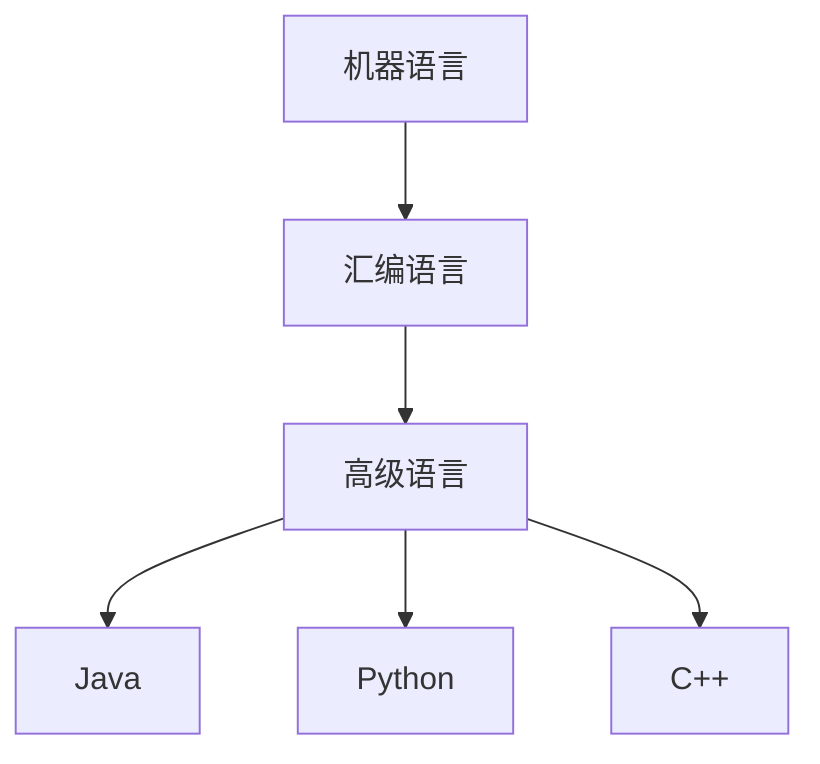

                 

### 《2024京东社招编程面试题精选与解答》

> **关键词**：编程面试，数据结构，算法，京东，社招

> **摘要**：
本篇博客文章旨在为广大求职者提供2024年京东社会招聘编程面试题的精选与详细解答。文章涵盖了编程基础、数据结构与算法、面向对象编程、编程面试题解析、系统设计与架构、编程面试实战、编程面试经验分享等七个部分，通过Mermaid流程图、伪代码、数学模型和公式、实际项目案例等形式，全面、系统地帮助读者备战京东社招编程面试。

### 《2024京东社招编程面试题精选与解答》目录大纲

- **第一部分：编程基础与数据结构**

  - 第1章：编程基础
    - 1.1 编程语言概述
    - 1.2 基本语法与数据类型
    - 1.3 控制结构
    - 1.4 函数与模块

  - 第2章：数据结构与算法
    - 2.1 常见数据结构
    - 2.2 算法基础
    - 2.3 面向对象编程

- **第二部分：编程面试题解析**

  - 第3章：基础编程面试题
    - 3.1 字符串处理
    - 3.2 数组与矩阵
    - 3.3 栈与队列
    - 3.4 链表

  - 第4章：算法与数据结构面试题
    - 4.1 排序算法
    - 4.2 搜索算法
    - 4.3 动态规划

  - 第5章：系统设计与架构
    - 5.1 系统设计原则
    - 5.2 设计模式
    - 5.3 高并发系统设计

- **第三部分：编程面试实战**

  - 第6章：编程面试题实战
    - 6.1 实战题目一：实现一个LRU缓存机制
    - 6.2 实战题目二：实现一个简单的HTTP服务器
    - 6.3 实战题目三：实现一个二叉搜索树

- **第四部分：编程面试经验分享**

  - 第7章：编程面试经验分享
    - 7.1 面试准备技巧
    - 7.2 面试常见问题
    - 7.3 面试心态调整

- **附录：面试资源与工具**

  - 附录：面试资源与工具
    - A.1 编程面试网站
    - A.2 数据结构与算法资源
    - A.3 编程语言参考手册
    - A.4 算法复杂度分析工具

### 第一部分：编程基础与数据结构

#### 第1章：编程基础

##### 1.1 编程语言概述

编程语言是计算机与程序员之间交流的工具，它定义了一系列语法规则，使得程序员可以通过编写代码来告诉计算机如何执行特定的任务。编程语言的发展经历了多个阶段，从早期的机器语言和汇编语言，到现代的高级编程语言，如Java、Python、C++等。

**核心概念与联系**

- **机器语言**：由0和1组成的低级语言，直接操作计算机的硬件。
- **汇编语言**：使用助记符代替机器语言指令，易于理解但依赖于特定的硬件架构。
- **高级语言**：更加抽象，远离硬件，易于编写和维护。

**Mermaid流程图**



##### 1.2 基本语法与数据类型

基本语法是编程语言的基础，它定义了代码的结构和编写规则。不同的编程语言有不同的语法，但大多数语言都包含以下基本元素：

- **变量声明**：用于存储数据的内存位置。
- **数据类型**：定义了变量可以存储的数据类型，如整数、浮点数、字符串等。
- **控制结构**：用于控制程序的执行流程，如条件语句和循环语句。
- **函数**：用于执行特定任务的代码块。

**伪代码**

```plaintext
function printHello() {
  println("Hello, World!");
}

integer x = 10;
float y = 3.14;
string name = "John Doe";
boolean isTrue = true;
```

##### 1.3 控制结构

控制结构决定了程序执行的顺序。常见的控制结构包括：

- **条件语句**：根据条件执行不同的代码块。
- **循环语句**：重复执行代码块直到满足某个条件。

**伪代码**

```plaintext
if (x > 0) {
  print("x is positive");
} else {
  print("x is non-positive");
}

for (int i = 0; i < 10; i++) {
  print(i);
}
```

##### 1.4 函数与模块

函数是组织代码的基本单位，它将代码分割成可重用的部分。模块则是函数和类的集合，用于组织和管理代码。

**伪代码**

```plaintext
function add(a, b) {
  return a + b;
}

result = add(5, 3);

import java.util.List;
import java.util.ArrayList;

List<String> list = new ArrayList<>();
list.add("Apple");
list.add("Banana");
```

#### 第2章：数据结构与算法

##### 2.1 常见数据结构

数据结构是存储和组织数据的方式，它对于算法的性能和效率有着重要影响。常见的数据结构包括：

- **数组**：固定大小的线性表。
- **链表**：动态大小的线性表。
- **栈**：后进先出（LIFO）的数据结构。
- **队列**：先进先出（FIFO）的数据结构。
- **树**：由节点组成的有向无环图。
- **图**：由节点和边组成的数据结构。

**伪代码**

```plaintext
class Node {
  int value;
  Node left;
  Node right;
}

function insert(root, value) {
  if (root == null) {
    return new Node(value);
  }
  if (value < root.value) {
    root.left = insert(root.left, value);
  } else {
    root.right = insert(root.right, value);
  }
  return root;
}
```

##### 2.2 算法基础

算法是一系列解决问题的步骤。算法的设计和优化对于解决复杂问题至关重要。常见的算法基础包括：

- **排序算法**：用于对数据进行排序。
- **搜索算法**：用于在数据结构中查找特定的元素。
- **分治算法**：将问题分解为子问题并递归解决。
- **动态规划**：通过存储子问题的解来优化算法的性能。

**伪代码**

```plaintext
function quickSort(arr, low, high) {
  if (low < high) {
    int pivot = partition(arr, low, high);
    quickSort(arr, low, pivot - 1);
    quickSort(arr, pivot + 1, high);
  }
}

function partition(arr, low, high) {
  int pivot = arr[high];
  int i = low;
  for (int j = low; j < high; j++) {
    if (arr[j] < pivot) {
      swap(arr, i, j);
      i++;
    }
  }
  swap(arr, i, high);
  return i;
}
```

##### 2.3 面向对象编程

面向对象编程是一种编程范式，它将数据和操作数据的方法封装在一起，形成了对象。面向对象编程的核心概念包括：

- **类**：对象的模板，定义了对象的数据和行为。
- **对象**：类的实例，代表了现实世界中的实体。
- **继承**：允许一个类继承另一个类的属性和方法。
- **多态**：允许对象以不同的方式响应相同的消息。

**伪代码**

```plaintext
class Person {
  String name;
  int age;

  function Person(name, age) {
    this.name = name;
    this.age = age;
  }

  function greet() {
    print("Hello, my name is " + this.name + " and I am " + this.age + " years old.");
  }
}
```

### 第二部分：编程面试题解析

#### 第3章：基础编程面试题

##### 3.1 字符串处理

字符串处理是编程面试中常见的题目类型。以下是一些常见的字符串处理问题及其解决方案。

###### 3.1.1 实现字符串反转

字符串反转是将字符串中的字符顺序颠倒。以下是一个简单的实现方法：

**伪代码**

```plaintext
function reverseString(s) {
  let reversed = "";
  for (int i = s.length - 1; i >= 0; i--) {
    reversed += s[i];
  }
  return reversed;
}
```

###### 3.1.2 字符串查找

字符串查找是在一个字符串中找到另一个字符串的位置。以下是一个简单的实现方法：

**伪代码**

```plaintext
function searchString(haystack, needle) {
  for (int i = 0; i < haystack.length; i++) {
    if (haystack.substring(i, i + needle.length).equals(needle)) {
      return i;
    }
  }
  return -1;
}
```

###### 3.1.3 最长公共前缀

最长公共前缀是两个或多个字符串中开头部分相同的最长字符串。以下是一个简单的实现方法：

**伪代码**

```plaintext
function longestCommonPrefix(strs) {
  if (strs.length == 0) return "";
  String prefix = strs[0];
  for (int i = 1; i < strs.length; i++) {
    while (strs[i].indexOf(prefix) != 0) {
      prefix = prefix.substring(0, prefix.length() - 1);
      if (prefix.isEmpty()) return "";
    }
  }
  return prefix;
}
```

##### 3.2 数组与矩阵

数组与矩阵是编程中常用的数据结构。以下是一些常见的数组与矩阵处理问题及其解决方案。

###### 3.2.1 数组中重复的元素

找到数组中的重复元素是编程面试中常见的题目。以下是一个简单的实现方法：

**伪代码**

```plaintext
function findDuplicate(nums) {
  for (int i = 0; i < nums.length; i++) {
    int index = Math.abs(nums[i]) - 1;
    if (nums[index] < 0) {
      return Math.abs(nums[i]);
    } else {
      nums[index] = -nums[index];
    }
  }
  return -1;
}
```

###### 3.2.2 矩阵对角线之和

计算矩阵对角线之和是编程面试中常见的题目。以下是一个简单的实现方法：

**伪代码**

```plaintext
function diagonalSum(matrix) {
  int sum = 0;
  for (int i = 0; i < matrix.length; i++) {
    sum += matrix[i][i] + matrix[i][matrix.length - 1 - i];
  }
  return sum;
}
```

###### 3.2.3 螺旋矩阵

螺旋矩阵是一个矩阵，其中元素按照螺旋方向排列。以下是一个简单的实现方法：

**伪代码**

```plaintext
function spiralOrder(matrix) {
  List<Integer> result = new ArrayList<>();
  if (matrix.length == 0) return result;
  int top = 0, bottom = matrix.length - 1, left = 0, right = matrix[0].length - 1;
  while (true) {
    for (int i = left; i <= right; i++) {
      result.add(matrix[top][i]);
    }
    top++;
    if (left > right) break;
    for (int i = top; i <= bottom; i++) {
      result.add(matrix[i][right]);
    }
    right--;
    if (top > bottom) break;
    for (int i = right; i >= left; i--) {
      result.add(matrix[bottom][i]);
    }
    bottom--;
    if (left > right) break;
    for (int i = bottom; i >= top; i--) {
      result.add(matrix[i][left]);
    }
    left++;
  }
  return result;
}
```

##### 3.3 栈与队列

栈与队列是编程中常用的数据结构。以下是一些常见的栈与队列处理问题及其解决方案。

###### 3.3.1 模拟栈

模拟栈是一种使用数组或链表实现栈的数据结构。以下是一个简单的实现方法：

**伪代码**

```plaintext
class Stack {
  List<Integer> list;

  function Stack() {
    this.list = new ArrayList<>();
  }

  function push(value) {
    this.list.add(value);
  }

  function pop() {
    return this.list.remove(this.list.size() - 1);
  }

  function peek() {
    return this.list.get(this.list.size() - 1);
  }

  function isEmpty() {
    return this.list.isEmpty();
  }
}
```

###### 3.3.2 模拟队列

模拟队列是一种使用数组或链表实现队列的数据结构。以下是一个简单的实现方法：

**伪代码**

```plaintext
class Queue {
  List<Integer> list;

  function Queue() {
    this.list = new ArrayList<>();
  }

  function enqueue(value) {
    this.list.add(value);
  }

  function dequeue() {
    return this.list.remove(0);
  }

  function isEmpty() {
    return this.list.isEmpty();
  }
}
```

###### 3.3.3 用队列实现栈

使用队列实现栈是一种通过队列的操作模拟栈的操作的方法。以下是一个简单的实现方法：

**伪代码**

```plaintext
class Stack {
  Queue q1;
  Queue q2;

  function Stack() {
    this.q1 = new Queue();
    this.q2 = new Queue();
  }

  function push(value) {
    this.q1.enqueue(value);
    while (this.q2.getSize() > 0) {
      this.q1.enqueue(this.q2.dequeue());
    }
    while (this.q1.getSize() > 0) {
      this.q2.enqueue(this.q1.dequeue());
    }
  }

  function pop() {
    return this.q2.dequeue();
  }

  function peek() {
    return this.q2.peek();
  }

  function isEmpty() {
    return this.q1.isEmpty() && this.q2.isEmpty();
  }
}
```

##### 3.4 链表

链表是一种由节点组成的数据结构，每个节点包含数据和一个指向下一个节点的指针。以下是一些常见的链表处理问题及其解决方案。

###### 3.4.1 单链表相交问题

单链表相交问题是指两个链表在某些节点处相交。以下是一个简单的实现方法：

**伪代码**

```plaintext
function getIntersectionNode(headA, headB) {
  if (headA == null || headB == null) return null;
  ListNode pa = headA, pb = headB;
  while (pa != pb) {
    pa = pa == null ? headB : pa.next;
    pb = pb == null ? headA : pb.next;
  }
  return pa;
}
```

###### 3.4.2 删除链表中的节点

删除链表中的节点是指在链表中删除一个特定的节点。以下是一个简单的实现方法：

**伪代码**

```plaintext
function deleteNode(node) {
  if (node == null || node.next == null) return;
  node.val = node.next.val;
  node.next = node.next.next;
}
```

###### 3.4.3 反转链表

反转链表是将链表中的节点顺序颠倒。以下是一个简单的实现方法：

**伪代码**

```plaintext
function reverseList(head) {
  if (head == null || head.next == null) return head;
  ListNode prev = null;
  ListNode curr = head;
  while (curr != null) {
    ListNode nextTemp = curr.next;
    curr.next = prev;
    prev = curr;
    curr = nextTemp;
  }
  return prev;
}
```

#### 第4章：算法与数据结构面试题

##### 4.1 排序算法

排序算法是编程面试中的经典题目。以下是一些常见的排序算法及其实现方法。

###### 4.1.1 快速排序

快速排序是一种高效的排序算法，它采用分治策略来递归排序子序列。以下是一个简单的实现方法：

**伪代码**

```plaintext
function quickSort(arr, low, high) {
  if (low < high) {
    int pivot = partition(arr, low, high);
    quickSort(arr, low, pivot - 1);
    quickSort(arr, pivot + 1, high);
  }
}

function partition(arr, low, high) {
  int pivot = arr[high];
  int i = low;
  for (int j = low; j < high; j++) {
    if (arr[j] < pivot) {
      swap(arr, i, j);
      i++;
    }
  }
  swap(arr, i, high);
  return i;
}
```

###### 4.1.2 归并排序

归并排序是一种基于分治策略的排序算法，它将数组分成两个子数组，分别排序后再合并。以下是一个简单的实现方法：

**伪代码**

```plaintext
function mergeSort(arr, low, high) {
  if (low < high) {
    int mid = low + (high - low) / 2;
    mergeSort(arr, low, mid);
    mergeSort(arr, mid + 1, high);
    merge(arr, low, mid, high);
  }
}

function merge(arr, low, mid, high) {
  int n1 = mid - low + 1;
  int n2 = high - mid;
  int[] L = new int[n1];
  int[] R = new int[n2];
  for (int i = 0; i < n1; i++) {
    L[i] = arr[low + i];
  }
  for (int j = 0; j < n2; j++) {
    R[j] = arr[mid + 1 + j];
  }
  int i = 0, j = 0;
  int k = low;
  while (i < n1 && j < n2) {
    if (L[i] <= R[j]) {
      arr[k] = L[i];
      i++;
    } else {
      arr[k] = R[j];
      j++;
    }
    k++;
  }
  while (i < n1) {
    arr[k] = L[i];
    i++;
    k++;
  }
  while (j < n2) {
    arr[k] = R[j];
    j++;
    k++;
  }
}
```

###### 4.1.3 堆排序

堆排序是一种利用堆这种数据结构的排序算法。以下是一个简单的实现方法：

**伪代码**

```plaintext
function heapify(arr, n, i) {
  int largest = i;
  int left = 2 * i + 1;
  int right = 2 * i + 2;
  if (left < n && arr[left] > arr[largest]) {
    largest = left;
  }
  if (right < n && arr[right] > arr[largest]) {
    largest = right;
  }
  if (largest != i) {
    swap(arr, i, largest);
    heapify(arr, n, largest);
  }
}

function heapSort(arr) {
  int n = arr.length;
  for (int i = n / 2 - 1; i >= 0; i--) {
    heapify(arr, n, i);
  }
  for (int i = n - 1; i > 0; i--) {
    swap(arr, 0, i);
    heapify(arr, i, 0);
  }
}
```

##### 4.2 搜索算法

搜索算法是编程面试中的常见问题。以下是一些常见的搜索算法及其实现方法。

###### 4.2.1 BFS搜索

广度优先搜索（BFS）是一种用于查找最短路径的搜索算法。以下是一个简单的实现方法：

**伪代码**

```plaintext
function BFS(graph, start) {
  Queue queue = new Queue();
  Set visited = new Set();
  queue.enqueue(start);
  visited.add(start);
  while (!queue.isEmpty()) {
    Node node = queue.dequeue();
    for (Node neighbor : node.neighbors) {
      if (!visited.contains(neighbor)) {
        queue.enqueue(neighbor);
        visited.add(neighbor);
      }
    }
  }
}
```

###### 4.2.2 DFS搜索

深度优先搜索（DFS）是一种用于查找路径的搜索算法。以下是一个简单的实现方法：

**伪代码**

```plaintext
function DFS(graph, start) {
  Set visited = new Set();
  function visit(node) {
    if (visited.contains(node)) return;
    visited.add(node);
    for (Node neighbor : node.neighbors) {
      visit(neighbor);
    }
  }
  visit(start);
}
```

###### 4.2.3 A*搜索

A*搜索是一种基于启发式的搜索算法，它利用估价函数来寻找最优路径。以下是一个简单的实现方法：

**伪代码**

```plaintext
function AStar(graph, start, goal) {
  PriorityQueue<Node> openSet = new PriorityQueue<>();
  Set closedSet = new Set();
  Map<Node, Node> cameFrom = new HashMap<>();
  Map<Node, Integer> gScore = new HashMap<>();
  gScore.put(start, 0);
  openSet.enqueue(new Node(start, 0 + heuristic(start, goal)));
  while (!openSet.isEmpty()) {
    Node current = openSet.dequeue();
    if (current == goal) {
      return reconstructPath(cameFrom, current);
    }
    closedSet.add(current);
    for (Node neighbor : current.neighbors) {
      if (closedSet.contains(neighbor)) continue;
      int tentativeGScore = current.g + 1;
      if (!openSet.contains(neighbor) || tentativeGScore < neighbor.g) {
        cameFrom.put(neighbor, current);
        neighbor.g = tentativeGScore;
        neighbor.f = neighbor.g + heuristic(neighbor, goal);
        if (!openSet.contains(neighbor)) {
          openSet.enqueue(neighbor);
        }
      }
    }
  }
  return null;
}

function reconstructPath(cameFrom, current) {
  Stack<Node> totalPath = new Stack<>();
  totalPath.push(current);
  while (cameFrom.containsKey(current)) {
    current = cameFrom.get(current);
    totalPath.push(current);
  }
  return totalPath;
}
```

##### 4.3 动态规划

动态规划是一种用于解决最优化问题的算法，它通过将复杂问题分解为子问题并保存子问题的解来优化算法的性能。以下是一些常见的动态规划问题及其实现方法。

###### 4.3.1 最长递增子序列

最长递增子序列问题是找到最长的递增子序列。以下是一个简单的实现方法：

**伪代码**

```plaintext
function longestIncreasingSubsequence(nums) {
  int n = nums.length;
  int[] dp = new int[n];
  for (int i = 0; i < n; i++) {
    dp[i] = 1;
    for (int j = 0; j < i; j++) {
      if (nums[i] > nums[j]) {
        dp[i] = Math.max(dp[i], dp[j] + 1);
      }
    }
  }
  return *max_element(dp) + 1;
}
```

###### 4.3.2 最小路径和

最小路径和问题是找到矩阵中最小路径和。以下是一个简单的实现方法：

**伪代码**

```plaintext
function minPathSum(grid) {
  int m = grid.length;
  int n = grid[0].length;
  int[][] dp = new int[m][n];
  dp[0][0] = grid[0][0];
  for (int i = 1; i < m; i++) {
    dp[i][0] = dp[i - 1][0] + grid[i][0];
  }
  for (int j = 1; j < n; j++) {
    dp[0][j] = dp[0][j - 1] + grid[0][j];
  }
  for (int i = 1; i < m; i++) {
    for (int j = 1; j < n; j++) {
      dp[i][j] = Math.min(dp[i - 1][j], dp[i][j - 1]) + grid[i][j];
    }
  }
  return dp[m - 1][n - 1];
}
```

###### 4.3.3 背包问题

背包问题是给定一组物品和它们的重量和价值，选择其中一些物品放入一个容量有限的背包中，使得背包中的物品总价值最大。以下是一个简单的实现方法：

**伪代码**

```plaintext
function knapsack(values, weights, W) {
  int n = values.length;
  int[][] dp = new int[n + 1][W + 1];
  for (int i = 0; i <= n; i++) {
    for (int w = 0; w <= W; w++) {
      if (i == 0 || w == 0) {
        dp[i][w] = 0;
      } else if (weights[i - 1] <= w) {
        dp[i][w] = Math.max(dp[i - 1][w], dp[i - 1][w - weights[i - 1]] + values[i - 1]);
      } else {
        dp[i][w] = dp[i - 1][w];
      }
    }
  }
  return dp[n][W];
}
```

#### 第5章：系统设计与架构

##### 5.1 系统设计原则

系统设计原则是指在进行系统设计时需要遵循的一些基本规则，这些规则有助于构建高效、可靠和可扩展的系统。以下是一些常见的系统设计原则：

- **模块化**：将系统划分为独立的模块，每个模块负责特定的功能。
- **分层**：将系统划分为多个层次，每个层次负责特定的任务。
- **解耦合**：减少不同模块之间的依赖关系，提高系统的可维护性。
- **高性能**：优化系统性能，确保系统能够快速响应。
- **可扩展性**：设计系统时考虑未来的扩展需求，确保系统能够随业务增长而扩展。

**伪代码**

```plaintext
function designSystem(requirements) {
  SystemArchitecture architecture = new SystemArchitecture();
  architecture.setScalability(requirements.getScalability());
  architecture.setReliability(requirements.getReliability());
  architecture.setSecurity(requirements.getSecurity());
  architecture.setIntegrability(requirements.getIntegrability());
  return architecture;
}
```

##### 5.2 设计模式

设计模式是一组经过时间验证的软件设计解决方案，它们用于解决特定类型的软件设计问题。以下是一些常见的设计模式：

- **单例模式**：确保一个类只有一个实例，并提供一个全局访问点。
- **工厂模式**：用于创建对象，将对象的创建委托给子类。
- **代理模式**：用于为其他对象提供一种代理，以控制对这个对象的访问。

**伪代码**

```plaintext
interface Subject {
  function request();
}

class RealSubject implements Subject {
  public function request() {
    print("RealSubject request");
  }
}

class Proxy implements Subject {
  private RealSubject realSubject;

  public Proxy(RealSubject realSubject) {
    this.realSubject = realSubject;
  }

  public function request() {
    print("Before request");
    realSubject.request();
    print("After request");
  }
}
```

##### 5.3 高并发系统设计

高并发系统设计是确保系统在处理大量并发请求时仍然能够保持高性能和稳定性。以下是一些常见的高并发系统设计策略：

- **负载均衡**：通过将请求分发到多个服务器，提高系统的处理能力。
- **Session共享**：通过共享Session数据，减少重复创建和销毁Session的开销。
- **缓存机制**：通过缓存数据，减少对后端数据库的访问压力。

**伪代码**

```plaintext
function loadBalance(request) {
  int nodeCount = availableNodes.size();
  int index = (request.hashCode() % nodeCount + nodeCount) % nodeCount;
  Node node = availableNodes.get(index);
  node.processRequest(request);
}

class SessionManager {
  Map<String, Session> sessionMap = new HashMap<>();

  public function createSession(String sessionId) {
    Session session = new Session(sessionId);
    sessionMap.put(sessionId, session);
    return session;
  }

  public function getSession(String sessionId) {
    return sessionMap.get(sessionId);
  }
}

class Cache {
  Map<Key, Value> cacheMap = new HashMap<>();
  int capacity;

  public Cache(int capacity) {
    this.capacity = capacity;
  }

  public function get(Key key) {
    return cacheMap.get(key);
  }

  public function put(Key key, Value value) {
    if (cacheMap.containsKey(key)) {
      cacheMap.put(key, value);
    } else {
      if (cacheMap.size() >= capacity) {
        Iterator it = cacheMap.entrySet().iterator();
        it.next();
        it.remove();
      }
      cacheMap.put(key, value);
    }
  }
}
```

#### 第6章：编程面试题实战

##### 6.1 实现一个LRU缓存机制

LRU（Least Recently Used）缓存机制是一种常用的缓存算法，它根据数据的使用时间来淘汰缓存中的数据。以下是一个简单的实现方法：

**伪代码**

```plaintext
class LRUCache {
  private Map<Integer, Node> cache;
  private DoublyLinkedList list;
  private int capacity;

  public LRUCache(int capacity) {
    this.capacity = capacity;
    this.cache = new HashMap<>();
    this.list = new DoublyLinkedList();
  }

  public int get(int key) {
    if (!cache.containsKey(key)) {
      return -1;
    }
    moveToHead(list, cache.get(key));
    return cache.get(key).value;
  }

  public void put(int key, int value) {
    if (cache.containsKey(key)) {
      Node node = cache.get(key);
      node.value = value;
      moveToHead(list, node);
    } else {
      if (cache.size() == capacity) {
        Node last = list.removeTail();
        cache.remove(last.key);
      }
      Node newNode = new Node(key, value);
      cache.put(key, newNode);
      list.addHead(newNode);
    }
  }

  private void moveToHead(DoublyLinkedList list, Node node) {
    list.removeNode(node);
    list.addHead(node);
  }
}
```

##### 6.2 实现一个简单的HTTP服务器

HTTP服务器用于接收和响应HTTP请求。以下是一个简单的实现方法：

**伪代码**

```plaintext
class HTTPServer {
  ServerSocket serverSocket;

  public HTTPServer(int port) {
    serverSocket = new ServerSocket(port);
  }

  public void start() {
    while (true) {
      Socket clientSocket = serverSocket.accept();
      Thread thread = new Thread(new ClientHandler(clientSocket));
      thread.start();
    }
  }
}

class ClientHandler implements Runnable {
  private Socket clientSocket;

  public ClientHandler(Socket clientSocket) {
    this.clientSocket = clientSocket;
  }

  public void run() {
    try {
      BufferedReader in = new BufferedReader(new InputStreamReader(clientSocket.getInputStream()));
      PrintWriter out = new PrintWriter(clientSocket.getOutputStream(), true);

      String request = in.readLine();
      String response = handleRequest(request);
      out.println(response);

      in.close();
      out.close();
      clientSocket.close();
    } catch (IOException e) {
      e.printStackTrace();
    }
  }

  private String handleRequest(String request) {
    // Process the request and generate the response
    return "HTTP/1.1 200 OK\nContent-Type: text/plain\n\nHello, World!";
  }
}
```

##### 6.3 实现一个二叉搜索树

二叉搜索树是一种特殊的数据结构，它允许快速查找、插入和删除元素。以下是一个简单的实现方法：

**伪代码**

```plaintext
class TreeNode {
  int val;
  TreeNode left;
  TreeNode right;

  public TreeNode(int

