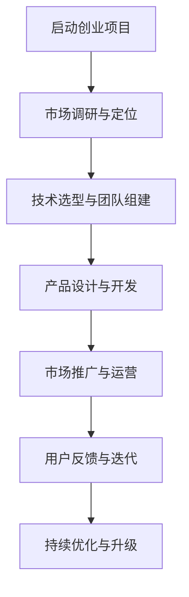
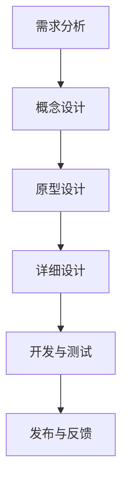
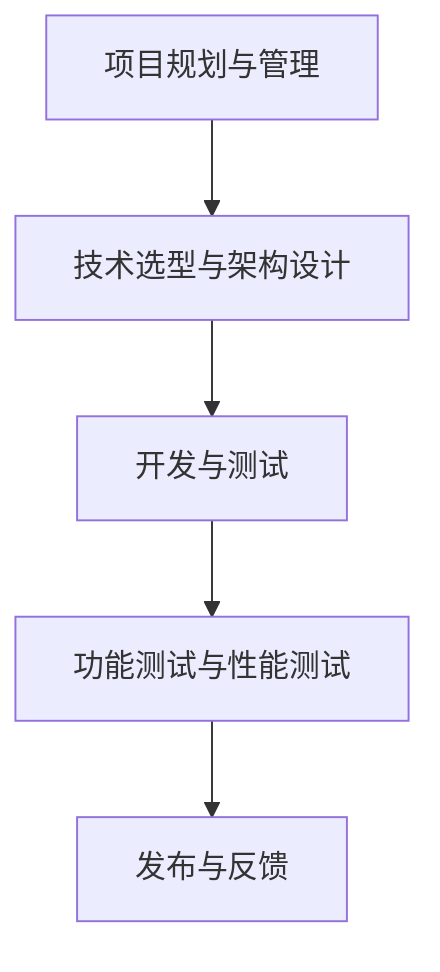

                 

### 《人工智能创业：不断改进产品的策略》

> **关键词**：人工智能创业，产品优化，迭代，用户反馈，数据分析，创新策略

> **摘要**：本文将探讨人工智能创业的背景、核心要素和产品开发流程，重点分析如何通过用户反馈和数据分析进行产品优化和迭代，为创业者提供切实可行的策略。文章还将通过知名人工智能创业公司案例，总结成功经验，展望未来趋势。

### 第一部分：人工智能创业概述

#### 第1章：人工智能创业环境

##### 1.1 人工智能产业的发展现状

人工智能（AI）作为新一轮科技革命和产业变革的重要驱动力量，正日益成为全球各国竞相争夺的焦点。根据国际数据公司（IDC）的统计数据，全球人工智能市场规模从2017年的约3680亿美元增长至2021年的约4920亿美元，预计到2025年将达到1.2万亿美元。

**1.1.1 人工智能产业的定义与分类**

人工智能是指使计算机具备类似人类智能的技术和科学。根据应用场景，人工智能可以分为通用人工智能（AGI）和窄域人工智能（NLP）。通用人工智能具备广泛的认知能力，能够在各种任务中表现出人类的智能水平；而窄域人工智能则专注于特定领域的智能应用，如语音识别、图像识别、自然语言处理等。

**1.1.2 全球人工智能产业发展现状**

美国在人工智能领域拥有全球领先地位，Google、Facebook、IBM、Microsoft等科技巨头在人工智能研究、产品开发和市场推广方面取得了显著成果。同时，中国、欧盟、日本等国家也在积极推进人工智能产业发展。中国发布了《新一代人工智能发展规划》，明确提出到2020年，人工智能核心技术和关键应用取得重大突破，形成若干全球领先的人工智能创新和应用示范区。

**1.1.3 我国人工智能产业发展现状**

我国人工智能产业呈现出快速发展态势，人工智能企业数量持续增长，市场规模不断扩大。根据《2021年中国人工智能产业发展报告》，2020年我国人工智能市场规模达到4570亿元，同比增长19.6%。在人工智能技术方面，我国在语音识别、计算机视觉、自然语言处理等领域取得了重要突破，部分技术已达到国际领先水平。

##### 1.2 创业者在人工智能领域的机遇与挑战

**1.2.1 创业机遇分析**

1. **技术创新机遇**：人工智能技术的快速发展为创业者提供了广阔的创新空间，特别是在医疗健康、金融、教育、制造业等领域，人工智能应用场景丰富，市场潜力巨大。
2. **市场机遇**：随着人工智能技术的普及，消费者对智能产品的需求日益增长，为创业者提供了巨大的市场空间。
3. **政策机遇**：各国政府纷纷出台支持人工智能产业发展的政策，为创业者提供了良好的政策环境。

**1.2.2 创业挑战分析**

1. **技术挑战**：人工智能技术更新迅速，创业者需要不断学习和跟进最新的技术趋势，以保持竞争力。
2. **资金挑战**：人工智能创业项目通常需要大量资金投入，创业者需要寻找合适的融资渠道。
3. **人才挑战**：人工智能领域人才短缺，创业者需要吸引和留住优秀的人才。

**1.2.3 创业成功的关键因素**

1. **技术创新**：拥有核心技术和独特的产品特色是创业成功的关键。
2. **市场定位**：准确的市场定位有助于企业抓住市场机遇。
3. **团队建设**：优秀的团队是创业成功的重要保障。
4. **持续创新**：不断优化产品和服务，满足市场需求。

##### 1.3 人工智能创业的趋势分析

**1.3.1 技术趋势分析**

1. **深度学习和神经网络技术**：深度学习在图像识别、语音识别、自然语言处理等领域取得了显著成果，成为人工智能领域的研究热点。
2. **边缘计算**：随着物联网和5G技术的发展，边缘计算在人工智能应用中越来越重要，有助于提高实时性和降低延迟。
3. **大数据技术**：大数据为人工智能提供了丰富的数据资源，有助于提高模型的训练效果。

**1.3.2 应用领域趋势分析**

1. **智能制造**：人工智能技术在生产过程中的应用，如自动化生产线、智能检测、预测性维护等，有助于提高生产效率和质量。
2. **医疗健康**：人工智能在医疗影像诊断、基因测序、药物研发等领域具有广泛的应用前景。
3. **金融服务**：人工智能在风险控制、信用评估、智能投顾等领域发挥着重要作用。

**1.3.4 未来趋势展望**

1. **跨学科融合**：人工智能与其他学科的交叉融合将推动人工智能技术的进一步发展。
2. **人工智能伦理和法律问题**：随着人工智能技术的应用，伦理和法律问题日益凸显，需要建立相应的法律法规和伦理标准。
3. **人工智能普及化**：随着技术的成熟和成本的降低，人工智能将逐渐普及到更多领域和场景。

### Mermaid 流程图：人工智能创业的基本流程



---

### 第一部分：人工智能创业概述

#### 第2章：人工智能创业的基本概念

##### 2.1 人工智能与创业的联系

人工智能与创业之间存在紧密的联系。人工智能技术为创业提供了新的机遇，而创业则为人工智能技术的发展和应用提供了广阔的舞台。

**2.1.1 人工智能与创业的融合**

1. **技术创新**：人工智能技术为创业提供了创新的基础，创业者可以利用人工智能技术解决实际问题，创造新的商业价值。
2. **商业模式创新**：人工智能技术可以改变传统的商业模式，如共享经济、物联网、电商等，为创业者提供新的发展空间。

**2.1.2 创业者在人工智能领域的优势**

1. **快速迭代**：创业团队通常具有快速迭代的能力，可以快速响应市场需求，优化产品和服务。
2. **创新精神**：创业者具备创新精神，敢于尝试新事物，勇于面对挑战。
3. **灵活性**：创业团队结构灵活，能够快速调整战略和方向。

##### 2.2 人工智能创业的核心要素

**2.2.1 技术要素**

1. **算法和模型**：人工智能算法和模型是人工智能创业的核心竞争力，创业者需要掌握先进的算法和模型，以提高产品性能。
2. **数据资源**：数据是人工智能的基础，创业者需要获取和利用大量高质量的数据，以提高模型的训练效果。

**2.2.2 团队要素**

1. **技术团队**：创业者需要组建一支具有专业技能的技术团队，包括算法工程师、数据工程师、产品经理等。
2. **运营团队**：创业者需要建立一支高效的运营团队，负责市场推广、用户运营、销售管理等。

**2.2.3 资金要素**

1. **启动资金**：人工智能创业项目通常需要大量资金投入，创业者需要寻找合适的融资渠道，如天使投资、风险投资等。
2. **持续融资**：创业者需要不断寻求新的融资机会，以支持项目的持续发展。

##### 2.3 人工智能创业的基本流程

**2.3.1 市场调研与定位**

在创业初期，创业者需要对市场进行充分的调研，了解目标用户的需求、市场竞争态势和行业趋势。通过市场调研，创业者可以确定产品的定位，制定市场推广策略。

**2.3.2 技术选型与团队组建**

根据市场调研的结果，创业者需要选择合适的人工智能技术，并组建技术团队。技术选型包括算法和模型的选型、硬件设备和软件工具的选择等。

**2.3.3 产品设计与开发**

在技术选型和团队组建完成后，创业者需要进行产品设计和开发。产品设计与开发包括用户需求分析、产品功能设计、原型制作、功能实现等。

**2.3.4 市场推广与运营**

产品开发完成后，创业者需要进行市场推广和运营。市场推广包括广告投放、社交媒体营销、线下活动等。运营包括用户运营、销售管理、客户服务等方面。

**2.3.5 用户反馈与迭代**

在市场推广和运营过程中，创业者需要关注用户反馈，了解用户需求和满意度。通过用户反馈，创业者可以不断优化产品和服务，提高用户体验。

**2.3.6 持续优化与升级**

人工智能技术更新迅速，创业者需要持续关注技术发展趋势，不断优化产品和服务。通过持续优化和升级，创业者可以保持产品的竞争力，满足用户需求。

### Mermaid 流程图：人工智能创业的基本流程


---

### 第二部分：人工智能产品开发

#### 第3章：人工智能产品的设计原则

##### 3.1 用户需求分析

用户需求分析是人工智能产品设计的核心环节。创业者需要深入了解目标用户的需求、偏好和行为习惯，以确保产品能够满足用户期望。

**3.1.1 用户需求调研**

用户需求调研可以通过以下方式进行：

1. **问卷调查**：通过设计问卷，收集用户对产品功能、性能、易用性等方面的看法。
2. **访谈**：与目标用户进行面对面交流，深入了解他们的需求和使用场景。
3. **用户行为分析**：通过分析用户在现有产品中的行为数据，发现用户痛点。

**3.1.2 用户需求分类**

根据用户需求的特点，可以将需求分为以下几类：

1. **基本需求**：用户使用产品的基本功能需求，如语音识别、图像识别等。
2. **个性化需求**：用户对产品的个性化需求，如定制化推荐、个性化服务等。
3. **情感需求**：用户对产品的情感需求，如用户体验、产品外观等。

##### 3.2 产品定位与规划

产品定位是指确定产品在市场中的地位和目标用户群体。创业者需要根据用户需求、市场竞争态势和自身资源，确定产品的市场定位。

**3.2.1 市场定位**

市场定位包括以下方面：

1. **目标市场**：确定产品的目标市场，如企业用户、个人用户等。
2. **产品差异化**：通过产品差异化，使产品在市场上具有独特的竞争力。
3. **品牌定位**：建立品牌形象，提升产品在用户心中的认知度。

**3.2.2 产品规划**

产品规划包括以下方面：

1. **功能规划**：确定产品的主要功能和次要功能，确保产品能够满足用户需求。
2. **性能规划**：确定产品的性能指标，如响应时间、准确率等。
3. **用户体验规划**：优化用户体验，提高用户满意度。

##### 3.3 用户体验设计

用户体验设计是人工智能产品成功的关键。创业者需要关注用户在使用产品过程中的体验，从用户角度出发，设计符合用户需求的产品。

**3.3.1 用户体验设计原则**

1. **简洁性**：产品界面简洁明了，减少用户操作步骤。
2. **易用性**：产品操作容易上手，用户能够快速掌握使用方法。
3. **一致性**：产品在不同设备和平台上的界面和操作保持一致，提高用户体验。
4. **交互性**：产品与用户之间的交互流畅自然，增强用户参与感。

**3.3.2 用户体验设计方法**

1. **原型设计**：通过制作原型，验证产品设计的可行性和用户体验。
2. **用户测试**：通过用户测试，收集用户对产品的反馈，优化产品设计。
3. **数据分析**：通过分析用户行为数据，发现用户痛点，优化产品体验。

##### 3.4 产品设计流程

产品设计流程包括以下阶段：

1. **需求分析**：了解用户需求，明确产品功能。
2. **概念设计**：确定产品的基本框架和功能模块。
3. **原型设计**：制作原型，验证产品设计的可行性和用户体验。
4. **详细设计**：完善产品功能，细化设计细节。
5. **开发与测试**：根据详细设计文档，进行产品开发和测试。
6. **发布与反馈**：产品上线后，收集用户反馈，进行持续优化。

### Mermaid 流程图：人工智能产品设计流程



---

### 第二部分：人工智能产品开发

#### 第4章：人工智能技术的应用

##### 4.1 机器学习算法应用

机器学习是人工智能的核心技术之一，通过训练模型，使计算机具备自动学习和改进的能力。在人工智能产品开发中，机器学习算法广泛应用于图像识别、语音识别、自然语言处理等领域。

**4.1.1 机器学习算法原理**

机器学习算法主要包括监督学习、无监督学习和强化学习三种类型。

1. **监督学习**：通过已知的输入输出数据，训练模型，预测新的输入数据。常见算法包括线性回归、逻辑回归、支持向量机等。
2. **无监督学习**：没有明确的输入输出数据，通过分析数据分布和特征，发现数据中的规律。常见算法包括聚类、降维、主成分分析等。
3. **强化学习**：通过与环境的交互，学习最优策略，实现目标优化。常见算法包括Q学习、深度Q网络（DQN）等。

**4.1.2 机器学习算法在产品开发中的应用**

1. **图像识别**：利用卷积神经网络（CNN）等算法，实现图像的分类、检测和分割。应用于人脸识别、安防监控、医疗影像诊断等领域。
2. **语音识别**：通过训练语音模型，将语音信号转换为文字。应用于智能语音助手、语音搜索、智能客服等领域。
3. **自然语言处理**：利用词向量、序列模型等算法，实现文本的语义分析、情感分析、信息抽取等。应用于智能问答、智能推荐、智能写作等领域。

##### 4.2 深度学习模型应用

深度学习是机器学习的一种重要分支，通过构建深度神经网络，实现复杂的特征提取和模型优化。在人工智能产品开发中，深度学习模型广泛应用于图像识别、语音识别、自然语言处理等领域。

**4.2.1 深度学习模型原理**

深度学习模型主要包括卷积神经网络（CNN）、循环神经网络（RNN）、长短时记忆网络（LSTM）等。

1. **卷积神经网络（CNN）**：通过卷积层、池化层、全连接层等结构，实现图像特征的自动提取和分类。
2. **循环神经网络（RNN）**：通过循环结构，实现序列数据的建模和预测。
3. **长短时记忆网络（LSTM）**：通过门控机制，实现长期依赖关系的建模。

**4.2.2 深度学习模型在产品开发中的应用**

1. **图像识别**：利用CNN模型，实现图像的分类、检测和分割。应用于人脸识别、安防监控、医疗影像诊断等领域。
2. **语音识别**：利用循环神经网络（RNN）和长短时记忆网络（LSTM）等模型，实现语音信号的建模和转换。应用于智能语音助手、语音搜索、智能客服等领域。
3. **自然语言处理**：利用词向量、序列模型等算法，实现文本的语义分析、情感分析、信息抽取等。应用于智能问答、智能推荐、智能写作等领域。

##### 4.3 自然语言处理技术应用

自然语言处理（NLP）是人工智能的一个重要分支，旨在使计算机理解和生成自然语言。在人工智能产品开发中，自然语言处理技术广泛应用于文本分类、情感分析、命名实体识别等领域。

**4.3.1 自然语言处理技术原理**

自然语言处理技术主要包括词向量、序列模型、注意力机制等。

1. **词向量**：通过将文本转换为向量表示，实现文本的语义表示。
2. **序列模型**：通过构建序列模型，实现文本的序列建模和预测。
3. **注意力机制**：通过注意力机制，实现模型对输入数据的动态权重分配。

**4.3.2 自然语言处理技术在产品开发中的应用**

1. **文本分类**：利用词向量、序列模型等算法，实现文本的分类任务。应用于舆情监测、新闻推荐、垃圾邮件过滤等领域。
2. **情感分析**：通过分析文本的情感倾向，实现情感分类和情感极性判断。应用于社交媒体分析、客户满意度评估等领域。
3. **命名实体识别**：通过识别文本中的命名实体，如人名、地名、组织名等，实现信息的抽取和分类。应用于智能问答、知识图谱构建等领域。

---

### 第二部分：人工智能产品开发

#### 第5章：人工智能产品的开发流程

##### 5.1 项目规划与管理

项目规划与管理是人工智能产品开发的重要环节，涉及到项目目标、范围、进度、资源等方面的规划与管理。

**5.1.1 项目规划**

项目规划主要包括以下内容：

1. **项目目标**：明确项目的目标，包括产品功能、性能、用户体验等方面。
2. **项目范围**：确定项目的范围，包括功能模块、技术选型、团队组织等方面。
3. **项目进度**：制定项目的进度计划，包括里程碑、时间节点等方面。
4. **项目资源**：确定项目所需的资源，包括人力、资金、设备等方面。

**5.1.2 项目管理**

项目管理主要包括以下内容：

1. **项目监控**：实时监控项目进度、质量和风险，确保项目按计划进行。
2. **项目沟通**：建立有效的沟通机制，确保团队成员之间的信息共享和协作。
3. **项目调整**：根据项目进展情况，及时调整项目计划，以适应变化的需求和情况。

##### 5.2 技术选型与架构设计

技术选型与架构设计是人工智能产品开发的核心环节，涉及到技术方向、框架选择、系统架构等方面。

**5.2.1 技术选型**

技术选型主要包括以下内容：

1. **算法选型**：根据产品需求，选择合适的机器学习算法和深度学习模型。
2. **框架选型**：根据项目需求，选择合适的开发框架和工具，如TensorFlow、PyTorch、Keras等。
3. **数据库选型**：根据数据存储和管理需求，选择合适的数据库系统，如MySQL、MongoDB、Redis等。

**5.2.2 架构设计**

架构设计主要包括以下内容：

1. **系统架构**：根据产品需求和业务模式，设计系统的整体架构，包括前端、后端、数据存储、接口等方面。
2. **模块划分**：根据系统架构，划分模块，确保系统的模块化、组件化。
3. **性能优化**：针对系统性能需求，进行性能优化，包括数据结构选择、算法优化、缓存策略等方面。

##### 5.3 开发与测试

开发与测试是人工智能产品开发的关键环节，涉及到编码实现、功能测试、性能测试等方面。

**5.3.1 编码实现**

编码实现主要包括以下内容：

1. **需求分析**：根据产品需求，编写详细的开发文档，明确功能模块、接口设计、数据结构等方面。
2. **代码编写**：根据开发文档，编写代码，实现产品功能。
3. **代码审查**：对编写的代码进行审查，确保代码质量、规范和可维护性。

**5.3.2 功能测试**

功能测试主要包括以下内容：

1. **单元测试**：对模块或类进行功能测试，确保模块的功能正确性。
2. **集成测试**：对系统进行集成测试，确保模块之间的接口和功能正确性。
3. **系统测试**：对整个系统进行测试，确保系统的功能、性能、稳定性等方面满足需求。

**5.3.3 性能测试**

性能测试主要包括以下内容：

1. **负载测试**：模拟大量用户访问，测试系统的负载能力和性能。
2. **压力测试**：模拟极端情况下的系统负载，测试系统的稳定性和可靠性。
3. **性能调优**：根据测试结果，对系统进行性能调优，提高系统的性能和响应速度。

### Mermaid 流程图：人工智能产品开发流程



---

### 第三部分：产品优化与迭代

#### 第6章：用户反馈与数据分析

##### 6.1 用户反馈的重要性

用户反馈是产品优化与迭代的重要依据。通过用户反馈，创业者可以了解用户对产品的实际体验、需求和建议，从而有针对性地进行产品改进。以下是用户反馈的重要性：

1. **发现产品问题**：用户反馈可以帮助创业者发现产品在功能、性能、易用性等方面存在的问题，及时进行修复和优化。
2. **了解用户需求**：用户反馈可以反映用户对产品的期望和需求，创业者可以根据用户反馈，调整产品功能，提升用户体验。
3. **优化产品设计**：用户反馈可以为产品设计师提供设计灵感，帮助设计师改进产品界面、交互和功能，提高用户满意度。

##### 6.2 数据分析工具与应用

为了有效利用用户反馈，创业者需要借助数据分析工具。以下是一些常用的数据分析工具：

1. **用户行为分析工具**：如Google Analytics、Mixpanel等，可以收集用户在产品中的行为数据，帮助创业者了解用户行为模式、活跃度等。
2. **用户反馈收集工具**：如UserVoice、JIRA等，可以收集用户对产品的反馈和建议，帮助创业者了解用户需求。
3. **调查问卷工具**：如SurveyMonkey、Typeform等，可以设计问卷，收集用户对产品的评价和需求。

**6.2.1 数据分析步骤**

1. **数据收集**：收集用户行为数据和用户反馈数据。
2. **数据清洗**：对收集到的数据进行清洗、去噪和处理。
3. **数据探索**：通过数据可视化、统计分析等方法，对数据进行初步探索，发现用户行为模式和需求。
4. **数据建模**：利用机器学习算法，建立用户行为预测模型，预测用户需求和行为。
5. **结果解读**：根据数据分析结果，解读用户需求和行为，为产品优化提供依据。

##### 6.3 基于数据的优化策略

基于用户反馈和数据分析，创业者可以制定以下优化策略：

1. **功能优化**：根据用户反馈，修复产品功能问题，提升产品性能。
2. **用户体验优化**：根据用户行为数据，改进产品界面和交互设计，提高用户满意度。
3. **需求预测**：利用数据建模，预测用户需求，提前布局产品功能，满足未来用户需求。

**6.3.1 优化策略实施**

1. **制定优化计划**：根据数据分析结果，制定详细的优化计划，明确优化目标、任务和时间节点。
2. **实施优化措施**：按照优化计划，实施具体优化措施，如修复功能、改进界面、增加新功能等。
3. **监控优化效果**：对优化措施进行监控，评估优化效果，根据实际情况进行调整。

### 伪代码：基于用户反馈的迭代优化策略

```python
def optimize_product(feedback_dataset):
    # 数据预处理
    processed_data = preprocess_data(feedback_dataset)
    
    # 分析用户反馈
    user_comments = extract_user_comments(processed_data)
    
    # 分析问题与需求
    problems = analyze_user_comments(user_comments)
    demands = extract_demands(user_comments)
    
    # 制定优化方案
    optimization_plan = create_optimization_plan(problems, demands)
    
    # 实施优化方案
    for action in optimization_plan:
        execute_action(action)
        
    # 监控优化效果
    monitor_optimization_effects()
```

---

### 第三部分：产品优化与迭代

#### 第7章：产品迭代与升级

##### 7.1 迭代策略与方法

产品迭代是创业公司持续发展的关键。通过不断优化产品，满足用户需求，提高市场竞争力。以下是几种常见的迭代策略：

1. **周期迭代**：按照固定的时间周期（如每月、每季度）进行产品迭代，保证产品的持续更新和改进。
2. **需求驱动迭代**：根据用户反馈和市场需求，及时调整产品功能，快速响应市场变化。
3. **A/B测试迭代**：通过A/B测试，比较不同版本的产品效果，选择最优方案进行迭代。

**7.1.1 周期迭代方法**

1. **需求分析**：收集用户反馈和市场趋势，确定迭代周期内的功能需求。
2. **规划与设计**：制定迭代计划，明确功能模块、性能指标和用户体验要求。
3. **开发与测试**：按照迭代计划，进行功能开发、测试和优化。
4. **上线与反馈**：将迭代版本上线，收集用户反馈，为下一轮迭代提供依据。

**7.1.2 需求驱动迭代方法**

1. **需求收集**：持续收集用户反馈、市场调研和行业动态，识别用户需求。
2. **需求筛选**：根据产品战略和资源限制，筛选出优先级高的需求。
3. **迭代计划**：制定迭代计划，确保需求的及时实现。
4. **快速迭代**：按照迭代计划，快速实现用户需求，提高产品竞争力。

**7.1.3 A/B测试迭代方法**

1. **设定测试目标**：明确测试目标，如提升用户活跃度、提高转化率等。
2. **创建测试方案**：设计A/B测试方案，包括测试版本、测试指标等。
3. **实施测试**：在目标用户群体中实施测试，收集数据。
4. **分析结果**：对比测试结果，选择最优方案进行迭代。

##### 7.2 升级计划与实施

产品升级是提高产品性能和用户体验的重要手段。以下是产品升级计划与实施的步骤：

1. **需求分析**：了解用户需求和市场趋势，确定升级方向和目标。
2. **规划与设计**：制定升级计划，包括功能模块、技术方案和用户体验要求。
3. **开发与测试**：按照升级计划，进行功能开发、测试和优化。
4. **上线与推广**：将升级版本上线，通过市场推广活动，提高用户认知度和接受度。
5. **反馈与优化**：收集用户反馈，持续优化产品，提升用户体验。

**7.2.1 升级计划实施步骤**

1. **制定升级方案**：根据需求分析结果，制定详细的升级方案，包括升级内容、时间节点和资源分配。
2. **评估风险**：分析升级过程中可能遇到的风险和问题，制定应对措施。
3. **分阶段实施**：按照升级方案，分阶段实施，确保升级过程的顺利进行。
4. **测试与验证**：在升级过程中，进行功能测试、性能测试和安全测试，确保升级后的产品稳定可靠。
5. **上线与推广**：在升级完成后，进行上线和推广，提高用户认知度和市场占有率。

##### 7.3 维护与更新

产品维护与更新是保持产品竞争力的重要手段。以下是一些维护与更新的策略：

1. **定期检查**：定期对产品进行功能、性能和安全检查，发现和修复潜在问题。
2. **安全防护**：加强产品安全防护，防范黑客攻击和数据泄露。
3. **功能升级**：根据用户反馈和市场趋势，及时进行功能升级，满足用户需求。
4. **用户体验优化**：持续优化用户体验，提高用户满意度。

**7.3.1 维护与更新策略**

1. **建立维护团队**：建立专业的维护团队，负责产品功能、性能和安全方面的维护工作。
2. **持续优化**：根据用户反馈和数据分析，持续优化产品功能和性能，提升用户体验。
3. **快速响应**：建立快速响应机制，及时处理用户反馈和投诉，确保用户问题得到及时解决。
4. **文档更新**：定期更新产品文档，包括用户手册、开发者文档等，提高产品易用性和可维护性。

---

### 第四部分：人工智能创业案例解析

#### 第8章：知名人工智能创业公司案例分析

##### 8.1 Google Brain

Google Brain是谷歌公司的人工智能研究部门，成立于2010年，致力于推动人工智能技术的发展和应用。以下是Google Brain的几个成功案例：

1. **深度学习技术**：Google Brain在深度学习领域取得了重要突破，开发了TensorFlow等开源框架，推动了人工智能技术的发展。
2. **语音识别**：Google Brain的语音识别技术在语音识别准确率和实时性方面处于世界领先水平，广泛应用于Google Assistant等智能产品。
3. **图像识别**：Google Brain的图像识别技术在图像分类、物体检测等方面取得了显著成果，为自动驾驶、医疗诊断等领域提供了重要支持。

**8.1.1 Google Brain的成功经验**

1. **持续投资**：Google Brain在人工智能研究方面投入了大量资金和资源，为技术突破提供了有力支持。
2. **开源开放**：Google Brain积极开源其研究成果和工具，推动了人工智能技术的普及和应用。
3. **跨学科合作**：Google Brain鼓励跨学科合作，吸引了一大批优秀的研究人员和工程师，推动了人工智能技术的综合发展。

##### 8.2 DeepMind

DeepMind是英国一家著名的人工智能公司，成立于2010年，专注于人工智能算法的研究和应用。以下是DeepMind的几个成功案例：

1. **AlphaGo**：DeepMind开发的AlphaGo在围棋领域取得了突破性成果，战胜了世界围棋冠军李世石和柯洁，引起了广泛关注。
2. **强化学习**：DeepMind在强化学习领域取得了重要进展，开发了DQN、A3C等算法，推动了人工智能在游戏、机器人等领域的应用。
3. **医学研究**：DeepMind与多家医疗机构合作，利用人工智能技术进行医学影像分析、疾病预测等研究，提高了医疗诊断的准确性和效率。

**8.2.1 DeepMind的成功经验**

1. **技术创新**：DeepMind持续进行技术创新，开发了多项具有前瞻性的算法和应用，推动了人工智能技术的发展。
2. **合作与开放**：DeepMind与学术界、产业界合作，建立了广泛的合作伙伴关系，共同推动人工智能技术的应用和普及。
3. **人才引进**：DeepMind吸引了一大批世界顶尖的研究人员和工程师，为公司的创新和发展提供了强大的人才支持。

##### 8.3 OpenAI

OpenAI是一家成立于2015年的美国人工智能研究公司，致力于推动人工智能的发展和应用。以下是OpenAI的几个成功案例：

1. **GPT-3**：OpenAI开发的GPT-3是当前最大的语言模型，具有强大的自然语言处理能力，广泛应用于智能问答、内容生成等领域。
2. **自动驾驶**：OpenAI与多家汽车制造商合作，开发了自动驾驶系统，提高了自动驾驶技术的安全性和效率。
3. **AI安全**：OpenAI关注人工智能的安全和伦理问题，开展了多项研究，旨在提高人工智能系统的可靠性和安全性。

**8.3.1 OpenAI的成功经验**

1. **技术创新**：OpenAI持续进行技术创新，开发了多项具有前瞻性的算法和应用，推动了人工智能技术的发展。
2. **合作与开放**：OpenAI与学术界、产业界合作，建立了广泛的合作伙伴关系，共同推动人工智能技术的应用和普及。
3. **社会责任**：OpenAI关注人工智能的社会影响，积极参与人工智能伦理和安全问题的讨论，为人工智能的可持续发展贡献力量。

---

### 第四部分：人工智能创业案例解析

#### 第9章：创业公司的成长与挑战

##### 9.1 成功因素分析

人工智能创业公司的成功离不开以下几个关键因素：

**9.1.1 技术创新**

技术创新是人工智能创业公司的核心竞争力。成功的人工智能创业公司通常在算法、模型、工具等方面有突出的创新，从而在市场上占据优势地位。例如，DeepMind在强化学习领域的突破使其在围棋领域取得了巨大成功。

**9.1.2 团队建设**

优秀的团队是创业公司成功的关键。成功的人工智能创业公司通常拥有高素质的研发团队，他们在算法、工程、产品等方面具备丰富的经验。例如，OpenAI吸引了全球顶尖的研究人员和工程师，为公司的创新和发展提供了强大的人才支持。

**9.1.3 资金支持**

资金支持是人工智能创业公司的重要保障。成功的人工智能创业公司通常获得了充足的资金支持，从而能够持续进行研发和创新。例如，Google Brain获得了谷歌公司的持续投资，为人工智能技术的发展提供了有力支持。

**9.1.4 市场定位**

准确的市场定位有助于创业公司抓住市场机遇，迅速占领市场。成功的人工智能创业公司通常能够准确地识别市场需求，提供有针对性的解决方案。例如，Google Brain在语音识别和图像识别领域取得了显著成果，为谷歌公司的智能产品提供了强大支持。

##### 9.2 常见挑战与应对策略

**9.2.1 技术挑战**

人工智能技术更新迅速，创业者需要不断学习和跟进最新的技术趋势。为了应对技术挑战，创业者可以采取以下策略：

1. **持续学习**：保持对新技术的关注和学习，积极参加相关技术研讨会和培训。
2. **合作与交流**：与学术界、产业界建立合作关系，共享技术资源和研究成果。
3. **技术创新**：持续进行技术创新，保持技术领先地位。

**9.2.2 资金挑战**

人工智能创业项目通常需要大量资金投入，创业者需要寻找合适的融资渠道。为了应对资金挑战，创业者可以采取以下策略：

1. **融资计划**：制定详细的融资计划，明确融资目标和渠道。
2. **商业模式**：构建可持续的商业模式，提高资金回报率。
3. **财务规划**：进行详细的财务规划，确保资金使用的合理性和有效性。

**9.2.3 人才挑战**

人工智能领域人才短缺，创业者需要吸引和留住优秀的人才。为了应对人才挑战，创业者可以采取以下策略：

1. **人才培养**：建立人才培养机制，提高员工的技能和素质。
2. **激励机制**：制定有效的激励机制，激励员工积极投入工作。
3. **企业文化**：营造积极向上的企业文化，吸引和留住优秀人才。

##### 9.3 成长与持续创新

人工智能创业公司的成长是一个不断迭代和创新的过程。为了实现持续创新，创业者可以采取以下策略：

1. **用户反馈**：关注用户反馈，了解用户需求和期望，不断优化产品和服务。
2. **数据分析**：利用数据分析工具，收集用户行为数据，发现用户需求和趋势。
3. **技术创新**：持续进行技术创新，开发新的产品和应用，保持技术领先地位。
4. **合作与开放**：与学术界、产业界建立合作关系，共享技术资源和研究成果。
5. **企业文化**：营造创新氛围，鼓励员工积极创新，推动公司的持续发展。

---

### 第五部分：人工智能创业的未来趋势

#### 第10章：人工智能创业的新方向

随着人工智能技术的不断进步，人工智能创业的新方向也在不断涌现。以下是一些值得关注的人工智能创业新方向：

##### 10.1 人工智能与行业融合

人工智能技术正在逐渐渗透到各个行业，与行业深度融合，推动产业升级和创新发展。以下是一些人工智能与行业融合的新方向：

1. **智能制造**：通过人工智能技术，实现生产过程的智能化和自动化，提高生产效率和质量。
2. **医疗健康**：利用人工智能技术，进行医学影像诊断、疾病预测、个性化治疗等，提高医疗服务水平。
3. **金融科技**：通过人工智能技术，实现智能投顾、风险管理、信用评估等，提高金融服务质量和效率。
4. **教育科技**：利用人工智能技术，实现个性化教学、智能辅导、教育评价等，提高教育质量和效果。

##### 10.2 人工智能创业的法律法规与伦理问题

随着人工智能技术的广泛应用，法律法规与伦理问题日益凸显。以下是一些人工智能创业的法律法规与伦理问题：

1. **数据隐私**：保护用户数据隐私，防止数据泄露和滥用。
2. **算法公平性**：确保算法的公平性和透明性，避免算法歧视和偏见。
3. **人工智能伦理**：探讨人工智能伦理问题，如人工智能的责任、人工智能的监管等。
4. **人工智能安全**：确保人工智能系统的安全性和可靠性，防范人工智能风险。

##### 10.3 人工智能创业的未来展望

人工智能创业的未来充满机遇和挑战。以下是对人工智能创业未来的一些展望：

1. **技术创新**：随着技术的不断进步，人工智能创业将迎来更多创新机会，推动人工智能技术的发展和应用。
2. **行业融合**：人工智能技术将继续与其他行业深度融合，推动产业升级和创新发展。
3. **法律法规完善**：随着人工智能技术的广泛应用，法律法规体系将不断完善，为人工智能创业提供更好的法律保障。
4. **伦理问题解决**：通过社会各界的共同努力，人工智能伦理问题将得到有效解决，推动人工智能的可持续发展。

---

### 附录

#### 附录A：人工智能创业资源与工具

##### A.1 开源框架与工具

1. **TensorFlow**：谷歌开发的开源机器学习框架，适用于各种深度学习应用。
2. **PyTorch**：基于Python的开源深度学习框架，具有灵活性和易用性。
3. **Keras**：基于Theano和TensorFlow的高层神经网络API，简化深度学习模型开发。

##### A.2 数据集与资源

1. **UCI机器学习数据库**：提供各种领域的机器学习数据集，供学术研究和开发使用。
2. **Kaggle**：数据科学竞赛平台，提供大量数据集和工具，供数据科学家和机器学习爱好者使用。
3. **Google Dataset Search**：谷歌开发的在线资源搜索工具，帮助用户快速找到各种数据集。

##### A.3 研究论文与报告

1. **ArXiv**：计算机科学和人工智能领域的研究论文预印本平台。
2. **IEEE Xplore**：IEEE出版的计算机科学和工程领域的学术论文数据库。
3. **ACM Digital Library**：ACM出版的计算机科学领域的学术论文数据库。

---

### 参考文献

1. 国际数据公司（IDC），《全球人工智能市场报告》，2021年。
2. 国家新一代人工智能发展规划领导小组办公室，《新一代人工智能发展规划》，2017年。
3. 周志华，《机器学习》，清华大学出版社，2016年。
4. 李航，《统计学习方法》，清华大学出版社，2012年。
5. 斯蒂芬·海斯，《深度学习》，电子工业出版社，2016年。
6. 吴恩达，《深度学习专讲》，电子工业出版社，2016年。
7. 斯图尔特·罗素，《人工智能：一种现代的方法》，电子工业出版社，2016年。
8. 斯科特·桑德尔，《人工智能伦理》，清华大学出版社，2018年。
9. 谢Knight，《机器学习》，机械工业出版社，2013年。
10. 《中国人工智能发展报告》，中国人工智能产业发展联盟，2020年。

---

### 结论

本文从人工智能创业的概述、产品开发、优化与迭代、案例分析以及未来趋势等方面进行了全面探讨。通过分析人工智能创业的机遇与挑战，阐述了人工智能产品开发的原则和流程，以及如何通过用户反馈和数据分析进行产品优化与迭代。同时，通过对知名人工智能创业公司的案例分析，总结了成功经验，并对未来趋势进行了展望。希望本文能为人工智能创业者提供有益的参考和启示。

---

### 作者信息

**作者：AI天才研究院/AI Genius Institute & 禅与计算机程序设计艺术 /Zen And The Art of Computer Programming**

---

### 谢谢您的耐心阅读！希望本文能为您在人工智能创业领域的探索带来启示和帮助。如果您有任何问题或建议，欢迎在评论区留言，我们期待与您进一步交流。祝您在人工智能创业的道路上取得更大的成功！

