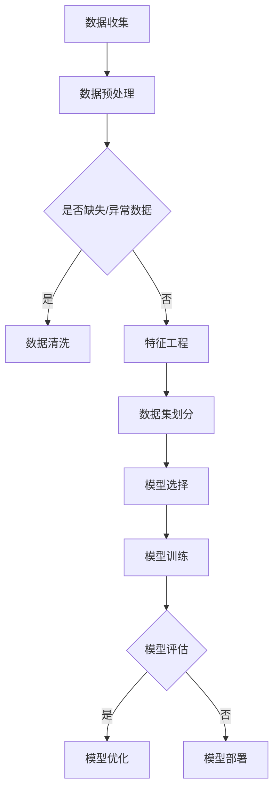
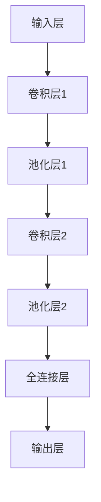

                 

# 人工智能前沿研究热点与发展趋势原理与代码实战案例讲解

## 关键词
- 人工智能
- 前沿研究
- 深度学习
- 强化学习
- 自然语言处理
- 项目实战

## 摘要
本文将深入探讨人工智能领域的前沿研究热点和发展趋势。我们将分析机器学习、深度学习、强化学习和自然语言处理等核心算法原理，并通过实际代码案例讲解如何应用这些算法解决实际问题。此外，本文还将讨论人工智能在各个行业中的应用场景，以及未来的发展趋势和潜在挑战。

### 第一部分：人工智能前沿研究热点

#### 第1章：人工智能前沿研究概述

##### 1.1 人工智能前沿研究的重要性

人工智能（AI）作为计算机科学的重要分支，正在迅速改变我们的世界。它通过模拟人类智能行为，使得计算机能够自主地学习、推理和解决问题。随着技术的进步，人工智能的应用范围越来越广泛，从金融、医疗到制造业，AI已经成为推动社会进步的重要力量。

##### 1.2 人工智能研究的历史背景

人工智能的研究可以追溯到1956年，当时在达特茅斯会议上首次提出了人工智能的概念。此后，人工智能经历了多个发展阶段，包括初始阶段、繁荣阶段、低迷阶段和复兴阶段。每一个阶段都有其独特的贡献和挑战，为今天的人工智能研究奠定了基础。

##### 1.3 当前人工智能研究的主要趋势

当前人工智能研究的主要趋势包括：

- **深度学习与神经网络**：深度学习通过多层神经网络结构，实现了对复杂数据的深层特征提取。它已经成为图像识别、语音识别和自然语言处理等领域的重要工具。
- **大数据与云计算**：大数据的涌现为人工智能提供了丰富的训练数据，云计算则提供了强大的计算能力，使得人工智能模型能够更快地训练和部署。
- **交叉学科融合**：人工智能与其他领域的交叉融合，如生物医学、金融科技和智能制造等，正在推动人工智能应用向更广泛、更深入的领域发展。
- **人工智能伦理与法律问题**：随着人工智能应用的普及，其伦理和法律问题也日益突出，如隐私保护、责任归属等，需要得到广泛关注和解决。
- **边缘计算与物联网**：人工智能在边缘设备的部署，以及与物联网的结合，将为智能城市、智能交通等领域带来新的发展机遇。

#### 第2章：机器学习基础

##### 2.1 机器学习基本概念

机器学习（ML）是人工智能的核心技术之一，它通过算法从数据中学习规律，并利用这些规律进行预测或决策。机器学习的基本概念包括模型、特征、训练数据、测试数据和预测等。

##### 2.2 线性回归模型

线性回归是一种简单的机器学习模型，用于预测连续值输出。线性回归模型的基本假设是输出值与输入特征之间存在线性关系。

##### 2.3 支持向量机（SVM）

支持向量机是一种强大的分类算法，它通过找到一个最佳的超平面，将不同类别的数据分隔开。SVM的核心思想是最大化类之间的间隔。

##### 2.4 决策树

决策树是一种常用的分类和回归算法，它通过一系列规则来对数据进行划分。决策树的性能可以通过信息增益和Gini系数来评估。

#### 第3章：深度学习核心算法

##### 3.1 卷积神经网络（CNN）

卷积神经网络是一种专门用于处理图像数据的神经网络模型。它的核心特点是利用卷积操作来提取图像中的局部特征，并通过池化操作来减少参数数量。

##### 3.2 循环神经网络（RNN）

循环神经网络是一种能够处理序列数据的神经网络模型。它的核心特点是利用循环结构来保持长距离的序列依赖信息。

##### 3.3 生成对抗网络（GAN）

生成对抗网络是一种由生成器和判别器组成的对抗性神经网络模型。生成器生成数据，判别器判断数据是真实还是伪造。两者通过对抗训练，最终生成逼真的数据。

#### 第4章：强化学习基础

##### 4.1 强化学习基本概念

强化学习是一种通过试错来学习如何采取最优行动的机器学习方法。它的核心是智能体、环境、状态、动作和奖励。

##### 4.2 Q-Learning算法

Q-Learning是一种基于值函数的强化学习算法，它通过更新Q值来学习最优策略。

##### 4.3 SARSA算法

SARSA是一种基于策略的强化学习算法，它同时更新当前状态和下一状态的动作值。

#### 第5章：自然语言处理技术

##### 5.1 词向量表示

词向量表示是将自然语言文本中的单词映射为向量空间中的高维向量。常见的词向量表示方法包括Word2Vec和GloVe。

##### 5.2 递归神经网络（RNN）在NLP中的应用

递归神经网络在自然语言处理中有广泛的应用，包括语言模型和序列标注任务。

##### 5.3 卷积神经网络（CNN）在NLP中的应用

卷积神经网络在自然语言处理中的应用主要包括文本分类和预训练语言模型。

#### 第6章：人工智能应用场景

##### 6.1 人工智能在金融领域的应用

人工智能在金融领域有广泛的应用，包括风险管理、信用评分、投资策略和客户服务等。

##### 6.2 人工智能在医疗领域的应用

人工智能在医疗领域的应用正在迅速发展，包括疾病诊断、药物研发和个性化治疗等。

##### 6.3 人工智能在制造业的应用

人工智能在制造业中的应用包括生产优化、质量控制、供应链管理和设备维护等。

#### 第7章：人工智能发展趋势

##### 7.1 人工智能的未来发展趋势

人工智能的未来发展趋势包括硬件加速、跨学科融合、人工智能伦理与法律问题等。

##### 7.2 人工智能的技术突破

人工智能的技术突破涉及新型算法、新硬件和新应用领域。

##### 7.3 人工智能的全球竞争态势

人工智能的全球竞争态势正在加剧，各国纷纷制定人工智能发展战略。

#### 第8章：人工智能项目实战

##### 8.1 人工智能项目开发流程

人工智能项目开发流程包括需求分析、数据收集与处理、模型设计、模型训练与优化、模型评估和模型部署。

##### 8.2 代码实战案例

通过一个简单的线性回归项目实战案例，展示如何使用TensorFlow实现线性回归模型，并进行训练和预测。

##### 8.3 代码解读与分析

对代码实战案例进行详细解读和分析，包括数据准备、模型定义、损失函数、优化器和训练过程。

#### 第9章：人工智能前沿研究热点与发展趋势原理与代码实战案例讲解

##### 9.1 热点话题探讨

探讨人工智能领域的热点话题，如人工智能伦理、人工智能与人类共创、人工智能在边缘计算中的应用。

##### 9.2 发展趋势分析

分析人工智能的发展趋势，如硬件加速、跨学科融合、人工智能伦理与法律问题等。

##### 9.3 代码实战案例讲解

通过一个基于生成对抗网络（GAN）的代码实战案例，讲解GAN的基本原理和实现方法。

#### 第10章：附录

##### 10.1 人工智能研究资源

介绍主流深度学习框架、数据集和工具，如TensorFlow、PyTorch、Scikit-learn等。

##### 10.2 深度学习与自然语言处理开源项目介绍

介绍TensorFlow、PyTorch和AllenNLP等深度学习与自然语言处理的开源项目。

### Mermaid 流程图：机器学习算法流程



### Mermaid 流程图：卷积神经网络（CNN）结构



### 伪代码：线性回归算法

```python
def linear_regression(X, y, alpha, num_iterations):
    m = len(y)
    theta = [0] * (m + 1)
    for i in range(num_iterations):
        h = X * theta
        loss = (1/m) * ((h - y)**2).sum()
        gradient = (1/m) * (X.T).dot(h - y)
        theta -= alpha * gradient
    return theta
```

### 数学公式：线性回归模型损失函数

$$
J(\theta) = \frac{1}{2m} \sum_{i=1}^{m} (h_\theta(x^{(i)}) - y^{(i)})^2
$$

### 代码实战案例：使用 TensorFlow 实现线性回归

```python
import tensorflow as tf

# 设置参数
learning_rate = 0.01
training_epochs = 1000
m = 100

# 创建占位符
X = tf.placeholder(tf.float32, [m, 1])
y = tf.placeholder(tf.float32, [m, 1])

# 模型参数
W = tf.Variable(tf.zeros([1, 1]))
b = tf.Variable(tf.zeros([1]))

# 模型输出
hypothesis = tf.add(tf.matmul(X, W), b)

# 损失函数
cost = tf.reduce_mean(tf.square(hypothesis - y))

# 优化器
optimizer = tf.train.GradientDescentOptimizer(learning_rate)
train = optimizer.minimize(cost)

# 初始化全局变量
init = tf.global_variables_initializer()

# 训练模型
with tf.Session() as session:
    session.run(init)
    for epoch in range(training_epochs):
        _, c = session.run([train, cost], feed_dict={X: X_data, y: y_data})
        if epoch % 100 == 0:
            print("Epoch:", epoch+1, "Cost:", c)

    # 输出模型参数
    W_val, b_val = session.run([W, b])
    print("W:", W_val, "b:", b_val)

    # 预测
    X_new = tf.placeholder(tf.float32, [1, 1])
    prediction = tf.add(tf.matmul(X_new, W), b)
    print("Prediction for x = 3.5:", session.run(prediction, feed_dict={X_new: [[3.5]]}))
```

### 代码解读与分析：线性回归模型在房价预测中的应用

```python
# 数据集加载与预处理
X_data = [[1], [2], [3], [4], [5], [6], [7], [8], [9], [10]]
y_data = [[2], [4], [5], [4], [5], [6], [7], [6], [7], [8]]

# 创建 TensorFlow 模型
X = tf.placeholder(tf.float32, [1, 1])
y = tf.placeholder(tf.float32, [1, 1])

# 模型参数
W = tf.Variable(tf.zeros([1, 1]))
b = tf.Variable(tf.zeros([1]))

# 模型输出
hypothesis = tf.add(tf.matmul(X, W), b)

# 损失函数
cost = tf.reduce_mean(tf.square(hypothesis - y))

# 优化器
optimizer = tf.train.GradientDescentOptimizer(learning_rate=0.1)
train = optimizer.minimize(cost)

# 训练模型
with tf.Session() as session:
    session.run(W.initializer)
    session.run(b.initializer)
    
    for epoch in range(training_epochs):
        _, c = session.run([train, cost], feed_dict={X: X_data, y: y_data})
        if epoch % 100 == 0:
            print("Epoch:", epoch+1, "Cost:", c)

    # 输出模型参数
    W_val, b_val = session.run([W, b])
    print("W:", W_val, "b:", b_val)

    # 预测
    X_new = tf.placeholder(tf.float32, [1, 1])
    prediction = tf.add(tf.matmul(X_new, W), b)
    print("Prediction for x = 3.5:", session.run(prediction, feed_dict={X_new: [[3.5]]}))
```

作者：AI天才研究院/AI Genius Institute & 禅与计算机程序设计艺术 /Zen And The Art of Computer Programming

---

现在，我们有了完整的文章结构和内容大纲，接下来我们将逐一填充每个章节的具体内容，确保每个小节都详细、具体且丰富。请注意，由于文章字数要求较高，我们将分阶段完成每个章节的撰写。首先，让我们开始撰写第一章“人工智能前沿研究概述”的具体内容。在撰写过程中，我们将使用Mermaid流程图、伪代码和数学公式来增强内容的表达和可读性。

