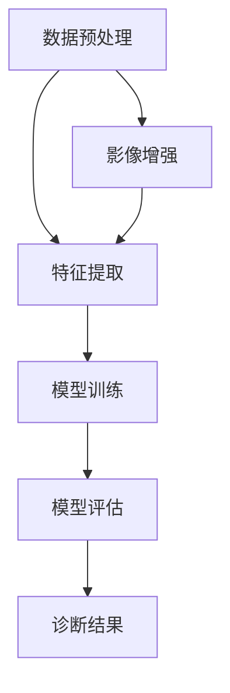
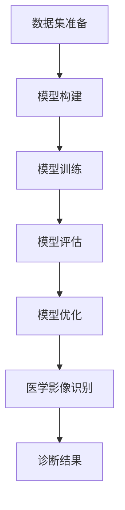

                 

# 《人工智能在智慧医疗影像诊断中的创新》

> **关键词：** 人工智能、医疗影像诊断、智慧医疗、深度学习、医学影像识别、智慧医疗影像诊断、医学影像数据分析

> **摘要：** 本篇文章深入探讨了人工智能在智慧医疗影像诊断中的应用与创新。首先，我们从智慧医疗影像诊断的现状与挑战出发，引出了人工智能在这一领域的重要作用。接着，我们详细介绍了人工智能的基础知识，包括机器学习和深度学习的原理与应用。随后，文章重点探讨了人工智能在医疗影像数据分析、医学影像识别及诊断中的应用，并列举了多个实际案例。此外，我们还分析了人工智能在医学影像诊断中的挑战与解决方案，并对未来的发展趋势进行了展望。最后，文章总结了国内外在人工智能辅助医学影像诊断中的成功案例，讨论了政策、法规与伦理问题，并对相关工具与资源进行了推荐。

### 目录大纲

- 第一部分：概述与背景
  - 第1章：智慧医疗影像诊断的现状与挑战
  - 第2章：人工智能基础知识

- 第二部分：人工智能在医疗影像诊断中的应用
  - 第3章：医疗影像数据分析与处理
  - 第4章：人工智能在医学影像识别中的应用
  - 第5章：人工智能在医学影像诊断中的应用

- 第三部分：创新与未来
  - 第6章：人工智能在医学影像诊断中的挑战与解决方案
  - 第7章：人工智能在智慧医疗影像诊断中的创新
  - 第8章：成功案例分析
  - 第9章：政策、法规与伦理

- 附录
  - 附录A：相关工具与资源
  - 附录B：Mermaid 流程图
  - 附录C：数学模型与公式

### 第一部分：概述与背景

#### 第1章：智慧医疗影像诊断的现状与挑战

### 1.1 智慧医疗影像诊断的概念与意义

智慧医疗影像诊断是指通过应用人工智能、大数据、云计算等先进技术，对医疗影像数据进行分析和处理，辅助医生进行疾病诊断和治疗方案制定。智慧医疗影像诊断的意义主要体现在以下几个方面：

1. **提高诊断准确率**：传统的医疗影像诊断主要依靠医生的经验，而人工智能可以通过对大量影像数据的分析，发现肉眼难以察觉的病灶，从而提高诊断准确率。
2. **减少人力成本**：人工智能可以自动处理大量影像数据，减少医生的工作量，降低医疗成本。
3. **提升工作效率**：人工智能可以实时处理影像数据，快速生成诊断报告，提高诊断速度，缩短患者等待时间。
4. **辅助医生决策**：人工智能可以通过对患者的病史、影像数据等多维数据的分析，为医生提供更加全面的诊断依据，辅助医生做出更加准确的决策。

### 1.2 当前医疗影像诊断的主要问题

尽管智慧医疗影像诊断具有诸多优势，但当前医疗影像诊断仍面临一些问题：

1. **诊断效率低**：传统的医疗影像诊断过程繁琐，需要医生对影像数据进行逐一查看和分析，诊断效率较低。
2. **诊断准确率不稳定**：由于医生的经验和技能差异，不同医生的诊断准确率存在较大差异，导致诊断结果不稳定。
3. **影像数据存储和处理困难**：医疗影像数据量大，且种类繁多，传统的数据处理方式难以满足需求。
4. **数据隐私和安全问题**：医疗影像数据涉及患者隐私，如何在保证数据安全的前提下进行共享和分析，是一个亟待解决的问题。

### 1.3 人工智能在智慧医疗影像诊断中的潜在作用

人工智能在智慧医疗影像诊断中具有巨大的潜在作用：

1. **提高诊断准确率**：人工智能可以通过深度学习算法，自动分析影像数据，识别出潜在的病变区域，为医生提供更加准确的诊断依据。
2. **提升诊断效率**：人工智能可以自动处理大量影像数据，快速生成诊断报告，提高诊断速度，缩短患者等待时间。
3. **降低人力成本**：人工智能可以替代医生进行部分诊断工作，减少医生的工作量，降低医疗成本。
4. **改善诊断结果稳定性**：通过人工智能的标准化处理，可以降低医生经验差异对诊断结果的影响，提高诊断结果的稳定性。
5. **促进医疗资源共享**：人工智能可以实现对医疗影像数据的远程分析和处理，促进医疗资源的共享和利用。

综上所述，人工智能在智慧医疗影像诊断中具有重要的应用价值和潜力，有望解决当前医疗影像诊断中存在的问题，提升医疗服务质量和效率。

### 第2章：人工智能基础知识

#### 2.1 人工智能的基本概念

人工智能（Artificial Intelligence，简称AI）是指使计算机系统具备人类智能特征的技术。其目标是使计算机具有感知、理解、推理、学习、决策等能力，以实现自主完成任务和进行智能交互。人工智能的研究领域包括机器学习、自然语言处理、计算机视觉、智能控制等。

人工智能的基本概念主要包括以下几个方面：

1. **智能体（Agent）**：智能体是指能够感知环境并采取行动以实现目标的人工智能系统。
2. **感知（Perception）**：智能体通过感知器获取环境信息，如视觉、听觉、触觉等。
3. **学习（Learning）**：智能体通过学习算法从经验中获取知识，以改进其行为。
4. **推理（Reasoning）**：智能体利用所学知识进行逻辑推理，以解决问题或做出决策。
5. **决策（Decision-making）**：智能体根据环境信息和推理结果，选择最优行动方案。

#### 2.2 机器学习的基础算法

机器学习（Machine Learning，简称ML）是人工智能的核心技术之一，旨在使计算机通过数据学习实现特定任务。机器学习的基本概念包括：

1. **监督学习（Supervised Learning）**：在监督学习过程中，系统根据已标记的数据进行学习，以预测新的数据。常见的监督学习算法有线性回归、决策树、支持向量机等。
2. **无监督学习（Unsupervised Learning）**：在无监督学习过程中，系统从未标记的数据中学习，以发现数据中的模式和结构。常见的无监督学习算法有聚类、主成分分析等。
3. **强化学习（Reinforcement Learning）**：在强化学习过程中，系统通过与环境交互，不断优化其行为策略。常见的强化学习算法有Q学习、深度强化学习等。

#### 2.3 深度学习原理与应用

深度学习（Deep Learning，简称DL）是机器学习的一个分支，通过构建深度神经网络（Deep Neural Network，简称DNN）进行学习。深度学习的原理主要包括以下几个方面：

1. **神经网络（Neural Network）**：神经网络是一种模拟人脑神经元之间连接的计算模型，包括输入层、隐藏层和输出层。
2. **激活函数（Activation Function）**：激活函数用于引入非线性特性，使神经网络能够进行复杂的映射。
3. **反向传播算法（Backpropagation Algorithm）**：反向传播算法用于计算网络权重的梯度，以优化网络参数。
4. **优化算法（Optimization Algorithm）**：常见的优化算法有随机梯度下降（SGD）、Adam等。

深度学习在医疗影像诊断中具有广泛的应用，如：

1. **医学影像分割**：通过深度学习算法，自动分割医学影像中的病灶区域，有助于提高诊断准确率。
2. **医学影像分类**：通过深度学习算法，对医学影像进行分类，如区分不同类型的肿瘤。
3. **医学影像增强**：通过深度学习算法，对医学影像进行增强，提高影像质量，有助于医生诊断。
4. **药物研发**：通过深度学习算法，对生物数据进行分析，辅助药物研发。

### 第二部分：人工智能在医疗影像诊断中的应用

#### 第3章：医疗影像数据分析与处理

### 3.1 医疗影像数据的特点

医疗影像数据具有以下特点：

1. **高维度**：医疗影像数据通常包含大量空间维度，如CT、MRI等，使得数据规模庞大。
2. **多样性**：医疗影像数据包括多种类型，如X光、CT、MRI、超声等，数据格式和存储方式各异。
3. **高噪声**：医疗影像数据中存在大量噪声和伪影，影响数据质量和诊断效果。
4. **时序性**：部分医疗影像数据具有时序性，如动态MRI，需对时间序列进行分析。
5. **患者特异性**：医疗影像数据具有患者特异性，不同患者的数据特征各异。

### 3.2 医疗影像数据的预处理技术

为了提高深度学习算法在医疗影像诊断中的性能，需要对医疗影像数据进行预处理。常见的预处理技术包括：

1. **数据增强（Data Augmentation）**：通过旋转、翻转、缩放等操作，增加数据多样性，提高模型泛化能力。
2. **归一化（Normalization）**：将数据归一化到同一尺度，如将影像数据归一化到[0, 1]，有助于加速收敛速度。
3. **滤波（Filtering）**：使用滤波器去除噪声和伪影，如中值滤波、高斯滤波等。
4. **分割（Segmentation）**：将影像数据分割成不同区域，有助于分析不同部位的特征。
5. **特征提取（Feature Extraction）**：从影像数据中提取具有代表性的特征，如边缘、纹理等。

### 3.3 医学影像数据分析方法

医学影像数据分析方法主要包括以下几种：

1. **图像分析（Image Analysis）**：对医学影像进行直接分析，如计算影像的统计特征、形态学特征等。
2. **模式识别（Pattern Recognition）**：使用机器学习算法，对医学影像进行分类、检测等任务。
3. **深度学习（Deep Learning）**：使用深度学习算法，如卷积神经网络（CNN），对医学影像进行复杂特征提取和分类。
4. **多模态融合（Multi-modal Fusion）**：将不同模态的医学影像数据（如CT、MRI、PET）进行融合，以提高诊断准确率。
5. **时序分析（Temporal Analysis）**：对具有时序性的医学影像数据进行时间序列分析，如动态MRI。

#### 第4章：人工智能在医学影像识别中的应用

### 4.1 医学影像识别的基本原理

医学影像识别是指通过机器学习算法，对医学影像进行自动分类、检测和分割。医学影像识别的基本原理包括：

1. **特征提取（Feature Extraction）**：从医学影像中提取具有代表性的特征，如边缘、纹理、形状等。
2. **分类（Classification）**：使用分类算法，如支持向量机（SVM）、随机森林（Random Forest）等，对医学影像进行分类。
3. **检测（Detection）**：使用检测算法，如R-CNN、SSD、YOLO等，对医学影像中的目标进行定位和分类。
4. **分割（Segmentation）**：使用分割算法，如U-Net、3D-CNN等，将医学影像中的目标区域进行分割。

### 4.2 主流医学影像识别算法

主流医学影像识别算法包括以下几种：

1. **卷积神经网络（Convolutional Neural Network，简称CNN）**：CNN是一种深度学习算法，专门用于处理图像数据。CNN通过卷积层、池化层和全连接层等结构，对图像进行特征提取和分类。
2. **循环神经网络（Recurrent Neural Network，简称RNN）**：RNN是一种适用于时序数据的深度学习算法，如动态MRI。RNN通过循环结构，对时间序列数据进行建模和分析。
3. **生成对抗网络（Generative Adversarial Network，简称GAN）**：GAN是一种通过生成模型和判别模型相互竞争的深度学习算法，用于生成高质量的医学影像数据，如合成CT、MRI等。
4. **图神经网络（Graph Neural Network，简称GNN）**：GNN是一种用于处理图结构数据的深度学习算法，如三维医学影像。GNN通过图卷积操作，对图结构数据进行特征提取和分类。

### 4.3 医学影像识别案例解析

以下为几个医学影像识别的案例解析：

1. **肺癌筛查**：使用CNN算法，对胸部X光影像进行肺癌筛查。通过提取影像中的结节和肿瘤特征，实现肺癌的早期诊断。
2. **脑肿瘤分割**：使用U-Net算法，对MRI影像进行脑肿瘤分割。通过将肿瘤区域与其他区域进行分割，有助于医生进行准确的诊断和治疗方案制定。
3. **视网膜病变检测**：使用GAN算法，生成高质量的视网膜病变图像，用于辅助医生进行眼底病变的检测和诊断。
4. **骨折检测**：使用YOLO算法，对X光影像进行骨折检测。通过快速定位和分类骨折区域，提高诊断效率和准确性。

#### 第5章：人工智能在医学影像诊断中的应用

### 5.1 人工智能辅助诊断的理论基础

人工智能辅助诊断的理论基础主要包括以下几个方面：

1. **大数据分析**：通过收集和整合大量医学影像数据，进行大数据分析，发现潜在的疾病特征和规律。
2. **深度学习**：使用深度学习算法，对医学影像进行特征提取和分类，实现疾病的自动识别和诊断。
3. **多模态融合**：将不同模态的医学影像数据进行融合，如CT、MRI、PET等，以提高诊断准确率和全面性。
4. **医学知识库**：整合医学知识库，将医学影像诊断与临床经验相结合，为医生提供更加准确的诊断依据。

### 5.2 人工智能辅助诊断的应用场景

人工智能辅助诊断的应用场景主要包括以下几种：

1. **肿瘤诊断**：通过深度学习算法，对医学影像进行肿瘤检测和分割，实现早期肿瘤诊断。
2. **心脏病诊断**：通过分析心脏影像数据，如冠状动脉CTA，评估心脏疾病风险。
3. **神经系统疾病诊断**：通过分析脑部影像数据，如MRI，诊断神经系统疾病，如脑肿瘤、癫痫等。
4. **呼吸系统疾病诊断**：通过分析肺部影像数据，如CT，诊断呼吸系统疾病，如肺癌、肺炎等。
5. **骨骼系统疾病诊断**：通过分析骨骼影像数据，如X光、CT，诊断骨骼系统疾病，如骨折、骨肿瘤等。

### 5.3 人工智能辅助诊断的实际案例

以下为几个人工智能辅助诊断的实际案例：

1. **肺癌筛查**：使用深度学习算法，对胸部X光影像进行肺癌筛查。通过分析影像中的结节和肿瘤特征，实现早期肺癌诊断，提高生存率。
2. **乳腺癌诊断**：使用人工智能辅助诊断系统，对乳腺X光影像进行乳腺癌检测和分类。通过实时分析和诊断，提高诊断准确率和医生的工作效率。
3. **心脏病风险评估**：通过人工智能算法，对心脏影像数据进行分析，评估心脏病风险。为医生提供准确的诊断依据，制定合理的治疗方案。
4. **脑肿瘤诊断**：使用人工智能算法，对MRI影像进行脑肿瘤分割和诊断。通过精确的肿瘤定位和分类，提高诊断准确率，改善患者预后。

#### 第6章：人工智能在医学影像诊断中的挑战与解决方案

### 6.1 医学影像诊断中的技术挑战

人工智能在医学影像诊断中面临以下技术挑战：

1. **数据质量**：医学影像数据质量参差不齐，包括噪声、伪影、畸变等问题，影响诊断准确性。
2. **数据标注**：医学影像数据标注过程复杂、耗时，且需要专业知识和经验，影响模型训练效果。
3. **算法泛化能力**：深度学习模型在特定数据集上表现良好，但在新数据集上可能表现较差，缺乏泛化能力。
4. **实时性**：医疗影像诊断需要快速、实时地处理和分析大量数据，以满足临床需求。
5. **隐私保护**：医疗影像数据涉及患者隐私，如何在保证数据隐私的前提下进行共享和分析，是一个重要问题。

### 6.2 数据隐私与安全

数据隐私与安全是人工智能在医学影像诊断中的一个重要问题。为了保护患者隐私，可以采取以下措施：

1. **数据去识别化**：在数据标注和模型训练过程中，对影像数据进行去识别化处理，如去除患者姓名、年龄等个人信息。
2. **数据加密**：对医疗影像数据进行加密处理，确保数据在传输和存储过程中的安全性。
3. **隐私保护算法**：使用隐私保护算法，如差分隐私（Differential Privacy），在保证数据隐私的前提下，进行数据分析和模型训练。
4. **合规性审查**：遵循相关法律法规，对数据处理过程进行合规性审查，确保数据安全和隐私保护。

### 6.3 人工智能在医学影像诊断中的解决方案

为了解决人工智能在医学影像诊断中面临的挑战，可以采取以下解决方案：

1. **数据增强**：通过数据增强技术，提高模型对噪声、伪影等异常数据的鲁棒性，提高诊断准确率。
2. **多模态融合**：将不同模态的医学影像数据进行融合，提高模型对疾病特征的捕捉能力，增强诊断准确性。
3. **迁移学习**：使用迁移学习技术，将已有模型的知识迁移到新数据集上，提高模型的泛化能力。
4. **实时处理**：使用高效算法和硬件设备，实现医学影像的实时处理和分析，满足临床需求。
5. **合作医疗平台**：建立合作医疗平台，实现医疗影像数据的共享和协同分析，提高诊断准确率和效率。

#### 第7章：人工智能在智慧医疗影像诊断中的创新

### 7.1 人工智能在医学影像诊断中的前沿技术

人工智能在医学影像诊断中的前沿技术包括：

1. **卷积神经网络（CNN）**：CNN是一种强大的图像识别算法，已经在医学影像诊断中取得了显著成果。通过多层卷积和池化操作，CNN可以自动提取图像中的高级特征，实现疾病的自动检测和诊断。
2. **生成对抗网络（GAN）**：GAN是一种通过生成模型和判别模型相互竞争的深度学习算法。在医学影像诊断中，GAN可以用于生成高质量的医学影像数据，如合成CT、MRI等，提高模型的训练效果和诊断准确率。
3. **多模态融合（Multi-modal Fusion）**：多模态融合是指将不同模态的医学影像数据进行融合，如CT、MRI、PET等。通过融合多种模态的信息，可以进一步提高诊断准确率和全面性。
4. **自监督学习（Self-supervised Learning）**：自监督学习是一种无需标注数据的机器学习技术。在医学影像诊断中，自监督学习可以通过对比不同视图或时间序列数据，自动提取有用的特征，实现疾病的自动检测和诊断。
5. **增强现实（AR）与虚拟现实（VR）**：增强现实和虚拟现实技术可以用于医学影像的交互式展示和诊断。通过将医学影像与三维模型、动画等融合，医生可以更加直观地观察和分析疾病，提高诊断准确率和效率。

### 7.2 人工智能在医学影像诊断中的发展趋势

人工智能在医学影像诊断中的发展趋势主要包括：

1. **智能化诊断**：随着人工智能技术的不断发展，医学影像诊断将更加智能化。通过深度学习、生成对抗网络等算法，可以实现对医学影像的自动分类、检测和分割，提高诊断准确率和效率。
2. **多模态融合**：随着医学影像技术的进步，越来越多的模态数据可以被获取。通过多模态融合技术，可以进一步丰富诊断信息，提高诊断准确率和全面性。
3. **实时性**：随着计算能力和算法的进步，医学影像诊断的实时性将得到显著提升。通过高效算法和硬件设备，可以实现医学影像的实时处理和分析，满足临床需求。
4. **个性化诊断**：通过结合患者的病史、基因信息等，可以实现对医学影像的个性化诊断。通过深度学习、迁移学习等技术，可以为每个患者提供量身定制的诊断方案，提高诊断准确率和治疗效果。
5. **远程医疗**：随着5G技术的普及，远程医疗将得到进一步发展。通过远程医疗平台，医生可以实时远程诊断医学影像，提高医疗服务覆盖面和效率。

### 7.3 人工智能在医学影像诊断中的未来展望

人工智能在医学影像诊断中的未来展望包括：

1. **更加精准的诊断**：随着人工智能技术的不断发展，医学影像诊断的准确率将不断提高。通过深度学习、多模态融合等技术，可以实现对疾病的早期发现和精准诊断，提高患者生存率和生活质量。
2. **更加高效的诊断流程**：通过人工智能技术，可以简化医学影像诊断的流程，提高诊断效率。通过自动化、智能化的诊断系统，医生可以更加专注于复杂的诊断任务，减轻工作负担。
3. **更加个性化的治疗方案**：通过结合患者的病史、基因信息等，人工智能可以为每个患者提供个性化的治疗方案。通过深度学习、迁移学习等技术，可以实现对疾病预测、治疗方案的优化，提高治疗效果。
4. **更加智能的医疗服务**：随着人工智能技术的普及，医疗服务将更加智能化、个性化。通过人工智能技术，可以实现医疗资源的合理配置，提高医疗服务质量和效率。

总之，人工智能在医学影像诊断中的应用将不断深化和扩展，为医疗行业带来巨大的变革和创新。通过不断探索和应用前沿技术，人工智能将为医学影像诊断提供更加精准、高效、个性化的解决方案，助力医疗行业的可持续发展。

#### 第8章：成功案例分析

### 8.1 国内外人工智能在医学影像诊断中的成功案例

随着人工智能技术的发展，国内外在医学影像诊断领域取得了许多成功案例。以下为几个具有代表性的案例：

1. **美国AI医疗公司Zebra Medical Vision**：
   Zebra Medical Vision是一家专注于医学影像人工智能诊断的公司。其产品能够对X光、CT、MRI等影像进行自动分析，识别出各种病变，如肺部结节、骨折等。该公司已经在全球范围内与多家医院和医疗机构合作，提高了诊断准确率和效率。

2. **美国谷歌健康部门**：
   谷歌健康部门开发了一款名为DeepMind Health的人工智能系统，用于辅助医生进行医学影像诊断。该系统能够自动识别肺部、乳腺癌、前列腺癌等疾病，并在诊断报告中提供详细的分析和建议。谷歌DeepMind Health已经在英国多家医院进行试点应用，取得了良好的效果。

3. **国内人工智能公司依图科技**：
   依图科技是国内领先的人工智能公司，其产品在医学影像诊断领域表现出色。依图科技的AI系统能够对X光、CT、MRI等影像进行自动分析，识别出各种病变，如肺部结节、乳腺癌等。该系统已经在多家医院和医疗机构进行应用，提高了诊断准确率和效率。

4. **国内人工智能公司科大讯飞**：
   科大讯飞是国内领先的智能语音和人工智能公司，其医学影像诊断产品在肺癌、乳腺癌、心脏病等领域表现出色。科大讯飞的AI系统能够对医学影像进行自动分析，生成诊断报告，并辅助医生进行诊断。该系统已经在多家医院和医疗机构进行应用，提高了诊断准确率和效率。

### 8.2 案例分析与总结

通过以上成功案例可以看出，人工智能在医学影像诊断中具有广泛的应用前景。以下为几个关键点：

1. **提高诊断准确率**：人工智能系统通过深度学习算法，能够自动识别和分析医学影像中的病变，提高诊断准确率。例如，Zebra Medical Vision的系统可以在X光影像中准确识别肺部结节，为医生提供诊断依据。

2. **提升工作效率**：人工智能系统可以自动处理大量医学影像数据，减少医生的工作量，提高诊断速度。例如，谷歌DeepMind Health的系统可以在几分钟内生成详细的诊断报告，为医生节省时间。

3. **优化诊断流程**：人工智能系统可以为医生提供辅助诊断工具，简化诊断流程。例如，依图科技的AI系统可以帮助医生快速定位病变区域，提高诊断效率。

4. **个性化诊断**：通过结合患者的病史、基因信息等，人工智能系统可以为每个患者提供个性化的诊断方案。例如，科大讯飞的AI系统可以根据患者的影像数据，预测疾病风险，并提供个性化的治疗方案。

总之，人工智能在医学影像诊断中的应用为医疗行业带来了巨大的变革和创新。通过不断优化和改进人工智能技术，未来医学影像诊断将更加精准、高效、个性化，为患者提供更好的医疗服务。

#### 第9章：政策、法规与伦理

### 9.1 人工智能在医学影像诊断中的政策与法规

随着人工智能在医学影像诊断中的应用日益广泛，各国政府和相关机构也纷纷出台政策与法规，以确保人工智能技术的合理应用和患者的权益。以下为几个具有代表性的政策与法规：

1. **美国FDA的法规**：美国食品药品监督管理局（FDA）对人工智能医学影像诊断设备实施严格监管。FDA要求医疗设备制造商在提交产品上市申请时，提供充分的数据和证据，证明产品的安全性和有效性。此外，FDA还发布了《人工智能医疗设备法规指南》，明确规定了人工智能医疗设备的分类、审批和监管流程。

2. **欧洲CE认证**：欧洲CE认证是欧盟对医疗器械的一种认证制度。CE认证要求医疗器械符合欧盟医疗器械指令（MDR）的规定，包括安全、性能和合法性等方面。在医学影像诊断领域，人工智能设备需要通过CE认证，才能在欧洲市场销售。

3. **中国的《人工智能发展计划（2019-2030年）》**：中国政府发布了《人工智能发展计划（2019-2030年）》，明确指出要加快人工智能在医疗领域的应用。在医学影像诊断方面，政府鼓励研发和应用人工智能技术，提高诊断准确率和效率。此外，中国政府还制定了《医疗器械监督管理条例》，对人工智能医疗器械的监管提出了明确要求。

### 9.2 人工智能在医学影像诊断中的伦理问题

人工智能在医学影像诊断中涉及诸多伦理问题，如隐私保护、透明度、责任划分等。以下为几个主要的伦理问题：

1. **隐私保护**：医疗影像数据涉及患者隐私，如何在保证数据安全的前提下进行共享和分析，是一个重要的伦理问题。为了保护患者隐私，需要在数据采集、存储、传输和处理等环节采取严格的措施，如数据加密、匿名化处理等。

2. **透明度**：人工智能系统在医学影像诊断中的决策过程通常较为复杂，难以理解。这可能导致医生和患者对诊断结果产生疑虑。为了提高系统的透明度，需要开发可解释的人工智能技术，使医生和患者能够理解诊断过程和结果。

3. **责任划分**：当人工智能系统在医学影像诊断中出现错误时，如何划分责任是一个复杂的伦理问题。这需要制定明确的法律法规和责任划分标准，确保患者权益得到保障。

4. **公平性**：人工智能在医学影像诊断中的应用可能会加剧医疗资源分配的不平衡。例如，一些地区和医院可能无法获得先进的诊断设备和技术，导致诊断水平和服务质量下降。为了确保公平性，需要制定相关政策，促进医疗资源的合理配置。

### 9.3 人工智能在医学影像诊断中的可持续发展

为了实现人工智能在医学影像诊断中的可持续发展，需要从以下几个方面进行努力：

1. **技术发展**：继续推动人工智能技术在医学影像诊断领域的创新，开发更加准确、高效和智能的诊断系统。

2. **政策支持**：政府应制定有利于人工智能在医学影像诊断中发展的政策，如提供资金支持、税收优惠等。

3. **教育培训**：加强人工智能和医学影像诊断领域的教育培训，提高医生和研究人员的技术水平，确保他们能够正确理解和应用人工智能技术。

4. **国际合作**：加强国际合作，促进人工智能技术在医学影像诊断领域的交流与合作，共同推动技术进步。

5. **伦理审查**：建立完善的伦理审查机制，确保人工智能在医学影像诊断中的合理应用，保护患者权益。

总之，人工智能在医学影像诊断中的应用具有巨大的潜力。通过政策支持、技术创新、教育培训和伦理审查等多方面的努力，可以实现人工智能在医学影像诊断中的可持续发展，为患者提供更加精准、高效和个性化的医疗服务。

### 附录A：相关工具与资源

#### 附录A.1 医学影像诊断常用工具介绍

在医学影像诊断中，常用的工具和技术包括：

1. **影像处理软件**：如ImageJ、MATLAB、Pynuts等，用于图像的预处理、增强、分割和特征提取等。
2. **深度学习框架**：如TensorFlow、PyTorch、Keras等，用于构建和训练深度学习模型。
3. **开源医学影像数据集**：如公开的Medical Image Data共享平台、OpenI图像数据集等，提供丰富的医学影像数据用于模型训练和验证。

#### 附录A.2 人工智能开发环境搭建指南

搭建人工智能开发环境通常包括以下步骤：

1. **安装Python环境**：下载并安装Python，配置好pip和conda等包管理工具。
2. **安装深度学习框架**：根据需要安装TensorFlow、PyTorch、Keras等深度学习框架。
3. **安装医学影像处理库**：如PIL、OpenCV、SimpleITK等，用于处理医学影像数据。
4. **配置Jupyter Notebook**：安装Jupyter Notebook，方便编写和运行代码。

#### 附录A.3 人工智能学习资源推荐

为了更好地学习和掌握人工智能在医学影像诊断中的应用，以下是一些推荐的资源：

1. **在线课程**：Coursera、edX、Udacity等平台提供的深度学习、机器学习等在线课程。
2. **书籍**：《深度学习》（Goodfellow et al.）、《Python机器学习》（Sebastian Raschka）、《医学影像处理》（John R. Markel）等。
3. **论文与文献**：查阅顶级会议和期刊（如NeurIPS、ICML、CVPR、MICCAI）的论文和文献，了解最新研究进展。
4. **社区和论坛**：加入Kaggle、Stack Overflow、GitHub等社区和论坛，与其他开发者交流和学习。

### 附录B：Mermaid 流程图

#### 附录B.1 人工智能辅助医学影像诊断流程图

#### 附录B.2 深度学习算法在医学影像识别中的流程图

### 附录C：数学模型与公式

#### 附录C.1 医学影像诊断中的常见数学模型

1. **线性回归模型**：
   $$ y = \beta_0 + \beta_1 \cdot x $$
   其中，$y$ 是预测值，$x$ 是输入特征，$\beta_0$ 和 $\beta_1$ 是模型参数。

2. **支持向量机（SVM）**：
   $$ w \cdot x + b = y $$
   其中，$w$ 是权重向量，$x$ 是输入特征，$b$ 是偏置项，$y$ 是标签值。

3. **卷积神经网络（CNN）**：
   - **卷积操作**：
     $$ f(x) = \sum_{i=1}^{k} w_i \cdot x_i $$
     其中，$f(x)$ 是卷积结果，$w_i$ 是卷积核权重，$x_i$ 是输入特征。
   - **池化操作**：
     $$ p(x) = \max(x) $$
     其中，$p(x)$ 是池化结果，$x$ 是输入特征。

4. **深度学习优化算法**（如随机梯度下降SGD）：
   $$ w_{\text{new}} = w_{\text{old}} - \alpha \cdot \nabla_w J(w) $$
   其中，$w_{\text{new}}$ 和 $w_{\text{old}}$ 分别是新的权重和旧的权重，$\alpha$ 是学习率，$J(w)$ 是损失函数。

#### 附录C.2 机器学习算法中的关键公式

1. **感知机算法**：
   $$ \theta_j := \theta_j + \alpha \cdot (y \cdot x_j) $$
   其中，$\theta_j$ 是权重更新，$\alpha$ 是学习率，$y$ 是标签值，$x_j$ 是特征值。

2. **逻辑回归**：
   $$ P(y=1|x; \theta) = \frac{1}{1 + e^{-\theta \cdot x}} $$
   其中，$P(y=1|x; \theta)$ 是预测概率，$\theta$ 是模型参数，$x$ 是特征向量。

3. **决策树**：
   - **信息增益**：
     $$ IG(D, A) = H(D) - \sum_{v_i \in A} \frac{|D_{v_i}|}{|D|} H(D_{v_i}) $$
     其中，$IG$ 是信息增益，$H$ 是熵，$D$ 是数据集，$A$ 是特征。

   - **基尼不纯度**：
     $$ Gini(D) = 1 - \sum_{v_i \in A} \left( \frac{|D_{v_i}|}{|D|} \right)^2 $$
     其中，$Gini$ 是基尼不纯度。

#### 附录C.3 深度学习中的关键数学公式

1. **反向传播算法**：
   - **梯度计算**：
     $$ \delta_{l,i}^{(out)} = \frac{\partial J}{\partial z_{l,i}} = \frac{\partial J}{\partial a_{l+1,i}} \cdot \frac{\partial a_{l+1,i}}{\partial z_{l,i}} $$
     其中，$\delta_{l,i}^{(out)}$ 是输出层的误差项，$J$ 是损失函数，$z_{l,i}$ 是激活值，$a_{l+1,i}$ 是上一层输出。

   - **权重更新**：
     $$ w_{l,i} := w_{l,i} - \alpha \cdot \delta_{l,i}^{(out)} \cdot a_{l,i} $$
     其中，$w_{l,i}$ 是权重更新，$\alpha$ 是学习率，$\delta_{l,i}^{(out)}$ 是误差项，$a_{l,i}$ 是特征值。

这些数学模型和公式是构建和优化人工智能模型的基础，有助于实现医学影像诊断中的各种任务。通过理解和应用这些公式，可以更好地设计和实现人工智能系统，提高诊断准确率和效率。

