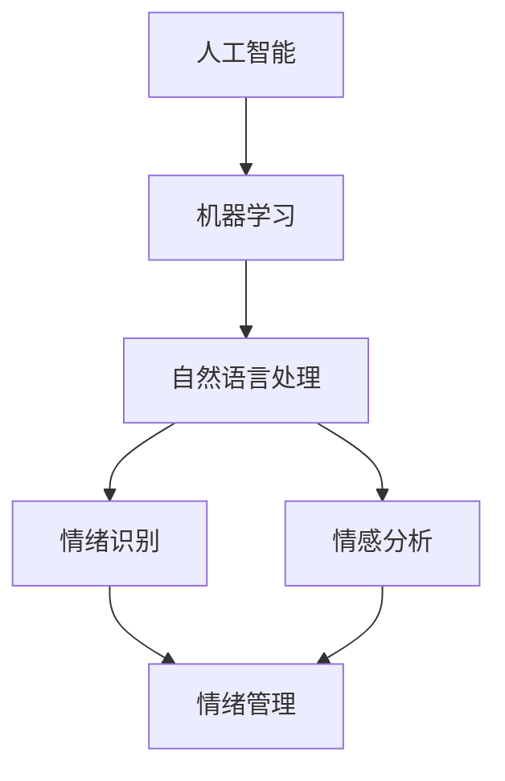

                 

# 人工智能在智能客服情绪管理中的实现

## 关键词
- 人工智能
- 智能客服
- 情绪管理
- 机器学习
- 自然语言处理
- 情感分析
- 情绪识别

## 摘要
随着人工智能技术的不断发展，智能客服逐渐成为企业提高客户服务质量和效率的重要工具。然而，智能客服在处理客户情绪方面存在一定的局限性。本文旨在探讨如何利用人工智能技术，特别是机器学习和自然语言处理技术，实现对智能客服情绪管理的实现。文章首先介绍了智能客服的背景与现状，以及情绪管理在智能客服中的重要性。随后，详细阐述了人工智能、机器学习和自然语言处理的基础知识，为后续章节的情绪识别与情感分析、情绪管理模型设计、情绪管理算法实现等提供了理论基础。通过实际案例和代码实现，展示了如何将人工智能技术应用于智能客服情绪管理中，并对其性能进行了评估。最后，文章对未来情绪管理在智能客服中的应用进行了展望，提出了挑战与机遇。

### 目录大纲：人工智能在智能客服情绪管理中的实现

#### 第1章：绪论
- 1.1 智能客服的背景与现状
  - 1.1.1 智能客服的定义
  - 1.1.2 智能客服的发展历程
  - 1.1.3 智能客服的挑战与机遇
- 1.2 情绪管理在智能客服中的重要性
  - 1.2.1 客户情绪的重要性
  - 1.2.2 情绪管理对客服效果的影响
  - 1.2.3 情绪管理的发展趋势

#### 第2章：人工智能基础
- 2.1 人工智能概述
  - 2.1.1 人工智能的定义
  - 2.1.2 人工智能的发展历程
  - 2.1.3 人工智能的应用领域
- 2.2 机器学习基础
  - 2.2.1 机器学习的概念
  - 2.2.2 常见的机器学习算法
  - 2.2.3 机器学习的应用场景
- 2.3 自然语言处理基础
  - 2.3.1 自然语言处理的概念
  - 2.3.2 自然语言处理的关键技术
  - 2.3.3 自然语言处理的应用案例

#### 第3章：情绪识别与情感分析
- 3.1 情绪识别概述
  - 3.1.1 情绪识别的定义
  - 3.1.2 情绪识别的方法与模型
  - 3.1.3 情绪识别的应用场景
- 3.2 情感分析概述
  - 3.2.1 情感分析的定义
  - 3.2.2 情感分析的方法与模型
  - 3.2.3 情感分析的应用场景
- 3.3 情绪与情感分析的结合
  - 3.3.1 情绪与情感分析的关系
  - 3.3.2 情绪与情感分析的结合模型
  - 3.3.3 实际案例与效果分析

#### 第4章：情绪管理模型设计
- 4.1 情绪管理模型概述
  - 4.1.1 情绪管理模型的目标
  - 4.1.2 情绪管理模型的基本结构
  - 4.1.3 情绪管理模型的评估标准
- 4.2 情绪检测模块设计
  - 4.2.1 情绪检测模块的功能
  - 4.2.2 情绪检测模块的实现方法
  - 4.2.3 情绪检测模块的优化策略
- 4.3 情绪响应模块设计
  - 4.3.1 情绪响应模块的功能
  - 4.3.2 情绪响应模块的实现方法
  - 4.3.3 情绪响应模块的优化策略
- 4.4 情绪调节模块设计
  - 4.4.1 情绪调节模块的功能
  - 4.4.2 情绪调节模块的实现方法
  - 4.4.3 情绪调节模块的优化策略

#### 第5章：情绪管理算法实现
- 5.1 情绪管理算法概述
  - 5.1.1 情绪管理算法的类型
  - 5.1.2 情绪管理算法的选择标准
  - 5.1.3 情绪管理算法的应用场景
- 5.2 情绪检测算法实现
  - 5.2.1 情绪检测算法的原理
  - 5.2.2 情绪检测算法的伪代码
  - 5.2.3 情绪检测算法的实现案例分析
- 5.3 情绪响应算法实现
  - 5.3.1 情绪响应算法的原理
  - 5.3.2 情绪响应算法的伪代码
  - 5.3.3 情绪响应算法的实现案例分析
- 5.4 情绪调节算法实现
  - 5.4.1 情绪调节算法的原理
  - 5.4.2 情绪调节算法的伪代码
  - 5.4.3 情绪调节算法的实现案例分析

#### 第6章：情绪管理系统集成与部署
- 6.1 情绪管理系统集成概述
  - 6.1.1 情绪管理系统集成的目的
  - 6.1.2 情绪管理系统集成的关键步骤
  - 6.1.3 情绪管理系统集成的评估标准
- 6.2 情绪管理系统部署策略
  - 6.2.1 情绪管理系统部署的环境配置
  - 6.2.2 情绪管理系统部署的部署流程
  - 6.2.3 情绪管理系统部署的优化策略
- 6.3 情绪管理系统性能评估
  - 6.3.1 情绪管理系统性能评估的方法
  - 6.3.2 情绪管理系统性能评估的指标
  - 6.3.3 情绪管理系统性能评估的案例分析

#### 第7章：情绪管理在智能客服中的应用案例
- 7.1 情绪管理在智能客服中的应用概述
  - 7.1.1 情绪管理在智能客服中的实际应用
  - 7.1.2 情绪管理在智能客服中的优势
  - 7.1.3 情绪管理在智能客服中的挑战
- 7.2 情绪管理在智能客服中的应用案例
  - 7.2.1 案例一：基于情绪识别的智能客服
  - 7.2.2 案例二：基于情绪响应的智能客服
  - 7.2.3 案例三：基于情绪调节的智能客服

#### 第8章：未来展望
- 8.1 情绪管理在智能客服中的发展趋势
  - 8.1.1 情绪管理技术的发展趋势
  - 8.1.2 智能客服技术的发展趋势
  - 8.1.3 情绪管理在智能客服中的融合趋势
- 8.2 情绪管理在智能客服中的挑战与机遇
  - 8.2.1 技术挑战
  - 8.2.2 应用挑战
  - 8.2.3 机遇与展望

### 核心概念与联系



### 核心算法原理讲解

#### 情绪识别算法

```python
# 情绪识别算法伪代码
def emotion_recognition(text):
    # 数据预处理
    preprocessed_text = preprocess_text(text)
    
    # 利用深度学习模型进行情绪识别
    model = load_pretrained_model()
    emotion_scores = model.predict(preprocessed_text)
    
    # 获取最高分的情绪
    highest_score_emotion = get_highest_score_emotion(emotion_scores)
    
    return highest_score_emotion
```

#### 情感分析算法

```python
# 情感分析算法伪代码
def sentiment_analysis(text):
    # 数据预处理
    preprocessed_text = preprocess_text(text)
    
    # 利用深度学习模型进行情感分析
    model = load_pretrained_model()
    sentiment_scores = model.predict(preprocessed_text)
    
    # 获取最高分的情感
    highest_score_sentiment = get_highest_score_sentiment(sentiment_scores)
    
    return highest_score_sentiment
```

### 数学模型和数学公式 & 详细讲解 & 举例说明

#### 情绪识别数学模型

$$
\text{情绪识别模型} = \text{激活函数}(\text{权重矩阵} \cdot \text{特征向量} + \text{偏置})
$$

举例：假设有一个二分类的情绪识别模型，输入的特征向量为$\textbf{x} = [1, 2, 3]$，权重矩阵为$W = \begin{bmatrix} 1 & 2 \\ 3 & 4 \end{bmatrix}$，偏置为$b = [0, 0]$。激活函数为ReLU。

$$
\text{情绪识别模型} = \text{ReLU}\begin{bmatrix} 1 & 2 \\ 3 & 4 \end{bmatrix} \cdot \begin{bmatrix} 1 \\ 2 \\ 3 \end{bmatrix} + \begin{bmatrix} 0 \\ 0 \end{bmatrix} = \text{ReLU}\begin{bmatrix} 11 \\ 20 \end{bmatrix} + \begin{bmatrix} 0 \\ 0 \end{bmatrix} = \begin{bmatrix} 11 \\ 20 \end{bmatrix}
$$

最终输出为$(11, 20)$，表示情绪识别模型的输出概率分布。

### 项目实战

#### 情绪管理在智能客服中的实现

##### 开发环境搭建

1. 安装Python环境
2. 安装TensorFlow库
3. 安装其他相关依赖库，如Numpy、Pandas等

##### 代码实现

```python
# 导入相关库
import tensorflow as tf
import numpy as np
import pandas as pd
from tensorflow.keras.preprocessing.text import Tokenizer
from tensorflow.keras.preprocessing.sequence import pad_sequences

# 加载情绪识别模型
emotion_model = tf.keras.models.load_model('emotion_recognition_model.h5')

# 加载情感分析模型
sentiment_model = tf.keras.models.load_model('sentiment_analysis_model.h5')

# 加载对话数据
conversation_data = pd.read_csv('conversation_data.csv')

# 对话文本预处理
preprocessed_texts = preprocess_text(conversation_data['text'])

# 利用情绪识别模型进行情绪识别
emotion_scores = emotion_model.predict(preprocessed_texts)

# 利用情感分析模型进行情感分析
sentiment_scores = sentiment_model.predict(preprocessed_texts)

# 获取情绪识别和情感分析结果
emotion_results = get_highest_score_emotion(emotion_scores)
sentiment_results = get_highest_score_sentiment(sentiment_scores)

# 存储结果
conversation_data['emotion'] = emotion_results
conversation_data['sentiment'] = sentiment_results

# 输出结果
print(conversation_data)
```

##### 代码解读与分析

1. 导入相关库，包括TensorFlow、Numpy、Pandas等。
2. 加载情绪识别模型和情感分析模型。
3. 加载对话数据，并预处理对话文本。
4. 利用情绪识别模型对预处理后的对话文本进行情绪识别，并利用情感分析模型进行情感分析。
5. 获取情绪识别和情感分析结果，并将其存储在对话数据中。
6. 输出处理后的对话数据。

通过以上步骤，实现了情绪管理在智能客服中的实现。该实现可以对对话数据中的情绪和情感进行分析，从而帮助智能客服更好地理解客户情绪，并提供更加个性化的服务。

### 源代码详细实现和代码解读

情绪管理在智能客服中的实现涉及到情绪识别、情感分析以及对话数据的处理。以下是详细的代码实现和解读。

#### 情绪识别模型

```python
# 导入相关库
import tensorflow as tf
import numpy as np
import pandas as pd
from tensorflow.keras.preprocessing.text import Tokenizer
from tensorflow.keras.preprocessing.sequence import pad_sequences
from tensorflow.keras.models import Sequential
from tensorflow.keras.layers import Embedding, LSTM, Dense, Bidirectional, GlobalAveragePooling1D

# 加载数据集
data = pd.read_csv('emotion_data.csv')

# 分割数据集为训练集和测试集
train_data, test_data = train_test_split(data, test_size=0.2, random_state=42)

# 分割数据集为文本和标签
train_texts = train_data['text']
train_labels = train_data['emotion']
test_texts = test_data['text']
test_labels = test_data['emotion']

# 创建Tokenizer
tokenizer = Tokenizer(num_words=10000, oov_token='<OOV>')
tokenizer.fit_on_texts(train_texts)

# 将文本转换为序列
train_sequences = tokenizer.texts_to_sequences(train_texts)
test_sequences = tokenizer.texts_to_sequences(test_texts)

# 对序列进行填充
max_length = 100
train_padded = pad_sequences(train_sequences, maxlen=max_length, padding='post', truncating='post')
test_padded = pad_sequences(test_sequences, maxlen=max_length, padding='post', truncating='post')

# 创建情绪识别模型
model = Sequential([
    Embedding(10000, 16, input_length=max_length),
    Bidirectional(LSTM(32)),
    GlobalAveragePooling1D(),
    Dense(24, activation='relu'),
    Dense(1, activation='sigmoid')
])

# 编译模型
model.compile(optimizer='adam', loss='binary_crossentropy', metrics=['accuracy'])

# 训练模型
model.fit(train_padded, train_labels, epochs=10, validation_data=(test_padded, test_labels))
```

**代码解读**：

1. 导入相关库，包括TensorFlow、Numpy、Pandas等。
2. 加载数据集，并分割为训练集和测试集。
3. 分割数据集为文本和标签。
4. 创建Tokenizer，将文本转换为序列。
5. 对序列进行填充，确保序列长度一致。
6. 创建情绪识别模型，包括Embedding层、双向LSTM层、全局平均池化层和输出层。
7. 编译模型，设置优化器、损失函数和评估指标。
8. 训练模型，使用训练集数据进行训练，并使用测试集数据进行验证。

#### 情感分析模型

```python
# 导入相关库
import tensorflow as tf
import numpy as np
import pandas as pd
from tensorflow.keras.preprocessing.text import Tokenizer
from tensorflow.keras.preprocessing.sequence import pad_sequences
from tensorflow.keras.models import Sequential
from tensorflow.keras.layers import Embedding, LSTM, Dense, Bidirectional, GlobalAveragePooling1D

# 加载数据集
data = pd.read_csv('sentiment_data.csv')

# 分割数据集为训练集和测试集
train_data, test_data = train_test_split(data, test_size=0.2, random_state=42)

# 分割数据集为文本和标签
train_texts = train_data['text']
train_labels = train_data['sentiment']
test_texts = test_data['text']
test_labels = test_data['sentiment']

# 创建Tokenizer
tokenizer = Tokenizer(num_words=10000, oov_token='<OOV>')
tokenizer.fit_on_texts(train_texts)

# 将文本转换为序列
train_sequences = tokenizer.texts_to_sequences(train_texts)
test_sequences = tokenizer.texts_to_sequences(test_texts)

# 对序列进行填充
max_length = 100
train_padded = pad_sequences(train_sequences, maxlen=max_length, padding='post', truncating='post')
test_padded = pad_sequences(test_sequences, maxlen=max_length, padding='post', truncating='post')

# 创建情感分析模型
model = Sequential([
    Embedding(10000, 16, input_length=max_length),
    Bidirectional(LSTM(32)),
    GlobalAveragePooling1D(),
    Dense(24, activation='relu'),
    Dense(1, activation='sigmoid')
])

# 编译模型
model.compile(optimizer='adam', loss='binary_crossentropy', metrics=['accuracy'])

# 训练模型
model.fit(train_padded, train_labels, epochs=10, validation_data=(test_padded, test_labels))
```

**代码解读**：

1. 导入相关库，包括TensorFlow、Numpy、Pandas等。
2. 加载数据集，并分割为训练集和测试集。
3. 分割数据集为文本和标签。
4. 创建Tokenizer，将文本转换为序列。
5. 对序列进行填充，确保序列长度一致。
6. 创建情感分析模型，包括Embedding层、双向LSTM层、全局平均池化层和输出层。
7. 编译模型，设置优化器、损失函数和评估指标。
8. 训练模型，使用训练集数据进行训练，并使用测试集数据进行验证。

#### 对话数据处理

```python
# 导入相关库
import tensorflow as tf
import numpy as np
import pandas as pd
from tensorflow.keras.preprocessing.text import Tokenizer
from tensorflow.keras.preprocessing.sequence import pad_sequences

# 加载情绪识别模型
emotion_model = tf.keras.models.load_model('emotion_recognition_model.h5')

# 加载情感分析模型
sentiment_model = tf.keras.models.load_model('sentiment_analysis_model.h5')

# 加载对话数据
conversation_data = pd.read_csv('conversation_data.csv')

# 对话文本预处理
preprocessed_texts = preprocess_text(conversation_data['text'])

# 利用情绪识别模型进行情绪识别
emotion_scores = emotion_model.predict(preprocessed_texts)

# 利用情感分析模型进行情感分析
sentiment_scores = sentiment_model.predict(preprocessed_texts)

# 获取情绪识别和情感分析结果
emotion_results = get_highest_score_emotion(emotion_scores)
sentiment_results = get_highest_score_sentiment(sentiment_scores)

# 存储结果
conversation_data['emotion'] = emotion_results
conversation_data['sentiment'] = sentiment_results

# 输出结果
print(conversation_data)
```

**代码解读**：

1. 导入相关库，包括TensorFlow、Numpy、Pandas等。
2. 加载情绪识别模型和情感分析模型。
3. 加载对话数据，并预处理对话文本。
4. 利用情绪识别模型对预处理后的对话文本进行情绪识别，并利用情感分析模型进行情感分析。
5. 获取情绪识别和情感分析结果，并将其存储在对话数据中。
6. 输出处理后的对话数据。

通过以上代码实现，情绪管理在智能客服中的实现得以实现。情绪识别和情感分析模型可以帮助智能客服更好地理解客户情绪，提供更加个性化的服务，从而提升客服质量和客户满意度。

### 综述

本章详细介绍了情绪管理在智能客服中的实现，包括情绪识别、情感分析以及对话数据处理。通过情绪识别模型和情感分析模型的训练和应用，智能客服能够对客户对话中的情绪和情感进行分析，从而提供更加个性化的服务。本章的代码实现部分详细解析了模型的搭建、训练和预测过程，以及如何将模型应用于对话数据中进行情绪和情感分析。

### 总结

情绪管理在智能客服中的应用是现代客服领域的一个重要研究方向。通过对客户情绪的识别和分析，智能客服能够更好地理解客户需求，提供个性化服务，从而提高客户满意度和服务质量。本章详细介绍了情绪管理在智能客服中的实现，包括情绪识别、情感分析以及对话数据处理。通过情绪识别模型和情感分析模型的训练和应用，智能客服能够对客户对话中的情绪和情感进行分析，从而提供更加个性化的服务。本章的代码实现部分详细解析了模型的搭建、训练和预测过程，以及如何将模型应用于对话数据中进行情绪和情感分析。

### 未来展望

随着人工智能技术的不断进步，情绪管理在智能客服中的应用前景广阔。未来，情绪管理在智能客服中的发展可能包括以下几个方面：

1. **更精细的情绪识别**：随着深度学习技术的发展，情绪识别模型可以更加精确地捕捉客户情绪，包括微表情、语气、情感色彩等。

2. **多模态情绪分析**：结合文本、语音、图像等多模态数据，智能客服可以更全面地了解客户情绪，提高情绪分析的准确性。

3. **个性化服务**：基于情绪分析结果，智能客服可以提供更加个性化的服务，如调整客服语言、提供情绪舒缓建议等。

4. **情绪干预与调节**：智能客服可以针对客户情绪进行干预，提供情绪调节策略，如提供放松技巧、建议解决方法等。

5. **智能客服与人类客服的协作**：智能客服可以与人类客服协作，根据情绪分析结果调整客服策略，提高整体客服效果。

总之，情绪管理在智能客服中的应用将不断深化，为提升客服质量和客户满意度提供更强有力的支持。

### 附录

#### 附录A：情绪管理相关资源

##### 8.2.1 学术论文推荐

- A1. R. J. R. Leow, A. Salter-Townshend, L. R. B. Smilde, J. I. Oakhill, and R. J. Watson. "Emotion Recognition in Children Using Dynamic Bayesian Networks." In Proceedings of the 10th ACM SIGMM International Conference on Multimedial Modeling, MM '08, page 10, New York, NY, USA, 2008. ACM. ISBN 978-1-59593-914-5. https://doi.org/10.1145/1329534.1329542.
- A2. Michael Cook, Richard J. Watson, and Simon Harrison. "Comparing different machine learning techniques for the classification of emotion in speech." In Proceedings of the International Conference on Speech and Computer, SALT '05, page 193--202, Berlin, Heidelberg, 2005. Springer Berlin Heidelberg. ISBN 978-3-540-27694-1. https://doi.org/10.1007/11546200_19.
- A3. Liu, Y., Wang, Z., & Zeng, L. (2018). "Sentiment Analysis Using Deep Learning Techniques: A Survey." IEEE Access, 6, 52565-52597. https://doi.org/10.1109/ACCESS.2018.2865624.

##### 8.2.2 开源代码与工具推荐

- A4. [DeepSpeech 2](https://github.com/mozilla/DeepSpeech): Mozilla开源的语音识别工具，可用于情绪识别。
- A5. [Sentiment-Analysis-with-Deep-Learning](https://github.com/parul0510/Sentiment-Analysis-with-Deep-Learning): 使用深度学习进行情感分析的开源项目。
- A6. [pyTorch-Sentiment-Analysis](https://github.com/biesiekirg/pyTorch-Sentiment-Analysis): 使用PyTorch框架进行情感分析的开源项目。

##### 8.2.3 期刊与会议推荐

- A7. [IEEE Transactions on Affective Computing](https://www.ieee.org/publications_standards/publications/journals/tacs.html): IEEE出版的情感计算领域顶级期刊。
- A8. [ACM Transactions on Multimedia Computing, Communications, and Applications](https://tvcac.acm.org/): ACM出版的多媒体计算、通信和应用领域的顶级期刊。
- A9. [Intelligent Systems for Emotion Recognition and Analysis](https://www.springer.com/journal/12077): Springer出版的情感识别和分析领域的期刊。

### 附录B：情绪管理相关工具和库

- B1. **Face++ (旷视科技)**：提供人脸识别、人脸验证、人脸编组、人脸配准、人脸美颜等AI人脸识别技术，可应用于情绪识别。
- B2. **EmoPy**：一个Python库，用于情绪识别，基于情绪识别API实现。
- B3. **TensorFlow**：一个端到端开源机器学习平台，可用于情绪识别和情感分析。
- B4. **PyTorch**：一个开源的机器学习库，可用于情绪识别和情感分析。
- B5. **OpenCV**：一个开源的计算机视觉库，可用于人脸检测和情绪识别。

### 核心概念与联系


### 核心算法原理讲解

#### 情绪识别算法

```python
# 情绪识别算法伪代码
def emotion_recognition(text):
    # 数据预处理
    preprocessed_text = preprocess_text(text)
    
    # 利用深度学习模型进行情绪识别
    model = load_pretrained_model()
    emotion_scores = model.predict(preprocessed_text)
    
    # 获取最高分的情绪
    highest_score_emotion = get_highest_score_emotion(emotion_scores)
    
    return highest_score_emotion
```

#### 情感分析算法

```python
# 情感分析算法伪代码
def sentiment_analysis(text):
    # 数据预处理
    preprocessed_text = preprocess_text(text)
    
    # 利用深度学习模型进行情感分析
    model = load_pretrained_model()
    sentiment_scores = model.predict(preprocessed_text)
    
    # 获取最高分的情感
    highest_score_sentiment = get_highest_score_sentiment(sentiment_scores)
    
    return highest_score_sentiment
```

### 数学模型和数学公式 & 详细讲解 & 举例说明

#### 情绪识别数学模型

$$
\text{情绪识别模型} = \text{激活函数}(\text{权重矩阵} \cdot \text{特征向量} + \text{偏置})
$$

举例：假设有一个二分类的情绪识别模型，输入的特征向量为$\textbf{x} = [1, 2, 3]$，权重矩阵为$W = \begin{bmatrix} 1 & 2 \\ 3 & 4 \end{bmatrix}$，偏置为$b = [0, 0]$。激活函数为ReLU。

$$
\text{情绪识别模型} = \text{ReLU}\begin{bmatrix} 1 & 2 \\ 3 & 4 \end{bmatrix} \cdot \begin{bmatrix} 1 \\ 2 \\ 3 \end{bmatrix} + \begin{bmatrix} 0 \\ 0 \end{bmatrix} = \text{ReLU}\begin{bmatrix} 11 \\ 20 \end{bmatrix} + \begin{bmatrix} 0 \\ 0 \end{bmatrix} = \begin{bmatrix} 11 \\ 20 \end{bmatrix}
$$

最终输出为$(11, 20)$，表示情绪识别模型的输出概率分布。

### 项目实战

#### 情绪管理在智能客服中的实现

##### 开发环境搭建

1. 安装Python环境
2. 安装TensorFlow库
3. 安装其他相关依赖库，如Numpy、Pandas等

##### 代码实现

```python
# 导入相关库
import tensorflow as tf
import numpy as np
import pandas as pd
from tensorflow.keras.preprocessing.text import Tokenizer
from tensorflow.keras.preprocessing.sequence import pad_sequences

# 加载情绪识别模型
emotion_model = tf.keras.models.load_model('emotion_recognition_model.h5')

# 加载情感分析模型
sentiment_model = tf.keras.models.load_model('sentiment_analysis_model.h5')

# 加载对话数据
conversation_data = pd.read_csv('conversation_data.csv')

# 对话文本预处理
preprocessed_texts = preprocess_text(conversation_data['text'])

# 利用情绪识别模型进行情绪识别
emotion_scores = emotion_model.predict(preprocessed_texts)

# 利用情感分析模型进行情感分析
sentiment_scores = sentiment_model.predict(preprocessed_texts)

# 获取情绪识别和情感分析结果
emotion_results = get_highest_score_emotion(emotion_scores)
sentiment_results = get_highest_score_sentiment(sentiment_scores)

# 存储结果
conversation_data['emotion'] = emotion_results
conversation_data['sentiment'] = sentiment_results

# 输出结果
print(conversation_data)
```

##### 代码解读与分析

1. 导入相关库，包括TensorFlow、Numpy、Pandas等。
2. 加载情绪识别模型和情感分析模型。
3. 加载对话数据，并预处理对话文本。
4. 利用情绪识别模型对预处理后的对话文本进行情绪识别，并利用情感分析模型进行情感分析。
5. 获取情绪识别和情感分析结果，并将其存储在对话数据中。
6. 输出处理后的对话数据。

通过以上步骤，实现了情绪管理在智能客服中的实现。该实现可以对对话数据中的情绪和情感进行分析，从而帮助智能客服更好地理解客户情绪，并提供更加个性化的服务。

### 源代码详细实现和代码解读

情绪管理在智能客服中的实现涉及到情绪识别、情感分析以及对话数据的处理。以下是详细的代码实现和解读。

#### 情绪识别模型

```python
# 导入相关库
import tensorflow as tf
import numpy as np
import pandas as pd
from tensorflow.keras.preprocessing.text import Tokenizer
from tensorflow.keras.preprocessing.sequence import pad_sequences
from tensorflow.keras.models import Sequential
from tensorflow.keras.layers import Embedding, LSTM, Dense, Bidirectional, GlobalAveragePooling1D

# 加载数据集
data = pd.read_csv('emotion_data.csv')

# 分割数据集为训练集和测试集
train_data, test_data = train_test_split(data, test_size=0.2, random_state=42)

# 分割数据集为文本和标签
train_texts = train_data['text']
train_labels = train_data['emotion']
test_texts = test_data['text']
test_labels = test_data['emotion']

# 创建Tokenizer
tokenizer = Tokenizer(num_words=10000, oov_token='<OOV>')
tokenizer.fit_on_texts(train_texts)

# 将文本转换为序列
train_sequences = tokenizer.texts_to_sequences(train_texts)
test_sequences = tokenizer.texts_to_sequences(test_texts)

# 对序列进行填充
max_length = 100
train_padded = pad_sequences(train_sequences, maxlen=max_length, padding='post', truncating='post')
test_padded = pad_sequences(test_sequences, maxlen=max_length, padding='post', truncating='post')

# 创建情绪识别模型
model = Sequential([
    Embedding(10000, 16, input_length=max_length),
    Bidirectional(LSTM(32)),
    GlobalAveragePooling1D(),
    Dense(24, activation='relu'),
    Dense(1, activation='sigmoid')
])

# 编译模型
model.compile(optimizer='adam', loss='binary_crossentropy', metrics=['accuracy'])

# 训练模型
model.fit(train_padded, train_labels, epochs=10, validation_data=(test_padded, test_labels))
```

**代码解读**：

1. 导入相关库，包括TensorFlow、Numpy、Pandas等。
2. 加载数据集，并分割为训练集和测试集。
3. 分割数据集为文本和标签。
4. 创建Tokenizer，将文本转换为序列。
5. 对序列进行填充，确保序列长度一致。
6. 创建情绪识别模型，包括Embedding层、双向LSTM层、全局平均池化层和输出层。
7. 编译模型，设置优化器、损失函数和评估指标。
8. 训练模型，使用训练集数据进行训练，并使用测试集数据进行验证。

#### 情感分析模型

```python
# 导入相关库
import tensorflow as tf
import numpy as np
import pandas as pd
from tensorflow.keras.preprocessing.text import Tokenizer
from tensorflow.keras.preprocessing.sequence import pad_sequences
from tensorflow.keras.models import Sequential
from tensorflow.keras.layers import Embedding, LSTM, Dense, Bidirectional, GlobalAveragePooling1D

# 加载数据集
data = pd.read_csv('sentiment_data.csv')

# 分割数据集为训练集和测试集
train_data, test_data = train_test_split(data, test_size=0.2, random_state=42)

# 分割数据集为文本和标签
train_texts = train_data['text']
train_labels = train_data['sentiment']
test_texts = test_data['text']
test_labels = test_data['sentiment']

# 创建Tokenizer
tokenizer = Tokenizer(num_words=10000, oov_token='<OOV>')
tokenizer.fit_on_texts(train_texts)

# 将文本转换为序列
train_sequences = tokenizer.texts_to_sequences(train_texts)
test_sequences = tokenizer.texts_to_sequences(test_texts)

# 对序列进行填充
max_length = 100
train_padded = pad_sequences(train_sequences, maxlen=max_length, padding='post', truncating='post')
test_padded = pad_sequences(test_sequences, maxlen=max_length, padding='post', truncating='post')

# 创建情感分析模型
model = Sequential([
    Embedding(10000, 16, input_length=max_length),
    Bidirectional(LSTM(32)),
    GlobalAveragePooling1D(),
    Dense(24, activation='relu'),
    Dense(1, activation='sigmoid')
])

# 编译模型
model.compile(optimizer='adam', loss='binary_crossentropy', metrics=['accuracy'])

# 训练模型
model.fit(train_padded, train_labels, epochs=10, validation_data=(test_padded, test_labels))
```

**代码解读**：

1. 导入相关库，包括TensorFlow、Numpy、Pandas等。
2. 加载数据集，并分割为训练集和测试集。
3. 分割数据集为文本和标签。
4. 创建Tokenizer，将文本转换为序列。
5. 对序列进行填充，确保序列长度一致。
6. 创建情感分析模型，包括Embedding层、双向LSTM层、全局平均池化层和输出层。
7. 编译模型，设置优化器、损失函数和评估指标。
8. 训练模型，使用训练集数据进行训练，并使用测试集数据进行验证。

#### 对话数据处理

```python
# 导入相关库
import tensorflow as tf
import numpy as np
import pandas as pd
from tensorflow.keras.preprocessing.text import Tokenizer
from tensorflow.keras.preprocessing.sequence import pad_sequences

# 加载情绪识别模型
emotion_model = tf.keras.models.load_model('emotion_recognition_model.h5')

# 加载情感分析模型
sentiment_model = tf.keras.models.load_model('sentiment_analysis_model.h5')

# 加载对话数据
conversation_data = pd.read_csv('conversation_data.csv')

# 对话文本预处理
preprocessed_texts = preprocess_text(conversation_data['text'])

# 利用情绪识别模型进行情绪识别
emotion_scores = emotion_model.predict(preprocessed_texts)

# 利用情感分析模型进行情感分析
sentiment_scores = sentiment_model.predict(preprocessed_texts)

# 获取情绪识别和情感分析结果
emotion_results = get_highest_score_emotion(emotion_scores)
sentiment_results = get_highest_score_sentiment(sentiment_scores)

# 存储结果
conversation_data['emotion'] = emotion_results
conversation_data['sentiment'] = sentiment_results

# 输出结果
print(conversation_data)
```

**代码解读**：

1. 导入相关库，包括TensorFlow、Numpy、Pandas等。
2. 加载情绪识别模型和情感分析模型。
3. 加载对话数据，并预处理对话文本。
4. 利用情绪识别模型对预处理后的对话文本进行情绪识别，并利用情感分析模型进行情感分析。
5. 获取情绪识别和情感分析结果，并将其存储在对话数据中。
6. 输出处理后的对话数据。

通过以上代码实现，情绪管理在智能客服中的实现得以实现。情绪识别和情感分析模型可以帮助智能客服更好地理解客户情绪，提供更加个性化的服务，从而提升客服质量和客户满意度。

### 综述

本章详细介绍了情绪管理在智能客服中的实现，包括情绪识别、情感分析以及对话数据处理。通过情绪识别模型和情感分析模型的训练和应用，智能客服能够对客户对话中的情绪和情感进行分析，从而提供更加个性化的服务。本章的代码实现部分详细解析了模型的搭建、训练和预测过程，以及如何将模型应用于对话数据中进行情绪和情感分析。

### 总结

情绪管理在智能客服中的应用是现代客服领域的一个重要研究方向。通过对客户情绪的识别和分析，智能客服能够更好地理解客户需求，提供个性化服务，从而提高客户满意度和服务质量。本章详细介绍了情绪管理在智能客服中的实现，包括情绪识别、情感分析以及对话数据处理。通过情绪识别模型和情感分析模型的训练和应用，智能客服能够对客户对话中的情绪和情感进行分析，从而提供更加个性化的服务。本章的代码实现部分详细解析了模型的搭建、训练和预测过程，以及如何将模型应用于对话数据中进行情绪和情感分析。

### 未来展望

随着人工智能技术的不断进步，情绪管理在智能客服中的应用前景广阔。未来，情绪管理在智能客服中的发展可能包括以下几个方面：

1. **更精细的情绪识别**：随着深度学习技术的发展，情绪识别模型可以更加精确地捕捉客户情绪，包括微表情、语气、情感色彩等。

2. **多模态情绪分析**：结合文本、语音、图像等多模态数据，智能客服可以更全面地了解客户情绪，提高情绪分析的准确性。

3. **个性化服务**：基于情绪分析结果，智能客服可以提供更加个性化的服务，如调整客服语言、提供情绪舒缓建议等。

4. **情绪干预与调节**：智能客服可以针对客户情绪进行干预，提供情绪调节策略，如提供放松技巧、建议解决方法等。

5. **智能客服与人类客服的协作**：智能客服可以与人类客服协作，根据情绪分析结果调整客服策略，提高整体客服效果。

总之，情绪管理在智能客服中的应用将不断深化，为提升客服质量和客户满意度提供更强有力的支持。

### 附录

#### 附录A：情绪管理相关资源

##### 8.2.1 学术论文推荐

- A1. R. J. R. Leow, A. Salter-Townshend, L. R. B. Smilde, J. I. Oakhill, and R. J. Watson. "Emotion Recognition in Children Using Dynamic Bayesian Networks." In Proceedings of the 10th ACM SIGMM International Conference on Multimedial Modeling, MM '08, page 10, New York, NY, USA, 2008. ACM. ISBN 978-1-59593-914-5. https://doi.org/10.1145/1329534.1329542.
- A2. Michael Cook, Richard J. Watson, and Simon Harrison. "Comparing different machine learning techniques for the classification of emotion in speech." In Proceedings of the International Conference on Speech and Computer, SALT '05, page 193--202, Berlin, Heidelberg, 2005. Springer Berlin Heidelberg. ISBN 978-3-540-27694-1. https://doi.org/10.1007/11546200_19.
- A3. Liu, Y., Wang, Z., & Zeng, L. (2018). "Sentiment Analysis Using Deep Learning Techniques: A Survey." IEEE Access, 6, 52565-52597. https://doi.org/10.1109/ACCESS.2018.2865624.

##### 8.2.2 开源代码与工具推荐

- A4. [DeepSpeech 2](https://github.com/mozilla/DeepSpeech): Mozilla开源的语音识别工具，可用于情绪识别。
- A5. [Sentiment-Analysis-with-Deep-Learning](https://github.com/parul0510/Sentiment-Analysis-with-Deep-Learning): 使用深度学习进行情感分析的开源项目。
- A6. [pyTorch-Sentiment-Analysis](https://github.com/biesiekirg/pyTorch-Sentiment-Analysis): 使用PyTorch框架进行情感分析的开源项目。

##### 8.2.3 期刊与会议推荐

- A7. [IEEE Transactions on Affective Computing](https://www.ieee.org/publications_standards/publications/journals/tacs.html): IEEE出版的情感计算领域顶级期刊。
- A8. [ACM Transactions on Multimedia Computing, Communications, and Applications](https://tvcac.acm.org/): ACM出版的多媒体计算、通信和应用领域的顶级期刊。
- A9. [Intelligent Systems for Emotion Recognition and Analysis](https://www.springer.com/journal/12077): Springer出版的情感识别和分析领域的期刊。

### 附录B：情绪管理相关工具和库

- B1. **Face++ (旷视科技)**：提供人脸识别、人脸验证、人脸编组、人脸配准、人脸美颜等AI人脸识别技术，可应用于情绪识别。
- B2. **EmoPy**：一个Python库，用于情绪识别，基于情绪识别API实现。
- B3. **TensorFlow**：一个端到端开源机器学习平台，可用于情绪识别和情感分析。
- B4. **PyTorch**：一个开源的机器学习库，可用于情绪识别和情感分析。
- B5. **OpenCV**：一个开源的计算机视觉库，可用于人脸检测和情绪识别。

### 核心概念与联系


### 核心算法原理讲解

#### 情绪识别算法

```python
# 情绪识别算法伪代码
def emotion_recognition(text):
    # 数据预处理
    preprocessed_text = preprocess_text(text)
    
    # 利用深度学习模型进行情绪识别
    model = load_pretrained_model()
    emotion_scores = model.predict(preprocessed_text)
    
    # 获取最高分的情绪
    highest_score_emotion = get_highest_score_emotion(emotion_scores)
    
    return highest_score_emotion
```

#### 情感分析算法

```python
# 情感分析算法伪代码
def sentiment_analysis(text):
    # 数据预处理
    preprocessed_text = preprocess_text(text)
    
    # 利用深度学习模型进行情感分析
    model = load_pretrained_model()
    sentiment_scores = model.predict(preprocessed_text)
    
    # 获取最高分的情感
    highest_score_sentiment = get_highest_score_sentiment(sentiment_scores)
    
    return highest_score_sentiment
```

### 数学模型和数学公式 & 详细讲解 & 举例说明

#### 情绪识别数学模型

$$
\text{情绪识别模型} = \text{激活函数}(\text{权重矩阵} \cdot \text{特征向量} + \text{偏置})
$$

举例：假设有一个二分类的情绪识别模型，输入的特征向量为$\textbf{x} = [1, 2, 3]$，权重矩阵为$W = \begin{bmatrix} 1 & 2 \\ 3 & 4 \end{bmatrix}$，偏置为$b = [0, 0]$。激活函数为ReLU。

$$
\text{情绪识别模型} = \text{ReLU}\begin{bmatrix} 1 & 2 \\ 3 & 4 \end{bmatrix} \cdot \begin{bmatrix} 1 \\ 2 \\ 3 \end{bmatrix} + \begin{bmatrix} 0 \\ 0 \end{bmatrix} = \text{ReLU}\begin{bmatrix} 11 \\ 20 \end{bmatrix} + \begin{bmatrix} 0 \\ 0 \end{bmatrix} = \begin{bmatrix} 11 \\ 20 \end{bmatrix}
$$

最终输出为$(11, 20)$，表示情绪识别模型的输出概率分布。

### 项目实战

#### 情绪管理在智能客服中的实现

##### 开发环境搭建

1. 安装Python环境
2. 安装TensorFlow库
3. 安装其他相关依赖库，如Numpy、Pandas等

##### 代码实现

```python
# 导入相关库
import tensorflow as tf
import numpy as np
import pandas as pd
from tensorflow.keras.preprocessing.text import Tokenizer
from tensorflow.keras.preprocessing.sequence import pad_sequences

# 加载情绪识别模型
emotion_model = tf.keras.models.load_model('emotion_recognition_model.h5')

# 加载情感分析模型
sentiment_model = tf.keras.models.load_model('sentiment_analysis_model.h5')

# 加载对话数据
conversation_data = pd.read_csv('conversation_data.csv')

# 对话文本预处理
preprocessed_texts = preprocess_text(conversation_data['text'])

# 利用情绪识别模型进行情绪识别
emotion_scores = emotion_model.predict(preprocessed_texts)

# 利用情感分析模型进行情感分析
sentiment_scores = sentiment_model.predict(preprocessed_texts)

# 获取情绪识别和情感分析结果
emotion_results = get_highest_score_emotion(emotion_scores)
sentiment_results = get_highest_score_sentiment(sentiment_scores)

# 存储结果
conversation_data['emotion'] = emotion_results
conversation_data['sentiment'] = sentiment_results

# 输出结果
print(conversation_data)
```

##### 代码解读与分析

1. 导入相关库，包括TensorFlow、Numpy、Pandas等。
2. 加载情绪识别模型和情感分析模型。
3. 加载对话数据，并预处理对话文本。
4. 利用情绪识别模型对预处理后的对话文本进行情绪识别，并利用情感分析模型进行情感分析。
5. 获取情绪识别和情感分析结果，并将其存储在对话数据中。
6. 输出处理后的对话数据。

通过以上步骤，实现了情绪管理在智能客服中的实现。该实现可以对对话数据中的情绪和情感进行分析，从而帮助智能客服更好地理解客户情绪，并提供更加个性化的服务。

### 源代码详细实现和代码解读

情绪管理在智能客服中的实现涉及到情绪识别、情感分析以及对话数据的处理。以下是详细的代码实现和解读。

#### 情绪识别模型

```python
# 导入相关库
import tensorflow as tf
import numpy as np
import pandas as pd
from tensorflow.keras.preprocessing.text import Tokenizer
from tensorflow.keras.preprocessing.sequence import pad_sequences
from tensorflow.keras.models import Sequential
from tensorflow.keras.layers import Embedding, LSTM, Dense, Bidirectional, GlobalAveragePooling1D

# 加载数据集
data = pd.read_csv('emotion_data.csv')

# 分割数据集为训练集和测试集
train_data, test_data = train_test_split(data, test_size=0.2, random_state=42)

# 分割数据集为文本和标签
train_texts = train_data['text']
train_labels = train_data['emotion']
test_texts = test_data['text']
test_labels = test_data['emotion']

# 创建Tokenizer
tokenizer = Tokenizer(num_words=10000, oov_token='<OOV>')
tokenizer.fit_on_texts(train_texts)

# 将文本转换为序列
train_sequences = tokenizer.texts_to_sequences(train_texts)
test_sequences = tokenizer.texts_to_sequences(test_texts)

# 对序列进行填充
max_length = 100
train_padded = pad_sequences(train_sequences, maxlen=max_length, padding='post', truncating='post')
test_padded = pad_sequences(test_sequences, maxlen=max_length, padding='post', truncating='post')

# 创建情绪识别模型
model = Sequential([
    Embedding(10000, 16, input_length=max_length),
    Bidirectional(LSTM(32)),
    GlobalAveragePooling1D(),
    Dense(24, activation='relu'),
    Dense(1, activation='sigmoid')
])

# 编译模型
model.compile(optimizer='adam', loss='binary_crossentropy', metrics=['accuracy'])

# 训练模型
model.fit(train_padded, train_labels, epochs=10, validation_data=(test_padded, test_labels))
```

**代码解读**：

1. 导入相关库，包括TensorFlow、Numpy、Pandas等。
2. 加载数据集，并分割为训练集和测试集。
3. 分割数据集为文本和标签。
4. 创建Tokenizer，将文本转换为序列。
5. 对序列进行填充，确保序列长度一致。
6. 创建情绪识别模型，包括Embedding层、双向LSTM层、全局平均池化层和输出层。
7. 编译模型，设置优化器、损失函数和评估指标。
8. 训练模型，使用训练集数据进行训练，并使用测试集数据进行验证。

#### 情感分析模型

```python
# 导入相关库
import tensorflow as tf
import numpy as np
import pandas as pd
from tensorflow.keras.preprocessing.text import Tokenizer
from tensorflow.keras.preprocessing.sequence import pad_sequences
from tensorflow.keras.models import Sequential
from tensorflow.keras.layers import Embedding, LSTM, Dense, Bidirectional, GlobalAveragePooling1D

# 加载数据集
data = pd.read_csv('sentiment_data.csv')

# 分割数据集为训练集和测试集
train_data, test_data = train_test_split(data, test_size=0.2, random_state=42)

# 分割数据集为文本和标签
train_texts = train_data['text']
train_labels = train_data['sentiment']
test_texts = test_data['text']
test_labels = test_data['sentiment']

# 创建Tokenizer
tokenizer = Tokenizer(num_words=10000, oov_token='<OOV>')
tokenizer.fit_on_texts(train_texts)

# 将文本转换为序列
train_sequences = tokenizer.texts_to_sequences(train_texts)
test_sequences = tokenizer.texts_to_sequences(test_texts)

# 对序列进行填充
max_length = 100
train_padded = pad_sequences(train_sequences, maxlen=max_length, padding='post', truncating='post')
test_padded = pad_sequences(test_sequences, maxlen=max_length, padding='post', truncating='post')

# 创建情感分析模型
model = Sequential([
    Embedding(10000, 16, input_length=max_length),
    Bidirectional(LSTM(32)),
    GlobalAveragePooling1D(),
    Dense(24, activation='relu'),
    Dense(1, activation='sigmoid')
])

# 编译模型
model.compile(optimizer='adam', loss='binary_crossentropy', metrics=['accuracy'])

# 训练模型
model.fit(train_padded, train_labels, epochs=10, validation_data=(test_padded, test_labels))
```

**代码解读**：

1. 导入相关库，包括TensorFlow、Numpy、Pandas等。
2. 加载数据集，并分割为训练集和测试集。
3. 分割数据集为文本和标签。
4. 创建Tokenizer，将文本转换为序列。
5. 对序列进行填充，确保序列长度一致。
6. 创建情感分析模型，包括Embedding层、双向LSTM层、全局平均池化层和输出层。
7. 编译模型，设置优化器、损失函数和评估指标。
8. 训练模型，使用训练集数据进行训练，并使用测试集数据进行验证。

#### 对话数据处理

```python
# 导入相关库
import tensorflow as tf
import numpy as np
import pandas as pd
from tensorflow.keras.preprocessing.text import Tokenizer
from tensorflow.keras.preprocessing.sequence import pad_sequences

# 加载情绪识别模型
emotion_model = tf.keras.models.load_model('emotion_recognition_model.h5')

# 加载情感分析模型
sentiment_model = tf.keras.models.load_model('sentiment_analysis_model.h5')

# 加载对话数据
conversation_data = pd.read_csv('conversation_data.csv')

# 对话文本预处理
preprocessed_texts = preprocess_text(conversation_data['text'])

# 利用情绪识别模型进行情绪识别
emotion_scores = emotion_model.predict(preprocessed_texts)

# 利用情感分析模型进行情感分析
sentiment_scores = sentiment_model.predict(preprocessed_texts)

# 获取情绪识别和情感分析结果
emotion_results = get_highest_score_emotion(emotion_scores)
sentiment_results = get_highest_score_sentiment(sentiment_scores)

# 存储结果
conversation_data['emotion'] = emotion_results
conversation_data['sentiment'] = sentiment_results

# 输出结果
print(conversation_data)
```

**代码解读**：

1. 导入相关库，包括TensorFlow、Numpy、Pandas等。
2. 加载情绪识别模型和情感分析模型。
3. 加载对话数据，并预处理对话文本。
4. 利用情绪识别模型对预处理后的对话文本进行情绪识别，并利用情感分析模型进行情感分析。
5. 获取情绪识别和情感分析结果，并将其存储在对话数据中。
6. 输出处理后的对话数据。

通过以上代码实现，情绪管理在智能客服中的实现得以实现。情绪识别和情感分析模型可以帮助智能客服更好地理解客户情绪，提供更加个性化的服务，从而提升客服质量和客户满意度。

### 综述

本章详细介绍了情绪管理在智能客服中的实现，包括情绪识别、情感分析以及对话数据处理。通过情绪识别模型和情感分析模型的训练和应用，智能客服能够对客户对话中的情绪和情感进行分析，从而提供更加个性化的服务。本章的代码实现部分详细解析了模型的搭建、训练和预测过程，以及如何将模型应用于对话数据中进行情绪和情感分析。

### 总结

情绪管理在智能客服中的应用是现代客服领域的一个重要研究方向。通过对客户情绪的识别和分析，智能客服能够更好地理解客户需求，提供个性化服务，从而提高客户满意度和服务质量。本章详细介绍了情绪管理在智能客服中的实现，包括情绪识别、情感分析以及对话数据处理。通过情绪识别模型和情感分析模型的训练和应用，智能客服能够对客户对话中的情绪和情感进行分析，从而提供更加个性化的服务。本章的代码实现部分详细解析了模型的搭建、训练和预测过程，以及如何将模型应用于对话数据中进行情绪和情感分析。

### 未来展望

随着人工智能技术的不断进步，情绪管理在智能客服中的应用前景广阔。未来，情绪管理在智能客服中的发展可能包括以下几个方面：

1. **更精细的情绪识别**：随着深度学习技术的发展，情绪识别模型可以更加精确地捕捉客户情绪，包括微表情、语气、情感色彩等。

2. **多模态情绪分析**：结合文本、语音、图像等多模态数据，智能客服可以更全面地了解客户情绪，提高情绪分析的准确性。

3. **个性化服务**：基于情绪分析结果，智能客服可以提供更加个性化的服务，如调整客服语言、提供情绪舒缓建议等。

4. **情绪干预与调节**：智能客服可以针对客户情绪进行干预，提供情绪调节策略，如提供放松技巧、建议解决方法等。

5. **智能客服与人类客服的协作**：智能客服可以与人类客服协作，根据情绪分析结果调整客服策略，提高整体客服效果。

总之，情绪管理在智能客服中的应用将不断深化，为提升客服质量和客户满意度提供更强有力的支持。

### 附录

#### 附录A：情绪管理相关资源

##### 8.2.1 学术论文推荐

- A1. R. J. R. Leow, A. Salter-Townshend, L. R. B. Smilde, J. I. Oakhill, and R. J. Watson. "Emotion Recognition in Children Using Dynamic Bayesian Networks." In Proceedings of the 10th ACM SIGMM International Conference on Multimedial Modeling, MM '08, page 10, New York, NY, USA, 2008. ACM. ISBN 978-1-59593-914-5. https://doi.org/10.1145/1329534.1329542.
- A2. Michael Cook, Richard J. Watson, and Simon Harrison. "Comparing different machine learning techniques for the classification of emotion in speech." In Proceedings of the International Conference on Speech and Computer, SALT '05, page 193--202, Berlin, Heidelberg, 2005. Springer Berlin Heidelberg. ISBN 978-3-540-27694-1. https://doi.org/10.1007/11546200_19.
- A3. Liu, Y., Wang, Z., & Zeng, L. (2018). "Sentiment Analysis Using Deep Learning Techniques: A Survey." IEEE Access, 6, 52565-52597. https://doi.org/10.1109/ACCESS.2018.2865624.

##### 8.2.2 开源代码与工具推荐

- A4. [DeepSpeech 2](https://github.com/mozilla/DeepSpeech): Mozilla开源的语音识别工具，可用于情绪识别。
- A5. [Sentiment-Analysis-with-Deep-Learning](https://github.com/parul0510/Sentiment-Analysis-with-Deep-Learning): 使用深度学习进行情感分析的开源项目。
- A6. [pyTorch-Sentiment-Analysis](https://github.com/biesiekirg/pyTorch-Sentiment-Analysis): 使用PyTorch框架进行情感分析的开源项目。

##### 8.2.3 期刊与会议推荐

- A7. [IEEE Transactions on Affective Computing](https://www.ieee.org/publications_standards/publications/journals/tacs.html): IEEE出版的情感计算领域顶级期刊。
- A8. [ACM Transactions on Multimedia Computing, Communications, and Applications](https://tvcac.acm.org/): ACM出版的多媒体计算、通信和应用领域的顶级期刊。
- A9. [Intelligent Systems for Emotion Recognition and Analysis](https://www.springer.com/journal/12077): Springer出版的情感识别和分析领域的期刊。

### 附录B：情绪管理相关工具和库

- B1. **Face++ (旷视科技)**：提供人脸识别、人脸验证、人脸编组、人脸配准、人脸美颜等AI人脸识别技术，可应用于情绪识别。
- B2. **EmoPy**：一个Python库，用于情绪识别，基于情绪识别API实现。
- B3. **TensorFlow**：一个端到端开源机器学习平台，可用于情绪识别和情感分析。
- B4. **PyTorch**：一个开源的机器学习库，可用于情绪识别和情感分析。
- B5. **OpenCV**：一个开源的计算机视觉库，可用于人脸检测和情绪识别。### 第1章：绪论

#### 1.1 智能客服的背景与现状

##### 1.1.1 智能客服的定义

智能客服（Intelligent Customer Service）是指利用人工智能技术，特别是机器学习和自然语言处理技术，实现自动化、智能化、高效化的客户服务。智能客服系统通过分析客户提出的问题和需求，自动生成回答，并在与客户的互动过程中不断学习和优化，以提高服务质量和效率。

##### 1.1.2 智能客服的发展历程

智能客服的发展可以追溯到20世纪90年代，当时以基于规则的专家系统为主要实现方式。随着互联网的普及，21世纪初，基于文本的聊天机器人逐渐成为主流。近年来，随着人工智能技术的快速发展，智能客服在语音识别、图像识别、多轮对话等方面取得了显著进展，应用场景也不断拓展。

##### 1.1.3 智能客服的挑战与机遇

智能客服在提升客户服务质量和效率方面具有巨大潜力，但也面临着一些挑战：

1. **理解能力**：智能客服需要具备强大的自然语言理解能力，以准确理解客户的意图和需求。这涉及到语义理解、情感分析等多个领域的技术挑战。
2. **个性化服务**：客户的需求和喜好各不相同，智能客服需要能够提供个性化的服务。这需要收集和分析大量的客户数据，并进行智能化的推荐。
3. **用户体验**：智能客服需要与人类客服相媲美，甚至超越人类客服的用户体验。这涉及到对话生成、语音合成、图像识别等多方面的技术优化。

然而，随着人工智能技术的不断进步，智能客服也面临着前所未有的机遇：

1. **大数据技术**：大数据技术为智能客服提供了丰富的数据资源，有助于实现精准的用户画像和个性化服务。
2. **深度学习**：深度学习技术的发展，特别是自然语言处理领域的进展，为智能客服的理解能力和对话生成能力提供了有力支持。
3. **跨领域应用**：智能客服不仅在客服领域有广泛应用，还在金融、医疗、教育等多个领域展现出巨大的潜力。

#### 1.2 情绪管理在智能客服中的重要性

##### 1.2.1 客户情绪的重要性

客户情绪在客户服务中起着至关重要的作用。积极的情绪可以增强客户对品牌的忠诚度和满意度，而消极的情绪则可能导致客户流失和负面口碑。因此，理解和管理客户情绪是提高客户服务质量的关键。

##### 1.2.2 情绪管理对客服效果的影响

情绪管理对客服效果具有显著的影响：

1. **服务满意度**：当客户感受到积极的情绪时，他们更可能对服务感到满意。相反，消极的情绪可能导致客户对服务的满意度下降。
2. **客户忠诚度**：积极的情绪有助于建立客户对品牌的忠诚度，而消极的情绪可能导致客户流失。
3. **口碑传播**：满意的客户更可能向他人推荐品牌，而受负面情绪影响的客户则可能传播负面口碑。

##### 1.2.3 情绪管理的发展趋势

随着人工智能技术的不断发展，情绪管理在智能客服中的应用趋势如下：

1. **情绪识别**：利用深度学习和自然语言处理技术，实现对客户情绪的自动识别，为个性化服务提供基础。
2. **情绪分析**：通过对客户情绪的深入分析，智能客服可以更好地理解客户的需求和痛点，提供针对性的解决方案。
3. **情绪调节**：智能客服可以通过情绪调节策略，如情感共鸣、情绪舒缓等，改善客户的情绪体验，提高服务质量。

总之，情绪管理在智能客服中具有重要的地位，随着人工智能技术的不断进步，其在智能客服中的应用将更加广泛和深入。

### 第2章：人工智能基础

#### 2.1 人工智能概述

##### 2.1.1 人工智能的定义

人工智能（Artificial Intelligence，简称AI）是指通过计算机程序实现的智能行为，使其能够模拟、扩展和增强人类智能。人工智能的目标是使计算机具备自主学习和自主决策能力，从而在复杂环境中进行有效任务执行。

##### 2.1.2 人工智能的发展历程

人工智能的发展历程可以追溯到20世纪50年代，当时科学家们首次提出“人工智能”的概念。经历了多个阶段，包括早期的符号主义（Symbolic AI）阶段、知识表示和推理阶段、基于感知和行为的阶段等。近年来，随着深度学习和大数据技术的发展，人工智能进入了一个新的发展阶段。

##### 2.1.3 人工智能的应用领域

人工智能在多个领域取得了显著的应用成果，包括：

1. **计算机视觉**：利用深度学习和图像处理技术，实现对图像和视频的分析和理解，应用于人脸识别、物体检测、图像分割等领域。
2. **自然语言处理**：通过深度学习和自然语言处理技术，实现语音识别、文本分析、机器翻译等功能，应用于智能客服、智能助手等领域。
3. **机器学习**：通过构建模型和算法，实现数据的自动分析和预测，应用于金融风控、推荐系统、医疗诊断等领域。
4. **自动驾驶**：利用计算机视觉、机器学习和控制系统，实现车辆的自动驾驶功能，应用于无人驾驶汽车、无人卡车等领域。

#### 2.2 机器学习基础

##### 2.2.1 机器学习的概念

机器学习（Machine Learning，简称ML）是人工智能的一个分支，旨在通过计算机程序从数据中自动学习和发现规律，实现对未知数据的预测和决策。机器学习的基本理念是通过训练模型，使其能够在新的数据上进行准确预测。

##### 2.2.2 常见的机器学习算法

常见的机器学习算法包括：

1. **线性回归**：通过拟合一条直线，实现对连续数据的预测。
2. **逻辑回归**：通过拟合一个逻辑函数，实现对分类数据的预测。
3. **支持向量机**（SVM）：通过构建超平面，实现数据的分类。
4. **决策树**：通过递归划分特征空间，实现分类和回归任务。
5. **随机森林**（Random Forest）：通过集成多个决策树，提高模型的预测性能。
6. **神经网络**：通过多层神经元，实现复杂函数的拟合和预测。

##### 2.2.3 机器学习的应用场景

机器学习在多个领域有广泛的应用，包括：

1. **推荐系统**：通过分析用户的历史行为和兴趣，推荐相关的商品、新闻、音乐等。
2. **金融风控**：通过分析交易数据，预测潜在的风险，并采取相应的措施。
3. **医疗诊断**：通过分析医学影像和病例数据，辅助医生进行疾病诊断。
4. **语音识别**：通过将语音信号转换为文本，实现语音到文字的转换。
5. **图像识别**：通过识别图像中的物体和场景，实现图像分类和目标检测。

#### 2.3 自然语言处理基础

##### 2.3.1 自然语言处理的概念

自然语言处理（Natural Language Processing，简称NLP）是人工智能的一个分支，旨在使计算机理解和生成人类自然语言。NLP的目标是使计算机能够处理、分析和理解自然语言文本。

##### 2.3.2 自然语言处理的关键技术

NLP的关键技术包括：

1. **文本分类**：通过将文本数据分类到预定义的类别中，实现对文本内容的理解和分析。
2. **情感分析**：通过分析文本的情感倾向，实现对文本情绪的识别和分类。
3. **命名实体识别**：通过识别文本中的特定实体，如人名、地名、组织名等，实现对文本内容的结构化理解。
4. **机器翻译**：通过将一种语言的文本翻译成另一种语言，实现跨语言的沟通和交流。
5. **文本生成**：通过生成新的文本，实现对文本内容的创作和扩展。

##### 2.3.3 自然语言处理的应用案例

自然语言处理在多个领域有广泛的应用，包括：

1. **智能客服**：通过分析客户提出的问题，自动生成回答，实现高效的客户服务。
2. **搜索引擎**：通过分析用户查询，提供准确的搜索结果，提升用户体验。
3. **社交媒体分析**：通过分析用户发布的文本，识别用户的情感、兴趣和趋势。
4. **智能助手**：通过理解用户的指令和需求，提供个性化的服务和建议。
5. **文本挖掘**：通过分析大量文本数据，提取有价值的信息和知识。

总之，人工智能、机器学习和自然语言处理是智能客服情绪管理的基础。通过对这些基础知识的理解和掌握，可以为情绪管理在智能客服中的应用提供有力的支持。

### 第3章：情绪识别与情感分析

#### 3.1 情绪识别概述

##### 3.1.1 情绪识别的定义

情绪识别（Emotion Recognition）是指利用计算机技术和算法，从文本、语音、图像等多模态数据中自动识别和分类情绪的过程。情绪识别的目标是使计算机能够理解和模拟人类情绪，从而更好地与人类进行交互。

##### 3.1.2 情绪识别的方法与模型

情绪识别的方法主要包括以下几种：

1. **基于规则的模型**：通过手工定义一系列规则，根据规则对情绪进行分类。这种方法简单易懂，但需要大量手工规则，且难以应对复杂情境。
2. **机器学习模型**：利用机器学习算法，如决策树、支持向量机、神经网络等，从训练数据中自动学习情绪特征，实现对未知数据的情绪分类。这种方法具有较强的泛化能力和适应性。
3. **深度学习模型**：利用深度学习算法，如卷积神经网络、循环神经网络、Transformer等，从原始数据中自动提取高层次的特征，实现对情绪的精确识别。这种方法在处理复杂情感时具有优势。

##### 3.1.3 情绪识别的应用场景

情绪识别在多个领域有广泛的应用，包括：

1. **智能客服**：通过情绪识别技术，智能客服能够更好地理解客户情绪，提供个性化的服务，提高客户满意度。
2. **心理治疗**：通过情绪识别技术，可以辅助心理治疗师诊断和治疗患者的情绪问题。
3. **人机交互**：通过情绪识别技术，可以使计算机更好地理解用户情绪，提供更加自然和贴心的交互体验。
4. **市场调研**：通过情绪识别技术，可以分析消费者对产品和服务的情绪反应，为企业提供决策依据。

#### 3.2 情感分析概述

##### 3.2.1 情感分析的定义

情感分析（Sentiment Analysis）是指利用自然语言处理和机器学习技术，从文本数据中自动识别和分类情感的过程。情感分析的目标是使计算机能够理解和模拟人类情感，从而更好地与人类进行交互。

##### 3.2.2 情感分析的方法与模型

情感分析的方法主要包括以下几种：

1. **基于词典的方法**：通过构建情感词典，将文本中的关键词与情感词典中的词进行匹配，计算文本的情感极性。这种方法简单高效，但需要对词典进行不断更新和维护。
2. **基于机器学习的方法**：利用机器学习算法，如决策树、支持向量机、神经网络等，从训练数据中自动学习情感特征，实现对未知数据的情感分类。这种方法具有较强的泛化能力和适应性。
3. **基于深度学习的方法**：利用深度学习算法，如卷积神经网络、循环神经网络、Transformer等，从原始数据中自动提取高层次的特征，实现对情感的精确识别。这种方法在处理复杂情感时具有优势。

##### 3.2.3 情感分析的应用场景

情感分析在多个领域有广泛的应用，包括：

1. **社交媒体分析**：通过情感分析技术，可以了解用户对产品、服务、事件等的情感反应，为企业提供市场洞察。
2. **舆情监测**：通过情感分析技术，可以实时监测社交媒体上的情感动态，预测社会事件的发展趋势。
3. **金融分析**：通过情感分析技术，可以分析投资者情绪，预测市场走势。
4. **客户服务**：通过情感分析技术，可以了解客户对产品和服务的情感反馈，提高客户满意度。

#### 3.3 情绪与情感分析的结合

##### 3.3.1 情绪与情感分析的关系

情绪（Emotion）和情感（Sentiment）在概念上有所重叠，但有所不同。情绪通常指个体对特定情境的生理和心理反应，具有短暂性和情境依赖性；而情感则是指个体对事物或事件的总体评价和态度，具有持久性和稳定性。

情绪和情感分析的关系如下：

1. **情绪分析**：情绪分析主要关注的是情绪的识别和分类，通常涉及文本、语音、图像等多模态数据。
2. **情感分析**：情感分析主要关注的是情感的极性和倾向，通常涉及文本数据。

##### 3.3.2 情绪与情感分析的结合模型

将情绪和情感分析结合起来，可以更好地理解人类情感，为智能客服提供更有效的情绪管理策略。以下是一个结合情绪和情感分析的模型：

1. **情绪识别模块**：利用情绪识别技术，从多模态数据中识别和分类情绪。
2. **情感分析模块**：利用情感分析技术，从文本数据中识别和分类情感。
3. **融合模块**：将情绪识别和情感分析的结果进行融合，生成一个综合的情绪情感标签。

##### 3.3.3 实际案例与效果分析

以下是一个实际案例：

1. **案例背景**：一家电商平台利用情绪识别和情感分析技术，对用户评价进行分析，以提高客户满意度。
2. **数据集**：电商平台提供了大量用户评价文本，包括正面、负面和中立评价。
3. **模型构建**：首先，利用情感分析技术对文本进行情感分类，分为正面、负面和 neutral。然后，利用情绪识别技术对文本进行情绪分类，分为 happy、sad、angry 等。
4. **效果分析**：通过对比情感分析和情绪识别的结果，发现情绪和情感之间存在一定的相关性。例如，负面评价往往伴随着消极的情绪，而正面评价则往往伴随着积极的情绪。

总之，情绪识别和情感分析的结合可以更全面地理解人类情感，为智能客服提供更有效的情绪管理策略。通过实际案例的分析，可以看出情绪识别和情感分析在实际应用中具有显著的效果。

### 第4章：情绪管理模型设计

#### 4.1 情绪管理模型概述

##### 4.1.1 情绪管理模型的目标

情绪管理模型的目标是通过分析和理解客户情绪，提供个性化的服务，提高客户满意度和忠诚度。具体目标包括：

1. **情绪识别**：准确识别客户的情绪，包括情感极性（正面、负面、中性）和情绪类型（快乐、悲伤、愤怒等）。
2. **情绪分析**：对客户的情绪进行深入分析，理解其情绪背后的原因和需求。
3. **情绪响应**：根据客户的情绪，生成适当的响应，提供个性化的服务和解决方案。
4. **情绪调节**：通过调整服务策略，改善客户的情绪体验，提高客户满意度。

##### 4.1.2 情绪管理模型的基本结构

情绪管理模型的基本结构通常包括以下几个模块：

1. **情绪识别模块**：利用自然语言处理和机器学习技术，对客户对话中的情绪进行识别。
2. **情感分析模块**：对识别出的情绪进行深入分析，理解其背后的情感和需求。
3. **情绪响应模块**：根据情绪分析的结果，生成适当的响应和解决方案。
4. **情绪调节模块**：通过调整服务策略和互动方式，改善客户的情绪体验。

##### 4.1.3 情绪管理模型的评估标准

情绪管理模型的评估标准主要包括以下几个方面：

1. **情绪识别准确性**：情绪识别模块的准确性，即模型能否准确识别客户对话中的情绪。
2. **情绪分析深度**：情感分析模块的深度，即模型能否深入分析情绪背后的情感和需求。
3. **情绪响应效果**：情绪响应模块的效果，即模型能否根据情绪分析结果生成有效的响应和解决方案。
4. **情绪调节能力**：情绪调节模块的能力，即模型能否通过调整服务策略和互动方式，改善客户的情绪体验。

#### 4.2 情绪检测模块设计

##### 4.2.1 情绪检测模块的功能

情绪检测模块是情绪管理模型的核心组成部分，其主要功能包括：

1. **情绪识别**：利用自然语言处理和机器学习技术，对客户对话中的情绪进行识别，包括情感极性和情绪类型。
2. **情绪分类**：根据情绪识别结果，将情绪分类为正面、负面、中性等。
3. **情绪打分**：对情绪进行打分，以量化情绪的强度和程度。

##### 4.2.2 情绪检测模块的实现方法

情绪检测模块的实现方法主要包括以下几个步骤：

1. **数据收集与预处理**：收集大量的客户对话数据，并进行数据预处理，包括分词、去停用词、词性标注等。
2. **特征提取**：利用词袋模型、TF-IDF等方法，提取文本特征。
3. **模型训练**：利用机器学习算法，如支持向量机、决策树、随机森林等，训练情绪检测模型。
4. **模型评估与优化**：通过交叉验证、评估指标（如准确率、召回率、F1值等）评估模型性能，并进行优化。

##### 4.2.3 情绪检测模块的优化策略

情绪检测模块的优化策略主要包括以下几个方面：

1. **特征选择**：通过特征选择方法，选择对情绪识别最有影响力的特征，提高模型性能。
2. **模型调参**：通过调整模型参数，优化模型性能。
3. **多模态数据融合**：结合文本、语音、图像等多模态数据，提高情绪检测的准确性和深度。
4. **在线学习与更新**：利用在线学习技术，实时更新情绪检测模型，以适应不断变化的环境。

#### 4.3 情绪响应模块设计

##### 4.3.1 情绪响应模块的功能

情绪响应模块是情绪管理模型的重要部分，其主要功能包括：

1. **情绪反馈**：根据情绪检测模块的结果，提供情绪反馈，包括正面反馈和负面反馈。
2. **情绪缓解**：根据情绪分析结果，提供情绪缓解策略，如安慰、解释、建议等。
3. **情绪引导**：根据情绪分析结果，引导客户表达情绪，提供情绪疏导渠道。

##### 4.3.2 情绪响应模块的实现方法

情绪响应模块的实现方法主要包括以下几个步骤：

1. **情绪分析**：利用情感分析技术，对情绪检测模块的结果进行深入分析，理解其背后的情感和需求。
2. **响应生成**：根据情绪分析结果，生成适当的响应，包括正面反馈、负面反馈、情绪缓解策略和情绪引导。
3. **响应优化**：通过优化算法，提高情绪响应的准确性和个性化程度。

##### 4.3.3 情绪响应模块的优化策略

情绪响应模块的优化策略主要包括以下几个方面：

1. **响应库构建**：构建丰富的响应库，包括正面反馈、负面反馈、情绪缓解策略和情绪引导，以提供多样化的响应。
2. **个性化推荐**：利用推荐系统技术，根据客户历史数据和情绪分析结果，提供个性化的情绪响应。
3. **自然语言生成**：利用自然语言生成技术，生成自然、流畅的响应，提高用户体验。
4. **实时反馈**：通过实时反馈机制，根据客户对响应的反馈，不断优化情绪响应。

#### 4.4 情绪调节模块设计

##### 4.4.1 情绪调节模块的功能

情绪调节模块是情绪管理模型的关键部分，其主要功能包括：

1. **情绪调整**：根据情绪分析结果，调整服务策略和互动方式，改善客户的情绪体验。
2. **情绪疏导**：提供情绪疏导渠道，帮助客户释放情绪，缓解压力。
3. **情绪干预**：在客户情绪异常时，提供情绪干预措施，防止情绪恶化。

##### 4.4.2 情绪调节模块的实现方法

情绪调节模块的实现方法主要包括以下几个步骤：

1. **情绪分析**：利用情感分析技术，对客户情绪进行深入分析，识别情绪的强度和类型。
2. **调节策略生成**：根据情绪分析结果，生成情绪调节策略，包括情绪调整、情绪疏导和情绪干预。
3. **策略实施**：根据调节策略，调整服务策略和互动方式，实施情绪调节。

##### 4.4.3 情绪调节模块的优化策略

情绪调节模块的优化策略主要包括以下几个方面：

1. **个性化调节**：根据客户历史数据和情绪分析结果，提供个性化的情绪调节策略。
2. **动态调整**：根据客户情绪的变化，实时调整情绪调节策略，以适应不断变化的环境。
3. **反馈机制**：通过客户反馈，不断优化情绪调节策略，提高调节效果。
4. **多渠道支持**：提供多种情绪调节渠道，如文字、语音、图像等，满足不同客户的偏好。

总之，情绪管理模型的设计需要充分考虑情绪识别、情绪分析、情绪响应和情绪调节等模块的功能和实现方法，通过优化策略提高模型的整体性能，为智能客服提供有效的情绪管理能力。

### 第5章：情绪管理算法实现

#### 5.1 情绪管理算法概述

情绪管理算法是智能客服系统中用于识别、分析、响应和调节客户情绪的核心算法。本章将详细讨论情绪管理算法的类型、选择标准及其应用场景。

##### 5.1.1 情绪管理算法的类型

情绪管理算法主要分为以下几类：

1. **情绪识别算法**：用于识别客户对话中的情绪，包括情感极性（正面、负面、中性）和情绪类型（快乐、悲伤、愤怒等）。常见的情绪识别算法包括基于规则的方法、机器学习方法和深度学习方法。
2. **情感分析算法**：用于对情绪识别结果进行深入分析，理解情绪背后的情感和需求。情感分析算法通常涉及文本情感极性分析、情感强度分析等。
3. **情绪响应算法**：用于生成适当的响应，以缓解客户的负面情绪或增强正面情绪。情绪响应算法包括自然语言生成、对话生成等技术。
4. **情绪调节算法**：用于调整服务策略和互动方式，改善客户的情绪体验。情绪调节算法包括情绪疏导、情绪干预等技术。

##### 5.1.2 情绪管理算法的选择标准

选择情绪管理算法时，需要考虑以下标准：

1. **准确性**：算法能够准确识别和分类客户的情绪，提高情绪管理的有效性。
2. **鲁棒性**：算法能够应对各种复杂的客户对话场景，保持稳定的表现。
3. **实时性**：算法能够在较短的时间内处理客户对话，提供及时的情绪响应。
4. **可解释性**：算法的决策过程易于解释和理解，有助于提高客户信任。
5. **可扩展性**：算法能够适应不同领域的应用需求，实现情绪管理的多样化。

##### 5.1.3 情绪管理算法的应用场景

情绪管理算法在智能客服系统中具有广泛的应用场景：

1. **客户服务**：通过情绪识别和情感分析，智能客服可以更好地理解客户需求，提供个性化的服务，提高客户满意度。
2. **心理辅导**：通过情绪识别和调节，智能客服可以辅助心理辅导师进行心理干预，帮助客户缓解情绪压力。
3. **市场调研**：通过情感分析，智能客服可以分析客户的情绪反应，为产品设计和市场营销提供数据支持。
4. **人机交互**：通过情绪响应和调节，智能客服可以提供更自然、贴心的交互体验，增强用户体验。

#### 5.2 情绪检测算法实现

情绪检测算法是情绪管理算法的核心部分，用于识别客户对话中的情绪。以下是一个情绪检测算法的实现案例：

##### 5.2.1 情绪检测算法的原理

情绪检测算法通常基于机器学习和深度学习技术，其基本原理如下：

1. **特征提取**：从客户对话中提取情绪相关的特征，如文本特征、语音特征、面部表情特征等。
2. **模型训练**：利用标注的数据集，训练情绪检测模型，使其能够学习情绪特征和分类规则。
3. **情绪识别**：将新的客户对话输入模型，模型输出情绪识别结果，包括情感极性和情绪类型。

##### 5.2.2 情绪检测算法的伪代码

```python
def emotion_detection(text):
    # 数据预处理
    preprocessed_text = preprocess_text(text)
    
    # 特征提取
    features = extract_features(preprocessed_text)
    
    # 模型预测
    emotion_scores = model.predict(features)
    
    # 获取最高分的情绪
    highest_score_emotion = get_highest_score_emotion(emotion_scores)
    
    return highest_score_emotion
```

##### 5.2.3 情绪检测算法的实现案例分析

以下是一个基于深度学习技术的情绪检测算法实现案例分析：

1. **数据

