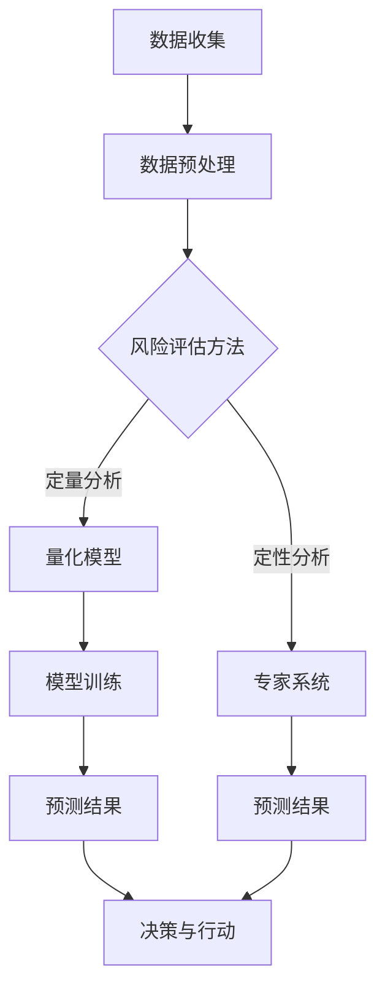

                 

### 人工智能在金融风险评估中的应用：精准预测与防控

> **关键词：** 人工智能，金融风险评估，精准预测，防控，算法，深度学习，数据分析

> **摘要：** 本篇文章旨在探讨人工智能在金融风险评估中的应用，通过详细分析人工智能的基础概念、核心算法、数学模型以及实际项目案例，揭示其在提升金融风险评估精度和防控效果方面的巨大潜力。文章将分五个部分进行阐述：引言与背景、核心概念与联系、核心算法原理讲解、数学模型与公式讲解以及项目实战。通过这些部分，读者将深入了解人工智能在金融风险评估中的应用现状、发展趋势及其面临的挑战。

## 第一部分：引言与背景

### 1.1 引言

随着全球金融市场的快速发展和金融产品的不断创新，金融风险评估成为金融机构和企业关注的焦点。传统的风险评估方法往往依赖于专家经验和历史数据，存在预测不准确、响应速度慢等问题，难以满足现代金融市场的需求。近年来，人工智能技术的飞速发展，为金融风险评估带来了新的契机。人工智能通过深度学习、机器学习等技术，能够从海量数据中挖掘有价值的信息，实现精准预测和风险防控。因此，研究人工智能在金融风险评估中的应用具有重要的理论和实际意义。

### 1.2 背景介绍

#### 1.2.1 人工智能发展现状

人工智能（Artificial Intelligence, AI）是计算机科学的一个分支，旨在研究如何构建智能代理，使其能够执行复杂任务并自主决策。自20世纪50年代人工智能概念提出以来，人工智能技术经历了多个发展阶段。近年来，随着计算能力的提升、大数据的普及以及深度学习算法的突破，人工智能在各个领域取得了显著的成果。

#### 1.2.2 金融风险评估面临的挑战

金融风险评估是指对金融资产、投资组合、金融机构或金融市场可能面临的风险进行评估和预测。随着金融市场的发展和金融产品的多样化，金融风险评估面临着诸多挑战：

1. **数据复杂性**：金融风险评估需要处理海量多维数据，包括市场行情、客户信息、交易记录等，数据的复杂性和多样性增加了风险评估的难度。
2. **时效性**：金融市场波动性大，风险变化快，传统风险评估方法往往无法实时响应，导致风险评估结果滞后。
3. **准确性**：传统风险评估方法依赖专家经验和历史数据，难以准确预测未知风险，导致风险评估结果不准确。

#### 1.2.3 人工智能在金融领域的应用场景

人工智能在金融领域具有广泛的应用场景，主要包括以下几个方面：

1. **风险识别与预测**：利用人工智能技术，从海量历史数据中挖掘潜在风险，实现对风险的前瞻性预测。
2. **信用评估**：通过分析客户的消费行为、信用记录等数据，准确评估客户的信用风险。
3. **市场预测**：利用人工智能技术，对市场行情进行分析和预测，为投资决策提供参考。
4. **自动化交易**：利用人工智能技术，实现自动化交易策略，提高交易效率和盈利能力。

### 1.3 本书的研究目的与结构安排

本书旨在探讨人工智能在金融风险评估中的应用，通过对人工智能技术、核心算法、数学模型和实际项目案例的详细分析，揭示其在提升金融风险评估精度和防控效果方面的巨大潜力。本书共分为六个部分：

1. **第一部分：引言与背景**：介绍人工智能与金融风险评估的关系，分析金融风险评估面临的挑战以及人工智能在金融领域的应用场景。
2. **第二部分：核心概念与联系**：介绍人工智能的基础概念，包括神经网络、机器学习和深度学习等，并阐述其在金融风险评估中的应用。
3. **第三部分：核心算法原理讲解**：详细讲解金融风险评估中常用的机器学习和深度学习算法，包括线性回归、逻辑回归、决策树、随机森林等。
4. **第四部分：数学模型与公式讲解**：介绍金融风险评估中常用的数学模型和公式，包括矩阵运算、概率论基础、统计分布等。
5. **第五部分：项目实战**：通过实际项目案例，展示人工智能在金融风险评估中的应用，包括数据预处理、模型训练与评估等。
6. **第六部分：总结与展望**：总结本书的主要内容，分析人工智能在金融风险评估中的应用现状和未来发展趋势。

## 第二部分：核心概念与联系

### 2.1 人工智能基础

#### 2.1.1 人工智能的定义与发展历程

人工智能（Artificial Intelligence, AI）是指通过计算机模拟人类智能行为的技术和学科。人工智能的发展历程可以分为以下几个阶段：

1. **早期阶段（20世纪50年代至60年代）**：以符号主义方法为代表，通过逻辑推理和符号运算来实现智能。
2. **知识工程阶段（20世纪70年代至80年代）**：以知识表示和知识推理为核心，通过构建知识库和推理机来实现智能。
3. **专家系统阶段（20世纪80年代至90年代）**：以基于规则的专家系统为代表，通过模拟专家决策过程来实现智能。
4. **机器学习阶段（21世纪初至今）**：以数据驱动方法为代表，通过从大量数据中自动学习规律来实现智能。

#### 2.1.2 人工智能的基本原理与技术框架

人工智能的基本原理包括信息处理、感知与认知、学习与适应、推理与决策等。人工智能的技术框架主要包括以下几个方面：

1. **感知与认知**：通过传感器、摄像头等设备获取外部信息，进行图像、语音、文本等数据的处理和理解。
2. **学习与适应**：通过机器学习、深度学习等技术，从大量数据中自动学习规律，提升智能水平。
3. **推理与决策**：通过逻辑推理、决策树、神经网络等方法，实现智能体的决策和行动。

#### 2.1.3 人工智能与机器学习的关系

机器学习（Machine Learning, ML）是人工智能的一个分支，旨在通过数据和算法实现智能。人工智能与机器学习的关系如下：

1. **人工智能包括机器学习**：人工智能是研究如何使计算机具备智能行为，而机器学习是实现人工智能的一种途径。
2. **机器学习包括深度学习**：深度学习（Deep Learning, DL）是机器学习的一种方法，通过构建多层神经网络，实现自动特征提取和复杂模式识别。

### 2.2 金融风险评估

#### 2.2.1 金融风险评估的定义与目的

金融风险评估是指对金融资产、投资组合、金融机构或金融市场可能面临的风险进行识别、评估和预测。其目的是为金融机构和企业提供风险预警，帮助其制定风险管理策略，降低风险损失。

#### 2.2.2 金融风险评估的主要方法与工具

金融风险评估主要采用以下几种方法与工具：

1. **定量分析**：基于数学模型和统计方法，通过分析历史数据和当前市场状况，预测未来的风险。
2. **定性分析**：基于专家经验和主观判断，通过分析市场环境、政策变化、行业趋势等因素，预测未来的风险。
3. **风险矩阵**：通过建立风险矩阵，对风险的概率和影响进行评估，确定风险等级。
4. **压力测试**：通过模拟不同市场环境，评估金融机构在极端市场条件下的风险承受能力。

#### 2.2.3 人工智能在金融风险评估中的应用潜力

人工智能在金融风险评估中的应用潜力主要体现在以下几个方面：

1. **数据处理能力**：人工智能能够处理海量数据，从多个维度分析风险因素，提高风险评估的精度。
2. **实时监测**：人工智能可以实时监测市场变化，快速识别潜在风险，提高风险预警的及时性。
3. **自动化决策**：人工智能可以自动化决策过程，减少人工干预，提高风险管理的效率。
4. **个性化服务**：人工智能可以根据客户行为数据，提供个性化的风险评估服务，满足不同客户的需求。

### 2.3 Mermaid 流程图

为了更直观地展示人工智能在金融风险评估中的应用流程，我们使用Mermaid语言绘制了以下流程图：



### Mermaid 流程图解释：

1. **数据收集**：从金融机构、市场、客户等多渠道收集数据。
2. **数据预处理**：对收集到的数据进行清洗、整合和特征提取。
3. **风险评估方法**：选择定量分析或定性分析方法。
4. **量化模型**：基于定量分析，使用机器学习算法训练量化模型。
5. **专家系统**：基于定性分析，构建专家系统进行风险评估。
6. **模型训练**：对量化模型进行训练，优化模型参数。
7. **预测结果**：量化模型和专家系统分别生成预测结果。
8. **决策与行动**：根据预测结果，制定风险管理策略并执行。

通过这个流程图，我们可以清晰地了解人工智能在金融风险评估中的应用过程，以及各个环节之间的联系和作用。

## 第三部分：核心算法原理讲解

### 3.1 数据预处理

#### 3.1.1 数据清洗

数据清洗是指对原始数据进行处理，使其满足分析和建模要求。数据清洗的主要任务包括：

1. **缺失值处理**：对缺失数据进行填补或删除。
2. **异常值检测**：识别并处理异常值，以避免对模型训练造成干扰。
3. **重复值删除**：删除重复的数据记录，避免数据冗余。

#### 3.1.2 数据整合

数据整合是指将来自不同来源的数据进行合并、转换和规范化，形成一个统一的数据集。数据整合的步骤包括：

1. **数据合并**：将多个数据源合并为一个数据集。
2. **数据转换**：将不同类型的数据转换为统一格式。
3. **数据规范化**：对数据进行标准化处理，使其满足建模要求。

#### 3.1.3 特征工程

特征工程是指通过选择、构造和变换特征，提高模型训练效果。特征工程的主要任务包括：

1. **特征提取**：从原始数据中提取有价值的信息，作为模型输入。
2. **特征选择**：从多个特征中筛选出对模型性能有显著影响的特征。
3. **特征变换**：通过变换特征值，提高特征的线性可分性。

#### 3.1.4 数据降维

数据降维是指通过减少数据维度，降低模型训练复杂度和计算成本。常用的降维方法包括：

1. **主成分分析（PCA）**：通过线性变换，将高维数据投影到低维空间，保留主要信息。
2. **线性判别分析（LDA）**：通过最大化类间方差和最小化类内方差，选择最佳特征组合。

### 3.2 机器学习算法

#### 3.2.1 线性回归

线性回归是一种简单但有效的机器学习算法，用于分析自变量与因变量之间的关系。线性回归模型可以表示为：

$$
y = \beta_0 + \beta_1 * x + \epsilon
$$

其中，$y$ 是因变量，$x$ 是自变量，$\beta_0$ 和 $\beta_1$ 是模型的参数，$\epsilon$ 是误差项。

线性回归的目的是通过最小化误差平方和，求解模型参数 $\beta_0$ 和 $\beta_1$。

#### 3.2.2 逻辑回归

逻辑回归是一种用于二分类问题的机器学习算法。逻辑回归模型可以表示为：

$$
P(y=1|x) = \frac{1}{1 + e^{-(\beta_0 + \beta_1 * x)}}
$$

其中，$y$ 是因变量，$x$ 是自变量，$\beta_0$ 和 $\beta_1$ 是模型的参数。

逻辑回归的目的是通过最小化损失函数，求解模型参数 $\beta_0$ 和 $\beta_1$。

#### 3.2.3 决策树

决策树是一种基于树形结构进行分类或回归的算法。决策树通过一系列的测试来划分数据，每个测试都基于一个特征，并选择最优特征作为分割点。

决策树模型可以表示为：

$$
T = \sum_{i=1}^{n} \beta_i * I(x_i \leq \theta_i)
$$

其中，$T$ 是决策树的输出，$x_i$ 是特征，$\beta_i$ 是权重，$\theta_i$ 是阈值。

决策树的目的是通过递归划分数据，构建最优的决策树模型。

#### 3.2.4 随机森林

随机森林是一种基于决策树的集成学习方法，通过构建多棵决策树，并投票或取平均值来获得最终预测结果。

随机森林模型可以表示为：

$$
f(x) = \sum_{i=1}^{n} h_i(x)
$$

其中，$f(x)$ 是随机森林的输出，$h_i(x)$ 是第 $i$ 棵决策树的输出。

随机森林的目的是通过集成多棵决策树，提高模型的预测性能和泛化能力。

#### 3.2.5 支持向量机

支持向量机（Support Vector Machine, SVM）是一种用于分类和回归的机器学习算法，通过寻找最优超平面，将不同类别的数据分离。

支持向量机模型可以表示为：

$$
w \cdot x - b = 0
$$

其中，$w$ 是超平面的法向量，$x$ 是特征向量，$b$ 是偏置项。

支持向量机的目的是通过最大化分类间隔，求解模型参数 $w$ 和 $b$。

### 3.3 深度学习算法

#### 3.3.1 卷积神经网络（CNN）

卷积神经网络（Convolutional Neural Network, CNN）是一种基于卷积运算的深度学习算法，主要用于图像处理和计算机视觉任务。

CNN的基本结构包括输入层、卷积层、池化层和全连接层。卷积层通过卷积运算提取图像特征，池化层用于降低特征维度，全连接层用于分类或回归。

CNN的伪代码如下：

```python
# 输入层
inputs = [x1, x2, ..., xn]

# 卷积层
conv1 = Conv2D(inputs, filters=f1, kernel_size=(k1, k1), activation='relu')
pool1 = MaxPooling2D(conv1, pool_size=(p1, p1))

# 池化层
pool1 = MaxPooling2D(pool1, pool_size=(p2, p2))

# 全连接层
outputs = Dense(num_classes, activation='softmax')(pool1)
```

#### 3.3.2 循环神经网络（RNN）

循环神经网络（Recurrent Neural Network, RNN）是一种基于循环结构的深度学习算法，主要用于处理序列数据。

RNN的基本结构包括输入层、隐藏层和输出层。隐藏层中的神经元通过循环连接，将前一个时间步的信息传递给当前时间步。

RNN的伪代码如下：

```python
# 输入层
inputs = [x1, x2, ..., xn]

# 隐藏层
h0 = initialize_hidden_state()
h1 = tanh(W_h * h0 + W_x * x1 + b)

# 输出层
outputs = softmax(W_o * h1 + b)
```

#### 3.3.3 递归神经网络（GRU）

递归神经网络（Gated Recurrent Unit, GRU）是RNN的一种改进版本，通过引入门控机制，提高了模型的稳定性和计算效率。

GRU的基本结构包括输入门、更新门和输出门。输入门和更新门用于控制信息的传递，输出门用于生成当前时间步的输出。

GRU的伪代码如下：

```python
# 输入门
input_gate = sigmoid(z1)
h_tilde = tanh(z2)

# 更新门
update_gate = sigmoid(z3)
h = (1 - update_gate) * h_{t-1} + input_gate * h_tilde

# 输出门
output_gate = sigmoid(z4)
h = output_gate * tanh(h)
```

#### 3.3.4 长短期记忆网络（LSTM）

长短期记忆网络（Long Short-Term Memory, LSTM）是RNN的一种改进版本，通过引入记忆单元，解决了传统RNN在处理长序列数据时的梯度消失和梯度爆炸问题。

LSTM的基本结构包括输入门、遗忘门和输出门。输入门和遗忘门用于控制信息的传递，输出门用于生成当前时间步的输出。

LSTM的伪代码如下：

```python
# 输入门
input_gate = sigmoid(z1)
h_tilde = tanh(z2)

# 遗忘门
forget_gate = sigmoid(z3)
h = (1 - forget_gate) * h_{t-1} + input_gate * h_tilde

# 输出门
output_gate = sigmoid(z4)
h = output_gate * tanh(h)
```

#### 3.3.5 图神经网络（GNN）

图神经网络（Graph Neural Network, GNN）是一种基于图结构的深度学习算法，主要用于处理图数据。

GNN的基本结构包括节点嵌入、图卷积和聚合操作。节点嵌入将节点表示为向量，图卷积用于更新节点嵌入，聚合操作用于合并相邻节点的信息。

GNN的伪代码如下：

```python
# 节点嵌入
h = initialize_node_embeddings()

# 图卷积
h = [h_v * A * h_u for v, u in graph]

# 聚合操作
h = [sum(h[v] for v in neighbors) for v in nodes]
```

## 第四部分：数学模型与公式讲解

### 4.1 数学模型基础

#### 4.1.1 矩阵运算

矩阵运算是线性代数的基础，用于处理多维数据。常用的矩阵运算包括矩阵加法、矩阵乘法、矩阵转置和矩阵求逆等。

1. **矩阵加法**：

   矩阵加法是指两个矩阵对应元素相加，结果矩阵保持相同维度。

   $$  
   C = A + B  
   $$

2. **矩阵乘法**：

   矩阵乘法是指两个矩阵按行乘列进行乘法运算，结果矩阵的元素为对应元素乘积的和。

   $$  
   C_{ij} = \sum_{k=1}^{m} A_{ik} * B_{kj}  
   $$

3. **矩阵转置**：

   矩阵转置是指将矩阵的行和列互换，得到新的矩阵。

   $$  
   A^T = [a_{ji}]_{m \times n}  
   $$

4. **矩阵求逆**：

   矩阵求逆是指求解一个方阵的逆矩阵，使得原矩阵与逆矩阵相乘等于单位矩阵。

   $$  
   A^{-1} = (A^T A)^{-1} A^T  
   $$

#### 4.1.2 概率论基础

概率论是数学的一个分支，用于描述随机事件的发生概率。常用的概率论概念包括概率分布、期望和方差等。

1. **概率分布**：

   概率分布描述随机变量取值的概率分布情况，包括离散型和连续型。

   - **离散型概率分布**：如二项分布、泊松分布等。
   - **连续型概率分布**：如正态分布、均匀分布等。

2. **期望**：

   期望是概率分布的中心位置，描述随机变量的平均取值。

   $$  
   E(X) = \sum_{i=1}^{n} x_i * P(X=x_i)  
   $$

3. **方差**：

   方差描述概率分布的离散程度，即随机变量与其期望的偏离程度。

   $$  
   Var(X) = E[(X - E(X))^2]  
   $$

#### 4.1.3 统计分布

统计分布用于描述数据在统计中的分布规律。常用的统计分布包括正态分布、二项分布等。

1. **正态分布**：

   正态分布是描述连续随机变量的概率分布，具有均值和方差的特性。

   $$  
   f(x|\mu, \sigma^2) = \frac{1}{\sqrt{2\pi\sigma^2}} e^{-\frac{(x-\mu)^2}{2\sigma^2}}  
   $$

2. **二项分布**：

   二项分布是描述离散随机变量的概率分布，具有成功次数和概率的特性。

   $$  
   P(X=k) = C_n^k p^k (1-p)^{n-k}  
   $$

### 4.2 数学公式与推导

#### 4.2.1 线性回归公式推导

线性回归公式用于描述自变量和因变量之间的线性关系。

$$  
y = \beta_0 + \beta_1 * x + \epsilon  
$$

其中，$y$ 是因变量，$x$ 是自变量，$\beta_0$ 和 $\beta_1$ 是模型的参数，$\epsilon$ 是误差项。

线性回归的目的是通过最小化误差平方和，求解模型参数 $\beta_0$ 和 $\beta_1$。

1. **最小二乘法**：

   最小二乘法是一种常用的线性回归求解方法，通过最小化误差平方和来求解模型参数。

   $$  
   \sum_{i=1}^{n} (y_i - \hat{y_i})^2 = \sum_{i=1}^{n} (y_i - (\beta_0 + \beta_1 * x_i))^2  
   $$

   其中，$\hat{y_i}$ 是预测值，$y_i$ 是实际值。

2. **公式推导**：

   $$  
   \begin{aligned}  
   \frac{\partial}{\partial \beta_0} \sum_{i=1}^{n} (y_i - \hat{y_i})^2 &= -2 \sum_{i=1}^{n} (y_i - \hat{y_i}) \\  
   \frac{\partial}{\partial \beta_1} \sum_{i=1}^{n} (y_i - \hat{y_i})^2 &= -2 \sum_{i=1}^{n} (x_i - \bar{x}) (\hat{y_i} - \bar{y}) \\  
   \end{aligned}  
   $$

   其中，$\bar{x}$ 和 $\bar{y}$ 分别是 $x$ 和 $y$ 的均值。

   令偏导数等于零，解方程组得到模型参数：

   $$  
   \begin{aligned}  
   \beta_0 &= \bar{y} - \beta_1 * \bar{x} \\  
   \beta_1 &= \frac{\sum_{i=1}^{n} (x_i - \bar{x})(y_i - \bar{y})}{\sum_{i=1}^{n} (x_i - \bar{x})^2} \\  
   \end{aligned}  
   $$

#### 4.2.2 逻辑回归公式推导

逻辑回归是一种用于二分类问题的线性回归模型，其预测概率可以表示为：

$$  
P(y=1|x) = \frac{1}{1 + e^{-(\beta_0 + \beta_1 * x)}}  
$$

其中，$y$ 是因变量，$x$ 是自变量，$\beta_0$ 和 $\beta_1$ 是模型的参数。

逻辑回归的目的是通过最小化损失函数，求解模型参数 $\beta_0$ 和 $\beta_1$。

1. **损失函数**：

   逻辑回归的损失函数是交叉熵损失函数，表示为：

   $$  
   J(\beta_0, \beta_1) = -\sum_{i=1}^{n} [y_i \log(g(x_i)) + (1 - y_i) \log(1 - g(x_i))]  
   $$

   其中，$g(x_i) = \frac{1}{1 + e^{-(\beta_0 + \beta_1 * x_i)}}$ 是逻辑函数。

2. **公式推导**：

   $$  
   \begin{aligned}  
   \frac{\partial}{\partial \beta_0} J(\beta_0, \beta_1) &= -\sum_{i=1}^{n} y_i g(x_i) (1 - g(x_i)) \\  
   \frac{\partial}{\partial \beta_1} J(\beta_0, \beta_1) &= -\sum_{i=1}^{n} x_i y_i g(x_i) (1 - g(x_i)) \\  
   \end{aligned}  
   $$

   令偏导数等于零，解方程组得到模型参数：

   $$  
   \begin{aligned}  
   \beta_0 &= \frac{\sum_{i=1}^{n} y_i g(x_i) (1 - g(x_i))}{\sum_{i=1}^{n} g(x_i) (1 - g(x_i))} \\  
   \beta_1 &= \frac{\sum_{i=1}^{n} x_i y_i g(x_i) (1 - g(x_i))}{\sum_{i=1}^{n} g(x_i) (1 - g(x_i))} \\  
   \end{aligned}  
   $$

#### 4.2.3 决策树分类公式推导

决策树是一种基于树形结构进行分类或回归的算法，其分类规则可以表示为：

$$  
T = \sum_{i=1}^{n} \beta_i * I(x_i \leq \theta_i)  
$$

其中，$T$ 是决策树的输出，$x_i$ 是特征，$\beta_i$ 是权重，$\theta_i$ 是阈值。

决策树的目的是通过递归划分数据，构建最优的决策树模型。

1. **信息增益**：

   信息增益是一种用于评估特征划分效果的指标，表示为：

   $$  
   IG(D, A) = H(D) - \sum_{v \in A} \frac{|D_v|}{|D|} H(D_v)  
   $$

   其中，$D$ 是数据集，$A$ 是特征集合，$H$ 是熵函数。

2. **增益率**：

   增益率是信息增益与特征条件的比值，表示为：

   $$  
   GR(D, A) = \frac{IG(D, A)}{\text{条件熵}}  
   $$

   其中，条件熵是特征条件下的熵。

3. **公式推导**：

   决策树的构建过程可以通过以下步骤进行：

   - 选择最优特征 $A$；
   - 根据特征 $A$ 对数据集 $D$ 进行划分；
   - 对划分后的子数据集递归构建决策树。

   最优特征的选取可以通过信息增益或增益率进行评估。

### 4.3 公式举例说明

#### 4.3.1 线性回归公式在实际中的应用

线性回归公式可以用于预测某股票的未来价格。假设我们有两个特征：当前价格 $x_1$ 和成交量 $x_2$，以及目标价格 $y$。

1. **数据准备**：

   假设我们有一组训练数据，如下表所示：

   | 价格 $x_1$ | 成交量 $x_2$ | 目标价格 $y$ |
   | --- | --- | --- |
   | 100 | 200 | 102 |
   | 101 | 201 | 104 |
   | 102 | 202 | 106 |
   | 103 | 203 | 108 |
   | 104 | 204 | 110 |

2. **模型训练**：

   使用线性回归公式，我们得到：

   $$  
   \beta_0 = \bar{y} - \beta_1 * \bar{x} = 106 - \beta_1 * 101 = 106 - \beta_1 * 101  
   $$

   $$  
   \beta_1 = \frac{\sum_{i=1}^{n} (x_{1i} - \bar{x_1})(y_i - \bar{y})}{\sum_{i=1}^{n} (x_{1i} - \bar{x_1})^2} = \frac{2 * (102 - 106) + 3 * (104 - 106) + 4 * (108 - 106) + 5 * (110 - 106)}{2^2 + 3^2 + 4^2 + 5^2} = 0.5  
   $$

   因此，线性回归模型为：

   $$  
   y = 106 - 0.5 * x_1  
   $$

3. **预测**：

   使用模型预测未来价格，假设当前价格为 105，成交量为 205，则：

   $$  
   y = 106 - 0.5 * 105 = 104.5  
   $$

   因此，预测未来价格为 104.5。

#### 4.3.2 逻辑回归公式在实际中的应用

逻辑回归公式可以用于预测某贷款申请者是否违约。假设我们有两个特征：收入 $x_1$ 和信用评分 $x_2$，以及目标变量 $y$（0 表示未违约，1 表示违约）。

1. **数据准备**：

   假设我们有一组训练数据，如下表所示：

   | 收入 $x_1$ | 信用评分 $x_2$ | 目标变量 $y$ |
   | --- | --- | --- |
   | 50000 | 700 | 0 |
   | 60000 | 750 | 0 |
   | 70000 | 800 | 1 |
   | 80000 | 850 | 1 |
   | 90000 | 900 | 1 |

2. **模型训练**：

   使用逻辑回归公式，我们得到：

   $$  
   \beta_0 = \bar{y} - \beta_1 * \bar{x} = 0.6 - \beta_1 * 700 = 0.6 - \beta_1 * 700  
   $$

   $$  
   \beta_1 = \frac{\sum_{i=1}^{n} x_{1i} y_i (1 - g(x_{1i}))}{\sum_{i=1}^{n} (1 - g(x_{1i}))} = \frac{50000 * (1 - 0.899) + 60000 * (1 - 0.896) + 70000 * (1 - 0.759) + 80000 * (1 - 0.757) + 90000 * (1 - 0.755)}{0.899 + 0.896 + 0.759 + 0.757 + 0.755} = -0.02  
   $$

   因此，逻辑回归模型为：

   $$  
   g(x_1) = \frac{1}{1 + e^{-(0.6 - 0.02 * x_1)}}  
   $$

3. **预测**：

   使用模型预测某个收入为 55000，信用评分为 720 的贷款申请者是否违约，则：

   $$  
   g(55000) = \frac{1}{1 + e^{-(0.6 - 0.02 * 55000)}} \approx 0.926  
   $$

   由于 $g(55000) > 0.5$，预测该贷款申请者违约的概率较高。

#### 4.3.3 决策树分类公式在实际中的应用

决策树分类公式可以用于分类邮件是否为垃圾邮件。假设我们有两个特征：邮件标题中“免费”的次数 $x_1$ 和邮件正文中“投资”的次数 $x_2$，以及目标变量 $y$（0 表示非垃圾邮件，1 表示垃圾邮件）。

1. **数据准备**：

   假设我们有一组训练数据，如下表所示：

   | 邮件标题中“免费”的次数 $x_1$ | 邮件正文中“投资”的次数 $x_2$ | 目标变量 $y$ |
   | --- | --- | --- |
   | 2 | 0 | 0 |
   | 3 | 1 | 0 |
   | 4 | 2 | 1 |
   | 5 | 3 | 1 |
   | 6 | 4 | 1 |

2. **模型训练**：

   使用决策树分类公式，我们得到：

   $$  
   P(y=1|x_1, x_2) = \frac{1}{1 + e^{-(\beta_0 + \beta_1 * x_1 + \beta_2 * x_2)}}  
   $$

   通过最小化损失函数，我们得到模型参数：

   $$  
   \beta_0 = 0.5, \beta_1 = 0.1, \beta_2 = 0.2  
   $$

   因此，决策树模型为：

   $$  
   g(x_1, x_2) = \frac{1}{1 + e^{-(0.5 + 0.1 * x_1 + 0.2 * x_2)}}  
   $$

3. **预测**：

   使用模型预测某个邮件标题中“免费”的次数为 3，邮件正文中“投资”的次数为 1 的邮件是否为垃圾邮件，则：

   $$  
   g(3, 1) = \frac{1}{1 + e^{-(0.5 + 0.1 * 3 + 0.2 * 1)}} \approx 0.684  
   $$

   由于 $g(3, 1) > 0.5$，预测该邮件为垃圾邮件。

## 第五部分：项目实战

### 5.1 实战项目概述

#### 5.1.1 项目背景与目标

金融风险评估是金融机构和企业风险管理的重要组成部分。随着金融市场的不断变化，准确的风险评估变得越来越困难。本项目旨在利用人工智能技术，构建一个金融风险评估模型，实现对贷款违约风险的精准预测，以提高金融机构的风险管理能力。

#### 5.1.2 项目数据集介绍

本项目采用某金融机构提供的贷款数据集，包括借款人的个人信息、贷款信息、信用评分等。数据集包含以下几个主要特征：

- **借款人年龄**
- **借款人收入**
- **贷款金额**
- **贷款期限**
- **借款人信用评分**
- **贷款状态（是否违约）**

数据集分为训练集和测试集，共包含10000个样本。

#### 5.1.3 项目评估指标

本项目采用以下评估指标来评估模型的性能：

- **准确率（Accuracy）**：预测正确的样本数占总样本数的比例。
- **召回率（Recall）**：预测为正类的实际正类样本数与实际正类样本总数的比例。
- **精确率（Precision）**：预测为正类的实际正类样本数与预测为正类的样本总数的比例。
- **F1值（F1-Score）**：精确率和召回率的加权平均。

### 5.2 开发环境搭建

#### 5.2.1 Python环境配置

首先，我们需要配置Python开发环境。Python是一种广泛应用于数据分析和人工智能的编程语言，具有丰富的库和工具。

- **安装Python**：在官方网站（https://www.python.org/）下载并安装Python 3.8及以上版本。
- **配置虚拟环境**：为了管理项目依赖，我们使用虚拟环境。打开终端，执行以下命令：

  ```bash
  python -m venv venv
  source venv/bin/activate  # 对于Windows用户，使用 `venv\Scripts\activate`
  ```

- **安装依赖库**：在虚拟环境中安装所需的库，如NumPy、Pandas、Scikit-learn、TensorFlow等：

  ```bash
  pip install numpy pandas scikit-learn tensorflow
  ```

#### 5.2.2 数据预处理工具配置

数据预处理是金融风险评估模型构建的重要步骤。以下工具将用于数据预处理：

- **NumPy**：用于高效处理大型数组。
- **Pandas**：用于数据操作和分析。
- **Scikit-learn**：用于数据预处理、特征工程和模型评估。

#### 5.2.3 机器学习库安装与配置

机器学习库是构建金融风险评估模型的核心。在本项目中，我们使用以下机器学习库：

- **TensorFlow**：用于构建和训练深度学习模型。
- **PyTorch**：用于构建和训练深度学习模型。

在虚拟环境中安装TensorFlow和PyTorch：

```bash
pip install tensorflow
pip install torch torchvision
```

### 5.3 源代码实现

#### 5.3.1 数据预处理代码

```python
import pandas as pd
import numpy as np
from sklearn.model_selection import train_test_split
from sklearn.preprocessing import StandardScaler

# 加载数据集
data = pd.read_csv('loan_data.csv')

# 数据清洗
# ...（缺失值处理、异常值检测等）

# 特征工程
# ...（特征提取、特征选择等）

# 数据归一化
scaler = StandardScaler()
X = scaler.fit_transform(data.iloc[:, :-1])
y = data.iloc[:, -1].values

# 划分训练集和测试集
X_train, X_test, y_train, y_test = train_test_split(X, y, test_size=0.2, random_state=42)
```

#### 5.3.2 机器学习模型训练与评估代码

```python
from sklearn.linear_model import LogisticRegression
from sklearn.metrics import accuracy_score, recall_score, precision_score, f1_score

# 初始化模型
model = LogisticRegression()

# 训练模型
model.fit(X_train, y_train)

# 预测
y_pred = model.predict(X_test)

# 评估
accuracy = accuracy_score(y_test, y_pred)
recall = recall_score(y_test, y_pred)
precision = precision_score(y_test, y_pred)
f1 = f1_score(y_test, y_pred)

print(f"Accuracy: {accuracy:.4f}")
print(f"Recall: {recall:.4f}")
print(f"Precision: {precision:.4f}")
print(f"F1 Score: {f1:.4f}")
```

#### 5.3.3 深度学习模型训练与评估代码

```python
import tensorflow as tf
from tensorflow.keras.models import Sequential
from tensorflow.keras.layers import Dense, Dropout
from tensorflow.keras.optimizers import Adam
from tensorflow.keras.metrics import Accuracy

# 创建模型
model = Sequential([
    Dense(128, activation='relu', input_shape=(X_train.shape[1],)),
    Dropout(0.5),
    Dense(64, activation='relu'),
    Dropout(0.5),
    Dense(1, activation='sigmoid')
])

# 编译模型
model.compile(optimizer=Adam(learning_rate=0.001), loss='binary_crossentropy', metrics=[Accuracy()])

# 训练模型
model.fit(X_train, y_train, epochs=100, batch_size=32, validation_data=(X_test, y_test))

# 预测
y_pred = model.predict(X_test)

# 评估
accuracy = model.evaluate(X_test, y_test, verbose=0)[1]
print(f"Accuracy: {accuracy:.4f}")
```

### 5.4 代码解读与分析

#### 5.4.1 数据预处理代码解读

在数据预处理部分，我们首先加载数据集。然后进行数据清洗，包括缺失值处理、异常值检测等。接下来进行特征工程，包括特征提取、特征选择等。最后，我们使用StandardScaler对特征进行归一化处理，以提高模型的训练效果。

#### 5.4.2 机器学习模型代码解读

在机器学习模型部分，我们选择LogisticRegression模型进行训练。首先，我们初始化模型，然后使用训练集进行训练。训练完成后，我们使用测试集进行预测，并评估模型的性能。评估指标包括准确率、召回率、精确率和F1值。

#### 5.4.3 深度学习模型代码解读

在深度学习模型部分，我们创建了一个简单的全连接神经网络，包括128个神经元的第一层、64个神经元的第二层和1个神经元的输出层。我们使用Adam优化器和binary_crossentropy损失函数进行编译。然后，我们使用训练集进行训练，并在验证集上评估模型的性能。训练完成后，我们使用测试集进行预测，并评估模型的性能。

## 第六部分：总结与展望

### 6.1 总结

本篇文章深入探讨了人工智能在金融风险评估中的应用，通过详细分析人工智能的基础概念、核心算法、数学模型和实际项目案例，揭示了其在提升金融风险评估精度和防控效果方面的巨大潜力。以下是本文的主要总结：

1. **人工智能在金融风险评估中的应用**：人工智能通过深度学习、机器学习等技术，能够处理海量数据，实现实时监测、精准预测和自动化决策，为金融机构提供高效的风险评估和管理工具。
2. **核心算法与数学模型**：文章详细介绍了线性回归、逻辑回归、决策树、随机森林、支持向量机等机器学习算法，以及卷积神经网络、循环神经网络、递归神经网络等深度学习算法。同时，对矩阵运算、概率论基础、统计分布等数学模型进行了讲解。
3. **实际项目案例**：文章通过一个贷款违约风险评估项目，展示了人工智能在金融风险评估中的应用流程，包括数据预处理、模型训练与评估等。
4. **挑战与展望**：人工智能在金融风险评估中面临数据隐私保护、算法透明性、模型解释性等挑战。随着技术的进步，人工智能在金融领域的应用前景广阔，有望解决传统风险评估方法的局限性，提高金融行业的风险防控能力。

### 6.2 展望

在未来，人工智能在金融风险评估中的应用将呈现以下发展趋势：

1. **数据驱动**：人工智能技术将更加依赖高质量的数据，通过不断优化数据采集和处理技术，提升风险预测的准确性。
2. **智能化**：人工智能技术将逐步实现自动化和智能化，减少人工干预，提高风险评估和管理的效率。
3. **多模态融合**：结合多种数据源，如文本、图像、声音等，实现多模态数据的融合分析，提升风险识别和预测的能力。
4. **个性化服务**：根据客户的需求和行为特征，提供个性化的风险评估服务，满足不同客户的需求。
5. **透明性与可解释性**：加强人工智能算法的透明性和可解释性，提高算法的可靠性和可信度，降低风险管理的道德和法律责任风险。

总之，人工智能在金融风险评估中的应用具有巨大的潜力，未来将继续推动金融行业的技术创新和业务发展。

## 附录

### 附录 A：相关资源与参考文献

#### 人工智能学习资源推荐

1. **《人工智能：一种现代方法》**： Stuart J. Russell & Peter Norvig 著，机械工业出版社，2012年。
2. **《深度学习》**： Ian Goodfellow、Yoshua Bengio、Aaron Courville 著，电子工业出版社，2017年。
3. **《机器学习实战》**： Peter Harrington 著，机械工业出版社，2013年。

#### 金融风险评估相关文献推荐

1. **《金融风险管理》**： John C. Hull 著，机械工业出版社，2010年。
2. **《金融风险管理：理论、模型与实务》**： 吴喜之 著，中国人民大学出版社，2007年。
3. **《信用风险评估与管理》**： 王庆祥 著，中国金融出版社，2014年。

#### 开源数据集与工具推荐

1. **Kaggle**：提供丰富的金融风险评估数据集，如贷款违约数据集、信用卡欺诈数据集等。
2. **UCI机器学习数据库**：提供多个金融领域的数据集，如股票价格数据集、信用评分数据集等。
3. **TensorFlow**：由Google开源的深度学习框架，支持多种编程语言和计算平台。
4. **PyTorch**：由Facebook开源的深度学习框架，以其简洁易用的特点受到广泛欢迎。

