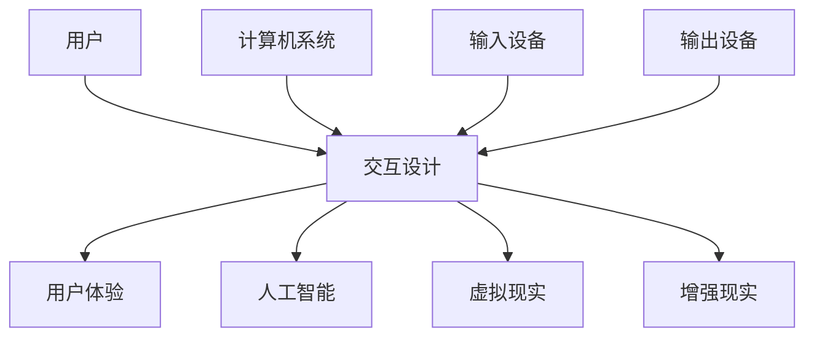

                 

### 《人机交互：未来趋势与展望》

> **关键词**：（1）人机交互；（2）智能交互；（3）自然交互；（4）虚拟现实；（5）增强现实；（6）人工智能

> **摘要**：
本文深入探讨了人机交互的未来趋势与发展方向。通过对核心概念、技术原理、应用场景和未来趋势的详细解析，展示了人机交互领域的前沿动态。文章首先介绍了人机交互的基本概念、理论和技术，接着分析了其在智能家居、医疗健康和教育等领域的应用。最后，展望了人机交互技术的发展趋势，探讨了新兴人机交互技术的潜在影响和挑战，提出了未来人机交互的发展方向。本文旨在为读者提供对人机交互领域的全面了解，激发对这一创新领域的兴趣和思考。

### 目录大纲

**第一部分：人机交互基础**

1. **第1章：人机交互的基本概念**
   - 1.1 人机交互的定义与发展历程
   - 1.2 人机交互系统的基本组成部分
   - 1.3 人机交互的关键技术

2. **第2章：人机交互理论**
   - 2.1 人类行为与认知理论
   - 2.2 人机交互界面设计原则
   - 2.3 用户体验与用户满意度评价

3. **第3章：常见人机交互技术**
   - 3.1 触摸交互技术
   - 3.2 声音交互技术
   - 3.3 眼动追踪技术
   - 3.4 虚拟现实与增强现实技术

**第二部分：人机交互应用与发展趋势**

4. **第4章：人机交互在智能家居中的应用**
   - 4.1 智能家居概述
   - 4.2 智能家居中的人机交互技术
   - 4.3 智能家居的挑战与展望

5. **第5章：人机交互在医疗健康中的应用**
   - 5.1 医疗健康人机交互概述
   - 5.2 医疗健康中的人机交互技术
   - 5.3 医疗健康的挑战与展望

6. **第6章：人机交互在教育中的应用**
   - 6.1 教育人机交互概述
   - 6.2 教育中的人机交互技术
   - 6.3 教育的挑战与展望

7. **第7章：人机交互的未来趋势与展望**
   - 7.1 人机交互的未来趋势
   - 7.2 新兴人机交互技术展望
   - 7.3 人机交互伦理与隐私保护

**附录**

- **附录A：人机交互实验与案例**
  - 附件1：触摸交互技术实验
  - 附件2：声音交互技术实验
  - 附件3：眼动追踪技术实验

### 人机交互基础

#### 第1章：人机交互的基本概念

##### 1.1 人机交互的定义与发展历程

**定义**：
人机交互（Human-Computer Interaction，简称HCI）是指人与计算机系统之间的交互过程，包括输入、输出和反馈等环节。它旨在研究如何设计出易用、高效和愉悦的计算机系统，使用户能够轻松地与计算机进行沟通和操作。

**发展历程**：
1. **早期阶段**（1940s-1960s）：
   - **计算器时代**：计算机主要作为计算工具，以命令行界面为主。
   - **图形用户界面（GUI）的诞生**：Xerox PARC的Alto计算机引入了图形用户界面，鼠标、窗口和图标等元素开始普及。

2. **中期阶段**（1970s-1990s）：
   - **个人电脑的普及**：IBM PC和苹果麦金塔计算机的推出，使得个人电脑开始进入家庭和办公室。
   - **交互技术的发展**：触摸屏、语音识别和手势识别等交互技术开始出现。

3. **当前阶段**（2000s至今）：
   - **移动互联网和智能手机**：智能手机的普及，使得人机交互从桌面扩展到移动设备。
   - **人工智能和物联网**：人工智能和物联网技术的融入，使得人机交互变得更加智能和自然。

##### 1.2 人机交互系统的基本组成部分

**用户**：
用户是计算机系统的操作者和使用者，其需求和行为直接影响人机交互的设计和效果。

**计算机系统**：
计算机系统提供交互环境和功能，包括硬件、软件和数据处理等。

**输入设备**：
输入设备用于用户向计算机系统输入信息，如键盘、鼠标、触摸屏、语音识别设备等。

**输出设备**：
输出设备用于计算机系统向用户输出信息，如显示器、音响、打印机等。

**交互界面**：
交互界面是用户与计算机系统交互的桥梁，包括图形用户界面（GUI）、命令行界面（CLI）等。

##### 1.3 人机交互的关键技术

**交互设计**：
交互设计是研究如何设计出易用、高效和愉悦的交互界面。其核心是了解用户需求和行为，结合美学和工程学原则，创造出符合用户期望的交互体验。

**用户体验**：
用户体验是用户在使用产品或服务过程中的整体感受。它包括易用性、响应速度、界面美观度、功能完整性等。良好的用户体验是提高用户满意度和忠诚度的重要因素。

**人工智能**：
人工智能（Artificial Intelligence，简称AI）是人机交互的重要支撑技术。通过机器学习、自然语言处理等技术，人工智能能够使计算机系统更好地理解用户需求，提供个性化的交互服务。

**虚拟现实与增强现实**：
虚拟现实（Virtual Reality，简称VR）和增强现实（Augmented Reality，简称AR）技术为用户提供了沉浸式和增强式的交互体验。通过虚拟现实头盔和增强现实眼镜，用户可以进入虚拟世界或增强现实环境，与计算机系统进行互动。

### Mermaid 流程图



##### 核心算法原理讲解

**交互设计算法**：
交互设计算法基于用户行为数据和用户调研，通过机器学习等方法，生成最优的交互界面设计。其核心包括：

- **用户行为分析**：收集并分析用户在交互过程中的行为数据，如点击次数、操作路径等。
- **交互模型构建**：根据用户行为数据，构建交互模型，预测用户的需求和行为。
- **交互界面优化**：根据交互模型，优化交互界面设计，提高用户体验。

**伪代码示例**：

```python
# 用户行为数据收集
user_behaviors = collect_user_behaviors()

# 构建交互模型
interaction_model = build_interaction_model(user_behaviors)

# 优化交互界面
optimized_interface = optimize_interface(interaction_model)
```

**用户体验评估算法**：
用户体验评估算法用于评估用户对交互界面的满意度和满意度。其核心包括：

- **用户满意度调查**：通过问卷调查、用户测试等方法，收集用户对交互界面的满意度评价。
- **用户满意度模型**：构建用户满意度模型，预测用户的满意度。
- **交互界面改进**：根据用户满意度模型，改进交互界面设计，提高用户体验。

**伪代码示例**：

```python
# 用户满意度调查
user_satisfaction = conduct_satisfaction_survey()

# 构建用户满意度模型
satisfaction_model = build_satisfaction_model(user_satisfaction)

# 优化交互界面
optimized_interface = optimize_interface(satisfaction_model)
```

**人工智能算法**：
人工智能算法用于实现计算机系统对用户需求的智能理解和响应。其核心包括：

- **自然语言处理**：通过机器学习模型，实现计算机对自然语言的理解和生成。
- **语音识别**：通过深度学习模型，实现语音信号转换为文本。
- **语音合成**：通过语音合成模型，实现文本转换为自然流畅的语音。

**伪代码示例**：

```python
# 自然语言处理
nlp_model = train_nlp_model()

# 语音识别
text = recognize_speech(nlp_model)

# 语音合成
synthesize_speech(text)
```

### 数学模型和数学公式

**用户满意度

