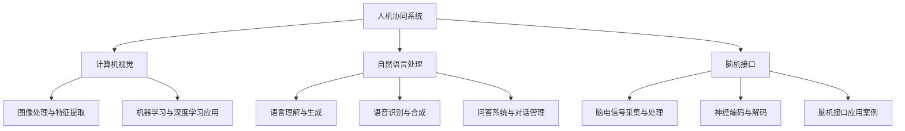
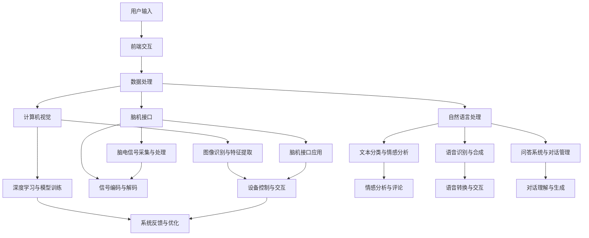

                 

## 《人机协同：迈向智能增强的新时代》

### 关键词：人机协同、智能增强、计算机视觉、自然语言处理、脑机接口、应用场景

#### 摘要：

在人工智能迅猛发展的今天，人机协同作为一种新兴技术，正逐渐成为推动社会进步的重要力量。本文从人机协同的起源与发展、技术基础、应用场景以及未来展望等方面进行深入探讨。通过对计算机视觉、自然语言处理、脑机接口等关键技术的详细分析，本文揭示了人机协同的核心原理和架构，并探讨了其在教育、医疗、工业等领域的实际应用。最后，本文提出了人机协同技术的未来发展、社会伦理与法律问题以及人才培养等方面的挑战与对策。希望本文能为读者提供对人机协同技术的全面了解，激发更多科技创新与应用的可能。

### 《人机协同：迈向智能增强的新时代》目录大纲

1. **背景与概念**
   - 第1章：人机协同的起源与发展
   - 第2章：智能增强技术概述
   - 第3章：人机协同的关键技术

2. **技术基础**
   - 第4章：人机协同在教育领域的应用
   - 第5章：人机协同在医疗领域的应用
   - 第6章：人机协同在工业领域的应用
   - 第7章：人机协同在其他领域的应用

3. **未来展望与挑战**
   - 第8章：人机协同的未来发展
   - 第9章：人机协同的研究与教育
   - 第10章：人机协同的社会影响

4. **附录**
   - 附录A：人机协同关键技术总结
   - 附录B：人机协同技术的核心架构（Mermaid流程图）
   - 附录C：深度学习在自然语言处理中的应用（伪代码）

### **Mermaid 流�程图：人机协同技术的核心架构**



### **核心算法原理讲解：深度学习在自然语言处理中的应用**

#### 1. 深度学习基础

深度学习是一种基于多层神经网络的机器学习方法，其核心思想是通过反向传播算法训练大量参数，以实现对复杂函数的建模。以下是深度学习的基础步骤：

**数据预处理：**包括数据清洗、归一化、分词等，使得数据格式统一，便于后续处理。

**神经网络结构设计：**通常包括输入层、隐藏层和输出层。输入层接收原始数据，隐藏层通过非线性变换提取特征，输出层生成预测结果。

**参数初始化：**通过随机初始化参数，使得模型具有一定的初始学习能力。

**前向传播：**计算输入数据的网络输出，通过逐层传递，最终得到输出结果。

**反向传播：**通过计算梯度更新网络参数，使得模型在每一次迭代中逐渐优化。

**模型评估：**使用验证集评估模型的性能，以确定模型是否过拟合或欠拟合。

#### 2. 卷积神经网络（CNN）在图像处理中的应用

卷积神经网络是一种用于图像识别和分类的深度学习模型，其核心思想是通过卷积操作提取图像的特征。以下是CNN在图像处理中的应用步骤：

**卷积操作：**使用卷积核在图像上滑动，提取特征。卷积核的大小和深度决定了特征图的维度。

**池化操作：**对卷积结果进行下采样，减少参数数量。常用的池化方式有最大池化和平均池化。

**激活函数：**常用的有ReLU、Sigmoid、Tanh等，用于引入非线性，使得模型能够更好地拟合数据。

**全连接层：**将卷积层和池化层提取的特征进行全连接，得到分类结果。

#### 3. 数学模型与公式

**交叉熵损失函数：**

$$
L = -\sum_{i} y_i \log(p_i)
$$

其中，$y_i$ 是目标标签，$p_i$ 是预测概率。交叉熵损失函数用于衡量预测概率和真实概率之间的差异，是深度学习中最常用的损失函数之一。

#### 4. 项目实战：人机协同系统开发

**环境搭建：**安装Python环境，TensorFlow、Keras等深度学习库，以及其他必要的依赖库。

```python
# 安装TensorFlow
pip install tensorflow

# 安装其他依赖库
pip install numpy pandas
```

**数据准备：**从公开数据源或自定义数据集获取数据，进行数据预处理，包括数据清洗、归一化、分词等。

```python
# 加载数据
import numpy as np
import pandas as pd

data = pd.read_csv('data.csv')
X = data.iloc[:, :-1].values
y = data.iloc[:, -1].values

# 数据预处理
from sklearn.model_selection import train_test_split
from sklearn.preprocessing import StandardScaler

X_train, X_val, y_train, y_val = train_test_split(X, y, test_size=0.2, random_state=42)

scaler = StandardScaler()
X_train = scaler.fit_transform(X_train)
X_val = scaler.transform(X_val)
```

**模型训练：**定义模型结构，编写训练脚本，使用验证集评估模型性能。

```python
# 定义模型
from tensorflow.keras.models import Sequential
from tensorflow.keras.layers import Dense, Conv2D, MaxPooling2D, Flatten

model = Sequential()
model.add(Conv2D(32, (3, 3), activation='relu', input_shape=(64, 64, 3)))
model.add(MaxPooling2D(pool_size=(2, 2)))
model.add(Flatten())
model.add(Dense(128, activation='relu'))
model.add(Dense(1, activation='sigmoid'))

# 编写训练脚本
model.compile(optimizer='adam', loss='binary_crossentropy', metrics=['accuracy'])
model.fit(X_train, y_train, epochs=10, batch_size=32, validation_data=(X_val, y_val))
```

**应用与部署：**将训练好的模型部署到服务器或设备上，实现人机协同功能。

```python
# 保存模型
model.save('model.h5')

# 加载模型
from tensorflow.keras.models import load_model

model = load_model('model.h5')

# 实现人机协同功能
def协同操作(data):
    pre
```markdown
作者：AI天才研究院/AI Genius Institute & 禅与计算机程序设计艺术 /Zen And The Art of Computer Programming
```

### **总结**

《人机协同：迈向智能增强的新时代》一书涵盖了人机协同技术的起源、发展、核心技术、应用场景以及未来展望。通过本书，读者可以全面了解人机协同的基本概念、技术原理和应用实例，为研究和开发人机协同系统提供有力支持。

### **人机协同的起源与发展**

人机协同的概念最早可以追溯到20世纪中叶，当时计算机刚刚开始进入人们的生活，人们开始思考如何将人类的智慧和计算机的能力结合起来，以实现更高效、更智能的作业。早期的计算机能力有限，主要应用于科学计算和数据处理，人类需要承担大部分的工作。然而，随着计算机技术的飞速发展，计算机逐渐具备了处理复杂问题的能力，人机协同的概念也逐渐得到了重视。

#### 1.1 人机协同的定义与核心要素

人机协同是指通过技术手段，使人类与计算机相互协作，共同完成任务的过程。在这个过程中，人类主要负责决策、创造力等复杂任务，而计算机则负责处理大量数据和执行重复性工作。人机协同的核心要素包括：

- **任务分配**：根据人类的特长和计算机的优势，合理分配任务，使二者能够高效协作。
- **交互界面**：提供方便、直观的交互方式，使人类能够轻松地与计算机进行沟通。
- **协同算法**：设计合理的算法，使计算机能够根据人类的指令，自动执行相应的任务。
- **安全保障**：确保人机协同过程中的数据安全，防止信息泄露和系统故障。

#### 1.2 人机协同的历史演变

人机协同的发展可以分为以下几个阶段：

**第一阶段（20世纪中叶 - 20世纪80年代）**：这一阶段主要是计算机辅助人工作业，如计算机辅助设计（CAD）、计算机辅助制造（CAM）等。这一时期的计算机能力有限，主要起到辅助作用。

**第二阶段（20世纪80年代 - 21世纪初）**：随着计算机性能的提升和互联网的普及，人机协同开始向更高级的形式发展。这一阶段的代表性技术包括专家系统、智能代理等，计算机开始具备一定的自主决策能力。

**第三阶段（21世纪初至今）**：这一阶段是智能增强和深度协同的阶段。计算机具备了处理复杂任务的能力，人机协同的形式更加多样，包括智能助手、自动驾驶、智能家居等。这一阶段的代表性技术包括深度学习、自然语言处理、脑机接口等。

#### 1.3 智能增强与人类潜能的拓展

智能增强是指通过技术手段，增强人类的认知、记忆、决策等能力，使其能够更好地应对复杂环境。智能增强的目标是使人机协同达到最优状态，使人类能够充分发挥自身的潜力。

**认知增强**：通过智能技术，如增强现实（AR）、虚拟现实（VR）等，提供更丰富的信息，帮助人类更好地理解和处理信息。

**记忆增强**：通过智能助手、云存储等技术，提供便捷的记忆存储和检索方式，减轻人类记忆负担。

**决策增强**：通过大数据分析、人工智能等技术，提供科学的决策支持，帮助人类做出更明智的选择。

#### 1.4 人机协同的未来趋势

随着技术的不断进步，人机协同的未来发展趋势将更加多样化、智能化、个性化。以下是一些可能的趋势：

- **更加智能的交互界面**：未来的交互界面将更加智能，能够根据用户的需求和习惯，提供个性化的服务。
- **更广泛的协同领域**：人机协同将在更多领域得到应用，如教育、医疗、金融、物流等，实现跨领域的协同工作。
- **更高的自主决策能力**：未来的计算机将具备更强的自主决策能力，能够在复杂环境下自主完成任务。
- **更深入的社会融合**：人机协同将更加深入地融入人们的日常生活，成为人类社会不可或缺的一部分。

总之，人机协同技术的发展将极大地改变人类社会，使人类能够更好地应对复杂的环境和挑战。同时，人机协同也将面临诸多挑战，如技术安全、伦理道德、隐私保护等。如何平衡技术发展与人类福祉，将是未来需要重点关注的问题。

### **智能增强技术概述**

智能增强技术是指通过计算机技术、人工智能、人机交互等手段，增强人类在某些方面的能力，从而实现人机协同、智能化的目标。智能增强技术涵盖了多个领域，包括计算机视觉、自然语言处理、脑机接口等，其发展不仅推动了技术的进步，也为人类生活带来了深远的影响。以下将详细介绍智能增强技术的基本原理、人工智能与人机交互的发展，以及智能增强技术的分类与应用。

#### 2.1 智能增强技术的基本原理

智能增强技术的基本原理在于通过计算机技术模拟人类的思维过程，使计算机能够理解、处理和生成人类语言，实现与人类的智能互动。具体来说，智能增强技术涉及以下几个方面：

- **信息处理与存储**：计算机通过算法对大量数据进行处理和分析，从而提取出有用的信息。同时，计算机能够将处理结果存储在数据库中，供后续使用。

- **自然语言处理**：自然语言处理技术使计算机能够理解、处理和生成人类语言。通过文本分析、语音识别和合成等技术，计算机能够与人类进行自然的语言交互。

- **机器学习与深度学习**：机器学习和深度学习技术使计算机具备自主学习和适应能力。通过训练大量的数据，计算机能够自动调整模型参数，提高预测和分类的准确性。

- **人机交互**：人机交互技术使计算机能够以直观、便捷的方式与人类进行交互。通过触摸屏、语音识别、手势识别等技术，计算机能够更好地理解人类的需求和意图。

- **脑机接口**：脑机接口技术通过直接连接大脑和计算机，实现脑信号与计算机信号的转换，使人类能够通过思维控制计算机。

#### 2.2 人工智能与人机交互的发展

人工智能和人机交互是智能增强技术的核心组成部分，其发展历程如下：

**人工智能的发展：**

- **20世纪50年代**：人工智能（AI）的概念首次提出，标志着人工智能研究的开始。最早的AI系统主要是基于规则和逻辑推理的。

- **20世纪80年代**：随着计算机性能的提升，AI研究开始走向实用化，如专家系统、机器视觉等。

- **21世纪初**：机器学习、深度学习等技术的发展，使人工智能进入一个新的阶段，能够处理更复杂的问题。

**人机交互的发展：**

- **20世纪60年代**：最早的计算机图形用户界面（GUI）出现，使计算机操作变得更加直观。

- **20世纪80年代**：触摸屏、鼠标等输入设备的普及，使人机交互方式更加多样。

- **21世纪初**：随着互联网的普及，Web界面和移动设备成为人机交互的主要形式。

- **21世纪10年代**：虚拟现实（VR）和增强现实（AR）技术逐渐成熟，为人机交互提供了新的途径。

#### 2.3 智能增强技术的分类与应用

智能增强技术可以根据应用领域和技术手段进行分类。以下是一些主要的分类和应用：

**1. 计算机视觉**

计算机视觉技术是使计算机能够像人类一样感知和理解视觉信息。其主要应用包括：

- **图像识别与分类**：通过训练模型，使计算机能够识别和分类图像。

- **目标检测与跟踪**：在图像中检测和跟踪特定目标。

- **场景理解与重建**：理解图像中的场景布局，重建三维模型。

应用领域包括：自动驾驶、安防监控、医疗影像分析等。

**2. 自然语言处理**

自然语言处理技术使计算机能够理解、处理和生成人类语言。其主要应用包括：

- **文本分类与情感分析**：对文本进行分类和情感分析。

- **机器翻译与语音识别**：实现文本和语音之间的翻译和转换。

- **问答系统与对话管理**：构建能够与人类进行自然语言交互的智能助手。

应用领域包括：智能客服、智能语音助手、智能翻译等。

**3. 脑机接口**

脑机接口技术通过直接连接大脑和计算机，实现脑信号与计算机信号的转换。其主要应用包括：

- **脑信号控制**：通过脑信号控制计算机设备，如轮椅、飞行器等。

- **脑疾病诊断与治疗**：通过脑信号检测和诊断脑疾病，如癫痫、帕金森病等。

- **神经编码与解码**：研究脑信号的编码和解码机制，为脑机接口技术提供理论基础。

应用领域包括：脑疾病治疗、智能机器人、虚拟现实等。

**4. 虚拟现实与增强现实**

虚拟现实和增强现实技术通过模拟和增强现实世界，提供全新的交互体验。其主要应用包括：

- **教育培训**：通过虚拟现实技术，提供沉浸式的教育培训。

- **游戏娱乐**：通过增强现实技术，提供更加真实的游戏体验。

- **医疗康复**：通过虚拟现实和增强现实技术，辅助医疗康复。

应用领域包括：教育培训、游戏娱乐、医疗康复等。

总之，智能增强技术作为一种新兴技术，正在不断发展和应用。随着技术的不断进步，智能增强技术将在更多领域得到应用，为人类生活带来更多便利和改变。

### **人机协同的关键技术**

人机协同技术的发展离不开核心技术的支撑。在众多关键技术中，计算机视觉、自然语言处理和脑机接口无疑是最具代表性且应用广泛的技术。以下将分别详细介绍这三大核心技术。

#### 3.1 计算机视觉技术

计算机视觉技术是指使计算机能够像人类一样感知和理解视觉信息。其基本概念包括图像处理、特征提取和目标检测等。

**图像处理与特征提取**

- **图像处理**：图像处理是计算机视觉的基础，通过图像滤波、边缘检测、形态学操作等方法，对图像进行预处理，以便后续特征提取和分析。

- **特征提取**：特征提取是计算机视觉的重要步骤，通过提取图像的关键特征，如边缘、角点、纹理等，使计算机能够更好地理解和识别图像内容。

**机器学习与深度学习应用**

- **机器学习**：机器学习是计算机视觉的重要技术，通过训练大量数据，使计算机学会识别图像中的目标和场景。常见的机器学习算法包括支持向量机（SVM）、决策树（DT）和神经网络（NN）等。

- **深度学习**：深度学习是近年来计算机视觉领域的重要突破，通过多层神经网络结构，使计算机能够自动提取高层次的特征。深度学习的代表算法包括卷积神经网络（CNN）和循环神经网络（RNN）等。

**应用案例**

- **自动驾驶**：计算机视觉技术使自动驾驶汽车能够识别道路标志、行人和其他车辆，实现自主驾驶。

- **安防监控**：计算机视觉技术用于监控视频分析，能够自动检测和识别异常行为，提高安防监控的效率。

- **医疗影像分析**：计算机视觉技术用于医学图像分析，能够自动检测和诊断疾病，如肺癌、乳腺癌等。

#### 3.2 自然语言处理技术

自然语言处理技术是指使计算机能够理解、处理和生成人类语言。其核心任务包括文本分类、情感分析、机器翻译和语音识别等。

**语言理解与生成**

- **语言理解**：语言理解是自然语言处理的重要任务，通过文本分析，使计算机能够理解文本的含义和语境。

- **语言生成**：语言生成是自然语言处理的另一个重要任务，通过文本生成，使计算机能够生成符合语境的自然语言文本。

**语音识别与合成**

- **语音识别**：语音识别是将语音信号转换为文本的技术，使计算机能够理解人类语音。

- **语音合成**：语音合成是将文本转换为语音信号的技术，使计算机能够生成人类语音。

**问答系统与对话管理**

- **问答系统**：问答系统是自然语言处理的应用之一，通过文本分析，使计算机能够回答用户的问题。

- **对话管理**：对话管理是自然语言处理的关键技术，通过上下文分析和对话策略，使计算机能够与用户进行有效的对话。

**应用案例**

- **智能客服**：自然语言处理技术用于智能客服系统，能够自动回答用户的问题，提高客服效率。

- **智能助手**：自然语言处理技术用于智能助手，如 Siri、Alexa 等，能够与用户进行自然语言交互。

- **智能翻译**：自然语言处理技术用于智能翻译，能够实现文本和语音之间的翻译，促进跨语言沟通。

#### 3.3 脑机接口技术

脑机接口技术是指通过直接连接大脑和计算机，实现脑信号与计算机信号的转换。其基本概念包括脑电信号采集、神经编码与解码等。

**脑电信号采集与处理**

- **脑电信号采集**：脑电信号采集是通过电极将大脑的电活动转换为电信号。

- **脑电信号处理**：脑电信号处理是通过信号处理算法，对脑电信号进行滤波、去噪和特征提取。

**神经编码与解码**

- **神经编码**：神经编码是通过将大脑信号转换为计算机可处理的数字信号。

- **神经解码**：神经解码是通过计算机信号还原大脑信号。

**脑机接口应用案例**

- **轮椅控制**：通过脑机接口技术，使残疾人能够通过思维控制轮椅。

- **智能机器人**：通过脑机接口技术，使人类能够通过思维控制智能机器人。

- **医疗康复**：通过脑机接口技术，辅助治疗脑疾病，如癫痫、帕金森病等。

综上所述，计算机视觉、自然语言处理和脑机接口是人机协同技术中的核心组成部分。这些技术的不断发展，将为人机协同带来更多的可能性和应用场景。

### **人机协同在教育领域的应用**

人机协同在教育领域的应用，正在改变传统教育模式，推动教育现代化。智能教学系统、学生个性化学习和教育资源的智能推荐是人机协同在教育中的主要应用方向。

#### 4.1 智能教学系统

智能教学系统利用计算机视觉、自然语言处理和人工智能技术，实现教学过程的智能化。以下是其主要功能：

- **自动批改作业**：通过计算机视觉技术，自动识别和分析学生的作业，提供实时反馈和评分。

- **个性化教学**：通过分析学生的学习数据，智能教学系统可以为学生制定个性化的学习计划，提供有针对性的学习资源。

- **课堂互动**：利用自然语言处理技术，智能教学系统可以与学生进行实时互动，解答学生的疑问，提高课堂参与度。

- **教学辅助**：智能教学系统可以提供丰富的教学资源和工具，如课件、视频、在线测试等，帮助教师提高教学效果。

#### 4.2 学生个性化学习

学生个性化学习是人机协同在教育中的重要应用，旨在根据学生的兴趣、能力和学习进度，提供个性化的学习方案。以下是其主要特点：

- **个性化学习路径**：通过分析学生的学习数据，智能教学系统可以为学生生成个性化的学习路径，使学生能够按照自己的节奏进行学习。

- **个性化学习资源**：智能教学系统可以根据学生的需求，提供符合其学习水平的个性化学习资源，如学习资料、练习题、视频讲解等。

- **智能反馈**：智能教学系统可以实时跟踪学生的学习进度，提供个性化的学习反馈，帮助学生及时发现和纠正学习中的问题。

- **自适应学习**：通过分析学生的学习行为和效果，智能教学系统可以自动调整教学内容和难度，实现自适应学习。

#### 4.3 教育资源的智能推荐

教育资源的智能推荐是人机协同在教育中的又一重要应用，旨在为学生和教师提供优质的教育资源。以下是其主要特点：

- **资源推荐**：智能教学系统可以根据学生的学习兴趣、学习进度和学科需求，推荐相应的教育资源和学习内容。

- **内容定制**：教育资源的智能推荐可以根据用户的需求，定制个性化的学习内容，提高学习效果。

- **跨学科融合**：智能推荐系统可以跨学科推荐教育资源，帮助学生在不同学科之间建立联系，实现知识融合。

- **实时更新**：智能推荐系统可以实时更新教育资源，确保学生获得最新的学习内容。

综上所述，人机协同技术在教育领域的应用，为教育现代化提供了有力支持。通过智能教学系统、学生个性化学习和教育资源的智能推荐，教育将变得更加个性化和高效，更好地满足不同学生的学习需求。

### **人机协同在医疗领域的应用**

人机协同技术在医疗领域的应用，正逐步改变传统的医疗服务模式，提升医疗诊断与治疗的准确性、效率和安全性。以下是人机协同在医疗领域的几大主要应用：

#### 5.1 智能诊断与辅助治疗

智能诊断与辅助治疗是人机协同技术在医疗领域的核心应用之一。通过计算机视觉和自然语言处理等技术，智能诊断系统可以在短时间内对大量医疗数据进行分析，辅助医生做出准确的诊断。

- **影像分析**：计算机视觉技术在医学影像分析中的应用十分广泛。例如，通过深度学习算法，计算机可以自动识别和分类医学影像中的病灶，如肿瘤、骨折等，帮助医生提高诊断的准确性。
- **病理分析**：自然语言处理技术可以分析病理报告中的文本信息，提取关键信息，如疾病名称、病理类型等，辅助医生进行诊断。
- **药物推荐**：基于患者的基因信息和疾病数据，人工智能可以推荐个性化的治疗方案和药物，提高治疗效果。

#### 5.2 医疗数据管理与分析

医疗数据管理与分析是人机协同技术在医疗领域的另一个重要应用。随着医疗数据的不断增长，人机协同技术可以帮助医疗机构更好地管理和利用这些数据。

- **电子病历管理**：人机协同技术可以自动整理和分析电子病历，提取关键信息，提高病历管理的效率和准确性。
- **健康数据分析**：通过分析患者的健康数据，如心率、血压、血糖等，人工智能可以预测疾病风险，提供个性化的健康建议。
- **数据挖掘**：人机协同技术可以帮助医疗机构挖掘海量医疗数据中的有价值信息，为医学研究和决策提供支持。

#### 5.3 智能康复辅助系统

智能康复辅助系统是人机协同技术在康复领域的重要应用。这些系统通过计算机视觉、自然语言处理和脑机接口等技术，帮助患者进行康复训练，提高康复效果。

- **康复训练**：计算机视觉技术可以监测患者的康复动作，提供实时反馈，帮助患者纠正动作错误。
- **语音识别与合成**：智能康复辅助系统可以通过语音识别理解患者的指令，通过语音合成与患者进行互动，提供康复指导。
- **脑机接口**：脑机接口技术可以帮助脑外伤或中风患者通过思维控制康复设备，进行康复训练。

**应用案例**

- **智能影像诊断**：某医院引入了智能影像诊断系统，通过深度学习算法分析医学影像，辅助医生诊断肿瘤。该系统提高了诊断的准确性，缩短了诊断时间。
- **个性化治疗方案**：某医疗机构利用人工智能为癌症患者提供个性化治疗方案。通过分析患者的基因数据和肿瘤影像，人工智能推荐了最合适的治疗方案，提高了治疗效果。
- **智能康复机器人**：某康复中心引入了智能康复机器人，帮助中风患者进行康复训练。机器人通过语音识别和计算机视觉技术，实时监测患者的康复动作，提供个性化的康复指导。

综上所述，人机协同技术在医疗领域的应用，不仅提升了医疗诊断与治疗的准确性、效率和安全性，还为医疗数据的管理和分析提供了有力支持。随着技术的不断进步，人机协同技术将在医疗领域发挥更加重要的作用，推动医疗服务的升级和革新。

### **人机协同在工业领域的应用**

人机协同技术在工业领域正日益展现出其巨大的潜力，通过智能制造与工业4.0、工业机器人和协作机器人以及工业数据分析与优化等应用，为工业生产带来了革命性的变化。

#### 6.1 智能制造与工业4.0

智能制造与工业4.0是工业领域的重要发展方向，通过人机协同技术，实现生产过程的智能化和自动化。

- **生产线的自动化**：利用机器人和自动化设备，实现生产线的全自动化运行，减少人力投入，提高生产效率。
- **实时监控与优化**：通过物联网和大数据技术，实时监控生产线的运行状态，进行数据分析和预测，优化生产过程，减少故障和停机时间。
- **个性化定制**：利用人工智能技术，实现产品的个性化定制，根据客户需求，灵活调整生产计划和生产工艺。

**应用案例**：

- **汽车制造业**：某汽车制造厂引入了智能生产线，通过机器人自动完成焊接、喷涂等工序，大幅提高了生产效率和质量。同时，利用大数据分析技术，优化生产流程，降低了生产成本。

#### 6.2 工业机器人与协作机器人

工业机器人和协作机器人在工业生产中扮演着重要角色，它们能够与人类工人协同工作，提高生产效率和安全性。

- **工业机器人**：工业机器人主要用于完成重复性、高强度和危险的工作，如焊接、装配、搬运等。通过编程，工业机器人可以高效、精准地执行任务。
- **协作机器人**：协作机器人与人类工人共同工作，具有安全、灵活和易于编程的特点。它们能够适应不同的生产环境和任务，与人类工人协作，提高生产效率。

**应用案例**：

- **电子产品制造**：某电子产品制造厂引入了协作机器人，用于完成组装和测试等工作。协作机器人与人类工人协同工作，提高了生产效率和产品质量，同时确保了工人的安全。
- **食品加工业**：某食品加工厂使用了工业机器人进行包装和搬运工作，减少了人力投入，提高了生产效率。同时，通过实时监控系统，确保了食品的安全和卫生。

#### 6.3 工业数据分析与优化

工业数据分析与优化是人机协同技术在工业领域的重要应用，通过数据分析和挖掘，实现生产过程的优化和决策支持。

- **生产数据监控**：通过传感器和数据采集系统，实时监控生产过程中的各种数据，如温度、压力、速度等，分析数据趋势，发现潜在问题。
- **预测性维护**：利用大数据和机器学习技术，对设备运行数据进行分析，预测设备故障，提前进行维护，减少停机时间。
- **生产优化**：通过数据分析，优化生产计划和工艺参数，提高生产效率和产品质量。

**应用案例**：

- **化工行业**：某化工企业利用工业数据分析技术，对生产过程中的温度、压力、流量等数据进行实时监控和分析，优化生产流程，降低了能源消耗，提高了生产效率。
- **制造业**：某制造企业通过数据分析和优化，优化了生产计划和工艺参数，减少了生产时间，提高了生产效率，降低了生产成本。

综上所述，人机协同技术在工业领域的应用，极大地提高了生产效率和产品质量，降低了生产成本和能源消耗，推动了工业4.0的进程。随着技术的不断发展，人机协同技术将在工业领域发挥更加重要的作用，为工业生产带来更多创新和变革。

### **人机协同在其他领域的应用**

人机协同技术不仅在教育、医疗和工业领域展现出强大的应用潜力，还在其他众多领域取得了显著成果。以下将介绍人机协同在智能交通与无人驾驶、智能金融与风险管理以及公共安全领域的主要应用。

#### 7.1 智能交通与无人驾驶

智能交通与无人驾驶是人机协同技术在交通领域的重要应用，通过计算机视觉、自然语言处理和人工智能技术，实现交通系统的智能化和自动化。

- **智能交通管理**：通过计算机视觉技术，实时监控交通流量，识别交通信号灯、车辆和行人，优化交通信号配置，提高道路通行效率。
- **无人驾驶技术**：无人驾驶技术利用深度学习、计算机视觉和传感器技术，实现车辆的自主导航和驾驶。无人驾驶汽车可以减少交通事故，提高道路利用率，降低交通拥堵。
- **智能停车系统**：智能停车系统通过物联网和计算机视觉技术，实现停车位的实时监控和智能调度，提高停车效率。

**应用案例**：

- **智能交通系统**：某城市引入了智能交通管理系统，通过实时监控和优化交通信号，有效缓解了交通拥堵问题，提高了道路通行效率。
- **无人驾驶出租车**：某城市试点了无人驾驶出租车服务，通过自动驾驶技术，提供了便捷、高效的出行方式，受到了广泛欢迎。

#### 7.2 智能金融与风险管理

智能金融与风险管理是人机协同技术在金融领域的重要应用，通过大数据分析、自然语言处理和人工智能技术，提高金融服务的效率和安全性。

- **智能投顾**：智能投顾利用人工智能技术，根据用户的投资目标和风险承受能力，提供个性化的投资建议和策略，帮助用户实现资产增值。
- **风险控制**：通过大数据分析和机器学习技术，智能金融系统可以实时监控金融市场，识别潜在风险，采取相应的风险控制措施。
- **反欺诈检测**：利用计算机视觉和自然语言处理技术，智能金融系统能够自动检测和识别交易中的异常行为和欺诈行为，保护用户的财产安全。

**应用案例**：

- **智能投顾平台**：某金融机构推出了智能投顾平台，通过分析用户的数据和行为，提供个性化的投资建议，帮助用户实现资产增值。
- **反欺诈系统**：某银行引入了智能反欺诈系统，通过实时监控交易行为，自动识别和防范欺诈行为，提高了交易的安全性。

#### 7.3 人机协同在公共安全领域的应用

人机协同技术在公共安全领域发挥着重要作用，通过计算机视觉、自然语言处理和人工智能技术，提高公共安全管理的效率和准确性。

- **安防监控**：通过计算机视觉技术，智能安防系统能够实时监控公共场所，识别和预警异常行为，如暴力事件、火灾等。
- **智能应急管理**：利用大数据分析和人工智能技术，智能应急管理系统能够实时分析突发事件，提供科学、高效的应急响应策略。
- **社会治安分析**：通过自然语言处理技术，智能治安分析系统能够分析社交媒体和新闻报道，识别社会治安风险，为政府决策提供支持。

**应用案例**：

- **智能安防系统**：某城市利用智能安防系统，实现了公共场所的实时监控和预警，有效提高了公共安全水平。
- **应急管理平台**：某政府部门引入了智能应急管理平台，通过实时数据分析，提高了应急响应的效率和准确性。

综上所述，人机协同技术在智能交通与无人驾驶、智能金融与风险管理以及公共安全领域取得了显著成果。随着技术的不断进步，人机协同技术将在这些领域发挥更大的作用，为人们的生活和工作带来更多便利和安全。

### **未来展望与挑战**

随着技术的不断发展，人机协同技术在各个领域的应用将越来越广泛，其前景也愈发光明。然而，在畅想未来的同时，我们也必须面对一系列挑战。

#### 8.1 技术发展的趋势与挑战

**技术趋势：**

1. **智能化程度的提升**：未来的技术将更加智能化，人机协同系统将具备更高的自主学习能力和决策能力，能够更高效地完成任务。

2. **多模态交互**：人机协同技术将支持多种模态的交互，如语音、手势、脑电信号等，使人与机器之间的沟通更加自然和直观。

3. **分布式计算与协作**：随着物联网和边缘计算的发展，人机协同技术将实现更加分布式的计算和协作，提高系统的灵活性和响应速度。

**技术挑战：**

1. **数据隐私和安全**：随着人机协同系统收集和处理的数据量越来越大，如何保护用户隐私和数据安全成为一大挑战。

2. **系统可靠性与稳定性**：人机协同系统在复杂环境中的可靠性和稳定性要求越来越高，如何确保系统的稳定运行是一个关键问题。

3. **算法偏见与公平性**：人工智能算法在训练过程中可能会引入偏见，导致不公平的结果。如何消除算法偏见，确保公平性是亟待解决的问题。

#### 8.2 社会伦理与法律问题

**伦理问题：**

1. **责任归属**：在人机协同系统中，当出现错误或故障时，如何确定责任归属是一个复杂的伦理问题。是机器的责任，还是操作者的责任，还是两者的共同责任？

2. **透明性和可解释性**：人工智能系统的决策过程通常是非线性和复杂的，缺乏透明性和可解释性。如何提高人工智能系统的可解释性，使其决策过程更加透明，是一个重要的伦理问题。

**法律问题：**

1. **法律法规的完善**：随着人机协同技术的不断发展，现有的法律法规可能无法完全适应新的技术环境。如何制定和完善相关法律法规，以保护用户权益和社会公共利益，是一个重要的问题。

2. **法律责任**：在人机协同系统中，当出现故障或错误导致损害时，如何追究法律责任，确定责任主体和赔偿额度，是一个复杂的问题。

#### 8.3 可持续发展

**技术可持续发展**：人机协同技术的发展需要长期的技术积累和持续的研发投入。如何保持技术的持续创新和进步，是一个重要的可持续发展问题。

**社会可持续发展**：人机协同技术的应用对社会结构和价值观念产生深远影响。如何确保人机协同技术的社会可持续发展，使其更好地服务于人类社会的长远利益，是一个重要的问题。

**人才培养**：人机协同技术的发展需要大量高素质的专业人才。如何培养和吸引这些人才，提高其专业水平和创新能力，是一个重要的挑战。

综上所述，人机协同技术在未来有着广阔的应用前景，同时也面临着诸多挑战。只有通过持续的技术创新、社会伦理和法律制度的完善，以及人才培养和可持续发展，才能确保人机协同技术在推动社会进步的同时，更好地服务于人类的福祉。

### **人机协同的研究与教育**

在人机协同技术不断发展的背景下，研究和教育领域也需紧密跟进，以培养更多具备专业知识和创新能力的人才。以下将详细探讨人机协同的研究方向、教育体系中的人机协同教育以及人才培养与职业发展。

#### 9.1 人机协同的研究方向

人机协同的研究涉及多个学科领域，包括计算机科学、人工智能、心理学、认知科学等。以下是一些主要的研究方向：

- **智能交互技术**：研究如何设计更加自然、直观的交互界面，提高人机协同的效率和用户体验。例如，语音识别、手势识别、多模态交互等。

- **智能决策支持系统**：研究如何利用人工智能技术，为人类提供更加智能的决策支持。例如，基于大数据和机器学习的预测模型、决策优化算法等。

- **智能协作机制**：研究如何构建智能化的协作机制，使人与机器能够更好地协同工作。例如，协作学习、协作规划、协作优化等。

- **脑机接口技术**：研究如何通过脑机接口技术，实现大脑与计算机的连接，提高人类的能力和效率。例如，脑电信号采集与处理、神经编码与解码等。

- **伦理和法律问题**：研究人机协同技术带来的伦理和法律问题，确保技术的合理应用和规范发展。例如，隐私保护、数据安全、责任归属等。

#### 9.2 教育体系中的人机协同教育

在人机协同技术日益重要的背景下，教育体系也需要进行相应的调整和改革，以培养更多具备专业知识和创新能力的人才。以下是人机协同教育在课程设置、教材编写和教学方法等方面的一些建议：

- **课程设置**：在计算机科学、人工智能、心理学等课程中，增加人机协同技术相关的内容，如智能交互技术、智能决策支持系统、脑机接口技术等。

- **教材编写**：编写适合人机协同教育需求的教材，涵盖基础知识、前沿技术和实际应用案例，帮助学生更好地理解和掌握人机协同技术。

- **教学方法**：采用案例教学、实验教学和项目教学等教学方法，使学生能够通过实际操作和项目实践，深入了解人机协同技术的原理和应用。

- **跨学科合作**：鼓励不同学科之间的合作，如计算机科学与心理学、认知科学等，以培养具有跨学科视野和综合能力的人才。

#### 9.3 人才培养与职业发展

人机协同技术领域的快速发展，为相关人才提供了广阔的职业发展空间。以下是一些建议，以帮助人才在职业发展中取得成功：

- **继续教育**：鼓励从业人员参加相关培训课程和学术会议，不断更新知识和技能，跟上技术发展的步伐。

- **实践机会**：提供实习和项目实践机会，使从业人员能够在实际项目中积累经验，提升能力。

- **创新能力**：鼓励从业人员培养创新思维和解决问题的能力，不断探索新的应用场景和技术突破。

- **职业规划**：明确职业发展目标，制定合理的职业规划，如选择专业方向、积累相关经验、提升专业技能等。

- **国际合作**：积极参与国际学术交流与合作，拓宽视野，提升自身在国际领域的影响力和竞争力。

总之，人机协同技术的发展为教育和人才培养带来了新的机遇和挑战。通过合理的研究方向、完善的教育体系和科学的人才培养模式，我们可以培养更多具备专业知识和创新能力的人才，为人类社会的发展做出更大贡献。

### **人机协同的社会影响**

人机协同技术作为一种新兴技术，对社会产生了深远的影响。这些影响不仅体现在就业市场的变化、人类生活方式的变革，还涉及社会结构和价值观念的调整。

#### 10.1 对就业市场的影响

人机协同技术的应用，一方面推动了就业市场的变革，另一方面也带来了一定的挑战。以下是具体的影响：

- **就业机会的增加**：人机协同技术的发展，催生了大量新的就业岗位，如人工智能工程师、数据科学家、智能系统开发人员等。这些岗位为具备相关技能的人才提供了广阔的职业发展空间。

- **岗位类型的转变**：传统的手工操作和重复性工作逐渐被智能化设备所取代，而更加复杂和创新的工作岗位需求不断增加。这要求从业人员不断提升自身的技能和知识，以适应新的就业环境。

- **就业竞争的加剧**：随着人机协同技术的普及，市场竞争日益激烈。具备高水平技能和创新能力的人才将在就业市场中脱颖而出，而那些缺乏新技能和适应能力的人可能会面临就业困境。

- **职业转型与升级**：人机协同技术的应用，促使许多行业和企业进行数字化转型。在这个过程中，从业人员需要积极进行职业转型和技能升级，以适应新的工作环境和要求。

#### 10.2 对人类生活方式的影响

人机协同技术不仅改变了就业市场，还对人类的生活方式产生了深远的影响。以下是一些具体的影响：

- **生活便利性的提升**：人机协同技术使得许多日常任务变得更加简单和高效。例如，智能助手可以帮助人们管理日程、购物和清洁家居等，大大提高了生活质量。

- **工作方式的变革**：远程办公和灵活工作时间的普及，使人们可以更加自由地安排工作和生活。人机协同技术提供的自动化工具和智能助手，也为远程办公提供了强有力的支持。

- **社交方式的改变**：人机协同技术，特别是社交媒体和智能通信工具的发展，改变了人们的社交方式。人们可以更加便捷地与世界各地的人进行交流和互动，增强了社交网络的广度和深度。

- **娱乐方式的丰富**：虚拟现实（VR）和增强现实（AR）技术的发展，为人们提供了全新的娱乐体验。通过这些技术，人们可以沉浸在虚拟世界中，享受更加丰富和互动的娱乐内容。

#### 10.3 对社会结构和价值观念的影响

人机协同技术的广泛应用，对社会结构和价值观念产生了深远的影响。以下是一些具体的影响：

- **社会结构的变革**：人机协同技术的应用，使得许多行业和企业进行数字化转型，推动了社会结构的变革。传统的产业分工和职业角色逐渐被打破，新的产业形态和职业类型不断涌现。

- **价值观念的调整**：人机协同技术的普及，引发了对人类价值观念的重新思考。例如，对智能化的依赖可能导致人类在某些方面的独立性减弱，同时，对数据隐私和安全性的关注也日益增加。

- **技术伦理与道德问题**：随着人机协同技术的发展，技术伦理和道德问题日益凸显。例如，人工智能算法的偏见和歧视、数据隐私和安全等问题，需要全社会共同关注和解决。

- **人机关系的重构**：人机协同技术使得人类与机器之间的关系发生了深刻的变化。如何在人机协同的环境中，建立和谐、互信的人际关系，是一个重要的问题。

综上所述，人机协同技术对社会产生了广泛而深远的影响。在享受技术带来的便利和进步的同时，我们也需要关注这些影响，积极应对挑战，确保技术发展与社会进步的协调与平衡。

### **附录A：人机协同关键技术总结**

#### 附录A：人机协同关键技术总结

在人机协同技术的发展过程中，计算机视觉、自然语言处理和脑机接口等关键技术扮演着至关重要的角色。以下是对这些关键技术的概览和总结。

#### A.1 计算机视觉技术概览

计算机视觉技术是使计算机能够像人类一样感知和理解视觉信息的一门科学。其主要技术包括：

- **图像处理**：通过滤波、边缘检测和形态学操作等手段，对图像进行预处理，以提取有用的信息。
- **特征提取**：从图像中提取具有辨识度的特征，如边缘、角点、纹理等，以便进行后续处理。
- **目标检测**：在图像中检测和识别特定目标或对象。
- **场景理解**：理解图像中的内容，如场景布局、物体关系等，为后续任务提供支持。

#### A.2 自然语言处理技术概览

自然语言处理技术是使计算机能够理解和生成人类语言的一门科学。其主要技术包括：

- **文本分类**：将文本根据其内容进行分类，如情感分析、主题分类等。
- **情感分析**：分析文本的情感倾向，如正面、负面、中性等。
- **语音识别**：将语音信号转换为文本，实现语音与文本的转换。
- **语音合成**：将文本转换为语音信号，生成自然流畅的语音。
- **问答系统**：构建能够回答用户问题的系统，实现人机对话。

#### A.3 脑机接口技术概览

脑机接口技术是使人类通过大脑信号直接与计算机进行交互的一门科学。其主要技术包括：

- **脑电信号采集**：通过电极将大脑的电活动转换为电信号。
- **神经编码与解码**：将脑电信号转换为计算机可处理的数据，或将计算机信号转换为脑电信号。
- **脑信号分析**：分析脑电信号，提取有用的信息，如意图识别、情感分析等。
- **脑机接口应用**：将脑机接口技术应用于实际场景，如轮椅控制、智能机器人等。

#### A.4 人机协同应用案例集锦

以下是一些人机协同技术的应用案例，展示了这些技术在现实世界中的实际应用：

- **智能医疗**：通过计算机视觉技术，实现医学影像的自动分析，辅助医生进行疾病诊断。
- **智能家居**：通过自然语言处理技术，实现智能音箱与用户的语音交互，提供便捷的家居控制。
- **智能交通**：通过计算机视觉技术，实现交通监控和无人驾驶，提高交通效率和安全性。
- **智能教育**：通过脑机接口技术，实现个性化教学和学习，提高教育质量和效率。

这些应用案例展示了人机协同技术在各个领域的广泛应用，为人类生活和工作带来了诸多便利和改变。随着技术的不断进步，人机协同技术将在更多领域发挥重要作用，推动社会进步和人类发展。

### **附录B：人机协同技术的核心架构**

为了更好地理解人机协同技术的核心架构，我们使用Mermaid图形化语言来绘制一个流程图，展示人机协同系统的组成部分及其相互关系。



这个流程图详细展示了人机协同技术的核心组件和其相互关系：

- **用户输入**：用户通过前端交互界面（B）输入数据。
- **数据处理**：数据处理模块（C）接收用户输入，并处理数据，如数据清洗、归一化等。
- **计算机视觉**：计算机视觉模块（D）负责图像识别与特征提取（G），使用深度学习算法进行目标检测与跟踪（O）。
- **自然语言处理**：自然语言处理模块（E）处理文本，包括文本分类与情感分析（I），语音识别与合成（J），以及问答系统与对话管理（K）。
- **脑机接口**：脑机接口模块（F）采集和处理脑电信号（L），实现神经编码与解码（M），并应用于脑机接口应用（N）。

通过这个流程图，我们可以清晰地看到人机协同系统各部分之间的交互和协作，以及它们如何共同实现智能化功能。

### **附录C：深度学习在自然语言处理中的应用**

深度学习在自然语言处理（NLP）领域有着广泛的应用，通过构建复杂的神经网络模型，深度学习能够自动提取文本中的高维特征，并用于各种NLP任务。以下将详细讲解深度学习在自然语言处理中的应用，包括基于卷积神经网络（CNN）和循环神经网络（RNN）的文本分类任务。

#### 1. 基础概念

**卷积神经网络（CNN）**：CNN是一种前馈神经网络，特别适用于处理图像和序列数据。其核心思想是通过卷积层提取特征，并通过池化层减小数据维度。

**循环神经网络（RNN）**：RNN是一种能够处理序列数据的神经网络，其特点是通过隐藏状态保留历史信息，适用于语言模型、序列标注等任务。

#### 2. 卷积神经网络（CNN）在文本分类中的应用

**模型构建：**一个简单的文本分类CNN模型通常包括以下几个层次：

- **输入层**：文本通过词向量嵌入层转换为固定维度的向量表示。
- **卷积层**：卷积层通过卷积核在输入向量上滑动，提取局部特征。
- **池化层**：池化层对卷积结果进行下采样，减少参数数量。
- **全连接层**：将卷积和池化层提取的特征通过全连接层进行分类。

```python
# 示例：使用Keras构建一个简单的文本分类CNN模型
from tensorflow.keras.models import Sequential
from tensorflow.keras.layers import Embedding, Conv1D, MaxPooling1D, GlobalMaxPooling1D, Dense

model = Sequential()
model.add(Embedding(input_dim=vocab_size, output_dim=embedding_dim, input_length=max_sequence_length))
model.add(Conv1D(filters=128, kernel_size=5, activation='relu'))
model.add(MaxPooling1D(pool_size=5))
model.add(Conv1D(filters=128, kernel_size=5, activation='relu'))
model.add(GlobalMaxPooling1D())
model.add(Dense(units=1, activation='sigmoid'))

model.compile(optimizer='adam', loss='binary_crossentropy', metrics=['accuracy'])
model.fit(X_train, y_train, epochs=10, batch_size=32, validation_data=(X_val, y_val))
```

**数据处理：**在进行CNN训练之前，需要对文本数据进行预处理，包括分词、词向量嵌入等。

```python
# 示例：使用Gensim进行词向量嵌入
from gensim.models import Word2Vec

# 假设 sentences 是一个包含分词后的文本数据的列表
model = Word2Vec(sentences, size=embedding_dim, window=5, min_count=1, workers=4)
```

#### 3. 循环神经网络（RNN）在文本分类中的应用

**模型构建：**一个简单的文本分类RNN模型通常包括以下几个层次：

- **输入层**：文本通过词向量嵌入层转换为固定维度的向量表示。
- **RNN层**：RNN层通过隐藏状态处理序列数据，保留历史信息。
- **全连接层**：将RNN层提取的特征通过全连接层进行分类。

```python
# 示例：使用Keras构建一个简单的文本分类RNN模型
from tensorflow.keras.models import Sequential
from tensorflow.keras.layers import Embedding, SimpleRNN, Dense

model = Sequential()
model.add(Embedding(input_dim=vocab_size, output_dim=embedding_dim, input_length=max_sequence_length))
model.add(SimpleRNN(units=100, return_sequences=False))
model.add(Dense(units=1, activation='sigmoid'))

model.compile(optimizer='adam', loss='binary_crossentropy', metrics=['accuracy'])
model.fit(X_train, y_train, epochs=10, batch_size=32, validation_data=(X_val, y_val))
```

**数据处理：**在进行RNN训练之前，需要对文本数据进行预处理，包括分词、词向量嵌入等。

```python
# 示例：使用Gensim进行词向量嵌入
from gensim.models import Word2Vec

# 假设 sentences 是一个包含分词后的文本数据的列表
model = Word2Vec(sentences, size=embedding_dim, window=5, min_count=1, workers=4)
```

#### 4. 代码解读与分析

以下是一个简单的基于Keras实现的文本分类RNN模型的代码示例，以及对其的解读与分析。

```python
# 导入必要的库
from tensorflow.keras.models import Sequential
from tensorflow.keras.layers import Embedding, SimpleRNN, Dense

# 定义模型
model = Sequential()
model.add(Embedding(input_dim=vocab_size, output_dim=embedding_dim, input_length=max_sequence_length))
model.add(SimpleRNN(units=100, return_sequences=False))
model.add(Dense(units=1, activation='sigmoid'))

# 编译模型
model.compile(optimizer='adam', loss='binary_crossentropy', metrics=['accuracy'])

# 训练模型
model.fit(X_train, y_train, epochs=10, batch_size=32, validation_data=(X_val, y_val))
```

**代码解读：**

- **模型定义**：首先定义一个Sequential模型，这是Keras提供的一种线性堆叠层的模型。
- **Embedding层**：Embedding层用于将输入的文本序列转换为词向量表示。input_dim是词汇表的大小，output_dim是词向量的维度，input_length是序列的长度。
- **SimpleRNN层**：SimpleRNN层是一个简单的循环神经网络层，用于处理序列数据。units是隐藏层单元的数量，return_sequences=False表示最后一个RNN层的输出不包含序列信息。
- **Dense层**：Dense层是一个全连接层，用于进行分类。units=1表示输出一个分类结果，activation='sigmoid'表示使用Sigmoid激活函数进行二分类。
- **编译模型**：编译模型时，指定了优化器（optimizer）、损失函数（loss）以及评估指标（metrics）。
- **训练模型**：使用fit函数训练模型，其中X_train和y_train是训练数据，epochs是训练的轮数，batch_size是每个批次的样本数量，validation_data是验证数据。

通过以上代码，我们可以实现一个简单的文本分类RNN模型，并通过训练来对文本数据进行分类。在实际应用中，我们可以根据具体任务的需求，调整模型的结构和参数，以提高分类性能。

### **总结**

《人机协同：迈向智能增强的新时代》一书详细探讨了人机协同技术的起源、发展、核心技术、应用场景以及未来展望。通过对计算机视觉、自然语言处理、脑机接口等关键技术的深入分析，我们了解了人机协同的基本原理和架构，并探讨了其在教育、医疗、工业等领域的实际应用。同时，我们也认识到人机协同技术在未来发展过程中面临的挑战，如技术安全、伦理道德、隐私保护等。通过研究和教育领域的努力，我们有望培养更多具备专业知识和创新能力的人才，推动人机协同技术的持续发展，为人类社会带来更多福祉。希望本书能够为读者提供有价值的参考和启发，激发更多科技创新与应用的可能。

