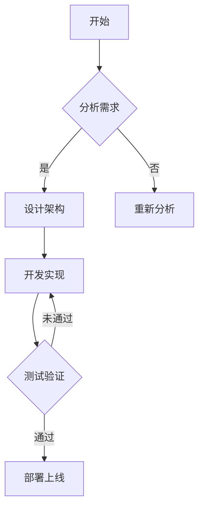

                 

# 人类-AI协作：增强人类潜能与AI能力的协同演进

> 关键词：人类-AI协作、人工智能、协同演进、教育、医疗、工业自动化

> 摘要：
本文将探讨人类与人工智能（AI）的协作，分析这种协作模式如何增强人类的潜能与AI的能力，实现双方的协同演进。文章首先概述了人类-AI协作的基本概念与重要性，接着探讨了AI技术的发展与人类-AI协作的可行性，随后深入解析了人类-AI协作的技术原理，最后详细介绍了人类-AI协作在教育、医疗和工业自动化等领域的实际应用。文章还展望了人类-AI协作的未来发展趋势，并提出应对潜在风险与挑战的策略。

## 第一部分: 人类-AI协作概述

### 第1章: 人类-AI协作的基本概念与重要性

#### 1.1 人类-AI协作的定义与特点

人类-AI协作指的是人类与人工智能系统共同工作，相互配合以完成特定任务或目标的过程。这种协作模式不同于传统的人机交互，它强调的是人类与AI系统之间的深度互动和相互依赖。

**定义与特点**：

- **定义**：人类-AI协作是一种智能体之间的交互模式，其中人类和人工智能系统共同参与决策和执行过程，以实现更高的效率和更佳的绩效。
- **特点**：
  - **合作性**：人类与AI系统在协作过程中共同完成任务，各自发挥所长。
  - **适应性**：协作系统可以根据任务需求和情境变化调整其行为和策略。
  - **透明性**：协作过程中的决策和行动应当对人类透明，便于人类理解和控制。
  - **协同进化**：人类和AI系统在协作过程中相互学习、适应，实现共同进化。

#### 1.2 AI在增强人类潜能中的作用

人工智能技术在各个领域都展现出了巨大的潜力，尤其在教育、医疗和工业等领域，AI的广泛应用不仅提高了人类的工作效率，还极大地扩展了人类的认知和能力。

- **教育领域**：AI技术可以个性化教学，为每个学生提供量身定制的学习计划，提高学习效果。
- **医疗领域**：AI在医学影像分析、疾病预测和智能药物研发等方面发挥着重要作用，提升了医疗服务的质量和效率。
- **工业领域**：AI技术实现了工业自动化，提高了生产效率和产品质量，降低了生产成本。

**AI如何帮助人类解决复杂问题**：

- **复杂问题求解**：AI系统通过机器学习和深度学习算法，可以从大量数据中提取有用信息，帮助人类解决复杂问题。
- **辅助决策**：AI系统可以分析海量数据，为人类提供科学的决策依据，提高决策的准确性和效率。
- **扩展认知**：AI技术可以帮助人类处理和分析复杂的信息，扩展人类的认知能力。

#### 1.3 人类潜能与AI能力的协同演进

人类-AI协作不仅能够提升人类的潜能，同时也能促进AI系统的发展。在这个过程中，人类和AI系统相互学习、相互适应，实现了协同演进。

- **人类潜能的扩展**：通过与AI系统的协作，人类可以处理更复杂的问题，发挥更大的创造力。
- **AI能力的提升**：在人类-AI协作中，AI系统不断学习和优化，提高了自身的智能水平。
- **协同进化**：人类-AI协作是一个动态的、持续的过程，双方都在不断进步和适应。

### 第2章: AI技术的发展与人类-AI协作的可行性

#### 2.1 AI技术的发展历程

人工智能（AI）技术的发展历程可以追溯到上世纪50年代，从最初的符号主义、知识表示，到现代的机器学习、深度学习，AI技术经历了多次重大的突破。

- **符号主义与知识表示**：早期AI以符号主义为基础，试图通过逻辑和符号表示知识。
- **基于规则的系统**：随着专家系统的出现，AI开始尝试模拟人类专家的决策过程。
- **机器学习与深度学习**：现代AI以机器学习和深度学习为核心，通过训练模型来模拟人类的学习和认知过程。

#### 2.2 人工智能的基本原理

人工智能的基本原理主要涉及机器学习、深度学习、神经网络等核心技术。

- **机器学习**：机器学习是AI的核心技术之一，通过训练数据集来学习规律，从而进行预测和决策。
- **深度学习**：深度学习是机器学习的一种方法，通过多层神经网络来实现更复杂的特征提取和建模。
- **神经网络**：神经网络是深度学习的基础，通过模拟人脑神经元之间的连接和交互来实现计算。

#### 2.3 人类-AI协作的可行性分析

人类-AI协作的可行性取决于多个因素，包括技术基础、人类与AI的交互机制、以及潜在的挑战和解决方案。

- **技术基础**：随着AI技术的快速发展，人类-AI协作在技术上已经具备了可行性。机器学习、深度学习、自然语言处理等技术为人类-AI协作提供了强大的支持。
- **交互机制**：人类与AI的交互机制是实现协作的关键。通过用户界面、语音识别、自然语言处理等技术，人类可以与AI系统进行高效、自然的互动。
- **挑战与解决方案**：
  - **透明性**：确保AI系统的决策过程对人类透明，需要通过可视化和解释性技术来实现。
  - **可靠性**：提高AI系统的可靠性，需要通过错误检测和容错技术来保证。
  - **伦理与法律问题**：人类-AI协作中的伦理和法律问题需要通过制定相应的规范和法律法规来解决。

### 第二部分: 人类-AI协作的技术原理

#### 第3章: 人类-AI协作的核心概念与原理

#### 3.1 人类-AI协作的架构

人类-AI协作的架构是协作系统的基础，它决定了人类与AI之间的交互方式和协作模式。

- **协作架构**：人类-AI协作架构通常包括三个主要部分：人类用户、AI系统以及交互界面。
- **交互机制**：人类与AI之间的交互机制包括用户界面、语音识别、自然语言处理等，这些机制使得人类能够与AI系统进行高效、自然的互动。
- **协作流程**：协作流程通常包括任务分配、决策制定、任务执行和结果评估等步骤，这些步骤构成了人类-AI协作的完整过程。

#### 3.2 AI的认知模型

AI的认知模型是模拟人类思维过程的核心，它决定了AI如何理解和处理信息。

- **认知模型**：AI的认知模型通常包括感知、记忆、推理、决策等部分，这些部分共同作用，使得AI能够模拟人类的思维过程。
- **感知与记忆**：AI通过感知系统收集信息，并通过记忆系统存储和处理信息。
- **推理与决策**：AI利用推理机制分析信息，并基于决策模型做出决策。

#### 3.3 人类-AI协作的伦理与法律问题

人类-AI协作不仅涉及技术问题，还涉及到伦理和法律问题，这些问题关系到协作系统的公正性、可靠性和安全性。

- **伦理问题**：伦理问题包括数据隐私、决策透明性、责任归属等，这些都需要通过伦理规范来保障。
- **法律问题**：法律问题包括法律法规的制定、法律责任的确立等，这些都需要通过法律法规来保障。

## 第三部分: 人类-AI协作的关键技术

### 第4章: 人类-AI协作的关键技术

#### 4.1 自然语言处理技术

自然语言处理（NLP）技术是人工智能的重要分支，它使得计算机能够理解和处理人类语言。

- **基本原理**：NLP的基本原理包括文本预处理、词向量表示、句法分析、语义理解等。
- **应用**：NLP在人类-AI协作中的应用包括语音识别、机器翻译、情感分析、对话系统等。

#### 4.2 计算机视觉技术

计算机视觉技术使得计算机能够理解和解释视觉信息，是实现人类-AI协作的重要技术之一。

- **基本原理**：计算机视觉的基本原理包括图像预处理、特征提取、目标识别、图像重建等。
- **应用**：计算机视觉在人类-AI协作中的应用包括图像识别、视频分析、人脸识别、智能监控等。

#### 4.3 强化学习技术

强化学习（Reinforcement Learning，RL）是一种机器学习方法，通过奖励机制来训练模型，使其能够在特定环境中进行决策。

- **基本原理**：强化学习的基本原理包括状态、动作、奖励等，它通过不断地试错来优化策略。
- **应用**：强化学习在人类-AI协作中的应用包括游戏智能、机器人控制、推荐系统等。

## 第四部分: 人类-AI协作的实际应用

### 第5章: 人类-AI协作在教育领域的应用

#### 5.1 AI辅助教育

AI辅助教育是指利用人工智能技术辅助教学和学习，提高教学效果和学习效率。

- **概念与形式**：AI辅助教育包括智能推荐系统、自动评分系统、虚拟教师等。
- **应用案例**：例如，智能推荐系统可以根据学生的学习情况，推荐合适的学习资源和练习题。

#### 5.2 个性化学习

个性化学习是一种基于学生个体差异的教学方法，通过AI技术实现。

- **基本原理**：个性化学习基于学生个体的学习数据，为每个学生提供量身定制的学习计划。
- **与人类-AI协作的关系**：个性化学习与人类-AI协作的关系在于，AI技术为个性化学习提供了数据支持和智能分析。

#### 5.3 在线教育平台的设计与实现

在线教育平台的设计与实现涉及到多个技术领域，包括前端开发、后端开发、数据存储与处理等。

- **设计原则**：在线教育平台的设计原则包括用户体验、内容丰富性、技术先进性等。
- **技术实现**：在线教育平台的技术实现包括Web开发、数据库设计、机器学习算法等。

### 第6章: 人类-AI协作在医疗领域的应用

#### 6.1 AI辅助诊断

AI辅助诊断是指利用人工智能技术辅助医生进行疾病诊断，提高诊断的准确性和效率。

- **基本原理**：AI辅助诊断基于机器学习和深度学习算法，从医学影像数据中提取特征，进行疾病分类和预测。
- **应用**：AI辅助诊断在医学影像分析、疾病预测等方面发挥着重要作用。

#### 6.2 医疗数据管理与分析

医疗数据管理与分析是指利用人工智能技术对大量医疗数据进行存储、管理和分析，为医疗决策提供支持。

- **挑战与解决方案**：医疗数据管理与分析面临的挑战包括数据多样性、数据安全性和分析准确性等，解决方案包括数据清洗、数据挖掘、机器学习等。

#### 6.3 智能药物研发

智能药物研发是指利用人工智能技术进行药物筛选、设计和新药研发。

- **基本原理**：智能药物研发基于计算生物学、化学和药物学等领域的知识，通过AI算法进行药物分子的筛选和优化。
- **应用**：智能药物研发在提高药物研发效率、降低研发成本、提高新药成功率等方面具有巨大潜力。

### 第7章: 人类-AI协作在工业自动化领域的应用

#### 7.1 工业自动化的发展现状

工业自动化是指利用计算机技术、自动化设备和人工智能技术对工业生产过程进行自动化控制和管理。

- **定义与发展历程**：工业自动化的定义、发展历程及其在工业生产中的应用。
- **重要技术**：工业自动化涉及的重要技术包括传感器技术、机器视觉、机器学习、机器人技术等。

#### 7.2 人类-AI协作在工业自动化中的应用

人类-AI协作在工业自动化中的应用主要包括智能生产、智能物流、智能维护等。

- **应用角色**：人类在工业自动化中的作用主要包括监控、决策、维护等。
- **应用案例**：例如，智能生产中的机器视觉系统可以实时检测产品质量，智能物流中的无人机配送系统可以提高物流效率。

#### 7.3 未来的工业自动化与人类-AI协作

未来的工业自动化将更加智能化、自适应化，人类-AI协作将成为工业自动化的重要组成部分。

- **发展趋势**：未来工业自动化的趋势包括更加智能化、自适应化、协作化等。
- **前景展望**：人类-AI协作在未来的工业自动化中具有广阔的应用前景，有望推动工业生产模式的深刻变革。

## 第五部分: 人类-AI协作的未来展望

### 第8章: 人类-AI协作的未来发展趋势

#### 8.1 技术趋势分析

技术趋势分析关注的是未来AI技术可能的发展方向和趋势。

- **技术突破**：AI技术的未来可能实现更加智能化、自适应化、通用化的发展。
- **应用拓展**：AI技术将在更多领域得到应用，如智能制造、智能医疗、智慧城市等。

#### 8.2 应用前景展望

应用前景展望关注的是人类-AI协作在各个领域可能的应用场景和发展潜力。

- **教育领域**：AI技术将个性化教育推向新的高度，提高学习效率。
- **医疗领域**：AI技术在疾病诊断、药物研发等方面将发挥更大作用。
- **工业领域**：AI技术将推动工业自动化的深度发展，提高生产效率。

#### 8.3 潜在风险与应对策略

潜在风险与应对策略关注的是人类-AI协作可能面临的挑战和风险，以及如何应对。

- **伦理问题**：如数据隐私、决策透明性等，需要通过伦理规范和法律法规来解决。
- **技术挑战**：如算法偏见、系统稳定性等，需要通过技术创新和优化来应对。

## 附录

### 附录 A: 人类-AI协作开发工具与资源

- **开发工具**：如Python、TensorFlow、Keras等。
- **开源项目**：如OpenAI、TensorFlow.js、PyTorch等。
- **资源网站**：如GitHub、arXiv、AI Challenger等。

### 附录 B: Mermaid 流程图示例

### 附录 C: 人类-AI协作项目实战

- **项目介绍**：介绍人类-AI协作项目的背景和目标。
- **开发环境搭建**：详细说明开发环境搭建的步骤和工具。
- **源代码实现**：展示项目的源代码，并进行详细解读。
- **代码解读与分析**：对源代码进行解读，分析其原理和实现方法。

### 附录 D: 人类-AI协作相关的数学模型与公式

- **数学模型**：介绍人类-AI协作中常用的数学模型，如决策树、神经网络等。
- **公式解释与示例**：对数学公式进行解释，并给出示例。

### 致谢

- **对参与本书编写和审校的专家表示衷心感谢**。
- **对提供技术支持和资源的机构与个人表示敬意**。

### 作者信息

- **作者：AI天才研究院/AI Genius Institute & 禅与计算机程序设计艺术 /Zen And The Art of Computer Programming**。

