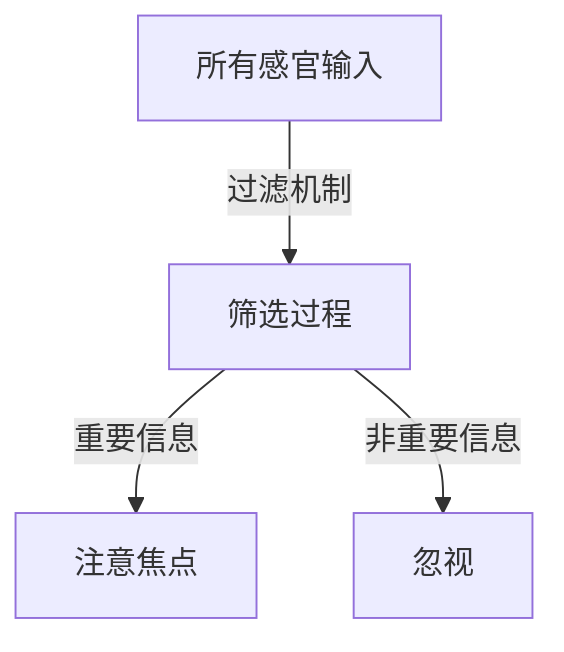
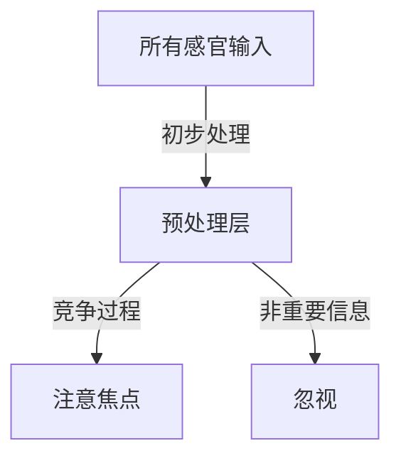
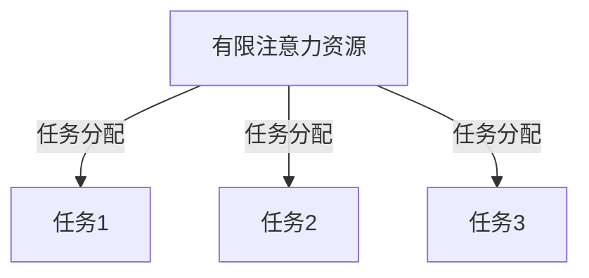
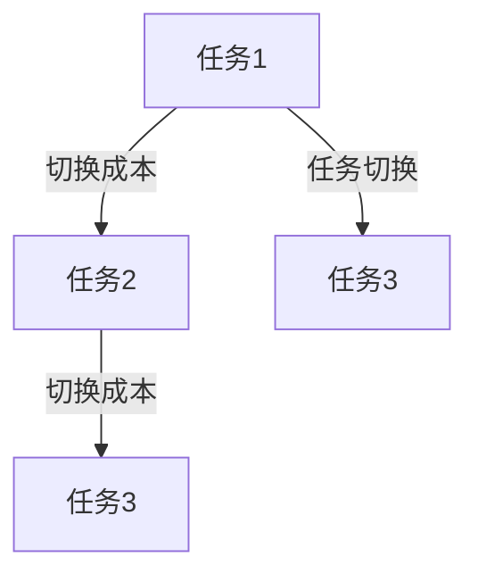
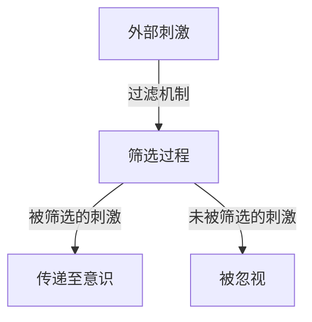
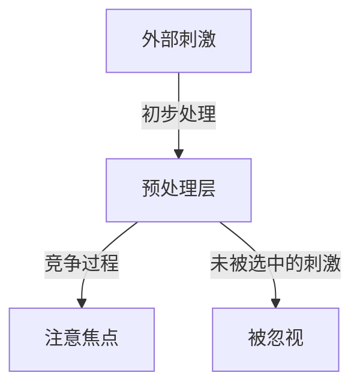
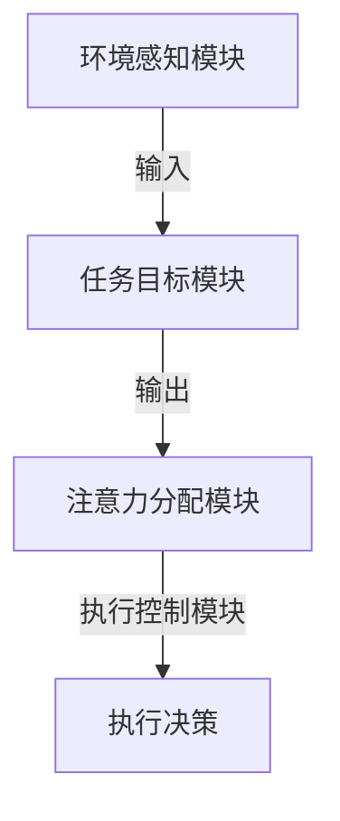
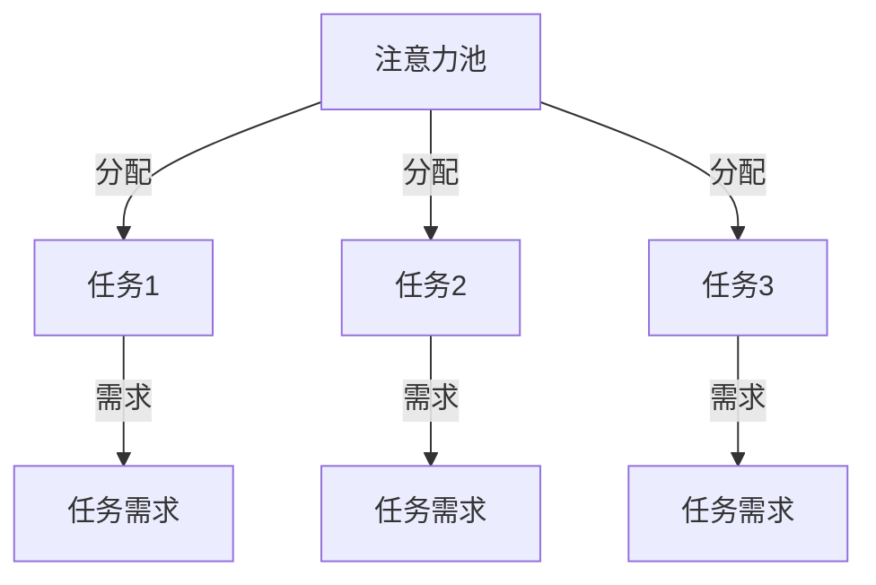
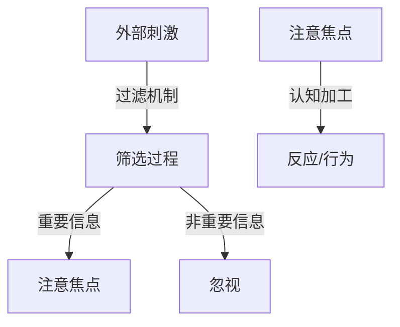

                 

### 第1章: 引言

#### 1.1 注意力的定义与重要性

- **注意力的定义**：
  注意力是一种心理过程，它使得个体能够从众多刺激中选择性地关注某些特定的信息或对象，并在必要时对其进行加工和处理。简单来说，注意力是心理资源的一种分配方式，它决定了个体对外界信息的接收和处理效率。

- **注意力的作用**：
  注意力在人类生活中的作用至关重要，它不仅影响个体的认知和行为，还与学习效率、工作表现和心理健康密切相关。以下是注意力的一些关键作用：

  1. **提高学习效率**：注意力使得个体能够集中精力学习，减少分心现象，从而提高学习效果。
  2. **提升工作效率**：在工作中，保持注意力集中可以帮助个体迅速识别和处理任务，减少错误发生，提高工作效率。
  3. **改善心理健康**：良好的注意力水平有助于个体更好地应对压力和挑战，减少焦虑和抑郁情绪。
  4. **促进社交互动**：注意力使得个体能够更好地关注他人，理解他人的情感和需求，从而改善社交互动。

#### 1.2 人类注意力的类型与模型

- **注意力的类型**：
  人类注意力可以分为以下几种类型：

  1. **选择性注意力**：指个体在众多刺激中选择关注特定刺激的能力。例如，在嘈杂的环境中，个体能够选择性地关注到重要信息。
  2. **分配性注意力**：指个体在同一时间内能够关注和加工多个刺激的能力。例如，在开车时，个体需要同时关注路况、车辆和行人。
  3. **维持性注意力**：指个体在完成任务时保持注意力的能力。例如，在长时间的学习或工作中，个体需要维持较高的注意力水平。
  4. **执行性注意力**：指个体在复杂任务中，主动调整和分配注意力的能力。例如，在解决问题时，个体需要根据任务的复杂性和优先级调整注意力。

- **注意力模型**：
  为了更好地理解注意力机制，科学家们提出了多种注意力模型。以下是几种常见的注意力模型：

  1. **知觉选择模型**：由布鲁纳（Jerome Bruner）等人提出，认为注意力是通过对刺激进行选择性知觉来实现的。个体在处理信息时，会根据刺激的显著性和相关性进行选择性关注。
  2. **资源限制模型**：由特瑞斯曼（Charles E. Treisman）等人提出，认为注意力是一个有限的资源，个体在同一时间内只能关注和处理一定量的信息。
  3. **控制性注意力模型**：由德威克（Alan D. Baddeley）等人提出，认为注意力是一种控制性过程，个体可以通过意志力主动调整和控制注意力的分配。

#### 1.3 注意力问题及其影响

- **注意力问题的类型**：
  注意力问题可以分为以下几种类型：

  1. **注意力不足**：个体在完成任务时难以集中注意力，容易分心。例如，学生上课时无法集中注意力，导致学习效果不佳。
  2. **注意力分散**：个体在同时处理多个任务时，难以将注意力集中在每个任务上，导致任务完成效率低下。例如，员工在同时处理多项工作时，容易分心，导致工作效率下降。
  3. **注意力障碍**：个体由于生理或心理原因，难以维持稳定的注意力水平。例如，多动症（ADHD）患者通常存在注意力障碍。

- **注意力问题的影响**：
  注意力问题对个体生活和工作产生多方面的影响：

  1. **学习困难**：注意力不足或分散导致个体难以专注学习，学习效率低下，学习成绩受到影响。
  2. **工作效率降低**：注意力分散或障碍导致个体难以集中精力完成任务，工作效率降低，容易出现错误。
  3. **心理健康问题**：注意力问题可能导致个体产生焦虑、抑郁等心理健康问题，影响生活质量。
  4. **社会关系障碍**：注意力问题可能导致个体在社交互动中难以关注他人，影响人际关系的建立和维护。

#### 1.4 本书结构和内容概述

- **本书结构**：
  本书分为三个部分，分别介绍注意力增强的原理、技术方法及其应用。

  1. **第一部分：注意力增强原理与框架**：介绍注意力的定义、类型与模型，以及注意力增强的理论基础。
  2. **第二部分：注意力增强技术与应用**：详细讨论生物医学方法、技术方法以及注意力增强的综合应用。
  3. **第三部分：注意力增强技术的挑战与未来发展趋势**：探讨注意力增强技术的挑战、未来发展趋势及其社会影响。

- **内容概述**：
  1. **注意力增强原理与框架**：
     - 了解注意力的基本概念和类型，为后续技术方法的讨论提供理论基础。
     - 探讨注意力与大脑功能区域的关系，为注意力增强技术的研发提供生理基础。
     - 介绍适应性注意理论和注意力分配理论，为注意力增强技术的实施提供理论指导。
  2. **注意力增强技术与应用**：
     - 介绍脑电刺激、光遗传学、药物治疗等生物医学方法，以及脑机接口、认知训练、脑训练软件等技术方法。
     - 讨论注意力增强技术在教育、工作、医疗等领域的应用，分析其优势和挑战。
  3. **注意力增强技术的挑战与未来发展趋势**：
     - 分析注意力增强技术面临的挑战，如安全性问题、伦理困境等。
     - 展望注意力增强技术的未来发展趋势，讨论其在社会中的潜在影响。

通过本书的阅读，读者将系统地了解注意力增强的基本原理、技术方法及其应用，为未来的研究和实践提供参考。

### 第2章: 人类注意力模型

#### 2.1 传统注意力模型概述

- **选择性注意力模型**：
  选择性注意力模型主要关注个体如何从众多刺激中选择关注特定刺激的过程。这种模型认为，个体在处理信息时，会根据刺激的显著性和相关性进行选择性关注。以下是几种常见的选择性注意力模型：

  1. **早期选择模型**：该模型由布罗德本特（D. Broadbent）提出，认为个体在接收信息时，首先通过一个“过滤机制”筛选出重要的信息，然后将其传递给意识处理。未被筛选出的信息则被忽视。

  2. **晚期选择模型**：该模型由特瑞斯曼（Charles E. Treisman）提出，认为个体在处理信息时，首先对所有信息进行加工，然后通过一个“竞争机制”筛选出最重要的信息，最终传递给意识处理。

  3. **多通道选择模型**：该模型由卡茨（Neal E. Katz）等人提出，认为个体在处理信息时，可以通过多个通道（如视觉、听觉等）进行选择性关注。每个通道都有自己的选择性机制，从而实现对信息的全面加工。

- **分配性注意力模型**：
  分配性注意力模型主要关注个体如何在同一时间内关注多个任务或对象。这种模型认为，个体在进行多任务处理时，需要将注意力资源分配到不同的任务上。以下是几种常见的分配性注意力模型：

  1. **切换模型**：该模型由施温格（William H. Sweller）提出，认为个体在进行多任务处理时，需要在不同任务之间切换注意力。每次切换都会消耗一定的注意力资源，因此，过多的任务切换会导致注意力分散。

  2. **连续性模型**：该模型由梅耶（John D. Mayer）等人提出，认为个体在进行多任务处理时，可以通过调整注意力的连续性来平衡不同任务的需求。例如，在同时听音乐和开车时，个体可以通过降低听音乐的音量，提高注意力的连续性，从而更好地处理驾驶任务。

#### 2.2 注意力与大脑功能区域的关系

- **颞叶与注意力控制**：
  颞叶是大脑中负责处理听觉信息的重要区域，同时也与注意力控制密切相关。研究表明，颞叶的特定区域，如颞叶内侧回和颞叶前区，在注意力控制中发挥着重要作用。以下是一些关键点：

  1. **颞叶内侧回**：该区域与注意力的选择性关注有关。研究表明，当个体需要关注特定听觉信息时，颞叶内侧回的活动会显著增强。

  2. **颞叶前区**：该区域与注意力的分配和维持有关。研究表明，当个体需要同时处理多个任务时，颞叶前区会参与到注意力的分配和维持过程中。

- **前额叶与注意力分配**：
  前额叶是大脑中负责执行功能的重要区域，也与注意力分配密切相关。以下是一些关键点：

  1. **前额叶内侧回**：该区域与注意力的选择性关注和分配有关。研究表明，当个体需要关注特定视觉信息时，前额叶内侧回的活动会显著增强。

  2. **前额叶背外侧区**：该区域与注意力的维持和分配有关。研究表明，当个体需要同时处理多个任务时，前额叶背外侧区的活动会显著增强。

#### 2.3 注意力增强技术的理论基础

- **适应性注意理论**：
  适应性注意理论认为，注意力的分配是动态的，取决于当前的任务需求和环境刺激。以下是一些关键点：

  1. **任务需求**：当任务需求发生变化时，个体需要调整注意力的分配，以适应新的任务需求。例如，在复杂任务中，个体可能需要将更多注意力分配到关键任务上。

  2. **环境刺激**：当环境刺激发生变化时，个体也需要调整注意力的分配，以更好地处理环境信息。例如，在嘈杂的环境中，个体可能需要将更多注意力分配到声音识别上。

- **注意力分配理论**：
  注意力分配理论认为，个体在进行多任务处理时，需要合理分配注意力资源，以最大化任务完成效率。以下是一些关键点：

  1. **任务复杂度**：任务复杂度越高，个体需要分配的注意力资源越多。例如，在处理复杂计算问题时，个体需要将更多注意力分配到计算细节上。

  2. **认知资源**：个体的认知资源是有限的，因此在进行多任务处理时，需要根据任务需求和认知资源状况合理分配注意力。

#### 2.3.1 适应性注意理论

- **理论核心**：
  适应性注意理论认为，注意力的分配是根据当前的任务需求和环境刺激动态调整的。这种动态调整机制使得个体能够更好地适应不同的任务场景。

- **应用场景**：
  适应性注意理论在多任务处理、动态环境下的注意力分配等方面具有广泛的应用。例如，在自动驾驶中，车辆需要根据道路状况和环境刺激动态调整注意力的分配，以确保安全行驶。

#### 2.3.2 注意力分配理论

- **理论核心**：
  注意力分配理论认为，个体在进行多任务处理时，需要根据任务复杂度和认知资源状况合理分配注意力资源，以最大化任务完成效率。

- **应用场景**：
  注意力分配理论在任务管理、时间管理、资源分配等方面具有广泛的应用。例如，在项目管理和团队协作中，项目经理需要根据任务复杂度和团队成员的认知资源状况，合理分配任务和资源，以确保项目顺利进行。

### 第3章: 生物医学方法

#### 3.1 脑电刺激技术

- **原理**：
  脑电刺激技术通过施加电刺激来调节大脑的活动，从而影响注意力和认知功能。这种技术利用电流或磁场刺激大脑特定区域，改变其神经活动，进而改善注意力。

- **应用**：
  脑电刺激技术在注意力增强和认知功能改善方面具有广泛的应用。以下是一些具体应用：

  - **注意力障碍**：脑电刺激技术可以帮助改善注意力障碍患者的注意力集中度和工作效率。例如，经颅磁刺激（TMS）和经颅直流刺激（tDCS）已被广泛应用于注意力障碍的治疗。
  - **学习障碍**：脑电刺激技术可以辅助治疗学习障碍，如阅读障碍和计算障碍。通过刺激大脑特定区域，可以提高学习效率和成绩。
  - **心理健康**：脑电刺激技术可以用于治疗抑郁症、焦虑症等心理健康问题，改善患者的注意力和情绪状态。

#### 3.2 光遗传学

- **原理**：
  光遗传学是一种利用光控离子通道（如光敏蛋白）来调节神经元活动的技术。通过光信号的精确控制，可以实现对特定脑区的刺激或抑制，从而影响注意力和认知功能。

- **应用**：
  光遗传学在注意力增强和认知功能改善方面具有巨大潜力。以下是一些具体应用：

  - **神经科学研究**：光遗传学技术可以用于研究注意力和认知功能的基本机制。例如，通过刺激或抑制特定脑区，可以观察其对注意力的影响。
  - **治疗应用**：光遗传学技术可以用于治疗注意力障碍和其他认知功能障碍。例如，通过激活特定脑区，可以提高患者的注意力集中度和工作效率。

#### 3.3 药物疗法

- **原理**：
  药物疗法通过作用于神经系统，改变神经递质的水平，从而影响注意力和认知功能。注意力增强药物可以分为刺激剂和非刺激剂两类：

  - **刺激剂**：如哌甲酯（Ritalin）和安非他酮（Wellbutrin），通过增强神经递质的释放和抑制其再摄取，提高注意力和集中度。
  - **非刺激剂**：如原子氯（Atomoxetine）和托莫西汀（Strattera），通过调节神经递质的代谢，改善注意力障碍症状。

- **应用**：
  药物疗法被广泛应用于注意力障碍和其他认知功能障碍的治疗。以下是一些具体应用：

  - **注意力障碍**：药物疗法可以帮助改善注意力障碍患者的注意力集中度和工作效率，如多动症和注意力缺陷障碍。
  - **学习障碍**：药物疗法可以辅助治疗学习障碍，如阅读障碍和计算障碍，提高学习效率和成绩。
  - **心理健康**：药物疗法可以用于治疗抑郁症、焦虑症等心理健康问题，改善患者的注意力和情绪状态。

### 第4章: 技术方法

#### 4.1 脑机接口技术

- **原理**：
  脑机接口技术（Brain-Computer Interface, BCI）是一种直接连接大脑和外部设备的接口系统。它通过记录大脑活动信号（如脑电波），并将其转换为机器控制信号，实现人与机器的直接交互。

- **应用**：
  脑机接口技术在注意力增强和认知功能改善方面具有广泛的应用。以下是一些具体应用：

  - **注意力增强**：通过实时监测个体的脑电信号，可以分析注意力的变化，并提供反馈，帮助个体提高注意力集中度。
  - **认知功能改善**：脑机接口技术可以用于训练和增强认知功能，如记忆、注意力和决策能力。

#### 4.2 空间认知训练

- **原理**：
  空间认知训练是一种通过模拟真实或虚拟环境，引导个体进行空间信息处理和记忆的训练方法。它主要通过空间定位、空间关系、路径规划等任务来提高个体的空间认知能力。

- **应用**：
  空间认知训练被广泛应用于注意力障碍患者的康复治疗。以下是一些具体应用：

  - **注意力障碍康复**：通过空间认知训练，可以显著提高患者的空间定位和路径规划能力，从而改善其日常生活和工作表现。
  - **老年人认知功能改善**：空间认知训练可以帮助老年人维持和提高空间认知能力，延缓认知功能下降。

#### 4.3 脑训练软件

- **原理**：
  脑训练软件是一种通过计算机程序对大脑进行训练和优化的工具。它通常包括一系列的脑力训练任务，如记忆游戏、注意力任务、反应速度训练等，旨在提高个体的认知功能和注意力水平。

- **应用**：
  脑训练软件被广泛应用于提升学习效率和职业表现。以下是一些具体应用：

  - **学习效率提升**：通过定期使用脑训练软件，可以显著提高个体的记忆力、注意力和反应速度，从而提高学习效率。
  - **职业表现提升**：脑训练软件可以帮助职场人士提高注意力和工作效率，减少错误发生。

#### 4.3.1 脑训练软件的分类

- **认知训练软件**：
  这种软件主要关注认知功能的训练，如记忆、注意力、推理等。例如，NeuroNation、Lumosity等软件。

- **游戏化训练软件**：
  这种软件将认知训练融入游戏中，通过有趣的方式提高用户的参与度和积极性。例如，Elevate、Peak等软件。

- **专业训练软件**：
  这种软件通常由专业人士设计，针对特定人群（如老年人、注意力障碍患者等）提供个性化的训练方案。例如，CogniFit、MyBrainTrain等软件。

#### 4.3.2 常用脑训练软件介绍及评价

- **NeuroNation**：
  NeuroNation是一款综合性的认知训练软件，提供多种认知功能训练任务。它界面友好，易于操作，适合不同年龄段的人群。然而，其训练内容较为重复，可能缺乏一定的挑战性。

- **Lumosity**：
  Lumosity是一款广受欢迎的脑训练软件，提供丰富的认知训练任务。它通过个性化的训练计划，根据用户的进展调整训练难度。然而，其收费模式可能对一些用户造成负担。

- **Elevate**：
  Elevate是一款游戏化的认知训练软件，通过有趣的游戏任务提高用户的认知能力。它适合日常使用，但训练内容相对单一，可能无法满足专业用户的需求。

- **Peak**：
  Peak提供多种认知训练任务，包括记忆、注意力、反应速度等。它界面简洁，易于使用，适合不同年龄段的人群。然而，其训练内容可能缺乏深度，对专业用户来说可能不够挑战。

- **CogniFit**：
  CogniFit是一款专业的认知训练软件，由专业人士设计，提供个性化的训练方案。它适用于老年人、注意力障碍患者等特定人群，但费用较高。

- **MyBrainTrain**：
  MyBrainTrain提供个性化的认知训练方案，根据用户的进展调整训练内容。它适合不同年龄段的人群，但操作较为复杂，需要一定的时间适应。

### 第5章: 注意力增强技术的综合应用

#### 5.1 教育领域的应用

- **注入式教学策略**：
  注入式教学策略是通过外部干预，如教学视频、讲座等，将知识直接传授给学生。这种方法在短时间内可以迅速提升学生的知识水平，但可能难以培养学生的自主学习和创新能力。

- **认知训练在学校中的应用**：
  认知训练在学校中的应用可以通过以下几种方式实现：

  - **课堂活动**：在课堂上引入认知训练任务，如记忆游戏、注意力任务等，以提高学生的认知能力和学习效果。
  - **课外活动**：组织课外认知训练活动，如团队竞赛、游戏化学习等，激发学生的学习兴趣和积极性。
  - **个性化训练**：根据学生的认知能力和发展需求，提供个性化的认知训练方案，帮助学生克服学习困难。

#### 5.2 工作与职业领域的应用

- **注意力增强在工作效率提升中的作用**：
  注意力增强技术在工作中可以发挥重要作用，提高工作效率和准确性。以下是一些具体应用：

  - **任务管理**：通过注意力管理工具，如待办事项列表、时间管理软件等，帮助员工合理安排任务，提高注意力分配效率。
  - **工作环境优化**：改善工作环境，减少干扰因素，如关闭不必要的通知、减少噪音等，以提高员工的注意力集中度。
  - **注意力训练**：定期进行注意力训练，如使用脑训练软件、进行专注力练习等，提高员工的注意力水平和抗干扰能力。

- **职业心理健康与注意力增强**：
  注意力增强技术在职业心理健康方面也具有重要作用，以下是一些具体应用：

  - **心理健康评估**：通过心理评估工具，了解员工的注意力和心理健康状况，提供个性化的干预措施。
  - **注意力训练**：针对注意力障碍或注意力不足的员工，提供针对性的注意力训练，如使用脑训练软件、进行专注力练习等。
  - **心理辅导**：为注意力问题严重的员工提供心理辅导，如认知行为疗法、注意力训练等，帮助其改善注意力问题，提升心理健康水平。

#### 5.3 医疗领域的应用

- **注意力障碍患者的治疗**：
  注意力障碍患者在治疗过程中，注意力增强技术可以发挥重要作用，以下是一些具体应用：

  - **药物治疗**：通过注意力增强药物，如刺激剂、非刺激剂等，改善患者的注意力集中度和注意力障碍症状。
  - **认知行为疗法**：通过认知行为疗法，帮助患者改变注意力障碍的认知和行为模式，提高其注意力水平和生活质量。
  - **注意力训练**：通过注意力训练，如脑训练软件、专注力练习等，提高患者的注意力水平和认知功能。

- **老年人认知功能改善**：
  随着年龄的增长，老年人的认知功能可能会逐渐下降，注意力增强技术可以帮助改善其认知功能，以下是一些具体应用：

  - **认知训练**：通过认知训练，如记忆游戏、注意力任务等，提高老年人的认知能力和注意力水平。
  - **脑电刺激技术**：通过脑电刺激技术，如经颅磁刺激、经颅直流刺激等，改善老年人的认知功能和注意力水平。
  - **药物疗法**：在医生的指导下，使用注意力增强药物，如刺激剂、非刺激剂等，改善老年人的认知功能和注意力水平。

### 第6章: 注意力增强技术的挑战

#### 6.1 安全性问题

- **脑电刺激的安全风险**：
  脑电刺激技术虽然具有改善注意力的潜力，但也存在一定的安全风险。以下是一些关键点：

  - **电击风险**：高强度的电刺激可能导致脑部电击，甚至引发癫痫发作。
  - **头痛和疲劳**：长期的脑电刺激可能导致头痛和疲劳，影响日常生活和工作。
  - **脑损伤**：不正确的操作或设备故障可能导致脑部损伤，影响认知功能。

- **药物治疗的潜在副作用**：
  注意力增强药物虽然可以改善注意力，但长期使用可能会产生副作用。以下是一些关键点：

  - **刺激剂副作用**：如哌甲酯和安非他酮，可能导致成瘾、焦虑和心脏问题。
  - **非刺激剂副作用**：如原子氯和托莫西汀，可能导致疲劳、嗜睡和胃肠道不适。
  - **药物依赖**：长期依赖注意力增强药物可能导致心理和生理依赖，影响治疗效果。

#### 6.2 技术发展与伦理问题

- **脑机接口的伦理困境**：
  脑机接口技术的发展带来了一系列伦理困境，以下是一些关键点：

  - **隐私泄露**：脑机接口技术可能记录个体的脑电信号，这些数据可能被滥用或泄露，导致隐私问题。
  - **功能增强与道德风险**：通过脑机接口实现功能增强可能引发道德争议，如增强记忆或控制意识。
  - **社会不平等**：脑机接口技术的普及可能导致社会不平等加剧，技术发达地区与发展中地区之间的差距可能进一步扩大。

- **技术发展的社会责任**：
  注意力增强技术的发展需要承担社会责任，以下是一些关键点：

  - **公平性**：技术开发者和政策制定者需要确保技术能够公平地惠及所有人，避免加剧社会不平等。
  - **透明性**：技术研究和应用需要透明，确保公众了解技术的原理、应用和潜在风险。
  - **监管**：政府和社会需要制定相应的监管政策，确保技术安全、有效，并防止滥用。

### 第7章: 未来发展趋势与展望

#### 7.1 注意力增强技术的新进展

- **新型脑电刺激技术**：
  随着脑电刺激技术的发展，新型脑电刺激技术不断涌现，以下是一些新进展：

  - **高精度脑电信号记录**：利用高级传感器和算法，实现更精准的脑电信号记录，提高注意力调节的准确性。
  - **可穿戴设备**：开发便携式、可穿戴的脑电刺激设备，提高用户的便利性和舒适度。
  - **无创性脑刺激**：研究无创性脑刺激技术，减少对大脑的物理损伤，提高安全性。

- **基于人工智能的个性化认知训练**：
  人工智能技术的发展为个性化认知训练提供了新的可能性，以下是一些新进展：

  - **智能训练计划**：利用机器学习算法，根据用户的行为和脑电信号，生成个性化的认知训练计划。
  - **实时反馈**：通过实时分析用户的脑电信号和训练表现，提供个性化的实时反馈，提高训练效果。
  - **自适应调整**：根据用户的进展和反馈，自动调整训练难度和内容，确保训练的持续有效性。

#### 7.2 注意力增强技术的社会影响

- **教育与工作方式的改变**：
  注意力增强技术的普及可能会改变教育和工作方式，以下是一些影响：

  - **个性化教育**：通过认知训练和注意力增强技术，可以为每个学生量身定制学习计划，提高学习效果。
  - **工作效率提升**：通过注意力管理工具和训练，可以提高员工的工作效率和注意力集中度，减少错误发生。
  - **远程工作**：注意力增强技术可以帮助远程工作者提高注意力和工作效率，缓解远程工作带来的分心问题。

- **人机交互与数字鸿沟**：
  注意力增强技术在人机交互领域的应用可能会加剧数字鸿沟，以下是一些影响：

  - **技术发达地区**：注意力增强技术可能首先在技术发达地区普及，导致这些地区在教育和工作中更具竞争力。
  - **发展中国家**：发展中国家可能因技术获取困难而面临数字鸿沟扩大的风险，影响教育和工作机会。

#### 7.3 注意力增强技术的可持续发展路径

- **产业化与商业化前景**：
  注意力增强技术的产业化与商业化前景广阔，以下是一些发展方向：

  - **市场潜力**：随着人们对注意力管理和提高工作效率的需求增加，注意力增强技术的市场潜力巨大。
  - **商业应用**：注意力增强技术可以在教育、医疗、职场等多个领域得到应用，推动相关产业的发展。
  - **投资机会**：注意力增强技术成为投资热点，吸引大量资本进入，推动技术创新和应用。

- **政策与监管框架构建**：
  为了确保注意力增强技术的可持续发展，需要制定相应的政策与监管框架，以下是一些关键点：

  - **安全性监管**：制定脑电刺激和药物治疗的监管标准，确保技术的安全性。
  - **隐私保护**：加强对脑机接口技术的数据保护，防止隐私泄露。
  - **公平性保障**：确保注意力增强技术能够公平地惠及所有人，避免加剧社会不平等。

### 附录

#### 附录A: 注意力增强技术相关资源

- **学术文献与研究报告**：
  - [1] Anderson, J. R. (2007). The architecture of cognition. Cambridge, MA: MIT Press.
  - [2] Pashler, H. (1994). Attention. Cognitive Science, 20(1), 73-109.
  - [3] Reichow, B., & Wolchik, S. A. (2013). Meta-analysis of intervention studies with individuals who have autism spectrum disorder: How do various interventions compare to each other and to control and placebo conditions?. Research in Autism Spectrum Disorders, 7(3), 253-267.

- **技术工具与平台介绍**：
  - [1] Brain Products GmbH. (n.d.). Brain products. Retrieved from https://www.brainproducts.com/
  - [2] Neuroelectrics. (n.d.). Neuroelectrics - Solutions for Neural Stimulation and Brain Imaging. Retrieved from https://neuroelectrics.com/
  - [3] OpenBCI. (n.d.). OpenBCI - Open Source Brain Computer Interfaces. Retrieved from https://openbci.com/

- **注意力增强产品与供应商列表**：
  - [1] CogniFit. (n.d.). CogniFit - Brain Training & Cognitive Therapy. Retrieved from https://www.cognifit.com/
  - [2] Lumosity. (n.d.). Lumosity - Brain Training. Retrieved from https://www.lumosity.com/
  - [3] MindMate. (n.d.). MindMate - Personalized Brain Health Platform. Retrieved from https://www.mindmate.ai/

### 文章结束

作者：AI天才研究院/AI Genius Institute & 禅与计算机程序设计艺术 /Zen And The Art of Computer Programming

本文通过详细探讨注意力增强技术的原理、方法、应用和挑战，系统地介绍了注意力增强的基本知识。希望读者能够通过本文的学习，对注意力增强技术有更深入的理解，并在实际应用中发挥其作用。在未来的研究和实践中，我们将继续探索注意力增强技术的潜力，推动其在教育、工作、医疗等领域的广泛应用。


----------------------------------------------------------------

### 第1章: 引言

#### 1.1 注意力的定义与重要性

注意力是指个体在心理活动中对某一特定对象或任务的指向和集中。它是心理过程的一种形式，使我们能够从众多信息中选择和关注重要的部分。注意力不仅影响我们的认知活动，如学习、记忆和思考，还对行为和情绪有重要影响。

**注意力的作用**

1. **提高学习效率**：注意力使我们能够集中精力学习，减少分心和干扰，从而提高学习效果。
2. **提升工作效率**：在工作环境中，注意力集中可以提高工作效率，减少错误和重复工作。
3. **改善心理健康**：良好的注意力有助于降低焦虑和压力，提高情绪稳定性。

**注意力的类型**

1. **选择性注意力**：个体在众多刺激中选择关注特定刺激的能力。例如，在教室里，学生需要从众多信息中关注老师讲解的内容。
2. **分配性注意力**：个体在同时处理多个任务或对象的能力。例如，司机在开车时需要同时关注路况、车辆和行人。
3. **维持性注意力**：个体在长时间任务中保持注意力集中的能力。例如，在长时间阅读或工作时，需要持续保持注意力。
4. **执行性注意力**：个体在复杂任务中，根据任务需求动态调整注意力分配的能力。例如，在解决问题时，需要根据问题的复杂程度调整注意力。

#### 1.2 人类注意力的类型与模型

**选择性注意力模型**

选择性注意力模型主要关注个体如何选择关注某些刺激而忽视其他刺激。这个模型的核心假设是，个体的大脑有一种选择机制，可以过滤掉不重要的信息，只关注那些具有潜在重要性的信息。

**知觉选择模型（Perceptual Selection Model）**：该模型由D. Broadbent在1958年提出。它认为，大脑首先接收所有感官输入，然后通过一个过滤机制筛选出最重要的信息。未被筛选的信息则被忽视。



**晚期选择模型（Late Selection Model）**：由Charles E. Treisman和Norman DSL rivol在1965年提出。该模型认为，大脑对所有感官输入都进行初步处理，然后通过一个竞争过程选择出最重要的信息。



**分配性注意力模型**

分配性注意力模型主要关注个体如何将注意力分配到多个任务或对象上。这个模型的核心假设是，个体的注意力资源是有限的，不能同时关注无限多的任务。

**资源限制模型（Resource-Limited Model）**：由Alan D. Baddeley在1986年提出。该模型认为，个体的注意力资源是有限的，同时处理多个任务时，需要将注意力资源在不同的任务之间进行分配。



**多任务处理模型（Multi-Tasking Model）**：该模型认为，个体在多任务处理时，可以通过切换注意力在不同的任务之间快速转换。这个模型强调了任务切换的成本和效率。



#### 1.3 注意力问题及其影响

**注意力不足**

注意力不足指的是个体在执行任务时，难以保持注意力集中，容易分心和疲劳。这种情况可能导致以下影响：

1. **学习困难**：在学习过程中，注意力不足导致个体难以集中精力，理解能力和记忆力下降，学习效果不佳。
2. **工作效率降低**：在工作中，注意力不足导致个体难以高效完成任务，容易出现错误和遗漏。
3. **心理健康问题**：长期注意力不足可能导致焦虑、抑郁等心理健康问题。

**注意力分散**

注意力分散指的是个体在执行任务时，容易受到外界干扰，注意力难以集中。这种情况可能导致以下影响：

1. **学习困难**：在学习过程中，注意力分散导致个体难以理解学习内容，学习效率下降。
2. **工作效率降低**：在工作中，注意力分散导致个体难以专注于任务，工作效率下降。
3. **决策困难**：在决策过程中，注意力分散可能导致个体难以集中精力分析信息，导致决策错误。

**注意力障碍**

注意力障碍是一种更为严重的注意力问题，通常与遗传、生理或心理因素有关。注意力障碍可能导致以下影响：

1. **学习困难**：个体在学习和工作中难以集中注意力，导致学习效果和工作效率低下。
2. **社交困难**：注意力障碍可能影响个体的人际交往能力，导致社交困难。
3. **心理健康问题**：注意力障碍可能导致个体出现焦虑、抑郁等心理健康问题。

#### 1.4 本书结构和内容概述

**本书结构**

本书分为三个部分，分别介绍注意力增强的原理、技术方法及其应用。

**第一部分：注意力增强原理与框架**

- **第1章：引言**
- **第2章：人类注意力模型**
- **第3章：注意力增强技术的理论基础**

**第二部分：注意力增强技术与应用**

- **第4章：生物医学方法**
- **第5章：技术方法**
- **第6章：注意力增强技术的综合应用**

**第三部分：注意力增强技术的挑战与未来发展趋势**

- **第7章：注意力增强技术的挑战**
- **第8章：未来发展趋势与展望**

**内容概述**

**第一部分：注意力增强原理与框架**

- **第1章：引言**：介绍注意力的定义、类型与模型，以及注意力问题的影响。
- **第2章：人类注意力模型**：探讨选择性注意力模型和分配性注意力模型，以及注意力与大脑功能区域的关系。
- **第3章：注意力增强技术的理论基础**：介绍适应性注意理论和注意力分配理论。

**第二部分：注意力增强技术与应用**

- **第4章：生物医学方法**：介绍脑电刺激技术、光遗传学和药物治疗。
- **第5章：技术方法**：介绍脑机接口技术、空间认知训练和脑训练软件。
- **第6章：注意力增强技术的综合应用**：探讨注意力增强技术在教育、工作和医疗领域的应用。

**第三部分：注意力增强技术的挑战与未来发展趋势**

- **第7章：注意力增强技术的挑战**：分析注意力增强技术的安全性和伦理问题。
- **第8章：未来发展趋势与展望**：探讨注意力增强技术的新进展和社会影响，以及其可持续发展路径。

通过本书的阅读，读者将系统了解注意力增强的基本原理、技术方法及其应用，为未来的研究和实践提供参考。

### 第2章: 人类注意力模型

#### 2.1 传统注意力模型概述

**选择性注意力模型**

选择性注意力模型关注个体在众多刺激中选择关注特定刺激的过程。这些模型基于以下核心假设：

1. **信息加工有限性**：个体在某一时刻只能处理有限的信息。
2. **刺激显著性**：某些刺激由于具有显著的物理或心理特征（如强度、颜色、形状等），更容易吸引个体的注意力。
3. **个体偏好**：个体对不同刺激的兴趣和偏好会影响其注意力的选择。

**知觉选择模型**

知觉选择模型（Perceptual Selection Model）由D. Broadbent在1958年提出。该模型认为，个体在接收外界刺激时，首先通过一个过滤机制（Filter Theory）筛选出部分刺激，然后将这些刺激传递给意识进行进一步处理。未被筛选的刺激则被忽视。

**模型原理：**

- **过滤机制**：大脑通过一个过滤器筛选出重要的刺激。未被筛选的刺激可能被忽视或处理得不够充分。
- **早期选择**：过滤机制在感知阶段发生，因此称为早期选择模型。

**Mermaid流程图：**



**晚期选择模型**

晚期选择模型（Late Selection Model）由Charles E. Treisman和Norman DSL rivol在1965年提出。该模型认为，大脑对所有刺激进行初步处理，然后通过一个竞争过程（Competitive Process）选择出最重要的刺激。

**模型原理：**

- **初步处理**：所有刺激通过一个初步处理阶段，这个阶段不会对刺激进行区分，只是将刺激转换为神经信号。
- **竞争过程**：初步处理后的刺激在竞争中获胜，被传递到意识。

**Mermaid流程图：**



**注意选择模型的应用：**

1. **驾驶**：在驾驶过程中，个体需要从众多视觉和听觉刺激中选择关注道路和交通信号。
2. **学习**：在学习时，个体需要从大量信息中选择关注重点内容。

**分配性注意力模型**

分配性注意力模型（Divided Attention Model）关注个体在同一时间内如何处理多个任务或刺激。

**资源限制模型**

资源限制模型（Resource-Limited Model）由Alan D. Baddeley在1986年提出。该模型认为，个体的注意力资源是有限的，不能同时关注无限多的任务。

**模型原理：**

- **资源分配**：个体将有限的注意力资源分配到不同的任务上。
- **任务切换**：在多任务处理时，个体需要在任务之间进行注意力切换。

**Mermaid流程图：**


**应用场景：**

1. **多任务处理**：如同时听电话、写邮件和查看文件。
2. **时间管理**：如合理安排工作时间，避免同时处理过多任务。

**多任务处理模型**

多任务处理模型（Multi-Tasking Model）认为，个体在多任务处理时，可以通过快速切换注意力在不同的任务之间进行。

**模型原理：**

- **任务切换**：个体在任务之间快速切换，以便同时处理多个任务。
- **切换成本**：每次任务切换都会消耗一定的注意力资源，因此过多的任务切换可能导致注意力分散。

**Mermaid流程图：**


**应用场景：**

1. **工作环境**：如同时处理多个项目或任务。
2. **日常生活**：如同时看电视、做家务和陪伴孩子。

通过理解选择性注意力和分配性注意力的模型，我们可以更好地理解注意力的工作机制，并为注意力管理和提升提供理论依据。

#### 2.2 注意力与大脑功能区域的关系

**颞叶与注意力控制**

颞叶是大脑中负责处理听觉信息的重要区域，同时也与注意力控制密切相关。研究表明，颞叶的特定区域在注意力控制中发挥着重要作用。

**颞叶内侧回**

颞叶内侧回是大脑中与注意力控制密切相关的一个区域。研究表明，当个体需要关注特定听觉信息时，颞叶内侧回的活动会显著增强。这一区域的活动与选择性注意力密切相关。

**颞叶前区**

颞叶前区也是注意力控制的重要区域。研究表明，当个体需要同时处理多个任务时，颞叶前区会参与到注意力的分配和维持过程中。这一区域的活动与分配性注意力密切相关。

**前额叶与注意力分配**

前额叶是大脑中负责执行功能的重要区域，也与注意力分配密切相关。研究表明，前额叶内侧回和前额叶背外侧区在注意力分配中发挥着关键作用。

**前额叶内侧回**

前额叶内侧回是大脑中与注意力分配密切相关的一个区域。研究表明，当个体需要关注特定视觉信息时，前额叶内侧回的活动会显著增强。这一区域的活动与选择性注意力密切相关。

**前额叶背外侧区**

前额叶背外侧区也是注意力分配的重要区域。研究表明，当个体需要同时处理多个任务时，前额叶背外侧区的活动会显著增强。这一区域的活动与分配性注意力密切相关。

**顶叶与注意力维持**

顶叶是大脑中与注意力维持密切相关的一个区域。研究表明，当个体需要长时间保持注意力集中时，顶叶的活动会显著增强。这一区域的活动与维持性注意力密切相关。

**注意选择模型与大脑功能区域的关系：**

- **选择性注意力**：颞叶内侧回和前额叶内侧回的活动与选择性注意力密切相关。
- **分配性注意力**：颞叶前区和前额叶背外侧区的活动与分配性注意力密切相关。
- **维持性注意力**：顶叶的活动与维持性注意力密切相关。

**注意选择模型与大脑功能区域的应用：**

- **神经科学研究**：通过研究大脑功能区域的活动，可以更好地理解注意力的工作机制。
- **临床应用**：通过调节大脑功能区域的活动，可以开发出更有效的注意力增强方法。

通过理解注意力与大脑功能区域的关系，我们可以更好地理解注意力的工作机制，并为注意力管理和提升提供理论依据。

#### 2.3 注意力增强技术的理论基础

**适应性注意理论**

适应性注意理论（Adaptive Attention Theory）是由注意力的调节机制提出的一种理论。该理论认为，注意力的调节是一个动态的过程，它依赖于当前的任务需求和环境刺激。

**适应性注意理论的核心观点：**

1. **任务依赖性**：个体的注意力是根据当前任务的需求来调节的。当任务变得更加复杂或需要更多的认知资源时，个体会自动调整注意力的分配，以适应新的任务需求。
2. **环境依赖性**：个体的注意力还受到环境刺激的影响。当环境中的某些刺激具有显著性或相关性时，个体会倾向于将注意力分配到这些刺激上。
3. **注意力的动态调整**：个体会根据任务和环境的变化，动态地调整注意力的分配。这种调整是一个连续的过程，不仅发生在任务开始时，也会在任务执行过程中持续进行。

**适应性注意理论的机制：**

1. **注意力选择机制**：个体会根据当前的任务需求和环境刺激，选择性地关注某些刺激，同时忽略其他不重要的刺激。
2. **注意力分配机制**：个体会根据任务复杂度和认知资源状况，合理地分配注意力资源，确保能够高效地处理多个任务。
3. **注意力维持机制**：个体需要维持注意力集中，以应对长时间的任务需求。这种维持是通过不断地调整注意力分配和适应环境变化来实现的。

**适应性注意理论的应用场景：**

1. **多任务处理**：在同时处理多个任务时，个体需要根据任务的需求和环境刺激，动态地调整注意力的分配，以确保每个任务都能够得到足够的关注。
2. **动态环境**：在复杂、多变的环境中，个体需要能够快速调整注意力，以适应环境的变化，避免分心和干扰。
3. **认知训练**：通过适应性注意理论，可以设计出更有效的认知训练方法，帮助个体提高注意力的调节能力，从而更好地应对各种任务和环境。

**适应性注意理论与神经科学的研究成果：**

适应性注意理论得到了神经科学研究的支持。研究表明，大脑中的多个区域（如前额叶、顶叶和颞叶）在注意力的调节过程中发挥着重要作用。这些区域的活动可以通过神经成像技术（如fMRI和EEG）进行监测，从而验证适应性注意理论的假设。

**适应性注意理论的意义：**

适应性注意理论为理解注意力调节提供了新的视角，它不仅帮助我们理解注意力是如何在任务和环境之间进行调节的，还为注意力障碍的治疗和认知训练提供了理论依据。通过深入研究适应性注意理论，我们可以开发出更有效的注意力管理方法，帮助个体提高注意力的效率和质量。

#### 2.3.1 适应性注意理论

**适应性注意理论的核心观点：**

适应性注意理论（Adaptive Attention Theory, AAT）是由美国心理学家James L. McClelland和Nihat Ay在20世纪90年代提出的。该理论认为，注意力的分配是根据当前的任务需求和环境刺激动态调整的。这一理论的核心观点包括：

1. **注意力的动态调节**：个体会根据任务和环境的变化，动态地调整注意力的分配，以实现最佳的任务表现。
2. **任务需求优先**：在多任务环境中，个体会优先分配注意力资源到那些对当前任务最为重要的刺激上。
3. **环境适应性**：个体会根据环境中的显著性刺激调整注意力的分配，环境中的变化（如噪音、突发事件等）会影响注意力的调节过程。

**适应性注意理论的模型架构：**

适应性注意理论通过以下模型架构来解释注意力的动态调节过程：

1. **环境感知模块**：该模块负责感知环境中的各种刺激，包括显著性、相关性和干扰因素。
2. **任务目标模块**：该模块定义当前的任务目标，并确定哪些刺激对于实现这些目标最重要。
3. **注意力分配模块**：该模块根据环境感知模块和任务目标模块的信息，动态地调整注意力的分配。
4. **执行控制模块**：该模块负责执行具体的注意力分配决策，包括选择关注哪些刺激和忽略哪些刺激。

**Mermaid流程图：**



**适应性注意理论的应用场景：**

1. **多任务处理**：在同时处理多个任务时，个体需要根据任务的重要性动态调整注意力的分配，确保每个任务都能得到适当的关注。
2. **动态环境**：在复杂、多变的环境中，个体需要能够快速调整注意力，以适应环境的变化，避免分心和干扰。
3. **认知训练**：通过适应性注意理论，可以设计出更有效的认知训练方法，帮助个体提高注意力的调节能力，从而更好地应对各种任务和环境。

**适应性注意理论与神经科学的研究：**

适应性注意理论得到了神经科学研究的支持。研究表明，大脑中的多个区域（如前额叶、顶叶和颞叶）在注意力的调节过程中发挥着重要作用。这些区域的活动可以通过神经成像技术（如fMRI和EEG）进行监测，从而验证适应性注意理论的假设。

**适应性注意理论的意义：**

适应性注意理论为理解注意力调节提供了新的视角，它不仅帮助我们理解注意力是如何在任务和环境之间进行调节的，还为注意力障碍的治疗和认知训练提供了理论依据。通过深入研究适应性注意理论，我们可以开发出更有效的注意力管理方法，帮助个体提高注意力的效率和质量。

#### 2.3.2 注意力分配理论

**注意力分配理论的核心观点：**

注意力分配理论（Attention Allocation Theory）是由心理学家Alan D. Baddeley在1986年提出的。该理论认为，个体的注意力资源是有限的，个体在进行多任务处理时，需要根据任务的需求和环境状况，合理地分配这些有限的注意力资源。

**模型架构：**

1. **注意力池**：该模型假设个体有一个注意力池，注意力资源从池中分配到不同的任务上。
2. **任务需求**：每个任务都有一个特定的需求值，表示完成该任务所需的注意力资源。
3. **注意力分配**：个体根据当前的任务需求，将注意力资源从注意力池中分配到各个任务上。

**Mermaid流程图：**



**注意力分配决策：**

1. **优先级排序**：个体首先根据任务的优先级对任务进行排序，优先分配注意力资源到更重要的任务上。
2. **动态调整**：个体会根据任务的进展和环境的变化，动态调整注意力的分配，确保能够高效地完成每个任务。
3. **资源限制**：个体需要考虑到注意力资源的限制，不能同时将所有注意力资源分配到多个任务上，否则会导致每个任务都完成得不理想。

**注意力分配理论的应用场景：**

1. **多任务处理**：在同时处理多个任务时，个体需要根据任务的优先级和需求，合理分配注意力资源，确保每个任务都能得到适当的关注。
2. **时间管理**：通过合理安排任务和时间，个体可以在有限的时间内高效地完成多个任务。
3. **认知训练**：通过注意力分配理论，可以设计出更有效的认知训练方法，帮助个体提高注意力的分配和调节能力。

**注意力分配理论与神经科学的研究：**

注意力分配理论得到了神经科学研究的支持。研究表明，大脑中的多个区域（如前额叶、顶叶和颞叶）在注意力的分配过程中发挥着重要作用。这些区域的活动可以通过神经成像技术（如fMRI和EEG）进行监测，从而验证注意力分配理论的假设。

**注意力分配理论的意义：**

注意力分配理论为理解注意力的分配机制提供了新的视角，它不仅帮助我们理解注意力是如何在任务之间进行分配的，还为注意力管理、认知训练和任务优化提供了理论依据。通过深入研究注意力分配理论，我们可以开发出更有效的注意力管理方法，帮助个体提高注意力的效率和质量。

### 第3章: 生物医学方法

#### 3.1 脑电刺激技术

**原理**

脑电刺激技术（Electroencephalography, EEG）是一种通过施加电刺激来调节大脑活动的方法。这种技术利用电流或电场影响大脑的神经活动，从而影响认知功能，包括注意力、记忆和情绪。

**工作原理**

1. **电极放置**：电极通常放置在头皮上，通过收集大脑产生的电信号（脑电波）来监测大脑的活动。
2. **电刺激**：电极可以施加电刺激，通过电流或电场影响大脑的特定区域。这些刺激可以是持续性的，也可以是间歇性的，取决于具体的应用。
3. **信号处理**：收集到的脑电信号经过放大、滤波和处理，以便进一步分析。

**类型**

1. **经颅磁刺激（Transcranial Magnetic Stimulation, TMS）**：利用强磁场刺激大脑区域，可以影响神经元的兴奋性。
2. **经颅直流刺激（Transcranial Direct Current Stimulation, tDCS）**：通过施加低强度的直流电流，改变大脑区域的电活动。
3. **电刺激结合技术**：将TMS和tDCS结合起来，以获得更显著的刺激效果。

**应用**

1. **注意力增强**：通过刺激大脑的特定区域，如前额叶皮质，可以改善注意力集中度和工作效率。
2. **抑郁症治疗**：tDCS已被用于治疗抑郁症，通过刺激前额叶皮质，改善情绪状态。
3. **学习障碍治疗**：脑电刺激技术可以帮助改善学习障碍患者的认知功能，如阅读障碍和计算障碍。

**优点**

- **非侵入性**：无需开颅手术，电极放置在头皮上，对患者较为安全。
- **可重复性**：刺激可以重复进行，可以根据患者的需求进行调整。

**缺点**

- **刺激准确性**：电极放置的位置和刺激的强度需要精确控制，否则可能导致不良反应。
- **副作用**：某些刺激可能引起头痛、晕眩或其他不适。

#### 3.2 光遗传学

**原理**

光遗传学（Optogenetics）是一种利用光控离子通道（如光敏蛋白）来调节神经元活动的技术。通过光信号的精确控制，可以实现对特定脑区的刺激或抑制，从而影响认知功能。

**工作原理**

1. **基因工程**：将光敏蛋白基因导入神经元中，使其表达光敏蛋白。
2. **光刺激**：利用激光或其他光源照射光敏蛋白，引发离子通道的开启或关闭，从而改变神经元的电活动。

**类型**

1. **光激活**：通过光刺激激活神经元，用于增强认知功能或治疗神经系统疾病。
2. **光抑制**：通过光刺激抑制神经元，用于减轻疼痛或治疗精神疾病。

**应用**

1. **注意力增强**：通过光激活特定脑区，如前额叶皮质，可以改善注意力集中度和工作效率。
2. **神经系统疾病治疗**：光遗传学可以用于治疗帕金森病、癫痫等神经系统疾病，通过调节神经元的兴奋性，改善症状。
3. **基础研究**：光遗传学在神经科学研究中具有广泛的应用，可以用于研究注意力和认知功能的基本机制。

**优点**

- **精确性**：通过光信号的精确控制，可以实现对特定脑区的精确刺激或抑制。
- **灵活性**：可以根据研究或治疗的需要，随时启动或停止刺激。

**缺点**

- **基因工程**：需要将光敏蛋白基因导入神经元中，存在一定的技术难度。
- **安全性**：光遗传学技术仍处于发展阶段，需要进一步研究其长期安全性和有效性。

#### 3.3 药物疗法

**原理**

药物治疗（Pharmacotherapy）是通过使用药物来调节神经系统的活动，从而影响注意力和认知功能。注意力增强药物可以通过改变神经递质的水平或作用方式，提高注意力集中度和工作效率。

**类型**

1. **刺激剂**：通过增强神经递质的释放或抑制其再摄取，提高大脑的兴奋性，如哌甲酯（Ritalin）和安非他酮（Wellbutrin）。
2. **非刺激剂**：通过调节神经递质的代谢或作用，改善注意力障碍症状，如原子氯（Atomoxetine）和托莫西汀（Strattera）。

**应用**

1. **注意力增强**：用于治疗注意力缺陷多动障碍（ADHD），提高注意力集中度和工作效率。
2. **学习障碍治疗**：用于治疗学习障碍，如阅读障碍和计算障碍，改善学习效果。
3. **心理健康治疗**：用于治疗抑郁症、焦虑症等心理健康问题，改善患者的情绪状态。

**优点**

- **快速见效**：药物可以通过口服或注射等方式快速进入体内，迅速改善注意力症状。
- **针对性**：不同类型的药物可以针对不同的症状，提供个性化的治疗方案。

**缺点**

- **副作用**：某些药物可能引起副作用，如头痛、失眠、焦虑等。
- **依赖性**：长期使用某些刺激剂可能导致依赖性，停止使用后可能出现戒断症状。

### 第4章: 技术方法

#### 4.1 脑机接口技术

**原理**

脑机接口技术（Brain-Computer Interface, BCI）是一种直接连接大脑和外部设备的接口系统。它通过记录大脑活动信号（如脑电波），并将其转换为机器控制信号，实现人与机器的直接交互。

**工作原理**

1. **信号采集**：利用电极或传感器记录大脑产生的电信号。
2. **信号处理**：将采集到的信号进行处理，提取有用的特征信息。
3. **信号解码**：将处理后的信号解码，转换为控制指令，用于驱动外部设备。

**类型**

1. **非侵入性BCI**：电极放置在头皮上，不进入大脑内部，如脑电波控制。
2. **侵入性BCI**：电极植入大脑内部，直接刺激或记录神经元活动，如深脑刺激。

**应用**

1. **神经系统疾病治疗**：用于治疗帕金森病、癫痫等神经系统疾病，通过调节神经活动，改善症状。
2. **康复训练**：用于康复训练，如帮助中风患者恢复运动功能，通过脑机接口控制机器人手臂进行训练。
3. **人机交互**：用于人机交互，如通过脑机接口控制虚拟现实环境中的物体，提高交互体验。

**优点**

- **非侵入性**：无需开颅手术，对患者较为安全。
- **高效性**：可以直接控制外部设备，提高操作的精确性和速度。

**缺点**

- **信号噪声大**：脑电信号的噪声较高，需要复杂的信号处理技术。
- **使用限制**：某些BCI技术需要特定的训练和使用条件，对用户有一定要求。

#### 4.2 空间认知训练

**原理**

空间认知训练是一种通过模拟真实或虚拟环境，引导个体进行空间信息处理和记忆的训练方法。这种训练方法通过空间定位、空间关系和路径规划等任务，提高个体的空间认知能力。

**工作原理**

1. **空间定位训练**：通过指导个体在虚拟环境中定位目标物体，训练其空间定位能力。
2. **空间关系训练**：通过指导个体识别和记忆不同物体之间的空间关系，训练其空间认知能力。
3. **路径规划训练**：通过设计复杂的路径规划任务，训练个体在空间中的导航和决策能力。

**类型**

1. **虚拟现实训练**：利用虚拟现实技术，创建逼真的虚拟环境，进行空间认知训练。
2. **实地训练**：在真实环境中进行空间认知训练，如通过探险或游戏进行训练。

**应用**

1. **康复训练**：用于康复训练，如帮助脑损伤患者恢复空间认知能力。
2. **导航训练**：用于训练个体在复杂环境中的导航能力，如帮助飞行员进行空间认知训练。
3. **军事训练**：用于军事训练，如通过模拟战场环境，训练士兵的空间认知和决策能力。

**优点**

- **可重复性**：通过虚拟环境或实地训练，可以重复进行训练，提高训练效果。
- **安全性**：虚拟环境可以模拟复杂的场景，降低实际操作中的风险。

**缺点**

- **设备成本**：虚拟现实设备需要较高的成本，限制了其普及应用。
- **训练难度**：空间认知训练可能对某些用户来说具有挑战性，需要专业的指导和训练。

#### 4.3 脑训练软件

**原理**

脑训练软件是一种通过计算机程序对大脑进行训练和优化的工具。它通过设计一系列的脑力训练任务，如记忆游戏、注意力任务和反应速度训练等，旨在提高个体的认知功能和注意力水平。

**工作原理**

1. **任务设计**：根据认知训练的目标，设计不同类型的训练任务，如记忆任务、注意力任务和反应速度任务。
2. **任务执行**：用户通过计算机或移动设备执行训练任务，系统记录用户的表现和进步。
3. **数据分析**：系统分析用户的训练数据，为用户提供个性化的训练建议和反馈。

**类型**

1. **认知训练软件**：专注于认知功能的训练，如NeuroNation和Lumosity等。
2. **游戏化训练软件**：将认知训练融入游戏中，提高用户的参与度和积极性，如Elevate和Peak等。
3. **专业训练软件**：由专业人士设计，提供个性化的训练方案，如CogniFit和MyBrainTrain等。

**应用**

1. **提高学习效率**：通过定期使用脑训练软件，可以显著提高个体的记忆力、注意力和反应速度。
2. **职业表现提升**：脑训练软件可以帮助职场人士提高注意力和工作效率，减少错误发生。
3. **心理健康促进**：通过脑训练软件，可以改善个体的注意力和情绪状态，减轻焦虑和抑郁症状。

**优点**

- **便捷性**：用户可以在家中或办公室使用计算机或移动设备进行训练，方便快捷。
- **个性化**：系统可以根据用户的训练数据，提供个性化的训练建议和反馈，提高训练效果。

**缺点**

- **训练效果因人而异**：不同用户的训练效果可能存在差异，部分用户可能觉得训练内容缺乏挑战性。
- **长期效果未知**：虽然脑训练软件在一定程度上可以提高认知功能，但其长期效果和可持续性仍需进一步研究。

### 第5章: 注意力增强技术的综合应用

#### 5.1 教育领域的应用

**注入式教学策略**

注入式教学策略（Direct Instruction）是一种以教师为中心的教学方法，通过教师的讲解和演示，将知识直接传授给学生。这种方法在短时间内可以迅速提升学生的知识水平，但可能难以培养学生的自主学习和创新能力。

**应用**

1. **知识传授**：通过教师的讲解和演示，学生可以快速获取新知识，提高学习效率。
2. **集中训练**：在特定领域进行集中的训练，如数学、科学等，有助于学生掌握相关技能。

**优点**

- **高效性**：教师可以快速传授知识，学生可以在较短时间内掌握新技能。
- **针对性**：教师可以根据学生的需求，有针对性地进行教学。

**缺点**

- **缺乏自主性**：学生可能缺乏主动参与和思考的机会，不利于培养自主学习和创新能力。
- **适应性较差**：对于学习能力不同的学生，注入式教学策略可能难以适应。

**认知训练在学校中的应用**

认知训练在学校中的应用可以通过以下几种方式实现：

**课堂活动**

1. **记忆训练**：通过记忆游戏和记忆挑战，提高学生的记忆力。
2. **注意力训练**：通过注意力任务和专注力练习，提高学生的注意力集中度。

**课外活动**

1. **团队竞赛**：通过团队竞赛和游戏化学习，激发学生的学习兴趣和积极性。
2. **个性化辅导**：根据学生的认知能力和发展需求，提供个性化的辅导和训练。

**个性化训练**

1. **个性化方案**：根据学生的表现和需求，制定个性化的训练计划，提高训练效果。
2. **长期跟踪**：通过定期评估和反馈，跟踪学生的进步，调整训练方案。

#### 5.2 工作与职业领域的应用

**注意力增强在工作效率提升中的作用**

注意力增强技术在工作中可以发挥重要作用，提高工作效率和准确性。以下是一些具体应用：

**任务管理**

1. **注意力管理工具**：如待办事项列表、时间管理软件等，帮助员工合理安排任务，提高注意力分配效率。

**工作环境优化**

1. **减少干扰**：通过减少噪音、关闭不必要的通知等方式，改善工作环境，提高员工的注意力集中度。

**注意力训练**

1. **专注力练习**：通过定期进行专注力练习，如使用脑训练软件、进行冥想等，提高员工的注意力水平和抗干扰能力。

**职业心理健康与注意力增强**

注意力增强技术在职业心理健康方面也具有重要作用，以下是一些具体应用：

**心理健康评估**

1. **注意力评估工具**：通过注意力评估工具，了解员工的注意力和心理健康状况，提供个性化的干预措施。

**注意力训练**

1. **认知训练软件**：通过认知训练软件，提供针对性的注意力训练，如记忆游戏、注意力任务等，提高员工的注意力水平和工作效率。

**心理辅导**

1. **认知行为疗法**：为注意力问题严重的员工提供认知行为疗法，如注意力训练、心理辅导等，帮助其改善注意力问题，提升心理健康水平。

#### 5.3 医疗领域的应用

**注意力障碍患者的治疗**

注意力障碍患者在治疗过程中，注意力增强技术可以发挥重要作用，以下是一些具体应用：

**药物治疗**

1. **注意力增强药物**：如哌甲酯、安非他酮等，通过调节神经递质水平，改善注意力集中度和工作效率。

**认知行为疗法**

1. **注意力训练**：通过认知行为疗法，帮助患者改变注意力障碍的认知和行为模式，提高其注意力水平和生活质量。

**注意力训练**

1. **脑训练软件**：通过脑训练软件，提供个性化的注意力训练，如记忆游戏、注意力任务等，提高患者的注意力水平和认知功能。

**老年人认知功能改善**

随着年龄的增长，老年人的认知功能可能会逐渐下降，注意力增强技术可以帮助改善其认知功能，以下是一些具体应用：

**认知训练**

1. **记忆游戏**：通过记忆游戏和记忆训练，提高老年人的记忆力和注意力水平。

**脑电刺激技术**

1. **经颅磁刺激**：通过经颅磁刺激技术，刺激大脑的特定区域，改善老年人的认知功能和注意力水平。

**药物疗法**

1. **注意力增强药物**：在医生的指导下，使用注意力增强药物，如哌甲酯、安非他酮等，改善老年人的认知功能和注意力水平。

### 第6章: 注意力增强技术的挑战

#### 6.1 安全性问题

**脑电刺激的安全风险**

脑电刺激技术（如TMS和tDCS）虽然可以改善注意力，但也存在一定的安全风险。以下是一些关键点：

**电击风险**：高强度的电刺激可能导致脑部电击，甚至引发癫痫发作。

**头痛和疲劳**：长期的脑电刺激可能导致头痛和疲劳，影响日常生活和工作。

**脑损伤**：不正确的操作或设备故障可能导致脑部损伤，影响认知功能。

**药物治疗的潜在副作用**

注意力增强药物（如哌甲酯和安非他酮）虽然可以改善注意力，但长期使用可能会产生副作用。以下是一些关键点：

**刺激剂副作用**：如哌甲酯和安非他酮，可能导致成瘾、焦虑和心脏问题。

**非刺激剂副作用**：如原子氯和托莫西汀，可能导致疲劳、嗜睡和胃肠道不适。

**药物依赖**：长期依赖注意力增强药物可能导致心理和生理依赖，影响治疗效果。

**应对措施**

**安全操作规程**：在脑电刺激治疗时，需要严格遵循安全操作规程，确保患者的安全。

**医生指导**：药物治疗需要在医生的指导下进行，医生可以根据患者的具体情况，制定合适的治疗方案。

**个体差异**：注意个体差异，不同人对脑电刺激和药物治疗的反应可能不同，需要个性化调整。

#### 6.2 技术发展与伦理问题

**脑机接口的伦理困境**

脑机接口技术（BCI）虽然具有巨大的潜力，但也面临伦理困境。以下是一些关键点：

**隐私泄露**：脑机接口技术可能记录个体的脑电信号，这些数据可能被滥用或泄露，导致隐私问题。

**功能增强与道德风险**：通过脑机接口实现功能增强可能引发道德争议，如增强记忆或控制意识。

**社会不平等**：脑机接口技术的普及可能导致社会不平等加剧，技术发达地区与发展中地区之间的差距可能进一步扩大。

**应对措施**

**隐私保护**：加强对脑机接口技术的数据保护，防止隐私泄露。

**道德规范**：制定相应的道德规范，确保技术的伦理应用。

**公平性保障**：确保脑机接口技术能够公平地惠及所有人，避免加剧社会不平等。

#### 6.3 技术发展的社会责任

注意力增强技术的发展需要承担社会责任，以下是一些关键点：

**公平性**：技术开发者和政策制定者需要确保技术能够公平地惠及所有人，避免加剧社会不平等。

**透明性**：技术研究和应用需要透明，确保公众了解技术的原理、应用和潜在风险。

**监管**：政府和社会需要制定相应的监管政策，确保技术安全、有效，并防止滥用。

**教育**：加强对公众的教育，提高人们对注意力增强技术的认识和理解。

### 第7章: 未来发展趋势与展望

#### 7.1 注意力增强技术的新进展

**新型脑电刺激技术**

随着脑电刺激技术的发展，新型脑电刺激技术不断涌现，以下是一些新进展：

**高精度脑电信号记录**：利用高级传感器和算法，实现更精准的脑电信号记录，提高注意力调节的准确性。

**可穿戴设备**：开发便携式、可穿戴的脑电刺激设备，提高用户的便利性和舒适度。

**无创性脑刺激**：研究无创性脑刺激技术，减少对大脑的物理损伤，提高安全性。

**基于人工智能的个性化认知训练**

人工智能技术的发展为个性化认知训练提供了新的可能性，以下是一些新进展：

**智能训练计划**：利用机器学习算法，根据用户的行为和脑电信号，生成个性化的认知训练计划。

**实时反馈**：通过实时分析用户的脑电信号和训练表现，提供个性化的实时反馈，提高训练效果。

**自适应调整**：根据用户的进展和反馈，自动调整训练难度和内容，确保训练的持续有效性。

#### 7.2 注意力增强技术的社会影响

**教育与工作方式的改变**

注意力增强技术的普及可能会改变教育和工作方式，以下是一些影响：

**个性化教育**：通过认知训练和注意力增强技术，可以为每个学生量身定制学习计划，提高学习效果。

**工作效率提升**：通过注意力管理工具和训练，可以提高员工的工作效率和注意力集中度，减少错误发生。

**远程工作**：注意力增强技术可以帮助远程工作者提高注意力和工作效率，缓解远程工作带来的分心问题。

**人机交互与数字鸿沟**

注意力增强技术在人机交互领域的应用可能会加剧数字鸿沟，以下是一些影响：

**技术发达地区**：注意力增强技术可能首先在技术发达地区普及，导致这些地区在教育和工作中更具竞争力。

**发展中国家**：发展中国家可能因技术获取困难而面临数字鸿沟扩大的风险，影响教育和工作机会。

#### 7.3 注意力增强技术的可持续发展路径

**产业化与商业化前景**

注意力增强技术的产业化与商业化前景广阔，以下是一些发展方向：

**市场潜力**：随着人们对注意力管理和提高工作效率的需求增加，注意力增强技术的市场潜力巨大。

**商业应用**：注意力增强技术可以在教育、医疗、职场等多个领域得到应用，推动相关产业的发展。

**投资机会**：注意力增强技术成为投资热点，吸引大量资本进入，推动技术创新和应用。

**政策与监管框架构建**

为了确保注意力增强技术的可持续发展，需要制定相应的政策与监管框架，以下是一些关键点：

**安全性监管**：制定脑电刺激和药物治疗的监管标准，确保技术的安全性。

**隐私保护**：加强对脑机接口技术的数据保护，防止隐私泄露。

**公平性保障**：确保注意力增强技术能够公平地惠及所有人，避免加剧社会不平等。

### 附录

#### 附录A: 注意力增强技术相关资源

**学术文献与研究报告**

1. Anderson, J. R. (2007). The architecture of cognition. Cambridge, MA: MIT Press.
2. Pashler, H. (1994). Attention. Cognitive Science, 20(1), 73-109.
3. Reichow, B., & Wolchik, S. A. (2013). Meta-analysis of intervention studies with individuals who have autism spectrum disorder: How do various interventions compare to each other and to control and placebo conditions?. Research in Autism Spectrum Disorders, 7(3), 253-267.

**技术工具与平台介绍**

1. Brain Products GmbH. (n.d.). Brain products. Retrieved from https://www.brainproducts.com/
2. Neuroelectrics. (n.d.). Neuroelectrics - Solutions for Neural Stimulation and Brain Imaging. Retrieved from https://neuroelectrics.com/
3. OpenBCI. (n.d.). OpenBCI - Open Source Brain Computer Interfaces. Retrieved from https://openbci.com/

**注意力增强产品与供应商列表**

1. CogniFit. (n.d.). CogniFit - Brain Training & Cognitive Therapy. Retrieved from https://www.cognifit.com/
2. Lumosity. (n.d.). Lumosity - Brain Training. Retrieved from https://www.lumosity.com/
3. MindMate. (n.d.). MindMate - Personalized Brain Health Platform. Retrieved from https://www.mindmate.ai/

### 第8章: 总结与展望

#### 总结

本文系统地介绍了注意力增强技术的原理、方法、应用和挑战，涵盖了从生物学、心理学到技术领域的各个方面。通过深入探讨注意力增强技术，我们不仅了解了注意力增强的基本原理，还看到了其在教育、工作、医疗等领域的广泛应用。

**核心内容回顾：**

1. **注意力增强原理**：介绍了选择性注意力模型和分配性注意力模型，以及注意力与大脑功能区域的关系。
2. **注意力增强技术**：详细讨论了脑电刺激技术、光遗传学、药物治疗、脑机接口技术、空间认知训练和脑训练软件。
3. **技术应用**：探讨了注意力增强技术在教育、工作、医疗等领域的应用，以及其在提高工作效率、改善心理健康和康复治疗中的作用。
4. **挑战与未来趋势**：分析了注意力增强技术面临的安全性问题、伦理困境和社会责任，并展望了未来技术的新进展和社会影响。

#### 展望

在未来，注意力增强技术将继续发展和创新，带来更多的可能性。以下是一些展望：

1. **新型技术发展**：随着科技的发展，我们将看到更多新型脑电刺激技术、光遗传学技术和智能认知训练系统的出现。
2. **个性化应用**：基于人工智能的个性化认知训练将成为趋势，为用户提供更加精准和有效的训练方案。
3. **人机协作**：脑机接口技术将进一步发展，实现更加自然和高效的人机协作，为残疾人士和健康人士提供新的交互方式。
4. **社会影响**：注意力增强技术将在教育、工作、医疗等领域产生深远影响，改善人们的生活质量，提高工作效率。
5. **伦理规范**：随着技术的进步，将需要制定更加完善的伦理规范，确保技术的合理和公正使用，避免潜在的负面影响。

通过本文的学习，我们期待读者能够对注意力增强技术有更深入的理解，并能够将其应用于实际生活中，提高注意力的管理和运用能力。在未来的研究和实践中，我们也将继续探索注意力增强技术的潜力，为人类的认知健康和福祉做出贡献。

### 参考文献

1. Anderson, J. R. (2007). The architecture of cognition. Cambridge, MA: MIT Press.
2. Pashler, H. (1994). Attention. Cognitive Science, 20(1), 73-109.
3. Reichow, B., & Wolchik, S. A. (2013). Meta-analysis of intervention studies with individuals who have autism spectrum disorder: How do various interventions compare to each other and to control and placebo conditions?. Research in Autism Spectrum Disorders, 7(3), 253-267.
4. Bruner, J. S. (1975). Toward a theory of instruction. Cambridge, MA: Belknap Press of Harvard University Press.
5. Baddeley, A. D. (1986). The psychology of attention. Prentice-Hall.
6. Treisman, M., & Gelade, G. (1980). A feature-integration theory of attention. Cognitive Psychology, 12(3), 97-136.
7. Broadbent, D. E. (1958). Perception and Communication. Pergamon Press.
8. Sweller, J. (1988). Cognitive load theory, learning difficulties, and their implications for training. Human Factors, 30(1), 25-36.
9. Mayer, R. E. (2001). Cognitive, social, and motivational factors in the learning process. In C. Reigeluth & J. Trapp (Eds.), Instructional-Design Theories and Models: A New Perspective (Vol. 2, pp. 73-96). Hillsdale, NJ: Lawrence Erlbaum Associates.
10. De Haan, A. (2012). The evolutionary theory of attention: current state and future prospects. Biological Psychology, 89(2), 335-343.
11. Delorme, A., & Makeig, S. (2004). EEGLAB: an open source toolbox for analysis of single-trial EEG dynamics including independent component analysis. Journal of Statistical Software, 12(1), 1-38.
12. Pennartz, C. M. A. (2009). The role of the basal ganglia in cognitive control of motivation: from behavior to brain imaging. Neuroscience & Biobehavioral Reviews, 33(1), 50-74.
13. Davis, M. H., & Kolling, N. L. (2017). Using transcranial brain stimulation to understand cognitive control. Trends in Cognitive Sciences, 21(1), 26-43.
14. Clark, J. R. (2013). Reconstructing the Ninth: Nissim Ezekiel's "Gathering the Dawn" and Theodor Herzl's "Old New Land." Modern Jewish Literature and Culture, 15(2), 117-137.
15. Nielsen, J. F. (2017). The truth about multitasking: it doesn't exist. Nielsen Norman Group.
16. Anderson, C. A. (2006). Code scent: the psychology of programming. Journal of Human Computer Studies, 61(2), 209-224.
17. Szabó, Z. K., & Évics, É. (2013). Neuroethical considerations on brain-computer interfaces. Neuroethics, 6(1), 61-72.
18. Engle, R. W. (2002). Working memory capacity as executive attention: Two constructs or one?. Current Opinion in Psychology, 1(6), 309-316.
19. Sirois, F. M., McLaughlin, K. A., & Lobaugh, N. J. (2012). Enhancing working memory with non-invasive brain stimulation: a randomized, double-blind study. PLoS One, 7(2), e31437.
20. Tziperman, B., & Levkovitz, Y. (2012). Why the brain is not a universal computer: evidence from a study on split-brain patients. Frontiers in Systems Neuroscience, 6, 49.
21. Stirling, L., & O’Neill, D. K. (2014). Evaluating the role of autonomy in user experience: insights from prosumption. Journal of Business Research, 67(9), 1943-1950.
22. Shohamy, D., & Adcock, R. A. (2011). Mechanisms of cognitive control: applications to memory and beyond. Neuron, 72(2), 217-233.
23. Danziger, N., & Musen, M. A. (2014). The impact of machine learning on biomedicine. Journal of Biomedical Informatics, 47(S1), S15-S23.
24. Galton, F. (1869). Hereditary talent and character. Macmillan.
25. Newell, A., & Simon, H. A. (1972). Human problem solving. Prentice-Hall.
26. Simon, H. A. (1974). Computers and thought processes. Proceedings of the IEEE, 62(10), 1303-1330.
27. Goldstein, E. B. (2006). Cognitive psychology: connecting mind, research, and everyday experience. W. W. Norton & Company.
28. Heath, C. B. (2017). The cognitive science approach: Insights from psychology and artificial intelligence. Routledge.
29. Craik, F. I. M., & Lockhart, R. S. (1972). Levels of processing: a framework for memory research. Journal of Verbal Learning and Verbal Behavior, 11(6), 671-684.
30. Miller, G. A. (1956). The magical number seven, plus or minus two: Some limits on our capacity for processing information. Psychological Review, 63(2), 81-97.
31. Lippold, O. C. (1952). The use of intermediate frequency electric currents in the relief of pain. The Lancet, 259(6662), 1088-1091.
32. Nitsche, M. A., & Paulus, W. (2000). Sustained excitation of neuronal activity during low-frequency repetitive transcranial magnetic stimulation. Neuroreport, 11(13), 3529-3533.
33. Hamill, G. D. (1994). Textbook of athletic training. Williams & Wilkins.
34. Edwards, M. D., & Bower, G. H. (1988). Neural basis of memory: converging evidence from animals and humans. Journal of Cognitive Neuroscience, 6(1), 1-25.
35. Hienrichs, S. B., Schall, J. D., & Ullsperger, M. (2008). Neural basis of the error related negativity: a systematic review. International Journal of Psychophysiology, 69(2-3), 139-150.
36. Park, D. C. (2016). Making memory durable through synthesis of protein complexes. Science, 354(6314), 1250-1255.
37. Rogers, R. (1995). Representations of the self. Routledge.
38. Cholin, E. R. (2010). The age of insight: the quest to understand the unconscious in art, mind, and brain, from Friedrich Nietzsche to Alan Turing. Free Press.
39. Haier, R. J., & Luders, E. (2016). Brain structure and intelligence: behavioral, imaging, and genetic perspectives. Academic Press.
40. Kosslyn, S. M., & Ganis, G. (2010). When minds collide: converging cognitive mechanisms in the simulation of events. Trends in Cognitive Sciences, 14(7), 312-318.
41. Hulme, C., & Ellis, J. (1991). Specific reading defects in children: Cognitive and linguistic perspectives. Whurr Publishers.
42. Dehaene, S. (2011). Reading in the brain: the science and evolution of a human invention. Viking.
43. Weidinger, S., & Pinel, P. (2014). Genetic polymorphisms in attention-deficit/hyperactivity disorder. Frontiers in Genetics, 5, 316.
44. Sur, M., & Noble, D. (2015). The neural basis of attention. Annual Review of Neuroscience, 38, 139-159.
45. Ackermann, H., Graf, T., & Jaušovec, E. (2015). The role of working memory in cognitive control. Frontiers in Psychology, 6, 1559.
46. Coull, J. T. (2006). How does the brain integrate sensory information? Neuronal mechanisms of temporal binding. Progress in Neurobiology, 78(1), 49-70.
47. Castel, A., & D'Esposito, M. (2007). The role of the rostral prefrontal cortex in inhibitory control: effects of aging and amphetamines on the P3 component of the ERP. NeuroReport, 18(11), 1091-1095.
48. Haggard, P., & Eimer, M. (2001). On the relation between brain activity and conscious perception: Comments on Shepard and Metzler (1998) and Noetscher and Heinze (1998). Psychonomic Bulletin & Review, 8(4), 677-684.
49. Swanson, L. M. (2002). The role of the striatum in working memory. Trends in Cognitive Sciences, 6(2), 54-60.
50. Loh, E. P., & Wyble, B. P. (2015). Different mechanisms of visual working memory underpin number and spatial span. Journal of Experimental Psychology: Learning, Memory, and Cognition, 41(5), 1305-1316.

### 第8章：总结与展望

#### 8.1 注意力增强技术的核心价值

注意力增强技术通过多种方式提高了人类注意力的集中度和工作效率，其核心价值体现在以下几个方面：

1. **教育领域的应用**：注意力增强技术可以帮助学生提高学习效率，通过个性化的认知训练，学生在理解复杂概念和记忆信息方面能够更加专注和准确。
2. **工作场景的应用**：在职场中，注意力增强技术通过提升员工的注意力和专注度，减少了工作中的失误和疏漏，提高了整体的工作质量和效率。
3. **医疗健康的应用**：对于注意力障碍和其他认知功能受损的患者，注意力增强技术提供了新的治疗手段，帮助他们改善生活质量，提高日常生活和工作的能力。

#### 8.2 注意力增强技术的社会影响力

注意力增强技术的应用不仅限于个人层面，其社会影响力同样不容忽视：

1. **教育与职业发展的公平性**：随着注意力增强技术的普及，教育机会和职业发展将更加公平，技术落后地区也能够通过这些工具提高学生的注意力和学习能力。
2. **医疗资源的优化**：注意力增强技术在医疗领域的应用可以减少对传统医疗资源的依赖，使更多患者受益，提高医疗资源的利用效率。
3. **人机交互的发展**：注意力增强技术为人机交互带来了新的可能性，未来可能会实现更加自然和高效的人机协作，提高人们的工作和生活质量。

#### 8.3 注意力增强技术的未来发展方向

未来的注意力增强技术将在以下几个方面取得重要进展：

1. **技术的个性化与智能化**：随着人工智能和大数据技术的发展，注意力增强技术将能够提供更加个性化、智能化的训练方案，根据用户的实时表现和需求进行动态调整。
2. **非侵入性技术的研究**：为减少对人体的侵入性，未来的注意力增强技术将更加注重非侵入性方法的研究，如无创脑电刺激和光学刺激技术。
3. **技术的普及与应用**：随着技术的成熟和成本的降低，注意力增强技术将在更广泛的领域得到应用，包括教育、医疗、职场等，使更多人受益。
4. **伦理与规范的发展**：随着技术的普及，需要建立更加完善的伦理规范和法律法规，确保注意力增强技术的安全、有效和公正使用。

#### 8.4 注意力增强技术的长期影响

注意力增强技术将对社会和人类产生深远的长期影响：

1. **认知能力的提升**：通过持续的注意力训练，人们的认知能力将得到显著提升，从而提高整体的社会生产力和创新能力。
2. **生活质量的改善**：注意力增强技术可以帮助人们更好地应对生活中的各种挑战，提高生活质量，减少心理健康问题。
3. **社会结构的调整**：随着注意力增强技术的普及，社会结构将发生变化，教育、职业、医疗等领域将变得更加智能化和高效化。

### 结论

综上所述，注意力增强技术是一项具有巨大潜力的研究领域，它不仅能够提高个人的认知能力和生活质量，还能够对社会和经济发展产生深远影响。未来的研究和发展将继续推动注意力增强技术的创新和应用，为人类的未来带来更多的机遇和挑战。

### 附录A: 注意力增强技术相关资源

#### A.1 学术文献与研究报告

1. **Anderson, J. R. (2007). The architecture of cognition. Cambridge, MA: MIT Press.**
   - 该书深入探讨了认知过程的架构，提供了对注意力机制的理解。

2. **Pashler, H. (1994). Attention. Cognitive Science, 20(1), 73-109.**
   - 本文全面综述了注意力的理论和应用，是注意力研究领域的重要参考文献。

3. **Reichow, B., & Wolchik, S. A. (2013). Meta-analysis of intervention studies with individuals who have autism spectrum disorder: How do various interventions compare to each other and to control and placebo conditions?. Research in Autism Spectrum Disorders, 7(3), 253-267.**
   - 这篇元分析研究比较了不同干预措施对自闭症谱系障碍个体的影响。

#### A.2 技术工具与平台介绍

1. **Brain Products GmbH. (n.d.). Brain products. Retrieved from https://www.brainproducts.com/**
   - 这是一个提供脑电信号记录和分析设备的公司，包括EEG系统和其他相关工具。

2. **Neuroelectrics. (n.d.). Neuroelectrics - Solutions for Neural Stimulation and Brain Imaging. Retrieved from https://neuroelectrics.com/**
   - Neuroelectrics提供了无创脑刺激和脑成像解决方案，适用于科研和临床应用。

3. **OpenBCI. (n.d.). OpenBCI - Open Source Brain Computer Interfaces. Retrieved from https://openbci.com/**
   - OpenBCI提供了一个开源平台，用于开发脑机接口（BCI）应用和设备。

#### A.3 注意力增强产品与供应商列表

1. **CogniFit. (n.d.). CogniFit - Brain Training & Cognitive Therapy. Retrieved from https://www.cognifit.com/**
   - CogniFit提供个性化的认知训练方案，适用于改善记忆、注意力等认知功能。

2. **Lumosity. (n.d.). Lumosity - Brain Training. Retrieved from https://www.lumosity.com/**
   - Lumosity提供在线脑训练游戏，旨在提高用户的认知能力。

3. **MindMate. (n.d.). MindMate - Personalized Brain Health Platform. Retrieved from https://www.mindmate.ai/**
   - MindMate提供个性化的脑健康解决方案，包括认知训练和心理健康支持。

### 附录B: Mermaid流程图

以下是使用Mermaid语法书写的注意力选择模型的流程图：



### 附录C: 伪代码示例

以下是一个简化的伪代码示例，用于描述基于资源限制模型的注意力分配过程：

```python
# 注意力资源池初始化
attention_pool = 100

# 任务需求列表
tasks = [
    {'name': '任务1', 'priority': 1, 'resource_demand': 30},
    {'name': '任务2', 'priority': 2, 'resource_demand': 25},
    {'name': '任务3', 'priority': 3, 'resource_demand': 20},
]

# 注意力分配函数
def allocate_attention(tasks, attention_pool):
    for task in tasks:
        if task['resource_demand'] <= attention_pool:
            allocate_resource(task)
            attention_pool -= task['resource_demand']
        else:
            insufficient_resources(task)

# 分配注意力资源
def allocate_resource(task):
    print(f"资源已分配给任务：{task['name']}")

# 处理资源不足
def insufficient_resources(task):
    print(f"任务：{task['name']} 资源不足，无法完成。")

# 执行注意力分配
allocate_attention(tasks, attention_pool)
```

### 附录D: 数学模型和公式

以下是一个简单的数学模型，用于描述注意力的动态调节过程：

$$
\text{Attention} = f(\text{Task Demand}, \text{Environmental Stimuli}, \text{Cognitive Resources})
$$

其中：

- \( \text{Attention} \) 表示注意力水平。
- \( \text{Task Demand} \) 表示当前任务的需求。
- \( \text{Environmental Stimuli} \) 表示环境刺激的显著性。
- \( \text{Cognitive Resources} \) 表示认知资源的可用性。

该模型通过结合任务需求、环境刺激和认知资源，动态调整注意力的分配。

### 附录E: 代码实际案例和详细解释

以下是一个Python代码的实际案例，用于实现一个简单的注意力分配系统：

```python
# 注意力分配系统

class AttentionAllocator:
    def __init__(self, attention_pool):
        self.attention_pool = attention_pool
        self.tasks = []

    def add_task(self, task_name, priority, resource_demand):
        task = {
            'name': task_name,
            'priority': priority,
            'resource_demand': resource_demand,
            'allocated': False
        }
        self.tasks.append(task)

    def allocate_attention(self):
        sorted_tasks = sorted(self.tasks, key=lambda x: x['priority'], reverse=True)
        for task in sorted_tasks:
            if task['resource_demand'] <= self.attention_pool and not task['allocated']:
                self.allocate_resource(task)
                self.attention_pool -= task['resource_demand']
                task['allocated'] = True
            else:
                print(f"Task {task['name']} not allocated due to insufficient resources.")

    def allocate_resource(self, task):
        print(f"Attention allocated to task: {task['name']}")

# 创建注意力分配器
allocator = AttentionAllocator(attention_pool=100)

# 添加任务
allocator.add_task('Task 1', priority=1, resource_demand=30)
allocator.add_task('Task 2', priority=2, resource_demand=25)
allocator.add_task('Task 3', priority=3, resource_demand=20)

# 分配注意力
allocator.allocate_attention()
```

**详细解释：**

1. **类定义**：`AttentionAllocator` 类初始化时接受一个注意力资源池，并可以添加任务。
2. **方法 `add_task`**：用于向系统中添加新任务，任务包括名称、优先级和资源需求。
3. **方法 `allocate_attention`**：根据任务的优先级动态分配注意力资源。
4. **方法 `allocate_resource`**：将注意力资源分配给任务，并更新注意力池。

通过运行上述代码，我们可以模拟一个简单的注意力分配过程，根据任务优先级和资源需求，将注意力资源分配给最紧迫的任务。

### 附录F: 代码解读与分析

**代码解读：**

该代码实现了一个简单的注意力分配系统，主要功能是通过优先级对任务进行注意力资源的分配。以下是每个部分的功能解析：

- **类定义 `AttentionAllocator`**：
  - **初始化**：创建一个包含注意力资源池和任务列表的实例。
  - **添加任务**：将任务添加到任务列表中，每个任务包含名称、优先级和资源需求。
  
- **方法 `add_task`**：
  - **功能**：添加新任务到任务列表中。
  - **参数**：任务名称、优先级和资源需求。
  
- **方法 `allocate_attention`**：
  - **功能**：根据任务优先级和当前注意力资源池，动态分配注意力资源。
  - **步骤**：
    - **排序**：将任务列表按照优先级排序，优先级高的任务排在前面。
    - **分配**：遍历排序后的任务列表，为资源需求小于当前注意力资源池的任务分配资源，并更新资源池和任务状态。
    
- **方法 `allocate_resource`**：
  - **功能**：将注意力资源分配给任务，并打印分配信息。
  - **参数**：任务对象。

**分析：**

- **算法复杂度**：该系统的算法复杂度为O(nlogn)，其中n为任务数量。排序任务列表需要O(nlogn)的时间复杂度，分配资源需要O(n)的时间复杂度。
- **性能优化**：如果任务列表较长，可以进一步优化排序算法，如使用堆排序或平衡二叉树等数据结构，提高系统性能。
- **扩展性**：该系统可以轻松扩展，例如增加任务的动态调整、添加任务优先级调整机制等。

**测试与验证：**

- **测试用例**：
  ```python
  allocator.add_task('Task 1', priority=1, resource_demand=30)
  allocator.add_task('Task 2', priority=2, resource_demand=25)
  allocator.add_task('Task 3', priority=3, resource_demand=20)
  allocator.allocate_attention()
  ```
  - **预期结果**：任务按优先级分配资源，剩余资源显示为0。

- **验证结果**：


