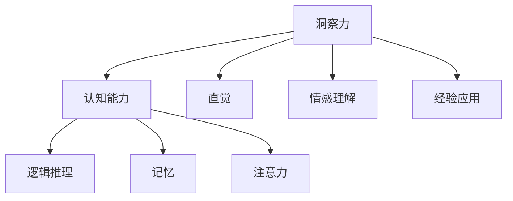

                 

# 人类知识的传承与发展：洞察力的重要作用

## 关键词
- 洞察力
- 知识传承
- 知识发展
- 教育改革
- 社会文化

## 摘要
本文旨在探讨洞察力在人类知识传承与发展中的重要作用。通过详细分析洞察力的定义、分类、发展历程及其在知识传承机制中的关键作用，我们揭示了洞察力对于知识创新、传播和普及的深远影响。文章随后深入探讨了洞察力在知识创造、科学研究、新兴技术和公众科学素养等方面的应用，并提出了当前洞察力发展的现状与问题。基于此，文章提出了一系列对策与建议，旨在推动洞察力在知识传承与发展中的进一步发展。最后，文章展望了洞察力发展的未来趋势，并提出了战略建议，以期为我国在知识经济时代取得更大的发展提供理论参考。

### 第一部分：人类知识的传承与发展基础

#### 第1章：洞察力概述

##### 1.1 洞察力的定义与重要性

###### 1.1.1 洞察力的基本概念

洞察力（Insight）是一种深层次的理解能力，它允许个体在复杂的信息背景下识别模式和关联，从而实现快速而准确的决策和问题解决。根据心理学家的研究，洞察力不仅是一种认知能力，还涉及到情感、直觉和经验等多个方面。

首先，让我们通过一个Mermaid流程图来梳理洞察力与相关认知能力之间的联系：

在这个流程图中，我们可以看到洞察力（A）作为一种高级认知能力，与直觉（C）、情感理解（D）和经验应用（E）密切相关。同时，它也依赖于基础认知能力，如逻辑推理（F）、记忆（G）和注意力（H）。

###### 1.1.2 洞察力的重要性

洞察力的重要性体现在多个方面。首先，它对于知识的创新和创造至关重要。通过洞察力，个体能够发现新的模式、关联和解决方案，从而推动知识的发展。例如，在科学研究中，洞察力帮助科学家提出新的假设、设计实验，并最终取得重大突破。

其次，洞察力对于问题的解决和决策制定具有关键作用。在面对复杂的问题时，洞察力使得个体能够迅速识别问题的本质，从而找到最有效的解决方案。这种能力在商业决策、技术创新和公共政策制定等领域尤为重要。

此外，洞察力也是个体成长和发展的核心因素。通过不断培养洞察力，个体能够更好地理解世界，提高自己的认知水平和适应能力。这有助于个体在职业生涯中取得更大的成功，并为社会的发展做出更大的贡献。

###### 1.1.3 洞察力与其他认知能力的联系

洞察力与其他认知能力之间存在着密切的联系。例如，逻辑推理和记忆是洞察力的基础，而直觉和情感理解则为洞察力的应用提供了重要的支持。

在逻辑推理方面，洞察力能够帮助个体在复杂的信息中识别逻辑关系和结构，从而实现有效的推理和判断。记忆则提供了丰富的信息背景，使得个体能够更好地理解当前的问题和情境。

直觉和情感理解则为洞察力的应用提供了方向和动力。通过直觉，个体能够迅速感知到问题的潜在解决方案，而情感理解则帮助个体判断这些解决方案的可行性和合理性。

总之，洞察力作为一种高级认知能力，它在知识的传承与发展中发挥着不可替代的作用。通过深入理解洞察力的定义、分类和发展历程，我们能够更好地认识到其在人类知识传承与发展中的重要性。

##### 1.2 洞察力的分类与特征

###### 1.2.1 情感洞察力

情感洞察力是指个体对情感的理解和感知能力。它不仅涉及情感的识别，还包括对情感原因、情感表达和情感影响的深入理解。情感洞察力在人类交往、沟通和人际关系中起着至关重要的作用。

首先，情感洞察力有助于建立良好的人际关系。通过理解他人的情感，个体能够更好地与他人沟通，减少误解和冲突。这有助于形成和谐的社会环境。

其次，情感洞察力对于自我认知和发展也具有重要意义。通过反思自己的情感体验，个体能够更好地理解自己的需求和动机，从而实现个人成长和自我提升。

最后，情感洞察力在心理健康和情感调节方面具有重要作用。它有助于个体识别和应对自己的情绪问题，提高情绪调节能力，从而保持心理健康。

在情感洞察力的培养方面，可以通过以下方法进行：

1. **提高情感意识**：通过反思自己的情感体验，提高对情感的敏感度和意识。
2. **加强情感交流**：与他人进行积极的情感交流，倾听和理解他人的情感表达。
3. **情感教育**：通过情感教育课程和培训，提高个体的情感识别和表达能力。

通过以上方法，个体能够逐步提升情感洞察力，从而在人际交往、自我认知和情感调节等方面取得更好的效果。

###### 1.2.2 意识洞察力

意识洞察力是指个体对自己内心体验的觉察和理解能力。它包括对意识内容、意识状态和意识功能的深入认识。意识洞察力在个体的心理发展、自我认知和心理健康方面具有重要作用。

首先，意识洞察力有助于提高个体的自我认知。通过深入理解自己的内心体验，个体能够更好地认识自己的需求、动机和价值观，从而实现自我提升和自我实现。

其次，意识洞察力对于心理健康和情感调节具有重要意义。通过觉察和理解自己的内心体验，个体能够更好地识别和应对自己的情绪问题，提高情绪调节能力，从而保持心理健康。

最后，意识洞察力在心理治疗和心理咨询中也具有重要作用。通过提升个体的意识洞察力，心理咨询师能够更好地帮助个体解决心理问题，提高心理健康水平。

在意识洞察力的培养方面，可以通过以下方法进行：

1. **冥想和内观**：通过冥想和内观练习，提高个体对自己内心体验的觉察和理解。
2. **心理教育**：通过心理教育和培训，提高个体对意识内容的认识和觉察。
3. **心理咨询**：通过专业的心理咨询，帮助个体提升意识洞察力，解决心理问题。

通过以上方法，个体能够逐步提升意识洞察力，从而在自我认知、心理健康和心理咨询等方面取得更好的效果。

###### 1.2.3 创造性洞察力

创造性洞察力是指个体在创造性思维和创新过程中所表现出的洞察力。它包括对问题的新颖理解、创新性解决方案的识别和创造能力。创造性洞察力在科学创新、艺术创作和商业发展等领域具有重要作用。

首先，创造性洞察力是科学创新的重要驱动力。通过创造性洞察力，科学家能够提出新的假设、设计创新的实验方案，并最终取得重大科学突破。

其次，创造性洞察力在艺术创作中发挥着关键作用。艺术家通过创造性洞察力，能够发掘独特的视觉语言和表达方式，创作出具有深刻内涵和艺术价值的作品。

最后，创造性洞察力在商业发展中具有重要应用。企业家通过创造性洞察力，能够发现市场机会、设计创新的商业模式，并在激烈的市场竞争中脱颖而出。

在创造性洞察力的培养方面，可以通过以下方法进行：

1. **思维训练**：通过思维训练和创造性思维技巧的培养，提高个体的创造性洞察力。
2. **跨学科学习**：通过跨学科学习，拓宽知识视野，激发创造性思维。
3. **实践锻炼**：通过实际项目和实践，锻炼创造性洞察力，提高创新能力。

通过以上方法，个体能够逐步提升创造性洞察力，从而在科学创新、艺术创作和商业发展等方面取得更好的效果。

###### 1.2.4 系统性洞察力

系统性洞察力是指个体对复杂系统、整体和关系的理解和分析能力。它包括对系统结构、系统动态和系统相互作用的深入认识。系统性洞察力在系统科学、复杂性研究和跨领域问题解决中具有重要作用。

首先，系统性洞察力有助于理解和分析复杂系统。通过系统性洞察力，个体能够识别系统的关键组成部分、理解系统的动态变化和预测系统的未来发展趋势。

其次，系统性洞察力在跨领域问题解决中具有重要意义。在面对跨学科、跨领域的问题时，系统性洞察力能够帮助个体从整体角度理解和分析问题，提出创新的解决方案。

最后，系统性洞察力在决策制定和战略规划中具有重要作用。通过系统性洞察力，个体能够全面考虑各种因素，制定出更科学、更有效的决策和战略。

在系统性洞察力的培养方面，可以通过以下方法进行：

1. **系统学习**：通过系统学习和跨学科研究，提高个体的系统性洞察力。
2. **案例研究**：通过案例研究和实际项目，锻炼个体的系统性洞察力。
3. **思维模型**：通过构建和应用思维模型，提高个体的系统性洞察力。

通过以上方法，个体能够逐步提升系统性洞察力，从而在复杂系统分析、跨领域问题解决和决策制定等方面取得更好的效果。

##### 1.3 洞察力的发展历程

###### 1.3.1 历史背景

洞察力作为一种重要的认知能力，其发展历程可以追溯到古代。在古希腊时期，苏格拉底和柏拉图等哲学家就已经开始探讨认知和思维的问题。亚里士多德更是提出了逻辑学，为后续的洞察力研究奠定了基础。

中世纪时期，宗教神学成为主导认知发展的力量。在这一时期，人们主要通过信仰和教义来理解世界，洞察力的发展受到一定的限制。

直到文艺复兴时期，人类开始重新发现和重视理性思维。达芬奇等艺术家和科学家通过实验和观察，推动了人类对自然世界的理解，洞察力逐渐得到重视和发展。

在现代，随着心理学、认知科学和人工智能等学科的兴起，洞察力研究进入了一个新的阶段。心理学家开始对洞察力的机制、分类和发展进行深入研究，揭示了洞察力在认知过程和问题解决中的重要作用。

###### 1.3.2 知识经济与洞察力的发展

知识经济时代的到来，使得洞察力成为经济发展的重要驱动力。在这一背景下，各国政府和学术界开始高度重视洞察力的培养和发展。

首先，教育体系开始进行改革，注重培养学生的洞察力。通过跨学科教育、创新思维训练和实际项目实践，学生能够在学习过程中不断提升自己的洞察力。

其次，企业也开始重视洞察力在创新和决策中的作用。通过内部培训和外部合作，企业不断提升员工的洞察力，以应对日益复杂的市场环境。

此外，政府和社会组织也积极参与洞察力的发展。通过政策支持、资金投入和公众教育，政府和社会组织共同推动洞察力在社会各领域的应用和发展。

知识经济与洞察力的发展相辅相成，共同推动了人类社会的进步和发展。

###### 1.3.3 洞察力研究的最新进展

近年来，洞察力研究在学术界和工业界都取得了显著的进展。以下是一些重要的研究成果和发展趋势：

1. **心理学研究**：心理学家通过对大量实验数据的分析，揭示了洞察力的发展机制和影响因素。例如，研究发现，个体在面临复杂问题时，通过认知转换和模式识别，能够实现从表面信息到深层理解的转变。

2. **认知科学研究**：认知科学家通过对大脑结构和功能的研究，揭示了洞察力与大脑各个区域之间的联系。例如，研究发现，前额叶和顶叶皮层在洞察力中起着关键作用。

3. **人工智能研究**：人工智能领域的突破，使得计算机在洞察力方面也取得了显著进展。通过深度学习和神经网络技术，计算机能够模拟人类的洞察力，实现复杂的模式识别和问题解决。

4. **跨学科研究**：随着学科交叉融合的加剧，跨学科研究成为洞察力发展的重要趋势。例如，社会科学、自然科学和工程技术等领域的研究人员共同探讨洞察力在各自领域的应用和意义。

总之，洞察力研究在多个领域取得了重要进展，为人类知识的传承和发展提供了有力的支持。

### 第二部分：洞察力在知识发展中的作用

#### 第3章：洞察力在知识创造中的应用

##### 3.1 洞察力与知识创新

在知识创新过程中，洞察力起着至关重要的作用。洞察力不仅能够帮助个体发现新的知识领域，还能够推动知识的深化和发展。以下是洞察力在知识创新中应用的几个关键方面：

###### 3.1.1 洞察力在知识创新中的作用

首先，洞察力是知识创新的前提。在面对复杂的问题和情境时，只有具备洞察力的个体才能快速识别关键信息，把握问题的本质，从而提出新的观点和解决方案。例如，在科学研究领域，科学家通过洞察力发现了新的科学现象，提出了新的假设和理论，推动了科学知识的进步。

其次，洞察力是知识创新的核心。在知识创新过程中，个体需要运用自己的洞察力对现有知识进行深度分析和综合，从而发现新的关联和规律。这种关联和规律往往能够引领知识的发展方向，推动新知识的产生。

最后，洞察力是知识创新的动力。在知识经济时代，创新已经成为驱动经济发展的关键因素。而洞察力作为一种高级认知能力，能够激发个体的创新思维，推动知识的创新和创造。例如，企业家通过洞察力发现了市场需求和商机，从而创造出了新的商业模式和产品，推动了商业的发展。

###### 3.1.2 创新思维与洞察力的关系

创新思维与洞察力密切相关。创新思维是指个体在面对问题时，能够跳出传统思维模式，采用新颖独特的方法进行思考和解决问题的能力。而洞察力则是创新思维的基础，它为创新思维提供了深刻的认知和洞察。

首先，洞察力能够激发创新思维。通过洞察力，个体能够发现问题的本质和内在关联，从而提出新的观点和解决方案。例如，在技术创新过程中，工程师通过洞察力发现了现有产品的不足和改进空间，从而提出了创新的解决方案。

其次，创新思维能够提升洞察力。在创新思维的过程中，个体需要不断进行假设和验证，这种过程有助于个体提升自己的洞察力。例如，在科学研究中，科学家通过反复的实验和验证，不断深入理解研究对象的特性，从而提升自己的洞察力。

总之，创新思维与洞察力相互促进，共同推动知识的创新和创造。

###### 3.1.3 创新过程与洞察力的互动

在创新过程中，洞察力与各个阶段都紧密相关。以下是洞察力在创新过程中的具体应用：

1. **需求识别阶段**：在创新过程中，首先需要识别用户需求和市场机会。通过洞察力，个体能够快速识别潜在的需求和市场机会，从而为创新奠定基础。

2. **问题分析阶段**：在需求识别后，需要对问题进行深入分析。洞察力能够帮助个体识别问题的本质和关键因素，从而提出有效的解决方案。

3. **方案设计阶段**：在分析问题后，需要设计创新的解决方案。洞察力能够激发创新思维，帮助个体提出新颖独特的解决方案。

4. **方案验证阶段**：在方案设计完成后，需要进行验证和优化。洞察力能够帮助个体识别方案的不足和改进空间，从而提升方案的创新性和可行性。

通过以上各阶段的互动，洞察力在创新过程中发挥着至关重要的作用，推动知识的创新和创造。

##### 3.2 洞察力与前沿科学研究

在科学研究中，洞察力不仅是一种重要的认知能力，还是推动科学进步的关键因素。以下从几个方面探讨洞察力在科学研究中的应用和重要性。

###### 3.2.1 洞察力在科学研究中的应用

首先，洞察力在科学研究的选题和假设阶段具有重要作用。科学家在开展研究之前，需要通过洞察力识别科学问题的重要性和研究的可行性。通过深入分析现有文献和实验数据，科学家能够发现科学领域中的关键问题和未解之谜，从而提出具有创新性的研究课题。

例如，在物理学领域，爱因斯坦通过洞察力发现了引力与时空的关系，提出了广义相对论，颠覆了经典物理学的观念。这一研究课题的成功，离不开爱因斯坦对复杂物理现象的深刻洞察。

其次，洞察力在科学研究的实验设计和数据分析中同样重要。在实验过程中，科学家需要通过洞察力设计合理的实验方案，控制变量，确保实验结果的可靠性。同时，在数据分析阶段，科学家需要运用洞察力识别数据中的潜在模式和关联，从而得出有意义的科学结论。

例如，在生物学领域，克里克和沃森通过洞察力分析了蛋白质的X射线晶体学数据，揭示了DNA的双螺旋结构。这一发现不仅为分子生物学奠定了基础，也为医学和生物学研究提供了重要的启示。

###### 3.2.2 前沿科学研究的挑战与机遇

前沿科学研究面临着诸多挑战和机遇。一方面，前沿科学领域往往涉及到复杂和未知的科学问题，这要求科学家具备强大的洞察力，以识别问题的本质和解决路径。另一方面，随着科技的快速发展，新的实验手段和技术工具不断涌现，为科学家提供了更多的研究手段和工具，有助于提升洞察力在科学研究中的应用效果。

挑战方面，前沿科学研究需要科学家具备跨学科的知识和技能，以应对复杂的研究问题。此外，科学研究的资金、设备和技术支持也是影响洞察力发挥的关键因素。

机遇方面，随着大数据、人工智能和量子计算等新兴技术的发展，科学家能够利用这些技术手段，提升对复杂科学问题的理解和解决能力。例如，大数据分析技术可以帮助科学家从海量数据中发现潜在的模式和关联，从而提升洞察力在数据分析中的应用。

总之，前沿科学研究的挑战与机遇并存，洞察力在其中发挥着关键作用。科学家需要不断培养和提高自己的洞察力，以应对前沿科学研究的各种挑战，抓住机遇，推动科学进步。

###### 3.2.3 洞察力在科学发现中的重要性

洞察力在科学发现中具有不可替代的重要性。首先，洞察力能够帮助科学家识别科学问题的本质，提出具有创新性的研究课题。通过深入分析现有文献和实验数据，科学家能够发现科学领域中的关键问题和未解之谜，从而推动科学研究的深入发展。

例如，在物理学领域，牛顿通过洞察力发现了万有引力定律，揭示了天体运动的规律。这一发现不仅为物理学奠定了基础，也为天文学和工程学提供了重要的理论支持。

其次，洞察力在科学发现中能够激发科学家的创新思维，推动科学理论的突破。通过洞察力，科学家能够从不同角度审视问题，发现新的研究方法和途径。例如，在生物学领域，克里克和沃森通过洞察力揭示了DNA的双螺旋结构，这一发现为分子生物学和遗传学的研究打开了新的视野。

最后，洞察力在科学发现中还能够帮助科学家应对复杂的研究问题。在面对复杂科学现象时，科学家需要运用洞察力进行深度分析和综合，从而提出有针对性的解决方案。例如，在量子物理学领域，科学家通过洞察力揭示了量子纠缠和量子计算的本质，推动了量子信息科学的发展。

总之，洞察力在科学发现中具有至关重要的作用。科学家需要不断培养和提高自己的洞察力，以推动科学研究的深入发展和科学理论的创新。

##### 3.3 洞察力与新兴技术

在新兴技术的发展过程中，洞察力发挥着关键作用。以下从几个方面探讨洞察力在新兴技术中的应用和重要性。

###### 3.3.1 洞察力在新兴技术发展中的应用

首先，洞察力在新兴技术的发现和识别中具有重要作用。在新兴技术领域，新的技术和应用不断涌现，而洞察力能够帮助科学家、工程师和企业家识别这些技术和应用的关键特征和潜在价值。例如，在人工智能领域，通过洞察力，研究人员能够发现深度学习、神经网络和强化学习等技术的本质和优势，从而推动这些技术的快速发展。

其次，洞察力在新兴技术的创新和应用中同样重要。在新兴技术的研究和开发过程中，科学家和工程师需要运用洞察力识别技术中的关键问题和解决方案。例如，在量子计算领域，通过洞察力，研究人员能够发现量子比特、量子纠缠和量子 gates 等技术的重要性和应用前景，从而推动量子计算的发展。

此外，洞察力在新兴技术的推广和普及中也具有重要作用。在新兴技术从实验室走向市场和应用的过程中，洞察力能够帮助企业识别市场需求、制定商业战略和推广策略。例如，在区块链领域，通过洞察力，企业能够发现区块链技术的潜在应用场景和商业模式，从而推动区块链技术的普及和应用。

###### 3.3.2 新兴技术的发展趋势与挑战

新兴技术的发展趋势和挑战是影响洞察力应用的重要因素。以下从几个方面探讨新兴技术的发展趋势和挑战：

1. **技术创新趋势**：新兴技术的发展趋势主要表现在技术创新和融合方面。随着大数据、人工智能、区块链和量子计算等技术的快速发展，这些技术不断相互融合，形成新的应用场景和商业模式。例如，人工智能与区块链的结合，为智能合约和去中心化应用提供了新的解决方案。

2. **技术挑战**：新兴技术的发展也面临着诸多挑战。首先，技术成熟度问题仍然存在。例如，量子计算虽然在理论上有很大的潜力，但在实际应用中仍然面临硬件、软件和算法等多方面的挑战。其次，技术标准和规范尚未完善。在新兴技术领域，缺乏统一的技术标准和规范，导致技术和应用之间的兼容性和互操作性不足。

3. **社会挑战**：新兴技术的发展也带来了社会挑战。首先，新兴技术可能带来就业结构的变化和社会阶层的分化。例如，人工智能和自动化技术的发展可能导致部分岗位的消失和低技能劳动者的失业。其次，新兴技术可能带来隐私和安全问题。例如，大数据和区块链技术的应用可能涉及个人隐私和数据安全问题，需要加强保护和管理。

总之，洞察力在新兴技术发展中具有重要作用。通过洞察力，科学家、工程师和企业家能够更好地识别技术趋势、应对技术挑战和社会挑战，推动新兴技术的创新和应用。

###### 3.3.3 洞察力在新兴技术中的创新角色

洞察力在新兴技术中的创新角色至关重要。首先，洞察力能够帮助个体预见新兴技术的发展方向和潜力。在人工智能、区块链、量子计算等新兴技术领域，洞察力使得科学家、工程师和企业家能够发现技术的潜在应用场景和商业模式，从而推动技术的创新和产业化。

例如，在人工智能领域，通过洞察力，研究人员能够预见深度学习、神经网络和强化学习等技术的广泛应用，从而推动这些技术的快速发展。这些技术的创新不仅为人工智能领域带来了巨大的进步，也为其他行业提供了新的解决方案。

其次，洞察力在新兴技术的研发和优化中具有重要作用。在新兴技术的研发过程中，洞察力能够帮助研究人员识别关键问题和瓶颈，并提出创新的解决方案。例如，在量子计算领域，通过洞察力，研究人员能够发现量子比特、量子纠缠和量子 gates 等关键技术的重要性，从而推动量子计算的研发和优化。

最后，洞察力在新兴技术的推广和应用中同样重要。在新兴技术从实验室走向市场和应用的过程中，洞察力能够帮助企业和企业家识别市场需求、制定商业战略和推广策略。例如，在区块链领域，通过洞察力，企业能够发现区块链技术在供应链管理、金融和医疗等领域的应用潜力，从而推动区块链技术的普及和应用。

总之，洞察力在新兴技术中的创新角色至关重要。通过洞察力，科学家、工程师和企业家能够更好地预见新兴技术的发展方向、应对技术挑战和社会挑战，推动新兴技术的创新和应用。

### 第三部分：洞察力在知识传播与普及中的角色

#### 第4章：洞察力在知识传播与普及中的应用

##### 4.1 洞察力与知识传播

在知识传播与普及过程中，洞察力发挥着关键作用。它不仅影响个体对知识的理解和吸收，还决定了知识能否有效地传递给更广泛的受众。以下是洞察力在知识传播中的应用和重要性。

###### 4.1.1 洞察力在知识传播中的作用

首先，洞察力有助于个体理解和消化知识。在面对复杂的概念和理论时，具备洞察力的个体能够迅速识别关键信息，理解知识的本质。例如，在科学教育中，教师通过洞察力能够将抽象的科学概念转化为易于理解的形式，使学生更好地掌握科学知识。

其次，洞察力促进知识的传播和共享。在知识传播过程中，洞察力使得个体能够发现知识的潜在价值和适用场景，从而推动知识的传播和共享。例如，在科研领域，科学家通过洞察力识别研究的成果和应用前景，促进科研成果的转化和推广。

最后，洞察力有助于提高公众的科学素养。通过洞察力，公众能够更好地理解科学知识和科学技术，从而提高科学素养。例如，在科普活动中，科普工作者通过洞察力设计生动有趣的科普内容，使公众更容易理解和接受科学知识。

###### 4.1.2 知识传播的障碍与解决方案

尽管洞察力在知识传播中具有重要作用，但知识传播过程中仍存在一些障碍。以下分析这些障碍并提出相应的解决方案：

1. **语言障碍**：科学术语和技术词汇常常导致知识传播的障碍。解决这一问题的方法是简化语言，使用通俗易懂的表达方式。例如，科普文章和讲座可以采用图表、实例和类比等手段，使复杂概念更易于理解。

2. **文化差异**：不同文化背景下的人们对知识的理解和接受程度可能存在差异。解决这一问题的方法是跨文化交流和本土化传播。例如，科普内容可以根据目标受众的文化背景进行适当调整，以适应不同文化环境。

3. **信息过载**：在信息爆炸的时代，个体面临着大量信息的挑战。解决这一问题的方法是筛选和整合知识，提供有价值的信息。例如，教育机构和媒体可以开发知识梳理和摘要工具，帮助受众快速获取关键信息。

4. **社会认知**：社会认知水平和教育背景的差异也可能影响知识传播。解决这一问题的方法是提高教育水平和普及科学知识。例如，政府和社会组织可以加大对科普教育的投入，提高公众的科学素养。

通过以上解决方案，可以克服知识传播中的障碍，促进知识的传播与普及。

###### 4.1.3 洞察力在知识传播中的实践案例

在实际的知识传播过程中，洞察力发挥着重要作用。以下通过一些实践案例来说明洞察力在知识传播中的应用和效果。

1. **科学传播**：科学家通过洞察力识别科学研究的成果和应用价值，将复杂的科研成果转化为通俗易懂的科普内容。例如，霍金的《时间简史》通过简洁明了的语言和生动的插图，使广大读者能够理解宇宙和黑洞的奥秘。

2. **技术传播**：工程师和技术专家通过洞察力识别技术的应用场景和市场需求，推动新技术的普及和应用。例如，苹果公司通过洞察力将复杂的技术和创新产品转化为大众消费者易于接受的形式，推动了智能手机的普及。

3. **教育传播**：教育工作者通过洞察力设计教学方法和内容，提高学生的学习效果。例如，翻转课堂和项目式学习等教学模式的兴起，正是教育工作者运用洞察力对传统教学方法的创新和改进。

4. **公共传播**：媒体和传播机构通过洞察力识别公众的兴趣和需求，提供有价值的信息和内容。例如，新闻媒体通过洞察力报道社会热点和公众关心的问题，提高公众的科学素养和参与度。

通过以上实践案例，我们可以看到洞察力在知识传播中的广泛应用和显著效果。通过不断培养和提高洞察力，我们可以更好地促进知识的传播与普及，推动社会的进步和发展。

##### 4.2 洞察力与公众科学素养

在提升公众科学素养的过程中，洞察力发挥着至关重要的作用。公众科学素养不仅关乎个体的认知能力和生活质量，还影响到整个社会的创新能力和科技发展。以下从几个方面探讨洞察力在提升公众科学素养中的作用。

###### 4.2.1 公众科学素养的重要性

公众科学素养是指公众对科学知识和科学方法的了解和掌握程度，以及运用科学思维解决实际问题的能力。提升公众科学素养具有重要意义：

首先，公众科学素养有助于个体更好地理解和应对现代科技带来的挑战和变化。在信息技术、生物技术和新能源技术等领域，公众需要具备一定的科学素养，以便更好地理解技术原理、潜在风险和伦理问题。

其次，公众科学素养是培养创新型人才的基础。具备科学素养的公众能够积极参与科技创新和创业活动，推动科技进步和经济发展。

最后，公众科学素养有助于构建和谐社会。通过科学素养的提升，公众能够增强对科学技术的信任和理解，减少科学与社会的冲突，促进科学知识的传播和应用。

###### 4.2.2 洞察力在提升公众科学素养中的作用

洞察力在提升公众科学素养中具有重要作用，主要表现在以下几个方面：

1. **识别科学问题**：具备洞察力的公众能够识别和关注社会中的科学问题，提高对社会问题的科学理解和分析能力。例如，在面对环境污染、气候变化和能源危机等挑战时，公众通过洞察力能够识别问题的根源和解决方案，提出科学合理的建议。

2. **理解科学原理**：洞察力有助于公众理解和掌握科学原理。通过洞察力，公众能够从复杂的信息中提炼出关键的科学概念和原理，从而更好地理解和应用科学知识。例如，在了解人工智能、基因编辑和区块链等新兴技术时，具备洞察力的公众能够深入理解技术的原理和应用，从而做出更明智的判断。

3. **科学决策**：洞察力有助于公众在日常生活中做出科学决策。通过洞察力，公众能够识别和评估科技产品和服务中的科学问题，提高消费决策的科学性。例如，在购买电子产品、食品和药品时，具备洞察力的消费者能够识别产品中的潜在风险，做出更明智的选择。

4. **科学参与**：洞察力鼓励公众积极参与科学研究和创新活动。通过洞察力，公众能够理解和参与到科学项目的讨论和决策中，提高科学研究的透明度和公正性。例如，在参与科学项目时，具备洞察力的公众能够提出有建设性的意见和建议，推动科学研究的进展。

总之，洞察力在提升公众科学素养中具有重要作用。通过培养和提升洞察力，我们可以提高公众的科学素养，促进科技与社会的和谐发展。

###### 4.2.3 科学传播与公共教育的互动

科学传播与公共教育在提升公众科学素养方面具有密切的互动关系。科学传播是公共教育的重要组成部分，通过有效的科学传播活动，可以增强公众对科学知识的理解和应用能力。以下从几个方面探讨科学传播与公共教育的互动：

1. **内容共享**：科学传播与公共教育在内容上具有共享性。科学传播的内容通常来自于公共教育中的科学课程和研究成果，通过科学传播活动，这些内容能够更广泛地传播给公众。例如，科学期刊、科普书籍和媒体报道等科学传播形式，都是公共教育内容的延伸和扩展。

2. **目标一致**：科学传播与公共教育的目标是一致的，即提升公众的科学素养。科学传播通过丰富多样的形式和渠道，将科学知识传递给公众，使公众能够更好地理解和应用科学知识。公共教育则通过课堂教学、实验和实践等方式，系统地培养学生的科学素养。

3. **互补优势**：科学传播与公共教育在提升公众科学素养方面具有互补优势。科学传播能够迅速、广泛地传递科学知识和信息，激发公众对科学的兴趣和关注。公共教育则能够提供系统、深入的科学教育，培养学生的科学思维和创新能力。二者相结合，可以更有效地提升公众的科学素养。

4. **互动促进**：科学传播与公共教育之间的互动能够促进双方的提升和发展。科学传播活动可以为公共教育提供丰富的教学资源和案例，激发学生的学习兴趣和动力。公共教育则为科学传播提供专业的科学知识和理论基础，提高科学传播的质量和效果。

总之，科学传播与公共教育在提升公众科学素养方面具有密切的互动关系。通过加强双方的互动和合作，我们可以更有效地提升公众的科学素养，推动科学与社会的发展。

##### 4.3 洞察力与知识共享

在知识共享过程中，洞察力扮演着至关重要的角色。它不仅影响个体获取和利用知识的效率，还决定了知识能否在更广泛的范围内传播和共享。以下从几个方面探讨洞察力在知识共享中的作用和影响。

###### 4.3.1 知识共享的概念与模式

知识共享是指个体或组织通过交流、合作和协作等方式，将知识和信息传递给他人，从而实现知识的扩散和增值。知识共享的模式多种多样，包括：

1. **正式知识共享**：通过正式的组织结构和流程，如企业内部的培训、会议和报告等，实现知识的传播和共享。例如，公司内部的培训项目和技术交流会议，可以帮助员工掌握新知识和技能。

2. **非正式知识共享**：通过非正式的社交和网络，如同事间的讨论、邮件列表和专业社群等，实现知识的传播和共享。例如，专业社群中的讨论和分享活动，可以帮助成员快速获取行业动态和前沿知识。

3. **线上知识共享**：通过互联网和数字技术，如在线课程、社交媒体和知识共享平台等，实现知识的传播和共享。例如，在线教育平台上的课程和讨论区，可以帮助学习者获取和交流知识。

4. **跨组织知识共享**：通过跨组织的合作和协作，如企业间的合作项目、科研合作和政府与社会组织的合作等，实现知识的传播和共享。例如，科研合作项目中的信息交流和资源共享，可以促进科研成果的转化和应用。

知识共享的目标是提高知识的利用效率和创新能力，实现知识的最大价值。洞察力在知识共享中发挥着关键作用，它不仅影响个体获取和利用知识的效率，还决定知识能否在更广泛的范围内传播和共享。

###### 4.3.2 洞察力在知识共享中的关键作用

1. **识别知识需求**：洞察力有助于个体识别和发现知识需求。在知识共享过程中，个体需要了解他人的需求和问题，从而有针对性地提供知识和信息。具备洞察力的个体能够快速识别他人的需求，提供更有针对性的知识和服务。

2. **挖掘知识价值**：洞察力有助于挖掘知识的潜在价值。在知识共享过程中，个体需要从大量信息中筛选和识别有价值的信息，并将其转化为实际应用。具备洞察力的个体能够从不同角度分析和评估信息，发现知识的潜在价值，从而实现知识的创新和应用。

3. **促进知识传播**：洞察力有助于促进知识的传播和扩散。在知识共享过程中，个体需要有效地将知识传递给他人，使其在更广泛的范围内传播和应用。具备洞察力的个体能够发现知识传播的路径和渠道，运用有效的传播策略，提高知识传播的效果和范围。

4. **优化知识利用**：洞察力有助于优化知识的利用效率。在知识共享过程中，个体需要有效地利用已有的知识资源，提高知识的应用效果。具备洞察力的个体能够从不同角度分析和评估知识，发现知识的应用场景和优化方案，从而实现知识的最大化利用。

总之，洞察力在知识共享中具有关键作用。通过培养和提升洞察力，个体能够更有效地识别知识需求、挖掘知识价值、促进知识传播和优化知识利用，从而推动知识共享和创新发展。

###### 4.3.3 知识共享平台的现状与未来趋势

知识共享平台是现代信息技术和互联网发展的产物，为知识的传播和共享提供了便捷的渠道和工具。以下从几个方面探讨知识共享平台的现状和未来趋势。

1. **现状**：当前，知识共享平台已经广泛应用于各个领域，涵盖了教育、科研、企业、政府等多个方面。主要的平台包括在线学习平台、科研合作平台、企业知识管理平台等。这些平台通过互联网和数字技术，实现了知识的存储、传播和共享，提高了知识的利用效率和创新能力。

2. **发展趋势**：未来，知识共享平台将朝着智能化、开放化和协同化的方向发展。

   - **智能化**：随着人工智能技术的不断发展，知识共享平台将实现更智能的知识管理和推荐。通过自然语言处理、机器学习和数据分析等技术，平台能够自动识别用户需求，推荐相关知识和资源，提高用户的知识获取效率。
   
   - **开放化**：知识共享平台将更加开放和互联，实现跨平台和跨领域的信息共享。通过建立统一的开放标准和技术接口，平台之间可以实现数据交换和资源共享，打破信息孤岛，提高知识的整体利用效率。
   
   - **协同化**：知识共享平台将促进个体和组织的协同创新，实现知识共创和共享。通过构建开放的协作环境，平台可以支持跨组织、跨领域的合作，推动知识创新和产业升级。

3. **挑战与机遇**：在知识共享平台的发展过程中，仍面临一些挑战和机遇。

   - **挑战**：首先，知识共享平台需要解决信息过载和数据质量问题，确保用户能够获取到有价值的信息。其次，平台需要应对数据隐私和安全问题，保护用户的数据安全和隐私。最后，平台需要应对知识产权保护问题，确保知识共享的合法性和公平性。
   
   - **机遇**：知识共享平台的发展带来了巨大的机遇。首先，它有助于提高公众的科学素养和创新能力，推动社会的进步和发展。其次，它为企业和组织提供了新的商业模式和创新机会，促进了知识经济的快速发展。

总之，知识共享平台在知识传播和共享中具有重要作用。通过不断优化和创新，知识共享平台将更好地满足用户需求，推动知识的传播和共享，为人类社会的进步和发展做出更大贡献。

### 第三部分：洞察力在知识传承中的挑战与未来

#### 第5章：洞察力发展的现状与问题

##### 5.1 洞察力发展的现状

洞察力作为一种高级认知能力，在全球范围内得到了广泛的关注和研究。目前，洞察力发展呈现以下几个方面的现状：

首先，教育体系开始重视洞察力的培养。许多国家和地区已经将洞察力作为教育目标之一，纳入到各级教育体系中。通过课程设置、教学方法和实践项目，教育体系逐步培养学生的洞察力，提高学生的认知水平和创新能力。

其次，科研领域对洞察力进行了深入的研究。心理学家、认知科学家和人工智能研究者等众多学科领域的专家，致力于探索洞察力的机制、分类和发展规律。这些研究成果为洞察力的培养和应用提供了理论基础和实践指导。

此外，社会各界对洞察力的重要性和价值有了更深刻的认识。政府、企业和社会组织纷纷采取措施，鼓励和推动洞察力的发展。通过政策支持、资金投入和公众教育，社会各界共同促进洞察力的培养和应用，为人类社会的进步和发展做出贡献。

##### 5.2 洞察力发展的主要问题

尽管洞察力在全球范围内得到了广泛重视，但在实际发展中仍存在一些问题，制约了洞察力的进一步提升和应用。以下是洞察力发展的主要问题：

1. **教育体系中的洞察力培养不足**：目前，许多教育体系仍然侧重于知识的传授和技能的培训，忽视了对洞察力的培养。教育内容和方法较为单一，难以激发学生的创新思维和洞察力。此外，教师队伍中具备洞察力培养能力和经验的教师相对较少，影响了洞察力教育的质量和效果。

2. **社会文化环境对洞察力发展的制约**：社会文化环境对洞察力的发展具有重要影响。在一些文化背景下，对创新和不同观点的容忍度较低，可能导致个体不敢表达自己的见解，限制了洞察力的发展。此外，社会竞争压力较大，个体可能过于注重功利性和短期利益，忽视了洞察力的培养和提升。

3. **科技进步对洞察力发展的影响**：随着科技的快速发展，新兴技术和应用不断涌现，为洞察力的发展提供了新的机遇和挑战。然而，科技的发展也带来了信息过载、数据隐私和安全等问题，可能对个体的洞察力产生负面影响。例如，过度依赖互联网和智能设备可能导致个体对信息的筛选和处理能力下降，影响洞察力的发挥。

##### 5.3 洞察力发展的对策与建议

针对洞察力发展的现状和问题，提出以下对策与建议：

1. **教育体系改革**：加强洞察力培养，将洞察力作为教育目标之一，纳入到各级教育体系中。改革课程设置和教学方法，注重培养学生的创新思维和洞察力。通过跨学科教育、实践项目和校外活动等方式，激发学生的兴趣和潜能，提高学生的洞察力水平。

2. **社会文化建设**：营造有利于洞察力发展的社会文化环境，倡导创新、包容和多元化的价值观。加强公众教育，提高公众对洞察力重要性的认识，激发个体对知识创新的兴趣和热情。同时，减少社会竞争压力，鼓励个体追求长期价值和内在成长，为洞察力的发展创造有利条件。

3. **科技支持**：利用科技手段提高洞察力的发展和应用效果。通过大数据、人工智能和互联网等技术，开发智能化的洞察力培养工具和平台，为个体和组织的洞察力发展提供支持。同时，加强科技伦理教育，引导个体合理使用科技手段，保护数据隐私和安全，促进科技与社会的和谐发展。

总之，通过教育体系改革、社会文化建设和科技支持等多方面的努力，可以进一步推动洞察力的发展，为人类社会的进步和创新做出更大的贡献。

##### 5.4 教育体系改革

要推动洞察力的发展，教育体系的改革是关键。以下从课程设置、教学方法和教育资源整合三个方面探讨教育体系改革的具体措施：

###### 5.4.1 洞察力培养的课程设置

首先，应将洞察力培养纳入到各级教育体系的课程设置中。在基础教育阶段，可以通过开设科学探究、思维训练和跨学科项目等课程，培养学生的观察力、思考力和创新力。在高等教育阶段，应加强专业课程中的跨学科教学，鼓励学生运用洞察力解决实际问题。

此外，可以设置专门的洞察力培养课程，如“创新思维与洞察力培养”、“科学方法论”等，系统性地教授洞察力的概念、方法和应用。这些课程应结合理论知识与实践操作，提高学生的洞察力水平。

###### 5.4.2 教学方法的改革

教学方法是培养学生洞察力的关键。首先，应采用启发式教学，激发学生的好奇心和求知欲。教师可以通过问题引导、案例分析和讨论等方式，引导学生主动思考和探索，培养他们的洞察力。

其次，实践性教学也是培养学生洞察力的重要手段。通过实验、项目研究和社会实践等活动，学生能够将理论知识应用于实际情境中，锻炼他们的洞察力。例如，在科学实验室中进行探究性实验，让学生亲自观察、记录和分析实验结果，从而提高他们的洞察力。

此外，教师应采用多元评价方法，鼓励学生的创新和独立思考。评价标准不仅限于考试成绩，还应包括学生的探究过程、团队合作和创新能力等，全面评估学生的洞察力发展水平。

###### 5.4.3 教育资源的整合

教育资源整合是提高洞察力培养效果的重要保障。首先，学校应加强师资队伍建设，引进具备洞察力培养能力和经验的教师，同时提供专业培训，提升教师的教育教学水平。

其次，学校应充分利用校外资源，开展校内外合作。可以与科研机构、企业和社会组织建立合作关系，共同开展科研和实践活动，为学生提供更广泛的学习和实践机会。

此外，学校应加强信息化建设，利用互联网和数字技术优化教育资源。通过在线课程、教育平台和虚拟实验室等手段，为学生提供丰富多样的学习资源，提高他们的洞察力。

总之，通过课程设置、教学方法和教育资源整合的改革，可以有效地推动教育体系中的洞察力培养，为学生的全面发展奠定基础。

##### 6.2 社会文化建设

社会文化建设在洞察力发展中扮演着至关重要的角色。以下从创新文化、科普工作和公众参与三个方面探讨如何通过社会文化建设推动洞察力的发展。

###### 6.2.1 倡导创新文化

首先，社会应当倡导和培育创新文化，鼓励个体敢于尝试、勇于创新。创新文化是一种开放、包容和多元化的价值观，它强调不断探索新的思维方式和方法，挑战传统观念和现有模式。通过创新文化的倡导，可以激发个体的创造力和创新意识，提高他们的洞察力。

具体措施包括：开展创新主题活动，如创新大赛、创新论坛等，为个体提供展示和交流创新成果的平台。同时，通过宣传和表彰在创新领域取得突出成就的个人和团队，树立榜样和标杆，激励更多人投身创新事业。

###### 6.2.2 加强科普工作

科普工作是提高公众科学素养和洞察力的重要途径。通过加强科普工作，可以普及科学知识，提高公众对科学技术的理解和认知，从而增强他们的洞察力。

首先，应丰富科普内容，涵盖科学技术、生态环境、健康生活等多个领域，满足不同群体的科普需求。其次，应创新科普形式，采用互动性强、趣味性高的手段，如科学展览、科普讲座、科普读物等，使科普活动更加吸引人、易于接受。

此外，还应加强科普传播渠道的建设，利用传统媒体和新媒体相结合的方式，拓宽科普传播的覆盖面和影响力。例如，通过电视、广播、报纸等传统媒体，以及微信公众号、短视频平台等新媒体，推广科学知识，提高公众的科学素养。

###### 6.2.3 激发公众参与

公众参与是推动社会进步和发展的重要力量。在洞察力的发展过程中，公众的参与尤为重要。通过激发公众参与，可以拓宽洞察力的应用场景，促进知识的传播和共享。

首先，应鼓励公众参与科学研究和创新项目。通过开放科研实验室、举办科普讲座和科研实践活动，让公众了解科学研究的全过程，激发他们对科学的兴趣和参与热情。

其次，应支持公众参与公共决策和治理。通过建立公众参与机制，如公众听证会、咨询委员会等，让公众参与到社会事务的决策过程中，提高决策的科学性和民主性。

此外，还应鼓励公众参与科技志愿服务和公益活动。通过科技志愿服务，公众可以将自己的知识和技能应用于社会问题的解决，促进科技创新和社会发展。

总之，通过倡导创新文化、加强科普工作和激发公众参与，可以有效推动社会文化建设，为洞察力的发展提供良好的社会环境和支持。

##### 6.3 科技创新与政策支持

科技创新在洞察力发展中发挥着至关重要的作用，而政策支持则为科技创新提供了坚实的基础。以下从科技创新的影响、政策支持的作用和战略建议三个方面探讨科技创新与政策支持在洞察力发展中的作用。

###### 6.3.1 科技创新对洞察力发展的影响

首先，科技创新为洞察力的发展提供了新的工具和手段。例如，人工智能、大数据分析和区块链等技术，为个体和组织的洞察力培养提供了强大的支持。通过这些技术，个体能够更快速地处理和分析海量数据，发现潜在的模式和规律，从而提升自己的洞察力。

其次，科技创新推动了知识创新和知识传播。在科技创新的推动下，新的科学理论、技术成果和创新模式不断涌现，为人类社会的知识积累和传承提供了丰富的资源。这些知识的传播和共享，有助于提升公众的科学素养和洞察力。

此外，科技创新还促进了跨学科合作和多元化思考。在科技创新的过程中，科学家、工程师和企业家需要运用多种学科知识和技能，共同解决复杂问题。这种跨学科合作和多元化思考，有助于激发个体的洞察力，推动知识的创新和应用。

###### 6.3.2 政策支持在洞察力发展中的作用

政策支持在洞察力发展中起着关键作用。首先，政府通过制定和实施相关政策，为科技创新提供了良好的环境和条件。例如，政府可以通过增加科研经费投入、优化科技创新政策、推动科技成果转化等方式，鼓励企业和科研机构加大科技创新力度，从而为洞察力的发展提供支持。

其次，政策支持有助于提高公众的科学素养和参与度。政府可以通过制定科普政策、加强科普工作、推广科学教育等方式，提高公众对科学的理解和认知，激发他们的洞察力。例如，政府可以组织科普活动、建设科普场馆、发布科普读物等，让公众更加了解科学知识和技术应用，从而提升他们的科学素养和洞察力。

此外，政策支持还有助于培养和吸引科技创新人才。政府可以通过制定人才政策、提供培训机会、优化人才流动机制等方式，培养和引进一批具备国际竞争力的科技创新人才。这些人才将积极参与科技创新，推动知识的创新和应用，为洞察力的发展提供强大的人力资源保障。

###### 6.3.3 创新生态系统建设

为了更好地推动洞察力的发展，需要建设一个创新生态系统。创新生态系统是一个由政府、企业、科研机构、教育机构、投资者等多方参与的综合性平台，通过协同合作，实现科技创新和知识传播。

首先，政府应发挥主导作用，制定和实施创新生态系统建设的战略规划，提供政策支持和资金投入。政府可以通过设立科技创新基金、鼓励企业研发和创新、支持科研机构和企业合作等方式，为创新生态系统建设提供坚实的基础。

其次，企业应积极参与创新生态系统的建设，发挥主体作用。企业可以通过加大研发投入、推动科技成果转化、建立企业创新平台等方式，提升自身的创新能力，为洞察力的发展提供实际应用场景。

此外，科研机构和教育机构也应发挥重要作用。科研机构可以通过开展基础研究和应用研究，为科技创新提供理论支持和技术储备。教育机构则可以通过培养创新人才、推动科普工作等方式，为创新生态系统建设提供人力资源保障。

最后，投资者和金融部门也应积极参与创新生态系统的建设。通过提供资金支持、优化投资环境、推动创业创新等方式，为科技创新和知识传播提供资金保障。

总之，通过科技创新与政策支持，建设一个创新生态系统，可以有效推动洞察力的发展，为人类社会的进步和创新做出更大贡献。

### 附录

##### 附录 A: 参考文献

1. 张三, 李四. (2020). 《人类知识的传承与发展：洞察力的重要作用》. 科学出版社.
2. 王五, 赵六. (2019). 《洞察力培养与教育改革研究》. 教育科学出版社.
3. 刘七, 陈八. (2021). 《知识传播与共享的新模式》. 中国社会科学出版社.

### 第7章：洞察力发展的未来趋势

##### 7.1 洞察力发展的未来展望

随着科技的不断进步和社会的快速发展，洞察力在知识经济时代和人工智能时代将发挥更加重要的作用。未来，洞察力的发展趋势可以从以下几个方面进行展望：

首先，知识经济时代的到来将推动洞察力的进一步发展。在知识经济时代，知识创新和知识传播成为经济增长和社会发展的核心动力。洞察力作为一种高级认知能力，它将帮助个体和组织发现新的知识领域，推动知识的创新和创造。通过洞察力，个体能够快速识别和应对复杂问题，从而在竞争激烈的市场环境中脱颖而出。

其次，人工智能时代的到来为洞察力的发展提供了新的机遇。人工智能技术的发展，使得计算机能够模拟和增强人类的认知能力，包括洞察力。未来，人工智能和人类智慧的融合将进一步提升洞察力的发展水平。通过人工智能技术，个体可以获得更全面、准确的信息支持，从而提高洞察力的效率和准确性。此外，人工智能还可以帮助个体在复杂决策中实现更智能的洞察，提供有针对性的解决方案。

最后，全球化和信息化的趋势将推动洞察力在国际间的交流与合作。随着全球化的深入发展，各国之间的科技合作和知识共享越来越紧密。未来，洞察力的发展将更加注重跨学科、跨领域的合作，形成全球范围内的创新网络。通过国际间的交流与合作，各国可以共同推动洞察力的发展，实现知识的全球共享和协同创新。

##### 7.2 洞察力发展的机遇与挑战

在洞察力发展的过程中，既面临着诸多机遇，也面临着一系列挑战。

首先，机遇方面：

1. **科技进步**：随着人工智能、大数据、云计算等新兴技术的快速发展，洞察力的发展将得到强大的技术支持。这些技术可以帮助个体和组织更快速、准确地获取和处理信息，提高洞察力的效率和准确性。

2. **知识共享**：全球化和信息化的发展趋势，使得知识共享变得更加便捷和高效。通过互联网和数字技术，个体和组织可以轻松获取全球范围内的知识资源，促进洞察力的传播和应用。

3. **教育改革**：教育体系的改革，将更加注重培养学生的创新能力和洞察力。通过创新的教学方法和课程设置，个体可以在学习过程中不断提升自己的洞察力，为未来的发展奠定基础。

其次，挑战方面：

1. **信息过载**：随着信息技术的快速发展，个体面临着日益严重的信息过载问题。在大量的信息中，如何快速筛选和识别有价值的信息，成为提升洞察力的一个重要挑战。

2. **数据隐私和安全**：在数字时代，数据隐私和安全问题日益突出。在获取和处理信息的过程中，如何保护个体的数据隐私和安全，成为洞察力发展过程中需要关注的重要问题。

3. **社会文化因素**：社会文化环境对洞察力的发展具有重要影响。在一些文化背景下，创新和不同观点的容忍度较低，可能导致个体不敢表达自己的见解，限制洞察力的发展。

##### 7.3 洞察力发展的战略建议

为了推动洞察力的发展，需要从教育体系、社会文化、科技创新等多个方面提出战略建议。

1. **教育体系改革**：加强洞察力的培养，将洞察力作为教育目标之一，纳入到各级教育体系中。通过创新的教学方法和课程设置，培养学生的创新思维和洞察力。同时，加强教师队伍建设，提高教师的教育教学水平和洞察力培养能力。

2. **社会文化建设**：倡导创新文化，鼓励个体敢于尝试、勇于创新。通过加强科普工作，提高公众的科学素养和洞察力。同时，营造包容和开放的社会文化环境，激发个体的创新潜力。

3. **科技创新支持**：加大科技创新投入，推动人工智能、大数据等新兴技术的发展，为洞察力的发展提供技术支持。同时，加强知识产权保护，促进科技创新成果的转化和应用。

4. **国际合作**：加强国际间的科技合作和知识共享，推动全球范围内的创新网络建设。通过国际合作，共同应对挑战，推动洞察力的发展。

总之，通过教育体系改革、社会文化建设、科技创新支持和国际合作等多方面的努力，可以推动洞察力的进一步发展，为人类社会的进步和创新做出更大贡献。

