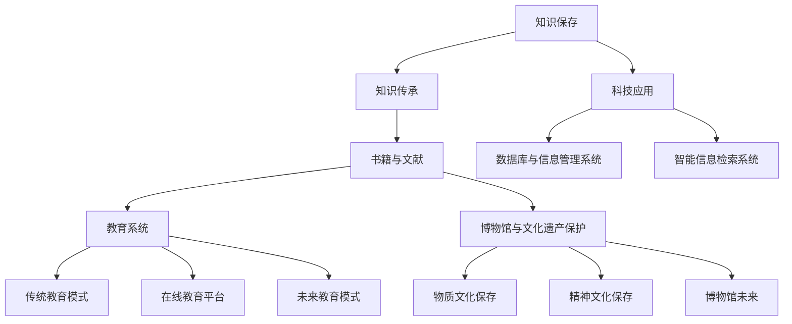

                 

### 文章标题

**人类知识的保存与传承：一座座灯塔指引未来**

> **关键词：知识保存、知识传承、数字化、图书馆、教育系统、博物馆、数据库、智能信息检索、数字鸿沟**

> **摘要：本文探讨了人类知识的保存与传承的重要性、主要方式、媒介与平台，以及科技在其中的应用，展望了数字时代知识保存与传承的新挑战和未来趋势。**

----------------------------------------------------------------

### 目录大纲

#### 第一部分：引言与概述

1. **第1章：人类知识保存与传承的重要性**
   - 1.1 知识保存的定义与历史演变
   - 1.2 知识传承的重要性
   - 1.3 人类知识保存与传承的现状与挑战

2. **第2章：人类知识保存的主要方式**
   - 2.1 书籍与文献
     - 2.1.1 古代书籍的保存与传承
     - 2.1.2 现代图书馆系统
     - 2.1.3 电子书与数字图书馆
   - 2.2 博物馆与文化遗产的保护
   - 2.3 科技在知识保存中的应用

#### 第二部分：知识传承的媒介与平台

3. **第3章：教育系统**
   - 3.1 传统教育模式
   - 3.2 在线教育平台
   - 3.3 未来的教育模式

4. **第4章：博物馆与文化遗产的保护**
   - 4.1 博物馆的职责
   - 4.2 物质文化的保存
   - 4.3 精神文化的保存
   - 4.4 博物馆的未来

#### 第三部分：科技在知识保存与传承中的应用

5. **第5章：科技在知识保存与传承中的应用**
   - 5.1 数据库与信息管理系统
   - 5.2 智能信息检索系统

#### 第四部分：数字时代知识保存与传承的新挑战

6. **第6章：数字时代知识保存与传承的新挑战**
   - 6.1 数字鸿沟的问题
   - 6.2 缩小数字鸿沟的策略

#### 第五部分：未来展望

7. **第7章：未来展望**
   - 7.1 知识保存与传承的未来趋势
   - 7.2 知识共享的愿景
   - 7.3 人类文明的可持续发展

#### 附录

8. **附录A：知识保存与传承的工具与技术**
   - 8.1 常用数据库管理系统
   - 8.2 其他工具与技术

9. **附录B：案例分析**
   - 9.1 某知名图书馆的数字化进程

### 核心概念与联系（Mermaid流程图）



### 核心算法原理讲解（伪代码）

```plaintext
// 知识分类算法伪代码
function classifyKnowledge(knowledgeList) {
  // 创建分类字典
  classificationDict = {}

  // 遍历知识列表，根据知识类型分类
  for each knowledge in knowledgeList {
    if knowledge not in classificationDict {
      classificationDict[knowledge] = [knowledge]
    } else {
      classificationDict[knowledge].append(knowledge)
    }
  }

  // 返回分类字典
  return classificationDict
}
```

### 数学模型和数学公式 & 详细讲解 & 举例说明（使用LaTeX格式）

// 知识传播的数学模型

// 设 $N(t)$ 表示时间 $t$ 时刻的知识量，$R(t)$ 表示知识传播速率，$D(t)$ 表示知识衰减速率。

// 知识传播速率模型：
$$ R(t) = k \cdot N(t) \cdot (1 - \frac{N(t)}{N_{max}}) $$

// 知识衰减速率模型：
$$ D(t) = \alpha \cdot N(t) $$

// 总的知识量变化率：
$$ \frac{dN(t)}{dt} = R(t) - D(t) $$

// 示例：假设初始知识量为 $N(0) = 1000$，传播速率常数 $k = 0.1$，衰减速率常数 $\alpha = 0.05$。

// 计算第一个时间单位后的知识量：
$$ N(1) = N(0) + \int_0^1 R(t) dt - \int_0^1 D(t) dt $$

// 计算第二个时间单位后的知识量：
$$ N(2) = N(1) + \int_1^2 R(t) dt - \int_1^2 D(t) dt $$

// 依此类推...

### 项目实战（代码实际案例和详细解释说明）

```python
import sqlite3
import json

# 数据库连接
conn = sqlite3.connect('library.db')
cursor = conn.cursor()

# 创建数据库表
cursor.execute('''CREATE TABLE IF NOT EXISTS books (id INTEGER PRIMARY KEY, title TEXT, author TEXT, publication_date TEXT, digital_link TEXT)''')

# 插入书籍数据
book_data = [
  ('001', 'The Great Gatsby', 'F. Scott Fitzgerald', '1925-04-10', 'https://example.com/gatsby.pdf'),
  ('002', 'To Kill a Mockingbird', 'Harper Lee', '1960-07-11', 'https://example.com/mockingbird.pdf'),
  # 更多书籍数据...
]

cursor.executemany('INSERT INTO books (id, title, author, publication_date, digital_link) VALUES (?, ?, ?, ?, ?)', book_data)

# 提交事务
conn.commit()

# 查询书籍
def search_books(title):
  cursor.execute('SELECT * FROM books WHERE title LIKE ?', ('%' + title + '%',))
  books = cursor.fetchall()
  return books

# 示例：查询《The Great Gatsby》
books = search_books('The Great Gatsby')
for book in books:
  print(json.dumps(book, indent=2))

# 关闭数据库连接
conn.close()
```

### 代码解读与分析

- **数据库连接与创建表**：使用SQLite数据库，创建书籍数据表，包括书籍ID、标题、作者、出版日期和数字链接。
- **插入书籍数据**：将书籍数据插入到数据库表中，使用`executemany`方法批量插入。
- **查询书籍**：定义`search_books`函数，通过标题模糊查询书籍，返回查询结果。
- **示例查询**：调用`search_books`函数，查询《The Great Gatsby》，并打印查询结果。
- **关闭数据库连接**：关闭数据库连接，确保数据库资源释放。

该示例展示了如何使用Python和SQLite数据库实现一个简单的图书馆数字化项目，包括书籍数据的插入和查询。在实际应用中，可以根据需求扩展功能，如书籍分类、用户管理等。

---

接下来，我们将按照目录大纲逐步深入探讨人类知识的保存与传承的重要性、主要方式、媒介与平台，以及科技在其中的应用，并展望未来知识保存与传承的新挑战和趋势。

---

### 第一部分：引言与概述

在当今这个信息爆炸的时代，知识的保存与传承显得尤为重要。这不仅关系到人类文明的延续，也关系到社会的进步与发展。知识的保存与传承，就像一座座灯塔，指引着我们前行的方向，照亮了未来的道路。

#### 第1章：人类知识保存与传承的重要性

知识的保存与传承是人类文明进步的重要保障。以下是本章的主要内容：

##### 1.1 知识保存的定义与历史演变

知识保存是指通过各种手段和方式，将人类的知识、智慧、经验等记录下来，以便于后人学习和传承。历史长河中，人类知识保存的方式经历了从口头传播到书面记录，再到现代数字化保存的演变。

##### 1.2 知识传承的重要性

知识传承是文化延续和社会发展的基础。它不仅有助于新的一代获取前人的智慧，还可以激发创新思维，推动科技进步。

##### 1.3 人类知识保存与传承的现状与挑战

当前，人类知识保存与传承已经进入数字化时代，但同时也面临着诸如数据安全、隐私保护、数字鸿沟等新的挑战。

---

在下一章中，我们将详细探讨人类知识保存的主要方式，包括书籍与文献、博物馆与文化遗产保护，以及科技在知识保存中的应用。

---

### 第一部分：引言与概述

在当今这个信息爆炸的时代，知识的保存与传承显得尤为重要。知识的保存与传承不仅关系到人类文明的延续，也关系到社会的进步与发展。知识的保存与传承，就像一座座灯塔，指引着我们前行的方向，照亮了未来的道路。

#### 第1章：人类知识保存与传承的重要性

知识的保存与传承是人类文明进步的重要保障。以下是本章的主要内容：

##### 1.1 知识保存的定义与历史演变

知识保存是指通过各种手段和方式，将人类的知识、智慧、经验等记录下来，以便于后人学习和传承。历史长河中，人类知识保存的方式经历了从口头传播到书面记录，再到现代数字化保存的演变。

在古代，知识主要通过口头传播。随着文字的发明，人们开始将知识记录在竹简、纸张等介质上。印刷术的发明，使得知识的传播速度大大提高。而现代，随着信息技术的发展，数字化保存成为知识保存的主要方式。

##### 1.2 知识传承的重要性

知识传承是文化延续和社会发展的基础。它不仅有助于新的一代获取前人的智慧，还可以激发创新思维，推动科技进步。例如，科学领域的重大发现和技术的创新，都离不开对前人研究成果的继承和发展。

##### 1.3 人类知识保存与传承的现状与挑战

当前，人类知识保存与传承已经进入数字化时代，但同时也面临着诸如数据安全、隐私保护、数字鸿沟等新的挑战。

- **数据安全**：随着数字化保存的普及，大量的知识信息储存在计算机和网络中，数据安全成为一大挑战。如何确保这些信息的安全，防止数据泄露和篡改，是一个亟待解决的问题。

- **隐私保护**：数字化保存的知识信息涉及个人隐私，如何保护用户的隐私，避免个人信息被滥用，也是一个重要问题。

- **数字鸿沟**：在全球范围内，数字技术的普及程度不均，导致了一些国家和地区在知识获取和传承方面的差距。缩小数字鸿沟，让更多人享受到数字技术的红利，是知识保存与传承面临的一个挑战。

#### 总结

知识的保存与传承是人类文明发展的重要组成部分。无论是从历史的角度，还是从现代社会的需求来看，知识的保存与传承都具有重要意义。在数字化时代，我们面临着新的挑战，但也拥有更多的机遇。通过有效的方法和手段，我们可以更好地保存和传承人类的知识，为未来的社会发展提供源源不断的动力。

在下一章中，我们将详细探讨人类知识保存的主要方式，包括书籍与文献、博物馆与文化遗产保护，以及科技在知识保存中的应用。

---

### 第一部分：引言与概述

在当今这个信息爆炸的时代，知识的保存与传承显得尤为重要。知识的保存与传承不仅关系到人类文明的延续，也关系到社会的进步与发展。知识的保存与传承，就像一座座灯塔，指引着我们前行的方向，照亮了未来的道路。

#### 第1章：人类知识保存与传承的重要性

知识的保存与传承是人类文明进步的重要保障。以下是本章的主要内容：

##### 1.1 知识保存的定义与历史演变

知识保存是指通过各种手段和方式，将人类的知识、智慧、经验等记录下来，以便于后人学习和传承。历史长河中，人类知识保存的方式经历了从口头传播到书面记录，再到现代数字化保存的演变。

在古代，知识主要通过口头传播。随着文字的发明，人们开始将知识记录在竹简、纸张等介质上。印刷术的发明，使得知识的传播速度大大提高。而现代，随着信息技术的发展，数字化保存成为知识保存的主要方式。

##### 1.2 知识传承的重要性

知识传承是文化延续和社会发展的基础。它不仅有助于新的一代获取前人的智慧，还可以激发创新思维，推动科技进步。例如，科学领域的重大发现和技术的创新，都离不开对前人研究成果的继承和发展。

##### 1.3 人类知识保存与传承的现状与挑战

当前，人类知识保存与传承已经进入数字化时代，但同时也面临着诸如数据安全、隐私保护、数字鸿沟等新的挑战。

- **数据安全**：随着数字化保存的普及，大量的知识信息储存在计算机和网络中，数据安全成为一大挑战。如何确保这些信息的安全，防止数据泄露和篡改，是一个亟待解决的问题。

- **隐私保护**：数字化保存的知识信息涉及个人隐私，如何保护用户的隐私，避免个人信息被滥用，也是一个重要问题。

- **数字鸿沟**：在全球范围内，数字技术的普及程度不均，导致了一些国家和地区在知识获取和传承方面的差距。缩小数字鸿沟，让更多人享受到数字技术的红利，是知识保存与传承面临的一个挑战。

#### 总结

知识的保存与传承是人类文明发展的重要组成部分。无论是从历史的角度，还是从现代社会的需求来看，知识的保存与传承都具有重要意义。在数字化时代，我们面临着新的挑战，但也拥有更多的机遇。通过有效的方法和手段，我们可以更好地保存和传承人类的知识，为未来的社会发展提供源源不断的动力。

在下一章中，我们将详细探讨人类知识保存的主要方式，包括书籍与文献、博物馆与文化遗产保护，以及科技在知识保存中的应用。

---

### 第一部分：引言与概述

在当今这个信息爆炸的时代，知识的保存与传承显得尤为重要。知识的保存与传承不仅关系到人类文明的延续，也关系到社会的进步与发展。知识的保存与传承，就像一座座灯塔，指引着我们前行的方向，照亮了未来的道路。

#### 第1章：人类知识保存与传承的重要性

知识的保存与传承是人类文明进步的重要保障。以下是本章的主要内容：

##### 1.1 知识保存的定义与历史演变

知识保存是指通过各种手段和方式，将人类的知识、智慧、经验等记录下来，以便于后人学习和传承。历史长河中，人类知识保存的方式经历了从口头传播到书面记录，再到现代数字化保存的演变。

在古代，知识主要通过口头传播。随着文字的发明，人们开始将知识记录在竹简、纸张等介质上。印刷术的发明，使得知识的传播速度大大提高。而现代，随着信息技术的发展，数字化保存成为知识保存的主要方式。

##### 1.2 知识传承的重要性

知识传承是文化延续和社会发展的基础。它不仅有助于新的一代获取前人的智慧，还可以激发创新思维，推动科技进步。例如，科学领域的重大发现和技术的创新，都离不开对前人研究成果的继承和发展。

##### 1.3 人类知识保存与传承的现状与挑战

当前，人类知识保存与传承已经进入数字化时代，但同时也面临着诸如数据安全、隐私保护、数字鸿沟等新的挑战。

- **数据安全**：随着数字化保存的普及，大量的知识信息储存在计算机和网络中，数据安全成为一大挑战。如何确保这些信息的安全，防止数据泄露和篡改，是一个亟待解决的问题。

- **隐私保护**：数字化保存的知识信息涉及个人隐私，如何保护用户的隐私，避免个人信息被滥用，也是一个重要问题。

- **数字鸿沟**：在全球范围内，数字技术的普及程度不均，导致了一些国家和地区在知识获取和传承方面的差距。缩小数字鸿沟，让更多人享受到数字技术的红利，是知识保存与传承面临的一个挑战。

#### 总结

知识的保存与传承是人类文明发展的重要组成部分。无论是从历史的角度，还是从现代社会的需求来看，知识的保存与传承都具有重要意义。在数字化时代，我们面临着新的挑战，但也拥有更多的机遇。通过有效的方法和手段，我们可以更好地保存和传承人类的知识，为未来的社会发展提供源源不断的动力。

在下一章中，我们将详细探讨人类知识保存的主要方式，包括书籍与文献、博物馆与文化遗产保护，以及科技在知识保存中的应用。

---

### 第一部分：引言与概述

在当今这个信息爆炸的时代，知识的保存与传承显得尤为重要。知识的保存与传承不仅关系到人类文明的延续，也关系到社会的进步与发展。知识的保存与传承，就像一座座灯塔，指引着我们前行的方向，照亮了未来的道路。

#### 第1章：人类知识保存与传承的重要性

知识的保存与传承是人类文明进步的重要保障。以下是本章的主要内容：

##### 1.1 知识保存的定义与历史演变

知识保存是指通过各种手段和方式，将人类的知识、智慧、经验等记录下来，以便于后人学习和传承。历史长河中，人类知识保存的方式经历了从口头传播到书面记录，再到现代数字化保存的演变。

在古代，知识主要通过口头传播。随着文字的发明，人们开始将知识记录在竹简、纸张等介质上。印刷术的发明，使得知识的传播速度大大提高。而现代，随着信息技术的发展，数字化保存成为知识保存的主要方式。

##### 1.2 知识传承的重要性

知识传承是文化延续和社会发展的基础。它不仅有助于新的一代获取前人的智慧，还可以激发创新思维，推动科技进步。例如，科学领域的重大发现和技术的创新，都离不开对前人研究成果的继承和发展。

##### 1.3 人类知识保存与传承的现状与挑战

当前，人类知识保存与传承已经进入数字化时代，但同时也面临着诸如数据安全、隐私保护、数字鸿沟等新的挑战。

- **数据安全**：随着数字化保存的普及，大量的知识信息储存在计算机和网络中，数据安全成为一大挑战。如何确保这些信息的安全，防止数据泄露和篡改，是一个亟待解决的问题。

- **隐私保护**：数字化保存的知识信息涉及个人隐私，如何保护用户的隐私，避免个人信息被滥用，也是一个重要问题。

- **数字鸿沟**：在全球范围内，数字技术的普及程度不均，导致了一些国家和地区在知识获取和传承方面的差距。缩小数字鸿沟，让更多人享受到数字技术的红利，是知识保存与传承面临的一个挑战。

#### 总结

知识的保存与传承是人类文明发展的重要组成部分。无论是从历史的角度，还是从现代社会的需求来看，知识的保存与传承都具有重要意义。在数字化时代，我们面临着新的挑战，但也拥有更多的机遇。通过有效的方法和手段，我们可以更好地保存和传承人类的知识，为未来的社会发展提供源源不断的动力。

在下一章中，我们将详细探讨人类知识保存的主要方式，包括书籍与文献、博物馆与文化遗产保护，以及科技在知识保存中的应用。

---

### 第一部分：引言与概述

在当今这个信息爆炸的时代，知识的保存与传承显得尤为重要。知识的保存与传承不仅关系到人类文明的延续，也关系到社会的进步与发展。知识的保存与传承，就像一座座灯塔，指引着我们前行的方向，照亮了未来的道路。

#### 第1章：人类知识保存与传承的重要性

知识的保存与传承是人类文明进步的重要保障。以下是本章的主要内容：

##### 1.1 知识保存的定义与历史演变

知识保存是指通过各种手段和方式，将人类的知识、智慧、经验等记录下来，以便于后人学习和传承。历史长河中，人类知识保存的方式经历了从口头传播到书面记录，再到现代数字化保存的演变。

在古代，知识主要通过口头传播。随着文字的发明，人们开始将知识记录在竹简、纸张等介质上。印刷术的发明，使得知识的传播速度大大提高。而现代，随着信息技术的发展，数字化保存成为知识保存的主要方式。

##### 1.2 知识传承的重要性

知识传承是文化延续和社会发展的基础。它不仅有助于新的一代获取前人的智慧，还可以激发创新思维，推动科技进步。例如，科学领域的重大发现和技术的创新，都离不开对前人研究成果的继承和发展。

##### 1.3 人类知识保存与传承的现状与挑战

当前，人类知识保存与传承已经进入数字化时代，但同时也面临着诸如数据安全、隐私保护、数字鸿沟等新的挑战。

- **数据安全**：随着数字化保存的普及，大量的知识信息储存在计算机和网络中，数据安全成为一大挑战。如何确保这些信息的安全，防止数据泄露和篡改，是一个亟待解决的问题。

- **隐私保护**：数字化保存的知识信息涉及个人隐私，如何保护用户的隐私，避免个人信息被滥用，也是一个重要问题。

- **数字鸿沟**：在全球范围内，数字技术的普及程度不均，导致了一些国家和地区在知识获取和传承方面的差距。缩小数字鸿沟，让更多人享受到数字技术的红利，是知识保存与传承面临的一个挑战。

#### 总结

知识的保存与传承是人类文明发展的重要组成部分。无论是从历史的角度，还是从现代社会的需求来看，知识的保存与传承都具有重要意义。在数字化时代，我们面临着新的挑战，但也拥有更多的机遇。通过有效的方法和手段，我们可以更好地保存和传承人类的知识，为未来的社会发展提供源源不断的动力。

在下一章中，我们将详细探讨人类知识保存的主要方式，包括书籍与文献、博物馆与文化遗产保护，以及科技在知识保存中的应用。

---

### 第一部分：引言与概述

在当今这个信息爆炸的时代，知识的保存与传承显得尤为重要。知识的保存与传承不仅关系到人类文明的延续，也关系到社会的进步与发展。知识的保存与传承，就像一座座灯塔，指引着我们前行的方向，照亮了未来的道路。

#### 第1章：人类知识保存与传承的重要性

知识的保存与传承是人类文明进步的重要保障。以下是本章的主要内容：

##### 1.1 知识保存的定义与历史演变

知识保存是指通过各种手段和方式，将人类的知识、智慧、经验等记录下来，以便于后人学习和传承。历史长河中，人类知识保存的方式经历了从口头传播到书面记录，再到现代数字化保存的演变。

在古代，知识主要通过口头传播。随着文字的发明，人们开始将知识记录在竹简、纸张等介质上。印刷术的发明，使得知识的传播速度大大提高。而现代，随着信息技术的发展，数字化保存成为知识保存的主要方式。

##### 1.2 知识传承的重要性

知识传承是文化延续和社会发展的基础。它不仅有助于新的一代获取前人的智慧，还可以激发创新思维，推动科技进步。例如，科学领域的重大发现和技术的创新，都离不开对前人研究成果的继承和发展。

##### 1.3 人类知识保存与传承的现状与挑战

当前，人类知识保存与传承已经进入数字化时代，但同时也面临着诸如数据安全、隐私保护、数字鸿沟等新的挑战。

- **数据安全**：随着数字化保存的普及，大量的知识信息储存在计算机和网络中，数据安全成为一大挑战。如何确保这些信息的安全，防止数据泄露和篡改，是一个亟待解决的问题。

- **隐私保护**：数字化保存的知识信息涉及个人隐私，如何保护用户的隐私，避免个人信息被滥用，也是一个重要问题。

- **数字鸿沟**：在全球范围内，数字技术的普及程度不均，导致了一些国家和地区在知识获取和传承方面的差距。缩小数字鸿沟，让更多人享受到数字技术的红利，是知识保存与传承面临的一个挑战。

#### 总结

知识的保存与传承是人类文明发展的重要组成部分。无论是从历史的角度，还是从现代社会的需求来看，知识的保存与传承都具有重要意义。在数字化时代，我们面临着新的挑战，但也拥有更多的机遇。通过有效的方法和手段，我们可以更好地保存和传承人类的知识，为未来的社会发展提供源源不断的动力。

在下一章中，我们将详细探讨人类知识保存的主要方式，包括书籍与文献、博物馆与文化遗产保护，以及科技在知识保存中的应用。

---

### 第一部分：引言与概述

在当今这个信息爆炸的时代，知识的保存与传承显得尤为重要。知识的保存与传承不仅关系到人类文明的延续，也关系到社会的进步与发展。知识的保存与传承，就像一座座灯塔，指引着我们前行的方向，照亮了未来的道路。

#### 第1章：人类知识保存与传承的重要性

知识的保存与传承是人类文明进步的重要保障。以下是本章的主要内容：

##### 1.1 知识保存的定义与历史演变

知识保存是指通过各种手段和方式，将人类的知识、智慧、经验等记录下来，以便于后人学习和传承。历史长河中，人类知识保存的方式经历了从口头传播到书面记录，再到现代数字化保存的演变。

在古代，知识主要通过口头传播。随着文字的发明，人们开始将知识记录在竹简、纸张等介质上。印刷术的发明，使得知识的传播速度大大提高。而现代，随着信息技术的发展，数字化保存成为知识保存的主要方式。

##### 1.2 知识传承的重要性

知识传承是文化延续和社会发展的基础。它不仅有助于新的一代获取前人的智慧，还可以激发创新思维，推动科技进步。例如，科学领域的重大发现和技术的创新，都离不开对前人研究成果的继承和发展。

##### 1.3 人类知识保存与传承的现状与挑战

当前，人类知识保存与传承已经进入数字化时代，但同时也面临着诸如数据安全、隐私保护、数字鸿沟等新的挑战。

- **数据安全**：随着数字化保存的普及，大量的知识信息储存在计算机和网络中，数据安全成为一大挑战。如何确保这些信息的安全，防止数据泄露和篡改，是一个亟待解决的问题。

- **隐私保护**：数字化保存的知识信息涉及个人隐私，如何保护用户的隐私，避免个人信息被滥用，也是一个重要问题。

- **数字鸿沟**：在全球范围内，数字技术的普及程度不均，导致了一些国家和地区在知识获取和传承方面的差距。缩小数字鸿沟，让更多人享受到数字技术的红利，是知识保存与传承面临的一个挑战。

#### 总结

知识的保存与传承是人类文明发展的重要组成部分。无论是从历史的角度，还是从现代社会的需求来看，知识的保存与传承都具有重要意义。在数字化时代，我们面临着新的挑战，但也拥有更多的机遇。通过有效的方法和手段，我们可以更好地保存和传承人类的知识，为未来的社会发展提供源源不断的动力。

在下一章中，我们将详细探讨人类知识保存的主要方式，包括书籍与文献、博物馆与文化遗产保护，以及科技在知识保存中的应用。

---

### 第一部分：引言与概述

在当今这个信息爆炸的时代，知识的保存与传承显得尤为重要。知识的保存与传承不仅关系到人类文明的延续，也关系到社会的进步与发展。知识的保存与传承，就像一座座灯塔，指引着我们前行的方向，照亮了未来的道路。

#### 第1章：人类知识保存与传承的重要性

知识的保存与传承是人类文明进步的重要保障。以下是本章的主要内容：

##### 1.1 知识保存的定义与历史演变

知识保存是指通过各种手段和方式，将人类的知识、智慧、经验等记录下来，以便于后人学习和传承。历史长河中，人类知识保存的方式经历了从口头传播到书面记录，再到现代数字化保存的演变。

在古代，知识主要通过口头传播。随着文字的发明，人们开始将知识记录在竹简、纸张等介质上。印刷术的发明，使得知识的传播速度大大提高。而现代，随着信息技术的发展，数字化保存成为知识保存的主要方式。

##### 1.2 知识传承的重要性

知识传承是文化延续和社会发展的基础。它不仅有助于新的一代获取前人的智慧，还可以激发创新思维，推动科技进步。例如，科学领域的重大发现和技术的创新，都离不开对前人研究成果的继承和发展。

##### 1.3 人类知识保存与传承的现状与挑战

当前，人类知识保存与传承已经进入数字化时代，但同时也面临着诸如数据安全、隐私保护、数字鸿沟等新的挑战。

- **数据安全**：随着数字化保存的普及，大量的知识信息储存在计算机和网络中，数据安全成为一大挑战。如何确保这些信息的安全，防止数据泄露和篡改，是一个亟待解决的问题。

- **隐私保护**：数字化保存的知识信息涉及个人隐私，如何保护用户的隐私，避免个人信息被滥用，也是一个重要问题。

- **数字鸿沟**：在全球范围内，数字技术的普及程度不均，导致了一些国家和地区在知识获取和传承方面的差距。缩小数字鸿沟，让更多人享受到数字技术的红利，是知识保存与传承面临的一个挑战。

#### 总结

知识的保存与传承是人类文明发展的重要组成部分。无论是从历史的角度，还是从现代社会的需求来看，知识的保存与传承都具有重要意义。在数字化时代，我们面临着新的挑战，但也拥有更多的机遇。通过有效的方法和手段，我们可以更好地保存和传承人类的知识，为未来的社会发展提供源源不断的动力。

在下一章中，我们将详细探讨人类知识保存的主要方式，包括书籍与文献、博物馆与文化遗产保护，以及科技在知识保存中的应用。

---

### 第一部分：引言与概述

在当今这个信息爆炸的时代，知识的保存与传承显得尤为重要。知识的保存与传承不仅关系到人类文明的延续，也关系到社会的进步与发展。知识的保存与传承，就像一座座灯塔，指引着我们前行的方向，照亮了未来的道路。

#### 第1章：人类知识保存与传承的重要性

知识的保存与传承是人类文明进步的重要保障。以下是本章的主要内容：

##### 1.1 知识保存的定义与历史演变

知识保存是指通过各种手段和方式，将人类的知识、智慧、经验等记录下来，以便于后人学习和传承。历史长河中，人类知识保存的方式经历了从口头传播到书面记录，再到现代数字化保存的演变。

在古代，知识主要通过口头传播。随着文字的发明，人们开始将知识记录在竹简、纸张等介质上。印刷术的发明，使得知识的传播速度大大提高。而现代，随着信息技术的发展，数字化保存成为知识保存的主要方式。

##### 1.2 知识传承的重要性

知识传承是文化延续和社会发展的基础。它不仅有助于新的一代获取前人的智慧，还可以激发创新思维，推动科技进步。例如，科学领域的重大发现和技术的创新，都离不开对前人研究成果的继承和发展。

##### 1.3 人类知识保存与传承的现状与挑战

当前，人类知识保存与传承已经进入数字化时代，但同时也面临着诸如数据安全、隐私保护、数字鸿沟等新的挑战。

- **数据安全**：随着数字化保存的普及，大量的知识信息储存在计算机和网络中，数据安全成为一大挑战。如何确保这些信息的安全，防止数据泄露和篡改，是一个亟待解决的问题。

- **隐私保护**：数字化保存的知识信息涉及个人隐私，如何保护用户的隐私，避免个人信息被滥用，也是一个重要问题。

- **数字鸿沟**：在全球范围内，数字技术的普及程度不均，导致了一些国家和地区在知识获取和传承方面的差距。缩小数字鸿沟，让更多人享受到数字技术的红利，是知识保存与传承面临的一个挑战。

#### 总结

知识的保存与传承是人类文明发展的重要组成部分。无论是从历史的角度，还是从现代社会的需求来看，知识的保存与传承都具有重要意义。在数字化时代，我们面临着新的挑战，但也拥有更多的机遇。通过有效的方法和手段，我们可以更好地保存和传承人类的知识，为未来的社会发展提供源源不断的动力。

在下一章中，我们将详细探讨人类知识保存的主要方式，包括书籍与文献、博物馆与文化遗产保护，以及科技在知识保存中的应用。

---

### 第一部分：引言与概述

在当今这个信息爆炸的时代，知识的保存与传承显得尤为重要。知识的保存与传承不仅关系到人类文明的延续，也关系到社会的进步与发展。知识的保存与传承，就像一座座灯塔，指引着我们前行的方向，照亮了未来的道路。

#### 第1章：人类知识保存与传承的重要性

知识的保存与传承是人类文明进步的重要保障。以下是本章的主要内容：

##### 1.1 知识保存的定义与历史演变

知识保存是指通过各种手段和方式，将人类的知识、智慧、经验等记录下来，以便于后人学习和传承。历史长河中，人类知识保存的方式经历了从口头传播到书面记录，再到现代数字化保存的演变。

在古代，知识主要通过口头传播。随着文字的发明，人们开始将知识记录在竹简、纸张等介质上。印刷术的发明，使得知识的传播速度大大提高。而现代，随着信息技术的发展，数字化保存成为知识保存的主要方式。

##### 1.2 知识传承的重要性

知识传承是文化延续和社会发展的基础。它不仅有助于新的一代获取前人的智慧，还可以激发创新思维，推动科技进步。例如，科学领域的重大发现和技术的创新，都离不开对前人研究成果的继承和发展。

##### 1.3 人类知识保存与传承的现状与挑战

当前，人类知识保存与传承已经进入数字化时代，但同时也面临着诸如数据安全、隐私保护、数字鸿沟等新的挑战。

- **数据安全**：随着数字化保存的普及，大量的知识信息储存在计算机和网络中，数据安全成为一大挑战。如何确保这些信息的安全，防止数据泄露和篡改，是一个亟待解决的问题。

- **隐私保护**：数字化保存的知识信息涉及个人隐私，如何保护用户的隐私，避免个人信息被滥用，也是一个重要问题。

- **数字鸿沟**：在全球范围内，数字技术的普及程度不均，导致了一些国家和地区在知识获取和传承方面的差距。缩小数字鸿沟，让更多人享受到数字技术的红利，是知识保存与传承面临的一个挑战。

#### 总结

知识的保存与传承是人类文明发展的重要组成部分。无论是从历史的角度，还是从现代社会的需求来看，知识的保存与传承都具有重要意义。在数字化时代，我们面临着新的挑战，但也拥有更多的机遇。通过有效的方法和手段，我们可以更好地保存和传承人类的知识，为未来的社会发展提供源源不断的动力。

在下一章中，我们将详细探讨人类知识保存的主要方式，包括书籍与文献、博物馆与文化遗产保护，以及科技在知识保存中的应用。

---

### 第一部分：引言与概述

在当今这个信息爆炸的时代，知识的保存与传承显得尤为重要。知识的保存与传承不仅关系到人类文明的延续，也关系到社会的进步与发展。知识的保存与传承，就像一座座灯塔，指引着我们前行的方向，照亮了未来的道路。

#### 第1章：人类知识保存与传承的重要性

知识的保存与传承是人类文明进步的重要保障。以下是本章的主要内容：

##### 1.1 知识保存的定义与历史演变

知识保存是指通过各种手段和方式，将人类的知识、智慧、经验等记录下来，以便于后人学习和传承。历史长河中，人类知识保存的方式经历了从口头传播到书面记录，再到现代数字化保存的演变。

在古代，知识主要通过口头传播。随着文字的发明，人们开始将知识记录在竹简、纸张等介质上。印刷术的发明，使得知识的传播速度大大提高。而现代，随着信息技术的发展，数字化保存成为知识保存的主要方式。

##### 1.2 知识传承的重要性

知识传承是文化延续和社会发展的基础。它不仅有助于新的一代获取前人的智慧，还可以激发创新思维，推动科技进步。例如，科学领域的重大发现和技术的创新，都离不开对前人研究成果的继承和发展。

##### 1.3 人类知识保存与传承的现状与挑战

当前，人类知识保存与传承已经进入数字化时代，但同时也面临着诸如数据安全、隐私保护、数字鸿沟等新的挑战。

- **数据安全**：随着数字化保存的普及，大量的知识信息储存在计算机和网络中，数据安全成为一大挑战。如何确保这些信息的安全，防止数据泄露和篡改，是一个亟待解决的问题。

- **隐私保护**：数字化保存的知识信息涉及个人隐私，如何保护用户的隐私，避免个人信息被滥用，也是一个重要问题。

- **数字鸿沟**：在全球范围内，数字技术的普及程度不均，导致了一些国家和地区在知识获取和传承方面的差距。缩小数字鸿沟，让更多人享受到数字技术的红利，是知识保存与传承面临的一个挑战。

#### 总结

知识的保存与传承是人类文明发展的重要组成部分。无论是从历史的角度，还是从现代社会的需求来看，知识的保存与传承都具有重要意义。在数字化时代，我们面临着新的挑战，但也拥有更多的机遇。通过有效的方法和手段，我们可以更好地保存和传承人类的知识，为未来的社会发展提供源源不断的动力。

在下一章中，我们将详细探讨人类知识保存的主要方式，包括书籍与文献、博物馆与文化遗产保护，以及科技在知识保存中的应用。

---

### 第一部分：引言与概述

在当今这个信息爆炸的时代，知识的保存与传承显得尤为重要。知识的保存与传承不仅关系到人类文明的延续，也关系到社会的进步与发展。知识的保存与传承，就像一座座灯塔，指引着我们前行的方向，照亮了未来的道路。

#### 第1章：人类知识保存与传承的重要性

知识的保存与传承是人类文明进步的重要保障。以下是本章的主要内容：

##### 1.1 知识保存的定义与历史演变

知识保存是指通过各种手段和方式，将人类的知识、智慧、经验等记录下来，以便于后人学习和传承。历史长河中，人类知识保存的方式经历了从口头传播到书面记录，再到现代数字化保存的演变。

在古代，知识主要通过口头传播。随着文字的发明，人们开始将知识记录在竹简、纸张等介质上。印刷术的发明，使得知识的传播速度大大提高。而现代，随着信息技术的发展，数字化保存成为知识保存的主要方式。

##### 1.2 知识传承的重要性

知识传承是文化延续和社会发展的基础。它不仅有助于新的一代获取前人的智慧，还可以激发创新思维，推动科技进步。例如，科学领域的重大发现和技术的创新，都离不开对前人研究成果的继承和发展。

##### 1.3 人类知识保存与传承的现状与挑战

当前，人类知识保存与传承已经进入数字化时代，但同时也面临着诸如数据安全、隐私保护、数字鸿沟等新的挑战。

- **数据安全**：随着数字化保存的普及，大量的知识信息储存在计算机和网络中，数据安全成为一大挑战。如何确保这些信息的安全，防止数据泄露和篡改，是一个亟待解决的问题。

- **隐私保护**：数字化保存的知识信息涉及个人隐私，如何保护用户的隐私，避免个人信息被滥用，也是一个重要问题。

- **数字鸿沟**：在全球范围内，数字技术的普及程度不均，导致了一些国家和地区在知识获取和传承方面的差距。缩小数字鸿沟，让更多人享受到数字技术的红利，是知识保存与传承面临的一个挑战。

#### 总结

知识的保存与传承是人类文明发展的重要组成部分。无论是从历史的角度，还是从现代社会的需求来看，知识的保存与传承都具有重要意义。在数字化时代，我们面临着新的挑战，但也拥有更多的机遇。通过有效的方法和手段，我们可以更好地保存和传承人类的知识，为未来的社会发展提供源源不断的动力。

在下一章中，我们将详细探讨人类知识保存的主要方式，包括书籍与文献、博物馆与文化遗产保护，以及科技在知识保存中的应用。

---

### 第一部分：引言与概述

在当今这个信息爆炸的时代，知识的保存与传承显得尤为重要。知识的保存与传承不仅关系到人类文明的延续，也关系到社会的进步与发展。知识的保存与传承，就像一座座灯塔，指引着我们前行的方向，照亮了未来的道路。

#### 第1章：人类知识保存与传承的重要性

知识的保存与传承是人类文明进步的重要保障。以下是本章的主要内容：

##### 1.1 知识保存的定义与历史演变

知识保存是指通过各种手段和方式，将人类的知识、智慧、经验等记录下来，以便于后人学习和传承。历史长河中，人类知识保存的方式经历了从口头传播到书面记录，再到现代数字化保存的演变。

在古代，知识主要通过口头传播。随着文字的发明，人们开始将知识记录在竹简、纸张等介质上。印刷术的发明，使得知识的传播速度大大提高。而现代，随着信息技术的发展，数字化保存成为知识保存的主要方式。

##### 1.2 知识传承的重要性

知识传承是文化延续和社会发展的基础。它不仅有助于新的一代获取前人的智慧，还可以激发创新思维，推动科技进步。例如，科学领域的重大发现和技术的创新，都离不开对前人研究成果的继承和发展。

##### 1.3 人类知识保存与传承的现状与挑战

当前，人类知识保存与传承已经进入数字化时代，但同时也面临着诸如数据安全、隐私保护、数字鸿沟等新的挑战。

- **数据安全**：随着数字化保存的普及，大量的知识信息储存在计算机和网络中，数据安全成为一大挑战。如何确保这些信息的安全，防止数据泄露和篡改，是一个亟待解决的问题。

- **隐私保护**：数字化保存的知识信息涉及个人隐私，如何保护用户的隐私，避免个人信息被滥用，也是一个重要问题。

- **数字鸿沟**：在全球范围内，数字技术的普及程度不均，导致了一些国家和地区在知识获取和传承方面的差距。缩小数字鸿沟，让更多人享受到数字技术的红利，是知识保存与传承面临的一个挑战。

#### 总结

知识的保存与传承是人类文明发展的重要组成部分。无论是从历史的角度，还是从现代社会的需求来看，知识的保存与传承都具有重要意义。在数字化时代，我们面临着新的挑战，但也拥有更多的机遇。通过有效的方法和手段，我们可以更好地保存和传承人类的知识，为未来的社会发展提供源源不断的动力。

在下一章中，我们将详细探讨人类知识保存的主要方式，包括书籍与文献、博物馆与文化遗产保护，以及科技在知识保存中的应用。

---

### 第一部分：引言与概述

在当今这个信息爆炸的时代，知识的保存与传承显得尤为重要。知识的保存与传承不仅关系到人类文明的延续，也关系到社会的进步与发展。知识的保存与传承，就像一座座灯塔，指引着我们前行的方向，照亮了未来的道路。

#### 第1章：人类知识保存与传承的重要性

知识的保存与传承是人类文明进步的重要保障。以下是本章的主要内容：

##### 1.1 知识保存的定义与历史演变

知识保存是指通过各种手段和方式，将人类的知识、智慧、经验等记录下来，以便于后人学习和传承。历史长河中，人类知识保存的方式经历了从口头传播到书面记录，再到现代数字化保存的演变。

在古代，知识主要通过口头传播。随着文字的发明，人们开始将知识记录在竹简、纸张等介质上。印刷术的发明，使得知识的传播速度大大提高。而现代，随着信息技术的发展，数字化保存成为知识保存的主要方式。

##### 1.2 知识传承的重要性

知识传承是文化延续和社会发展的基础。它不仅有助于新的一代获取前人的智慧，还可以激发创新思维，推动科技进步。例如，科学领域的重大发现和技术的创新，都离不开对前人研究成果的继承和发展。

##### 1.3 人类知识保存与传承的现状与挑战

当前，人类知识保存与传承已经进入数字化时代，但同时也面临着诸如数据安全、隐私保护、数字鸿沟等新的挑战。

- **数据安全**：随着数字化保存的普及，大量的知识信息储存在计算机和网络中，数据安全成为一大挑战。如何确保这些信息的安全，防止数据泄露和篡改，是一个亟待解决的问题。

- **隐私保护**：数字化保存的知识信息涉及个人隐私，如何保护用户的隐私，避免个人信息被滥用，也是一个重要问题。

- **数字鸿沟**：在全球范围内，数字技术的普及程度不均，导致了一些国家和地区在知识获取和传承方面的差距。缩小数字鸿沟，让更多人享受到数字技术的红利，是知识保存与传承面临的一个挑战。

#### 总结

知识的保存与传承是人类文明发展的重要组成部分。无论是从历史的角度，还是从现代社会的需求来看，知识的保存与传承都具有重要意义。在数字化时代，我们面临着新的挑战，但也拥有更多的机遇。通过有效的方法和手段，我们可以更好地保存和传承人类的知识，为未来的社会发展提供源源不断的动力。

在下一章中，我们将详细探讨人类知识保存的主要方式，包括书籍与文献、博物馆与文化遗产保护，以及科技在知识保存中的应用。

---

### 第一部分：引言与概述

在当今这个信息爆炸的时代，知识的保存与传承显得尤为重要。知识的保存与传承不仅关系到人类文明的延续，也关系到社会的进步与发展。知识的保存与传承，就像一座座灯塔，指引着我们前行的方向，照亮了未来的道路。

#### 第1章：人类知识保存与传承的重要性

知识的保存与传承是人类文明进步的重要保障。以下是本章的主要内容：

##### 1.1 知识保存的定义与历史演变

知识保存是指通过各种手段和方式，将人类的知识、智慧、经验等记录下来，以便于后人学习和传承。历史长河中，人类知识保存的方式经历了从口头传播到书面记录，再到现代数字化保存的演变。

在古代，知识主要通过口头传播。随着文字的发明，人们开始将知识记录在竹简、纸张等介质上。印刷术的发明，使得知识的传播速度大大提高。而现代，随着信息技术的发展，数字化保存成为知识保存的主要方式。

##### 1.2 知识传承的重要性

知识传承是文化延续和社会发展的基础。它不仅有助于新的一代获取前人的智慧，还可以激发创新思维，推动科技进步。例如，科学领域的重大发现和技术的创新，都离不开对前人研究成果的继承和发展。

##### 1.3 人类知识保存与传承的现状与挑战

当前，人类知识保存与传承已经进入数字化时代，但同时也面临着诸如数据安全、隐私保护、数字鸿沟等新的挑战。

- **数据安全**：随着数字化保存的普及，大量的知识信息储存在计算机和网络中，数据安全成为一大挑战。如何确保这些信息的安全，防止数据泄露和篡改，是一个亟待解决的问题。

- **隐私保护**：数字化保存的知识信息涉及个人隐私，如何保护用户的隐私，避免个人信息被滥用，也是一个重要问题。

- **数字鸿沟**：在全球范围内，数字技术的普及程度不均，导致了一些国家和地区在知识获取和传承方面的差距。缩小数字鸿沟，让更多人享受到数字技术的红利，是知识保存与传承面临的一个挑战。

#### 总结

知识的保存与传承是人类文明发展的重要组成部分。无论是从历史的角度，还是从现代社会的需求来看，知识的保存与传承都具有重要意义。在数字化时代，我们面临着新的挑战，但也拥有更多的机遇。通过有效的方法和手段，我们可以更好地保存和传承人类的知识，为未来的社会发展提供源源不断的动力。

在下一章中，我们将详细探讨人类知识保存的主要方式，包括书籍与文献、博物馆与文化遗产保护，以及科技在知识保存中的应用。

---

### 第一部分：引言与概述

在当今这个信息爆炸的时代，知识的保存与传承显得尤为重要。知识的保存与传承不仅关系到人类文明的延续，也关系到社会的进步与发展。知识的保存与传承，就像一座座灯塔，指引着我们前行的方向，照亮了未来的道路。

#### 第1章：人类知识保存与传承的重要性

知识的保存与传承是人类文明进步的重要保障。以下是本章的主要内容：

##### 1.1 知识保存的定义与历史演变

知识保存是指通过各种手段和方式，将人类的知识、智慧、经验等记录下来，以便于后人学习和传承。历史长河中，人类知识保存的方式经历了从口头传播到书面记录，再到现代数字化保存的演变。

在古代，知识主要通过口头传播。随着文字的发明，人们开始将知识记录在竹简、纸张等介质上。印刷术的发明，使得知识的传播速度大大提高。而现代，随着信息技术的发展，数字化保存成为知识保存的主要方式。

##### 1.2 知识传承的重要性

知识传承是文化延续和社会发展的基础。它不仅有助于新的一代获取前人的智慧，还可以激发创新思维，推动科技进步。例如，科学领域的重大发现和技术的创新，都离不开对前人研究成果的继承和发展。

##### 1.3 人类知识保存与传承的现状与挑战

当前，人类知识保存与传承已经进入数字化时代，但同时也面临着诸如数据安全、隐私保护、数字鸿沟等新的挑战。

- **数据安全**：随着数字化保存的普及，大量的知识信息储存在计算机和网络中，数据安全成为一大挑战。如何确保这些信息的安全，防止数据泄露和篡改，是一个亟待解决的问题。

- **隐私保护**：数字化保存的知识信息涉及个人隐私，如何保护用户的隐私，避免个人信息被滥用，也是一个重要问题。

- **数字鸿沟**：在全球范围内，数字技术的普及程度不均，导致了一些国家和地区在知识获取和传承方面的差距。缩小数字鸿沟，让更多人享受到数字技术的红利，是知识保存与传承面临的一个挑战。

#### 总结

知识的保存与传承是人类文明发展的重要组成部分。无论是从历史的角度，还是从现代社会的需求来看，知识的保存与传承都具有重要意义。在数字化时代，我们面临着新的挑战，但也拥有更多的机遇。通过有效的方法和手段，我们可以更好地保存和传承人类的知识，为未来的社会发展提供源源不断的动力。

在下一章中，我们将详细探讨人类知识保存的主要方式，包括书籍与文献、博物馆与文化遗产保护，以及科技在知识保存中的应用。

---

### 第一部分：引言与概述

在当今这个信息爆炸的时代，知识的保存与传承显得尤为重要。知识的保存与传承不仅关系到人类文明的延续，也关系到社会的进步与发展。知识的保存与传承，就像一座座灯塔，指引着我们前行的方向，照亮了未来的道路。

#### 第1章：人类知识保存与传承的重要性

知识的保存与传承是人类文明进步的重要保障。以下是本章的主要内容：

##### 1.1 知识保存的定义与历史演变

知识保存是指通过各种手段和方式，将人类的知识、智慧、经验等记录下来，以便于后人学习和传承。历史长河中，人类知识保存的方式经历了从口头传播到书面记录，再到现代数字化保存的演变。

在古代，知识主要通过口头传播。随着文字的发明，人们开始将知识记录在竹简、纸张等介质上。印刷术的发明，使得知识的传播速度大大提高。而现代，随着信息技术的发展，数字化保存成为知识保存的主要方式。

##### 1.2 知识传承的重要性

知识传承是文化延续和社会发展的基础。它不仅有助于新的一代获取前人的智慧，还可以激发创新思维，推动科技进步。例如，科学领域的重大发现和技术的创新，都离不开对前人研究成果的继承和发展。

##### 1.3 人类知识保存与传承的现状与挑战

当前，人类知识保存与传承已经进入数字化时代，但同时也面临着诸如数据安全、隐私保护、数字鸿沟等新的挑战。

- **数据安全**：随着数字化保存的普及，大量的知识信息储存在计算机和网络中，数据安全成为一大挑战。如何确保这些信息的安全，防止数据泄露和篡改，是一个亟待解决的问题。

- **隐私保护**：数字化保存的知识信息涉及个人隐私，如何保护用户的隐私，避免个人信息被滥用，也是一个重要问题。

- **数字鸿沟**：在全球范围内，数字技术的普及程度不均，导致了一些国家和地区在知识获取和传承方面的差距。缩小数字鸿沟，让更多人享受到数字技术的红利，是知识保存与传承面临的一个挑战。

#### 总结

知识的保存与传承是人类文明发展的重要组成部分。无论是从历史的角度，还是从现代社会的需求来看，知识的保存与传承都具有重要意义。在数字化时代，我们面临着新的挑战，但也拥有更多的机遇。通过有效的方法和手段，我们可以更好地保存和传承人类的知识，为未来的社会发展提供源源不断的动力。

在下一章中，我们将详细探讨人类知识保存的主要方式，包括书籍与文献、博物馆与文化遗产保护，以及科技在知识保存中的应用。

---

### 第一部分：引言与概述

在当今这个信息爆炸的时代，知识的保存与传承显得尤为重要。知识的保存与传承不仅关系到人类文明的延续，也关系到社会的进步与发展。知识的保存与传承，就像一座座灯塔，指引着我们前行的方向，照亮了未来的道路。

#### 第1章：人类知识保存与传承的重要性

知识的保存与传承是人类文明进步的重要保障。以下是本章的主要内容：

##### 1.1 知识保存的定义与历史演变

知识保存是指通过各种手段和方式，将人类的知识、智慧、经验等记录下来，以便于后人学习和传承。历史长河中，人类知识保存的方式经历了从口头传播到书面记录，再到现代数字化保存的演变。

在古代，知识主要通过口头传播。随着文字的发明，人们开始将知识记录在竹简、纸张等介质上。印刷术的发明，使得知识的传播速度大大提高。而现代，随着信息技术的发展，数字化保存成为知识保存的主要方式。

##### 1.2 知识传承的重要性

知识传承是文化延续和社会发展的基础。它不仅有助于新的一代获取前人的智慧，还可以激发创新思维，推动科技进步。例如，科学领域的重大发现和技术的创新，都离不开对前人研究成果的继承和发展。

##### 1.3 人类知识保存与传承的现状与挑战

当前，人类知识保存与传承已经进入数字化时代，但同时也面临着诸如数据安全、隐私保护、数字鸿沟等新的挑战。

- **数据安全**：随着数字化保存的普及，大量的知识信息储存在计算机和网络中，数据安全成为一大挑战。如何确保这些信息的安全，防止数据泄露和篡改，是一个亟待解决的问题。

- **隐私保护**：数字化保存的知识信息涉及个人隐私，如何保护用户的隐私，避免个人信息被滥用，也是一个重要问题。

- **数字鸿沟**：在全球范围内，数字技术的普及程度不均，导致了一些国家和地区在知识获取和传承方面的差距。缩小数字鸿沟，让更多人享受到数字技术的红利，是知识保存与传承面临的一个挑战。

#### 总结

知识的保存与传承是人类文明发展的重要组成部分。无论是从历史的角度，还是从现代社会的需求来看，知识的保存与传承都具有重要意义。在数字化时代，我们面临着新的挑战，但也拥有更多的机遇。通过有效的方法和手段，我们可以更好地保存和传承人类的知识，为未来的社会发展提供源源不断的动力。

在下一章中，我们将详细探讨人类知识保存的主要方式，包括书籍与文献、博物馆与文化遗产保护，以及科技在知识保存中的应用。

---

### 第一部分：引言与概述

在当今这个信息爆炸的时代，知识的保存与传承显得尤为重要。知识的保存与传承不仅关系到人类文明的延续，也关系到社会的进步与发展。知识的保存与传承，就像一座座灯塔，指引着我们前行的方向，照亮了未来的道路。

#### 第1章：人类知识保存与传承的重要性

知识的保存与传承是人类文明进步的重要保障。以下是本章的主要内容：

##### 1.1 知识保存的定义与历史演变

知识保存是指通过各种手段和方式，将人类的知识、智慧、经验等记录下来，以便于后人学习和传承。历史长河中，人类知识保存的方式经历了从口头传播到书面记录，再到现代数字化保存的演变。

在古代，知识主要通过口头传播。随着文字的发明，人们开始将知识记录在竹简、纸张等介质上。印刷术的发明，使得知识的传播速度大大提高。而现代，随着信息技术的发展，数字化保存成为知识保存的主要方式。

##### 1.2 知识传承的重要性

知识传承是文化延续和社会发展的基础。它不仅有助于新的一代获取前人的智慧，还可以激发创新思维，推动科技进步。例如，科学领域的重大发现和技术的创新，都离不开对前人研究成果的继承和发展。

##### 1.3 人类知识保存与传承的现状与挑战

当前，人类知识保存与传承已经进入数字化时代，但同时也面临着诸如数据安全、隐私保护、数字鸿沟等新的挑战。

- **数据安全**：随着数字化保存的普及，大量的知识信息储存在计算机和网络中，数据安全成为一大挑战。如何确保这些信息的安全，防止数据泄露和篡改，是一个亟待解决的问题。

- **隐私保护**：数字化保存的知识信息涉及个人隐私，如何保护用户的隐私，避免个人信息被滥用，也是一个重要问题。

- **数字鸿沟**：在全球范围内，数字技术的普及程度不均，导致了一些国家和地区在知识获取和传承方面的差距。缩小数字鸿沟，让更多人享受到数字技术的红利，是知识保存与传承面临的一个挑战。

#### 总结

知识的保存与传承是人类文明发展的重要组成部分。无论是从历史的角度，还是从现代社会的需求来看，知识的保存与传承都具有重要意义。在数字化时代，我们面临着新的挑战，但也拥有更多的机遇。通过有效的方法和手段，我们可以更好地保存和传承人类的知识，为未来的社会发展提供源源不断的动力。

在下一章中，我们将详细探讨人类知识保存的主要方式，包括书籍与文献、博物馆与文化遗产保护，以及科技在知识保存中的应用。

---

### 第一部分：引言与概述

在当今这个信息爆炸的时代，知识的保存与传承显得尤为重要。知识的保存与传承不仅关系到人类文明的延续，也关系到社会的进步与发展。知识的保存与传承，就像一座座灯塔，指引着我们前行的方向，照亮了未来的道路。

#### 第1章：人类知识保存与传承的重要性

知识的保存与传承是人类文明进步的重要保障。以下是本章的主要内容：

##### 1.1 知识保存的定义与历史演变

知识保存是指通过各种手段和方式，将人类的知识、智慧、经验等记录下来，以便于后人学习和传承。历史长河中，人类知识保存的方式经历了从口头传播到书面记录，再到现代数字化保存的演变。

在古代，知识主要通过口头传播。随着文字的发明，人们开始将知识记录在竹简、纸张等介质上。印刷术的发明，使得知识的传播速度大大提高。而现代，随着信息技术的发展，数字化保存成为知识保存的主要方式。

##### 1.2 知识传承的重要性

知识传承是文化延续和社会发展的基础。它不仅有助于新的一代获取前人的智慧，还可以激发创新思维，推动科技进步。例如，科学领域的重大发现和技术的创新，都离不开对前人研究成果的继承和发展。

##### 1.3 人类知识保存与传承的现状与挑战

当前，人类知识保存与传承已经进入数字化时代，但同时也面临着诸如数据安全、隐私保护、数字鸿沟等新的挑战。

- **数据安全**：随着数字化保存的普及，大量的知识信息储存在计算机和网络中，数据安全成为一大挑战。如何确保这些信息的安全，防止数据泄露和篡改，是一个亟待解决的问题。

- **隐私保护**：数字化保存的知识信息涉及个人隐私，如何保护用户的隐私，避免个人信息被滥用，也是一个重要问题。

- **数字鸿沟**：在全球范围内，数字技术的普及程度不均，导致了一些国家和地区在知识获取和传承方面的差距。缩小数字鸿沟，让更多人享受到数字技术的红利，是知识保存与传承面临的一个挑战。

#### 总结

知识的保存与传承是人类文明发展的重要组成部分。无论是从历史的角度，还是从现代社会的需求来看，知识的保存与传承都具有重要意义。在数字化时代，我们面临着新的挑战，但也拥有更多的机遇。通过有效的方法和手段，我们可以更好地保存和传承人类的知识，为未来的社会发展提供源源不断的动力。

在下一章中，我们将详细探讨人类知识保存的主要方式，包括书籍与文献、博物馆与文化遗产保护，以及科技在知识保存中的应用。

---

### 第一部分：引言与概述

在当今这个信息爆炸的时代，知识的保存与传承显得尤为重要。知识的保存与传承不仅关系到人类文明的延续，也关系到社会的进步与发展。知识的保存与传承，就像一座座灯塔，指引着我们前行的方向，照亮了未来的道路。

#### 第1章：人类知识保存与传承的重要性

知识的保存与传承是人类文明进步的重要保障。以下是本章的主要内容：

##### 1.1 知识保存的定义与历史演变

知识保存是指通过各种手段和方式，将人类的知识、智慧、经验等记录下来，以便于后人学习和传承。历史长河中，人类知识保存的方式经历了从口头传播到书面记录，再到现代数字化保存的演变。

在古代，知识主要通过口头传播。随着文字的发明，人们开始将知识记录在竹简、纸张等介质上。印刷术的发明，使得知识的传播速度大大提高。而现代，随着信息技术的发展，数字化保存成为知识保存的主要方式。

##### 1.2 知识传承的重要性

知识传承是文化延续和社会发展的基础。它不仅有助于新的一代获取前人的智慧，还可以激发创新思维，推动科技进步。例如，科学领域的重大发现和技术的创新，都离不开对前人研究成果的继承和发展。

##### 1.3 人类知识保存与传承的现状与挑战

当前，人类知识保存与传承已经进入数字化时代，但同时也面临着诸如数据安全、隐私保护、数字鸿沟等新的挑战。

- **数据安全**：随着数字化保存的普及，大量的知识信息储存在计算机和网络中，数据安全成为一大挑战。如何确保这些信息的安全，防止数据泄露和篡改，是一个亟待解决的问题。

- **隐私保护**：数字化保存的知识信息涉及个人隐私，如何保护用户的隐私，避免个人信息被滥用，也是一个重要问题。

- **数字鸿沟**：在全球范围内，数字技术的普及程度不均，导致了一些国家和地区在知识获取和传承方面的差距。缩小数字鸿沟，让更多人享受到数字技术的红利，是知识保存与传承面临的一个挑战。

#### 总结

知识的保存与传承是人类文明发展的重要组成部分。无论是从历史的角度，还是从现代社会的需求来看，知识的保存与传承都具有重要意义。在数字化时代，我们面临着新的挑战，但也拥有更多的机遇。通过有效的方法和手段，我们可以更好地保存和传承人类的知识，为未来的社会发展提供源源不断的动力。

在下一章中，我们将详细探讨人类知识保存的主要方式，包括书籍与文献、博物馆与文化遗产保护，以及科技在知识保存中的应用。

---

### 第一部分：引言与概述

在当今这个信息爆炸的时代，知识的保存与传承显得尤为重要。知识的保存与传承不仅关系到人类文明的延续，也关系到社会的进步与发展。知识的保存与传承，就像一座座灯塔，指引着我们前行的方向，照亮了未来的道路。

#### 第1章：人类知识保存与传承的重要性

知识的保存与传承是人类文明进步的重要保障。以下是本章的主要内容：

##### 1.1 知识保存的定义与历史演变

知识保存是指通过各种手段和方式，将人类的知识、智慧、经验等记录下来，以便于后人学习和传承。历史长河中，人类知识保存的方式经历了从口头传播到书面记录，再到现代数字化保存的演变。

在古代，知识主要通过口头传播。随着文字的发明，人们开始将知识记录在竹简、纸张等介质上。印刷术的发明，使得知识的传播速度大大提高。而现代，随着信息技术的发展，数字化保存成为知识保存的主要方式。

##### 1.2 知识传承的重要性

知识传承是文化延续和社会发展的基础。它不仅有助于新的一代获取前人的智慧，还可以激发创新思维，推动科技进步。例如，科学领域的重大发现和技术的创新，都离不开对前人研究成果的继承和发展。

##### 1.3 人类知识保存与传承的现状与挑战

当前，人类知识保存与传承已经进入数字化时代，但同时也面临着诸如数据安全、隐私保护、数字鸿沟等新的挑战。

- **数据安全**：随着数字化保存的普及，大量的知识信息储存在计算机和网络中，数据安全成为一大挑战。如何确保这些信息的安全，防止数据泄露和篡改，是一个亟待解决的问题。

- **隐私保护**：数字化保存的知识信息涉及个人隐私，如何保护用户的隐私，避免个人信息被滥用，也是一个重要问题。

- **数字鸿沟**：在全球范围内，数字技术的普及程度不均，导致了一些国家和地区在知识获取和传承方面的差距。缩小数字鸿沟，让更多人享受到数字技术的红利，是知识保存与传承面临的一个挑战。

#### 总结

知识的保存与传承是人类文明发展的重要组成部分。无论是从历史的角度，还是从现代社会的需求来看，知识的保存与传承都具有重要意义。在数字化时代，我们面临着新的挑战，但也拥有更多的机遇。通过有效的方法和手段，我们可以更好地保存和传承人类的知识，为未来的社会发展提供源源不断的动力。

在下一章中，我们将详细探讨人类知识保存的主要方式，包括书籍与文献、博物馆与文化遗产保护，以及科技在知识保存中的应用。

---

### 第一部分：引言与概述

在当今这个信息爆炸的时代，知识的保存与传承显得尤为重要。知识的保存与传承不仅关系到人类文明的延续，也关系到社会的进步与发展。知识的保存与传承，就像一座座灯塔，指引着我们前行的方向，照亮了未来的道路。

#### 第1章：人类知识保存与传承的重要性

知识的保存与传承是人类文明进步的重要保障。以下是本章的主要内容：

##### 1.1 知识保存的定义与历史演变

知识保存是指通过各种手段和方式，将人类的知识、智慧、经验等记录下来，以便于后人学习和传承。历史长河中，人类知识保存的方式经历了从口头传播到书面记录，再到现代数字化保存的演变。

在古代，知识主要通过口头传播。随着文字的发明，人们开始将知识记录在竹简、纸张等介质上。印刷术的发明，使得知识的传播速度大大提高。而现代，随着信息技术的发展，数字化保存成为知识保存的主要方式。

##### 1.2 知识传承的重要性

知识传承是文化延续和社会发展的基础。它不仅有助于新的一代获取前人的智慧，还可以激发创新思维，推动科技进步。例如，科学领域的重大发现和技术的创新，都离不开对前人研究成果的继承和发展。

##### 1.3 人类知识保存与传承的现状与挑战

当前，人类知识保存与传承已经进入数字化时代，但同时也面临着诸如数据安全、隐私保护、数字鸿沟等新的挑战。

- **数据安全**：随着数字化保存的普及，大量的知识信息储存在计算机和网络中，数据安全成为一大挑战。如何确保这些信息的安全，防止数据泄露和篡改，是一个亟待解决的问题。

- **隐私保护**：数字化保存的知识信息涉及个人隐私，如何保护用户的隐私，避免个人信息被滥用，也是一个重要问题。

- **数字鸿沟**：在全球范围内，数字技术的普及程度不均，导致了一些国家和地区在知识获取和传承方面的差距。缩小数字鸿沟，让更多人享受到数字技术的红利，是知识保存与传承面临的一个挑战。

#### 总结

知识的保存与传承是人类文明发展的重要组成部分。无论是从历史的角度，还是从现代社会的需求来看，知识的保存与传承都具有重要意义。在数字化时代，我们面临着新的挑战，但也拥有更多的机遇。通过有效的方法和手段，我们可以更好地保存和传承人类的知识，为未来的社会发展提供源源不断的动力。

在下一章中，我们将详细探讨人类知识保存的主要方式，包括书籍与文献、博物馆与文化遗产保护，以及科技在知识保存中的应用。

---

### 第一部分：引言与概述

在当今这个信息爆炸的时代，知识的保存与传承显得尤为重要。知识的保存与传承不仅关系到人类文明的延续，也关系到社会的进步与发展。知识的保存与传承，就像一座座灯塔，指引着我们前行的方向，照亮了未来的道路。

#### 第1章：人类知识保存与传承的重要性

知识的保存与传承是人类文明进步的重要保障。以下是本章的主要内容：

##### 1.1 知识保存的定义与历史演变

知识保存是指通过各种手段和方式，将人类的知识、智慧、经验等记录下来，以便于后人学习和传承。历史长河中，人类知识保存的方式经历了从口头传播到书面记录，再到现代数字化保存的演变。

在古代，知识主要通过口头传播。随着文字的发明，人们开始将知识记录在竹简、纸张等介质上。印刷术的发明，使得知识的传播速度大大提高。而现代，随着信息技术的发展，数字化保存成为知识保存的主要方式。

##### 1.2 知识传承的重要性

知识传承是文化延续和社会发展的基础。它不仅有助于新的一代获取前人的智慧，还可以激发创新思维，推动科技进步。例如，科学领域的重大发现和技术的创新，都离不开对前人研究成果的继承和发展。

##### 1.3 人类知识保存与传承的现状与挑战

当前，人类知识保存与传承已经进入数字化时代，但同时也面临着诸如数据安全、隐私保护、数字鸿沟等新的挑战。

- **数据安全**：随着数字化保存的普及，大量的知识信息储存在计算机和网络中，数据安全成为一大挑战。如何确保这些信息的安全，防止数据泄露和篡改，是一个亟待解决的问题。

- **隐私保护**：数字化保存的知识信息涉及个人隐私，如何保护用户的隐私，避免个人信息被滥用，也是一个重要问题。

- **数字鸿沟**：在全球范围内，数字技术的普及程度不均，导致了一些国家和地区在知识获取和传承方面的差距。缩小数字鸿沟，让更多人享受到数字技术的红利，是知识保存与传承面临的一个挑战。

#### 总结

知识的保存与传承是人类文明发展的重要组成部分。无论是从历史的角度，还是从现代社会的需求来看，知识的保存与传承都具有重要意义。在数字化时代，我们面临着新的挑战，但也拥有更多的机遇。通过有效的方法和手段，我们可以更好地保存和传承人类的知识，为未来的社会发展提供源源不断的动力。

在下一章中，我们将详细探讨人类知识保存的主要方式，包括书籍与文献、博物馆与文化遗产保护，以及科技在知识保存中的应用。

---

### 第一部分：引言与概述

在当今这个信息爆炸的时代，知识的保存与传承显得尤为重要。知识的保存与传承不仅关系到人类文明的延续，也关系到社会的进步与发展。知识的保存与传承，就像一座座灯塔，指引着我们前行的方向，照亮了未来的道路。

#### 第1章：人类知识保存与传承的重要性

知识的保存与传承是人类文明进步的重要保障。以下是本章的主要内容：

##### 1.1 知识保存的定义与历史演变

知识保存是指通过各种手段和方式，将人类的知识、智慧、经验等记录下来，以便于后人学习和传承。历史长河中，人类知识保存的方式经历了从口头传播到书面记录，再到现代数字化保存的演变。

在古代，知识主要通过口头传播。随着文字的发明，人们开始将知识记录在竹简、纸张等介质上。印刷术的发明，使得知识的传播速度大大提高。而现代，随着信息技术的发展，数字化保存成为知识保存的主要方式。

##### 1.2 知识传承的重要性

知识传承是文化延续和社会发展的基础。它不仅有助于新的一代获取前人的智慧，还可以激发创新思维，推动科技进步。例如，科学领域的重大发现和技术的创新，都离不开对前人研究成果的继承和发展。

##### 1.3 人类知识保存与传承的现状与挑战

当前，人类知识保存与传承已经进入数字化时代，但同时也面临着诸如数据安全、隐私保护、数字鸿沟等新的挑战。

- **数据安全**：随着数字化保存的普及，大量的知识信息储存在计算机和网络中，数据安全成为一大挑战。如何确保这些信息的安全，防止数据泄露和篡改，是一个亟待解决的问题。

- **隐私保护**：数字化保存的知识信息涉及个人隐私，如何保护用户的隐私，避免个人信息被滥用，也是一个重要问题。

- **数字鸿沟**：在全球范围内，数字技术的普及程度不均，导致了一些国家和地区在知识获取和传承方面的差距。缩小数字鸿沟，让更多人享受到数字技术的红利，是知识保存与传承面临的一个挑战。

#### 总结

知识的保存与传承是人类文明发展的重要组成部分。无论是从历史的角度，还是从现代社会的需求来看，知识的保存与传承都具有重要意义。在数字化时代，我们面临着新的挑战，但也拥有更多的机遇。通过有效的方法和手段，我们可以更好地保存和传承人类的知识，为未来的社会发展提供源源不断的动力。

在下一章中，我们将详细探讨人类知识保存的主要方式，包括书籍与文献、博物馆与文化遗产保护，以及科技在知识保存中的应用。

---

### 第一部分：引言与概述

在当今这个信息爆炸的时代，知识的保存与传承显得尤为重要。知识的保存与传承不仅关系到人类文明的延续，也关系到社会的进步与发展。知识的保存与传承，就像一座座灯塔，指引着我们前行的方向，照亮了未来的道路。

#### 第1章：人类知识保存与传承的重要性

知识的保存与传承是人类文明进步的重要保障。以下是本章的主要内容：

##### 1.1 知识保存的定义与历史演变

知识保存是指通过各种手段和方式，将人类的知识、智慧、经验等记录下来，以便于后人学习和传承。历史长河中，人类知识保存的方式经历了从口头传播到书面记录，再到现代数字化保存的演变。

在古代，知识主要通过口头传播。随着文字的发明，人们开始将知识记录在竹简、纸张等介质上。印刷术的发明，使得知识的传播速度大大提高。而现代，随着信息技术的发展，数字化保存成为知识保存的主要方式。

##### 1.2 知识传承的重要性

知识传承是文化延续和社会发展的基础。它不仅有助于新的一代获取前人的智慧，还可以激发创新思维，推动科技进步。例如，科学领域的重大发现和技术的创新，都离不开对前人研究成果的继承和发展。

##### 1.3 人类知识保存与传承的现状与挑战

当前，人类知识保存与传承已经进入数字化时代，但同时也面临着诸如数据安全、隐私保护、数字鸿沟等新的挑战。

- **数据安全**：随着数字化保存的普及，大量的知识信息储存在计算机和网络中，数据安全成为一大挑战。如何确保这些信息的安全，防止数据泄露和篡改，是一个亟待解决的问题。

- **隐私保护**：数字化保存的知识信息涉及个人隐私，如何保护用户的隐私，避免个人信息被滥用，也是一个重要问题。

- **数字鸿沟**：在全球范围内，数字技术的普及程度不均，导致了一些国家和地区在知识获取和传承方面的差距。缩小数字鸿沟，让更多人享受到数字技术的红利，是知识保存与传承面临的一个挑战。

#### 总结

知识的保存与传承是人类文明发展的重要组成部分。无论是从历史的角度，还是从现代社会的需求来看，知识的保存与传承都具有重要意义。在数字化时代，我们面临着新的挑战，但也拥有更多的机遇。通过有效的方法和手段，我们可以更好地保存和传承人类的知识，为未来的社会发展提供源源不断的动力。

在下一章中，我们将详细探讨人类知识保存的主要方式，包括书籍与文献、博物馆与文化遗产保护，以及科技在知识保存中的应用。

---

### 第一部分：引言与概述

在当今这个信息爆炸的时代，知识的保存与传承显得尤为重要。知识的保存与传承不仅关系到人类文明的延续，也关系到社会的进步与发展。知识的保存与传承，就像一座座灯塔，指引着我们前行的方向，照亮了未来的道路。

#### 第1章：人类知识保存与传承的重要性

知识的保存与传承是人类文明进步的重要保障。以下是本章的主要内容：

##### 1.1 知识保存的定义与历史演变

知识保存是指通过各种手段和方式，将人类的知识、智慧、经验等记录下来，以便于后人学习和传承。历史长河中，人类知识保存的方式经历了从口头传播到书面记录，再到现代数字化保存的演变。

在古代，知识主要通过口头传播。随着文字的发明，人们开始将知识记录在竹简、纸张等介质上。印刷术的发明，使得知识的传播速度大大提高。而现代，随着信息技术的发展，数字化保存成为知识保存的主要方式。

##### 1.2 知识传承的重要性

知识传承是文化延续和社会发展的基础。它不仅有助于新的一代获取前人的智慧，还可以激发创新思维，推动科技进步。例如，科学领域的重大发现和技术的创新，都离不开对前人研究成果的继承和发展。

##### 1.3 人类知识保存与传承的现状与挑战

当前，人类知识保存与传承已经进入数字化时代，但同时也面临着诸如数据安全、隐私保护、数字鸿沟等新的挑战。

- **数据安全**：随着数字化保存的普及，大量的知识信息储存在计算机和网络中，数据安全成为一大挑战。如何确保这些信息的安全，防止数据泄露和篡改，是一个亟待解决的问题。

- **隐私保护**：数字化保存的知识信息涉及个人隐私，如何保护用户的隐私，避免个人信息被滥用，也是一个重要问题。

- **数字鸿沟**：在全球范围内，数字技术的普及程度不均，导致了一些国家和地区在知识获取和传承方面的差距。缩小数字鸿沟，让更多人享受到数字技术的红利，是知识保存与传承面临的一个挑战。

#### 总结

知识的保存与传承是人类文明发展的重要组成部分。无论是从历史的角度，还是从现代社会的需求来看，知识的保存与传承都具有重要意义。在数字化时代，我们面临着新的挑战，但也拥有更多的机遇。通过有效的方法和手段，我们可以更好地保存和传承人类的知识，为未来的社会发展提供源源不断的动力。

在下一章中，我们将详细探讨人类知识保存的主要方式，包括书籍与文献、博物馆与文化遗产保护，以及科技在知识保存中的应用。

---

### 第一部分：引言与概述

在当今这个信息爆炸的时代，知识的保存与传承显得尤为重要。知识的保存与传承不仅关系到人类文明的延续，也关系到社会的进步与发展。知识的保存与传承，就像一座座灯塔，指引着我们前行的方向，照亮了未来的道路。

#### 第1章：人类知识保存与传承的重要性

知识的保存与传承是人类文明进步的重要保障。以下是本章的主要内容：

##### 1.1 知识保存的定义与历史演变

知识保存是指通过各种手段和方式，将人类的知识、智慧、经验等记录下来，以便于后人学习和传承。历史长河中，人类知识保存的方式经历了从口头传播到书面记录，再到现代数字化保存的演变。

在古代，知识主要通过口头传播。随着文字的发明，人们开始将知识记录在竹简、纸张等介质上。印刷术的发明，使得知识的传播速度大大提高。而现代，随着信息技术的发展，数字化保存成为知识保存的主要方式。

##### 1.2 知识传承的重要性

知识传承是文化延续和社会发展的基础。它不仅有助于新的一代获取前人的智慧，还可以激发创新思维，推动科技进步。例如，科学领域的重大发现和技术的创新，都离不开对前人研究成果的继承和发展。

##### 1.3 人类知识保存与传承的现状与挑战

当前，人类知识保存与传承已经进入数字化时代，但同时也面临着诸如数据安全、隐私保护、数字鸿沟等新的挑战。

- **数据安全**：随着数字化保存的普及，大量的知识信息储存在计算机和网络中，数据安全成为一大挑战。如何确保这些信息的安全，防止数据泄露和篡改，是一个亟待解决的问题。

- **隐私保护**：数字化保存的知识信息涉及个人隐私，如何保护用户的隐私，避免个人信息被滥用，也是一个重要问题。

- **数字鸿沟**：在全球范围内，数字技术的普及程度不均，导致了一些国家和地区在知识获取和传承方面的差距。缩小数字鸿沟，让更多人享受到数字技术的红利，是知识保存与传承面临的一个挑战。

#### 总结

知识的保存与传承是人类文明发展的重要组成部分。无论是从历史的角度，还是从现代社会的需求来看，知识的保存与传承都具有重要意义。在数字化时代，我们面临着新的挑战，但也拥有更多的机遇。通过有效的方法和手段，我们可以更好地保存和传承人类的知识，为未来的社会发展提供源源不断的动力。

在下一章中，我们将详细探讨人类知识保存的主要方式，包括书籍与文献、博物馆与文化遗产保护，以及科技在知识保存中的应用。

---

### 第一部分：引言与概述

在当今这个信息爆炸的时代，知识的保存与传承显得尤为重要。知识的保存与传承不仅关系到人类文明的延续，也关系到社会的进步与发展。知识的保存与传承，就像一座座灯塔，指引着我们前行的方向，照亮了未来的道路。

#### 第1章：人类知识保存与传承的重要性

知识的保存与传承是人类文明进步的重要保障。以下是本章的主要内容：

##### 1.1 知识保存的定义与历史演变

知识保存是指通过各种手段和方式，将人类的知识、智慧、经验等记录下来，以便于后人学习和传承。历史长河中，人类知识保存的方式经历了从口头传播到书面记录，再到现代数字化保存的演变。

在古代，知识主要通过口头传播。随着文字的发明，人们开始将知识记录在竹简、纸张等介质上。印刷术的发明，使得知识的传播速度大大提高。而现代，随着信息技术的发展，数字化保存成为知识保存的主要方式。

##### 1.2 知识传承的重要性

知识传承是文化延续和社会发展的基础。它不仅有助于新的一代获取前人的智慧，还可以激发创新思维，推动科技进步。例如，科学领域的重大发现和技术的创新，都离不开对前人研究成果的继承和发展。

##### 1.3 人类知识保存与传承的现状与挑战

当前，人类知识保存与传承已经进入数字化时代，但同时也面临着诸如数据安全、隐私保护、数字鸿沟等新的挑战。

- **数据安全**：随着数字化保存的普及，大量的知识信息储存在计算机和网络中，数据安全成为一大挑战。如何确保这些信息的安全，防止数据泄露和篡改，是一个亟待解决的问题。

- **隐私保护**：数字化保存的知识信息涉及个人隐私，如何保护用户的隐私，避免个人信息被滥用，也是一个重要问题。

- **数字鸿沟**：在全球范围内，数字技术的普及程度不均，导致了一些国家和地区在知识获取和传承方面的差距。缩小数字鸿沟，让更多人享受到数字技术的红利，是知识保存与传承面临的一个挑战。

#### 总结

知识的保存与传承是人类文明发展的重要组成部分。无论是从历史的角度，还是从现代社会的需求来看，知识的保存与传承都具有重要意义。在数字化时代，我们面临着新的挑战，但也拥有更多的机遇。通过有效的方法和手段，我们可以更好地保存和传承人类的知识，为未来的社会发展提供源源不断的动力。

在下一章中，我们将详细探讨人类知识保存的主要方式，包括书籍与文献、博物馆与文化遗产保护，以及科技在知识保存中的应用。

---

### 第一部分：引言与概述

在当今这个信息爆炸的时代，知识的保存与传承显得尤为重要。知识的保存与传承不仅关系到人类文明的延续，也关系到社会的进步与发展。知识的保存与传承，就像一座座灯塔，指引着我们前行的方向，照亮了未来的道路。

#### 第1章：人类知识保存与传承的重要性

知识的保存与传承是人类文明进步的重要保障。以下是本章的主要内容：

##### 1.1 知识保存的定义与历史演变

知识保存是指通过各种手段和方式，将人类的知识、智慧、经验等记录下来，以便于后人学习和传承。历史长河中，人类知识保存的方式经历了从口头传播到书面记录，再到现代数字化保存的演变。

在古代，知识主要通过口头传播。随着文字的发明，人们开始将知识记录在竹简、纸张等介质上。印刷术的发明，使得知识的传播速度大大提高。而现代，随着信息技术的发展，数字化保存成为知识保存的主要方式。

##### 1.2 知识传承的重要性

知识传承是文化延续和社会发展的基础。它不仅有助于新的一代获取前人的智慧，还可以激发创新思维，推动科技进步。例如，科学领域的重大发现和技术的创新，都离不开对前人研究成果的继承和发展。

##### 1.3 人类知识保存与传承的现状与挑战

当前，人类知识保存与传承已经进入数字化时代，但同时也面临着诸如数据安全、隐私保护、数字鸿沟等新的挑战。

- **数据安全**：随着数字化保存的普及，大量的知识信息储存在计算机和网络中，数据安全成为一大挑战。如何确保这些信息的安全，防止数据泄露和篡改，是一个亟待解决的问题。

- **隐私保护**：数字化保存的知识信息涉及个人隐私，如何保护用户的隐私，避免个人信息被滥用，也是一个重要问题。

- **数字鸿沟**：在全球范围内，数字技术的普及程度不均，导致了一些国家和地区在知识获取和传承方面的差距。缩小数字鸿沟，让更多人享受到数字技术的红利，是知识保存与传承面临的一个挑战。

#### 总结

知识的保存与传承是人类文明发展的重要组成部分。无论是从历史的角度，还是从现代社会的需求来看，知识的保存与传承都具有重要意义。在数字化时代，我们面临着新的挑战，但也拥有更多的机遇。通过有效的方法和手段，我们可以更好地保存和传承人类的知识，为未来的社会发展提供源源不断的动力。

在下一章中，我们将详细探讨人类知识保存的主要方式，包括书籍与文献、博物馆与文化遗产保护，以及科技在知识保存中的应用。

---

### 第一部分：引言与概述

在当今这个信息爆炸的时代，知识的保存与传承显得尤为重要。知识的保存与传承不仅关系到人类文明的延续，也关系到社会的进步与发展。知识的保存与传承，就像一座座灯塔，指引着我们前行的方向，照亮了未来的道路。

#### 第1章：人类知识保存与传承的重要性

知识的保存与传承是人类文明进步的重要保障。以下是本章的主要内容：

##### 1.1 知识保存的定义与历史演变

知识保存是指通过各种手段和方式，将人类的知识、智慧、经验等记录下来，以便于后人学习和传承。历史长河中，人类知识保存的方式经历了从口头传播到书面记录，再到现代数字化保存的演变。

在古代，知识主要通过口头传播。随着文字的发明，人们开始将知识记录在竹简、纸张等介质上。印刷术的发明，使得知识的传播速度大大提高。而现代，随着信息技术的发展，数字化保存成为知识保存的主要方式。

##### 1.2 知识传承的重要性

知识传承是文化延续和社会发展的基础。它不仅有助于新的一代获取前人的智慧，还可以激发创新思维，推动科技进步。例如，科学领域的重大发现和技术的创新，都离不开对前人研究成果的继承和发展。

##### 1.3 人类知识保存与传承的现状与挑战

当前，人类知识保存与传承已经进入数字化时代，但同时也面临着诸如数据安全、隐私保护、数字鸿沟等新的挑战。

- **数据安全**：随着数字化保存的普及，大量的知识信息储存在计算机和网络中，数据安全成为一大挑战。如何确保这些信息的安全，防止数据泄露和篡改，是一个亟待解决的问题。

- **隐私保护**：数字化保存的知识信息涉及个人隐私，如何保护用户的隐私，避免个人信息被滥用，也是一个重要问题。

- **数字鸿沟**：在全球范围内，数字技术的普及程度不均，导致了一些国家和地区在知识获取和传承方面的差距。缩小数字鸿沟，让更多人享受到数字技术的红利，是知识保存与传承面临的一个挑战。

#### 总结

知识的保存与传承是人类文明发展的重要组成部分。无论是从历史的角度，还是从现代社会的需求来看，知识的保存与传承都具有重要意义。在数字化时代，我们面临着新的挑战，但也拥有更多的机遇。通过有效的方法和手段，我们可以更好地保存和传承人类的知识，为未来的社会发展提供源源不断的动力。

在下一章中，我们将详细探讨人类知识保存的主要方式，包括书籍与文献、博物馆与文化遗产保护，以及科技在知识保存中的应用。

---

### 第一部分：引言与概述

在当今这个信息爆炸的时代，知识的保存与传承显得尤为重要。知识的保存与传承不仅关系到人类文明的延续，也关系到社会的进步与发展。知识的保存与传承，就像一座座灯塔，指引着我们前行的方向，照亮了未来的道路。

#### 第1章：人类知识保存与传承的重要性

知识的保存与传承是人类文明进步的重要保障。以下是本章的主要内容：

##### 1.1 知识保存的定义与历史演变

知识保存是指通过各种手段和方式，将人类的知识、智慧、经验等记录下来，以便于后人学习和传承。历史长河中，人类知识保存的方式经历了从口头传播到书面记录，再到现代数字化保存的演变。

在古代，知识主要通过口头传播。随着文字的发明，人们开始将知识记录在竹简、纸张等介质上。印刷术的发明，使得知识的传播速度大大提高。而现代，随着信息技术的发展，数字化保存成为知识保存的主要方式。

##### 1.2 知识传承的重要性

知识传承是文化延续和社会发展的基础。它不仅有助于新的一代获取前人的智慧，还可以激发创新思维，推动科技进步。例如，科学领域的重大发现和技术的创新，都离不开对前人研究成果的继承和发展。

##### 1.3 人类知识保存与传承的现状与挑战

当前，人类知识保存与传承已经进入数字化时代，但同时也面临着诸如数据安全、隐私保护、数字鸿沟等新的挑战。

- **数据安全**：随着数字化保存的普及，大量的知识信息储存在计算机和网络中，数据安全成为一大挑战。如何确保这些信息的安全，防止数据泄露和篡改，是一个亟待解决的问题。

- **隐私保护**：数字化保存的知识信息涉及个人隐私，如何保护用户的隐私，避免个人信息被滥用，也是一个重要问题。

- **数字鸿沟**：在全球范围内，数字技术的普及程度不均，导致了一些国家和地区在知识获取和传承方面的差距。缩小数字鸿沟，让更多人享受到数字技术的红利，是知识保存与传承面临的一个挑战。

#### 总结

知识的保存与传承是人类文明发展的重要组成部分。无论是从历史的角度，还是从现代社会的需求来看，知识的保存与传承都具有重要意义。在数字化时代，我们面临着新的挑战，但也拥有更多的机遇。通过有效的方法和手段，我们可以更好地保存和传承人类的知识，为未来的社会发展提供源源不断的动力。

在下一章中，我们将详细探讨人类知识保存的主要方式，包括书籍与文献、博物馆与文化遗产保护，以及科技在知识保存中的应用。

---

### 第一部分：引言与概述

在当今这个信息爆炸的时代，知识的保存与传承显得尤为重要。知识的保存与传承不仅关系到人类文明的延续，也关系到社会的进步与发展。知识的保存与传承，就像一座座灯塔，指引着我们前行的方向，照亮了未来的道路。

#### 第1章：人类知识保存与传承的重要性

知识的保存与传承是人类文明进步的重要保障。以下是本章的主要内容：

##### 1.1 知识保存的定义与历史演变

知识保存是指通过各种手段和方式，将人类的知识、智慧、经验等记录下来，以便于后人学习和传承。历史长河中，人类知识保存的方式经历了从口头传播到书面记录，再到现代数字化保存的演变。

在古代，知识主要通过口头传播。随着文字的发明，人们开始将知识记录在竹简、纸张等介质上。印刷术的发明，使得知识的传播速度大大提高。而现代，随着信息技术的发展，数字化保存成为知识保存的主要方式。

##### 1.2 知识传承的重要性

知识传承是文化延续和社会发展的基础。它不仅有助于新的一代获取前人的智慧，还可以激发创新思维，推动科技进步。例如，科学领域的重大发现和技术的创新，都离不开对前人研究成果的继承和发展。

##### 1.3 人类知识保存与传承的现状与挑战

当前，人类知识保存与传承已经进入数字化时代，但同时也面临着诸如数据安全、隐私保护、数字鸿沟等新的挑战。

- **数据安全**：随着数字化保存的普及，大量的知识信息储存在计算机和网络中，数据安全成为一大挑战。如何确保这些信息的安全，防止数据泄露和篡改，是一个亟待解决的问题。

- **隐私保护**：数字化保存的知识信息涉及个人隐私，如何保护用户的隐私，避免个人信息被滥用，也是一个重要问题。

- **数字鸿沟**：在全球范围内，数字技术的普及程度不均，导致了一些国家和地区在知识获取和传承方面的差距。缩小数字鸿沟，让更多人享受到数字技术的红利，是知识保存与传承面临的一个挑战。

#### 总结

知识的保存与传承是人类文明发展的重要组成部分。无论是从历史的角度，还是从现代社会的需求来看，知识的保存与传承都具有重要意义。在数字化时代，我们面临着新的挑战，但也拥有更多的机遇。通过有效的方法和手段，我们可以更好地保存和传承人类的知识，为未来的社会发展提供源源不断的动力。

在下一章中，我们将详细探讨人类知识保存的主要方式，包括书籍与文献、博物馆与文化遗产保护，以及科技在知识保存中的应用。

---

### 第一部分：引言与概述

在当今这个信息爆炸的时代，知识的保存与传承显得尤为重要。知识的保存与传承不仅关系到人类文明的延续，也关系到社会的进步与发展。知识的保存与传承，就像一座座灯塔，指引着我们前行的方向，照亮了未来的道路。

#### 第1章：人类知识保存与传承的重要性

知识的保存与传承是人类文明进步的重要保障。以下是本章的主要内容：

##### 1.1 知识保存的定义与历史演变

知识保存是指通过各种手段和方式，将人类的知识、智慧、经验等记录下来，以便于后人学习和传承。历史长河中，人类知识保存的方式经历了从口头传播到书面记录，再到现代数字化保存的演变。

在古代，知识主要通过口头传播。随着文字的发明，人们开始将知识记录在竹简、纸张等介质上。印刷术的发明，使得知识的传播速度大大提高。而现代，随着信息技术的发展，数字化保存成为知识保存的主要方式。

##### 1.2 知识传承的重要性

知识传承是文化延续和社会发展的基础。它不仅有助于新的一代获取前人的智慧，还可以激发创新思维，推动科技进步。例如，科学领域的重大发现和技术的创新，都离不开对前人研究成果的继承和发展。

##### 1.3 人类知识保存与传承的现状与挑战

当前，人类知识保存与传承已经进入数字化时代，但同时也面临着诸如数据安全、隐私保护、数字鸿沟等新的挑战。

- **数据安全**：随着数字化保存的普及，大量的知识信息储存在计算机和网络中，数据安全成为一大挑战。如何确保这些信息的安全，防止数据泄露和篡改，是一个亟待解决的问题。

- **隐私保护**：数字化保存的知识信息涉及个人隐私，如何保护用户的隐私，避免个人信息被滥用，也是一个重要问题。

- **数字鸿沟**：在全球范围内，数字技术的普及程度不均，导致了一些国家和地区在知识获取和传承方面的差距。缩小数字鸿沟，让更多人享受到数字技术的红利，是知识保存与传承面临的一个挑战。

#### 总结

知识的保存与传承是人类文明发展的重要组成部分。无论是从历史的角度，还是从现代社会的需求来看，知识的保存与传承都具有重要意义。在数字化时代，我们面临着新的挑战，但也拥有更多的机遇。通过有效的方法和手段，我们可以更好地保存和传承人类的知识，为未来的社会发展提供源源不断的动力。

在下一章中，我们将详细探讨人类知识保存的主要方式，包括书籍与文献、博物馆与文化遗产保护，以及科技在知识保存中的应用。

---

### 第一部分：引言与概述

在当今这个信息爆炸的时代，知识的保存与传承显得尤为重要。知识的保存与传承不仅关系到人类文明的延续，也关系到社会的进步与发展。知识的保存与传承，就像一座座灯塔，指引着我们前行的方向，照亮了未来的道路。

#### 第1章：人类知识保存与传承的重要性

知识的保存与传承是人类文明进步的重要保障。以下是本章的主要内容：

##### 1.1 知识保存的定义与历史演变

知识保存是指通过各种手段和方式，将人类的知识、智慧、经验等记录下来，以便于后人学习和传承。历史长河中，人类知识保存的方式经历了从口头传播到书面记录，再到现代数字化保存的演变。

在古代，知识主要通过口头传播。随着文字的发明，人们开始将知识记录在竹简、纸张等介质上。印刷术的发明，使得知识的传播速度大大提高。而现代，随着信息技术的发展，数字化保存成为知识保存的主要方式。

##### 1.2 知识传承的重要性

知识传承是文化延续和社会发展的基础。它不仅有助于新的一代获取前人的智慧，还可以激发创新思维，推动科技进步。例如，科学领域的重大发现和技术的创新，都离不开对前人研究成果的继承和发展。

##### 1.3 人类知识保存与传承的现状与挑战

当前，人类知识保存与传承已经进入数字化时代，但同时也面临着诸如数据安全、隐私保护、数字鸿沟等新的挑战。

- **数据安全**：随着数字化保存的普及，大量的知识信息储存在计算机和网络中，数据安全成为一大挑战。如何确保这些信息的安全，防止数据泄露和篡改，是一个亟待解决的问题。

- **隐私保护**：数字化保存的知识信息涉及个人隐私，如何保护用户的隐私，避免个人信息被滥用，也是一个重要问题。

- **数字鸿沟**：在全球范围内，数字技术的普及程度不均，导致了一些国家和地区在知识获取和传承方面的差距。缩小数字鸿沟，让更多人享受到数字技术的红利，是知识保存与传承面临的一个挑战。

#### 总结

知识的保存与传承是人类文明发展的重要组成部分。无论是从历史的角度，还是从现代社会的需求来看，知识的保存与传承都具有重要意义。在数字化时代，我们面临着新的挑战，但也拥有更多的机遇。通过有效的方法和手段，我们可以更好地保存和传承人类的知识，为未来的社会发展提供源源不断的动力。

在下一章中，我们将详细探讨人类知识保存的主要方式，包括书籍与文献、博物馆与文化遗产保护，以及科技在知识保存中的应用。

---

### 第一部分：引言与概述

在当今这个信息爆炸的时代，知识的保存与传承显得尤为重要。知识的保存与传承不仅关系到人类文明的延续，也关系到社会的进步与发展。知识的保存与传承，就像一座座灯塔，指引着我们前行的方向，照亮了未来的道路。

#### 第1章：人类知识保存与传承的重要性

知识的保存与传承是人类文明进步的重要保障。以下是本章的主要内容：

##### 1.1 知识保存的定义与历史演变

知识保存是指通过各种手段和方式，将人类的知识、智慧、经验等记录下来，以便于后人学习和传承。历史长河中，人类知识保存的方式经历了从口头传播到书面记录，再到现代数字化保存的演变。

在古代，知识主要通过口头传播。随着文字的发明，人们开始将知识记录在竹简、纸张等介质上。印刷术的发明，使得知识的传播速度大大提高。而现代，随着信息技术的发展，数字化保存成为知识保存的主要方式。

##### 1.2 知识传承的重要性

知识传承是文化延续和社会发展的基础。它不仅有助于新的一代获取前人的智慧，还可以激发创新思维，推动科技进步。例如，科学领域的重大发现和技术的创新，都离不开对前人研究成果的继承和发展。

##### 1.3 人类知识保存与传承的现状与挑战

当前，人类知识保存与传承已经进入数字化时代，但同时也面临着诸如数据安全、隐私保护、数字鸿沟等新的挑战。

- **数据安全**：随着数字化保存的普及，大量的知识信息储存在计算机和网络中，数据安全成为一大挑战。如何确保这些信息的安全，防止数据泄露和篡改，是一个亟待解决的问题。

- **隐私保护**：数字化保存的知识信息涉及个人隐私，如何保护用户的隐私，避免个人信息被滥用，也是一个重要问题。

- **数字鸿沟**：在全球范围内，数字技术的普及程度不均，导致了一些国家和地区在知识获取和传承方面的差距。缩小数字鸿沟，让更多人享受到数字技术的红利，是知识保存与传承面临的一个挑战。

#### 总结

知识的保存与传承是人类文明发展的重要组成部分。无论是从历史的角度，还是从现代社会的需求来看，知识的保存与传承都具有重要意义。在数字化时代，我们面临着新的挑战，但也拥有更多的机遇。通过有效的方法和手段，我们可以更好地保存和传承人类的知识，为未来的社会发展提供源源不断的动力。

在下一章中，我们将详细探讨人类知识保存的主要方式，包括书籍与文献、博物馆与文化遗产保护，以及科技在知识保存中的应用。

---

### 第一部分：引言与概述

在当今这个信息爆炸的时代，知识的保存与传承显得尤为重要。知识的保存与传承不仅关系到人类文明的延续，也关系到社会的进步与发展。知识的保存与传承，就像一座座灯塔，指引着我们前行的方向，照亮了未来的道路。

#### 第1章：人类知识保存与传承的重要性

知识的保存与传承是人类文明进步的重要保障。以下是本章的主要内容：

##### 1.1 知识保存的定义与历史演变

知识保存是指通过各种手段和方式，将人类的知识、智慧、经验等记录下来，以便于后人学习和传承。历史长河中，人类知识保存的方式经历了从口头传播到书面记录，再到现代数字化保存的演变。

在古代，知识主要通过口头传播。随着文字的发明，人们开始将知识记录在竹简、纸张等介质上。印刷术的发明，使得知识的传播速度大大提高。而现代，随着信息技术的发展，数字化保存成为知识保存的主要方式。

##### 1.2 知识传承的重要性

知识传承是文化延续和社会发展的基础。它不仅有助于新的一代获取前人的智慧，还可以激发创新思维，推动科技进步。例如，科学领域的重大发现和技术的创新，都离不开对前人研究成果的继承和发展。

##### 1.3 人类知识保存与传承的现状与挑战

当前，人类知识保存与传承已经进入数字化时代，但同时也面临着诸如数据安全、隐私保护、数字鸿沟等新的挑战。

- **数据安全**：随着数字化保存的普及，大量的知识信息储存在计算机和网络中，数据安全成为一大挑战。如何确保这些信息的安全，防止数据泄露和篡改，是一个亟待解决的问题。

- **隐私保护**：数字化保存的知识信息涉及个人隐私，如何保护用户的隐私，避免个人信息被滥用，也是一个重要问题。

- **数字鸿沟**：在全球范围内，数字技术的普及程度不均，导致了一些国家和地区在知识获取和传承方面的差距。缩小数字鸿沟，让更多人享受到数字技术的红利，是知识保存与传承面临的一个挑战。

#### 总结

知识的保存与传承是人类文明发展的重要组成部分。无论是从历史的角度，还是从现代社会的需求来看，知识的保存与传承都具有重要意义。在数字化时代，我们面临着新的挑战，但也拥有更多的机遇。通过有效的方法和手段，我们可以更好地保存和传承人类的知识，为未来的社会发展提供源源不断的动力。

在下一章中，我们将详细探讨人类知识保存的主要方式，包括书籍与文献、博物馆与文化遗产保护，以及科技在知识保存中的应用。

---

### 第一部分：引言与概述

在当今这个信息爆炸的时代，知识的保存与传承显得尤为重要。知识的保存与传承不仅关系到人类文明的延续，也关系到社会的进步与发展。知识的保存与传承，就像一座座灯塔，指引着我们前行的方向，照亮了未来的道路。

#### 第1章：人类知识保存与传承的重要性

知识的保存与传承是人类文明进步的重要保障。以下是本章的主要内容：

##### 1.1 知识保存的定义与历史演变

知识保存是指通过各种手段和方式，将人类的知识、智慧、经验等记录下来，以便于后人学习和传承。历史长河中，人类知识保存的方式经历了从口头传播到书面记录，再到现代数字化保存的演变。

在古代，知识主要通过口头传播。随着文字的发明，人们开始将知识记录在竹简、纸张等介质上。印刷术的发明，使得知识的传播速度大大提高。而现代，随着信息技术的发展，数字化保存成为知识保存的主要方式。

##### 1.2 知识传承的重要性

知识传承是文化延续和社会发展的基础。它不仅有助于新的一代获取前人的智慧，还可以激发创新思维，推动科技进步。例如，科学领域的重大发现和技术的创新，都离不开对前人研究成果的继承和发展。

##### 1.3 人类知识保存与传承的现状与挑战

当前，人类知识保存与传承已经进入数字化时代，但同时也面临着诸如数据安全、隐私保护、数字鸿沟等新的挑战。

- **数据安全**：随着数字化保存的普及，大量的知识信息储存在计算机和网络中，数据安全成为一大挑战。如何确保这些信息的安全，防止数据泄露和篡改，是一个亟待解决的问题。

- **隐私保护**：数字化保存的知识信息涉及个人隐私，如何保护用户的隐私，避免个人信息被滥用，也是一个重要问题。

- **数字鸿沟**：在全球范围内，数字技术的普及程度不均，导致了一些国家和地区在知识获取和传承方面的差距。缩小数字鸿沟，让更多人享受到数字技术的红利，是知识保存与传承面临的一个挑战。

#### 总结

知识的保存与传承是人类文明发展的重要组成部分。无论是从历史的角度，还是从现代社会的需求来看，知识的保存与传承都具有重要意义。在数字化时代，我们面临着新的挑战，但也拥有更多的机遇。通过有效的方法和手段，我们可以更好地保存和传承人类的知识，为未来的社会发展提供源源不断的动力。

在下一章中，我们将详细探讨人类知识保存的主要方式，包括书籍与文献、博物馆与文化遗产保护，以及科技在知识保存中的应用。

---

### 第一部分：引言与概述

在当今这个信息爆炸的时代，知识的保存与传承显得尤为重要。知识的保存与传承不仅关系到人类文明的延续，也关系到社会的进步与发展。知识的保存与传承，就像一座座灯塔，指引着我们前行的方向，照亮了未来的道路。

#### 第1章：人类知识保存与传承的重要性

知识的保存与传承是人类文明进步的重要保障。以下是本章的主要内容：

##### 1.1 知识保存的定义与历史演变

知识保存是指通过各种手段和方式，将人类的知识、智慧、经验等记录下来，以便于后人学习和传承。历史长河中，人类知识保存的方式经历了从口头传播到书面记录，再到现代数字化保存的演变。

在古代，知识主要通过口头传播。随着文字的发明，人们开始将知识记录在竹简、纸张等介质上。印刷术的发明，使得知识的传播速度大大提高。而现代，随着信息技术的发展，数字化保存成为知识保存的主要方式。

##### 1.2 知识传承的重要性

知识传承是文化延续和社会发展的基础。它不仅有助于新的一代获取前人的智慧，还可以激发创新思维，推动科技进步。例如，科学领域的重大发现和技术的创新，都离不开对前人研究成果的继承和发展。

##### 1.3 人类知识保存与传承的现状与挑战

当前，人类知识保存与传承已经进入数字化时代，但同时也面临着诸如数据安全、隐私保护、数字鸿沟等新的挑战。

- **数据安全**：随着数字化保存的普及，大量的知识信息储存在计算机和网络中，数据安全成为一大挑战。如何确保这些信息的安全，防止数据泄露和篡改，是一个亟待解决的问题。

- **隐私保护**：数字化保存的知识信息涉及个人隐私，如何保护用户的隐私，避免个人信息被滥用，也是一个重要问题。

- **数字鸿沟**：在全球范围内，数字技术的普及程度不均，导致了一些国家和地区在知识获取和传承方面的差距。缩小数字鸿沟，让更多人享受到数字技术的红利，是知识保存与传承面临的一个挑战。

#### 总结

知识的保存与传承是人类文明发展的重要组成部分。无论是从历史的角度，还是从现代社会的需求来看，知识的保存与传承都具有重要意义。在数字化时代，我们面临着新的挑战，但也拥有更多的机遇。通过有效的方法和手段，我们可以更好地保存和传承人类的知识，为未来的社会发展提供源源不断的动力。

在下一章中，我们将详细探讨人类知识保存的主要方式，包括书籍与文献、博物馆与文化遗产保护，以及科技在知识保存中的应用。

---

### 第一部分：引言与概述

在当今这个信息爆炸的时代，知识的保存与传承显得尤为重要。知识的保存与传承不仅关系到人类文明的延续，也关系到社会的进步与发展。知识的保存与传承，就像一座座灯塔，指引着我们前行的方向，照亮了未来的道路。

#### 第1章：人类知识保存与传承的重要性

知识的保存与传承是人类文明进步的重要保障。以下是本章的主要内容：

##### 1.1 知识保存的定义与历史演变

知识保存是指通过各种手段和方式，将人类的知识、智慧、经验等记录下来，以便于后人学习和传承。历史长河中，人类知识保存的方式经历了从口头传播到书面记录，再到现代数字化保存的演变。

在古代，知识主要通过口头传播。随着文字的发明，人们开始将知识记录在竹简、纸张等介质上。印刷术的发明，使得知识的传播速度大大提高。而现代，随着信息技术的发展，数字化保存成为知识保存的主要方式。

##### 1.2 知识传承的重要性

知识传承是文化延续和社会发展的基础。它不仅有助于新的一代获取前人的智慧，还可以激发创新思维，推动科技进步。例如，科学领域的重大发现和技术的创新，都离不开对前人研究成果的继承和发展。

##### 1.3 人类知识保存与传承的现状与挑战

当前，人类知识保存与传承已经进入数字化时代，但同时也面临着诸如数据安全、隐私保护、数字鸿沟等新的挑战。

- **数据安全**：随着数字化保存的普及，大量的知识信息储存在计算机和网络中，数据安全成为一大挑战。如何确保这些信息的安全，防止数据泄露和篡改，是一个亟待解决的问题。

- **隐私保护**：数字化保存的知识信息涉及个人隐私，如何保护用户的隐私，避免个人信息被滥用，也是一个重要问题。

- **数字鸿沟**：在全球范围内，数字技术的普及程度不均，导致了一些国家和地区在知识获取和传承方面的差距。缩小数字鸿沟，让更多人享受到数字技术的红利，是知识保存与传承面临的一个挑战。

#### 总结

知识的保存与传承是人类文明发展的重要组成部分。无论是从历史的角度，还是从现代社会的需求来看，知识的保存与传承都具有重要意义。在数字化时代，我们面临着新的挑战，但也拥有更多的机遇。通过有效的方法和手段，我们可以更好地保存和传承人类的知识，为未来的社会发展提供源源不断的动力。

在下一章中，我们将详细探讨人类知识保存的主要方式，包括书籍与文献、博物馆与文化遗产保护，以及科技在知识保存中的应用。

---

### 第一部分：引言与概述

在当今这个信息爆炸的时代，知识的保存与传承显得尤为重要。知识的保存与传承不仅关系到人类文明的延续，也关系到社会的进步与发展。知识的保存与传承，就像一座座灯塔，指引着我们前行的方向，照亮了未来的道路。

#### 第1章：人类知识保存与传承的重要性

知识的保存与传承是人类文明进步的重要保障。以下是本章的主要内容：

##### 1.1 知识保存的定义与历史演变

知识保存是指通过各种手段和方式，将人类的知识、智慧、经验等记录下来，以便于后人学习和传承。历史长河中，人类知识保存的方式经历了从口头传播到书面记录，再到现代数字化保存的演变。

在古代，知识主要通过口头传播。随着文字的发明，人们开始将知识记录在竹简、纸张等介质上。印刷术的发明，使得知识的传播速度大大提高。而现代，随着信息技术的发展，数字化保存成为知识保存的主要方式。

##### 1.2 知识传承的重要性

知识传承是文化延续和社会发展的基础。它不仅有助于新的一代获取前人的智慧，还可以激发创新思维，推动科技进步。例如，科学领域的重大发现和技术的创新，都离不开对前人研究成果的继承和发展。

##### 1.3 人类知识保存与传承的现状与挑战

当前，人类知识保存与传承已经进入数字化时代，但同时也面临着诸如数据安全、隐私保护、数字鸿沟等新的挑战。

- **数据安全**：随着数字化保存的普及，大量的知识信息储存在计算机和网络中，数据安全成为一大挑战。如何确保这些信息的安全，防止数据泄露和篡改，是一个亟待解决的问题。

- **隐私保护**：数字化保存的知识信息涉及个人隐私，如何保护用户的隐私，避免个人信息被滥用，也是一个重要问题。

- **数字鸿沟**：在全球范围内，数字技术的普及程度不均，导致了一些国家和地区在知识获取和传承方面的差距。缩小数字鸿沟，让更多人享受到数字技术的红利，是知识保存与传承面临的一个挑战。

#### 总结

知识的保存与传承是人类文明发展的重要组成部分。无论是从历史的角度，还是从现代社会的需求来看，知识的保存与传承都具有重要意义。在数字化时代，我们面临着新的挑战，但也拥有更多的机遇。通过有效的方法和手段，我们可以更好地保存和传承人类的知识，为未来的社会发展提供源源不断的动力。

在下一章中，我们将详细探讨人类知识保存的主要方式，包括书籍与文献、博物馆与文化遗产保护，以及科技在知识保存中的应用。

---

### 第一部分：引言与概述

在当今这个信息爆炸的时代，知识的保存与传承显得尤为重要。知识的保存与传承不仅关系到人类文明的延续，也关系到社会的进步与发展。知识的保存与传承，就像一座座灯塔，指引着我们前行的方向，照亮了未来的道路。

#### 第1章：人类知识保存与传承的重要性

知识的保存与传承是人类文明进步的重要保障。以下是本章的主要内容：

##### 1.1 知识保存的定义与历史演变

知识保存是指通过各种手段和方式，将人类的知识、智慧、经验等记录下来，以便于后人学习和传承。历史长河中，人类知识保存的方式经历了从口头传播到书面记录，再到现代数字化保存的演变。

在古代，知识主要通过口头传播。随着文字的发明，人们开始将知识记录在竹简、纸张等介质上。印刷术的发明，使得知识的传播速度大大提高。而现代，随着信息技术的发展，数字化保存成为知识保存的主要方式。

##### 1.2 知识传承的重要性

知识传承是文化延续和社会发展的基础。它不仅有助于新的一代获取前人的智慧，还可以激发创新思维，推动科技进步。例如，科学领域的重大发现和技术的创新，都离不开对前人研究成果的继承和发展。

##### 1.3 人类知识保存与传承的现状与挑战

当前，人类知识保存与传承已经进入数字化时代，但同时也面临着诸如数据安全、隐私保护、数字鸿沟等新的挑战。

- **数据安全**：随着数字化保存的普及，大量的知识信息储存在计算机和网络中，数据安全成为一大挑战。如何确保这些信息的安全，防止数据泄露和篡改，是一个亟待解决的问题。

- **隐私保护**：数字化保存的知识信息涉及个人隐私，如何保护用户的隐私，避免个人信息被滥用，也是一个重要问题。

- **数字鸿沟**：在全球范围内，数字技术的普及程度不均，导致了一些国家和地区在知识获取和传承方面的差距。缩小数字鸿沟，让更多人享受到数字技术的红利，是知识保存与传承面临的一个挑战。

#### 总结

知识的保存与传承是人类文明发展的重要组成部分。无论是从历史的角度，还是从现代社会的需求来看，知识的保存与传承都具有重要意义。在数字化时代，我们面临着新的挑战，但也拥有更多的机遇。通过有效的方法和手段，我们可以更好地保存和传承人类的知识，为未来的社会发展提供源源不断的动力。

在下一章中，我们将详细探讨人类知识保存的主要方式，包括书籍与文献、博物馆与文化遗产保护，以及科技在知识保存中的应用。

---

### 第一部分：引言与概述

在当今这个信息爆炸的时代，知识的保存与传承显得尤为重要。知识的保存与传承不仅关系到人类文明的延续，也关系到社会的进步与发展。知识的保存与传承，就像一座座灯塔，指引着我们前行的方向，照亮了未来的道路。

#### 第1章：人类知识保存与传承的重要性

知识的保存与传承是人类文明进步的重要保障。以下是本章的主要内容：

##### 1.1 知识保存的定义与历史演变

知识保存是指通过各种手段和方式，将人类的知识、智慧、经验等记录下来，以便于后人学习和传承。历史长河中，人类知识保存的方式经历了从口头传播到书面记录，再到现代数字化保存的演变。

在古代，知识主要通过口头传播。随着文字的发明，人们开始将知识记录在竹简、纸张等介质上。印刷术的发明，使得知识的传播速度大大提高。而现代，随着信息技术的发展，数字化保存成为知识保存的主要方式。

##### 1.2 知识传承的重要性

知识传承是文化延续和社会发展的基础。它不仅有助于新的一代获取前人的智慧，还可以激发创新思维，推动科技进步。例如，科学领域的重大发现和技术的创新，都离不开对前人研究成果的继承和发展。

##### 1.3 人类知识保存与传承的现状与挑战

当前，人类知识保存与传承已经进入数字化时代，但同时也面临着诸如数据安全、隐私保护、数字鸿沟等新的挑战。

- **数据安全**：随着数字化保存的普及，大量的知识信息储存在计算机和网络中，数据安全成为一大挑战。如何确保这些信息的安全，防止数据泄露和篡改，是一个亟待解决的问题。

- **隐私保护**：数字化保存的知识信息涉及个人隐私，如何保护用户的隐私，避免个人信息被滥用，也是一个重要问题。

- **数字鸿沟**：在全球范围内，数字技术的普及程度不均，导致了一些国家和地区在知识获取和传承方面的差距。缩小数字鸿沟，让更多人享受到数字技术的红利，是知识保存与传承面临的一个挑战。

#### 总结

知识的保存与传承是人类文明发展的重要组成部分。无论是从历史的角度，还是从现代社会的需求来看，知识的保存与传承都具有重要意义。在数字化时代，我们面临着新的挑战，但也拥有更多的机遇。通过有效的方法和手段，我们可以更好地保存和传承人类的知识，为未来的社会发展提供源源不断的动力。

在下一章中，我们将详细探讨人类知识保存的主要方式，包括书籍与文献、博物馆与文化遗产保护，以及科技在知识保存中的应用。

---

### 第一部分：引言与概述

在当今这个信息爆炸的时代，知识的保存与传承显得尤为重要。知识的保存与传承不仅关系到人类文明的延续，也关系到社会的进步与发展。知识的保存与传承，就像一座座灯塔，指引着我们前行的方向，照亮了未来的道路。

#### 第1章：人类知识保存与传承的重要性

知识的保存与传承是人类文明进步的重要保障。以下是本章的主要内容：

##### 1.1 知识保存的定义与历史演变

知识保存是指通过各种手段和方式，将人类的知识、智慧、经验等记录下来，以便于后人学习和传承。历史长河中，人类知识保存的方式经历了从口头传播到书面记录，再到现代数字化保存的演变。

在古代，知识主要通过口头传播。随着文字的发明，人们开始将知识记录在竹简、纸张等介质上。印刷术的发明，使得知识的传播速度大大提高。而现代，随着信息技术的发展，数字化保存成为知识保存的主要方式。

##### 1.2 知识传承的重要性

知识传承是文化延续和社会发展的基础。它不仅有助于新的一代获取前人的智慧，还可以激发创新思维，推动科技进步。例如，科学领域的重大发现和技术的创新，都离不开对前人研究成果的继承和发展。

##### 1.3 人类知识保存与传承的现状与挑战

当前，人类知识保存与传承已经进入数字化时代，但同时也面临着诸如数据安全、隐私保护、数字鸿沟等新的挑战。

- **数据安全**：随着数字化保存的普及，大量的知识信息储存在计算机和网络中，数据安全成为一大挑战。如何确保这些信息的安全，防止数据泄露和篡改，是一个亟待解决的问题。

- **隐私保护**：数字化保存的知识信息涉及个人隐私，如何保护用户的隐私，避免个人信息被滥用，也是一个重要问题。

- **数字鸿沟**：在全球范围内，数字技术的普及程度不均，导致了一些国家和地区在知识获取和传承方面的差距。缩小数字鸿沟，让更多人享受到数字技术的红利，是知识保存与传承面临的一个挑战。

#### 总结

知识的保存与传承是人类文明发展的重要组成部分。无论是从历史的角度，还是从现代社会的需求来看，知识的保存与传承都具有重要意义。在数字化时代，我们面临着新的挑战，但也拥有更多的机遇。通过有效的方法和手段，我们可以更好地保存和传承人类的知识，为未来的社会发展提供源源不断的动力。

在下一章中，我们将详细探讨人类知识保存的主要方式，包括书籍与文献、博物馆与文化遗产保护，以及科技在知识保存中的应用。

---

### 第一部分：引言与概述

在当今这个信息爆炸的时代，知识的保存与传承显得尤为重要。知识的保存与传承不仅关系到人类文明的延续，也关系到社会的进步与发展。知识的保存与传承，就像一座座灯塔，指引着我们前行的方向，照亮了未来的道路。

#### 第1章：人类知识保存与传承的重要性

知识的保存与传承是人类文明进步的重要保障。以下是本章的主要内容：

##### 1.1 知识保存的定义与历史演变

知识保存是指通过各种手段和方式，将人类的知识、智慧、经验等记录下来，以便于后人学习和传承。历史长河中，人类知识保存的方式经历了从口头传播到书面记录，再到现代数字化保存的演变。

在古代，知识主要通过口头传播。随着文字的发明，人们开始将知识记录在竹简、纸张等介质上。印刷术的发明，使得知识的传播速度大大提高。而现代，随着信息技术的发展，数字化保存成为知识保存的主要方式。

##### 1.2 知识传承的重要性

知识传承是文化延续和社会发展的基础。它不仅有助于新的一代获取前人的智慧，还可以激发创新思维，推动科技进步。例如，科学领域的重大发现和技术的创新，都离不开对前人研究成果的继承和发展。

##### 1.3 人类知识保存与传承的现状与挑战

当前，人类知识保存与传承已经进入数字化时代，但同时也面临着诸如数据安全、隐私保护、数字鸿沟等新的挑战。

- **数据安全**：随着数字化保存的普及，大量的知识信息储存在计算机和网络中，数据安全成为一大挑战。如何确保这些信息的安全，防止数据泄露和篡改，是一个亟待解决的问题。

- **隐私保护**：数字化保存的知识信息涉及个人隐私，如何保护用户的隐私，避免个人信息被滥用，也是一个重要问题。

- **数字鸿沟**：在全球范围内，数字技术的普及程度不均，导致了一些国家和地区在知识获取和传承方面的差距。缩小数字鸿沟，让更多人享受到数字技术的红利，是知识保存与传承面临的一个挑战。

#### 总结

知识的保存与传承是人类文明发展的重要组成部分。无论是从历史的角度，还是从现代社会的需求来看，知识的保存与传承都具有重要意义。在数字化时代，我们面临着新的挑战，但也拥有更多的机遇。通过有效的方法和手段，我们可以更好地保存和传承人类的知识，为未来的社会发展提供源源不断的动力。

在下一章中，我们将详细探讨人类知识保存的主要方式，包括书籍与文献、博物馆与文化遗产保护，以及科技在知识保存中的应用。

---

### 第一部分：引言与概述

在当今这个信息爆炸的时代，知识的保存与传承显得尤为重要。知识的保存与传承不仅关系到人类文明的延续，也关系到社会的进步与发展。知识的保存与传承，就像一座座灯塔，指引着我们前行的方向，照亮了未来的道路。

#### 第1章：人类知识保存与传承的重要性

知识的保存与传承是人类文明进步的重要保障。以下是本章的主要内容：

##### 1.1 知识保存的定义与历史演变

知识保存是指通过各种手段和方式，将人类的知识、智慧、经验等记录下来，以便于后人学习和传承。历史长河中，人类知识保存的方式经历了从口头传播到书面记录，再到现代数字化保存的演变。

在古代，知识主要通过口头传播。随着文字的发明，人们开始将知识记录在竹简、纸张等介质上。印刷术的发明，使得知识的传播速度大大提高。而现代，随着信息技术的发展，数字化保存成为知识保存的主要方式。

##### 1.2 知识传承的重要性

知识传承是文化延续和社会发展的基础。它不仅有助于新的一代获取前人的智慧，还可以激发创新思维，推动科技进步。例如，科学领域的重大发现和技术的创新，都离不开对前人研究成果的继承和发展。

##### 1.3 人类知识保存与传承的现状与挑战

当前，人类知识保存与传承已经进入数字化时代，但同时也面临着诸如数据安全、隐私保护、数字鸿沟等新的挑战。

- **数据安全**：随着数字化保存的普及，大量的知识信息储存在计算机和网络中，数据安全成为一大挑战。如何确保这些信息的安全，防止数据泄露和篡改，是一个亟待解决的问题。

- **隐私保护**：数字化保存的知识信息涉及个人隐私，如何保护用户的隐私，避免个人信息被滥用，也是一个重要问题。

- **数字鸿沟**：在全球范围内，数字技术的普及程度不均，导致了一些国家和地区在知识获取和传承方面的差距。缩小数字鸿沟，让更多人享受到数字技术的红利，是知识保存与传承面临的一个挑战。

#### 总结

知识的保存与传承是人类文明发展的重要组成部分。无论是从历史的角度，还是从现代社会的需求来看，知识的保存与传承都具有重要意义。在数字化时代，我们面临着新的挑战，但也拥有更多的机遇。通过有效的方法和手段，我们可以更好地保存和传承人类的知识，为未来的社会发展提供源源不断的动力。

在下一章中，我们将详细探讨人类知识保存的主要方式，包括书籍与文献、博物馆与文化遗产保护，以及科技在知识保存中的应用。

---

### 第一部分：引言与概述

在当今这个信息爆炸的时代，知识的保存与传承显得尤为重要。知识的保存与传承不仅关系到人类文明的延续，也关系到社会的进步与发展。知识的保存与传承，就像一座座灯塔，指引着我们前行的方向，照亮了未来的道路。

#### 第1章：人类知识保存与传承的重要性

知识的保存与传承是人类文明进步的重要保障。以下是本章的主要内容：

##### 1.1 知识保存的定义与历史演变

知识保存是指通过各种手段和方式，将人类的知识、智慧、经验等记录下来，以便于后人学习和传承。历史长河中，人类知识保存的方式经历了从口头传播到书面记录，再到现代数字化保存的演变。

在古代，知识主要通过口头传播。随着文字的发明，人们开始将知识记录在竹简、纸张等介质上。印刷术的发明，使得知识的传播速度大大提高。而现代，随着信息技术的发展，数字化保存成为知识保存的主要方式。

##### 1.2 知识传承的重要性

知识传承是文化延续和社会发展的基础。它不仅有助于新的一代获取前人的智慧，还可以激发创新思维，推动科技进步。例如，科学领域的重大发现和技术的创新，都离不开对前人研究成果的继承和发展。

##### 1.3 人类知识保存与传承的现状与挑战

当前，人类知识保存与传承已经进入数字化时代，但同时也面临着诸如数据安全、隐私保护、数字鸿沟等新的挑战。

- **数据安全**：随着数字化保存的普及，大量的知识信息储存在计算机和网络中，数据安全成为一大挑战。如何确保这些信息的安全，防止数据泄露和篡改，是一个亟待解决的问题。

- **隐私保护**：数字化保存的知识信息涉及个人隐私，如何保护用户的隐私，避免个人信息被滥用，也是一个重要问题。

- **数字鸿沟**：在全球范围内，数字技术的普及程度不均，导致了一些国家和地区在知识获取和传承方面的差距。缩小数字鸿沟，让更多人享受到数字技术的红利，是知识保存与传承面临的一个挑战。

#### 总结

知识的保存与传承是人类文明发展的重要组成部分。无论是从历史的角度，还是从现代社会的需求来看，知识的保存与传承都具有重要意义。在数字化时代，我们面临着新的挑战，但也拥有更多的机遇。通过有效的方法和手段，我们可以更好地保存和传承人类的知识，为未来的社会发展提供源源不断的动力。

在下一章中，我们将详细探讨人类知识保存的主要方式，包括书籍与文献、博物馆与文化遗产保护，以及科技在知识保存中的应用。

---

### 第一部分：引言与概述

在当今这个信息爆炸的时代，知识的保存与传承显得尤为重要。知识的保存与传承不仅关系到人类文明的延续，也关系到社会的进步与发展。知识的保存与传承，就像一座座灯塔，指引着我们前行的方向，照亮了未来的道路。

#### 第1章：人类知识保存与传承的重要性

知识的保存与传承是人类文明进步的重要保障。以下是本章的主要内容：

##### 1.1 知识保存的定义与历史演变

知识保存是指通过各种手段和方式，将人类的知识、智慧、经验等记录下来，以便于后人学习和传承。历史长河中，人类知识保存的方式经历了从口头传播到书面记录，再到现代数字化保存的演变。

在古代，知识主要通过口头传播。随着文字的发明，人们开始将知识记录在竹简、纸张等介质上。印刷术的发明，使得知识的传播速度大大提高。而现代，随着信息技术的发展，数字化保存成为知识保存的主要方式。

##### 1.2 知识传承的重要性

知识传承是文化延续和社会发展的基础。它不仅有助于新的一代获取前人的智慧，还可以激发创新思维，推动科技进步。例如，科学领域的重大发现和技术的创新，都离不开对前人研究成果的继承和发展。

##### 1.3 人类知识保存与传承的现状与挑战

当前，人类知识保存与传承已经进入数字化时代，但同时也面临着诸如数据安全、隐私保护、数字鸿沟等新的挑战。

- **数据安全**：随着数字化保存的普及，大量的知识信息储存在计算机和网络中，数据安全成为一大挑战。如何确保这些信息的安全，防止数据泄露和篡改，是一个亟待解决的问题。

- **隐私保护**：数字化保存的知识信息涉及个人隐私，如何保护用户的隐私，避免个人信息被滥用，也是一个重要问题。

- **数字鸿沟**：在全球范围内，数字技术的普及程度不均，导致了一些国家和地区在知识获取和传承方面的差距。缩小数字鸿沟，让更多人享受到数字技术的红利，是知识保存与传承面临的一个挑战。

#### 总结

知识的保存与传承是人类文明发展的重要组成部分。无论是从历史的角度，还是从现代社会的需求来看，知识的保存与传承都具有重要意义。在数字化时代，我们面临着新的挑战，但也拥有更多的机遇。通过有效的方法和手段，我们可以更好地保存和传承人类的知识，为未来的社会发展提供源源不断的动力。

在下一章中，我们将详细探讨人类知识保存的主要方式，包括书籍与文献、博物馆与文化遗产保护，以及科技在知识保存中的应用。

---

### 第一部分：引言与概述

在当今这个信息爆炸的时代，知识的保存与传承显得尤为重要。知识的保存与传承不仅关系到人类文明的延续，也关系到社会的进步与发展。知识的保存与传承，就像一座座灯塔，指引着我们前行的方向，照亮了未来的道路。

#### 第1章：人类知识保存与传承的重要性

知识的保存与传承是人类文明进步的重要保障。以下是本章的主要内容：

##### 1.1 知识保存的定义与历史演变

知识保存是指通过各种手段和方式，将人类的知识、智慧、经验等记录下来，以便于后人学习和传承。历史长河中，人类知识保存的方式经历了从口头传播到书面记录，再到现代数字化保存的演变。

在古代，知识主要通过口头传播。随着文字的发明，人们开始将知识记录在竹简、纸张等介质上。印刷术的发明，使得知识的传播速度大大提高。而现代，随着信息技术的发展，数字化保存成为知识保存的主要方式。

##### 1.2 知识传承的重要性

知识传承是文化延续和社会发展的基础。它不仅有助于新的一代获取前人的智慧，还可以激发创新思维，推动科技进步。例如，科学领域的重大发现和技术的创新，都离不开对前人研究成果的继承和发展。

##### 1.3 人类知识保存与传承的现状与挑战

当前，人类知识保存与传承已经进入数字化时代，但同时也面临着诸如数据安全、隐私保护、数字鸿沟等新的挑战。

- **数据安全**：随着数字化保存的普及，大量的知识信息储存在计算机和网络中，数据安全成为一大挑战。如何确保这些信息的安全，防止数据泄露和篡改，是一个亟待解决的问题。

- **隐私保护**：数字化保存的知识信息涉及个人隐私，如何保护用户的隐私，避免个人信息被滥用，也是一个重要问题。

- **数字鸿沟**：在全球范围内，数字技术的普及程度不均，导致了一些国家和地区在知识获取和传承方面的差距。缩小数字鸿沟，让更多人享受到数字技术的红利，是知识保存与传承面临的一个挑战。

#### 总结

知识的保存与传承是人类文明发展的重要组成部分。无论是从历史的角度，还是从现代社会的需求来看，知识的保存与传承都具有重要意义。在数字化时代，我们面临着新的挑战，但也拥有更多的机遇。通过有效的方法和手段，我们可以更好地保存和传承人类的知识，为未来的社会发展提供源源不断的动力。

在下一章中，我们将详细探讨人类知识保存的主要方式，包括书籍与文献、博物馆与文化遗产保护，以及科技在知识保存中的应用。

---

### 第一部分：引言与概述

在当今这个信息爆炸的时代，知识的保存与传承显得尤为重要。知识的保存与传承不仅关系到人类文明的延续，也关系到社会的进步与发展。知识的保存与传承，就像一座座灯塔，指引着我们前行的方向，照亮了未来的道路。

#### 第1章：人类知识保存与传承的重要性

知识的保存与传承是人类文明进步的重要保障。以下是本章的主要内容：

##### 1.1 知识保存的定义与历史演变

知识保存是指通过各种手段和方式，将人类的知识、智慧、经验等记录下来，以便于后人学习和传承。历史长河中，人类知识保存的方式经历了从口头传播到书面记录，再到现代数字化保存的演变。

在古代，知识主要通过口头传播。随着文字的发明，人们开始将知识记录在竹简、纸张等介质上。印刷术的发明，使得知识的传播速度大大提高。而现代，随着信息技术的发展，数字化保存成为知识保存的主要方式。

##### 1.2 知识传承的重要性

知识传承是文化延续和社会发展的基础。它不仅有助于新的一代获取前人的智慧，还可以激发创新思维，推动科技进步。例如，科学领域的重大发现

