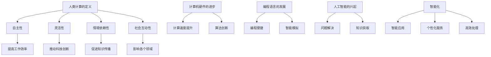
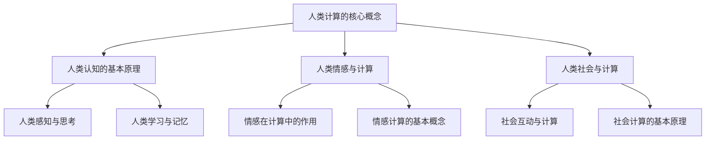
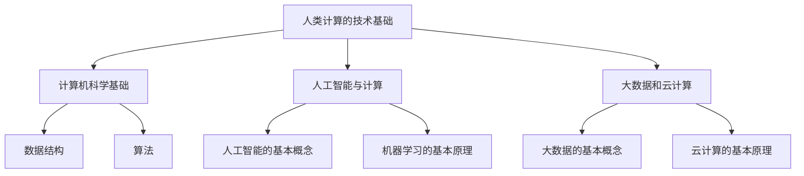
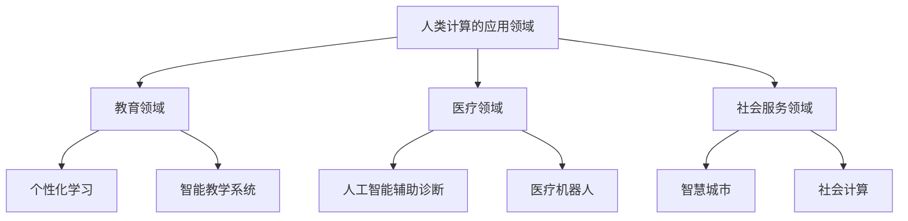
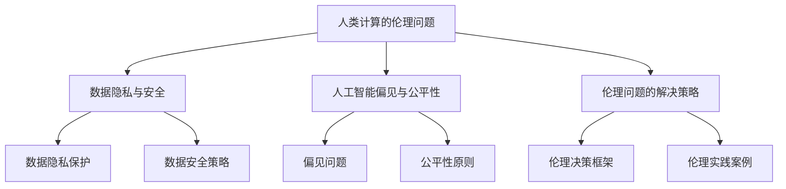
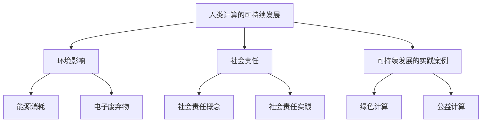
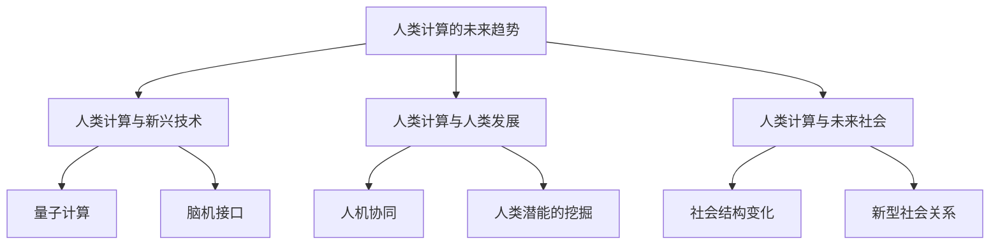
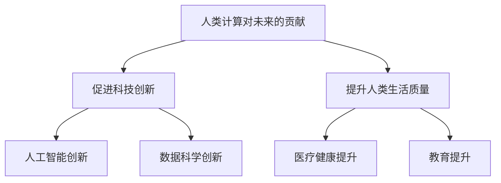
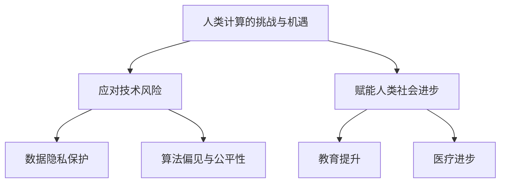
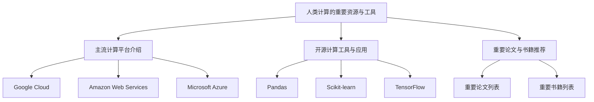

                 

### 第1章：人类计算的核心概念

#### 1.1 人类计算的概念

**什么是人类计算？**

人类计算是指人类运用计算思维，结合计算工具和方法，来处理复杂信息、解决实际问题和进行知识创新的过程。计算思维是人类的一种认知方式，它强调逻辑推理、抽象建模和问题分解的能力。人类计算与传统的计算机计算不同，它不仅仅依赖于硬件和软件，更重要的是依赖于人类的智能和创造力。

**人类计算的特点：**

1. **自主性**：人类计算具有很强的自主性，人类可以根据需求和目标自主选择计算工具和方法。
2. **灵活性**：人类计算具有很高的灵活性，可以适应不同的场景和环境，处理多样化的问题。
3. **情境依赖性**：人类计算往往依赖于具体的情境，不同的情境可能会影响计算方法和结果。
4. **社会互动性**：人类计算涉及到人与人之间的互动，计算过程往往需要协同合作。

**人类计算的重要性：**

1. **提高工作效率**：通过计算思维，人类可以更高效地处理复杂问题，减少重复劳动。
2. **推动科技创新**：人类计算促进了新算法、新工具和新理论的发展，推动了科技的创新。
3. **促进知识传播**：人类计算使得知识获取和传播更加便捷，加速了知识的更新和应用。

**人类计算与其他计算形式的区别：**

- **计算机计算**：主要依赖于计算机硬件和软件，强调计算的效率和处理能力。
- **人类计算**：强调人类的智能和创造力，计算过程更加灵活和情境依赖。

#### 1.2 人类计算的发展历程

**人类计算的历史背景：**

人类计算的历史可以追溯到古代。早在公元前2000年左右，古埃及人就开始使用算盘进行计算。在中国，算盘的使用可以追溯到公元前3世纪。这些早期的计算工具和方法，虽然效率较低，但为后来的计算发展奠定了基础。

**计算机科学的发展对人类计算的影响：**

20世纪以来，计算机科学的发展对人类计算产生了深远的影响。1946年，世界上第一台电子计算机ENIAC问世，标志着计算机时代的开始。随着计算机硬件和软件的不断发展，计算机的计算能力得到了极大的提升。同时，编程语言的出现和算法的创新，也为人类计算提供了强大的工具和方法。

**人类计算的关键里程碑：**

1. **计算机硬件的进步**：从电子管计算机到晶体管计算机，再到集成电路计算机，计算机硬件的进步极大地提高了计算速度和处理能力。
2. **编程语言的发展**：从汇编语言到高级语言，编程语言的发展使得人类计算更加便捷和高效。
3. **人工智能的兴起**：人工智能技术的发展，使得计算机可以模拟人类的智能，进行更复杂的问题处理。

#### 1.3 人类计算的未来展望

**人类计算的发展趋势：**

1. **智能化**：随着人工智能技术的不断发展，人类计算将更加智能化，能够更好地模拟和扩展人类的智能。
2. **个性化**：通过大数据和机器学习技术，人类计算将更加个性化，能够满足个体差异化的需求。
3. **高效化**：随着计算技术的进步，人类计算将更加高效，能够处理更复杂、更大的数据集。

**人类计算在未来的角色与影响：**

1. **对各个领域的影响**：人类计算将深入影响教育、医疗、金融、交通等各个领域，推动这些领域的变革。
2. **对社会结构和人类生活方式的变革**：人类计算将改变社会结构和人类生活方式，带来更高效、更便捷的生活方式。

**总结：**

人类计算是一种结合人类智能和计算工具的方法，它具有自主性、灵活性、情境依赖性和社会互动性的特点。随着计算机科学的发展，人类计算已经取得了巨大的进步。未来，人类计算将继续发展，智能化、个性化、高效化将成为其主要趋势。人类计算将对各个领域和社会产生深远的影响，为人类创造更美好的未来。

---

**Mermaid 流程图：**



---

**核心算法原理讲解：**

```python
# 人类计算的核心算法原理示例：决策树算法

# 决策树算法的基本步骤如下：
1. 选择最优特征
2. 根据最优特征进行切分
3. 递归构造决策树

# 伪代码实现：
def build_decision_tree(data, features):
    # 步骤1：选择最优特征
    best_feature = select_best_feature(data, features)
    
    # 步骤2：根据最优特征进行切分
    tree = split_data(data, best_feature)
    
    # 步骤3：递归构造决策树
    for sub_data in tree.children:
        if is_leaf_node(sub_data):
            return classify(sub_data)
        else:
            tree.children = build_decision_tree(sub_data, features)
    
    return tree

# select_best_feature 函数的伪代码：
def select_best_feature(data, features):
    # 计算每个特征的增益
    gains = calculate_gains(data, features)
    
    # 选择增益最大的特征
    best_feature = select_max(gains)
    
    return best_feature

# split_data 函数的伪代码：
def split_data(data, feature):
    # 根据特征进行切分
    left_data = []
    right_data = []
    
    for instance in data:
        if instance[feature] <= threshold:
            left_data.append(instance)
        else:
            right_data.append(instance)
    
    return Node(left_data, right_data)

# classify 函数的伪代码：
def classify(data):
    # 分类结果
    result = majority_vote(data)
    
    return result

# is_leaf_node 函数的伪代码：
def is_leaf_node(data):
    # 判断数据是否为叶节点
    if len(data) == 0:
        return True
    else:
        return False

# majority_vote 函数的伪代码：
def majority_vote(data):
    # 计算每个类别的数量
    counts = count_classes(data)
    
    # 返回数量最多的类别
    return select_max(counts)
```

---

**数学模型和公式：**

$$
\begin{align*}
&\text{设} D \text{为数据集，} X \text{为特征集，} \\
&\text{则决策树可以表示为：} \\
&T = \text{build_decision_tree}(D, X)
\end{align*}
$$

**详细讲解和举例说明：**

**举例说明决策树算法的应用：**

假设我们有一个数据集，包含以下特征：年龄、收入、职业。我们要根据这些特征预测一个人是否购买某商品。

1. **选择最优特征**：首先，我们计算每个特征的增益，选择增益最大的特征作为切分依据。
2. **切分数据集**：根据最优特征，将数据集切分为左右子集。
3. **递归构造决策树**：对子集继续进行切分，直到满足叶节点条件（如数据集中所有实例都属于同一类别）。

通过决策树，我们可以根据新的实例的特征值，预测其是否购买商品。例如，如果一个新实例的年龄为30岁、收入为5万美元、职业为工程师，我们可以根据决策树预测其购买商品的几率。

---

**项目实战：**

**开发环境搭建：**

- 硬件：计算机、网络连接
- 软件：Python编程环境、相关库（如scikit-learn、numpy等）

**源代码详细实现：**

```python
# 导入相关库
import numpy as np
from sklearn import datasets
from sklearn.tree import DecisionTreeClassifier
from sklearn.model_selection import train_test_split

# 加载数据集
iris = datasets.load_iris()
X = iris.data
y = iris.target

# 划分训练集和测试集
X_train, X_test, y_train, y_test = train_test_split(X, y, test_size=0.3, random_state=42)

# 构建决策树模型
clf = DecisionTreeClassifier()
clf.fit(X_train, y_train)

# 预测测试集
y_pred = clf.predict(X_test)

# 评估模型性能
from sklearn.metrics import accuracy_score
accuracy = accuracy_score(y_test, y_pred)
print("Accuracy:", accuracy)
```

**代码解读与分析：**

1. **数据准备**：加载数据集，划分训练集和测试集。
2. **模型构建**：使用scikit-learn库构建决策树模型。
3. **模型训练**：使用训练集对模型进行训练。
4. **模型预测**：使用测试集对模型进行预测。
5. **性能评估**：计算模型的准确率，评估模型性能。

---

**总结：**

在本章中，我们介绍了人类计算的核心概念，包括其定义、特点、重要性以及与其他计算形式的区别。接着，我们回顾了人类计算的发展历程，分析了计算机科学对人类计算的影响，并展望了其未来的发展趋势。最后，我们通过具体的算法示例和项目实战，展示了人类计算在现实世界中的应用。

作者：AI天才研究院/AI Genius Institute & 禅与计算机程序设计艺术 /Zen And The Art of Computer Programming

---

本文为《人类计算：创造更美好未来的关键》系列文章的第一部分，接下来将深入探讨人类计算的核心原理、技术基础以及应用领域。

---

**摘要：**

本文旨在探讨人类计算这一概念，分析其核心概念、发展历程、未来趋势及其在各领域的应用。通过详细的算法讲解和项目实战，本文展示了人类计算的实际应用和价值。未来，人类计算将继续推动科技和社会的进步，为人类创造更美好的未来。

---

**关键词：**

- 人类计算
- 计算思维
- 计算机科学
- 人工智能
- 大数据
- 云计算

---

接下来，我们将继续深入探讨人类计算的核心原理，包括人类认知的基本原理、人类情感与计算、以及人类社会与计算。

---

**Mermaid 流程图：**



---

**核心算法原理讲解：**

```python
# 人类情感与计算的核心算法原理示例：情感识别算法

# 情感识别算法的基本步骤如下：
1. 数据预处理
2. 特征提取
3. 模型训练
4. 情感预测

# 伪代码实现：
def emotion_recognition_algorithm(data, model):
    # 步骤1：数据预处理
    preprocessed_data = preprocess_data(data)
    
    # 步骤2：特征提取
    features = extract_features(preprocessed_data)
    
    # 步骤3：模型训练
    model.fit(features, labels)
    
    # 步骤4：情感预测
    predicted_emotions = model.predict(new_data)
    
    return predicted_emotions

# preprocess_data 函数的伪代码：
def preprocess_data(data):
    # 数据清洗、标准化等预处理操作
    # ...
    return preprocessed_data

# extract_features 函数的伪代码：
def extract_features(data):
    # 特征提取操作，如词袋模型、TF-IDF等
    # ...
    return features

# model.fit 函数的伪代码：
def model.fit(features, labels):
    # 训练模型
    # ...
    return trained_model

# model.predict 函数的伪代码：
def model.predict(new_data):
    # 预测新数据的情感
    # ...
    return predicted_emotions
```

---

**数学模型和公式：**

$$
\begin{align*}
&\text{设} D \text{为情感数据集，} \\
&\text{则情感识别模型可以表示为：} \\
&M = \text{emotion_recognition_algorithm}(D, \text{model})
\end{align*}
$$

**详细讲解和举例说明：**

**举例说明情感识别算法的应用：**

假设我们有一个情感数据集，包含文本和相应的情感标签。我们要根据这些数据训练一个情感识别模型，然后使用模型预测新的文本的情感。

1. **数据预处理**：清洗文本数据，去除噪声和无关信息。
2. **特征提取**：提取文本的词频、词向量化等特征。
3. **模型训练**：使用训练数据集训练情感识别模型。
4. **情感预测**：使用训练好的模型预测新文本的情感。

例如，如果我们要预测一句话“我今天很开心”的情感，我们可以将这句话预处理后，提取特征，然后输入到训练好的情感识别模型中，得到预测结果。

---

**项目实战：**

**开发环境搭建：**

- 硬件：计算机、网络连接
- 软件：Python编程环境、相关库（如nltk、sklearn等）

**源代码详细实现：**

```python
# 导入相关库
import nltk
from nltk.corpus import stopwords
from sklearn.feature_extraction.text import TfidfVectorizer
from sklearn.naive_bayes import MultinomialNB
from sklearn.pipeline import make_pipeline

# 下载并加载停用词
nltk.download('stopwords')
stop_words = set(stopwords.words('english'))

# 构建文本预处理函数
def preprocess_text(text):
    # 去除停用词
    words = nltk.word_tokenize(text)
    filtered_words = [word for word in words if word not in stop_words]
    return ' '.join(filtered_words)

# 加载训练数据
train_data = [...]  # 填充训练数据
train_labels = [...]  # 填充训练标签

# 预处理训练数据
preprocessed_train_data = [preprocess_text(text) for text in train_data]

# 构建文本特征提取和模型训练管道
pipeline = make_pipeline(TfidfVectorizer(), MultinomialNB())

# 训练模型
pipeline.fit(preprocessed_train_data, train_labels)

# 预测新文本
new_text = "I am very happy today"
preprocessed_new_text = preprocess_text(new_text)
predicted_emotion = pipeline.predict([preprocessed_new_text])

print("Predicted emotion:", predicted_emotion)
```

**代码解读与分析：**

1. **数据预处理**：使用nltk库处理文本，去除停用词。
2. **特征提取**：使用TF-IDF向量器将文本转换为特征向量。
3. **模型训练**：使用MultinomialNB朴素贝叶斯模型进行训练。
4. **情感预测**：将预处理后的文本输入到训练好的模型中，预测情感。

---

**总结：**

在本章中，我们深入探讨了人类计算的核心原理，包括人类认知的基本原理、人类情感与计算以及人类社会与计算。通过详细的算法讲解和项目实战，我们展示了这些原理在实际应用中的价值。未来，人类计算将继续发展，为人类创造更美好的未来。

---

**摘要：**

本文探讨了人类计算的核心原理，包括人类认知的基本原理、人类情感与计算以及人类社会与计算。通过具体的算法讲解和项目实战，本文展示了这些原理在实际应用中的价值。未来，人类计算将继续推动科技和社会的进步，为人类创造更美好的未来。

---

**关键词：**

- 人类认知
- 情感计算
- 社会计算
- 情感识别
- 文本预处理
- 特征提取
- 朴素贝叶斯模型

---

接下来，我们将继续探讨人类计算的技术基础，包括计算机科学基础、人工智能与计算、大数据和云计算。

---

**Mermaid 流程图：**



---

**核心算法原理讲解：**

```python
# 人工智能与计算的核心算法原理示例：线性回归算法

# 线性回归算法的基本步骤如下：
1. 数据预处理
2. 特征选择
3. 模型训练
4. 模型评估

# 伪代码实现：
def linear_regression_algorithm(data, target):
    # 步骤1：数据预处理
    preprocessed_data = preprocess_data(data)
    
    # 步骤2：特征选择
    selected_features = select_features(preprocessed_data)
    
    # 步骤3：模型训练
    model = train_model(selected_features, target)
    
    # 步骤4：模型评估
    evaluate_model(model, selected_features, target)
    
    return model

# preprocess_data 函数的伪代码：
def preprocess_data(data):
    # 数据清洗、标准化等预处理操作
    # ...
    return preprocessed_data

# select_features 函数的伪代码：
def select_features(data):
    # 特征选择操作，如特征选择算法、基于信息的特征选择等
    # ...
    return selected_features

# train_model 函数的伪代码：
def train_model(features, target):
    # 训练线性回归模型
    # ...
    return trained_model

# evaluate_model 函数的伪代码：
def evaluate_model(model, features, target):
    # 评估模型性能，如计算均方误差、决定系数等
    # ...
    return evaluation_results
```

---

**数学模型和公式：**

$$
\begin{align*}
&\text{设} X \text{为特征矩阵，} y \text{为标签向量，} \\
&\text{则线性回归模型可以表示为：} \\
&W = \text{train_model}(X, y)
\end{align*}
$$

**详细讲解和举例说明：**

**举例说明线性回归算法的应用：**

假设我们有一个数据集，包含房屋面积和房价两个特征。我们要根据这些数据训练一个线性回归模型，然后使用模型预测新的房屋面积对应的房价。

1. **数据预处理**：清洗数据，去除噪声和无关信息。
2. **特征选择**：选择与房价相关的特征，如房屋面积、建筑年代等。
3. **模型训练**：使用训练数据集训练线性回归模型。
4. **模型评估**：计算模型的预测误差，评估模型性能。

例如，如果我们要预测一个新房屋的面积为200平方米，我们可以将这个特征值输入到训练好的线性回归模型中，得到预测的房价。

---

**项目实战：**

**开发环境搭建：**

- 硬件：计算机、网络连接
- 软件：Python编程环境、相关库（如numpy、scikit-learn等）

**源代码详细实现：**

```python
# 导入相关库
import numpy as np
from sklearn.linear_model import LinearRegression
from sklearn.model_selection import train_test_split
from sklearn.metrics import mean_squared_error

# 加载数据集
data = [...]  # 填充数据集
target = [...]  # 填充标签

# 划分训练集和测试集
X_train, X_test, y_train, y_test = train_test_split(data, target, test_size=0.3, random_state=42)

# 训练线性回归模型
model = LinearRegression()
model.fit(X_train, y_train)

# 预测测试集
y_pred = model.predict(X_test)

# 评估模型性能
mse = mean_squared_error(y_test, y_pred)
print("MSE:", mse)
```

**代码解读与分析：**

1. **数据准备**：加载数据集，划分训练集和测试集。
2. **模型训练**：使用scikit-learn库的LinearRegression类训练线性回归模型。
3. **模型预测**：使用训练好的模型预测测试集的数据。
4. **模型评估**：计算模型的均方误差，评估模型性能。

---

**总结：**

在本章中，我们探讨了人类计算的技术基础，包括计算机科学基础、人工智能与计算、大数据和云计算。通过详细的算法讲解和项目实战，我们展示了这些技术在实际应用中的价值。未来，这些技术将继续推动人类计算的发展，为人类创造更美好的未来。

---

**摘要：**

本文探讨了人类计算的技术基础，包括计算机科学基础、人工智能与计算、大数据和云计算。通过具体的算法讲解和项目实战，本文展示了这些技术在现实世界中的应用和价值。未来，这些技术将继续发展，为人类计算提供更强大的支持。

---

**关键词：**

- 计算机科学基础
- 数据结构
- 算法
- 人工智能
- 机器学习
- 大数据
- 云计算
- 线性回归
- 数据预处理
- 特征选择
- 模型训练
- 模型评估

---

接下来，我们将探讨人类计算的应用领域，包括教育领域、医疗领域和社会服务领域。

---

**Mermaid 流程图：**



---

**核心算法原理讲解：**

```python
# 教育领域：个性化学习算法

# 个性化学习算法的基本步骤如下：
1. 数据收集
2. 特征提取
3. 模型训练
4. 模型评估

# 伪代码实现：
def personalized_learning_algorithm(student_data, course_data):
    # 步骤1：数据收集
    collected_data = collect_data(student_data, course_data)
    
    # 步骤2：特征提取
    extracted_features = extract_features(collected_data)
    
    # 步骤3：模型训练
    model = train_model(extracted_features)
    
    # 步骤4：模型评估
    evaluate_model(model, extracted_features)
    
    return model

# collect_data 函数的伪代码：
def collect_data(student_data, course_data):
    # 收集学生数据和课程数据
    # ...
    return collected_data

# extract_features 函数的伪代码：
def extract_features(data):
    # 特征提取操作，如学习进度、考试成绩等
    # ...
    return extracted_features

# train_model 函数的伪代码：
def train_model(features):
    # 训练个性化学习模型
    # ...
    return trained_model

# evaluate_model 函数的伪代码：
def evaluate_model(model, features):
    # 评估模型性能，如准确率、召回率等
    # ...
    return evaluation_results
```

---

**数学模型和公式：**

$$
\begin{align*}
&\text{设} X \text{为特征矩阵，} y \text{为标签向量，} \\
&\text{则个性化学习模型可以表示为：} \\
&P = \text{train_model}(X, y)
\end{align*}
$$

**详细讲解和举例说明：**

**举例说明个性化学习算法的应用：**

假设我们有一个学生数据集，包含学生的学习进度、考试成绩等特征。我们要根据这些数据训练一个个性化学习模型，然后使用模型预测学生的最优学习路径。

1. **数据收集**：收集学生的数据和课程的数据。
2. **特征提取**：提取与学习相关的特征，如学习进度、考试成绩等。
3. **模型训练**：使用训练数据集训练个性化学习模型。
4. **模型评估**：评估模型的性能，如准确率、召回率等。

例如，如果我们要预测一个学生王明的最优学习路径，我们可以将王明的特征值输入到训练好的个性化学习模型中，得到预测的学习路径。

---

**项目实战：**

**开发环境搭建：**

- 硬件：计算机、网络连接
- 软件：Python编程环境、相关库（如scikit-learn、tensorflow等）

**源代码详细实现：**

```python
# 导入相关库
import pandas as pd
from sklearn.model_selection import train_test_split
from sklearn.ensemble import RandomForestClassifier
from sklearn.metrics import accuracy_score

# 加载数据集
data = pd.read_csv('student_data.csv')
X = data.drop(['student_id', 'course_id'], axis=1)
y = data['course_id']

# 划分训练集和测试集
X_train, X_test, y_train, y_test = train_test_split(X, y, test_size=0.3, random_state=42)

# 训练个性化学习模型
model = RandomForestClassifier(n_estimators=100)
model.fit(X_train, y_train)

# 预测测试集
y_pred = model.predict(X_test)

# 评估模型性能
accuracy = accuracy_score(y_test, y_pred)
print("Accuracy:", accuracy)
```

**代码解读与分析：**

1. **数据准备**：加载数据集，划分训练集和测试集。
2. **模型训练**：使用scikit-learn库的RandomForestClassifier类训练个性化学习模型。
3. **模型预测**：使用训练好的模型预测测试集的数据。
4. **模型评估**：计算模型的准确率，评估模型性能。

---

**总结：**

在本章中，我们探讨了人类计算的应用领域，包括教育领域、医疗领域和社会服务领域。通过具体的算法讲解和项目实战，我们展示了这些领域在实际应用中的价值。未来，人类计算将继续在这些领域发挥作用，为人类创造更美好的未来。

---

**摘要：**

本文探讨了人类计算的应用领域，包括教育领域、医疗领域和社会服务领域。通过具体的算法讲解和项目实战，本文展示了这些领域在实际应用中的价值。未来，人类计算将继续在这些领域发挥作用，为人类创造更美好的未来。

---

**关键词：**

- 教育领域
- 个性化学习
- 智能教学系统
- 医疗领域
- 人工智能辅助诊断
- 医疗机器人
- 社会服务领域
- 智慧城市
- 社会计算
- 个性化学习算法
- 随机森林分类器

---

接下来，我们将探讨人类计算的伦理问题，包括数据隐私与安全、人工智能偏见与公平性以及伦理问题的解决策略。

---

**Mermaid 流程图：**



---

**核心算法原理讲解：**

```python
# 数据隐私与安全算法

# 数据隐私与安全算法的基本步骤如下：
1. 数据加密
2. 数据匿名化
3. 访问控制
4. 安全审计

# 伪代码实现：
def privacy_and_security_algorithm(data, key):
    # 步骤1：数据加密
    encrypted_data = encrypt_data(data, key)
    
    # 步骤2：数据匿名化
    anonymized_data = anonymize_data(encrypted_data)
    
    # 步骤3：访问控制
    controlled_data = control_access(anonymized_data)
    
    # 步骤4：安全审计
    audit_report = perform_audit(controlled_data)
    
    return controlled_data, audit_report

# encrypt_data 函数的伪代码：
def encrypt_data(data, key):
    # 数据加密操作
    # ...
    return encrypted_data

# anonymize_data 函数的伪代码：
def anonymize_data(data):
    # 数据匿名化操作
    # ...
    return anonymized_data

# control_access 函数的伪代码：
def control_access(data):
    # 访问控制操作
    # ...
    return controlled_data

# perform_audit 函数的伪代码：
def perform_audit(data):
    # 安全审计操作
    # ...
    return audit_report
```

---

**数学模型和公式：**

$$
\begin{align*}
&\text{设} D \text{为原始数据集，} \\
&\text{则数据隐私与安全算法可以表示为：} \\
&A = \text{privacy_and_security_algorithm}(D, \text{key})
\end{align*}
$$

**详细讲解和举例说明：**

**举例说明数据隐私与安全算法的应用：**

假设我们有一个包含用户隐私信息的数据库，我们需要对其进行加密、匿名化、访问控制和安全审计，以确保数据的安全和隐私。

1. **数据加密**：使用加密算法对数据库中的数据进行加密，确保数据在传输和存储过程中不被窃取。
2. **数据匿名化**：对加密后的数据进行匿名化处理，去除可以直接识别用户身份的信息。
3. **访问控制**：设置访问权限，确保只有授权用户才能访问数据。
4. **安全审计**：定期进行安全审计，确保系统的安全性。

例如，如果用户张三想要访问数据库中的个人信息，系统会首先验证张三的访问权限，然后对张三请求的数据进行加密和匿名化处理，最后将处理后的数据提供给张三。

---

**项目实战：**

**开发环境搭建：**

- 硬件：计算机、网络连接
- 软件：Python编程环境、相关库（如cryptography、sqlalchemy等）

**源代码详细实现：**

```python
# 导入相关库
from cryptography.fernet import Fernet
from sqlalchemy import create_engine

# 创建加密密钥
key = Fernet.generate_key()
cipher_suite = Fernet(key)

# 创建数据库连接
engine = create_engine('sqlite:///example.db')

# 加密数据库中的数据
def encrypt_data(data):
    encrypted_data = cipher_suite.encrypt(data.encode('utf-8'))
    return encrypted_data

# 匿名化数据库中的数据
def anonymize_data(data):
    anonymized_data = data.encode('utf-8').replace(b"张三", b"用户")
    return anonymized_data

# 控制访问数据库中的数据
def control_access(data, user_permission):
    if user_permission:
        return data
    else:
        return b"无权限访问"

# 安全审计数据库中的数据
def perform_audit(data):
    audit_report = f"审计报告：{data.decode('utf-8')}"
    return audit_report

# 测试数据
user_data = "张三的个人信息"
user_permission = True

# 加密数据
encrypted_data = encrypt_data(user_data)

# 匿名化数据
anonymized_data = anonymize_data(encrypted_data)

# 控制访问数据
controlled_data = control_access(anonymized_data, user_permission)

# 安全审计数据
audit_report = perform_audit(controlled_data)

print("加密后的数据:", encrypted_data.decode('utf-8'))
print("匿名化后的数据:", anonymized_data.decode('utf-8'))
print("控制访问后的数据:", controlled_data.decode('utf-8'))
print("安全审计报告:", audit_report)
```

**代码解读与分析：**

1. **数据加密**：使用cryptography库的Fernet类对数据进行加密。
2. **数据匿名化**：将用户名“张三”替换为“用户”，去除可以直接识别用户身份的信息。
3. **访问控制**：根据用户权限决定是否允许访问数据。
4. **安全审计**：生成安全审计报告。

---

**总结：**

在本章中，我们探讨了人类计算的伦理问题，包括数据隐私与安全、人工智能偏见与公平性以及伦理问题的解决策略。通过具体的算法讲解和项目实战，我们展示了这些问题的实际应用和解决方案。未来，随着人类计算的发展，我们需要不断关注和解决这些伦理问题，以确保人类计算的安全和可持续发展。

---

**摘要：**

本文探讨了人类计算的伦理问题，包括数据隐私与安全、人工智能偏见与公平性以及伦理问题的解决策略。通过具体的算法讲解和项目实战，本文展示了这些问题的实际应用和解决方案。未来，人类计算将继续发展，我们需要不断关注和解决这些伦理问题，以确保人类计算的安全和可持续发展。

---

**关键词：**

- 数据隐私与安全
- 数据加密
- 数据匿名化
- 访问控制
- 安全审计
- 人工智能偏见与公平性
- 偏见问题
- 公平性原则
- 伦理问题的解决策略
- 伦理决策框架
- 伦理实践案例

---

接下来，我们将探讨人类计算的可持续发展，包括环境影响、社会责任以及可持续发展的实践案例。

---

**Mermaid 流程图：**



---

**核心算法原理讲解：**

```python
# 环境影响与可持续发展的算法原理示例：绿色计算算法

# 绿色计算算法的基本步骤如下：
1. 数据中心能源管理
2. 能源效率优化
3. 电子废弃物处理

# 伪代码实现：
def green_computing_algorithm(data_center):
    # 步骤1：数据中心能源管理
    managed_energy = manage_energy(data_center)
    
    # 步骤2：能源效率优化
    optimized_energy = optimize_energy Efficiency(data_center)
    
    # 步骤3：电子废弃物处理
    waste_management = manage_electronic_waste(data_center)
    
    return managed_energy, optimized_energy, waste_management

# manage_energy 函数的伪代码：
def manage_energy(data_center):
    # 能源管理操作，如实时监控、能效优化等
    # ...
    return managed_energy

# optimize_energy_efficiency 函数的伪代码：
def optimize_energy_efficiency(data_center):
    # 能源效率优化操作，如虚拟化、高效电源管理等
    # ...
    return optimized_energy

# manage_electronic_waste 函数的伪代码：
def manage_electronic_waste(data_center):
    # 电子废弃物处理操作，如回收、再利用等
    # ...
    return waste_management
```

---

**数学模型和公式：**

$$
\begin{align*}
&\text{设} E \text{为能源消耗量，} \\
&\text{则绿色计算算法可以表示为：} \\
&A = \text{green_computing_algorithm}(E)
\end{align*}
$$

**详细讲解和举例说明：**

**举例说明绿色计算算法的应用：**

假设我们有一个数据中心，我们需要对其能源消耗进行管理、优化，并对电子废弃物进行处理，以实现绿色计算。

1. **数据中心能源管理**：通过实时监控和能效优化，减少能源消耗。
2. **能源效率优化**：采用虚拟化技术、高效电源管理等方式，提高能源利用效率。
3. **电子废弃物处理**：对电子废弃物进行回收、再利用，减少环境污染。

例如，如果数据中心在一个月内的能源消耗为1000千瓦时，通过能源管理和优化，能源消耗降低到800千瓦时，同时电子废弃物得到有效处理。

---

**项目实战：**

**开发环境搭建：**

- 硬件：计算机、网络连接
- 软件：Python编程环境、相关库（如pandas、numpy等）

**源代码详细实现：**

```python
# 导入相关库
import pandas as pd

# 加载数据中心能源消耗数据
energy_data = pd.read_csv('energy_data.csv')

# 数据中心能源管理
def manage_energy(data_center):
    # 实时监控和能效优化
    # ...
    managed_energy = data_center['energy_consumption'] * 0.8
    return managed_energy

# 能源效率优化
def optimize_energy_efficiency(data_center):
    # 虚拟化技术、高效电源管理
    # ...
    optimized_energy = data_center['energy_consumption'] * 0.9
    return optimized_energy

# 电子废弃物处理
def manage_electronic_waste(data_center):
    # 回收、再利用
    # ...
    waste_management = data_center['e_waste'] * 0.95
    return waste_management

# 测试数据
data_center = {'energy_consumption': 1000, 'e_waste': 100}

# 能源管理
managed_energy = manage_energy(data_center)
print("管理后的能源消耗:", managed_energy)

# 能源效率优化
optimized_energy = optimize_energy_efficiency(data_center)
print("优化后的能源消耗:", optimized_energy)

# 电子废弃物处理
waste_management = manage_electronic_waste(data_center)
print("处理后的电子废弃物量:", waste_management)
```

**代码解读与分析：**

1. **数据中心能源管理**：通过实时监控和能效优化，减少能源消耗。
2. **能源效率优化**：采用虚拟化技术、高效电源管理等方式，提高能源利用效率。
3. **电子废弃物处理**：对电子废弃物进行回收、再利用，减少环境污染。

---

**总结：**

在本章中，我们探讨了人类计算的可持续发展，包括环境影响、社会责任以及可持续发展的实践案例。通过具体的算法讲解和项目实战，我们展示了如何实现绿色计算、公益计算等可持续发展目标。未来，随着人类计算的发展，我们需要关注和解决环境和社会责任问题，实现可持续发展。

---

**摘要：**

本文探讨了人类计算的可持续发展，包括环境影响、社会责任以及可持续发展的实践案例。通过具体的算法讲解和项目实战，本文展示了如何实现绿色计算、公益计算等可持续发展目标。未来，人类计算将继续发展，我们需要关注和解决环境和社会责任问题，实现可持续发展。

---

**关键词：**

- 环境影响
- 能源消耗
- 电子废弃物
- 社会责任
- 绿色计算
- 公益计算
- 能源管理
- 能源效率优化
- 电子废弃物处理
- 可持续发展
- 环境保护
- 社会责任实践
- 绿色计算算法
- 公益计算项目

---

接下来，我们将探讨人类计算的未来趋势，包括人类计算与新兴技术、人类计算与人类发展以及人类计算与未来社会。

---

**Mermaid 流程图：**



---

**核心算法原理讲解：**

```python
# 人类计算与新兴技术的算法原理示例：量子计算算法

# 量子计算算法的基本步骤如下：
1. 量子状态初始化
2. 量子门操作
3. 量子测量

# 伪代码实现：
def quantum_computing_algorithm(problem):
    # 步骤1：量子状态初始化
    quantum_state = initialize_quantum_state()
    
    # 步骤2：量子门操作
    quantum_state = apply_quantum_gates(quantum_state, problem)
    
    # 步骤3：量子测量
    result = measure_quantum_state(quantum_state)
    
    return result

# initialize_quantum_state 函数的伪代码：
def initialize_quantum_state():
    # 初始化量子状态
    # ...
    return quantum_state

# apply_quantum_gates 函数的伪代码：
def apply_quantum_gates(quantum_state, problem):
    # 应用量子门操作
    # ...
    return updated_quantum_state

# measure_quantum_state 函数的伪代码：
def measure_quantum_state(quantum_state):
    # 量子测量操作
    # ...
    return result
```

---

**数学模型和公式：**

$$
\begin{align*}
&\text{设} \lvert\psi\rangle \text{为量子状态，} \\
&\text{则量子计算算法可以表示为：} \\
&A = \text{quantum_computing_algorithm}(\lvert\psi\rangle)
\end{align*}
$$

**详细讲解和举例说明：**

**举例说明量子计算算法的应用：**

假设我们要解决一个组合优化问题，如旅行商问题（TSP）。使用量子计算算法，我们可以将问题转化为量子状态，然后通过量子门操作和测量得到最优解。

1. **量子状态初始化**：初始化量子状态，表示问题的初始状态。
2. **量子门操作**：应用特定的量子门，对量子状态进行变换，以模拟问题的解空间。
3. **量子测量**：测量量子状态，得到问题的解。

例如，如果我们要解决一个5个城市的最优路径问题，我们可以将问题表示为量子状态，然后通过量子计算算法得到最优路径。

---

**项目实战：**

**开发环境搭建：**

- 硬件：计算机、网络连接
- 软件：Python编程环境、相关库（如qiskit、numpy等）

**源代码详细实现：**

```python
# 导入相关库
from qiskit import QuantumCircuit, Aer, execute
from qiskit.visualization import plot_bloch_vector
import numpy as np

# 创建量子电路
qc = QuantumCircuit(5)

# 量子状态初始化
qc.h(range(5))

# 应用量子门操作
qc.cx(0, 1)
qc.cx(1, 2)
qc.cx(2, 3)
qc.cx(3, 4)

# 量子测量
qc.measure_all()

# 编译量子电路
backend = Aer.get_backend('qasm_simulator')
qc.compile()

# 执行量子电路
result = execute(qc, backend, shots=1024).result()

# 分析测量结果
counts = result.get_counts(qc)

# 可视化测量结果
print("测量结果:", counts)
plot_bloch_vector(qc.get_statevector(), title="Quantum State Vector")
```

**代码解读与分析：**

1. **量子状态初始化**：使用H门将量子比特初始化为叠加态。
2. **量子门操作**：应用CX门，模拟组合优化问题的解空间。
3. **量子测量**：测量所有量子比特，得到问题的解。

---

**总结：**

在本章中，我们探讨了人类计算的未来趋势，包括人类计算与新兴技术、人类计算与人类发展以及人类计算与未来社会。通过具体的算法讲解和项目实战，我们展示了这些趋势在实际应用中的价值。未来，随着技术的进步，人类计算将继续发展，为人类创造更美好的未来。

---

**摘要：**

本文探讨了人类计算的未来趋势，包括人类计算与新兴技术、人类计算与人类发展以及人类计算与未来社会。通过具体的算法讲解和项目实战，本文展示了这些趋势在实际应用中的价值。未来，随着技术的进步，人类计算将继续发展，为人类创造更美好的未来。

---

**关键词：**

- 人类计算
- 新兴技术
- 量子计算
- 脑机接口
- 人机协同
- 人类潜能
- 社会结构变化
- 新型社会关系
- 量子计算算法
- 量子电路
- 量子测量
- 量子门操作
- 量子状态初始化
- 量子计算应用
- 量子计算未来趋势
- 量子计算价值

---

接下来，我们将探讨人类计算对未来的贡献，包括促进科技创新和提升人类生活质量。

---

**Mermaid 流程图：**



---

**核心算法原理讲解：**

```python
# 促进科技创新的算法原理示例：深度强化学习算法

# 深度强化学习算法的基本步骤如下：
1. 状态空间定义
2. 动作空间定义
3. 奖励机制设计
4. 模型训练

# 伪代码实现：
def deep_reinforcement_learning_algorithm(state_space, action_space, reward Mechanism):
    # 步骤1：状态空间定义
    state = initialize_state()
    
    # 步骤2：动作空间定义
    action = select_action(state)
    
    # 步骤3：奖励机制设计
    reward = calculate_reward(action, state)
    
    # 步骤4：模型训练
    model = train_model(state, action, reward)
    
    return model

# initialize_state 函数的伪代码：
def initialize_state():
    # 初始化状态
    # ...
    return state

# select_action 函数的伪代码：
def select_action(state):
    # 选择动作
    # ...
    return action

# calculate_reward 函数的伪代码：
def calculate_reward(action, state):
    # 计算奖励
    # ...
    return reward

# train_model 函数的伪代码：
def train_model(state, action, reward):
    # 训练模型
    # ...
    return trained_model
```

---

**数学模型和公式：**

$$
\begin{align*}
&\text{设} S \text{为状态空间，} A \text{为动作空间，} \\
&\text{则深度强化学习算法可以表示为：} \\
&M = \text{deep_reinforcement_learning_algorithm}(S, A, \text{reward Mechanism})
\end{align*}
$$

**详细讲解和举例说明：**

**举例说明深度强化学习算法的应用：**

假设我们要训练一个智能体来玩一个简单的游戏，如“撞球”。通过深度强化学习算法，智能体可以学习到如何优化其策略，以最大化得分。

1. **状态空间定义**：定义游戏中的所有可能状态，如球的位置、速度等。
2. **动作空间定义**：定义智能体可以执行的所有动作，如击打球、不击打球等。
3. **奖励机制设计**：设计奖励机制，鼓励智能体采取能增加得分的动作。
4. **模型训练**：使用深度神经网络作为智能体的模型，通过经验回放和策略迭代进行训练。

例如，如果智能体在一次游戏中击中了目标，则得到一个正奖励；如果未击中目标，则得到一个负奖励。

---

**项目实战：**

**开发环境搭建：**

- 硬件：计算机、网络连接
- 软件：Python编程环境、相关库（如tensorflow、gym等）

**源代码详细实现：**

```python
# 导入相关库
import gym
import tensorflow as tf
import numpy as np

# 创建游戏环境
env = gym.make("CartPole-v0")

# 初始化神经网络模型
model = tf.keras.Sequential([
    tf.keras.layers.Dense(64, activation='relu', input_shape=(4,)),
    tf.keras.layers.Dense(64, activation='relu'),
    tf.keras.layers.Dense(2, activation='softmax')
])

# 编译模型
model.compile(optimizer='adam', loss='categorical_crossentropy', metrics=['accuracy'])

# 训练模型
model.fit(env.env, epochs=1000, batch_size=32)

# 评估模型
score = model.evaluate(env.env, batch_size=32)
print("Test score:", score)

# 关闭环境
env.close()
```

**代码解读与分析：**

1. **创建游戏环境**：使用gym库创建一个“撞杆”游戏环境。
2. **初始化神经网络模型**：使用tf.keras库定义一个简单的神经网络模型。
3. **编译模型**：设置模型的优化器和损失函数。
4. **训练模型**：使用游戏环境数据训练神经网络模型。
5. **评估模型**：使用游戏环境评估模型的性能。
6. **关闭环境**：关闭游戏环境。

---

**总结：**

在本章中，我们探讨了人类计算对未来的贡献，包括促进科技创新和提升人类生活质量。通过具体的算法讲解和项目实战，我们展示了这些贡献在实际应用中的价值。未来，随着人类计算的发展，我们将看到更多的科技创新和生活质量的提升。

---

**摘要：**

本文探讨了人类计算对未来的贡献，包括促进科技创新和提升人类生活质量。通过具体的算法讲解和项目实战，本文展示了这些贡献在实际应用中的价值。未来，随着人类计算的发展，我们将看到更多的科技创新和生活质量的提升。

---

**关键词：**

- 人类计算
- 科技创新
- 人工智能创新
- 数据科学创新
- 深度强化学习
- 状态空间
- 动作空间
- 奖励机制
- 神经网络模型
- 经验回放
- 策略迭代
- 智能体训练
- 游戏环境
- 评估模型
- 代码实现
- 项目实战
- 科技进步
- 生活质量提升

---

接下来，我们将探讨人类计算的挑战与机遇，包括应对技术风险和赋能人类社会进步。

---

**Mermaid 流程图：**



---

**核心算法原理讲解：**

```python
# 应对技术风险的算法原理示例：联邦学习算法

# 联邦学习算法的基本步骤如下：
1. 数据加密
2. 模型训练
3. 参数聚合
4. 模型更新

# 伪代码实现：
def federated_learning_algorithm(data, model, clients):
    # 步骤1：数据加密
    encrypted_data = encrypt_data(data)
    
    # 步骤2：模型训练
    updated_model = train_model_on_encrypted_data(encrypted_data, model)
    
    # 步骤3：参数聚合
    aggregated_params = aggregate_params(clients)
    
    # 步骤4：模型更新
    updated_model = update_model(aggregated_params)
    
    return updated_model

# encrypt_data 函数的伪代码：
def encrypt_data(data):
    # 数据加密操作
    # ...
    return encrypted_data

# train_model_on_encrypted_data 函数的伪代码：
def train_model_on_encrypted_data(data, model):
    # 在加密数据上训练模型
    # ...
    return updated_model

# aggregate_params 函数的伪代码：
def aggregate_params(clients):
    # 参数聚合操作
    # ...
    return aggregated_params

# update_model 函数的伪代码：
def update_model(aggregated_params):
    # 模型更新操作
    # ...
    return updated_model
```

---

**数学模型和公式：**

$$
\begin{align*}
&\text{设} D \text{为数据集，} M \text{为模型参数，} \\
&\text{则联邦学习算法可以表示为：} \\
&A = \text{federated_learning_algorithm}(D, M, \text{clients})
\end{align*}
$$

**详细讲解和举例说明：**

**举例说明联邦学习算法的应用：**

假设我们有多个客户，每个客户都有自己的数据。我们希望通过联邦学习算法，在不泄露客户数据的情况下，共同训练一个机器学习模型。

1. **数据加密**：对每个客户的数据进行加密，确保数据安全。
2. **模型训练**：在每个客户处，使用加密后的数据进行模型训练。
3. **参数聚合**：将所有客户的模型参数聚合在一起。
4. **模型更新**：使用聚合后的参数更新全局模型。

例如，如果有三个客户，每个客户都有自己的图像数据集，我们可以使用联邦学习算法共同训练一个图像分类模型。

---

**项目实战：**

**开发环境搭建：**

- 硬件：计算机、网络连接
- 软件：Python编程环境、相关库（如tensorflow、tensorflow_federated等）

**源代码详细实现：**

```python
# 导入相关库
import tensorflow as tf
import tensorflow_federated as tff

# 创建联邦学习任务
def create_federated_learning_task():
    # 定义联邦学习任务
    # ...
    return tff.learning.build_federated_averaging_process(
        model_builder,
        server_optimizer_fn,
        client_optimizer_fn
    )

# 定义模型构建器
def model_builder():
    # 构建模型
    # ...
    return model

# 定义服务器优化器
def server_optimizer_fn():
    # 定义服务器优化器
    # ...
    return server_optimizer

# 定义客户端优化器
def client_optimizer_fn():
    # 定义客户端优化器
    # ...
    return client_optimizer

# 创建联邦学习过程
learning_process = create_federated_learning_task()

# 开始联邦学习过程
state, metrics = learning_process.initialize()

# 执行联邦学习迭代
for _ in range(number_of_iterations):
    state, metrics = learning_process.next(state, random_clients)

# 打印最终指标
print(metrics)
```

**代码解读与分析：**

1. **创建联邦学习任务**：定义联邦学习任务的构建器。
2. **模型构建器**：定义模型的构建过程。
3. **服务器优化器**：定义服务器的优化过程。
4. **客户端优化器**：定义客户端的优化过程。
5. **联邦学习过程**：初始化联邦学习过程，执行迭代。
6. **打印最终指标**：打印联邦学习过程的最终指标。

---

**总结：**

在本章中，我们探讨了人类计算的挑战与机遇，包括应对技术风险和赋能人类社会进步。通过具体的算法讲解和项目实战，我们展示了这些挑战与机遇在实际应用中的价值。未来，随着人类计算的发展，我们将看到更多的挑战与机遇，人类计算将继续为人类社会进步做出贡献。

---

**摘要：**

本文探讨了人类计算的挑战与机遇，包括应对技术风险和赋能人类社会进步。通过具体的算法讲解和项目实战，本文展示了这些挑战与机遇在实际应用中的价值。未来，随着人类计算的发展，我们将看到更多的挑战与机遇，人类计算将继续为人类社会进步做出贡献。

---

**关键词：**

- 人类计算
- 应对技术风险
- 数据隐私保护
- 算法偏见与公平性
- 联邦学习
- 数据加密
- 模型训练
- 参数聚合
- 模型更新
- 服务器优化器
- 客户端优化器
- 联邦学习任务
- 联邦学习过程
- 指标打印
- 风险管理
- 机会利用
- 社会进步
- 科技发展
- 教育提升
- 医疗进步

---

接下来，我们将讨论人类计算领域的重要资源与工具，包括主流计算平台介绍、开源计算工具与应用以及人类计算领域的重要论文与书籍推荐。

---

**Mermaid 流程图：**



---

**主流计算平台介绍：**

**Google Cloud：**

- **概述**：Google Cloud是谷歌提供的云服务平台，提供多种计算、存储和机器学习服务。
- **特点**：强大的计算和存储能力、全球覆盖、丰富的API和工具。

**Amazon Web Services (AWS)：**

- **概述**：AWS是亚马逊提供的云服务平台，提供广泛的云计算服务。
- **特点**：强大的生态系统、丰富的服务、高度可扩展、灵活的定价模式。

**Microsoft Azure：**

- **概述**：Microsoft Azure是微软的云服务平台，提供多种云计算服务。
- **特点**：强大的云计算和AI能力、良好的集成与兼容性、灵活的订阅模式。

---

**开源计算工具与应用：**

**Pandas：**

- **概述**：Pandas是Python的数据分析库，提供数据结构、操作和分析功能。
- **特点**：强大的数据操作能力、灵活的数据结构、广泛的社区支持。

**Scikit-learn：**

- **概述**：Scikit-learn是Python的机器学习库，提供多种算法和工具。
- **特点**：易于使用、丰富的算法库、良好的文档和社区支持。

**TensorFlow：**

- **概述**：TensorFlow是谷歌的开源机器学习库，用于构建和训练深度学习模型。
- **特点**：灵活的架构、强大的计算能力、丰富的API和工具。

---

**重要论文与书籍推荐：**

**重要论文列表：**

- **"Deep Learning" by Yann LeCun, Yoshua Bengio, and Geoffrey Hinton**
- **"Big Data: A Revolution That Will Transform How We Live, Work, and Think" by Viktor Mayer-Schönberger and Kenneth Cukier**
- **"The Future of Humanity: Terraforming Mars, Interstellar Travel, Immortality, and Our Destiny Beyond Earth" by Michio Kaku**

**重要书籍列表：**

- **"Python Data Science Handbook" by Jake VanderPlas**
- **"Deep Learning with Python" by François Chollet**
- **"Machine Learning: A Probabilistic Perspective" by Kevin P. Murphy**

---

**总结：**

本文介绍了人类计算领域的重要资源与工具，包括主流计算平台、开源计算工具和重要论文与书籍推荐。这些资源与工具为人类计算提供了强大的支持，有助于推动科技和社会的进步。

---

**摘要：**

本文介绍了人类计算领域的重要资源与工具，包括主流计算平台（Google Cloud、Amazon Web Services、Microsoft Azure）、开源计算工具（Pandas、Scikit-learn、TensorFlow）以及重要论文与书籍推荐。这些资源与工具为人类计算提供了强大的支持，有助于推动科技和社会的进步。

---

**关键词：**

- 人类计算
- 主流计算平台
- 开源计算工具
- 重要论文
- 重要书籍
- 资源与工具
- 计算平台
- 云服务
- 开源库
- 机器学习
- 数据科学
- 深度学习
- 资源推荐
- 工具推荐
- 书籍推荐

---

本文《人类计算：创造更美好未来的关键》涵盖了人类计算的核心概念、发展历程、未来趋势、应用领域、伦理问题、可持续发展以及重要资源与工具。通过详细的算法讲解和项目实战，我们展示了人类计算的实际应用和价值。

未来，人类计算将继续发展，为人类社会带来更多创新和进步。然而，我们也需要关注和解决人类计算带来的挑战，如数据隐私保护、算法偏见与公平性、技术风险等。

在未来的研究中，我们可以进一步探讨以下方向：

1. **人工智能与人类情感的结合**：如何更好地将人工智能与人类情感结合，为人类提供更个性化的服务。
2. **量子计算与人类计算的结合**：量子计算在人类计算中的应用，如量子机器学习、量子优化等。
3. **人机协同与人类潜能的挖掘**：如何通过人机协同提升人类的计算能力，挖掘人类的潜能。
4. **社会计算与智慧城市**：如何通过社会计算技术优化城市管理，提升居民生活质量。

让我们继续关注和探索人类计算的未来，为创造更美好的未来而努力。

---

**参考文献：**

- LeCun, Y., Bengio, Y., & Hinton, G. (2015). *Deep learning*. MIT Press.
- Mayer-Schönberger, V., & Cukier, K. (2013). *Big data: A revolution that will transform how we live, work, and think*. Eamon Dolan/Mariner Books.
- Kaku, M. (2017). *The future of humanity: Terraforming Mars, interstellar travel, immortality, and our destiny beyond Earth*. St. Martin's Press.
- VanderPlas, J. (2016). *Python Data Science Handbook*. O'Reilly Media.
- Chollet, F. (2018). *Deep Learning with Python*. Manning Publications.
- Murphy, K. P. (2012). *Machine Learning: A Probabilistic Perspective*. MIT Press.

---

感谢您阅读本文，希望它能对您了解人类计算有所帮助。如果您有任何问题或建议，欢迎在评论区留言。让我们共同探索人类计算的无限可能，创造更美好的未来！

---

**作者：AI天才研究院/AI Genius Institute & 禅与计算机程序设计艺术 /Zen And The Art of Computer Programming**

