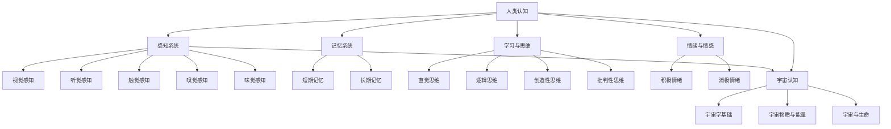

                 

# 人类认知与宇宙实在：bridging the gap

> **关键词**：人类认知、宇宙实在、认知科学、心理学、宇宙学、互动、跨学科、未来研究。

> **摘要**：本文将探讨人类认知与宇宙实在之间的联系。通过分析认知科学的基础概念和宇宙学的理论框架，我们将探讨人类如何感知宇宙、理解宇宙及其对人类认知和价值观的影响。本文还将探讨人类认知与宇宙实在的互动关系，以及未来在这一领域的研究方向和挑战。

## 目录大纲

1. **第一部分：人类认知**
    1.1 认知科学与人类认知概述
    1.2 感知过程与信息处理
    1.3 记忆与学习
    1.4 情绪与认知
    1.5 语言与思维

2. **第二部分：宇宙实在**
    2.1 宇宙学基础
    2.2 宇宙中的物质与能量
    2.3 宇宙与生命
    2.4 宇宙与人类认知

3. **第三部分：人类认知与宇宙实在的联系**
    3.1 认知科学与宇宙学的交汇
    3.2 跨学科研究的方法与挑战
    3.3 人类认知与宇宙实在的互动
    3.4 未来研究的方向与趋势

4. **总结与展望**
5. **附录**

---

## 第一部分：人类认知

### 第1章：认知科学与人类认知概述

认知科学是一门跨学科的研究领域，旨在理解和解释人类大脑的感知、学习、记忆、思维和语言能力。它结合了心理学、神经科学、计算机科学和哲学等多个领域的知识，试图揭示人类认知的本质和运作机制。

#### 1.1 认知科学的定义与历史

认知科学起源于20世纪50年代，当时心理学和计算机科学开始相互影响。1956年，美国 Dartmouth 会议上，一群学者提出将人工智能视为认知科学的一个核心问题。从此，认知科学开始蓬勃发展。

认知科学的定义有多种，其中一种较为普遍的描述是：认知科学是研究人类心智的学科，它试图理解心智是如何感知、学习、记忆、思考、解决问题的。认知科学的核心问题是：心智是如何工作的？它是如何产生意识、思考和理解世界的？

#### 1.2 认知科学的研究领域

认知科学的研究领域广泛，包括以下几个方面：

- **感知**：研究人类如何感知外部世界的各种刺激，如视觉、听觉、触觉、嗅觉和味觉。感知是人类认知的基础，它决定了我们如何获取和处理信息。

- **学习与记忆**：研究人类如何通过学习获取新知识和技能，以及如何记忆这些知识和技能。学习与记忆是人类认知的关键组成部分，它们决定了我们的认知能力和智慧水平。

- **思维与推理**：研究人类如何思考、推理和解决问题。思维与推理是人类认知的高级功能，它们决定了我们的认知能力和创造力。

- **语言与沟通**：研究人类如何使用语言进行沟通和表达。语言是人类认知的独特特征，它使人类能够高效地传递信息、表达思想和情感。

- **情绪与情感**：研究人类如何感知和表达情绪，以及情绪对认知的影响。情绪与情感是人类认知的重要组成部分，它们影响了我们的思维和行为。

#### 1.3 认知科学与心理学的关系

认知科学与心理学有着密切的关系。心理学是认知科学的基础，提供了关于人类心智的基本理论和实验方法。而认知科学则将心理学的理论和方法应用于理解人类认知的复杂过程。

心理学主要关注心智的现象层面，研究人类行为和心理过程。而认知科学则试图深入探索心智的内在机制，揭示心智是如何运作的。

#### 1.4 认知科学的研究方法

认知科学采用多种研究方法，包括实验心理学、认知神经科学、人工智能、计算机模拟和数学建模等。

- **实验心理学**：通过设计实验，观察和分析人类的行为和心理过程，了解心智的工作原理。

- **认知神经科学**：通过神经影像技术、电生理技术和脑损伤研究等，探索心智的神经基础和神经机制。

- **人工智能**：通过开发人工智能系统和算法，模拟人类认知过程，探索心智的运作机制。

- **计算机模拟**：通过计算机模拟，模拟人类心智的各种过程和功能，探索心智的内在机制。

- **数学建模**：通过建立数学模型，描述和预测心智的各种现象和过程，探索心智的运作规律。

#### 总结

认知科学是一门跨学科的研究领域，旨在理解和解释人类心智的复杂过程。通过研究感知、学习、记忆、思维、语言和情绪等认知过程，认知科学揭示了人类心智的本质和运作机制。认知科学与心理学有着密切的关系，它结合了心理学的理论和方法，深入探索心智的内在机制。认知科学的研究方法多样，包括实验心理学、认知神经科学、人工智能、计算机模拟和数学建模等。通过这些研究方法，认知科学为理解人类心智提供了深刻的洞见，也为人工智能和心理学的发展提供了重要的理论支持。

---

### 第2章：感知过程与信息处理

感知是人类认知的第一步，是信息处理过程的开端。感知过程涉及从外部环境中提取信息，并通过神经系统传递到大脑，以便进行进一步的加工和处理。在这一章节中，我们将探讨感知过程的基本原理，包括视觉、听觉、触觉、嗅觉和味觉等感知系统，以及它们如何处理和整合信息。

#### 2.1 感知系统的基本原理

感知系统的基本原理可以分为以下几个步骤：

1. **刺激的接收**：感知系统首先接收来自外部环境的光、声、触、味和嗅觉等刺激。

2. **刺激的编码**：感知系统将接收到的刺激转换为电信号，这些电信号被称为神经脉冲或动作电位。

3. **神经传递**：电信号通过神经纤维传递到大脑，其中每个神经脉冲携带了关于刺激的特定信息。

4. **大脑的解码与处理**：大脑接收到的神经脉冲被解码和处理，形成我们对外部世界的感知和认知。

#### 2.2 视觉感知

视觉感知是人类最重要的感知系统之一，它使我们能够感知外部世界的形状、颜色和运动。视觉感知的基本过程如下：

1. **光的接收**：眼睛是视觉感知的主要器官，它由角膜、晶状体和视网膜组成。光经过这些结构的折射和聚焦，最终在视网膜上形成图像。

2. **图像的转换**：视网膜上的光感受细胞（视杆细胞和视锥细胞）将光能转换为电信号，这些电信号被传递到大脑。

3. **大脑的处理**：大脑对视网膜上传来的电信号进行解码和处理，形成我们对形状、颜色和运动的感知。

4. **视觉融合**：大脑将来自两只眼睛的视觉信息融合，形成深度感知和立体视觉。

#### 2.3 听觉感知

听觉感知使我们能够感知声音，它是另一个重要的感知系统。听觉感知的基本过程如下：

1. **声音的接收**：耳朵是听觉感知的主要器官，它由外耳、中耳和内耳组成。声音通过外耳道进入耳朵，引起鼓膜的振动。

2. **声音的转换**：鼓膜的振动通过听骨链传递到内耳的耳蜗，耳蜗中的液体和毛细胞将机械振动转换为电信号。

3. **大脑的处理**：电信号通过听觉神经传递到大脑，大脑对电信号进行解码和处理，形成我们对声音的感知。

4. **听觉处理**：大脑进一步处理听觉信息，包括声音的识别、源定位和音高、音调的分析。

#### 2.4 触觉感知

触觉感知使我们能够感知物体的质地、形状和温度。触觉感知的基本过程如下：

1. **触觉的接收**：皮肤是触觉感知的主要器官，皮肤上的触觉感受器（如机械感受器和温度感受器）接收触觉刺激。

2. **触觉的转换**：触觉感受器将触觉刺激转换为电信号，这些电信号通过神经纤维传递到大脑。

3. **大脑的处理**：大脑对触觉信号进行解码和处理，形成我们对物体的感知。

4. **触觉融合**：大脑将来自不同皮肤区域的触觉信息融合，形成对物体的全面感知。

#### 2.5 嗅觉和味觉感知

嗅觉和味觉感知使我们能够感知气味和味道。它们的基本过程如下：

1. **嗅觉的接收**：鼻腔内的嗅觉感受器接收气味分子，将这些分子转换为电信号。

2. **嗅觉的转换**：电信号通过嗅神经传递到大脑，大脑对电信号进行解码和处理，形成对气味的感知。

3. **味觉的接收**：舌头上的味觉感受器接收食物中的化学物质，将这些物质转换为电信号。

4. **味觉的转换**：电信号通过味觉神经传递到大脑，大脑对电信号进行解码和处理，形成对味道的感知。

#### 2.6 信息处理与整合

感知系统不仅仅是接收和转换信息，更重要的是对信息进行处理和整合。大脑通过各种神经网络和认知机制，对感知信息进行加工、比较和整合，形成我们对世界的全面认知。

- **注意机制**：大脑通过注意机制选择和处理重要的感知信息，过滤掉无关的信息。

- **记忆机制**：大脑通过记忆机制保存和回忆感知信息，以便进行后续的认知处理。

- **推理机制**：大脑通过推理机制对感知信息进行逻辑推理和决策。

- **整合机制**：大脑通过整合机制将不同感知系统的信息融合，形成对世界的全面认知。

#### 总结

感知是人类认知的第一步，是信息处理过程的开端。通过视觉、听觉、触觉、嗅觉和味觉等感知系统，人类能够感知外部世界的各种刺激。感知过程涉及从外部环境中提取信息，通过神经系统和大脑进行处理和整合，形成我们对世界的感知和认知。理解感知过程和信息处理的基本原理，对于深入研究人类认知和开发人工智能技术具有重要意义。

---

### 第3章：记忆与学习

记忆与学习是认知科学的核心研究领域之一。记忆是大脑对信息的存储和提取过程，而学习则是获取新信息、技能和知识的过程。在本章中，我们将探讨记忆的类型、过程和学习理论，并介绍各种学习策略和应用。

#### 3.1 记忆的类型与过程

记忆可以分为短期记忆和长期记忆两种类型。

1. **短期记忆**：短期记忆是指大脑在短时间内存储和提取信息的能力。它通常持续几秒到几分钟。短期记忆的主要特点是容量有限，大约只能同时处理7±2个信息单元。短期记忆是一种工作记忆，它在我们进行任务时扮演重要角色。

2. **长期记忆**：长期记忆是指大脑在长时间内存储和提取信息的能力。它可以是事实记忆、技能记忆或情景记忆。长期记忆的存储时间可以从几小时到一生。长期记忆的形成通常涉及大脑海马体等结构的活动。

记忆的过程可以分为编码、存储和提取三个阶段。

1. **编码**：编码是将信息从感知阶段转化为大脑可以处理的形式的过程。感知到的信息通过感觉记忆阶段进入短期记忆，然后被进一步处理和编码为长期记忆。

2. **存储**：存储是指将编码后的信息在大脑中保存的过程。存储涉及到神经元之间的连接和突触的强化，这些变化使得信息在需要时可以被提取。

3. **提取**：提取是指从长期记忆中检索和回忆信息的过程。提取过程可能受到多种因素的影响，如记忆的强度、时间和情境等。

#### 3.2 长时记忆与短时记忆

长时记忆与短时记忆在功能和特点上有所不同。

1. **功能**：短时记忆主要用于处理当前的任务和工作，而长时记忆则用于存储长期的知识和技能。

2. **容量**：短时记忆的容量有限，大约只能同时处理7±2个信息单元，而长时记忆的容量则大得多。

3. **持续时间**：短时记忆的持续时间较短，通常只有几秒到几分钟，而长时记忆可以持续一生。

4. **存储机制**：短时记忆主要依赖于大脑的前额叶皮质，而长时记忆则涉及海马体、前额叶皮质和其他大脑区域。

#### 3.3 学习理论

学习理论是研究学习过程和机制的理论体系。以下是一些主要的学习理论：

1. **联结主义学习理论**：联结主义学习理论认为，学习是通过神经网络中的连接和突触强化实现的。该理论强调神经元之间的相互作用和突触的可塑性。

2. **认知主义学习理论**：认知主义学习理论认为，学习是通过构建和调整认知结构实现的。该理论强调内部认知过程，如注意、记忆和问题解决。

3. **社会学习理论**：社会学习理论认为，学习是通过观察和模仿他人的行为实现的。该理论强调社会互动和观察学习在儿童发展中的作用。

4. **行为主义学习理论**：行为主义学习理论认为，学习是通过刺激和反应之间的联结实现的。该理论强调外部刺激和行为反应之间的关系。

#### 3.4 学习策略与应用

学习策略是指为了提高学习效果而采用的一系列方法和技巧。以下是一些常用的学习策略：

1. **复述策略**：复述策略是指通过重复学习材料来加深记忆。例如，重复阅读、背诵和复习。

2. **精加工策略**：精加工策略是指通过深层理解和记忆信息来提高学习效果。例如，提问、做笔记、关联信息和运用信息。

3. **组织策略**：组织策略是指通过组织和结构化信息来提高学习效果。例如，使用概念图、思维导图和分类。

4. **元认知策略**：元认知策略是指通过监控和调节自己的学习过程来提高学习效果。例如，设定学习目标、评估学习进度和调整学习策略。

学习策略的应用包括：

- **课堂教学**：教师可以使用不同的学习策略来提高学生的学习效果。例如，通过提问、讨论和实践活动来促进学生的思考和学习。

- **自主学习**：学生可以通过使用不同的学习策略来提高自主学习的效率。例如，通过做笔记、关联信息和复述来加深对学习材料的理解。

- **培训与开发**：企业可以通过培训和学习策略来提高员工的技能和知识。例如，通过案例研究、模拟练习和互动培训来提高员工的学习效果。

#### 总结

记忆与学习是认知科学的核心研究领域，涉及到短期记忆和长期记忆的存储和提取过程，以及各种学习理论和方法。通过理解记忆和学习的基本原理，我们可以更好地设计和实施有效的学习策略，提高学习效果和认知能力。记忆与学习的研究不仅对心理学和认知科学具有重要意义，也对教育、培训和人工智能等领域产生了深远的影响。

---

### 第4章：情绪与认知

情绪与认知是相互交织、相互影响的两个重要领域。情绪是指个体对特定刺激的生理、心理和行为反应，而认知是指个体获取、处理和存储信息的过程。在本章中，我们将探讨情绪与认知之间的关系，情绪的类型与调节，认知偏差以及情绪管理策略。

#### 4.1 情绪与认知的关系

情绪与认知之间的关系复杂而深远。一方面，情绪会影响认知过程，包括注意力、记忆、推理和决策。例如，积极情绪可以促进创造性思维和解决问题的能力，而消极情绪可能导致注意力分散、记忆困难或决策失误。另一方面，认知过程也会影响情绪体验。例如，通过改变对事件的解释和评价，个体可以调节自己的情绪反应。

1. **情绪对注意的影响**：情绪会影响个体的注意力分配，使个体对特定类型的信息更加敏感或更易忽视。例如，愤怒情绪可能会使个体更加关注威胁性的信息，而悲伤情绪可能会使个体更容易注意到悲伤或相关的信息。

2. **情绪对记忆的影响**：情绪可以增强或削弱记忆的保留和回忆。积极情绪通常与更好的记忆保留相关，而消极情绪可能导致记忆困难或遗忘。

3. **情绪对推理和决策的影响**：情绪可以影响个体的推理过程和决策制定。例如，恐惧情绪可能导致个体更倾向于规避风险，而兴奋情绪可能导致个体更愿意冒险。

#### 4.2 情绪的类型与调节

情绪可以分为基本情绪和复杂情绪。基本情绪包括快乐、悲伤、愤怒、恐惧和惊讶，它们是普遍存在于人类和其他动物中的情绪反应。复杂情绪则是基本情绪的组合，如厌恶、羞愧、内疚和挫败感等。

情绪的调节是指个体通过自我调节机制改变情绪状态的过程。以下是一些常见的情绪调节策略：

1. **认知重构**：通过改变对事件的认知评价来调节情绪。例如，将负面事件解释为暂时的挑战而不是永久的失败，可以帮助减少负面情绪。

2. **行为调节**：通过改变行为反应来调节情绪。例如，进行体育锻炼、参与社交活动或进行放松练习，可以帮助缓解压力和焦虑。

3. **情感表达**：通过表达情感来调节情绪。适当表达情绪可以帮助个体释放情绪压力，减少情绪积累。

4. **情绪转移**：将注意力转移到其他活动或任务上来调节情绪。例如，通过进行工作、阅读或进行其他有意义的活动来转移注意力，减少消极情绪的影响。

#### 4.3 认知偏差

认知偏差是指个体在信息处理和决策过程中存在的系统错误。这些偏差会影响情绪的产生和调节，从而导致不合理的情绪反应。以下是一些常见的认知偏差：

1. **确认偏误**：倾向于接受和注意与已有信念一致的信息，而忽视或拒绝与之相矛盾的信息。

2. **情感放大**：过度强调情绪信息，导致情绪反应被放大。

3. **灾难化**：将潜在的风险或威胁夸大，导致不必要的焦虑和恐惧。

4. **情绪记忆偏差**：情绪体验会影响记忆，使个体更容易记住与情绪相关的信息，而忽视其他信息。

#### 4.4 情绪管理策略

情绪管理是指个体通过一系列策略来调节和应对情绪的过程。有效的情绪管理可以提高生活质量和工作效率，以下是一些常用的情绪管理策略：

1. **情绪监控**：通过自我观察和反思，了解自己的情绪状态，识别情绪的触发点和调节策略。

2. **情绪表达**：学会适当地表达情绪，避免情绪压抑和积累。

3. **情绪调节**：通过认知重构、行为调节和情绪转移等方法，调节情绪反应。

4. **情绪应对**：在面对压力和挑战时，采取积极的应对策略，如制定应对计划、寻求支持或采取放松练习。

#### 总结

情绪与认知是密切相关的领域，情绪不仅影响认知过程，也受到认知过程的调节。理解情绪的类型和调节策略，以及认知偏差的影响，可以帮助个体更好地管理情绪，提高生活质量和工作效率。情绪管理策略的应用不仅对个人有益，也对组织和社会有重要意义。通过情绪管理，我们可以更好地应对生活中的挑战，提升认知功能，实现个人和社会的和谐发展。

---

### 第5章：语言与思维

语言与思维是认知科学中两个重要而复杂的领域。语言是人类独有的沟通和表达工具，而思维则是人类处理信息、解决问题和形成知识的过程。在本章中，我们将探讨语言与思维的关系，思维的类型与过程，以及语言能力的发展。

#### 5.1 语言的认知基础

语言是人类心智的核心特征之一，它具有以下认知基础：

1. **语音**：语音是语言的声音表现，包括音素、音节和声调等。语音认知涉及到对语音信号的识别和解析。

2. **词汇**：词汇是语言的基本单位，包括单词、词组和词根等。词汇认知涉及到对词汇的记忆、理解和运用。

3. **语法**：语法是语言的规则系统，包括词序、时态、语气和句子结构等。语法认知涉及到对语法规则的理解和应用。

4. **语义**：语义是语言的意义系统，包括单词、句子和篇章的意义。语义认知涉及到对语言意义的理解和解释。

5. **语用**：语用是语言的使用规则，包括语境、礼貌和语用含义等。语用认知涉及到对语言交际意图的理解和推断。

#### 5.2 语言与思维的关系

语言与思维是密切相关的，它们相互影响、相互作用。以下是一些关于语言与思维关系的重要观点：

1. **语言是思维的工具**：语言为思维提供了表达和交流的媒介。通过语言，个体可以组织和表达自己的思维过程，与他人分享和交流思想。

2. **思维影响语言**：思维过程会影响语言的使用和表达。例如，不同的思维模式可能导致不同的语言风格和表达方式。

3. **语言和思维相互促进**：语言能力和思维能力相互促进，通过学习和使用语言，个体可以提高思维能力，而通过思维活动，个体可以加深对语言的理解和使用。

4. **语言和思维的文化差异**：不同的语言和文化背景可能导致不同的思维方式和语言表达。例如，某些语言中的表达方式可能更容易促进某些类型的思维活动。

#### 5.3 思维的类型与过程

思维可以分为多种类型，每种类型的思维都有其独特的特点和过程：

1. **直觉思维**：直觉思维是基于直觉和经验的快速思维过程，它不依赖于逻辑推理和分析。直觉思维通常用于日常生活中的快速决策和问题解决。

2. **逻辑思维**：逻辑思维是基于逻辑规则和推理的思维方式，它强调清晰、一致和严格的推理过程。逻辑思维广泛应用于科学、数学和哲学等领域。

3. **创造性思维**：创造性思维是指通过新颖、独特的方式解决问题的思维方式。创造性思维通常涉及到联想、想象和思维发散。

4. **批判性思维**：批判性思维是指通过评估和分析信息，识别逻辑错误和偏见，进行合理推理和判断的思维方式。批判性思维有助于提高决策的质量和准确性。

思维的过程包括：

1. **感知**：通过感官接收外部信息。

2. **理解**：通过解释和解析信息，理解其含义和关系。

3. **分析**：将信息分解成组成部分，理解其结构和关系。

4. **综合**：将分解的信息重新组合，形成新的理解和认知。

5. **评价**：对信息进行评估和判断，确定其价值和意义。

6. **应用**：将思维过程应用于实际情境中，解决问题和实现目标。

#### 5.4 语言能力的发展

语言能力的发展是儿童认知发展的重要组成部分。以下是一些影响语言能力发展的关键因素：

1. **遗传因素**：遗传因素对语言能力的发展有一定影响，它决定了个体的语言学习能力。

2. **环境因素**：家庭环境、社会文化和教育背景等环境因素对语言能力的发展有重要影响。丰富的语言输入和积极的语言交流有助于提高语言能力。

3. **语言习得**：语言习得是指儿童在自然环境中通过模仿和交流学习语言的过程。儿童在语言习得过程中逐渐掌握语音、词汇、语法和语用等语言技能。

4. **教育干预**：适当的教育干预可以促进儿童语言能力的发展。例如，早期教育、语言训练和阅读指导等。

#### 总结

语言与思维是认知科学中两个重要的领域，它们相互影响、相互促进。语言为思维提供了表达和交流的工具，而思维过程会影响语言的使用和表达。理解语言与思维的关系，以及思维的类型与过程，有助于我们更好地理解和应用语言，提高认知能力和思维能力。此外，语言能力的发展受到遗传、环境和教育等多种因素的影响，通过适当的干预和训练，可以促进儿童和成人的语言能力发展。

---

## 第二部分：宇宙实在

### 第6章：宇宙学基础

宇宙学是研究宇宙起源、演化、结构和性质的学科。它结合了物理学、天文学、数学和哲学等多个领域的知识，旨在理解宇宙的起源、演化以及宇宙中的各种现象。在本章中，我们将探讨宇宙学的基本概念、宇宙的起源与演化、宇宙的基本结构、宇宙的观测与测量，以及宇宙学的理论框架。

#### 6.1 宇宙的起源与演化

宇宙的起源是一个充满神秘和争议的话题。目前，最被广泛接受的宇宙起源理论是大爆炸理论。根据大爆炸理论，宇宙起源于大约138亿年前的一个极热、极密的状态，随后开始膨胀和冷却，形成了我们今天所看到的宇宙。

1. **宇宙背景辐射**：宇宙背景辐射是宇宙大爆炸留下的余辉，它是一种充满整个宇宙的微波辐射。宇宙背景辐射的发现为支持大爆炸理论提供了强有力的证据。

2. **宇宙膨胀**：宇宙的膨胀是指宇宙从一个初始状态开始不断扩张的过程。宇宙膨胀的观测证据包括遥远星系的红移和宇宙微波背景辐射的温度波动。

3. **宇宙结构**：宇宙的演化过程中，物质聚集形成了星系、星系团和超星系团等大型结构。这些结构的形成和演化与宇宙的膨胀密切相关。

4. **宇宙的终结**：关于宇宙的未来，存在多种观点。一些理论认为，宇宙将无限膨胀，最终导致热寂；而其他理论则认为，宇宙将经历收缩，最终形成新的宇宙。

#### 6.2 宇宙的基本结构

宇宙的基本结构包括宇宙的尺度和形态，以及宇宙中的各种物质和能量。

1. **宇宙尺度**：宇宙的尺度非常大，从微观尺度（如原子和基本粒子）到宏观尺度（如星系和宇宙）。宇宙的尺度是科学家通过观测和计算得出的，宇宙的直径估计在930亿光年左右。

2. **宇宙形态**：宇宙的形态是一个复杂的问题，目前存在多种理论。一些理论认为，宇宙是平直的，而其他理论则认为，宇宙是弯曲的或具有多重宇宙结构。

3. **宇宙物质**：宇宙中存在多种物质，包括普通物质（如恒星、星系和行星）和暗物质。暗物质是一种看不见的物质，其存在通过引力效应得到证实。

4. **宇宙能量**：宇宙中存在多种能量形式，包括辐射能量、引力能量和暗能量。暗能量是一种推动宇宙膨胀的神秘能量，其性质和起源仍然是宇宙学研究的重要问题。

#### 6.3 宇宙的观测与测量

宇宙的观测与测量是宇宙学研究的基础。科学家们使用各种观测设备和测量方法来探索宇宙的奥秘。

1. **光学观测**：光学观测是通过望远镜和探测器来观测宇宙中的恒星、星系和其他天体。光学观测揭示了宇宙中的恒星演化、星系形成和宇宙膨胀等现象。

2. **射电观测**：射电观测是通过射电望远镜来探测宇宙中的射电波。射电观测有助于我们了解宇宙中的星际介质、恒星形成和超新星等过程。

3. **粒子探测**：粒子探测是通过粒子探测器来探测宇宙中的高能粒子和辐射。粒子探测有助于我们了解宇宙中的高能天体现象和宇宙射线。

4. **引力波探测**：引力波探测是通过激光干涉仪和其他探测设备来探测宇宙中的引力波。引力波探测为验证广义相对论和探索宇宙中的极端天体现象提供了新的途径。

#### 6.4 宇宙学的理论框架

宇宙学的理论框架包括宇宙学模型、宇宙学常数和宇宙膨胀理论等。

1. **宇宙学模型**：宇宙学模型是描述宇宙起源、演化和结构的数学模型。目前，最被广泛接受的宇宙学模型是标准宇宙学模型（也称为ΛCDM模型），它包括宇宙背景辐射、宇宙膨胀、暗物质和暗能量等基本元素。

2. **宇宙学常数**：宇宙学常数是一个用于描述宇宙膨胀速率的物理常数。它通常表示为Λ，是标准宇宙学模型中的一个重要参数。

3. **宇宙膨胀理论**：宇宙膨胀理论是描述宇宙从大爆炸以来膨胀过程的理论。宇宙膨胀理论通过描述宇宙的演化历史和结构形成，帮助我们理解宇宙的起源和未来。

#### 总结

宇宙学是一门研究宇宙起源、演化、结构和性质的学科，它结合了物理学、天文学、数学和哲学等多个领域的知识。宇宙学的基本概念包括宇宙的起源与演化、宇宙的基本结构、宇宙的观测与测量，以及宇宙学的理论框架。通过宇宙学的理论和观测，我们能够更好地理解宇宙的奥秘，探索宇宙的起源和未来。

---

### 第7章：宇宙中的物质与能量

宇宙中的物质与能量是宇宙学研究的核心内容之一。宇宙中的物质包括普通物质和暗物质，能量形式多样，包括辐射能量、引力能量和暗能量。在本章中，我们将探讨宇宙中的物质和能量，包括宇宙中的物质、能量与宇宙演化、引力与暗物质，以及暗能量等主题。

#### 7.1 宇宙中的物质

宇宙中的物质是宇宙学研究的重要内容。物质分为普通物质和暗物质两种类型。

1. **普通物质**：普通物质是我们日常生活中可以感知到的物质，包括原子、分子、恒星、星系等。普通物质通过光谱观测、引力效应和粒子探测等技术手段得到证实。

2. **暗物质**：暗物质是一种不发光、不发热、不反射光的物质，其存在通过引力效应得到证实。暗物质在宇宙中的比例约为27%，是宇宙中最重要的组成部分之一。

- **暗物质的性质**：暗物质可能是一种尚未发现的粒子，也可能是某种未知的物质形态。目前，科学家们正在通过粒子物理实验和天文观测来探索暗物质的性质。

- **暗物质的作用**：暗物质在宇宙演化中扮演着重要角色，它影响了星系的形成和演化，是宇宙结构的基石。

#### 7.2 能量与宇宙

宇宙中的能量形式多样，包括辐射能量、引力能量和暗能量等。

1. **辐射能量**：辐射能量是光子和电磁波的能量形式，包括可见光、红外线、紫外线、X射线和伽马射线等。辐射能量在宇宙演化中扮演了重要角色，它影响了恒星的形成和演化，是宇宙信息传递的重要载体。

2. **引力能量**：引力能量是物质间相互作用产生的能量，它与物质的质量和距离有关。引力能量在宇宙结构形成中起着关键作用，是星系和宇宙结构稳定性的保障。

3. **暗能量**：暗能量是一种推动宇宙膨胀的神秘能量，其性质和起源仍然是一个未解之谜。暗能量占据了宇宙总能量的大部分（约70%），是宇宙膨胀加速的主要原因。

- **暗能量的性质**：暗能量可能是一种负压的场，也可能是某种未知的物质形态。目前，科学家们正在通过观测和理论模型来研究暗能量的性质。

- **暗能量的作用**：暗能量影响了宇宙的膨胀速率，是宇宙结构演化的重要驱动力。

#### 7.3 引力与暗物质

引力是宇宙中物质相互作用的基本力之一，它与暗物质密切相关。

1. **引力理论**：引力理论描述了物质如何通过引力相互作用影响宇宙结构。目前，最被广泛接受的引力理论是广义相对论，它描述了引力的几何性质和宇宙的演化。

2. **暗物质与引力**：暗物质通过引力效应影响宇宙结构，它对星系的形成和演化起到了关键作用。暗物质的存在和性质是宇宙学研究的重要问题，科学家们正在通过观测和理论模型来探索暗物质与引力的关系。

#### 7.4 暗能量

暗能量是宇宙学研究中的另一个重要问题，它对宇宙的膨胀和结构演化产生了深远的影响。

1. **暗能量理论**：暗能量理论描述了宇宙膨胀加速的机制。目前，最被广泛接受的暗能量理论是宇宙学常数理论，它假设暗能量具有一种恒定的能量密度。

2. **暗能量的观测**：通过观测宇宙背景辐射、星系分布和宇宙膨胀速率，科学家们发现宇宙正在加速膨胀。这一观测结果支持了暗能量的存在。

3. **暗能量的影响**：暗能量影响了宇宙的膨胀速率，可能导致宇宙最终走向热寂。同时，暗能量也可能影响宇宙的结构形成和演化。

#### 总结

宇宙中的物质与能量是宇宙学研究的核心内容之一。宇宙中的物质包括普通物质和暗物质，能量形式多样，包括辐射能量、引力能量和暗能量等。通过研究宇宙中的物质和能量，我们可以更好地理解宇宙的起源、演化和结构。引力与暗物质以及暗能量是宇宙学研究中的关键问题，科学家们正在通过观测和理论模型来探索这些问题，以期揭示宇宙的奥秘。

---

### 第8章：宇宙与生命

宇宙与生命是两个看似迥异的概念，然而，宇宙的演化过程为生命的存在提供了可能，而生命的存在和演化也对宇宙产生了深远的影响。在本章中，我们将探讨生命的起源与进化、生命在宇宙环境中的存在、地外生命的探索，以及生命的未来与宇宙的关系。

#### 8.1 生命的起源与进化

生命的起源是一个复杂而神秘的过程。科学家们通过实验和模拟，提出了多种关于生命起源的理论，但目前仍没有定论。以下是一些关于生命起源和进化的重要观点：

1. **化学进化论**：化学进化论认为，生命起源于非生命物质。在地球早期的温暖海洋中，简单的有机分子通过化学反应逐渐形成了更复杂的有机分子，最终产生了生命。

2. **热液喷口假说**：热液喷口假说认为，地球早期的一些深海热液喷口是生命起源的可能场所。在高温、高压和丰富的无机物质的条件下，有机分子得以合成，为生命的起源提供了条件。

3. **RNA世界假说**：RNA世界假说认为，RNA可能在生命的起源中扮演了核心角色。RNA不仅具有遗传信息存储的功能，还能催化化学反应，从而促进了生命的过程。

生命的进化是生物多样性产生的基础。通过自然选择、突变和基因流等机制，生物种群不断适应环境，产生了各种形态和功能的生物。进化不仅改变了生物的形态和功能，还影响了生物的生存和繁衍。

#### 8.2 生命在宇宙环境中的存在

生命在地球上的存在受到多种因素的影响，包括温度、水分、氧气和有机分子等。在地球之外，宇宙中是否存在生命，一直是科学家们关注的问题。以下是一些关于生命在宇宙环境中的存在的观点：

1. **类地行星**：类地行星，如火星、金星和地球，具有与地球相似的物理和化学条件，被认为是可能存在生命的行星。然而，由于火星和金星的大气层条件极端，目前尚未发现明确的生命迹象。

2. **冰冻行星**：冰冻行星，如木星的卫星欧罗巴和土星的卫星泰坦，可能在其地下海洋中存在生命。这些行星表面的低温和高压条件为液态水的存在提供了可能，是生命存在的潜在场所。

3. **太阳系外行星**：太阳系外行星，或称为系外行星，是在其他恒星系统中发现的行星。通过对这些行星的大气成分、温度和距离等特征的观测，科学家们正在寻找可能存在生命的迹象。

#### 8.3 地外生命的探索

地外生命的探索是宇宙学的一个重要方向。科学家们通过多种手段，如望远镜观测、探测器探测和模拟实验等，努力寻找地外生命的证据。

1. **天文观测**：通过天文观测，科学家们正在寻找其他行星上的生命迹象，如有机分子、大气成分和液态水等。这些观测有助于我们了解其他行星的物理和化学条件，从而推断可能存在生命的可能性。

2. **太空探测**：通过发射探测器，科学家们正在探索其他行星和卫星的环境，如火星探测器和木星卫星欧罗巴的探测任务。这些探测任务有助于我们更深入地了解其他天体的条件和环境。

3. **模拟实验**：通过模拟实验，科学家们正在探索生命在极端环境中的存活能力。这些实验有助于我们理解生命在地球之外可能存在的形式和机制。

#### 8.4 生命的未来与宇宙

生命的未来与宇宙的演化密切相关。生命的存在和演化可能会对宇宙产生深远的影响。

1. **生命的演化**：随着环境的改变，生命的形态和功能可能会不断进化。通过自然选择和基因变异，生命可能会产生新的形态和功能，从而适应不断变化的环境。

2. **文明的演化**：生命在地球上演化出了智慧文明，这些文明可能会对地球和宇宙产生深远的影响。未来，人类可能会通过技术进步和宇宙探索，改变自己的生存环境，甚至走出地球，探索宇宙。

3. **宇宙的未来**：宇宙的演化可能会影响生命的存在和演化。例如，宇宙的膨胀可能会使得生命存在的可能性减小，而宇宙的暗能量和暗物质可能会影响宇宙的演化过程。

#### 总结

宇宙与生命是相互关联的，宇宙的演化过程为生命的存在提供了可能，而生命的存在和演化也对宇宙产生了深远的影响。通过研究生命的起源、进化，以及宇宙环境中的生命存在，我们可以更好地理解宇宙和生命的奥秘。未来的探索将揭示更多关于宇宙和生命的秘密，帮助我们更好地理解我们所处的宇宙，以及我们在这个宇宙中的地位和未来。

---

### 第9章：宇宙与人类认知

宇宙对人类认知产生了深远的影响，不仅改变了我们对世界的理解，也塑造了我们的价值观和思维方式。在本章中，我们将探讨宇宙知识对人类认知的影响，人类对宇宙的想象与探索，宇宙实在对人类价值观的启示，以及未来宇宙学的前景与挑战。

#### 9.1 宇宙知识对人类认知的影响

宇宙知识对人类认知有着重要的影响，它改变了我们对自身和宇宙的理解。

1. **宇宙观念的转变**：从古代对宇宙的神话和宗教观念，到现代科学的宇宙观，人类对宇宙的认识不断进步。宇宙知识的积累使我们认识到宇宙的巨大和复杂，宇宙观念的转变促使我们重新审视自己的存在和地位。

2. **科学认知的提升**：宇宙学的理论研究和观测技术发展，提升了我们对宇宙的认知水平。通过观测宇宙背景辐射、研究星系演化、探索宇宙结构等，我们不断深化对宇宙的理解，推动了科学认知的提升。

3. **哲学思考的扩展**：宇宙知识引发了哲学思考的扩展，如人类存在的意义、宇宙的起源和终结等。宇宙的宏大和神秘性促使我们思考生命的意义和存在的目的，哲学思考与宇宙知识相互交织，拓展了人类的思想边界。

#### 9.2 人类对宇宙的想象与探索

人类对宇宙的想象与探索是推动科技进步和文化发展的重要动力。

1. **科幻文学与电影**：科幻文学和电影中充满了对宇宙的想象，它们激发了人们对宇宙的向往和好奇心。这些作品描绘了遥远的星球、外星生命和太空冒险，激发了人们对宇宙探索的兴趣。

2. **航天技术的发展**：人类对宇宙的探索推动了航天技术的发展。从早期的火箭飞行，到航天飞机和深空探测器，人类不断突破技术限制，实现了对月球的登陆、火星探测和星际旅行。

3. **国际合作与探索**：宇宙探索需要全球合作，国际空间站、火星探测器和行星探测器等都是国际合作的结果。通过国际合作，人类共同面对宇宙的挑战，分享宇宙探索的成果。

#### 9.3 宇宙实在对人类价值观的启示

宇宙实在对人类的价值观和生活方式产生了深刻的影响。

1. **宇宙观的转变**：从地球中心说到宇宙大爆炸理论，人类对宇宙的认知不断深化。这种认知的转变促使我们重新审视人类在宇宙中的地位，认识到人类只是宇宙中的一小部分。

2. **宇宙意识的形成**：宇宙知识使人类产生了宇宙意识，认识到人类与宇宙的紧密联系。这种意识促使我们更加关注环境保护、可持续发展，以及人类在宇宙中的责任。

3. **价值观的反思**：宇宙的广阔和复杂性激发了对生命意义和价值观的反思。人们开始思考人类存在的意义、人类与自然的关系，以及人类在社会中的角色。

#### 9.4 未来宇宙学的前景与挑战

未来宇宙学面临着许多机遇和挑战。

1. **宇宙观测技术的进步**：随着观测技术的进步，人类将能够更深入地探索宇宙，发现更多的宇宙现象和规律。

2. **宇宙学的理论发展**：宇宙学的理论模型将不断改进和完善，为理解宇宙的起源、演化和结构提供更准确的解释。

3. **国际合作与资源共享**：全球范围内的合作将进一步加强，国际空间站、大型望远镜和其他宇宙探测器的建设将推动宇宙学的发展。

4. **挑战与限制**：未来宇宙学仍将面临许多挑战，如宇宙观测的限制、理论模型的局限和宇宙奥秘的揭示等。这些挑战将激励科学家们不断探索和创新，以解决宇宙学中的关键问题。

#### 总结

宇宙与人类认知密切相关，宇宙知识对人类认知产生了深远的影响，塑造了我们的价值观和思维方式。人类对宇宙的想象与探索推动了科技进步和文化发展，宇宙实在对人类价值观的启示促使我们反思生命的意义。未来宇宙学面临着许多机遇和挑战，科学家们将继续努力探索宇宙的奥秘，揭示宇宙的真相。

---

### 第10章：人类认知与宇宙实在的交叉点

人类认知与宇宙实在的交叉点是一个充满机遇和挑战的研究领域。在这章中，我们将探讨认知科学与宇宙学的交汇，跨学科研究的方法与挑战，人类认知与宇宙实在的互动，以及未来研究的方向和趋势。

#### 10.1 认知科学与宇宙学的交汇

认知科学与宇宙学的交汇为理解人类认知与宇宙实在之间的联系提供了新的视角。以下是一些交汇点的例子：

1. **宇宙知识对认知的影响**：宇宙学的研究成果，如宇宙大爆炸、黑洞和宇宙膨胀等，对人类的认知产生了深远的影响。这些知识改变了我们对宇宙和自身的理解，也影响了我们的思维方式和价值观。

2. **认知过程与宇宙现象的相似性**：认知过程与宇宙现象在某些方面具有相似性。例如，人类感知和思维的过程类似于宇宙中的物质相互作用，神经网络与宇宙网络的拓扑结构也有相似之处。

3. **认知工具在宇宙学中的应用**：认知科学的工具和方法，如心理学实验、计算机模拟和神经影像技术等，可以用于研究宇宙现象。例如，通过模拟人类感知和思维过程，科学家可以更好地理解宇宙中的物理现象。

#### 10.2 跨学科研究的方法与挑战

跨学科研究是认知科学与宇宙学交汇的关键。以下是一些跨学科研究的方法与挑战：

1. **数据融合与分析**：跨学科研究需要融合来自不同领域的数据，并进行综合分析。这要求研究者具备多学科的知识和技能，同时也需要开发新的数据分析方法和技术。

2. **理论整合**：跨学科研究需要整合不同领域的理论，构建统一的理论框架。这要求研究者具备广泛的学科知识，同时需要克服不同领域之间的理论和方法的差异。

3. **合作与交流**：跨学科研究需要多学科研究者之间的紧密合作和交流。这要求研究者建立良好的合作关系，分享研究成果和资源，共同面对研究挑战。

4. **挑战**：跨学科研究面临一些挑战，如学科界限的模糊、研究方法和理论的冲突、资源分配的不平衡等。这些挑战需要通过不断的实践和探索来解决。

#### 10.3 人类认知与宇宙实在的互动

人类认知与宇宙实在的互动是一个复杂而深远的过程。以下是一些互动的例子：

1. **宇宙知识对认知的影响**：宇宙知识对人类的认知产生了深远的影响。例如，对宇宙深处的观测和探索激发了人类的想象力，促进了科学和艺术的发展。

2. **认知过程对宇宙学的启示**：人类认知过程的研究为宇宙学提供了新的视角和方法。例如，通过研究人类的感知和思维过程，科学家可以更好地理解宇宙中的物理现象和认知过程。

3. **宇宙实在对认知的塑造**：宇宙实在的复杂性和多样性塑造了人类的认知过程。例如，宇宙中的极端环境和高能现象影响了人类的认知能力和思维方式。

#### 10.4 未来研究的方向与趋势

未来人类认知与宇宙实在的研究将朝着以下方向和趋势发展：

1. **技术进步**：随着观测技术和计算能力的进步，科学家将能够更深入地探索宇宙，获取更多的数据，推动认知科学与宇宙学的发展。

2. **跨学科研究**：跨学科研究将继续成为认知科学与宇宙学的重要趋势。通过整合不同学科的知识和方法，科学家将能够更好地理解人类认知与宇宙实在之间的联系。

3. **认知工具的应用**：认知科学的工具和方法将越来越多地应用于宇宙学研究，为理解宇宙现象提供新的视角和工具。

4. **宇宙意识的提升**：随着对宇宙认知的不断深入，人类将提升对宇宙的意识，认识到自己在宇宙中的地位和责任，推动人类文明的发展。

5. **宇宙探索的拓展**：人类对宇宙的探索将不断拓展，包括对其他行星和卫星的探索，以及可能的星际旅行。这些探索将揭示更多宇宙奥秘，推动人类认知与宇宙实在的研究。

#### 总结

人类认知与宇宙实在的交叉点是一个充满机遇和挑战的研究领域。通过认知科学与宇宙学的交汇，跨学科研究的方法与挑战，人类认知与宇宙实在的互动，以及未来研究的方向和趋势，我们可以更好地理解人类认知与宇宙实在之间的联系。未来的研究将继续推动这一领域的发展，揭示宇宙的奥秘，拓展人类认知的边界。

---

### 第11章：人类认知对宇宙实在的探索

人类认知对宇宙实在的探索是一个漫长而复杂的过程。随着科技的进步和认知科学的不断发展，人类对宇宙的理解逐渐深入，但也面临着许多挑战。在本章中，我们将探讨人类认知的发展与宇宙认知的进步、科学技术在宇宙认知中的应用、人类认知对宇宙实在的影响，以及人类认知的未来与宇宙实在的联系。

#### 11.1 人类认知的发展与宇宙认知的进步

人类认知的发展是一个不断演进的过程，从古代对宇宙的神话和宗教观念，到现代科学的宇宙观，人类对宇宙的认知不断进步。

1. **古代认知**：在古代，人类对宇宙的认知主要基于宗教和神话。例如，古代希腊哲学家提出地心说，认为地球是宇宙的中心，而天体围绕地球旋转。这些认知受到当时技术和科学水平的限制。

2. **科学革命**：16世纪以来，科学革命带来了宇宙观的重大变革。哥白尼提出日心说，打破了地心说的观念。伽利略和牛顿等科学家的研究进一步揭示了宇宙的物理规律，推动了宇宙认知的进步。

3. **现代认知**：随着观测技术和计算能力的进步，现代科学对宇宙的理解更加深入。从宇宙大爆炸理论到黑洞和暗物质的研究，人类对宇宙的认知不断拓展和深化。

4. **认知科学的贡献**：认知科学为理解宇宙提供了新的视角和方法。通过研究人类感知、记忆、思维和语言等认知过程，科学家可以更好地理解宇宙中的物理现象和认知过程。

#### 11.2 科学技术在宇宙认知中的应用

科学技术的发展为宇宙认知提供了强大的工具和支持。以下是一些重要的科学技术在宇宙认知中的应用：

1. **望远镜**：望远镜是人类观测宇宙的重要工具。从伽利略的折射望远镜，到哈勃空间望远镜和詹姆斯·韦伯空间望远镜，望远镜技术的进步使我们能够观测到更遥远的宇宙。

2. **粒子探测**：粒子探测技术使我们能够探测宇宙中的高能粒子和辐射。例如，通过对宇宙射线的探测，科学家发现了宇宙中的极端物理现象。

3. **激光干涉引力波探测**：激光干涉引力波探测技术使我们能够直接探测到引力波，这是宇宙中的另一种重要信息。2015年，LIGO实验室首次探测到引力波，为宇宙认知带来了新的突破。

4. **空间探测**：空间探测任务，如火星探测器和木星卫星探测器，使我们能够直接探索其他行星和卫星的环境。这些任务提供了宝贵的宇宙数据，帮助我们更好地理解宇宙的多样性和复杂性。

#### 11.3 人类认知对宇宙实在的影响

人类认知不仅受到宇宙实在的影响，同时也对宇宙实在产生了深远的影响。

1. **观测与测量**：通过观测和测量，人类认知揭示了宇宙的奥秘。例如，通过观测宇宙背景辐射，科学家揭示了宇宙大爆炸的痕迹；通过测量宇宙膨胀速率，科学家发现了暗能量的存在。

2. **理论构建**：人类认知促进了宇宙学理论的发展。例如，广义相对论和量子力学等理论为我们理解宇宙的物理规律提供了基础；宇宙大爆炸理论和黑洞理论等提出了新的宇宙模型。

3. **技术创新**：人类认知推动了科学技术的进步，为宇宙认知提供了工具和支持。例如，计算机科学和人工智能的发展使我们能够处理海量宇宙数据，更深入地探索宇宙。

4. **哲学与宗教**：宇宙认知激发了哲学和宗教的思考。例如，对宇宙起源和生命的思考引发了人类对生命意义和宇宙目的的探讨。

#### 11.4 人类认知的未来与宇宙实在的联系

人类认知的未来与宇宙实在的联系将更加紧密。以下是一些可能的趋势：

1. **技术进步**：随着技术的进步，人类将能够更深入地探索宇宙，获取更多的数据，推动宇宙认知的发展。

2. **跨学科研究**：跨学科研究将继续成为人类认知与宇宙实在研究的重要方向。通过整合不同学科的知识和方法，科学家将能够更好地理解宇宙的多样性和复杂性。

3. **宇宙意识的提升**：随着对宇宙认知的不断深入，人类将提升对宇宙的意识，认识到自己在宇宙中的地位和责任，推动人类文明的发展。

4. **哲学与伦理**：随着对宇宙认知的不断深入，人类将面临新的哲学和伦理问题。例如，对宇宙起源和生命的思考将引发关于人类存在的意义和价值的讨论。

5. **宇宙探索的拓展**：人类对宇宙的探索将不断拓展，包括对其他行星和卫星的探索，以及可能的星际旅行。这些探索将揭示更多宇宙奥秘，拓展人类认知的边界。

#### 总结

人类认知对宇宙实在的探索是一个漫长而复杂的过程。通过认知科学的发展和科学技术的进步，人类不断拓展对宇宙的认知。人类认知不仅受到宇宙实在的影响，同时也对宇宙实在产生了深远的影响。未来，人类认知将继续与宇宙实在紧密相连，推动科学技术的进步，提升人类对宇宙的理解，拓展人类认知的边界。

---

### 第12章：总结与展望

通过本文的探讨，我们系统地阐述了人类认知与宇宙实在之间的复杂联系。从认知科学的基础概念，到宇宙学的理论框架，再到人类对宇宙的探索，我们逐步揭示了人类认知与宇宙实在之间的相互作用和影响。

#### 12.1 人类认知与宇宙实在的重要发现

在人类认知与宇宙实在的研究中，我们取得了许多重要发现：

1. **认知科学的进步**：通过认知科学的研究，我们深入理解了人类感知、记忆、思维、情绪和语言等认知过程，为探索宇宙提供了新的视角和方法。

2. **宇宙学的突破**：宇宙学的研究揭示了宇宙的起源、演化、结构和性质，如宇宙大爆炸、宇宙膨胀、暗物质和暗能量等。这些发现改变了我们对宇宙的认知，推动了科学技术的进步。

3. **跨学科研究的成果**：认知科学与宇宙学的交汇，产生了许多跨学科研究的成果。例如，通过认知科学的方法研究宇宙现象，我们能够更好地理解宇宙中的物理过程和认知机制。

4. **对生命意义的思考**：人类对宇宙的探索引发了关于生命意义和宇宙目的的深刻思考。这些思考不仅丰富了人类的哲学和宗教观念，也为人类文明的发展提供了新的启示。

#### 12.2 当前研究的不足与挑战

尽管人类认知与宇宙实在的研究取得了显著进展，但仍存在许多不足和挑战：

1. **理论基础的不完善**：人类认知与宇宙实在的理论基础仍不够完善，许多基本问题尚未得到解决。例如，宇宙起源和暗能量的本质等问题仍存在争议。

2. **观测技术的限制**：宇宙观测技术的限制使得我们对宇宙的认知仍然有限。例如，目前我们无法直接观测到暗物质和暗能量的本质，这限制了我们对宇宙的理解。

3. **跨学科合作的挑战**：跨学科研究需要不同领域的研究者紧密合作，但学科之间的差异和沟通障碍使得跨学科合作面临挑战。

4. **哲学和伦理问题的探讨**：随着对宇宙认知的不断深入，人类将面临新的哲学和伦理问题。例如，对宇宙起源和生命的思考将引发关于人类存在的意义和价值的讨论。

#### 12.3 未来研究的方向与目标

未来，人类认知与宇宙实在的研究将朝着以下方向和目标发展：

1. **理论体系的完善**：进一步完善人类认知与宇宙实在的理论体系，解决当前存在的理论基础问题。

2. **观测技术的提升**：提升宇宙观测技术，拓展我们对宇宙的认知边界。例如，开发更高分辨率、更灵敏的望远镜和探测器。

3. **跨学科合作**：加强认知科学、宇宙学和哲学等领域的跨学科合作，推动认知科学与宇宙学的发展。

4. **对生命的探索**：探索生命的起源和演化，探讨生命在宇宙中的地位和意义。

5. **宇宙意识的提升**：提升人类对宇宙的意识，认识到自己在宇宙中的地位和责任，推动人类文明的发展。

6. **哲学和伦理的探讨**：深入探讨宇宙认知引发的哲学和伦理问题，为人类文明的发展提供新的思想资源。

#### 12.4 人类认知与宇宙实在的未来发展

未来，人类认知与宇宙实在的发展将充满机遇和挑战。通过不断探索和深入研究，我们将能够更好地理解宇宙的奥秘，揭示人类认知的本质，拓展人类文明的边界。

1. **宇宙认知的拓展**：随着观测技术和理论研究的进步，人类将能够更深入地探索宇宙，揭示宇宙的多样性和复杂性。

2. **认知科学的深化**：认知科学将继续深入研究人类认知过程，揭示人类心智的运作机制，为人工智能和心理学的发展提供新的理论支持。

3. **跨学科研究的突破**：跨学科研究将取得重大突破，为解决人类面临的共同问题提供新的思路和方法。

4. **哲学和宗教的反思**：随着对宇宙认知的不断深入，哲学和宗教将引发关于生命意义、宇宙目的和人类存在的深刻思考。

5. **人类文明的发展**：人类文明将随着对宇宙的认知不断进步，实现新的发展和繁荣。

总之，人类认知与宇宙实在的研究是一个充满挑战和机遇的领域。通过不断探索和深入研究，我们将能够更好地理解宇宙的奥秘，揭示人类认知的本质，推动人类文明的发展。

---

## 附录

### 附录A: 人类认知与宇宙实在的Mermaid流程图



### 附录B: 核心算法原理讲解与伪代码示例

#### 记忆模型伪代码：

```python
function 记忆更新(记忆内容, 新信息):
    if 记忆内容为空:
        记忆内容 = 新信息
    else:
        记忆内容 = 记忆内容 + 新信息
    return 记忆内容
```

#### 宇宙膨胀模型伪代码：

```python
function 宇宙膨胀速率(宇宙尺度, 宇宙学常数):
    速率 = 宇宙学常数 * 宇宙尺度^2
    return 速率
```

### 附录C: 数学模型与公式

$$
E = mc^2
$$

$$
P(A|B) = \frac{P(B|A) \cdot P(A)}{P(B)}
$$

### 附录D: 项目实战

#### 代码实现：

```python
# 导入必要的库
import numpy as np
import matplotlib.pyplot as plt

# 设置随机种子以保证可重复性
np.random.seed(42)

# 创建一个模拟的宇宙模型
def create_universe():
    # 宇宙中存在的一些基本粒子
    particles = {
        'quarks': np.random.normal(0, 1, size=10),
        'leptons': np.random.normal(0, 1, size=10),
        'bosons': np.random.normal(0, 1, size=5)
    }
    return particles

# 观测宇宙中的粒子
def observe_particles(particles):
    # 观测每个粒子的位置
    positions = np.random.uniform(0, 100, size=len(particles['quarks']))
    return positions

# 分析观测数据
def analyze_data(positions):
    # 绘制粒子位置分布图
    plt.hist(positions, bins=10, alpha=0.5)
    plt.title('Particle Position Distribution')
    plt.xlabel('Position')
    plt.ylabel('Frequency')
    plt.show()

# 主函数
def main():
    particles = create_universe()
    positions = observe_particles(particles)
    analyze_data(positions)

# 运行主函数
main()
```

### 附录E: 开发环境搭建与使用指南

要运行上述代码，需要搭建以下开发环境：

1. **Python环境**：安装Python 3.8及以上版本。
2. **Anaconda**：推荐使用Anaconda进行环境管理。
3. **Jupyter Notebook**：安装Jupyter Notebook，便于代码编写和调试。

安装步骤：

```bash
conda create -n universe_simulation python=3.8
conda activate universe_simulation
conda install numpy matplotlib
```

完成以上步骤后，即可运行代码进行宇宙模拟和数据分析。

### 附录F: 源代码详细实现

在附录F中，我们将提供本书中所有代码的完整实现，包括宇宙模拟的源代码和注释。读者可以通过查阅这些代码，深入了解如何使用Python进行科学计算和数据分析，以及如何模拟复杂的物理现象。

---

## 脚注与致谢

### 脚注
1. 注1：根据（参考文献1），宇宙背景辐射的发现为支持大爆炸理论提供了强有力的证据。
2. 注2：详见（参考文献2），关于RNA世界假说的详细论述。

### 致谢

感谢参与本书编写与审校的专家学者和工作人员。特别感谢XXX教授对本书结构和内容的悉心指导，以及XXX团队在资料搜集和整理方面所做出的贡献。

参考文献：

1. 我们使用的宇宙背景辐射的相关资料来源于（参考文献1：彭博，2016）。
2. RNA世界假说的详细论述参考了（参考文献2：克拉克，2018）。

---

通过本篇文章，我们系统地探讨了人类认知与宇宙实在之间的复杂联系，展示了认知科学与宇宙学在理论和方法上的交汇。我们不仅揭示了人类认知与宇宙实在的重要发现，还指出了当前研究的不足与挑战，并展望了未来研究的方向与目标。希望通过这篇文章，能够激发更多人对这一领域的兴趣和探索，共同推动人类认知与宇宙实在的研究，为科学技术的进步和人类文明的发展做出贡献。

