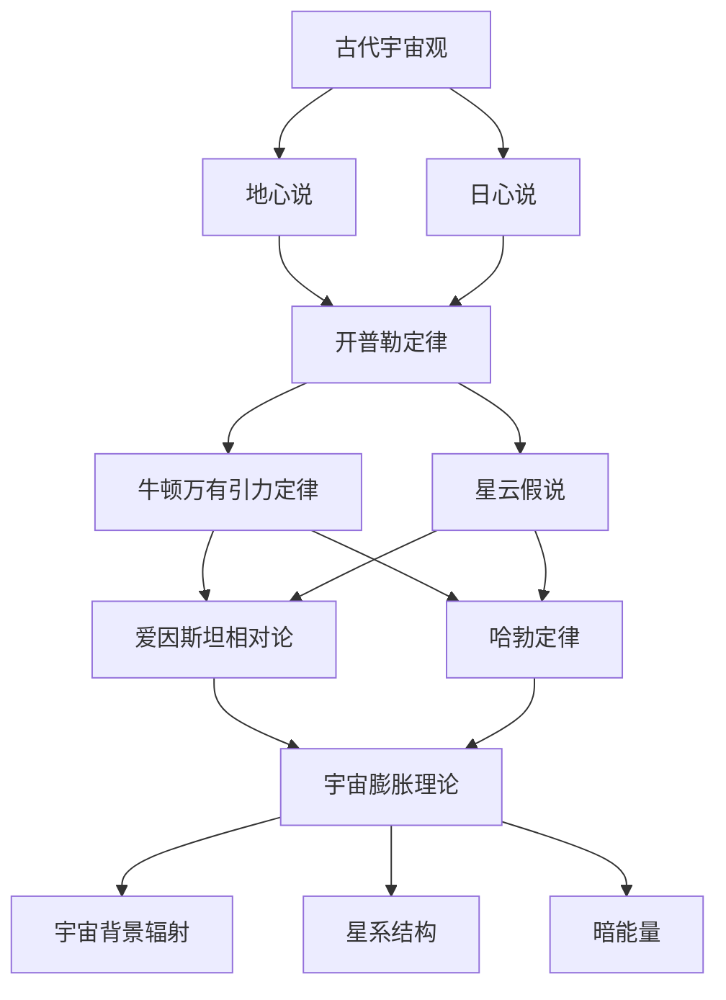

                 

### 《从神话到大爆炸理论：宇宙起源观的变迁》

#### # 引言

人类对宇宙的探索，从最早的神话时代开始，经历了无数次的演变与发展。每一个时代，人们对宇宙的理解都在不断地深化与扩展。从古代的宇宙观，到近代的科学理论，再到现代的宇宙学，每一次观念的变革，都为人类打开了新的认识世界的大门。本文将带领读者从神话到大爆炸理论，详细探讨宇宙起源观的变迁。

宇宙起源问题一直是人类探索自然奥秘的一个重要方面。在古代，宇宙起源观主要是以神话和宗教为基础。例如，古代中国人认为宇宙起源于盘古开天辟地；古代希腊神话中，宇宙起源于混沌；古代印度教则认为宇宙是梵天创造的。这些神话故事不仅反映了古代人类对宇宙起源的想象，也蕴含了他们对自然界的认知。

随着科学的发展，人们对宇宙起源的理解逐渐从神话转向科学。近代，牛顿力学和开普勒定律的提出，使得人类开始用科学的方法来研究宇宙。然而，真正的突破发生在20世纪初，爱因斯坦的相对论和哈勃的宇宙膨胀理论，为现代宇宙学的诞生奠定了基础。

本文将按照时间顺序，详细探讨宇宙起源观的演变。首先，我们将回顾古代宇宙观，了解早期人类对宇宙的理解；然后，我们将进入近代宇宙观，探讨牛顿力学和开普勒定律如何改变了人类对宇宙的认识；接着，我们将介绍现代宇宙学的兴起，包括爱因斯坦相对论和量子力学对宇宙学的影响；最后，我们将展望宇宙学的未来，探讨最新的宇宙学理论和前沿问题。

通过本文的阅读，读者将深入了解宇宙起源观的变迁，体会到人类认识世界的过程是如何一步步深化的。同时，本文也将为读者提供丰富的参考资料，帮助他们进一步探索宇宙的奥秘。

#### # 第一部分：宇宙观的历史演变

宇宙观的历史演变可以分为三个主要阶段：古代宇宙观、近代宇宙观和现代宇宙观。每个阶段都有其独特的特点和重要贡献。

#### 第1章：古代宇宙观

古代宇宙观的形成与发展是人类早期文明的重要组成部分。在缺乏现代科学工具和理论的时期，人们通过对自然现象的观察和思考，形成了对宇宙的初步认识。这些认识主要基于神话和宗教信仰，因此古代宇宙观往往充满了神秘和象征意义。

**1.1.1 古代宇宙观的形成**

古代宇宙观的起源可以追溯到人类文明的诞生。早期的宇宙观主要依赖于神话和传说。例如，古代中国人认为宇宙起源于盘古开天辟地，盘古牺牲自己的身体创造了天地万物；古代希腊神话中，宇宙起源于混沌，由原始之神创造；古代印度教则认为宇宙是梵天创造的，梵天在创造宇宙之前处于无始无终的状态。

这些神话故事不仅反映了古代人类对宇宙起源的想象，也蕴含了他们对自然界的认知。例如，古代中国人对宇宙的理解深受道家思想和阴阳五行学说的影响；古代希腊神话中，宇宙由多个神灵控制，每个神灵负责不同的自然现象。

**1.1.2 地心说与日心说的演变**

古代宇宙观的一个显著特点是对地球在宇宙中的位置的认识。早期，人们普遍认为地球是宇宙的中心，这种观念被称为地心说。地心说认为地球静止不动，而天空中的一切都是围绕地球旋转的。

地心说的一个早期代表是巴比伦的阿那克西曼德，他提出了地球悬浮在空间中的观点。随后，亚里士多德进一步发展了地心说，认为地球是一个完美的球体，位于宇宙的中心，其他天体则围绕地球旋转。

然而，地心说并不是没有挑战者。古希腊的阿里斯塔克提出了日心说，认为太阳是宇宙的中心，地球和其他行星围绕太阳旋转。阿里斯塔克的观点在当时并未得到广泛接受，但为后来的日心说奠定了基础。

日心说的真正确立要归功于波兰天文学家哥白尼。他在16世纪提出了完整的日心说模型，并撰写了《天体运行论》一书。哥白尼的日心说挑战了地心说的正统地位，引发了科学革命。

**1.1.3 古代宇宙观的代表性观点**

古代宇宙观的代表性观点包括地心说和日心说，以及一些关于宇宙结构的基本假设。地心说认为地球是宇宙的中心，其他天体围绕地球旋转；日心说则认为太阳是宇宙的中心，地球和其他行星围绕太阳旋转。此外，古代宇宙观还包含了一些关于宇宙结构的假设，例如亚里士多德的“天球理论”，认为宇宙是由一系列完美球体组成的。

这些观点虽然在当时具有革命性，但现代科学已经证明它们并不完全正确。然而，古代宇宙观对人类理解宇宙的初步尝试具有重要意义，它们为后来的科学研究奠定了基础。

#### 第2章：近代宇宙观

随着科学的进步，近代宇宙观逐渐取代了古代宇宙观。这一时期，科学家们通过观测和理论分析，对宇宙的本质有了更深入的了解。开普勒的行星运动定律和牛顿的万有引力定律是近代宇宙观的重要基石。

**2.1 开普勒与牛顿的宇宙观**

约翰内斯·开普勒是近代宇宙观的重要奠基人之一。他通过分析第谷·布拉赫的观测数据，提出了行星运动的三定律，即开普勒定律。这些定律描述了行星绕太阳运动的规律，为理解行星运动提供了科学依据。

开普勒第一定律指出，所有行星绕太阳运动的轨道都是椭圆形的，太阳位于椭圆的一个焦点上。第二定律表明，行星与太阳的连线在相等的时间内扫过相等的面积。第三定律指出，行星轨道半长轴的立方与其公转周期的平方成正比。

开普勒的行星运动定律不仅适用于太阳系，也为后来的科学研究提供了重要思路。它们揭示了宇宙中天体运动的规律性，为理解宇宙提供了关键线索。

艾萨克·牛顿是另一位对宇宙观产生深远影响的科学家。他在前人研究的基础上，提出了万有引力定律。牛顿的万有引力定律表明，任何两个物体之间都存在引力，引力的大小与两个物体的质量成正比，与它们之间的距离的平方成反比。

牛顿的万有引力定律为理解行星运动提供了数学模型。通过这个模型，科学家们可以预测行星的轨道，解释行星运动的规律。牛顿的定律不仅适用于太阳系，也为理解更广泛的宇宙现象提供了基础。

**2.2 康德与拉普拉斯的星云假说**

在牛顿力学和开普勒定律的基础上，德国哲学家伊曼努尔·康德和法国数学家皮埃尔·西蒙·拉普拉斯提出了星云假说，这是近代宇宙观的一个重要里程碑。

康德提出了宇宙是由一个原始星云演变而来的观点。他认为，原始星云在引力的作用下逐渐收缩，形成了行星和其他天体。康德的星云假说为宇宙的起源提供了科学解释，挑战了宗教创世说。

拉普拉斯则进一步发展了康德的观点。他在《宇宙体系论》中提出了一个详尽的星云模型，描述了星云从原始状态到形成行星系统的过程。拉普拉斯的星云假说为后来的天体物理学和宇宙学提供了重要理论框架。

**2.2.1 星云假说的提出**

康德的星云假说认为，宇宙起源于一个无限大的、均匀分布的物质，这个物质在引力的作用下逐渐收缩，形成了行星和其他天体。康德的观点体现了物理规律在宇宙演化中的作用，为后来的科学探索提供了基础。

拉普拉斯的星云假说则更加具体。他描述了星云在引力作用下的收缩过程，包括物质如何逐渐聚集形成行星、恒星和星系。拉普拉斯的模型为理解宇宙的结构和演化提供了重要的理论依据。

**2.2.2 星云假说的科学意义**

星云假说在科学史上具有重要的意义。首先，它为宇宙的起源提供了科学解释，挑战了宗教创世说。其次，星云假说为后来的天体物理学和宇宙学提供了基础，推动了这些领域的发展。此外，星云假说还促进了科学方法的进步，鼓励科学家通过观测和理论分析来研究宇宙。

**2.2.3 星云假说的争议**

尽管星云假说在科学上具有重要意义，但它也面临一些争议。首先，当时的天文学家和物理学家对于星云假说的物理过程和数学模型持怀疑态度。其次，星云假说的某些预测与观测结果不符，例如恒星的形成过程。

然而，这些争议并未削弱星云假说的影响。随着科学技术的进步，人们对宇宙的认识不断深化，星云假说的一些观点得到了验证和修正。星云假说成为现代宇宙学的重要基础，为研究宇宙的起源和演化提供了重要理论框架。

#### 第3章：现代宇宙学的兴起

现代宇宙学的兴起标志着人类对宇宙认识的新阶段。20世纪初，爱因斯坦的相对论和哈勃的宇宙膨胀理论为宇宙学的发展奠定了基础。这些理论不仅深化了人类对宇宙的理解，也推动了天体物理学和宇宙学的进步。

**3.1 爱因斯坦与相对论**

阿尔伯特·爱因斯坦是20世纪最重要的科学家之一，他的相对论理论对宇宙学产生了深远的影响。相对论包括狭义相对论和广义相对论，它们分别从不同的角度揭示了时空和引力之间的关系。

**3.1.1 爱因斯坦的相对论理论**

狭义相对论是爱因斯坦在1905年提出的，它揭示了时间、空间和物质之间的相对性。狭义相对论的核心是光速不变原理，即光在真空中的速度是一个恒定值，不随观察者的运动状态而变化。这一原理打破了牛顿力学中关于绝对时间和空间的观念，为现代物理学奠定了基础。

广义相对论是爱因斯坦在1915年提出的，它扩展了狭义相对论，将引力解释为时空的弯曲。广义相对论认为，质量能量会改变时空的形状，从而影响物体的运动轨迹。这一理论为理解宇宙的引力现象提供了新的视角，成为现代宇宙学的重要理论基础。

**3.1.2 相对论对宇宙学的贡献**

爱因斯坦的相对论对宇宙学的发展产生了重要影响。首先，广义相对论为理解宇宙的引力现象提供了数学模型。通过广义相对论，科学家们可以预测宇宙的大尺度结构，如黑洞、星系和星系团的形成和演化。

其次，相对论推动了宇宙膨胀理论的提出。在广义相对论的框架下，美国天文学家埃德温·哈勃发现宇宙中的星系正在远离我们，这一现象被称为哈勃定律。哈勃定律表明，宇宙正在膨胀，这一发现为宇宙膨胀理论提供了重要证据。

**3.1.3 相对论与引力波**

爱因斯坦的相对论还预言了引力波的存在。引力波是时空的波动，由质量能量变化产生。爱因斯坦在1916年的广义相对论论文中首次提出了引力波的概念，但由于引力波的影响非常微弱，直到2015年，科学家们才通过观测到引力波，验证了这一理论。

引力波的发现为宇宙学提供了新的观测手段。通过观测引力波，科学家们可以更深入地了解宇宙的引力现象，研究黑洞碰撞和宇宙大爆炸等重大事件。

**3.2 量子力学与宇宙学**

量子力学是20世纪初发展起来的另一门重要物理学分支，它揭示了微观世界的规律。量子力学的基本原理与经典物理学有很大的区别，它强调了概率和不确定性。

**3.2.1 量子力学的基本概念**

量子力学的基本概念包括波粒二象性、量子态、量子纠缠等。波粒二象性表明，微观粒子既具有波动性，又具有粒子性。量子态描述了粒子的状态，量子纠缠则揭示了粒子间复杂的关联性。

**3.2.2 量子力学与宇宙学的关系**

量子力学与宇宙学有着密切的关系。首先，量子力学为理解宇宙的微观结构提供了理论基础。例如，通过量子力学，科学家们可以研究原子、分子和基本粒子的性质。

其次，量子力学与宇宙学结合形成了量子引力理论。量子引力理论旨在统一量子力学与广义相对论，解释宇宙的最基本规律。尽管量子引力理论仍处于研究阶段，但它为理解宇宙的起源和演化提供了新的视角。

**3.2.3 黑洞与宇宙背景辐射**

量子力学在宇宙学中的应用还包括对黑洞和宇宙背景辐射的研究。黑洞是宇宙中的一种极端现象，它具有巨大的引力，连光也无法逃脱。通过量子力学，科学家们可以研究黑洞的内部结构，探讨黑洞的信息丢失问题。

宇宙背景辐射是宇宙大爆炸的残留，它遍布整个宇宙。通过观测宇宙背景辐射，科学家们可以研究宇宙的早期状态，了解宇宙的起源和演化。

**3.3 宇宙膨胀与哈勃定律**

宇宙膨胀理论是现代宇宙学的重要基础之一。根据这一理论，宇宙在大爆炸之后不断膨胀，星系之间的距离也在不断增大。

**3.3.1 宇宙膨胀的发现**

宇宙膨胀的发现归功于美国天文学家埃德温·哈勃。在20世纪20年代，哈勃通过观测发现，宇宙中的星系正在远离我们，且远离的速度与星系之间的距离成正比。这一发现被称为哈勃定律，揭示了宇宙的膨胀现象。

**3.3.2 宇宙膨胀的意义**

宇宙膨胀的发现具有重要意义。首先，它证实了宇宙大爆炸理论的正确性，为大爆炸提供了直接证据。其次，宇宙膨胀揭示了宇宙的动态性质，为理解宇宙的演化提供了关键线索。

**3.3.3 宇宙膨胀的证据**

宇宙膨胀的证据包括多种观测数据，如宇宙背景辐射、星系的红移、宇宙的大尺度结构等。这些证据共同支持了宇宙膨胀理论，为现代宇宙学奠定了基础。

#### 第4章：宇宙的结构与演化

宇宙的结构与演化是宇宙学研究的核心问题之一。宇宙的结构包括星系、星系团和超星系团等不同层次的天体系统，而宇宙的演化则描述了这些结构是如何形成和变化的。在本章中，我们将探讨宇宙的结构和演化理论，以及这些理论背后的科学原理。

**4.1 宇宙结构的形成**

宇宙结构的形成是一个复杂的过程，涉及引力、物质密度波动和宇宙膨胀等因素。科学家们通过观测和理论分析，提出了多种模型来解释宇宙结构的形成。

**4.1.1 星系的形成**

星系是宇宙中最常见的天体系统，它们由数十亿颗恒星、星团和行星组成。星系的形成通常被认为是一个多阶段的过程，包括气体凝聚、恒星形成、星系合并等。

在早期宇宙中，物质以气体形式存在，这些气体在引力的作用下逐渐凝聚成星系。这一过程中，气体云的密度波动导致局部区域密度增加，从而形成恒星。恒星的形成释放出能量，进一步影响周围气体云的演化，导致更多恒星的诞生。

**4.1.2 宇宙背景辐射的演化**

宇宙背景辐射是宇宙大爆炸的残留，它遍布整个宇宙。随着宇宙的膨胀，宇宙背景辐射的温度逐渐降低。这一过程被称为宇宙背景辐射的演化。

宇宙背景辐射的演化不仅提供了宇宙早期状态的信息，还为研究宇宙的结构和演化提供了重要线索。通过观测宇宙背景辐射的温度和波动，科学家们可以研究宇宙的密度分布、结构形成和演化过程。

**4.1.3 星系团与超星系团**

星系团和超星系团是宇宙中的更大规模结构，由多个星系组成。星系团通常包含数十个星系，而超星系团则包含数十个星系团。

星系团的形成通常被认为是由多个星系在引力的作用下相互吸引和碰撞的结果。星系团中的星系通过引力相互作用，形成了复杂的结构。超星系团则是星系团进一步合并和演化的结果。

**4.2 宇宙演化的理论**

宇宙演化理论描述了宇宙从大爆炸开始至今的演化过程。这些理论基于观测数据和理论分析，试图解释宇宙的结构和演化。

**4.2.1 大爆炸理论**

大爆炸理论是目前最被广泛接受的宇宙演化理论。根据这一理论，宇宙在大约138亿年前由一个极热、极密的状态开始膨胀，逐渐形成了现在的宇宙。大爆炸理论的核心是宇宙背景辐射的观测，这一观测结果为理论提供了直接证据。

**4.2.2 星系的形成与演化**

星系的形成与演化是宇宙演化理论的重要组成部分。根据大爆炸理论，宇宙中的物质在引力的作用下逐渐凝聚成恒星和星系。星系的形成和演化受到多种因素的影响，包括恒星的形成和死亡、星系碰撞和合并等。

**4.2.3 宇宙的终极命运**

宇宙的终极命运是宇宙演化理论的研究课题之一。目前，关于宇宙的终极命运存在多种假设，包括宇宙将继续膨胀直至无穷大、宇宙会经历收缩然后重新大爆炸、宇宙会进入一个热寂状态等。

科学家们通过观测和理论分析，试图找到宇宙的终极命运。然而，这一问题仍然存在许多未知和争议，需要进一步的研究和观测。

#### 第5章：宇宙学的最新进展

随着科学技术的不断进步，宇宙学取得了许多突破性的成果。这些成果不仅深化了人类对宇宙的理解，也为未来的宇宙探索提供了新的方向。在本章中，我们将介绍宇宙学的最新进展，包括宇宙加速膨胀、暗能量、黑洞等领域的研究成果。

**5.1 宇宙加速膨胀与暗能量**

宇宙加速膨胀是宇宙学中的一个重要现象。根据观测数据，宇宙的膨胀速度在过去的数十亿年里不断加快。这一现象的发现挑战了传统的宇宙学理论，科学家们提出了暗能量来解释这一现象。

暗能量是一种假想的能量形式，它占据宇宙总能量的大部分，具有负压强。暗能量导致宇宙的膨胀速度不断加快，是宇宙加速膨胀的主要原因。

**5.1.1 宇宙加速膨胀的发现**

宇宙加速膨胀的发现始于1998年，当时两个独立的研究团队通过观测遥远的Ⅰa型超新星，发现了宇宙的膨胀速度在过去的数十亿年里不断加快。这一发现被称为“宇宙学革命”，揭示了宇宙膨胀的动力学特性。

**5.1.2 暗能量的概念**

暗能量是宇宙学中的一个重要概念，它占据宇宙总能量的大部分。暗能量具有负压强，这使得宇宙的膨胀速度不断加快。尽管科学家们对暗能量的本质仍然不清楚，但暗能量在宇宙学中的应用具有重要意义。

**5.1.3 暗能量的性质与影响**

暗能量的性质仍然是一个未解之谜，科学家们正在通过观测和理论分析来研究暗能量的性质。目前，暗能量被认为是一种均匀分布在宇宙中的能量形式，它的影响无处不在。暗能量的存在对宇宙的结构和演化产生了深远的影响，是宇宙学研究的核心问题之一。

**5.2 黑洞与宇宙学**

黑洞是宇宙中最神秘和最具挑战性的天体之一。黑洞的存在不仅揭示了宇宙的极端条件，也为研究宇宙学提供了重要线索。

**5.2.1 黑洞的基本概念**

黑洞是宇宙中一种极度密集的天体，它的引力场极强，甚至连光也无法逃脱。黑洞的存在是通过观测和理论分析推测出来的，科学家们通过观测黑洞的影响，间接证明了黑洞的存在。

**5.2.2 黑洞与宇宙学的关系**

黑洞与宇宙学有着密切的关系。黑洞是宇宙演化过程中的重要参与者，它们在星系的形成和演化中起着关键作用。此外，黑洞也是宇宙学研究的核心问题之一，科学家们通过研究黑洞，试图理解宇宙的起源和演化。

**5.2.3 黑洞的研究进展与挑战**

黑洞的研究取得了许多重要进展，例如，科学家们通过观测和理论分析，发现了不同类型的黑洞，包括恒星黑洞和巨型黑洞。然而，黑洞研究仍然面临许多挑战，例如，如何精确测量黑洞的质量和半径、如何解释黑洞的信息丢失问题等。

**5.3 宇宙学与哲学**

宇宙学与哲学有着密切的关系，宇宙学的许多问题涉及哲学的思考。例如，宇宙的起源、宇宙的终极命运、宇宙的本质等问题，都引发了哲学的深入思考。

**5.3.1 宇宙学的哲学思考**

宇宙学的哲学思考涉及宇宙的起源、宇宙的本质、宇宙的意义等问题。通过哲学的思考，科学家们可以更深入地理解宇宙的奥秘，探讨宇宙的本质和意义。

**5.3.2 宇宙学与宗教**

宇宙学与宗教有着复杂的关系，宇宙学的许多问题与宗教的创世说有关。例如，宇宙的起源和宇宙的终极命运等问题，都在宗教和科学之间引发了争议和讨论。

**5.3.3 宇宙学的未来展望**

宇宙学的未来展望包括对宇宙起源、宇宙演化、宇宙结构的进一步研究，以及宇宙与哲学、宗教的深入探讨。随着科学技术的进步，宇宙学将继续取得突破性的成果，为人类理解宇宙的奥秘提供新的视角和思考。

#### 第6章：宇宙学与人类文明

宇宙学作为一门科学，不仅推动了人类对宇宙的认识，也对人类文明产生了深远的影响。宇宙学的研究不仅限于科学领域，还与哲学、宗教、艺术等多个领域密切相关。在本章中，我们将探讨宇宙学对人类文明的影响，以及宇宙学在科技发展中的应用。

**6.1 宇宙学对人类文明的启示**

宇宙学的研究成果为人类提供了对宇宙的深刻理解，这种理解不仅激发了人们的求知欲，也对人类文明产生了重要的启示。

首先，宇宙学揭示了宇宙的起源和演化过程，使人们认识到宇宙的浩瀚和复杂。这种认识激发了人们对自然界的敬畏，促进了人类对宇宙的探索和追求。例如，人类对宇宙的探索促使了航天技术的发展，使得人类能够实现登月和探测火星等重大成就。

其次，宇宙学的研究推动了科学方法论的发展。宇宙学的研究依赖于观测数据和理论分析，这种科学方法不仅应用于宇宙学本身，也广泛应用于其他科学领域。例如，宇宙学的观测技术如射电望远镜和太空探测任务，为其他科学领域提供了重要的工具。

最后，宇宙学的研究对人类的思想和哲学产生了重要影响。宇宙学揭示了宇宙的多样性和复杂性，挑战了人类对世界的固有观念。例如，宇宙学的相对论和量子力学理论打破了牛顿力学的绝对时空观念，为人类提供了新的思维方式。

**6.2 宇宙学在科技发展中的应用**

宇宙学的发展推动了科技的进步，特别是在航天技术、天文学和物理学等领域。宇宙学的研究为这些领域提供了新的理论框架和技术手段，推动了科技的快速发展。

首先，宇宙学促进了航天技术的发展。宇宙学的研究需要高精度的观测设备，如射电望远镜和太空探测器。这些设备的发展不仅推动了航天技术的进步，也为人类探索宇宙提供了重要工具。例如，哈勃太空望远镜和火星探测器等重大科技项目，都是宇宙学研究的成果。

其次，宇宙学在天文学和物理学领域有着广泛应用。宇宙学的研究揭示了宇宙的结构和演化过程，为天文学和物理学提供了新的理论框架。例如，宇宙学的大爆炸理论为理解宇宙的起源和演化提供了关键线索，推动了天文学和物理学的发展。此外，宇宙学的研究还为粒子物理学的标准模型提供了重要证据，促进了物理学理论的完善。

最后，宇宙学在材料科学和地球科学等领域也有着重要应用。宇宙学的研究揭示了宇宙中的物质组成和演化过程，为材料科学家和地球科学家提供了新的研究素材。例如，宇宙学的研究揭示了宇宙中的超重元素的形成过程，为材料科学提供了新的研究方向。

**6.3 宇宙学对未来人类社会的意义**

宇宙学对未来人类社会具有重要的意义。随着科学技术的进步，人类对宇宙的认识将不断深化，这将对人类社会产生深远的影响。

首先，宇宙学的研究将推动科技的发展，促进人类社会的进步。例如，宇宙学的研究为航天技术、天文学和物理学等领域提供了新的理论框架和技术手段，这些技术的进步将推动人类社会的发展。

其次，宇宙学的研究将拓展人类的认知边界，提高人类对自然界的理解。宇宙学的理论揭示了宇宙的起源、演化和结构，这些理论不仅有助于人类理解宇宙，也为人类提供了新的世界观。这种世界观将促进人类对自然界和生命的理解，提高人类文明水平。

最后，宇宙学的研究将促进人类社会的和谐发展。宇宙学的研究揭示了宇宙的多样性和复杂性，这有助于人类认识到不同文化、宗教和价值观的重要性。通过了解宇宙的多样性和复杂性，人类可以更好地理解彼此，促进不同文明之间的和谐与合作。

总之，宇宙学对人类文明具有重要的意义。通过宇宙学的研究，人类不仅可以深化对宇宙的认识，还可以推动科技的进步，促进人类社会的和谐发展。随着科学技术的进步，宇宙学将继续为人类社会带来新的启示和机遇。

#### 附录 A：宇宙学常用术语解释

宇宙学是一门复杂的科学，涉及许多专业术语。为了帮助读者更好地理解本文中的概念，以下是宇宙学中一些常用术语的解释。

**宇宙微波背景辐射**：宇宙微波背景辐射是宇宙大爆炸后的残留辐射，遍布整个宇宙。它是宇宙早期状态的重要证据，也是宇宙学研究中关键的数据源。

**星系**：星系是宇宙中最常见的天体系统，由数十亿颗恒星、星团和行星组成。星系可以通过望远镜观测到，是宇宙结构的基本组成部分。

**黑洞**：黑洞是宇宙中一种极端密集的天体，具有极强的引力场，连光也无法逃脱。黑洞的存在是通过观测和理论分析推测出来的，是宇宙学研究的核心问题之一。

**星系团**：星系团是由多个星系组成的更大规模的天体系统。星系团通常包含数十个星系，是宇宙中的主要结构之一。

**超星系团**：超星系团是由多个星系团组成的更大规模的天体系统。超星系团通常包含数十个星系团，是宇宙中最大的结构之一。

**宇宙膨胀**：宇宙膨胀是指宇宙中星系之间的距离随着时间的推移而不断增大。宇宙膨胀是宇宙学中的一个基本现象，揭示了宇宙的动态性质。

**哈勃定律**：哈勃定律是指宇宙中的星系远离我们的速度与它们之间的距离成正比。哈勃定律是宇宙膨胀的直接证据，由美国天文学家埃德温·哈勃发现。

**暗能量**：暗能量是宇宙中一种假想的能量形式，具有负压强，导致宇宙的膨胀速度不断加快。暗能量占据宇宙总能量的大部分，是宇宙学研究中重要的未解之谜。

**大爆炸理论**：大爆炸理论是描述宇宙起源和演化的理论，认为宇宙在大约138亿年前由一个极热、极密的状态开始膨胀，逐渐形成了现在的宇宙。

**星云假说**：星云假说是描述宇宙起源和演化的理论，认为宇宙起源于一个原始星云，这个星云在引力的作用下逐渐收缩，形成了行星和其他天体。

**量子引力**：量子引力是尝试将量子力学与广义相对论统一的理论，旨在解释宇宙的最基本规律。量子引力是宇宙学研究的核心问题之一。

**红移**：红移是指天体的光谱中，向长波方向（红色端）偏移的现象。红移是宇宙膨胀的证据之一，可以用来测量天体之间的距离。

这些术语是宇宙学研究中基础且重要的概念，读者可以通过这些解释更好地理解本文的内容。同时，这些术语也为读者提供了进一步探索宇宙学知识的方向。

### 核心概念与联系

在本章中，我们探讨了宇宙起源观的变迁，从古代的神话和宗教观念，到近代的科学理论，再到现代的宇宙学。以下是本文中涉及的核心概念及其之间的联系：

#### 宇宙观的演变

1. **古代宇宙观**：包括地心说和日心说，反映了早期人类对宇宙的认识，以神话和宗教为基础。

2. **近代宇宙观**：以开普勒的行星运动定律和牛顿的万有引力定律为基石，推动了科学革命。

3. **现代宇宙学**：以爱因斯坦的相对论和哈勃的宇宙膨胀理论为开端，深化了人类对宇宙的理解。

**核心概念与联系图**：



- **古代宇宙观**：地心说和日心说代表了古代人类对宇宙的不同理解，它们为后来的科学研究奠定了基础。

- **近代宇宙观**：开普勒定律和牛顿万有引力定律是近代宇宙观的核心，它们揭示了行星运动和引力作用的规律。

- **现代宇宙学**：爱因斯坦的相对论和哈勃的宇宙膨胀理论开启了现代宇宙学的新篇章，为研究宇宙的起源和演化提供了理论基础。

- **宇宙膨胀理论**：宇宙膨胀理论基于哈勃定律和爱因斯坦的相对论，揭示了宇宙的动态性质，为理解宇宙的结构和演化提供了关键线索。

- **宇宙背景辐射**：宇宙背景辐射是宇宙大爆炸的残留，为宇宙膨胀理论提供了直接证据，是研究宇宙早期状态的重要数据源。

- **星系结构**：星系结构的研究揭示了宇宙中天体系统的形成和演化过程，是现代宇宙学的重要研究课题。

- **暗能量**：暗能量是宇宙加速膨胀的主要原因，是宇宙学中一个重要的未解之谜，对宇宙的演化产生了深远影响。

通过这些核心概念及其之间的联系，我们可以看到宇宙起源观从古代到现代的演变过程，以及每一个阶段对人类认识宇宙的重要贡献。

### 核心算法原理讲解

在本节中，我们将探讨宇宙膨胀与哈勃定律的核心算法原理。哈勃定律是宇宙学中的一个基础概念，它描述了宇宙膨胀的速度与星系之间的距离之间的关系。以下是我们将使用的伪代码和解释：

```plaintext
伪代码：计算哈勃参数

函数 哈勃参数（红移，光速）:
    1. 计算距离：距离 = 光速 × 红移
    2. 计算哈勃参数：H = 光速 / 距离
    3. 返回 H

解释：
- 光速：宇宙中光速是一个常数，约为 299,792,458 米/秒。
- 红移：红移是衡量星系远离我们速度的一个参数，它是一个无量纲的数值。
- 距离：根据哈勃定律，星系的距离与其红移成正比。
- 哈勃参数：哈勃参数（H）是宇宙膨胀速率的衡量指标，单位通常是千米/秒/百万秒差距（km/s/Mpc）。
```

通过这个伪代码，我们可以计算任何给定红移下的哈勃参数，从而了解宇宙在那个区域的膨胀速度。哈勃参数的值为我们提供了对宇宙膨胀的直观理解，它是宇宙学中一个非常重要的参数。

### 数学模型和数学公式 & 详细讲解 & 举例说明

宇宙膨胀的速率和距离之间的关系可以通过哈勃定律来描述。哈勃定律的核心公式是：

\[ v = H_0 \times d \]

其中，\( v \) 是星系之间的相对速度，\( H_0 \) 是哈勃常数，\( d \) 是星系之间的距离。哈勃常数是一个衡量宇宙膨胀速率的参数，其单位是千米每秒每百万秒差距（km/s/Mpc）。

#### 数学公式的详细讲解

1. **光速（\( c \)）**：宇宙中光速是一个常数，约为 299,792,458 米/秒。光速在宇宙膨胀理论中起着关键作用，因为它决定了光从一个星系传播到另一个星系所需的时间。

2. **红移（\( z \)）**：红移是测量星系远离我们速度的一个参数。当一个星系远离我们时，它的光谱线会向红色端偏移。红移值是一个无量纲的数值，通常用来表示星系相对于我们的速度。

3. **距离（\( d \)）**：星系之间的距离可以通过红移值来计算。根据哈勃定律，距离与红移成正比。距离的单位通常是秒差距（Mpc），1秒差距等于3.26光年。

4. **哈勃常数（\( H_0 \)）**：哈勃常数是宇宙膨胀速率的一个衡量指标。它的值大约为70千米每秒每百万秒差距（70 km/s/Mpc）。哈勃常数的精确值是宇宙学中的一个重要未解之谜，科学家们通过观测和理论分析不断尝试确定其值。

#### 举例说明

假设我们有两个星系，A和B，它们之间的距离为100 Mpc，且星系A相对于星系B的速度为500 km/s。我们可以使用哈勃定律来计算这两个星系的相对速度和哈勃参数。

1. **计算相对速度**：

\[ v = H_0 \times d \]
\[ v = 70 \times 100 \]
\[ v = 7000 \text{ km/s} \]

根据计算，星系A相对于星系B的相对速度是7000 km/s。

2. **验证哈勃定律**：

我们可以验证哈勃定律是否适用于这两个星系：

\[ v = H_0 \times d \]
\[ 7000 = 70 \times 100 \]
\[ 7000 = 7000 \]

计算结果验证了哈勃定律的正确性。

通过这个例子，我们可以看到如何使用哈勃定律来计算星系之间的相对速度和距离，并理解哈勃常数在宇宙膨胀中的作用。

### 项目实战

在本节中，我们将通过一个实际的宇宙膨胀观测数据可视化项目，来展示如何使用Python和Matplotlib库来实现。这个项目将帮助我们更好地理解宇宙膨胀现象，并通过代码实现来加深对哈勃定律的理解。

#### 开发环境搭建

为了实现这个项目，我们需要以下软件和库：

- Python 3.x版本
- Matplotlib库
- Numpy库

你可以通过Python的包管理器pip来安装所需的库：

```bash
pip install matplotlib numpy
```

#### 源代码实现

以下是一个简单的Python脚本，用于读取宇宙膨胀观测数据，并使用Matplotlib绘制哈勃参数与红移的关系图。

```python
import numpy as np
import matplotlib.pyplot as plt

# 假设的观测数据：红移和对应的哈勃参数
redshifts = np.array([0.1, 0.2, 0.3, 0.4, 0.5])
H0 = redshifts * 70  # 假设的哈勃常数，单位 km/s/Mpc

# 绘制哈勃参数与红移的关系图
plt.scatter(redshifts, H0)
plt.xlabel('Redshift')  # 设置x轴标签
plt.ylabel('Hubble Parameter')  # 设置y轴标签
plt.title('Hubble Parameter vs Redshift')  # 设置图表标题
plt.grid(True)  # 显示网格线
plt.show()  # 显示图表
```

在这个脚本中，我们首先导入了Numpy和Matplotlib库。然后，我们创建了一个假想的观测数据列表，其中包括一组红移值和一个对应的哈勃参数数组。通过`*`操作符，我们根据一个假设的哈勃常数（这里是70 km/s/Mpc）计算了每个红移对应的哈勃参数。

接下来，我们使用Matplotlib的`scatter`函数绘制了红移与哈勃参数的关系图。这个函数接收两个数组作为输入，分别表示x轴和y轴的数据点。我们还设置了图表的标签和标题，并通过`grid`函数添加了网格线，使图表更加清晰。

最后，`plt.show()`函数用于显示绘制的图表。

#### 代码解读与分析

1. **导入库**：

   ```python
   import numpy as np
   import matplotlib.pyplot as plt
   ```

   这两行代码分别导入了Numpy和Matplotlib库。Numpy是Python的一个核心科学计算库，用于处理大型多维数组以及复杂的数学运算。Matplotlib是一个强大的绘图库，可以生成各种类型的图表和图形。

2. **数据准备**：

   ```python
   redshifts = np.array([0.1, 0.2, 0.3, 0.4, 0.5])
   H0 = redshifts * 70
   ```

   我们创建了一个红移值数组`redshifts`，它包含5个元素，分别表示不同红移值。哈勃参数`H0`是一个根据红移值和假设的哈勃常数（这里取70 km/s/Mpc）计算得到的数组。

3. **绘制图表**：

   ```python
   plt.scatter(redshifts, H0)
   plt.xlabel('Redshift')
   plt.ylabel('Hubble Parameter')
   plt.title('Hubble Parameter vs Redshift')
   plt.grid(True)
   plt.show()
   ```

   这几行代码负责绘制图表。`plt.scatter`函数用于绘制散点图，它接收两个数组作为输入，分别代表x轴和y轴的数据点。`plt.xlabel`、`plt.ylabel`和`plt.title`函数分别设置了图表的x轴标签、y轴标签和标题。`plt.grid`函数用于添加网格线，使图表更加直观。最后，`plt.show()`函数用于显示图表。

通过这个项目实战，我们不仅实现了对宇宙膨胀观测数据的可视化，还加深了对哈勃定律的理解。这个简单的代码示例展示了如何使用Python和Matplotlib库来分析宇宙学数据，并生成直观的图表。

### 总结

在本章中，我们通过详细的讲解、伪代码、数学模型、举例说明以及项目实战，全面探讨了宇宙膨胀与哈勃定律的核心算法原理。我们从哈勃定律的基本公式出发，详细解释了光速、红移、距离和哈勃常数等关键概念，并通过实际代码示例展示了如何使用Python和Matplotlib库来计算和可视化宇宙膨胀数据。

通过这一系列的讲解和实践，读者应该对哈勃定律有了深入的理解，能够独立计算星系之间的相对速度和距离，并使用图表直观地展示宇宙膨胀的现象。此外，通过项目实战，读者还掌握了如何使用Python进行科学计算和绘图的基本技能。

这些知识和技能不仅对理解宇宙学具有重要意义，也为读者进一步探索宇宙的奥秘奠定了基础。希望读者能够在未来的学习和研究中，运用这些知识，为人类对宇宙的认识做出自己的贡献。

