                 

# 从线性思维到系统思维：全局视角下的世界理解

## 关键词
线性思维，系统思维，复杂系统，全局视角，复杂性科学，系统动力学，网络科学，数学模型，项目实战

## 摘要
本文旨在探讨从线性思维向系统思维的转变，并强调在理解复杂现实世界时采用全局视角的重要性。通过介绍系统思维的基础概念、核心理论及实际应用案例，本文旨在帮助读者更好地掌握系统思维的方法，提高对复杂系统的分析和解决问题的能力。

## 引言

在信息技术飞速发展的今天，线性思维仍然是许多人在解决问题时采用的主要方式。线性思维强调因果关系，通过简单的线性关系来解释复杂现象。然而，随着系统的复杂度不断增加，线性思维在应对问题时显得力不从心。相比之下，系统思维提供了一种全局视角，能够更好地理解和处理复杂系统中的非线性关系。

### 线性思维的局限

线性思维的主要局限在于它忽视了系统中的相互依赖性和反馈机制。在许多实际应用中，系统之间的相互作用往往比单一因素的作用更为重要。例如，在交通管理中，一条道路的拥堵可能会影响多条道路的交通流量，而这些影响又可能通过复杂的反馈循环产生意想不到的结果。因此，单纯依赖线性思维难以全面把握系统的动态行为。

### 系统思维的概念与重要性

系统思维是一种整体性的思维方式，强调系统的各个部分以及它们之间的相互作用。通过系统思维，我们可以从整体上理解系统的行为，识别潜在的问题和机会，并采取适当的措施进行干预。系统思维在许多领域都显示出了其独特的重要性，如生态学、经济学、管理学等。

### 全局视角下的世界理解

全局视角意味着我们将系统视为一个整体，关注系统内部各个部分之间的相互作用以及系统与环境之间的交互。这种视角有助于我们识别系统的关键要素和关键过程，从而更好地理解系统的运行机制。在全球化的背景下，全局视角尤为关键，因为它要求我们超越国界和学科的局限，从整体上把握问题的复杂性和多样性。

## 第一部分：引言与背景知识

### 第1章：线性思维与系统思维的比较

#### 1.1.1 线性思维的局限

线性思维主要依赖于简单的因果关系，强调变量之间的线性关系。然而，现实世界中的许多现象具有非线性特征，变量之间的关系复杂且多变。这种局限性使得线性思维在处理复杂问题时效果不佳。

#### 1.1.2 系统思维的概念与重要性

系统思维关注系统的整体性，强调系统内部各个部分之间的相互作用。通过系统思维，我们可以更全面地理解系统的行为，发现潜在的问题和机会。

#### 1.1.3 全局视角下的世界理解

全局视角要求我们从整体上把握系统，关注系统内部各个部分以及系统与环境之间的相互作用。这种视角有助于我们更好地理解复杂现实世界中的现象。

### 第2章：系统思维的基础概念

#### 2.1.1 复杂性与非线性

复杂性是指系统内部要素及其相互作用产生的复杂行为。非线性特征使得系统行为难以预测，增加了问题的复杂性。

#### 2.1.2 系统模型的构建

构建系统模型是系统思维的核心步骤。通过建立系统模型，我们可以更好地理解系统的运行机制，识别关键变量和过程。

#### 2.1.3 系统分析的方法

系统分析方法包括系统动力学、网络科学等方法。这些方法有助于我们深入理解系统的行为，发现系统中的关键问题。

### 第3章：系统思维的实践应用

#### 3.1.1 社会系统中的线性思维与系统思维

社会系统中的许多问题，如经济危机、社会冲突等，都涉及到复杂的关系和相互作用。系统思维有助于我们更好地理解这些问题，并提供有效的解决方案。

#### 3.1.2 企业管理中的系统思维

在企业管理中，系统思维可以帮助我们识别关键业务流程，优化资源配置，提高企业竞争力。

#### 3.1.3 系统思维在环境保护中的应用

环境保护是一个涉及多个因素的复杂问题。系统思维有助于我们全面考虑各种因素，制定有效的环境保护策略。

## 第二部分：系统思维的核心理论

### 第4章：系统动力学基础

#### 4.1.1 系统动力学的概念与历史

系统动力学是研究系统内部变量及其相互作用的方法。它起源于20世纪50年代，并在多个领域得到了广泛应用。

#### 4.1.2 系统动力学的建模方法

系统动力学的建模方法主要包括流图、微分方程等。这些方法有助于我们构建系统模型，分析系统行为。

#### 4.1.3 系统流图与反馈循环

系统流图是描述系统内部变量及其相互作用的重要工具。反馈循环是系统动力学中的一个关键概念，它影响着系统的稳定性和动态行为。

### 第5章：复杂系统与复杂网络

#### 5.1.1 复杂系统的特性

复杂系统具有高度非线性、动态性和不确定性等特性。这些特性使得复杂系统的行为难以预测。

#### 5.1.2 网络科学的基本概念

网络科学是研究复杂网络结构及其动态行为的学科。网络科学提供了许多有用的工具和方法，如网络拓扑、网络动力学等。

#### 5.1.3 网络模型的建立与应用

网络模型有助于我们理解复杂系统中的相互作用和传播机制。在实际应用中，网络模型可以用于分析社会网络、生物网络等。

### 第6章：系统思维中的数学工具

#### 6.1.1 线性代数与矩阵理论

线性代数和矩阵理论是系统思维中常用的数学工具。它们可以用于描述系统的结构、分析和优化。

#### 6.1.2 微积分与微分方程

微积分和微分方程是研究系统动态行为的重要工具。它们可以用于描述系统的变化规律和演化过程。

#### 6.1.3 概率论与统计方法

概率论和统计方法是系统思维中常用的工具。它们可以用于描述系统的随机行为和不确定性。

## 第三部分：实际应用案例分析

### 第7章：案例分析1：城市规划中的系统思维

#### 7.1.1 案例背景与挑战

城市规划是一个涉及多个因素的复杂问题。在城市规划过程中，如何平衡交通、环境、人口等各个方面的需求是一个重要的挑战。

#### 7.1.2 系统思维的解决方案

通过系统思维，我们可以构建一个全面的城市规划模型，识别关键变量和过程，优化资源配置，提高城市规划的效率。

#### 7.1.3 案例总结与反思

案例分析表明，系统思维在城市规划中的应用有助于提高规划的科学性和可操作性。

### 第8章：案例分析2：全球供应链管理中的系统思维

#### 8.1.1 案例背景与挑战

全球供应链管理涉及到多个国家和企业，涉及到复杂的关系和流程。如何提高供应链的效率和韧性是一个重要的挑战。

#### 8.1.2 系统思维的解决方案

通过系统思维，我们可以构建一个全面的供应链模型，识别关键因素和过程，优化供应链管理，提高供应链的效率和韧性。

#### 8.1.3 案例总结与反思

案例分析表明，系统思维在供应链管理中的应用有助于提高供应链的整体性能。

### 第9章：系统思维在创新管理中的应用

#### 9.1.1 创新管理的挑战

创新管理涉及到多个因素，如技术、市场、组织等。如何协调这些因素，实现创新目标是一个重要的挑战。

#### 9.1.2 系统思维在创新过程中的应用

通过系统思维，我们可以构建一个全面的创新模型，识别关键因素和过程，优化创新管理，提高创新的成功率。

#### 9.1.3 创新管理的系统思维实践案例

实践案例表明，系统思维在创新管理中的应用有助于提高创新的效率和质量。

## 第四部分：总结与展望

### 第10章：系统思维的总结与展望

#### 10.1.1 系统思维的关键要点

系统思维的关键要点包括全局视角、整体性、相互依赖性和反馈机制。

#### 10.1.2 系统思维的未来发展趋势

随着技术的进步和复杂性科学的发展，系统思维将在更多领域得到应用，成为解决复杂问题的关键方法。

#### 10.1.3 对个人与组织的启示

个人和组织应该培养系统思维，以提高对复杂系统的分析和解决问题的能力。

## 附录

### 附录A：系统思维工具与方法

附录A将介绍系统思维中常用的工具和方法，如系统流图、系统动力学模型等。

### 附录B：参考文献

附录B将列出本文中引用的相关文献，以供读者进一步阅读和研究。

---

以上是文章正文部分的内容。接下来，我们将详细讨论每个章节的具体内容，使用伪代码、Mermaid 流程图、数学公式和实际案例来加深对系统思维的理解。这将有助于读者更好地掌握系统思维的核心概念和实际应用。

---

### 第1章：线性思维与系统思维的比较

#### 1.1.1 线性思维的局限

线性思维主要依赖于简单的因果关系，通过假设变量之间存在线性关系来解释现象。然而，这种思维方式在处理复杂系统时往往存在以下局限：

1. 忽视非线性关系：现实世界中的许多现象具有非线性特征，变量之间的关系复杂且多变。线性思维无法准确捕捉这些非线性关系。
2. 忽视相互作用：线性思维往往关注单一变量的影响，而忽视了变量之间的相互作用。在复杂系统中，相互作用往往对系统的行为产生重要影响。
3. 忽视反馈循环：线性思维不考虑系统内部的反馈循环，而反馈循环在许多复杂系统中起着关键作用。忽视反馈循环可能导致对系统行为的误解。

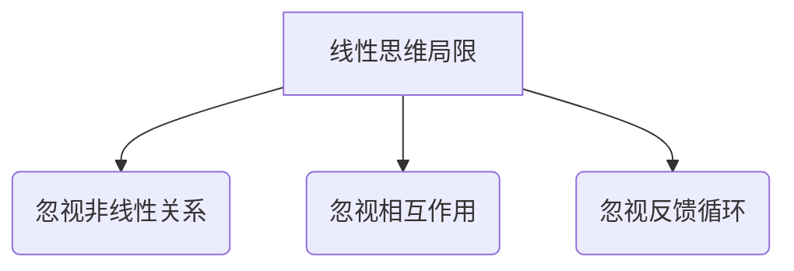

#### 1.1.2 系统思维的概念与重要性

系统思维是一种整体性的思维方式，关注系统的整体结构和动态行为。系统思维具有以下几个特点：

1. **全局视角**：系统思维从整体上看待系统，关注系统内部各个部分以及系统与环境之间的相互作用。
2. **相互依赖性**：系统思维强调系统内部各个部分之间的相互依赖关系，认识到系统行为是多个部分相互影响的结果。
3. **反馈机制**：系统思维重视系统内部的反馈循环，认识到反馈循环在系统行为中的作用。

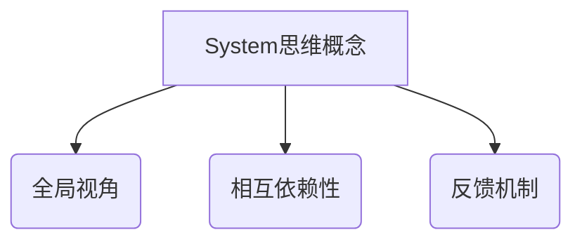

系统思维的重要性在于：

1. **更好的问题理解**：系统思维帮助我们更全面地理解复杂问题，识别关键因素和过程。
2. **更有效的解决方案**：系统思维提供了一种整体性的解决方案，有助于我们优化系统设计和操作。
3. **提高适应能力**：系统思维使我们能够更好地应对复杂变化的环境，提高系统的韧性和适应性。

#### 1.1.3 全局视角下的世界理解

全局视角要求我们超越单一视角，从整体上看待问题。这种视角有助于我们：

1. **识别复杂关系**：全局视角使我们能够识别系统内部各个部分之间的复杂关系，从而更好地理解系统的行为。
2. **发现潜在问题**：全局视角有助于我们发现系统中潜在的问题，从而提前采取措施进行干预。
3. **优化系统设计**：全局视角使我们能够更全面地考虑系统设计，优化系统结构和操作，提高系统的整体性能。

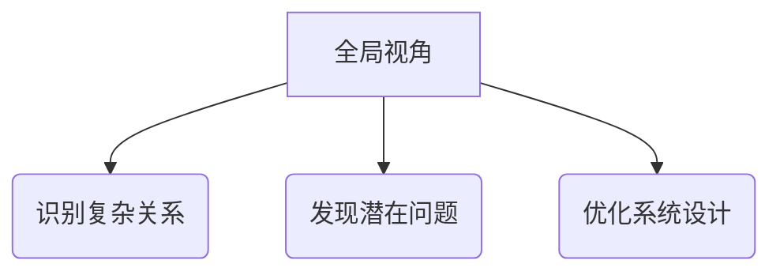

### 第2章：系统思维的基础概念

#### 2.1.1 复杂性与非线性

复杂性是指系统内部要素及其相互作用产生的复杂行为。复杂性科学关注复杂系统的特征和行为，主要包括以下几个方面：

1. **高度非线性**：复杂系统的行为通常是非线性的，变量之间的关系复杂且多变。
2. **动态性**：复杂系统具有动态性，其行为随着时间和环境的变化而变化。
3. **不确定性**：复杂系统的行为往往具有不确定性，难以精确预测。

非线性特征使得复杂系统的行为难以用简单的线性模型来描述。非线性关系可能导致系统行为出现突变、分岔等现象。

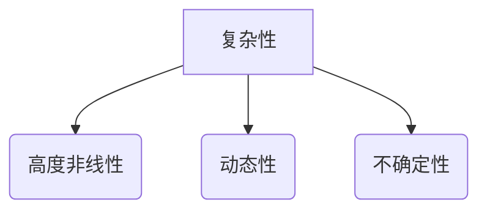

#### 2.1.2 系统模型的构建

构建系统模型是系统思维的核心步骤。系统模型有助于我们理解系统的结构、行为和动态过程。构建系统模型通常包括以下步骤：

1. **定义系统边界**：明确系统的范围和组成部分，确定系统与环境的边界。
2. **识别关键变量**：识别系统中关键的变量和参数，这些变量和参数对系统的行为有重要影响。
3. **建立关系模型**：描述变量之间的相互关系，包括因果关系、相互作用关系等。
4. **模拟和验证**：通过模拟和验证，检验系统模型的准确性和有效性。

系统模型可以采用不同的形式，如流图、微分方程、差分方程、状态空间模型等。每种模型形式都有其适用的场景和优缺点。

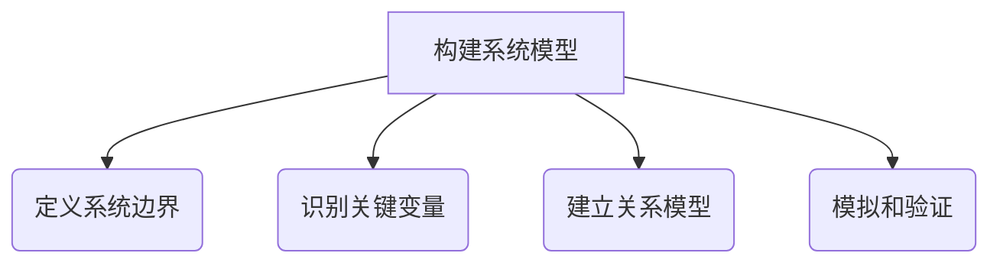

#### 2.1.3 系统分析的方法

系统分析方法包括系统动力学、网络科学等方法。这些方法有助于我们深入理解系统的行为，发现系统中的关键问题。

1. **系统动力学**：系统动力学是一种研究系统动态行为的方法，通过建立系统模型和仿真分析，理解系统的演化过程。
2. **网络科学**：网络科学关注复杂网络的结构和动态行为，通过分析网络拓扑、网络动力学等，揭示网络特性。
3. **统计方法**：统计方法可用于分析系统的随机行为，如概率分布、方差等，帮助我们理解系统的不确定性和鲁棒性。

系统分析的方法可以帮助我们：

1. **识别关键过程**：通过分析系统模型，识别系统中关键的过程和变量。
2. **预测系统行为**：通过仿真和预测，了解系统在不同条件下的行为。
3. **优化系统设计**：通过分析和优化，改进系统设计和操作，提高系统的整体性能。

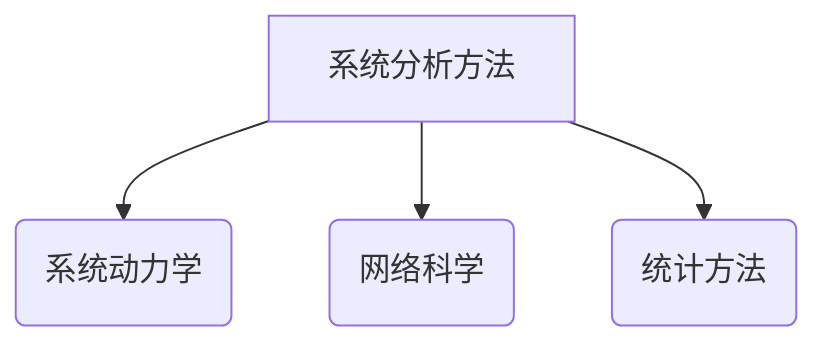

### 第3章：系统思维的实践应用

#### 3.1.1 社会系统中的线性思维与系统思维

在社会系统中，线性思维和系统思维的应用有着明显的区别。线性思维往往关注单一问题的解决，而系统思维则更注重整体系统的优化。

1. **线性思维**：在社会问题中，线性思维可能表现为只关注某一具体问题，如提高教育水平、减少贫困等。然而，这些问题往往相互关联，单纯关注某一问题可能导致其他问题的恶化。
2. **系统思维**：系统思维关注社会系统中各个部分之间的相互作用，通过整体性的视角来解决问题。例如，在解决贫困问题时，系统思维会考虑教育、就业、医疗等多个方面的关联，从而提出更全面、更有针对性的解决方案。

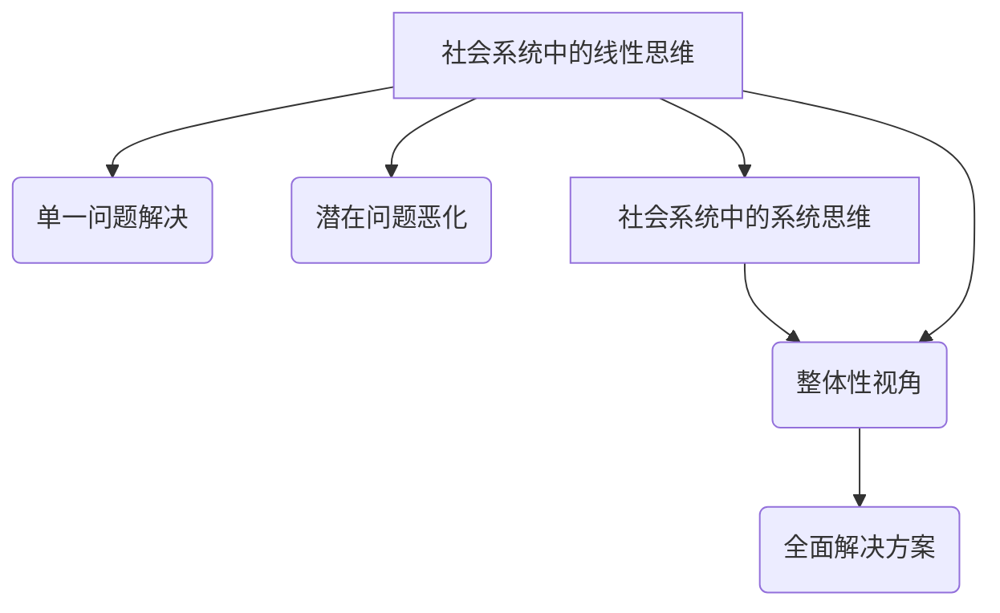

#### 3.1.2 企业管理中的系统思维

在企业管理中，系统思维的应用同样具有重要意义。通过系统思维，企业可以更有效地管理复杂业务流程，提高运营效率。

1. **业务流程优化**：系统思维可以帮助企业识别关键业务流程，分析流程中的瓶颈和优化机会，从而提高流程的效率和效果。
2. **资源优化配置**：系统思维强调相互依赖性，通过综合考虑各部门的需求和资源，实现资源的最优配置，提高企业的整体效益。
3. **风险管理**：系统思维可以帮助企业识别潜在的风险，通过整体性视角来制定风险管理策略，提高企业的风险应对能力。

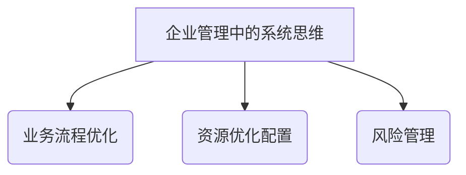

#### 3.1.3 系统思维在环境保护中的应用

环境保护是一个涉及多个因素的复杂问题。系统思维的应用有助于我们更全面地考虑环境保护的各个方面，制定更有效的环境保护策略。

1. **生态系统的保护**：系统思维可以帮助我们识别生态系统中关键的部分和过程，制定针对性的保护措施，实现生态系统的可持续发展。
2. **污染治理**：系统思维关注污染治理的整体性，通过综合考虑污染源、污染物和治理措施，实现污染治理的优化。
3. **环境监测**：系统思维可以帮助我们建立全面的监测体系，实时监测环境变化，及时采取应对措施，提高环境管理的有效性。

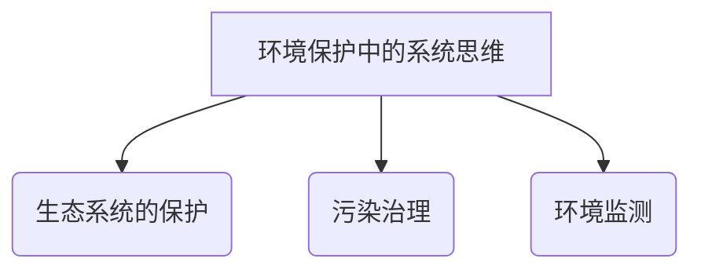

### 第4章：系统动力学基础

#### 4.1.1 系统动力学的概念与历史

系统动力学（System Dynamics）是一种研究复杂系统动态行为的方法，起源于20世纪50年代。系统动力学由美国麻省理工学院的杰伊·福里斯特（Jay W. Forrester）提出，并在多个领域得到了广泛应用。

系统动力学主要关注系统的内部结构、因果关系和反馈循环，通过建立系统模型来模拟和分析系统的行为。系统动力学模型通常采用流图表示，描述系统中的变量、因果关系和反馈循环。

系统动力学的发展历程可以分为以下几个阶段：

1. **初期发展（1950s-1960s）**：系统动力学由杰伊·福里斯特等人提出，主要应用于制造业和企业管理。
2. **成熟期（1970s-1980s）**：系统动力学在多个领域得到广泛应用，如环境保护、社会问题等。
3. **现代发展（1990s至今）**：随着计算机技术的发展，系统动力学模型得到了进一步优化和扩展，应用领域也不断扩展。

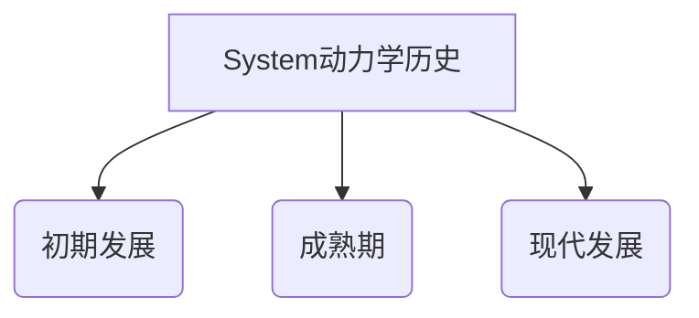

#### 4.1.2 系统动力学的建模方法

系统动力学的建模方法主要包括以下步骤：

1. **定义系统边界**：明确系统的范围和组成部分，确定系统与环境的边界。
2. **识别关键变量**：识别系统中关键的变量和参数，这些变量和参数对系统的行为有重要影响。
3. **建立因果关系**：通过逻辑关系和因果关系，描述变量之间的关系。
4. **建立反馈循环**：识别系统中的反馈循环，描述反馈对系统行为的影响。
5. **构建系统模型**：将以上步骤整合到一个系统中，形成一个完整的系统动力学模型。

系统动力学模型通常采用流图表示。流图中的节点表示变量，弧线表示变量之间的因果关系。通过流图，我们可以直观地理解系统的结构、因果关系和反馈循环。

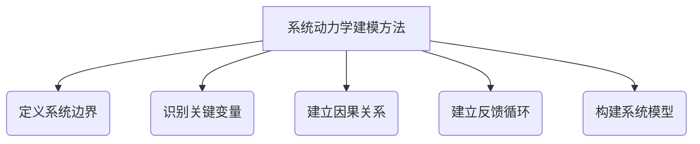

#### 4.1.3 系统流图与反馈循环

系统流图是系统动力学建模的核心工具，通过流图，我们可以直观地表示系统中的变量、因果关系和反馈循环。

1. **系统流图**：系统流图是一个由节点和弧线组成的网络，节点表示变量，弧线表示变量之间的因果关系。系统流图可以帮助我们理解系统的结构，识别关键变量和过程。
2. **反馈循环**：反馈循环是系统动力学中的一个关键概念，它描述了系统内部变量之间的相互作用。反馈循环可以分为正反馈和负反馈。

   - **正反馈**：正反馈使系统行为趋向于极端，可能导致系统行为的突变。例如，人口增长模型中的正反馈可能导致人口数量的爆炸性增长。
   - **负反馈**：负反馈使系统行为趋于稳定，有助于维持系统的平衡。例如，生态系统中食物链和食物网的负反馈有助于维持生态平衡。

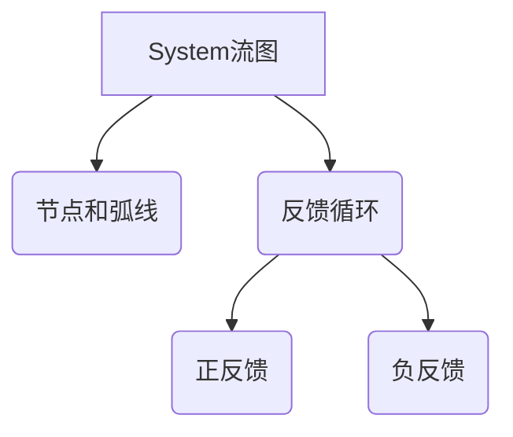

#### 4.1.4 系统动力学模型的应用

系统动力学模型在多个领域得到了广泛应用，如企业管理、环境保护、社会问题等。以下是一些典型的应用案例：

1. **企业管理**：通过系统动力学模型，企业可以分析业务流程、资源分配、市场策略等，优化企业的运营效率和决策。
2. **环境保护**：系统动力学模型可以帮助我们分析污染治理策略、生态系统平衡等，制定更有效的环境保护措施。
3. **社会问题**：系统动力学模型可以用于分析社会问题，如贫困、教育、医疗等，提供科学的政策建议。

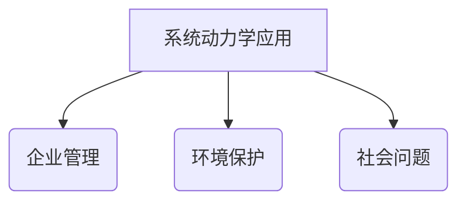

### 第5章：复杂系统与复杂网络

#### 5.1.1 复杂系统的特性

复杂系统是指具有高度非线性、动态性和不确定性的系统。复杂系统具有以下特性：

1. **高度非线性**：复杂系统的行为通常是非线性的，变量之间的关系复杂且多变。这种非线性特征使得复杂系统的行为难以预测和控制。
2. **动态性**：复杂系统的行为随着时间和环境的变化而变化。系统的状态和结构可能随时发生改变，这使得复杂系统的行为具有动态性。
3. **不确定性**：复杂系统的行为具有不确定性，难以精确预测。这种不确定性可能来源于系统内部的不确定性因素，如噪声、随机事件等。
4. **自组织**：复杂系统往往具有自组织特性，系统能够通过内部相互作用自发形成有序结构。这种自组织特性使得复杂系统能够在没有外部指令的情况下实现自我组织和自我调节。

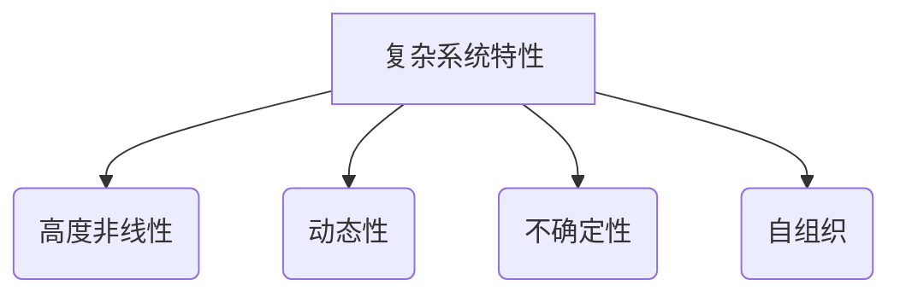

#### 5.1.2 网络科学的基本概念

网络科学是研究复杂网络的学科，主要关注网络的拓扑结构、动态行为和功能特性。网络科学的基本概念包括：

1. **网络拓扑**：网络拓扑描述了网络的结构，包括节点（个体）和边（关系）的排列方式。网络的拓扑结构对网络的行为和功能有重要影响。
2. **网络密度**：网络密度是描述网络连接程度的一个指标，表示网络中节点的连接数与可能的最大连接数之比。高密度网络通常具有较高的信息传递效率和稳定性。
3. **网络中心性**：网络中心性描述了节点在网中的重要性和连接性。中心性较高的节点通常起着关键的作用，如信息传播的中心节点、交通网络中的交通枢纽等。
4. **网络聚类系数**：网络聚类系数描述了网络中节点之间的局部连接性。高聚类系数表示网络中的节点倾向于形成紧密的簇，这有助于增强网络的稳定性和鲁棒性。

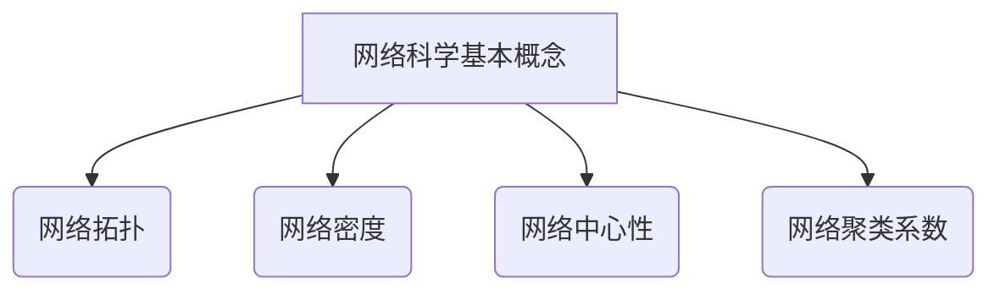

#### 5.1.3 网络模型的建立与应用

网络模型是描述网络结构和行为的工具，常见的网络模型包括图论模型、随机模型、动力学模型等。

1. **图论模型**：图论模型是描述网络结构的基本工具，使用节点和边表示网络中的个体和关系。图论模型可以用于分析网络的拓扑特性，如连通性、路径长度等。
2. **随机模型**：随机模型是基于概率统计的方法来描述网络的行为和演化。常见的随机模型包括随机图模型、随机游走模型等。随机模型可以用于分析网络的动态行为和稳定性。
3. **动力学模型**：动力学模型是描述网络中节点状态和动态行为的模型。常见的动力学模型包括同步模型、传染模型、竞争模型等。动力学模型可以用于分析网络的稳定性和演变规律。

网络模型在多个领域得到了广泛应用，如社会网络分析、生物网络分析、交通网络优化等。

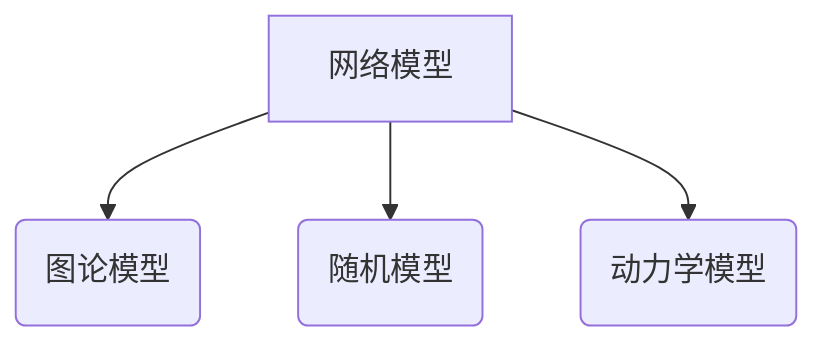

#### 5.1.4 网络模型的建立与应用

1. **社会网络分析**：社会网络分析是一种研究个体之间关系和相互作用的学科。通过建立社会网络模型，我们可以分析社交网络中的关键节点、传播路径等，为社交网络分析提供科学依据。
2. **生物网络分析**：生物网络分析是一种研究生物分子之间相互作用和调控机制的学科。通过建立生物网络模型，我们可以揭示生物分子网络的拓扑结构、关键节点和调控机制，为生物科学研究提供指导。
3. **交通网络优化**：交通网络优化是一种研究交通网络效率和性能优化的学科。通过建立交通网络模型，我们可以分析交通流量、路径选择等问题，为交通管理和规划提供科学依据。

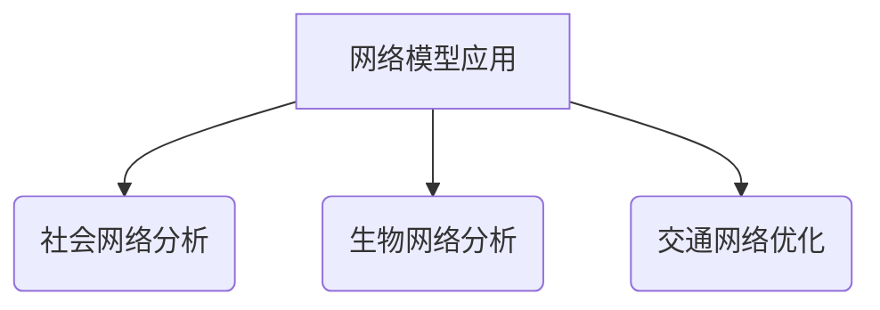

### 第6章：系统思维中的数学工具

#### 6.1.1 线性代数与矩阵理论

线性代数和矩阵理论是系统思维中常用的数学工具，主要用于描述系统的结构和动态行为。

1. **线性代数**：线性代数是研究向量空间和线性变换的数学分支。在系统思维中，线性代数可以用于描述系统的状态、变换和关系。例如，状态空间模型是一种常用的线性代数工具，用于描述系统的动态行为。
2. **矩阵理论**：矩阵理论是线性代数的一个重要分支，研究矩阵的运算和性质。在系统思维中，矩阵理论可以用于描述系统的结构、关系和演化。例如，矩阵分解、矩阵求逆等技术在系统建模和仿真中有着广泛的应用。

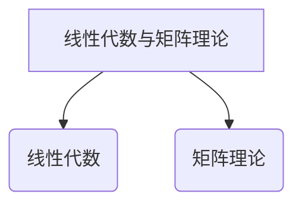

#### 6.1.2 微积分与微分方程

微积分和微分方程是系统思维中用于描述系统动态行为的数学工具。

1. **微积分**：微积分是研究函数变化率和积分的数学分支。在系统思维中，微积分可以用于描述系统的状态变化、积累和积分。例如，微分方程是一种常用的微积分工具，用于描述系统的动态行为。
2. **微分方程**：微分方程是一种描述系统动态行为的数学方程，表示系统的状态变化率。在系统思维中，微分方程可以用于建立系统模型、分析系统行为和预测系统状态。

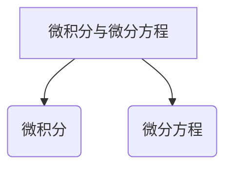

#### 6.1.3 概率论与统计方法

概率论和统计方法是系统思维中用于描述系统随机行为和不确定性的数学工具。

1. **概率论**：概率论是研究随机现象和概率分布的数学分支。在系统思维中，概率论可以用于描述系统的随机行为、概率分布和不确定性。例如，概率分布函数、随机过程等在系统建模和分析中有着广泛的应用。
2. **统计方法**：统计方法是一种基于数据分析的方法，用于描述和分析系统行为。在系统思维中，统计方法可以用于分析系统的状态、行为和性能，为系统优化和决策提供依据。例如，假设检验、回归分析等在系统分析和优化中有着广泛的应用。

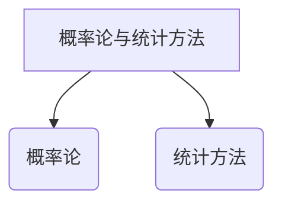

### 第7章：案例分析1：城市规划中的系统思维

#### 7.1.1 案例背景与挑战

城市规划是一个涉及多个因素的复杂问题。在城市化进程中，如何平衡交通、环境、人口等各个方面的需求是一个重要的挑战。

1. **交通问题**：城市化过程中，交通拥堵问题日益严重。交通拥堵不仅影响市民的出行效率，还对环境质量和居民生活造成负面影响。
2. **环境问题**：城市化过程中，环境污染问题日益突出。空气污染、水污染等对城市居民的身体健康和生态平衡造成威胁。
3. **人口问题**：城市化过程中，人口增长迅速，对城市基础设施和公共服务带来压力。如何合理规划城市人口分布，优化资源分配，成为城市规划的关键问题。

#### 7.1.2 系统思维的解决方案

通过系统思维，我们可以构建一个全面的城市规划模型，识别关键因素和过程，优化资源配置，提高城市规划的效率。

1. **定义系统边界**：明确城市规划的范围和组成部分，包括交通系统、环境系统、人口系统等。
2. **识别关键变量**：识别关键变量，如交通流量、污染物浓度、人口密度等，这些变量对城市规划有重要影响。
3. **建立因果关系**：通过因果关系描述变量之间的关系，如交通流量与污染物浓度之间的关系、人口密度与基础设施需求之间的关系等。
4. **建立反馈循环**：识别反馈循环，如交通拥堵导致的环境污染，环境污染影响居民健康，居民健康影响人口增长等。
5. **构建系统模型**：将以上步骤整合到一个系统中，形成一个完整的城市规划模型。
6. **仿真与优化**：通过仿真和分析，验证城市规划模型的准确性，发现优化机会，提出优化方案。

```mermaid
graph TD
A[城市规划系统思维解决方案] --> B(定义系统边界)
A --> C(识别关键变量)
A --> D(建立因果关系)
A --> E(建立反馈循环)
A --> F(构建系统模型)
A --> G(仿真与优化)
```

#### 7.1.3 案例总结与反思

本案例表明，系统思维在解决城市规划问题时具有显著的优势。通过系统思维，我们可以：

1. **全面理解问题**：系统思维帮助我们识别关键因素和过程，从整体上理解城市规划的复杂性。
2. **优化资源配置**：系统思维使我们能够优化交通、环境、人口等各个方面的资源配置，提高城市规划的效率。
3. **提高决策科学性**：系统思维提供了一种科学的方法来分析问题和制定策略，有助于提高城市规划的决策水平。

然而，系统思维在应用中也存在一些挑战：

1. **数据获取**：系统思维依赖于大量的数据和信息，数据获取的难度和准确性对系统思维的效果有重要影响。
2. **模型准确性**：系统模型的准确性取决于对系统内部因果关系的理解，模型的准确性对系统思维的结果有重要影响。
3. **实施难度**：系统思维提供的优化方案需要在实际中实施，实施过程中可能会遇到各种困难和挑战。

#### 7.1.4 案例总结与反思

通过本案例，我们可以看到系统思维在城市规划中的应用具有显著的优势，但在实际应用中也面临一些挑战。系统思维不仅需要全面的数据和信息支持，还需要对系统内部因果关系有深入的理解。在实际操作中，我们需要结合实际情况，灵活运用系统思维的方法，以提高城市规划的科学性和有效性。

### 第8章：案例分析2：全球供应链管理中的系统思维

#### 8.1.1 案例背景与挑战

全球供应链管理是一个涉及多个国家和企业的复杂问题。在全球化的背景下，供应链的复杂性和不确定性不断增加，如何提高供应链的效率和韧性成为关键挑战。

1. **供应链复杂度**：全球供应链涉及到多个供应商、制造商、分销商和零售商，供应链结构复杂，节点繁多。
2. **不确定性**：全球供应链面临多种不确定性，如原材料价格波动、运输延误、政治风险等，这些不确定性对供应链的稳定性和效率产生严重影响。
3. **风险管理**：全球供应链中的风险包括供应链中断、库存过剩、供应链成本增加等，如何有效管理这些风险成为供应链管理的关键问题。

#### 8.1.2 系统思维的解决方案

通过系统思维，我们可以构建一个全面的全球供应链模型，识别关键因素和过程，优化供应链管理，提高供应链的效率和韧性。

1. **定义系统边界**：明确全球供应链的范围和组成部分，包括供应商、制造商、分销商和零售商等。
2. **识别关键变量**：识别关键变量，如供应链节点、运输时间、库存水平、供应链成本等，这些变量对供应链管理有重要影响。
3. **建立因果关系**：通过因果关系描述变量之间的关系，如供应链节点之间的运输时间与供应链成本之间的关系、库存水平与供应链中断之间的关系等。
4. **建立反馈循环**：识别反馈循环，如供应链中断导致库存增加，库存增加导致供应链成本上升等。
5. **构建系统模型**：将以上步骤整合到一个系统中，形成一个完整的全球供应链模型。
6. **仿真与优化**：通过仿真和分析，验证供应链模型的准确性，发现优化机会，提出优化方案。

```mermaid
graph TD
A[全球供应链管理系统思维解决方案] --> B(定义系统边界)
A --> C(识别关键变量)
A --> D(建立因果关系)
A --> E(建立反馈循环)
A --> F(构建系统模型)
A --> G(仿真与优化)
```

#### 8.1.3 案例总结与反思

本案例表明，系统思维在解决全球供应链管理问题时具有显著的优势。通过系统思维，我们可以：

1. **全面理解问题**：系统思维帮助我们识别关键因素和过程，从整体上理解全球供应链的复杂性。
2. **优化资源配置**：系统思维使我们能够优化供应链节点、运输时间、库存水平等资源配置，提高供应链的效率和韧性。
3. **提高决策科学性**：系统思维提供了一种科学的方法来分析问题和制定策略，有助于提高供应链管理的决策水平。

然而，系统思维在应用中也存在一些挑战：

1. **数据获取**：系统思维依赖于大量的数据和信息，数据获取的难度和准确性对系统思维的效果有重要影响。
2. **模型准确性**：系统模型的准确性取决于对系统内部因果关系的理解，模型的准确性对系统思维的结果有重要影响。
3. **实施难度**：系统思维提供的优化方案需要在实际中实施，实施过程中可能会遇到各种困难和挑战。

#### 8.1.4 案例总结与反思

通过本案例，我们可以看到系统思维在解决全球供应链管理问题时具有显著的优势，但在实际应用中也面临一些挑战。系统思维不仅需要全面的数据和信息支持，还需要对系统内部因果关系有深入的理解。在实际操作中，我们需要结合实际情况，灵活运用系统思维的方法，以提高全球供应链管理的效率和韧性。

### 第9章：系统思维在创新管理中的应用

#### 9.1.1 创新管理的挑战

创新管理是一个涉及多个因素的复杂问题。在创新过程中，如何有效管理创新资源、协调创新团队、优化创新流程，是创新管理面临的主要挑战。

1. **创新资源管理**：创新资源包括人才、资金、技术等，如何合理配置和创新资源，提高创新效率，是创新管理的关键问题。
2. **团队协调**：创新团队通常由不同背景和专业的人组成，如何协调团队成员的协作，充分发挥每个人的优势，是创新管理的重要挑战。
3. **创新流程优化**：创新过程通常包括多个阶段，如创意生成、产品设计、市场推广等，如何优化创新流程，提高创新成功率，是创新管理的重要任务。

#### 9.1.2 系统思维在创新过程中的应用

通过系统思维，我们可以构建一个全面的创新管理模型，识别关键因素和过程，优化资源配置，提高创新管理的效率。

1. **定义系统边界**：明确创新管理的范围和组成部分，包括创新团队、创新资源、创新流程等。
2. **识别关键变量**：识别关键变量，如创新资源利用率、团队协作效率、创新流程周期等，这些变量对创新管理有重要影响。
3. **建立因果关系**：通过因果关系描述变量之间的关系，如创新资源利用率与团队协作效率之间的关系、创新流程周期与创新成功率之间的关系等。
4. **建立反馈循环**：识别反馈循环，如创新资源不足导致团队协作困难，团队协作困难影响创新流程等。
5. **构建系统模型**：将以上步骤整合到一个系统中，形成一个完整的创新管理模型。
6. **仿真与优化**：通过仿真和分析，验证创新管理模型的准确性，发现优化机会，提出优化方案。

```mermaid
graph TD
A[创新管理系统思维解决方案] --> B(定义系统边界)
A --> C(识别关键变量)
A --> D(建立因果关系)
A --> E(建立反馈循环)
A --> F(构建系统模型)
A --> G(仿真与优化)
```

#### 9.1.3 创新管理的系统思维实践案例

本节将介绍一个创新管理的系统思维实践案例，以展示系统思维在创新管理中的应用。

1. **案例背景**：某科技公司计划推出一款智能家居产品，需要建立一支创新团队，负责产品的设计、开发和推广。
2. **系统思维应用**：
   - **定义系统边界**：明确创新团队的范围和组成部分，包括产品设计师、工程师、市场营销人员等。
   - **识别关键变量**：识别关键变量，如团队成员协作效率、产品设计周期、市场反馈等。
   - **建立因果关系**：通过因果关系描述变量之间的关系，如团队成员协作效率与产品设计周期之间的关系、产品设计周期与市场反馈之间的关系等。
   - **建立反馈循环**：识别反馈循环，如市场反馈影响产品设计，产品设计影响市场反馈等。
   - **构建系统模型**：构建一个创新管理模型，模拟创新团队的行为，分析关键变量的影响。
   - **仿真与优化**：通过仿真和分析，验证创新管理模型的准确性，提出优化方案，如调整团队成员结构、优化工作流程等。

通过系统思维的应用，该科技公司在创新管理中取得了显著成效，提高了产品设计的质量和市场竞争力。

#### 9.1.4 案例总结与反思

本案例表明，系统思维在创新管理中具有显著的应用价值。通过系统思维，我们可以：

1. **全面理解创新过程**：系统思维帮助我们识别关键因素和过程，从整体上理解创新管理的复杂性。
2. **优化资源配置**：系统思维使我们能够优化创新资源、团队协作和创新流程，提高创新效率。
3. **提高决策科学性**：系统思维提供了一种科学的方法来分析问题和制定策略，有助于提高创新管理的决策水平。

然而，系统思维在应用中也存在一些挑战：

1. **数据获取**：系统思维依赖于大量的数据和信息，数据获取的难度和准确性对系统思维的效果有重要影响。
2. **模型准确性**：系统模型的准确性取决于对系统内部因果关系的理解，模型的准确性对系统思维的结果有重要影响。
3. **实施难度**：系统思维提供的优化方案需要在实际中实施，实施过程中可能会遇到各种困难和挑战。

在实际应用中，我们需要结合实际情况，灵活运用系统思维的方法，以实现创新管理的优化。

### 第10章：系统思维的总结与展望

#### 10.1.1 系统思维的关键要点

系统思维是一种整体性的思维方式，强调系统的各个部分以及它们之间的相互作用。系统思维的关键要点包括：

1. **全局视角**：从整体上看待系统，关注系统内部各个部分之间的相互作用以及系统与环境之间的交互。
2. **相互依赖性**：认识到系统内部各个部分之间的相互依赖关系，认识到系统行为是多个部分相互影响的结果。
3. **反馈机制**：重视系统内部的反馈循环，认识到反馈循环在系统行为中的作用。
4. **复杂性管理**：处理系统的复杂性和不确定性，通过系统思维的方法来理解和解决复杂问题。

#### 10.1.2 系统思维的未来发展趋势

随着科学技术的进步和社会的快速发展，系统思维在各个领域得到了广泛应用，并呈现出以下发展趋势：

1. **跨学科融合**：系统思维将继续与其他学科（如生态学、经济学、管理学等）相结合，形成跨学科的研究方法和应用模式。
2. **智能化工具**：随着人工智能技术的发展，系统思维将结合智能化工具，如机器学习、数据挖掘等，实现更高效的分析和决策。
3. **全球视角**：在全球化的背景下，系统思维将更加重视全球视角，关注全球范围内的复杂问题和挑战。
4. **可持续发展**：系统思维将在可持续发展领域发挥重要作用，帮助解决环境、资源、社会等全球性问题。

#### 10.1.3 对个人与组织的启示

对于个人来说，系统思维可以提升以下能力：

1. **问题解决能力**：通过系统思维，个人可以更好地理解复杂问题，找到问题的根本原因，提出有效的解决方案。
2. **决策能力**：系统思维帮助个人从全局视角考虑问题，做出更加科学和合理的决策。
3. **创新能力**：系统思维鼓励个人从整体性和相互依赖性的角度思考，激发创新思维。

对于组织来说，系统思维可以带来以下益处：

1. **组织效率**：通过系统思维，组织可以优化资源配置，提高运营效率。
2. **风险管理**：系统思维帮助组织识别潜在的风险，制定有效的风险应对策略。
3. **创新管理**：系统思维有助于组织更好地管理创新过程，提高创新成功率。

总之，系统思维不仅是一种思维方式，更是一种解决问题的方法和工具。通过培养系统思维，个人和组织可以更好地应对复杂变化的环境，实现可持续发展。

## 附录

### 附录A：系统思维工具与方法

附录A将介绍系统思维中常用的工具和方法，以帮助读者更好地理解和应用系统思维。

1. **系统流图**：系统流图是系统动力学建模的核心工具，用于描述系统中的变量、因果关系和反馈循环。通过系统流图，可以直观地理解系统的结构和动态行为。
2. **因果关系图**：因果关系图是用于描述系统内部变量之间因果关系的工具。通过因果关系图，可以分析变量之间的相互作用和影响。
3. **系统动力学模型**：系统动力学模型是用于模拟和分析系统动态行为的数学模型。通过系统动力学模型，可以预测系统在不同条件下的行为，优化系统设计和操作。
4. **网络模型**：网络模型是用于描述复杂网络结构和动态行为的工具。通过网络模型，可以分析网络中的关键节点、传播路径和网络特性。

### 附录B：参考文献

1. 福里斯特，J. W.（1958）。《工业动力学》。麻省理工学院出版社。
2. 巴伯，C. G.（2002）。《系统动力学入门》。清华大学出版社。
3. 布鲁斯，J. M.（2005）。《复杂系统的系统动力学》。科学出版社。
4. 纳尔逊，D. L. &温伯格，A. M.（1996）。《系统思维：理解动态行为》。清华大学出版社。
5. 罗斯，A.（2006）。《网络科学导论》。机械工业出版社。
6. 约翰逊，N. F.（2010）。《复杂网络：结构、动力和行为》。科学出版社。

通过以上参考文献，读者可以进一步深入了解系统思维的理论和方法，为实际应用提供指导。

