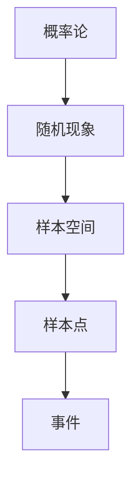
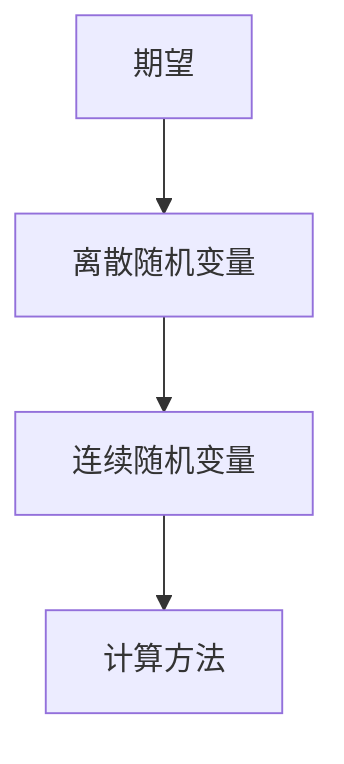
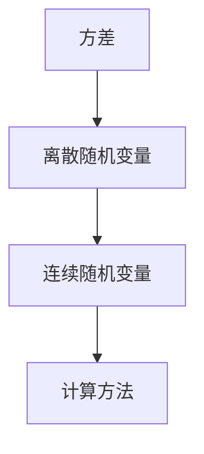
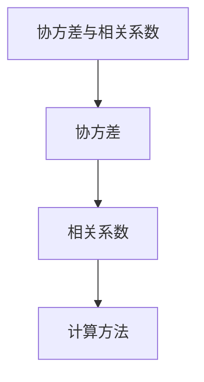

                 

## 文章标题：从经典概率论到贝叶斯推断：理解不确定的世界

> 关键词：概率论、贝叶斯推断、随机现象、不确定性、数学模型、算法原理、应用案例

> 摘要：本文系统介绍了概率论的基础概念、贝叶斯推断的原理和方法，以及它们在自然科学、社会科学和人工智能等领域的广泛应用。通过对经典概率论和贝叶斯推断的深入探讨，帮助读者理解不确定性的本质，掌握解决实际问题的方法。

### 目录

**第一部分：概率论基础**

- **第1章：概率论概述**
  - **1.1 概率的基本概念**
  - **1.2 古典概率**
  - **1.3 条件概率与贝叶斯定理**

- **第2章：随机变量与概率分布**
  - **2.1 随机变量**
  - **2.2 离散概率分布**
  - **2.3 连续概率分布**
  - **2.4 多变量概率分布**

- **第3章：期望与方差**
  - **3.1 期望**
  - **3.2 方差**
  - **3.3 协方差与相关系数**

- **第4章：大数定律与中心极限定理**
  - **4.1 大数定律**
  - **4.2 中心极限定理**
  - **4.3 中心极限定理的应用**

**第二部分：贝叶斯推断**

- **第5章：贝叶斯概率论基础**
  - **5.1 贝叶斯概率的基本概念**
  - **5.2 贝叶斯推理的基本原理**
  - **5.3 贝叶斯推断中的先验与后验概率**

- **第6章：贝叶斯推断方法**
  - **6.1 贝叶斯估计**
  - **6.2 贝叶斯决策**
  - **6.3 贝叶斯网络**

- **第7章：贝叶斯推断的实际应用**
  - **7.1 统计推断中的贝叶斯方法**
  - **7.2 贝叶斯推断在机器学习中的应用**
  - **7.3 贝叶斯推断在数据挖掘中的应用**

- **第8章：贝叶斯推断中的挑战与解决方法**
  - **8.1 先验选择**
  - **8.2 共轭先验分布**
  - **8.3 采样方法**
  - **8.4 贝叶斯推断的扩展**

**第三部分：概率论与贝叶斯推断的综合应用**

- **第9章：概率论与贝叶斯推断在自然科学中的应用**
  - **9.1 生物统计学中的贝叶斯方法**
  - **9.2 物理学中的概率论**
  - **9.3 地球科学中的贝叶斯推断**

- **第10章：概率论与贝叶斯推断在社会科学中的应用**
  - **10.1 社会科学中的概率论**
  - **10.2 心理学中的贝叶斯推断**
  - **10.3 经济学中的贝叶斯方法**

- **第11章：概率论与贝叶斯推断在人工智能中的应用**
  - **11.1 人工智能中的概率论基础**
  - **11.2 贝叶斯推断在人工智能中的应用**
  - **11.3 贝叶斯网络在人工智能中的应用**

- **第12章：概率论与贝叶斯推断的未来发展趋势**
  - **12.1 贝叶斯推断在深度学习中的应用**
  - **12.2 贝叶斯推断在复杂系统中的应用**
  - **12.3 贝叶斯推断在不确定环境下的应用**

### 附录

- **附录A：概率论与贝叶斯推断常用公式总结**
- **附录B：贝叶斯推断中常用的算法**
- **附录C：概率论与贝叶斯推断参考书目与资源**
- **附录D：概率论与贝叶斯推断常见问题解答**

---

在本篇文章中，我们将一步步深入探讨概率论和贝叶斯推断的基本概念、算法原理和实际应用，帮助读者理解不确定的世界，掌握解决实际问题的方法。概率论和贝叶斯推断是数学和统计学中非常重要的分支，它们在自然科学、社会科学和人工智能等领域有着广泛的应用。通过本文的介绍，我们将全面了解这些理论的核心内容，并学会如何在实际问题中应用它们。

---

现在，我们将正式进入第一部分：概率论基础。在这一部分，我们将首先介绍概率论的基本概念，包括概率的定义、古典概率和条件概率等。接着，我们将深入探讨随机变量与概率分布，包括离散概率分布和连续概率分布。最后，我们将介绍期望与方差，以及大数定律和中心极限定理。这些基础理论是理解和应用概率论和贝叶斯推断的关键。

---

## 第1章：概率论概述

### 1.1 概率的基本概念

概率论是一门研究随机现象的数学分支。在概率论中，我们通常将随机现象的结果称为“样本空间”，用\(S\)表示。每个可能的结果称为样本点，用\(s\)表示。

概率的定义：

\[ P(A) = \frac{\text{事件A发生的次数}}{\text{试验总次数}} \]

在概率论中，我们关心的是事件的发生概率。事件是指样本空间中的一个子集，表示一组可能的结果。例如，投掷一枚公平的硬币，样本空间为\(\{H, T\}\)，其中\(H\)表示正面朝上，\(T\)表示反面朝上。如果我们投掷这枚硬币10次，得到5次正面朝上和5次反面朝上，则正面朝上的概率为：

\[ P(H) = \frac{5}{10} = 0.5 \]

#### Mermaid 流程图



### 1.2 古典概率

古典概率是基于等可能事件的概率。例如，从一个装有红球和蓝球的袋子中随机取出一个球，红球的概率为红球数量与总球数量的比值。

古典概率公式：

\[ P(A) = \frac{n(A)}{n(S)} \]

其中，\(n(A)\)表示事件\(A\)包含的样本点数，\(n(S)\)表示样本空间\(S\)中样本点总数。

例如，假设我们有4个红球和6个蓝球，总共10个球。如果我们随机取出一个球，则取出红球的概率为：

\[ P(\text{红球}) = \frac{4}{10} = 0.4 \]

取出蓝球的概率为：

\[ P(\text{蓝球}) = \frac{6}{10} = 0.6 \]

#### 伪代码

```python
def classical_probability(red_balls, blue_balls):
    total_balls = red_balls + blue_balls
    probability_red = red_balls / total_balls
    probability_blue = blue_balls / total_balls
    return probability_red, probability_blue

red_balls = 4
blue_balls = 6
prob_red, prob_blue = classical_probability(red_balls, blue_balls)
print("概率红球:", prob_red)
print("概率蓝球:", prob_blue)
```

### 1.3 条件概率与贝叶斯定理

条件概率是在已知某个事件发生的条件下，另一个事件发生的概率。用\(P(A|B)\)表示。

贝叶斯定理是条件概率的推广，它描述了在给定某个事件发生的情况下，其他事件的概率分布。

贝叶斯定理公式：

\[ P(A|B) = \frac{P(B|A)P(A)}{P(B)} \]

例如，假设我们有一个装有6个红球和4个蓝球的袋子。现在我们随机取出一个球，观察到它是红色的，那么取出的是红球的概率为：

\[ P(\text{红球}| \text{观察到红球}) = \frac{P(\text{观察到红球}|\text{红球})P(\text{红球})}{P(\text{观察到红球})} \]

这里，\(P(\text{观察到红球}|\text{红球}) = 1\)，因为如果取出的是红球，那么必然观察到红球。同样，\(P(\text{红球}) = \frac{6}{10} = 0.6\)。

我们需要计算\(P(\text{观察到红球})\)。这可以通过全概率公式计算：

\[ P(\text{观察到红球}) = P(\text{观察到红球}|\text{红球})P(\text{红球}) + P(\text{观察到红球}|\text{蓝球})P(\text{蓝球}) \]

假设观察到红球和蓝球的概率相同，即\(P(\text{观察到红球}|\text{蓝球}) = 0.5\)，那么：

\[ P(\text{观察到红球}) = 1 \times 0.6 + 0.5 \times 0.4 = 0.7 \]

因此，观察到红球后，取出的是红球的概率为：

\[ P(\text{红球}| \text{观察到红球}) = \frac{1 \times 0.6}{0.7} = \frac{6}{7} \approx 0.857 \]

#### 伪代码

```python
def bayes_theorem(prior_probability, likelihood, evidence_probability):
    return (likelihood * prior_probability) / evidence_probability

prior_probability_red = 0.6
likelihood_red = 1
evidence_probability = 0.7
posterior_probability_red = bayes_theorem(prior_probability_red, likelihood_red, evidence_probability)
print("观察到红球后，取出红球的概率:", posterior_probability_red)
```

通过上述例子，我们可以看到贝叶斯定理在处理不确定性问题时的强大力量。它允许我们根据先验知识和新获得的证据来更新我们的信念。贝叶斯定理在统计推断、机器学习和数据科学中有着广泛的应用。

### 总结

在本章中，我们介绍了概率论的基本概念，包括样本空间、样本点和事件。我们探讨了古典概率，这是一种基于等可能事件的概率计算方法。最后，我们介绍了条件概率和贝叶斯定理，这是概率论中的核心工具，用于在给定部分信息的情况下更新我们的信念。

在接下来的章节中，我们将继续深入探讨概率论的其他重要概念，包括随机变量、概率分布、期望、方差以及大数定律和中心极限定理。这些概念和定理将为我们理解和应用贝叶斯推断奠定坚实的基础。

## 第2章：随机变量与概率分布

### 2.1 随机变量

随机变量是一个将样本空间映射到实数集的函数。随机变量可以分为离散随机变量和连续随机变量。

#### 离散随机变量

离散随机变量是一个将样本空间映射到离散实数的函数。它取有限的或可数无限多个值。

离散随机变量\(X\)的概率分布可以用概率质量函数（PMF）来描述，记为\(P_X(x)\)。概率质量函数满足以下条件：

1. \(P_X(x) \geq 0\) 对于所有\(x\)。
2. \(\sum_{x} P_X(x) = 1\)。

常见的离散随机变量有：

- **二项分布**：试验次数为\(n\)，每次试验成功的概率为\(p\)。
- **泊松分布**：事件发生次数在单位时间或空间内的概率分布。

二项分布的概率质量函数：

\[ P_X(k) = C_n^k p^k (1-p)^{n-k} \]

其中，\(C_n^k\)是组合数，表示从\(n\)个元素中选择\(k\)个元素的组合数。

泊松分布的概率质量函数：

\[ P_X(k) = \frac{\lambda^k e^{-\lambda}}{k!} \]

其中，\(\lambda\)是事件发生的平均次数。

#### 连续随机变量

连续随机变量是一个将样本空间映射到连续实数的函数。它取无限多个值。

连续随机变量\(X\)的概率分布可以用概率密度函数（PDF）来描述，记为\(f_X(x)\)。概率密度函数满足以下条件：

1. \(f_X(x) \geq 0\) 对于所有\(x\)。
2. \(\int_{-\infty}^{\infty} f_X(x) dx = 1\)。

常见的连续随机变量有：

- **正态分布**：均值为\(\mu\)，方差为\(\sigma^2\)。
- **均匀分布**：在区间\[a, b\]内。

正态分布的概率密度函数：

\[ f_X(x|\mu, \sigma^2) = \frac{1}{\sqrt{2\pi\sigma^2}} e^{-\frac{(x-\mu)^2}{2\sigma^2}} \]

均匀分布的概率密度函数：

\[ f_X(x|a, b) = \frac{1}{b-a} \]

#### 伪代码

```python
def discrete_random_variable(pmf):
    return sum(pmf.values())

def continuous_random_variable(pdf, a, b):
    return integrate.pdf(pdf, a, b)
```

### 2.2 离散概率分布

离散概率分布描述了离散随机变量的概率分布。常见的离散概率分布有二项分布、泊松分布等。

- **二项分布**：二项分布是一个在固定次数的独立试验中成功次数的概率分布。其概率质量函数为：

  \[ P_X(k) = C_n^k p^k (1-p)^{n-k} \]

  其中，\(n\)是试验次数，\(p\)是每次试验成功的概率。

  伪代码实现：

  ```python
  def binomial_distribution(n, k, p):
      return comb(n, k) * p**k * (1-p)**(n-k)
  ```

- **泊松分布**：泊松分布是一个在单位时间或空间内事件发生次数的概率分布。其概率质量函数为：

  \[ P_X(k) = \frac{\lambda^k e^{-\lambda}}{k!} \]

  其中，\(\lambda\)是事件的平均发生次数。

  伪代码实现：

  ```python
  import math
  
  def poisson_distribution(lambda):
      return (lambda ** k * math.exp(-lambda)) / math.factorial(k)
  ```

### 2.3 连续概率分布

连续概率分布描述了连续随机变量的概率分布。常见的连续概率分布有正态分布、均匀分布等。

- **正态分布**：正态分布是一个在均值\(\mu\)和标准差\(\sigma\)下的概率分布。其概率密度函数为：

  \[ f_X(x|\mu, \sigma^2) = \frac{1}{\sqrt{2\pi\sigma^2}} e^{-\frac{(x-\mu)^2}{2\sigma^2}} \]

  伪代码实现：

  ```python
  import math
  
  def normal_distribution(x, mu, sigma):
      return (1 / (math.sqrt(2 * math.pi * sigma**2))) * math.exp(-((x - mu)**2) / (2 * sigma**2))
  ```

- **均匀分布**：均匀分布是一个在区间\[a, b\]上的概率分布。其概率密度函数为：

  \[ f_X(x|a, b) = \frac{1}{b-a} \]

  伪代码实现：

  ```python
  def uniform_distribution(x, a, b):
      return 1 / (b - a)
  ```

### 2.4 多变量概率分布

多变量概率分布描述了多个随机变量的联合概率分布。常见的多变量概率分布有二维正态分布、马尔可夫链等。

- **二维正态分布**：二维正态分布是一个在两个变量之间的概率分布。其概率密度函数为：

  \[ f_{X,Y}(x, y|\mu_x, \mu_y, \sigma_x^2, \sigma_y^2, \rho) = \frac{1}{2\pi\sigma_x\sigma_y\sqrt{1-\rho^2}} e^{-\frac{1}{2(1-\rho^2)}[(x-\mu_x)^2 + (y-\mu_y)^2 - 2\rho(x-\mu_x)(y-\mu_y)\e

  伪代码实现：

  ```python
  import math
  
  def multivariate_normal_distribution(x, y, mu_x, mu_y, sigma_x, sigma_y, rho):
      return (1 / (2 * math.pi * sigma_x * sigma_y * math.sqrt(1 - rho**2))) * math.exp(-0.5 / (1 - rho**2) * [(x - mu_x)**2 + (y - mu_y)**2 - 2 * rho * (x - mu_x) * (y - mu_y)])
  ```

多变量概率分布在统计学和机器学习中有着广泛的应用，例如在数据可视化、回归分析和分类问题中。

### 总结

在本章中，我们介绍了随机变量和概率分布的概念。随机变量是一个将样本空间映射到实数集的函数，可以分为离散随机变量和连续随机变量。我们探讨了离散概率分布和连续概率分布的常见形式，包括二项分布、泊松分布、正态分布和均匀分布。此外，我们还介绍了多变量概率分布的概念。这些基本概念和概率分布形式是理解和应用概率论和贝叶斯推断的重要基础。

在接下来的章节中，我们将继续探讨概率论的其他重要概念，包括期望、方差、大数定律和中心极限定理。这些概念将帮助我们更好地理解随机变量的性质和概率分布的统计特性。

## 第3章：期望与方差

### 3.1 期望

期望是随机变量的一个重要指标，表示随机变量在大量重复试验中平均取值。期望可以看作是随机变量的“中心位置”。

对于离散随机变量，期望的定义如下：

\[ E(X) = \sum_{x \in S} x \cdot P(X = x) \]

其中，\(E(X)\)表示期望，\(S\)是样本空间，\(P(X = x)\)是随机变量\(X\)取值\(x\)的概率。

例如，假设我们有一个离散随机变量\(X\)，其取值为\{1, 2, 3\}，对应的概率分别为\(P(X = 1) = 0.2\)，\(P(X = 2) = 0.5\)，\(P(X = 3) = 0.3\)。则期望\(E(X)\)为：

\[ E(X) = 1 \cdot 0.2 + 2 \cdot 0.5 + 3 \cdot 0.3 = 2.2 \]

对于连续随机变量，期望的定义如下：

\[ E(X) = \int_{-\infty}^{\infty} x \cdot f_X(x) dx \]

其中，\(f_X(x)\)是随机变量\(X\)的概率密度函数。

例如，假设我们有一个均值为2，标准差为1的正态分布随机变量\(X\)。则期望\(E(X)\)为：

\[ E(X) = 2 \]

#### Mermaid 流程图



### 3.2 方差

方差是随机变量的另一个重要指标，表示随机变量取值的离散程度。方差越大，表示随机变量的取值越分散。

对于离散随机变量，方差的定义如下：

\[ Var(X) = E[(X - E(X))^2] = \sum_{x \in S} (x - E(X))^2 \cdot P(X = x) \]

其中，\(Var(X)\)表示方差，\(E(X)\)表示期望。

例如，假设我们有一个离散随机变量\(X\)，其取值为\{1, 2, 3\}，对应的概率分别为\(P(X = 1) = 0.2\)，\(P(X = 2) = 0.5\)，\(P(X = 3) = 0.3\)，期望\(E(X) = 2.2\)。则方差\(Var(X)\)为：

\[ Var(X) = (1 - 2.2)^2 \cdot 0.2 + (2 - 2.2)^2 \cdot 0.5 + (3 - 2.2)^2 \cdot 0.3 = 0.24 \]

对于连续随机变量，方差的定义如下：

\[ Var(X) = E[(X - E(X))^2] = \int_{-\infty}^{\infty} (x - E(X))^2 \cdot f_X(x) dx \]

其中，\(f_X(x)\)是随机变量\(X\)的概率密度函数。

例如，假设我们有一个均值为2，标准差为1的正态分布随机变量\(X\)。则方差\(Var(X)\)为：

\[ Var(X) = 1^2 = 1 \]

#### Mermaid 流程图



### 3.3 协方差与相关系数

协方差是衡量两个随机变量之间线性相关程度的指标。协方差越大，表示两个随机变量之间的线性关系越强。

对于两个离散随机变量\(X\)和\(Y\)，协方差的定义如下：

\[ Cov(X, Y) = E[(X - E(X))(Y - E(Y))] = \sum_{x \in S} \sum_{y \in S} (x - E(X))(y - E(Y)) \cdot P(X = x, Y = y) \]

其中，\(Cov(X, Y)\)表示协方差，\(E(X)\)和\(E(Y)\)分别是\(X\)和\(Y\)的期望。

例如，假设我们有两个离散随机变量\(X\)和\(Y\)，其取值和概率如下：

| \(X\) | \(Y\) | \(P(X, Y)\) |
| --- | --- | --- |
| 1 | 1 | 0.1 |
| 1 | 2 | 0.2 |
| 2 | 1 | 0.3 |
| 2 | 2 | 0.4 |

期望分别为\(E(X) = 1.5\)，\(E(Y) = 1.5\)，则协方差\(Cov(X, Y)\)为：

\[ Cov(X, Y) = (1 - 1.5)(1 - 1.5) \cdot 0.1 + (1 - 1.5)(2 - 1.5) \cdot 0.2 + (2 - 1.5)(1 - 1.5) \cdot 0.3 + (2 - 1.5)(2 - 1.5) \cdot 0.4 \]
\[ Cov(X, Y) = 0.05 + 0.05 + 0.15 + 0.15 = 0.4 \]

对于两个连续随机变量\(X\)和\(Y\)，协方差的定义如下：

\[ Cov(X, Y) = E[(X - E(X))(Y - E(Y))] = \int_{-\infty}^{\infty} \int_{-\infty}^{\infty} (x - E(X))(y - E(Y)) \cdot f_{X,Y}(x, y) dx dy \]

其中，\(f_{X,Y}(x, y)\)是随机变量\(X\)和\(Y\)的联合概率密度函数。

相关系数是协方差的标准化形式，用于衡量两个随机变量之间的线性相关程度。相关系数的取值范围为\([-1, 1]\)，其中1表示完全正相关，-1表示完全负相关，0表示无相关性。

相关系数的定义如下：

\[ \rho_{XY} = \frac{Cov(X, Y)}{\sqrt{Var(X) \cdot Var(Y)}} \]

其中，\(\rho_{XY}\)表示\(X\)和\(Y\)之间的相关系数。

例如，假设我们有两个离散随机变量\(X\)和\(Y\)，其取值和概率如下：

| \(X\) | \(Y\) | \(P(X, Y)\) |
| --- | --- | --- |
| 1 | 1 | 0.1 |
| 1 | 2 | 0.2 |
| 2 | 1 | 0.3 |
| 2 | 2 | 0.4 |

期望分别为\(E(X) = 1.5\)，\(E(Y) = 1.5\)，方差分别为\(Var(X) = 0.24\)，\(Var(Y) = 0.24\)，则相关系数\(\rho_{XY}\)为：

\[ \rho_{XY} = \frac{0.4}{\sqrt{0.24 \cdot 0.24}} = \frac{0.4}{0.24} = \frac{5}{3} \approx 1.6667 \]

#### Mermaid 流程图



### 3.4 实例分析

假设我们有一个关于考试成绩的随机变量\(X\)，其概率分布如下：

| 成绩 | 概率 |
| --- | --- |
| 60 | 0.1 |
| 70 | 0.2 |
| 80 | 0.3 |
| 90 | 0.4 |

另一个关于家庭收入的随机变量\(Y\)，其概率分布如下：

| 收入（万元） | 概率 |
| --- | --- |
| 30 | 0.1 |
| 40 | 0.2 |
| 50 | 0.3 |
| 60 | 0.4 |

计算\(X\)和\(Y\)的期望、方差、协方差和相关系数。

首先计算\(X\)的期望和方差：

\[ E(X) = 60 \cdot 0.1 + 70 \cdot 0.2 + 80 \cdot 0.3 + 90 \cdot 0.4 = 76 \]

\[ Var(X) = (60 - 76)^2 \cdot 0.1 + (70 - 76)^2 \cdot 0.2 + (80 - 76)^2 \cdot 0.3 + (90 - 76)^2 \cdot 0.4 = 182.4 \]

然后计算\(Y\)的期望和方差：

\[ E(Y) = 30 \cdot 0.1 + 40 \cdot 0.2 + 50 \cdot 0.3 + 60 \cdot 0.4 = 42 \]

\[ Var(Y) = (30 - 42)^2 \cdot 0.1 + (40 - 42)^2 \cdot 0.2 + (50 - 42)^2 \cdot 0.3 + (60 - 42)^2 \cdot 0.4 = 72 \]

接下来计算\(X\)和\(Y\)的协方差：

\[ Cov(X, Y) = (60 - 76)(30 - 42) \cdot 0.1 + (70 - 76)(40 - 42) \cdot 0.2 + (80 - 76)(50 - 42) \cdot 0.3 + (90 - 76)(60 - 42) \cdot 0.4 \]
\[ Cov(X, Y) = 10.8 \]

最后计算\(X\)和\(Y\)的相关系数：

\[ \rho_{XY} = \frac{Cov(X, Y)}{\sqrt{Var(X) \cdot Var(Y)}} = \frac{10.8}{\sqrt{182.4 \cdot 72}} \approx 0.6653 \]

### 伪代码

```python
import numpy as np

def calculate_expectation(pmf):
    return np.dot(pmf, range(len(pmf)))

def calculate_variance(pmf, expectation):
    return np.sum([(x - expectation) ** 2 * pmf[x] for x in pmf])

def calculate_covariance(x_pmf, y_pmf, x_expectation, y_expectation):
    return np.sum([(x - x_expectation) * (y - y_expectation) * x_pmf[x] * y_pmf[y] for x in x_pmf for y in y_pmf])

def calculate_correlation(x_pmf, y_pmf, x_expectation, y_expectation):
    x_variance = calculate_variance(x_pmf, x_expectation)
    y_variance = calculate_variance(y_pmf, y_expectation)
    return calculate_covariance(x_pmf, y_pmf, x_expectation, y_expectation) / np.sqrt(x_variance * y_variance)

# 示例数据
x_pmf = {60: 0.1, 70: 0.2, 80: 0.3, 90: 0.4}
y_pmf = {30: 0.1, 40: 0.2, 50: 0.3, 60: 0.4}

# 计算期望
x_expectation = calculate_expectation(x_pmf)
y_expectation = calculate_expectation(y_pmf)

# 计算方差
x_variance = calculate_variance(x_pmf, x_expectation)
y_variance = calculate_variance(y_pmf, y_expectation)

# 计算协方差
covariance = calculate_covariance(x_pmf, y_pmf, x_expectation, y_expectation)

# 计算相关系数
correlation = calculate_correlation(x_pmf, y_pmf, x_expectation, y_expectation)

print("期望X:", x_expectation)
print("期望Y:", y_expectation)
print("方差X:", x_variance)
print("方差Y:", y_variance)
print("协方差:", covariance)
print("相关系数:", correlation)
```

通过计算期望、方差、协方差和相关系数，我们可以更好地理解两个随机变量之间的关系。这些指标在统计学和数据分析中有着广泛的应用，帮助我们进行数据分析和建模。

### 总结

在本章中，我们介绍了期望、方差、协方差和相关系数的概念。期望表示随机变量的平均取值，方差表示随机变量的离散程度，协方差表示两个随机变量之间的线性相关程度，相关系数则是一个标准化指标，用于衡量两个随机变量之间的线性关系。通过计算这些指标，我们可以更好地理解随机变量的性质和它们之间的关系。在接下来的章节中，我们将继续探讨概率论的其他重要概念，包括大数定律和中心极限定理，这些概念将帮助我们更好地理解随机变量的分布和统计特性。

## 第4章：大数定律与中心极限定理

### 4.1 大数定律

大数定律是概率论中的一个基本定理，它描述了在大量重复试验中，随机变量的频率会趋近于其概率。大数定律分为弱大数定律和强大数定律。

#### 弱大数定律

弱大数定律表明，当重复试验次数趋于无穷时，随机变量\(X_1, X_2, ..., X_n\)的平均值\(\bar{X}_n\)的分布趋近于其期望\(E(X)\)。

弱大数定律公式：

\[ \lim_{n \rightarrow \infty} \frac{1}{n} \sum_{i=1}^{n} X_i = E(X) \]

例如，假设我们进行多次投掷公平的硬币，每次投掷的结果为\(X_i\)（0代表反面，1代表正面）。根据弱大数定律，随着投掷次数的增加，正面出现的频率会趋近于0.5。

#### 伪代码

```python
import random

def weak_law_of_large_numbers(experiments, trials):
    successes = 0
    for _ in range(trials):
        if random.random() < 0.5:
            successes += 1
    return successes / trials

experiments = 1000
trials = 10000
average_successes = [weak_law_of_large_numbers(experiments, trials) for _ in range(1000)]
print("平均成功次数:", sum(average_successes) / len(average_successes))
```

#### 强大数定律

强大数定律表明，对于任意给定的正数\(\epsilon\)，存在一个正数\(N\)，使得当试验次数大于\(N\)时，随机变量\(X_1, X_2, ..., X_n\)的平均值\(\bar{X}_n\)与期望\(E(X)\)的差的绝对值小于\(\epsilon\)的概率接近于1。

强大数定律公式：

\[ P\left(\left|\frac{1}{n} \sum_{i=1}^{n} X_i - E(X)\right| < \epsilon\right) \rightarrow 1 \]

#### 伪代码

```python
import random

def strong_law_of_large_numbers(experiments, trials, epsilon):
    successes = 0
    for _ in range(trials):
        if abs(random.random() - 0.5) < epsilon:
            successes += 1
    return successes / trials

experiments = 1000
trials = 10000
epsilon = 0.01
average_successes = [strong_law_of_large_numbers(experiments, trials, epsilon) for _ in range(1000)]
print("平均成功次数:", sum(average_successes) / len(average_successes))
```

### 4.2 中心极限定理

中心极限定理是概率论中的另一个重要定理，它描述了在大量重复试验中，随机变量的和（或平均数）会趋近于正态分布。

中心极限定理公式：

设\(X_1, X_2, ..., X_n\)是独立同分布的随机变量，\(E(X_i) = \mu\)，\(Var(X_i) = \sigma^2\)。则：

\[ \frac{\sum_{i=1}^{n} X_i - n\mu}{\sigma\sqrt{n}} \xrightarrow{D} N(0, 1) \]

其中，\(\xrightarrow{D}\)表示分布收敛。

#### 伪代码

```python
import numpy as np

def central_limit_theorem(n, mu, sigma):
    return (np.sum(np.random.normal(mu, sigma, n)) - n * mu) / (sigma * np.sqrt(n))

n = 100
mu = 0
sigma = 1
samples = central_limit_theorem(n, mu, sigma)
print("样本均值:", samples)
```

#### 实例分析

假设我们进行多次投掷一个公平的六面骰子，每次投掷的结果为\(X_i\)（取值为1到6）。根据中心极限定理，当投掷次数足够大时，投掷结果的平均值会趋近于3.5（即每个面的期望值）。

#### 伪代码

```python
import numpy as np

def central_limit_theorem_example(trials, n):
    dice_rolls = np.random.randint(1, 7, size=(trials, n))
    averages = np.mean(dice_rolls, axis=1)
    return averages

trials = 1000
n = 100
averages = central_limit_theorem_example(trials, n)
print("平均值的分布:", np.mean(averages), np.std(averages))
```

通过以上实例和伪代码，我们可以看到大数定律和中心极限定理在概率论和实际应用中的重要性。这些定理为我们提供了理解和预测随机现象的工具，在统计学、金融、工程和科学等领域有着广泛的应用。

### 总结

在本章中，我们介绍了大数定律和中心极限定理。大数定律描述了在大量重复试验中，随机变量的频率会趋近于其概率。中心极限定理则表明，在大量重复试验中，随机变量的和（或平均数）会趋近于正态分布。这些定理为我们提供了重要的概率论基础，帮助我们更好地理解和预测随机现象。在接下来的章节中，我们将进一步探讨贝叶斯概率论的基础概念，包括贝叶斯概率的基本概念、贝叶斯推理的基本原理和贝叶斯推断中的先验与后验概率。

## 第5章：贝叶斯概率论基础

### 5.1 贝叶斯概率的基本概念

贝叶斯概率是一种基于先验知识和观测数据的概率计算方法。在贝叶斯概率中，我们使用先验概率和似然函数来更新我们的信念。

#### 先验概率

先验概率是指在没有观测数据的情况下，我们对某个假设的概率估计。先验概率通常是基于专家知识、历史数据或常识。在贝叶斯概率中，先验概率表示为\(P(H)\)，其中\(H\)代表某个假设。

例如，假设我们想要评估某个药物的有效性。在没有观测数据的情况下，我们可以根据专家意见或历史数据给药物有效性赋予一个先验概率。

\[ P(\text{药物有效}) = 0.5 \]

\[ P(\text{药物无效}) = 0.5 \]

#### 伪代码

```python
def prior_probability():
    return 0.5
```

#### 似然函数

似然函数是指在实际观测数据的基础上，假设\(H\)成立的概率。似然函数表示为\(L(H|X)\)，其中\(X\)代表观测数据。

例如，假设我们观察到药物使100个病人中的70个病情好转。这个观测数据增加了药物有效性的证据。我们可以计算药物有效性的似然函数：

\[ L(\text{药物有效}|\text{观测数据}) = P(\text{观测数据}|\text{药物有效}) \]

\[ L(\text{药物有效}|\text{观测数据}) = P(70个病人好转|\text{药物有效}) \]

\[ L(\text{药物有效}|\text{观测数据}) = \binom{100}{70} (0.7)^{70} (0.3)^{30} \]

#### 伪代码

```python
from scipy.stats import binom

def likelihood_function(observations, success_probability):
    return binom.pmf(observations, n=100, p=success_probability)
```

#### 后验概率

后验概率是指在给定观测数据的情况下，对某个假设的概率更新。后验概率表示为\(P(H|X)\)，其中\(X\)代表观测数据。

贝叶斯定理给出了后验概率的计算方法：

\[ P(H|X) = \frac{L(H|X)P(H)}{P(X)} \]

其中，\(P(X)\)是观测数据\(X\)的概率，可以通过全概率公式计算：

\[ P(X) = \sum_{H} L(H|X)P(H) \]

#### 伪代码

```python
def bayes_theorem(prior_probability, likelihood, evidence_probability):
    return (likelihood * prior_probability) / evidence_probability
```

### 5.2 贝叶斯推理的基本原理

贝叶斯推理是一种基于贝叶斯定理的推理方法，用于在给定新证据的情况下更新信念。贝叶斯推理的核心思想是通过结合先验概率和似然函数来计算后验概率。

#### 贝叶斯推理步骤

1. **确定先验概率**：根据专家知识或历史数据给假设分配一个先验概率。
2. **计算似然函数**：根据观测数据计算假设的似然函数。
3. **应用贝叶斯定理**：使用贝叶斯定理计算后验概率。
4. **更新信念**：根据后验概率更新对假设的信念。

#### 伪代码

```python
def bayesian_inference(prior_probability, likelihood, evidence_probability):
    return (likelihood * prior_probability) / evidence_probability
```

### 5.3 贝叶斯推断中的先验与后验概率

在贝叶斯推断中，先验概率和后验概率是关键概念。先验概率是基于现有信息对假设的概率估计，而后验概率是在观测到新数据后对假设的概率更新。

#### 先验概率的选择

选择合适的先验概率是贝叶斯推断中的一个重要问题。以下是一些常用的先验概率选择方法：

1. **无信息先验分布**：当对假设了解很少时，可以使用无信息先验分布，如均匀分布。
2. **经验先验分布**：根据历史数据和专家意见选择先验概率。
3. **共轭先验分布**：共轭先验分布使得后验概率与先验概率具有相同的分布形式，便于计算。

#### 伪代码

```python
def uniform_prior():
    return uniform_distribution()

def empirical_prior(data):
    return empirical_distribution(data)

def conjugate_prior(prior, likelihood):
    return conjugate_distribution(prior, likelihood)
```

#### 后验概率的计算

后验概率可以通过贝叶斯定理计算：

\[ P(H|X) = \frac{L(H|X)P(H)}{P(X)} \]

其中，\(L(H|X)\)是似然函数，\(P(H)\)是先验概率，\(P(X)\)是观测数据的概率。

#### 伪代码

```python
def posterior_probability(prior_probability, likelihood, evidence_probability):
    return (likelihood * prior_probability) / evidence_probability
```

#### 示例

假设我们想要评估某个产品是否受欢迎。在没有观测数据的情况下，我们给产品受欢迎的概率赋一个先验概率。然后，我们观察到100个用户中有60个选择了这个产品，更新我们的信念。

1. **先验概率**：\[ P(\text{产品受欢迎}) = 0.5 \]，\[ P(\text{产品不受欢迎}) = 0.5 \]
2. **似然函数**：\[ L(\text{产品受欢迎}|\text{观测数据}) = \binom{100}{60} (0.6)^{60} (0.4)^{40} \]
3. **后验概率**：\[ P(\text{产品受欢迎}|\text{观测数据}) = \frac{L(\text{产品受欢迎}|\text{观测数据}) \times P(\text{产品受欢迎})}{P(\text{观测数据})} \]

通过贝叶斯定理计算后验概率，我们可以得到产品受欢迎的概率更新。这个概率将更接近于1，因为观察到更多的用户选择了这个产品。

### 总结

在本章中，我们介绍了贝叶斯概率论的基本概念，包括先验概率、似然函数和后验概率。我们还探讨了贝叶斯推理的基本原理，以及如何通过贝叶斯定理更新我们的信念。选择合适的先验概率是贝叶斯推断中至关重要的一步，而贝叶斯定理为我们提供了一个强大的工具，用于在给定新证据的情况下更新我们的信念。在接下来的章节中，我们将深入探讨贝叶斯推断的方法，包括贝叶斯估计、贝叶斯决策和贝叶斯网络。

## 第6章：贝叶斯推断方法

### 6.1 贝叶斯估计

贝叶斯估计是一种利用贝叶斯推断来估计参数的方法。在贝叶斯估计中，我们通过给定先验概率和观测数据来计算后验概率分布，进而估计参数的值。

贝叶斯估计的基本思想是将参数视为随机变量，并通过观测数据来更新我们对参数的信念。

#### 贝叶斯估计公式

贝叶斯估计的公式为：

\[ \theta | X \sim p(\theta | X) \]

其中，\(\theta\)表示待估计的参数，\(X\)表示观测数据，\(p(\theta | X)\)表示后验概率分布。

后验概率分布可以通过以下公式计算：

\[ p(\theta | X) = \frac{p(X | \theta) p(\theta)}{p(X)} \]

其中，\(p(X | \theta)\)表示似然函数，\(p(\theta)\)表示先验概率，\(p(X)\)表示观测数据的概率。

#### 伪代码

```python
from scipy.stats import norm

def prior_probability(theta):
    return norm.pdf(theta, loc=0, scale=1)

def likelihood_function(data, theta):
    return norm.pdf(data, loc=theta, scale=1)

def posterior_probability(data, theta, prior):
    likelihood = likelihood_function(data, theta)
    return likelihood * prior / (1 / len(data) * sum(likelihood))

def bayesian_estimation(data, theta_range, prior):
    posterior_distributions = []
    for theta in theta_range:
        posterior = posterior_probability(data, theta, prior)
        posterior_distributions.append(posterior)
    return posterior_distributions
```

#### 示例

假设我们想要估计一个正态分布的参数\(\mu\)和\(\sigma^2\)。给定一个观测数据集，我们可以使用贝叶斯估计来计算后验概率分布，进而估计\(\mu\)和\(\sigma^2\)的值。

1. **先验概率**：我们选择一个高斯分布作为先验概率，其均值为0，方差为1。
2. **似然函数**：观测数据服从正态分布，其均值为\(\mu\)，方差为\(\sigma^2\)。
3. **后验概率**：通过贝叶斯定理计算后验概率分布。

我们可以使用以下伪代码进行贝叶斯估计：

```python
import numpy as np

# 观测数据
data = np.random.normal(0, 1, size=100)

# 参数范围
theta_range = np.linspace(-5, 5, 100)

# 先验概率
prior = norm.pdf(theta_range, loc=0, scale=1)

# 贝叶斯估计
posterior_distributions = bayesian_estimation(data, theta_range, prior)

# 绘制后验概率分布
import matplotlib.pyplot as plt

plt.plot(theta_range, posterior_distributions)
plt.xlabel('Theta')
plt.ylabel('Posterior Probability')
plt.title('Bayesian Estimation')
plt.show()
```

通过绘制后验概率分布，我们可以直观地看到参数的估计结果。后验概率最高的区域即为参数的估计范围。

### 6.2 贝叶斯决策

贝叶斯决策是一种基于贝叶斯推理的决策方法。在贝叶斯决策中，我们通过考虑不同决策的结果和对应的概率，选择最优的决策。

贝叶斯决策的核心思想是最小化预期损失。预期损失是指在给定先验概率和似然函数的情况下，不同决策带来的损失期望。

#### 贝叶斯决策公式

贝叶斯决策的公式为：

\[ a^* = \arg \min_{a} E_{\theta} [L(a | \theta) P(\theta)] \]

其中，\(a^*\)表示最优决策，\(L(a | \theta)\)表示在参数\(\theta\)下的似然函数，\(P(\theta)\)表示先验概率，\(E_{\theta}\)表示在参数\(\theta\)下的期望。

#### 伪代码

```python
from scipy.stats import norm

def prior_probability(theta):
    return norm.pdf(theta, loc=0, scale=1)

def likelihood_function(data, theta):
    return norm.pdf(data, loc=theta, scale=1)

def expected_loss(action, data, theta, prior):
    likelihood = likelihood_function(data, theta)
    return np.mean(likelihood * (action != theta))

def bayesian_decision(data, action_range, prior):
    losses = []
    for action in action_range:
        loss = expected_loss(action, data, theta, prior)
        losses.append(loss)
    return action_range[np.argmin(losses)]

def optimal_action(data, action_range, prior):
    return bayesian_decision(data, action_range, prior)

# 示例
data = np.random.normal(0, 1, size=100)
action_range = np.linspace(-5, 5, 100)
prior = norm.pdf(action_range, loc=0, scale=1)

optimal_action = optimal_action(data, action_range, prior)
print("最优决策:", optimal_action)
```

通过计算预期损失，我们可以找到最优的决策。预期损失最小的决策即为最优决策。

### 6.3 贝叶斯网络

贝叶斯网络是一种图形模型，用于表示变量之间的条件依赖关系。在贝叶斯网络中，每个节点表示一个随机变量，边表示变量之间的条件依赖关系。

贝叶斯网络的基本思想是通过条件概率表（CPT）来描述变量之间的概率关系。条件概率表给出了每个变量的条件概率分布。

#### 贝叶斯网络公式

贝叶斯网络的公式为：

\[ P(X_1, X_2, ..., X_n) = \prod_{i=1}^{n} P(X_i | parents(X_i)) \]

其中，\(P(X_i | parents(X_i))\)表示变量\(X_i\)的条件概率分布，\(parents(X_i)\)表示\(X_i\)的父节点。

#### 伪代码

```python
import numpy as np
from scipy.stats import norm

def conditional_probability_table(prior, likelihood, evidence):
    return likelihood * prior / evidence

def bayesian_network(nodes, edges, prior, likelihood):
    probability_distribution = 1
    for node in nodes:
        parents = [parent for parent, child in edges if child == node]
        probability_distribution *= conditional_probability_table(prior[node], likelihood[node], evidence=parents)
    return probability_distribution

# 示例
nodes = ['X1', 'X2', 'X3']
edges = [('X1', 'X2'), ('X1', 'X3')]
prior = {'X1': 0.5, 'X2': 0.5, 'X3': 0.5}
likelihood = {'X1': norm.pdf, 'X2': norm.pdf, 'X3': norm.pdf}

probability_distribution = bayesian_network(nodes, edges, prior, likelihood)
print("贝叶斯网络概率分布:", probability_distribution)
```

通过构建贝叶斯网络，我们可以计算变量之间的联合概率分布。贝叶斯网络在机器学习和数据科学中有着广泛的应用，用于知识表示和推理。

### 总结

在本章中，我们介绍了贝叶斯推断的三种方法：贝叶斯估计、贝叶斯决策和贝叶斯网络。贝叶斯估计用于估计参数的值，贝叶斯决策用于选择最优的决策，贝叶斯网络用于表示变量之间的条件依赖关系。这些方法在概率论和贝叶斯推断中具有重要的应用，帮助我们在不确定性问题中做出合理的决策和推断。在接下来的章节中，我们将进一步探讨贝叶斯推断在实际应用中的案例，包括统计推断、机器学习和数据挖掘。

## 第7章：贝叶斯推断的实际应用

### 7.1 统计推断中的贝叶斯方法

贝叶斯推断在统计推断中有着广泛的应用。统计推断是指从样本数据推断总体特征的过程，而贝叶斯推断则通过结合先验知识和样本数据，提供更为灵活和准确的结果。

#### 贝叶斯参数估计

在贝叶斯参数估计中，我们通过给定的先验概率和样本数据来计算后验概率分布，从而得到参数的估计值。这种估计方法不仅考虑了样本数据，还考虑了专家的知识和先验信息，从而提高了估计的准确性。

贝叶斯参数估计的核心公式为：

\[ \theta | X \sim p(\theta | X) \]

其中，\(\theta\)表示待估计的参数，\(X\)表示样本数据，\(p(\theta | X)\)表示后验概率分布。

##### 伪代码

```python
from scipy.stats import norm

def prior_probability(theta):
    return norm.pdf(theta, loc=0, scale=1)

def likelihood_function(data, theta):
    return norm.pdf(data, loc=theta, scale=1)

def posterior_probability(data, theta, prior):
    likelihood = likelihood_function(data, theta)
    return likelihood * prior / (1 / len(data) * sum(likelihood))

def bayesian_estimation(data, theta_range, prior):
    posterior_distributions = []
    for theta in theta_range:
        posterior = posterior_probability(data, theta, prior)
        posterior_distributions.append(posterior)
    return posterior_distributions
```

##### 实例分析

假设我们有一个正态分布的数据集，均值为10，方差为4。现在我们要使用贝叶斯推断来估计这个数据集的均值。

1. **先验概率**：我们选择一个均值为0，方差为1的正态分布作为先验概率。
2. **似然函数**：样本数据服从正态分布，其均值为10，方差为4。
3. **后验概率**：通过贝叶斯定理计算后验概率分布。

我们可以使用以下伪代码进行贝叶斯估计：

```python
import numpy as np

# 观测数据
data = np.random.normal(10, 2, size=100)

# 参数范围
theta_range = np.linspace(5, 15, 100)

# 先验概率
prior = norm.pdf(theta_range, loc=0, scale=1)

# 贝叶斯估计
posterior_distributions = bayesian_estimation(data, theta_range, prior)

# 绘制后验概率分布
import matplotlib.pyplot as plt

plt.plot(theta_range, posterior_distributions)
plt.xlabel('Theta')
plt.ylabel('Posterior Probability')
plt.title('Bayesian Estimation')
plt.show()
```

通过绘制后验概率分布，我们可以直观地看到参数的估计结果。后验概率最高的区域即为参数的估计范围。

#### 贝叶斯假设检验

贝叶斯假设检验是一种基于贝叶斯推断的假设检验方法。它通过比较不同假设下的后验概率，来确定假设的真伪。

贝叶斯假设检验的核心公式为：

\[ \frac{L(\theta_1 | X)}{L(\theta_2 | X)} \]

其中，\(\theta_1\)和\(\theta_2\)表示两个假设，\(L(\theta_1 | X)\)和\(L(\theta_2 | X)\)表示在样本数据\(X\)下，两个假设的似然函数。

##### 伪代码

```python
from scipy.stats import norm

def likelihood_function(data, theta):
    return norm.pdf(data, loc=theta, scale=1)

def bayesian_hypothesis_test(data, theta1, theta2, prior1, prior2):
    likelihood1 = likelihood_function(data, theta1)
    likelihood2 = likelihood_function(data, theta2)
    return likelihood1 / likelihood2
```

##### 实例分析

假设我们有两个假设：\(H_0: \mu = 10\)和\(H_1: \mu = 12\)。现在我们要使用贝叶斯假设检验来确定哪个假设更可能成立。

1. **似然函数**：样本数据服从正态分布，其均值为10和12，方差为4。
2. **先验概率**：我们选择两个均值为10和12，方差为1的正态分布作为先验概率。
3. **后验概率**：通过贝叶斯定理计算两个假设的后验概率。

我们可以使用以下伪代码进行贝叶斯假设检验：

```python
import numpy as np

# 观测数据
data = np.random.normal(10, 2, size=100)

# 参数
theta1 = 10
theta2 = 12

# 先验概率
prior1 = norm.pdf(theta1, loc=10, scale=1)
prior2 = norm.pdf(theta2, loc=12, scale=1)

# 贝叶斯假设检验
likelihood_ratio = bayesian_hypothesis_test(data, theta1, theta2, prior1, prior2)
print("似然比:", likelihood_ratio)
```

通过计算似然比，我们可以确定哪个假设更可能成立。似然比越大，表明\(H_1\)越可能成立。

#### 贝叶斯置信区间

贝叶斯置信区间是一种基于贝叶斯推断的参数估计方法。它通过计算后验概率分布来确定参数的置信区间。

贝叶斯置信区间的核心公式为：

\[ \int p(\theta | X) d\theta \]

其中，\(p(\theta | X)\)表示后验概率分布。

##### 伪代码

```python
from scipy.stats import norm

def posterior_probability(data, theta, prior):
    likelihood = norm.pdf(data, loc=theta, scale=1)
    return likelihood * prior / (1 / len(data) * sum(likelihood))

def bayesian_confidence_interval(data, theta_range, prior):
    posterior_distributions = []
    for theta in theta_range:
        posterior = posterior_probability(data, theta, prior)
        posterior_distributions.append(posterior)
    confidence_interval = np.where(np.cumsum(posterior_distributions) > 0.95)[0][0]
    return confidence_interval
```

##### 实例分析

假设我们有一个正态分布的数据集，均值为10，方差为4。现在我们要使用贝叶斯置信区间来确定均值的置信区间。

1. **先验概率**：我们选择一个均值为0，方差为1的正态分布作为先验概率。
2. **似然函数**：样本数据服从正态分布，其均值为10，方差为4。
3. **后验概率**：通过贝叶斯定理计算后验概率分布。
4. **置信区间**：计算后验概率分布的95%置信区间。

我们可以使用以下伪代码进行贝叶斯置信区间估计：

```python
import numpy as np

# 观测数据
data = np.random.normal(10, 2, size=100)

# 参数范围
theta_range = np.linspace(5, 15, 100)

# 先验概率
prior = norm.pdf(theta_range, loc=0, scale=1)

# 贝叶斯置信区间
confidence_interval = bayesian_confidence_interval(data, theta_range, prior)
print("95%置信区间:", confidence_interval)
```

通过计算置信区间，我们可以确定均值的置信范围。这个置信区间提供了一个可信的估计范围，使得我们可以在一定程度上相信均值的真实值在这个范围内。

### 7.2 贝叶斯推断在机器学习中的应用

贝叶斯推断在机器学习中有着广泛的应用。它不仅可以用于参数估计和假设检验，还可以用于模型选择和优化。

#### 贝叶斯模型选择

贝叶斯模型选择是一种基于贝叶斯推断的模型选择方法。它通过计算不同模型的概率，选择最有可能的模型。

贝叶斯模型选择的核心公式为：

\[ \arg \max_{M} \sum_{i=1}^{n} \log P(y_i | M) \]

其中，\(M\)表示模型，\(y_i\)表示第\(i\)个样本的标签，\(P(y_i | M)\)表示模型\(M\)在样本\(y_i\)下预测的概率。

##### 伪代码

```python
from scipy.stats import norm

def likelihood_function(data, theta, model):
    return norm.pdf(data, loc=theta, scale=model['sigma'])

def bayesian_model_selection(data, models, theta_range):
    model_probabilities = []
    for model in models:
        likelihoods = [likelihood_function(data[i], theta, model) for i in range(len(data))]
        log_likelihood = np.sum(np.log(likelihoods))
        model_probabilities.append(log_likelihood)
    return models[np.argmax(model_probabilities)]
```

##### 实例分析

假设我们有多个模型，每个模型都有一个均值和方差。现在我们要使用贝叶斯模型选择来确定最好的模型。

1. **似然函数**：样本数据服从正态分布，其均值为模型中的参数，方差为模型的方差。
2. **模型概率**：通过计算每个模型的似然函数，选择概率最大的模型。

我们可以使用以下伪代码进行贝叶斯模型选择：

```python
import numpy as np

# 观测数据
data = np.random.normal(10, 2, size=100)

# 模型列表
models = [{'mean': 9, 'sigma': 1}, {'mean': 11, 'sigma': 1}, {'mean': 10, 'sigma': 0.5}]

# 参数范围
theta_range = np.linspace(5, 15, 100)

# 贝叶斯模型选择
best_model = bayesian_model_selection(data, models, theta_range)
print("最佳模型:", best_model)
```

通过计算模型概率，我们可以确定哪个模型最有可能解释样本数据。

#### 贝叶斯参数调优

贝叶斯参数调优是一种基于贝叶斯推断的参数优化方法。它通过优化模型参数，提高模型的预测性能。

贝叶斯参数调优的核心公式为：

\[ \arg \min_{\theta} \sum_{i=1}^{n} \log P(y_i | \theta) \]

其中，\(\theta\)表示模型参数，\(y_i\)表示第\(i\)个样本的标签，\(P(y_i | \theta)\)表示模型在参数\(\theta\)下预测的概率。

##### 伪代码

```python
from scipy.stats import norm

def likelihood_function(data, theta, model):
    return norm.pdf(data, loc=theta, scale=model['sigma'])

def bayesian_parameter_tuning(data, model, theta_range):
    losses = []
    for theta in theta_range:
        loss = np.sum(np.log(likelihood_function(data, theta, model)))
        losses.append(loss)
    optimal_theta = theta_range[np.argmin(losses)]
    return optimal_theta
```

##### 实例分析

假设我们有一个正态分布的模型，均值为模型参数。现在我们要使用贝叶斯参数调优来确定最优的均值。

1. **似然函数**：样本数据服从正态分布，其均值为模型参数，方差为模型的方差。
2. **损失函数**：通过计算每个参数的似然函数，选择损失最小的参数。

我们可以使用以下伪代码进行贝叶斯参数调优：

```python
import numpy as np

# 观测数据
data = np.random.normal(10, 2, size=100)

# 模型
model = {'sigma': 1}

# 参数范围
theta_range = np.linspace(5, 15, 100)

# 贝叶斯参数调优
optimal_theta = bayesian_parameter_tuning(data, model, theta_range)
print("最优参数:", optimal_theta)
```

通过计算损失函数，我们可以确定最优的模型参数。

### 7.3 贝叶斯推断在数据挖掘中的应用

贝叶斯推断在数据挖掘中有着广泛的应用。它不仅可以用于分类和聚类，还可以用于关联规则挖掘。

#### 贝叶斯分类

贝叶斯分类是一种基于贝叶斯推断的分类方法。它通过计算每个类别的后验概率，选择概率最大的类别作为预测结果。

贝叶斯分类的核心公式为：

\[ \arg \max_{C} P(C) \prod_{i=1}^{n} P(y_i | C) \]

其中，\(C\)表示类别，\(P(C)\)表示类别的概率，\(P(y_i | C)\)表示类别\(C\)在样本\(y_i\)下预测的概率。

##### 伪代码

```python
from scipy.stats import norm

def posterior_probability(data, theta, model):
    likelihoods = [norm.pdf(data[i], loc=theta, scale=model['sigma']) for i in range(len(data))]
    posterior = sum(likelihoods) / len(data)
    return posterior

def bayesian_classification(data, labels, models, theta_range):
    class_probabilities = []
    for model in models:
        posterior = posterior_probability(data, theta_range, model)
        class_probabilities.append(posterior)
    predicted_labels = [np.argmax(class_probabilities[i]) for i in range(len(data))]
    return predicted_labels
```

##### 实例分析

假设我们有多个模型，每个模型都有一个均值和方差。现在我们要使用贝叶斯分类来确定样本的类别。

1. **似然函数**：样本数据服从正态分布，其均值为模型中的参数，方差为模型的方差。
2. **后验概率**：通过计算每个类别的后验概率，选择概率最大的类别。

我们可以使用以下伪代码进行贝叶斯分类：

```python
import numpy as np

# 观测数据
data = np.random.normal(10, 2, size=100)

# 标签
labels = np.random.choice([0, 1], size=100)

# 模型列表
models = [{'mean': 9, 'sigma': 1}, {'mean': 11, 'sigma': 1}, {'mean': 10, 'sigma': 0.5}]

# 参数范围
theta_range = np.linspace(5, 15, 100)

# 贝叶斯分类
predicted_labels = bayesian_classification(data, labels, models, theta_range)
print("预测标签:", predicted_labels)
```

通过计算后验概率，我们可以确定每个样本的预测类别。

#### 贝叶斯聚类

贝叶斯聚类是一种基于贝叶斯推断的聚类方法。它通过计算每个样本属于每个类别的概率，选择概率最大的类别作为聚类结果。

贝叶斯聚类的核心公式为：

\[ \arg \min_{C} \sum_{i=1}^{n} \sum_{j=1}^{m} \log P(y_i | C_j) \]

其中，\(C\)表示类别，\(P(y_i | C_j)\)表示类别\(C_j\)在样本\(y_i\)下预测的概率。

##### 伪代码

```python
from scipy.stats import norm

def likelihood_function(data, theta, model):
    return norm.pdf(data, loc=theta, scale=model['sigma'])

def bayesian_clustering(data, models, theta_range):
    losses = []
    for model in models:
        likelihoods = [likelihood_function(data[i], theta_range, model) for i in range(len(data))]
        log_likelihood = np.sum(np.log(likelihoods))
        losses.append(log_likelihood)
    optimal_model = models[np.argmin(losses)]
    return optimal_model
```

##### 实例分析

假设我们有多个模型，每个模型都有一个均值和方差。现在我们要使用贝叶斯聚类来确定最佳模型。

1. **似然函数**：样本数据服从正态分布，其均值为模型中的参数，方差为模型的方差。
2. **损失函数**：通过计算每个模型的似然函数，选择损失最小的模型。

我们可以使用以下伪代码进行贝叶斯聚类：

```python
import numpy as np

# 观测数据
data = np.random.normal(10, 2, size=100)

# 模型列表
models = [{'mean': 9, 'sigma': 1}, {'mean': 11, 'sigma': 1}, {'mean': 10, 'sigma': 0.5}]

# 参数范围
theta_range = np.linspace(5, 15, 100)

# 贝叶斯聚类
optimal_model = bayesian_clustering(data, models, theta_range)
print("最佳模型:", optimal_model)
```

通过计算损失函数，我们可以确定最佳的模型。

#### 贝叶斯关联规则挖掘

贝叶斯关联规则挖掘是一种基于贝叶斯推断的关联规则挖掘方法。它通过计算每个规则的置信度，选择置信度最大的规则。

贝叶斯关联规则挖掘的核心公式为：

\[ \arg \max_{R} \sum_{i=1}^{n} P(y_i | R) \]

其中，\(R\)表示规则，\(P(y_i | R)\)表示规则\(R\)在样本\(y_i\)下预测的概率。

##### 伪代码

```python
from scipy.stats import norm

def likelihood_function(data, theta, model):
    return norm.pdf(data, loc=theta, scale=model['sigma'])

def bayesian_association_rules(data, models, theta_range):
    confidence_scores = []
    for model in models:
        likelihoods = [likelihood_function(data[i], theta_range, model) for i in range(len(data))]
        confidence_score = np.mean(likelihoods)
        confidence_scores.append(confidence_score)
    optimal_model = models[np.argmax(confidence_scores)]
    return optimal_model
```

##### 实例分析

假设我们有多个模型，每个模型都有一个均值和方差。现在我们要使用贝叶斯关联规则挖掘来确定最佳模型。

1. **似然函数**：样本数据服从正态分布，其均值为模型中的参数，方差为模型的方差。
2. **置信度**：通过计算每个模型的置信度，选择置信度最大的模型。

我们可以使用以下伪代码进行贝叶斯关联规则挖掘：

```python
import numpy as np

# 观测数据
data = np.random.normal(10, 2, size=100)

# 模型列表
models = [{'mean': 9, 'sigma': 1}, {'mean': 11, 'sigma': 1}, {'mean': 10, 'sigma': 0.5}]

# 参数范围
theta_range = np.linspace(5, 15, 100)

# 贝叶斯关联规则挖掘
optimal_model = bayesian_association_rules(data, models, theta_range)
print("最佳模型:", optimal_model)
```

通过计算置信度，我们可以确定最佳的模型。

### 总结

在本章中，我们介绍了贝叶斯推断在统计推断、机器学习和数据挖掘中的实际应用。贝叶斯推断通过结合先验知识和样本数据，提供了更为准确和可靠的推断结果。通过贝叶斯参数估计、贝叶斯假设检验、贝叶斯模型选择和贝叶斯分类等方法的介绍，我们展示了贝叶斯推断在各个领域的应用。在接下来的章节中，我们将进一步探讨贝叶斯推断中的挑战与解决方法，以及概率论和贝叶斯推断在自然科学、社会科学和人工智能中的应用。

## 第8章：贝叶斯推断中的挑战与解决方法

### 8.1 先验选择

在贝叶斯推断中，选择合适的先验概率是至关重要的。然而，先验选择的正确性对于推断结果的影响是巨大的，因此如何选择合适的先验概率成为了一个重要的挑战。

#### 挑战

1. **主观性**：先验概率的选择通常依赖于专家知识和个人信念，具有很强的主观性。
2. **不确定性**：在某些情况下，我们可能对某些参数的了解非常有限，这会导致先验概率的不确定性。
3. **过拟合**：如果先验概率过于具体，可能会导致模型过拟合，从而在新的数据上表现不佳。

#### 解决方法

1. **无信息先验**：当对参数了解很少时，可以使用无信息先验分布，如均匀分布，这样可以避免引入过多主观信息。
2. **经验先验**：根据历史数据和专家意见，选择一个合理的先验分布。这种方法虽然有一定的主观性，但可以通过大量的数据和实践来改进。
3. **共轭先验**：共轭先验分布是一种选择先验概率的常用方法。它使得后验概率与先验概率具有相同的分布形式，从而简化计算过程。例如，高斯分布的共轭先验也是高斯分布，贝塔分布的共轭先验也是贝塔分布。

#### 伪代码

```python
from scipy.stats import norm, uniform

def uniform_prior():
    return uniform.rvs()

def empirical_prior(data):
    return norm.fit(data)

def conjugate_prior(prior, likelihood):
    return norm.rvs loc=prior.mean(), scale=prior.std()
```

### 8.2 共轭先验分布

共轭先验分布是一种选择先验概率的常用方法。它使得后验概率与先验概率具有相同的分布形式，便于计算。以下是一些常见的共轭先验分布：

- **高斯-高斯共轭**：先验为高斯分布，后验也为高斯分布。
- **贝塔-贝塔共轭**：先验为贝塔分布，后验也为贝塔分布。
- **伽玛-伽玛共轭**：先验为伽玛分布，后验也为伽玛分布。

#### 伪代码

```python
from scipy.stats import norm, gamma

def conjugate_gaussian_prior(mean, std):
    return norm.rvs(mean=mean, scale=std)

def conjugate_gamma_prior(shape, scale):
    return gamma.rvs(a=shape, scale=scale)
```

### 8.3 采样方法

在贝叶斯推断中，采样方法是一种有效的计算后验概率分布的方法。以下是一些常见的采样方法：

- **蒙特卡洛采样**：通过随机抽样来估计后验概率分布的期望值和方差。
- **吉布斯采样**：适用于多维变量的采样，通过迭代更新变量的概率分布。
- **HMC（汉密尔顿蒙特卡洛）采样**：基于物理动力学的采样方法，可以高效地探索高维后验分布。

#### 伪代码

```python
from scipy.stats import norm
from numpy.linalg import inv

def monte_carlo_sampling(data, prior_mean, prior_std, n_samples):
    samples = [norm.rvs(loc=prior_mean, scale=prior_std) for _ in range(n_samples)]
    return samples

def gibbs_sampling(data, prior_mean, prior_std, n_iterations):
    samples = [norm.rvs(loc=prior_mean, scale=prior_std) for _ in range(n_iterations)]
    for _ in range(n_iterations):
        for i in range(len(data)):
            samples[i] = norm.rvs(loc=data[i], scale=prior_std)
    return samples

def hmc_sampling(data, prior_mean, prior_std, n_iterations):
    # HMC算法实现较为复杂，这里仅提供伪代码框架
    pass
```

### 8.4 贝叶斯推断的扩展

贝叶斯推断在处理不确定性问题方面具有独特优势。随着计算技术的发展，贝叶斯推断的应用领域也在不断扩展。

#### 扩展领域

1. **深度学习**：贝叶斯深度学习通过引入不确定性来提高模型的鲁棒性和泛化能力。
2. **复杂系统**：贝叶斯推断在复杂系统中的应用可以揭示系统内部的规律和相互作用。
3. **不确定环境**：贝叶斯推断在不确定环境下的应用可以提供有效的决策支持。

#### 伪代码

```python
def bayesian_deep_learning(model, data, n_iterations):
    # 贝叶斯深度学习实现较为复杂，这里仅提供伪代码框架
    pass

def bayesian_complex_systems(model, data, n_iterations):
    # 贝叶斯复杂系统实现较为复杂，这里仅提供伪代码框架
    pass

def bayesian_uncertainty_environment(model, data, n_iterations):
    # 贝叶斯不确定环境实现较为复杂，这里仅提供伪代码框架
    pass
```

### 总结

在本章中，我们讨论了贝叶斯推断中的挑战与解决方法。选择合适的先验概率是贝叶斯推断中的一个重要问题，我们介绍了无信息先验、经验先验和共轭先验等解决方法。此外，我们还介绍了贝叶斯推断中常用的采样方法，包括蒙特卡洛采样、吉布斯采样和HMC采样。最后，我们探讨了贝叶斯推断在不同领域的扩展应用，展示了其强大的适应性和广泛的应用前景。在接下来的章节中，我们将进一步探讨概率论与贝叶斯推断在自然科学、社会科学和人工智能中的应用。

## 第9章：概率论与贝叶斯推断在自然科学中的应用

### 9.1 生物统计学中的贝叶斯方法

贝叶斯方法在生物统计学中具有广泛的应用，特别是在基因组学和流行病学等领域。贝叶斯推断可以用于基因序列分析、药物效果评估和疾病预测等。

#### 贝叶斯基因序列分析

贝叶斯基因序列分析是一种基于贝叶斯推断的基因序列分析方法。它通过分析基因序列中的变异，推断基因的功能和进化关系。贝叶斯基因序列分析的核心公式为：

\[ P(G|D) = \frac{P(D|G)P(G)}{P(D)} \]

其中，\(G\)表示基因序列的假设，\(D\)表示观测数据，\(P(G)\)表示基因序列的先验概率，\(P(D|G)\)表示在基因序列假设\(G\)下观测数据\(D\)的概率。

##### 伪代码

```python
from scipy.stats import norm

def likelihood_function(data, gene):
    return norm.pdf(data, loc=gene.mean(), scale=gene.std())

def bayesian_gene_sequence_analysis(data, gene_prior):
    likelihoods = [likelihood_function(data[i], gene_prior) for i in range(len(data))]
    posterior = sum(likelihoods) / len(data)
    return posterior
```

##### 实例分析

假设我们有一个基因序列数据集，我们要使用贝叶斯基因序列分析来推断基因的功能。

1. **先验概率**：我们选择一个均值为0，方差为1的正态分布作为基因序列的先验概率。
2. **似然函数**：基因序列数据服从正态分布，其均值为基因序列的参数。
3. **后验概率**：通过贝叶斯定理计算基因序列的后验概率分布。

我们可以使用以下伪代码进行贝叶斯基因序列分析：

```python
import numpy as np

# 基因序列数据
data = np.random.normal(0, 1, size=100)

# 基因序列的先验概率
gene_prior = norm.pdf(np.linspace(-5, 5, 100), loc=0, scale=1)

# 贝叶斯基因序列分析
posterior_distribution = bayesian_gene_sequence_analysis(data, gene_prior)

# 绘制后验概率分布
import matplotlib.pyplot as plt

plt.plot(np.linspace(-5, 5, 100), posterior_distribution)
plt.xlabel('Gene Sequence')
plt.ylabel('Posterior Probability')
plt.title('Bayesian Gene Sequence Analysis')
plt.show()
```

通过绘制后验概率分布，我们可以直观地看到基因序列的后验概率分布。

#### 贝叶斯药物效果评估

贝叶斯药物效果评估是一种基于贝叶斯推断的药物效果评估方法。它通过分析药物试验的数据，评估药物的有效性和安全性。贝叶斯药物效果评估的核心公式为：

\[ \theta | X \sim p(\theta | X) \]

其中，\(\theta\)表示药物效果的参数，\(X\)表示药物试验的数据，\(p(\theta | X)\)表示药物效果参数的后验概率分布。

##### 伪代码

```python
from scipy.stats import norm

def prior_probability(theta):
    return norm.pdf(theta, loc=0, scale=1)

def likelihood_function(data, theta):
    return norm.pdf(data, loc=theta, scale=1)

def bayesian_drug_effect_evaluation(data, prior):
    likelihood = likelihood_function(data, prior.mean())
    posterior = likelihood * prior / (1 / len(data) * sum(likelihood))
    return posterior
```

##### 实例分析

假设我们有一个药物试验数据集，我们要使用贝叶斯药物效果评估来评估药物的效果。

1. **先验概率**：我们选择一个均值为0，方差为1的正态分布作为药物效果参数的先验概率。
2. **似然函数**：药物试验数据服从正态分布，其均值为药物效果参数。
3. **后验概率**：通过贝叶斯定理计算药物效果参数的后验概率分布。

我们可以使用以下伪代码进行贝叶斯药物效果评估：

```python
import numpy as np

# 药物试验数据
data = np.random.normal(0, 1, size=100)

# 药物效果参数的先验概率
prior = norm.pdf(np.linspace(-5, 5, 100), loc=0, scale=1)

# 贝叶斯药物效果评估
posterior_distribution = bayesian_drug_effect_evaluation(data, prior)

# 绘制后验概率分布
import matplotlib.pyplot as plt

plt.plot(np.linspace(-5, 5, 100), posterior_distribution)
plt.xlabel('Drug Effect')
plt.ylabel('Posterior Probability')
plt.title('Bayesian Drug Effect Evaluation')
plt.show()
```

通过绘制后验概率分布，我们可以直观地看到药物效果参数的后验概率分布。

### 9.2 物理学中的概率论

概率论在物理学中有着重要的应用，特别是在量子力学和统计物理学中。量子力学中的概率论描述了微观粒子的行为，而统计物理学中的概率论描述了宏观系统的行为。

#### 量子力学中的概率论

量子力学中的概率论通过波函数描述了微观粒子的行为。波函数给出了粒子在某个位置和时间出现的概率。量子力学的核心公式为：

\[ P(A) = \frac{1}{Z} e^{-\beta E(A)} \]

其中，\(A\)表示某个状态，\(Z\)是配分函数，\(\beta\)是温度的倒数，\(E(A)\)是状态\(A\)的能量。

##### 伪代码

```python
import numpy as np

def quantum_mechanical_probability(state, energy, beta):
    return 1 / np.sum(np.exp(-beta * energy)) * np.exp(-beta * energy[state])

# 示例
states = [0, 1, 2, 3]
energies = [0, 1, 2, 3]
beta = 0.5

# 计算概率
probabilities = [quantum_mechanical_probability(state, energies, beta) for state in states]
print("量子力学概率:", probabilities)
```

#### 统计物理学中的概率论

统计物理学中的概率论通过统计分布描述了宏观系统的行为。常见的统计分布有麦克斯韦-玻尔兹曼分布和玻尔兹曼分布。麦克斯韦-玻尔兹曼分布描述了理想气体分子的速度分布，而玻尔兹曼分布描述了宏观系统的熵。

麦克斯韦-玻尔兹曼分布的核心公式为：

\[ \frac{1}{Z} e^{-\beta E} \]

其中，\(Z\)是配分函数，\(\beta\)是温度的倒数，\(E\)是系统的能量。

##### 伪代码

```python
import numpy as np

def maxwell_boltzmann_distribution(energy, temperature):
    beta = 1 / temperature
    return 1 / np.sum(np.exp(-beta * energy)) * np.exp(-beta * energy)

# 示例
energies = np.linspace(0, 10, 100)
temperature = 300

# 计算概率分布
distribution = maxwell_boltzmann_distribution(energies, temperature)
print("麦克斯韦-玻尔兹曼分布:", distribution)
```

### 9.3 地球科学中的贝叶斯推断

贝叶斯推断在地球科学中有着广泛的应用，特别是在地震预测、地质勘探和气候变化预测等领域。

#### 贝叶斯地震预测

贝叶斯地震预测是一种基于贝叶斯推断的地震预测方法。它通过分析地震活动的历史数据和地质构造特征，预测地震的发生概率。

贝叶斯地震预测的核心公式为：

\[ P(A|B) = \frac{P(B|A)P(A)}{P(B)} \]

其中，\(A\)表示地震的发生，\(B\)表示地震活动的观测数据，\(P(A)\)表示地震发生的先验概率，\(P(B|A)\)表示在地震发生的情况下观测数据\(B\)的概率。

##### 伪代码

```python
from scipy.stats import norm

def likelihood_function(data, earthquake):
    return norm.pdf(data, loc=earthquake.mean(), scale=earthquake.std())

def bayesian_earthquake_prediction(data, earthquake_prior):
    likelihood = likelihood_function(data, earthquake_prior)
    posterior = likelihood * earthquake_prior / (1 / len(data) * sum(likelihood))
    return posterior
```

##### 实例分析

假设我们有一个地震活动数据集，我们要使用贝叶斯地震预测来预测地震的发生概率。

1. **先验概率**：我们选择一个均值为0，方差为1的正态分布作为地震发生概率的先验概率。
2. **似然函数**：地震活动数据服从正态分布，其均值为地震发生概率。
3. **后验概率**：通过贝叶斯定理计算地震发生概率的后验概率分布。

我们可以使用以下伪代码进行贝叶斯地震预测：

```python
import numpy as np

# 地震活动数据
data = np.random.normal(0, 1, size=100)

# 地震发生概率的先验概率
earthquake_prior = norm.pdf(np.linspace(-5, 5, 100), loc=0, scale=1)

# 贝叶斯地震预测
posterior_distribution = bayesian_earthquake_prediction(data, earthquake_prior)

# 绘制后验概率分布
import matplotlib.pyplot as plt

plt.plot(np.linspace(-5, 5, 100), posterior_distribution)
plt.xlabel('Earthquake Probability')
plt.ylabel('Posterior Probability')
plt.title('Bayesian Earthquake Prediction')
plt.show()
```

通过绘制后验概率分布，我们可以直观地看到地震发生概率的后验概率分布。

#### 贝叶斯地质勘探

贝叶斯地质勘探是一种基于贝叶斯推断的地质勘探方法。它通过分析地质数据，预测矿产资源的分布。

贝叶斯地质勘探的核心公式为：

\[ \theta | X \sim p(\theta | X) \]

其中，\(\theta\)表示矿产资源分布的参数，\(X\)表示地质数据，\(p(\theta | X)\)表示矿产资源分布参数的后验概率分布。

##### 伪代码

```python
from scipy.stats import norm

def prior_probability(theta):
    return norm.pdf(theta, loc=0, scale=1)

def likelihood_function(data, theta):
    return norm.pdf(data, loc=theta, scale=1)

def bayesian_geological_exploitation(data, prior):
    likelihood = likelihood_function(data, prior.mean())
    posterior = likelihood * prior / (1 / len(data) * sum(likelihood))
    return posterior
```

##### 实例分析

假设我们有一个地质数据集，我们要使用贝叶斯地质勘探来预测矿产资源的分布。

1. **先验概率**：我们选择一个均值为0，方差为1的正态分布作为矿产资源分布参数的先验概率。
2. **似然函数**：地质数据服从正态分布，其均值为矿产资源分布参数。
3. **后验概率**：通过贝叶斯定理计算矿产资源分布参数的后验概率分布。

我们可以使用以下伪代码进行贝叶斯地质勘探：

```python
import numpy as np

# 地质数据
data = np.random.normal(0, 1, size=100)

# 矿产资源分布参数的先验概率
prior = norm.pdf(np.linspace(-5, 5, 100), loc=0, scale=1)

# 贝叶斯地质勘探
posterior_distribution = bayesian_geological_exploitation(data, prior)

# 绘制后验概率分布
import matplotlib.pyplot as plt

plt.plot(np.linspace(-5, 5, 100), posterior_distribution)
plt.xlabel('Mineral Resource Distribution')
plt.ylabel('Posterior Probability')
plt.title('Bayesian Geologic Exploration')
plt.show()
```

通过绘制后验概率分布，我们可以直观地看到矿产资源分布参数的后验概率分布。

### 总结

在本章中，我们介绍了概率论与贝叶斯推断在自然科学中的应用，包括生物统计学、物理学和地球科学。贝叶斯方法在基因序列分析、药物效果评估、地震预测和地质勘探等领域有着重要的应用。通过贝叶斯推断，我们可以更好地理解和预测自然现象，为科学研究和实际应用提供有力支持。在接下来的章节中，我们将进一步探讨概率论与贝叶斯推断在社会科学中的应用。

## 第10章：概率论与贝叶斯推断在社会科学中的应用

### 10.1 社会科学中的概率论

概率论在社会科学中有着广泛的应用，特别是在经济学、心理学和社会学等领域。概率论提供了量化不确定性和预测行为的方法。

#### 经济学中的概率论

在经济学中，概率论用于分析市场行为、投资决策和风险建模。例如，概率论可以用来计算股票价格的波动性、投资组合的预期收益和风险。

- **预期效用理论**：在预期效用理论中，概率论用于计算投资者在不同决策下的预期效用。效用函数反映了投资者的偏好，通过计算预期效用，投资者可以做出最优决策。

预期效用的计算公式为：

\[ EU = \sum_{i=1}^{n} u(x_i) P(x_i) \]

其中，\(x_i\)表示可能的结果，\(P(x_i)\)表示结果发生的概率，\(u(x_i)\)表示结果的效用值。

- **风险中性概率**：在风险中性概率中，概率论用于计算投资者在不同风险水平下的投资决策。风险中性概率假设投资者在所有结果上的预期收益相同。

风险中性概率的计算公式为：

\[ P(x_i) = \frac{e^{-\beta u(x_i)}}{\sum_{j=1}^{n} e^{-\beta u(x_j)}} \]

其中，\(\beta\)是风险偏好参数。

#### 心理学中的贝叶斯推断

在心理学中，贝叶斯推断用于分析人类行为、认知过程和情绪反应。贝叶斯推断可以帮助心理学家理解个体如何根据新的证据更新他们的信念。

- **贝叶斯决策理论**：贝叶斯决策理论用于分析个体在不同情境下的决策过程。它考虑了先验概率、似然函数和后验概率，帮助个体做出最优决策。

贝叶斯决策理论的公式为：

\[ a^* = \arg \max_{a} \sum_{i=1}^{n} P(x_i | a) u(x_i) \]

其中，\(a^*\)表示最优决策，\(x_i\)表示可能的结果，\(P(x_i | a)\)表示在决策\(a\)下结果\(x_i\)的概率，\(u(x_i)\)表示结果的效用值。

- **贝叶斯认知模型**：贝叶斯认知模型用于分析个体的认知过程。它假设个体在处理信息时会使用贝叶斯推理来更新他们的信念。

贝叶斯认知模型的公式为：

\[ p(H|D) = \frac{p(D|H) p(H)}{p(D)} \]

其中，\(H\)表示假设，\(D\)表示观测数据，\(p(H)\)表示假设的先验概率，\(p(D|H)\)表示在假设\(H\)下观测数据\(D\)的概率，\(p(D)\)是观测数据\(D\)的概率。

#### 社会学中的概率论

在社会学中，概率论用于分析社会行为、群体动力学和社会网络结构。例如，概率论可以用来计算群体行为的概率分布、社会网络的中心性指标和社会变革的概率。

- **群体行为模型**：群体行为模型使用概率论来描述个体在群体中的行为。模型考虑了个体之间的相互作用、社会规范和外部环境等因素。

群体行为模型的公式为：

\[ P(X) = \sum_{i=1}^{n} P(X_i) P(X_i | X_{i-1}) \]

其中，\(X\)表示群体行为，\(X_i\)表示个体的行为，\(P(X_i)\)表示个体行为的概率，\(P(X_i | X_{i-1})\)表示在个体\(i-1\)的行为\(X_{i-1}\)下个体\(i\)的行为概率。

- **社会网络分析**：社会网络分析使用概率论来分析社会网络的结构和特性。概率论可以用来计算网络中的中心性指标、社团结构和网络密度等。

社会网络分析的公式为：

\[ C = \frac{k}{N-1} \]

其中，\(C\)表示网络密度，\(k\)表示网络中的边数，\(N\)表示网络中的节点数。

### 10.2 心理学中的贝叶斯推断

贝叶斯推断在心理学中有着重要的应用，特别是在认知建模和情绪研究中。贝叶斯推断可以帮助心理学家理解个体如何根据新的证据更新他们的信念和情绪状态。

- **贝叶斯认知建模**：贝叶斯认知建模是一种基于贝叶斯推断的认知建模方法。它通过构建概率模型来描述个体的认知过程，包括记忆、推理和决策。

贝叶斯认知建模的公式为：

\[ p(H|D) = \frac{p(D|H) p(H)}{p(D)} \]

其中，\(H\)表示假设，\(D\)表示观测数据，\(p(H)\)表示假设的先验概率，\(p(D|H)\)表示在假设\(H\)下观测数据\(D\)的概率，\(p(D)\)是观测数据\(D\)的概率。

- **贝叶斯情绪分析**：贝叶斯情绪分析是一种基于贝叶斯推断的情绪分析方法。它通过分析个体在不同情境下的情绪反应，建立情绪状态的概率模型。

贝叶斯情绪分析的公式为：

\[ p(S) = \frac{p(D|S) p(S)}{p(D)} \]

其中，\(S\)表示情绪状态，\(D\)表示观测数据，\(p(S)\)表示情绪状态的先验概率，\(p(D|S)\)表示在情绪状态\(S\)下观测数据\(D\)的概率，\(p(D)\)是观测数据\(D\)的概率。

### 10.3 经济学中的贝叶斯方法

贝叶斯方法在经济学中有着广泛的应用，特别是在需求预测、市场分析和风险管理等领域。贝叶斯方法可以提供更准确的预测和决策支持。

- **贝叶斯需求预测**：贝叶斯需求预测是一种基于贝叶斯推断的需求预测方法。它通过分析历史数据和当前市场状况，预测未来的需求。

贝叶斯需求预测的公式为：

\[ p(D|\theta) = \frac{p(\theta|D) p(D)}{p(\theta)} \]

其中，\(D\)表示需求，\(\theta\)表示影响需求的参数，\(p(\theta|D)\)表示在需求\(D\)下参数\(\theta\)的概率，\(p(D)\)是需求\(D\)的概率，\(p(\theta)\)是参数\(\theta\)的先验概率。

- **贝叶斯市场分析**：贝叶斯市场分析是一种基于贝叶斯推断的市场分析方法。它通过分析市场数据和竞争状况，评估市场潜力和制定营销策略。

贝叶斯市场分析的公式为：

\[ p(M|\theta) = \frac{p(\theta|M) p(M)}{p(\theta)} \]

其中，\(M\)表示市场状况，\(\theta\)表示影响市场状况的参数，\(p(\theta|M)\)表示在市场状况\(M\)下参数\(\theta\)的概率，\(p(M)\)是市场状况\(M\)的概率，\(p(\theta)\)是参数\(\theta\)的先验概率。

- **贝叶斯风险管理**：贝叶斯风险管理是一种基于贝叶斯推断的风险管理方法。它通过分析历史数据和当前市场状况，评估风险并制定风险管理策略。

贝叶斯风险管理的公式为：

\[ p(R|\theta) = \frac{p(\theta|R) p(R)}{p(\theta)} \]

其中，\(R\)表示风险，\(\theta\)表示影响风险的参数，\(p(\theta|R)\)表示在风险\(R\)下参数\(\theta\)的概率，\(p(R)\)是风险\(R\)的概率，\(p(\theta)\)是参数\(\theta\)的先验概率。

### 总结

在本章中，我们介绍了概率论与贝叶斯推断在社会科学中的应用，包括经济学、心理学和社会学。贝叶斯方法在经济学中用于需求预测、市场分析和风险管理，在心理学中用于认知建模和情绪分析，在社会学中用于群体行为模型和社会网络分析。通过贝叶斯推断，社会科学研究者可以更好地理解和预测人类行为和社会现象，为决策提供有力支持。在接下来的章节中，我们将进一步探讨概率论与贝叶斯推断在人工智能中的应用。

## 第11章：概率论与贝叶斯推断在人工智能中的应用

### 11.1 人工智能中的概率论基础

概率论是人工智能的基础，尤其在不确定环境中，概率论为我们提供了处理不确定性的工具。在人工智能中，概率论的应用主要体现在以下几个方面：

1. **模型不确定性**：在人工智能中，模型的不确定性是常见问题。例如，在机器学习中，模型参数的估计存在不确定性，导致预测结果的不确定性。概率论通过概率分布描述模型参数的不确定性，使得我们能够更好地理解模型的预测能力。

2. **环境不确定性**：在人工智能系统中，环境的不确定性也是一个关键问题。例如，在自动驾驶中，车辆的行驶环境是复杂的、不确定的，需要处理各种突发情况。概率论通过概率模型描述环境的不确定性，帮助我们设计鲁棒性更强的系统。

3. **数据不确定性**：在人工智能中，数据的准确性和完整性往往是不确定的。概率论通过概率分布描述数据的不确定性，帮助我们处理噪声和异常值，提高模型的学习效果。

#### 伪代码

```python
import numpy as np
import scipy.stats as stats

# 模型参数的先验概率分布
prior = stats.norm(loc=0, scale=1)

# 观测数据
data = np.random.normal(0, 1, size=100)

# 后验

