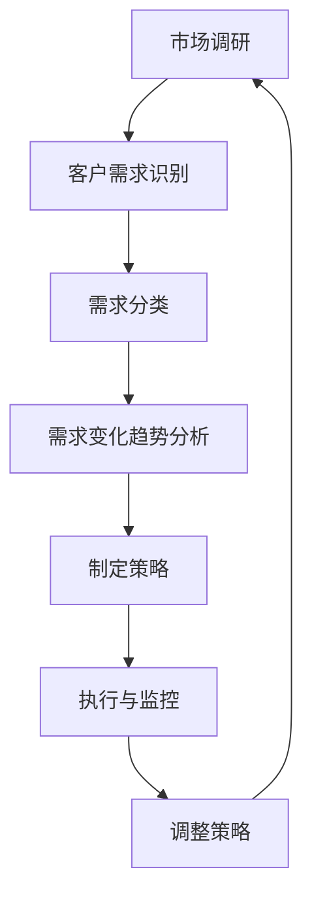

                 

### 第一部分：市场开拓基础理论

市场开拓是企业增长的关键环节，尤其是对于B2B（企业对企业）业务来说，这一环节尤为重要。本部分将探讨市场开拓的基础理论，包括市场开拓的概念、重要性以及B2B市场的特点。

#### 1.1.1 市场开拓的概念

市场开拓通常是指企业通过营销和销售策略，开拓新市场，增加客户基础，提升市场份额的过程。市场开拓不仅仅是销售团队的任务，它还涉及到产品开发、营销策略、客户服务等多个部门的协同工作。

#### 1.1.2 市场开拓的重要性

市场开拓对于企业的生存和发展至关重要。首先，它可以帮助企业扩大客户基础，提高销售额。其次，通过市场开拓，企业可以了解不同市场的需求和趋势，从而调整产品策略和营销策略，提高市场竞争力。最后，市场开拓有助于企业实现多元化发展，降低业务风险。

#### 1.1.3 B2B市场特点分析

B2B市场与B2C（企业对消费者）市场有显著的不同，其特点包括：

1. **决策周期长**：B2B交易的决策过程通常较长，涉及多个利益相关者，需要较长时间的沟通和谈判。
2. **个性化需求**：B2B客户通常有特定的需求，这些需求可能涉及产品的定制、服务支持等多个方面。
3. **关系导向**：B2B交易往往建立在长期合作关系的基础上，客户关系对于交易的顺利进行至关重要。
4. **采购量较大**：B2B交易的采购量通常较大，这意味着单个客户的价值较高。

### 1.2 B2B市场调研

有效的市场调研是市场开拓的基础。通过市场调研，企业可以了解目标市场的需求、竞争对手的情况以及市场机会。

#### 1.2.1 调研目的与方法

市场调研的目的是了解目标市场的需求、竞争环境、潜在机会和威胁。常见的方法包括：

- **问卷调查**：通过设计问卷收集大量数据。
- **深度访谈**：与目标客户进行一对一访谈，深入了解他们的需求和看法。
- **行业报告**：分析行业研究报告，获取行业趋势和竞争动态。
- **市场数据分析**：通过分析市场数据，如销售额、市场份额等，了解市场现状。

#### 1.2.2 调研内容与工具

市场调研的内容应包括：

- **目标市场定义**：明确目标市场，包括地理位置、行业、公司规模等。
- **市场需求分析**：了解客户的需求、痛点以及偏好。
- **竞争对手分析**：分析竞争对手的产品、价格、市场份额等。
- **市场机会与威胁**：识别市场机会和潜在威胁。

常用的调研工具包括：

- **调查问卷**：如Google Forms、SurveyMonkey等。
- **访谈工具**：如Zoom、Skype等。
- **数据分析工具**：如Excel、Tableau等。

#### 1.2.3 调研结果分析

市场调研结果的分析是市场开拓的关键环节。通过分析调研结果，企业可以：

- **识别市场机会**：发现未满足的客户需求或潜在的市场空缺。
- **制定策略**：基于调研结果制定合适的市场策略，如产品定位、定价策略、营销渠道等。
- **优化决策**：利用调研数据支持业务决策，提高决策的科学性和准确性。

### 1.3 B2B客户需求分析

B2B客户需求分析是市场开拓的核心任务。通过分析客户需求，企业可以更好地满足客户需求，提高客户满意度和忠诚度。

#### 1.3.1 客户需求识别

客户需求识别是指通过市场调研、客户访谈、反馈等方式，收集客户的需求信息。客户需求可能包括：

- **功能需求**：客户需要的产品功能。
- **性能需求**：客户对产品性能的要求。
- **服务需求**：客户对售后服务、技术支持的要求。
- **价格需求**：客户对产品价格的接受程度。

#### 1.3.2 客户需求分类

客户需求分类有助于企业更好地理解和满足客户需求。常见的分类方法包括：

- **按需求性质分类**：如功能需求、性能需求、服务需求等。
- **按需求强度分类**：如核心需求、次要需求等。
- **按需求来源分类**：如原始需求、衍生需求等。

#### 1.3.3 客户需求变化趋势

客户需求是不断变化的，企业需要持续关注客户需求的变化趋势。以下是一些影响客户需求变化的主要因素：

- **技术进步**：新技术的出现可能会改变客户的需求。
- **市场趋势**：市场的变化，如行业发展趋势、消费者行为变化等，也会影响客户需求。
- **竞争环境**：竞争对手的产品创新和市场策略可能会影响客户需求。

通过分析客户需求的变化趋势，企业可以及时调整产品策略和营销策略，以更好地满足客户需求。

---

**Mermaid流程图：市场开拓流程图**



---

**数学模型：客户需求模型**

$$
\text{Customer Demand} = \sum_{i=1}^{n} \text{Customer Demand}_i \times \text{Customer Demand Importance}_i
$$

**举例说明**：

假设某客户有三个主要需求：需求1（价值1000元，重要性0.4），需求2（价值2000元，重要性0.5），需求3（价值3000元，重要性0.1）。则客户的总需求为：

$$
\text{Customer Demand} = 1000元 \times 0.4 + 2000元 \times 0.5 + 3000元 \times 0.1 = 2300元
$$

---

**核心概念与联系**

市场开拓涉及多个核心概念，包括市场调研、客户需求分析、需求分类和需求变化趋势。这些概念相互关联，共同构成了市场开拓的理论基础。

- **市场调研**：提供市场信息和客户需求数据。
- **客户需求分析**：识别和理解客户的实际需求。
- **需求分类**：将需求分为不同的类别，以便更好地管理和满足。
- **需求变化趋势**：分析客户需求的变化，为策略调整提供依据。

通过这些概念和联系，企业可以更全面地理解市场，制定有效的市场开拓策略。

---

**核心算法原理讲解**

**伪代码：市场调研数据分析**

```python
def market_research_analysis(data):
    # 数据预处理
    preprocess_data(data)
    
    # 识别市场需求
    demands = identify_demands(data)
    
    # 分类需求
    demand_categories = categorize_demands(demands)
    
    # 分析需求变化趋势
    demand_trends = analyze_demand_trends(demand_categories)
    
    return demand_trends
```

---

**核心算法原理讲解**

**数学模型：市场调研数据模型**

$$
\text{Market Insight} = f(\text{Survey Results}, \text{Interview Data}, \text{Industry Reports})
$$

**举例说明**：

假设某企业进行了市场调研，收集了以下数据：问卷调查结果（50%的客户对产品功能表示满意），客户访谈数据（30%的客户对售后服务有较高需求），行业报告（预计未来三年，该行业将增长20%）。则企业的市场洞察为：

$$
\text{Market Insight} = (0.5 \times \text{功能需求满意率}) + (0.3 \times \text{售后服务需求率}) + (0.2 \times \text{行业增长率})
$$

---

**项目实战：市场调研数据分析实战**

**开发环境搭建**

- **软件**：Python 3.8及以上版本
- **库**：pandas、numpy、matplotlib

**源代码实现**

```python
import pandas as pd
import numpy as np
import matplotlib.pyplot as plt

# 加载数据
data = pd.read_csv('market_research_data.csv')

# 数据预处理
data['satisfaction'] = data['satisfaction'].map({1: '非常满意', 2: '满意', 3: '一般', 4: '不满意'})
data['service'] = data['service'].map({1: '非常高', 2: '较高', 3: '一般', 4: '较低'})

# 识别市场需求
demands = data.groupby('satisfaction').size()

# 分类需求
demand_categories = data.groupby(['satisfaction', 'service']).size().unstack(fill_value=0)

# 分析需求变化趋势
demand_trends = demand_categories.sum(axis=0)

# 可视化需求变化趋势
demand_trends.plot(kind='bar')
plt.xlabel('满意度')
plt.ylabel('需求频率')
plt.title('市场调研需求变化趋势')
plt.show()
```

**代码解读与分析**

- **数据预处理**：将数据转换为易于分析的形式。
- **识别市场需求**：使用groupby函数分析满意度。
- **分类需求**：使用unstack函数将数据转换为矩阵形式。
- **分析需求变化趋势**：使用sum函数计算各列总和。
- **可视化**：使用matplotlib库绘制柱状图，展示需求变化趋势。

通过以上实战，企业可以更清晰地了解市场需求，为后续的市场策略制定提供数据支持。

---

**项目实战：B2B客户需求分析实战**

**开发环境搭建**

- **软件**：RStudio
- **库**：dplyr、ggplot2

**源代码实现**

```r
library(dplyr)
library(ggplot2)

# 加载数据
data <- read.csv('b2b_customer_demand.csv')

# 数据预处理
data <- data %>% 
  mutate(
    industry = factor(industry),
    demand_type = factor(demand_type)
  )

# 识别客户需求
customer_demands <- data %>% 
  group_by(industry) %>% 
  summarise(
    total_demand = sum(demand_value)
  )

# 分类客户需求
demand_categories <- data %>% 
  group_by(industry, demand_type) %>% 
  summarise(
    demand_value = sum(demand_value)
  )

# 分析需求变化趋势
demand_trends <- demand_categories %>% 
  group_by(industry) %>% 
  summarise(
    total_demand = sum(demand_value)
  )

# 可视化需求变化趋势
ggplot(demand_trends, aes(x = industry, y = total_demand)) + 
  geom_bar(stat = "identity") + 
  labs(x = "行业", y = "需求总价值", title = "B2B客户需求变化趋势")
```

**代码解读与分析**

- **数据预处理**：将数据转换为适合分析的形式。
- **识别客户需求**：使用group_by和summarise函数分析行业和总需求。
- **分类客户需求**：使用group_by和summarise函数分析行业和需求类型。
- **分析需求变化趋势**：使用group_by和summarise函数分析行业和总需求。
- **可视化**：使用ggplot2库绘制柱状图，展示需求变化趋势。

通过以上实战，企业可以更深入地了解B2B客户的需求，为产品开发和市场策略提供数据支持。

---

**总结**

第一部分详细探讨了市场开拓的基础理论，包括市场开拓的概念、重要性、B2B市场的特点，以及市场调研和客户需求分析的方法。通过Mermaid流程图、数学模型、伪代码、项目实战等多种形式，我们全面阐述了市场开拓的核心概念和联系，为后续的市场开拓策略提供了理论基础。

---

**作者信息**

作者：AI天才研究院/AI Genius Institute & 禅与计算机程序设计艺术 /Zen And The Art of Computer Programming

---

**核心概念与联系**

市场开拓涉及多个核心概念，包括市场调研、客户需求分析、需求分类和需求变化趋势。这些概念相互关联，共同构成了市场开拓的理论基础。

- **市场调研**：提供市场信息和客户需求数据。
- **客户需求分析**：识别和理解客户的实际需求。
- **需求分类**：将需求分为不同的类别，以便更好地管理和满足。
- **需求变化趋势**：分析客户需求的变化，为策略调整提供依据

