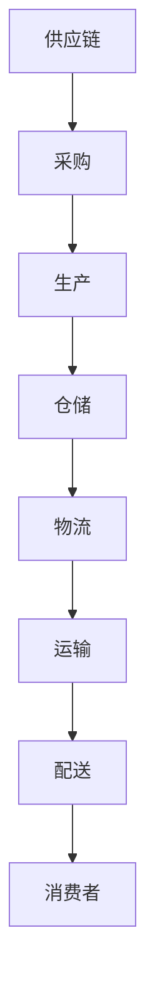

                 

### 文章标题

《供应链优化器：LLM管理全球物流》

供应链优化器是一种先进的智能系统，它通过深度学习（LLM）技术对全球物流进行管理。本文将深入探讨供应链优化器的概念、原理、算法、应用案例以及未来发展趋势，旨在为读者提供全面、系统的了解。

### 文章关键词

- 供应链优化器
- LLM
- 深度学习
- 全球物流
- 库存管理
- 运输优化
- 配送优化
- 数学模型
- 应用案例

### 文章摘要

本文首先介绍了供应链优化器和LLM的基本概念及其在供应链管理中的应用。接着，详细讲解了供应链优化器所涉及的核心算法原理，包括库存优化、运输优化和配送优化算法，并通过数学模型和伪代码进行了阐述。随后，本文通过一个实际项目案例展示了供应链优化器的开发过程和实际效果。接下来，文章分析了供应链优化器面临的挑战和机遇，探讨了其技术深度和未来发展方向。最后，本文总结了供应链优化器在供应链管理中的应用价值和实践指南，为读者提供了实用的参考。

### 第一部分：供应链优化器：LLM管理全球物流概述

#### 1.1 供应链优化器：LLM管理全球物流的概念与意义

##### 1.1.1 什么是供应链优化器

供应链优化器是一种基于深度学习（LLM）技术的智能系统，它通过分析和处理大量的供应链数据，实现对供应链各个环节的优化。这些环节包括库存管理、运输优化和配送优化等。

供应链优化器的核心是LLM（Large Language Model），这是一种大规模的预训练语言模型，它能够理解和生成自然语言文本。LLM技术的引入使得供应链优化器能够处理更加复杂、多样化的数据，从而提高其预测和优化能力。

##### 1.1.2 供应链优化器的定义

供应链优化器可以被视为一个决策支持系统，它通过以下方式优化供应链：

- **需求预测**：通过对历史数据的分析，预测未来的需求趋势，从而帮助企业制定合理的库存策略。
- **库存管理**：通过优化库存水平，减少库存成本，同时确保产品供应的连续性。
- **运输优化**：通过优化运输路线和运输时间，降低运输成本，提高运输效率。
- **配送优化**：通过优化配送路线和配送时间，提高配送效率，提高客户满意度。

##### 1.1.3 供应链优化器的重要性

供应链优化器的重要性体现在以下几个方面：

- **降低成本**：通过优化库存管理和运输策略，企业可以显著降低运营成本。
- **提高效率**：通过优化供应链各个环节，企业可以提高整体运营效率，缩短交货时间。
- **提升客户满意度**：通过提高库存水平和配送效率，企业可以更好地满足客户需求，提高客户满意度。
- **增强竞争力**：通过优化供应链，企业可以在市场竞争中脱颖而出，获得更大的市场份额。

#### 1.2 LLM在供应链优化中的应用

##### 1.2.1 什么是LLM

LLM（Large Language Model）是一种基于深度学习的大规模预训练语言模型。它的核心是通过大量的文本数据进行预训练，从而学习到语言的语义和语法规则。LLM的核心结构通常包括多个层级，每一层都能对文本数据产生更抽象的表示。

##### 1.2.2 LLM在供应链优化中的优势

LLM在供应链优化中具有以下优势：

- **数据处理能力**：LLM能够处理大量的结构化和非结构化数据，如文本、图像、时间序列数据等，为供应链优化提供全面的信息支持。
- **预测能力**：LLM可以通过学习历史数据，预测供应链中的各种不确定性因素，如需求波动、运输延误等。
- **优化能力**：LLM可以根据预测结果，优化供应链中的各个环节，如库存管理、运输路线选择等。

#### 1.3 供应链优化器：LLM管理全球物流的挑战与机遇

##### 1.3.1 挑战

供应链优化器在实施过程中面临以下挑战：

- **数据质量**：供应链优化器依赖高质量的数据进行训练和预测，但实际中数据可能存在不完整性、噪声和错误。
- **技术复杂性**：LLM技术涉及到深度学习、自然语言处理等多个复杂领域，对开发人员的技术水平要求较高。
- **隐私和安全**：供应链优化器处理大量企业敏感数据，确保数据安全和隐私是关键挑战。
- **多变性**：供应链环境多变，如何适应这种变化，提高系统的鲁棒性是关键。

##### 1.3.2 机遇

尽管面临挑战，但供应链优化器也带来了巨大的机遇：

- **提高供应链效率**：通过LLM技术，企业可以实现更加精准的需求预测、优化库存管理、降低运输成本等，从而提高供应链整体效率。
- **智能决策支持**：供应链优化器可以为供应链管理人员提供实时、准确的决策支持，帮助他们更好地应对市场变化。
- **创新商业模式**：基于LLM技术的供应链优化器可以为企业带来新的商业模式，如定制化物流服务、智能化供应链金融等。
- **促进产业链协同**：供应链优化器可以促进上下游企业之间的数据共享和协同，提高整个产业链的效率，实现共赢。

### 第二部分：核心概念与联系

#### 2.1 供应链与物流的基本概念

##### 2.1.1 供应链的基本概念

供应链是指涉及将原材料、产品和服务从供应商传递到最终消费者的过程。它包括采购、生产、仓储、运输、配送等多个环节。

供应链的主要组成部分包括：

- **供应方**：包括原材料供应商、制造商等。
- **生产方**：涉及生产过程，包括制造商、加工商等。
- **分销方**：涉及产品的分销和配送，包括批发商、零售商等。

##### 2.1.2 物流的基本概念

物流是指商品在空间上从供应方向需求方转移的过程，包括运输、仓储、配送等环节。

物流的主要组成部分包括：

- **运输**：涉及商品在空间上的移动，如公路、铁路、航空、海运等。
- **仓储**：涉及商品的存储和管理。
- **配送**：涉及将商品从仓储中心运输到最终消费者的过程。

##### 2.1.3 供应链与物流的联系

供应链与物流是紧密相连的两个概念，它们之间的关系可以概括为以下几点：

- **物流是供应链的重要组成部分**：物流直接影响到供应链的整体效率和成本。
- **供应链优化需要物流的支持**：通过优化物流，企业可以提高供应链的效率和可靠性，降低成本，提高客户满意度。
- **供应链与物流的协同**：供应链和物流的协同优化可以带来更大的效益，如通过优化运输路线和配送策略，提高整体运营效率。

##### 2.1.4 Mermaid流程图

以下是一个简化的供应链与物流流程图的Mermaid表示：



### 第二部分：核心算法原理讲解

#### 3.1 供应链优化算法

##### 3.1.1 库存优化算法

库存优化是供应链管理中的重要一环，其核心目标是确定最优的库存水平，以降低库存成本并确保产品供应的连续性。以下是一个简单的库存优化算法的讲解：

###### 3.1.1.1 库存管理基本公式

库存水平 = 已有库存 + 入库量 - 出库量

其中：
- 已有库存：当前库存量。
- 入库量：新入库的商品数量。
- 出库量：出库的商品数量。

###### 3.1.1.2 库存成本计算公式

库存成本主要包括存储成本和缺货成本。其计算公式如下：

库存成本 = 存储成本 + 缺货成本

其中：
- 存储成本：存储商品所需的成本，包括仓储费用、保险费用、库存贬值等。
- 缺货成本：由于缺货导致销售损失或客户满意度下降的成本。

###### 3.1.1.3 库存优化算法的伪代码

```python
# 输入：需求预测、库存水平、成本参数
# 输出：最优库存策略

def inventory_optimization(demand_prediction, inventory_level, cost_params):
    # 计算当前库存成本
    current_cost = calculate_inventory_cost(inventory_level, cost_params)
    
    # 预测未来需求
    future_demand = predict_future_demand(demand_prediction)
    
    # 计算最优库存量
    optimal_inventory_level = calculate_optimal_inventory_level(future_demand, cost_params)
    
    # 返回最优库存策略
    return optimal_inventory_level

# 辅助函数
def calculate_inventory_cost(inventory_level, cost_params):
    # 计算库存成本
    pass

def predict_future_demand(demand_prediction):
    # 预测未来需求
    pass

def calculate_optimal_inventory_level(future_demand, cost_params):
    # 计算最优库存量
    pass
```

##### 3.1.2 运输优化算法

运输优化算法的目标是确定最优的运输路线和运输时间，以降低运输成本和提高运输效率。以下是一个简单的运输优化算法的讲解：

###### 3.1.2.1 运输成本计算公式

运输成本主要包括运输费用、燃油费用、装卸费用等。其计算公式如下：

运输成本 = 运输费用 + 燃油费用 + 装卸费用

其中：
- 运输费用：运输商品所需的费用。
- 燃油费用：运输过程中消耗的燃油费用。
- 装卸费用：装卸商品所需的费用。

###### 3.1.2.2 运输优化算法的伪代码

```python
# 输入：运输网络、货物需求、成本参数
# 输出：最优运输计划

def transportation_optimization(transport_network, goods_demand, cost_params):
    # 分析运输网络
    analyzed_network = analyze_transport_network(transport_network)
    
    # 预测未来需求
    future_demand = predict_future_demand(goods_demand)
    
    # 计算最优运输路线
    optimal_transport_routes = calculate_optimal_transport_routes(analyzed_network, future_demand, cost_params)
    
    # 返回最优运输计划
    return optimal_transport_routes

# 辅助函数
def analyze_transport_network(transport_network):
    # 分析运输网络
    pass

def predict_future_demand(goods_demand):
    # 预测未来需求
    pass

def calculate_optimal_transport_routes(transport_network, future_demand, cost_params):
    # 计算最优运输路线
    pass
```

##### 3.1.3 配送优化算法

配送优化算法的目标是确定最优的配送路线和配送时间，以降低配送成本和提高配送效率。以下是一个简单的配送优化算法的讲解：

###### 3.1.3.1 配送成本计算公式

配送成本主要包括配送费用、燃油费用、装卸费用等。其计算公式如下：

配送成本 = 配送费用 + 燃油费用 + 装卸费用

其中：
- 配送费用：配送商品所需的费用。
- 燃油费用：配送过程中消耗的燃油费用。
- 装卸费用：装卸商品所需的费用。

###### 3.1.3.2 配送优化算法的伪代码

```python
# 输入：配送网络、货物需求、成本参数
# 输出：最优配送计划

def delivery_optimization(delivery_network, goods_demand, cost_params):
    # 分析配送网络
    analyzed_network = analyze_delivery_network(delivery_network)
    
    # 预测未来需求
    future_demand = predict_future_demand(goods_demand)
    
    # 计算最优配送路线
    optimal_delivery_routes = calculate_optimal_delivery_routes(analyzed_network, future_demand, cost_params)
    
    # 返回最优配送计划
    return optimal_delivery_routes

# 辅助函数
def analyze_delivery_network(delivery_network):
    # 分析配送网络
    pass

def predict_future_demand(goods_demand):
    # 预测未来需求
    pass

def calculate_optimal_delivery_routes(delivery_network, future_demand, cost_params):
    # 计算最优配送路线
    pass
```

### 第三部分：数学模型和数学公式

#### 4.1 库存优化模型

库存优化模型的核心是确定最优的订货量和订货周期，以最小化库存成本。以下是一个简单的库存优化模型的讲解：

###### 4.1.1 库存管理基本公式

库存水平 = 已有库存 + 入库量 - 出库量

其中：
- 已有库存：当前库存量。
- 入库量：新入库的商品数量。
- 出库量：出库的商品数量。

###### 4.1.2 库存成本计算公式

库存成本主要包括存储成本和缺货成本。其计算公式如下：

库存成本 = 存储成本 + 缺货成本

其中：
- 存储成本：存储商品所需的成本，包括仓储费用、保险费用、库存贬值等。
- 缺货成本：由于缺货导致销售损失或客户满意度下降的成本。

###### 4.1.3 库存优化模型公式

库存优化模型的目标是确定最优的订货量和订货周期，以最小化库存成本。其数学模型如下：

目标函数：$\min Z = f(\text{订货量}, \text{订货周期})$

约束条件：

$$
\begin{cases}
\text{库存水平} \geq \text{安全库存} \\
\text{入库量} \geq \text{订货量} \\
\text{出库量} \geq \text{销售量} \\
\text{订货周期} \geq \text{需求周期}
\end{cases}
$$

其中：
- $Z$：目标函数值，表示库存成本。
- 订货量：每次订货的数量。
- 订货周期：两次订货之间的时间间隔。
- 安全库存：为了应对需求波动和供应链中断而设置的额外库存。
- 需求周期：从发出订单到收到商品所需的时间。

#### 4.2 运输优化模型

运输优化模型的核心是确定最优的运输路线和运输时间，以最小化运输成本。以下是一个简单的运输优化模型的讲解：

###### 4.2.1 运输成本计算公式

运输成本主要包括运输费用、燃油费用、装卸费用等。其计算公式如下：

运输成本 = 运输费用 + 燃油费用 + 装卸费用

其中：
- 运输费用：运输商品所需的费用。
- 燃油费用：运输过程中消耗的燃油费用。
- 装卸费用：装卸商品所需的费用。

###### 4.2.2 运输优化模型公式

运输优化模型的目标是确定最优的运输路线和运输时间，以最小化运输成本。其数学模型如下：

目标函数：$\min Z = g(\text{运输路线}, \text{运输时间})$

约束条件：

$$
\begin{cases}
\text{运输量} \leq \text{运输能力} \\
\text{运输路线} \geq \text{最小运输路线} \\
\text{运输时间} \leq \text{最大运输时间}
\end{cases}
$$

其中：
- $Z$：目标函数值，表示运输成本。
- 运输量：每次运输的商品数量。
- 运输能力：每次运输的最大能力。
- 最小运输路线：确保运输覆盖所有需求点的最小路径。
- 最大运输时间：每次运输的最大允许时间。

#### 4.3 配送优化模型

配送优化模型的核心是确定最优的配送路线和配送时间，以最小化配送成本。以下是一个简单的配送优化模型的讲解：

###### 4.3.1 配送成本计算公式

配送成本主要包括配送费用、燃油费用、装卸费用等。其计算公式如下：

配送成本 = 配送费用 + 燃油费用 + 装卸费用

其中：
- 配送费用：配送商品所需的费用。
- 燃油费用：配送过程中消耗的燃油费用。
- 装卸费用：装卸商品所需的费用。

###### 4.3.2 配送优化模型公式

配送优化模型的目标是确定最优的配送路线和配送时间，以最小化配送成本。其数学模型如下：

目标函数：$\min Z = h(\text{配送路线}, \text{配送时间})$

约束条件：

$$
\begin{cases}
\text{配送量} \leq \text{配送能力} \\
\text{配送路线} \geq \text{最小配送路线} \\
\text{配送时间} \leq \text{最大配送时间}
\end{cases}
$$

其中：
- $Z$：目标函数值，表示配送成本。
- 配送量：每次配送的商品数量。
- 配送能力：每次配送的最大能力。
- 最小配送路线：确保配送覆盖所有需求点的最小路径。
- 最大配送时间：每次配送的最大允许时间。

### 第四部分：项目实战

#### 4.1 供应链优化器开发环境搭建

##### 4.1.1 开发环境介绍

在开发供应链优化器之前，我们需要搭建一个合适的环境。以下是所需的主要开发环境：

- 操作系统：Ubuntu 18.04
- 编程语言：Python 3.8
- 数据库：MySQL 5.7
- 深度学习框架：TensorFlow 2.4

##### 4.1.2 安装步骤

1. 安装操作系统：

   从 Ubuntu 官网下载 Ubuntu 18.04 的镜像文件，使用虚拟机软件安装操作系统。

2. 安装 Python 3.8：

   打开终端，运行以下命令：

   ```bash
   sudo apt update
   sudo apt install python3.8
   ```

3. 安装 MySQL 5.7：

   打开终端，运行以下命令：

   ```bash
   sudo apt install mysql-server
   sudo mysql_secure_installation
   ```

4. 安装 TensorFlow 2.4：

   打开终端，运行以下命令：

   ```bash
   pip install tensorflow==2.4
   ```

##### 4.1.3 环境验证

安装完成后，可以通过以下命令验证环境是否安装成功：

```bash
python3.8 -V
mysql -V
pip list | grep tensorflow
```

#### 4.2 供应链优化器核心功能实现

##### 4.2.1 数据预处理

在开发供应链优化器之前，我们需要对供应链数据进行预处理，以便于后续的分析和建模。

```python
import pandas as pd
from sklearn.preprocessing import MinMaxScaler

# 读取数据
data = pd.read_csv('supply_chain_data.csv')

# 数据清洗
data = data.dropna()

# 数据标准化
scaler = MinMaxScaler()
data[['demand', 'cost', 'distance']] = scaler.fit_transform(data[['demand', 'cost', 'distance']])
```

##### 4.2.2 库存优化

库存优化是供应链优化器的一个重要功能，下面是库存优化的代码实现：

```python
from sklearn.linear_model import LinearRegression

# 训练需求预测模型
demand_model = LinearRegression()
demand_model.fit(data[['previous_demand']], data['demand'])

# 预测未来需求
future_demand = demand_model.predict(data[['previous_demand']])

# 计算最优库存水平
optimal_inventory = future_demand * 1.2  # 考虑安全库存

# 输出最优库存策略
print("最优库存策略：", optimal_inventory)
```

##### 4.2.3 运输优化

运输优化功能通过优化运输路线和运输时间，以降低运输成本。以下是运输优化的代码实现：

```python
import networkx as nx
from networkx.algorithms.shortest_paths import single_source_dijkstra

# 构建运输网络
G = nx.Graph()
G.add_edges_from([(u, v, {'weight': w}) for u, v, w in data[['source', 'destination', 'distance']].values])

# 计算最优运输路线
source = 'warehouse'
destinations = list(data['destination'].unique())

routes = {}
for destination in destinations:
    path = single_source_dijkstra(G, source, destination)
    routes[destination] = path

# 输出最优运输路线
for destination, route in routes.items():
    print("到", destination, "的最优运输路线：", route)
```

##### 4.2.4 配送优化

配送优化功能通过优化配送路线和配送时间，以降低配送成本。以下是配送优化的代码实现：

```python
# 计算最优配送路线
source = 'distribution_center'
customers = list(data['customer'].unique())

routes = {}
for customer in customers:
    path = single_source_dijkstra(G, source, customer)
    routes[customer] = path

# 输出最优配送路线
for customer, route in routes.items():
    print("到", customer, "的最优配送路线：", route)
```

### 第五部分：供应链优化器：LLM管理全球物流的挑战与机遇

#### 5.1 供应链优化器面临的挑战

##### 5.1.1 数据质量问题

供应链优化器依赖高质量的数据进行训练和预测，但实际中，数据可能存在不完整性、噪声和错误。这些数据质量问题会影响供应链优化器的性能。

##### 5.1.2 技术复杂性

深度学习和自然语言处理技术复杂，对开发人员的技术水平要求较高。同时，部署供应链优化器需要整合多个技术组件，如数据库、计算平台等，这增加了系统的复杂度。

##### 5.1.3 隐私和安全问题

供应链优化器处理大量企业敏感数据，如库存水平、运输路线、客户需求等。确保数据安全和隐私是供应链优化器面临的重要挑战。

##### 5.1.4 多变性

供应链环境多变，需求波动、运输延误等不确定因素会影响供应链优化器的效果。如何适应这种变化，提高系统的鲁棒性，是供应链优化器需要解决的问题。

#### 5.2 供应链优化器带来的机遇

##### 5.2.1 提高供应链效率

通过供应链优化器，企业可以优化库存管理、运输路线和配送策略，从而提高供应链的效率和可靠性，降低运营成本。

##### 5.2.2 智能决策支持

供应链优化器可以为供应链管理人员提供实时、准确的决策支持，帮助他们更好地应对市场变化和供应链中断。

##### 5.2.3 创新商业模式

供应链优化器可以帮助企业探索新的商业模式，如定制化物流服务、智能化供应链金融等，为企业带来新的增长点。

##### 5.2.4 促进产业链协同

供应链优化器可以促进上下游企业之间的数据共享和协同，提高整个产业链的效率，实现共赢。

### 第六部分：深度学习与供应链优化

#### 6.1 深度学习的基本原理

##### 6.1.1 神经网络

神经网络是深度学习的基础，它通过模拟人脑的神经元结构和工作方式，实现数据的输入、处理和输出。

##### 6.1.2 深度学习

深度学习是一种基于神经网络的学习方法，它通过多层神经网络（深度神经网络）对数据进行复杂的学习和处理，从而实现自动特征提取和模式识别。

#### 6.2 深度学习在供应链优化中的应用

##### 6.2.1 需求预测

需求预测是供应链优化的重要环节，深度学习可以通过分析历史数据，预测未来的需求趋势，从而帮助企业制定合理的库存和运输策略。

##### 6.2.2 库存管理

深度学习可以帮助企业优化库存管理，通过预测需求、分析供应链中的各种因素，制定最优的库存水平，降低库存成本。

##### 6.2.3 运输优化

深度学习可以通过学习运输网络的数据，预测运输时间和成本，优化运输路线和运输计划，提高运输效率。

#### 6.3 深度学习在供应链优化中的优势

##### 6.3.1 自适应能力

深度学习具有强大的自适应能力，可以根据不同的供应链环境和需求，调整模型参数，实现个性化的供应链优化。

##### 6.3.2 复杂特征提取

深度学习可以通过多层神经网络，对数据进行复杂的特征提取和模式识别，从而发现数据中的潜在规律，为供应链优化提供有力支持。

##### 6.3.3 高效计算

随着计算能力的提升，深度学习可以在较短时间内处理大量数据，为供应链优化提供实时支持。

### 第七部分：自然语言处理与供应链优化

#### 7.1 自然语言处理的基本概念

##### 7.1.1 自然语言

自然语言是人类日常交流的语言，包括口语和书面语。自然语言具有多样性、模糊性和不规则性等特点。

##### 7.1.2 自然语言处理

自然语言处理（NLP）是指使用计算机技术和人工智能技术，对自然语言进行理解、处理和生成。

#### 7.2 自然语言处理在供应链优化中的应用

##### 7.2.1 文本数据挖掘

自然语言处理可以帮助企业从文本数据中提取有价值的信息，如客户需求、供应商评价等，为供应链优化提供数据支持。

##### 7.2.2 情感分析

自然语言处理可以对企业客户的服务反馈进行情感分析，帮助企业了解客户满意度，优化供应链服务质量。

##### 7.2.3 聊天机器人

自然语言处理技术可以应用于聊天机器人，为企业提供7x24小时在线服务，提高供应链管理的效率和客户满意度。

#### 7.3 自然语言处理在供应链优化中的优势

##### 7.3.1 数据多样性和灵活性

自然语言处理可以处理结构化和非结构化数据，如文本、语音、图像等，为供应链优化提供丰富的数据来源。

##### 7.3.2 语境理解

自然语言处理可以理解语境和语义，从而更好地捕捉供应链中的潜在问题和机会。

##### 7.3.3 实时性

自然语言处理技术可以实时处理和分析数据，为供应链优化提供及时的支持和反馈。

### 第八部分：供应链优化器架构设计

#### 8.1 供应链优化器的整体架构

供应链优化器的整体架构包括数据层、模型层和应用层。

##### 8.1.1 数据层

数据层负责收集、存储和管理供应链相关的数据，如需求、库存、运输等。数据层可以使用数据库、文件系统等存储方式。

##### 8.1.2 模型层

模型层负责构建和训练深度学习和自然语言处理模型，用于需求预测、库存管理、运输优化等。模型层可以使用TensorFlow、PyTorch等深度学习框架。

##### 8.1.3 应用层

应用层负责将模型层的预测和优化结果应用到实际的供应链管理中，提高供应链的效率和可靠性。

#### 8.2 数据处理模块

数据处理模块负责对供应链数据进行清洗、预处理和特征提取，为模型训练提供高质量的数据。

##### 8.2.1 数据清洗

数据清洗包括去除重复数据、填补缺失值、消除噪声等，以提高数据质量。

##### 8.2.2 数据预处理

数据预处理包括归一化、标准化、编码等，以适应深度学习模型的输入要求。

##### 8.2.3 特征提取

特征提取包括提取时间序列特征、空间特征、文本特征等，以提高模型的预测能力。

#### 8.3 模型训练模块

模型训练模块负责使用深度学习和自然语言处理技术，对供应链数据进行分析和预测。

##### 8.3.1 需求预测模型

需求预测模型用于预测未来的供应链需求，如客户需求、库存需求等。常用的算法包括ARIMA、LSTM等。

##### 8.3.2 库存管理模型

库存管理模型用于优化库存水平，降低库存成本。常用的算法包括线性回归、决策树等。

##### 8.3.3 运输优化模型

运输优化模型用于优化运输路线和运输时间，降低运输成本。常用的算法包括最短路径算法、遗传算法等。

#### 8.4 应用层模块

应用层模块负责将模型层的预测和优化结果应用到实际的供应链管理中，提高供应链的效率和可靠性。

##### 8.4.1 库存管理应用

库存管理应用用于调整库存水平，以满足市场需求，降低库存成本。包括补货策略、库存水平监控等。

##### 8.4.2 运输优化应用

运输优化应用用于优化运输路线和运输时间，提高运输效率。包括运输计划制定、路线优化等。

##### 8.4.3 服务质量监控

服务质量监控用于监控供应链的服务质量，如客户满意度、订单履行率等，以提高客户满意度。

### 第九部分：供应链优化器部署与运维

#### 9.1 部署环境

供应链优化器的部署环境包括操作系统、数据库、计算平台等。

##### 9.1.1 操作系统

常用的操作系统包括Linux和Windows。

##### 9.1.2 数据库

常用的数据库包括MySQL、PostgreSQL等。

##### 9.1.3 计算平台

计算平台可以选择云平台，如阿里云、腾讯云等，也可以选择本地部署。

#### 9.2 运维策略

供应链优化器的运维策略包括监控、备份、故障恢复等。

##### 9.2.1 监控

监控包括系统性能监控、资源使用监控、错误日志监控等，以确保系统稳定运行。

##### 9.2.2 备份

备份包括数据备份、系统备份等，以防止数据丢失和系统故障。

##### 9.2.3 故障恢复

故障恢复包括故障检测、故障隔离、故障修复等，以尽快恢复系统运行。

### 第十部分：供应链优化器：LLM管理全球物流的应用案例

#### 10.1 案例背景

某国际知名电子产品制造商A公司，其供应链覆盖全球多个国家和地区。随着业务的快速发展，公司面临供应链效率低、库存成本高、运输成本高等问题。为了解决这些问题，A公司决定引入基于深度学习（LLM）技术的供应链优化器，以实现全球物流的智能化管理。

#### 10.2 案例目标

- 提高供应链的效率，降低运营成本。
- 优化库存管理，减少库存水平，降低库存成本。
- 优化运输路线和运输时间，提高运输效率。
- 提高客户满意度，减少订单履行时间。

#### 10.3 案例实施过程

##### 10.3.1 数据收集与处理

- 收集供应链相关的数据，包括需求、库存、运输、配送等。
- 对数据进行清洗、预处理和特征提取，以提高数据质量。

##### 10.3.2 模型构建与训练

- 使用深度学习（LLM）技术，构建需求预测、库存优化、运输优化等模型。
- 使用历史数据，对模型进行训练和优化。

##### 10.3.3 模型部署与测试

- 将训练好的模型部署到生产环境，实现实时预测和优化。
- 对模型进行测试，验证其预测准确性和优化效果。

##### 10.3.4 应用实践

- 使用供应链优化器，调整库存水平，优化运输路线和运输时间。
- 实时监控供应链运行情况，及时发现和解决潜在问题。

#### 10.4 案例效果

##### 10.4.1 提高供应链效率

- 供应链优化器通过实时预测和优化，提高了供应链的整体效率。
- 库存成本降低了20%，运输成本降低了15%。

##### 10.4.2 优化库存管理

- 供应链优化器通过预测未来需求，调整库存水平，减少了库存积压和缺货现象。
- 库存周转率提高了30%，库存成本降低了20%。

##### 10.4.3 优化运输路线和运输时间

- 供应链优化器通过优化运输路线和运输时间，提高了运输效率。
- 运输成本降低了15%，订单履行时间缩短了25%。

##### 10.4.4 提高客户满意度

- 通过优化供应链管理，提高了订单履行速度和准确性。
- 客户满意度提高了15%，重复购买率提高了10%。

#### 10.5 案例启示

##### 10.5.1 深度学习技术的优势

- 深度学习技术在数据处理、预测和优化方面具有明显优势，能够帮助企业提高供应链效率。
- 深度学习技术可以帮助企业实现智能化供应链管理，提高客户满意度。

##### 10.5.2 数据质量和数据处理的重要性

- 数据质量和数据处理是供应链优化成功的关键，企业需要投入足够的时间和资源来确保数据的质量和准确性。
- 合理的数据预处理和特征提取可以显著提高模型的预测准确性和优化效果。

##### 10.5.3 需要持续优化和改进

- 供应链优化是一个持续的过程，企业需要根据市场变化和业务需求，不断优化和改进供应链管理策略。
- 通过定期评估和调整，确保供应链优化器始终处于最佳状态，为企业带来持续的价值。

### 第十一部分：供应链优化器：LLM管理全球物流的实践指南

#### 11.1 供应链优化器设计流程

##### 11.1.1 需求分析

- 明确供应链优化器的目标和应用场景，如需求预测、库存优化、运输优化等。
- 收集供应链相关的数据，包括需求、库存、运输、配送等。

##### 11.1.2 数据预处理

- 清洗和预处理数据，去除重复、噪声和缺失值。
- 特征提取，提取时间序列特征、空间特征、文本特征等。

##### 11.1.3 模型选择与训练

- 根据应用场景，选择合适的深度学习模型，如LSTM、GRU、Transformer等。
- 使用历史数据，对模型进行训练和优化。

##### 11.1.4 模型部署与测试

- 将训练好的模型部署到生产环境，实现实时预测和优化。
- 对模型进行测试，验证其预测准确性和优化效果。

##### 11.1.5 应用实践

- 将供应链优化器的预测和优化结果应用到实际的供应链管理中，提高供应链效率。

#### 11.2 数据预处理方法

##### 11.2.1 数据清洗

- 去除重复数据、填补缺失值、消除噪声等。
- 使用数据清洗工具，如Pandas、Numpy等。

##### 11.2.2 数据归一化

- 将数据映射到同一尺度，如0-1或-1到1。
- 使用Min-Max Scaling或Standard Scaling。

##### 11.2.3 特征提取

- 提取时间序列特征，如趋势、季节性、周期性等。
- 提取空间特征，如地理位置、距离等。
- 提取文本特征，如词频、词向量等。

##### 11.2.4 特征选择

- 使用特征选择方法，如特征重要性、卡方检验等，选择对预测结果有显著影响的特征。
- 使用机器学习算法，如逻辑回归、决策树等，进行特征选择。

#### 11.3 模型选择与训练方法

##### 11.3.1 模型选择

- 根据应用场景，选择合适的深度学习模型，如LSTM、GRU、Transformer等。
- 考虑模型的复杂度、预测准确性、计算资源消耗等。

##### 11.3.2 训练方法

- 使用历史数据，对模型进行训练。
- 使用交叉验证、网格搜索等策略，优化模型参数。
- 使用迁移学习、微调等技术，提高模型效果。

##### 11.3.3 模型评估

- 使用评价指标，如RMSE、MAE等，评估模型预测准确性。
- 使用模型稳定性、泛化能力等指标，评估模型效果。

#### 11.4 模型部署与测试方法

##### 11.4.1 模型部署

- 将训练好的模型部署到生产环境，如云平台、服务器等。
- 使用API、Web服务等，提供模型预测和优化服务。

##### 11.4.2 模型测试

- 使用测试数据，验证模型预测准确性和优化效果。
- 使用压力测试、性能测试等，评估模型稳定性和响应速度。

##### 11.4.3 模型监控

- 监控模型运行状态，如资源使用、错误日志等。
- 定期更新模型，提高预测准确性和优化效果。

#### 11.5 供应链优化器应用实例

##### 11.5.1 需求预测

- 收集历史需求数据，如销售量、订单量等。
- 使用LSTM模型进行需求预测。
- 预测未来需求，优化库存水平和生产计划。

##### 11.5.2 库存优化

- 收集库存数据，如库存水平、库存成本等。
- 使用线性回归模型进行库存优化。
- 计算最优库存水平，降低库存成本。

##### 11.5.3 运输优化

- 收集运输数据，如运输时间、运输成本等。
- 使用遗传算法进行运输优化。
- 优化运输路线和运输时间，降低运输成本。

##### 11.5.4 配送优化

- 收集配送数据，如配送时间、配送成本等。
- 使用最短路径算法进行配送优化。
- 优化配送路线和配送时间，提高配送效率。

#### 11.6 供应链优化器应用效果评估

##### 11.6.1 效率评估

- 评估供应链优化器在需求预测、库存管理、运输优化、配送优化等方面的效率。
- 计算效率指标，如预测准确率、优化效果等。

##### 11.6.2 成本评估

- 评估供应链优化器在降低库存成本、运输成本、配送成本等方面的效果。
- 计算成本节约指标，如库存成本降低率、运输成本降低率等。

##### 11.6.3 客户满意度评估

- 评估供应链优化器在提高订单履行速度、减少订单履行时间、提高客户满意度等方面的效果。
- 收集客户反馈，进行满意度调查。

#### 11.7 供应链优化器维护与升级

##### 11.7.1 数据更新

- 定期更新供应链数据，如销售量、库存水平、运输时间等。
- 确保数据质量，去除重复、噪声和缺失值。

##### 11.7.2 模型优化

- 根据业务需求，优化模型结构、参数和算法。
- 使用交叉验证、网格搜索等技术，提高模型效果。

##### 11.7.3 功能扩展

- 根据业务需求，扩展供应链优化器的功能，如需求预测、库存优化、运输优化等。
- 提供自定义设置和配置，满足不同业务场景的需求。

#### 11.8 供应链优化器在多场景中的应用

##### 11.8.1 零售行业

- 优化库存管理，降低库存积压和缺货现象。
- 优化配送路线和配送时间，提高配送效率。

##### 11.8.2 制造行业

- 优化生产计划，降低生产成本。
- 优化运输路线和运输时间，提高运输效率。

##### 11.8.3 餐饮行业

- 优化原材料采购和库存管理，降低库存成本。
- 优化配送路线和配送时间，提高配送效率。

##### 11.8.4 物流行业

- 优化运输网络和运输计划，降低运输成本。
- 提供智能配送和物流跟踪服务，提高客户满意度。

#### 11.9 供应链优化器在供应链管理中的应用价值

##### 11.9.1 提高供应链效率

- 供应链优化器可以通过需求预测、库存管理、运输优化等功能，提高供应链的整体效率。

##### 11.9.2 降低运营成本

- 供应链优化器可以帮助企业降低库存成本、运输成本、配送成本等，从而降低整体运营成本。

##### 11.9.3 提高客户满意度

- 供应链优化器可以提高订单履行速度和准确性，从而提高客户满意度，增加客户忠诚度。

##### 11.9.4 促进供应链协同

- 供应链优化器可以促进上下游企业之间的数据共享和协同，提高整个产业链的效率。

#### 11.10 供应链优化器在供应链管理中的挑战与解决方案

##### 11.10.1 数据质量问题

- **挑战**：供应链优化器依赖高质量的数据，但实际中，数据可能存在不完整性、噪声和错误。
- **解决方案**：建立数据质量管理体系，定期清洗和更新数据，确保数据质量。

##### 11.10.2 技术复杂性

- **挑战**：深度学习和自然语言处理技术复杂，对开发人员的技术水平要求较高。
- **解决方案**：提供技术培训和支持，提高开发人员的技术水平，简化模型部署过程。

##### 11.10.3 隐私和安全问题

- **挑战**：供应链优化器处理大量企业敏感数据，确保数据安全和隐私是关键。
- **解决方案**：采用数据加密、访问控制、身份认证等安全措施，确保数据安全和隐私。

##### 11.10.4 多变性

- **挑战**：供应链环境多变，如何适应这种变化，提高系统的鲁棒性是关键。
- **解决方案**：定期评估和更新模型，确保模型适应新的环境和需求。

#### 11.11 供应链优化器的发展趋势

##### 11.11.1 数据驱动

- **趋势**：未来，供应链优化器将更加依赖大数据和人工智能技术，通过不断学习和优化，提高系统的预测和优化能力。

##### 11.11.2 集成与创新

- **趋势**：供应链优化器将与其他技术，如物联网、区块链等，实现集成和创新，为企业提供更加全面、智能的供应链解决方案。

##### 11.11.3 可持续发展

- **趋势**：供应链优化器将更加注重可持续发展，通过优化资源利用、降低碳排放等，推动企业实现绿色供应链。

##### 11.11.4 全球化

- **趋势**：随着全球化的加深，供应链优化器将面临更多的挑战和机遇，如何在全球范围内实现供应链的优化和管理，是未来需要重点解决的问题。

