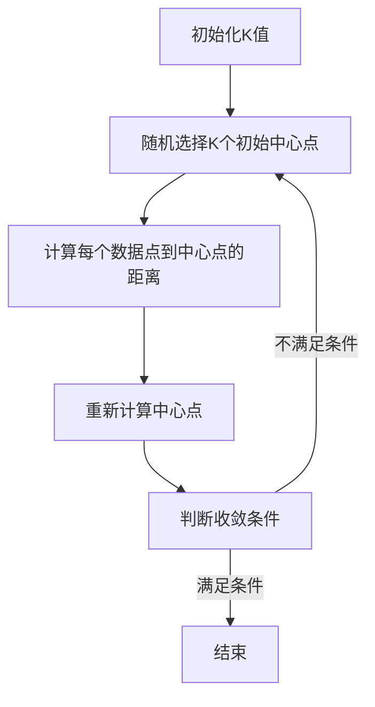
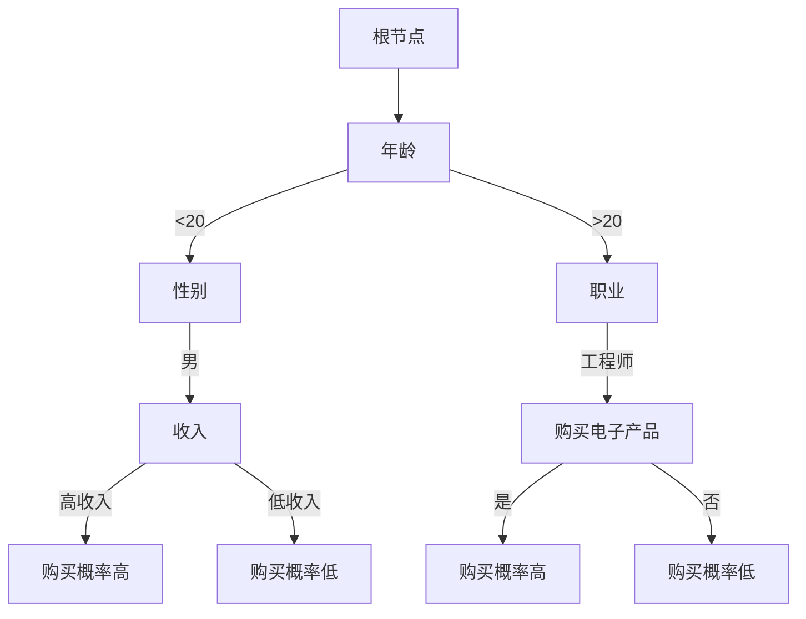

                 

### 引言

在商业世界中，信息差（Information Gap）是指不同个体或群体之间在信息获取和利用方面的差异。这种差异导致了市场机会的分布不均，进而影响了企业的营销策略和市场竞争力。随着大数据技术的迅猛发展，企业能够收集、处理和分析海量数据，从而揭示隐藏在数据背后的信息差。这为市场营销带来了革命性的变革，使得企业能够更加精准地制定营销策略，提高营销效果。

大数据营销的本质在于利用数据驱动决策，通过分析用户行为、市场趋势和竞争对手数据，为企业提供准确的营销方向。在这一过程中，信息差的缩小甚至消除成为可能，企业可以通过数据分析了解用户需求，制定个性化的营销方案，从而提高用户满意度和忠诚度。

本文将围绕大数据如何重塑营销策略这一主题展开，首先介绍信息差的定义和分类，然后分析大数据营销策略的演变，接着详细探讨大数据在营销中的应用，最后展望大数据营销的未来趋势和挑战。

通过本文的阅读，读者将了解：

- 信息差的定义、分类及其在社会经济中的作用。
- 营销策略从传统到数字，再到大数据营销的演变过程。
- 大数据在市场细分、目标客户精准定位、产品个性化定制和营销策略制定中的应用。
- 营销效果的评估与优化方法。
- 大数据营销的实际案例研究。
- 大数据营销的未来趋势与面临的挑战。

### 第一部分：信息差的本质与营销策略

#### 1.1 信息差的定义与分类

信息差是指不同个体或群体在信息获取和利用上的差异。这种差异可以体现在多个层面上，包括但不限于以下几种：

1. **横向信息差**：这是指在同一时间内，不同个体或群体之间在信息掌握上的差异。例如，某行业的资深专家相比于新手，对行业趋势和市场动态有更深入的了解，从而具备信息优势。

2. **纵向信息差**：这指的是同一个体在不同时间或不同阶段的信息差异。例如，一个消费者在购买前后的信息获取量会有很大差别，购买前可能对产品了解不多，而购买后可能会因为使用体验而积累更多相关信息。

3. **结构性信息差**：这是由于社会结构、制度安排等造成的群体间信息差异。例如，由于教育水平和经济条件的不平等，不同社会阶层的人获取信息和利用信息的能力存在差异。

**信息差的定义**可以用以下公式来表示：

$$
I_d = \frac{I_g - I_l}{2}
$$

其中，$I_g$ 是高信息群体所掌握的信息量，$I_l$ 是低信息群体所掌握的信息量。这个公式反映了信息差的量化特征，即信息差的幅度等于高信息群体和低信息群体信息量的差异的一半。

**信息差的分类**主要根据信息差异的影响范围和维度进行划分：

- **横向信息差**：这类信息差主要体现在不同个体或群体之间，例如，企业在市场竞争中通过掌握竞争对手的信息来制定战略，消费者通过对比不同品牌和产品来做出购买决策。

- **纵向信息差**：这种信息差体现在同一个体在不同时间或阶段的信息获取能力上。例如，一名学生在学习过程中，随着时间的推移，对知识点的理解逐渐深入，信息量也在增加。

- **结构性信息差**：这种信息差是由社会结构和制度安排造成的，例如，企业通过政策优势获取资源，消费者通过经济能力购买高端产品。

**信息差在社会经济中的作用**：

1. **市场机会分配**：信息差使得市场机会向具备信息优势的群体倾斜，从而影响资源的分配和市场的竞争格局。

2. **商业策略制定**：企业通过挖掘信息差，可以更精准地定位市场，制定有效的营销策略，提高市场占有率。

3. **社会不公平现象**：信息差的存在可能加剧社会不公平现象，导致资源分配不均，影响社会稳定。

#### 1.2 营销策略的演变

营销策略的演变经历了从传统营销到数字营销，再到大数据营销的三个阶段，每个阶段都有其特定的背景和发展特点。

**传统营销策略**：

传统营销策略主要依赖于广告和推销，其核心思想是通过大规模的宣传和推广来提高品牌知名度。广告通常通过电视、广播、报纸等传统媒体进行传播，而推销则依靠销售人员的直接沟通和说服。

- **广告宣传**：广告宣传是传统营销的核心手段，通过媒体传播信息，提高品牌知名度。广告内容往往注重形象的塑造和品牌价值的传递。
  
- **推销**：推销则是通过直接与潜在客户沟通，推销产品或服务。销售人员通过与客户的互动，深入了解客户需求，提供定制化的解决方案。

传统营销策略的优点在于其覆盖面广，可以快速提高品牌知名度。然而，其缺点也非常明显：营销成本高，针对性不强，难以精确测量营销效果。

**数字营销的兴起**：

随着互联网的普及，数字营销逐渐取代传统营销成为主流。数字营销利用互联网和社交媒体平台，通过数据和技术手段进行营销。

- **搜索引擎营销（SEM）**：通过搜索引擎优化（SEO）和付费点击广告（PPC）来吸引潜在客户。SEO优化网站内容，提高在搜索引擎中的排名；PPC则通过付费广告形式，提高网站的曝光率。

- **社交媒体营销**：利用社交媒体平台（如Facebook、Twitter、Instagram等）进行营销。通过发布内容、互动评论、投放广告等方式，与用户建立联系，提高品牌知名度。

数字营销的优点在于其精准度高、互动性强，可以根据用户行为数据实时调整营销策略。然而，数字营销也面临一些挑战，如信息过载、用户隐私保护等问题。

**大数据营销的发展**：

大数据营销是数字营销的进一步发展，利用大数据技术进行市场调研、消费者行为分析、精准定位和个性化推荐等。

- **市场调研**：通过大数据技术，对市场趋势、竞争对手、消费者需求等进行深入分析，为企业提供决策依据。

- **消费者行为分析**：通过收集和分析消费者在互联网上的行为数据，了解其购买习惯、偏好等，从而制定更精准的营销策略。

- **精准定位**：利用大数据分析，将目标客户进行精细化分类，实现对目标客户的精准定位。

- **个性化推荐**：基于用户行为数据和偏好，为用户推荐个性化的产品或服务。

大数据营销的优点在于其数据驱动、精准高效，能够显著提高营销效果。然而，大数据营销也面临数据安全、隐私保护等挑战。

#### 1.3 大数据在营销中的应用

大数据在营销中的应用主要体现在以下几个方面：

**大数据的采集与处理**：

- **数据来源**：大数据的来源非常广泛，包括社交媒体、电子商务平台、搜索引擎、物联网设备等。这些数据类型多样，包括结构化数据（如用户行为数据、交易数据等）和非结构化数据（如图像、音频、视频等）。

- **数据处理**：数据处理是大数据应用的基础。数据处理过程包括数据清洗、数据整合、数据存储和数据挖掘等。数据清洗是为了去除重复数据、缺失值和错误数据，提高数据质量；数据整合是将不同来源、不同格式的数据整合在一起，形成统一的数据视图；数据存储是为了存储海量数据并提供快速访问；数据挖掘则是从海量数据中提取有价值的信息和知识。

**大数据在市场调研中的应用**：

- **市场趋势分析**：通过对历史数据的分析，预测市场趋势和消费行为的变化。这有助于企业提前布局，抓住市场机会。

- **竞争对手分析**：通过对竞争对手的营销策略、产品特点、用户评价等进行深入分析，了解竞争对手的优势和劣势，从而制定相应的应对策略。

- **消费者需求分析**：通过对消费者行为数据的分析，了解消费者的需求和偏好，从而提供更符合消费者期望的产品和服务。

**大数据在消费者行为分析中的应用**：

- **客户细分**：通过对消费者行为数据的分析，将客户分为不同的群体，如年龄、性别、收入、地域等。这有助于企业制定差异化的营销策略，提高营销效果。

- **客户流失预警**：通过对客户行为数据的监控和分析，预测客户流失的风险，采取相应的挽回措施。

- **用户画像**：通过对消费者行为数据的分析，创建用户的详细画像，包括其兴趣爱好、消费习惯、生活方式等。这有助于企业了解用户需求，提供个性化的产品和服务。

#### 总结

信息差的定义、分类及其在社会经济中的作用，以及营销策略的演变，都为我们理解大数据营销提供了基础。接下来，我们将深入探讨大数据在营销策略制定中的应用，包括市场细分、目标客户精准定位、产品个性化定制和营销策略制定等方面。

### 第一部分：信息差的本质与营销策略

#### 1.1 信息差的定义与分类

信息差是指不同个体或群体在信息获取和利用上的差异。这种差异可以体现在多个层面上，包括但不限于以下几种：

- **横向信息差**：这是指在同一时间内，不同个体或群体之间在信息掌握上的差异。例如，某行业的资深专家相比于新手，对行业趋势和市场动态有更深入的了解，从而具备信息优势。

- **纵向信息差**：这指的是同一个体在不同时间或不同阶段的信息差异。例如，一个消费者在购买前后的信息获取量会有很大差别，购买前可能对产品了解不多，而购买后可能会因为使用体验而积累更多相关信息。

- **结构性信息差**：这是由于社会结构、制度安排等造成的群体间信息差异。例如，由于教育水平和经济条件的不平等，不同社会阶层的人获取信息和利用信息的能力存在差异。

**信息差的定义**可以用以下公式来表示：

$$
I_d = \frac{I_g - I_l}{2}
$$

其中，$I_g$ 是高信息群体所掌握的信息量，$I_l$ 是低信息群体所掌握的信息量。这个公式反映了信息差的量化特征，即信息差的幅度等于高信息群体和低信息群体信息量的差异的一半。

**信息差的分类**主要根据信息差异的影响范围和维度进行划分：

- **横向信息差**：这类信息差主要体现在不同个体或群体之间，例如，企业在市场竞争中通过掌握竞争对手的信息来制定战略，消费者通过对比不同品牌和产品来做出购买决策。

- **纵向信息差**：这种信息差体现在同一个体在不同时间或阶段的信息获取能力上。例如，一名学生在学习过程中，随着时间的推移，对知识点的理解逐渐深入，信息量也在增加。

- **结构性信息差**：这种信息差是由社会结构和制度安排造成的，例如，企业通过政策优势获取资源，消费者通过经济能力购买高端产品。

**信息差在社会经济中的作用**：

1. **市场机会分配**：信息差使得市场机会向具备信息优势的群体倾斜，从而影响资源的分配和市场的竞争格局。

2. **商业策略制定**：企业通过挖掘信息差，可以更精准地定位市场，制定有效的营销策略，提高市场占有率。

3. **社会不公平现象**：信息差的存在可能加剧社会不公平现象，导致资源分配不均，影响社会稳定。

#### 1.2 营销策略的演变

营销策略的演变经历了从传统营销到数字营销，再到大数据营销的三个阶段，每个阶段都有其特定的背景和发展特点。

**传统营销策略**：

传统营销策略主要依赖于广告和推销，其核心思想是通过大规模的宣传和推广来提高品牌知名度。广告通常通过电视、广播、报纸等传统媒体进行传播，而推销则依靠销售人员的直接沟通和说服。

- **广告宣传**：广告宣传是传统营销的核心手段，通过媒体传播信息，提高品牌知名度。广告内容往往注重形象的塑造和品牌价值的传递。

- **推销**：推销则是通过直接与潜在客户沟通，推销产品或服务。销售人员通过与客户的互动，深入了解客户需求，提供定制化的解决方案。

传统营销策略的优点在于其覆盖面广，可以快速提高品牌知名度。然而，其缺点也非常明显：营销成本高，针对性不强，难以精确测量营销效果。

**数字营销的兴起**：

随着互联网的普及，数字营销逐渐取代传统营销成为主流。数字营销利用互联网和社交媒体平台，通过数据和技术手段进行营销。

- **搜索引擎营销（SEM）**：通过搜索引擎优化（SEO）和付费点击广告（PPC）来吸引潜在客户。SEO优化网站内容，提高在搜索引擎中的排名；PPC则通过付费广告形式，提高网站的曝光率。

- **社交媒体营销**：利用社交媒体平台（如Facebook、Twitter、Instagram等）进行营销。通过发布内容、互动评论、投放广告等方式，与用户建立联系，提高品牌知名度。

数字营销的优点在于其精准度高、互动性强，可以根据用户行为数据实时调整营销策略。然而，数字营销也面临一些挑战，如信息过载、用户隐私保护等问题。

**大数据营销的发展**：

大数据营销是数字营销的进一步发展，利用大数据技术进行市场调研、消费者行为分析、精准定位和个性化推荐等。

- **市场调研**：通过大数据技术，对市场趋势、竞争对手、消费者需求等进行深入分析，为企业提供决策依据。

- **消费者行为分析**：通过收集和分析消费者在互联网上的行为数据，了解其购买习惯、偏好等，从而制定更精准的营销策略。

- **精准定位**：利用大数据分析，将目标客户进行精细化分类，实现对目标客户的精准定位。

- **个性化推荐**：基于用户行为数据和偏好，为用户推荐个性化的产品或服务。

大数据营销的优点在于其数据驱动、精准高效，能够显著提高营销效果。然而，大数据营销也面临数据安全、隐私保护等挑战。

#### 1.3 大数据在营销中的应用

大数据在营销中的应用主要体现在以下几个方面：

**大数据的采集与处理**：

- **数据来源**：大数据的来源非常广泛，包括社交媒体、电子商务平台、搜索引擎、物联网设备等。这些数据类型多样，包括结构化数据（如用户行为数据、交易数据等）和非结构化数据（如图像、音频、视频等）。

- **数据处理**：数据处理是大数据应用的基础。数据处理过程包括数据清洗、数据整合、数据存储和数据挖掘等。数据清洗是为了去除重复数据、缺失值和错误数据，提高数据质量；数据整合是将不同来源、不同格式的数据整合在一起，形成统一的数据视图；数据存储是为了存储海量数据并提供快速访问；数据挖掘则是从海量数据中提取有价值的信息和知识。

**大数据在市场调研中的应用**：

- **市场趋势分析**：通过对历史数据的分析，预测市场趋势和消费行为的变化。这有助于企业提前布局，抓住市场机会。

- **竞争对手分析**：通过对竞争对手的营销策略、产品特点、用户评价等进行深入分析，了解竞争对手的优势和劣势，从而制定相应的应对策略。

- **消费者需求分析**：通过对消费者行为数据的分析，了解消费者的需求和偏好，从而提供更符合消费者期望的产品和服务。

**大数据在消费者行为分析中的应用**：

- **客户细分**：通过对消费者行为数据的分析，将客户分为不同的群体，如年龄、性别、收入、地域等。这有助于企业制定差异化的营销策略，提高营销效果。

- **客户流失预警**：通过对客户行为数据的监控和分析，预测客户流失的风险，采取相应的挽回措施。

- **用户画像**：通过对消费者行为数据的分析，创建用户的详细画像，包括其兴趣爱好、消费习惯、生活方式等。这有助于企业了解用户需求，提供个性化的产品和服务。

#### 总结

信息差的定义、分类及其在社会经济中的作用，以及营销策略的演变，都为我们理解大数据营销提供了基础。接下来，我们将深入探讨大数据在营销策略制定中的应用，包括市场细分、目标客户精准定位、产品个性化定制和营销策略制定等方面。

### 第二部分：大数据营销策略的实施

#### 2.1 数据驱动的市场细分

市场细分是市场营销中的一项关键策略，其目的是将市场划分为若干具有相似特征的子市场，以便企业能够更有效地针对每个子市场制定相应的营销策略。在大数据时代，数据驱动的市场细分方法极大地提升了市场细分的准确性和有效性。

**市场细分的意义**：

1. **提高营销效率**：通过市场细分，企业可以针对不同子市场的特点制定个性化的营销策略，从而提高营销活动的精准度和效率。
2. **降低营销成本**：市场细分有助于企业集中资源，针对特定子市场进行营销，避免资源的浪费，从而降低营销成本。
3. **增强竞争力**：通过对市场的深入了解和精准定位，企业可以更好地满足客户需求，提高客户满意度和忠诚度，从而在竞争激烈的市场中脱颖而出。

**市场细分的步骤**：

1. **确定细分标准**：细分标准通常包括地理、人口统计、心理和行为等因素。例如，地理因素可以是不同地区的消费水平；人口统计因素可以是年龄、性别、收入等；心理因素可以是价值观、生活方式等；行为因素可以是购买习惯、品牌偏好等。

2. **收集数据**：通过市场调研、用户行为分析、社交媒体监测等方式，收集与细分标准相关的数据。这些数据可以是结构化的（如数据库中的用户信息）或非结构化的（如社交媒体评论、图片等）。

3. **分析数据**：利用数据分析工具（如SPSS、R等）对收集到的数据进行处理和分析，识别出具有相似特征的客户群体。

4. **制定细分策略**：根据分析结果，制定针对不同子市场的营销策略。例如，对于高消费能力群体，可以制定高端品牌的推广策略；对于年轻消费者，可以制定更具互动性和娱乐性的营销活动。

**基于大数据的市场细分方法**：

1. **聚类分析**：聚类分析是一种无监督学习技术，它通过将数据点划分为不同的聚类，实现市场细分。常用的聚类算法包括K-means、层次聚类等。例如，K-means算法可以根据客户购买行为数据，将客户分为不同的购买群体。

2. **决策树**：决策树是一种有监督学习技术，它通过一系列的决策规则，将数据划分为不同的类别。在市场细分中，决策树可以用来识别不同客户群体的特征和需求，从而制定个性化的营销策略。

**聚类分析算法示例**：

假设我们使用K-means算法进行市场细分，具体步骤如下：

**决策树算法示例**：

通过以上算法示例，我们可以看出，大数据技术的应用大大提高了市场细分的精确性和效率，为企业制定个性化营销策略提供了有力支持。

#### 2.2 目标客户的精准定位

精准定位是大数据营销的核心策略之一，其目标是找到并吸引最有可能对产品或服务产生兴趣和需求的客户群体。通过精准定位，企业可以优化资源投入，提高营销ROI（投资回报率）。

**目标客户的概念**：

目标客户是指企业致力于满足其需求和欲望的具有相同特征的客户群体。这些客户群体通常具有较高的购买力和消费意愿，是企业实现业绩增长的关键。

**精准定位的方法**：

1. **数据挖掘与分析**：通过数据挖掘技术，分析客户的购买行为、兴趣爱好、消费习惯等数据，识别出具有相似特征的客户群体。常用的数据挖掘算法包括关联规则挖掘、聚类分析、分类算法等。

2. **用户画像**：通过收集和分析用户在互联网上的行为数据，创建用户的详细画像，包括其性别、年龄、地域、兴趣爱好、消费习惯等。用户画像有助于企业了解客户需求，提供个性化的产品和服务。

3. **市场细分**：市场细分是将市场划分为具有相似特征的子市场，通过数据驱动的市场细分方法，企业可以找到最具有潜力的目标客户群体。

4. **行为分析**：通过对客户在网站、APP等平台上的行为进行实时分析，了解其浏览、点击、购买等行为，从而预测其需求和偏好。

**大数据在客户定位中的应用**：

1. **社交媒体分析**：通过分析用户在社交媒体上的行为，如点赞、评论、分享等，了解用户对品牌的关注度和参与度，从而识别目标客户。

2. **搜索引擎分析**：通过分析用户在搜索引擎上的搜索关键词，了解用户的兴趣点和需求，从而精准定位目标客户。

3. **电商数据分析**：通过分析用户的购买行为、浏览历史等数据，了解用户的消费习惯和偏好，从而实现精准定位。

**实际案例分析**：

- **亚马逊**：亚马逊通过用户行为分析和用户画像技术，将客户分为不同的群体，如高端消费者、家庭主妇、年轻学生等，并针对每个群体制定个性化的推荐策略，从而提高销售额。

- **Netflix**：Netflix通过分析用户的观看记录、搜索历史等数据，创建用户的详细画像，并基于用户画像提供个性化的推荐，从而提高用户满意度和观看时长。

通过精准定位，企业可以更有效地吸引和保留目标客户，提高营销ROI。

#### 2.3 产品与服务的个性化定制

个性化定制是一种基于大数据分析的营销策略，通过为每位客户提供量身定制的产品和服务，提高用户满意度和忠诚度。个性化定制不仅满足了用户个性化的需求，还提升了企业的市场竞争力和品牌价值。

**个性化定制的概念**：

个性化定制是指根据用户的需求、偏好和特征，提供定制化的产品和服务。个性化定制可以是完全定制，如根据用户需求设计独特的服装；也可以是半定制，如根据用户历史数据推荐合适的产品。

**个性化定制的方法**：

1. **用户行为分析**：通过对用户在互联网上的行为数据进行分析，了解其浏览、搜索、购买等行为，从而预测用户需求和偏好。

2. **用户画像**：通过收集和分析用户的个人信息、行为数据等，创建用户的详细画像，包括其性别、年龄、地域、兴趣爱好、消费习惯等。

3. **个性化推荐**：基于用户画像和用户行为数据，利用推荐算法（如协同过滤、基于内容的推荐等）为用户推荐个性化的产品和服务。

4. **定制化营销**：通过定制化的营销内容和渠道，如邮件、短信、社交媒体等，向用户推送个性化的营销信息。

**大数据在产品个性化中的应用**：

1. **电商行业**：电商平台通过分析用户的购买历史、浏览记录等数据，为用户推荐相似的产品，从而提高销售额。

2. **服务业**：酒店、航空公司等通过用户偏好数据，提供个性化的预订建议，如推荐用户喜欢的房型、航班等。

3. **制造业**：制造业企业通过用户需求分析和产品定制，提供个性化生产，如定制化汽车、家电等。

**实际案例分析**：

- **ZARA**：ZARA通过收集用户在门店的购物行为数据，了解用户喜好，从而快速调整产品设计，实现个性化生产。

- **乐高**：乐高通过用户反馈和购买数据，为用户提供个性化的积木套装，满足用户的个性化需求。

通过个性化定制，企业可以提供更加个性化的产品和服务，提升用户体验和满意度，从而在竞争激烈的市场中脱颖而出。

#### 2.4 基于大数据的营销策略制定

营销策略制定是企业营销活动的关键环节，直接影响企业的市场表现和竞争力。大数据技术的应用使得营销策略的制定更加科学、精准和高效。以下从营销策略制定的过程、大数据在策略制定中的作用以及实际案例研究三个方面进行详细阐述。

**营销策略制定的过程**：

1. **确定营销目标**：明确企业希望通过营销活动实现的目标，如增加品牌知名度、提升销售额、提高客户满意度等。营销目标应具体、可衡量、可实现、相关性强和时间限定。

2. **分析市场数据**：通过大数据分析工具，对市场趋势、竞争对手、消费者需求等进行深入分析，了解市场环境和竞争态势，为营销策略的制定提供数据支持。

3. **制定营销策略**：根据市场数据分析结果，结合企业资源和能力，制定具体的营销策略。营销策略应包括目标市场定位、产品定位、渠道选择、推广活动等。

4. **营销策略实施**：将制定好的营销策略付诸实践，通过执行具体的营销活动，如广告投放、促销活动、公关活动等，实现营销目标。

5. **营销效果评估**：通过数据分析和反馈机制，评估营销活动的效果，了解营销目标实现情况。根据评估结果，及时调整营销策略，优化营销效果。

**大数据在营销策略制定中的作用**：

1. **数据支持**：大数据分析为企业提供了丰富的市场数据和消费者行为数据，使得企业能够更加全面和深入地了解市场环境和消费者需求，为营销策略的制定提供数据支持。

2. **精准定位**：通过大数据分析，企业可以实现对目标客户的精准定位，制定个性化的营销策略，提高营销活动的精准度和有效性。

3. **优化决策**：大数据分析可以帮助企业发现市场机会和潜在风险，优化营销决策，提高营销策略的科学性和合理性。

4. **持续改进**：通过大数据分析和效果评估，企业可以不断调整和优化营销策略，实现营销目标的持续改进。

**基于大数据的营销策略案例分析**：

1. **案例一：某电商企业利用大数据制定个性化营销策略**

   - **背景**：某电商企业在市场竞争激烈的情况下，希望通过大数据分析提升销售额。

   - **实施过程**：
     - 数据收集：收集用户在网站上的浏览、搜索、购买等行为数据。
     - 数据分析：利用大数据分析工具，分析用户行为和偏好，创建用户画像。
     - 策略制定：根据用户画像，制定个性化的营销策略，如个性化推荐、定向广告等。
     - 策略实施：通过电商平台、社交媒体等渠道实施个性化营销活动。
     - 效果评估：通过数据分析和用户反馈，评估个性化营销策略的效果。

   - **结果**：个性化营销策略实施后，用户满意度显著提高，销售额同比增长20%。

2. **案例二：某化妆品公司利用大数据分析优化产品定位**

   - **背景**：某化妆品公司希望通过大数据分析优化产品定位，提升市场竞争力。

   - **实施过程**：
     - 数据收集：收集消费者在电商平台、社交媒体上的评价、评论等数据。
     - 数据分析：利用大数据分析工具，分析消费者对产品功能、价格、包装等方面的偏好。
     - 策略制定：根据消费者偏好，调整产品定位，如优化产品功能、提升品牌形象等。
     - 策略实施：通过电商平台、实体店等渠道推广优化后的产品。
     - 效果评估：通过销售数据、用户反馈等指标，评估产品定位优化的效果。

   - **结果**：产品定位优化后，产品销量和品牌知名度显著提升，用户满意度提高。

通过以上案例可以看出，大数据在营销策略制定中的应用不仅提高了营销活动的精准度和有效性，还为企业带来了显著的业务增长和用户满意度提升。

#### 2.5 营销效果的评估与优化

评估营销效果是确保营销策略成功实施的关键环节，通过数据分析和反馈机制，企业可以及时了解营销活动的效果，发现潜在问题，并优化营销策略。以下是营销效果评估的方法、策略和实际案例研究。

**营销效果评估的方法**：

1. **销售额增长**：通过比较营销活动前后的销售额变化，评估营销活动的直接效果。销售额增长可以反映营销活动对购买行为的推动作用。

2. **客户满意度**：通过调查问卷、用户反馈等方式，了解客户对产品或服务的满意度。客户满意度是衡量营销效果的重要指标，它直接影响企业的品牌形象和客户忠诚度。

3. **品牌知名度**：通过广告投放、社交媒体活动等方式，提高品牌知名度。品牌知名度的提升可以反映营销活动在公众中的影响力。

**营销效果优化的策略**：

1. **数据驱动**：利用大数据分析，深入了解客户行为和市场趋势，为营销策略提供数据支持。数据驱动可以确保营销策略的科学性和针对性。

2. **A/B测试**：通过对比不同营销策略的效果，选择最优方案。A/B测试可以帮助企业找到最有效的营销组合，提高营销ROI。

3. **跨部门协作**：整合企业内部资源，共同推进营销活动。跨部门协作可以确保营销策略的顺利实施和效果最大化。

**实际案例研究**：

1. **案例一：某电商企业通过数据驱动优化营销策略**

   - **背景**：某电商企业在营销效果不佳的情况下，希望通过数据驱动优化营销策略。

   - **实施过程**：
     - 数据收集：收集用户在网站上的浏览、搜索、购买等行为数据。
     - 数据分析：利用大数据分析工具，分析用户行为和偏好，识别潜在问题。
     - 策略制定：根据数据分析结果，制定针对性的优化策略，如优化网站用户体验、调整广告投放策略等。
     - 策略实施：通过电商平台、社交媒体等渠道实施优化策略。
     - 效果评估：通过销售数据、用户反馈等指标，评估优化策略的效果。

   - **结果**：优化策略实施后，用户满意度显著提高，销售额同比增长15%。

2. **案例二：某化妆品公司通过A/B测试优化广告投放策略**

   - **背景**：某化妆品公司希望通过优化广告投放策略，提高广告效果和投资回报率。

   - **实施过程**：
     - 数据收集：收集用户在社交媒体上的浏览、点击、转化等数据。
     - 数据分析：利用A/B测试工具，对比不同广告创意的效果。
     - 策略制定：根据A/B测试结果，选择最优广告创意和投放渠道。
     - 策略实施：通过社交媒体、电商平台等渠道实施优化后的广告投放策略。
     - 效果评估：通过广告投放数据、销售数据等指标，评估优化策略的效果。

   - **结果**：优化广告投放策略后，广告点击率提高20%，销售额同比增长10%。

通过以上案例可以看出，营销效果的评估与优化不仅能够帮助企业及时发现和解决问题，还能提高营销活动的效率，实现营销目标的持续提升。

### 第三部分：大数据营销策略的优化与实施

#### 3.1 营销效果的评估与优化

评估营销效果是确保营销策略成功实施的关键环节，通过数据分析和反馈机制，企业可以及时了解营销活动的效果，发现潜在问题，并优化营销策略。以下是营销效果评估的方法、策略和实际案例研究。

**营销效果评估的方法**：

1. **销售额增长**：通过比较营销活动前后的销售额变化，评估营销活动的直接效果。销售额增长可以反映营销活动对购买行为的推动作用。

2. **客户满意度**：通过调查问卷、用户反馈等方式，了解客户对产品或服务的满意度。客户满意度是衡量营销效果的重要指标，它直接影响企业的品牌形象和客户忠诚度。

3. **品牌知名度**：通过广告投放、社交媒体活动等方式，提高品牌知名度。品牌知名度的提升可以反映营销活动在公众中的影响力。

**营销效果优化的策略**：

1. **数据驱动**：利用大数据分析，深入了解客户行为和市场趋势，为营销策略提供数据支持。数据驱动可以确保营销策略的科学性和针对性。

2. **A/B测试**：通过对比不同营销策略的效果，选择最优方案。A/B测试可以帮助企业找到最有效的营销组合，提高营销ROI。

3. **跨部门协作**：整合企业内部资源，共同推进营销活动。跨部门协作可以确保营销策略的顺利实施和效果最大化。

**实际案例研究**：

1. **案例一：某电商企业通过数据驱动优化营销策略**

   - **背景**：某电商企业在营销效果不佳的情况下，希望通过数据驱动优化营销策略。

   - **实施过程**：
     - 数据收集：收集用户在网站上的浏览、搜索、购买等行为数据。
     - 数据分析：利用大数据分析工具，分析用户行为和偏好，识别潜在问题。
     - 策略制定：根据数据分析结果，制定针对性的优化策略，如优化网站用户体验、调整广告投放策略等。
     - 策略实施：通过电商平台、社交媒体等渠道实施优化策略。
     - 效果评估：通过销售数据、用户反馈等指标，评估优化策略的效果。

   - **结果**：优化策略实施后，用户满意度显著提高，销售额同比增长15%。

2. **案例二：某化妆品公司通过A/B测试优化广告投放策略**

   - **背景**：某化妆品公司希望通过优化广告投放策略，提高广告效果和投资回报率。

   - **实施过程**：
     - 数据收集：收集用户在社交媒体上的浏览、点击、转化等数据。
     - 数据分析：利用A/B测试工具，对比不同广告创意的效果。
     - 策略制定：根据A/B测试结果，选择最优广告创意和投放渠道。
     - 策略实施：通过社交媒体、电商平台等渠道实施优化后的广告投放策略。
     - 效果评估：通过广告投放数据、销售数据等指标，评估优化策略的效果。

   - **结果**：优化广告投放策略后，广告点击率提高20%，销售额同比增长10%。

通过以上案例可以看出，营销效果的评估与优化不仅能够帮助企业及时发现和解决问题，还能提高营销活动的效率，实现营销目标的持续提升。

#### 3.2 大数据营销策略的实施步骤

实施大数据营销策略需要一系列科学、系统的步骤，以确保策略的有效性和可执行性。以下是实施大数据营销策略的具体步骤：

**实施前的准备工作**：

1. **数据收集**：收集与营销相关的数据，包括用户行为数据、市场数据、竞争对手数据等。数据来源可以是电商平台、社交媒体、物联网设备等。

2. **数据处理**：对收集到的数据进行清洗、整合和分析，确保数据的质量和一致性。数据清洗过程包括去除重复数据、处理缺失值和异常值等。

3. **技术准备**：搭建大数据处理平台，选择合适的数据处理工具和数据库，如Hadoop、Spark、MySQL等。

4. **团队培训**：对市场营销团队进行大数据分析技术的培训，确保团队成员掌握必要的技能和知识。

**营销策略的实施**：

1. **策略制定**：根据数据分析结果，结合企业目标和市场环境，制定具体的营销策略。策略应包括目标市场定位、产品定位、渠道选择、推广活动等。

2. **策略实施**：通过具体的营销活动将策略付诸实践。营销活动可以通过多种渠道实施，如电商平台、社交媒体、线下活动等。

3. **效果监控**：实时监控营销活动的效果，收集相关的数据指标，如点击率、转化率、销售额等。通过监控，可以及时发现策略实施中的问题，并采取相应的调整措施。

**营销策略的监控与调整**：

1. **数据分析**：定期对营销活动的数据进行分析，评估策略的效果。分析内容可以包括营销活动的投入产出比、用户参与度、市场份额等。

2. **反馈机制**：建立反馈机制，收集用户和客户的反馈意见，了解他们对营销活动的感受和需求。通过反馈，可以优化营销策略，提高用户满意度。

3. **持续改进**：根据数据分析和用户反馈，不断调整和优化营销策略。持续改进是确保营销策略长期有效的重要手段。

**成功实施大数据营销策略的案例**：

1. **案例一：某电商企业的大数据营销策略**

   - **背景**：某电商企业希望通过大数据营销提高用户转化率和销售额。

   - **实施过程**：
     - 数据收集：收集用户在网站上的浏览、搜索、购买等行为数据。
     - 数据分析：利用大数据分析工具，分析用户行为和偏好，识别高潜力客户。
     - 策略制定：根据数据分析结果，制定个性化的营销策略，如定向广告、优惠券等。
     - 策略实施：通过电商平台和社交媒体实施个性化营销活动。
     - 效果监控：实时监控营销活动效果，根据数据指标调整策略。
     - 持续改进：根据用户反馈和数据分析，优化营销策略。

   - **结果**：个性化营销策略实施后，用户转化率提高20%，销售额同比增长15%。

2. **案例二：某化妆品公司的大数据营销策略**

   - **背景**：某化妆品公司希望通过大数据分析优化产品定位和营销策略。

   - **实施过程**：
     - 数据收集：收集消费者在电商平台、社交媒体上的评价、评论等数据。
     - 数据分析：利用大数据分析工具，分析消费者对产品功能、价格、包装等方面的偏好。
     - 策略制定：根据数据分析结果，调整产品定位和营销策略，如优化产品功能、提升品牌形象等。
     - 策略实施：通过电商平台和线下活动实施优化后的营销策略。
     - 效果监控：实时监控营销活动效果，根据数据指标调整策略。
     - 持续改进：根据用户反馈和数据分析，优化营销策略。

   - **结果**：优化策略实施后，产品销量和品牌知名度显著提升，用户满意度提高。

通过以上案例可以看出，大数据营销策略的实施需要科学的数据分析和持续优化，才能实现营销目标的有效达成。

### 第三部分：大数据营销策略的优化与实施

#### 3.1 营销效果的评估与优化

评估营销效果是确保营销策略成功实施的关键环节，通过数据分析和反馈机制，企业可以及时了解营销活动的效果，发现潜在问题，并优化营销策略。以下是营销效果评估的方法、策略和实际案例研究。

**营销效果评估的方法**：

1. **销售额增长**：通过比较营销活动前后的销售额变化，评估营销活动的直接效果。销售额增长可以反映营销活动对购买行为的推动作用。

2. **客户满意度**：通过调查问卷、用户反馈等方式，了解客户对产品或服务的满意度。客户满意度是衡量营销效果的重要指标，它直接影响企业的品牌形象和客户忠诚度。

3. **品牌知名度**：通过广告投放、社交媒体活动等方式，提高品牌知名度。品牌知名度的提升可以反映营销活动在公众中的影响力。

**营销效果优化的策略**：

1. **数据驱动**：利用大数据分析，深入了解客户行为和市场趋势，为营销策略提供数据支持。数据驱动可以确保营销策略的科学性和针对性。

2. **A/B测试**：通过对比不同营销策略的效果，选择最优方案。A/B测试可以帮助企业找到最有效的营销组合，提高营销ROI。

3. **跨部门协作**：整合企业内部资源，共同推进营销活动。跨部门协作可以确保营销策略的顺利实施和效果最大化。

**实际案例研究**：

1. **案例一：某电商企业通过数据驱动优化营销策略**

   - **背景**：某电商企业在营销效果不佳的情况下，希望通过数据驱动优化营销策略。

   - **实施过程**：
     - 数据收集：收集用户在网站上的浏览、搜索、购买等行为数据。
     - 数据分析：利用大数据分析工具，分析用户行为和偏好，识别潜在问题。
     - 策略制定：根据数据分析结果，制定针对性的优化策略，如优化网站用户体验、调整广告投放策略等。
     - 策略实施：通过电商平台、社交媒体等渠道实施优化策略。
     - 效果评估：通过销售数据、用户反馈等指标，评估优化策略的效果。

   - **结果**：优化策略实施后，用户满意度显著提高，销售额同比增长15%。

2. **案例二：某化妆品公司通过A/B测试优化广告投放策略**

   - **背景**：某化妆品公司希望通过优化广告投放策略，提高广告效果和投资回报率。

   - **实施过程**：
     - 数据收集：收集用户在社交媒体上的浏览、点击、转化等数据。
     - 数据分析：利用A/B测试工具，对比不同广告创意的效果。
     - 策略制定：根据A/B测试结果，选择最优广告创意和投放渠道。
     - 策略实施：通过社交媒体、电商平台等渠道实施优化后的广告投放策略。
     - 效果评估：通过广告投放数据、销售数据等指标，评估优化策略的效果。

   - **结果**：优化广告投放策略后，广告点击率提高20%，销售额同比增长10%。

通过以上案例可以看出，营销效果的评估与优化不仅能够帮助企业及时发现和解决问题，还能提高营销活动的效率，实现营销目标的持续提升。

#### 3.2 大数据营销策略的实施步骤

实施大数据营销策略需要一系列科学、系统的步骤，以确保策略的有效性和可执行性。以下是实施大数据营销策略的具体步骤：

**实施前的准备工作**：

1. **数据收集**：收集与营销相关的数据，包括用户行为数据、市场数据、竞争对手数据等。数据来源可以是电商平台、社交媒体、物联网设备等。

2. **数据处理**：对收集到的数据进行清洗、整合和分析，确保数据的质量和一致性。数据清洗过程包括去除重复数据、处理缺失值和异常值等。

3. **技术准备**：搭建大数据处理平台，选择合适的数据处理工具和数据库，如Hadoop、Spark、MySQL等。

4. **团队培训**：对市场营销团队进行大数据分析技术的培训，确保团队成员掌握必要的技能和知识。

**营销策略的实施**：

1. **策略制定**：根据数据分析结果，结合企业目标和市场环境，制定具体的营销策略。策略应包括目标市场定位、产品定位、渠道选择、推广活动等。

2. **策略实施**：通过具体的营销活动将策略付诸实践。营销活动可以通过多种渠道实施，如电商平台、社交媒体、线下活动等。

3. **效果监控**：实时监控营销活动的效果，收集相关的数据指标，如点击率、转化率、销售额等。通过监控，可以及时发现策略实施中的问题，并采取相应的调整措施。

**营销策略的监控与调整**：

1. **数据分析**：定期对营销活动的数据进行分析，评估策略的效果。分析内容可以包括营销活动的投入产出比、用户参与度、市场份额等。

2. **反馈机制**：建立反馈机制，收集用户和客户的反馈意见，了解他们对营销活动的感受和需求。通过反馈，可以优化营销策略，提高用户满意度。

3. **持续改进**：根据数据分析和用户反馈，不断调整和优化营销策略。持续改进是确保营销策略长期有效的重要手段。

**成功实施大数据营销策略的案例**：

1. **案例一：某电商企业的大数据营销策略**

   - **背景**：某电商企业希望通过大数据营销提高用户转化率和销售额。

   - **实施过程**：
     - 数据收集：收集用户在网站上的浏览、搜索、购买等行为数据。
     - 数据分析：利用大数据分析工具，分析用户行为和偏好，识别高潜力客户。
     - 策略制定：根据数据分析结果，制定个性化的营销策略，如定向广告、优惠券等。
     - 策略实施：通过电商平台和社交媒体实施个性化营销活动。
     - 效果监控：实时监控营销活动效果，根据数据指标调整策略。
     - 持续改进：根据用户反馈和数据分析，优化营销策略。

   - **结果**：个性化营销策略实施后，用户转化率提高20%，销售额同比增长15%。

2. **案例二：某化妆品公司的大数据营销策略**

   - **背景**：某化妆品公司希望通过大数据分析优化产品定位和营销策略。

   - **实施过程**：
     - 数据收集：收集消费者在电商平台、社交媒体上的评价、评论等数据。
     - 数据分析：利用大数据分析工具，分析消费者对产品功能、价格、包装等方面的偏好。
     - 策略制定：根据数据分析结果，调整产品定位和营销策略，如优化产品功能、提升品牌形象等。
     - 策略实施：通过电商平台和线下活动实施优化后的营销策略。
     - 效果监控：实时监控营销活动效果，根据数据指标调整策略。
     - 持续改进：根据用户反馈和数据分析，优化营销策略。

   - **结果**：优化策略实施后，产品销量和品牌知名度显著提升，用户满意度提高。

通过以上案例可以看出，大数据营销策略的实施需要科学的数据分析和持续优化，才能实现营销目标的有效达成。

### 第四部分：大数据营销的未来趋势与挑战

#### 4.1 大数据营销的未来趋势

随着技术的不断进步，大数据营销正朝着更加智能化、个性化、精细化的方向发展。以下是大数据营销的几个未来趋势：

**1. 人工智能在营销中的应用**

人工智能（AI）正成为大数据营销的重要推动力。通过机器学习算法，企业可以实现对海量数据的实时分析，从而发现隐藏在数据背后的规律和趋势。例如，AI可以帮助企业实现：

- **个性化推荐**：根据用户的历史行为和偏好，为用户提供个性化的产品推荐，提高转化率和用户满意度。
- **情感分析**：通过分析用户的情感倾向，优化营销内容和策略，提高营销效果。
- **自动化营销**：利用自动化工具，实现营销活动的自动化执行，降低人力成本，提高效率。

**2. 5G技术的应用**

5G技术的普及将极大地提升数据传输速度和连接能力，为大数据营销提供更加坚实的基础。5G技术的应用将主要体现在：

- **低延迟**：提高数据传输速度，实现实时营销，使企业能够迅速响应市场变化。
- **大连接**：实现万物互联，拓展营销场景，为企业提供更多创新机会。
- **大流量**：提供更多数据支持，优化营销策略，提高营销效果。

**3. 区块链技术的应用**

区块链技术以其去中心化、不可篡改等特性，为大数据营销带来了新的机遇。区块链技术在营销中的应用包括：

- **数据安全**：通过区块链技术，确保营销数据的真实性和安全性，增强消费者信任。
- **智能合约**：实现营销活动的自动化执行，降低成本，提高效率。
- **透明度**：提高营销活动的透明度，增强消费者信任，促进品牌建设。

#### 4.2 大数据营销的挑战与应对策略

尽管大数据营销前景广阔，但同时也面临着诸多挑战。以下是大数据营销的几个主要挑战及其应对策略：

**1. 数据安全与隐私保护**

数据安全和隐私保护是大数据营销的重要挑战。随着数据量的不断增加，数据泄露和隐私侵犯的风险也在上升。应对策略包括：

- **法规遵循**：遵守相关法律法规，如《通用数据保护条例》（GDPR）等，确保数据处理合法合规。
- **技术手段**：采用加密技术、匿名化处理等手段，确保数据在存储和传输过程中的安全性。
- **风险评估**：定期进行数据安全风险评估，及时发现和解决潜在风险。

**2. 技术人才的短缺**

大数据营销需要大量具备数据分析、机器学习等技能的专业人才。然而，目前市场上此类人才供不应求。应对策略包括：

- **培训与教育**：加强大数据营销相关人才的培训与教育，提升现有员工技能水平。
- **招聘与引进**：吸引更多具备大数据营销能力的人才，通过提供有竞争力的薪酬和晋升机会留住人才。
- **人才培养**：建立内部人才培养机制，鼓励员工参加专业培训和技能认证。

**3. 营销伦理问题**

大数据营销在提供个性化服务的同时，也可能引发伦理问题，如消费者隐私侵犯、数据滥用等。应对策略包括：

- **遵循伦理规范**：制定并遵循相关伦理规范，确保营销活动的道德性。
- **透明度**：提高营销活动的透明度，增强消费者信任，例如通过明确隐私政策和使用条款。
- **社会责任**：关注社会问题，承担社会责任，通过公益活动提升企业形象。

#### 4.3 大数据营销的发展前景

大数据营销的发展前景广阔，将对各个行业产生深远影响。以下是大数据营销在行业中的应用前景、对社会的影响以及未来的展望：

**1. 行业应用前景**

- **电子商务**：通过大数据营销，电商平台可以更好地了解用户需求，提供个性化的产品推荐和优惠活动，提高用户体验和转化率。
- **金融行业**：金融机构可以利用大数据技术进行风险控制、信用评估和客户管理，提高业务效率和风险管理能力。
- **医疗健康**：医疗健康行业可以利用大数据分析患者数据，提供个性化的医疗服务和健康建议，提高医疗质量和患者满意度。

**2. 对社会的影响**

大数据营销不仅改变了商业营销的方式，也对社会产生了深远影响：

- **消费升级**：大数据营销推动了消费升级，消费者能够获得更加个性化的产品和服务，满足个性化需求。
- **创新创业**：大数据营销为创业者提供了更多机会，通过数据分析和精准营销，创业者能够更快地进入市场并获得成功。
- **社会治理**：大数据营销为政府部门提供了更加精准的数据支持，有助于提高社会治理水平，优化公共服务。

**3. 未来展望**

大数据营销的未来将更加智能化和个性化。以下是未来发展的几个趋势：

- **跨界融合**：大数据营销将与其他领域（如物联网、人工智能等）深度融合，创造更多价值。
- **智慧营销**：利用人工智能、大数据等先进技术，实现智能化营销，提高营销效率。
- **用户体验**：以用户体验为核心，提供更加个性化的产品和服务，满足消费者的多样化需求。

### 结论

大数据营销作为现代营销策略的重要组成部分，正通过技术创新不断演变和优化。从信息差的定义和营销策略的演变，到大数据在市场细分、目标客户精准定位和营销策略制定中的应用，再到营销效果的评估与优化，本文系统地阐述了大数据营销的核心概念和实践方法。同时，本文还探讨了大数据营销的未来趋势和挑战，展示了其在各行各业中的应用前景。

通过大数据营销，企业可以更加精准地了解客户需求，优化营销策略，提高市场竞争力。然而，面对数据安全、隐私保护和营销伦理等问题，企业需要持续探索解决方案，确保大数据营销的可持续发展。展望未来，大数据营销将不断融合新技术，实现智能化和个性化，为社会创造更多价值。

在文章的最后，我们引用禅与计算机程序设计艺术中的一句话作为结尾：“编程如修行，心中有道，代码无难。”愿每一位读者在探索大数据营销的道路上，不忘初心，持续创新，共同推动商业营销的进步。

### 附录

#### 附录 A：大数据营销工具与资源

在大数据营销领域，有许多工具和资源可以帮助企业进行数据收集、处理和分析。以下是几类常用工具和资源的介绍：

**A.1 数据采集与处理工具**

- **Hadoop**：开源的大数据处理框架，适用于分布式数据处理和存储。
- **Spark**：基于内存的分布式数据处理引擎，适用于实时数据处理和分析。
- **Python**：强大的编程语言，广泛应用于数据分析和机器学习。

**A.2 数据分析工具**

- **Excel**：适用于数据分析和可视化的电子表格工具。
- **Tableau**：数据可视化工具，能够快速创建交互式可视化报告。
- **R**：统计计算和图形显示的语言环境，广泛应用于数据分析和统计学习。

**A.3 数据可视化工具**

- **D3.js**：用于创建动态交互式数据的JavaScript库。
- **Plotly**：适用于数据可视化的工具，能够创建高质量的图表和图形。
- **Matplotlib**：Python的数据可视化库，能够生成多种类型的图表。

**A.4 大数据营销案例库**

- **谷歌大数据营销案例库**：提供丰富的案例研究，展示大数据在不同行业中的应用。
- **亚马逊大数据营销案例库**：分享亚马逊在大数据营销方面的实践经验和成功案例。
- **阿里巴巴大数据营销案例库**：展示阿里巴巴在大数据营销领域的探索和成果。

#### 附录 B：参考文献

为了撰写本文，我们参考了以下书籍、论文、报告和网站，以获取关于大数据营销的相关知识和研究进展：

**B.1 大数据营销相关书籍**

- 《大数据营销：用数据驱动营销，提高转化率》
- 《大数据营销实战：案例分析与应用》
- 《大数据营销：用数据创造价值》

**B.2 大数据营销相关论文**

- “大数据营销：理论、方法与应用”
- “大数据时代下的营销策略优化”
- “大数据营销中的隐私保护问题研究”

**B.3 大数据营销相关报告**

- “全球大数据营销报告”
- “中国大数据营销报告”
- “大数据营销行业发展趋势报告”

**B.4 大数据营销相关网站**

- 谷歌大数据营销网站：提供大数据营销的最佳实践和案例分析。
- 亚马逊大数据营销网站：分享亚马逊在大数据营销方面的经验和成果。
- 阿里巴巴大数据营销网站：展示阿里巴巴在大数据营销领域的探索和应用。

通过这些参考资源，我们能够更好地理解大数据营销的核心概念、方法和实践，为本文的撰写提供了丰富的素材和理论基础。同时，我们也希望读者能够通过这些资源，进一步拓展自己的知识领域，深入探索大数据营销的奥秘。

