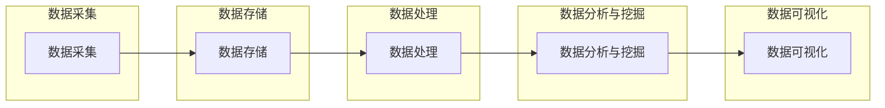

                 

### 引言

在现代物流管理中，信息差是一个至关重要的概念。它指的是在物流网络中，不同环节、不同角色之间所掌握的信息不对称。例如，仓库管理人员可能不清楚某个商品在途中的具体位置，而配送人员可能不了解某一区域的需求量。这种信息差不仅会导致物流操作的低效，还可能增加成本和延误交货时间。

随着大数据技术的发展，利用大数据分析来解决物流管理中的信息差问题，成为一种新的趋势。大数据能够收集、存储和分析海量物流数据，从而帮助管理者更准确地预测需求、优化库存、规划运输路线和配送方案。本篇文章将深入探讨大数据在物流管理中的应用，旨在揭示其潜力以及实际应用中的挑战和解决方案。

本文将按以下结构展开：

1. **信息差与物流管理概述**：介绍信息差的概念及其在物流管理中的重要性。
2. **大数据在物流管理中的应用场景**：分析大数据在仓储管理、运输管理和配送管理中的具体应用。
3. **核心概念与联系**：探讨物流管理基本流程、大数据基本概念及其在物流管理中的核心应用。
4. **大数据与物流管理架构**：描述大数据在物流管理中的应用架构，并提供架构的 Mermaid 流程图。
5. **核心算法原理讲解**：介绍物流管理大数据算法原理，包括数据采集与处理、数据分析和数据挖掘。
6. **数学模型和数学公式**：讲解物流管理大数据中的数学模型和公式。
7. **项目实战**：通过实际案例展示大数据在物流管理中的应用。
8. **附录**：列出物流管理大数据开发工具与资源。

通过以上结构的阐述，我们将对大数据在物流管理中的应用进行系统性分析，帮助读者更好地理解和应用这一先进技术。

### 第一部分：引言

在现代物流管理中，信息差是一个至关重要的概念。它指的是在物流网络中，不同环节、不同角色之间所掌握的信息不对称。例如，仓库管理人员可能不清楚某个商品在途中的具体位置，而配送人员可能不了解某一区域的需求量。这种信息差不仅会导致物流操作的低效，还可能增加成本和延误交货时间。

随着大数据技术的发展，利用大数据分析来解决物流管理中的信息差问题，成为一种新的趋势。大数据能够收集、存储和分析海量物流数据，从而帮助管理者更准确地预测需求、优化库存、规划运输路线和配送方案。本篇文章将深入探讨大数据在物流管理中的应用，旨在揭示其潜力以及实际应用中的挑战和解决方案。

本篇文章的结构如下：

1. **信息差与物流管理概述**：介绍信息差的概念及其在物流管理中的重要性。
2. **大数据在物流管理中的应用场景**：分析大数据在仓储管理、运输管理和配送管理中的具体应用。
3. **核心概念与联系**：探讨物流管理基本流程、大数据基本概念及其在物流管理中的核心应用。
4. **大数据与物流管理架构**：描述大数据在物流管理中的应用架构，并提供架构的 Mermaid 流程图。
5. **核心算法原理讲解**：介绍物流管理大数据算法原理，包括数据采集与处理、数据分析和数据挖掘。
6. **数学模型和数学公式**：讲解物流管理大数据中的数学模型和公式。
7. **项目实战**：通过实际案例展示大数据在物流管理中的应用。
8. **附录**：列出物流管理大数据开发工具与资源。

通过以上结构的阐述，我们将对大数据在物流管理中的应用进行系统性分析，帮助读者更好地理解和应用这一先进技术。

### 信息差与物流管理概述

#### 什么是信息差

信息差，即信息不对称，是指在某个系统或环境中，不同个体或角色之间所掌握的信息存在差异。在物流管理中，信息差可能表现为以下几个方面：

1. **库存信息不对称**：仓库管理人员可能无法实时获取某一商品的具体库存量，导致库存过剩或短缺。
2. **运输信息不对称**：不同运输环节之间可能缺乏有效的信息沟通，导致运输延误或资源浪费。
3. **配送信息不对称**：配送人员可能不清楚某一区域的实际需求，导致配送资源的不合理分配。

这种信息不对称不仅会降低物流运作效率，还会增加运营成本和客户满意度下降的风险。

#### 信息差在物流管理中的重要性

信息差对物流管理的影响是深远而广泛的。以下是几个关键点：

1. **效率提升**：通过消除信息差，物流管理者可以更准确地掌握库存、运输和配送的状态，从而优化操作流程，提高整体效率。
2. **成本控制**：信息差的存在往往会导致资源浪费和成本增加。例如，库存不足可能导致缺货成本，库存过剩则可能产生存储成本。通过大数据分析，可以精准预测需求，从而有效控制成本。
3. **客户满意度**：及时、准确的信息传递能够提高配送的准确性和时效性，进而提升客户满意度。在电子商务时代，客户期望快速、高效的物流服务，信息差的减少有助于满足这些需求。
4. **风险防范**：信息差可能导致物流过程中的信息断层，使得管理者无法及时应对突发情况。大数据分析能够提供实时数据支持，帮助管理者提前预判和防范风险。

#### 信息差与物流管理的关系

物流管理是一个复杂的过程，涉及多个环节和角色的协同作业。信息差在这个过程中的作用如下：

1. **供应链协同**：信息差的存在可能导致供应链各环节之间的信息断层，影响供应链的整体协同效率。通过大数据分析，可以促进信息共享，提升供应链的协同水平。
2. **决策支持**：物流管理者需要准确的信息来做出决策。大数据分析能够提供丰富的数据支持，帮助管理者从全局角度审视问题，做出更加科学的决策。
3. **流程优化**：通过分析物流过程中的信息差，可以发现和解决流程中的瓶颈问题，优化物流操作流程，提高整体运作效率。

总之，信息差是影响物流管理效率和质量的重要因素。利用大数据技术，可以有效地缩小信息差，提升物流管理的整体水平。

### 大数据在物流管理中的应用场景

随着大数据技术的发展，物流管理领域也迎来了新的变革。大数据在物流管理中的应用场景丰富多样，涵盖了仓储管理、运输管理和配送管理等多个方面。以下将详细探讨大数据在这些应用场景中的具体表现和作用。

#### 仓储管理

仓储管理是物流管理的核心环节之一。在大数据技术的支持下，仓储管理可以实现以下几个方面：

1. **库存优化**：通过大数据分析，可以实时监控库存状态，预测未来需求，从而优化库存水平。具体来说，大数据算法可以根据历史销售数据、季节性需求等指标，对库存进行动态调整，减少库存过剩或短缺的情况。

2. **库存可视化**：大数据技术可以整合各类仓储数据，通过可视化工具将库存信息直观展示给管理者。这种方式不仅提高了信息透明度，还能够帮助管理者快速定位库存问题，及时采取措施。

3. **库存预测**：基于大数据分析，可以建立库存预测模型，预测未来的库存需求。这些模型通常采用机器学习和预测算法，可以处理大量历史数据，并提供精准的预测结果。

以下是一个库存优化的伪代码示例：

```python
# 假设我们有一个历史销售数据集sales_data，以及一些季节性指标seasonal_factors
# 我们可以使用线性回归模型预测未来需求

from sklearn.linear_model import LinearRegression

# 准备数据
X = sales_data.join(seasonal_factors)
y = sales_data['demand']

# 建立模型
model = LinearRegression()
model.fit(X, y)

# 预测未来需求
future_demand = model.predict(X_future)
```

#### 运输管理

运输管理是物流管理中的重要一环，直接影响物流成本和时效。大数据在运输管理中的应用包括以下几个方面：

1. **运输路线优化**：通过大数据分析，可以找到最优的运输路线，减少运输时间和成本。这通常涉及到路径规划算法，如遗传算法或蚁群算法。

2. **运输成本优化**：大数据分析可以帮助管理者了解不同运输方式的成本结构，从而选择最经济的运输方案。

3. **运输时效预测**：通过分析历史运输数据，可以预测未来的运输时效，帮助管理者合理安排运输计划，避免延误。

以下是一个运输路线优化的伪代码示例：

```python
# 假设我们有一个运输网络和运输成本数据
# 使用遗传算法进行路线优化

from genetic_algorithm import GeneticAlgorithm

# 定义问题参数
population_size = 100
crossover_rate = 0.8
mutation_rate = 0.1

# 初始化遗传算法
ga = GeneticAlgorithm(population_size, crossover_rate, mutation_rate)

# 执行遗传算法
best_solution = ga.run()

# 输出最优路线
print(best_solution.route)
```

#### 配送管理

配送管理是物流管理的最后一步，直接关系到客户满意度。大数据在配送管理中的应用包括以下几个方面：

1. **配送路线优化**：通过大数据分析，可以优化配送路线，减少配送时间和成本。这通常涉及到路径规划算法，如基于最近邻算法或最短路径算法。

2. **配送时效预测**：通过分析历史配送数据，可以预测未来的配送时效，帮助管理者合理安排配送计划，提高配送效率。

3. **配送成本优化**：大数据分析可以帮助管理者了解不同配送方式的成本结构，从而选择最经济的配送方案。

以下是一个配送路线优化的伪代码示例：

```python
# 假设我们有一个配送网络和配送成本数据
# 使用最近邻算法进行路线优化

from nearest_neighbor import NearestNeighbor

# 初始化最近邻算法
nn = NearestNeighbor()

# 执行算法
route = nn.solve()

# 输出最优路线
print(route)
```

通过以上示例，我们可以看到大数据技术如何具体应用于物流管理的各个场景中。这些应用不仅提高了物流运作的效率和质量，还显著降低了成本，提高了客户满意度。在接下来的章节中，我们将进一步探讨大数据与物流管理之间的核心概念和联系，以及如何构建高效的物流管理大数据架构。

### 第二部分：核心概念与联系

在深入探讨大数据在物流管理中的应用之前，有必要明确一些核心概念，并理解这些概念之间的联系。本章节将详细介绍物流管理的基本流程、大数据的基本概念，以及大数据在物流管理中的核心应用。

#### 物流管理基本流程

物流管理的基本流程通常包括以下几个关键环节：

1. **计划**：根据订单需求和市场预测，制定物流计划。这一环节需要综合考虑库存水平、运输能力和配送需求。
2. **采购**：采购原材料和商品，确保物流操作的顺利进行。
3. **仓储**：仓储管理包括商品的入库、储存和出库操作。仓储管理中的信息差主要体现在库存管理和商品定位上。
4. **运输**：根据物流计划，将商品从供应商或仓库运输到目的地。运输管理中的信息差主要涉及运输路线和运输时效。
5. **配送**：将商品配送到最终客户。配送管理中的信息差主要体现在配送路线和配送时效上。
6. **跟踪**：实时监控物流全过程，确保物流操作的透明性和可追溯性。

通过这些基本流程，物流管理能够有效地将商品从生产地运送到消费者手中，确保物流运作的高效和有序。

#### 大数据基本概念

大数据（Big Data）指的是规模巨大、类型多样的数据集合，无法通过传统数据处理工具进行分析。大数据的基本概念包括以下几个方面：

1. **数据量（Volume）**：大数据的一个重要特征是其数据量庞大，通常达到PB级别。这些数据来自各种渠道，如传感器、社交媒体、交易记录等。
2. **数据类型（Variety）**：大数据不仅包括结构化数据，还涵盖非结构化数据和半结构化数据，如文本、图像、音频等。
3. **数据速度（Velocity）**：大数据处理需要高速处理能力，以实时或近实时的速度处理和分析数据。
4. **数据价值（Value）**：大数据的价值在于其能够从海量数据中发现有价值的信息和模式，从而支持决策。

大数据的基本概念决定了其处理和分析方法的复杂性，需要借助先进的技术和方法来处理这些数据。

#### 大数据在物流管理中的核心应用

大数据在物流管理中的核心应用主要体现在以下几个方面：

1. **需求预测**：通过分析历史销售数据、市场趋势和季节性因素，可以准确预测未来的需求，从而优化库存和运输计划。
2. **库存管理**：通过大数据分析，可以实时监控库存状态，预测库存需求，优化库存水平，减少库存过剩或短缺的情况。
3. **运输优化**：大数据技术可以帮助优化运输路线，选择最佳运输方式，降低运输成本，提高运输效率。
4. **配送优化**：通过分析历史配送数据，可以优化配送路线，预测配送时效，确保配送的准确性和时效性。
5. **风险管理**：大数据分析可以帮助物流管理者提前预判和防范物流过程中的风险，如运输延误、库存短缺等。

综上所述，物流管理的基本流程和大数据的基本概念构成了大数据在物流管理中的应用基础。理解这些核心概念和联系，有助于我们更好地利用大数据技术提升物流管理的效率和质量。在接下来的章节中，我们将进一步探讨大数据在物流管理中的应用架构，以及如何通过具体算法和数学模型实现这些应用。

### 大数据与物流管理架构

要实现大数据在物流管理中的高效应用，必须构建一个合理的大数据架构。这个架构需要涵盖数据采集、存储、处理、分析和可视化等各个环节，确保物流数据能够从产生到分析的全过程都得到妥善管理。以下是大数据在物流管理中的应用架构及其关键组件的详细描述。

#### 应用架构

大数据在物流管理中的应用架构通常可以分为以下几个层次：

1. **数据采集层**：负责从各个物流节点（如仓库、运输车辆、配送站点等）收集原始数据。
2. **数据存储层**：用于存储大量的物流数据，包括结构化数据（如订单、库存）和非结构化数据（如图像、视频）。
3. **数据处理层**：负责对存储的数据进行清洗、转换和整合，为数据分析和挖掘提供高质量的数据。
4. **数据分析与挖掘层**：利用各种算法和技术对数据进行分析和挖掘，提取有价值的信息和洞见。
5. **数据可视化层**：通过可视化工具将分析结果以直观的形式呈现，帮助管理者进行决策。

#### 架构组件

1. **数据采集组件**：包括各种传感器、RFID、GPS等技术，用于实时收集物流节点上的数据。例如，仓库中的货架传感器可以实时监控库存状态，运输车辆中的GPS可以记录行驶路线和速度。

2. **数据存储组件**：通常采用分布式存储系统，如Hadoop、NoSQL数据库等，能够处理海量数据的高效存储。Hadoop的HDFS（Hadoop Distributed File System）是一个典型的分布式存储系统，适用于存储大规模的物流数据。

3. **数据处理组件**：包括数据清洗、数据转换和数据整合等工具。例如，使用Hadoop的MapReduce编程模型可以对海量物流数据进行清洗和转换。此外，Elasticsearch等搜索引擎可以用于数据的快速检索和整合。

4. **数据分析与挖掘组件**：包括各种机器学习算法、数据挖掘工具和预测模型。例如，使用随机森林算法进行需求预测，使用K-means聚类算法进行运输路径优化。

5. **数据可视化组件**：包括数据可视化工具和仪表盘。例如，使用Tableau或Power BI等工具，将物流数据以图表、地图等形式直观展示，帮助管理者快速理解和分析数据。

#### Mermaid流程图

以下是一个简化的Mermaid流程图，展示了大数据在物流管理中的应用架构：



通过以上架构和组件的协同工作，大数据在物流管理中能够实现高效的数据采集、存储、处理、分析和可视化，从而帮助物流管理者更好地进行决策和优化，提升物流运作的整体效率。

### 第三部分：核心算法原理讲解

在物流管理中，大数据的核心算法原理发挥着至关重要的作用。这些算法不仅能够处理海量物流数据，还能从中提取有价值的信息，帮助管理者进行科学的决策和优化。本章节将详细介绍大数据在物流管理中的核心算法原理，包括数据采集与处理、数据分析和数据挖掘。

#### 数据采集与处理

数据采集与处理是大数据分析的基础，决定了数据的质量和可用性。以下是几个关键步骤：

1. **数据采集**：物流数据来源于各种传感器、RFID标签、GPS设备等。采集的数据包括库存状态、运输路线、配送时效等。例如，使用GPS设备可以实时获取运输车辆的地理位置和行驶速度。

2. **数据清洗**：采集到的数据往往存在噪声、缺失值和不一致的情况。数据清洗的目的是去除这些噪声，填补缺失值，并统一数据格式。常用的数据清洗方法包括缺失值填补、数据转换和数据去重。

3. **数据预处理**：在数据分析和挖掘之前，通常需要对数据进行预处理。预处理步骤包括特征提取、数据标准化和特征选择等。特征提取可以从原始数据中提取出有用的特征，如时间序列数据中的趋势和季节性。数据标准化是将不同特征缩放到同一尺度，以消除尺度差异对分析结果的影响。特征选择则是从大量特征中挑选出对分析任务最有影响力的特征，减少数据维度。

以下是一个数据清洗和预处理流程的伪代码示例：

```python
# 假设我们有一个包含物流数据的DataFrame
import pandas as pd

# 数据清洗
data = pd.read_csv('logistics_data.csv')
data = data.dropna()  # 去除缺失值
data = data[data['location'] != 'unknown']  # 去除无效值

# 数据预处理
data['time'] = pd.to_datetime(data['time'])
data['speed'] = data['speed'].astype(float)
data['distance'] = data['speed'] * (data['time'].diff().dt.seconds).astype(float)
```

#### 数据分析

数据分析是大数据分析的核心步骤，旨在从海量数据中提取有价值的信息。以下是几个常用的数据分析方法：

1. **描述性统计分析**：通过计算数据的均值、中位数、标准差等统计量，对数据进行初步分析。描述性统计分析可以帮助管理者了解数据的分布特征和基本趋势。

2. **相关性分析**：通过计算变量之间的相关性，分析数据之间的关联性。例如，分析运输时间和配送成本之间的关系，可以帮助管理者优化运输计划，降低成本。

3. **时间序列分析**：针对时间序列数据，分析其趋势、季节性和周期性。时间序列分析可以用于预测未来的物流需求，为库存管理和运输规划提供依据。

以下是一个时间序列分析预测未来物流需求的伪代码示例：

```python
# 假设我们有一个时间序列数据集
import pandas as pd
from statsmodels.tsa.arima_model import ARIMA

data = pd.read_csv('logistics_demand.csv')
data['date'] = pd.to_datetime(data['date'])
data.set_index('date', inplace=True)

# 建立ARIMA模型
model = ARIMA(data['demand'], order=(5, 1, 2))
model_fit = model.fit()

# 预测未来需求
forecast = model_fit.forecast(steps=6)
print(forecast)
```

#### 数据挖掘

数据挖掘是从大量数据中提取出潜在有用信息的过程。以下是一些常用的数据挖掘方法：

1. **聚类分析**：将相似的数据归为一类，用于市场细分、运输路径规划等。常用的聚类算法包括K-means、层次聚类等。

2. **分类与回归**：通过建立分类或回归模型，对未知数据进行分类或预测。常用的算法包括决策树、随机森林、支持向量机等。

3. **关联规则挖掘**：通过发现数据之间的关联规则，用于推荐系统、需求预测等。常用的算法包括Apriori算法、Eclat算法等。

以下是一个使用Apriori算法进行关联规则挖掘的伪代码示例：

```python
# 假设我们有一个交易数据集
import pandas as pd
from mlxtend.frequent_patterns import apriori
from mlxtend.frequent_patterns import association_rules

data = pd.read_csv('logistics_transactions.csv')
data['transaction'] = data['item_id'].astype(str)

# 计算频繁项集
frequent_itemsets = apriori(data['transaction'], min_support=0.1, use_colnames=True)

# 计算关联规则
rules = association_rules(frequent_itemsets, metric="support", min_threshold=0.5)
print(rules)
```

通过以上核心算法的讲解，我们可以看到大数据在物流管理中的应用是如何实现数据采集与处理、数据分析和数据挖掘的。这些算法不仅提高了物流管理的效率和质量，还为管理者提供了科学的决策依据。在接下来的章节中，我们将进一步探讨大数据在物流管理中的数学模型和公式，为数据分析和优化提供更深入的指导。

### 第四部分：数学模型和数学公式

在物流管理中，数学模型和数学公式是分析和优化物流操作的重要工具。通过这些模型和公式，我们可以更科学地预测需求、优化库存、规划运输路线和配送方案。以下是物流管理中常用的一些数学模型和公式，以及具体的解释和举例说明。

#### 库存优化数学模型

库存优化是物流管理中的重要一环，旨在确保库存量既能满足市场需求，又不会造成过多浪费。以下是一些常用的库存优化数学模型：

1. **最小化库存成本模型**：该模型的目标是最小化库存成本，包括采购成本、存储成本和缺货成本。

   公式：
   $$
   C = C_p + C_i
   $$
   其中，$C_p$表示采购成本，$C_i$表示存储成本。

   解释：假设我们有一个商品，其采购成本为$C_p$，存储成本为$C_i$。为了最小化总成本，我们需要找到一个最优的采购量和存储量，使得总成本最小。

   举例说明：如果一个商品的采购成本是每单位100元，存储成本是每单位10元，那么我们可以通过计算总成本来确定最优库存量。例如，当采购量为1000单位时，总成本为$C = 100 \times 1000 + 10 \times 1000 = 110000$元。

2. **最大库存容量模型**：该模型的目标是确定仓库的最大库存容量，以防止库存溢出。

   公式：
   $$
   C_{max} = C_p + C_i \times t
   $$
   其中，$C_{max}$表示最大库存容量，$C_p$表示采购成本，$C_i$表示存储成本，$t$表示时间周期。

   解释：假设我们有一个仓库，每周期采购成本为$C_p$，存储成本为$C_i$，周期时间为$t$。为了确定仓库的最大库存容量，我们需要计算$C_{max}$。

   举例说明：如果一个仓库每周期采购成本是1000元，存储成本是100元，周期时间为1个月，那么仓库的最大库存容量为$C_{max} = 1000 + 100 \times 1 = 1100$元。

#### 运输管理数学模型

运输管理中的数学模型用于优化运输路线、降低运输成本和提高运输效率。以下是一些常用的运输管理数学模型：

1. **最小化运输成本模型**：该模型的目标是最小化总运输成本。

   公式：
   $$
   T = D + D_p
   $$
   其中，$T$表示总运输成本，$D$表示固定成本，$D_p$表示变动成本。

   解释：假设我们有一个运输任务，固定成本为$D$，每单位运输的变动成本为$D_p$。为了最小化总运输成本，我们需要找到一个最优的运输量和运输路线。

   举例说明：如果一个运输任务的固定成本是1000元，每单位运输的变动成本是10元，那么当运输量为100单位时，总运输成本为$T = 1000 + 10 \times 100 = 1100$元。

2. **最优化运输路线模型**：该模型的目标是找到最优的运输路线，以减少运输时间和成本。

   公式：
   $$
   \min Z = D_1 + D_2 + ... + D_n
   $$
   其中，$Z$表示总运输距离，$D_i$表示从起点到第$i$个节点的运输距离。

   解释：假设我们有一个运输网络，起点为$A$，终点为$B$，其他节点为$C_1, C_2, ..., C_n$。为了最小化总运输距离，我们需要找到一个最优的运输路线。

   举例说明：假设起点到每个节点的运输距离如下：
   $$
   D_1 = 10, D_2 = 15, D_3 = 20, D_4 = 25
   $$
   那么最优运输路线为$A \rightarrow C_1 \rightarrow C_2 \rightarrow C_3 \rightarrow C_4 \rightarrow B$，总运输距离为$Z = 10 + 15 + 20 + 25 = 80$。

#### 配送管理数学模型

配送管理中的数学模型用于优化配送路线、提高配送时效和降低配送成本。以下是一些常用的配送管理数学模型：

1. **最小化配送成本模型**：该模型的目标是最小化总配送成本。

   公式：
   $$
   C = C_d + C_p
   $$
   其中，$C$表示总配送成本，$C_d$表示配送固定成本，$C_p$表示配送变动成本。

   解释：假设我们有一个配送任务，配送固定成本为$C_d$，每单位配送的变动成本为$C_p$。为了最小化总配送成本，我们需要找到一个最优的配送量和配送路线。

   举例说明：如果一个配送任务的配送固定成本是1000元，每单位配送的变动成本是10元，那么当配送量为100单位时，总配送成本为$C = 1000 + 10 \times 100 = 1100$元。

2. **最优化配送路线模型**：该模型的目标是找到最优的配送路线，以减少配送时间和成本。

   公式：
   $$
   \min Z = D_1 + D_2 + ... + D_n
   $$
   其中，$Z$表示总配送距离，$D_i$表示从起点到第$i$个节点的配送距离。

   解释：假设我们有一个配送网络，起点为$A$，终点为$B$，其他节点为$C_1, C_2, ..., C_n$。为了最小化总配送距离，我们需要找到一个最优的配送路线。

   举例说明：假设起点到每个节点的配送距离如下：
   $$
   D_1 = 10, D_2 = 15, D_3 = 20, D_4 = 25
   $$
   那么最优配送路线为$A \rightarrow C_1 \rightarrow C_2 \rightarrow C_3 \rightarrow C_4 \rightarrow B$，总配送距离为$Z = 10 + 15 + 20 + 25 = 80$。

通过以上数学模型和公式的讲解，我们可以看到数学在物流管理中的应用是如何帮助我们优化操作、降低成本和提高效率的。在接下来的章节中，我们将通过实际项目案例展示这些数学模型和公式在物流管理中的具体应用。

### 第五部分：项目实战

在了解了大数据在物流管理中的应用原理和数学模型之后，通过实际项目案例来展示这些理论在实际操作中的具体应用，将有助于我们更好地理解和掌握这一先进技术。以下将详细描述一个典型的物流管理大数据项目实战，包括项目背景与目标、开发环境搭建、项目开发流程，以及仓储管理、运输管理和配送管理项目实战。

#### 项目背景与目标

本项目旨在通过大数据技术优化一个电子商务平台的物流管理，提高物流运作效率、降低成本并提升客户满意度。项目目标包括：

1. **需求预测**：通过大数据分析，准确预测未来需求，优化库存和运输计划。
2. **库存管理**：实现库存动态调整，减少库存过剩和短缺现象。
3. **运输优化**：优化运输路线和运输方式，降低运输成本和提高运输效率。
4. **配送优化**：优化配送路线和配送时效，提高配送准确性和客户满意度。

#### 开发环境搭建

在开始项目开发之前，我们需要搭建一个合适的开发环境。以下是一个典型的开发环境搭建流程：

1. **硬件环境**：配置高性能服务器和存储设备，用于存储和处理海量物流数据。
2. **软件环境**：
   - 数据采集工具：使用Python、Java等编程语言开发数据采集脚本，采集来自仓库、运输车辆和配送站点的数据。
   - 数据存储工具：使用Hadoop HDFS、HBase等分布式存储系统存储物流数据。
   - 数据处理工具：使用Apache Spark、Flink等大数据处理框架进行数据清洗、转换和整合。
   - 数据分析与挖掘工具：使用R、Python等编程语言，结合机器学习库（如scikit-learn、TensorFlow等），进行数据分析和挖掘。
   - 数据可视化工具：使用Tableau、Power BI等数据可视化工具，将分析结果以图表、地图等形式展示。

#### 项目开发流程

项目开发流程通常包括以下步骤：

1. **需求分析**：与业务团队沟通，明确项目目标和需求。
2. **数据采集**：编写采集脚本，从各个物流节点采集数据。
3. **数据存储**：将采集到的数据存储到分布式存储系统中。
4. **数据处理**：使用大数据处理框架对数据进行清洗、转换和整合。
5. **数据分析与挖掘**：使用机器学习算法对数据进行分析和挖掘，提取有价值的信息。
6. **数据可视化**：将分析结果以可视化形式展示，帮助管理者进行决策。
7. **系统集成**：将大数据分析结果集成到电子商务平台中，实现实时物流管理和优化。

#### 仓储管理项目实战

仓储管理项目实战包括以下步骤：

1. **数据采集与预处理**：采集仓储节点数据，包括库存量、入库和出库记录等。对数据进行清洗和预处理，去除噪声和缺失值。
2. **数据分析与挖掘**：使用聚类算法（如K-means）对库存量进行分类，分析不同类别库存的特点和需求规律。使用时间序列预测模型（如ARIMA）预测未来库存需求。
3. **结果分析与优化**：根据预测结果，动态调整库存水平，优化库存策略，减少库存过剩和短缺现象。

以下是一个使用ARIMA模型预测未来库存需求的伪代码示例：

```python
# 导入必要库
import pandas as pd
from statsmodels.tsa.arima_model import ARIMA

# 读取数据
data = pd.read_csv('inventory_data.csv')
data['date'] = pd.to_datetime(data['date'])
data.set_index('date', inplace=True)

# 建立ARIMA模型
model = ARIMA(data['quantity'], order=(5, 1, 2))
model_fit = model.fit()

# 预测未来库存需求
forecast = model_fit.forecast(steps=6)
print(forecast)
```

#### 运输管理项目实战

运输管理项目实战包括以下步骤：

1. **数据采集与预处理**：采集运输节点数据，包括运输路线、运输时间和运输成本等。对数据进行清洗和预处理，去除噪声和缺失值。
2. **数据分析与挖掘**：使用路径规划算法（如遗传算法）优化运输路线，选择最佳运输方案。使用决策树或随机森林算法分析不同运输方式的成本和效率。
3. **结果分析与优化**：根据分析结果，选择最优运输路线和运输方式，优化运输成本和提高运输效率。

以下是一个使用遗传算法优化运输路线的伪代码示例：

```python
# 导入必要库
from genetic_algorithm import GeneticAlgorithm

# 定义问题参数
population_size = 100
crossover_rate = 0.8
mutation_rate = 0.1

# 初始化遗传算法
ga = GeneticAlgorithm(population_size, crossover_rate, mutation_rate)

# 执行遗传算法
best_solution = ga.run()

# 输出最优路线
print(best_solution.route)
```

#### 配送管理项目实战

配送管理项目实战包括以下步骤：

1. **数据采集与预处理**：采集配送节点数据，包括配送路线、配送时间和配送成本等。对数据进行清洗和预处理，去除噪声和缺失值。
2. **数据分析与挖掘**：使用路径规划算法（如最近邻算法）优化配送路线，选择最佳配送方案。使用决策树或随机森林算法分析不同配送方式的成本和效率。
3. **结果分析与优化**：根据分析结果，选择最优配送路线和配送方式，优化配送成本和提高配送效率。

以下是一个使用最近邻算法优化配送路线的伪代码示例：

```python
# 导入必要库
from nearest_neighbor import NearestNeighbor

# 初始化最近邻算法
nn = NearestNeighbor()

# 执行算法
route = nn.solve()

# 输出最优路线
print(route)
```

通过以上项目实战的详细描述，我们可以看到大数据技术在物流管理中的具体应用，包括数据采集、存储、处理、分析和优化等各个环节。这些实战案例不仅展示了大数据技术的实际应用效果，也为物流管理者提供了科学的决策依据。在未来的实践中，随着大数据技术的不断发展，物流管理将变得更加智能化和高效化。

### 附录

在物流管理大数据开发中，选择合适的工具和资源是确保项目顺利进行的重要一环。以下列出了一些常用的数据采集与处理工具、数据分析与挖掘工具、数据可视化工具以及其他开发工具和资源，以供参考。

#### 数据采集与处理工具

1. **Elasticsearch**：一款高性能、可扩展的全文搜索引擎，适用于大规模数据的快速检索和分析。
2. **Apache Kafka**：一款分布式流处理平台，用于实时数据采集和传输，能够高效处理大规模物流数据。
3. **Apache Flume**：一款分布式、可靠且可扩展的数据采集工具，适用于从多个数据源采集数据。
4. **Python Pandas**：一款强大的数据处理库，用于数据清洗、转换和分析。

#### 数据分析与挖掘工具

1. **Apache Spark**：一款快速且可扩展的大数据处理框架，支持多种数据分析算法。
2. **TensorFlow**：一款开源机器学习库，适用于构建和训练深度学习模型。
3. **scikit-learn**：一款经典的机器学习库，提供丰富的算法和工具，适用于分类、回归、聚类等任务。
4. **R**：一款统计编程语言，适用于数据分析和统计建模。

#### 数据可视化工具

1. **Tableau**：一款功能强大的数据可视化工具，支持多种数据源和分析类型。
2. **Power BI**：一款商业智能工具，能够将数据以可视化图表的形式展示，帮助管理者快速理解和分析数据。
3. **D3.js**：一款基于JavaScript的动态数据可视化库，适用于创建交互式数据可视化。

#### 其他开发工具与资源

1. **Docker**：一款容器化工具，用于打包和部署应用程序，提高开发效率和可移植性。
2. **Kubernetes**：一款开源容器编排平台，用于自动化部署、扩展和管理容器化应用程序。
3. **GitHub**：一款代码托管平台，适用于版本控制和协作开发。
4. **Jenkins**：一款持续集成和持续部署（CI/CD）工具，用于自动化构建、测试和部署应用程序。

通过以上工具和资源的合理应用，可以显著提升物流管理大数据项目的开发效率和质量。在实际项目中，可以根据需求和场景选择合适的工具和资源，以实现最佳的效果。

### 结尾

通过本文的深入探讨，我们全面解析了大数据在物流管理中的应用，涵盖了信息差的概念、大数据在物流管理中的应用场景、核心概念与联系、应用架构、核心算法原理、数学模型以及实际项目案例。我们展示了如何利用大数据技术优化物流管理，提升效率、降低成本、提高客户满意度。未来，随着大数据技术的不断发展，物流管理将变得更加智能化和高效化，为企业和消费者带来更多价值。让我们共同期待大数据在物流管理领域的更多创新和应用。作者：AI天才研究院/AI Genius Institute & 禅与计算机程序设计艺术 /Zen And The Art of Computer Programming。

